# L'Abruzzo in dettaglio

**Questa pagina è incompleta.** Alla raccolta mancano 3 dei 27 fascicoli
accertati della regione — **L'Aquila - Teramo, annate 88/89, 95/96 e 96/97** — e i dati che dipendono dall'esame diretto dell'esemplare sono
segnati in sospeso. Le copertine non reperite sono sostituite da un
segnaposto; nella griglia dei comuni le annate scoperte portano una croce e non una casella vuota,
perché vuoto significherebbe «non cartografato», che non è ciò che sappiamo. Per la stessa ragione la
pagina non è annunciata altrove nel sito, e vi si arriva soltanto per indirizzo.

Questa pagina si occupa di definire con estrema precisione l'organizzazione interna dei fascicoli
dell'intera regione Abruzzo.

Il censimento registra un totale di 27 fascicoli e 28 comuni cartografati.

<figure class="figura">
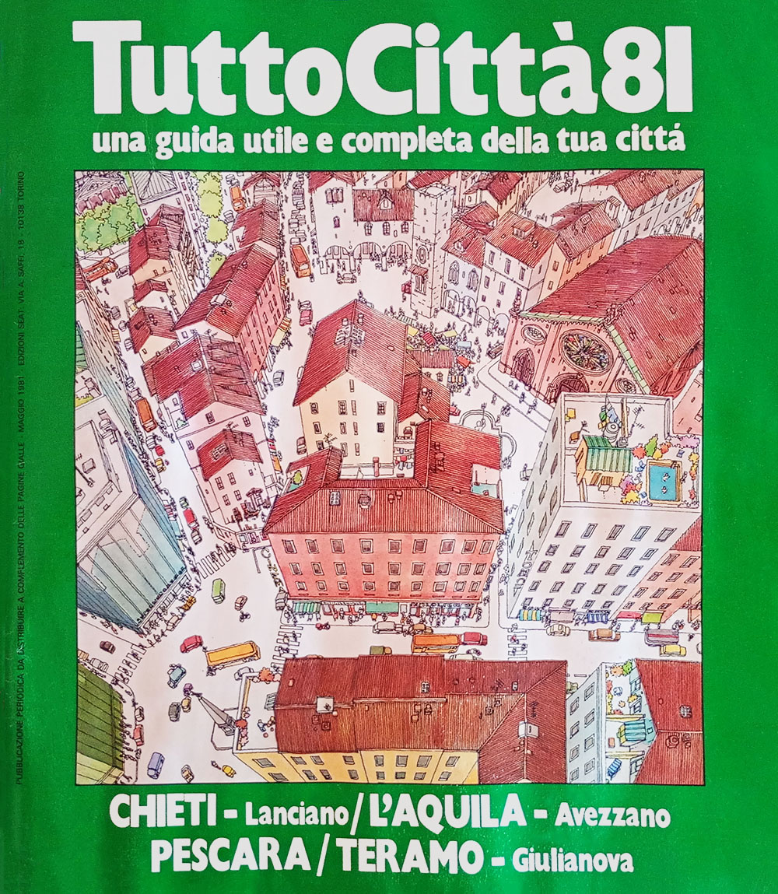
<figcaption>Copertina del fascicolo Chieti - L'Aquila - Pescara - Teramo 81</figcaption>
</figure>

[TOC]

## Tabella dei fascicoli

I fascicoli dell'Abruzzo appartenevano alla serie iniziale: il primo fascicolo, edito a maggio del
1981, era infatti intitolato *TuttoCittà 81*.

Alla fine degli anni '90 la pubblicazione dei fascicoli cessò per tutte le province.

La seguente tabella censisce i dati fondamentali dei fascicoli dell'Abruzzo, mostrandone le
copertine e indicandone il formato, il layout così come definito in [questa
pagina](tabella-layout.md), e il numero totale di pagine, anno per anno.

<table class="fascicoli-dettaglio">
<thead><tr><th>Annata</th><th>Colore tavole</th><th colspan="2">Copertine</th></tr></thead>
<tbody>
<tr><td class="ann"> 81/82</td><td class="tav"></td><td class="fasc">
Chieti - L'Aquila - Pescara - Teramo 81
<ul class="scheda"><li><b>Formato:</b> 246 x 280 mm</li><li><b>Copertina:</b> grossa</li><li><b>Layout:</b> TuttoCittà '80 con foto</li><li><b>Pagine:</b> 64</li><li><b>Mese aggiornamento:</b> maggio 1981</li><li><b>Note:</b> Nota dell'editore</li></ul></td><td class="fasc vuota"></td></tr>
<tr><td class="ann"> 82/83</td><td class="tav"></td><td class="fasc"><a href="../immagini/CHAQPETE82.jpg">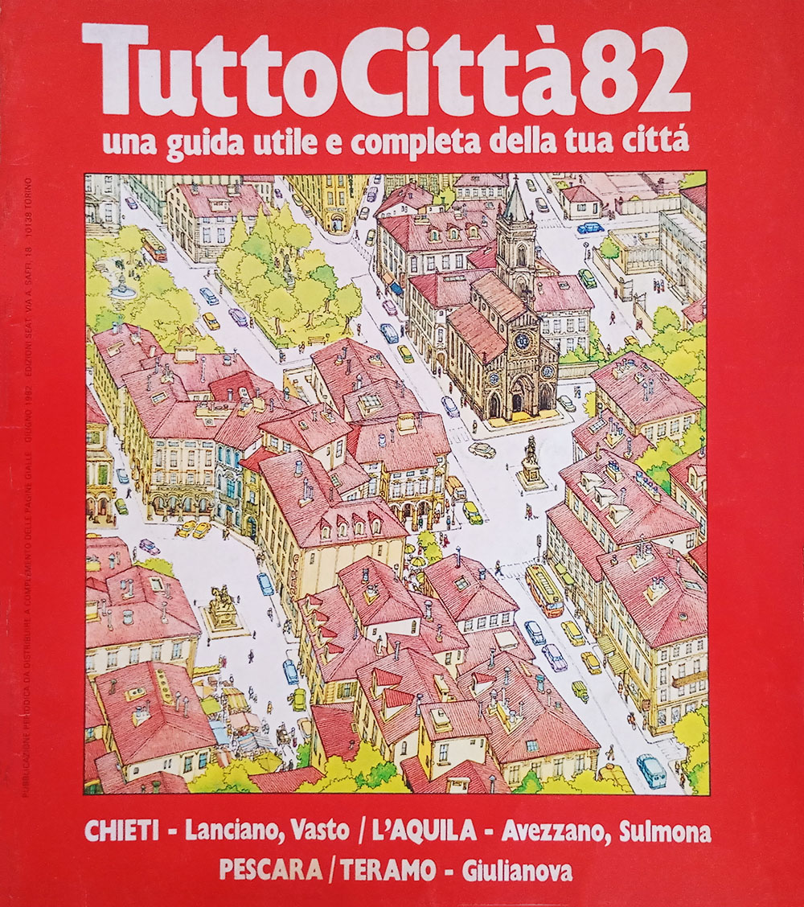</a>
Chieti - L'Aquila - Pescara - Teramo 82
<ul class="scheda"><li><b>Formato:</b> 246 x 280 mm</li><li><b>Copertina:</b> grossa</li><li><b>Layout:</b> TuttoCittà '80 classico</li><li><b>Pagine:</b> 64</li><li><b>Mese aggiornamento:</b> giugno 1982</li></ul></td><td class="fasc vuota"></td></tr>
<tr><td class="ann"> 83/84</td><td class="tav"></td><td class="fasc"><a href="../immagini/CHAQPETE83.jpg">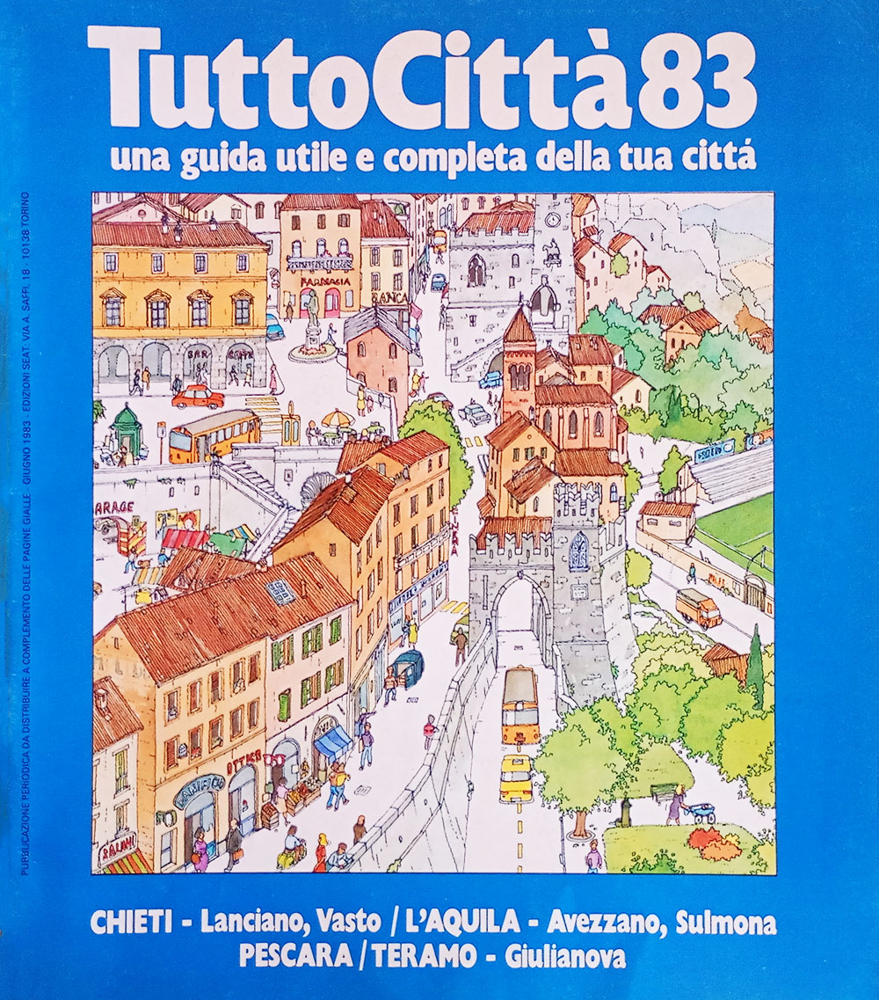</a>
Chieti - L'Aquila - Pescara - Teramo 83
<ul class="scheda"><li><b>Formato:</b> 246 x 280 mm</li><li><b>Copertina:</b> grossa</li><li><b>Layout:</b> TuttoCittà '80 classico</li><li><b>Pagine:</b> 64</li><li><b>Mese aggiornamento:</b> giugno 1983</li></ul></td><td class="fasc vuota"></td></tr>
<tr><td class="ann"> 84/85</td><td class="tav"></td><td class="fasc"><a href="../immagini/CHAQPETE84.jpg">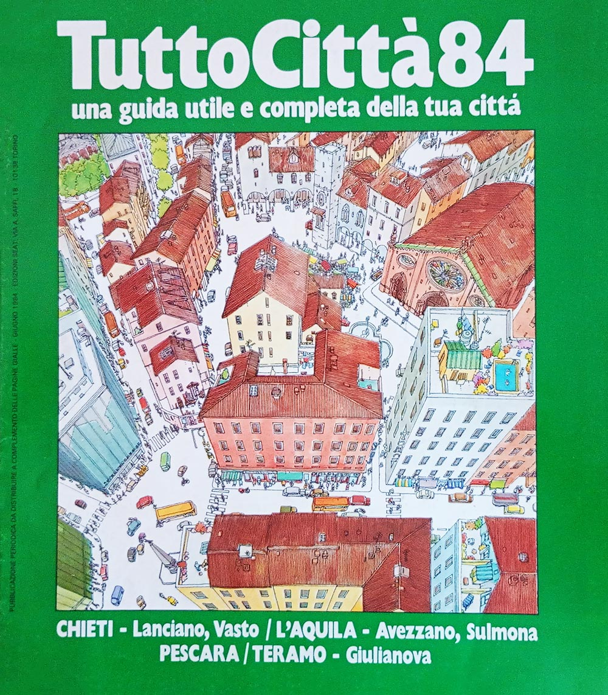</a>
Chieti - L'Aquila - Pescara - Teramo 84
<ul class="scheda"><li><b>Formato:</b> 246 x 280 mm</li><li><b>Copertina:</b> grossa</li><li><b>Layout:</b> TuttoCittà '80 classico</li><li><b>Pagine:</b> 72</li><li><b>Mese aggiornamento:</b> giugno 1984</li><li><b>Note:</b> Inserto Costituzione</li></ul></td><td class="fasc vuota"></td></tr>
<tr><td class="ann"> 85/86</td><td class="tav"></td><td class="fasc"><a href="../immagini/CHAQPETE85.jpg">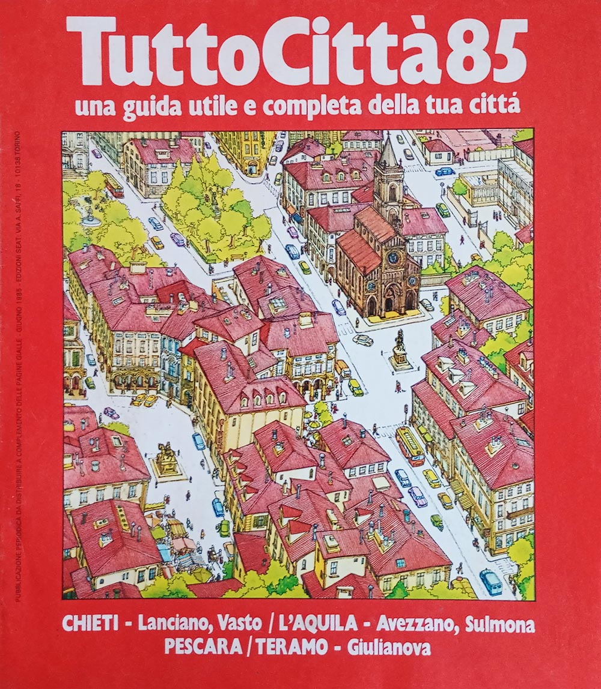</a>
Chieti - L'Aquila - Pescara - Teramo 85
<ul class="scheda"><li><b>Formato:</b> 246 x 280 mm</li><li><b>Copertina:</b> grossa</li><li><b>Layout:</b> TuttoCittà '80 classico</li><li><b>Pagine:</b> 64</li><li><b>Mese aggiornamento:</b> giugno 1985</li></ul></td><td class="fasc vuota"></td></tr>
<tr><td class="ann"> 86/87</td><td class="tav"></td><td class="fasc"><a href="../immagini/CHAQPETE86.jpg">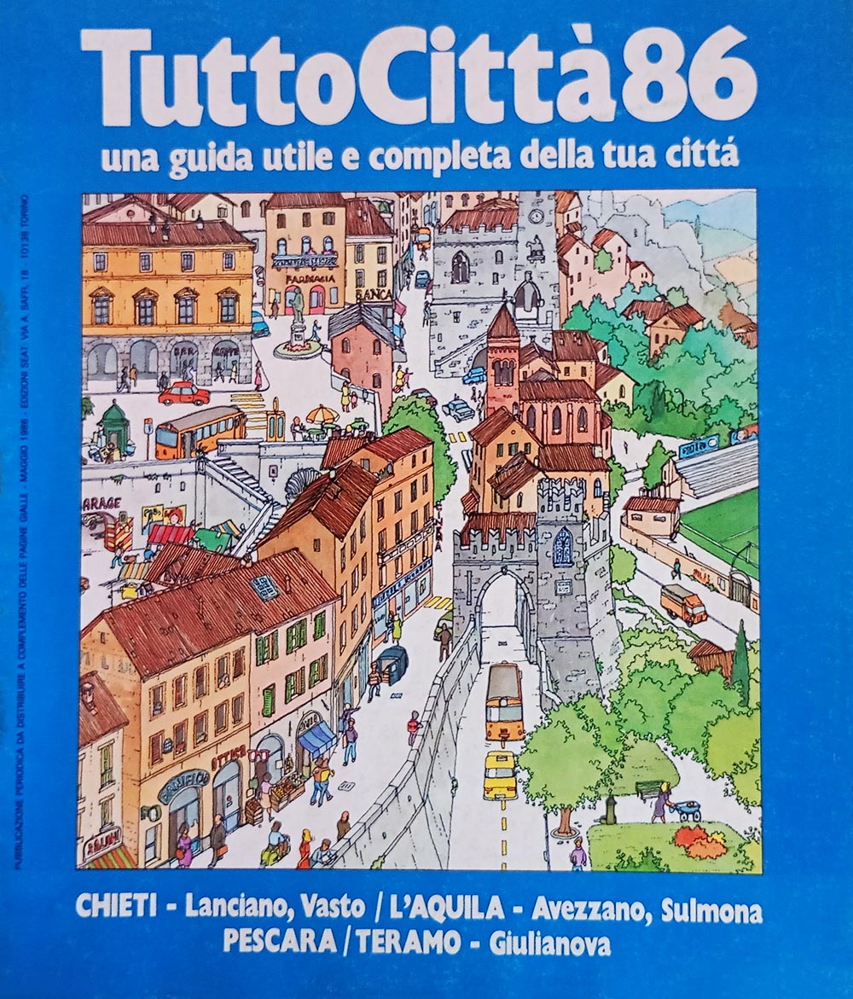</a>
Chieti - L'Aquila - Pescara - Teramo 86
<ul class="scheda"><li><b>Formato:</b> 246 x 280 mm</li><li><b>Copertina:</b> grossa</li><li><b>Layout:</b> TuttoCittà '80 classico</li><li><b>Pagine:</b> 64</li><li><b>Mese aggiornamento:</b> maggio 1986</li></ul></td><td class="fasc vuota"></td></tr>
<tr><td class="ann"> 87/88</td><td class="tav"></td><td class="fasc"><a href="../immagini/CHAQPETE87.jpg">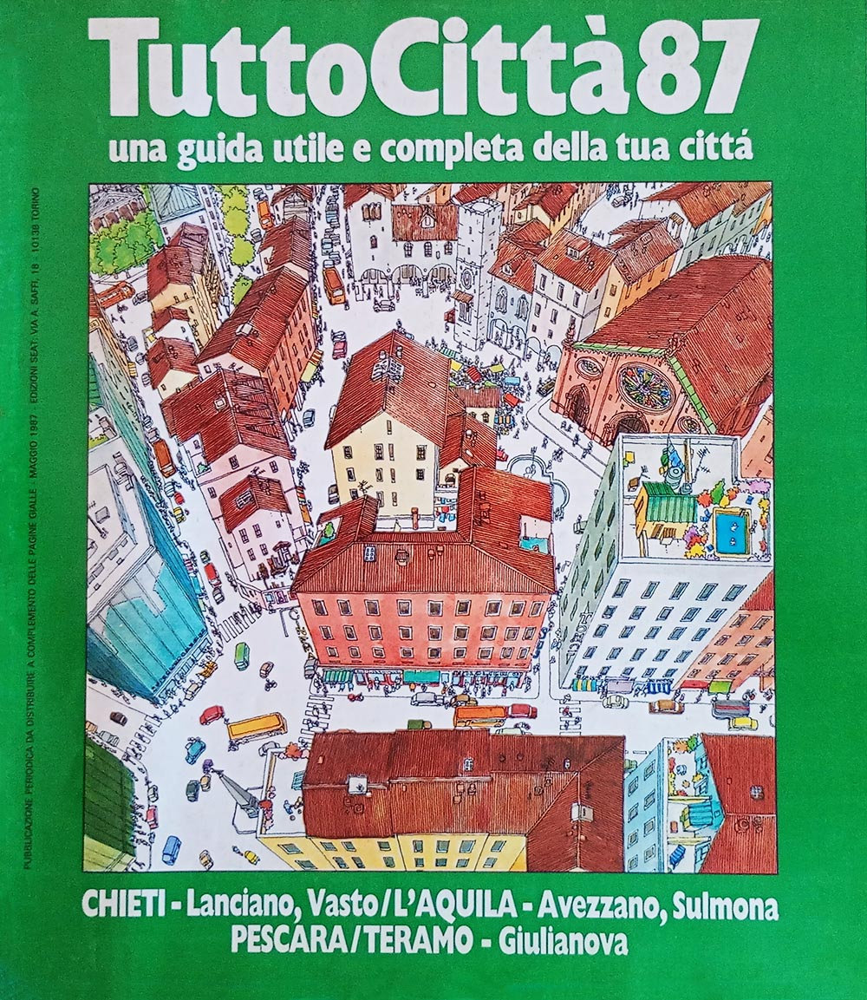</a>
Chieti - L'Aquila - Pescara - Teramo 87
<ul class="scheda"><li><b>Formato:</b> 246 x 280 mm</li><li><b>Copertina:</b> grossa</li><li><b>Layout:</b> TuttoCittà '80 classico</li><li><b>Pagine:</b> 64</li><li><b>Mese aggiornamento:</b> maggio 1987</li></ul></td><td class="fasc vuota"></td></tr>
<tr><td class="ann"> 88/89</td><td class="tav"></td><td class="fasc"><a href="../immagini/CHPE88.jpg">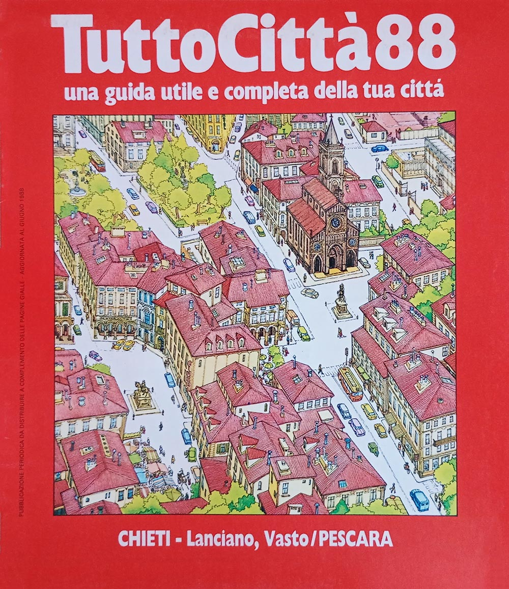</a>
Chieti - Pescara 88
<ul class="scheda"><li><b>Formato:</b> 246 x 280 mm</li><li><b>Copertina:</b> grossa</li><li><b>Layout:</b> TuttoCittà '80 classico</li><li><b>Pagine:</b> 32</li><li><b>Mese aggiornamento:</b> giugno 1988</li></ul></td><td class="fasc sospesa">
L'Aquila - Teramo 88
<ul class="scheda"><li><b>Formato:</b> 246 x 280 mm</li><li><b>Copertina:</b> grossa</li><li><b>Layout:</b> TuttoCittà '80 classico</li><li>non in raccolta</li></ul></td></tr>
<tr><td class="ann"> 89/90</td><td class="tav"></td><td class="fasc"><a href="../immagini/CHPE89.jpg">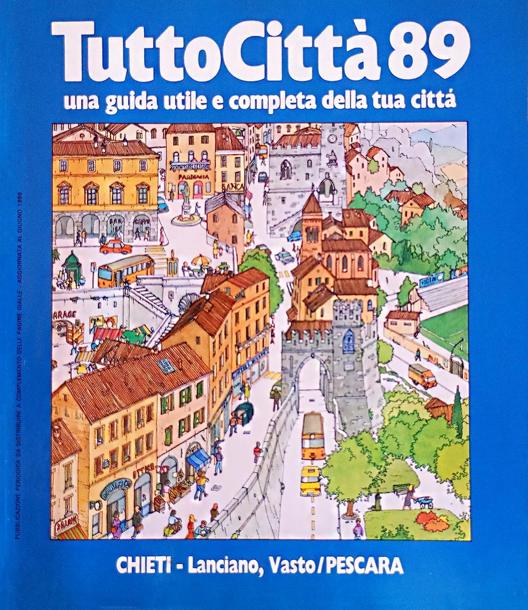</a>
Chieti - Pescara 89
<ul class="scheda"><li><b>Formato:</b> 246 x 280 mm</li><li><b>Copertina:</b> grossa</li><li><b>Layout:</b> TuttoCittà '80 classico</li><li><b>Pagine:</b> 32</li><li><b>Mese aggiornamento:</b> giugno 1989</li></ul></td><td class="fasc"><a href="../immagini/AQTE89.jpg">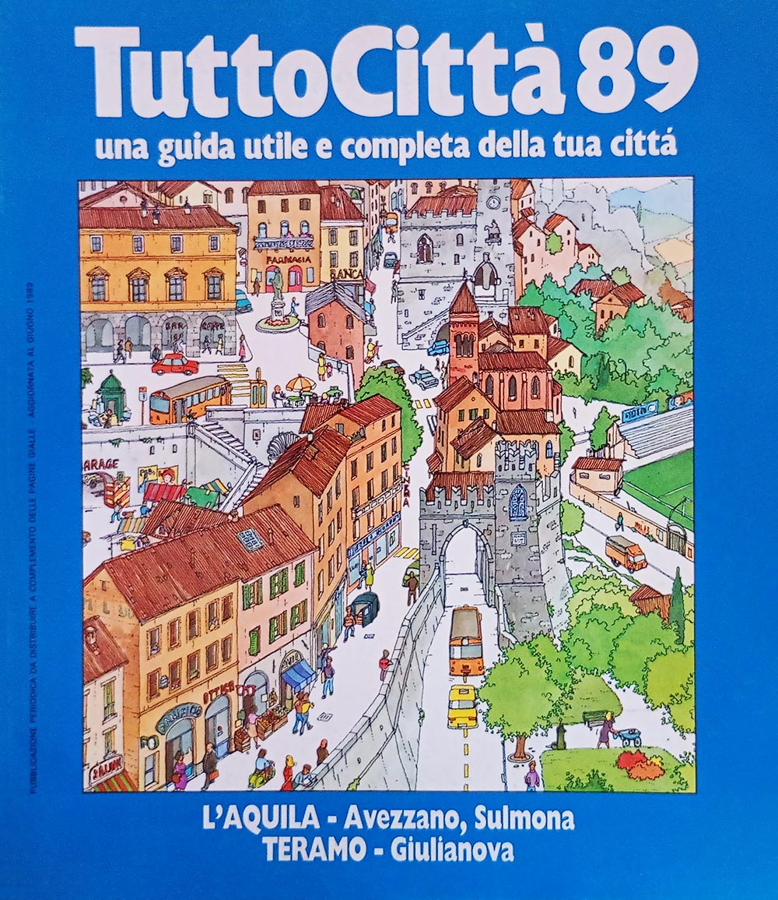</a>
L'Aquila - Teramo 89
<ul class="scheda"><li><b>Formato:</b> 246 x 280 mm</li><li><b>Copertina:</b> grossa</li><li><b>Layout:</b> TuttoCittà '80 classico</li><li><b>Pagine:</b> 32</li><li><b>Mese aggiornamento:</b> giugno 1989</li></ul></td></tr>
<tr><td class="ann"> 90/91</td><td class="tav"></td><td class="fasc"><a href="../immagini/CHPE9091.jpg">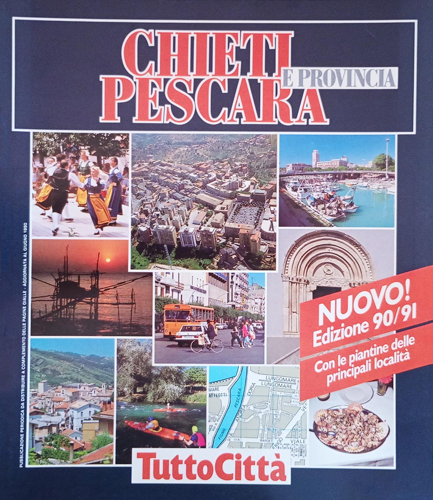</a>
Chieti - Pescara 90/91
<ul class="scheda"><li><b>Formato:</b> 246 x 280 mm</li><li><b>Copertina:</b> grossa</li><li><b>Layout:</b> TuttoCittà '90 classico iniziale</li><li><b>Pagine:</b> 40</li><li><b>Mese aggiornamento:</b> giugno 1990</li><li><b>Note:</b> nota dell'editore</li></ul></td><td class="fasc"><a href="../immagini/AQTE9091.jpg">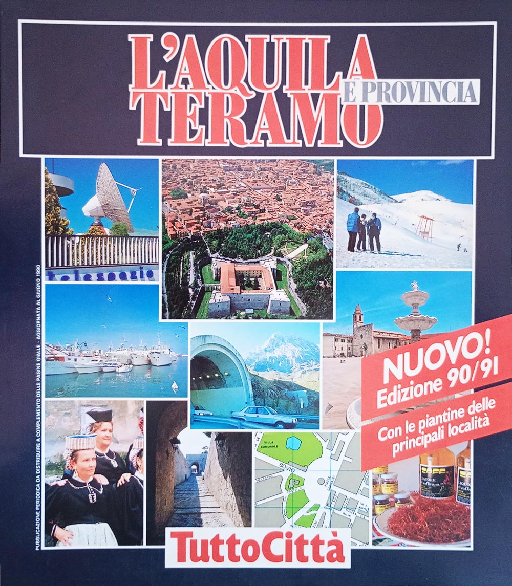</a>
L'Aquila - Teramo 90/91
<ul class="scheda"><li><b>Formato:</b> 246 x 280 mm</li><li><b>Copertina:</b> grossa</li><li><b>Layout:</b> TuttoCittà '90 classico iniziale</li><li><b>Pagine:</b> 40</li><li><b>Mese aggiornamento:</b> giugno 1990</li><li><b>Note:</b> nota dell'editore</li></ul></td></tr>
<tr><td class="ann"> 91/92</td><td class="tav"></td><td class="fasc"><a href="../immagini/CHPE91.jpg">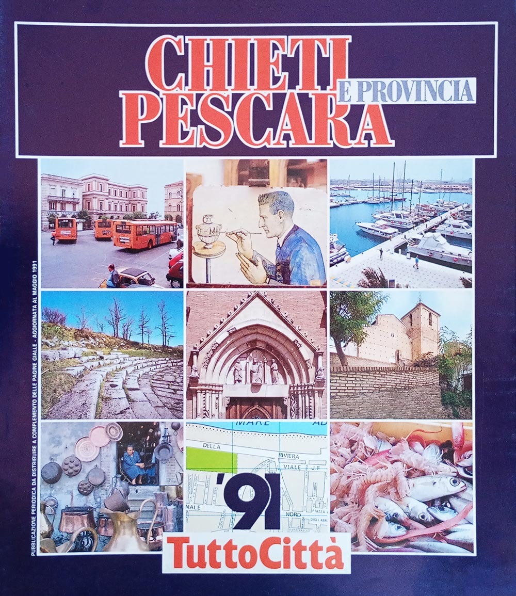</a>
Chieti - Pescara 91
<ul class="scheda"><li><b>Formato:</b> 246 x 280 mm</li><li><b>Copertina:</b> grossa</li><li><b>Layout:</b> TuttoCittà '90 classico iniziale</li><li><b>Pagine:</b> 40</li><li><b>Mese aggiornamento:</b> maggio 1991</li></ul></td><td class="fasc"><a href="../immagini/AQTE91.jpg">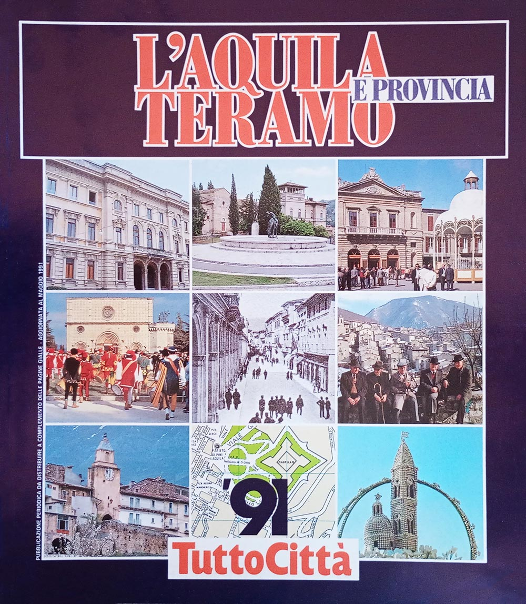</a>
L'Aquila - Teramo 91
<ul class="scheda"><li><b>Formato:</b> 246 x 280 mm</li><li><b>Copertina:</b> grossa</li><li><b>Layout:</b> TuttoCittà '90 classico iniziale</li><li><b>Pagine:</b> 40</li><li><b>Mese aggiornamento:</b> maggio 1991</li></ul></td></tr>
<tr><td class="ann"> 92/93</td><td class="tav"></td><td class="fasc"><a href="../immagini/CHPE92.jpg">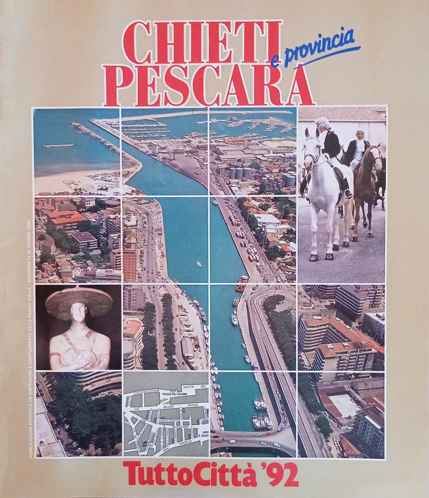</a>
Chieti - Pescara 92
<ul class="scheda"><li><b>Formato:</b> 246 x 280 mm</li><li><b>Copertina:</b> grossa</li><li><b>Layout:</b> TuttoCittà '90 classico</li><li><b>Pagine:</b> 40</li><li><b>Mese aggiornamento:</b> giugno 1992</li></ul></td><td class="fasc"><a href="../immagini/AQTE92.jpg">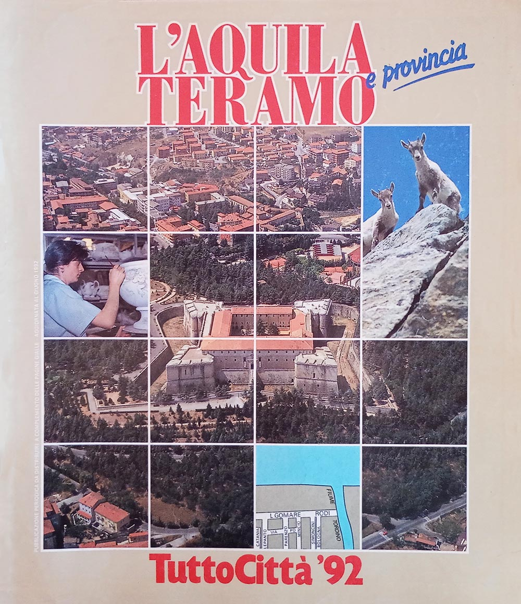</a>
L'Aquila - Teramo 92
<ul class="scheda"><li><b>Formato:</b> 246 x 280 mm</li><li><b>Copertina:</b> grossa</li><li><b>Layout:</b> TuttoCittà '90 classico</li><li><b>Pagine:</b> 40</li><li><b>Mese aggiornamento:</b> giugno 1992</li></ul></td></tr>
<tr><td class="ann"> 93/94</td><td class="tav"></td><td class="fasc"><a href="../immagini/CHPE93.jpg">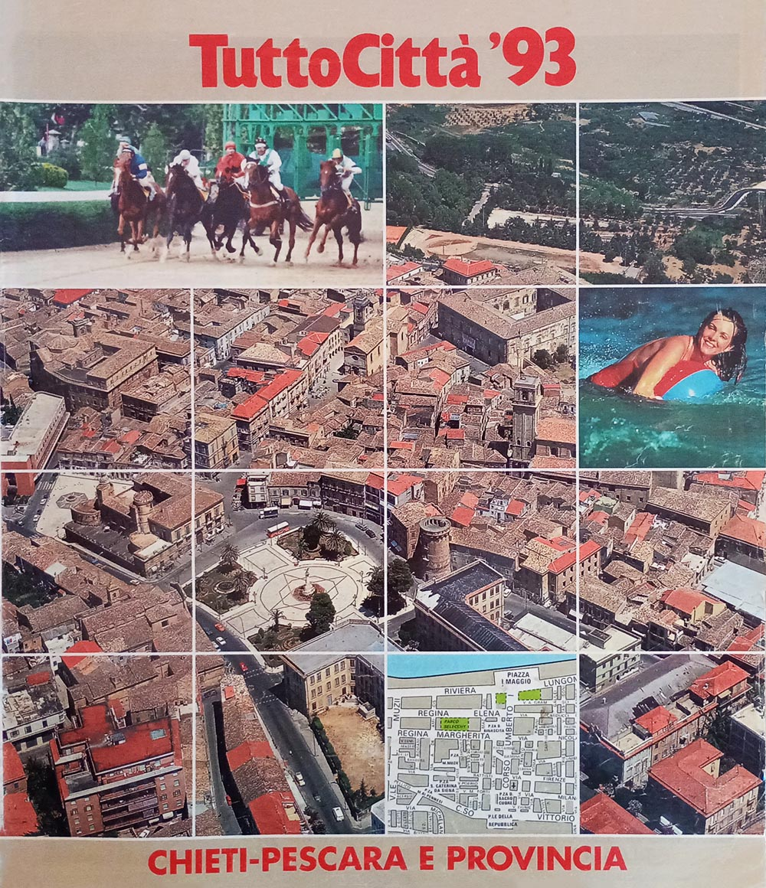</a>
Chieti - Pescara 93
<ul class="scheda"><li><b>Formato:</b> 246 x 280 mm</li><li><b>Copertina:</b> sottile</li><li><b>Layout:</b> TuttoCittà '90 classico</li><li><b>Pagine:</b> 38</li><li><b>Mese aggiornamento:</b> giugno 1993</li></ul></td><td class="fasc"><a href="../immagini/AQTE93.jpg">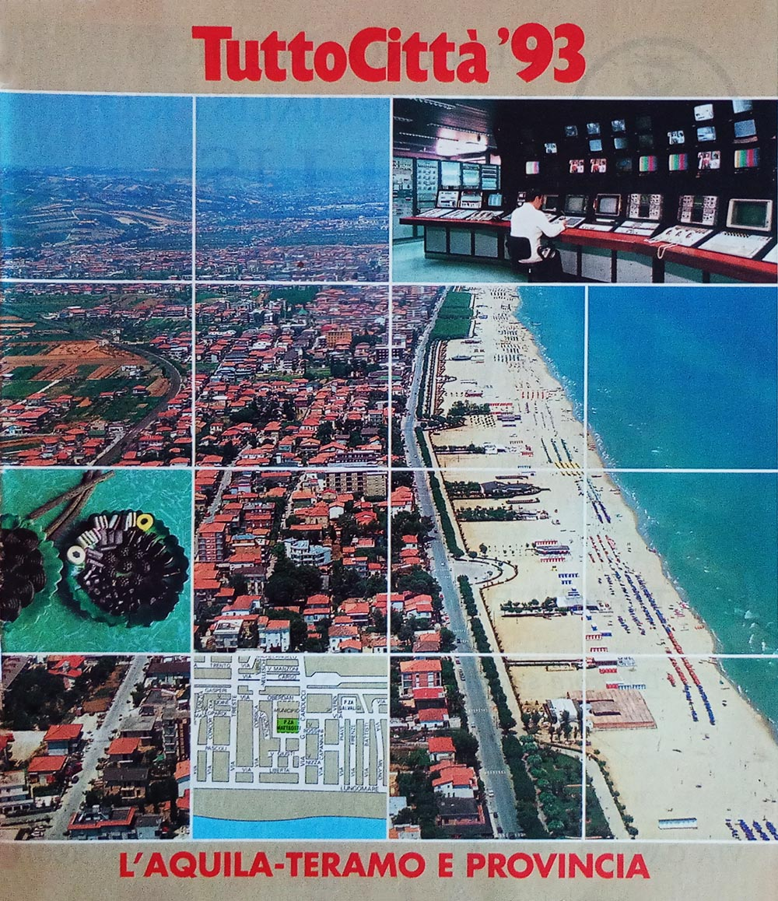</a>
L'Aquila - Teramo 93
<ul class="scheda"><li><b>Formato:</b> 246 x 280 mm</li><li><b>Copertina:</b> sottile</li><li><b>Layout:</b> TuttoCittà '90 classico</li><li><b>Pagine:</b> 46</li><li><b>Mese aggiornamento:</b> giugno 1993</li></ul></td></tr>
<tr><td class="ann"> 94/95</td><td class="tav"></td><td class="fasc"><a href="../immagini/CHPE94.jpg">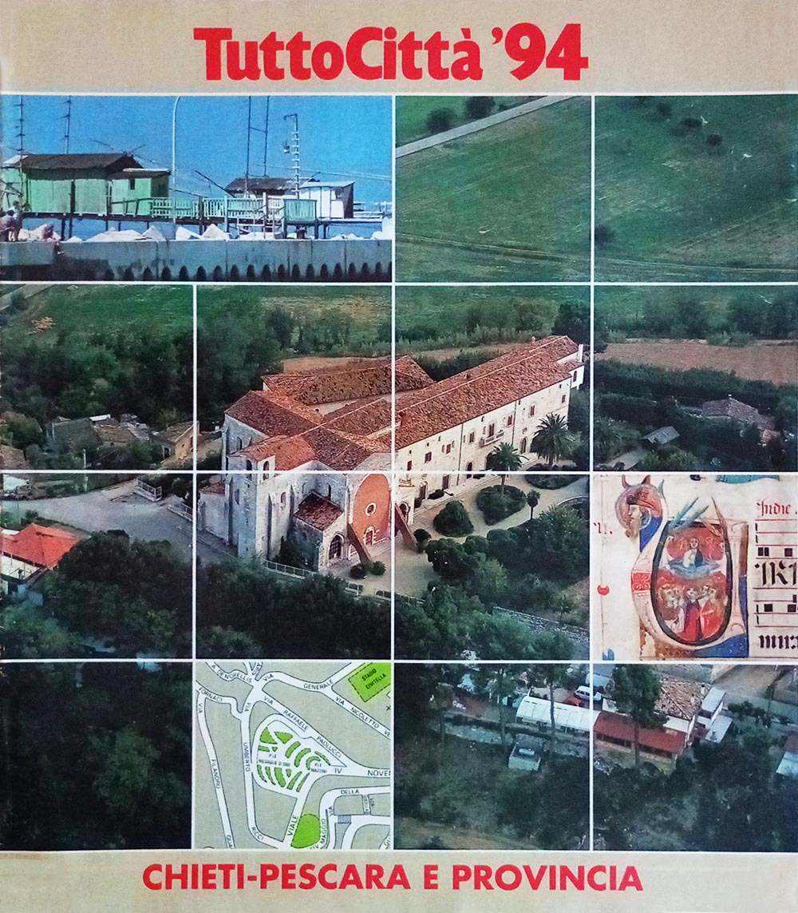</a>
Chieti - Pescara 94
<ul class="scheda"><li><b>Formato:</b> 246 x 280 mm</li><li><b>Copertina:</b> sottile</li><li><b>Layout:</b> TuttoCittà '90 classico</li><li><b>Pagine:</b> 46</li><li><b>Mese aggiornamento:</b> giugno 1994</li></ul></td><td class="fasc"><a href="../immagini/AQTE94.jpg">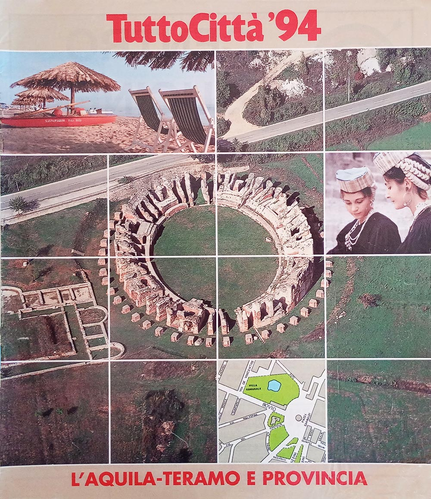</a>
L'Aquila - Teramo 94
<ul class="scheda"><li><b>Formato:</b> 246 x 280 mm</li><li><b>Copertina:</b> sottile</li><li><b>Layout:</b> TuttoCittà '90 classico</li><li><b>Pagine:</b> 38</li><li><b>Mese aggiornamento:</b> giugno 1994</li></ul></td></tr>
<tr><td class="ann"> 95/96</td><td class="tav"></td><td class="fasc"><a href="../immagini/CHPE95.jpg">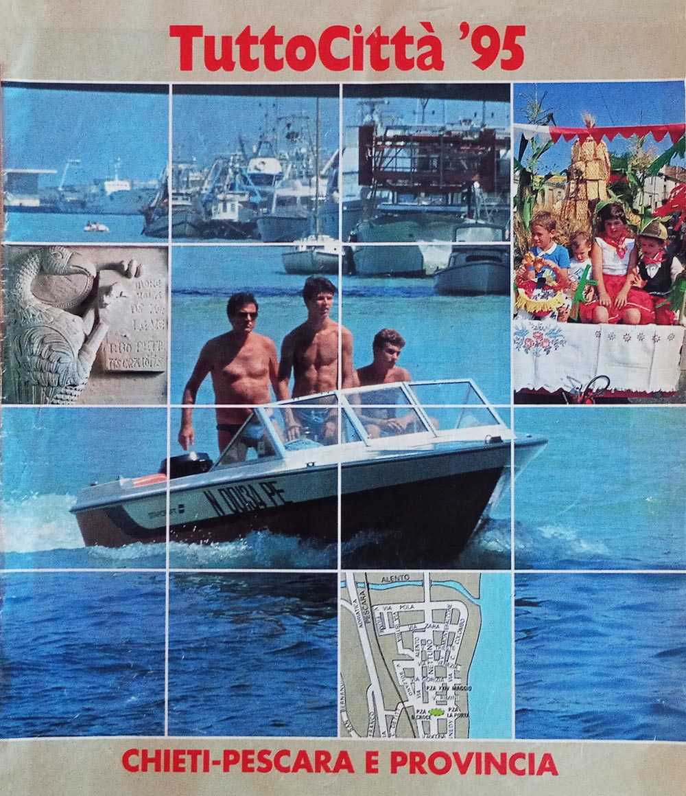</a>
Chieti - Pescara 95
<ul class="scheda"><li><b>Formato:</b> 246 x 280 mm</li><li><b>Copertina:</b> sottile</li><li><b>Layout:</b> TuttoCittà '90 classico</li><li><b>Pagine:</b> 38</li><li><b>Mese aggiornamento:</b> giugno 1995</li></ul></td><td class="fasc sospesa">
L'Aquila - Teramo 95
<ul class="scheda"><li><b>Formato:</b> 246 x 280 mm</li><li><b>Copertina:</b> sottile</li><li><b>Layout:</b> TuttoCittà '90 classico</li><li>non in raccolta</li></ul></td></tr>
<tr><td class="ann"> 96/97</td><td class="tav"></td><td class="fasc"><a href="../immagini/CHPE96.jpg">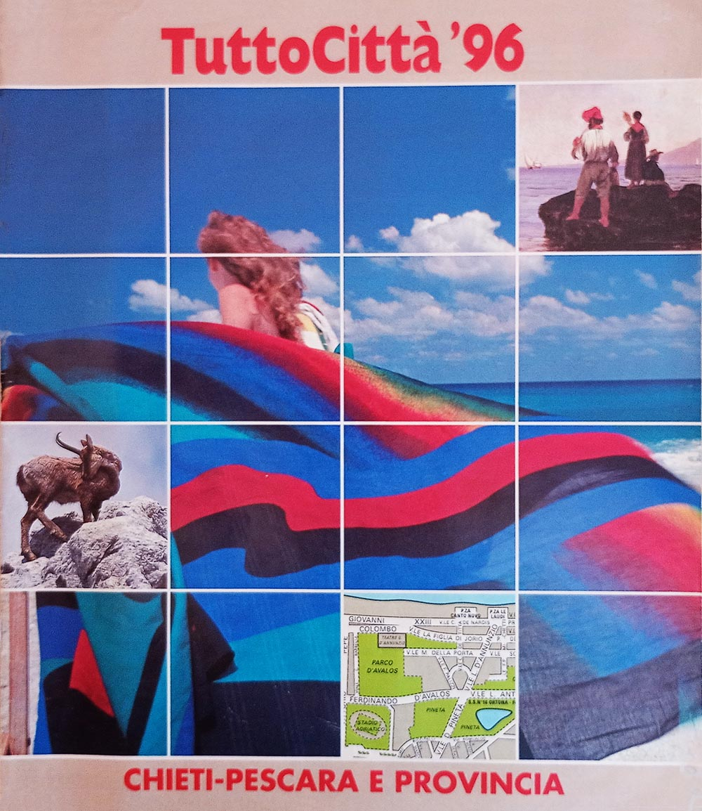</a>
Chieti - Pescara 96
<ul class="scheda"><li><b>Formato:</b> 246 x 280 mm</li><li><b>Copertina:</b> sottile</li><li><b>Layout:</b> TuttoCittà '90 classico</li><li><b>Pagine:</b> 38</li><li><b>Mese aggiornamento:</b> giugno 1996</li></ul></td><td class="fasc sospesa">
L'Aquila - Teramo 96
<ul class="scheda"><li><b>Formato:</b> 246 x 280 mm</li><li><b>Copertina:</b> sottile</li><li><b>Layout:</b> TuttoCittà '90 classico</li><li>non in raccolta</li></ul></td></tr>
<tr><td class="ann"> 97/98</td><td class="tav"></td><td class="fasc"><a href="../immagini/CHPE97.jpg">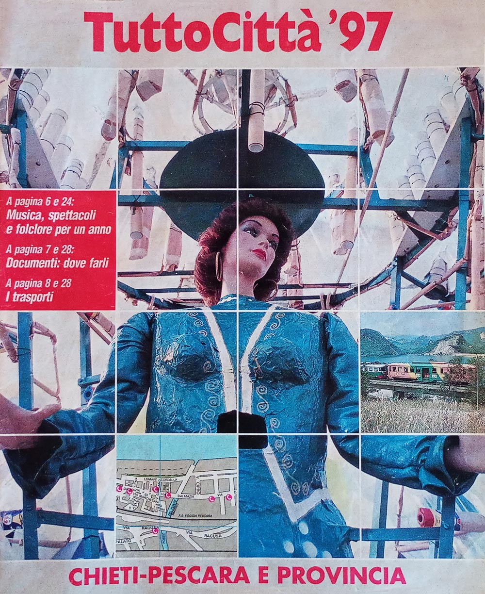</a>
Chieti - Pescara 97
<ul class="scheda"><li><b>Formato:</b> 226 x 274 mm</li><li><b>Copertina:</b> sottile</li><li><b>Layout:</b> TuttoCittà '90 classico</li><li><b>Pagine:</b> 38</li><li><b>Mese aggiornamento:</b> giugno 1997</li><li><b>Note:</b> Cambio formato</li></ul></td><td class="fasc"><a href="../immagini/AQTE97.jpg">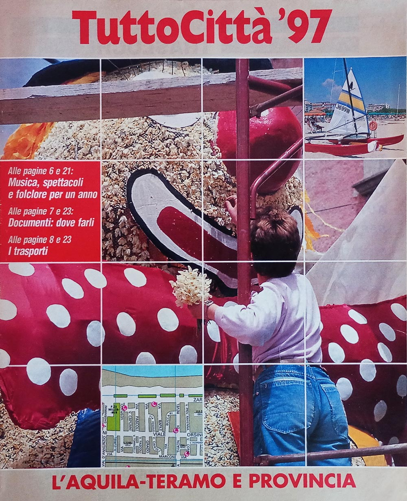</a>
L'Aquila - Teramo 97
<ul class="scheda"><li><b>Formato:</b> 226 x 274 mm</li><li><b>Copertina:</b> sottile</li><li><b>Layout:</b> TuttoCittà '90 classico</li><li><b>Pagine:</b> 30</li><li><b>Mese aggiornamento:</b> giugno 1997</li><li><b>Note:</b> Cambio formato</li></ul></td></tr>
</tbody>
</table>

## Quattro layout in diciassette anni

La seguente tabella censisce i vari layout utilizzati per i fascicoli della regione, secondo il
sistema definito durante il censimento osservando l'impaginazione; le loro caratteristiche sono
descritte in [questa pagina](tabella-layout.md). Come descritto anche lì, i cambi di layout non
rispettano i cambi delle serie di copertina descritte nell'[apposita pagina](copertine.md) di questo
sito.

<table class="layout-dettaglio">
<thead><tr><th>Layout</th><th>Annate</th><th>Anni di copertina</th></tr></thead>
<tbody>
<tr><td>TuttoCittà '80 con foto</td><td class="ann">81/82</td><td class="cop">81</td></tr>
<tr><td>TuttoCittà '80 classico</td><td class="ann">82/83 – 89/90</td><td class="cop">82<i class="pt"></i>83<i class="pt"></i>84<i class="pt"></i>85<i class="pt"></i>86<i class="pt"></i>87<i class="pt"></i>88<i class="pt"></i>89</td></tr>
<tr><td>TuttoCittà '90 classico iniziale</td><td class="ann">90/91 – 91/92</td><td class="cop">90/91<i class="pt"></i>91</td></tr>
<tr><td>TuttoCittà '90 classico</td><td class="ann">92/93 – 97/98</td><td class="cop">92<i class="pt"></i>93<i class="pt"></i>94<i class="pt"></i>95<i class="pt"></i>96<i class="pt"></i>97</td></tr>
</tbody>
</table>

## Le città cartografate

La seguente tabella censisce tutti i comuni che sono stati cartografati nel corso del tempo e per
quante annate. Ad ogni riga corrisponde un comune, in ordine alfabetico e non per provincia: lo
scopo è infatti identificare a colpo d'occhio quali comuni entrano ed escono dalla cartografia nel
corso degli anni. I quattro capoluoghi — CHIETI, L'AQUILA, PESCARA, TERAMO — sono in maiuscolo, ma
restano al loro posto nell'alfabeto. La croce segna le annate in cui il fascicolo che copriva quella
provincia non è in raccolta: non sappiamo se il comune fosse cartografato.

Espandi la griglia delle città — 28 città su 17 annate

<table class="griglia">
  <thead><tr><th scope="col">Città</th><th scope="col">81/82</th><th scope="col">82/83</th><th scope="col">83/84</th><th scope="col">84/85</th><th scope="col">85/86</th><th scope="col">86/87</th><th scope="col">87/88</th><th scope="col">88/89</th><th scope="col">89/90</th><th scope="col">90/91</th><th scope="col">91/92</th><th scope="col">92/93</th><th scope="col">93/94</th><th scope="col">94/95</th><th scope="col">95/96</th><th scope="col">96/97</th><th scope="col">97/98</th></tr></thead>
  <tbody>
  <tr><th scope="row">Alba Adriatica</th><td class="no" title="Alba Adriatica — 81/82"></td><td class="no" title="Alba Adriatica — 82/83"></td><td class="no" title="Alba Adriatica — 83/84"></td><td class="no" title="Alba Adriatica — 84/85"></td><td class="no" title="Alba Adriatica — 85/86"></td><td class="no" title="Alba Adriatica — 86/87"></td><td class="no" title="Alba Adriatica — 87/88"></td><td class="ig" title="Alba Adriatica — 88/89: non accertato, fascicolo mancante">&#215;</td><td class="no" title="Alba Adriatica — 89/90"></td><td class="si" title="Alba Adriatica — 90/91"></td><td class="si" title="Alba Adriatica — 91/92"></td><td class="si" title="Alba Adriatica — 92/93"></td><td class="si" title="Alba Adriatica — 93/94"></td><td class="si" title="Alba Adriatica — 94/95"></td><td class="ig" title="Alba Adriatica — 95/96: non accertato, fascicolo mancante">&#215;</td><td class="ig" title="Alba Adriatica — 96/97: non accertato, fascicolo mancante">&#215;</td><td class="si" title="Alba Adriatica — 97/98"></td></tr>
  <tr><th scope="row">Atessa</th><td class="no" title="Atessa — 81/82"></td><td class="no" title="Atessa — 82/83"></td><td class="no" title="Atessa — 83/84"></td><td class="no" title="Atessa — 84/85"></td><td class="no" title="Atessa — 85/86"></td><td class="no" title="Atessa — 86/87"></td><td class="no" title="Atessa — 87/88"></td><td class="no" title="Atessa — 88/89"></td><td class="no" title="Atessa — 89/90"></td><td class="no" title="Atessa — 90/91"></td><td class="si" title="Atessa — 91/92"></td><td class="si" title="Atessa — 92/93"></td><td class="si" title="Atessa — 93/94"></td><td class="si" title="Atessa — 94/95"></td><td class="si" title="Atessa — 95/96"></td><td class="si" title="Atessa — 96/97"></td><td class="si" title="Atessa — 97/98"></td></tr>
  <tr><th scope="row">Atri</th><td class="no" title="Atri — 81/82"></td><td class="no" title="Atri — 82/83"></td><td class="no" title="Atri — 83/84"></td><td class="no" title="Atri — 84/85"></td><td class="no" title="Atri — 85/86"></td><td class="no" title="Atri — 86/87"></td><td class="no" title="Atri — 87/88"></td><td class="ig" title="Atri — 88/89: non accertato, fascicolo mancante">&#215;</td><td class="no" title="Atri — 89/90"></td><td class="si" title="Atri — 90/91"></td><td class="si" title="Atri — 91/92"></td><td class="si" title="Atri — 92/93"></td><td class="si" title="Atri — 93/94"></td><td class="si" title="Atri — 94/95"></td><td class="ig" title="Atri — 95/96: non accertato, fascicolo mancante">&#215;</td><td class="ig" title="Atri — 96/97: non accertato, fascicolo mancante">&#215;</td><td class="si" title="Atri — 97/98"></td></tr>
  <tr><th scope="row">Avezzano</th><td class="si" title="Avezzano — 81/82"></td><td class="si" title="Avezzano — 82/83"></td><td class="si" title="Avezzano — 83/84"></td><td class="si" title="Avezzano — 84/85"></td><td class="si" title="Avezzano — 85/86"></td><td class="si" title="Avezzano — 86/87"></td><td class="si" title="Avezzano — 87/88"></td><td class="ig" title="Avezzano — 88/89: non accertato, fascicolo mancante">&#215;</td><td class="si" title="Avezzano — 89/90"></td><td class="si" title="Avezzano — 90/91"></td><td class="si" title="Avezzano — 91/92"></td><td class="si" title="Avezzano — 92/93"></td><td class="si" title="Avezzano — 93/94"></td><td class="si" title="Avezzano — 94/95"></td><td class="ig" title="Avezzano — 95/96: non accertato, fascicolo mancante">&#215;</td><td class="ig" title="Avezzano — 96/97: non accertato, fascicolo mancante">&#215;</td><td class="si" title="Avezzano — 97/98"></td></tr>
  <tr><th scope="row">Campli</th><td class="no" title="Campli — 81/82"></td><td class="no" title="Campli — 82/83"></td><td class="no" title="Campli — 83/84"></td><td class="no" title="Campli — 84/85"></td><td class="no" title="Campli — 85/86"></td><td class="no" title="Campli — 86/87"></td><td class="no" title="Campli — 87/88"></td><td class="ig" title="Campli — 88/89: non accertato, fascicolo mancante">&#215;</td><td class="no" title="Campli — 89/90"></td><td class="si" title="Campli — 90/91"></td><td class="si" title="Campli — 91/92"></td><td class="si" title="Campli — 92/93"></td><td class="no" title="Campli — 93/94"></td><td class="no" title="Campli — 94/95"></td><td class="ig" title="Campli — 95/96: non accertato, fascicolo mancante">&#215;</td><td class="ig" title="Campli — 96/97: non accertato, fascicolo mancante">&#215;</td><td class="no" title="Campli — 97/98"></td></tr>
  <tr><th scope="row">Capistrello</th><td class="no" title="Capistrello — 81/82"></td><td class="no" title="Capistrello — 82/83"></td><td class="no" title="Capistrello — 83/84"></td><td class="no" title="Capistrello — 84/85"></td><td class="no" title="Capistrello — 85/86"></td><td class="no" title="Capistrello — 86/87"></td><td class="no" title="Capistrello — 87/88"></td><td class="ig" title="Capistrello — 88/89: non accertato, fascicolo mancante">&#215;</td><td class="no" title="Capistrello — 89/90"></td><td class="no" title="Capistrello — 90/91"></td><td class="no" title="Capistrello — 91/92"></td><td class="no" title="Capistrello — 92/93"></td><td class="si" title="Capistrello — 93/94"></td><td class="si" title="Capistrello — 94/95"></td><td class="ig" title="Capistrello — 95/96: non accertato, fascicolo mancante">&#215;</td><td class="ig" title="Capistrello — 96/97: non accertato, fascicolo mancante">&#215;</td><td class="no" title="Capistrello — 97/98"></td></tr>
  <tr><th scope="row">Celano</th><td class="no" title="Celano — 81/82"></td><td class="no" title="Celano — 82/83"></td><td class="no" title="Celano — 83/84"></td><td class="no" title="Celano — 84/85"></td><td class="no" title="Celano — 85/86"></td><td class="no" title="Celano — 86/87"></td><td class="no" title="Celano — 87/88"></td><td class="ig" title="Celano — 88/89: non accertato, fascicolo mancante">&#215;</td><td class="no" title="Celano — 89/90"></td><td class="si" title="Celano — 90/91"></td><td class="si" title="Celano — 91/92"></td><td class="si" title="Celano — 92/93"></td><td class="si" title="Celano — 93/94"></td><td class="si" title="Celano — 94/95"></td><td class="ig" title="Celano — 95/96: non accertato, fascicolo mancante">&#215;</td><td class="ig" title="Celano — 96/97: non accertato, fascicolo mancante">&#215;</td><td class="si" title="Celano — 97/98"></td></tr>
  <tr><th scope="row">CHIETI</th><td class="si" title="CHIETI — 81/82"></td><td class="si" title="CHIETI — 82/83"></td><td class="si" title="CHIETI — 83/84"></td><td class="si" title="CHIETI — 84/85"></td><td class="si" title="CHIETI — 85/86"></td><td class="si" title="CHIETI — 86/87"></td><td class="si" title="CHIETI — 87/88"></td><td class="si" title="CHIETI — 88/89"></td><td class="si" title="CHIETI — 89/90"></td><td class="si" title="CHIETI — 90/91"></td><td class="si" title="CHIETI — 91/92"></td><td class="si" title="CHIETI — 92/93"></td><td class="si" title="CHIETI — 93/94"></td><td class="si" title="CHIETI — 94/95"></td><td class="si" title="CHIETI — 95/96"></td><td class="si" title="CHIETI — 96/97"></td><td class="si" title="CHIETI — 97/98"></td></tr>
  <tr><th scope="row">Francavilla</th><td class="no" title="Francavilla — 81/82"></td><td class="no" title="Francavilla — 82/83"></td><td class="no" title="Francavilla — 83/84"></td><td class="no" title="Francavilla — 84/85"></td><td class="no" title="Francavilla — 85/86"></td><td class="no" title="Francavilla — 86/87"></td><td class="no" title="Francavilla — 87/88"></td><td class="no" title="Francavilla — 88/89"></td><td class="no" title="Francavilla — 89/90"></td><td class="si" title="Francavilla — 90/91"></td><td class="no" title="Francavilla — 91/92"></td><td class="no" title="Francavilla — 92/93"></td><td class="no" title="Francavilla — 93/94"></td><td class="no" title="Francavilla — 94/95"></td><td class="no" title="Francavilla — 95/96"></td><td class="no" title="Francavilla — 96/97"></td><td class="no" title="Francavilla — 97/98"></td></tr>
  <tr><th scope="row">Francavilla al Mare</th><td class="no" title="Francavilla al Mare — 81/82"></td><td class="no" title="Francavilla al Mare — 82/83"></td><td class="no" title="Francavilla al Mare — 83/84"></td><td class="no" title="Francavilla al Mare — 84/85"></td><td class="no" title="Francavilla al Mare — 85/86"></td><td class="no" title="Francavilla al Mare — 86/87"></td><td class="no" title="Francavilla al Mare — 87/88"></td><td class="no" title="Francavilla al Mare — 88/89"></td><td class="no" title="Francavilla al Mare — 89/90"></td><td class="no" title="Francavilla al Mare — 90/91"></td><td class="si" title="Francavilla al Mare — 91/92"></td><td class="si" title="Francavilla al Mare — 92/93"></td><td class="si" title="Francavilla al Mare — 93/94"></td><td class="si" title="Francavilla al Mare — 94/95"></td><td class="si" title="Francavilla al Mare — 95/96"></td><td class="si" title="Francavilla al Mare — 96/97"></td><td class="si" title="Francavilla al Mare — 97/98"></td></tr>
  <tr><th scope="row">Giulianova</th><td class="si" title="Giulianova — 81/82"></td><td class="si" title="Giulianova — 82/83"></td><td class="si" title="Giulianova — 83/84"></td><td class="si" title="Giulianova — 84/85"></td><td class="si" title="Giulianova — 85/86"></td><td class="si" title="Giulianova — 86/87"></td><td class="si" title="Giulianova — 87/88"></td><td class="ig" title="Giulianova — 88/89: non accertato, fascicolo mancante">&#215;</td><td class="si" title="Giulianova — 89/90"></td><td class="si" title="Giulianova — 90/91"></td><td class="si" title="Giulianova — 91/92"></td><td class="si" title="Giulianova — 92/93"></td><td class="si" title="Giulianova — 93/94"></td><td class="si" title="Giulianova — 94/95"></td><td class="ig" title="Giulianova — 95/96: non accertato, fascicolo mancante">&#215;</td><td class="ig" title="Giulianova — 96/97: non accertato, fascicolo mancante">&#215;</td><td class="si" title="Giulianova — 97/98"></td></tr>
  <tr><th scope="row">Lanciano</th><td class="si" title="Lanciano — 81/82"></td><td class="si" title="Lanciano — 82/83"></td><td class="si" title="Lanciano — 83/84"></td><td class="si" title="Lanciano — 84/85"></td><td class="si" title="Lanciano — 85/86"></td><td class="si" title="Lanciano — 86/87"></td><td class="si" title="Lanciano — 87/88"></td><td class="si" title="Lanciano — 88/89"></td><td class="si" title="Lanciano — 89/90"></td><td class="si" title="Lanciano — 90/91"></td><td class="si" title="Lanciano — 91/92"></td><td class="si" title="Lanciano — 92/93"></td><td class="si" title="Lanciano — 93/94"></td><td class="si" title="Lanciano — 94/95"></td><td class="si" title="Lanciano — 95/96"></td><td class="si" title="Lanciano — 96/97"></td><td class="si" title="Lanciano — 97/98"></td></tr>
  <tr><th scope="row">L'AQUILA</th><td class="si" title="L'AQUILA — 81/82"></td><td class="si" title="L'AQUILA — 82/83"></td><td class="si" title="L'AQUILA — 83/84"></td><td class="si" title="L'AQUILA — 84/85"></td><td class="si" title="L'AQUILA — 85/86"></td><td class="si" title="L'AQUILA — 86/87"></td><td class="si" title="L'AQUILA — 87/88"></td><td class="ig" title="L'AQUILA — 88/89: non accertato, fascicolo mancante">&#215;</td><td class="si" title="L'AQUILA — 89/90"></td><td class="si" title="L'AQUILA — 90/91"></td><td class="si" title="L'AQUILA — 91/92"></td><td class="si" title="L'AQUILA — 92/93"></td><td class="si" title="L'AQUILA — 93/94"></td><td class="si" title="L'AQUILA — 94/95"></td><td class="ig" title="L'AQUILA — 95/96: non accertato, fascicolo mancante">&#215;</td><td class="ig" title="L'AQUILA — 96/97: non accertato, fascicolo mancante">&#215;</td><td class="si" title="L'AQUILA — 97/98"></td></tr>
  <tr><th scope="row">Loreto Aprutino</th><td class="no" title="Loreto Aprutino — 81/82"></td><td class="no" title="Loreto Aprutino — 82/83"></td><td class="no" title="Loreto Aprutino — 83/84"></td><td class="no" title="Loreto Aprutino — 84/85"></td><td class="no" title="Loreto Aprutino — 85/86"></td><td class="no" title="Loreto Aprutino — 86/87"></td><td class="no" title="Loreto Aprutino — 87/88"></td><td class="no" title="Loreto Aprutino — 88/89"></td><td class="no" title="Loreto Aprutino — 89/90"></td><td class="si" title="Loreto Aprutino — 90/91"></td><td class="si" title="Loreto Aprutino — 91/92"></td><td class="si" title="Loreto Aprutino — 92/93"></td><td class="si" title="Loreto Aprutino — 93/94"></td><td class="si" title="Loreto Aprutino — 94/95"></td><td class="si" title="Loreto Aprutino — 95/96"></td><td class="si" title="Loreto Aprutino — 96/97"></td><td class="si" title="Loreto Aprutino — 97/98"></td></tr>
  <tr><th scope="row">Martinsicuro</th><td class="no" title="Martinsicuro — 81/82"></td><td class="no" title="Martinsicuro — 82/83"></td><td class="no" title="Martinsicuro — 83/84"></td><td class="no" title="Martinsicuro — 84/85"></td><td class="no" title="Martinsicuro — 85/86"></td><td class="no" title="Martinsicuro — 86/87"></td><td class="no" title="Martinsicuro — 87/88"></td><td class="ig" title="Martinsicuro — 88/89: non accertato, fascicolo mancante">&#215;</td><td class="no" title="Martinsicuro — 89/90"></td><td class="no" title="Martinsicuro — 90/91"></td><td class="no" title="Martinsicuro — 91/92"></td><td class="no" title="Martinsicuro — 92/93"></td><td class="si" title="Martinsicuro — 93/94"></td><td class="si" title="Martinsicuro — 94/95"></td><td class="ig" title="Martinsicuro — 95/96: non accertato, fascicolo mancante">&#215;</td><td class="ig" title="Martinsicuro — 96/97: non accertato, fascicolo mancante">&#215;</td><td class="no" title="Martinsicuro — 97/98"></td></tr>
  <tr><th scope="row">Montesilvano</th><td class="no" title="Montesilvano — 81/82"></td><td class="no" title="Montesilvano — 82/83"></td><td class="no" title="Montesilvano — 83/84"></td><td class="no" title="Montesilvano — 84/85"></td><td class="no" title="Montesilvano — 85/86"></td><td class="no" title="Montesilvano — 86/87"></td><td class="no" title="Montesilvano — 87/88"></td><td class="no" title="Montesilvano — 88/89"></td><td class="no" title="Montesilvano — 89/90"></td><td class="si" title="Montesilvano — 90/91"></td><td class="si" title="Montesilvano — 91/92"></td><td class="si" title="Montesilvano — 92/93"></td><td class="si" title="Montesilvano — 93/94"></td><td class="si" title="Montesilvano — 94/95"></td><td class="si" title="Montesilvano — 95/96"></td><td class="si" title="Montesilvano — 96/97"></td><td class="si" title="Montesilvano — 97/98"></td></tr>
  <tr><th scope="row">Montorio al Vomano</th><td class="no" title="Montorio al Vomano — 81/82"></td><td class="no" title="Montorio al Vomano — 82/83"></td><td class="no" title="Montorio al Vomano — 83/84"></td><td class="no" title="Montorio al Vomano — 84/85"></td><td class="no" title="Montorio al Vomano — 85/86"></td><td class="no" title="Montorio al Vomano — 86/87"></td><td class="no" title="Montorio al Vomano — 87/88"></td><td class="ig" title="Montorio al Vomano — 88/89: non accertato, fascicolo mancante">&#215;</td><td class="no" title="Montorio al Vomano — 89/90"></td><td class="no" title="Montorio al Vomano — 90/91"></td><td class="no" title="Montorio al Vomano — 91/92"></td><td class="no" title="Montorio al Vomano — 92/93"></td><td class="si" title="Montorio al Vomano — 93/94"></td><td class="si" title="Montorio al Vomano — 94/95"></td><td class="ig" title="Montorio al Vomano — 95/96: non accertato, fascicolo mancante">&#215;</td><td class="ig" title="Montorio al Vomano — 96/97: non accertato, fascicolo mancante">&#215;</td><td class="si" title="Montorio al Vomano — 97/98"></td></tr>
  <tr><th scope="row">Ortona</th><td class="no" title="Ortona — 81/82"></td><td class="no" title="Ortona — 82/83"></td><td class="no" title="Ortona — 83/84"></td><td class="no" title="Ortona — 84/85"></td><td class="no" title="Ortona — 85/86"></td><td class="no" title="Ortona — 86/87"></td><td class="no" title="Ortona — 87/88"></td><td class="no" title="Ortona — 88/89"></td><td class="no" title="Ortona — 89/90"></td><td class="si" title="Ortona — 90/91"></td><td class="si" title="Ortona — 91/92"></td><td class="si" title="Ortona — 92/93"></td><td class="si" title="Ortona — 93/94"></td><td class="si" title="Ortona — 94/95"></td><td class="si" title="Ortona — 95/96"></td><td class="si" title="Ortona — 96/97"></td><td class="si" title="Ortona — 97/98"></td></tr>
  <tr><th scope="row">Penne</th><td class="no" title="Penne — 81/82"></td><td class="no" title="Penne — 82/83"></td><td class="no" title="Penne — 83/84"></td><td class="no" title="Penne — 84/85"></td><td class="no" title="Penne — 85/86"></td><td class="no" title="Penne — 86/87"></td><td class="no" title="Penne — 87/88"></td><td class="no" title="Penne — 88/89"></td><td class="no" title="Penne — 89/90"></td><td class="si" title="Penne — 90/91"></td><td class="si" title="Penne — 91/92"></td><td class="si" title="Penne — 92/93"></td><td class="si" title="Penne — 93/94"></td><td class="si" title="Penne — 94/95"></td><td class="si" title="Penne — 95/96"></td><td class="si" title="Penne — 96/97"></td><td class="si" title="Penne — 97/98"></td></tr>
  <tr><th scope="row">PESCARA</th><td class="si" title="PESCARA — 81/82"></td><td class="si" title="PESCARA — 82/83"></td><td class="si" title="PESCARA — 83/84"></td><td class="si" title="PESCARA — 84/85"></td><td class="si" title="PESCARA — 85/86"></td><td class="si" title="PESCARA — 86/87"></td><td class="si" title="PESCARA — 87/88"></td><td class="si" title="PESCARA — 88/89"></td><td class="si" title="PESCARA — 89/90"></td><td class="si" title="PESCARA — 90/91"></td><td class="si" title="PESCARA — 91/92"></td><td class="si" title="PESCARA — 92/93"></td><td class="si" title="PESCARA — 93/94"></td><td class="si" title="PESCARA — 94/95"></td><td class="si" title="PESCARA — 95/96"></td><td class="si" title="PESCARA — 96/97"></td><td class="si" title="PESCARA — 97/98"></td></tr>
  <tr><th scope="row">Roseto degli Abruzzi</th><td class="no" title="Roseto degli Abruzzi — 81/82"></td><td class="no" title="Roseto degli Abruzzi — 82/83"></td><td class="no" title="Roseto degli Abruzzi — 83/84"></td><td class="no" title="Roseto degli Abruzzi — 84/85"></td><td class="no" title="Roseto degli Abruzzi — 85/86"></td><td class="no" title="Roseto degli Abruzzi — 86/87"></td><td class="no" title="Roseto degli Abruzzi — 87/88"></td><td class="ig" title="Roseto degli Abruzzi — 88/89: non accertato, fascicolo mancante">&#215;</td><td class="no" title="Roseto degli Abruzzi — 89/90"></td><td class="no" title="Roseto degli Abruzzi — 90/91"></td><td class="si" title="Roseto degli Abruzzi — 91/92"></td><td class="si" title="Roseto degli Abruzzi — 92/93"></td><td class="si" title="Roseto degli Abruzzi — 93/94"></td><td class="si" title="Roseto degli Abruzzi — 94/95"></td><td class="ig" title="Roseto degli Abruzzi — 95/96: non accertato, fascicolo mancante">&#215;</td><td class="ig" title="Roseto degli Abruzzi — 96/97: non accertato, fascicolo mancante">&#215;</td><td class="no" title="Roseto degli Abruzzi — 97/98"></td></tr>
  <tr><th scope="row">San Nicolò a Tordino</th><td class="no" title="San Nicolò a Tordino — 81/82"></td><td class="no" title="San Nicolò a Tordino — 82/83"></td><td class="no" title="San Nicolò a Tordino — 83/84"></td><td class="no" title="San Nicolò a Tordino — 84/85"></td><td class="no" title="San Nicolò a Tordino — 85/86"></td><td class="no" title="San Nicolò a Tordino — 86/87"></td><td class="no" title="San Nicolò a Tordino — 87/88"></td><td class="ig" title="San Nicolò a Tordino — 88/89: non accertato, fascicolo mancante">&#215;</td><td class="no" title="San Nicolò a Tordino — 89/90"></td><td class="si" title="San Nicolò a Tordino — 90/91"></td><td class="si" title="San Nicolò a Tordino — 91/92"></td><td class="si" title="San Nicolò a Tordino — 92/93"></td><td class="no" title="San Nicolò a Tordino — 93/94"></td><td class="no" title="San Nicolò a Tordino — 94/95"></td><td class="ig" title="San Nicolò a Tordino — 95/96: non accertato, fascicolo mancante">&#215;</td><td class="ig" title="San Nicolò a Tordino — 96/97: non accertato, fascicolo mancante">&#215;</td><td class="no" title="San Nicolò a Tordino — 97/98"></td></tr>
  <tr><th scope="row">San Salvo</th><td class="no" title="San Salvo — 81/82"></td><td class="no" title="San Salvo — 82/83"></td><td class="no" title="San Salvo — 83/84"></td><td class="no" title="San Salvo — 84/85"></td><td class="no" title="San Salvo — 85/86"></td><td class="no" title="San Salvo — 86/87"></td><td class="no" title="San Salvo — 87/88"></td><td class="no" title="San Salvo — 88/89"></td><td class="no" title="San Salvo — 89/90"></td><td class="si" title="San Salvo — 90/91"></td><td class="si" title="San Salvo — 91/92"></td><td class="si" title="San Salvo — 92/93"></td><td class="si" title="San Salvo — 93/94"></td><td class="si" title="San Salvo — 94/95"></td><td class="si" title="San Salvo — 95/96"></td><td class="si" title="San Salvo — 96/97"></td><td class="si" title="San Salvo — 97/98"></td></tr>
  <tr><th scope="row">Sulmona</th><td class="no" title="Sulmona — 81/82"></td><td class="si" title="Sulmona — 82/83"></td><td class="si" title="Sulmona — 83/84"></td><td class="si" title="Sulmona — 84/85"></td><td class="si" title="Sulmona — 85/86"></td><td class="si" title="Sulmona — 86/87"></td><td class="si" title="Sulmona — 87/88"></td><td class="ig" title="Sulmona — 88/89: non accertato, fascicolo mancante">&#215;</td><td class="si" title="Sulmona — 89/90"></td><td class="si" title="Sulmona — 90/91"></td><td class="si" title="Sulmona — 91/92"></td><td class="si" title="Sulmona — 92/93"></td><td class="si" title="Sulmona — 93/94"></td><td class="si" title="Sulmona — 94/95"></td><td class="ig" title="Sulmona — 95/96: non accertato, fascicolo mancante">&#215;</td><td class="ig" title="Sulmona — 96/97: non accertato, fascicolo mancante">&#215;</td><td class="si" title="Sulmona — 97/98"></td></tr>
  <tr><th scope="row">Tagliacozzo</th><td class="no" title="Tagliacozzo — 81/82"></td><td class="no" title="Tagliacozzo — 82/83"></td><td class="no" title="Tagliacozzo — 83/84"></td><td class="no" title="Tagliacozzo — 84/85"></td><td class="no" title="Tagliacozzo — 85/86"></td><td class="no" title="Tagliacozzo — 86/87"></td><td class="no" title="Tagliacozzo — 87/88"></td><td class="ig" title="Tagliacozzo — 88/89: non accertato, fascicolo mancante">&#215;</td><td class="no" title="Tagliacozzo — 89/90"></td><td class="si" title="Tagliacozzo — 90/91"></td><td class="si" title="Tagliacozzo — 91/92"></td><td class="si" title="Tagliacozzo — 92/93"></td><td class="si" title="Tagliacozzo — 93/94"></td><td class="si" title="Tagliacozzo — 94/95"></td><td class="ig" title="Tagliacozzo — 95/96: non accertato, fascicolo mancante">&#215;</td><td class="ig" title="Tagliacozzo — 96/97: non accertato, fascicolo mancante">&#215;</td><td class="si" title="Tagliacozzo — 97/98"></td></tr>
  <tr><th scope="row">TERAMO</th><td class="si" title="TERAMO — 81/82"></td><td class="si" title="TERAMO — 82/83"></td><td class="si" title="TERAMO — 83/84"></td><td class="si" title="TERAMO — 84/85"></td><td class="si" title="TERAMO — 85/86"></td><td class="si" title="TERAMO — 86/87"></td><td class="si" title="TERAMO — 87/88"></td><td class="ig" title="TERAMO — 88/89: non accertato, fascicolo mancante">&#215;</td><td class="si" title="TERAMO — 89/90"></td><td class="si" title="TERAMO — 90/91"></td><td class="si" title="TERAMO — 91/92"></td><td class="si" title="TERAMO — 92/93"></td><td class="si" title="TERAMO — 93/94"></td><td class="si" title="TERAMO — 94/95"></td><td class="ig" title="TERAMO — 95/96: non accertato, fascicolo mancante">&#215;</td><td class="ig" title="TERAMO — 96/97: non accertato, fascicolo mancante">&#215;</td><td class="si" title="TERAMO — 97/98"></td></tr>
  <tr><th scope="row">Tortoreto Lido</th><td class="no" title="Tortoreto Lido — 81/82"></td><td class="no" title="Tortoreto Lido — 82/83"></td><td class="no" title="Tortoreto Lido — 83/84"></td><td class="no" title="Tortoreto Lido — 84/85"></td><td class="no" title="Tortoreto Lido — 85/86"></td><td class="no" title="Tortoreto Lido — 86/87"></td><td class="no" title="Tortoreto Lido — 87/88"></td><td class="ig" title="Tortoreto Lido — 88/89: non accertato, fascicolo mancante">&#215;</td><td class="no" title="Tortoreto Lido — 89/90"></td><td class="no" title="Tortoreto Lido — 90/91"></td><td class="no" title="Tortoreto Lido — 91/92"></td><td class="si" title="Tortoreto Lido — 92/93"></td><td class="si" title="Tortoreto Lido — 93/94"></td><td class="si" title="Tortoreto Lido — 94/95"></td><td class="ig" title="Tortoreto Lido — 95/96: non accertato, fascicolo mancante">&#215;</td><td class="ig" title="Tortoreto Lido — 96/97: non accertato, fascicolo mancante">&#215;</td><td class="no" title="Tortoreto Lido — 97/98"></td></tr>
  <tr><th scope="row">Vasto</th><td class="no" title="Vasto — 81/82"></td><td class="si" title="Vasto — 82/83"></td><td class="si" title="Vasto — 83/84"></td><td class="si" title="Vasto — 84/85"></td><td class="si" title="Vasto — 85/86"></td><td class="si" title="Vasto — 86/87"></td><td class="si" title="Vasto — 87/88"></td><td class="si" title="Vasto — 88/89"></td><td class="si" title="Vasto — 89/90"></td><td class="si" title="Vasto — 90/91"></td><td class="si" title="Vasto — 91/92"></td><td class="si" title="Vasto — 92/93"></td><td class="si" title="Vasto — 93/94"></td><td class="si" title="Vasto — 94/95"></td><td class="si" title="Vasto — 95/96"></td><td class="si" title="Vasto — 96/97"></td><td class="si" title="Vasto — 97/98"></td></tr>
  </tbody>
</table>

Le città cartografate almeno una volta sono 28. Sulle 14 annate di cui la
raccolta ha tutti i fascicoli, il minimo è nell'annata 81/82, con 7
città; il massimo nelle annate 93/94 e 94/95, con 25.

## L'indice degli articoli, 1990-1997

Dall'annata 1990/91 ciascuna provincia ha una rubrica di articoli su storia, ambiente ed economia
locale — in molti fascicoli sottotitolata «Vivere la città» — che perdura fino all'annata 1997/98.
Sono 150 titoli in otto annate, mai indicizzati altrove: un piccolo corpus di
giornalismo locale distribuito gratuitamente in centinaia di migliaia di copie e poi scomparso senza
lasciare traccia in alcuna risorsa online.

I titoli sono trascritti come compaiono nel fascicolo. Il testo degli articoli non è riprodotto: i
diritti appartengono all'editore.

<figure class="figura">

<figcaption>Copertina del fascicolo Chieti - Pescara 90/91</figcaption>
</figure>
<figure class="figura">

<figcaption>Copertina del fascicolo L'Aquila - Teramo 90/91</figcaption>
</figure>

<h3 id="articoli-90-91">Annata 90/91</h3>
<dl class="articoli">
  <dt>Chieti</dt>
  <dd>Anni 90. Il salto dell'Ifdam <b class="perno">&bull;</b> Identikit di una provincia <b class="perno">&bull;</b> Il Castello di Biancaneve nelle viscere della Maiella <b class="perno">&bull;</b> Anno 1900. Il deputato più giovane <b class="perno">&bull;</b> Quel misterioro Guerriero di Capestrano <b class="perno">&bull;</b> Il segreto degli spaghetti? Semplice come l'acqua di Fara <b class="perno">&bull;</b> La ricetta della nonna</dd>
  <dt>L'Aquila</dt>
  <dd>Anni 90. Dallo spazio in diretta <b class="perno">&bull;</b> I maestri della mischia <b class="perno">&bull;</b> Anno 1900. I convitti e le educande <b class="perno">&bull;</b> Il grande orto del Fucino <b class="perno">&bull;</b> Identikit di una provincia <b class="perno">&bull;</b> A caccia di neutrini nelle viscere del Gran Sasso <b class="perno">&bull;</b> Date storiche <b class="perno">&bull;</b> Il lupo? Prudente, riservato, ottimo papà <b class="perno">&bull;</b> Civitella. Qui il futuro è verde <b class="perno">&bull;</b> Quel cuoco galeotto... <b class="perno">&bull;</b> La ricetta della nonna</dd>
  <dt>Pescara</dt>
  <dd>Anni 90. Finalmente un porto <b class="perno">&bull;</b> Identikit di una provincia <b class="perno">&bull;</b> Liberi di decollare <b class="perno">&bull;</b> Vieni a cercare la città dannunziana <b class="perno">&bull;</b> La ricetta della nonna</dd>
  <dt>Teramo</dt>
  <dd>Anni 90. Imprese di frontiera <b class="perno">&bull;</b> Identikit di una provincia <b class="perno">&bull;</b> Anno 1900. Arriva la ferrovia <b class="perno">&bull;</b> Val Vibrata. Il miracolo "fatto in casa" <b class="perno">&bull;</b> La ricetta della nonna</dd>
</dl>
<h3 id="articoli-91-92">Annata 91/92</h3>
<dl class="articoli">
  <dt>Chieti</dt>
  <dd>Cerso il '92. Una provincia in salute aspetta l'Europa <b class="perno">&bull;</b> Reteotto: obiettivo sui fatti <b class="perno">&bull;</b> Il convento degli artisti dove nacque "il piacere" <b class="perno">&bull;</b> Chieti, città della cultura <b class="perno">&bull;</b> Itinerari per il week-end. Nella valle del fiume Alento tra calanchi e chiese romaniche <b class="perno">&bull;</b> Vini e gastronomia. Un paese di cuochi ha conquistato il mondo</dd>
  <dt>L'Aquila</dt>
  <dd>Verso il '92. Fuori dall'isolamento <b class="perno">&bull;</b> La stampa locale. Ju Zirè: il valore delle radici <b class="perno">&bull;</b> Dai fossili all'arte sacra, i tesori del museo <b class="perno">&bull;</b> Vini e gastronomia. Le ricette dei pastori <b class="perno">&bull;</b> Le dolci anime di Sulmona</dd>
  <dt>Pescara</dt>
  <dd>Verso il '92. Pescara l'americana <b class="perno">&bull;</b> Un quotidiano, tante tv <b class="perno">&bull;</b> L'amico pittore di Gabriele D'Annunzio <b class="perno">&bull;</b> Itinerari per il week-end. Antichi borghi sulle colline <b class="perno">&bull;</b> Vini e gastronomia. Il brodo di Natale <b class="perno">&bull;</b> La vite di Ovidio</dd>
  <dt>Teramo</dt>
  <dd>Verso il '92. Abiti "made in Teramo" <b class="perno">&bull;</b> Nel silenzio della cattedrale, le storie bibliche del paliotto <b class="perno">&bull;</b> Vini e gastronomia. Le crespelle di Teramo e i pesci di Roseto <b class="perno">&bull;</b> In vacanza a Giulianova</dd>
</dl>
<h3 id="articoli-92-93">Annata 92/93</h3>
<dl class="articoli">
  <dt>Chieti</dt>
  <dd>Il futuro possibile. Chieti verso il Duemila con la ricerca biomedica <b class="perno">&bull;</b> La scienza calcistica dello "stregone" Vecchiet <b class="perno">&bull;</b> Vini e gastronomia. Maccarune e brodetto, il cuoco è laureato <b class="perno">&bull;</b> Il Trebbiano di frate Serafino <b class="perno">&bull;</b> Itinerari per il week-end. Da Bucchianico a Ortona ai piedi della Maiella</dd>
  <dt>L'Aquila</dt>
  <dd>Il futuro possibile. L'Aquila, il nuovo Abruzzo <b class="perno">&bull;</b> Tagliacozzo, un museo per i castelli <b class="perno">&bull;</b> Vini e gastronomia. Fra sapori antichi e casalinghi <b class="perno">&bull;</b> Itinerari per il week-end. Manieri e borghi medioevali sulle strade verso Sulmona</dd>
  <dt>Pescara</dt>
  <dd>Il futuro possibile. La Pescara di Pomilio fugge ancora in avanti <b class="perno">&bull;</b> La sfida a Venezia sul mare di un guerriero del '500 <b class="perno">&bull;</b> Date storiche <b class="perno">&bull;</b> 1900: voti e urrà per D'Annunzio <b class="perno">&bull;</b> Nomi e cognomi. Giovanetti primo a Loreto <b class="perno">&bull;</b> Penne, la scuola d'artigianato ha superato il secolo <b class="perno">&bull;</b> I campioni del calcio creativo <b class="perno">&bull;</b> Itinerari per il week-end. Gli antichi borghi tra olivi e vigneti <b class="perno">&bull;</b> Vini e gastronomia. La pasta mare e monti</dd>
  <dt>Teramo</dt>
  <dd>Il futuro possibile. Teramo, il miracolo continua <b class="perno">&bull;</b> Nomi e cognomi. Sacripante l'eroe coraggioso</dd>
</dl>
<h3 id="articoli-93-94">Annata 93/94</h3>
<dl class="articoli">
  <dt>Chieti</dt>
  <dd>Italia domani. Chieti vuole tornare una capitale della cultura <b class="perno">&bull;</b> Nomi e cognomi. I feudi di messer Marino e i Nasuti di Lanciano</dd>
  <dt>L'Aquila</dt>
  <dd>Italia domani. Le piazze dell'Aquila un incanto da salvare <b class="perno">&bull;</b> E il frate disegnò la basilica <b class="perno">&bull;</b> I serpenti, san Domenico e la dea <b class="perno">&bull;</b> Nomi e cognomi. Il riscello di Rivisondoli <b class="perno">&bull;</b> Vito Taccone, il Masaniello della bicicletta</dd>
  <dt>Pescara</dt>
  <dd>Italia domani. Pescara, duemila anni e un cuore da salvare <b class="perno">&bull;</b> Viaggiatori antichi. La dote in processione nelle vie di Popoli <b class="perno">&bull;</b> Il "selvaggio" Abruzzo amato dai poeti <b class="perno">&bull;</b> Le "canzune suspètte" che incantarono Michetti <b class="perno">&bull;</b> Arte in tavola. L'arcangelo e il ghiottone errante</dd>
  <dt>Teramo</dt>
  <dd>Italia domani. Teramo, più spazi per sport e cultura <b class="perno">&bull;</b> Melchiorre Delfico e il sogno di una riscossa liberale <b class="perno">&bull;</b> Il canto dell'amore cieco e il rito del tommolo <b class="perno">&bull;</b> Il più bel camoscio del mondo <b class="perno">&bull;</b> Vini e gastronomia. La "virtù" profumata di primavera <b class="perno">&bull;</b> E sulla spianatoia la polenta dell'amicizia <b class="perno">&bull;</b> Itinerari per il week-end. Sull'Appennino, tra borghi e santuari</dd>
</dl>
<h3 id="articoli-94-95">Annata 94/95</h3>
<dl class="articoli">
  <dt>Chieti</dt>
  <dd>Il nuovo che emerge. Un esercito di volontari in aiuto di chi soffre <b class="perno">&bull;</b> Dai marrucini alla ferrovie alettrica <b class="perno">&bull;</b> I nuovi talenti del sottobosco rock <b class="perno">&bull;</b> L'eremita vescovo patrono di Chieti <b class="perno">&bull;</b> La provincia verde. Sulla Maiella con lo zaino in spalla <b class="perno">&bull;</b> Antiche ricette. Scapece, capra e il centerbe del mago <b class="perno">&bull;</b> Le donne di Roccascalegna contro i tiranni</dd>
  <dt>L'Aquila</dt>
  <dd>Il nuovo che emerge. La biblioteca del Duemila <b class="perno">&bull;</b> Miti, leggende. Giuseppe Ciufolo, il morto e la reginella</dd>
  <dt>Pescara</dt>
  <dd>Il nuovo che emerge. Cinquecento volontari per battere il disagio <b class="perno">&bull;</b> Il monumento da salvare. Santa Maria della Croce, gioiello barocco <b class="perno">&bull;</b> I nomi di pietra. Le riforme del ministro Acerbo <b class="perno">&bull;</b> Il fiume trasportò il corpo di Ceteo... <b class="perno">&bull;</b> Palombelle da record nella piscina di Pescara <b class="perno">&bull;</b> Viaggio nei meandri del rock <b class="perno">&bull;</b> Atmosfera medioevale sui colli di Penne <b class="perno">&bull;</b> La provincia verde. Sul lago, nell'oasi delle lontre <b class="perno">&bull;</b> Tè di pratoline per i bimbi magri <b class="perno">&bull;</b> Antiche ricette. Stoccafisso ai peperoni e i consigli di Hemingway</dd>
  <dt>Teramo</dt>
  <dd>Il nuovo che emerge. L'Europa entra nelle aule del liceo <b class="perno">&bull;</b> Miti, leggende. La balia assassina e le tre regine <b class="perno">&bull;</b> Nel parco del Gran Sasso vive il camoscio più bello del mondo <b class="perno">&bull;</b> I nomi di pietra. La bandiera di Saliceti avvocato triumviro</dd>
</dl>
<h3 id="articoli-95-96">Annata 95/96</h3>
<dl class="articoli">
  <dt>Chieti</dt>
  <dd>Progetti giovani. Chieti, una cultura nuova per l'impresa del futuro <b class="perno">&bull;</b> La provincia verde. Fra i tigli e i viburni della villa Comunale <b class="perno">&bull;</b> Il maggiociondolo, bello e mortale <b class="perno">&bull;</b> Tha Black, il sound mistico del rock in latino <b class="perno">&bull;</b> Bucchianico fa festa ballando la Ciammaichella <b class="perno">&bull;</b> Da Chieti a Lanciano, nei paesi dei pittori</dd>
  <dt>L'Aquila</dt>
  <dd>in sospeso il fascicolo L'Aquila - Teramo 95 non è in raccolta</dd>
  <dt>Pescara</dt>
  <dd>Progetti giovani. Arrivano da Pescara i nuovi manager della terra <b class="perno">&bull;</b> Giò Di Tonno, dal piano bar a Sanremo <b class="perno">&bull;</b> Una finestra sul cinema del Duemila <b class="perno">&bull;</b> Il sorriso controcorrente di Ennio Flaiano <b class="perno">&bull;</b> La provincia verde. La pioggia nella pineta D'Avalos <b class="perno">&bull;</b> Dalle terme di Caramanico alla grande abbazia</dd>
  <dt>Teramo</dt>
  <dd>in sospeso il fascicolo L'Aquila - Teramo 95 non è in raccolta</dd>
</dl>
<h3 id="articoli-96-97">Annata 96/97</h3>
<dl class="articoli">
  <dt>Chieti</dt>
  <dd>Tempo libero. Teatro e musica "nuova" nelle sere di Chieti <b class="perno">&bull;</b> Il picchio e l'ululone nell'abetina di Rasello <b class="perno">&bull;</b> A crecchio, tra i tesori dei bizantini <b class="perno">&bull;</b> Dal liberty di Castel Frentano alla grotta di Gessopalena</dd>
  <dt>L'Aquila</dt>
  <dd>in sospeso il fascicolo L'Aquila - Teramo 96 non è in raccolta</dd>
  <dt>Pescara</dt>
  <dd>Tempo libero. Sting, una canzone per Pescara <b class="perno">&bull;</b> I santuari delle notti giovani <b class="perno">&bull;</b> La provincia verde. Biowatching in val d'Angri <b class="perno">&bull;</b> Ceteo, il santo vescovo che arrivò dalla Dalmazia <b class="perno">&bull;</b> Itinerari per il week-end. Da Penne a Loreto, tesori d'arte e castelli <b class="perno">&bull;</b> Brodetto di pesce: il segreto è il brutto scorfano</dd>
  <dt>Teramo</dt>
  <dd>in sospeso il fascicolo L'Aquila - Teramo 96 non è in raccolta</dd>
</dl>
<h3 id="articoli-97-98">Annata 97/98</h3>
<dl class="articoli">
  <dt>Chieti</dt>
  <dd>Corinna, trionfo breve di una stella del teatro <b class="perno">&bull;</b> Chieti, mille idee per i bambini <b class="perno">&bull;</b> La provincia verde. La Maiella fra aquile e canyon <b class="perno">&bull;</b> Ventricina e tomasella, orgogli del Teatino</dd>
  <dt>L'Aquila</dt>
  <dd>L'Aquila, i bambini artisti <b class="perno">&bull;</b> A piedi sul monte Velino tra fiori e rocce bianche <b class="perno">&bull;</b> Omnibus e ville nella regina dei monti <b class="perno">&bull;</b> In biblioteca arte ed ecologia</dd>
  <dt>Pescara</dt>
  <dd>Bambini a Pescara dalla musica alla natura <b class="perno">&bull;</b> Storia e poesia sugli scaffali <b class="perno">&bull;</b> Antico Abruzzo, un viaggio nel tempo <b class="perno">&bull;</b> Picciano, rivivono le arti contadine <b class="perno">&bull;</b> Trekking nell'Orfento tra lontre e orsi bruni</dd>
  <dt>Teramo</dt>
  <dd>Bambini a Teramo, amicizia con lo sport <b class="perno">&bull;</b> Tra incunaboli e antichi volumi <b class="perno">&bull;</b> I peltri del principe e i "pittori" del cuoio <b class="perno">&bull;</b> Tra i ghiacci del Gran Sasso, dove nidifica l'aquila reale</dd>
</dl>

## I dati

- [`abruzzo_fascicoli.csv`](../dati/abruzzo_fascicoli.csv) — un fascicolo per riga: foliazione, layout, formato, copertina, presenza in raccolta
- [`abruzzo_cartografia.csv`](../dati/abruzzo_cartografia.csv) — un comune per riga e per annata, con la provincia
- [`abruzzo_articoli.csv`](../dati/abruzzo_articoli.csv) — un titolo per riga: l'indice delle rubriche provinciali

Chi possiede i fascicoli mancanti e vuole vedere questa pagina completata troverà nelle [questioni
aperte](questioni-aperte.md) come contribuire.
