# La Basilicata in dettaglio

**Questa pagina è incompleta.** Alla raccolta mancano 6 dei 17 fascicoli
accertati della regione — **Matera - Potenza, annate 81/82–83/84, 85/86, 94/95 e 96/97** — e i dati che dipendono dall'esame diretto dell'esemplare sono
segnati in sospeso. Le copertine non reperite sono sostituite da un
segnaposto; nella griglia dei comuni le annate scoperte portano una croce e non una casella vuota,
perché vuoto significherebbe «non cartografato», che non è ciò che sappiamo. Per la stessa ragione la
pagina non è annunciata altrove nel sito, e vi si arriva soltanto per indirizzo.

Questa pagina si occupa di definire con estrema precisione l'organizzazione interna dei fascicoli
dell'intera regione Basilicata.

Il censimento registra un totale di 17 fascicoli e 3 comuni cartografati.

<figure class="figura">

<figcaption>Copertina del fascicolo Matera - Potenza 81</figcaption>
</figure>

[TOC]

## Tabella dei fascicoli

I fascicoli della Basilicata appartenevano in principio alla serie iniziale: il primo fascicolo,
edito a maggio del 1981, era infatti intitolato *TuttoCittà 81*. Tuttavia nell'annata 1985/86 la
serie lucana fa il salto dalla serie iniziale a quella tardiva: il fascicolo edito nel 1985 riporta
infatti in copertina il titolo *TuttoCittà 86* con copertina rossa, saltando quindi il titolo
*TuttoCittà 85*. La serie lucana è anche una delle sole due — l'altra è quella campana — ad avere un
fascicolo con layout *TuttoCittà '90 classico* dal titolo *TuttoCittà 98*.

Alla fine degli anni '90 la pubblicazione dei fascicoli cessò per entrambe le province.

La seguente tabella censisce i dati fondamentali dei fascicoli della Basilicata, mostrandone le
copertine e indicandone il formato, il layout così come definito in [questa
pagina](tabella-layout.md), e il numero totale di pagine, anno per anno.

<table class="fascicoli-dettaglio">
<thead><tr><th>Annata</th><th>Colore tavole</th><th colspan="1">Copertine</th></tr></thead>
<tbody>
<tr><td class="ann"> 81/82</td><td class="tav"></td><td class="fasc sospesa">
Matera - Potenza 81
<ul class="scheda"><li><b>Formato:</b> 246 x 280 mm</li><li><b>Copertina:</b> grossa</li><li><b>Note:</b> Nota dell'editore</li><li>non in raccolta</li></ul></td></tr>
<tr><td class="ann"> 82/83</td><td class="tav"></td><td class="fasc sospesa">
Matera - Potenza 82
<ul class="scheda"><li><b>Formato:</b> 246 x 280 mm</li><li><b>Copertina:</b> grossa</li><li>non in raccolta</li></ul></td></tr>
<tr><td class="ann"> 83/84</td><td class="tav"></td><td class="fasc sospesa">
Matera - Potenza 83
<ul class="scheda"><li><b>Formato:</b> 246 x 280 mm</li><li><b>Copertina:</b> grossa</li><li><b>Layout:</b> TuttoCittà '80 classico</li><li>non in raccolta</li></ul></td></tr>
<tr><td class="ann"> 84/85</td><td class="tav"></td><td class="fasc"><a href="../immagini/MTPT84.jpg">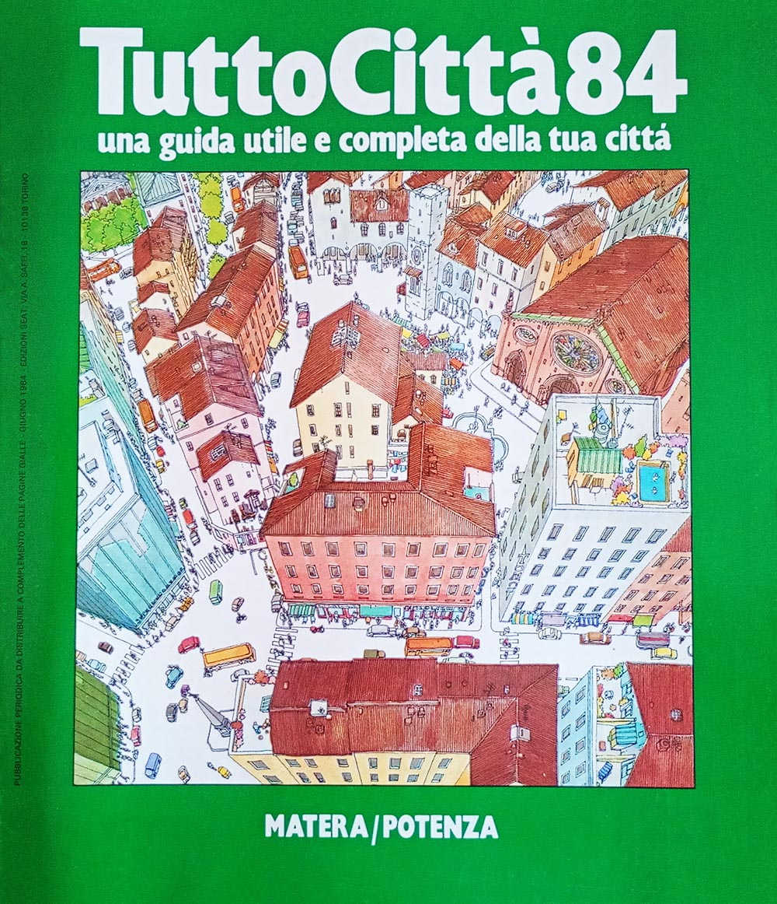</a>
Matera - Potenza 84
<ul class="scheda"><li><b>Formato:</b> 246 x 280 mm</li><li><b>Copertina:</b> grossa</li><li><b>Layout:</b> TuttoCittà '80 classico</li><li><b>Pagine:</b> 24</li><li><b>Mese aggiornamento:</b> giugno 1984</li><li><b>Note:</b> Inserto Costituzione</li></ul></td></tr>
<tr><td class="ann"> 85/86</td><td class="tav"></td><td class="fasc sospesa">
Matera - Potenza 86
<ul class="scheda"><li><b>Formato:</b> 246 x 280 mm</li><li><b>Copertina:</b> grossa</li><li><b>Layout:</b> TuttoCittà '80 classico</li><li><b>Note:</b> da serie iniziale a serie tardiva</li><li>non in raccolta</li></ul></td></tr>
<tr><td class="ann"> 86/87</td><td class="tav"></td><td class="fasc"><a href="../immagini/MTPT87.jpg">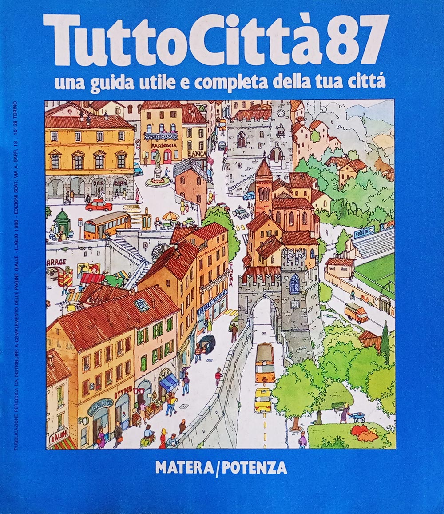</a>
Matera - Potenza 87
<ul class="scheda"><li><b>Formato:</b> 246 x 280 mm</li><li><b>Copertina:</b> grossa</li><li><b>Layout:</b> TuttoCittà '80 classico</li><li><b>Pagine:</b> 24</li><li><b>Mese aggiornamento:</b> luglio 1986</li></ul></td></tr>
<tr><td class="ann"> 87/88</td><td class="tav"></td><td class="fasc"><a href="../immagini/MTPT88.jpg">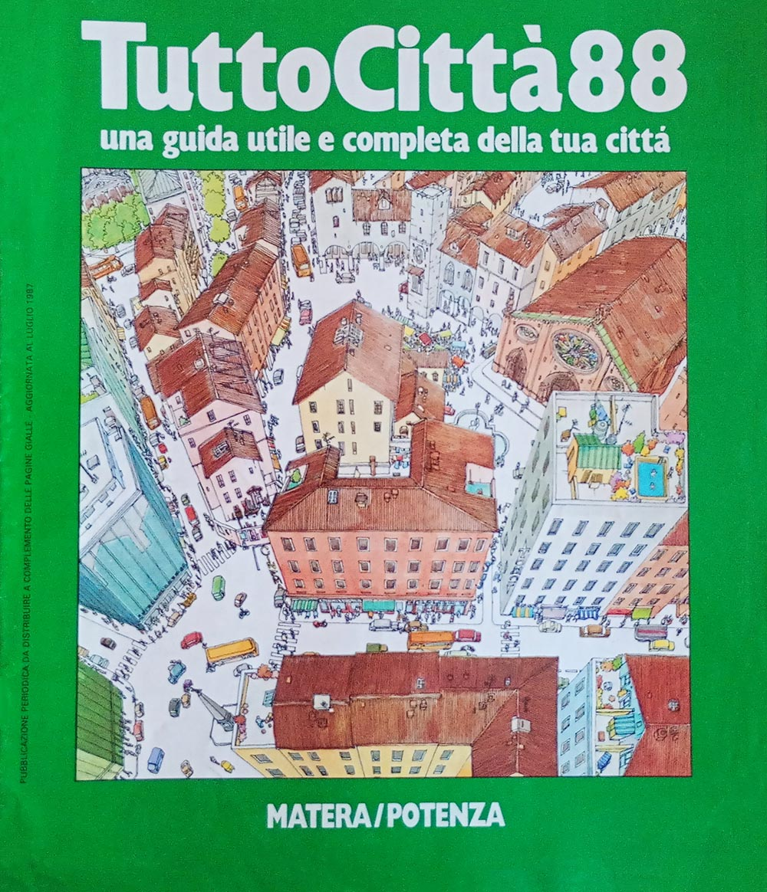</a>
Matera - Potenza 88
<ul class="scheda"><li><b>Formato:</b> 246 x 280 mm</li><li><b>Copertina:</b> grossa</li><li><b>Layout:</b> TuttoCittà '80 classico</li><li><b>Pagine:</b> 16</li><li><b>Mese aggiornamento:</b> luglio 1987</li></ul></td></tr>
<tr><td class="ann"> 88/89</td><td class="tav"></td><td class="fasc"><a href="../immagini/MTPT89.jpg">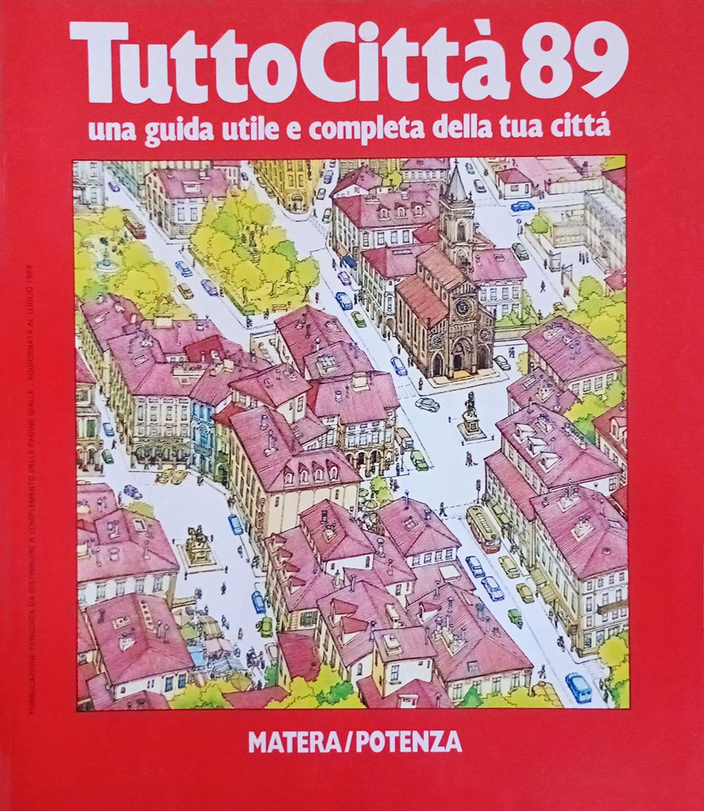</a>
Matera - Potenza 89
<ul class="scheda"><li><b>Formato:</b> 246 x 280 mm</li><li><b>Copertina:</b> grossa</li><li><b>Layout:</b> TuttoCittà '80 classico</li><li><b>Pagine:</b> 16</li><li><b>Mese aggiornamento:</b> luglio 1988</li></ul></td></tr>
<tr><td class="ann"> 89/90</td><td class="tav"></td><td class="fasc"><a href="../immagini/MTPT90.jpg">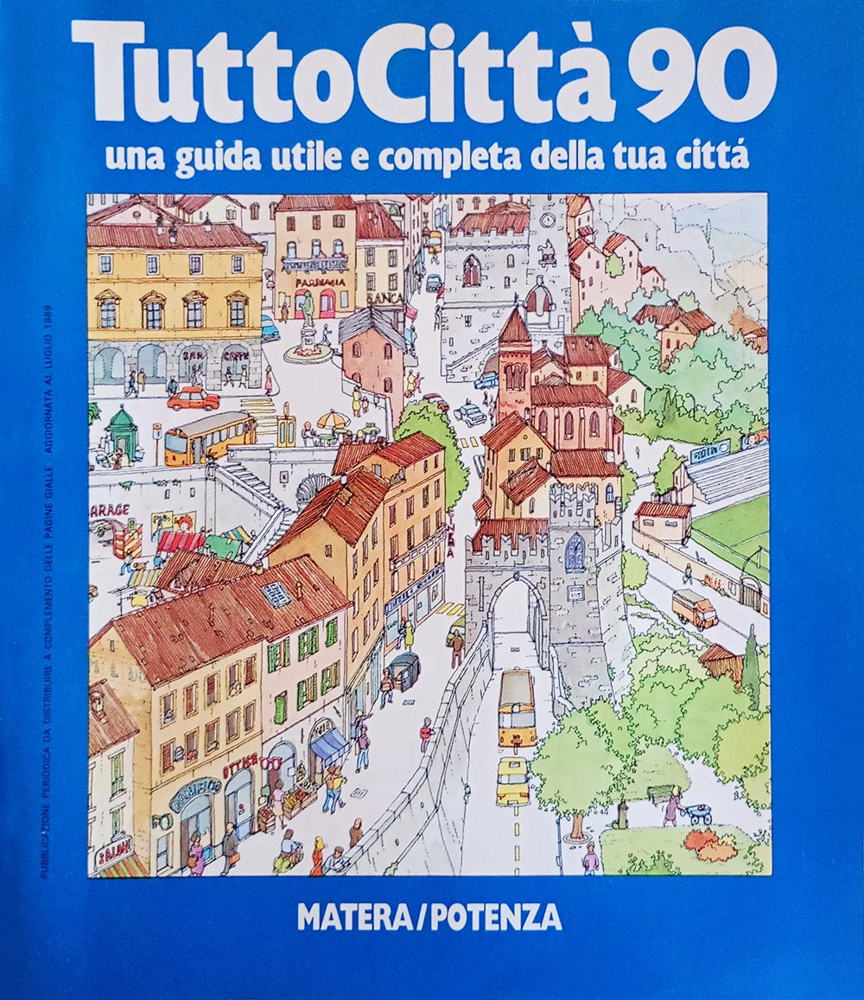</a>
Matera - Potenza 90
<ul class="scheda"><li><b>Formato:</b> 246 x 280 mm</li><li><b>Copertina:</b> grossa</li><li><b>Layout:</b> TuttoCittà '80 classico</li><li><b>Pagine:</b> 16</li><li><b>Mese aggiornamento:</b> luglio 1989</li></ul></td></tr>
<tr><td class="ann"> 90/91</td><td class="tav"></td><td class="fasc"><a href="../immagini/MTPT91.jpg">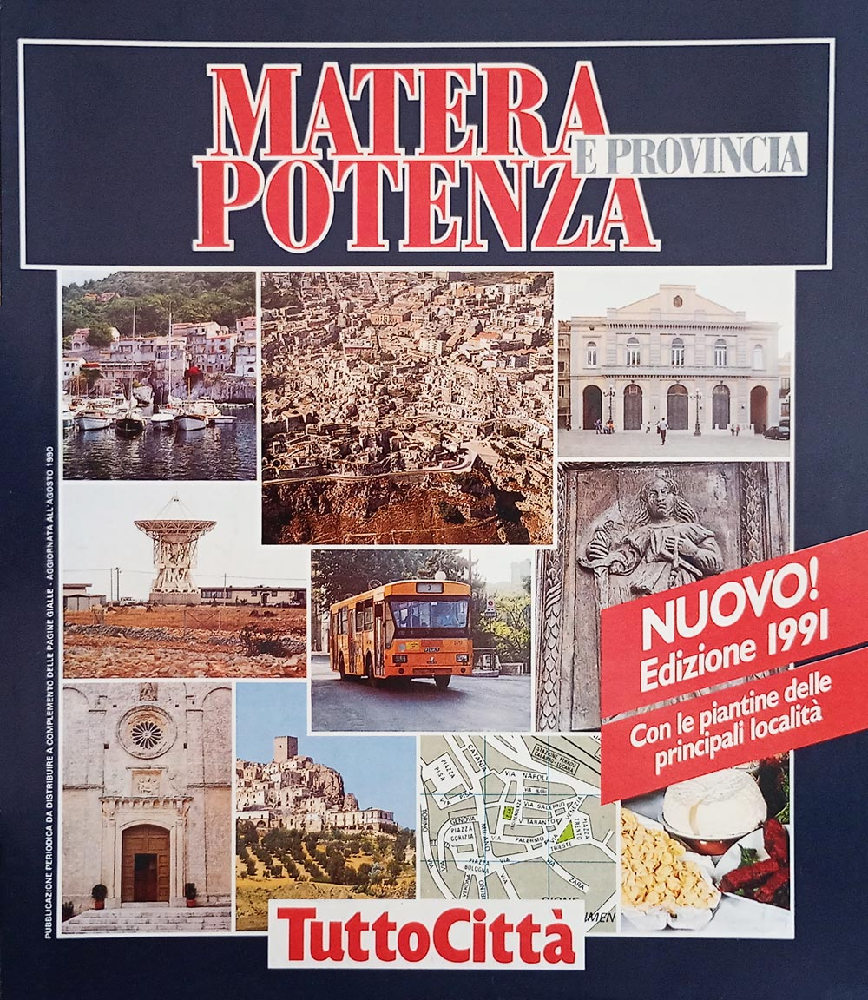</a>
Matera - Potenza 91
<ul class="scheda"><li><b>Formato:</b> 246 x 280 mm</li><li><b>Copertina:</b> grossa</li><li><b>Layout:</b> TuttoCittà '90 classico iniziale</li><li><b>Pagine:</b> 24</li><li><b>Mese aggiornamento:</b> agosto 1990</li><li><b>Note:</b> nota dell'editore</li></ul></td></tr>
<tr><td class="ann"> 91/92</td><td class="tav"></td><td class="fasc"><a href="../immagini/MTPT92.jpg">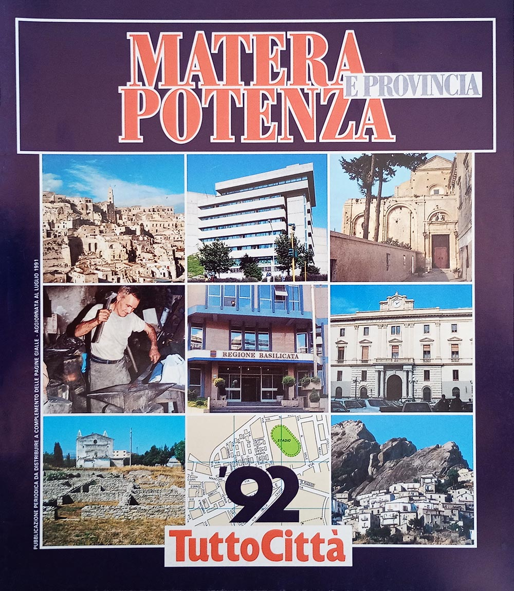</a>
Matera - Potenza 92
<ul class="scheda"><li><b>Formato:</b> 246 x 280 mm</li><li><b>Copertina:</b> grossa</li><li><b>Layout:</b> TuttoCittà '90 classico iniziale</li><li><b>Pagine:</b> 24</li><li><b>Mese aggiornamento:</b> luglio 1991</li></ul></td></tr>
<tr><td class="ann"> 92/93</td><td class="tav"></td><td class="fasc"><a href="../immagini/MTPT93.jpg">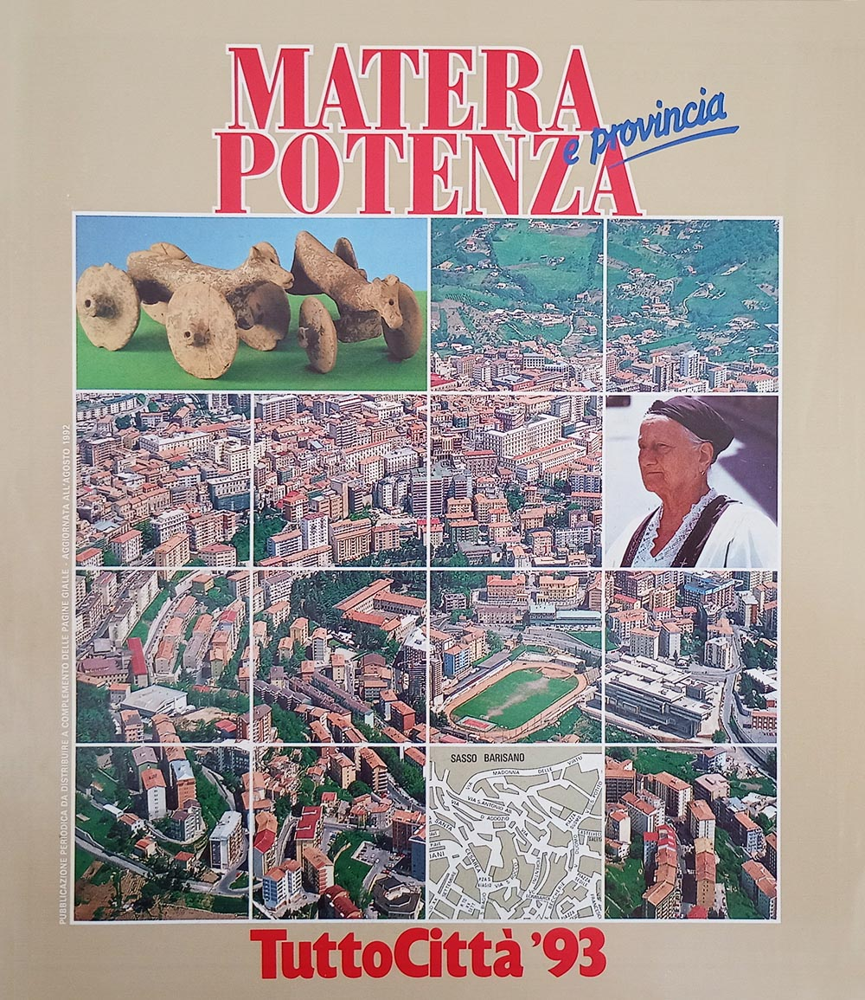</a>
Matera - Potenza 93
<ul class="scheda"><li><b>Formato:</b> 246 x 280 mm</li><li><b>Copertina:</b> grossa</li><li><b>Layout:</b> TuttoCittà '90 classico</li><li><b>Pagine:</b> 24</li><li><b>Mese aggiornamento:</b> agosto 1992</li></ul></td></tr>
<tr><td class="ann"> 93/94</td><td class="tav"></td><td class="fasc"><a href="../immagini/MTPT94.jpg">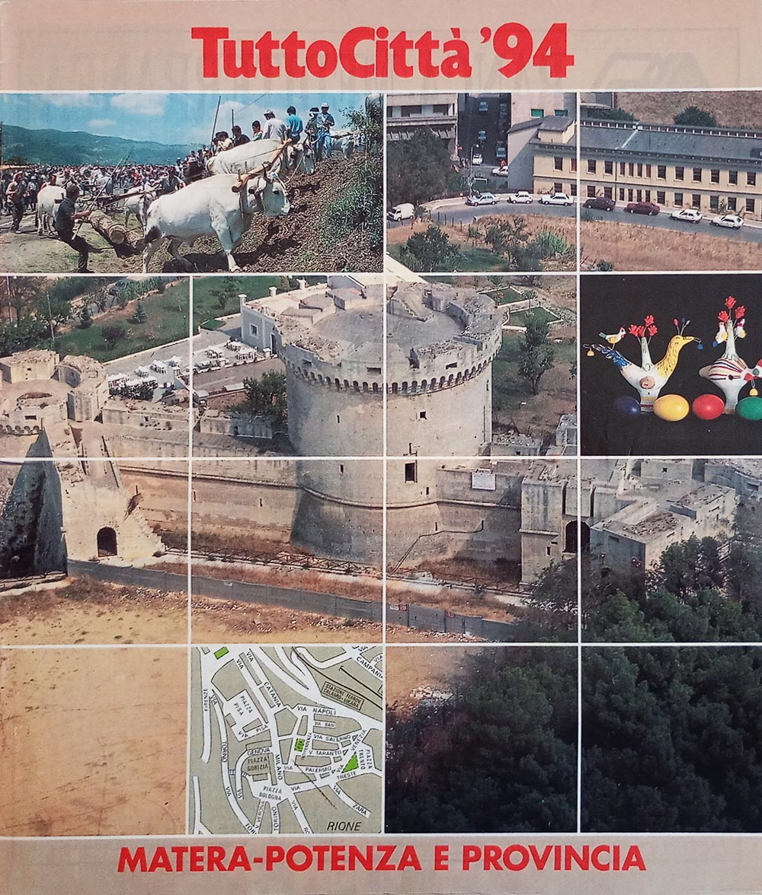</a>
Matera - Potenza 94
<ul class="scheda"><li><b>Formato:</b> 246 x 280 mm</li><li><b>Copertina:</b> sottile</li><li><b>Layout:</b> TuttoCittà '90 classico</li><li><b>Pagine:</b> 22</li><li><b>Mese aggiornamento:</b> agosto 1993</li></ul></td></tr>
<tr><td class="ann"> 94/95</td><td class="tav"></td><td class="fasc sospesa">
Matera - Potenza 95
<ul class="scheda"><li><b>Formato:</b> 246 x 280 mm</li><li><b>Copertina:</b> sottile</li><li><b>Layout:</b> TuttoCittà '90 classico</li><li>non in raccolta</li></ul></td></tr>
<tr><td class="ann"> 95/96</td><td class="tav"></td><td class="fasc"><a href="../immagini/MTPT96.jpg">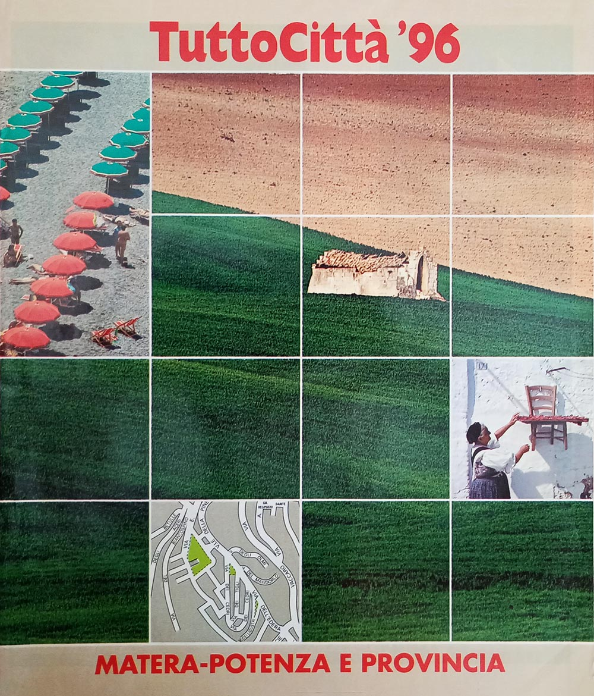</a>
Matera - Potenza 96
<ul class="scheda"><li><b>Formato:</b> 246 x 280 mm</li><li><b>Copertina:</b> sottile</li><li><b>Layout:</b> TuttoCittà '90 classico</li><li><b>Pagine:</b> 22</li><li><b>Mese aggiornamento:</b> agosto 1995</li></ul></td></tr>
<tr><td class="ann"> 96/97</td><td class="tav"></td><td class="fasc sospesa">
Matera - Potenza 97
<ul class="scheda"><li><b>Formato:</b> 246 x 280 mm</li><li><b>Copertina:</b> sottile</li><li><b>Layout:</b> TuttoCittà '90 classico</li><li><b>Note:</b> Cambio formato</li><li>non in raccolta</li></ul></td></tr>
<tr><td class="ann"> 97/98</td><td class="tav"></td><td class="fasc"><a href="../immagini/MTPT98.jpg">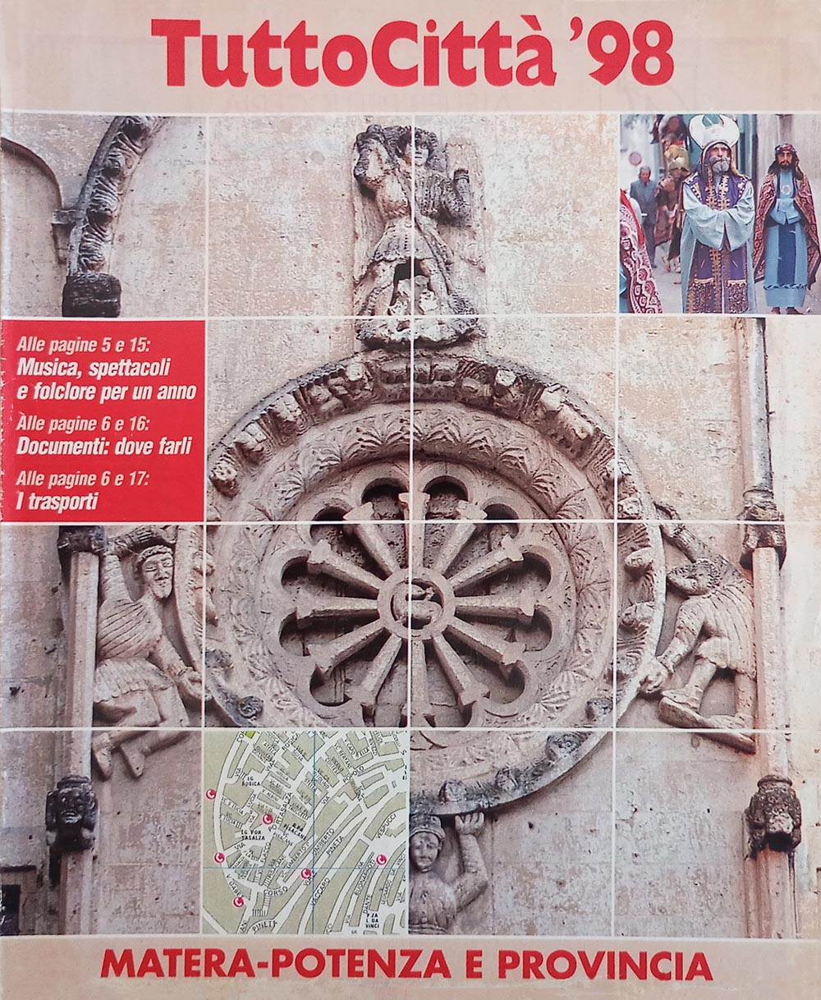</a>
Matera - Potenza 98
<ul class="scheda"><li><b>Formato:</b> 226 x 274 mm</li><li><b>Copertina:</b> sottile</li><li><b>Layout:</b> TuttoCittà '90 classico</li><li><b>Pagine:</b> 22</li><li><b>Mese aggiornamento:</b> agosto 1997</li></ul></td></tr>
</tbody>
</table>

## Tre layout in diciassette anni

La seguente tabella censisce i vari layout utilizzati per i fascicoli della regione, secondo il
sistema definito durante il censimento osservando l'impaginazione; le loro caratteristiche sono
descritte in [questa pagina](tabella-layout.md). Come descritto anche lì, i cambi di layout non
rispettano i cambi delle serie di copertina descritte nell'[apposita pagina](copertine.md) di questo
sito.

<table class="layout-dettaglio">
<thead><tr><th>Layout</th><th>Annate</th><th>Anni di copertina</th></tr></thead>
<tbody>
<tr><td>TuttoCittà '80 classico</td><td class="ann">83/84 – 89/90</td><td class="cop">83<i class="pt"></i>84<i class="pt"></i>86<i class="pt"></i>87<i class="pt"></i>88<i class="pt"></i>89<i class="pt"></i>90</td></tr>
<tr><td>TuttoCittà '90 classico iniziale</td><td class="ann">90/91 – 91/92</td><td class="cop">91<i class="pt"></i>92</td></tr>
<tr><td>TuttoCittà '90 classico</td><td class="ann">92/93 – 97/98</td><td class="cop">93<i class="pt"></i>94<i class="pt"></i>95<i class="pt"></i>96<i class="pt"></i>97<i class="pt"></i>98</td></tr>
</tbody>
</table>

Non compaiono le annate 81/82 e 82/83: il fascicolo non è in raccolta e il layout non è stato accertato.

## Le città cartografate

La seguente tabella censisce tutti i comuni che sono stati cartografati nel corso del tempo e per
quante annate. Ad ogni riga corrisponde un comune, in ordine alfabetico e non per provincia: lo
scopo è infatti identificare a colpo d'occhio quali comuni entrano ed escono dalla cartografia nel
corso degli anni. I due capoluoghi — MATERA, POTENZA — sono in maiuscolo, ma restano al loro posto
nell'alfabeto. La croce segna le annate in cui il fascicolo non è in raccolta: non sappiamo se il
comune fosse cartografato.

Le caselle azzurre indicano invece che il comune era cartografato, ma non compariva il relativo
elenco delle vie, un fenomeno questo relativamente comune soprattutto nei fascicoli degli anni '80. È
il caso di Policoro, che entra nella cartografia due annate prima di entrare
nell'indice.

Espandi la griglia delle città — 3 città su 17 annate

<table class="griglia">
  <thead><tr><th scope="col">Città</th><th scope="col" class="ann dec">81/82</th><th scope="col" class="ann">82/83</th><th scope="col" class="ann">83/84</th><th scope="col" class="ann">84/85</th><th scope="col" class="ann">85/86</th><th scope="col" class="ann">86/87</th><th scope="col" class="ann">87/88</th><th scope="col" class="ann">88/89</th><th scope="col" class="ann">89/90</th><th scope="col" class="ann dec">90/91</th><th scope="col" class="ann">91/92</th><th scope="col" class="ann">92/93</th><th scope="col" class="ann">93/94</th><th scope="col" class="ann">94/95</th><th scope="col" class="ann">95/96</th><th scope="col" class="ann">96/97</th><th scope="col" class="ann">97/98</th></tr></thead>
  <tbody>
  <tr><th scope="row">MATERA</th><td class="ig dec" title="MATERA — 81/82: non accertato, fascicolo mancante">&#215;</td><td class="ig" title="MATERA — 82/83: non accertato, fascicolo mancante">&#215;</td><td class="ig" title="MATERA — 83/84: non accertato, fascicolo mancante">&#215;</td><td class="si" title="MATERA — 84/85"></td><td class="ig" title="MATERA — 85/86: non accertato, fascicolo mancante">&#215;</td><td class="si" title="MATERA — 86/87"></td><td class="si" title="MATERA — 87/88"></td><td class="si" title="MATERA — 88/89"></td><td class="si" title="MATERA — 89/90"></td><td class="si dec" title="MATERA — 90/91"></td><td class="si" title="MATERA — 91/92"></td><td class="si" title="MATERA — 92/93"></td><td class="si" title="MATERA — 93/94"></td><td class="ig" title="MATERA — 94/95: non accertato, fascicolo mancante">&#215;</td><td class="si" title="MATERA — 95/96"></td><td class="ig" title="MATERA — 96/97: non accertato, fascicolo mancante">&#215;</td><td class="si" title="MATERA — 97/98"></td></tr>
  <tr><th scope="row">Policoro</th><td class="ig dec" title="Policoro — 81/82: non accertato, fascicolo mancante">&#215;</td><td class="ig" title="Policoro — 82/83: non accertato, fascicolo mancante">&#215;</td><td class="ig" title="Policoro — 83/84: non accertato, fascicolo mancante">&#215;</td><td class="no" title="Policoro — 84/85"></td><td class="ig" title="Policoro — 85/86: non accertato, fascicolo mancante">&#215;</td><td class="no" title="Policoro — 86/87"></td><td class="no" title="Policoro — 87/88"></td><td class="ni" title="Policoro — 88/89: cartografato, ma assente dall'elenco delle vie"></td><td class="ni" title="Policoro — 89/90: cartografato, ma assente dall'elenco delle vie"></td><td class="si dec" title="Policoro — 90/91"></td><td class="si" title="Policoro — 91/92"></td><td class="si" title="Policoro — 92/93"></td><td class="si" title="Policoro — 93/94"></td><td class="ig" title="Policoro — 94/95: non accertato, fascicolo mancante">&#215;</td><td class="si" title="Policoro — 95/96"></td><td class="ig" title="Policoro — 96/97: non accertato, fascicolo mancante">&#215;</td><td class="si" title="Policoro — 97/98"></td></tr>
  <tr><th scope="row">POTENZA</th><td class="ig dec" title="POTENZA — 81/82: non accertato, fascicolo mancante">&#215;</td><td class="ig" title="POTENZA — 82/83: non accertato, fascicolo mancante">&#215;</td><td class="ig" title="POTENZA — 83/84: non accertato, fascicolo mancante">&#215;</td><td class="si" title="POTENZA — 84/85"></td><td class="ig" title="POTENZA — 85/86: non accertato, fascicolo mancante">&#215;</td><td class="si" title="POTENZA — 86/87"></td><td class="si" title="POTENZA — 87/88"></td><td class="si" title="POTENZA — 88/89"></td><td class="si" title="POTENZA — 89/90"></td><td class="si dec" title="POTENZA — 90/91"></td><td class="si" title="POTENZA — 91/92"></td><td class="si" title="POTENZA — 92/93"></td><td class="si" title="POTENZA — 93/94"></td><td class="ig" title="POTENZA — 94/95: non accertato, fascicolo mancante">&#215;</td><td class="si" title="POTENZA — 95/96"></td><td class="ig" title="POTENZA — 96/97: non accertato, fascicolo mancante">&#215;</td><td class="si" title="POTENZA — 97/98"></td></tr>
  </tbody>
</table>

Le città cartografate almeno una volta sono 3. Sulle 11 annate di cui
la raccolta ha tutti i fascicoli, il minimo è nelle annate 84/85, 86/87 e 87/88, con 2 città; il massimo
nelle annate 88/89–93/94, 95/96 e 97/98, con 3.

## L'indice degli articoli, 1991-1998

Dall'annata 1990/91 ciascuna provincia ha una rubrica di articoli su storia, ambiente ed economia
locale — in molti fascicoli sottotitolata «Vivere la città» — che perdura fino all'annata 1997/98.
Sono 59 titoli in otto annate, mai indicizzati altrove: un piccolo corpus di giornalismo
locale distribuito gratuitamente in centinaia di migliaia di copie e poi scomparso senza lasciare
traccia in alcuna risorsa online.

I titoli sono trascritti come compaiono nel fascicolo. Il testo degli articoli non è riprodotto: i
diritti appartengono all'editore.

<figure class="figura">

<figcaption>Copertina del fascicolo Matera - Potenza 91</figcaption>
</figure>

<h3 id="articoli-90-91">Annata 90/91</h3>
<dl class="articoli">
  <dt>Matera</dt>
  <dd>Anni 90. I Sassi, l'architetto, il laboratorio <b class="perno">&bull;</b> Identikit di una provincia <b class="perno">&bull;</b> «Città di aspetto curiosissimo…» <b class="perno">&bull;</b> Chiese rupestri e madonne contadine <b class="perno">&bull;</b> Date storiche <b class="perno">&bull;</b> Laser e satelliti per la crosta terrestre <b class="perno">&bull;</b> La ricetta della nonna</dd>
  <dt>Potenza</dt>
  <dd>Anni 90. Il parco tecnologico <b class="perno">&bull;</b> Identikit di una provincia <b class="perno">&bull;</b> Se le antiche pietre raccontano la storia <b class="perno">&bull;</b> Aglianico del Vulture il vino ellenico <b class="perno">&bull;</b> I castelli dell'Imperatore poeta</dd>
</dl>
<h3 id="articoli-91-92">Annata 91/92</h3>
<dl class="articoli">
  <dt>Matera</dt>
  <dd>Verso il '92. Fiorisce l'industria nella val Basento <b class="perno">&bull;</b> Lo sportello dei cittadini <b class="perno">&bull;</b> Nomi e cognomi. Rubolino a Policoro, Fornabaio e Stigliano <b class="perno">&bull;</b> Ceramiche e fischietti tradizioni in rilancio <b class="perno">&bull;</b> C'erano una volta i campanacci <b class="perno">&bull;</b> Le radici di Policoro nelle antiche Siris ed Heraclea <b class="perno">&bull;</b> I vini elogiati da Orazio</dd>
  <dt>Potenza</dt>
  <dd>Verso il '92. Potenza, l'industria nel regno dei pini <b class="perno">&bull;</b> Harix, un modello di trasparenza <b class="perno">&bull;</b> I dieci anni di un giovane ateneo laboratorio dell'antica cultura lucana <b class="perno">&bull;</b> Nomi e cognomi. I più diffusi: Telesca e Santarsiero <b class="perno">&bull;</b> Il mistero di Monna Lisa è sepolto a Lagonegro <b class="perno">&bull;</b> Tra boschi e valloni, i gioielli del Medioevo <b class="perno">&bull;</b> Vini e gastronomia. La Regione in cucina <b class="perno">&bull;</b> Le tappe dell'Aglianico</dd>
</dl>
<h3 id="articoli-92-93">Annata 92/93</h3>
<dl class="articoli">
  <dt>Matera</dt>
  <dd>Il futuro possibile. Matera, città d'arte fra i tesori della natura <b class="perno">&bull;</b> Scherzi e "nonsense" nei canti del popolo <b class="perno">&bull;</b> Itinerari per il week-end. Grotte, castelli e abbazie verso la valle del Basento <b class="perno">&bull;</b> Vini e gastronomia. I maccheroni di fuoco e le lagane per i poveri</dd>
  <dt>Potenza</dt>
  <dd>Il futuro possibile. Potenza alla ricerca delle civiltà sepolte <b class="perno">&bull;</b> Pontefici e imperatori ai concili di Melfi <b class="perno">&bull;</b> Polka e lambada al ritmo del "cupa cupa" <b class="perno">&bull;</b> Itinerari per il week-end. Capolavori d'architettura alle pendici del Vulture <b class="perno">&bull;</b> Vini e gastronomia. Orecchiette e dolci con i fichi</dd>
</dl>
<h3 id="articoli-93-94">Annata 93/94</h3>
<dl class="articoli">
  <dt>Matera</dt>
  <dd>Italia domani. Storia, cultura e turismo per rilanciare Matera <b class="perno">&bull;</b> Incontriamoci in piazza Ridola la "bomboniera" dei Sassi <b class="perno">&bull;</b> Dialetto e nomi. Irsina, il paese nato dal bosco</dd>
  <dt>Potenza</dt>
  <dd>Italia domani. Il sorriso di Potenza, colta e solidale <b class="perno">&bull;</b> Val d'Agri, Texas <b class="perno">&bull;</b> Le battaglie civili di Chiaromonte <b class="perno">&bull;</b> La ninna-nanna della zia vecchiarella</dd>
</dl>
<h3 id="articoli-94-95">Annata 94/95</h3>
<dl class="articoli">
  <dt>Matera</dt>
  <dd>in sospeso il fascicolo Matera - Potenza 95 non è in raccolta</dd>
  <dt>Potenza</dt>
  <dd>in sospeso il fascicolo Matera - Potenza 95 non è in raccolta</dd>
</dl>
<h3 id="articoli-95-96">Annata 95/96</h3>
<dl class="articoli">
  <dt>Matera</dt>
  <dd>Progetti giovani. Emergenza occupazione <b class="perno">&bull;</b> Da Montescaglioso a Tursi sulle tracce di arabi e greci <b class="perno">&bull;</b> Paideja, l'arpa è pop</dd>
  <dt>Potenza</dt>
  <dd>Progetti giovani. Ambiente, lavoro e cultura: le sfide di Potenza <b class="perno">&bull;</b> Da Rionero in Vulture a Rapolla, tra torri e abbazie <b class="perno">&bull;</b> Mango, canzoni solari con il cuore a Lagonegro <b class="perno">&bull;</b> Giustino Fortunato, profeta del "nuovo" Mezzogiorno <b class="perno">&bull;</b> La provincia verde. Lupi e falchi pellegrini nel parco del Pollino <b class="perno">&bull;</b> Il pino con l'armatura</dd>
</dl>
<h3 id="articoli-96-97">Annata 96/97</h3>
<dl class="articoli">
  <dt>Matera</dt>
  <dd>in sospeso il fascicolo Matera - Potenza 97 non è in raccolta</dd>
  <dt>Potenza</dt>
  <dd>in sospeso il fascicolo Matera - Potenza 97 non è in raccolta</dd>
</dl>
<h3 id="articoli-97-98">Annata 97/98</h3>
<dl class="articoli">
  <dt>Matera</dt>
  <dd>Matera, il "circo" dei bambini <b class="perno">&bull;</b> Lenticchie e lampasciuoli, la cucina dei sapori antichi <b class="perno">&bull;</b> Tra i libri</dd>
  <dt>Potenza</dt>
  <dd>Potenza, per i ragazzi un porto nel bosco <b class="perno">&bull;</b> Laura Battista, maestra e poetessa nell'800 <b class="perno">&bull;</b> E la lumaca diventò "pecorella" <b class="perno">&bull;</b> I pioppi sul lago di Pignola</dd>
</dl>

## I dati

- [`basilicata_fascicoli.csv`](../dati/basilicata_fascicoli.csv) — un fascicolo per riga: foliazione, layout, formato, copertina, presenza in raccolta
- [`basilicata_cartografia.csv`](../dati/basilicata_cartografia.csv) — un comune per riga e per annata, con la provincia e se compariva nell'elenco delle vie
- [`basilicata_articoli.csv`](../dati/basilicata_articoli.csv) — un titolo per riga: l'indice delle rubriche provinciali

Chi possiede i fascicoli mancanti e vuole vedere questa pagina completata troverà nelle [questioni
aperte](questioni-aperte.md) come contribuire.
