# Le copertine, annata per annata

Trentaquattro annate di copertine, dalla serie classica verde-rosso-azzurra e la serie edifici degli anni ottanta ai blu dei primi
anni novanta, ai beige, ai grigi e agli arancioni dell'ultimo periodo. La sequenza cromatica è, da sola,
il racconto della vita editoriale del prodotto.

**Come leggere le didascalie.** Fino all'annata 1998/99 ogni immagine corrisponde a una copertina
dell'elenco, nell'ordine. Nell'annata 1996/97 le prime due immagini sono due sotto-varianti della
copertina 96, comparse in modo irregolare in un numero non determinato di fascicoli. A partire dall'annata 1999/2000
una stessa immagine può valere per più voci dell'elenco.

Nelle tabelle, il quadratino colorato accanto al nome della copertina riporta il colore con cui la serie è
codificata nel censimento; quella accanto al colore delle tavole è una tinta **indicativa** del colore di
stampa della cartografia, non un campione fedele.

**Il formato cambia due volte:** la prima dalla comparsa dell'anno 97 in copertina, cioè dalla serie
tardiva dell'annata 1996/97, quando si passa da 246 × 280 mm a 226 × 274 mm; la seconda nel corso
dell'annata 2009/2010, quando si passa a 140 × 212 mm. Questo secondo passaggio non riguarda solo le
dimensioni: il rimpicciolimento del fascicolo avviene insieme al cambio del colore di sfondo della
cartografia, che dal grigio cromatico passa al rosa.

## Annata 1981/1982

  <figure>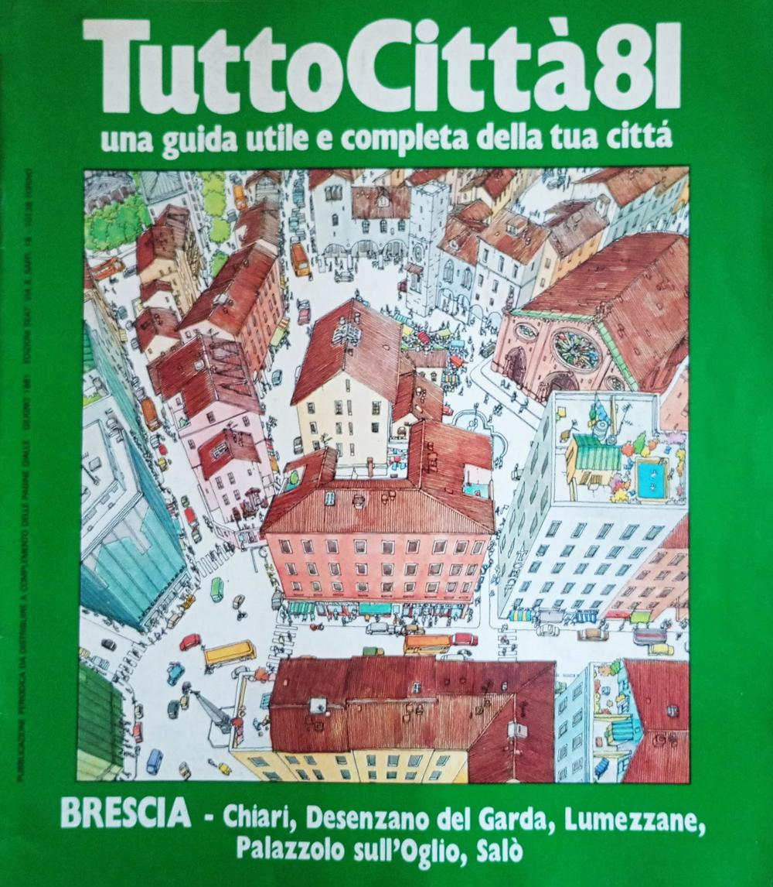<figcaption>Copertina 81 verde 246 x 280 mm</figcaption></figure>
  <figure><figcaption>Copertina 82 verde 246 x 280 mm</figcaption></figure>

<table class="cop">
<thead><tr><th>copertina</th><th>fascicoli</th><th>colore tavole</th></tr></thead>
<tbody>
  <tr><td> Copertina 81 verde</td><td>39</td><td> Arancione</td></tr>
  <tr><td> Copertina 82 verde</td><td>25</td><td> Arancione</td></tr>
</tbody>
</table>

## Annata 1982/1983

  <figure>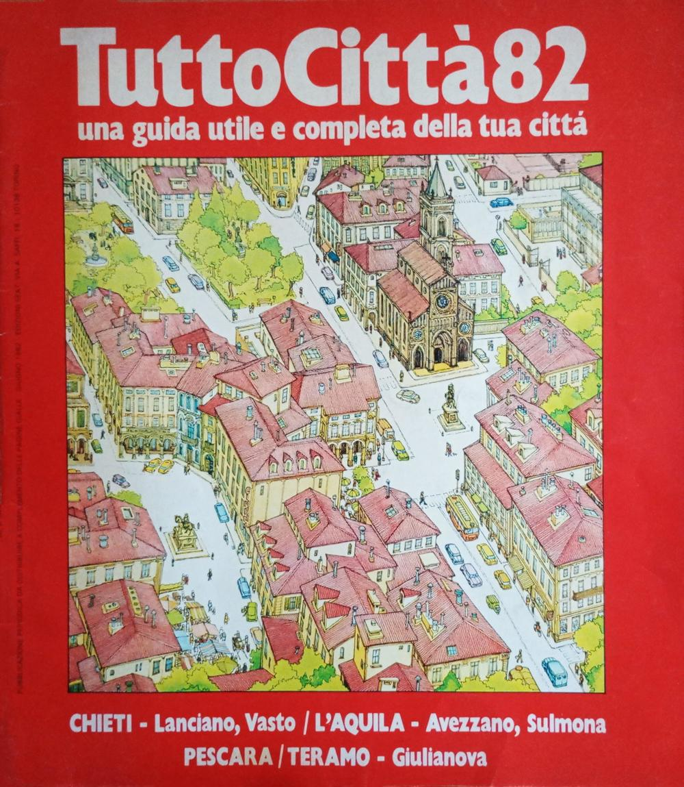<figcaption>Copertina 82 rossa 246 x 280 mm</figcaption></figure>
  <figure>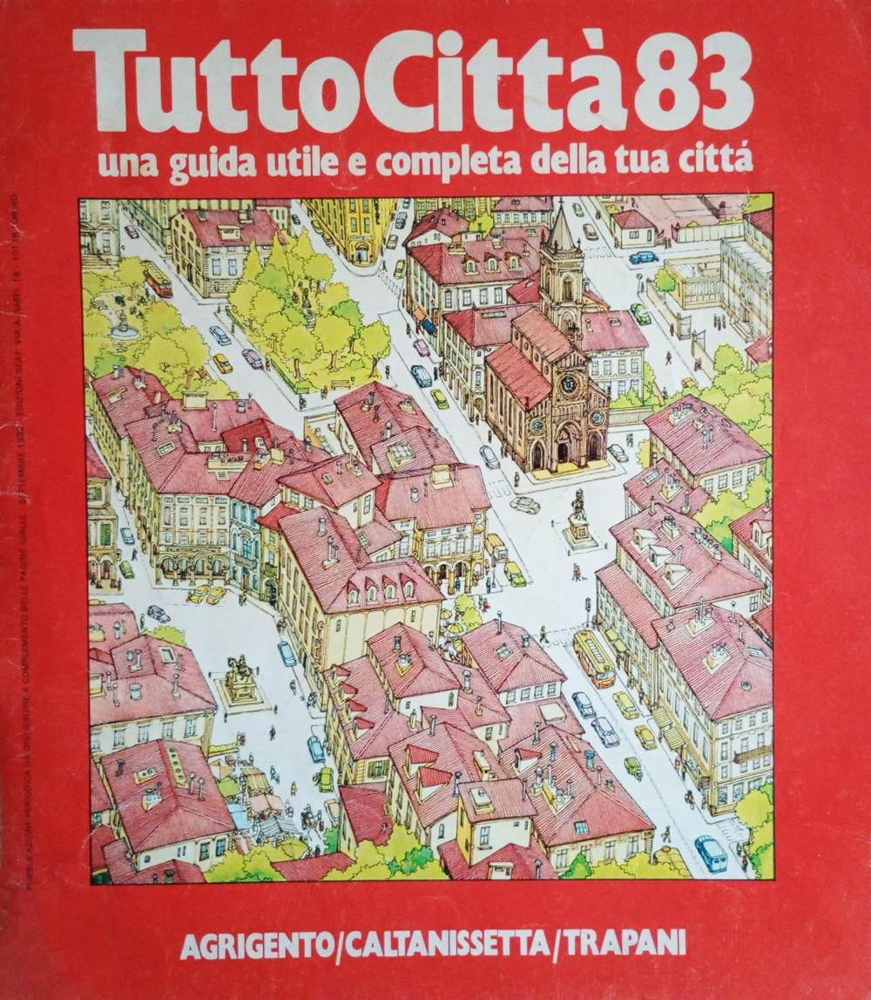<figcaption>Copertina 83 rossa 246 x 280 mm</figcaption></figure>

<table class="cop">
<thead><tr><th>copertina</th><th>fascicoli</th><th>colore tavole</th></tr></thead>
<tbody>
  <tr><td> Copertina 82 rossa</td><td>39</td><td> Arancione</td></tr>
  <tr><td> Copertina 83 rossa</td><td>25</td><td> Arancione</td></tr>
</tbody>
</table>

## Annata 1983/1984

  <figure><figcaption>Copertina 83 azzurra 246 x 280 mm</figcaption></figure>
  <figure><figcaption>Copertina 84 azzurra 246 x 280 mm</figcaption></figure>

<table class="cop">
<thead><tr><th>copertina</th><th>fascicoli</th><th>colore tavole</th></tr></thead>
<tbody>
  <tr><td> Copertina 83 azzurra</td><td>39</td><td> Arancione</td></tr>
  <tr><td> Copertina 84 azzurra</td><td>25</td><td> Arancione</td></tr>
</tbody>
</table>

## Annata 1984/1985

  <figure><figcaption>Copertina 84 verde 246 x 280 mm</figcaption></figure>
  <figure>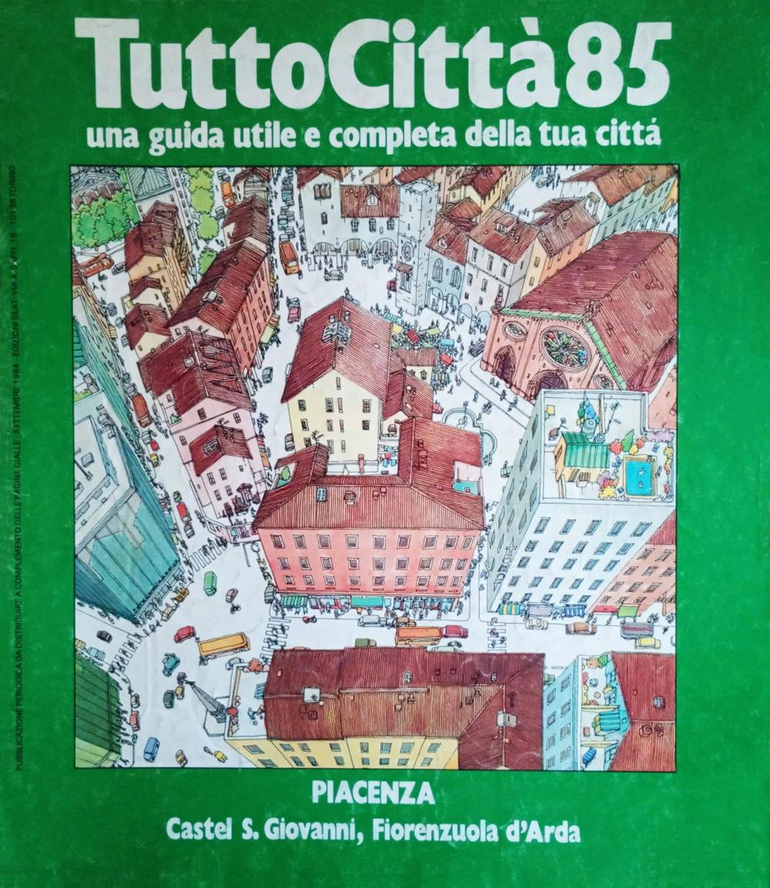<figcaption>Copertina 85 verde 246 x 280 mm</figcaption></figure>

<table class="cop">
<thead><tr><th>copertina</th><th>fascicoli</th><th>colore tavole</th></tr></thead>
<tbody>
  <tr><td> Copertina 84 verde</td><td>47</td><td> Arancione</td></tr>
  <tr><td> Copertina 85 verde</td><td>29</td><td> Arancione</td></tr>
</tbody>
</table>

*Sono incluse due pagine a fondo azzurro coi primi 54 articoli della Costituzione della Repubblica Italiana (tutta l'annata tranne il fascicolo "Milano e comuni limitrofi 84", che le include nel fascicolo 85 a copertina rossa, appartenente all'annata 1985/86)*

## Annata 1985/1986

  <figure>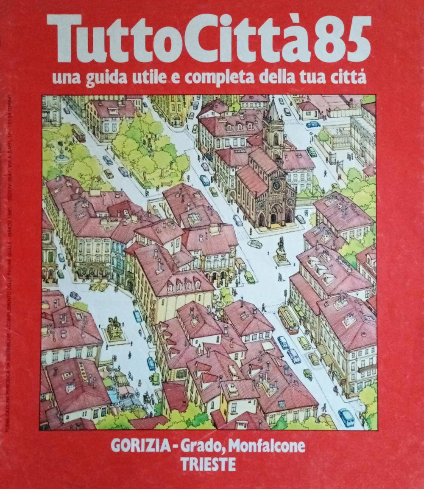<figcaption>Copertina 85 rossa 246 x 280 mm</figcaption></figure>
  <figure><figcaption>Copertina 86 rossa 246 x 280 mm</figcaption></figure>
  <figure>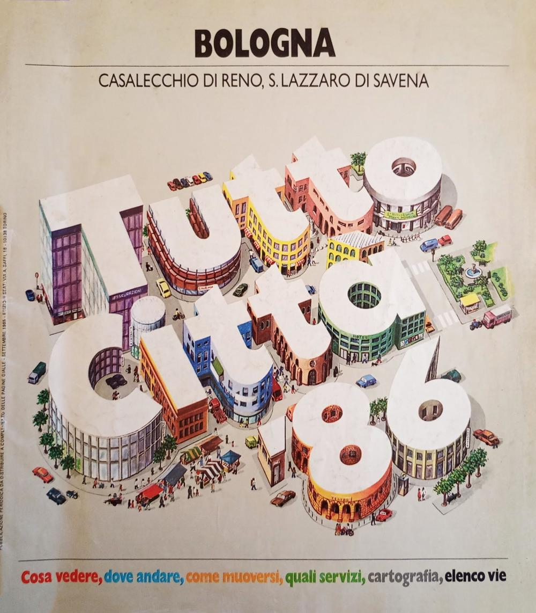<figcaption>Copertina 86 edifici 246 x 280 mm</figcaption></figure>

<table class="cop">
<thead><tr><th>copertina</th><th>fascicoli</th><th>colore tavole</th></tr></thead>
<tbody>
  <tr><td> Copertina 85 rossa</td><td>41</td><td> Arancione</td></tr>
  <tr><td> Copertina 86 rossa</td><td>29</td><td> Arancione</td></tr>
  <tr><td> Copertina 86 edifici</td><td>7</td><td> Arancione</td></tr>
</tbody>
</table>

*Fascicoli che saltano da 84 a 86 in copertina: Matera - Potenza, Avellino - Salerno, Benevento - Caserta, Napoli e comuni limitrofi, Provincia di Napoli, Bologna*

*Riforma cartografica delle 10 città maggiori - serie edifici*

## Annata 1986/1987

  <figure><figcaption>Copertina 86 azzurra 246 x 280 mm</figcaption></figure>
  <figure>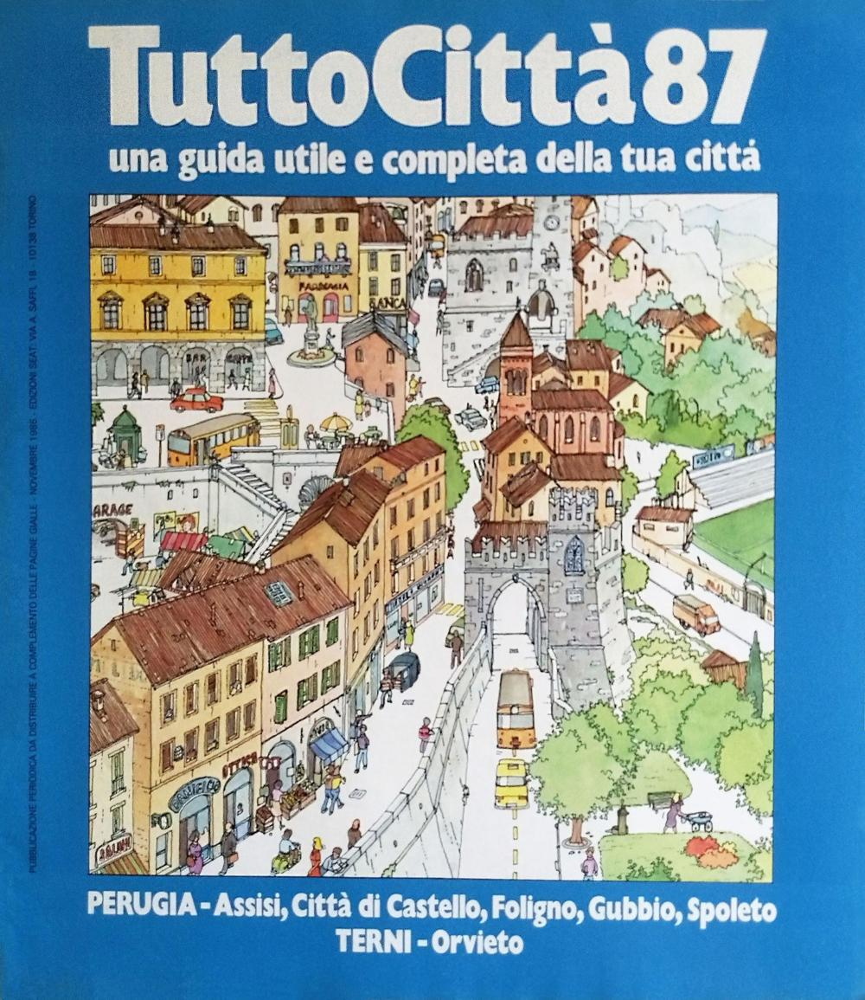<figcaption>Copertina 87 azzurra 246 x 280 mm</figcaption></figure>
  <figure>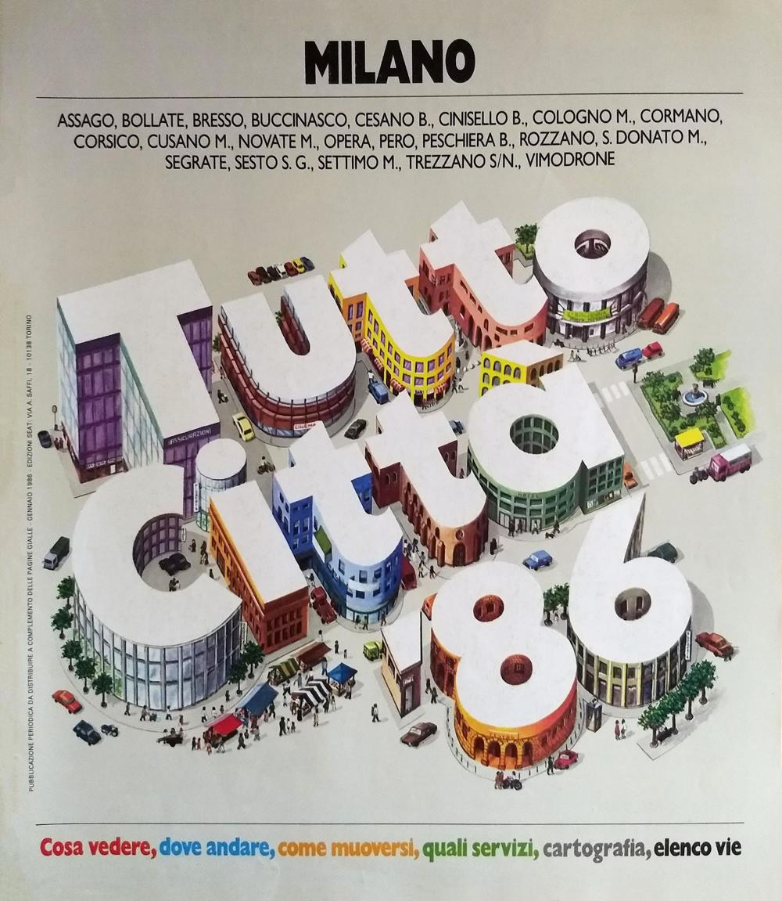<figcaption>Copertina 86 edifici 246 x 280 mm</figcaption></figure>
  <figure><figcaption>Copertina 87 edifici 246 x 280 mm</figcaption></figure>

<table class="cop">
<thead><tr><th>copertina</th><th>fascicoli</th><th>colore tavole</th></tr></thead>
<tbody>
  <tr><td> Copertina 86 azzurra</td><td>38</td><td> Arancione</td></tr>
  <tr><td> Copertina 87 azzurra</td><td>29</td><td> Arancione</td></tr>
  <tr><td> Copertina 86 edifici</td><td>3</td><td> Arancione</td></tr>
  <tr><td> Copertina 87 edifici</td><td>7</td><td> Arancione</td></tr>
</tbody>
</table>

## Annata 1987/1988

  <figure><figcaption>Copertina 87 verde 246 x 280 mm</figcaption></figure>
  <figure><figcaption>Copertina 88 verde 246 x 280 mm</figcaption></figure>
  <figure>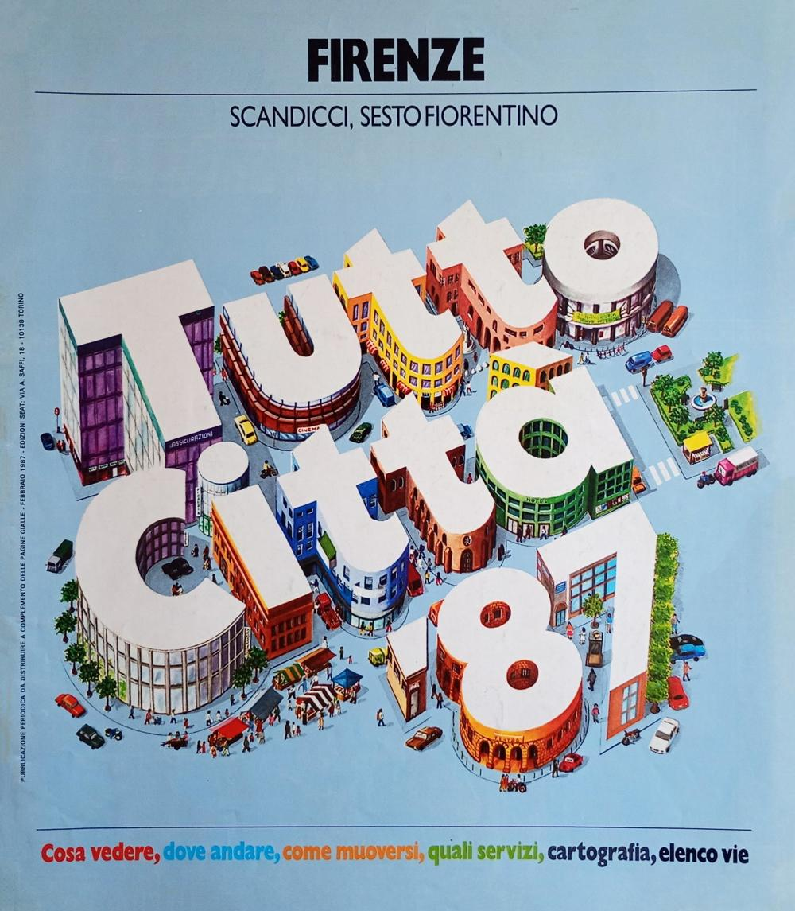<figcaption>Copertina 87 edifici 246 x 280 mm</figcaption></figure>
  <figure><figcaption>Copertina 88 edifici 246 x 280 mm</figcaption></figure>

<table class="cop">
<thead><tr><th>copertina</th><th>fascicoli</th><th>colore tavole</th></tr></thead>
<tbody>
  <tr><td> Copertina 87 verde</td><td>38</td><td> Arancione</td></tr>
  <tr><td> Copertina 88 verde</td><td>30</td><td> Arancione</td></tr>
  <tr><td> Copertina 87 edifici</td><td>3</td><td> Arancione</td></tr>
  <tr><td> Copertina 88 edifici</td><td>7</td><td> Arancione</td></tr>
</tbody>
</table>

## Annata 1988/1989

  <figure>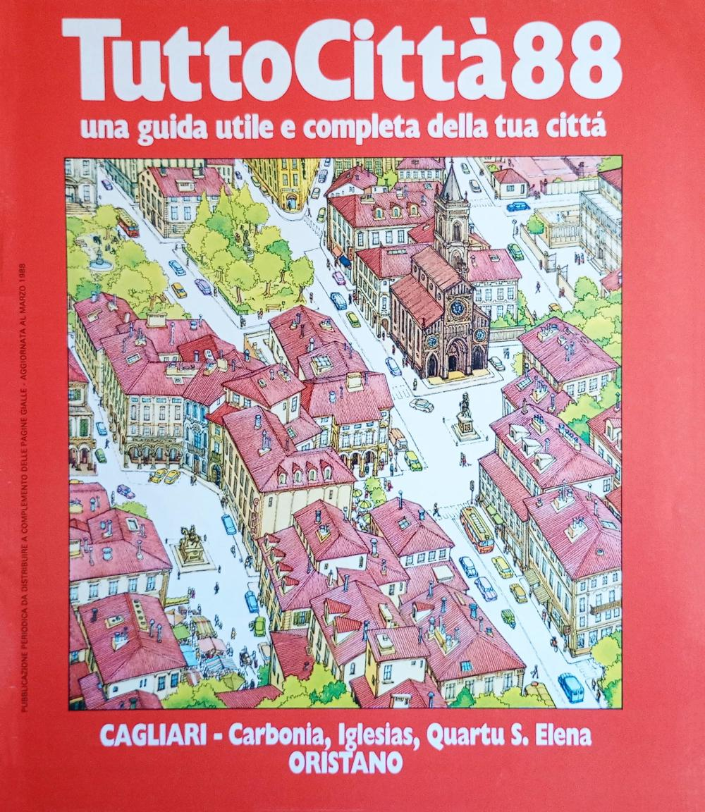<figcaption>Copertina 88 rossa 246 x 280 mm</figcaption></figure>
  <figure>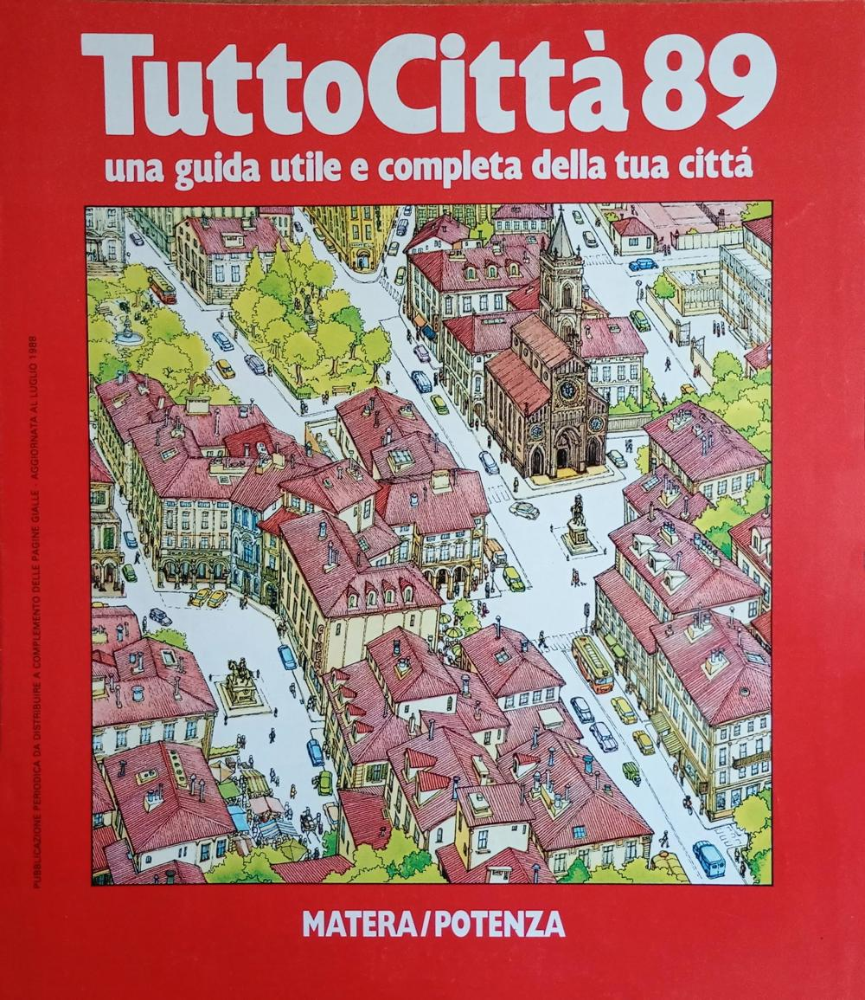<figcaption>Copertina 89 rossa 246 x 280 mm</figcaption></figure>
  <figure><figcaption>Copertina 88 edifici 246 x 280 mm</figcaption></figure>
  <figure><figcaption>Copertina 89 edifici 246 x 280 mm</figcaption></figure>

<table class="cop">
<thead><tr><th>copertina</th><th>fascicoli</th><th>colore tavole</th></tr></thead>
<tbody>
  <tr><td> Copertina 88 rossa</td><td>42</td><td> Arancione</td></tr>
  <tr><td> Copertina 89 rossa</td><td>31</td><td> Arancione</td></tr>
  <tr><td> Copertina 88 edifici</td><td>3</td><td> Arancione</td></tr>
  <tr><td> Copertina 89 edifici</td><td>7</td><td> Arancione</td></tr>
</tbody>
</table>

## Annata 1989/1990

  <figure>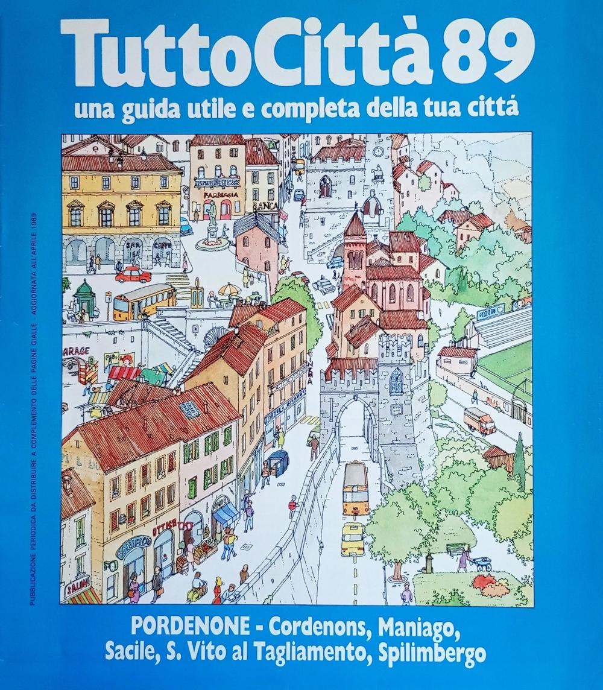<figcaption>Copertina 89 azzurra 246 x 280 mm</figcaption></figure>
  <figure>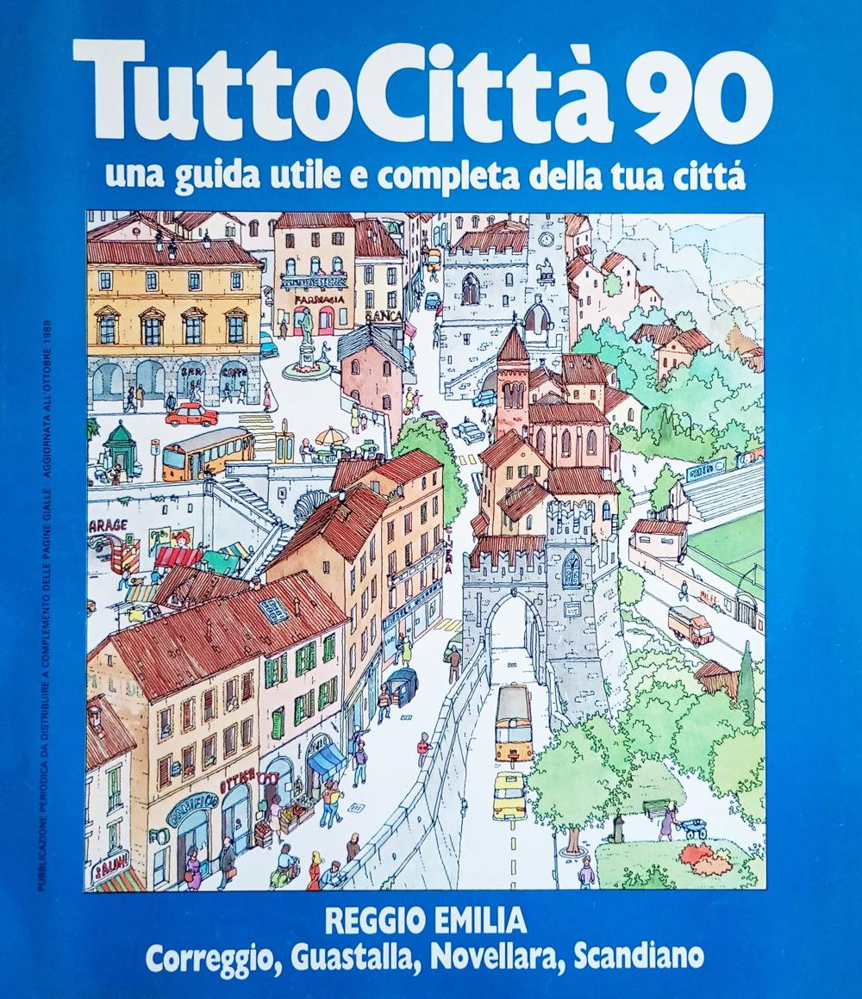<figcaption>Copertina 90 azzurra 246 x 280 mm</figcaption></figure>
  <figure>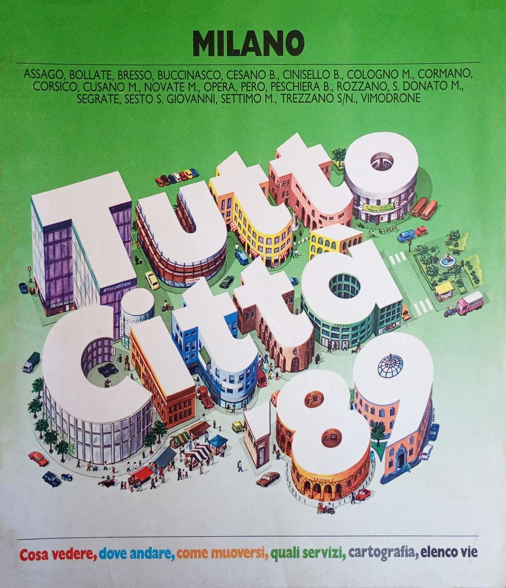<figcaption>Copertina 89 edifici 246 x 280 mm</figcaption></figure>
  <figure>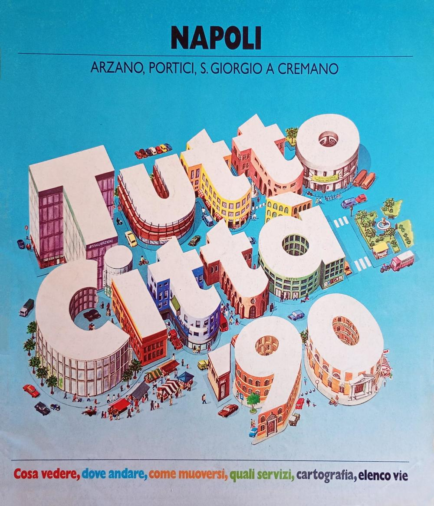<figcaption>Copertina 90 edifici 246 x 280 mm</figcaption></figure>
  <figure>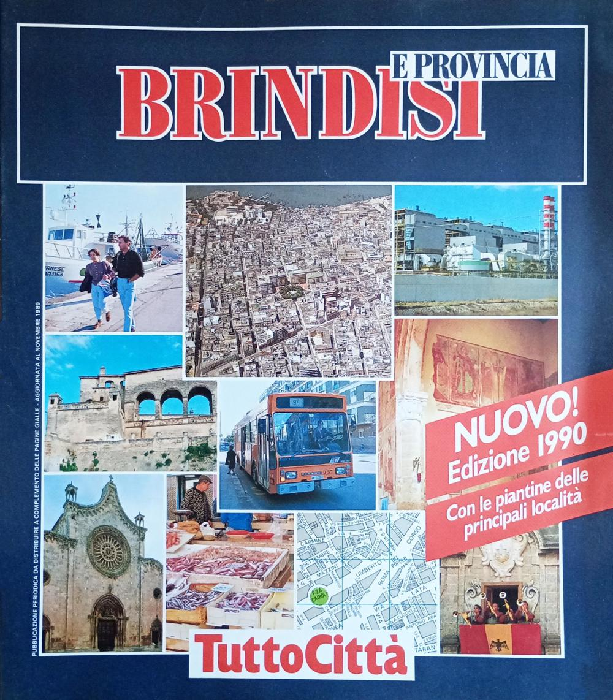<figcaption>Copertina 1990 blu 246 x 280 mm</figcaption></figure>

<table class="cop">
<thead><tr><th>copertina</th><th>fascicoli</th><th>colore tavole</th></tr></thead>
<tbody>
  <tr><td> Copertina 89 azzurra</td><td>44</td><td> Arancione</td></tr>
  <tr><td> Copertina 90 azzurra</td><td>20</td><td> Arancione</td></tr>
  <tr><td> Copertina 89 edifici</td><td>3</td><td> Arancione</td></tr>
  <tr><td> Copertina 90 edifici</td><td>5</td><td> Arancione</td></tr>
  <tr><td> Copertina 1990 blu</td><td>15</td><td> Grigio</td></tr>
</tbody>
</table>

*Prima grande riforma editoriale a fine annata, con la nascita di una rubrica di articoli sulla provincia e il cambio del colore di fondo della cartografia*

## Annata 1990/1991

  <figure><figcaption>Copertina 1990 blu 246 x 280 mm</figcaption></figure>
  <figure><figcaption>Copertina 90/91 blu 246 x 280 mm</figcaption></figure>
  <figure><figcaption>Copertina 1991 blu 246 x 280 mm</figcaption></figure>
  <figure><figcaption>Copertina 91 blu 246 x 280 mm</figcaption></figure>

<table class="cop">
<thead><tr><th>copertina</th><th>fascicoli</th><th>colore tavole</th></tr></thead>
<tbody>
  <tr><td> Copertina 1990 blu</td><td>2</td><td> Grigio</td></tr>
  <tr><td> Copertina 90/91 blu</td><td>45</td><td> Grigio</td></tr>
  <tr><td> Copertina 1991 blu</td><td>25</td><td> Grigio</td></tr>
  <tr><td> Copertina 91 blu</td><td>15</td><td> Grigio</td></tr>
</tbody>
</table>

## Annata 1991/1992

  <figure><figcaption>Copertina 91 blu 246 x 280 mm</figcaption></figure>
  <figure>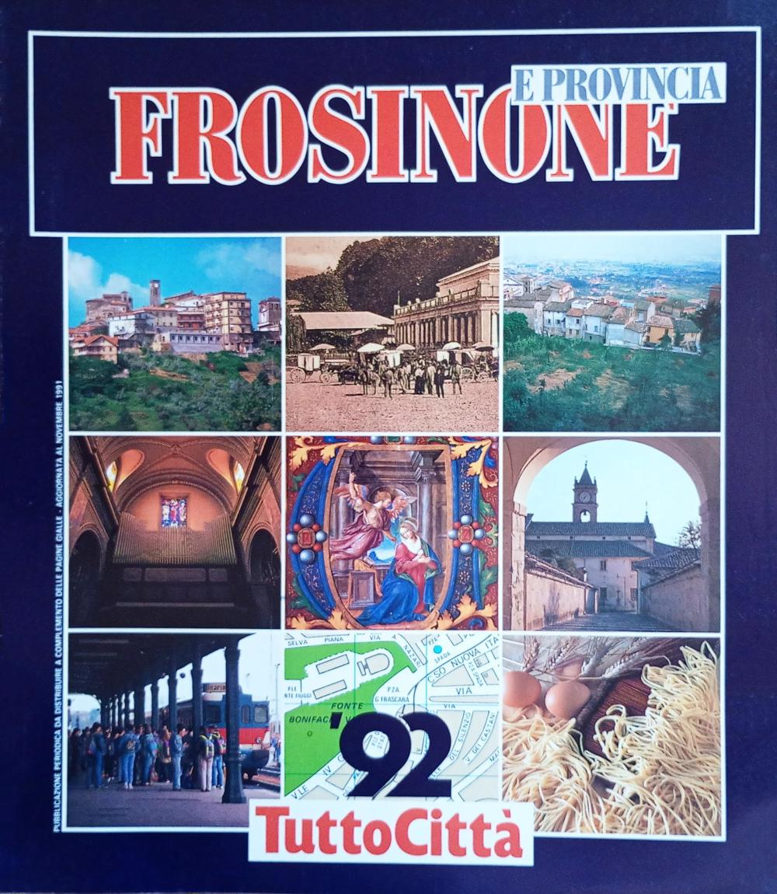<figcaption>Copertina 92 blu 246 x 280 mm</figcaption></figure>
  <figure><figcaption>Copertina 92 beige 246 x 280 mm</figcaption></figure>

<table class="cop">
<thead><tr><th>copertina</th><th>fascicoli</th><th>colore tavole</th></tr></thead>
<tbody>
  <tr><td> Copertina 91 blu</td><td>47</td><td> Grigio</td></tr>
  <tr><td> Copertina 92 blu</td><td>38</td><td> Grigio</td></tr>
  <tr><td> Copertina 92 beige</td><td>2</td><td> Grigio</td></tr>
</tbody>
</table>

## Annata 1992/1993

  <figure><figcaption>Copertina 92 beige 246 x 280 mm</figcaption></figure>
  <figure>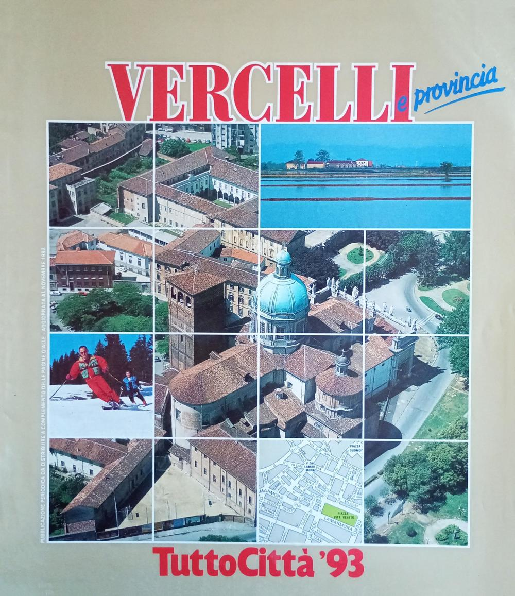<figcaption>Copertina 93 beige 246 x 280 mm</figcaption></figure>

<table class="cop">
<thead><tr><th>copertina</th><th>fascicoli</th><th>colore tavole</th></tr></thead>
<tbody>
  <tr><td> Copertina 92 beige</td><td>47</td><td> Grigio</td></tr>
  <tr><td> Copertina 93 beige</td><td>40</td><td> Grigio</td></tr>
</tbody>
</table>

## Annata 1993/1994

  <figure>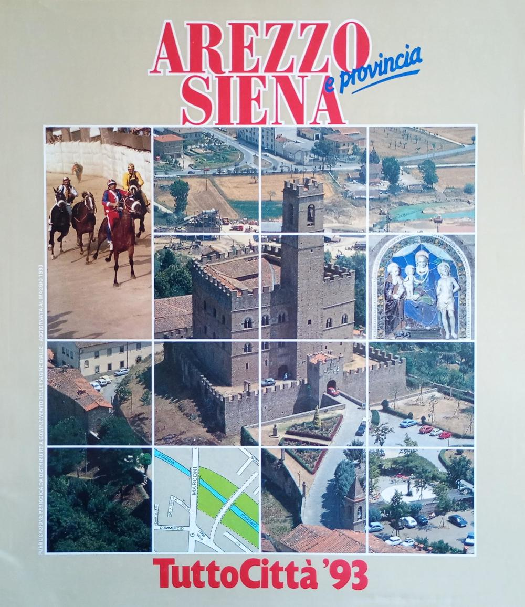<figcaption>Copertina 93 beige 246 x 280 mm</figcaption></figure>
  <figure>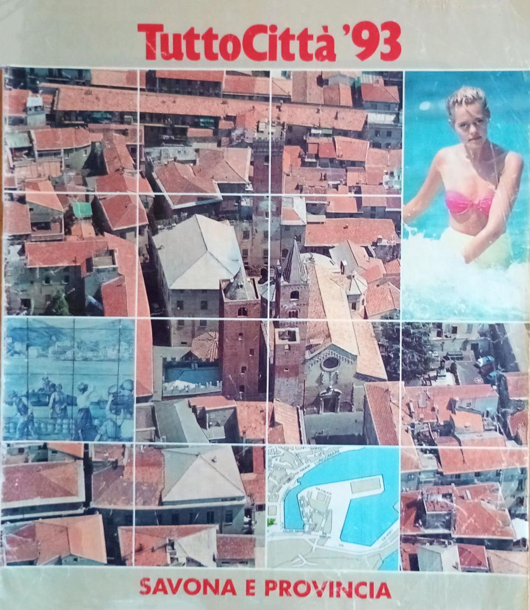<figcaption>Copertina 93 beige 246 x 280 mm</figcaption></figure>
  <figure><figcaption>Copertina 94 beige 246 x 280 mm</figcaption></figure>

<table class="cop">
<thead><tr><th>copertina</th><th>fascicoli</th><th>colore tavole</th></tr></thead>
<tbody>
  <tr><td> Copertina 93 beige</td><td>28</td><td> Grigio</td></tr>
  <tr><td> Copertina 93 beige</td><td>19</td><td> Grigio</td></tr>
  <tr><td> Copertina 94 beige</td><td>40</td><td> Grigio</td></tr>
</tbody>
</table>

## Annata 1994/1995

  <figure>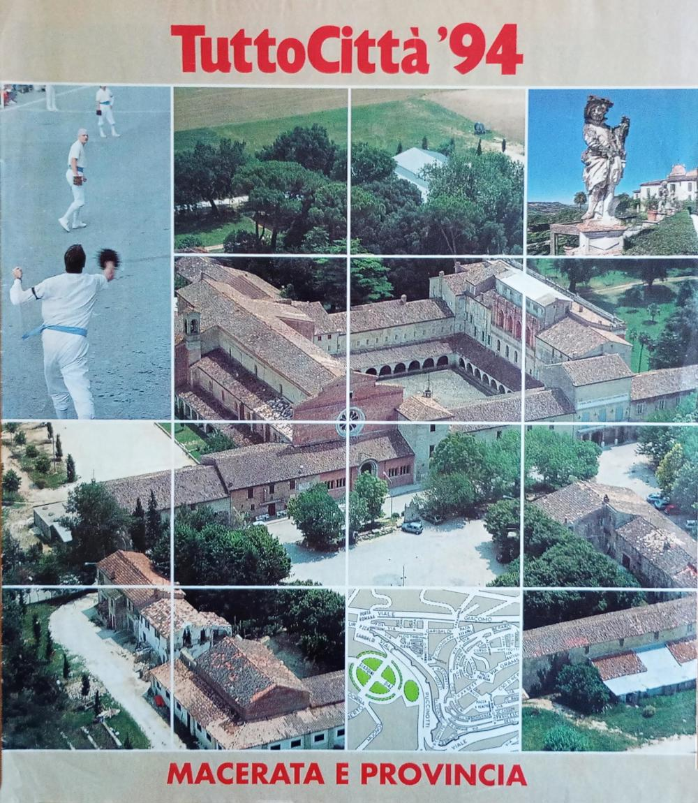<figcaption>Copertina 94 beige 246 x 280 mm</figcaption></figure>
  <figure>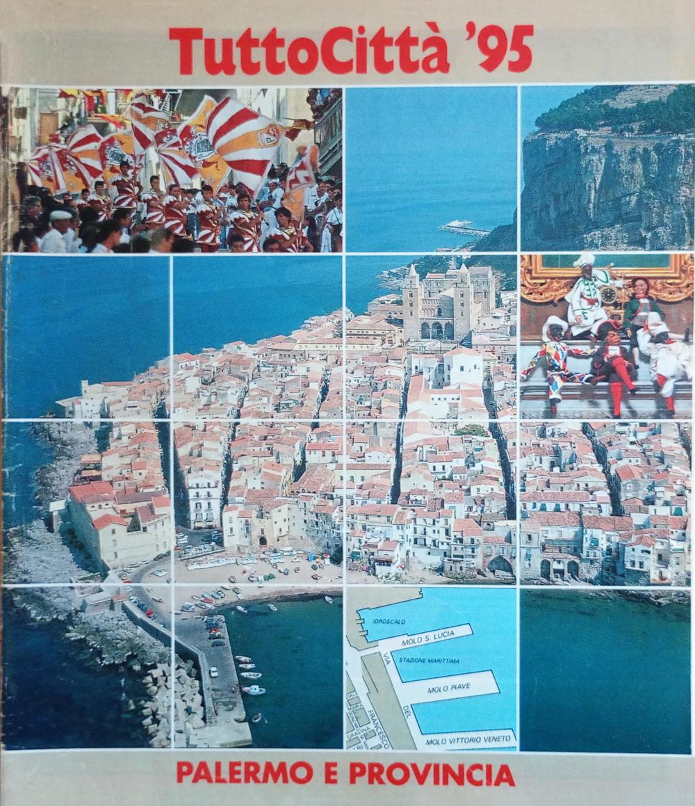<figcaption>Copertina 95 beige 246 x 280 mm</figcaption></figure>

<table class="cop">
<thead><tr><th>copertina</th><th>fascicoli</th><th>colore tavole</th></tr></thead>
<tbody>
  <tr><td> Copertina 94 beige</td><td>47</td><td> Grigio</td></tr>
  <tr><td> Copertina 95 beige</td><td>40</td><td> Grigio</td></tr>
</tbody>
</table>

## Annata 1995/1996

  <figure>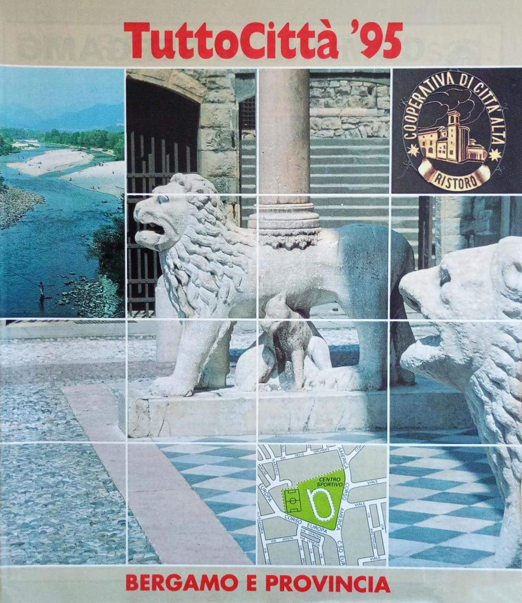<figcaption>Copertina 95 beige 246 x 280 mm</figcaption></figure>
  <figure>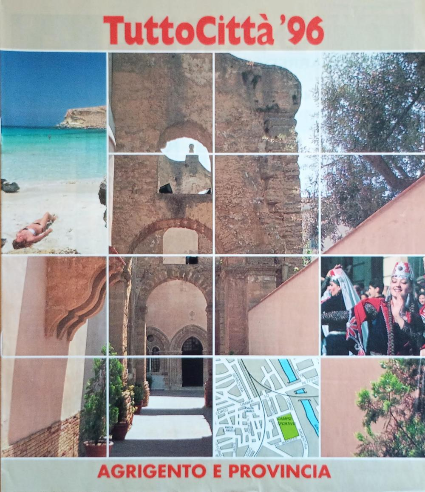<figcaption>Copertina 96 beige 246 x 280 mm</figcaption></figure>

<table class="cop">
<thead><tr><th>copertina</th><th>fascicoli</th><th>colore tavole</th></tr></thead>
<tbody>
  <tr><td> Copertina 95 beige</td><td>47</td><td> Grigio</td></tr>
  <tr><td> Copertina 96 beige</td><td>40</td><td> Grigio</td></tr>
</tbody>
</table>

## Annata 1996/1997

  <figure>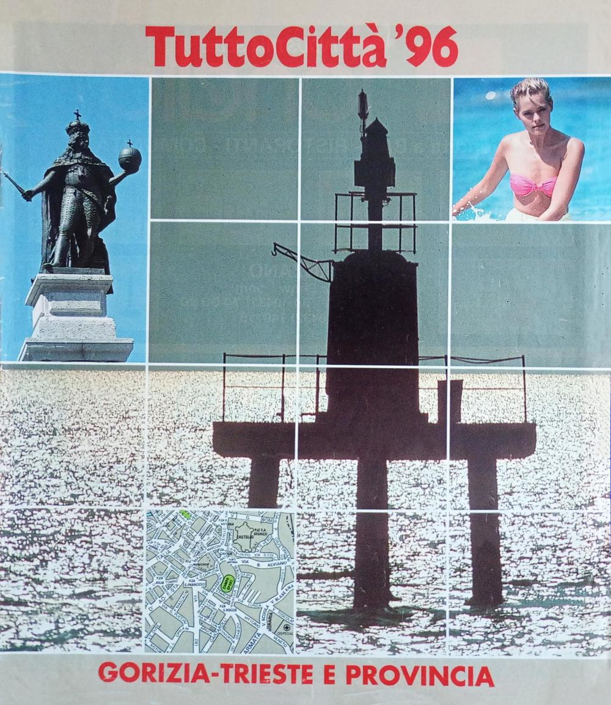<figcaption>Copertina 96 beige, prima variante 246 x 280 mm</figcaption></figure>
  <figure><figcaption>Copertina 96 beige, seconda variante 246 x 280 mm</figcaption></figure>
  <figure><figcaption>Copertina 97 beige 226 x 274 mm</figcaption></figure>

<table class="cop">
<thead><tr><th>copertina</th><th>fascicoli</th><th>colore tavole</th></tr></thead>
<tbody>
  <tr><td> Copertina 96 beige</td><td>47</td><td> Grigio</td></tr>
  <tr><td> Copertina 97 beige</td><td>40</td><td> Grigio</td></tr>
</tbody>
</table>

*In alcuni fascicoli 96 si introduce il riquadro sommario presente poi anche nei fascicoli 97*

*Dai fascicoli 97 cambia il formato*

## Annata 1997/1998

  <figure><figcaption>Copertina 97 beige 226 x 274 mm</figcaption></figure>
  <figure>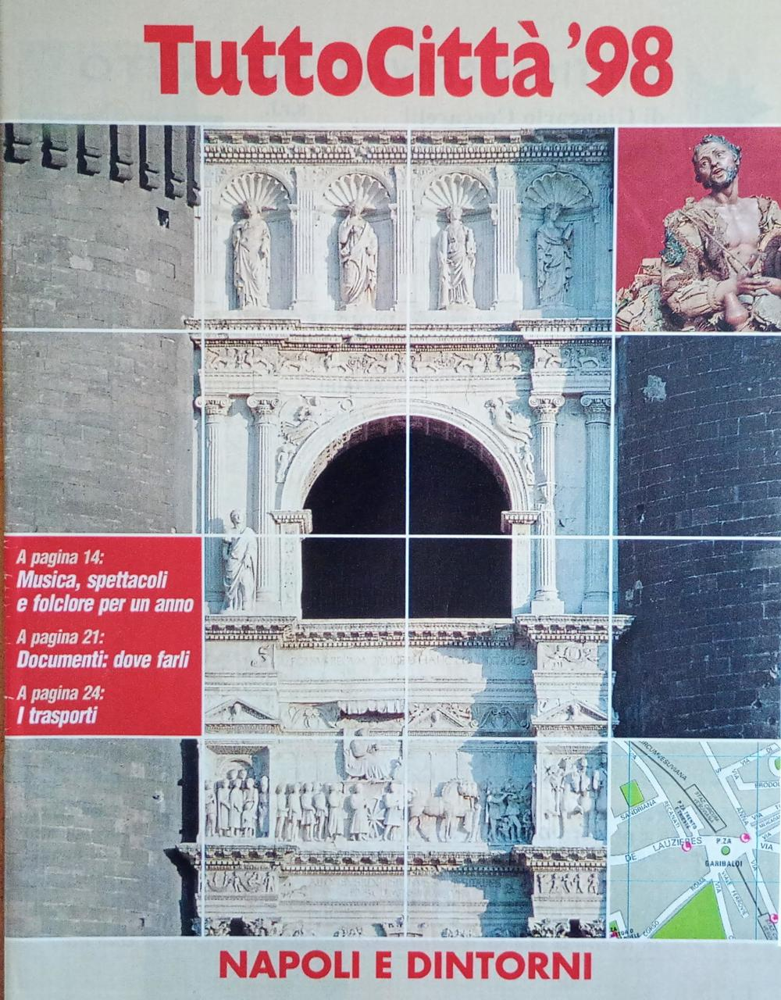<figcaption>Copertina 98 beige 226 x 274 mm</figcaption></figure>
  <figure>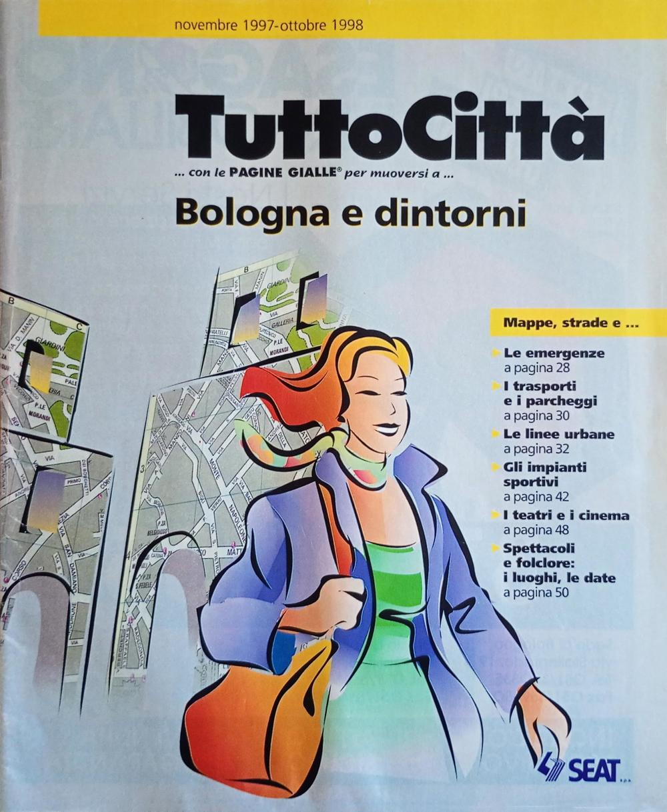<figcaption>Copertina grigia 226 x 274 mm</figcaption></figure>
  <figure><figcaption>Copertina grigia 226 x 274 mm</figcaption></figure>

<table class="cop">
<thead><tr><th>copertina</th><th>fascicoli</th><th>colore tavole</th></tr></thead>
<tbody>
  <tr><td> Copertina 97 beige</td><td>47</td><td> Grigio</td></tr>
  <tr><td> Copertina 98 beige</td><td>5</td><td> Grigio</td></tr>
  <tr><td> Copertina grigia</td><td>33</td><td> Grigio</td></tr>
  <tr><td> Copertina grigia</td><td>2</td><td> Grigio</td></tr>
</tbody>
</table>

*Ultima annata completa per tutte le province*

## Annata 1998/1999

  <figure>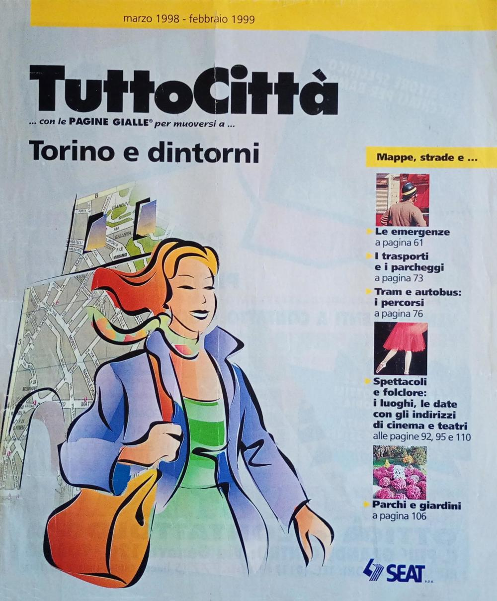<figcaption>Copertina grigia 226 x 274 mm</figcaption></figure>
  <figure><figcaption>Copertina 1999 gialla 226 x 274 mm</figcaption></figure>

<table class="cop">
<thead><tr><th>copertina</th><th>fascicoli</th><th>colore tavole</th></tr></thead>
<tbody>
  <tr><td> Copertina grigia</td><td>?</td><td> Grigio</td></tr>
  <tr><td> Copertina 1999 gialla</td><td>?</td><td> Grigio</td></tr>
</tbody>
</table>

*Per molte province il fascicolo non viene più pubblicato*

## Annata 1999/2000

  <figure><figcaption> 226 x 274 mm</figcaption></figure>

<table class="cop">
<thead><tr><th>copertina</th><th>fascicoli</th><th>colore tavole</th></tr></thead>
<tbody>
  <tr><td> Copertina 1999/2000 gialla</td><td>?</td><td> Grigio</td></tr>
  <tr><td> Copertina 2000 gialla</td><td>?</td><td> Grigio</td></tr>
</tbody>
</table>

## Annata 2000/2001

  <figure><figcaption> 226 x 274 mm</figcaption></figure>

<table class="cop">
<thead><tr><th>copertina</th><th>fascicoli</th><th>colore tavole</th></tr></thead>
<tbody>
  <tr><td> Copertina 2000 gialla</td><td>1</td><td> Grigio</td></tr>
  <tr><td> Copertina 2000/2001 gialla</td><td>?</td><td> Grigio</td></tr>
  <tr><td> Copertina 2000/2001 gialla</td><td>?</td><td> Grigio cromatico</td></tr>
  <tr><td> Copertina 2001 gialla</td><td>?</td><td> Grigio cromatico</td></tr>
</tbody>
</table>

## Annata 2001/2002

  <figure><figcaption> 226 x 274 mm</figcaption></figure>

<table class="cop">
<thead><tr><th>copertina</th><th>fascicoli</th><th>colore tavole</th></tr></thead>
<tbody>
  <tr><td> Copertina 2001 gialla</td><td>1</td><td> Grigio cromatico</td></tr>
  <tr><td> Copertina 2001/2002 gialla</td><td>?</td><td> Grigio cromatico</td></tr>
  <tr><td> Copertina 2002 gialla</td><td>?</td><td> Grigio cromatico</td></tr>
</tbody>
</table>

## Annata 2002/2003

  <figure><figcaption> 226 x 274 mm</figcaption></figure>

<table class="cop">
<thead><tr><th>copertina</th><th>fascicoli</th><th>colore tavole</th></tr></thead>
<tbody>
  <tr><td> Copertina 2002 gialla</td><td>?</td><td> Grigio cromatico</td></tr>
  <tr><td> Copertina 2002/2003 gialla</td><td>?</td><td> Grigio cromatico</td></tr>
  <tr><td> Copertina 2003 gialla</td><td>?</td><td> Grigio cromatico</td></tr>
</tbody>
</table>

## Annata 2003/2004

  <figure><figcaption> 226 x 274 mm</figcaption></figure>

<table class="cop">
<thead><tr><th>copertina</th><th>fascicoli</th><th>colore tavole</th></tr></thead>
<tbody>
  <tr><td> Copertina 2003 gialla</td><td>?</td><td> Grigio cromatico</td></tr>
  <tr><td> Copertina 2003/2004 gialla</td><td>?</td><td> Grigio cromatico</td></tr>
  <tr><td> Copertina 2004 gialla</td><td>?</td><td> Grigio cromatico</td></tr>
</tbody>
</table>

## Annata 2004/2005

  <figure><figcaption> 226 x 274 mm</figcaption></figure>
  <figure><figcaption> 226 x 274 mm</figcaption></figure>

<table class="cop">
<thead><tr><th>copertina</th><th>fascicoli</th><th>colore tavole</th></tr></thead>
<tbody>
  <tr><td> Copertina 2004 gialla</td><td>?</td><td> Grigio cromatico</td></tr>
  <tr><td> Copertina 2004/2005 gialla</td><td>?</td><td> Grigio cromatico</td></tr>
  <tr><td> Copertina 2004 arancione</td><td>15</td><td> Grigio cromatico</td></tr>
  <tr><td> Copertina 2005 arancione</td><td>7</td><td> Grigio cromatico</td></tr>
</tbody>
</table>

## Annata 2005/2006

  <figure><figcaption> 226 x 274 mm</figcaption></figure>
  <figure><figcaption> 226 x 274 mm</figcaption></figure>

<table class="cop">
<thead><tr><th>copertina</th><th>fascicoli</th><th>colore tavole</th></tr></thead>
<tbody>
  <tr><td> Copertina 2005 arancione</td><td>29</td><td> Grigio cromatico</td></tr>
  <tr><td> Copertina 2006 arancione</td><td>4</td><td> Grigio cromatico</td></tr>
  <tr><td> Copertina 2005 arancione/bianca</td><td>3</td><td> Grigio cromatico</td></tr>
</tbody>
</table>

## Annata 2006/2007

  <figure><figcaption> 226 x 274 mm</figcaption></figure>

<table class="cop">
<thead><tr><th>copertina</th><th>fascicoli</th><th>colore tavole</th></tr></thead>
<tbody>
  <tr><td> Copertina 2006 arancione/bianca</td><td>?</td><td> Grigio cromatico</td></tr>
  <tr><td> Copertina 2007 arancione/bianca</td><td>?</td><td> Grigio cromatico</td></tr>
</tbody>
</table>

## Annata 2007/2008

  <figure><figcaption> 226 x 274 mm</figcaption></figure>

<table class="cop">
<thead><tr><th>copertina</th><th>fascicoli</th><th>colore tavole</th></tr></thead>
<tbody>
  <tr><td> Copertina 2007 arancione/bianca</td><td>?</td><td> Grigio cromatico</td></tr>
  <tr><td> Copertina 2008 arancione/bianca</td><td>?</td><td> Grigio cromatico</td></tr>
  <tr><td> Copertina 2008/2009 arancione/bianca</td><td>?</td><td> Grigio cromatico</td></tr>
</tbody>
</table>

## Annata 2008/2009

  <figure><figcaption> 226 x 274 mm</figcaption></figure>

<table class="cop">
<thead><tr><th>copertina</th><th>fascicoli</th><th>colore tavole</th></tr></thead>
<tbody>
  <tr><td> Copertina 2008/2009 arancione/bianca</td><td>?</td><td> Grigio cromatico</td></tr>
  <tr><td> Copertina 2009 arancione/bianca</td><td>?</td><td> Grigio cromatico</td></tr>
  <tr><td> Copertina 2009/2010 arancione/bianca</td><td>?</td><td> Grigio cromatico</td></tr>
</tbody>
</table>

## Annata 2009/2010

  <figure><figcaption> 226 x 274 mm</figcaption></figure>
  <figure>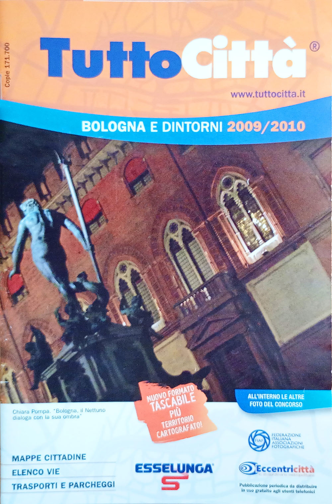<figcaption> 140 x 212 mm</figcaption></figure>
  <figure><figcaption> 140 x 212 mm</figcaption></figure>

<table class="cop">
<thead><tr><th>copertina</th><th>fascicoli</th><th>colore tavole</th></tr></thead>
<tbody>
  <tr><td> Copertina 2009/2010 arancione/bianca</td><td>?</td><td> Grigio cromatico</td></tr>
  <tr><td>Copertina 2010 arancione/bianca</td><td>?</td><td> Grigio cromatico</td></tr>
  <tr><td> Copertina 2009/2010 arancione/bianca formato ridotto</td><td>?</td><td> Rosa</td></tr>
  <tr><td> Copertina 2010 arancione/bianca formato ridotto</td><td>?</td><td> Rosa</td></tr>
  <tr><td> Copertina 2010/2011 arancione/bianca formato ridotto</td><td>?</td><td> Rosa</td></tr>
  <tr><td> Copertina 2010 bianca</td><td>1</td><td> Rosa</td></tr>
</tbody>
</table>

*Ultima grande riforma editoriale, con la riduzione del fascicolo a un formato tascabile e il rinnovamento totale della cartografia*

*Torino ha due edizioni: una regolare 2010/2011 e una speciale 2010 per l'ostensione della Sindone*

## Annata 2010/2011

  <figure>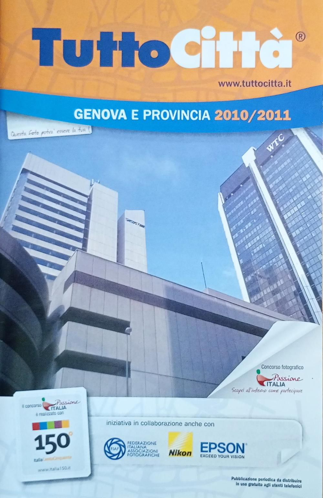<figcaption> 140 x 212 mm</figcaption></figure>

<table class="cop">
<thead><tr><th>copertina</th><th>fascicoli</th><th>colore tavole</th></tr></thead>
<tbody>
  <tr><td> Copertina 2010/2011 arancione/bianca formato ridotto</td><td>?</td><td> Rosa</td></tr>
  <tr><td> Copertina 2011 arancione/bianca formato ridotto</td><td>?</td><td> Rosa</td></tr>
  <tr><td> Copertina 2011/2012 arancione/bianca formato ridotto</td><td>?</td><td> Rosa</td></tr>
</tbody>
</table>

## Annata 2011/2012

  <figure><figcaption> 140 x 212 mm</figcaption></figure>

<table class="cop">
<thead><tr><th>copertina</th><th>fascicoli</th><th>colore tavole</th></tr></thead>
<tbody>
  <tr><td> Copertina 2011/2012 arancione/bianca formato ridotto</td><td>?</td><td> Rosa</td></tr>
  <tr><td> Copertina 2012 arancione/bianca formato ridotto</td><td>?</td><td> Rosa</td></tr>
  <tr><td> Copertina 2012/2013 arancione/bianca formato ridotto</td><td>?</td><td> Rosa</td></tr>
</tbody>
</table>

## Annata 2012/2013

  <figure><figcaption> 140 x 212 mm</figcaption></figure>

<table class="cop">
<thead><tr><th>copertina</th><th>fascicoli</th><th>colore tavole</th></tr></thead>
<tbody>
  <tr><td> Copertina 2012/2013 arancione/bianca formato ridotto</td><td>?</td><td> Rosa</td></tr>
  <tr><td> Copertina 2013 arancione/bianca formato ridotto</td><td>?</td><td> Rosa</td></tr>
  <tr><td> Copertina 2013/2014 arancione/bianca formato ridotto</td><td>?</td><td> Rosa</td></tr>
</tbody>
</table>

## Annata 2013/2014

  <figure>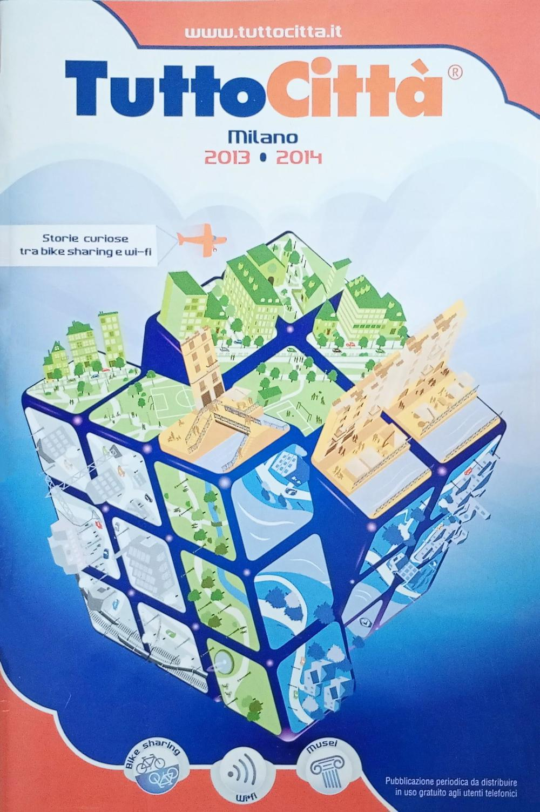<figcaption> 140 x 212 mm</figcaption></figure>

<table class="cop">
<thead><tr><th>copertina</th><th>fascicoli</th><th>colore tavole</th></tr></thead>
<tbody>
  <tr><td> Copertina 2013/2014 arancione/bianca formato ridotto</td><td>?</td><td> Rosa</td></tr>
  <tr><td> Copertina 2014 arancione/bianca formato ridotto</td><td>?</td><td> Rosa</td></tr>
  <tr><td> Copertina 2014/2015 arancione/bianca formato ridotto</td><td>?</td><td> Rosa</td></tr>
</tbody>
</table>

## Annata 2014/2015

  <figure>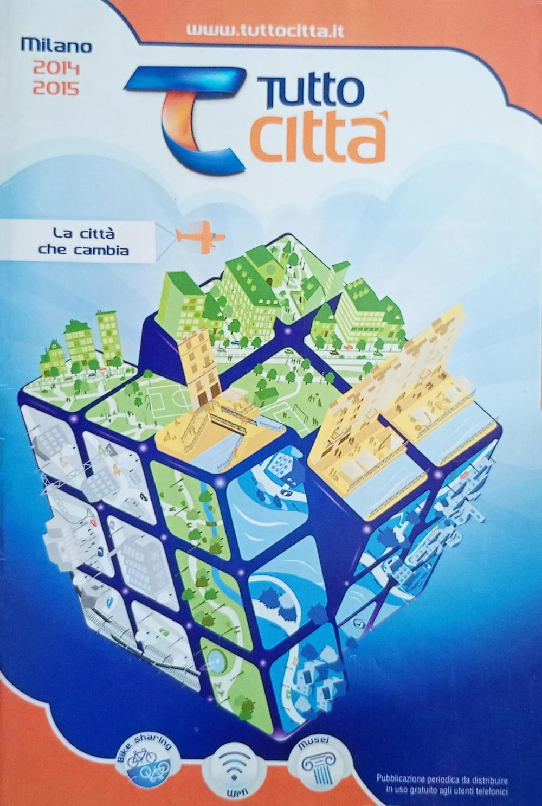<figcaption> 140 x 212 mm</figcaption></figure>

<table class="cop">
<thead><tr><th>copertina</th><th>fascicoli</th><th>colore tavole</th></tr></thead>
<tbody>
  <tr><td> Copertina 2014/2015 arancione/bianca formato ridotto</td><td>?</td><td> Rosa</td></tr>
  <tr><td> Copertina 2015 arancione/bianca formato ridotto</td><td>?</td><td> Rosa</td></tr>
</tbody>
</table>

---

Le riproduzioni di copertina sono fotografie di esemplari della raccolta, pubblicate a bassa risoluzione
a fini di identificazione e studio documentario. **I diritti sul disegno di copertina appartengono
all'editore** e non sono coperti dalla licenza CC BY 4.0 applicata al resto della risorsa. Per richieste
di rimozione, aprire una segnalazione nel repository.
