[← Indice](index.md) · [Questioni aperte](questioni-aperte.md)

# Le copertine, annata per annata

Trentaquattro annate di copertine, dalla serie verde-rosso-azzurra degli anni ottanta ai blu dei primi
anni novanta, ai beige, ai grigi e agli arancioni dell'ultimo periodo. La sequenza cromatica è, da sola,
il racconto della vita editoriale del prodotto.

**Come leggere le didascalie.** Fino all'annata 1995/96 ogni immagine corrisponde a una copertina
dell'elenco, nell'ordine. Nell'annata 1996/97 le prime due immagini sono due sotto-varianti della
copertina 96, comparse in modo irregolare in un numero non determinato di fascicoli. Dalle annate
successive una stessa immagine può valere per più voci dell'elenco, perché la grafica smise di cambiare
fra serie iniziale e serie tardiva: in quei casi la didascalia indica l'annata e non la singola voce.

**Il formato cambia una volta sola, e senza ambiguità:** dalla comparsa dell'anno 97 in copertina, cioè
dalla serie tardiva dell'annata 1996/97, si passa da 246 × 280 mm a 226 × 274 mm.

## Annata 1981/1982

  <figure><figcaption>Copertina 81 verde 246 x 280 mm</figcaption></figure>
  <figure>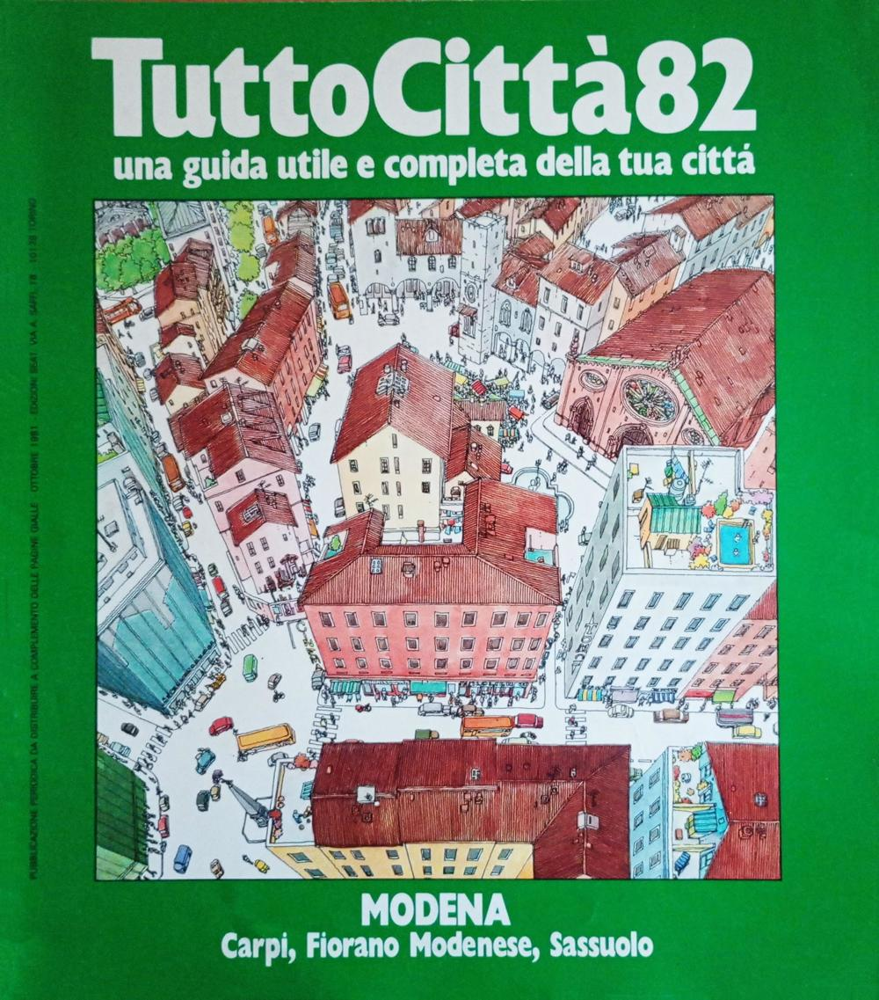<figcaption>Copertina 82 verde 246 x 280 mm</figcaption></figure>

| copertina | fascicoli | colore tavole |
|---|---|---|
| Copertina 81 verde | 39 | Arancione |
| Copertina 82 verde | 25 | Arancione |

## Annata 1982/1983

  <figure><figcaption>Copertina 82 rossa 246 x 280 mm</figcaption></figure>
  <figure><figcaption>Copertina 83 rossa 246 x 280 mm</figcaption></figure>

| copertina | fascicoli | colore tavole |
|---|---|---|
| Copertina 82 rossa | 39 | Arancione |
| Copertina 83 rossa | 25 | Arancione |

## Annata 1983/1984

  <figure>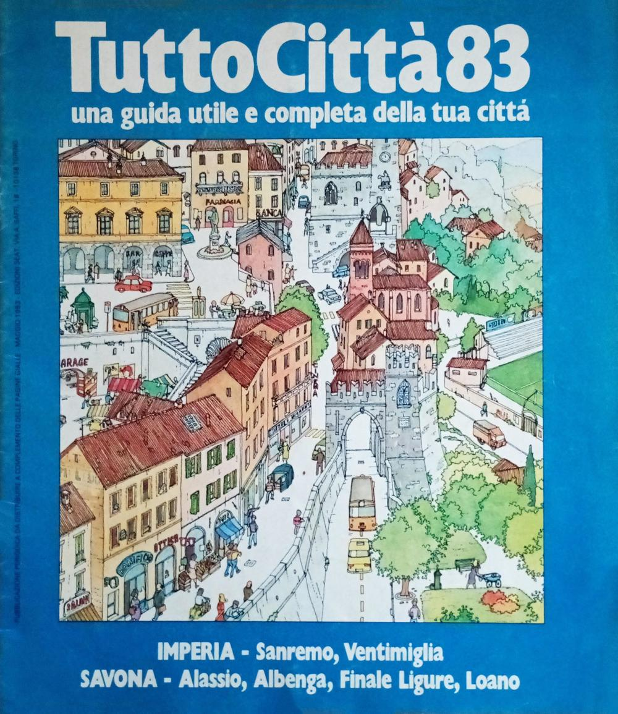<figcaption>Copertina 83 azzurra 246 x 280 mm</figcaption></figure>
  <figure>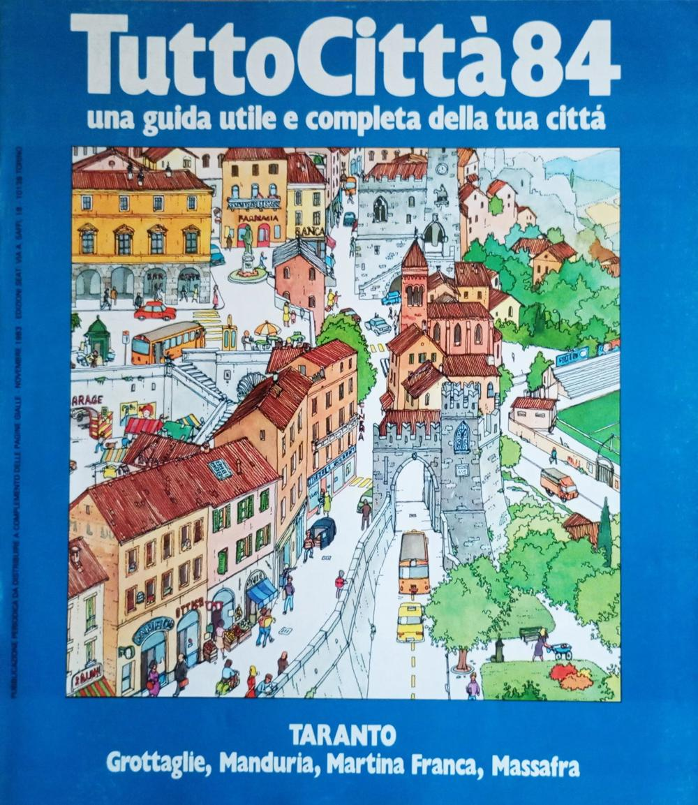<figcaption>Copertina 84 azzurra 246 x 280 mm</figcaption></figure>

| copertina | fascicoli | colore tavole |
|---|---|---|
| Copertina 83 azzurra | 39 | Arancione |
| Copertina 84 azzurra | 25 | Arancione |

## Annata 1984/1985

  <figure>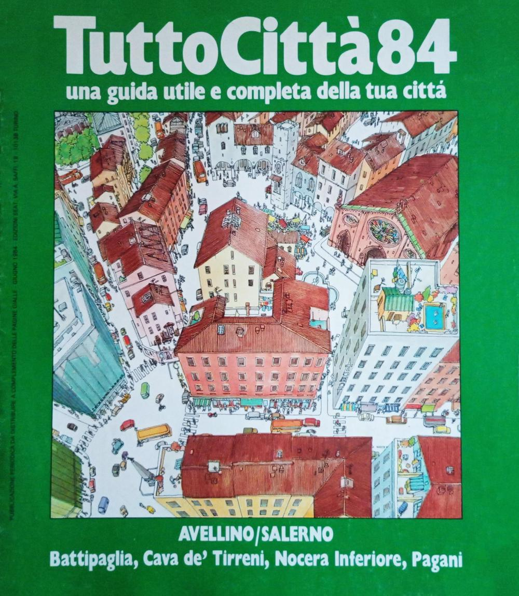<figcaption>Copertina 84 verde 246 x 280 mm</figcaption></figure>
  <figure><figcaption>Copertina 85 verde 246 x 280 mm</figcaption></figure>

| copertina | fascicoli | colore tavole |
|---|---|---|
| Copertina 84 verde | 47 | Arancione |
| Copertina 85 verde | 29 | Arancione |

*(tutta l'annata tranne il fascicolo "Milano e comuni limitrofi 84", che li include nel fascicolo 85 a copertina rossa)*

## Annata 1985/1986

  <figure><figcaption>Copertina 85 rossa 246 x 280 mm</figcaption></figure>
  <figure>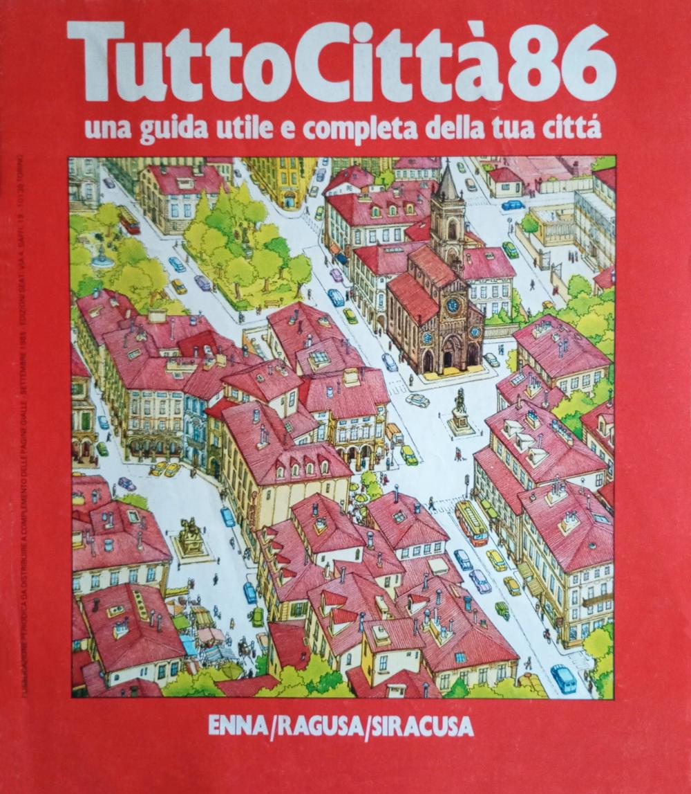<figcaption>Copertina 86 rossa 246 x 280 mm</figcaption></figure>
  <figure><figcaption>Copertina 86 edifici 246 x 280 mm</figcaption></figure>

| copertina | fascicoli | colore tavole |
|---|---|---|
| Copertina 85 rossa | 41 | Arancione |
| Copertina 86 rossa | 29 | Arancione |
| Copertina 86 edifici | 7 | Arancione |

*Fascicoli che saltano da 84 a 86 in copertina:*

*Riforma cartografica città maggiori - serie edifici*

## Annata 1986/1987

  <figure>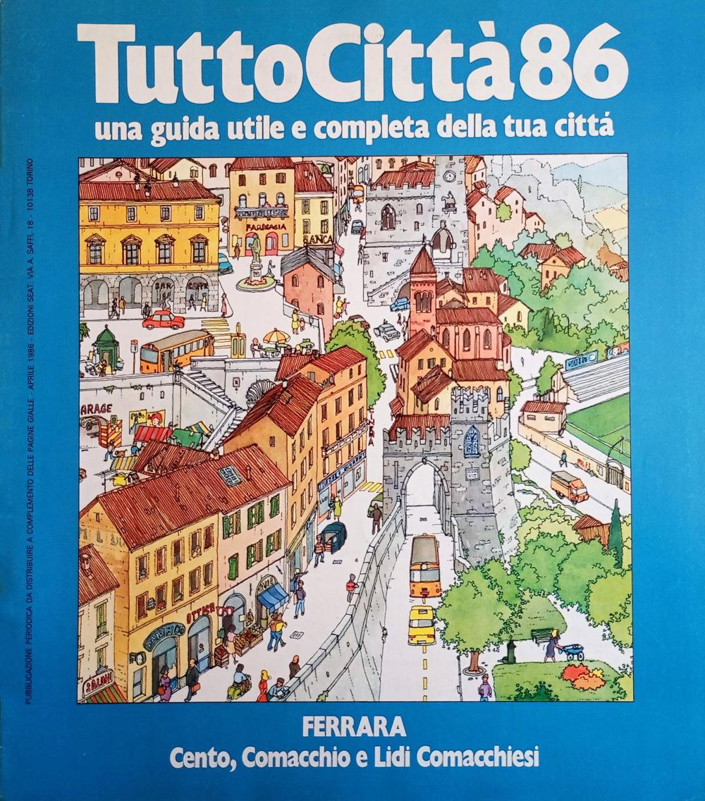<figcaption>Copertina 86 azzurra 246 x 280 mm</figcaption></figure>
  <figure><figcaption>Copertina 87 azzurra 246 x 280 mm</figcaption></figure>
  <figure><figcaption>Copertina 86 edifici 246 x 280 mm</figcaption></figure>
  <figure>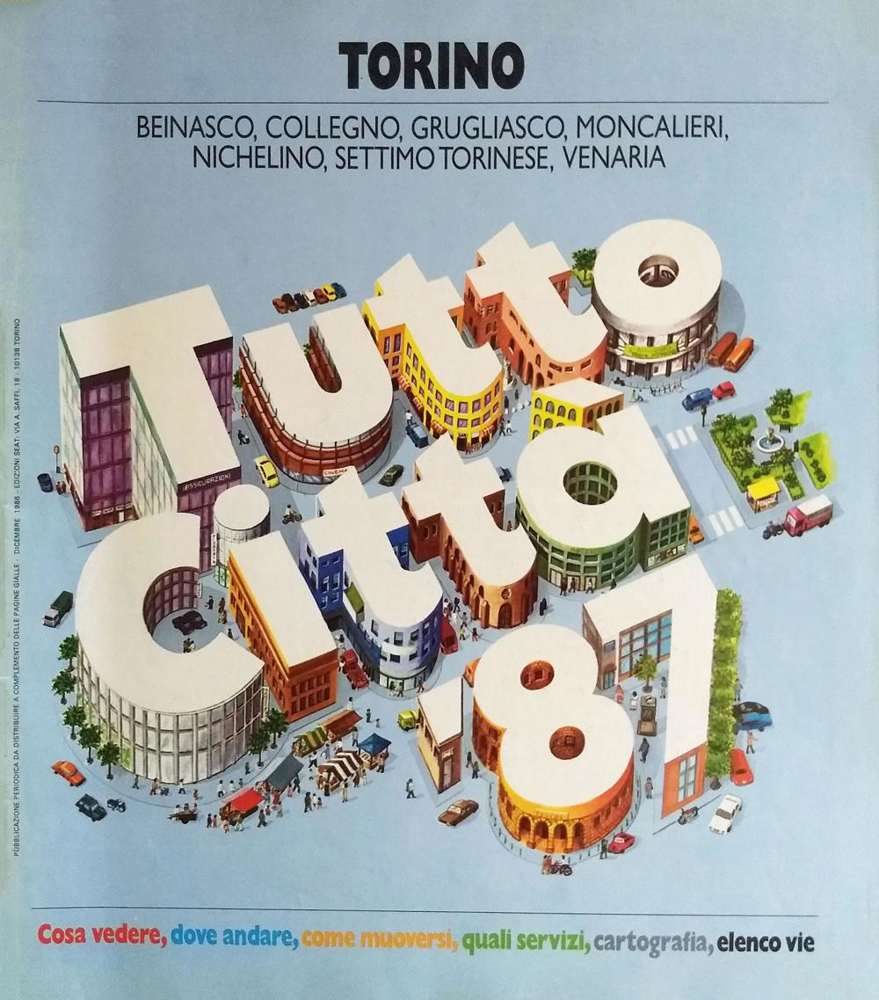<figcaption>Copertina 87 edifici 246 x 280 mm</figcaption></figure>

| copertina | fascicoli | colore tavole |
|---|---|---|
| Copertina 86 azzurra | 38 | Arancione |
| Copertina 87 azzurra | 29 | Arancione |
| Copertina 86 edifici | 3 | Arancione |
| Copertina 87 edifici | 7 | Arancione |

## Annata 1987/1988

  <figure>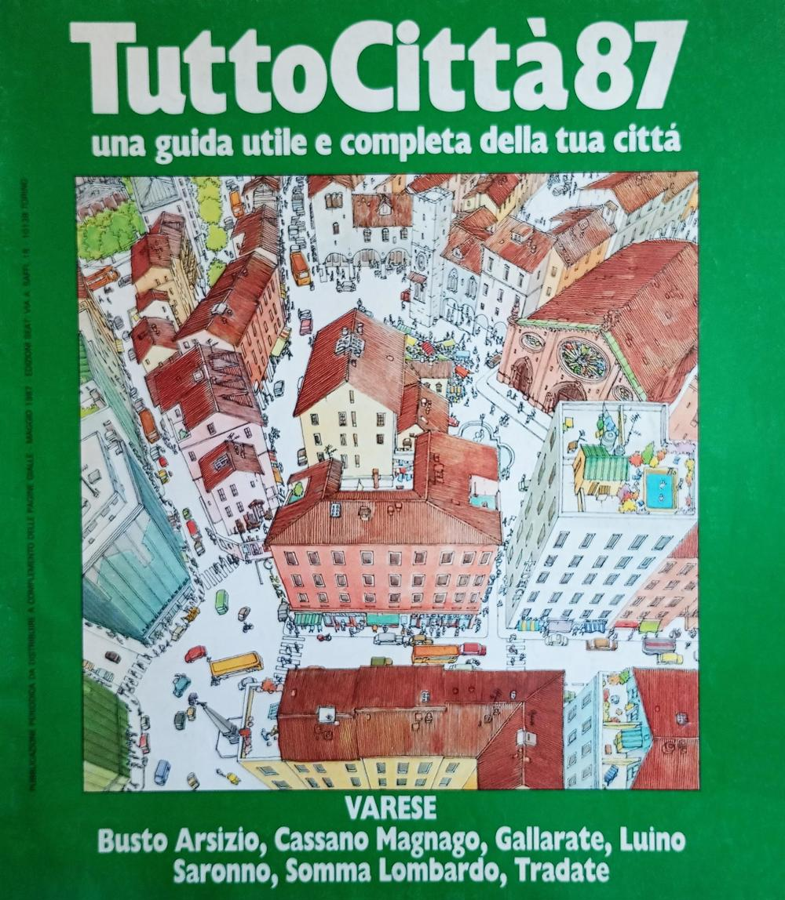<figcaption>Copertina 87 verde 246 x 280 mm</figcaption></figure>
  <figure>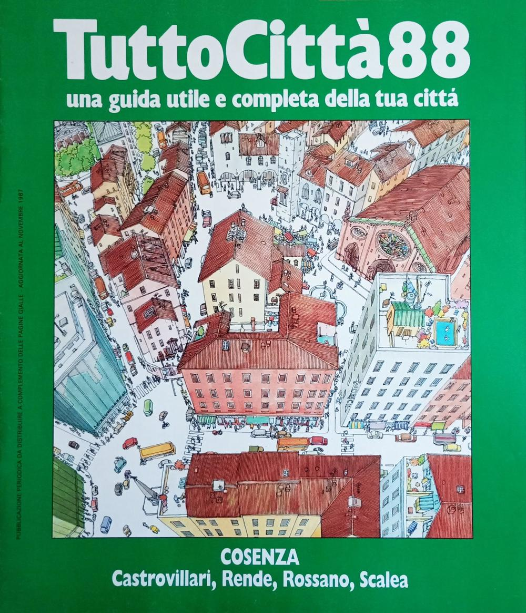<figcaption>Copertina 88 verde 246 x 280 mm</figcaption></figure>
  <figure><figcaption>Copertina 87 edifici 246 x 280 mm</figcaption></figure>
  <figure>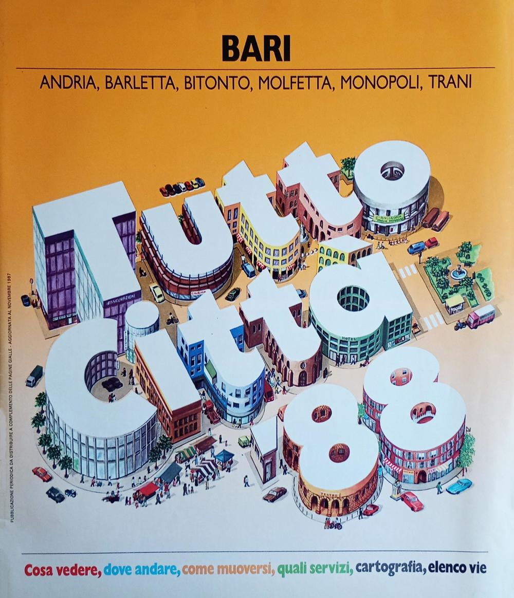<figcaption>Copertina 88 edifici 246 x 280 mm</figcaption></figure>

| copertina | fascicoli | colore tavole |
|---|---|---|
| Copertina 87 verde | 38 | Arancione |
| Copertina 88 verde | 30 | Arancione |
| Copertina 87 edifici | 3 | Arancione |
| Copertina 88 edifici | 7 | Arancione |

## Annata 1988/1989

  <figure><figcaption>Copertina 88 rossa 246 x 280 mm</figcaption></figure>
  <figure><figcaption>Copertina 89 rossa 246 x 280 mm</figcaption></figure>
  <figure>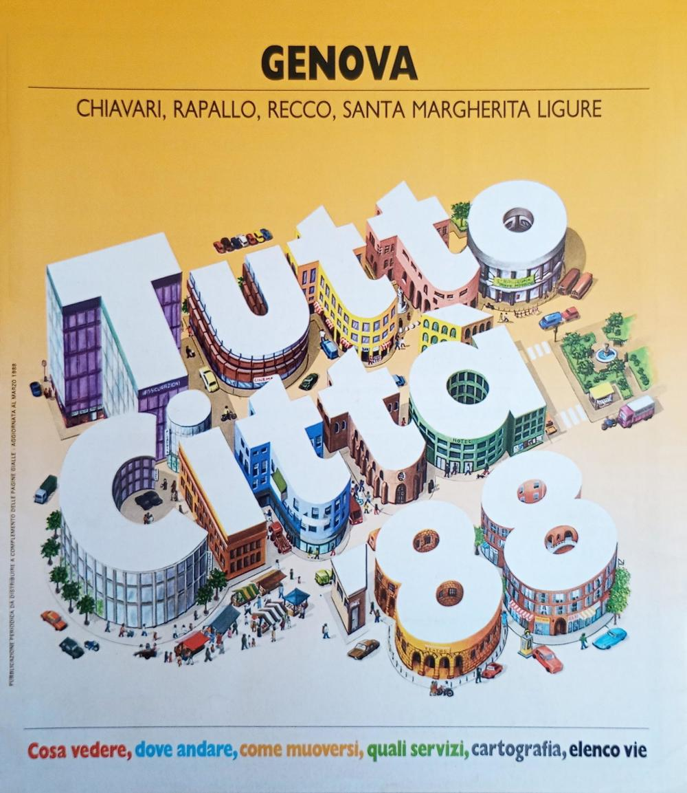<figcaption>Copertina 88 edifici 246 x 280 mm</figcaption></figure>
  <figure>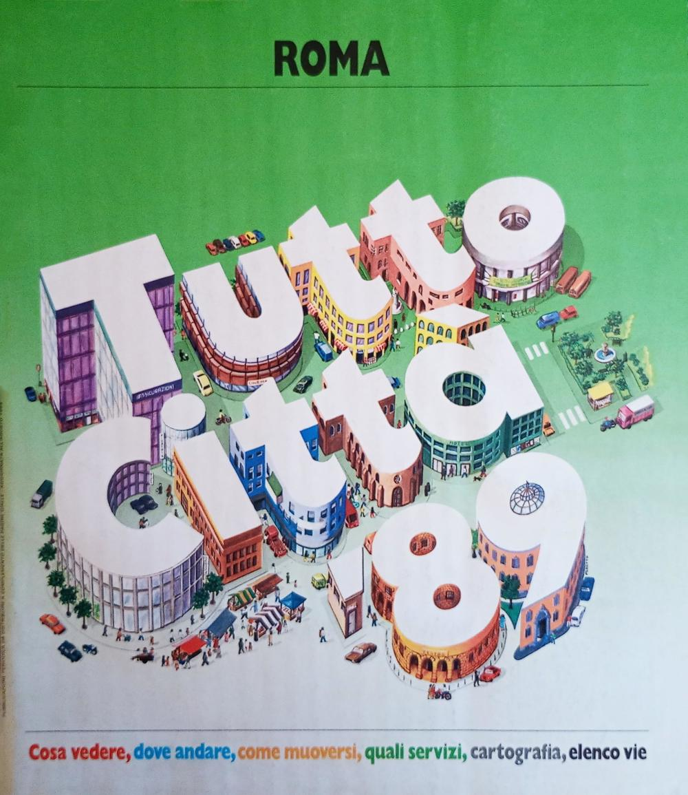<figcaption>Copertina 89 edifici 246 x 280 mm</figcaption></figure>

| copertina | fascicoli | colore tavole |
|---|---|---|
| Copertina 88 rossa | 42 | Arancione |
| Copertina 89 rossa | 31 | Arancione |
| Copertina 88 edifici | 3 | Arancione |
| Copertina 89 edifici | 7 | Arancione |

## Annata 1989/1990

  <figure><figcaption>Copertina 89 azzurra 246 x 280 mm</figcaption></figure>
  <figure><figcaption>Copertina 90 azzurra 246 x 280 mm</figcaption></figure>
  <figure><figcaption>Copertina 89 edifici 246 x 280 mm</figcaption></figure>
  <figure><figcaption>Copertina 90 edifici 246 x 280 mm</figcaption></figure>
  <figure><figcaption>Copertina 1990 blu 246 x 280 mm</figcaption></figure>

| copertina | fascicoli | colore tavole |
|---|---|---|
| Copertina 89 azzurra | 44 | Arancione |
| Copertina 90 azzurra | 20 | Arancione |
| Copertina 89 edifici | 3 | Arancione |
| Copertina 90 edifici | 5 | Arancione |
| Copertina 1990 blu | 15 | Grigio |

## Annata 1990/1991

  <figure>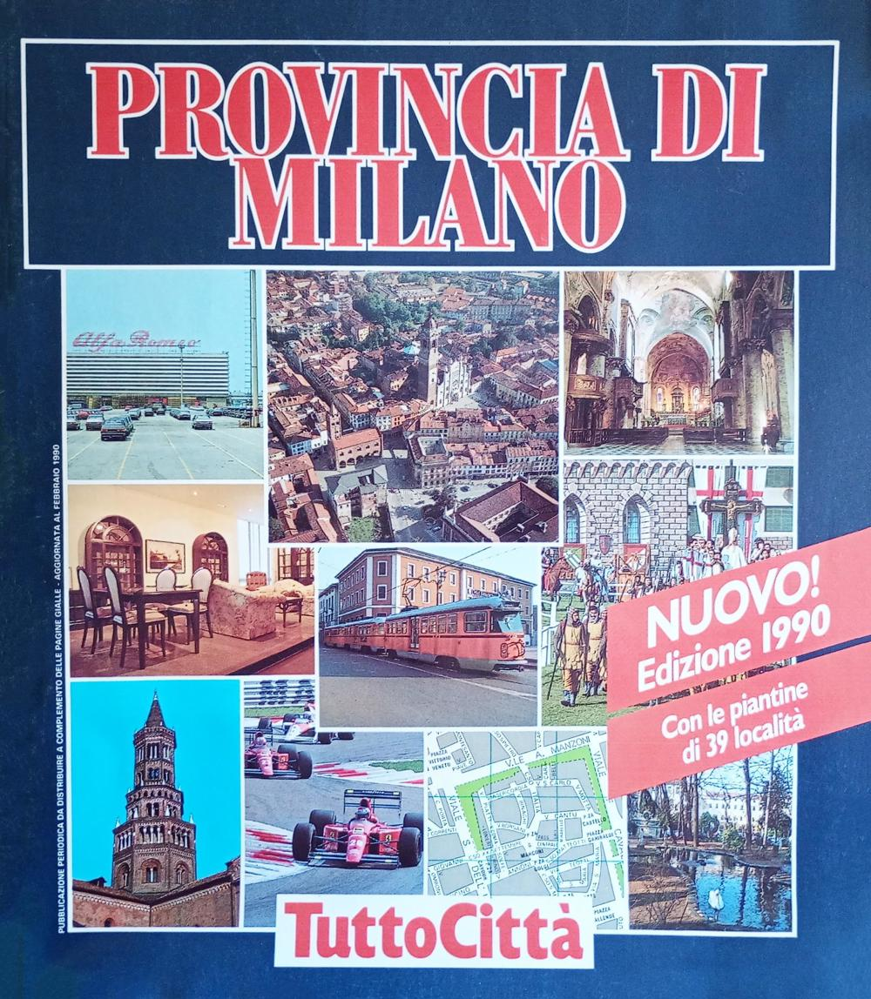<figcaption>Copertina 1990 blu 246 x 280 mm</figcaption></figure>
  <figure>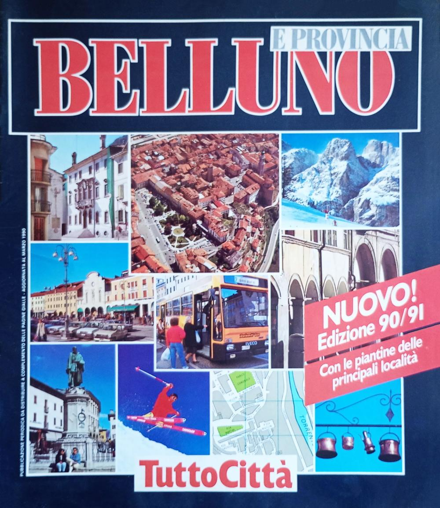<figcaption>Copertina 90/91 blu 246 x 280 mm</figcaption></figure>
  <figure>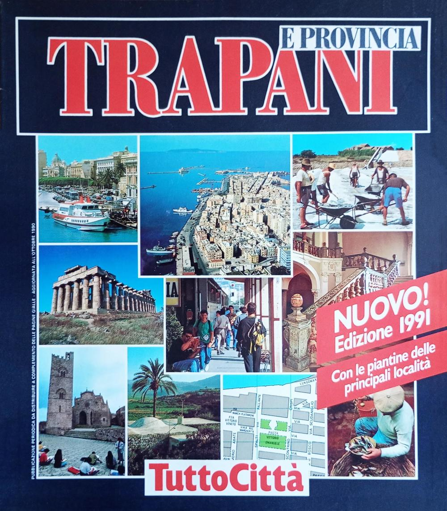<figcaption>Copertina 1991 blu 246 x 280 mm</figcaption></figure>
  <figure>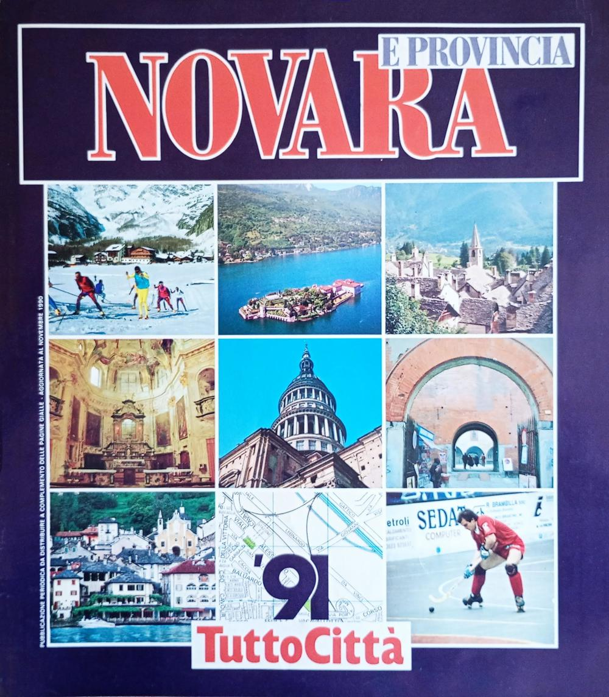<figcaption>Copertina 91 blu 246 x 280 mm</figcaption></figure>

| copertina | fascicoli | colore tavole |
|---|---|---|
| Copertina 1990 blu | 2 | Grigio |
| Copertina 90/91 blu | 45 | Grigio |
| Copertina 1991 blu | 25 | Grigio |
| Copertina 91 blu | 15 | Grigio |

## Annata 1991/1992

  <figure>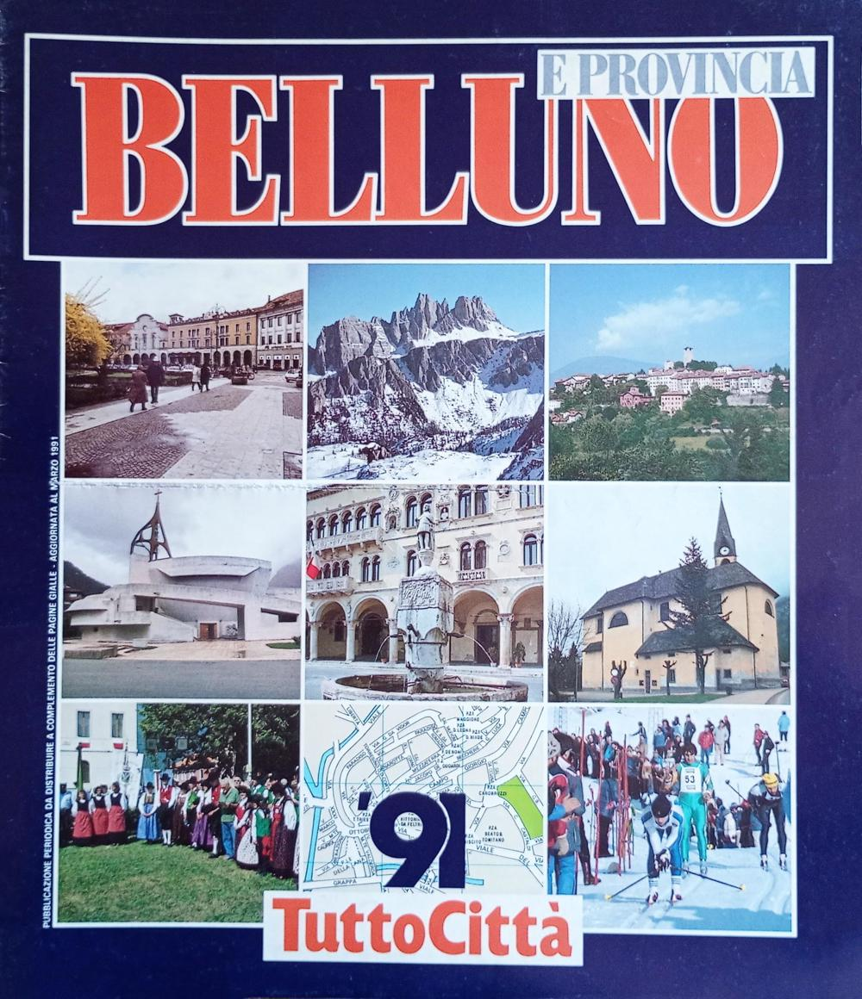<figcaption>Copertina 91 blu 246 x 280 mm</figcaption></figure>
  <figure><figcaption>Copertina 92 blu 246 x 280 mm</figcaption></figure>
  <figure>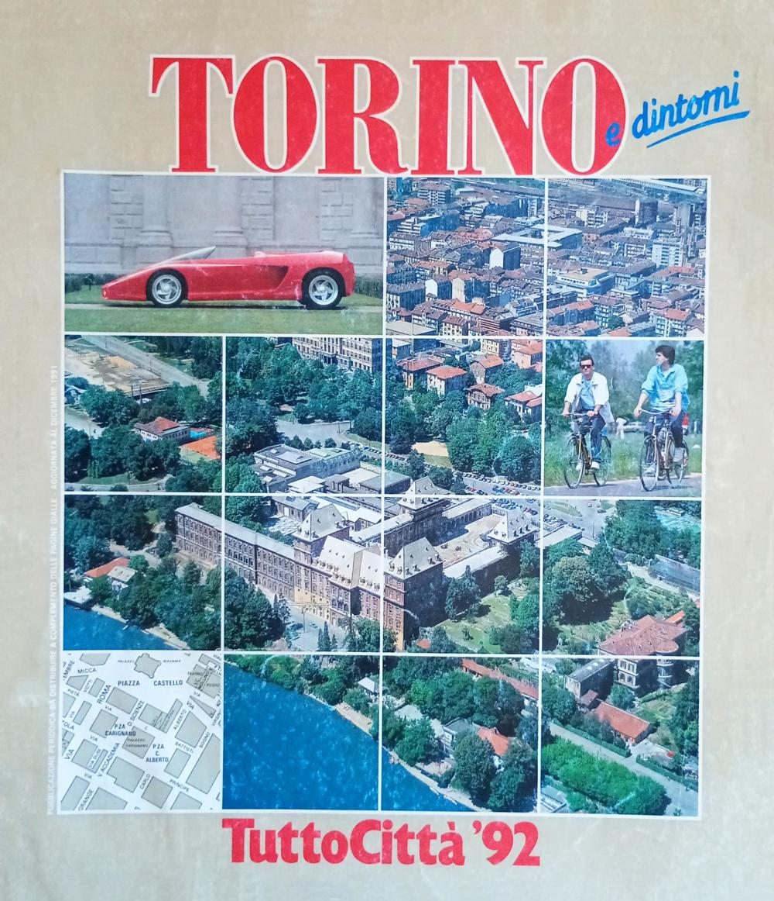<figcaption>Copertina 92 beige 246 x 280 mm</figcaption></figure>

| copertina | fascicoli | colore tavole |
|---|---|---|
| Copertina 91 blu | 47 | Grigio |
| Copertina 92 blu | 38 | Grigio |
| Copertina 92 beige | 2 | Grigio |

## Annata 1992/1993

  <figure>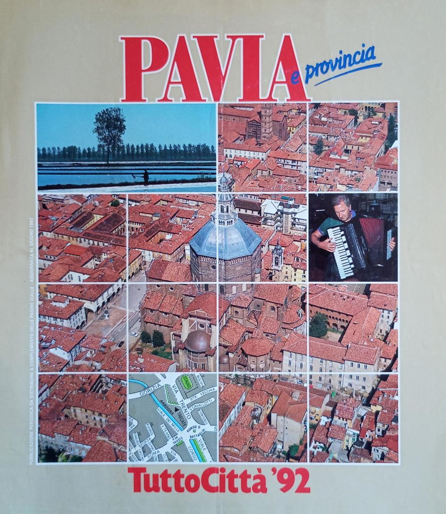<figcaption>Copertina 92 beige 246 x 280 mm</figcaption></figure>
  <figure><figcaption>Copertina 93 beige 246 x 280 mm</figcaption></figure>

| copertina | fascicoli | colore tavole |
|---|---|---|
| Copertina 92 beige | 47 | Grigio |
| Copertina 93 beige | 40 | Grigio |

## Annata 1993/1994

  <figure><figcaption>Copertina 93 beige 246 x 280 mm</figcaption></figure>
  <figure><figcaption>Copertina 93 beige 246 x 280 mm</figcaption></figure>
  <figure>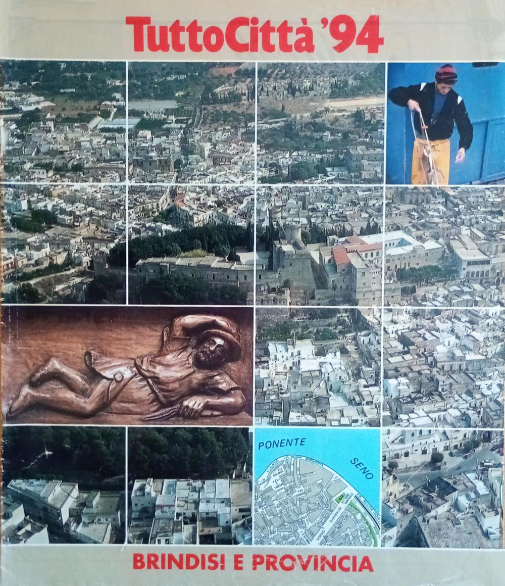<figcaption>Copertina 94 beige 246 x 280 mm</figcaption></figure>

| copertina | fascicoli | colore tavole |
|---|---|---|
| Copertina 93 beige | 28 | Grigio |
| Copertina 93 beige | 19 | Grigio |
| Copertina 94 beige | 40 | Grigio |

## Annata 1994/1995

  <figure><figcaption>Copertina 94 beige 246 x 280 mm</figcaption></figure>
  <figure><figcaption>Copertina 95 beige 246 x 280 mm</figcaption></figure>

| copertina | fascicoli | colore tavole |
|---|---|---|
| Copertina 94 beige | 47 | Grigio |
| Copertina 95 beige | 40 | Grigio |

## Annata 1995/1996

  <figure><figcaption>Copertina 95 beige 246 x 280 mm</figcaption></figure>
  <figure><figcaption>Copertina 96 beige 246 x 280 mm</figcaption></figure>

| copertina | fascicoli | colore tavole |
|---|---|---|
| Copertina 95 beige | 47 | Grigio |
| Copertina 96 beige | 40 | Grigio |

## Annata 1996/1997

  <figure><figcaption>Copertina 96 beige, prima variante 246 x 280 mm</figcaption></figure>
  <figure>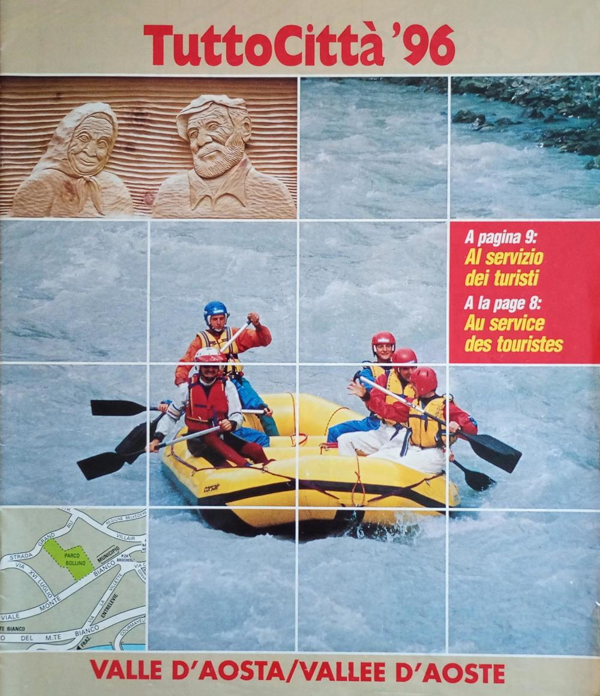<figcaption>Copertina 96 beige, seconda variante 246 x 280 mm</figcaption></figure>
  <figure>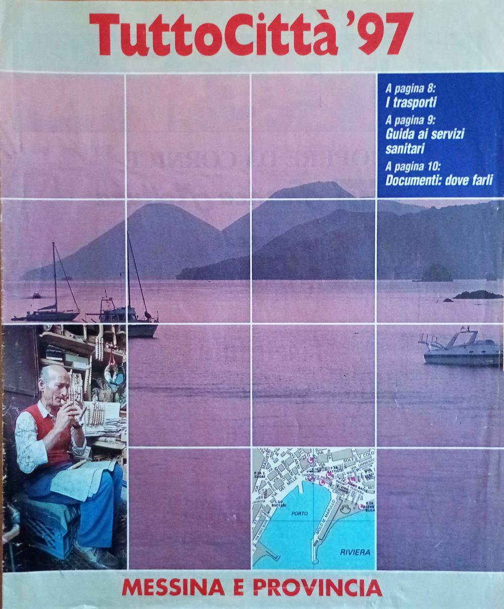<figcaption>Copertina 97 beige 226 x 274 mm</figcaption></figure>

| copertina | fascicoli | colore tavole |
|---|---|---|
| Copertina 96 beige | 47 | Grigio |
| Copertina 97 beige | 40 | Grigio |

*In alcuni fascicoli 96 si introduce il riquadro sommario presente poi anche nei fascicoli 97*

*Dai fascicoli 97 cambia il formato*

## Annata 1997/1998

  <figure>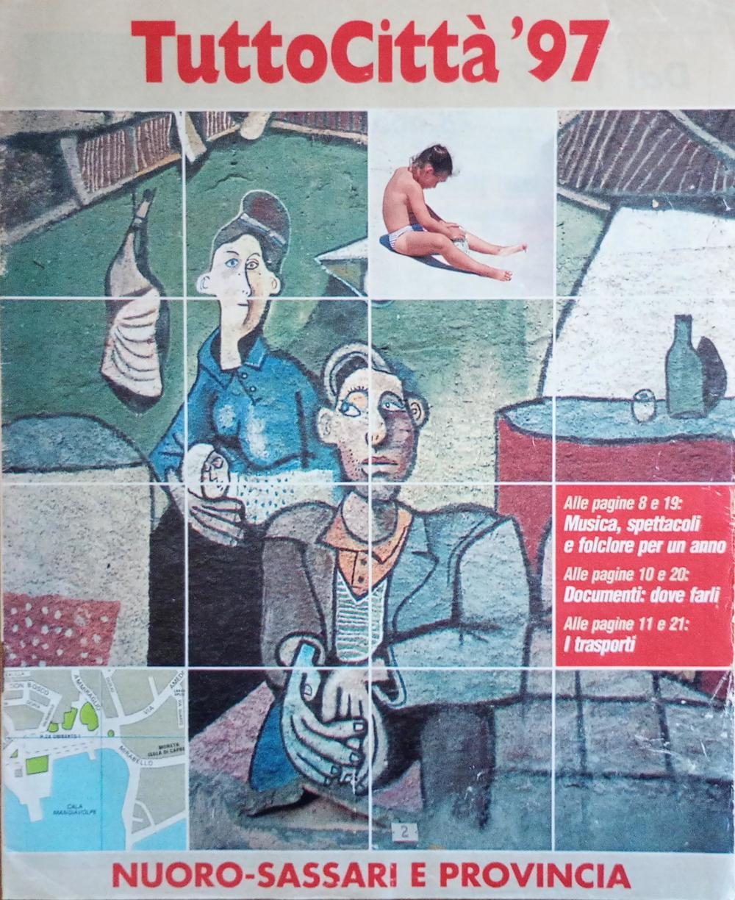<figcaption>Copertina 97 beige 226 x 274 mm</figcaption></figure>
  <figure><figcaption>Copertina 98 beige 226 x 274 mm</figcaption></figure>
  <figure><figcaption>Copertina grigia 226 x 274 mm</figcaption></figure>
  <figure><figcaption>Copertina grigia 226 x 274 mm</figcaption></figure>

| copertina | fascicoli | colore tavole |
|---|---|---|
| Copertina 97 beige | 47 | Grigio |
| Copertina 98 beige | 5 | Grigio |
| Copertina grigia | 33 | Grigio |
| Copertina grigia | 2 | Grigio |

*Ultima annata completa per tutte le province*

## Annata 1998/1999

  <figure>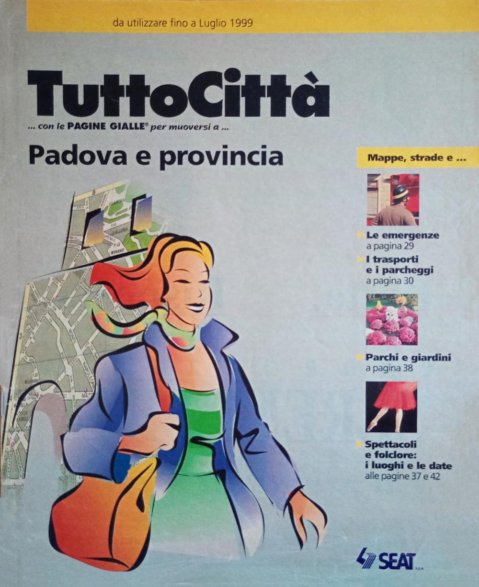<figcaption>Copertina grigia 226 x 274 mm</figcaption></figure>
  <figure><figcaption>Copertina 1999 gialla 226 x 274 mm</figcaption></figure>

| copertina | fascicoli | colore tavole |
|---|---|---|
| Copertina grigia | ? | Grigio |
| Copertina 1999 gialla | ? | Grigio |

*Per molte province il fascicolo non viene più pubblicato*

## Annata 1999/2000

  <figure>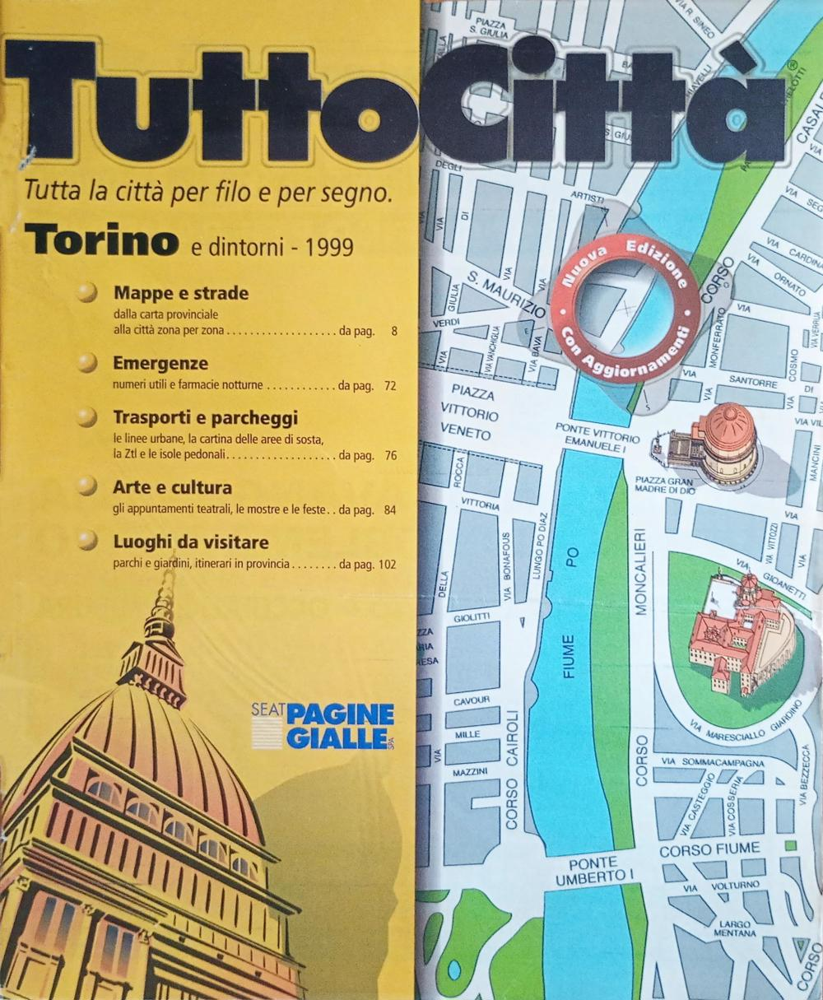<figcaption> 226 x 274 mm</figcaption></figure>

| copertina | fascicoli | colore tavole |
|---|---|---|
| Copertina 1999/2000 gialla | ? | Grigio |
| Copertina 2000 gialla | ? | Grigio |

## Annata 2000/2001

  <figure><figcaption> 226 x 274 mm</figcaption></figure>

| copertina | fascicoli | colore tavole |
|---|---|---|
| Copertina 2000 gialla | 1 | Grigio |
| Copertina 2000/2001 gialla | ? | Grigio |
| Copertina 2000/2001 gialla | ? | Grigio cromatico |
| Copertina 2001 gialla | ? | Grigio cromatico |

## Annata 2001/2002

  <figure><figcaption> 226 x 274 mm</figcaption></figure>

| copertina | fascicoli | colore tavole |
|---|---|---|
| Copertina 2001 gialla | 1 | Grigio cromatico |
| Copertina 2001/2002 gialla | ? | Grigio cromatico |
| Copertina 2002 gialla | ? | Grigio cromatico |

## Annata 2002/2003

  <figure><figcaption> 226 x 274 mm</figcaption></figure>

| copertina | fascicoli | colore tavole |
|---|---|---|
| Copertina 2002 gialla | ? | Grigio cromatico |
| Copertina 2002/2003 gialla | ? | Grigio cromatico |
| Copertina 2003 gialla | ? | Grigio cromatico |

## Annata 2003/2004

  <figure><figcaption> 226 x 274 mm</figcaption></figure>

| copertina | fascicoli | colore tavole |
|---|---|---|
| Copertina 2003 gialla | ? | Grigio cromatico |
| Copertina 2003/2004 gialla | ? | Grigio cromatico |
| Copertina 2004 gialla | ? | Grigio cromatico |

## Annata 2004/2005

  <figure><figcaption> 226 x 274 mm</figcaption></figure>
  <figure><figcaption> 226 x 274 mm</figcaption></figure>

| copertina | fascicoli | colore tavole |
|---|---|---|
| Copertina 2004 gialla | ? | Grigio cromatico |
| Copertina 2004/2005 gialla | ? | Grigio cromatico |
| Copertina 2004 arancione | 15 | Grigio cromatico |
| Copertina 2005 arancione | 7 | Grigio cromatico |

## Annata 2005/2006

  <figure>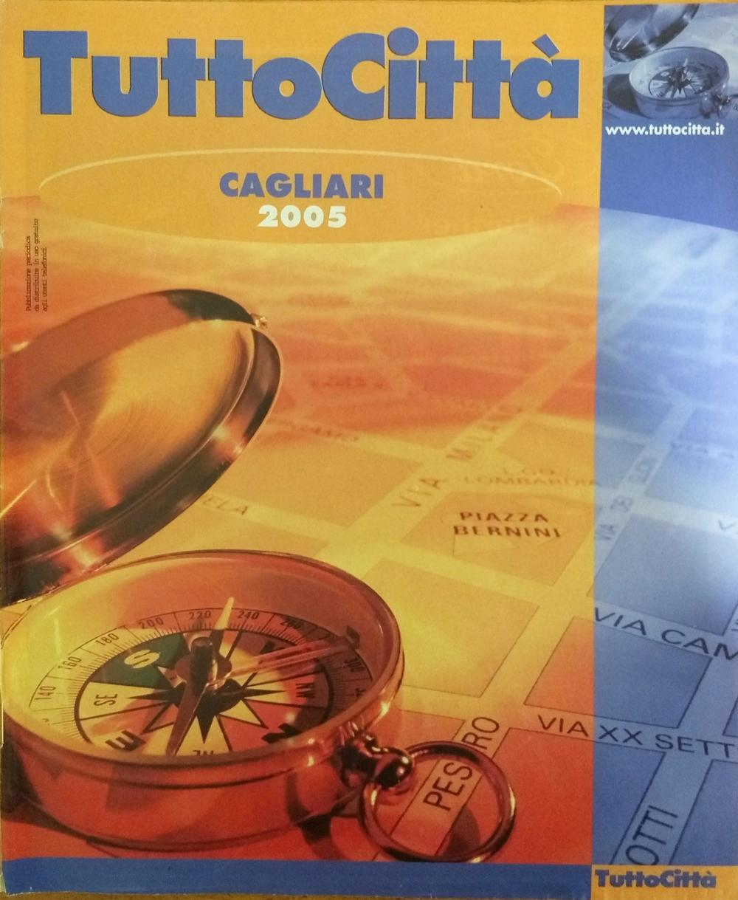<figcaption> 226 x 274 mm</figcaption></figure>
  <figure><figcaption> 226 x 274 mm</figcaption></figure>

| copertina | fascicoli | colore tavole |
|---|---|---|
| Copertina 2005 arancione | 29 | Grigio cromatico |
| Copertina 2006 arancione | 4 | Grigio cromatico |
| Copertina 2005 arancione/bianca | 3 | Grigio cromatico |

## Annata 2006/2007

  <figure>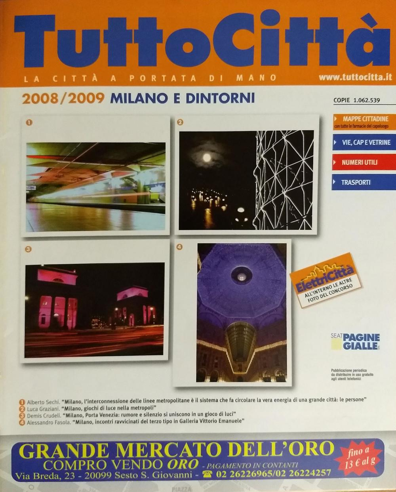<figcaption> 226 x 274 mm</figcaption></figure>

| copertina | fascicoli | colore tavole |
|---|---|---|
| Copertina 2006 arancione/bianca | ? | Grigio cromatico |
| Copertina 2007 arancione/bianca | ? | Grigio cromatico |

## Annata 2007/2008

  <figure><figcaption> 226 x 274 mm</figcaption></figure>

| copertina | fascicoli | colore tavole |
|---|---|---|
| Copertina 2007 arancione/bianca | ? | Grigio cromatico |
| Copertina 2008 arancione/bianca | ? | Grigio cromatico |
| Copertina 2008/2009 arancione/bianca | ? | Grigio cromatico |

## Annata 2008/2009

  <figure><figcaption> 226 x 274 mm</figcaption></figure>

| copertina | fascicoli | colore tavole |
|---|---|---|
| Copertina 2008/2009 arancione/bianca | ? | Grigio cromatico |
| Copertina 2009 arancione/bianca | ? | Grigio cromatico |
| Copertina 2009/2010 arancione/bianca | ? | Grigio cromatico |

## Annata 2009/2010

  <figure><figcaption> 226 x 274 mm</figcaption></figure>
  <figure><figcaption> 140 x 212 mm</figcaption></figure>
  <figure>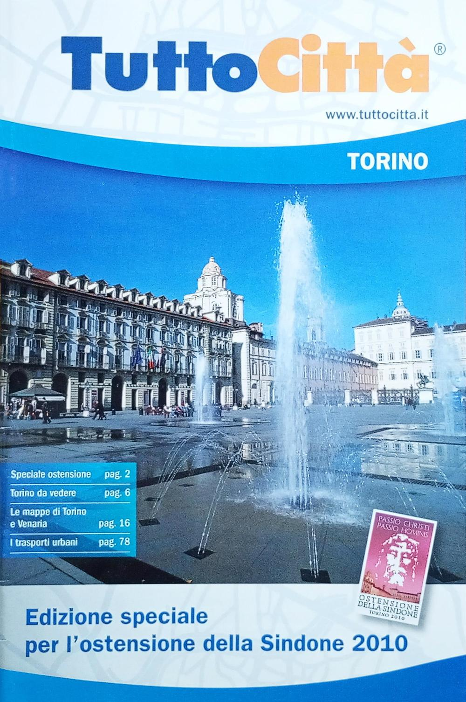<figcaption> 140 x 212 mm</figcaption></figure>

| copertina | fascicoli | colore tavole |
|---|---|---|
| Copertina 2009/2010 arancione/bianca | ? | Grigio cromatico |
| Copertina 2010 arancione/bianca | ? | Grigio cromatico |
| Copertina 2009/2010 arancione/bianca | ? | Rosa |
| Copertina 2010 arancione/bianca | ? | Rosa |
| Copertina 2010/2011 arancione/bianca | ? | Rosa |
| Copertina 2010 bianca | 1 | Rosa |

*Riforma cartografica dalla serie in formato ridotto*

*Torino ha due edizioni: una regolare 2010/2011 e una speciale 2010 per l'ostensione della Sindone*

## Annata 2010/2011

  <figure><figcaption> 140 x 212 mm</figcaption></figure>

| copertina | fascicoli | colore tavole |
|---|---|---|
| Copertina 2010/2011 arancione/bianca | ? | Rosa |
| Copertina 2011 arancione/bianca | ? | Rosa |
| Copertina 2011/2012 arancione/bianca | ? | Rosa |

## Annata 2011/2012

  <figure>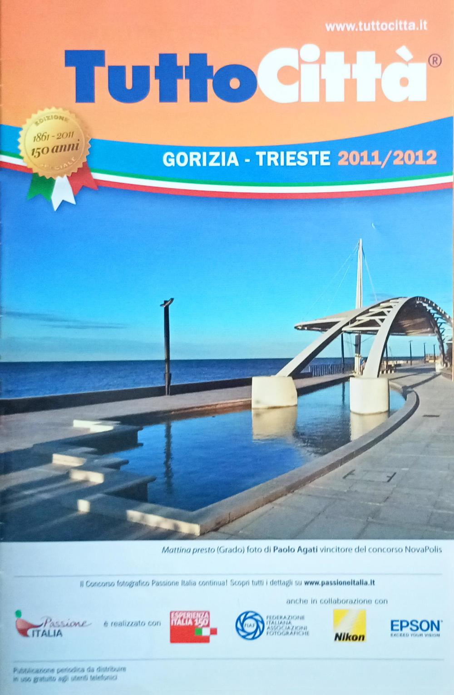<figcaption> 140 x 212 mm</figcaption></figure>

| copertina | fascicoli | colore tavole |
|---|---|---|
| Copertina 2011/2012 arancione/bianca | ? | Rosa |
| Copertina 2012 arancione/bianca | ? | Rosa |
| Copertina 2012/2013 arancione/bianca | ? | Rosa |

## Annata 2012/2013

  <figure>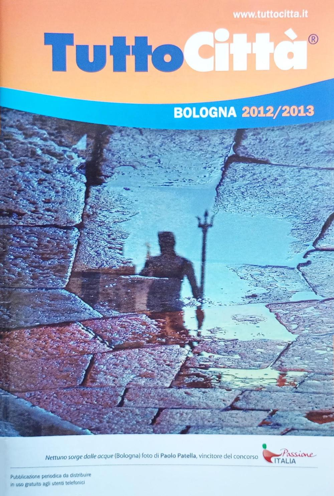<figcaption> 140 x 212 mm</figcaption></figure>

| copertina | fascicoli | colore tavole |
|---|---|---|
| Copertina 2012/2013 arancione/bianca | ? | Rosa |
| Copertina 2013 arancione/bianca | ? | Rosa |
| Copertina 2013/2014 arancione/bianca | ? | Rosa |

## Annata 2013/2014

  <figure><figcaption> 140 x 212 mm</figcaption></figure>

| copertina | fascicoli | colore tavole |
|---|---|---|
| Copertina 2013/2014 arancione/bianca | ? | Rosa |
| Copertina 2014 arancione/bianca | ? | Rosa |
| Copertina 2014/2015 arancione/bianca | ? | Rosa |

## Annata 2014/2015

  <figure><figcaption> 140 x 212 mm</figcaption></figure>

| copertina | fascicoli | colore tavole |
|---|---|---|
| Copertina 2014/2015 arancione/bianca | ? | Rosa |
| Copertina 2015 arancione/bianca | ? | Rosa |

---

Le riproduzioni di copertina sono fotografie di esemplari della raccolta, pubblicate a bassa risoluzione
a fini di identificazione e studio documentario. **I diritti sul disegno di copertina appartengono
all'editore** e non sono coperti dalla licenza CC BY 4.0 applicata al resto della risorsa. Per richieste
di rimozione, aprire una segnalazione nel repository.
