# L'Emilia - Romagna in dettaglio

<em><strong>NOTA: questa pagina è incompleta.</strong> Alla raccolta mancano 86 dei 249 fascicoli accertati della regione — <strong>Ferrara, annate 81/82, 83/84, 87/88, 88/89, 05/06, 06/07, 09/10–11/12 e 14/15; Forlì - Ravenna - San Marino, annate 81/82 e 82/83; Parma, annate 81/82–84/85, 95/96, 96/97, 00/01–07/08 e 09/10–14/15; Reggio Emilia, annate 81/82–85/86, 94/95–96/97, 99/00, 00/01, 02/03, 06/07 e 10/11–13/14; Piacenza, annate 82/83, 85/86, 91/92, 93/94–98/99 e 00/01–14/15; Provincia di Bologna, annate 85/86, 96/97 e 97/98; Forlì - Cesena - Rimini - San Marino, annate 96/97 e 97/98; Modena, annate 08/09–14/15; Bologna e dintorni, annate 10/11 e 11/12</strong> — e i dati che dipendono dall'esame diretto dell'esemplare sono segnati</em> in sospeso<em>. Di un altro fascicolo, <strong>Provincia di Bologna 1999/2000</strong>, non è accertata nemmeno l'esistenza, e il suo posto in tabella porta un segnaposto proprio. Le copertine non reperite sono sostituite da un segnaposto; nella griglia dei comuni le annate scoperte portano una croce e non una casella vuota, per non confonderle con la reale assenza del corrispondente comune in cartografia.</em>

Questa pagina si occupa di definire con estrema precisione l'organizzazione interna dei fascicoli dell'intera regione Emilia - Romagna.

Il censimento registra un totale di 249 fascicoli e 101 comuni cartografati.

<figure class="figura">
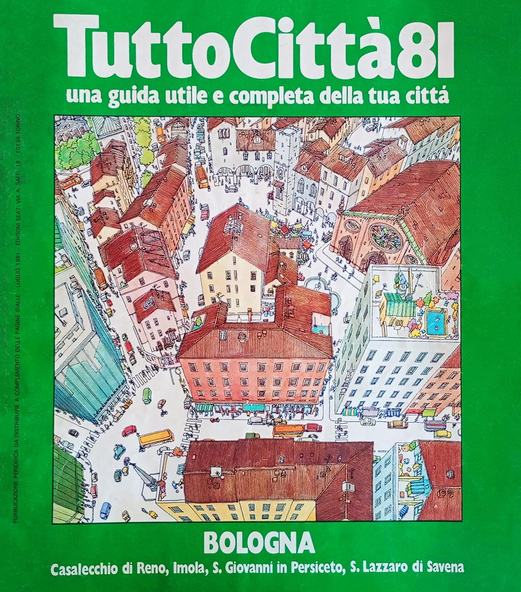
<figcaption>Copertina del fascicolo Bologna 81</figcaption>
</figure>

In questa pagina

[TOC]

## Tabella dei fascicoli

I fascicoli dell'Emilia - Romagna si dividono in fascicoli appartenenti alla serie iniziale, fascicoli appartenenti alla serie tardiva e fascicoli che pur iniziando come serie iniziale fanno il salto alla serie tardiva: i primi due fascicoli ("Forlì - Ravenna - San Marino" e "Ferrara"), editi a [dato mancante], erano infatti intitolati TuttoCittà 81; Bologna iniziò come TuttoCittà 81 ma poi nell'annata 1985/86 saltò il fascicolo 85 in copertina, ricevendo il titolo TuttoCittà 86 con copertina di serie edifici, analogamente a quanto accaduto col fascicolo di Napoli. I fascicoli di tutte le altre province appartengono invece alla serie tardiva fin dall'inizio e nell'annata 1981/82 riportavano quindi come anno di copertina TuttoCittà 82.

Alla fine degli anni '90 la pubblicazione dei fascicoli cessò per i tre fascicoli Provincia di Bologna, Forlì - Cesena - Rimini - San Marino e Ravenna, mentre per tutte le altre province la linea proseguì fino al 2014.

La seguente tabella censisce i dati fondamentali dei fascicoli dell'Emilia - Romagna, mostrandone le copertine e indicandone il formato, il layout così come definito in [questa pagina](tabella-layout.md), e il numero totale di pagine, anno per anno.

<table class="fascicoli-dettaglio">
<thead><tr><th>Annata</th><th>Colore tavole</th><th colspan="9">Copertine</th></tr></thead>
<tbody>
<tr><td class="ann"> 81/82</td><td class="tav"></td><td class="fasc">
Bologna 81
<ul class="scheda"><li><b>Formato:</b> 246 x 280 mm</li><li><b>Copertina:</b> grossa</li><li><b>Layout:</b> Stradario SEAT</li><li><b>Pagine:</b> 88</li><li><b>Mese aggiornamento:</b> luglio 1981</li><li><b>Note:</b> nota dell'editore</li></ul></td><td class="fasc vuota"></td><td class="fasc sospesa">
Ferrara 81
<ul class="scheda"><li><b>Formato:</b> 246 x 280 mm</li><li><b>Copertina:</b> grossa</li><li><b>Note:</b> nota dell'editore</li><li>non in raccolta</li></ul></td><td class="fasc sospesa">
Forlì - Ravenna - San Marino 81
<ul class="scheda"><li><b>Formato:</b> 246 x 280 mm</li><li><b>Copertina:</b> grossa</li><li><b>Note:</b> nota dell'editore</li><li>non in raccolta</li></ul></td><td class="fasc vuota"></td><td class="fasc"><a href="../immagini/MO82.jpg">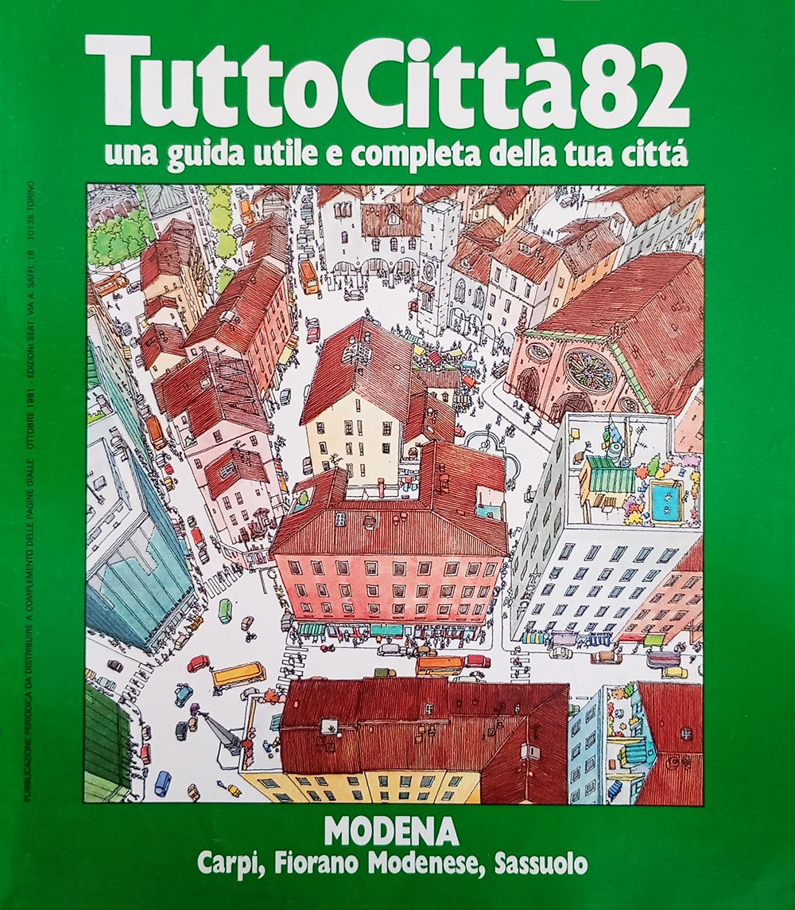</a>
Modena 82
<ul class="scheda"><li><b>Formato:</b> 246 x 280 mm</li><li><b>Copertina:</b> grossa</li><li><b>Layout:</b> TuttoCittà '80 con foto</li><li><b>Pagine:</b> 32 (33)</li><li><b>Mese aggiornamento:</b> ottobre 1981</li><li><b>Note:</b> nota dell'editore</li></ul></td><td class="fasc sospesa">
Parma 82
<ul class="scheda"><li><b>Formato:</b> 246 x 280 mm</li><li><b>Copertina:</b> grossa</li><li><b>Note:</b> nota dell'editore</li><li>non in raccolta</li></ul></td><td class="fasc"><a href="../immagini/PC82.jpg">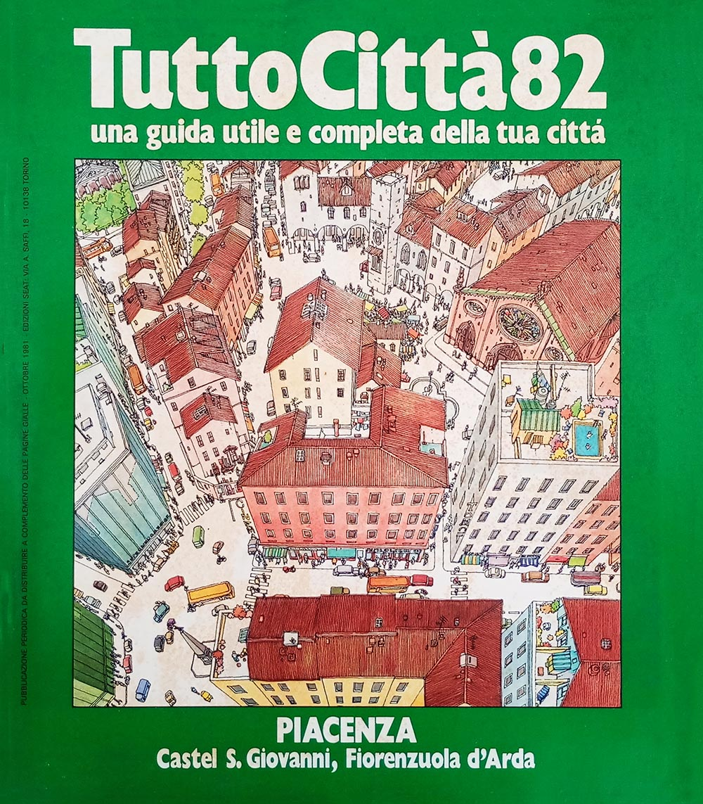</a>
Piacenza 82
<ul class="scheda"><li><b>Formato:</b> 246 x 280 mm</li><li><b>Copertina:</b> grossa</li><li><b>Layout:</b> Stradario SEAT</li><li><b>Pagine:</b> 24</li><li><b>Mese aggiornamento:</b> ottobre 1981</li><li><b>Note:</b> nota dell'editore</li></ul></td><td class="fasc sospesa">
Reggio Emilia 82
<ul class="scheda"><li><b>Formato:</b> 246 x 280 mm</li><li><b>Copertina:</b> grossa</li><li><b>Note:</b> nota dell'editore</li><li>non in raccolta</li></ul></td></tr>
<tr><td class="ann"> 82/83</td><td class="tav"></td><td class="fasc"><a href="../immagini/BO82.jpg">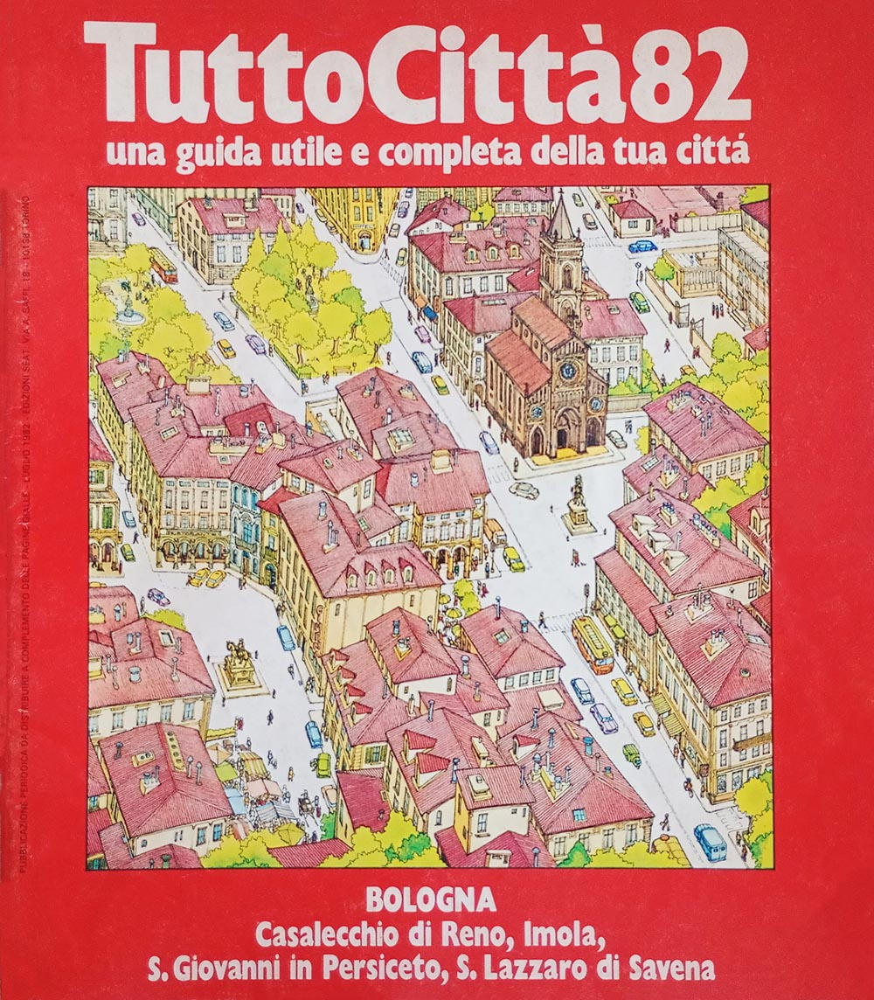</a>
Bologna 82
<ul class="scheda"><li><b>Formato:</b> 246 x 280 mm</li><li><b>Copertina:</b> grossa</li><li><b>Layout:</b> Stradario SEAT senza foto</li><li><b>Pagine:</b> 88</li><li><b>Mese aggiornamento:</b> luglio 1982</li></ul></td><td class="fasc vuota"></td><td class="fasc"><a href="../immagini/FE82.jpg">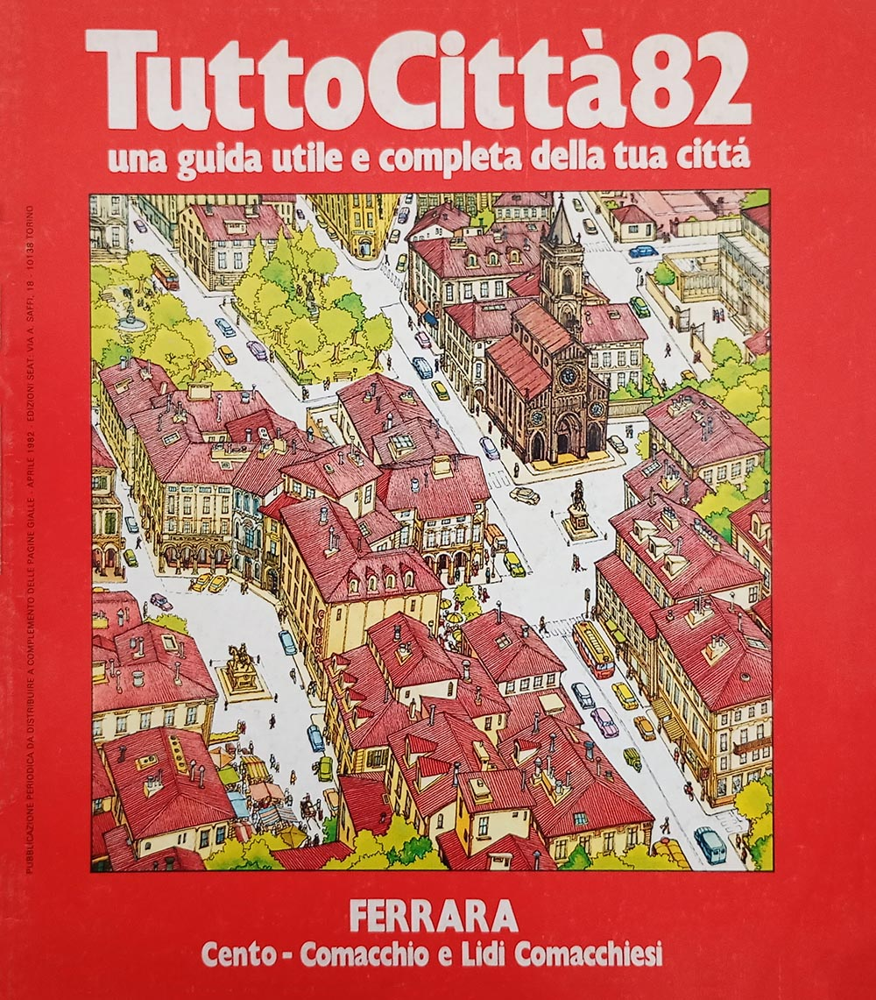</a>
Ferrara 82
<ul class="scheda"><li><b>Formato:</b> 246 x 280 mm</li><li><b>Copertina:</b> grossa</li><li><b>Layout:</b> TuttoCittà '80 classico</li><li><b>Pagine:</b> 32</li><li><b>Mese aggiornamento:</b> aprile 1982</li></ul></td><td class="fasc sospesa">
Forlì - Ravenna - San Marino 82
<ul class="scheda"><li><b>Formato:</b> 246 x 280 mm</li><li><b>Copertina:</b> grossa</li><li>non in raccolta</li></ul></td><td class="fasc vuota"></td><td class="fasc"><a href="../immagini/MO83.jpg">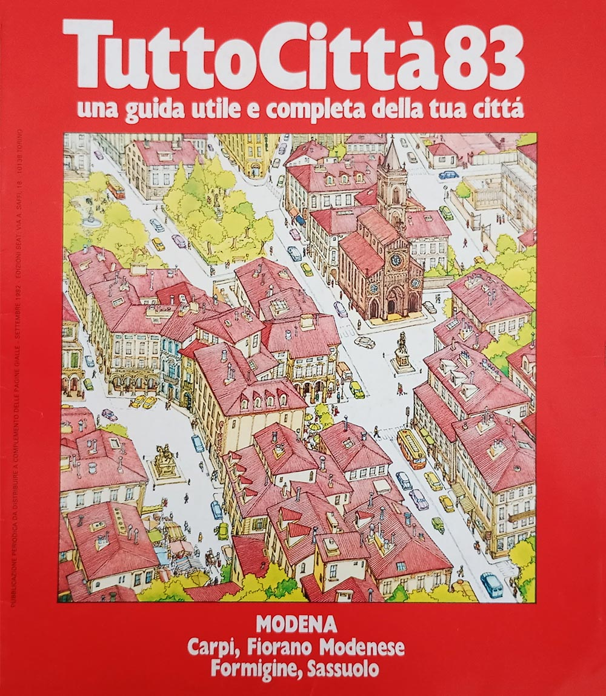</a>
Modena 83
<ul class="scheda"><li><b>Formato:</b> 246 x 280 mm</li><li><b>Copertina:</b> grossa</li><li><b>Layout:</b> TuttoCittà '80 classico</li><li><b>Pagine:</b> 32 (33)</li><li><b>Mese aggiornamento:</b> settembre 1982</li></ul></td><td class="fasc sospesa">
Parma 83
<ul class="scheda"><li><b>Formato:</b> 246 x 280 mm</li><li><b>Copertina:</b> grossa</li><li>non in raccolta</li></ul></td><td class="fasc sospesa">
Piacenza 83
<ul class="scheda"><li><b>Formato:</b> 246 x 280 mm</li><li><b>Copertina:</b> grossa</li><li>non in raccolta</li></ul></td><td class="fasc sospesa">
Reggio Emilia 83
<ul class="scheda"><li><b>Formato:</b> 246 x 280 mm</li><li><b>Copertina:</b> grossa</li><li>non in raccolta</li></ul></td></tr>
<tr><td class="ann"> 83/84</td><td class="tav"></td><td class="fasc"><a href="../immagini/BO83.jpg">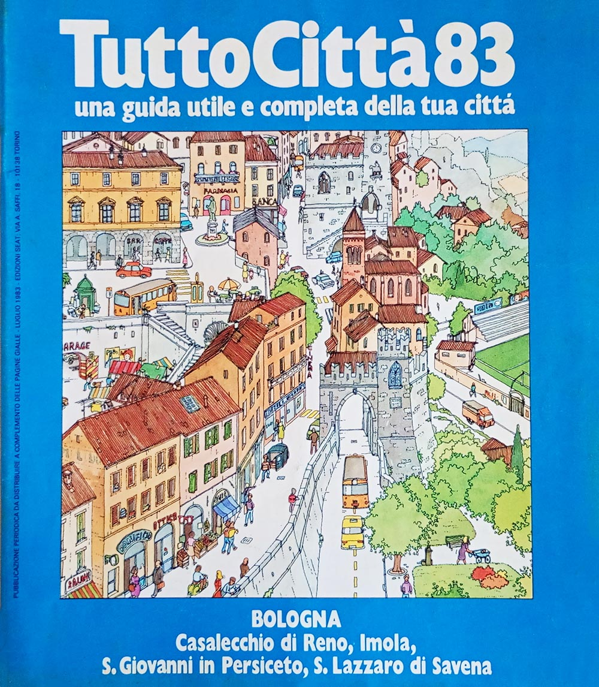</a>
Bologna 83
<ul class="scheda"><li><b>Formato:</b> 246 x 280 mm</li><li><b>Copertina:</b> grossa</li><li><b>Layout:</b> Stradario SEAT senza foto</li><li><b>Pagine:</b> 88</li><li><b>Mese aggiornamento:</b> luglio 1983</li></ul></td><td class="fasc vuota"></td><td class="fasc sospesa">
Ferrara 83
<ul class="scheda"><li><b>Formato:</b> 246 x 280 mm</li><li><b>Copertina:</b> grossa</li><li><b>Layout:</b> TuttoCittà '80 classico</li><li>non in raccolta</li></ul></td><td class="fasc"><a href="../immagini/FORA83.jpg">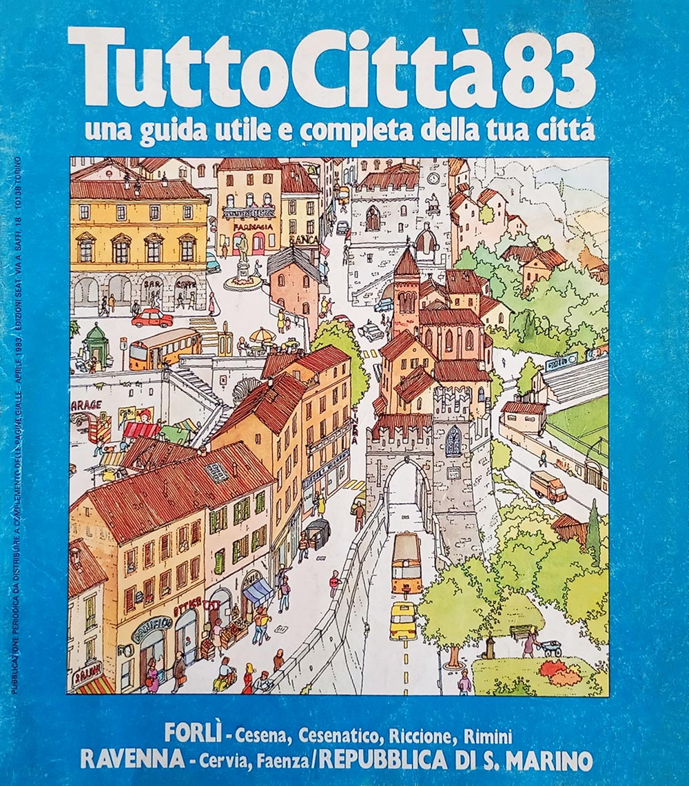</a>
Forlì - Ravenna - San Marino 83
<ul class="scheda"><li><b>Formato:</b> 246 x 280 mm</li><li><b>Copertina:</b> grossa</li><li><b>Layout:</b> TuttoCittà '80 classico</li><li><b>Pagine:</b> 56 (57)</li><li><b>Mese aggiornamento:</b> aprile 1983</li></ul></td><td class="fasc vuota"></td><td class="fasc"><a href="../immagini/MO84.jpg">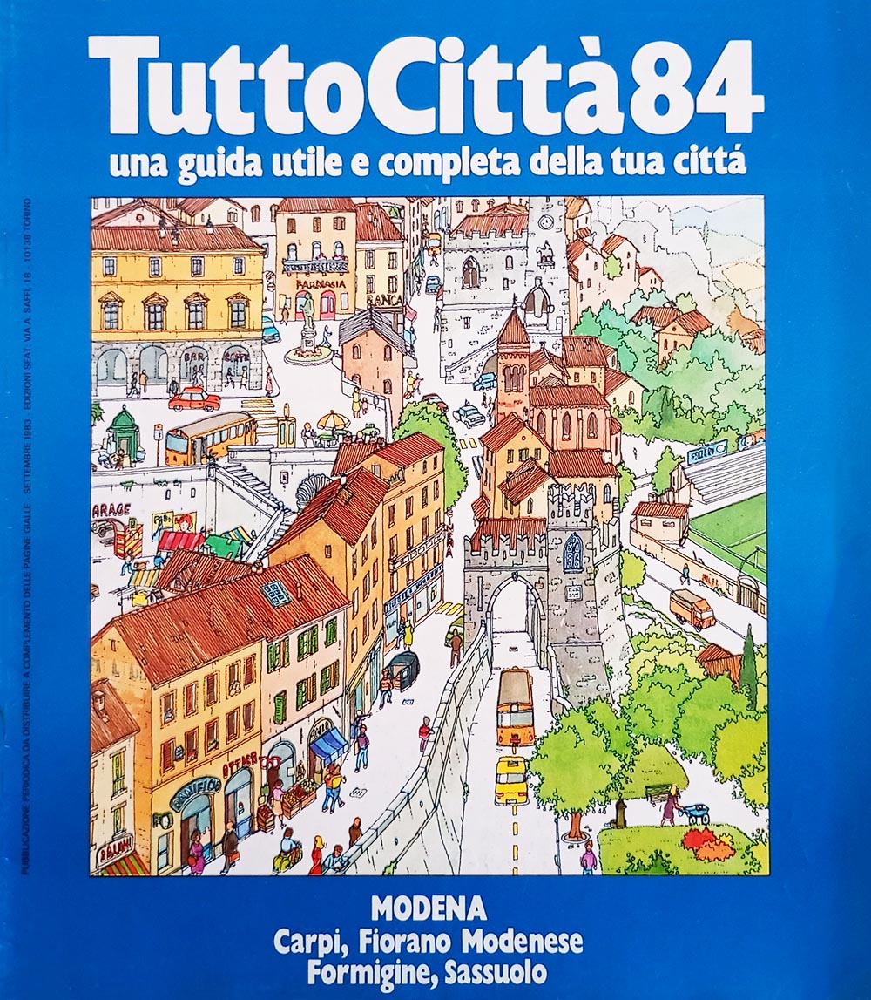</a>
Modena 84
<ul class="scheda"><li><b>Formato:</b> 246 x 280 mm</li><li><b>Copertina:</b> grossa</li><li><b>Layout:</b> TuttoCittà '80 classico</li><li><b>Pagine:</b> 32 (33)</li><li><b>Mese aggiornamento:</b> settembre 1983</li></ul></td><td class="fasc sospesa">
Parma 84
<ul class="scheda"><li><b>Formato:</b> 246 x 280 mm</li><li><b>Copertina:</b> grossa</li><li>non in raccolta</li></ul></td><td class="fasc"><a href="../immagini/PC84.jpg">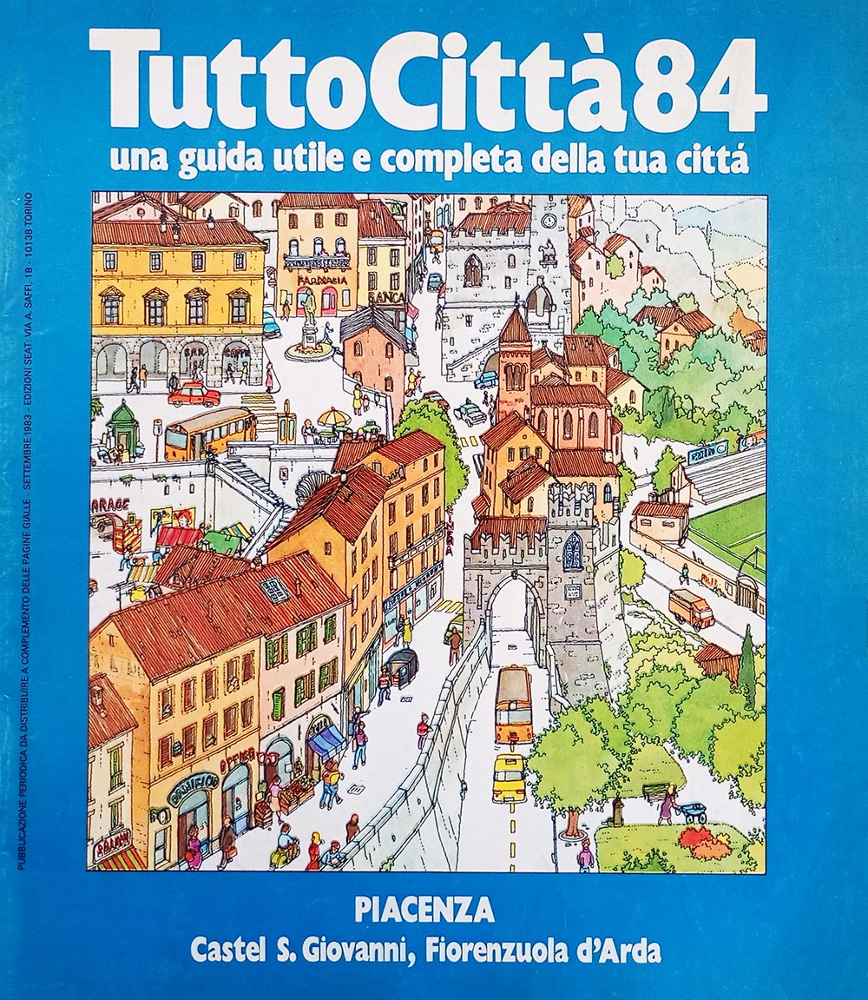</a>
Piacenza 84
<ul class="scheda"><li><b>Formato:</b> 246 x 280 mm</li><li><b>Copertina:</b> grossa</li><li><b>Layout:</b> TuttoCittà '80 classico</li><li><b>Pagine:</b> 24</li><li><b>Mese aggiornamento:</b> settembre 1983</li></ul></td><td class="fasc sospesa">
Reggio Emilia 84
<ul class="scheda"><li><b>Formato:</b> 246 x 280 mm</li><li><b>Copertina:</b> grossa</li><li>non in raccolta</li></ul></td></tr>
<tr><td class="ann"> 84/85</td><td class="tav"></td><td class="fasc"><a href="../immagini/BO84.jpg">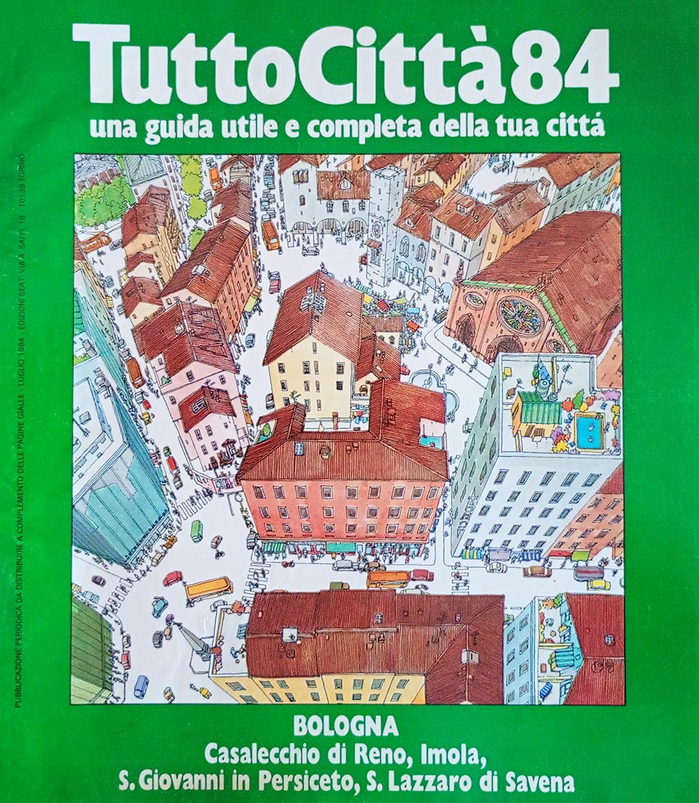</a>
Bologna 84
<ul class="scheda"><li><b>Formato:</b> 246 x 280 mm</li><li><b>Copertina:</b> grossa</li><li><b>Layout:</b> Stradario SEAT senza foto</li><li><b>Pagine:</b> 88</li><li><b>Mese aggiornamento:</b> luglio 1984</li><li><b>Note:</b> Inserto Costituzione</li></ul></td><td class="fasc vuota"></td><td class="fasc"><a href="../immagini/FE84.jpg">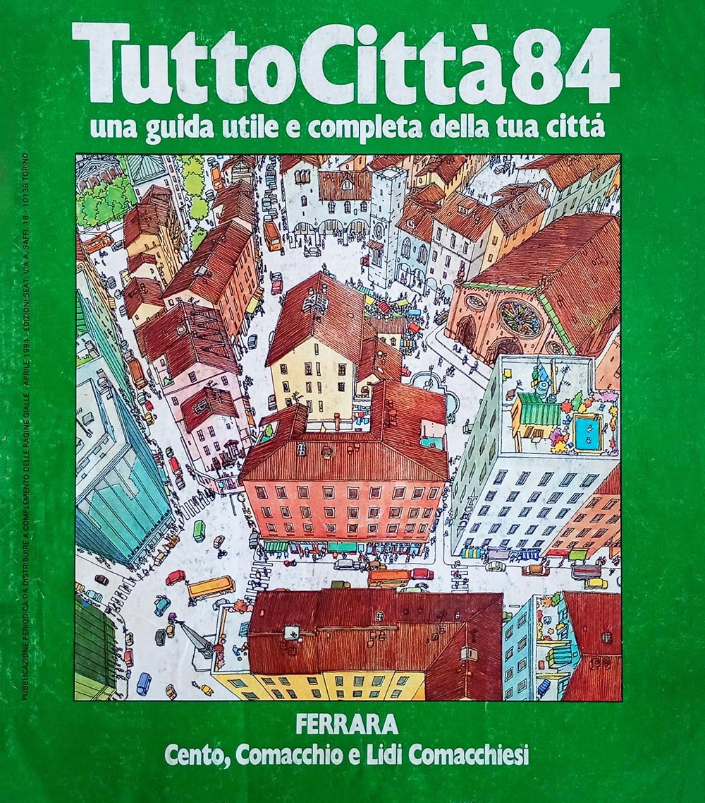</a>
Ferrara 84
<ul class="scheda"><li><b>Formato:</b> 246 x 280 mm</li><li><b>Copertina:</b> grossa</li><li><b>Layout:</b> TuttoCittà '80 classico</li><li><b>Pagine:</b> 24 (25)</li><li><b>Mese aggiornamento:</b> aprile 1984</li><li><b>Note:</b> Inserto Costituzione</li></ul></td><td class="fasc"><a href="../immagini/FO84.jpg">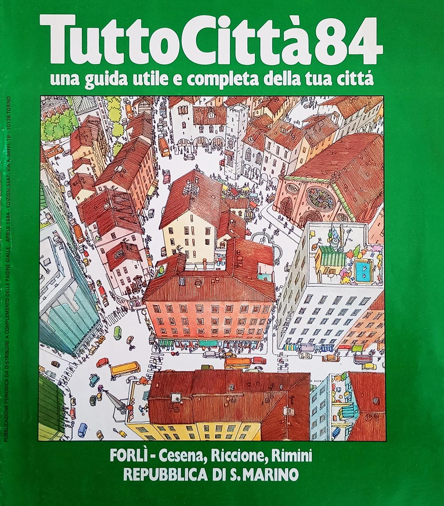</a>
Forlì - San Marino 84
<ul class="scheda"><li><b>Formato:</b> 246 x 280 mm</li><li><b>Copertina:</b> grossa</li><li><b>Layout:</b> TuttoCittà '80 classico</li><li><b>Pagine:</b> 32</li><li><b>Mese aggiornamento:</b> aprile 1984</li><li><b>Note:</b> Inserto Costituzione</li></ul></td><td class="fasc"><a href="../immagini/RA84.jpg">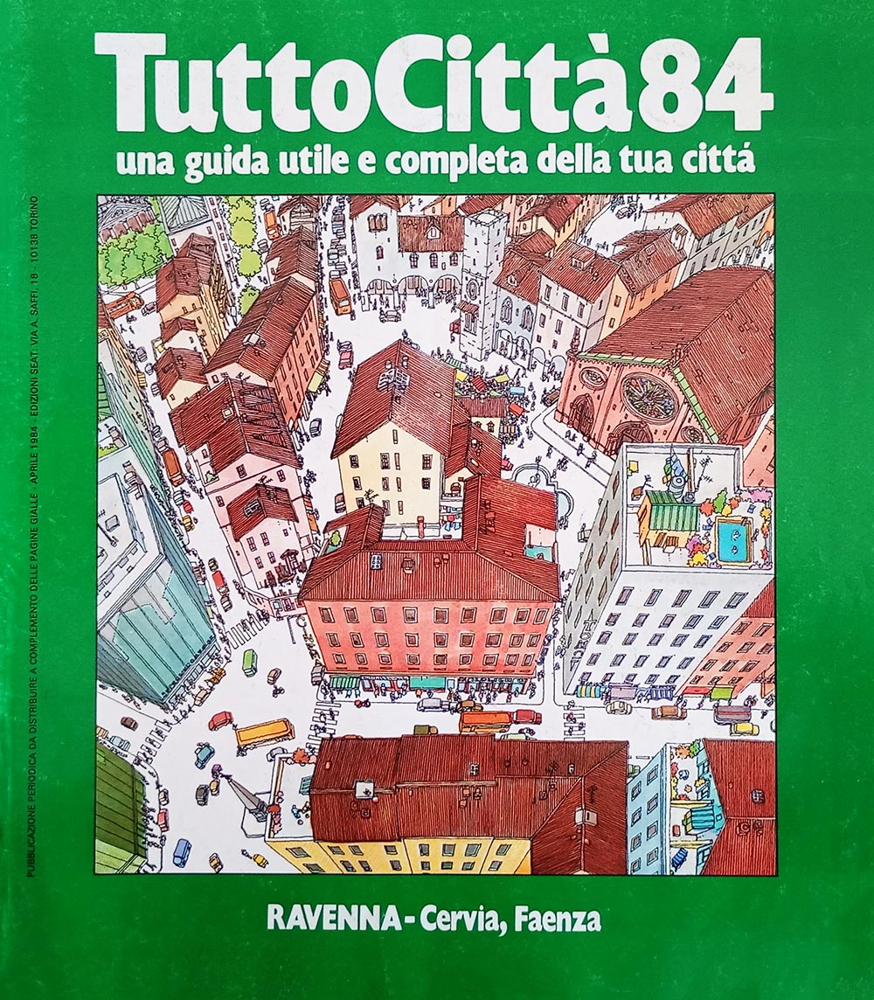</a>
Ravenna 84
<ul class="scheda"><li><b>Formato:</b> 246 x 280 mm</li><li><b>Copertina:</b> grossa</li><li><b>Layout:</b> TuttoCittà '80 classico</li><li><b>Pagine:</b> 24</li><li><b>Mese aggiornamento:</b> aprile 1984</li><li><b>Note:</b> Inserto Costituzione</li></ul></td><td class="fasc"><a href="../immagini/MO85.jpg">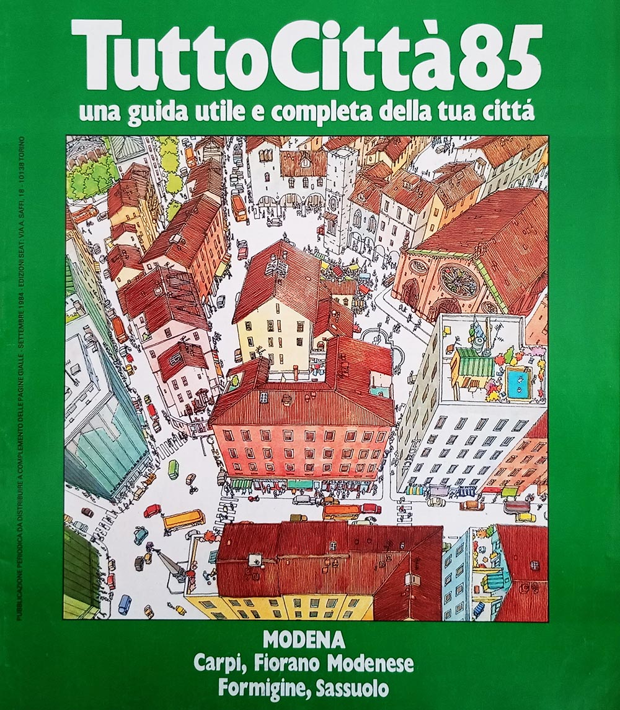</a>
Modena 85
<ul class="scheda"><li><b>Formato:</b> 246 x 280 mm</li><li><b>Copertina:</b> grossa</li><li><b>Layout:</b> TuttoCittà '80 classico</li><li><b>Pagine:</b> 32 (33)</li><li><b>Mese aggiornamento:</b> settembre 1984</li><li><b>Note:</b> Inserto Costituzione</li></ul></td><td class="fasc sospesa">
Parma 85
<ul class="scheda"><li><b>Formato:</b> 246 x 280 mm</li><li><b>Copertina:</b> grossa</li><li><b>Layout:</b> TuttoCittà '80 classico</li><li><b>Note:</b> Inserto Costituzione</li><li>non in raccolta</li></ul></td><td class="fasc"><a href="../immagini/PC85.jpg">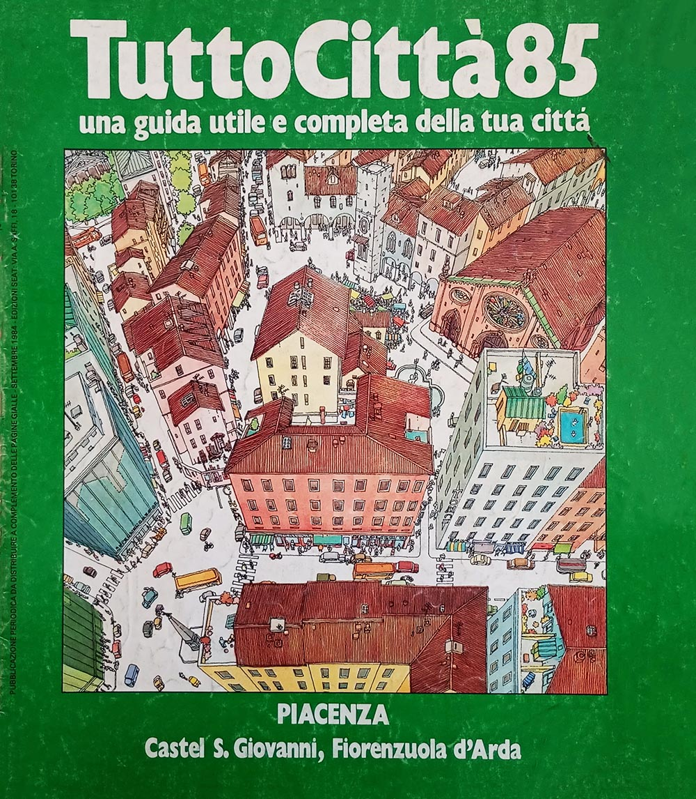</a>
Piacenza 85
<ul class="scheda"><li><b>Formato:</b> 246 x 280 mm</li><li><b>Copertina:</b> grossa</li><li><b>Layout:</b> TuttoCittà '80 classico</li><li><b>Pagine:</b> 24</li><li><b>Mese aggiornamento:</b> settembre 1984</li><li><b>Note:</b> Inserto Costituzione</li></ul></td><td class="fasc sospesa">
Reggio Emilia 85
<ul class="scheda"><li><b>Formato:</b> 246 x 280 mm</li><li><b>Copertina:</b> grossa</li><li><b>Layout:</b> TuttoCittà '80 classico</li><li><b>Note:</b> Inserto Costituzione</li><li>non in raccolta</li></ul></td></tr>
<tr><td class="ann"> 85/86</td><td class="tav"></td><td class="fasc"><a href="../immagini/BO86.jpg">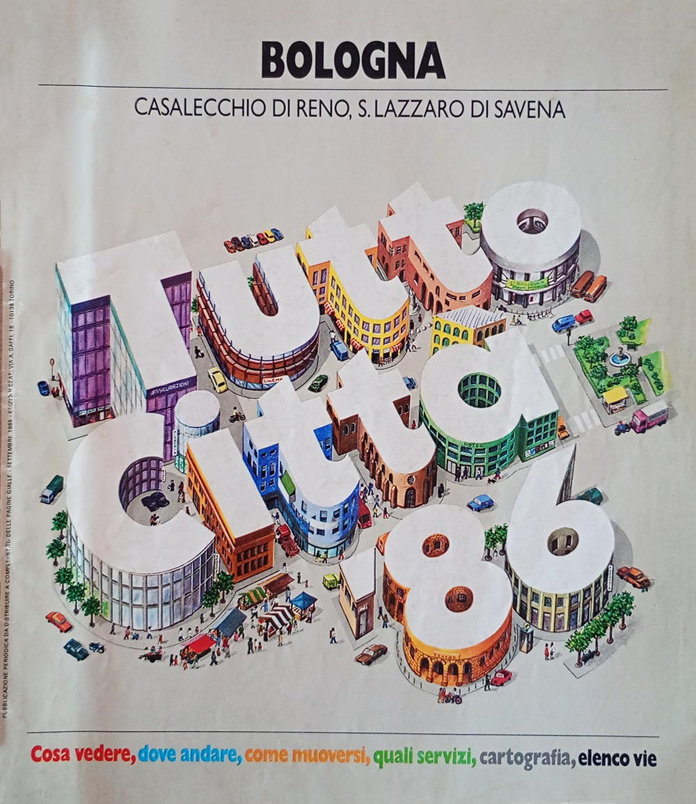</a>
Bologna 86
<ul class="scheda"><li><b>Formato:</b> 246 x 280 mm</li><li><b>Copertina:</b> grossa</li><li><b>Layout:</b> TuttoCittà '80 edifici</li><li><b>Pagine:</b> 80</li><li><b>Mese aggiornamento:</b> settembre 1985</li><li><b>Note:</b> riforma cartografica</li></ul></td><td class="fasc sospesa">
Provincia di Bologna 86
<ul class="scheda"><li><b>Formato:</b> 246 x 280 mm</li><li><b>Copertina:</b> grossa</li><li><b>Layout:</b> TuttoCittà '80 classico</li><li>non in raccolta</li></ul></td><td class="fasc"><a href="../immagini/FE85.jpg">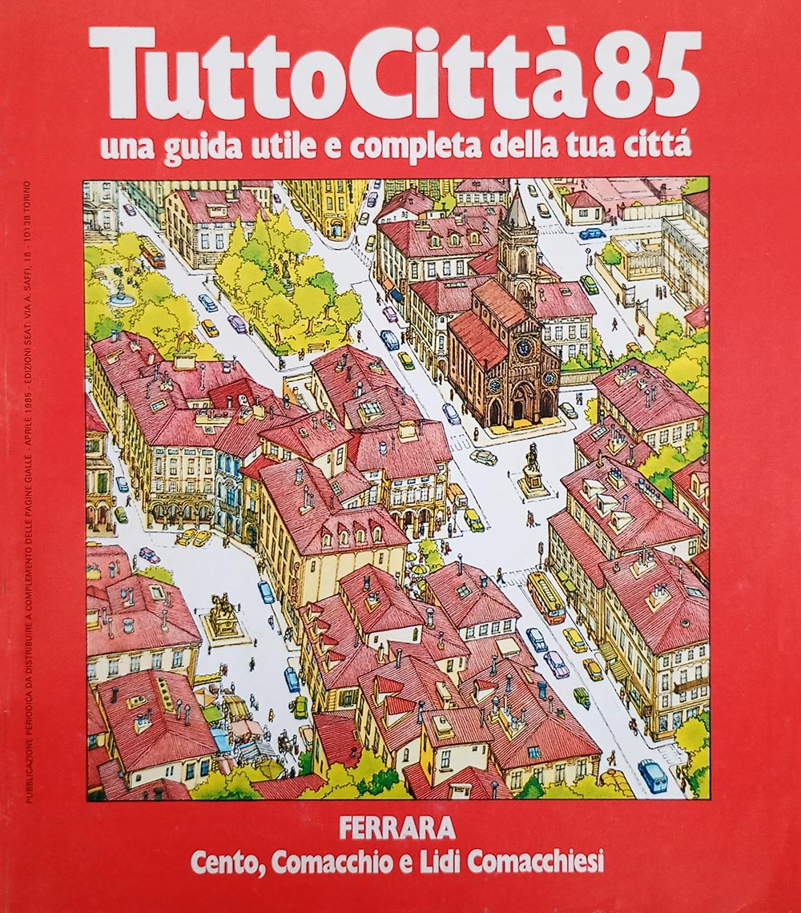</a>
Ferrara 85
<ul class="scheda"><li><b>Formato:</b> 246 x 280 mm</li><li><b>Copertina:</b> grossa</li><li><b>Layout:</b> TuttoCittà '80 classico</li><li><b>Pagine:</b> 24 (25)</li><li><b>Mese aggiornamento:</b> aprile 1985</li></ul></td><td class="fasc"><a href="../immagini/FO85.jpg">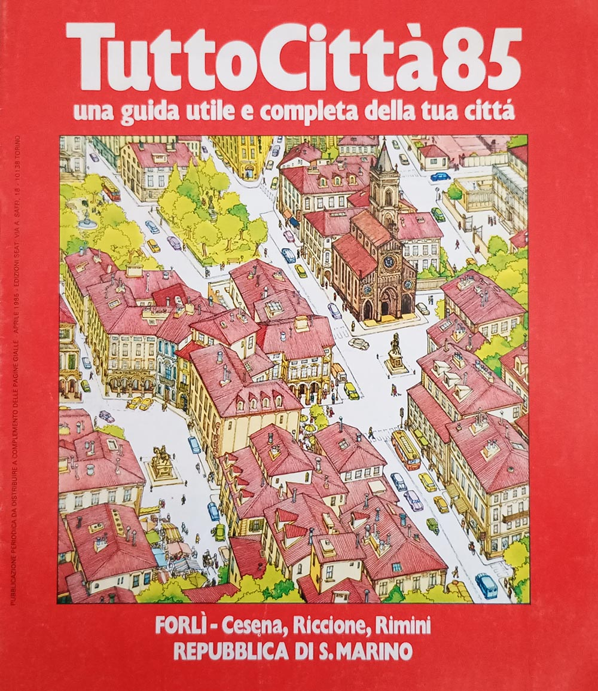</a>
Forlì - San Marino 85
<ul class="scheda"><li><b>Formato:</b> 246 x 280 mm</li><li><b>Copertina:</b> grossa</li><li><b>Layout:</b> TuttoCittà '80 classico</li><li><b>Pagine:</b> 32</li><li><b>Mese aggiornamento:</b> aprile 1985</li></ul></td><td class="fasc"><a href="../immagini/RA85.jpg">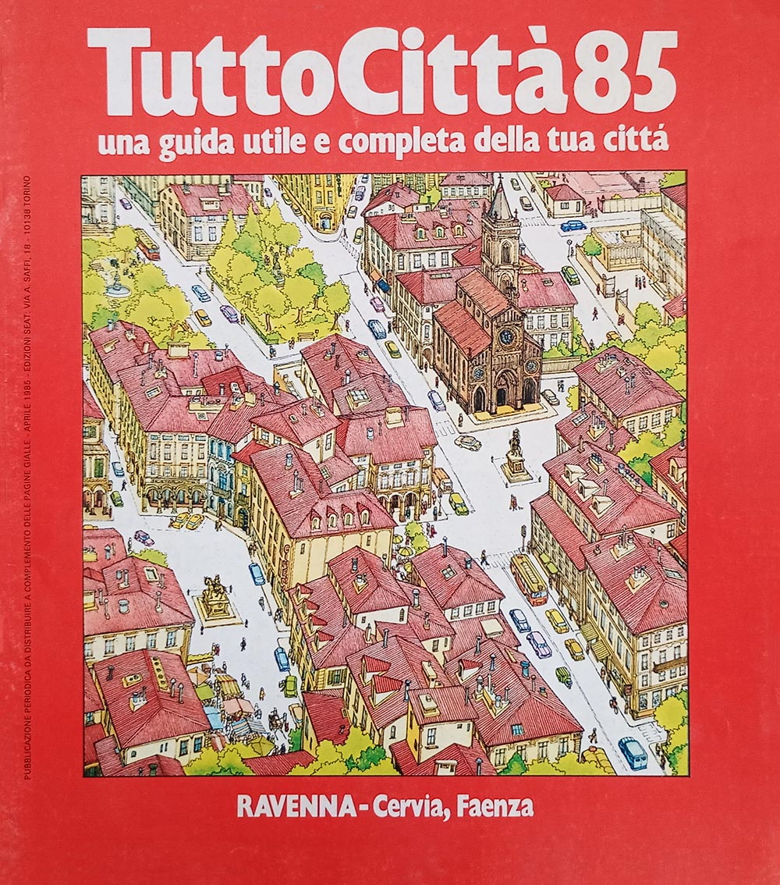</a>
Ravenna 85
<ul class="scheda"><li><b>Formato:</b> 246 x 280 mm</li><li><b>Copertina:</b> grossa</li><li><b>Layout:</b> TuttoCittà '80 classico</li><li><b>Pagine:</b> 24</li><li><b>Mese aggiornamento:</b> aprile 1985</li></ul></td><td class="fasc"><a href="../immagini/MO86.jpg">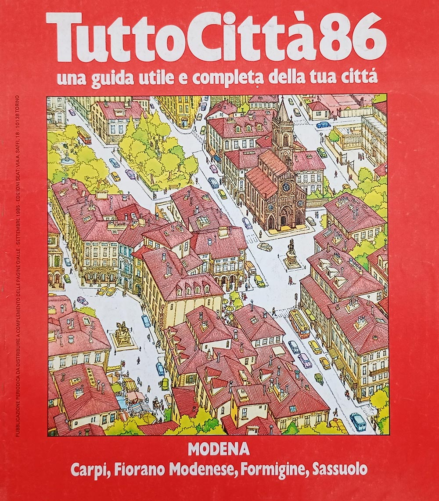</a>
Modena 86
<ul class="scheda"><li><b>Formato:</b> 246 x 280 mm</li><li><b>Copertina:</b> grossa</li><li><b>Layout:</b> TuttoCittà '80 classico</li><li><b>Pagine:</b> 32 (33)</li><li><b>Mese aggiornamento:</b> settembre 1985</li></ul></td><td class="fasc"><a href="../immagini/PR86.jpg">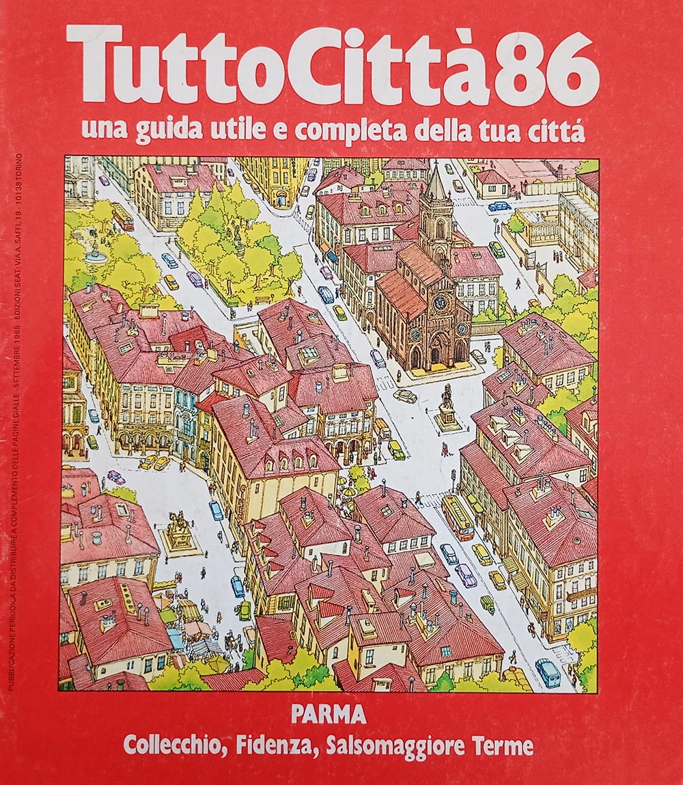</a>
Parma 86
<ul class="scheda"><li><b>Formato:</b> 246 x 280 mm</li><li><b>Copertina:</b> grossa</li><li><b>Layout:</b> TuttoCittà '80 classico</li><li><b>Pagine:</b> 24</li><li><b>Mese aggiornamento:</b> settembre 1985</li></ul></td><td class="fasc sospesa">
Piacenza 86
<ul class="scheda"><li><b>Formato:</b> 246 x 280 mm</li><li><b>Copertina:</b> grossa</li><li><b>Layout:</b> TuttoCittà '80 classico</li><li>non in raccolta</li></ul></td><td class="fasc sospesa">
Reggio Emilia 86
<ul class="scheda"><li><b>Formato:</b> 246 x 280 mm</li><li><b>Copertina:</b> grossa</li><li><b>Layout:</b> TuttoCittà '80 classico</li><li>non in raccolta</li></ul></td></tr>
<tr><td class="ann"> 86/87</td><td class="tav"></td><td class="fasc"><a href="../immagini/BO87.jpg">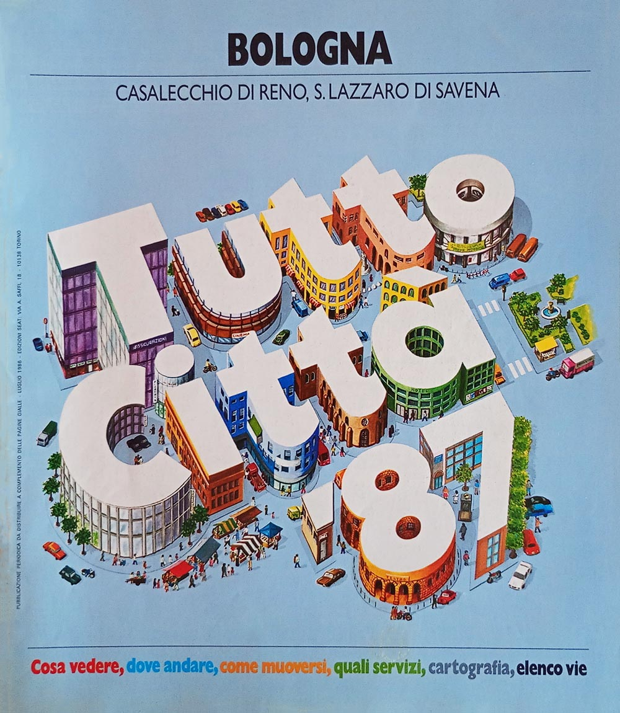</a>
Bologna 87
<ul class="scheda"><li><b>Formato:</b> 246 x 280 mm</li><li><b>Copertina:</b> grossa</li><li><b>Layout:</b> TuttoCittà '80 edifici</li><li><b>Pagine:</b> 72</li><li><b>Mese aggiornamento:</b> luglio 1986</li></ul></td><td class="fasc"><a href="../immagini/PROVBO87.jpg">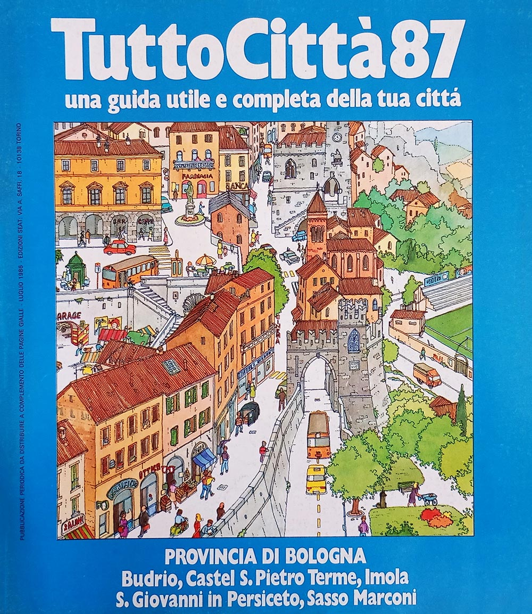</a>
Provincia di Bologna 87
<ul class="scheda"><li><b>Formato:</b> 246 x 280 mm</li><li><b>Copertina:</b> grossa</li><li><b>Layout:</b> TuttoCittà '80 classico</li><li><b>Pagine:</b> 16 (17)</li><li><b>Mese aggiornamento:</b> luglio 1986</li></ul></td><td class="fasc"><a href="../immagini/FE86.jpg">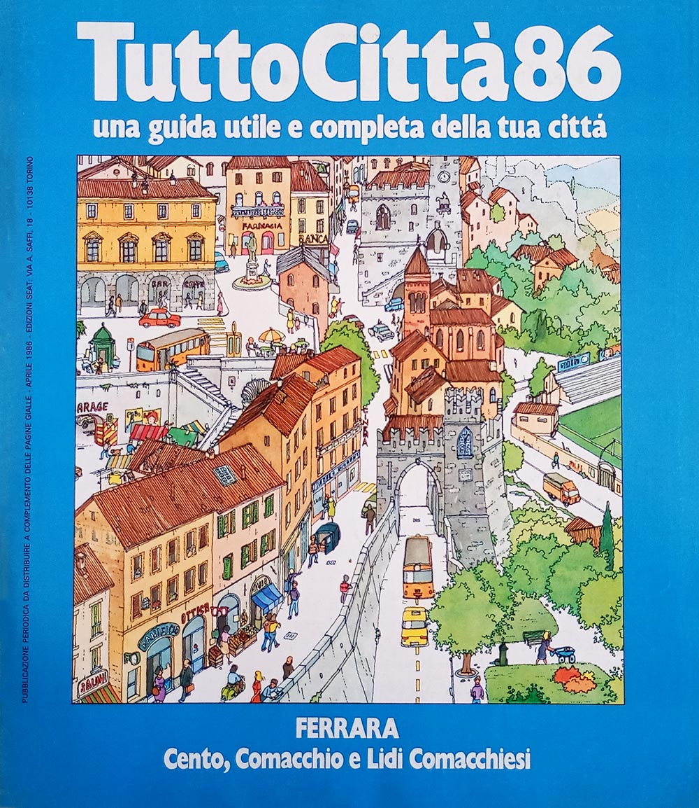</a>
Ferrara 86
<ul class="scheda"><li><b>Formato:</b> 246 x 280 mm</li><li><b>Copertina:</b> grossa</li><li><b>Layout:</b> TuttoCittà '80 classico</li><li><b>Pagine:</b> 24 (25)</li><li><b>Mese aggiornamento:</b> aprile 1986</li></ul></td><td class="fasc"><a href="../immagini/FO86.jpg">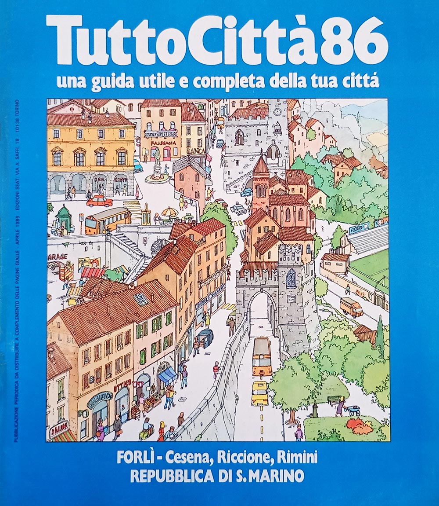</a>
Forlì - San Marino 86
<ul class="scheda"><li><b>Formato:</b> 246 x 280 mm</li><li><b>Copertina:</b> grossa</li><li><b>Layout:</b> TuttoCittà '80 classico</li><li><b>Pagine:</b> 32 (33)</li><li><b>Mese aggiornamento:</b> aprile 1986</li></ul></td><td class="fasc"><a href="../immagini/RA86.jpg">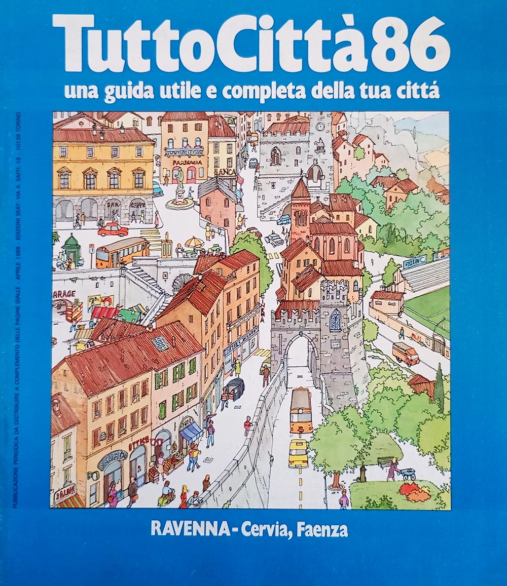</a>
Ravenna 86
<ul class="scheda"><li><b>Formato:</b> 246 x 280 mm</li><li><b>Copertina:</b> grossa</li><li><b>Layout:</b> TuttoCittà '80 classico</li><li><b>Pagine:</b> 24</li><li><b>Mese aggiornamento:</b> aprile 1986</li></ul></td><td class="fasc"><a href="../immagini/MO87.jpg">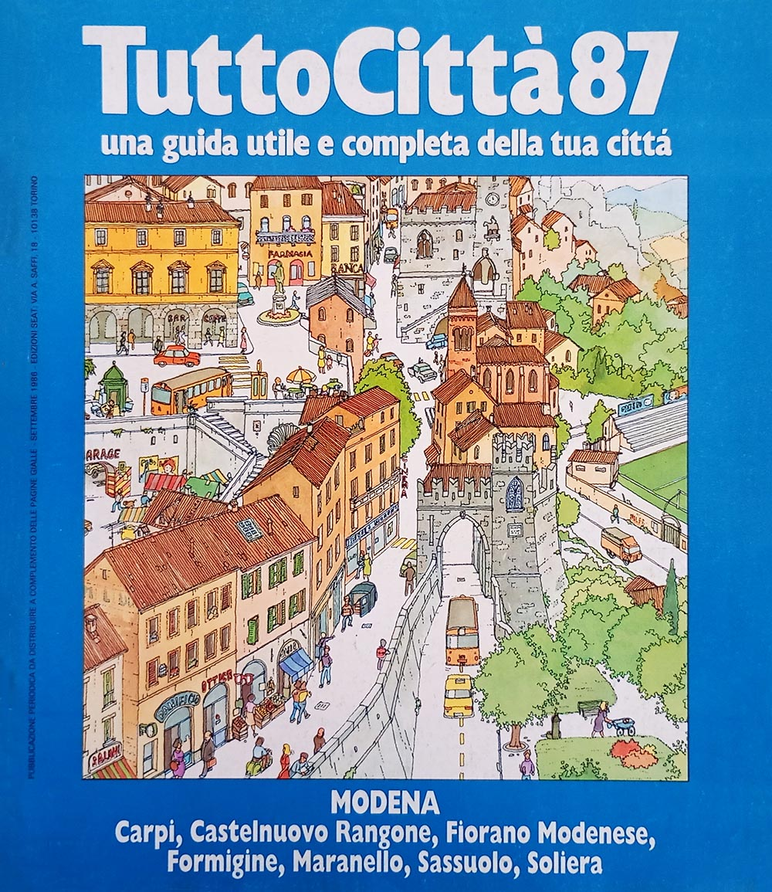</a>
Modena 87
<ul class="scheda"><li><b>Formato:</b> 246 x 280 mm</li><li><b>Copertina:</b> grossa</li><li><b>Layout:</b> TuttoCittà '80 classico</li><li><b>Pagine:</b> 32 (33)</li><li><b>Mese aggiornamento:</b> settembre 1986</li></ul></td><td class="fasc"><a href="../immagini/PR87.jpg">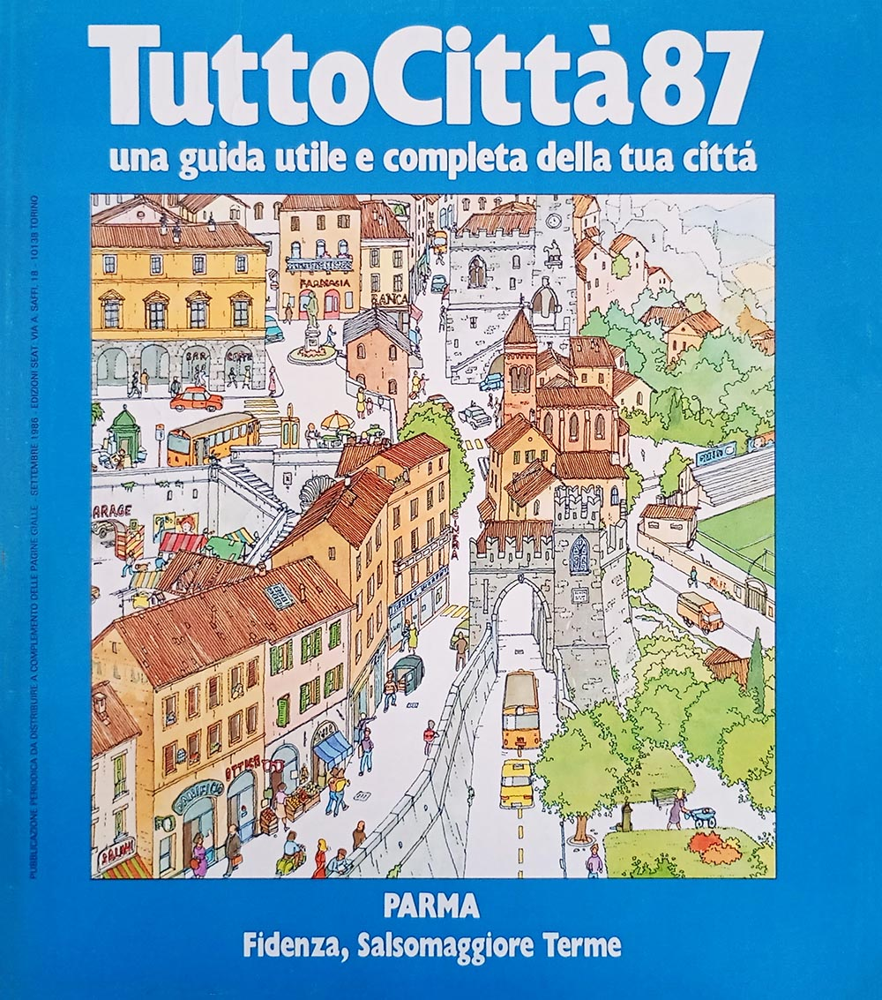</a>
Parma 87
<ul class="scheda"><li><b>Formato:</b> 246 x 280 mm</li><li><b>Copertina:</b> grossa</li><li><b>Layout:</b> TuttoCittà '80 classico</li><li><b>Pagine:</b> 24</li><li><b>Mese aggiornamento:</b> settembre 1986</li></ul></td><td class="fasc"><a href="../immagini/PC87.jpg">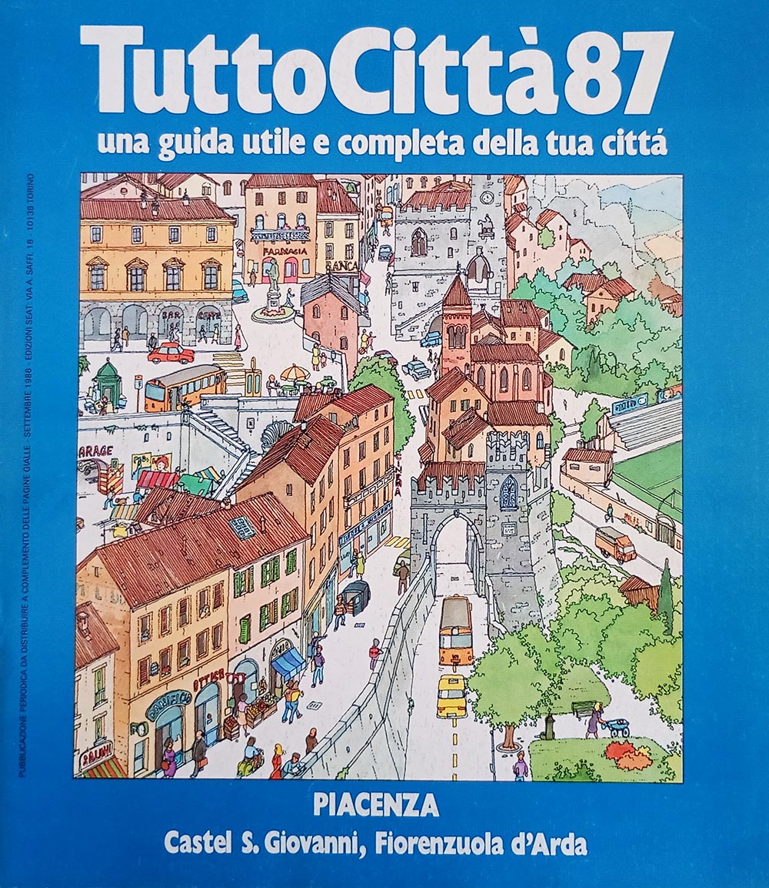</a>
Piacenza 87
<ul class="scheda"><li><b>Formato:</b> 246 x 280 mm</li><li><b>Copertina:</b> grossa</li><li><b>Layout:</b> TuttoCittà '80 classico</li><li><b>Pagine:</b> 16 (17)</li><li><b>Mese aggiornamento:</b> settembre 1986</li></ul></td><td class="fasc"><a href="../immagini/RE87.jpg">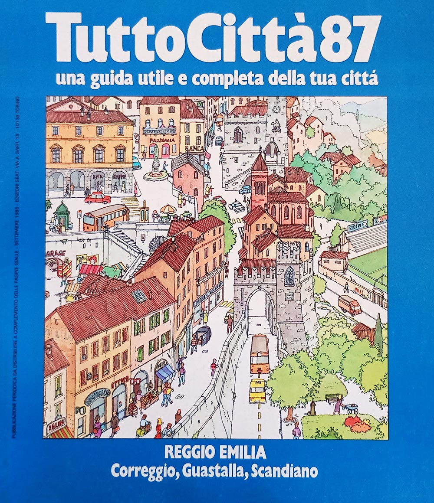</a>
Reggio Emilia 87
<ul class="scheda"><li><b>Formato:</b> 246 x 280 mm</li><li><b>Copertina:</b> grossa</li><li><b>Layout:</b> TuttoCittà '80 classico</li><li><b>Pagine:</b> 24</li><li><b>Mese aggiornamento:</b> settembre 1986</li></ul></td></tr>
<tr><td class="ann"> 87/88</td><td class="tav"></td><td class="fasc"><a href="../immagini/BO88.jpg">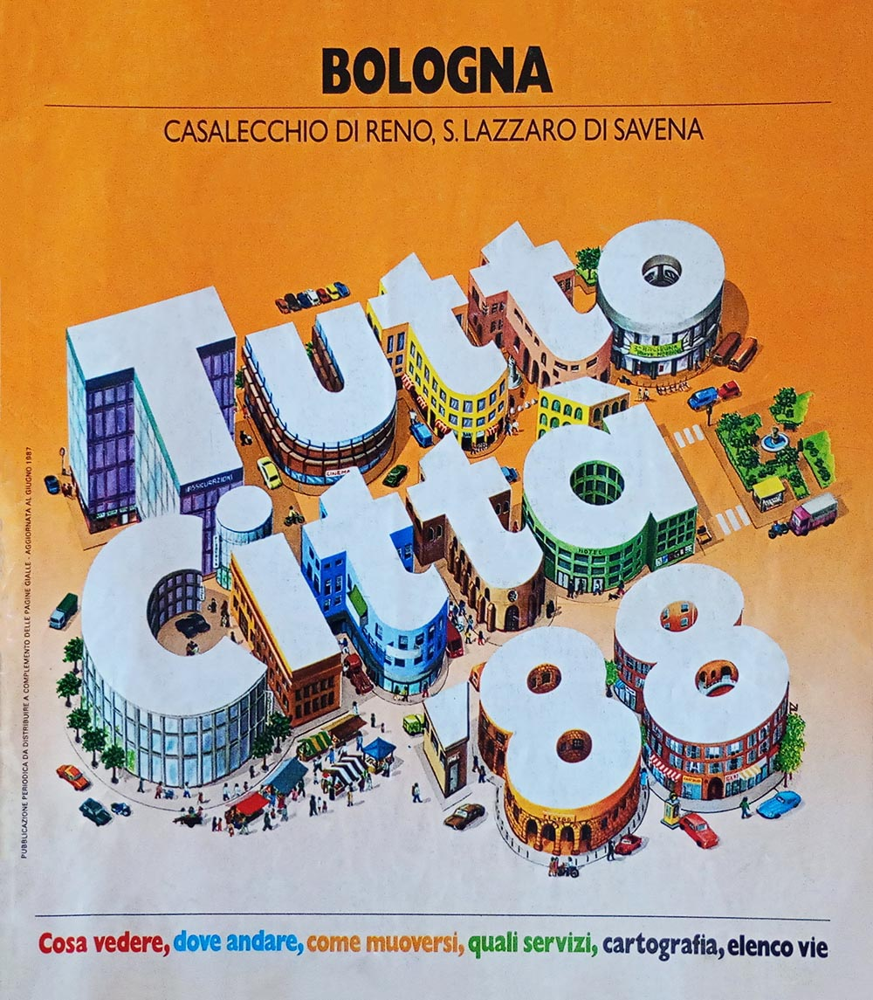</a>
Bologna 88
<ul class="scheda"><li><b>Formato:</b> 246 x 280 mm</li><li><b>Copertina:</b> grossa</li><li><b>Layout:</b> TuttoCittà '80 edifici</li><li><b>Pagine:</b> 72</li><li><b>Mese aggiornamento:</b> giugno 1987</li></ul></td><td class="fasc"><a href="../immagini/PROVBO88.jpg">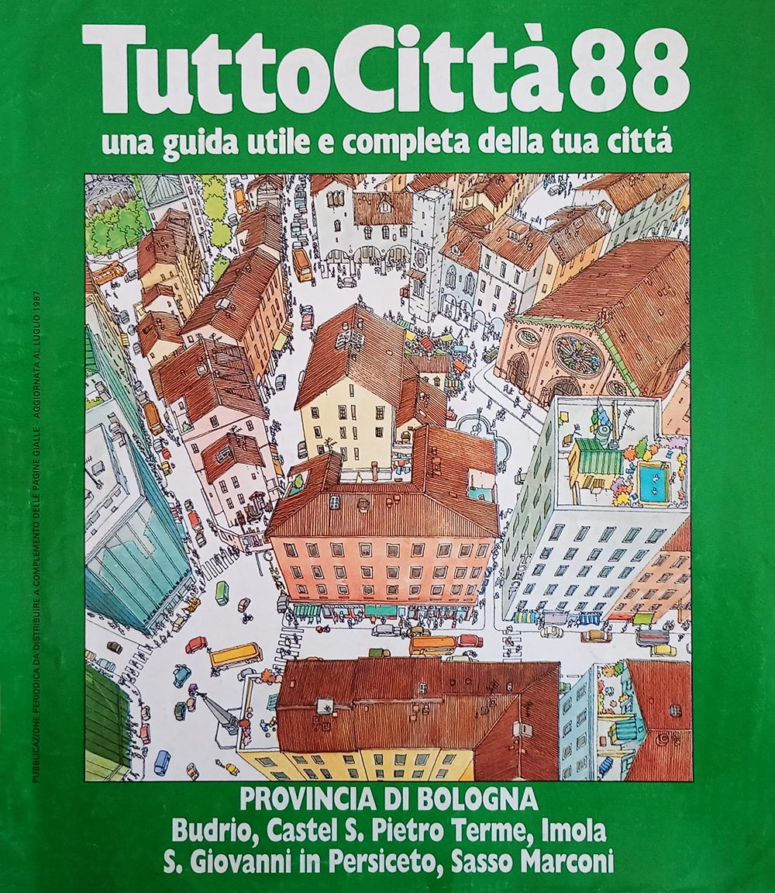</a>
Provincia di Bologna 88
<ul class="scheda"><li><b>Formato:</b> 246 x 280 mm</li><li><b>Copertina:</b> grossa</li><li><b>Layout:</b> TuttoCittà '80 classico</li><li><b>Pagine:</b> 16 (17)</li><li><b>Mese aggiornamento:</b> luglio 1987</li></ul></td><td class="fasc sospesa">
Ferrara 87
<ul class="scheda"><li><b>Formato:</b> 246 x 280 mm</li><li><b>Copertina:</b> grossa</li><li><b>Layout:</b> TuttoCittà '80 classico</li><li>non in raccolta</li></ul></td><td class="fasc"><a href="../immagini/FO87.jpg">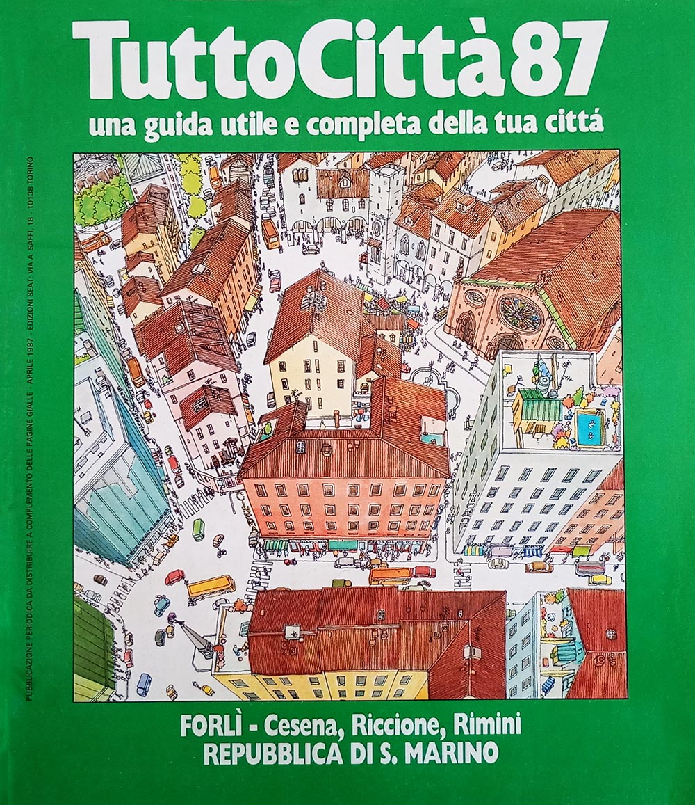</a>
Forlì - San Marino 87
<ul class="scheda"><li><b>Formato:</b> 246 x 280 mm</li><li><b>Copertina:</b> grossa</li><li><b>Layout:</b> TuttoCittà '80 classico</li><li><b>Pagine:</b> 32 (33)</li><li><b>Mese aggiornamento:</b> aprile 1987</li></ul></td><td class="fasc"><a href="../immagini/RA87.jpg">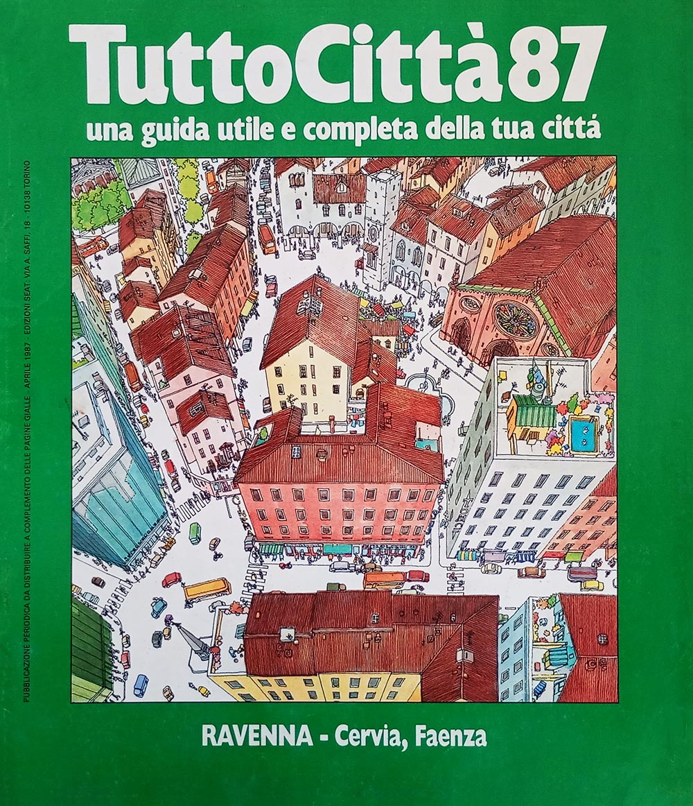</a>
Ravenna 87
<ul class="scheda"><li><b>Formato:</b> 246 x 280 mm</li><li><b>Copertina:</b> grossa</li><li><b>Layout:</b> TuttoCittà '80 classico</li><li><b>Pagine:</b> 24</li><li><b>Mese aggiornamento:</b> aprile 1987</li></ul></td><td class="fasc"><a href="../immagini/MO88.jpg">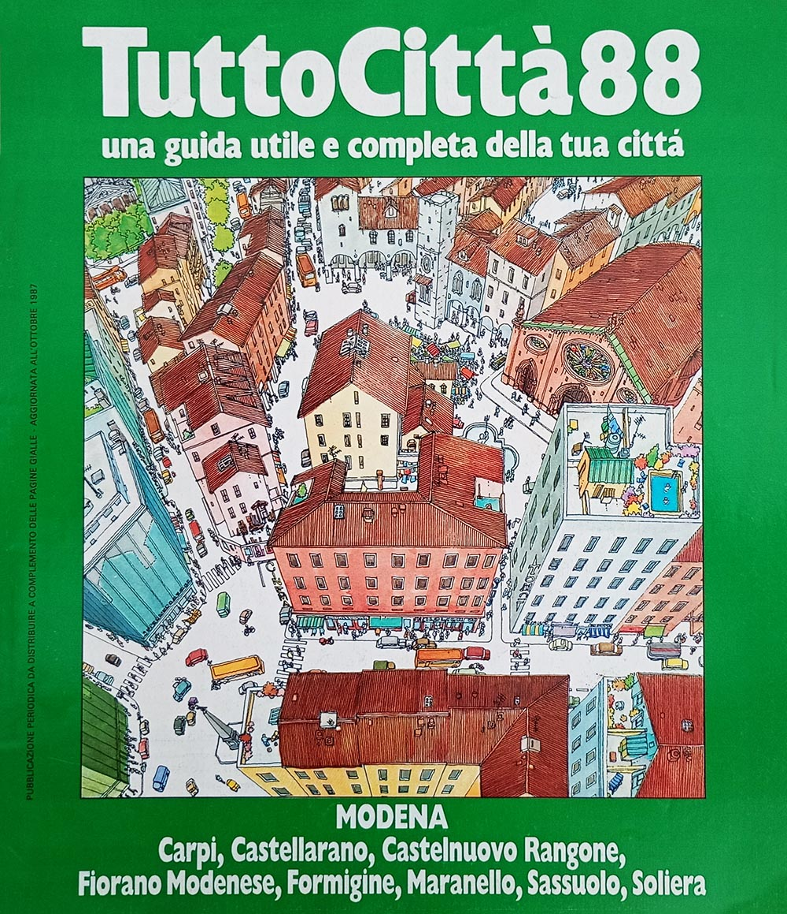</a>
Modena 88
<ul class="scheda"><li><b>Formato:</b> 246 x 280 mm</li><li><b>Copertina:</b> grossa</li><li><b>Layout:</b> TuttoCittà '80 classico</li><li><b>Pagine:</b> 32 (33)</li><li><b>Mese aggiornamento:</b> ottobre 1987</li></ul></td><td class="fasc"><a href="../immagini/PR88.jpg">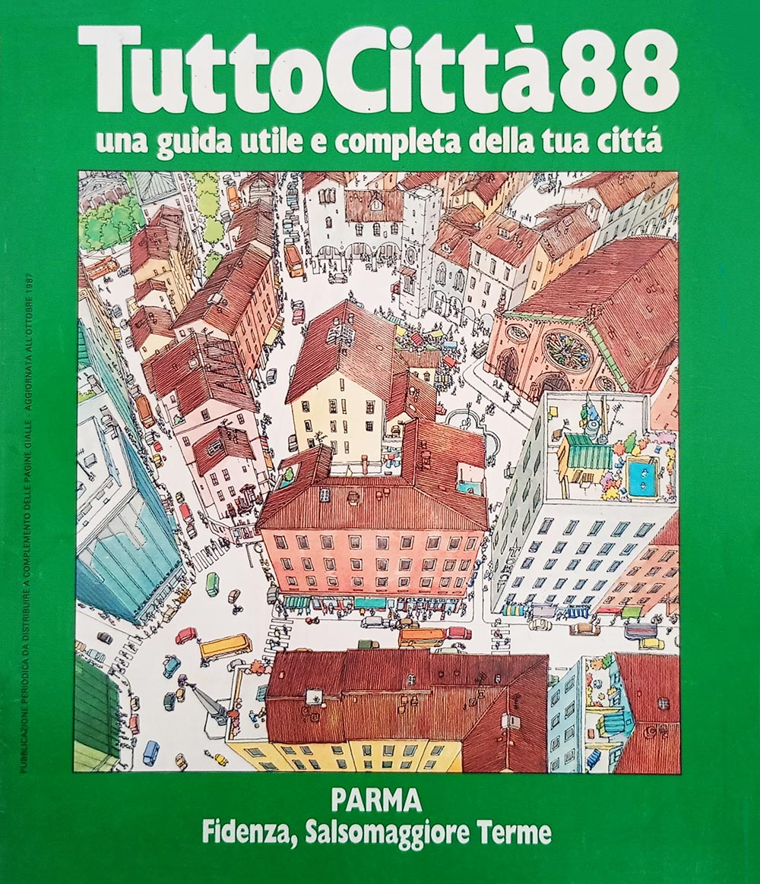</a>
Parma 88
<ul class="scheda"><li><b>Formato:</b> 246 x 280 mm</li><li><b>Copertina:</b> grossa</li><li><b>Layout:</b> TuttoCittà '80 classico</li><li><b>Pagine:</b> 24 (25)</li><li><b>Mese aggiornamento:</b> ottobre 1987</li></ul></td><td class="fasc"><a href="../immagini/PC88.jpg">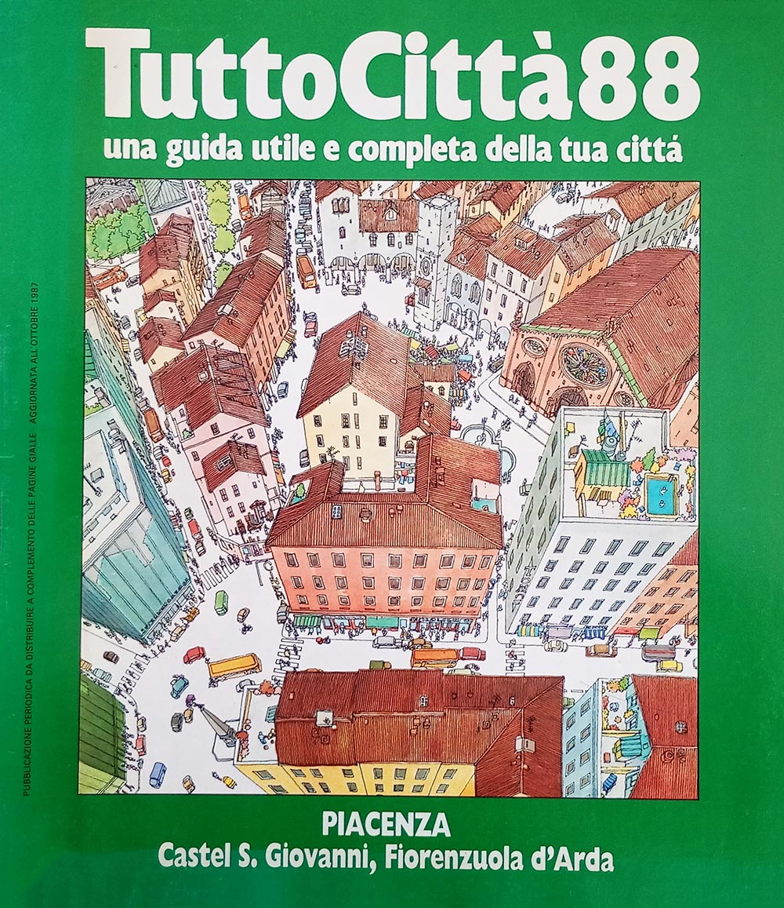</a>
Piacenza 88
<ul class="scheda"><li><b>Formato:</b> 246 x 280 mm</li><li><b>Copertina:</b> grossa</li><li><b>Layout:</b> TuttoCittà '80 classico</li><li><b>Pagine:</b> 16 (17)</li><li><b>Mese aggiornamento:</b> ottobre 1987</li></ul></td><td class="fasc"><a href="../immagini/RE88.jpg">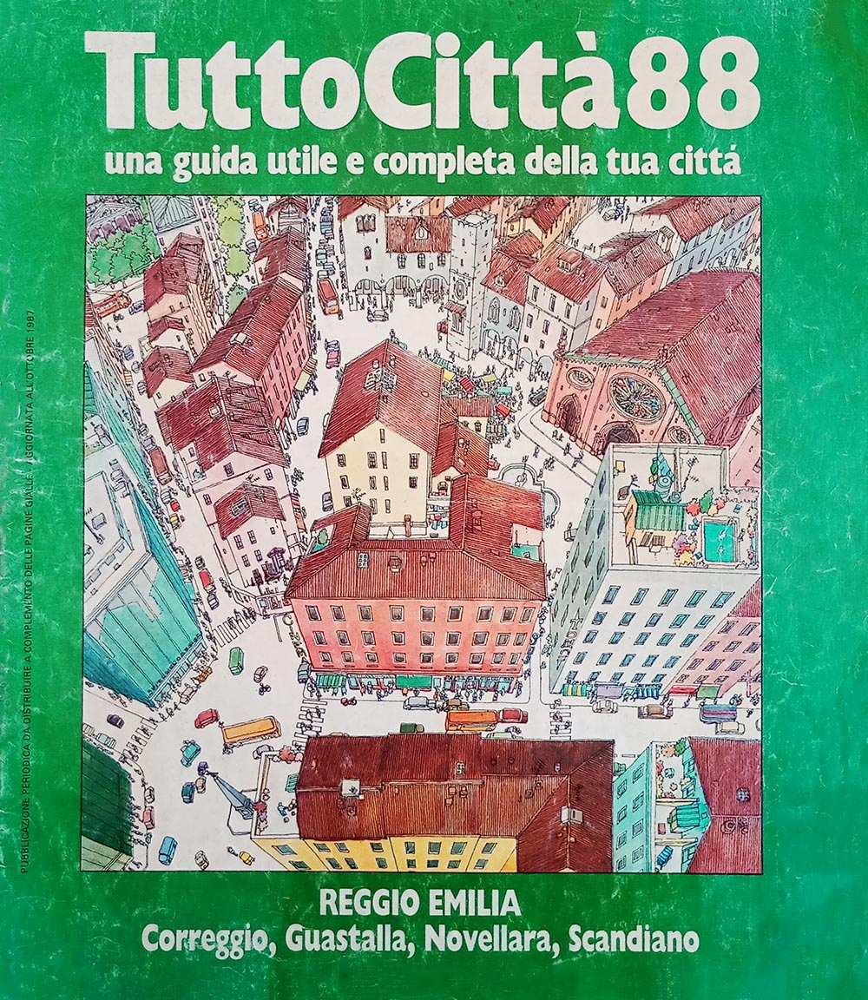</a>
Reggio Emilia 88
<ul class="scheda"><li><b>Formato:</b> 246 x 280 mm</li><li><b>Copertina:</b> grossa</li><li><b>Layout:</b> TuttoCittà '80 classico</li><li><b>Pagine:</b> 24</li><li><b>Mese aggiornamento:</b> ottobre 1987</li></ul></td></tr>
<tr><td class="ann"> 88/89</td><td class="tav"></td><td class="fasc"><a href="../immagini/BO89.jpg">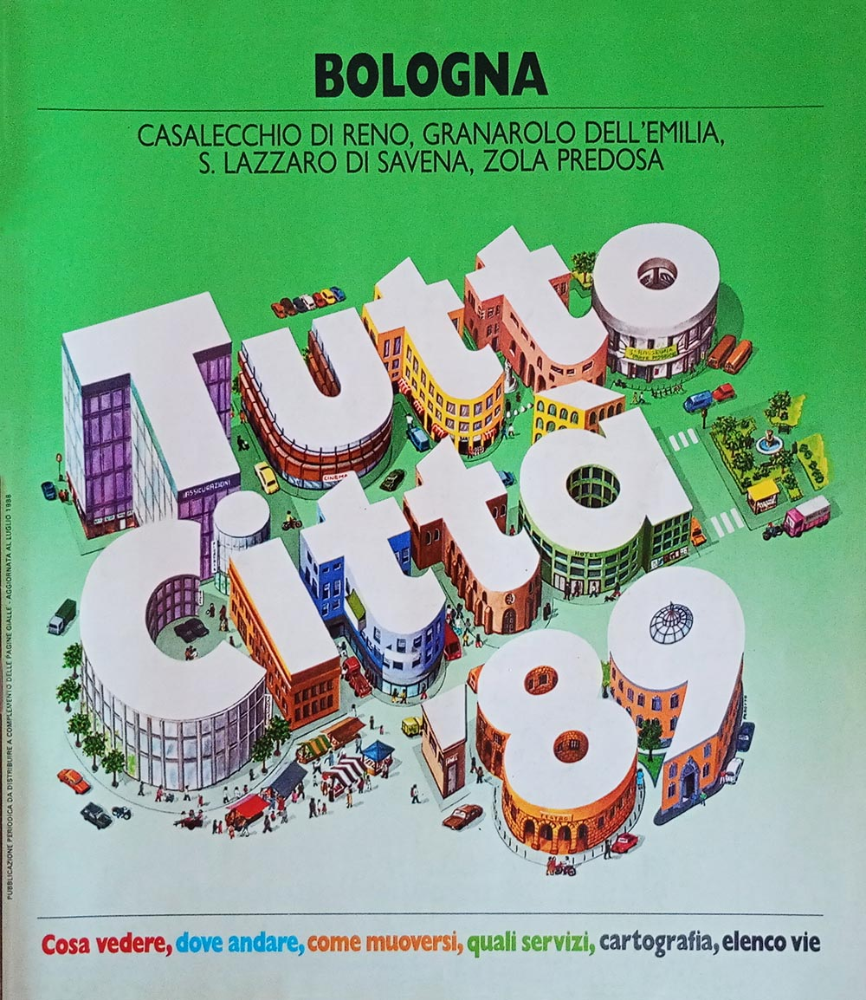</a>
Bologna 89
<ul class="scheda"><li><b>Formato:</b> 246 x 280 mm</li><li><b>Copertina:</b> grossa</li><li><b>Layout:</b> TuttoCittà '80 edifici</li><li><b>Pagine:</b> 72</li><li><b>Mese aggiornamento:</b> luglio 1988</li></ul></td><td class="fasc"><a href="../immagini/PROVBO89.jpg">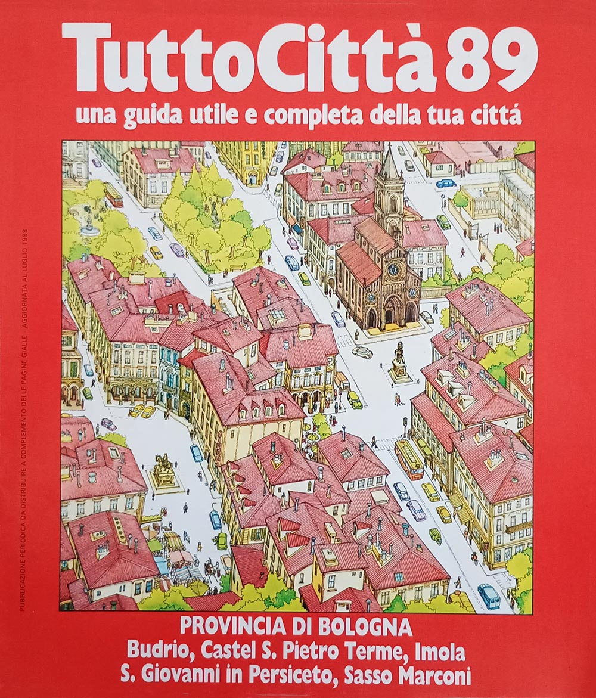</a>
Provincia di Bologna 89
<ul class="scheda"><li><b>Formato:</b> 246 x 280 mm</li><li><b>Copertina:</b> grossa</li><li><b>Layout:</b> TuttoCittà '80 classico</li><li><b>Pagine:</b> 16 (17)</li><li><b>Mese aggiornamento:</b> luglio 1988</li></ul></td><td class="fasc sospesa">
Ferrara 88
<ul class="scheda"><li><b>Formato:</b> 246 x 280 mm</li><li><b>Copertina:</b> grossa</li><li><b>Layout:</b> TuttoCittà '80 classico</li><li>non in raccolta</li></ul></td><td class="fasc"><a href="../immagini/FO88.jpg">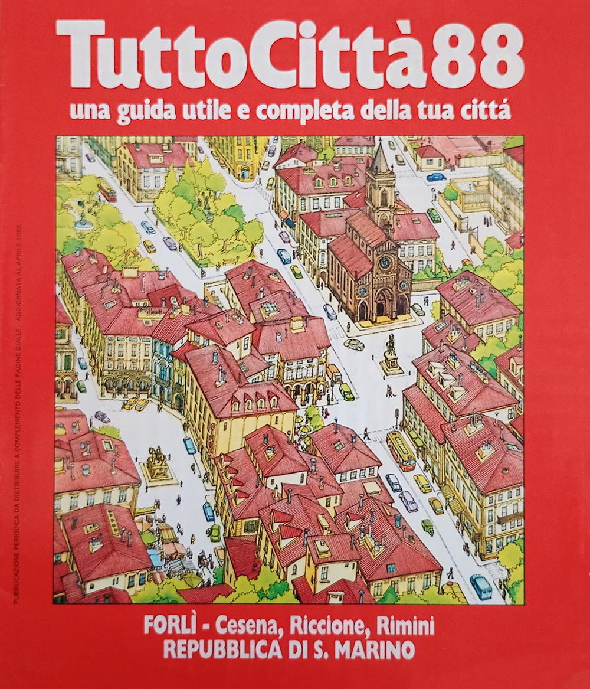</a>
Forlì - San Marino 88
<ul class="scheda"><li><b>Formato:</b> 246 x 280 mm</li><li><b>Copertina:</b> grossa</li><li><b>Layout:</b> TuttoCittà '80 classico</li><li><b>Pagine:</b> 32 (33)</li><li><b>Mese aggiornamento:</b> aprile 1988</li></ul></td><td class="fasc"><a href="../immagini/RA88.jpg">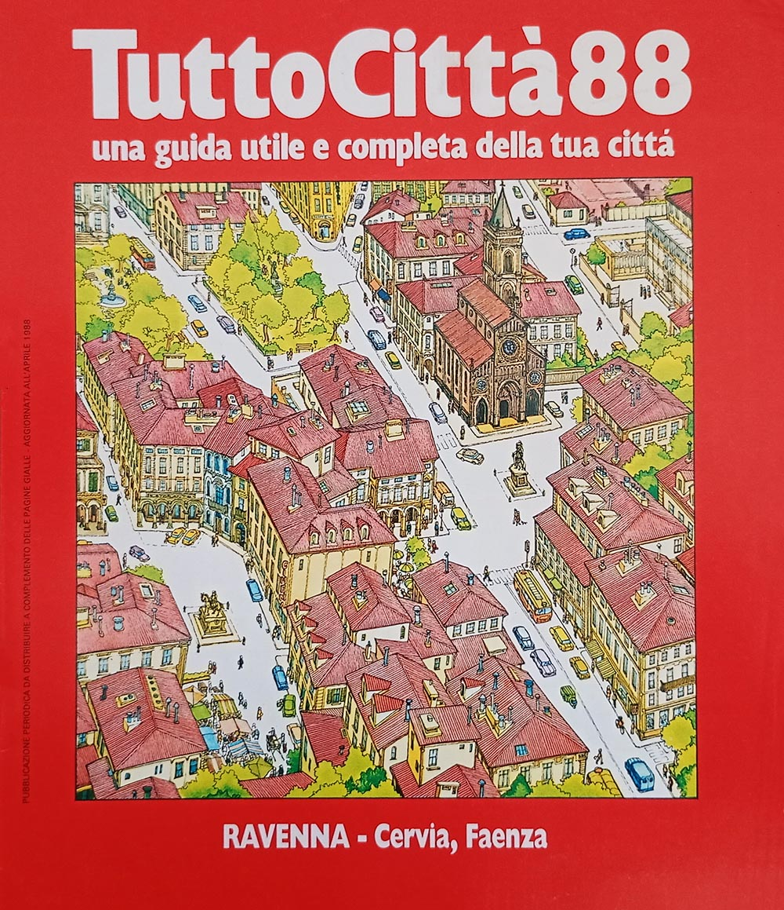</a>
Ravenna 88
<ul class="scheda"><li><b>Formato:</b> 246 x 280 mm</li><li><b>Copertina:</b> grossa</li><li><b>Layout:</b> TuttoCittà '80 classico</li><li><b>Pagine:</b> 24</li><li><b>Mese aggiornamento:</b> aprile 1988</li></ul></td><td class="fasc"><a href="../immagini/MO89.jpg">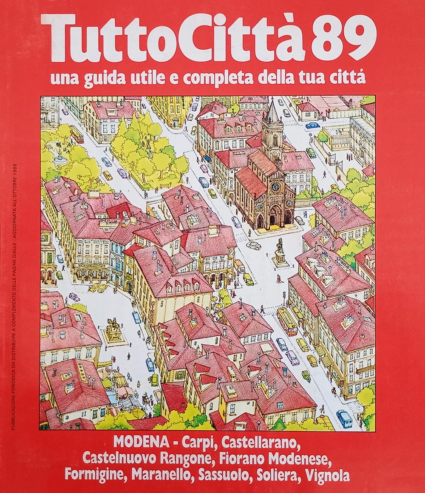</a>
Modena 89
<ul class="scheda"><li><b>Formato:</b> 246 x 280 mm</li><li><b>Copertina:</b> grossa</li><li><b>Layout:</b> TuttoCittà '80 classico</li><li><b>Pagine:</b> 32 (33)</li><li><b>Mese aggiornamento:</b> ottobre 1988</li></ul></td><td class="fasc"><a href="../immagini/PR89.jpg">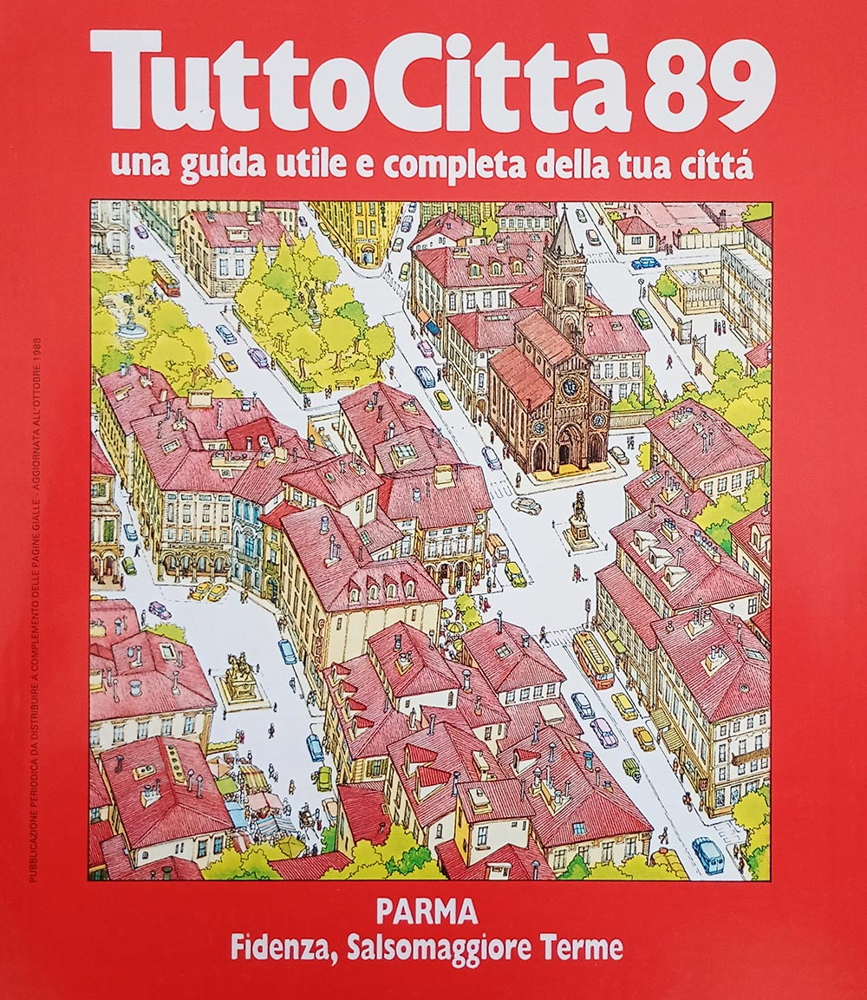</a>
Parma 89
<ul class="scheda"><li><b>Formato:</b> 246 x 280 mm</li><li><b>Copertina:</b> grossa</li><li><b>Layout:</b> TuttoCittà '80 classico</li><li><b>Pagine:</b> 24 (25)</li><li><b>Mese aggiornamento:</b> ottobre 1988</li></ul></td><td class="fasc"><a href="../immagini/PC89.jpg">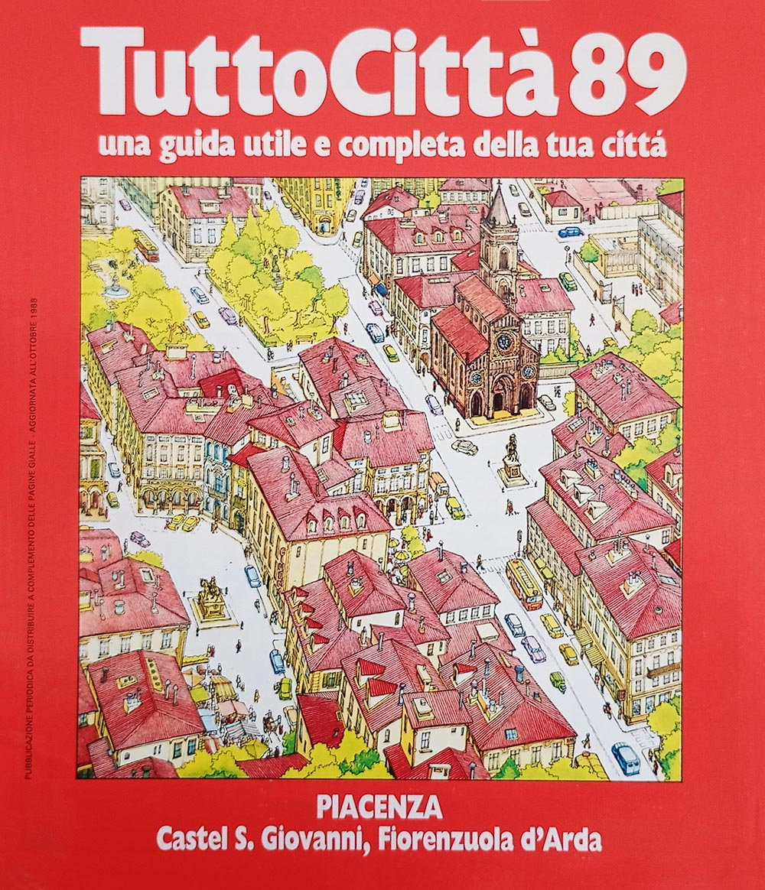</a>
Piacenza 89
<ul class="scheda"><li><b>Formato:</b> 246 x 280 mm</li><li><b>Copertina:</b> grossa</li><li><b>Layout:</b> TuttoCittà '80 classico</li><li><b>Pagine:</b> 16 (17)</li><li><b>Mese aggiornamento:</b> ottobre 1988</li></ul></td><td class="fasc"><a href="../immagini/RE89.jpg">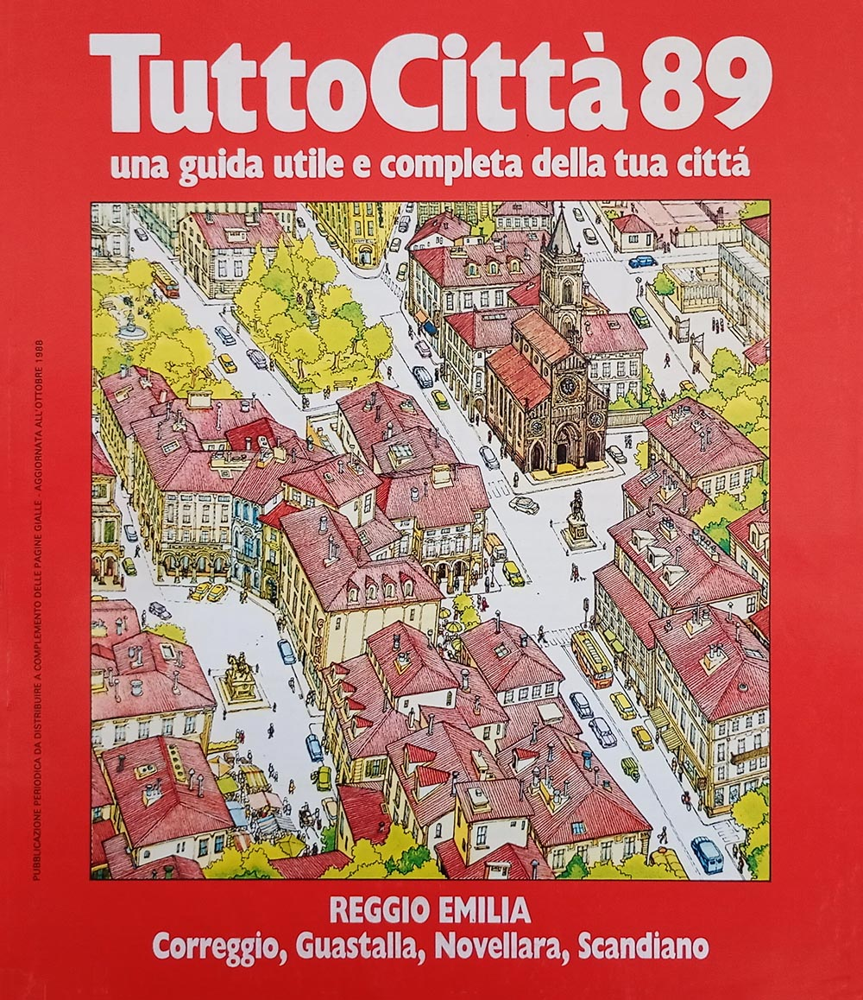</a>
Reggio Emilia 89
<ul class="scheda"><li><b>Formato:</b> 246 x 280 mm</li><li><b>Copertina:</b> grossa</li><li><b>Layout:</b> TuttoCittà '80 classico</li><li><b>Pagine:</b> 24</li><li><b>Mese aggiornamento:</b> ottobre 1988</li></ul></td></tr>
<tr><td class="ann"> 89/90</td><td class="tav"></td><td class="fasc"><a href="../immagini/BO90.jpg">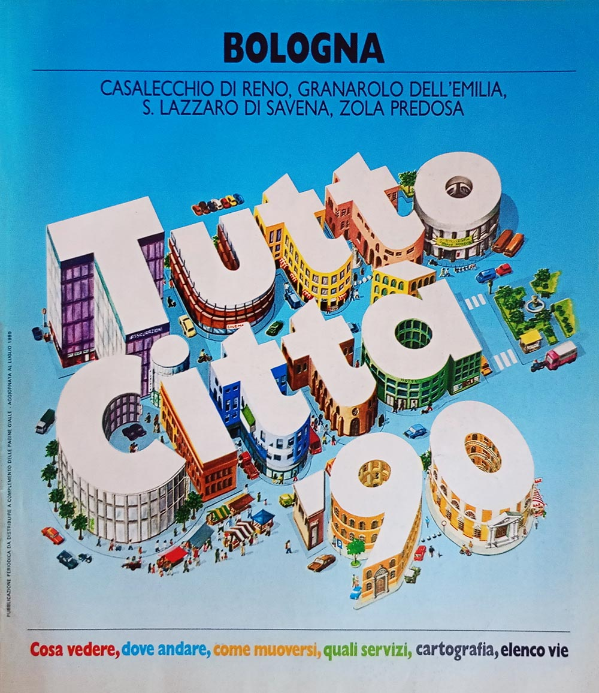</a>
Bologna 90
<ul class="scheda"><li><b>Formato:</b> 246 x 280 mm</li><li><b>Copertina:</b> grossa</li><li><b>Layout:</b> TuttoCittà '80 edifici</li><li><b>Pagine:</b> 72</li><li><b>Mese aggiornamento:</b> luglio 1989</li></ul></td><td class="fasc"><a href="../immagini/PROVBO90.jpg">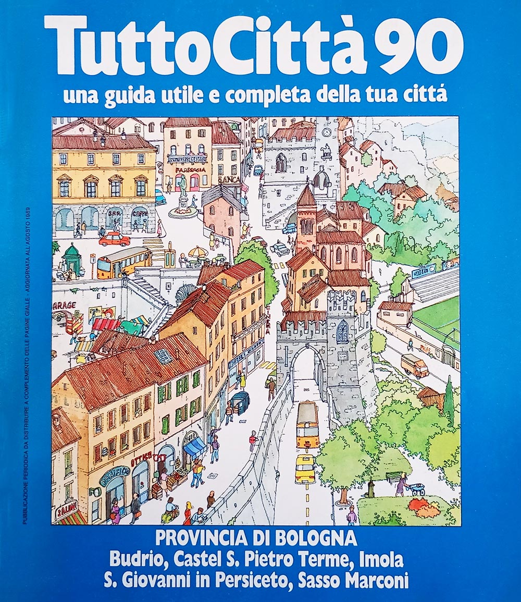</a>
Provincia di Bologna 90
<ul class="scheda"><li><b>Formato:</b> 246 x 280 mm</li><li><b>Copertina:</b> grossa</li><li><b>Layout:</b> TuttoCittà '80 classico</li><li><b>Pagine:</b> 16 (17)</li><li><b>Mese aggiornamento:</b> agosto 1989</li></ul></td><td class="fasc"><a href="../immagini/FE89.jpg">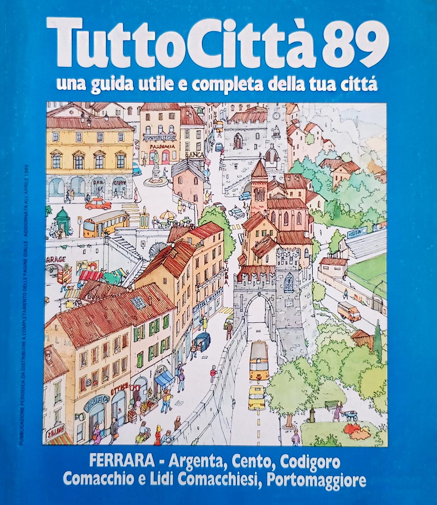</a>
Ferrara 89
<ul class="scheda"><li><b>Formato:</b> 246 x 280 mm</li><li><b>Copertina:</b> grossa</li><li><b>Layout:</b> TuttoCittà '80 classico</li><li><b>Pagine:</b> 24 (25)</li><li><b>Mese aggiornamento:</b> aprile 1989</li></ul></td><td class="fasc"><a href="../immagini/FO89.jpg">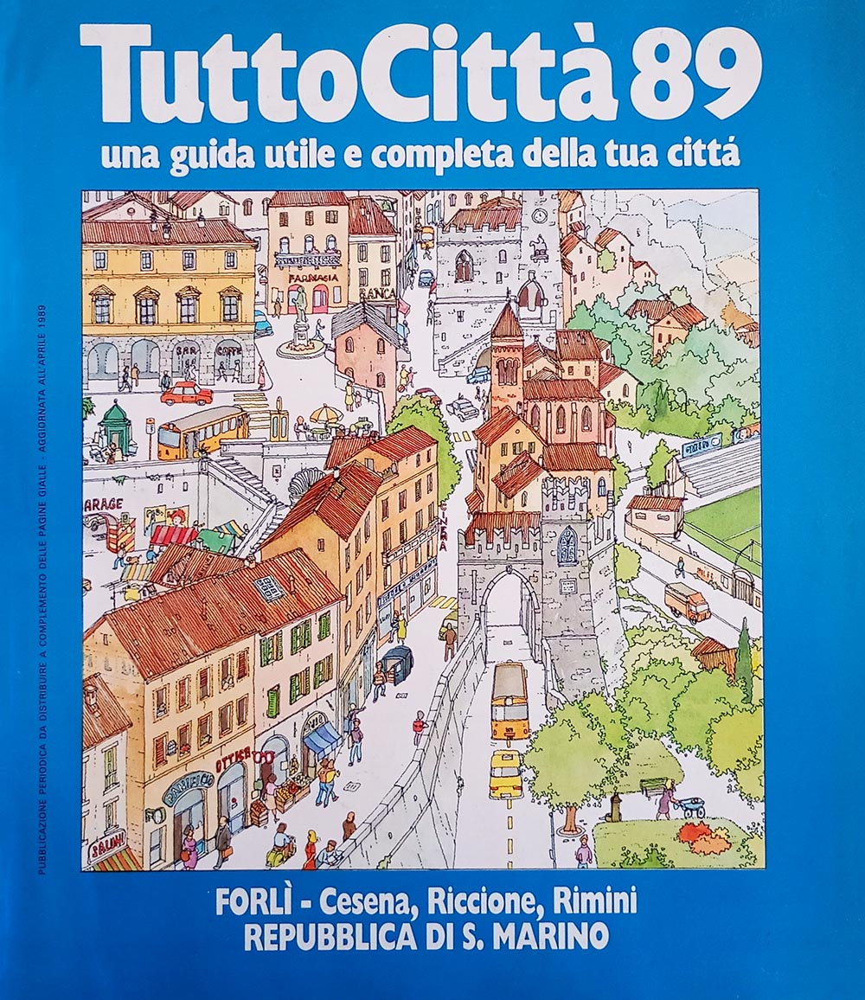</a>
Forlì - San Marino 89
<ul class="scheda"><li><b>Formato:</b> 246 x 280 mm</li><li><b>Copertina:</b> grossa</li><li><b>Layout:</b> TuttoCittà '80 classico</li><li><b>Pagine:</b> 32 (33)</li><li><b>Mese aggiornamento:</b> aprile 1989</li></ul></td><td class="fasc"><a href="../immagini/RA89.jpg">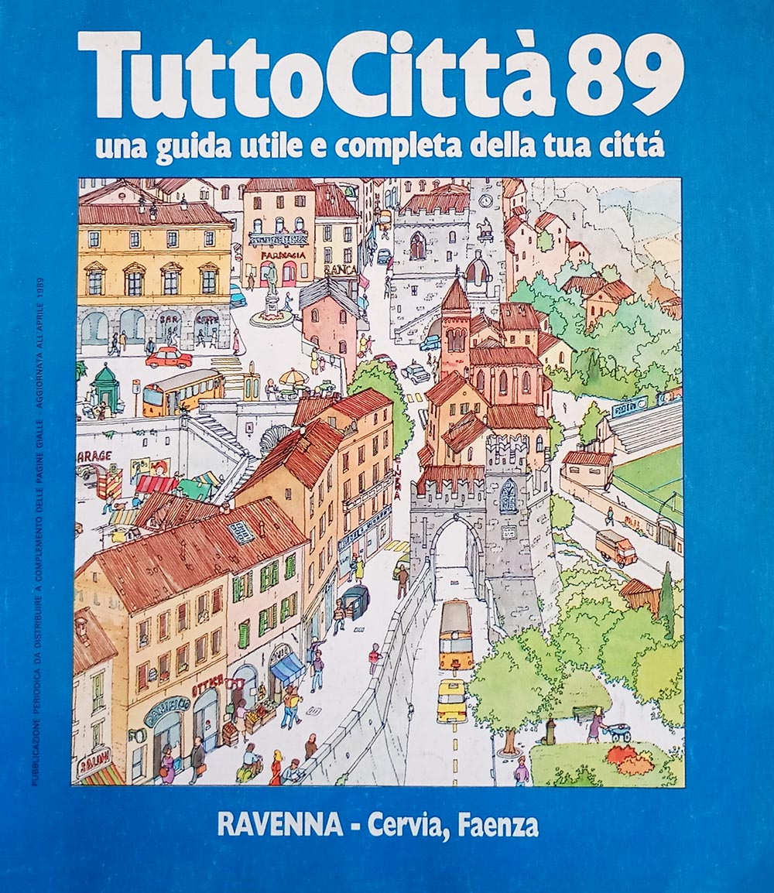</a>
Ravenna 89
<ul class="scheda"><li><b>Formato:</b> 246 x 280 mm</li><li><b>Copertina:</b> grossa</li><li><b>Layout:</b> TuttoCittà '80 classico</li><li><b>Pagine:</b> 24</li><li><b>Mese aggiornamento:</b> aprile 1989</li></ul></td><td class="fasc"><a href="../immagini/MO90.jpg">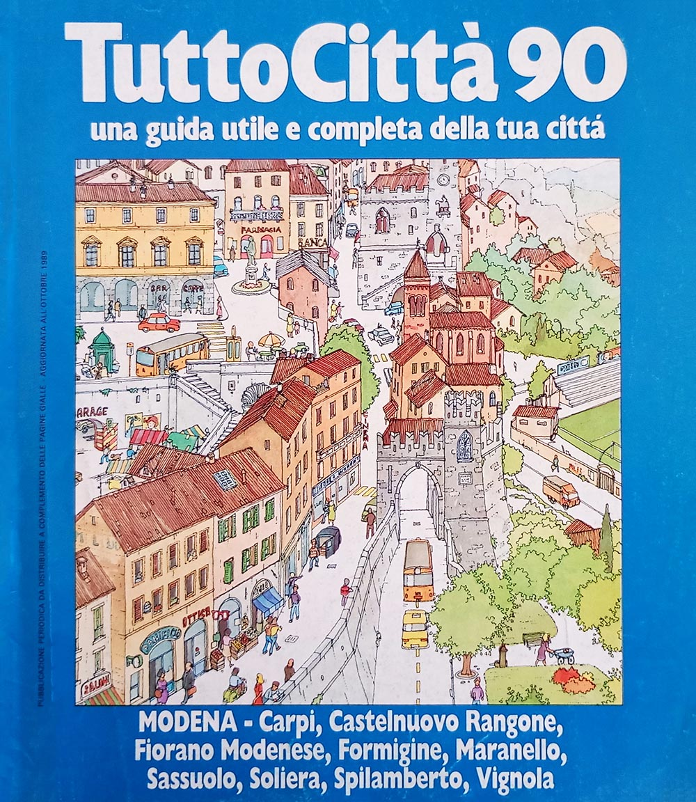</a>
Modena 90
<ul class="scheda"><li><b>Formato:</b> 246 x 280 mm</li><li><b>Copertina:</b> grossa</li><li><b>Layout:</b> TuttoCittà '80 classico</li><li><b>Pagine:</b> 32 (33)</li><li><b>Mese aggiornamento:</b> ottobre 1989</li></ul></td><td class="fasc"><a href="../immagini/PR90.jpg">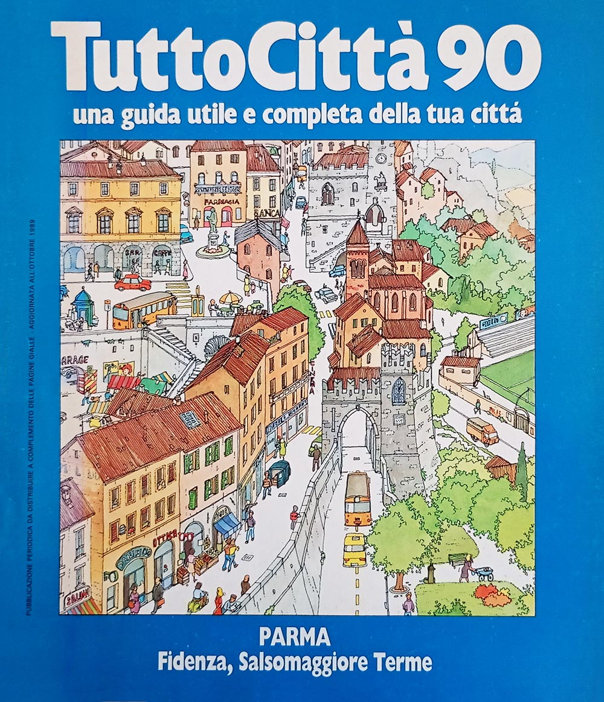</a>
Parma 90
<ul class="scheda"><li><b>Formato:</b> 246 x 280 mm</li><li><b>Copertina:</b> grossa</li><li><b>Layout:</b> TuttoCittà '80 classico</li><li><b>Pagine:</b> 24 (25)</li><li><b>Mese aggiornamento:</b> ottobre 1989</li></ul></td><td class="fasc"><a href="../immagini/PC90.jpg">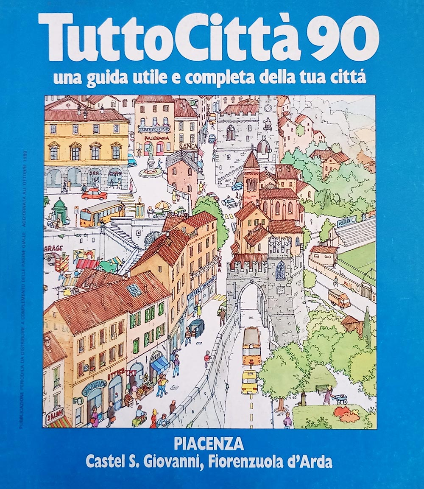</a>
Piacenza 90
<ul class="scheda"><li><b>Formato:</b> 246 x 280 mm</li><li><b>Copertina:</b> grossa</li><li><b>Layout:</b> TuttoCittà '80 classico</li><li><b>Pagine:</b> 16 (17)</li><li><b>Mese aggiornamento:</b> ottobre 1989</li></ul></td><td class="fasc"><a href="../immagini/RE90.jpg">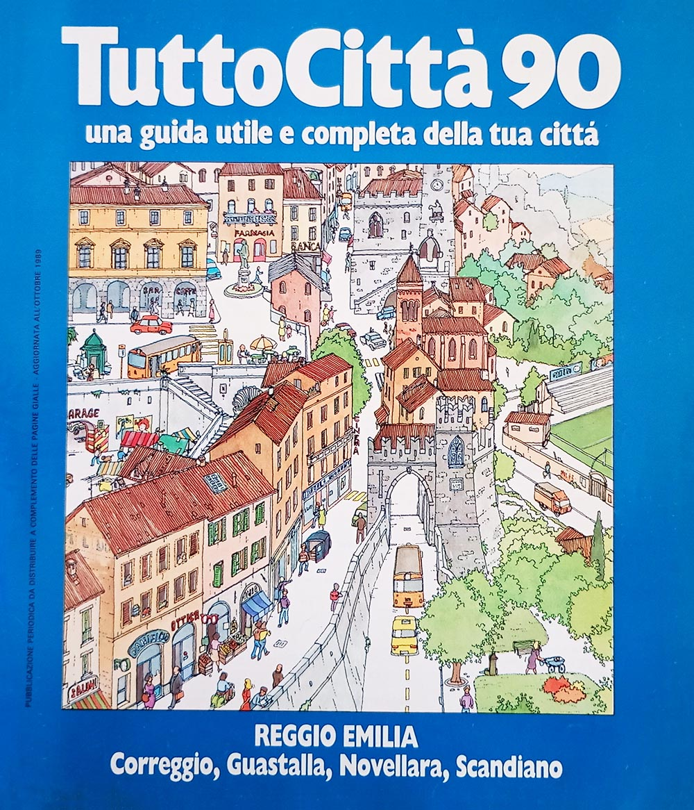</a>
Reggio Emilia 90
<ul class="scheda"><li><b>Formato:</b> 246 x 280 mm</li><li><b>Copertina:</b> grossa</li><li><b>Layout:</b> TuttoCittà '80 classico</li><li><b>Pagine:</b> 24</li><li><b>Mese aggiornamento:</b> ottobre 1989</li></ul></td></tr>
<tr><td class="ann"> 90/91</td><td class="tav"></td><td class="fasc"><a href="../immagini/BO91.jpg">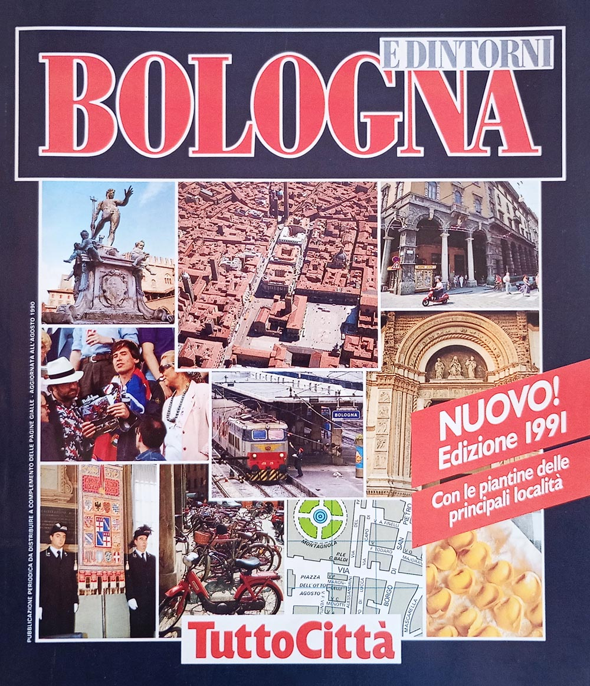</a>
Bologna e dintorni 91
<ul class="scheda"><li><b>Formato:</b> 246 x 280 mm</li><li><b>Copertina:</b> grossa</li><li><b>Layout:</b> TuttoCittà '90 classico iniziale</li><li><b>Pagine:</b> 64</li><li><b>Mese aggiornamento:</b> agosto 1990</li><li><b>Note:</b> nota dell'editore</li></ul></td><td class="fasc"><a href="../immagini/PROVBO91.jpg">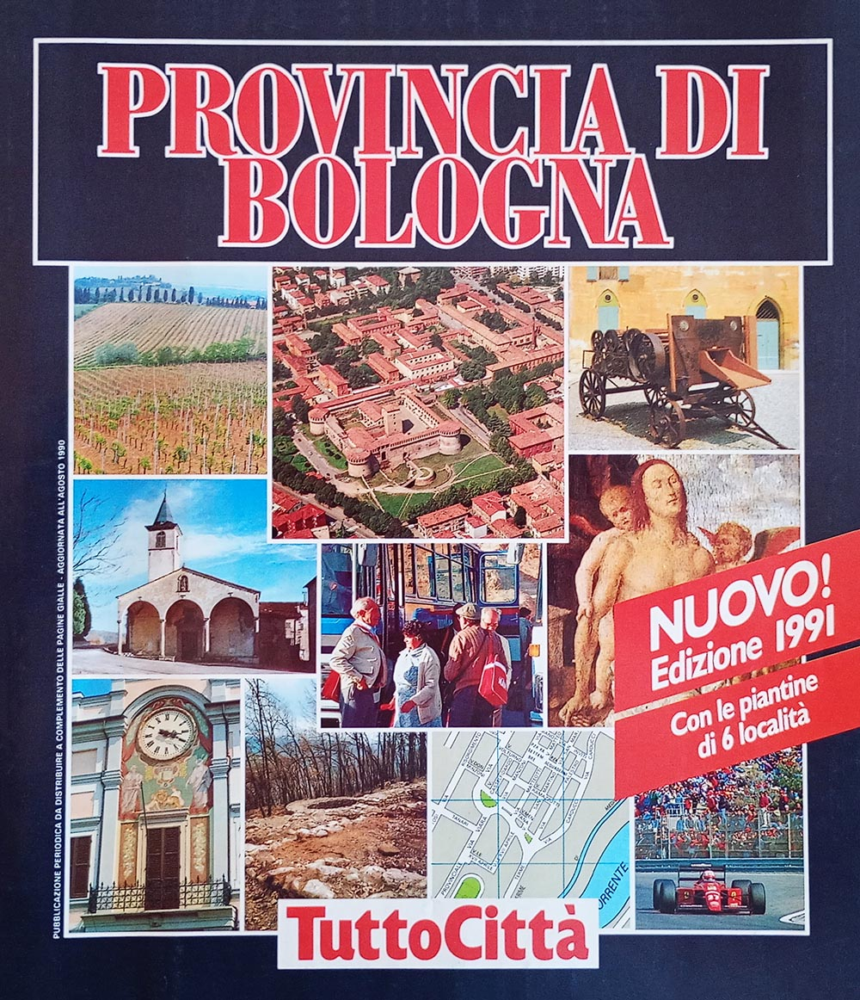</a>
Provincia di Bologna 91
<ul class="scheda"><li><b>Formato:</b> 246 x 280 mm</li><li><b>Copertina:</b> grossa</li><li><b>Layout:</b> TuttoCittà '90 classico iniziale</li><li><b>Pagine:</b> 16</li><li><b>Mese aggiornamento:</b> agosto 1990</li><li><b>Note:</b> nota dell'editore</li></ul></td><td class="fasc"><a href="../immagini/FE9091.jpg">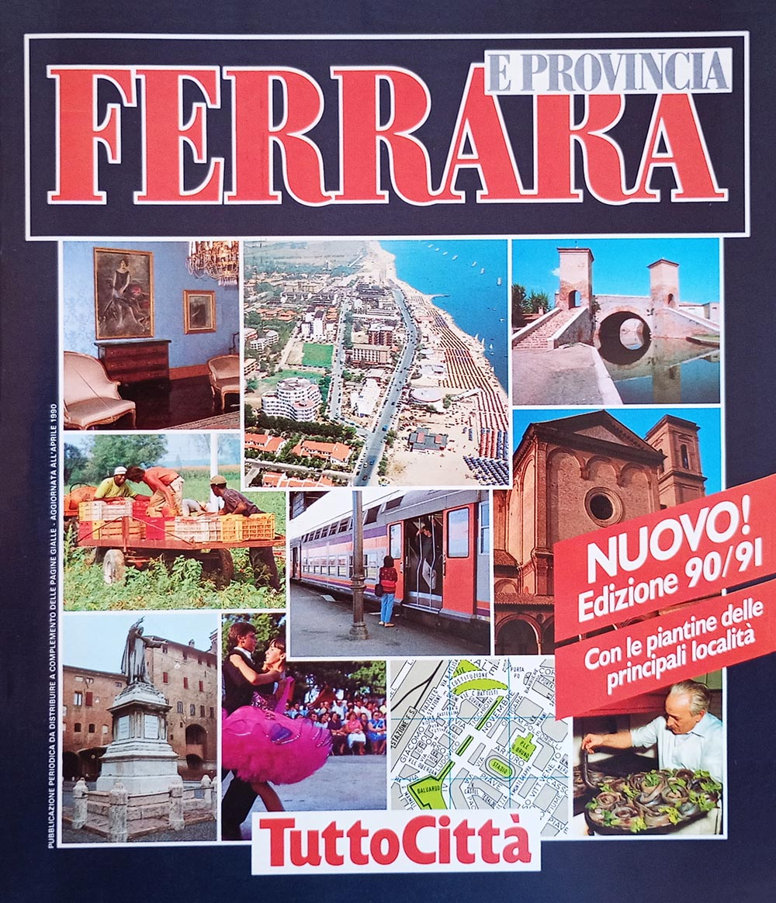</a>
Ferrara 90/91
<ul class="scheda"><li><b>Formato:</b> 246 x 280 mm</li><li><b>Copertina:</b> grossa</li><li><b>Layout:</b> TuttoCittà '90 classico iniziale</li><li><b>Pagine:</b> 32</li><li><b>Mese aggiornamento:</b> aprile 1990</li><li><b>Note:</b> nota dell'editore</li></ul></td><td class="fasc"><a href="../immagini/FO9091.jpg">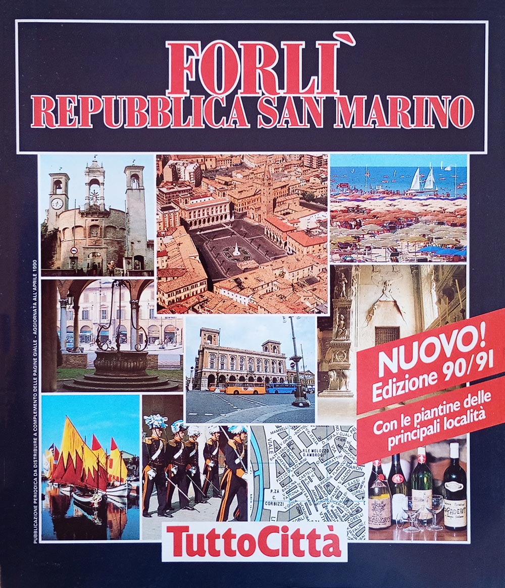</a>
Forlì - San Marino 90/91
<ul class="scheda"><li><b>Formato:</b> 246 x 280 mm</li><li><b>Copertina:</b> grossa</li><li><b>Layout:</b> TuttoCittà '90 classico iniziale</li><li><b>Pagine:</b> 32</li><li><b>Mese aggiornamento:</b> aprile 1990</li><li><b>Note:</b> nota dell'editore</li></ul></td><td class="fasc"><a href="../immagini/RA9091.jpg">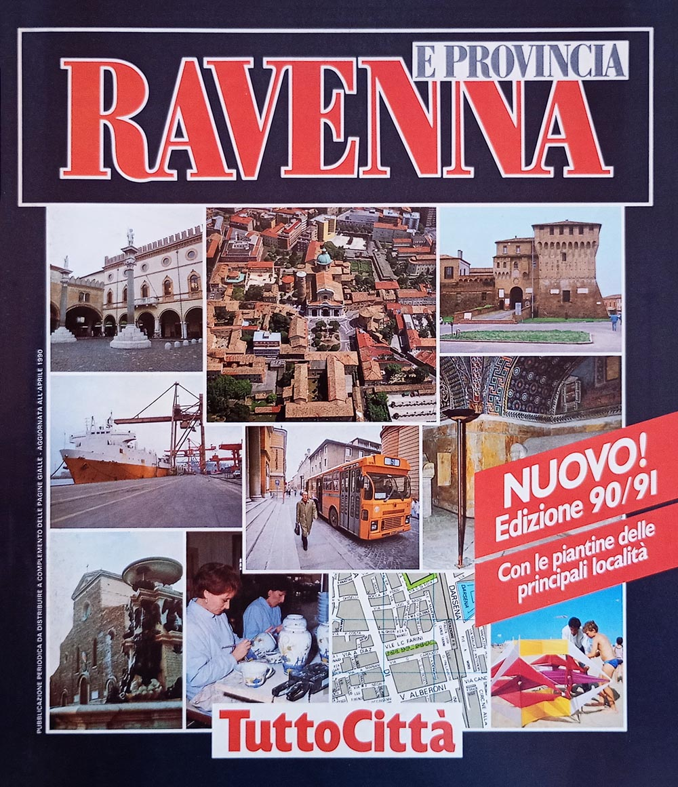</a>
Ravenna 90/91
<ul class="scheda"><li><b>Formato:</b> 246 x 280 mm</li><li><b>Copertina:</b> grossa</li><li><b>Layout:</b> TuttoCittà '90 classico iniziale</li><li><b>Pagine:</b> 24</li><li><b>Mese aggiornamento:</b> aprile 1990</li><li><b>Note:</b> nota dell'editore</li></ul></td><td class="fasc"><a href="../immagini/MO91.jpg">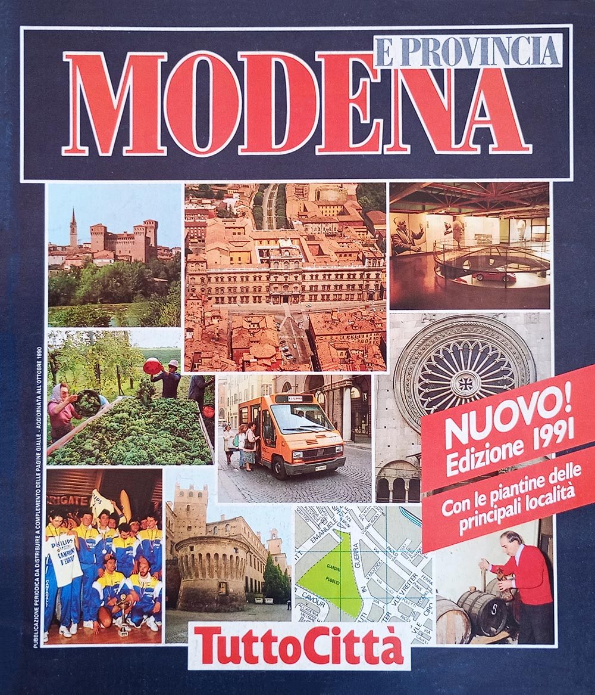</a>
Modena 91
<ul class="scheda"><li><b>Formato:</b> 246 x 280 mm</li><li><b>Copertina:</b> grossa</li><li><b>Layout:</b> TuttoCittà '90 classico iniziale</li><li><b>Pagine:</b> 40</li><li><b>Mese aggiornamento:</b> ottobre 1990</li><li><b>Note:</b> nota dell'editore</li></ul></td><td class="fasc"><a href="../immagini/PR91.jpg">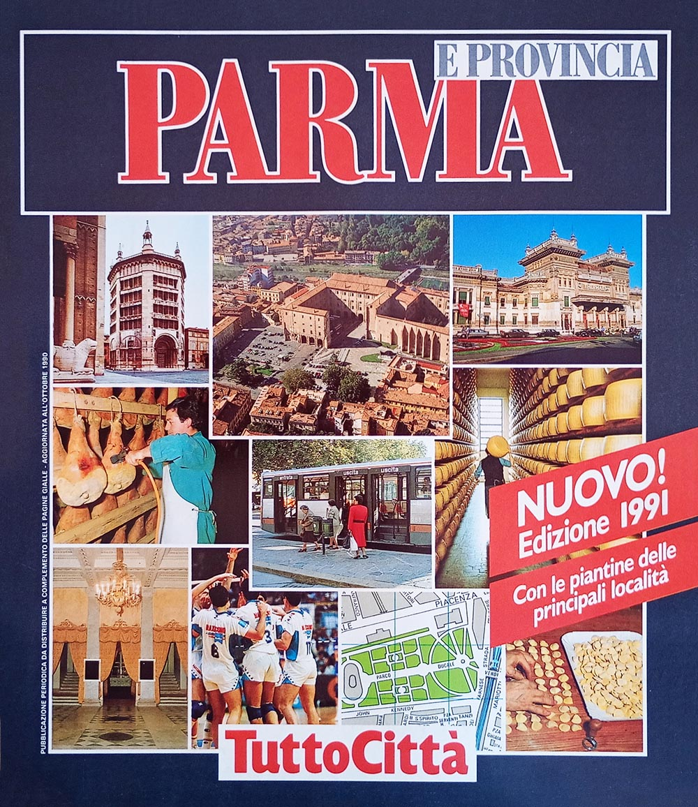</a>
Parma 91
<ul class="scheda"><li><b>Formato:</b> 246 x 280 mm</li><li><b>Copertina:</b> grossa</li><li><b>Layout:</b> TuttoCittà '90 classico iniziale</li><li><b>Pagine:</b> 24</li><li><b>Mese aggiornamento:</b> ottobre 1990</li><li><b>Note:</b> nota dell'editore</li></ul></td><td class="fasc"><a href="../immagini/PC91.jpg">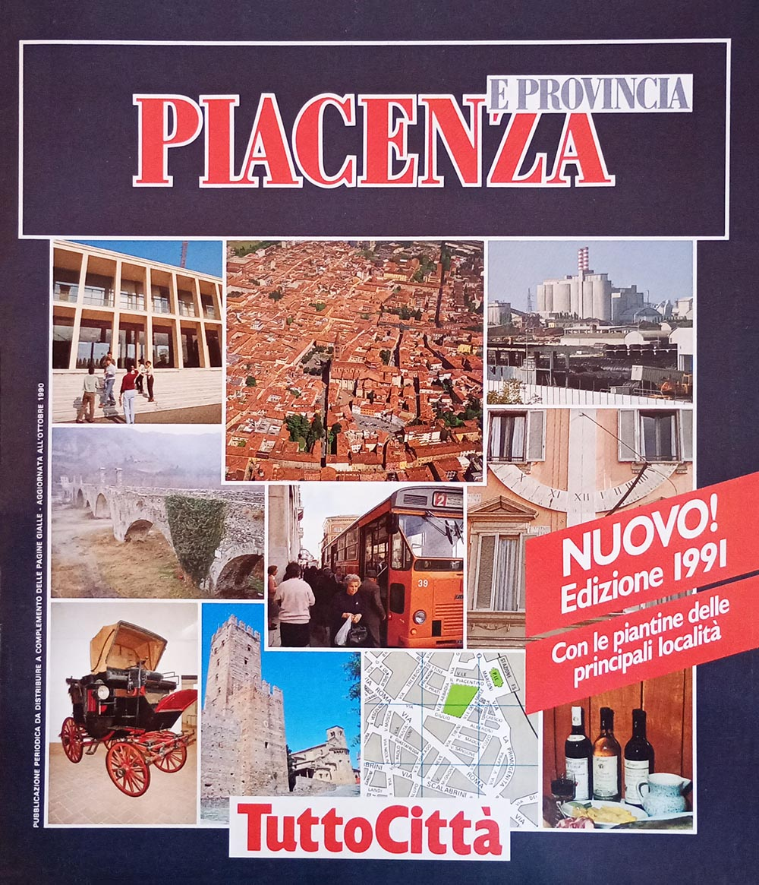</a>
Piacenza 91
<ul class="scheda"><li><b>Formato:</b> 246 x 280 mm</li><li><b>Copertina:</b> grossa</li><li><b>Layout:</b> TuttoCittà '90 classico iniziale</li><li><b>Pagine:</b> 24</li><li><b>Mese aggiornamento:</b> ottobre 1990</li><li><b>Note:</b> nota dell'editore</li></ul></td><td class="fasc"><a href="../immagini/RE91.jpg">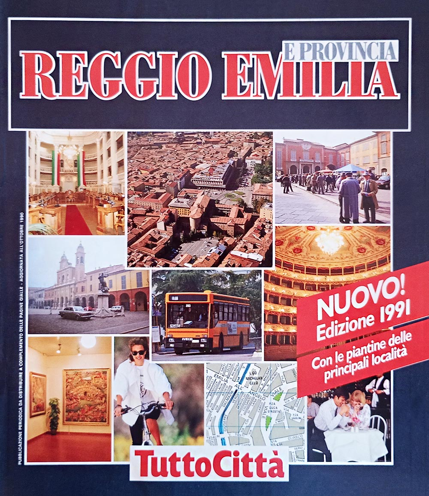</a>
Reggio Emilia 91
<ul class="scheda"><li><b>Formato:</b> 246 x 280 mm</li><li><b>Copertina:</b> grossa</li><li><b>Layout:</b> TuttoCittà '90 classico iniziale</li><li><b>Pagine:</b> 24</li><li><b>Mese aggiornamento:</b> ottobre 1990</li><li><b>Note:</b> nota dell'editore</li></ul></td></tr>
<tr><td class="ann"> 91/92</td><td class="tav"></td><td class="fasc"><a href="../immagini/BO92.jpg">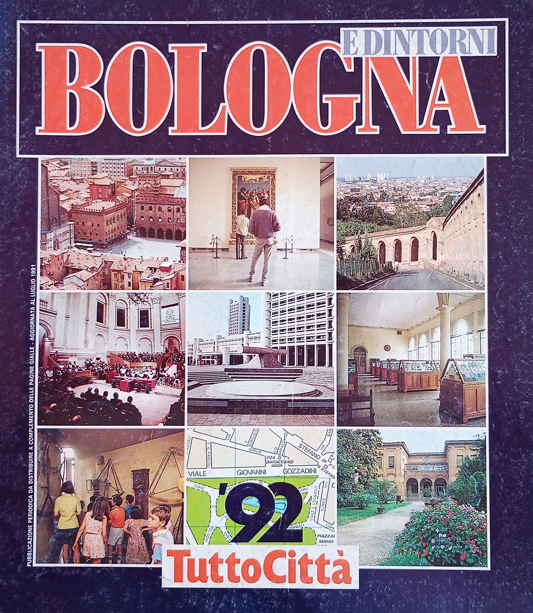</a>
Bologna e dintorni 92
<ul class="scheda"><li><b>Formato:</b> 246 x 280 mm</li><li><b>Copertina:</b> grossa</li><li><b>Layout:</b> TuttoCittà '90 classico iniziale</li><li><b>Pagine:</b> 72</li><li><b>Mese aggiornamento:</b> luglio 1991</li></ul></td><td class="fasc"><a href="../immagini/PROVBO92.jpg">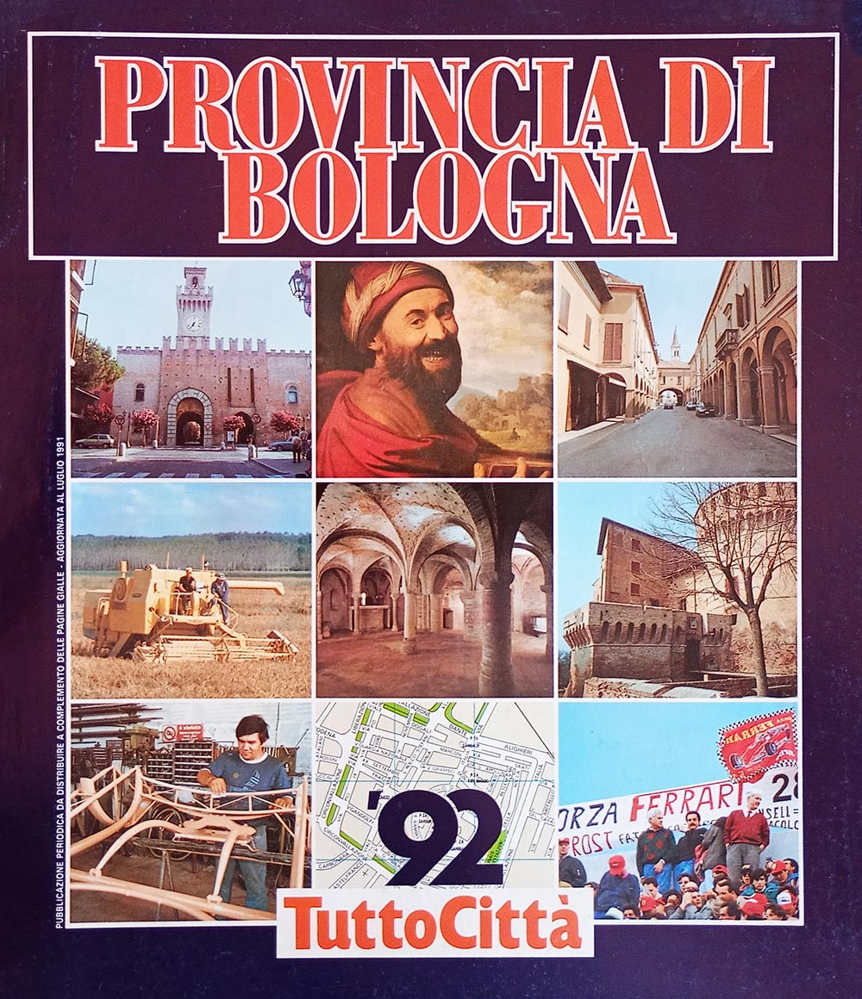</a>
Provincia di Bologna 92
<ul class="scheda"><li><b>Formato:</b> 246 x 280 mm</li><li><b>Copertina:</b> grossa</li><li><b>Layout:</b> TuttoCittà '90 classico iniziale</li><li><b>Pagine:</b> 24</li><li><b>Mese aggiornamento:</b> luglio 1991</li></ul></td><td class="fasc"><a href="../immagini/FE91.jpg">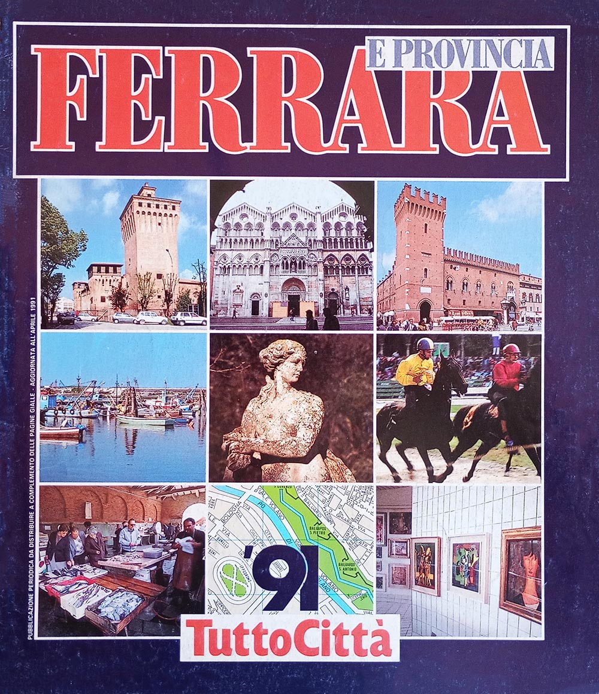</a>
Ferrara 91
<ul class="scheda"><li><b>Formato:</b> 246 x 280 mm</li><li><b>Copertina:</b> grossa</li><li><b>Layout:</b> TuttoCittà '90 classico iniziale</li><li><b>Pagine:</b> 32</li><li><b>Mese aggiornamento:</b> aprile 1991</li></ul></td><td class="fasc"><a href="../immagini/FO91.jpg">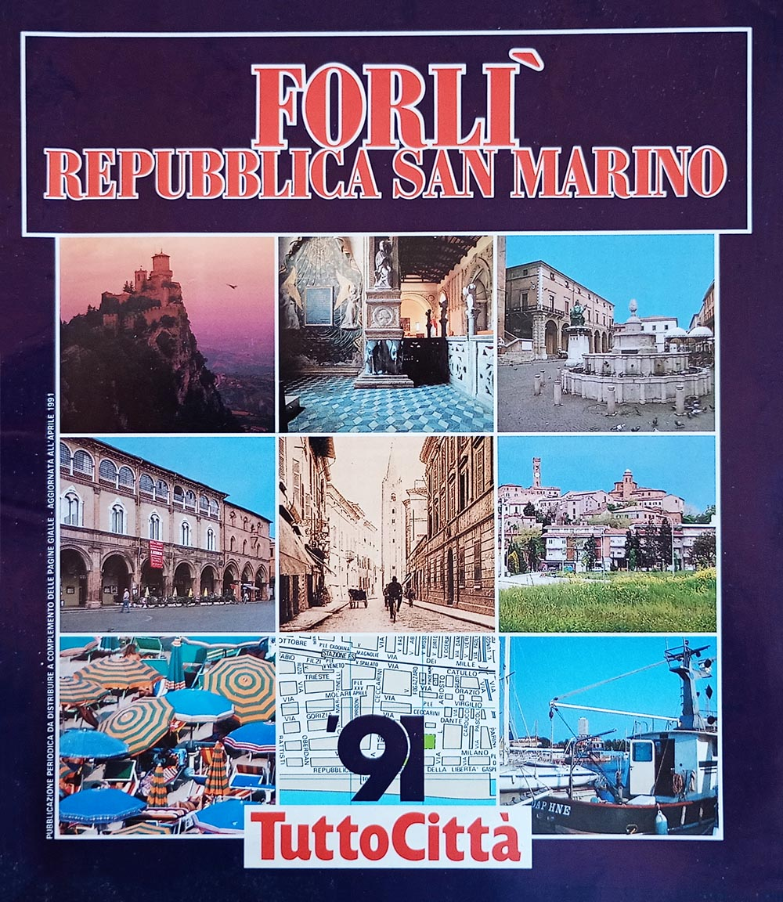</a>
Forlì - San Marino 91
<ul class="scheda"><li><b>Formato:</b> 246 x 280 mm</li><li><b>Copertina:</b> grossa</li><li><b>Layout:</b> TuttoCittà '90 classico iniziale</li><li><b>Pagine:</b> 40</li><li><b>Mese aggiornamento:</b> aprile 1991</li></ul></td><td class="fasc"><a href="../immagini/RA91.jpg">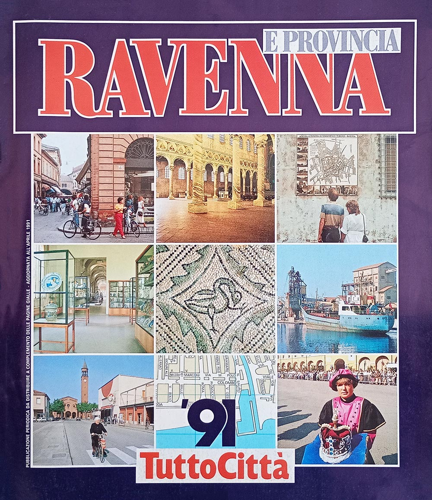</a>
Ravenna 91
<ul class="scheda"><li><b>Formato:</b> 246 x 280 mm</li><li><b>Copertina:</b> grossa</li><li><b>Layout:</b> TuttoCittà '90 classico iniziale</li><li><b>Pagine:</b> 32</li><li><b>Mese aggiornamento:</b> aprile 1991</li></ul></td><td class="fasc"><a href="../immagini/MO92.jpg">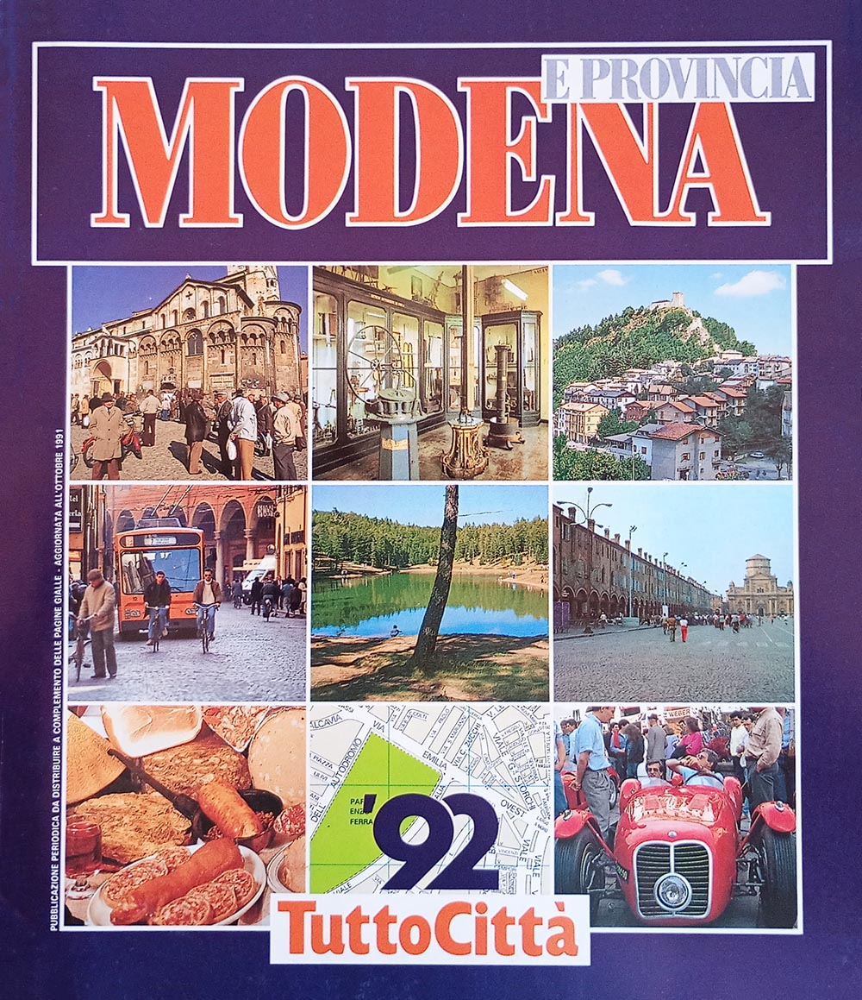</a>
Modena 92
<ul class="scheda"><li><b>Formato:</b> 246 x 280 mm</li><li><b>Copertina:</b> grossa</li><li><b>Layout:</b> TuttoCittà '90 classico iniziale</li><li><b>Pagine:</b> 48</li><li><b>Mese aggiornamento:</b> ottobre 1991</li></ul></td><td class="fasc"><a href="../immagini/PR92.jpg">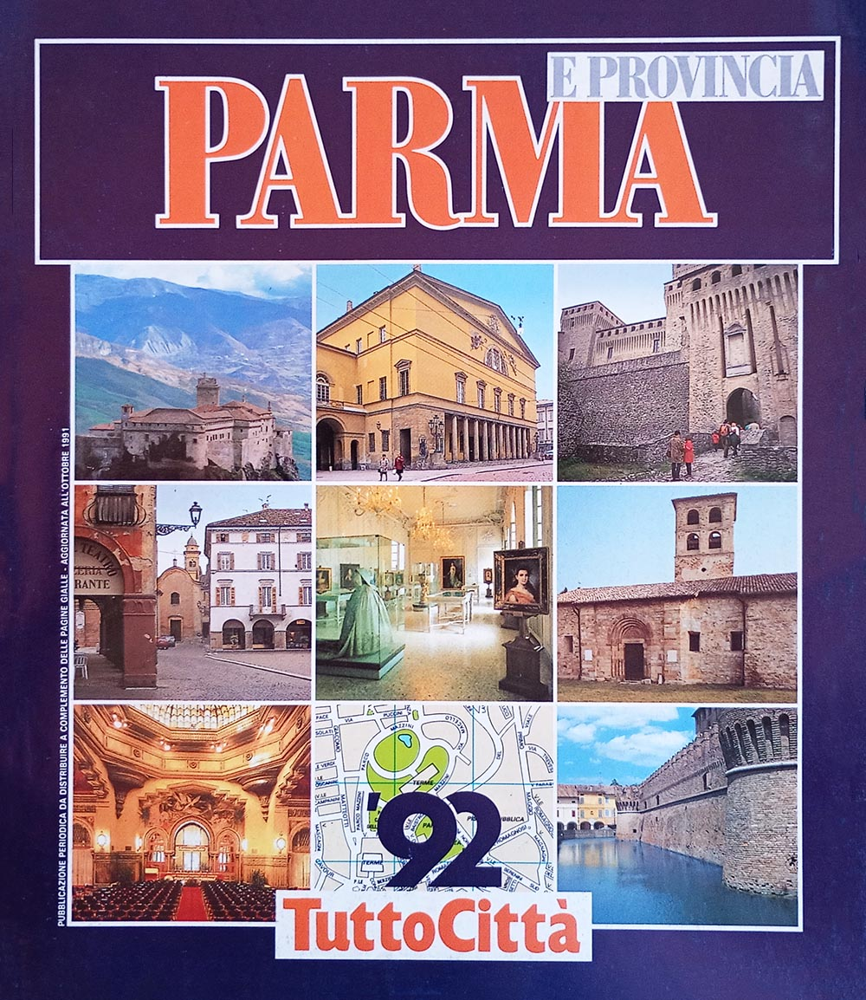</a>
Parma 92
<ul class="scheda"><li><b>Formato:</b> 246 x 280 mm</li><li><b>Copertina:</b> grossa</li><li><b>Layout:</b> TuttoCittà '90 classico iniziale</li><li><b>Pagine:</b> 32</li><li><b>Mese aggiornamento:</b> ottobre 1991</li></ul></td><td class="fasc sospesa">
Piacenza 92
<ul class="scheda"><li><b>Formato:</b> 246 x 280 mm</li><li><b>Copertina:</b> grossa</li><li><b>Layout:</b> TuttoCittà '90 classico iniziale</li><li>non in raccolta</li></ul></td><td class="fasc"><a href="../immagini/RE92.jpg">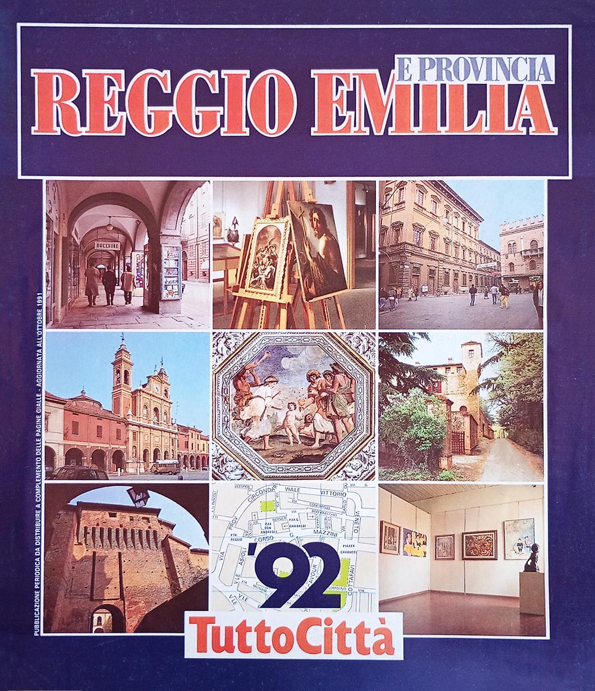</a>
Reggio Emilia 92
<ul class="scheda"><li><b>Formato:</b> 246 x 280 mm</li><li><b>Copertina:</b> grossa</li><li><b>Layout:</b> TuttoCittà '90 classico iniziale</li><li><b>Pagine:</b> 32</li><li><b>Mese aggiornamento:</b> ottobre 1991</li></ul></td></tr>
<tr><td class="ann"> 92/93</td><td class="tav"></td><td class="fasc"><a href="../immagini/BO93.jpg">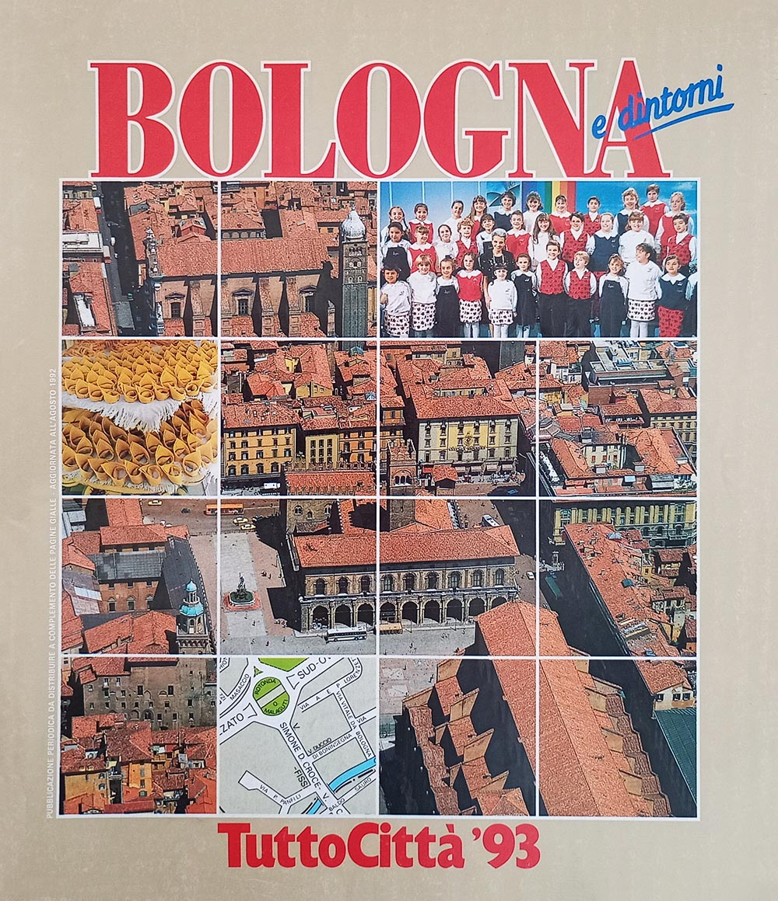</a>
Bologna e dintorni 93
<ul class="scheda"><li><b>Formato:</b> 246 x 280 mm</li><li><b>Copertina:</b> grossa</li><li><b>Layout:</b> TuttoCittà '90 classico</li><li><b>Pagine:</b> 72</li><li><b>Mese aggiornamento:</b> agosto 1992</li></ul></td><td class="fasc"><a href="../immagini/PROVBO93.jpg">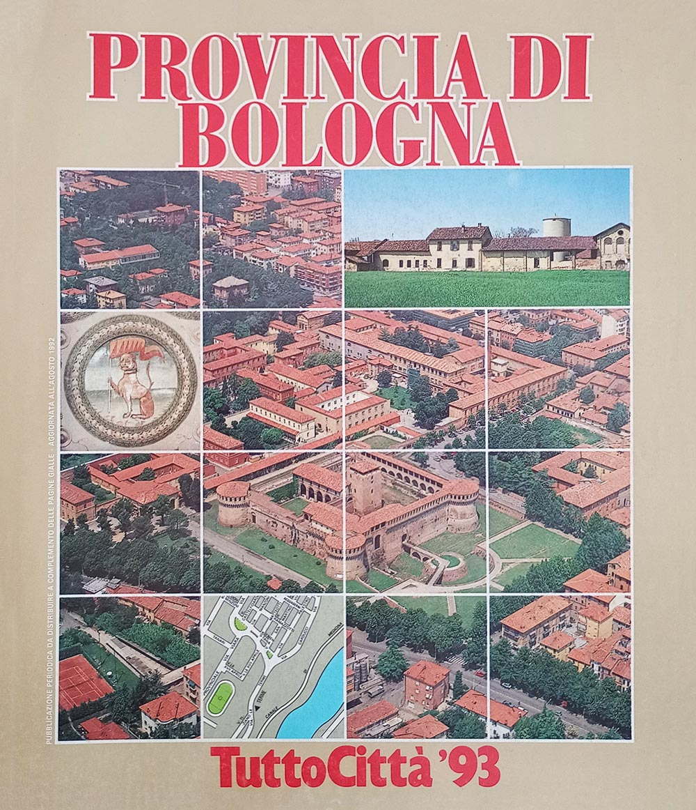</a>
Provincia di Bologna 93
<ul class="scheda"><li><b>Formato:</b> 246 x 280 mm</li><li><b>Copertina:</b> grossa</li><li><b>Layout:</b> TuttoCittà '90 classico</li><li><b>Pagine:</b> 24</li><li><b>Mese aggiornamento:</b> agosto 1992</li></ul></td><td class="fasc"><a href="../immagini/FE92.jpg">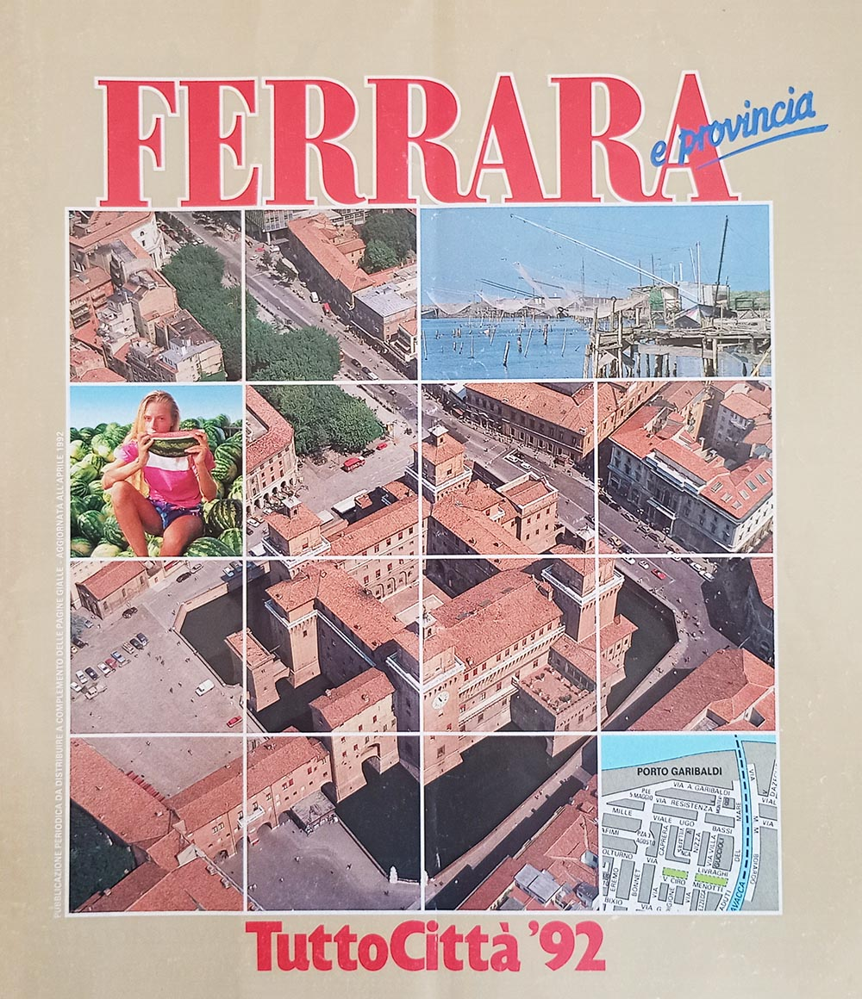</a>
Ferrara 92
<ul class="scheda"><li><b>Formato:</b> 246 x 280 mm</li><li><b>Copertina:</b> grossa</li><li><b>Layout:</b> TuttoCittà '90 classico</li><li><b>Pagine:</b> 32</li><li><b>Mese aggiornamento:</b> aprile 1992</li></ul></td><td class="fasc"><a href="../immagini/FO92.jpg">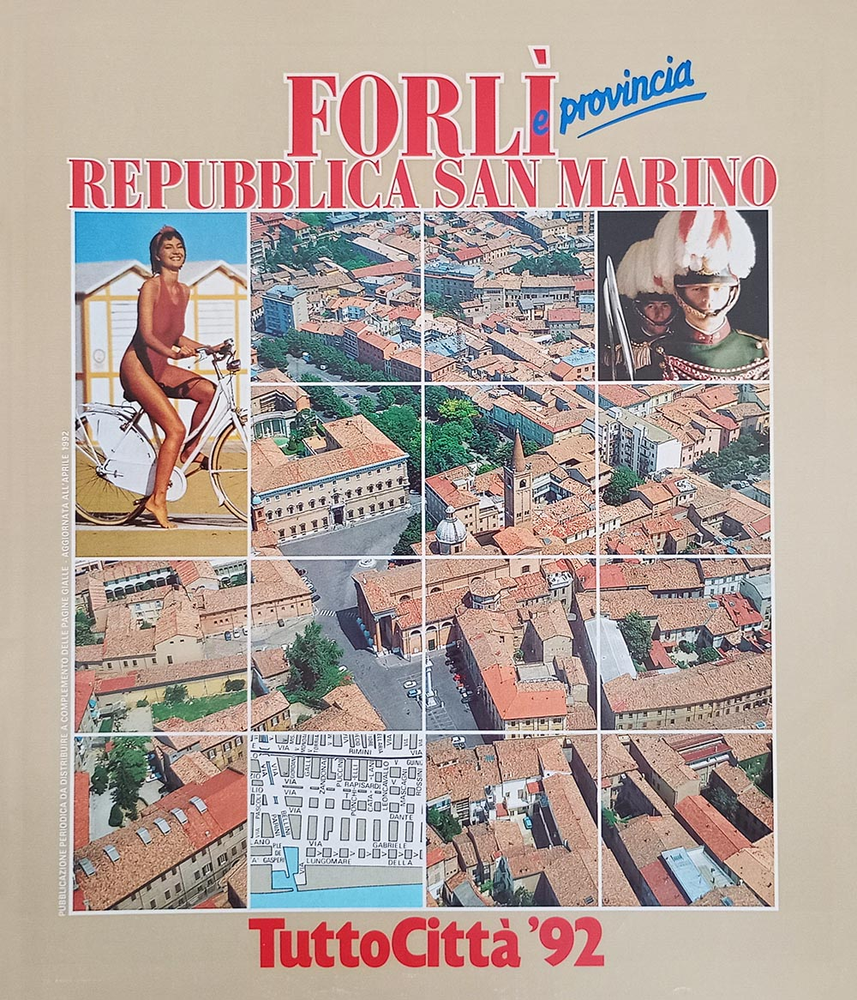</a>
Forlì - San Marino 92
<ul class="scheda"><li><b>Formato:</b> 246 x 280 mm</li><li><b>Copertina:</b> grossa</li><li><b>Layout:</b> TuttoCittà '90 classico</li><li><b>Pagine:</b> 40</li><li><b>Mese aggiornamento:</b> aprile 1992</li></ul></td><td class="fasc"><a href="../immagini/RA92.jpg">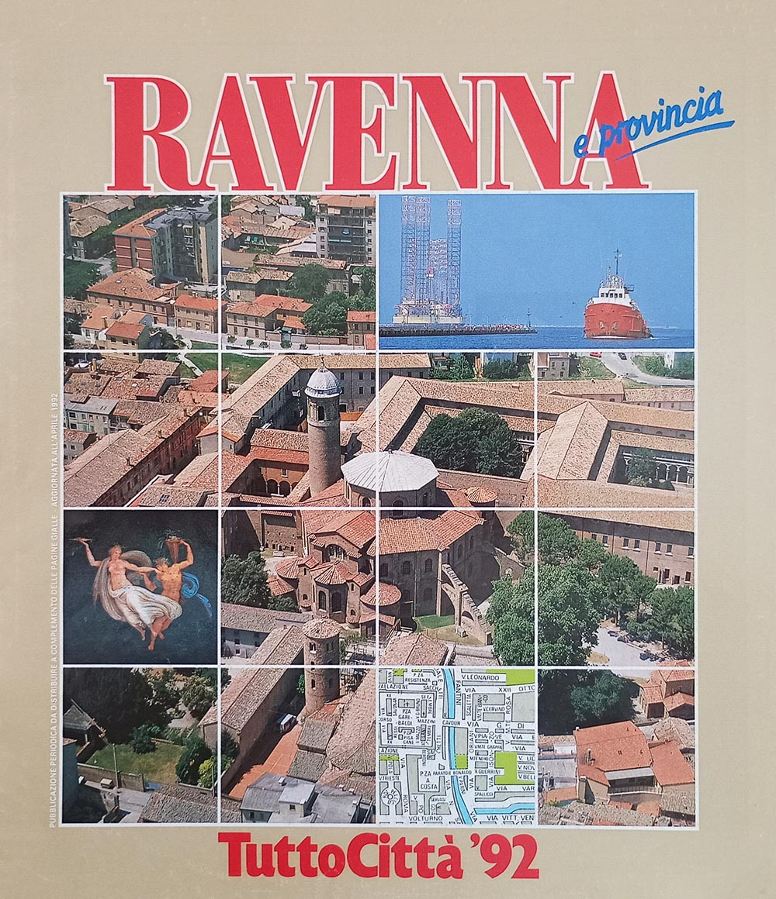</a>
Ravenna 92
<ul class="scheda"><li><b>Formato:</b> 246 x 280 mm</li><li><b>Copertina:</b> grossa</li><li><b>Layout:</b> TuttoCittà '90 classico</li><li><b>Pagine:</b> 40</li><li><b>Mese aggiornamento:</b> aprile 1992</li></ul></td><td class="fasc"><a href="../immagini/MO93.jpg">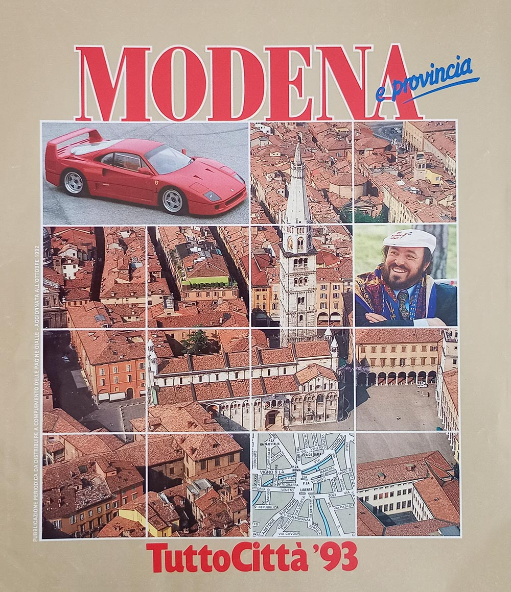</a>
Modena 93
<ul class="scheda"><li><b>Formato:</b> 246 x 280 mm</li><li><b>Copertina:</b> grossa</li><li><b>Layout:</b> TuttoCittà '90 classico</li><li><b>Pagine:</b> 48</li><li><b>Mese aggiornamento:</b> ottobre 1992</li></ul></td><td class="fasc"><a href="../immagini/PR93.jpg">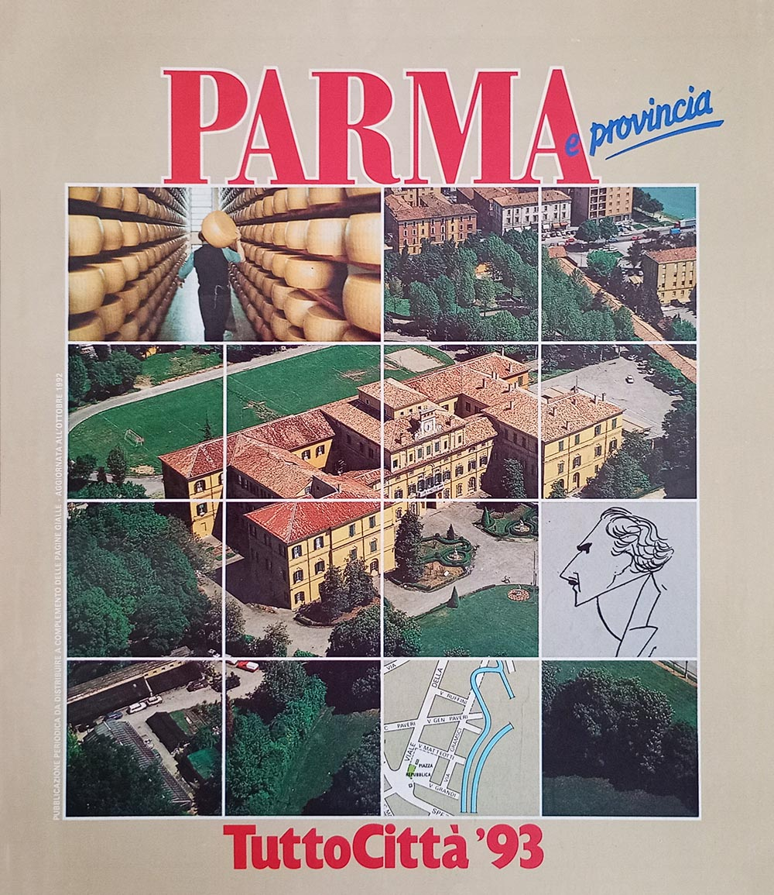</a>
Parma 93
<ul class="scheda"><li><b>Formato:</b> 246 x 280 mm</li><li><b>Copertina:</b> grossa</li><li><b>Layout:</b> TuttoCittà '90 classico</li><li><b>Pagine:</b> 32</li><li><b>Mese aggiornamento:</b> ottobre 1992</li></ul></td><td class="fasc"><a href="../immagini/PC93.jpg">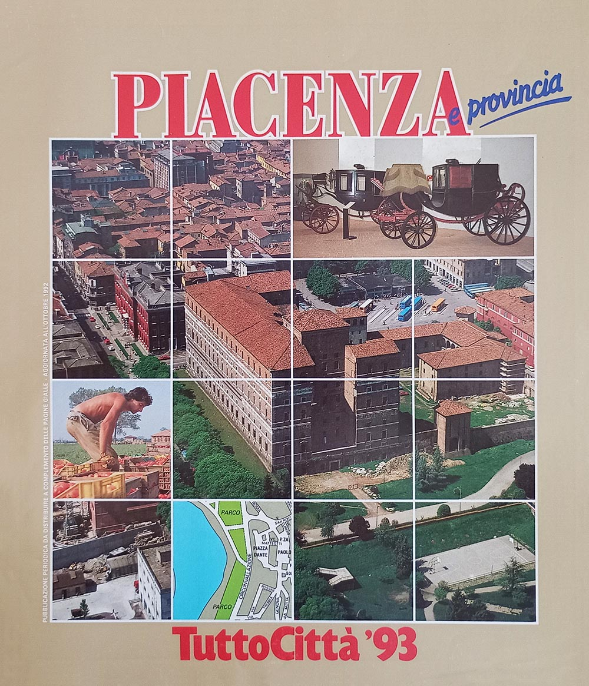</a>
Piacenza 93
<ul class="scheda"><li><b>Formato:</b> 246 x 280 mm</li><li><b>Copertina:</b> grossa</li><li><b>Layout:</b> TuttoCittà '90 classico</li><li><b>Pagine:</b> 32</li><li><b>Mese aggiornamento:</b> ottobre 1992</li></ul></td><td class="fasc"><a href="../immagini/RE93.jpg">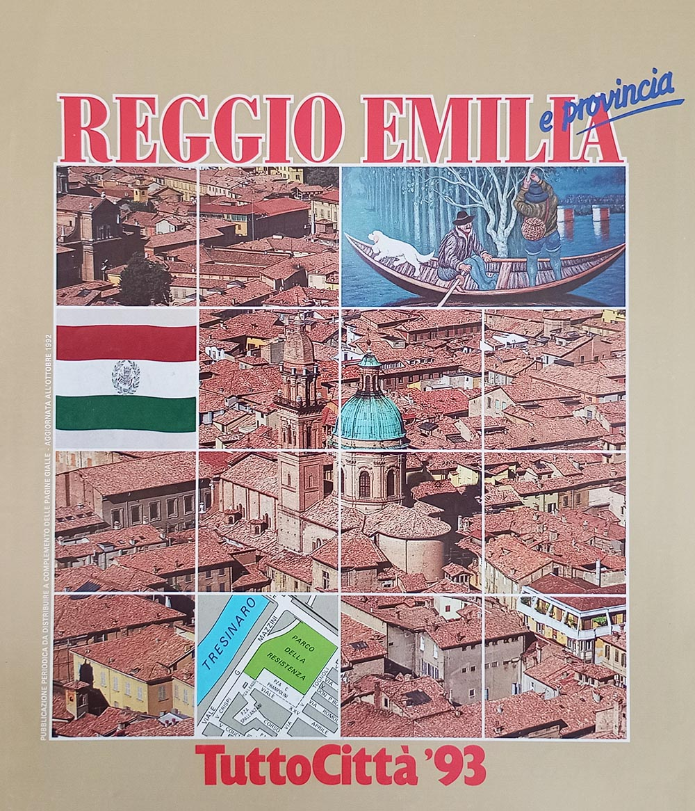</a>
Reggio Emilia 93
<ul class="scheda"><li><b>Formato:</b> 246 x 280 mm</li><li><b>Copertina:</b> grossa</li><li><b>Layout:</b> TuttoCittà '90 classico</li><li><b>Pagine:</b> 32</li><li><b>Mese aggiornamento:</b> ottobre 1992</li></ul></td></tr>
<tr><td class="ann">  93/94</td><td class="tav"></td><td class="fasc"><a href="../immagini/BO94.jpg">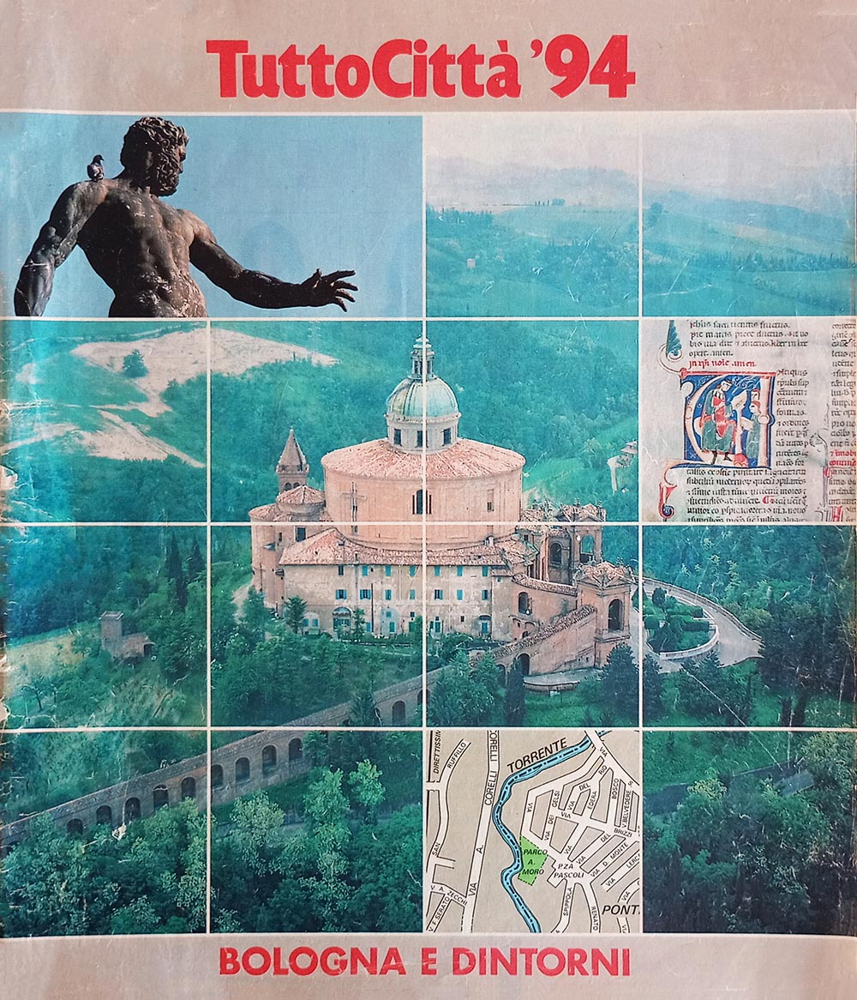</a>
Bologna e dintorni 94
<ul class="scheda"><li><b>Formato:</b> 246 x 280 mm</li><li><b>Copertina:</b> sottile</li><li><b>Layout:</b> TuttoCittà '90 classico</li><li><b>Pagine:</b> 78</li><li><b>Mese aggiornamento:</b> agosto 1993</li></ul></td><td class="fasc"><a href="../immagini/PROVBO94.jpg">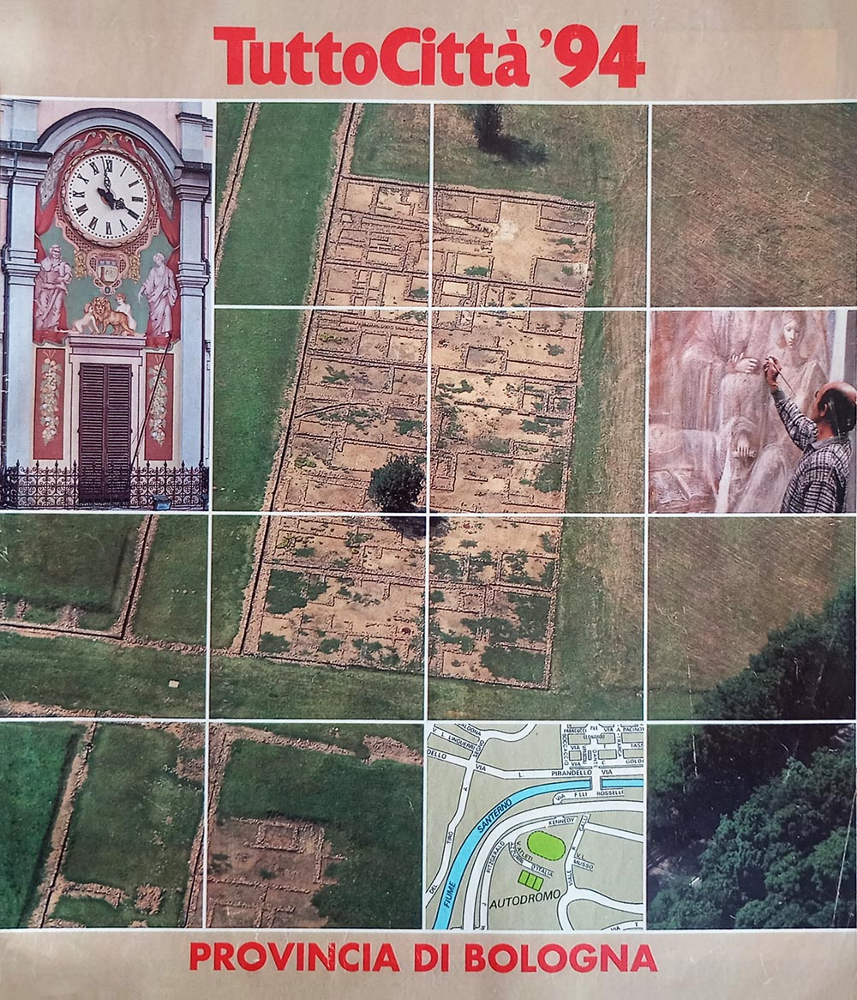</a>
Provincia di Bologna 94
<ul class="scheda"><li><b>Formato:</b> 246 x 280 mm</li><li><b>Copertina:</b> sottile</li><li><b>Layout:</b> TuttoCittà '90 classico</li><li><b>Pagine:</b> 30</li><li><b>Mese aggiornamento:</b> agosto 1993</li></ul></td><td class="fasc"><a href="../immagini/FE93.jpg">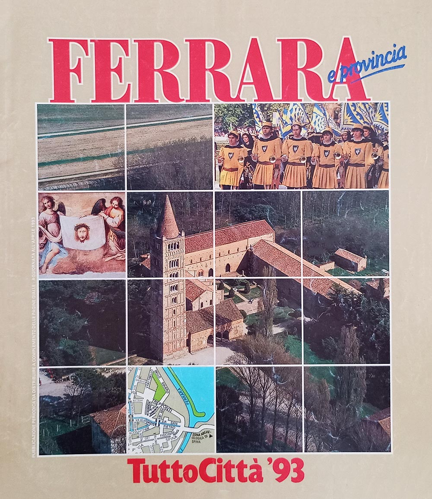</a>
Ferrara 93
<ul class="scheda"><li><b>Formato:</b> 246 x 280 mm</li><li><b>Copertina:</b> grossa</li><li><b>Layout:</b> TuttoCittà '90 classico</li><li><b>Pagine:</b> 32</li><li><b>Mese aggiornamento:</b> aprile 1993</li></ul></td><td class="fasc"><a href="../immagini/FO93.jpg">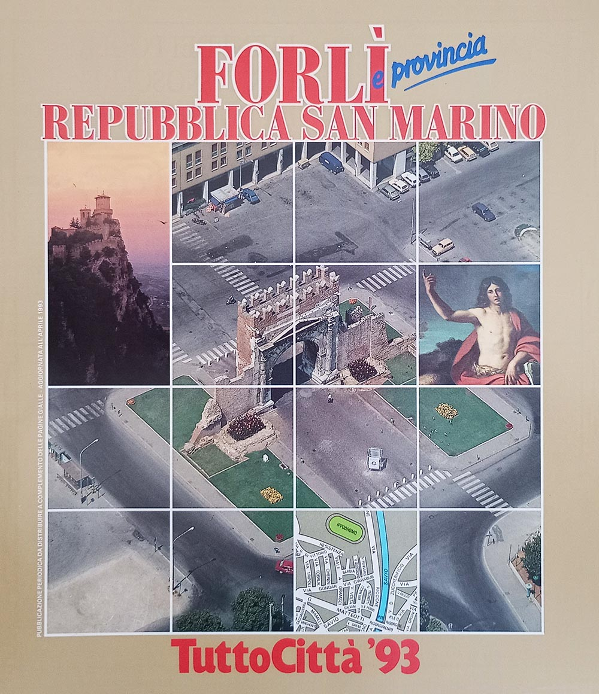</a>
Forlì - San Marino 93
<ul class="scheda"><li><b>Formato:</b> 246 x 280 mm</li><li><b>Copertina:</b> grossa</li><li><b>Layout:</b> TuttoCittà '90 classico</li><li><b>Pagine:</b> 40</li><li><b>Mese aggiornamento:</b> aprile 1993</li></ul></td><td class="fasc"><a href="../immagini/RA93.jpg">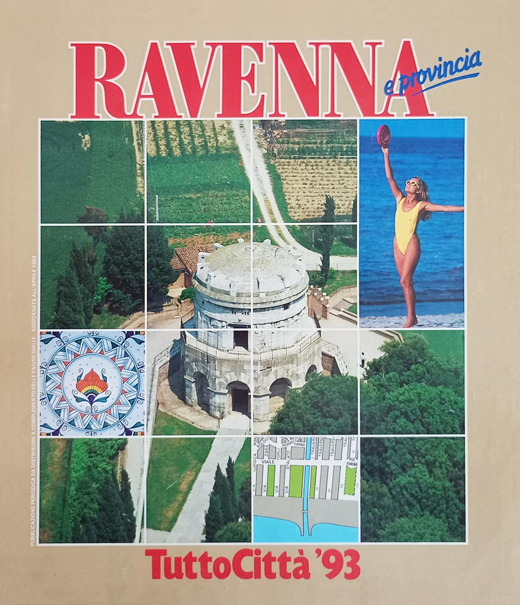</a>
Ravenna 93
<ul class="scheda"><li><b>Formato:</b> 246 x 280 mm</li><li><b>Copertina:</b> grossa</li><li><b>Layout:</b> TuttoCittà '90 classico</li><li><b>Pagine:</b> 32</li><li><b>Mese aggiornamento:</b> aprile 1993</li></ul></td><td class="fasc"><a href="../immagini/MO94.jpg">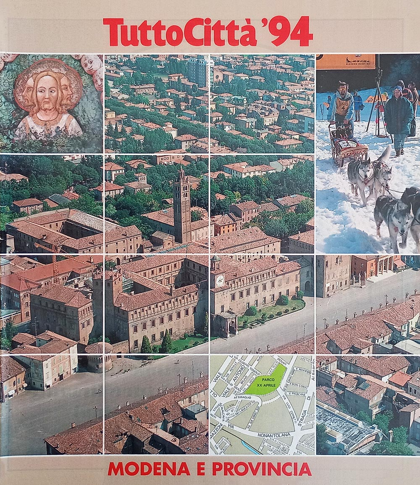</a>
Modena 94
<ul class="scheda"><li><b>Formato:</b> 246 x 280 mm</li><li><b>Copertina:</b> sottile</li><li><b>Layout:</b> TuttoCittà '90 classico</li><li><b>Pagine:</b> 46</li><li><b>Mese aggiornamento:</b> ottobre 1993</li></ul></td><td class="fasc"><a href="../immagini/PR94.jpg">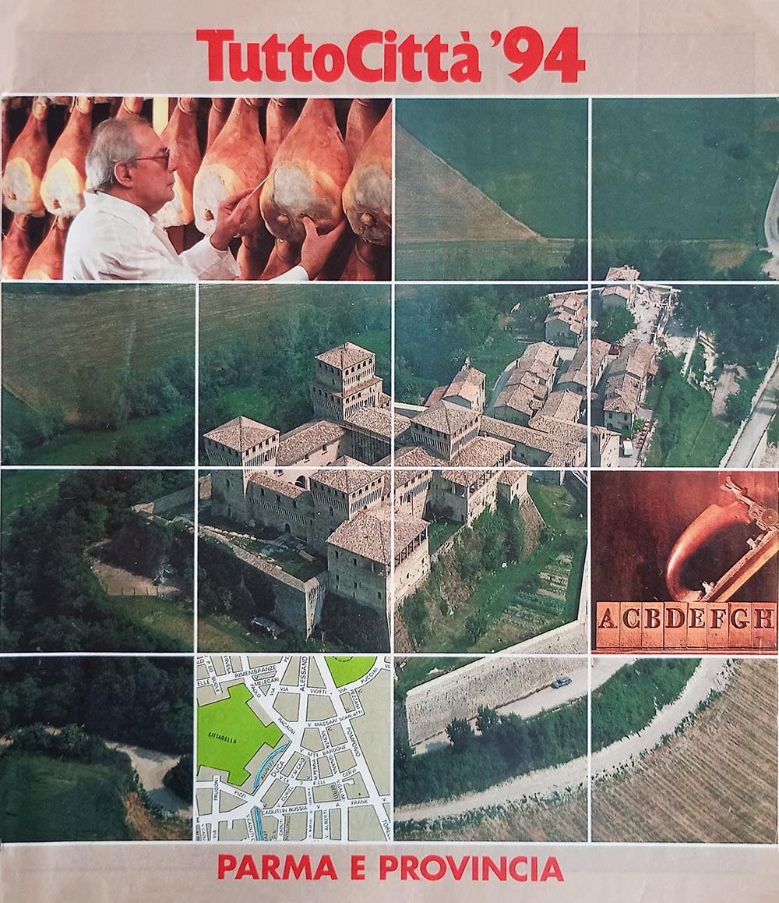</a>
Parma 94
<ul class="scheda"><li><b>Formato:</b> 246 x 280 mm</li><li><b>Copertina:</b> sottile</li><li><b>Layout:</b> TuttoCittà '90 classico</li><li><b>Pagine:</b> 30</li><li><b>Mese aggiornamento:</b> ottobre 1993</li></ul></td><td class="fasc sospesa">
Piacenza 94
<ul class="scheda"><li><b>Formato:</b> 246 x 280 mm</li><li><b>Copertina:</b> sottile</li><li><b>Layout:</b> TuttoCittà '90 classico</li><li>non in raccolta</li></ul></td><td class="fasc"><a href="../immagini/RE94.jpg">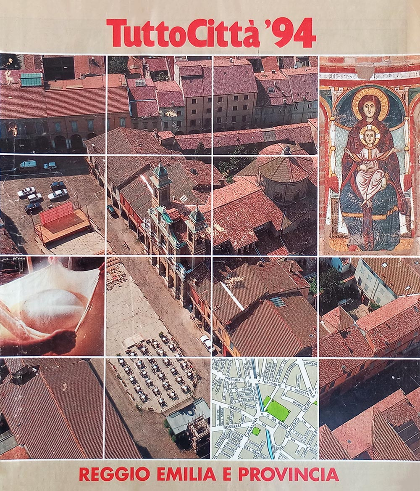</a>
Reggio Emilia 94
<ul class="scheda"><li><b>Formato:</b> 246 x 280 mm</li><li><b>Copertina:</b> sottile</li><li><b>Layout:</b> TuttoCittà '90 classico</li><li><b>Pagine:</b> 30</li><li><b>Mese aggiornamento:</b> ottobre 1993</li></ul></td></tr>
<tr><td class="ann"> 94/95</td><td class="tav"></td><td class="fasc"><a href="../immagini/BO95.jpg">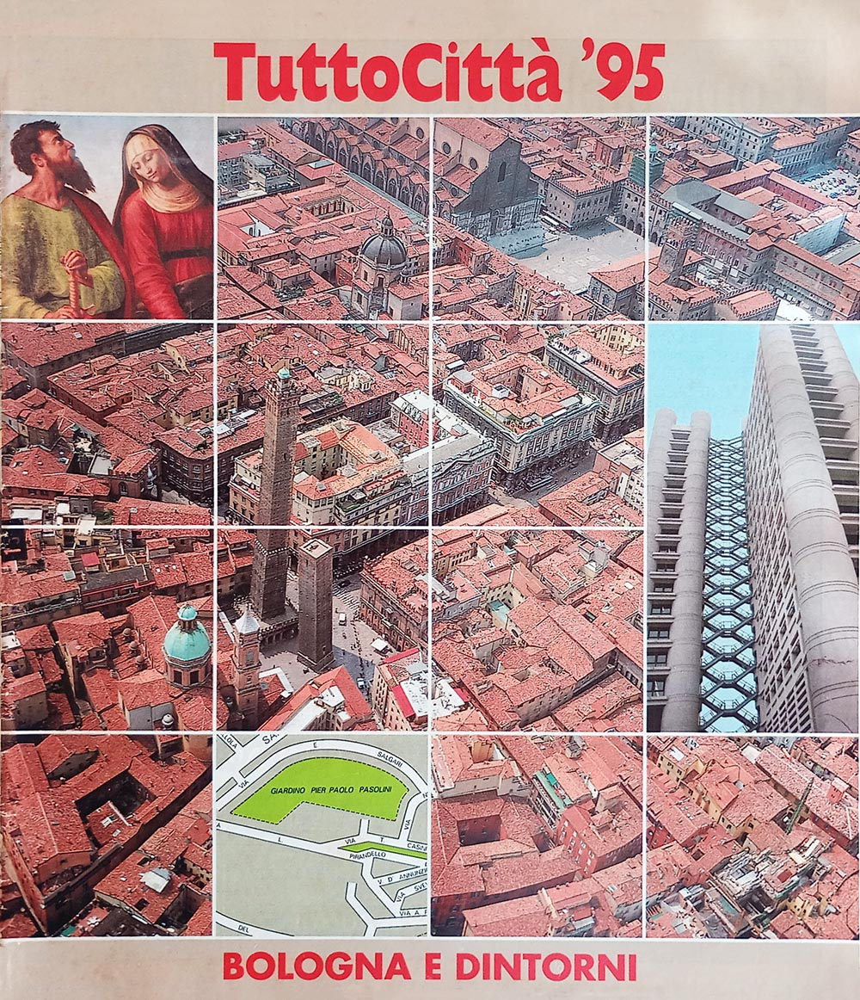</a>
Bologna e dintorni 95
<ul class="scheda"><li><b>Formato:</b> 246 x 280 mm</li><li><b>Copertina:</b> sottile</li><li><b>Layout:</b> TuttoCittà '90 classico</li><li><b>Pagine:</b> 78</li><li><b>Mese aggiornamento:</b> agosto 1994</li></ul></td><td class="fasc"><a href="../immagini/PROVBO95.jpg">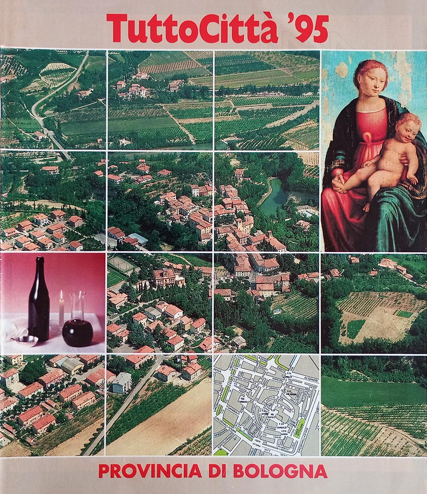</a>
Provincia di Bologna 95
<ul class="scheda"><li><b>Formato:</b> 246 x 280 mm</li><li><b>Copertina:</b> sottile</li><li><b>Layout:</b> TuttoCittà '90 classico</li><li><b>Pagine:</b> 30</li><li><b>Mese aggiornamento:</b> agosto 1994</li></ul></td><td class="fasc"><a href="../immagini/FE94.jpg">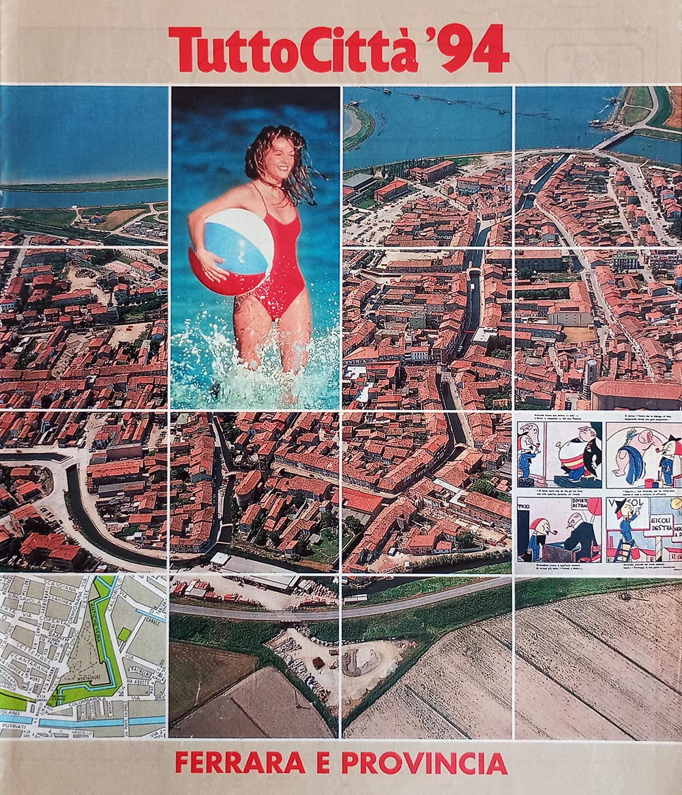</a>
Ferrara 94
<ul class="scheda"><li><b>Formato:</b> 246 x 280 mm</li><li><b>Copertina:</b> sottile</li><li><b>Layout:</b> TuttoCittà '90 classico</li><li><b>Pagine:</b> 30</li><li><b>Mese aggiornamento:</b> aprile 1994</li></ul></td><td class="fasc"><a href="../immagini/FO94.jpg">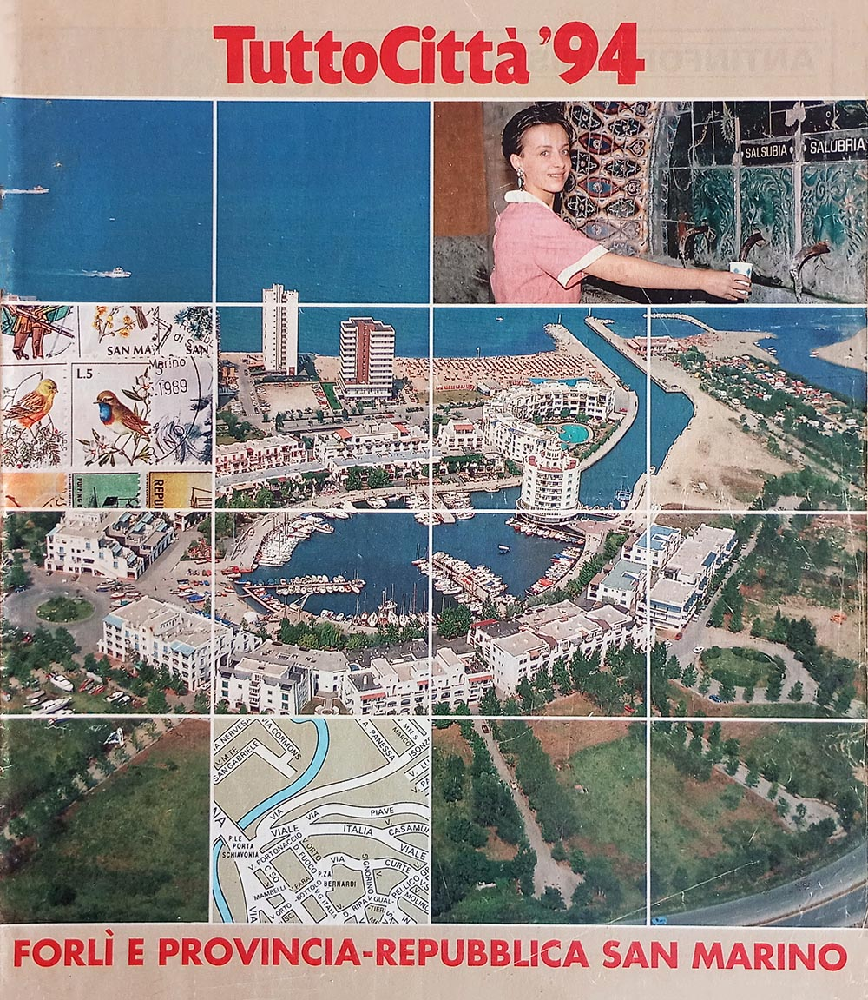</a>
Forlì - San Marino 94
<ul class="scheda"><li><b>Formato:</b> 246 x 280 mm</li><li><b>Copertina:</b> sottile</li><li><b>Layout:</b> TuttoCittà '90 classico</li><li><b>Pagine:</b> 46</li><li><b>Mese aggiornamento:</b> aprile 1994</li></ul></td><td class="fasc"><a href="../immagini/RA94.jpg">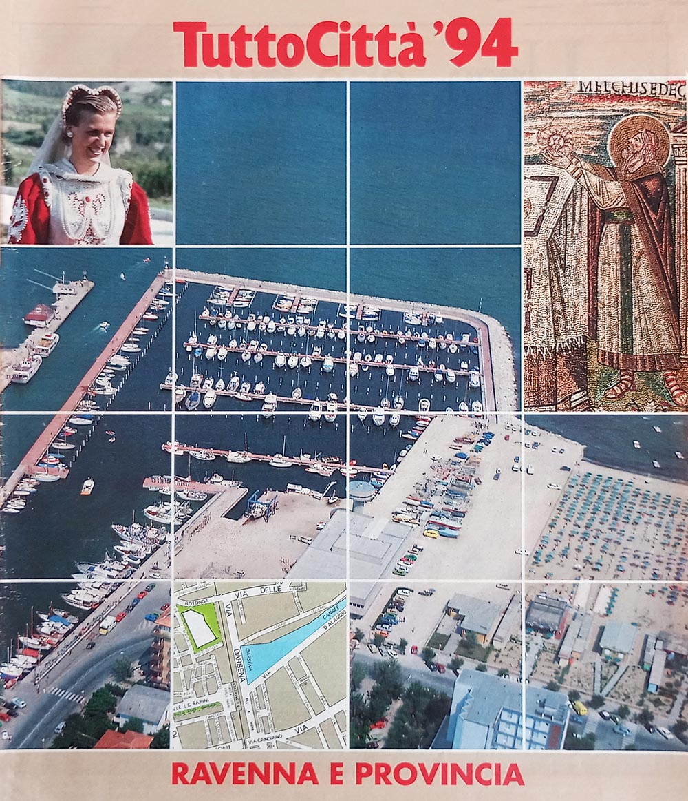</a>
Ravenna 94
<ul class="scheda"><li><b>Formato:</b> 246 x 280 mm</li><li><b>Copertina:</b> sottile</li><li><b>Layout:</b> TuttoCittà '90 classico</li><li><b>Pagine:</b> 38</li><li><b>Mese aggiornamento:</b> aprile 1994</li></ul></td><td class="fasc"><a href="../immagini/MO95.jpg">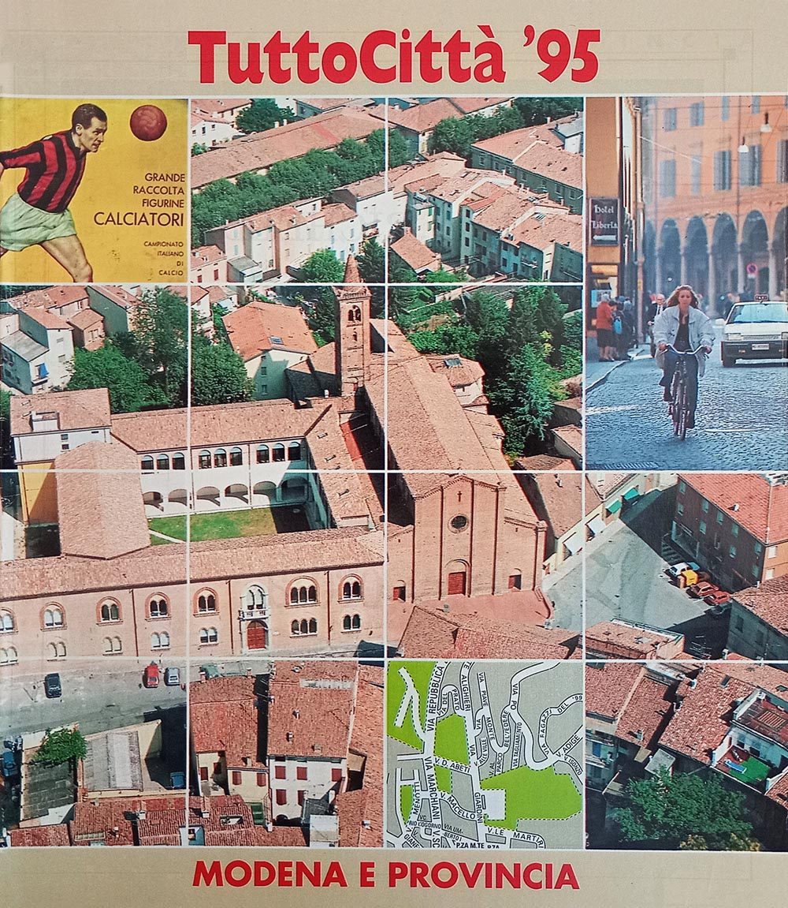</a>
Modena 95
<ul class="scheda"><li><b>Formato:</b> 246 x 280 mm</li><li><b>Copertina:</b> sottile</li><li><b>Layout:</b> TuttoCittà '90 classico</li><li><b>Pagine:</b> 62</li><li><b>Mese aggiornamento:</b> ottobre 1994</li></ul></td><td class="fasc"><a href="../immagini/PR95.jpg">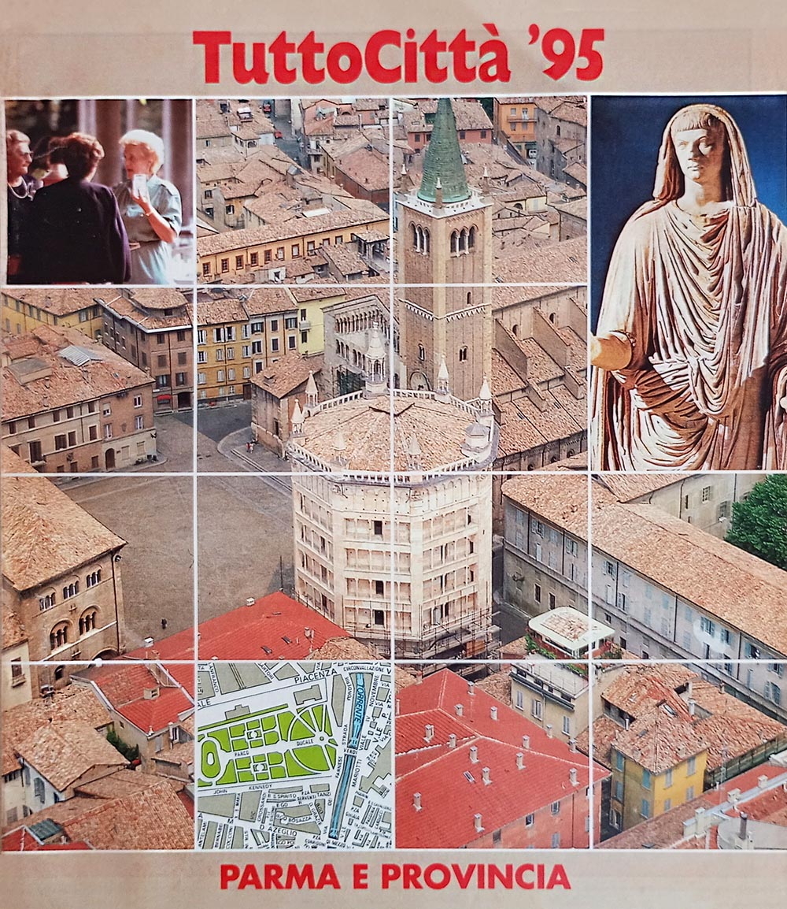</a>
Parma 95
<ul class="scheda"><li><b>Formato:</b> 246 x 280 mm</li><li><b>Copertina:</b> sottile</li><li><b>Layout:</b> TuttoCittà '90 classico</li><li><b>Pagine:</b> 38</li><li><b>Mese aggiornamento:</b> ottobre 1994</li></ul></td><td class="fasc sospesa">
Piacenza 95
<ul class="scheda"><li><b>Formato:</b> 246 x 280 mm</li><li><b>Copertina:</b> sottile</li><li><b>Layout:</b> TuttoCittà '90 classico</li><li>non in raccolta</li></ul></td><td class="fasc sospesa">
Reggio Emilia 95
<ul class="scheda"><li><b>Formato:</b> 246 x 280 mm</li><li><b>Copertina:</b> sottile</li><li><b>Layout:</b> TuttoCittà '90 classico</li><li>non in raccolta</li></ul></td></tr>
<tr><td class="ann"> 95/96</td><td class="tav"></td><td class="fasc"><a href="../immagini/BO96.jpg">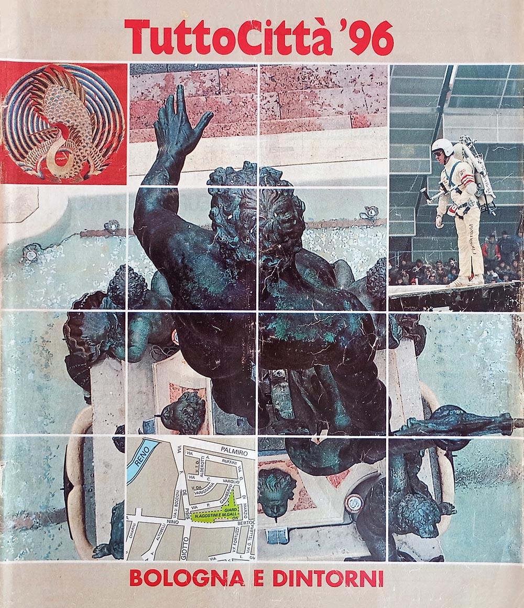</a>
Bologna e dintorni 96
<ul class="scheda"><li><b>Formato:</b> 246 x 280 mm</li><li><b>Copertina:</b> sottile</li><li><b>Layout:</b> TuttoCittà '90 classico</li><li><b>Pagine:</b> 78</li><li><b>Mese aggiornamento:</b> luglio 1995</li></ul></td><td class="fasc"><a href="../immagini/PROVBO96.jpg">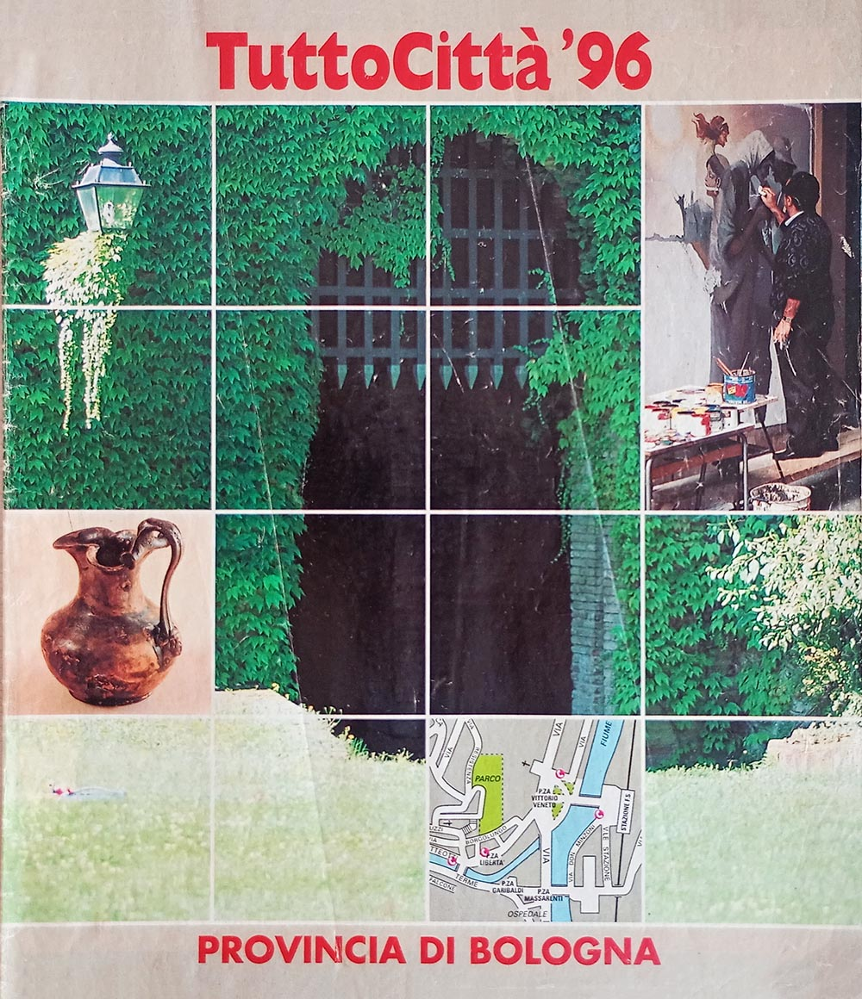</a>
Provincia di Bologna 96
<ul class="scheda"><li><b>Formato:</b> 246 x 280 mm</li><li><b>Copertina:</b> sottile</li><li><b>Layout:</b> TuttoCittà '90 classico</li><li><b>Pagine:</b> 30</li><li><b>Mese aggiornamento:</b> agosto 1995</li></ul></td><td class="fasc"><a href="../immagini/FE95.jpg">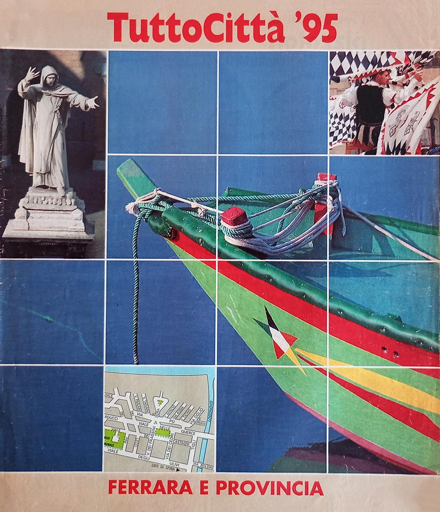</a>
Ferrara 95
<ul class="scheda"><li><b>Formato:</b> 246 x 280 mm</li><li><b>Copertina:</b> sottile</li><li><b>Layout:</b> TuttoCittà '90 classico</li><li><b>Pagine:</b> 30</li><li><b>Mese aggiornamento:</b> aprile 1995</li></ul></td><td class="fasc"><a href="../immagini/FO95.jpg">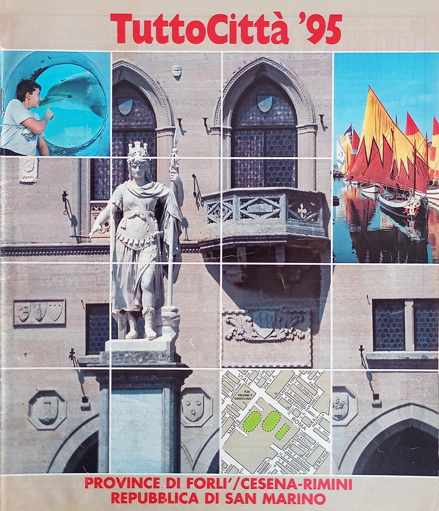</a>
Forlì - Cesena - Rimini - San Marino 95
<ul class="scheda"><li><b>Formato:</b> 246 x 280 mm</li><li><b>Copertina:</b> sottile</li><li><b>Layout:</b> TuttoCittà '90 classico</li><li><b>Pagine:</b> 54</li><li><b>Mese aggiornamento:</b> aprile 1995</li></ul></td><td class="fasc"><a href="../immagini/RA95.jpg">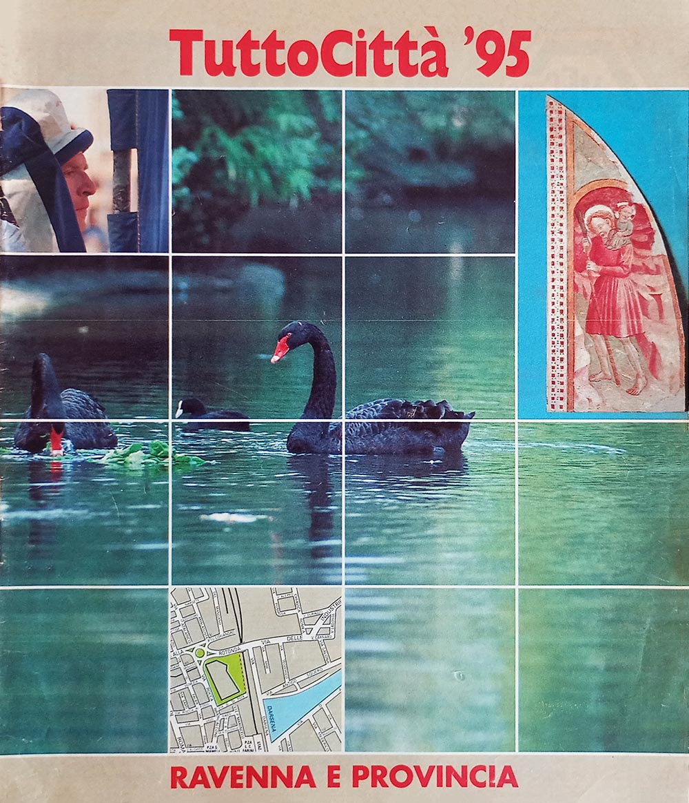</a>
Ravenna 95
<ul class="scheda"><li><b>Formato:</b> 246 x 280 mm</li><li><b>Copertina:</b> sottile</li><li><b>Layout:</b> TuttoCittà '90 classico</li><li><b>Pagine:</b> 38</li><li><b>Mese aggiornamento:</b> aprile 1995</li></ul></td><td class="fasc"><a href="../immagini/MO96.jpg">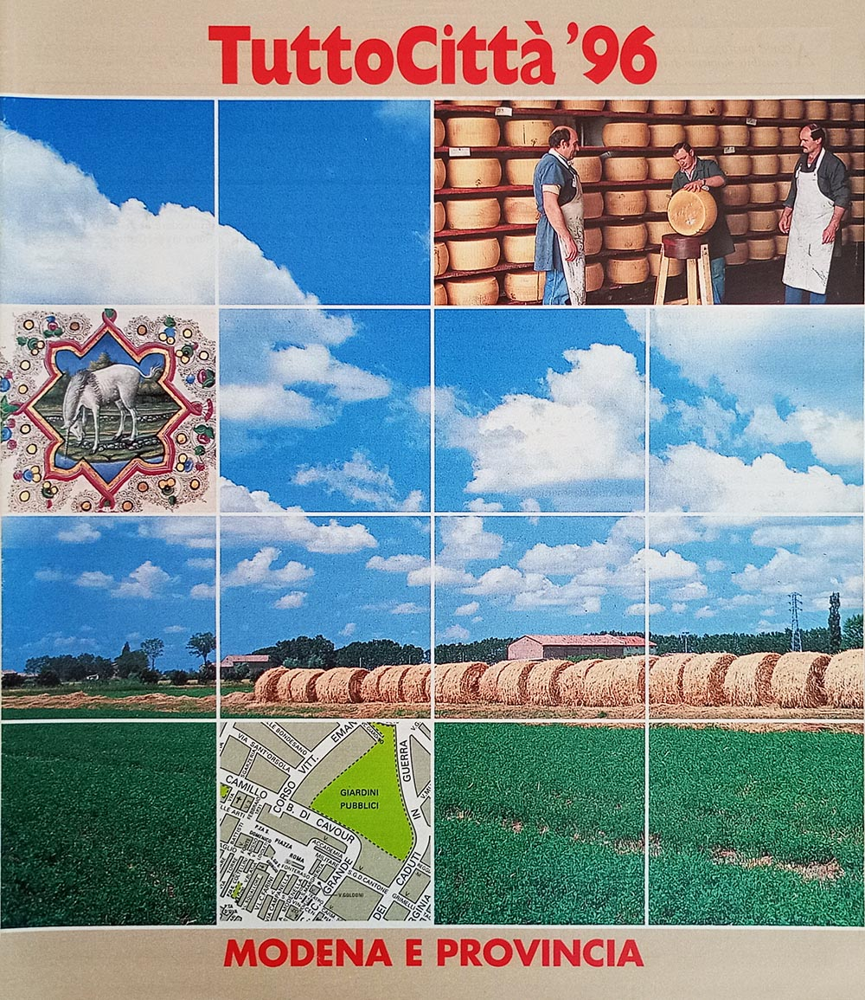</a>
Modena 96
<ul class="scheda"><li><b>Formato:</b> 246 x 280 mm</li><li><b>Copertina:</b> sottile</li><li><b>Layout:</b> TuttoCittà '90 classico</li><li><b>Pagine:</b> 54</li><li><b>Mese aggiornamento:</b> ottobre 1995</li></ul></td><td class="fasc sospesa">
Parma 96
<ul class="scheda"><li><b>Formato:</b> 246 x 280 mm</li><li><b>Copertina:</b> sottile</li><li><b>Layout:</b> TuttoCittà '90 classico</li><li>non in raccolta</li></ul></td><td class="fasc sospesa">
Piacenza 96
<ul class="scheda"><li><b>Formato:</b> 246 x 280 mm</li><li><b>Copertina:</b> sottile</li><li><b>Layout:</b> TuttoCittà '90 classico</li><li>non in raccolta</li></ul></td><td class="fasc sospesa">
Reggio Emilia 96
<ul class="scheda"><li><b>Formato:</b> 246 x 280 mm</li><li><b>Copertina:</b> sottile</li><li><b>Layout:</b> TuttoCittà '90 classico</li><li>non in raccolta</li></ul></td></tr>
<tr><td class="ann"> 96/97</td><td class="tav"></td><td class="fasc"><a href="../immagini/BO97.jpg">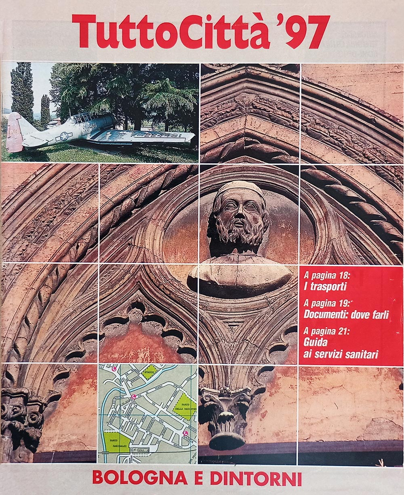</a>
Bologna e dintorni 97
<ul class="scheda"><li><b>Formato:</b> 226 x 274 mm</li><li><b>Copertina:</b> sottile</li><li><b>Layout:</b> TuttoCittà '90 classico</li><li><b>Pagine:</b> 70</li><li><b>Mese aggiornamento:</b> agosto 1996</li><li><b>Note:</b> Cambio formato</li></ul></td><td class="fasc sospesa">
Provincia di Bologna 97
<ul class="scheda"><li><b>Formato:</b> 226 x 274 mm</li><li><b>Copertina:</b> sottile</li><li><b>Layout:</b> TuttoCittà '90 classico</li><li><b>Note:</b> Cambio formato</li><li>non in raccolta</li></ul></td><td class="fasc"><a href="../immagini/FE96.jpg">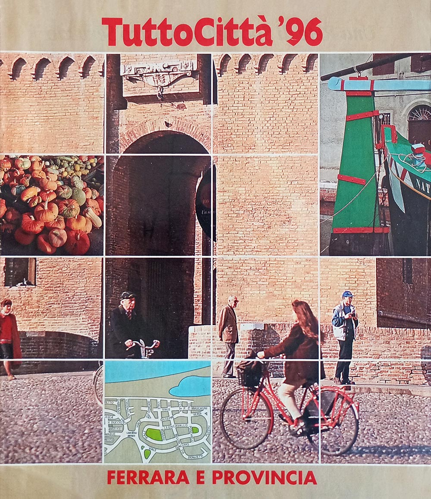</a>
Ferrara 96
<ul class="scheda"><li><b>Formato:</b> 246 x 280 mm</li><li><b>Copertina:</b> sottile</li><li><b>Layout:</b> TuttoCittà '90 classico</li><li><b>Pagine:</b> 30</li><li><b>Mese aggiornamento:</b> aprile 1996</li></ul></td><td class="fasc sospesa">
Forlì - Cesena - Rimini - San Marino 96
<ul class="scheda"><li><b>Formato:</b> 246 x 280 mm</li><li><b>Copertina:</b> sottile</li><li><b>Layout:</b> TuttoCittà '90 classico</li><li>non in raccolta</li></ul></td><td class="fasc"><a href="../immagini/RA96.jpg">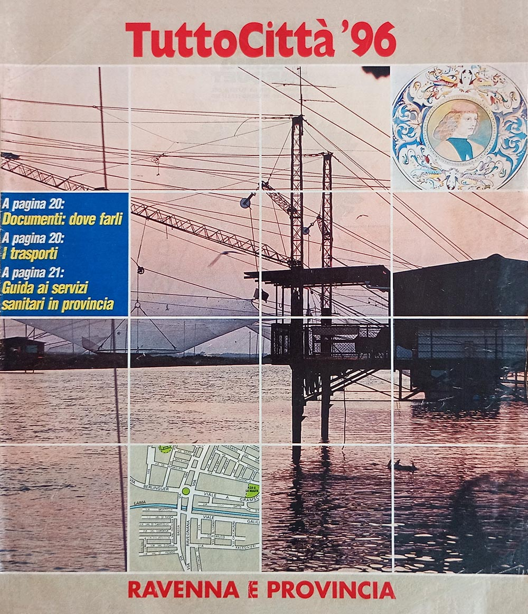</a>
Ravenna 96
<ul class="scheda"><li><b>Formato:</b> 246 x 280 mm</li><li><b>Copertina:</b> sottile</li><li><b>Layout:</b> TuttoCittà '90 classico</li><li><b>Pagine:</b> 38</li><li><b>Mese aggiornamento:</b> aprile 1996</li></ul></td><td class="fasc"><a href="../immagini/MO97.jpg">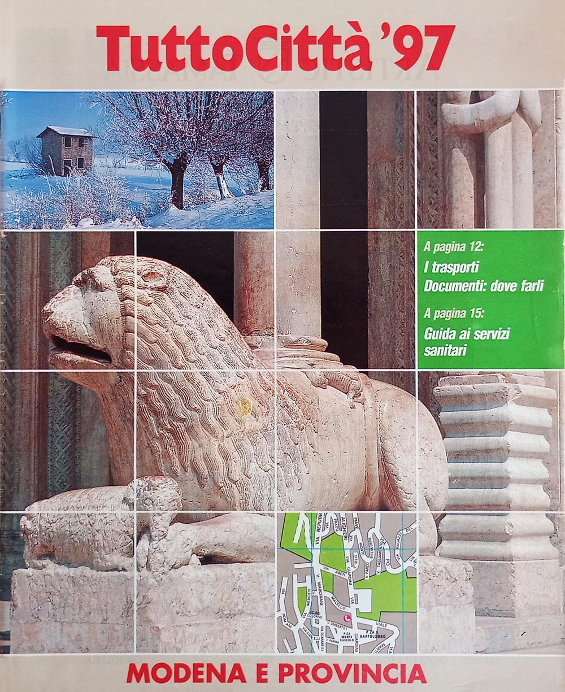</a>
Modena 97
<ul class="scheda"><li><b>Formato:</b> 226 x 274 mm</li><li><b>Copertina:</b> sottile</li><li><b>Layout:</b> TuttoCittà '90 classico</li><li><b>Pagine:</b> 54</li><li><b>Mese aggiornamento:</b> ottobre 1996</li><li><b>Note:</b> Cambio formato</li></ul></td><td class="fasc sospesa">
Parma 97
<ul class="scheda"><li><b>Formato:</b> 226 x 274 mm</li><li><b>Copertina:</b> sottile</li><li><b>Layout:</b> TuttoCittà '90 classico</li><li><b>Note:</b> Cambio formato</li><li>non in raccolta</li></ul></td><td class="fasc sospesa">
Piacenza 97
<ul class="scheda"><li><b>Formato:</b> 226 x 274 mm</li><li><b>Copertina:</b> sottile</li><li><b>Layout:</b> TuttoCittà '90 classico</li><li><b>Note:</b> Cambio formato</li><li>non in raccolta</li></ul></td><td class="fasc sospesa">
Reggio Emilia 97
<ul class="scheda"><li><b>Formato:</b> 226 x 274 mm</li><li><b>Copertina:</b> sottile</li><li><b>Layout:</b> TuttoCittà '90 classico</li><li><b>Note:</b> Cambio formato</li><li>non in raccolta</li></ul></td></tr>
<tr><td class="ann">  97/98</td><td class="tav"></td><td class="fasc"><a href="../immagini/BO97b.jpg">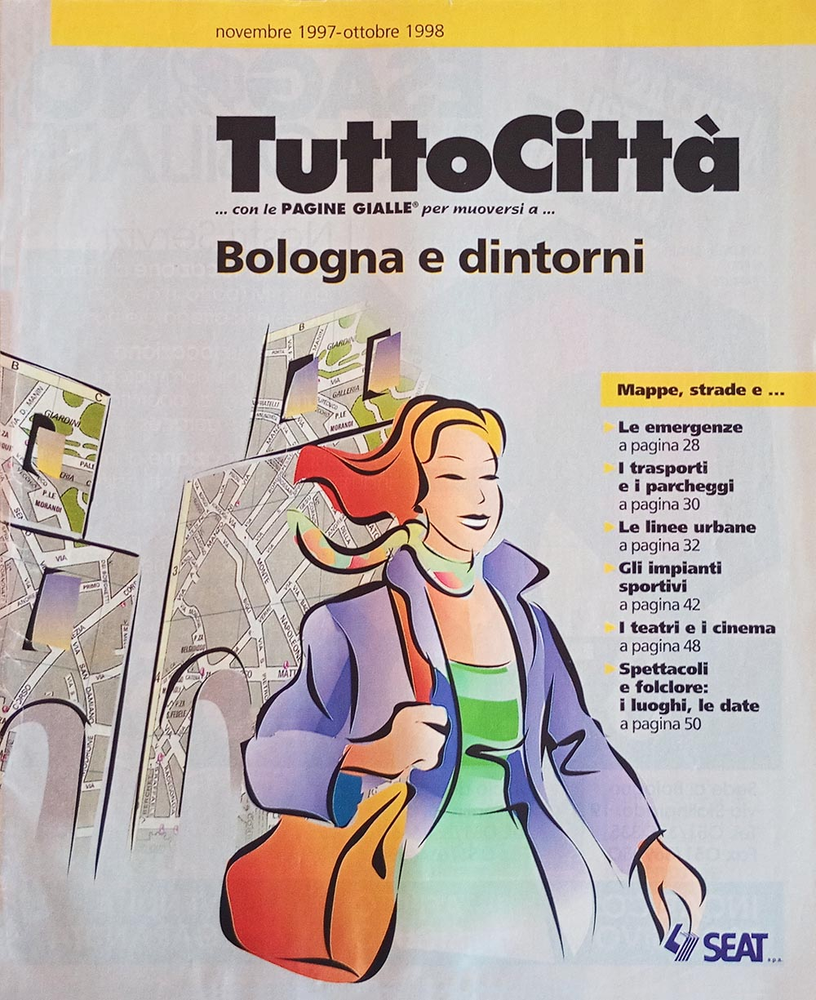</a>
Bologna e dintorni (98)
<ul class="scheda"><li><b>Formato:</b> 226 x 274 mm</li><li><b>Copertina:</b> sottile</li><li><b>Layout:</b> TuttoCittà '90 riformato</li><li><b>Pagine:</b> 78</li><li><b>Mese aggiornamento:</b> agosto 1997</li><li><b>Note:</b> "novembre 1997 - ottobre 1998"</li></ul></td><td class="fasc sospesa">
Provincia di Bologna (98)
<ul class="scheda"><li><b>Formato:</b> 226 x 274 mm</li><li><b>Copertina:</b> sottile</li><li><b>Layout:</b> TuttoCittà '90 riformato</li><li>non in raccolta</li></ul></td><td class="fasc"><a href="../immagini/FE97.jpg">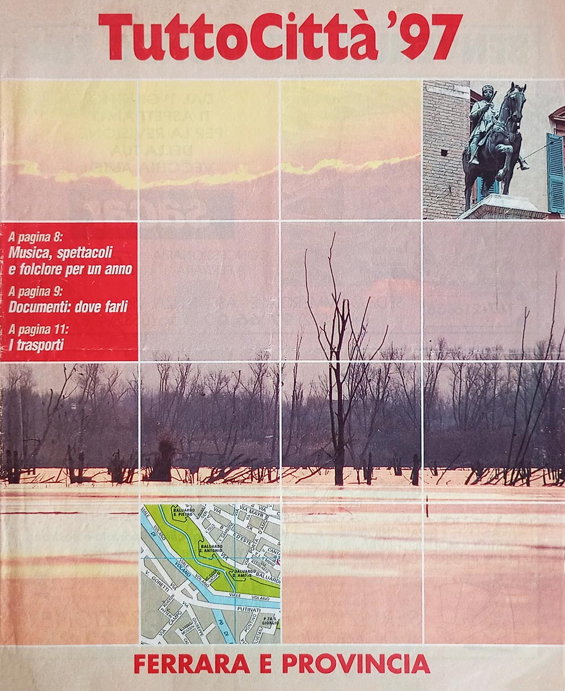</a>
Ferrara 97
<ul class="scheda"><li><b>Formato:</b> 226 x 274 mm</li><li><b>Copertina:</b> sottile</li><li><b>Layout:</b> TuttoCittà '90 classico</li><li><b>Pagine:</b> 30</li><li><b>Mese aggiornamento:</b> aprile 1997</li><li><b>Note:</b> Cambio formato</li></ul></td><td class="fasc sospesa">
Forlì - Cesena - Rimini - San Marino 97
<ul class="scheda"><li><b>Formato:</b> 226 x 274 mm</li><li><b>Copertina:</b> sottile</li><li><b>Layout:</b> TuttoCittà '90 classico</li><li><b>Note:</b> Cambio formato</li><li>non in raccolta</li></ul></td><td class="fasc"><a href="../immagini/RA97.jpg">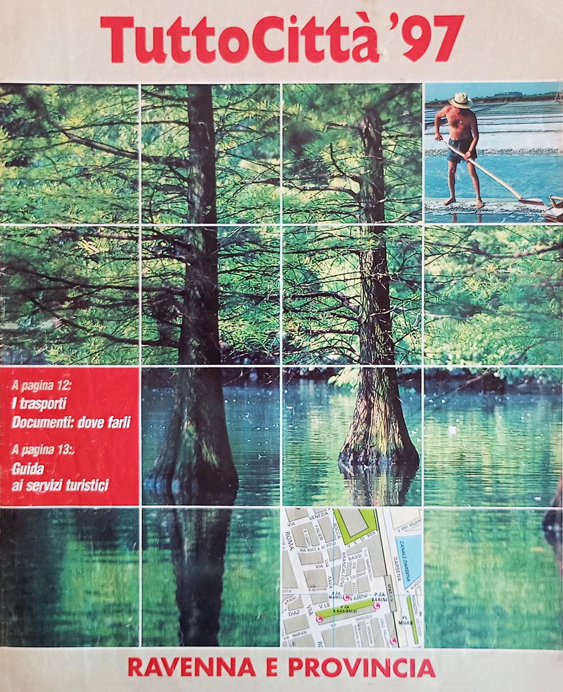</a>
Ravenna 97
<ul class="scheda"><li><b>Formato:</b> 226 x 274 mm</li><li><b>Copertina:</b> sottile</li><li><b>Layout:</b> TuttoCittà '90 classico</li><li><b>Pagine:</b> 30</li><li><b>Mese aggiornamento:</b> aprile 1997</li><li><b>Note:</b> Cambio formato</li></ul></td><td class="fasc"><a href="../immagini/MO97b.jpg">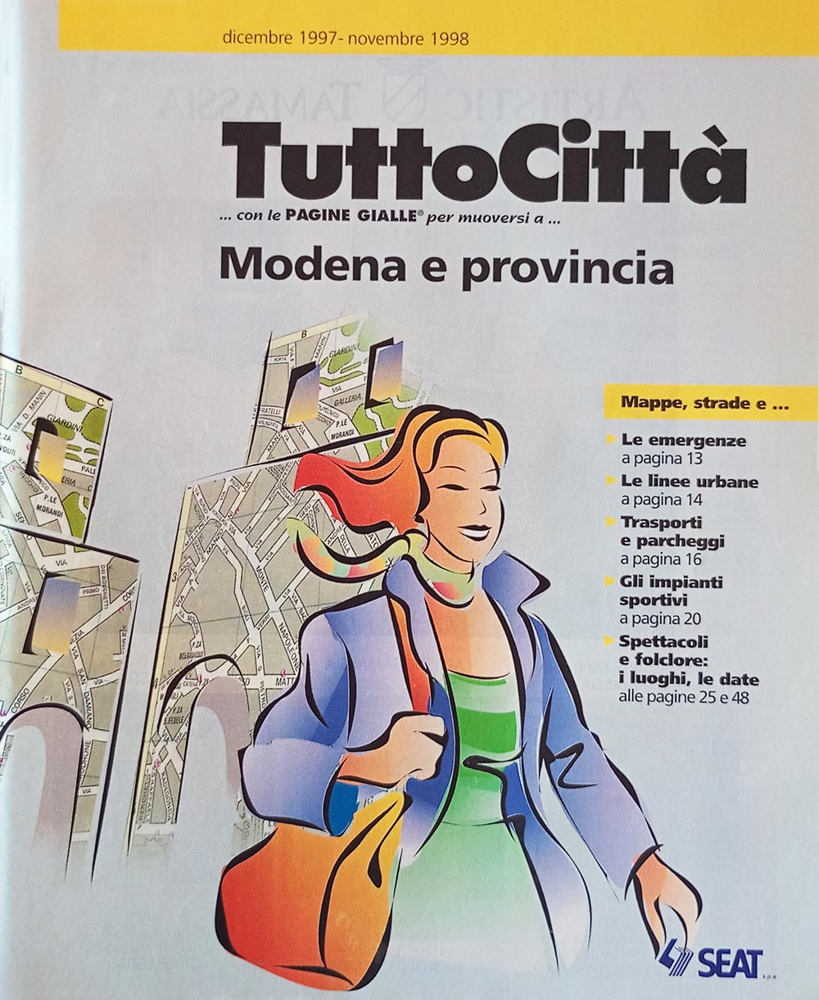</a>
Modena (98)
<ul class="scheda"><li><b>Formato:</b> 226 x 274 mm</li><li><b>Copertina:</b> sottile</li><li><b>Layout:</b> TuttoCittà '90 riformato</li><li><b>Pagine:</b> 62</li><li><b>Mese aggiornamento:</b> ottobre 1997</li><li><b>Note:</b> "dicembre 1997 - novembre 1998"</li></ul></td><td class="fasc"><a href="../immagini/PR97b.jpg">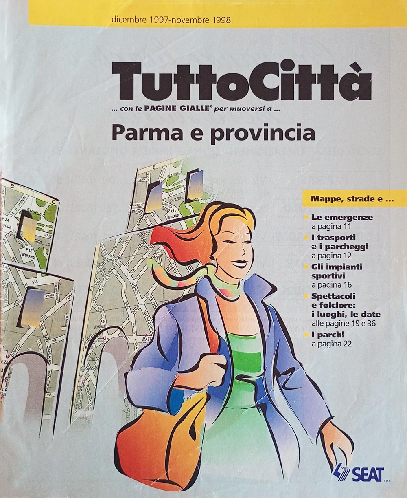</a>
Parma (98)
<ul class="scheda"><li><b>Formato:</b> 226 x 274 mm</li><li><b>Copertina:</b> sottile</li><li><b>Layout:</b> TuttoCittà '90 riformato</li><li><b>Pagine:</b> 46</li><li><b>Mese aggiornamento:</b> ottobre 1997</li><li><b>Note:</b> "dicembre 1997 - novembre 1998"</li></ul></td><td class="fasc sospesa">
Piacenza (98)
<ul class="scheda"><li><b>Formato:</b> 226 x 274 mm</li><li><b>Copertina:</b> sottile</li><li><b>Layout:</b> TuttoCittà '90 riformato</li><li>non in raccolta</li></ul></td><td class="fasc"><a href="../immagini/RE97b.jpg">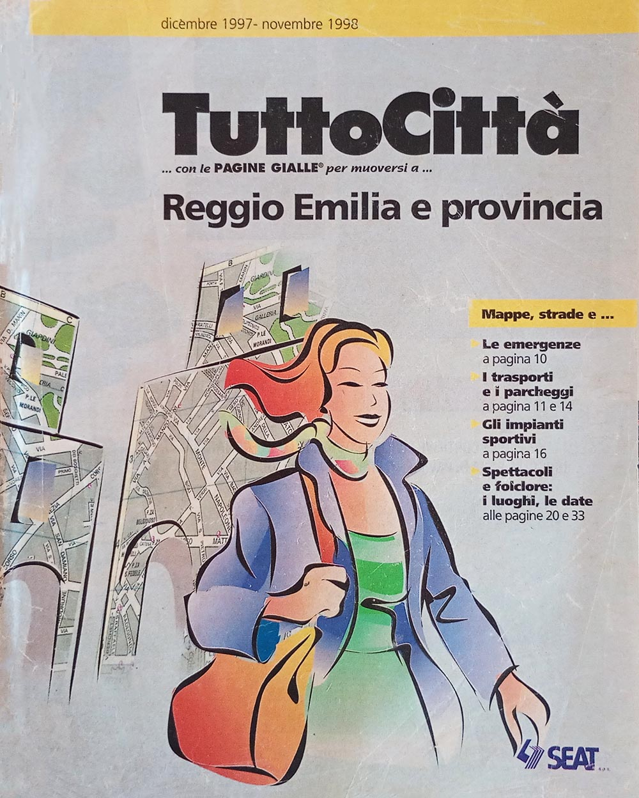</a>
Reggio Emilia (98)
<ul class="scheda"><li><b>Formato:</b> 226 x 274 mm</li><li><b>Copertina:</b> sottile</li><li><b>Layout:</b> TuttoCittà '90 riformato</li><li><b>Pagine:</b> 38</li><li><b>Mese aggiornamento:</b> ottobre 1997</li><li><b>Note:</b> "dicembre 1997 - novembre 1998"</li></ul></td></tr>
<tr><td class="ann"> 98/99</td><td class="tav"></td><td class="fasc"><a href="../immagini/BO98.jpg">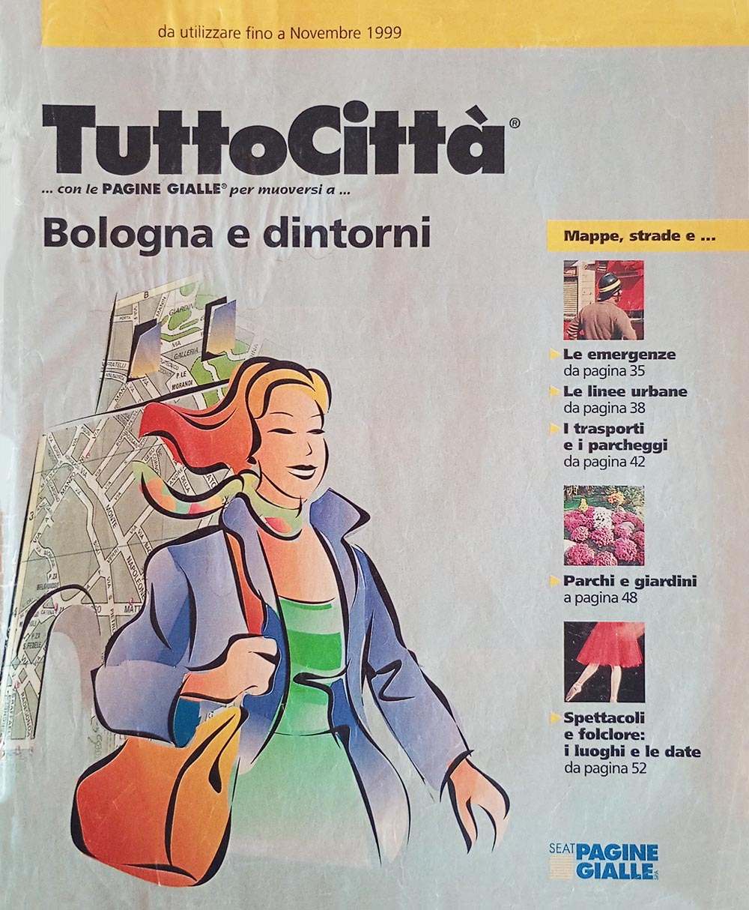</a>
Bologna e dintorni (99)
<ul class="scheda"><li><b>Formato:</b> 226 x 274 mm</li><li><b>Copertina:</b> sottile</li><li><b>Layout:</b> TuttoCittà '90 riformato</li><li><b>Pagine:</b> 70</li><li><b>Mese aggiornamento:</b> agosto 1998</li><li><b>Note:</b> "da utilizzare fino a Novembre 1999"</li></ul></td><td class="fasc"><a href="../immagini/PROVBO98.jpg">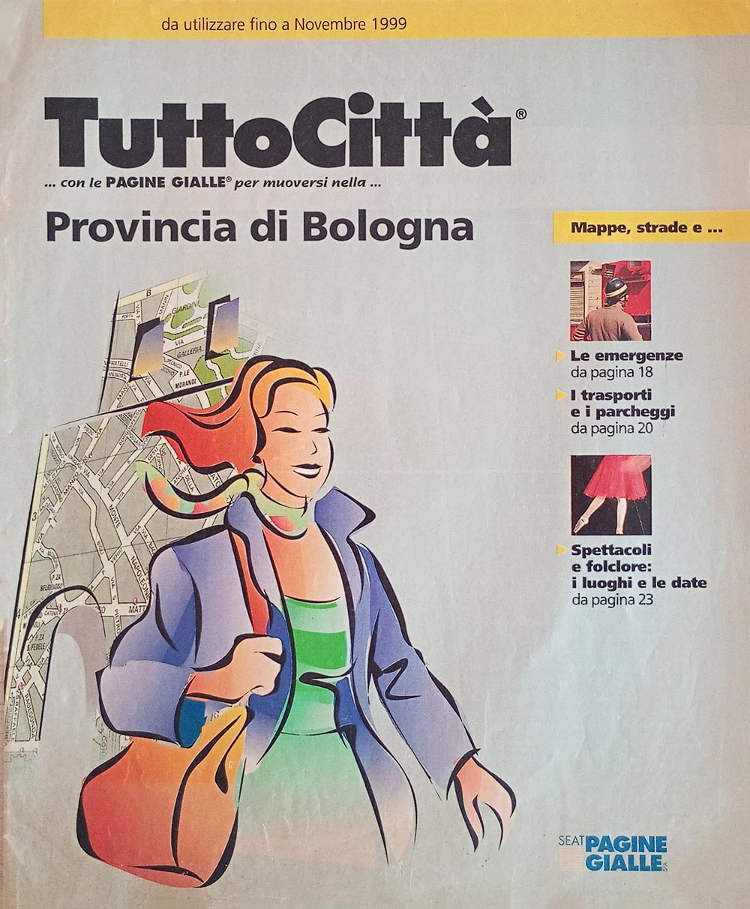</a>
Provincia di Bologna (99)
<ul class="scheda"><li><b>Formato:</b> 226 x 274 mm</li><li><b>Copertina:</b> sottile</li><li><b>Layout:</b> TuttoCittà '90 riformato</li><li><b>Pagine:</b> 30</li><li><b>Mese aggiornamento:</b> agosto 1998</li><li><b>Note:</b> "da utilizzare fino a Novembre 1999"</li></ul></td><td class="fasc"><a href="../immagini/FE98.jpg">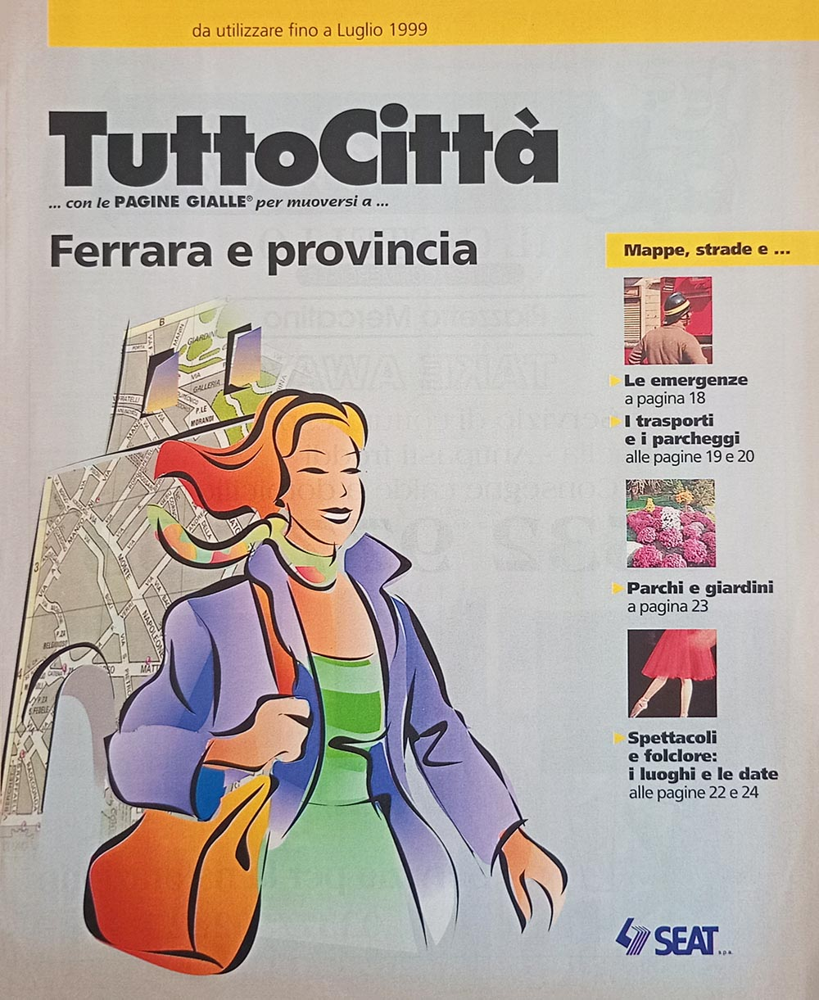</a>
Ferrara (98)
<ul class="scheda"><li><b>Formato:</b> 226 x 274 mm</li><li><b>Copertina:</b> sottile</li><li><b>Layout:</b> TuttoCittà '90 riformato</li><li><b>Pagine:</b> 30</li><li><b>Mese aggiornamento:</b> aprile 1998</li><li><b>Note:</b> "da utilizzare fino a Novembre 1999"</li></ul></td><td class="fasc vuota"></td><td class="fasc vuota"></td><td class="fasc"><a href="../immagini/MO98.jpg">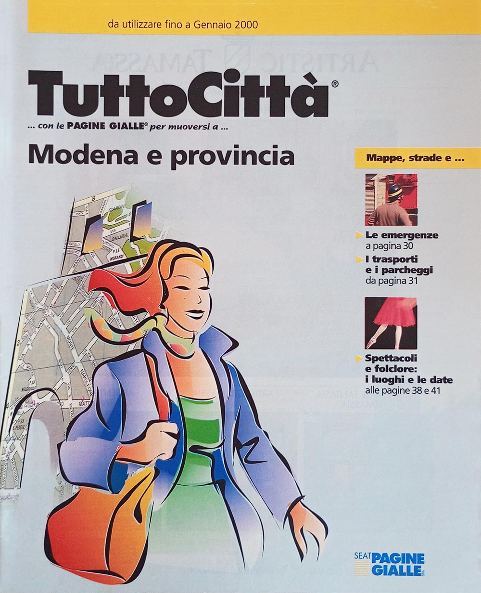</a>
Modena (99)
<ul class="scheda"><li><b>Formato:</b> 226 x 274 mm</li><li><b>Copertina:</b> sottile</li><li><b>Layout:</b> TuttoCittà '90 riformato</li><li><b>Pagine:</b> 54</li><li><b>Mese aggiornamento:</b> ottobre 1998</li><li><b>Note:</b> "da utilizzare fino a Gennaio 2000"</li></ul></td><td class="fasc"><a href="../immagini/PR98.jpg">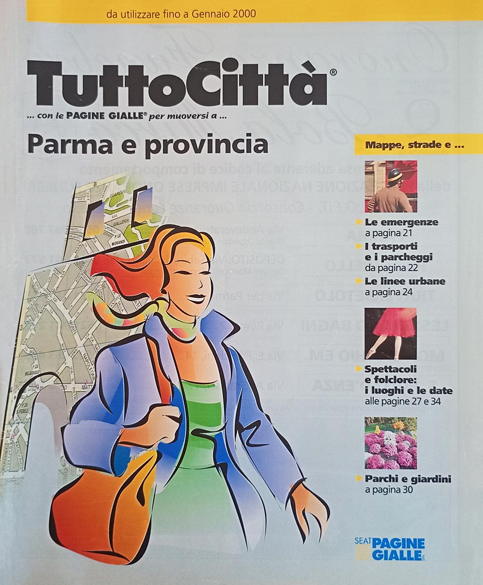</a>
Parma (99)
<ul class="scheda"><li><b>Formato:</b> 226 x 274 mm</li><li><b>Copertina:</b> sottile</li><li><b>Layout:</b> TuttoCittà '90 riformato</li><li><b>Pagine:</b> 46</li><li><b>Mese aggiornamento:</b> ottobre 1998</li><li><b>Note:</b> "da utilizzare fino a Gennaio 2000"</li></ul></td><td class="fasc sospesa">
Piacenza (99)
<ul class="scheda"><li><b>Formato:</b> 226 x 274 mm</li><li><b>Copertina:</b> sottile</li><li><b>Layout:</b> TuttoCittà '90 riformato</li><li>non in raccolta</li></ul></td><td class="fasc"><a href="../immagini/RE98.jpg">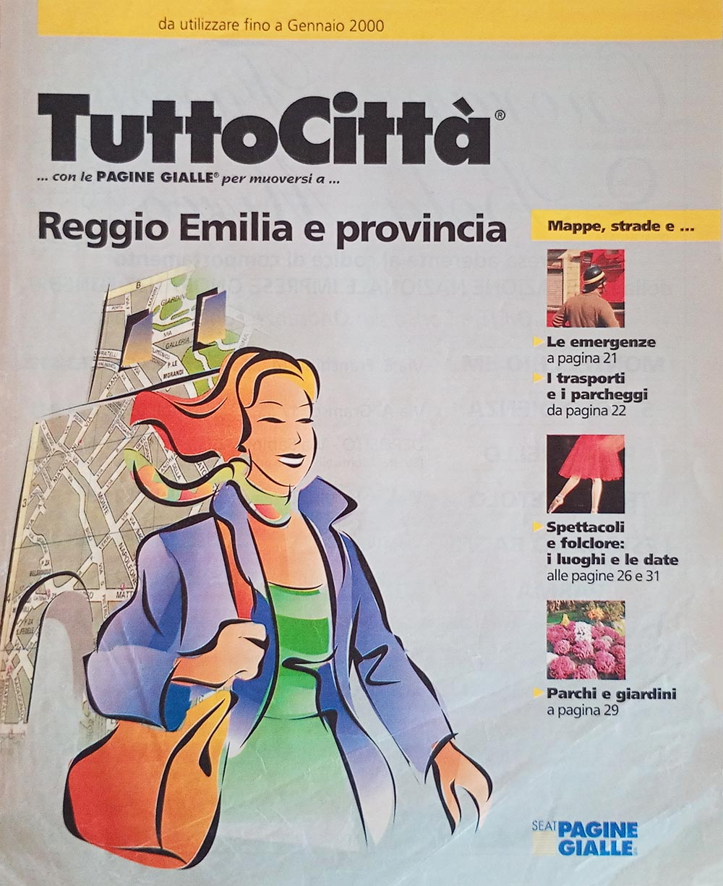</a>
Reggio Emilia (99)
<ul class="scheda"><li><b>Formato:</b> 226 x 274 mm</li><li><b>Copertina:</b> sottile</li><li><b>Layout:</b> TuttoCittà '90 riformato</li><li><b>Pagine:</b> 38</li><li><b>Mese aggiornamento:</b> ottobre 1998</li><li><b>Note:</b> "da utilizzare fino a Gennaio 2000"</li></ul></td></tr>
<tr><td class="ann"> 99/00</td><td class="tav"></td><td class="fasc"><a href="../immagini/BO9900.jpg">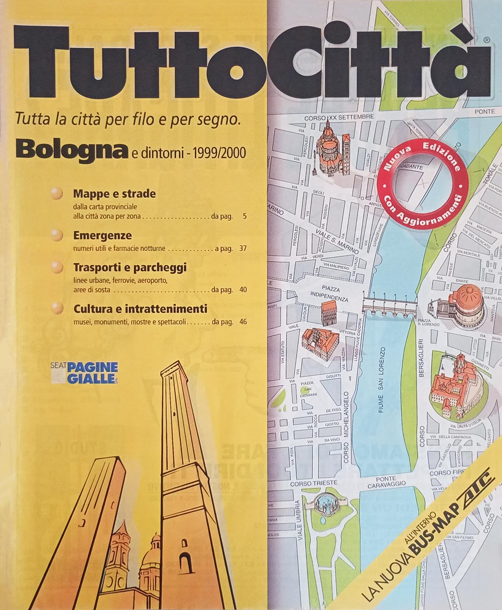</a>
Bologna e dintorni 1999/2000
<ul class="scheda"><li><b>Formato:</b> 226 x 274 mm</li><li><b>Copertina:</b> sottile</li><li><b>Layout:</b> TuttoCittà nuovo millennio</li><li><b>Pagine:</b> 62</li><li><b>Mese aggiornamento:</b> agosto 1999</li></ul></td><td class="fasc dubbia">
Provincia di Bologna 1999/2000
<ul class="scheda"><li>esistenza dubbia</li></ul></td><td class="fasc"><a href="../immagini/FE9900.jpg">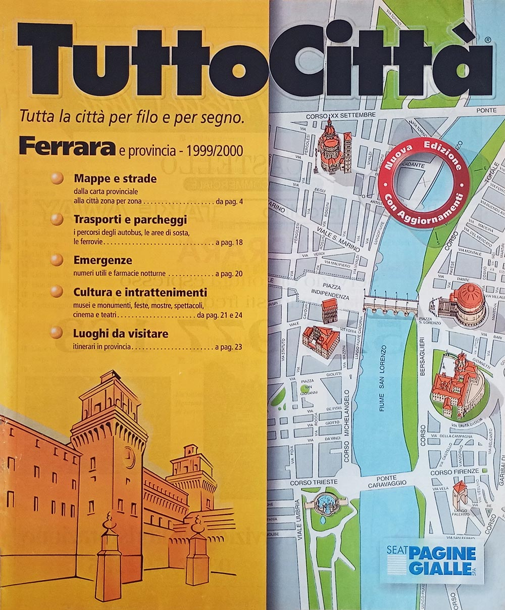</a>
Ferrara 1999/2000
<ul class="scheda"><li><b>Formato:</b> 226 x 274 mm</li><li><b>Copertina:</b> sottile</li><li><b>Layout:</b> TuttoCittà nuovo millennio</li><li><b>Pagine:</b> 30</li><li><b>Mese aggiornamento:</b> aprile 1999</li></ul></td><td class="fasc vuota"></td><td class="fasc vuota"></td><td class="fasc"><a href="../immagini/MO9900.jpg">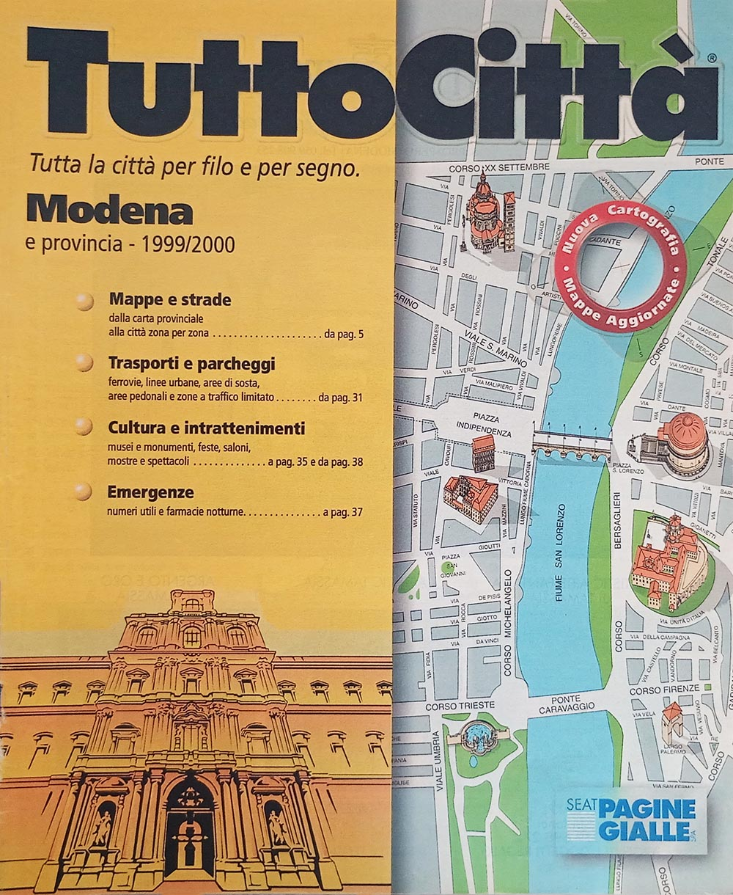</a>
Modena 1999/2000
<ul class="scheda"><li><b>Formato:</b> 226 x 274 mm</li><li><b>Copertina:</b> sottile</li><li><b>Layout:</b> TuttoCittà nuovo millennio</li><li><b>Pagine:</b> 54</li><li><b>Mese aggiornamento:</b> ottobre 1999</li></ul></td><td class="fasc"><a href="../immagini/PR9900.jpg">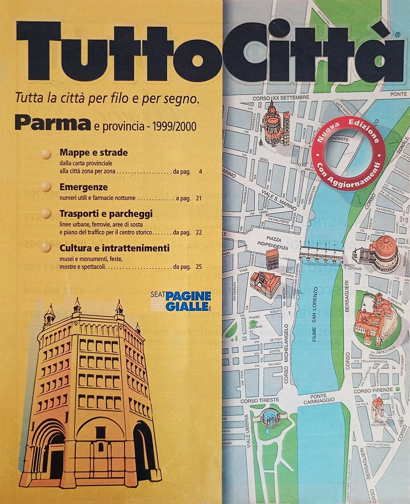</a>
Parma 1999/2000
<ul class="scheda"><li><b>Formato:</b> 226 x 274 mm</li><li><b>Copertina:</b> sottile</li><li><b>Layout:</b> TuttoCittà nuovo millennio</li><li><b>Pagine:</b> 38</li><li><b>Mese aggiornamento:</b> ottobre 1999</li></ul></td><td class="fasc"><a href="../immagini/PC9900.jpg">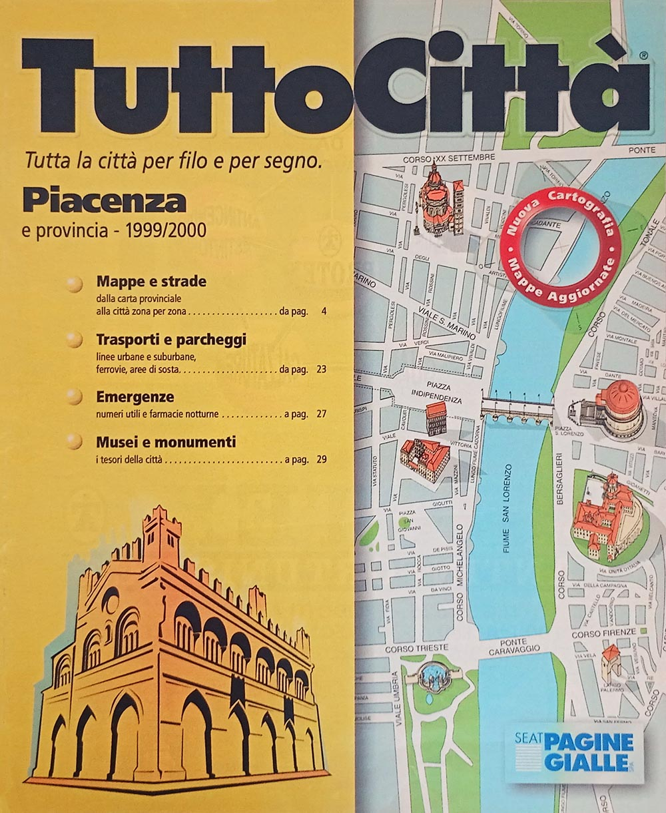</a>
Piacenza 1999/2000
<ul class="scheda"><li><b>Formato:</b> 226 x 274 mm</li><li><b>Copertina:</b> sottile</li><li><b>Layout:</b> TuttoCittà nuovo millennio</li><li><b>Pagine:</b> 38</li><li><b>Mese aggiornamento:</b> ottobre 1999</li></ul></td><td class="fasc sospesa">
Reggio Emilia 1999/2000
<ul class="scheda"><li><b>Formato:</b> 226 x 274 mm</li><li><b>Copertina:</b> sottile</li><li><b>Layout:</b> TuttoCittà nuovo millennio</li><li>non in raccolta</li></ul></td></tr>
<tr><td class="ann"> 00/01</td><td class="tav"> </td><td class="fasc"><a href="../immagini/BO01.jpg">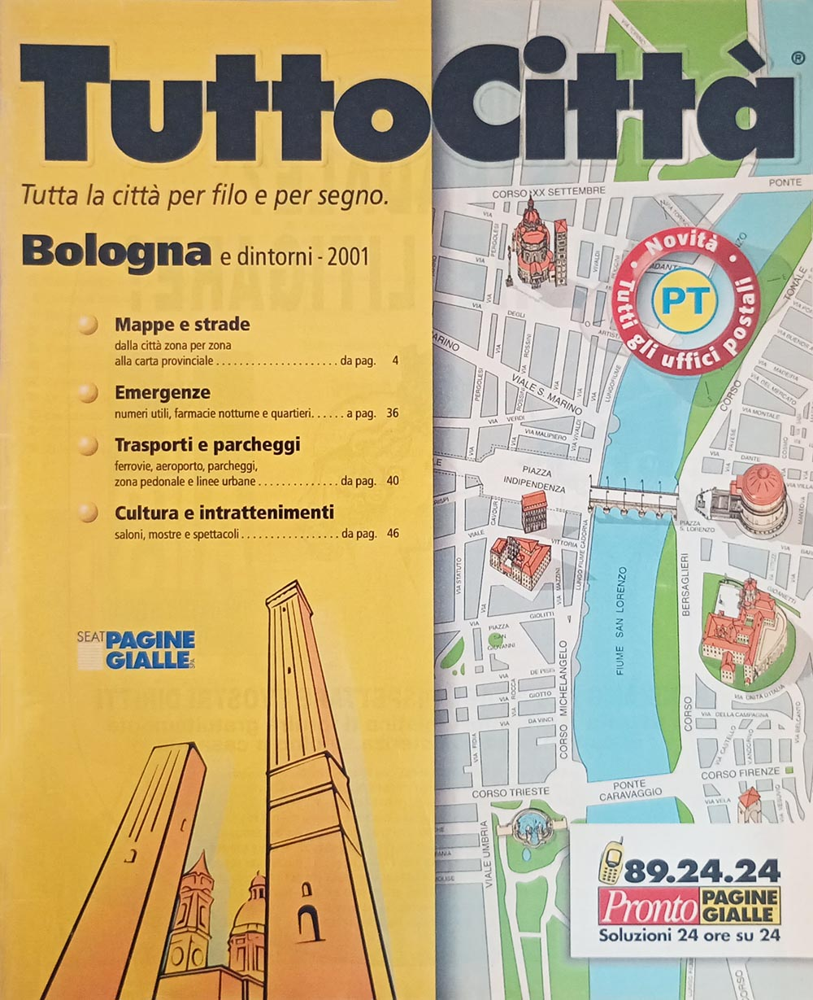</a>
Bologna e dintorni 2001
<ul class="scheda"><li><b>Formato:</b> 226 x 274 mm</li><li><b>Copertina:</b> sottile</li><li><b>Layout:</b> TuttoCittà nuovo millennio ter</li><li><b>Pagine:</b> 62</li><li><b>Mese aggiornamento:</b> luglio 2000</li></ul></td><td class="fasc vuota"></td><td class="fasc"><a href="../immagini/FE0001.jpg">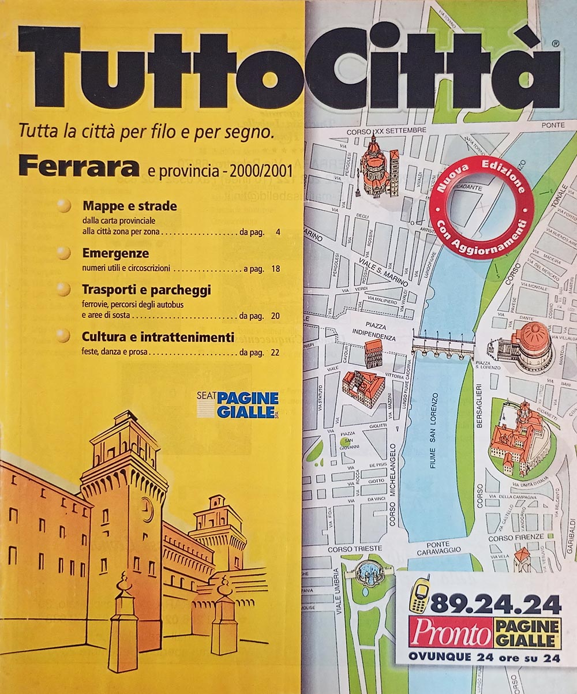</a>
Ferrara 2000/2001
<ul class="scheda"><li><b>Formato:</b> 226 x 274 mm</li><li><b>Copertina:</b> sottile</li><li><b>Layout:</b> TuttoCittà nuovo millennio bis</li><li><b>Pagine:</b> 30</li><li><b>Mese aggiornamento:</b> maggio 2000</li></ul></td><td class="fasc vuota"></td><td class="fasc vuota"></td><td class="fasc"><a href="../immagini/MO0001.jpg">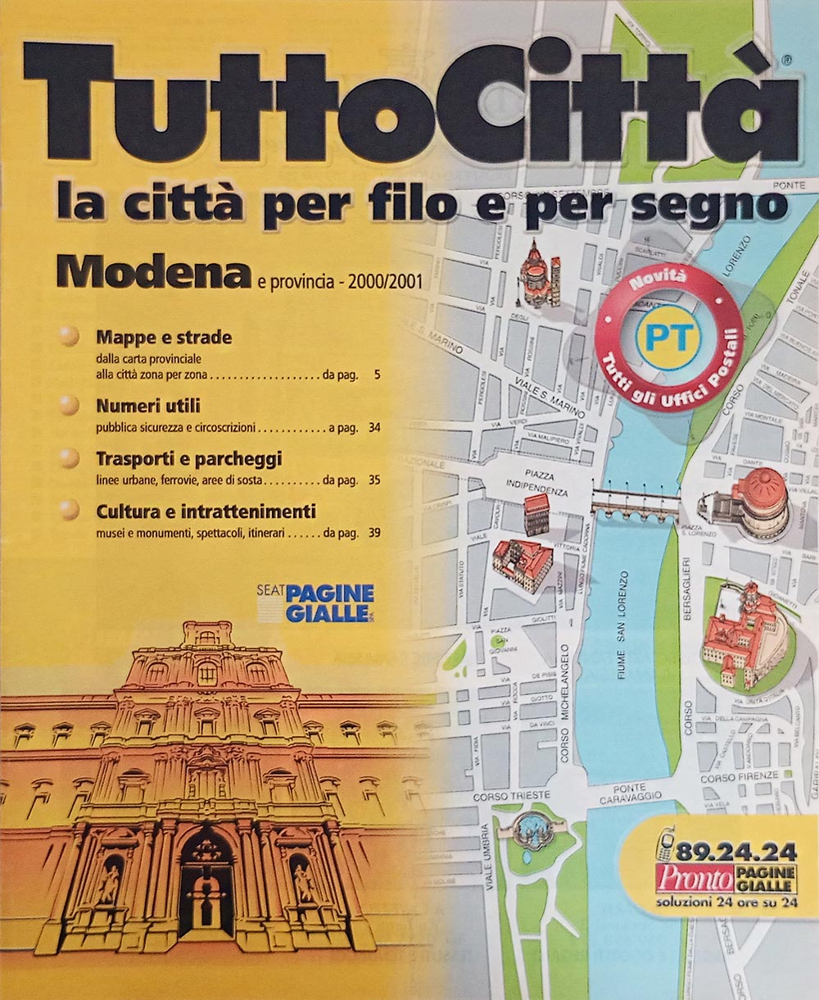</a>
Modena 2000/2001
<ul class="scheda"><li><b>Formato:</b> 226 x 274 mm</li><li><b>Copertina:</b> sottile</li><li><b>Layout:</b> TuttoCittà nuovo millennio ter</li><li><b>Pagine:</b> 54</li><li><b>Mese aggiornamento:</b> ottobre 2000</li></ul></td><td class="fasc sospesa">
Parma ?
<ul class="scheda"><li><b>Formato:</b> 226 x 274 mm</li><li><b>Copertina:</b> sottile</li><li><b>Layout:</b> TuttoCittà nuovo millennio ter</li><li>non in raccolta</li></ul></td><td class="fasc sospesa">
Piacenza ?
<ul class="scheda"><li><b>Formato:</b> 226 x 274 mm</li><li><b>Copertina:</b> sottile</li><li><b>Layout:</b> TuttoCittà nuovo millennio ter</li><li>non in raccolta</li></ul></td><td class="fasc sospesa">
Reggio Emilia ?
<ul class="scheda"><li><b>Formato:</b> 226 x 274 mm</li><li><b>Copertina:</b> sottile</li><li><b>Layout:</b> TuttoCittà nuovo millennio ter</li><li>non in raccolta</li></ul></td></tr>
<tr><td class="ann"> 01/02</td><td class="tav"></td><td class="fasc"><a href="../immagini/BO0102.jpg">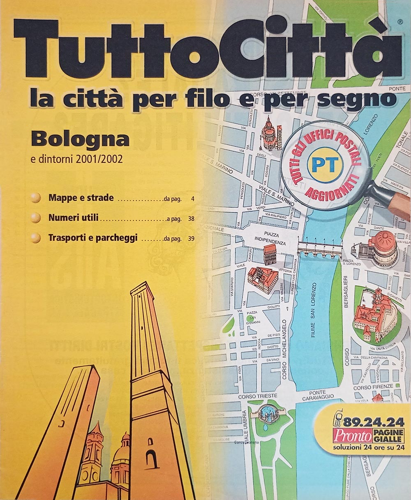</a>
Bologna e dintorni 2001/2002
<ul class="scheda"><li><b>Formato:</b> 226 x 274 mm</li><li><b>Copertina:</b> sottile</li><li><b>Layout:</b> TuttoCittà nuovo millennio ter</li><li><b>Pagine:</b> 62</li><li><b>Mese aggiornamento:</b> luglio 2001</li></ul></td><td class="fasc vuota"></td><td class="fasc"><a href="../immagini/FE0102.jpg">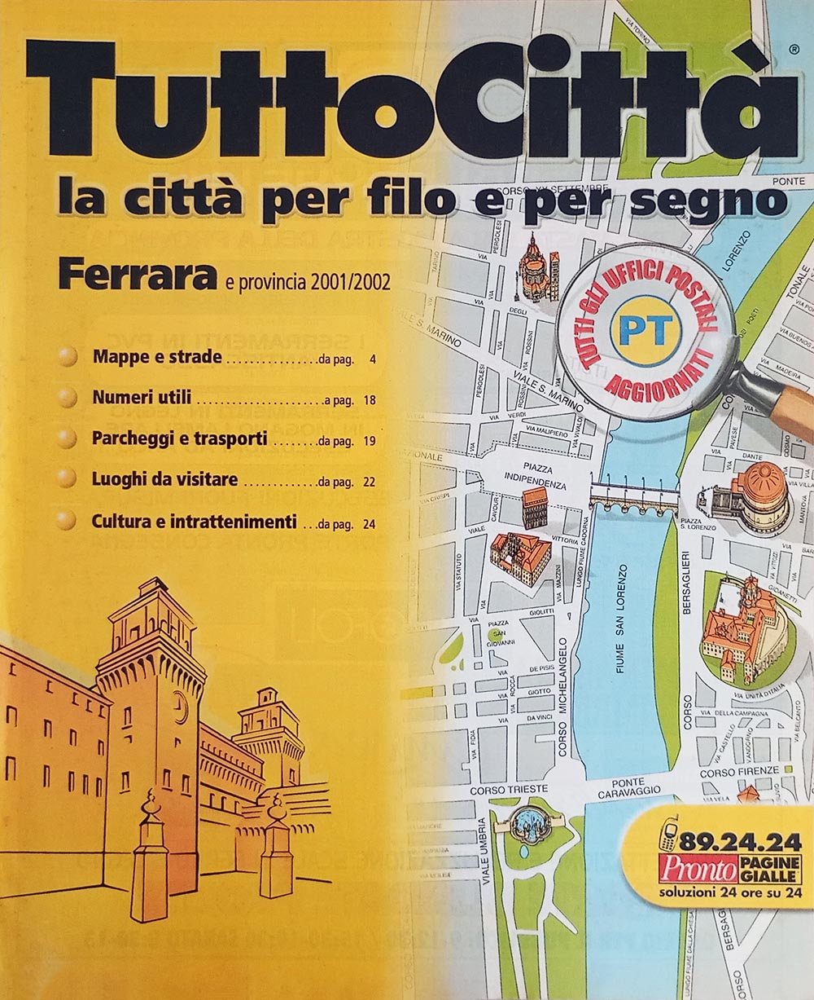</a>
Ferrara 2001/2002
<ul class="scheda"><li><b>Formato:</b> 226 x 274 mm</li><li><b>Copertina:</b> sottile</li><li><b>Layout:</b> TuttoCittà nuovo millennio ter</li><li><b>Pagine:</b> 30 (31)</li><li><b>Mese aggiornamento:</b> maggio 2001</li></ul></td><td class="fasc vuota"></td><td class="fasc vuota"></td><td class="fasc"><a href="../immagini/MO02.jpg">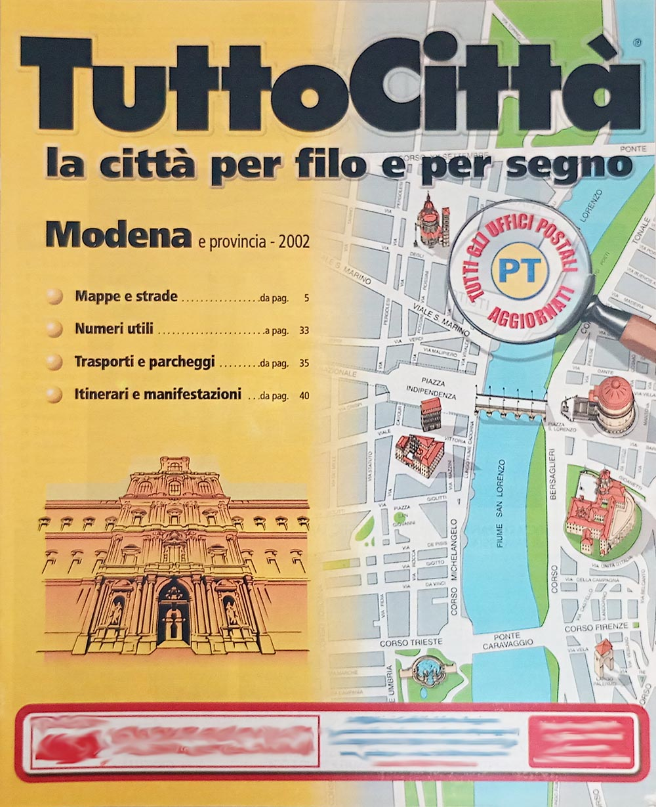</a>
Modena 2002
<ul class="scheda"><li><b>Formato:</b> 226 x 274 mm</li><li><b>Copertina:</b> sottile</li><li><b>Layout:</b> TuttoCittà nuovo millennio ter</li><li><b>Pagine:</b> 54 (55)</li><li><b>Mese aggiornamento:</b> luglio 2001</li></ul></td><td class="fasc sospesa">
Parma ?
<ul class="scheda"><li><b>Formato:</b> 226 x 274 mm</li><li><b>Copertina:</b> sottile</li><li><b>Layout:</b> TuttoCittà nuovo millennio ter</li><li>non in raccolta</li></ul></td><td class="fasc sospesa">
Piacenza ?
<ul class="scheda"><li><b>Formato:</b> 226 x 274 mm</li><li><b>Copertina:</b> sottile</li><li><b>Layout:</b> TuttoCittà nuovo millennio ter</li><li>non in raccolta</li></ul></td><td class="fasc"><a href="../immagini/RE02.jpg">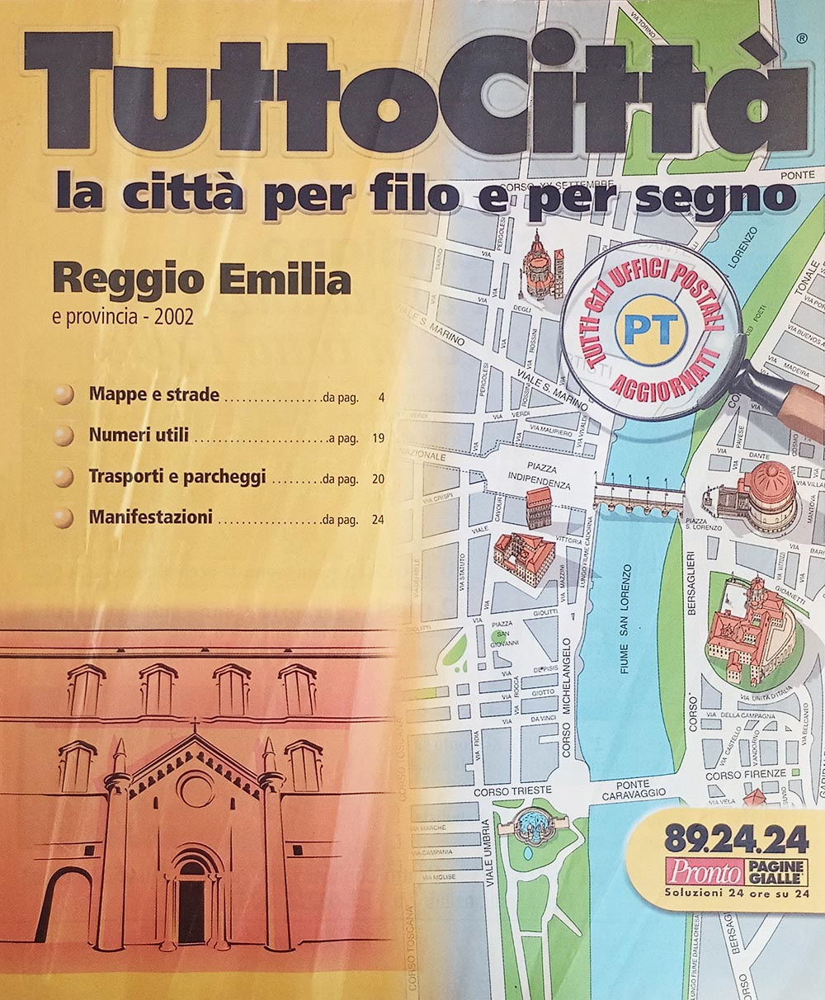</a>
Reggio Emilia 2002
<ul class="scheda"><li><b>Formato:</b> 226 x 274 mm</li><li><b>Copertina:</b> sottile</li><li><b>Layout:</b> TuttoCittà nuovo millennio ter</li><li><b>Pagine:</b> 30 (31)</li><li><b>Mese aggiornamento:</b> luglio 2001</li></ul></td></tr>
<tr><td class="ann"> 02/03</td><td class="tav"></td><td class="fasc"><a href="../immagini/BO0203.jpg">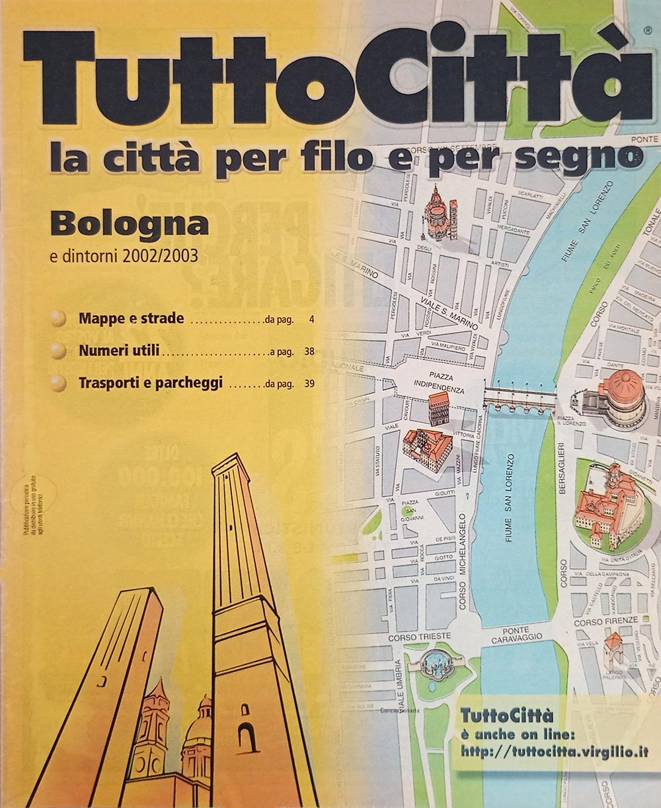</a>
Bologna e dintorni 2002/2003
<ul class="scheda"><li><b>Formato:</b> 226 x 274 mm</li><li><b>Copertina:</b> sottile</li><li><b>Layout:</b> TuttoCittà nuovo millennio ter</li><li><b>Pagine:</b> 54</li><li><b>Mese aggiornamento:</b> ottobre 2002</li></ul></td><td class="fasc vuota"></td><td class="fasc"><a href="../immagini/FE0203.jpg">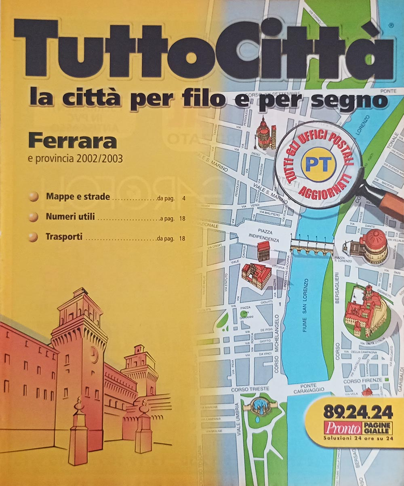</a>
Ferrara 2002/2003
<ul class="scheda"><li><b>Formato:</b> 226 x 274 mm</li><li><b>Copertina:</b> sottile</li><li><b>Layout:</b> TuttoCittà nuovo millennio ter</li><li><b>Pagine:</b> 22 (23)</li><li><b>Mese aggiornamento:</b> giugno 2002</li></ul></td><td class="fasc vuota"></td><td class="fasc vuota"></td><td class="fasc"><a href="../immagini/MO03.jpg">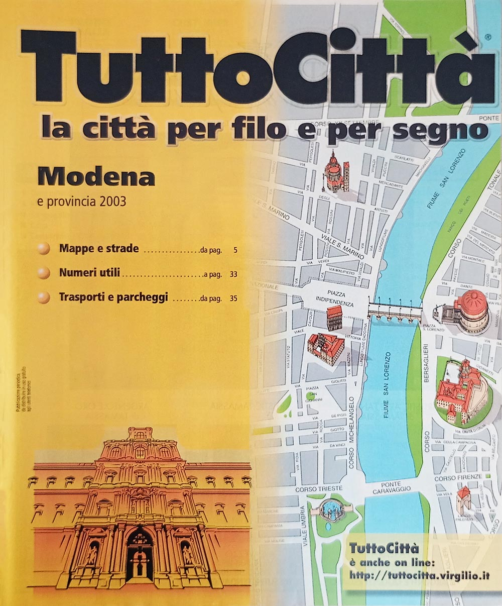</a>
Modena 2003
<ul class="scheda"><li><b>Formato:</b> 226 x 274 mm</li><li><b>Copertina:</b> sottile</li><li><b>Layout:</b> TuttoCittà nuovo millennio ter</li><li><b>Pagine:</b> 46</li><li><b>Mese aggiornamento:</b> dicembre 2002</li></ul></td><td class="fasc sospesa">
Parma ?
<ul class="scheda"><li><b>Formato:</b> 226 x 274 mm</li><li><b>Copertina:</b> sottile</li><li><b>Layout:</b> TuttoCittà nuovo millennio ter</li><li>non in raccolta</li></ul></td><td class="fasc sospesa">
Piacenza ?
<ul class="scheda"><li><b>Formato:</b> 226 x 274 mm</li><li><b>Copertina:</b> sottile</li><li><b>Layout:</b> TuttoCittà nuovo millennio ter</li><li>non in raccolta</li></ul></td><td class="fasc sospesa">
Reggio Emilia ?
<ul class="scheda"><li><b>Formato:</b> 226 x 274 mm</li><li><b>Copertina:</b> sottile</li><li><b>Layout:</b> TuttoCittà nuovo millennio ter</li><li>non in raccolta</li></ul></td></tr>
<tr><td class="ann"> 03/04</td><td class="tav"></td><td class="fasc"><a href="../immagini/BO0304.jpg">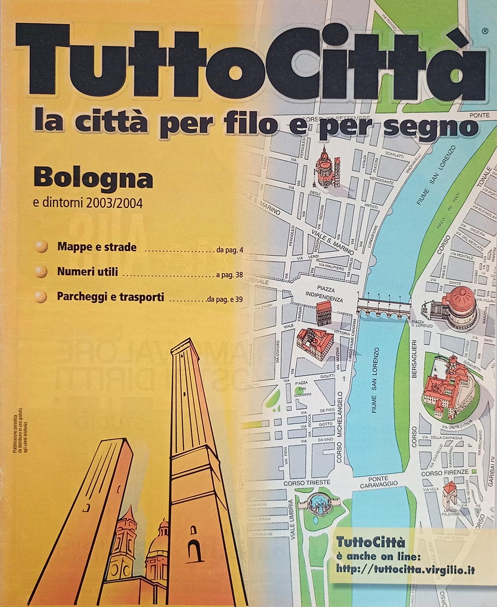</a>
Bologna e dintorni 2003/2004
<ul class="scheda"><li><b>Formato:</b> 226 x 274 mm</li><li><b>Copertina:</b> sottile</li><li><b>Layout:</b> TuttoCittà nuovo millennio ter</li><li><b>Pagine:</b> 54</li><li><b>Mese aggiornamento:</b> ottobre 2003</li></ul></td><td class="fasc vuota"></td><td class="fasc"><a href="../immagini/FE0304.jpg">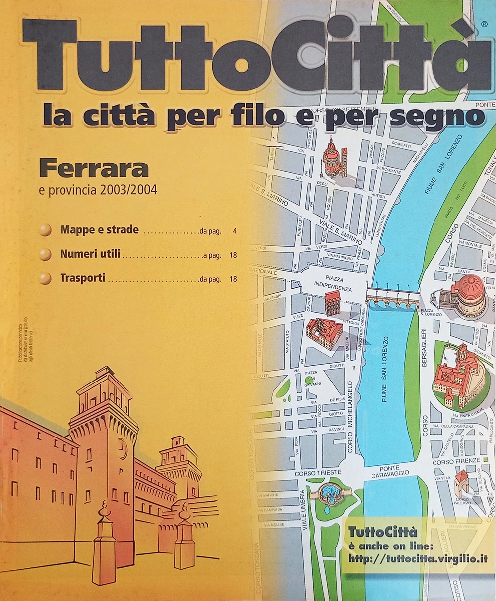</a>
Ferrara 2003/2004
<ul class="scheda"><li><b>Formato:</b> 226 x 274 mm</li><li><b>Copertina:</b> sottile</li><li><b>Layout:</b> TuttoCittà nuovo millennio ter</li><li><b>Pagine:</b> 22 (23)</li><li><b>Mese aggiornamento:</b> giugno 2003</li></ul></td><td class="fasc vuota"></td><td class="fasc vuota"></td><td class="fasc"><a href="../immagini/MO04.jpg">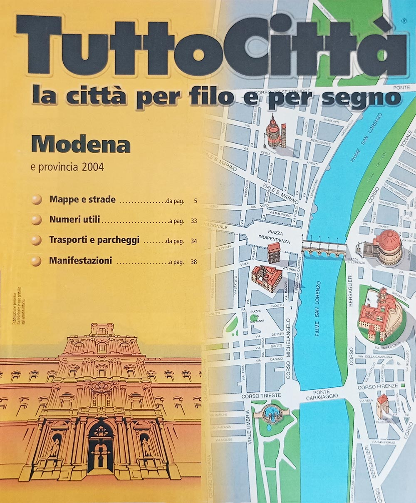</a>
Modena 2004
<ul class="scheda"><li><b>Formato:</b> 226 x 274 mm</li><li><b>Copertina:</b> sottile</li><li><b>Layout:</b> TuttoCittà nuovo millennio ter</li><li><b>Pagine:</b> 46</li><li><b>Mese aggiornamento:</b> dicembre 2003</li></ul></td><td class="fasc sospesa">
Parma ?
<ul class="scheda"><li><b>Formato:</b> 226 x 274 mm</li><li><b>Copertina:</b> sottile</li><li><b>Layout:</b> TuttoCittà nuovo millennio ter</li><li>non in raccolta</li></ul></td><td class="fasc sospesa">
Piacenza ?
<ul class="scheda"><li><b>Formato:</b> 226 x 274 mm</li><li><b>Copertina:</b> sottile</li><li><b>Layout:</b> TuttoCittà nuovo millennio ter</li><li>non in raccolta</li></ul></td><td class="fasc"><a href="../immagini/RE04.jpg">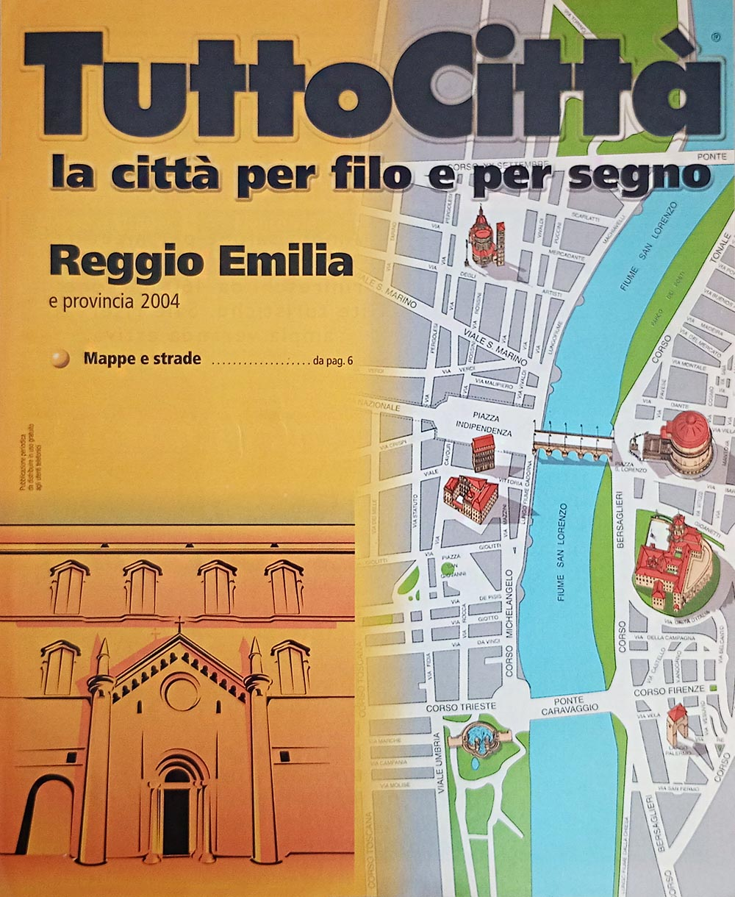</a>
Reggio Emilia 2004
<ul class="scheda"><li><b>Formato:</b> 226 x 274 mm</li><li><b>Copertina:</b> sottile</li><li><b>Layout:</b> TuttoCittà nuovo millennio ter</li><li><b>Pagine:</b> 22 (23)</li><li><b>Mese aggiornamento:</b> dicembre 2003</li></ul></td></tr>
<tr><td class="ann">  04/05</td><td class="tav"></td><td class="fasc"><a href="../immagini/BO04.jpg">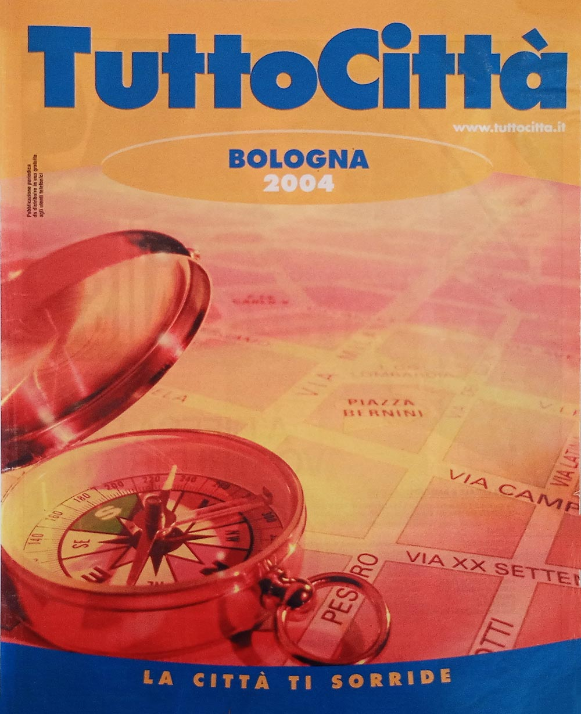</a>
Bologna 2004
<ul class="scheda"><li><b>Formato:</b> 226 x 274 mm</li><li><b>Copertina:</b> sottile</li><li><b>Layout:</b> TuttoCittà metà duemila</li><li><b>Pagine:</b> 54 (55)</li><li><b>Mese aggiornamento:</b> ottobre 2004</li></ul></td><td class="fasc vuota"></td><td class="fasc"><a href="../immagini/FE0405.jpg">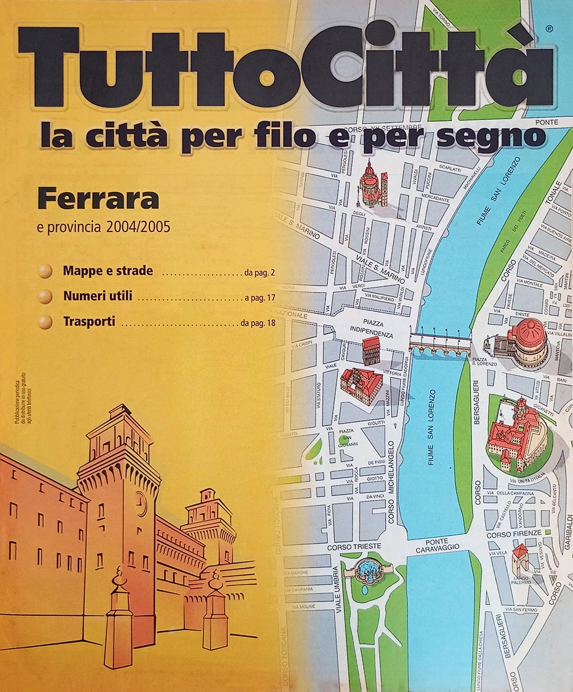</a>
Ferrara 2004/2005
<ul class="scheda"><li><b>Formato:</b> 226 x 274 mm</li><li><b>Copertina:</b> sottile</li><li><b>Layout:</b> TuttoCittà nuovo millennio ter</li><li><b>Pagine:</b> 22 (23)</li><li><b>Mese aggiornamento:</b> giugno 2004</li></ul></td><td class="fasc vuota"></td><td class="fasc vuota"></td><td class="fasc"><a href="../immagini/MO05.jpg">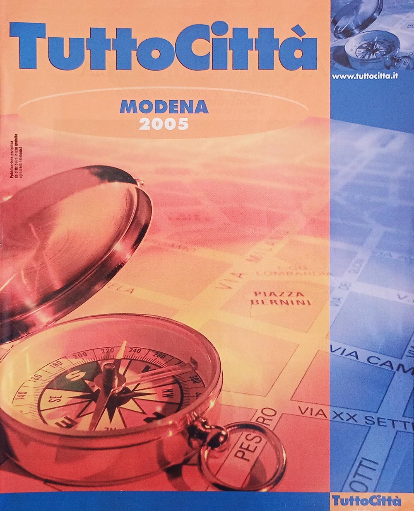</a>
Modena 2005
<ul class="scheda"><li><b>Formato:</b> 226 x 274 mm</li><li><b>Copertina:</b> sottile</li><li><b>Layout:</b> TuttoCittà metà duemila</li><li><b>Pagine:</b> 46</li><li><b>Mese aggiornamento:</b> dicembre 2004</li></ul></td><td class="fasc sospesa">
Parma 2005
<ul class="scheda"><li><b>Formato:</b> 226 x 274 mm</li><li><b>Copertina:</b> sottile</li><li><b>Layout:</b> TuttoCittà metà duemila</li><li>non in raccolta</li></ul></td><td class="fasc sospesa">
Piacenza 2005
<ul class="scheda"><li><b>Formato:</b> 226 x 274 mm</li><li><b>Copertina:</b> sottile</li><li><b>Layout:</b> TuttoCittà metà duemila</li><li>non in raccolta</li></ul></td><td class="fasc"><a href="../immagini/RE05.jpg">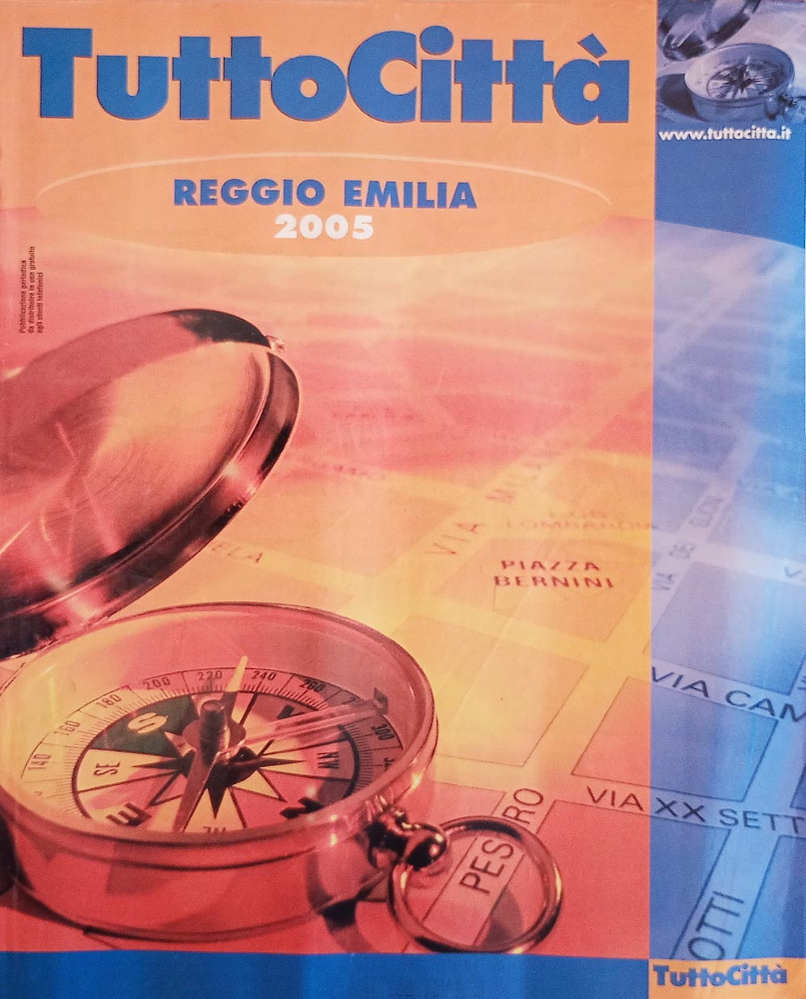</a>
Reggio Emilia 2005
<ul class="scheda"><li><b>Formato:</b> 226 x 274 mm</li><li><b>Copertina:</b> sottile</li><li><b>Layout:</b> TuttoCittà metà duemila</li><li><b>Pagine:</b> 22 (23)</li><li><b>Mese aggiornamento:</b> dicembre 2004</li></ul></td></tr>
<tr><td class="ann"> 05/06</td><td class="tav"></td><td class="fasc"><a href="../immagini/BO05.jpg">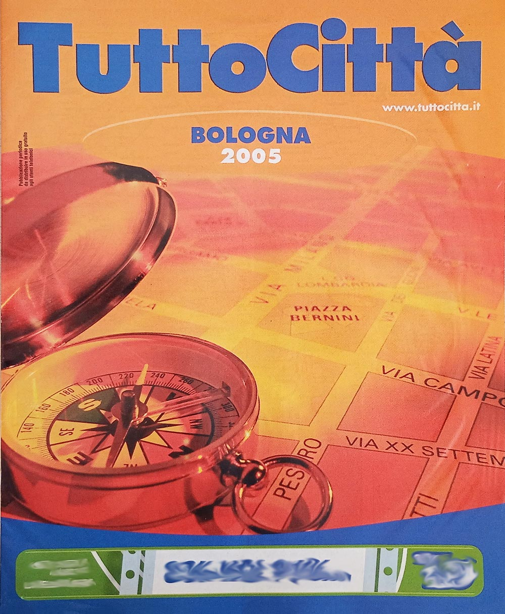</a>
Bologna 2005
<ul class="scheda"><li><b>Formato:</b> 226 x 274 mm</li><li><b>Copertina:</b> sottile</li><li><b>Layout:</b> TuttoCittà metà duemila</li><li><b>Pagine:</b> 54 (55)</li><li><b>Mese aggiornamento:</b> ottobre 2005</li></ul></td><td class="fasc vuota"></td><td class="fasc sospesa">
Ferrara 2005
<ul class="scheda"><li><b>Formato:</b> 226 x 274 mm</li><li><b>Copertina:</b> sottile</li><li><b>Layout:</b> TuttoCittà metà duemila</li><li>non in raccolta</li></ul></td><td class="fasc vuota"></td><td class="fasc vuota"></td><td class="fasc"><a href="../immagini/MO06.jpg">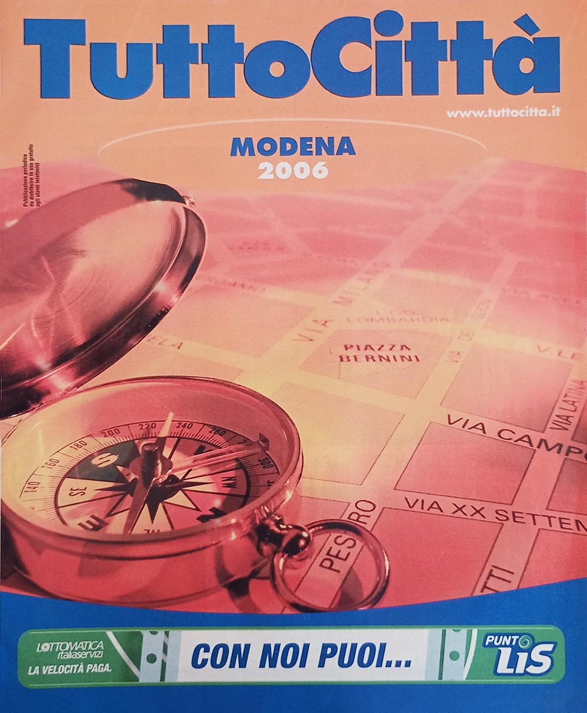</a>
Modena 2006
<ul class="scheda"><li><b>Formato:</b> 226 x 274 mm</li><li><b>Copertina:</b> sottile</li><li><b>Layout:</b> TuttoCittà metà duemila</li><li><b>Pagine:</b> 46</li><li><b>Mese aggiornamento:</b> dicembre 2005</li></ul></td><td class="fasc sospesa">
Parma 2006
<ul class="scheda"><li><b>Formato:</b> 226 x 274 mm</li><li><b>Copertina:</b> sottile</li><li><b>Layout:</b> TuttoCittà metà duemila</li><li>non in raccolta</li></ul></td><td class="fasc sospesa">
Piacenza 2006
<ul class="scheda"><li><b>Formato:</b> 226 x 274 mm</li><li><b>Copertina:</b> sottile</li><li><b>Layout:</b> TuttoCittà metà duemila</li><li>non in raccolta</li></ul></td><td class="fasc"><a href="../immagini/RE06.jpg">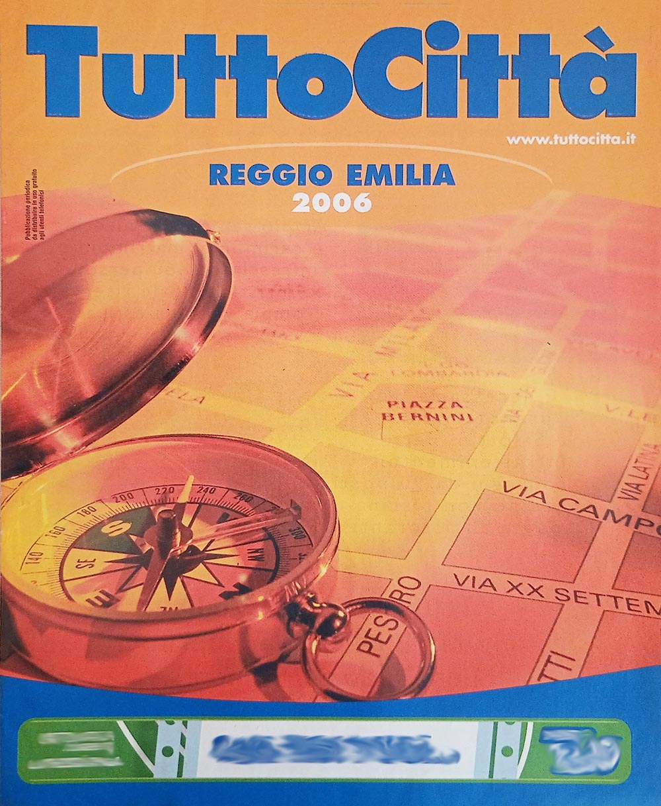</a>
Reggio Emilia 2006
<ul class="scheda"><li><b>Formato:</b> 226 x 274 mm</li><li><b>Copertina:</b> sottile</li><li><b>Layout:</b> TuttoCittà metà duemila</li><li><b>Pagine:</b> 22 (24)</li><li><b>Mese aggiornamento:</b> dicembre 2005</li></ul></td></tr>
<tr><td class="ann"> 06/07</td><td class="tav"></td><td class="fasc"><a href="../immagini/BO06.jpg">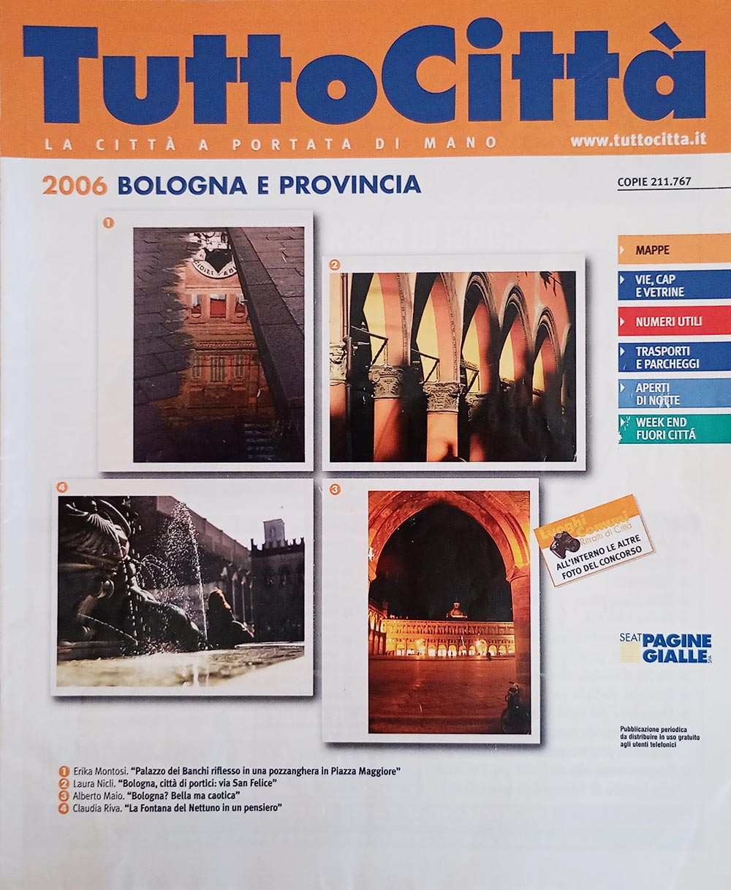</a>
Bologna e dintorni 2006
<ul class="scheda"><li><b>Formato:</b> 226 x 274 mm</li><li><b>Copertina:</b> grossa</li><li><b>Layout:</b> TuttoCittà fine duemila</li><li><b>Pagine:</b> 56</li><li><b>Mese aggiornamento:</b> settembre 2006</li></ul></td><td class="fasc vuota"></td><td class="fasc sospesa">
Ferrara 2006
<ul class="scheda"><li><b>Formato:</b> 226 x 274 mm</li><li><b>Copertina:</b> grossa</li><li><b>Layout:</b> TuttoCittà fine duemila</li><li>non in raccolta</li></ul></td><td class="fasc vuota"></td><td class="fasc vuota"></td><td class="fasc"><a href="../immagini/MO07.jpg">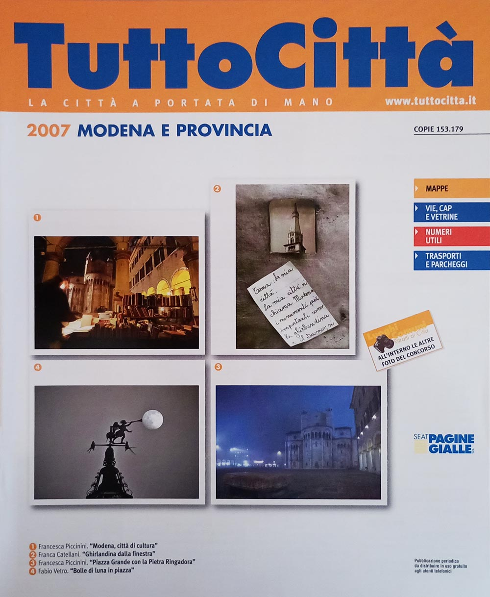</a>
Modena 2007
<ul class="scheda"><li><b>Formato:</b> 226 x 274 mm</li><li><b>Copertina:</b> grossa</li><li><b>Layout:</b> TuttoCittà fine duemila</li><li><b>Pagine:</b> 40</li><li><b>Mese aggiornamento:</b> dicembre 2006</li></ul></td><td class="fasc sospesa">
Parma 2007
<ul class="scheda"><li><b>Formato:</b> 226 x 274 mm</li><li><b>Copertina:</b> grossa</li><li><b>Layout:</b> TuttoCittà fine duemila</li><li>non in raccolta</li></ul></td><td class="fasc sospesa">
Piacenza 2007
<ul class="scheda"><li><b>Formato:</b> 226 x 274 mm</li><li><b>Copertina:</b> grossa</li><li><b>Layout:</b> TuttoCittà fine duemila</li><li>non in raccolta</li></ul></td><td class="fasc sospesa">
Reggio Emilia 2007
<ul class="scheda"><li><b>Formato:</b> 226 x 274 mm</li><li><b>Copertina:</b> grossa</li><li><b>Layout:</b> TuttoCittà fine duemila</li><li>non in raccolta</li></ul></td></tr>
<tr><td class="ann"> 07/08</td><td class="tav"></td><td class="fasc"><a href="../immagini/BO07.jpg">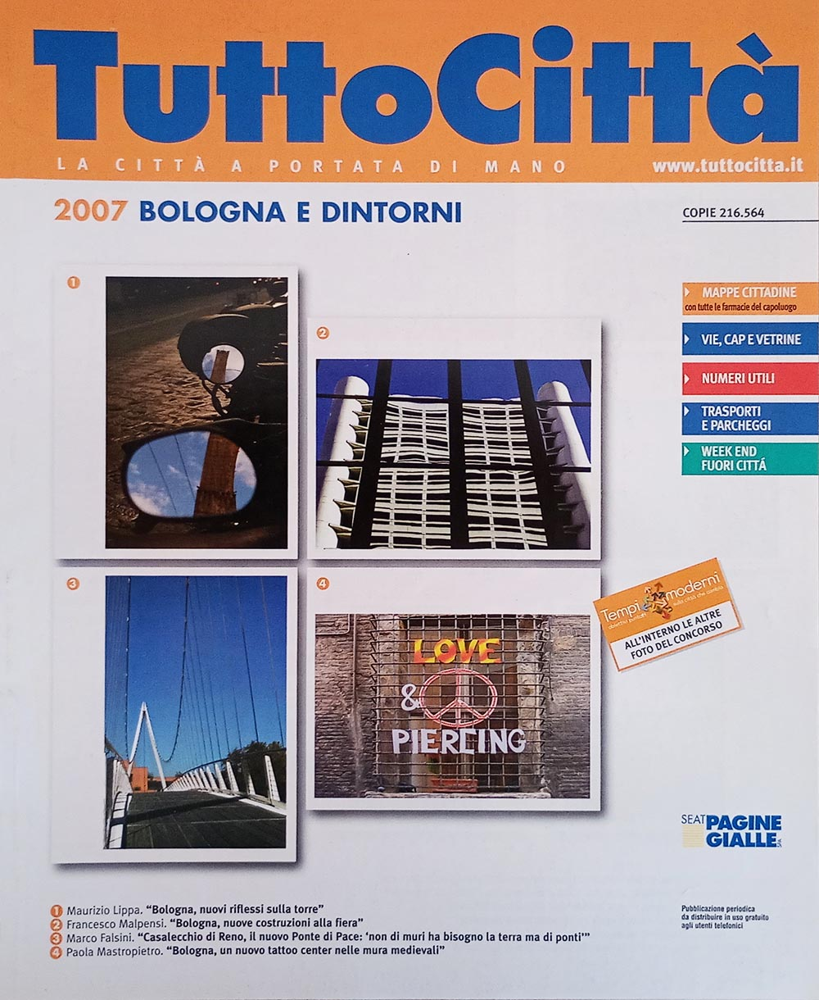</a>
Bologna e dintorni 2007
<ul class="scheda"><li><b>Formato:</b> 226 x 274 mm</li><li><b>Copertina:</b> grossa</li><li><b>Layout:</b> TuttoCittà fine duemila</li><li><b>Pagine:</b> 56</li><li><b>Mese aggiornamento:</b> settembre 2007</li></ul></td><td class="fasc vuota"></td><td class="fasc"><a href="../immagini/FE07.jpg">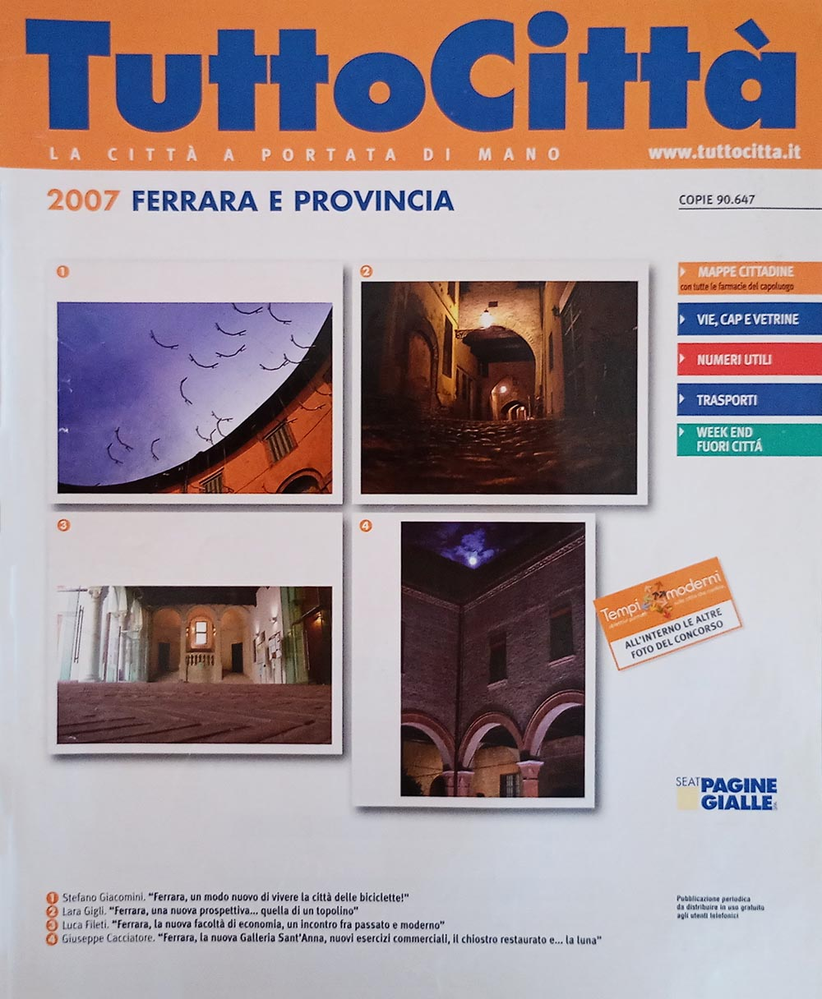</a>
Ferrara 2007
<ul class="scheda"><li><b>Formato:</b> 226 x 274 mm</li><li><b>Copertina:</b> grossa</li><li><b>Layout:</b> TuttoCittà fine duemila</li><li><b>Pagine:</b> 24</li><li><b>Mese aggiornamento:</b> luglio 2007</li></ul></td><td class="fasc vuota"></td><td class="fasc vuota"></td><td class="fasc"><a href="../immagini/MO08.jpg">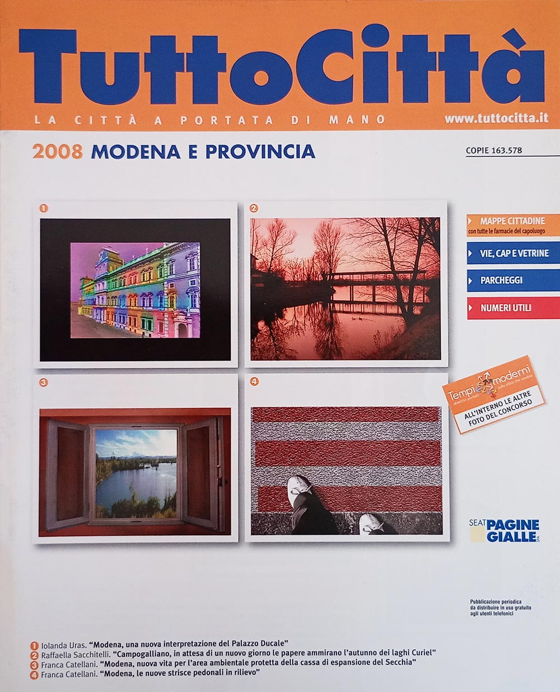</a>
Modena 2008
<ul class="scheda"><li><b>Formato:</b> 226 x 274 mm</li><li><b>Copertina:</b> grossa</li><li><b>Layout:</b> TuttoCittà fine duemila</li><li><b>Pagine:</b> 40</li><li><b>Mese aggiornamento:</b> dicembre 2007</li></ul></td><td class="fasc sospesa">
Parma 2008
<ul class="scheda"><li><b>Formato:</b> 226 x 274 mm</li><li><b>Copertina:</b> grossa</li><li><b>Layout:</b> TuttoCittà fine duemila</li><li>non in raccolta</li></ul></td><td class="fasc sospesa">
Piacenza 2008
<ul class="scheda"><li><b>Formato:</b> 226 x 274 mm</li><li><b>Copertina:</b> grossa</li><li><b>Layout:</b> TuttoCittà fine duemila</li><li>non in raccolta</li></ul></td><td class="fasc"><a href="../immagini/RE08.jpg">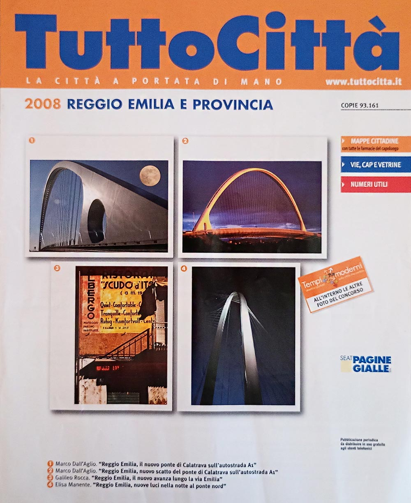</a>
Reggio Emilia 2008
<ul class="scheda"><li><b>Formato:</b> 226 x 274 mm</li><li><b>Copertina:</b> grossa</li><li><b>Layout:</b> TuttoCittà fine duemila</li><li><b>Pagine:</b> 24</li><li><b>Mese aggiornamento:</b> dicembre 2007</li></ul></td></tr>
<tr><td class="ann"> 08/09</td><td class="tav"></td><td class="fasc"><a href="../immagini/BO0809.jpg">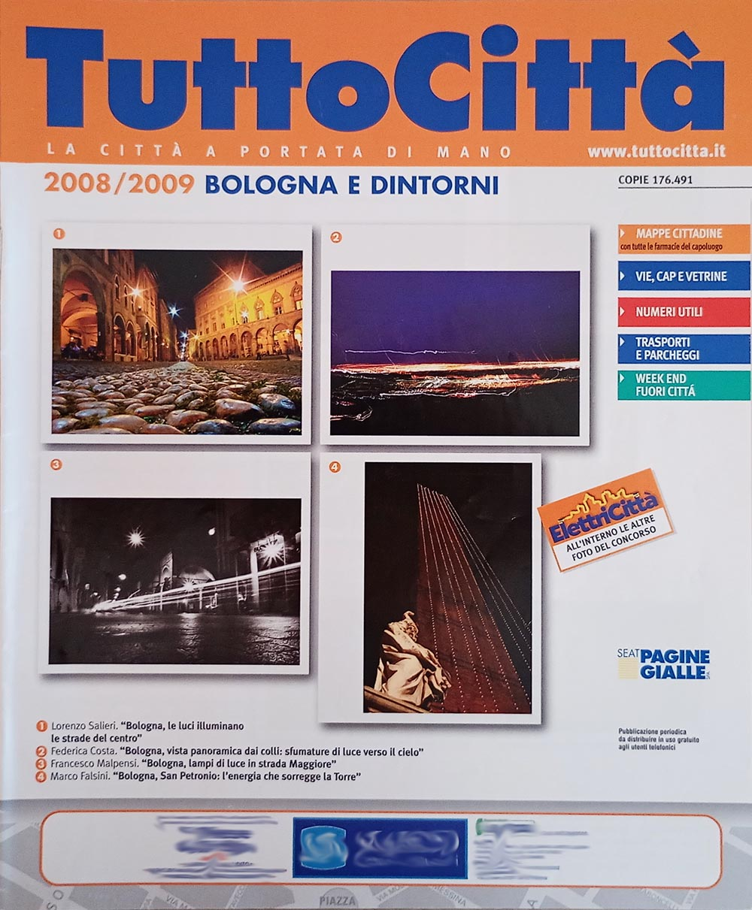</a>
Bologna e dintorni 2008/2009
<ul class="scheda"><li><b>Formato:</b> 226 x 274 mm</li><li><b>Copertina:</b> grossa</li><li><b>Layout:</b> TuttoCittà fine duemila</li><li><b>Pagine:</b> 56</li><li><b>Mese aggiornamento:</b> ottobre 2008</li></ul></td><td class="fasc vuota"></td><td class="fasc"><a href="../immagini/FE0809.jpg">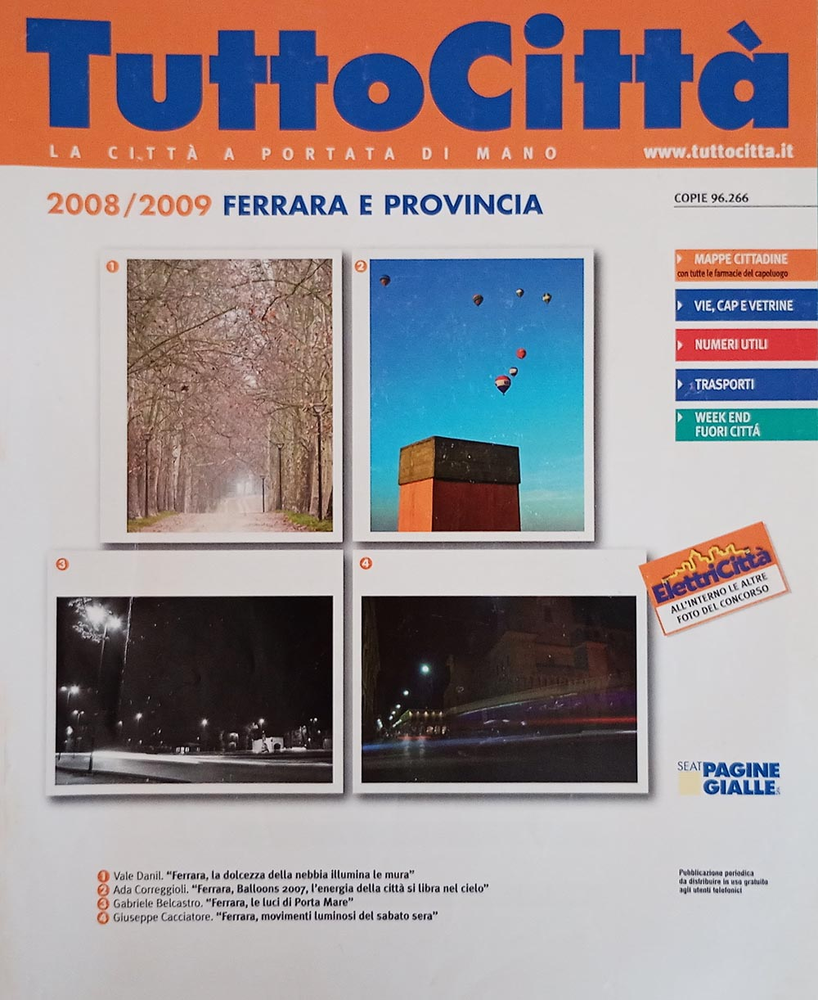</a>
Ferrara 2008/2009
<ul class="scheda"><li><b>Formato:</b> 226 x 274 mm</li><li><b>Copertina:</b> grossa</li><li><b>Layout:</b> TuttoCittà fine duemila</li><li><b>Pagine:</b> 24</li><li><b>Mese aggiornamento:</b> giugno 2008</li></ul></td><td class="fasc vuota"></td><td class="fasc vuota"></td><td class="fasc sospesa">
Modena 2009
<ul class="scheda"><li><b>Formato:</b> 226 x 274 mm</li><li><b>Copertina:</b> grossa</li><li><b>Layout:</b> TuttoCittà fine duemila</li><li>non in raccolta</li></ul></td><td class="fasc"><a href="../immagini/PR09.jpg">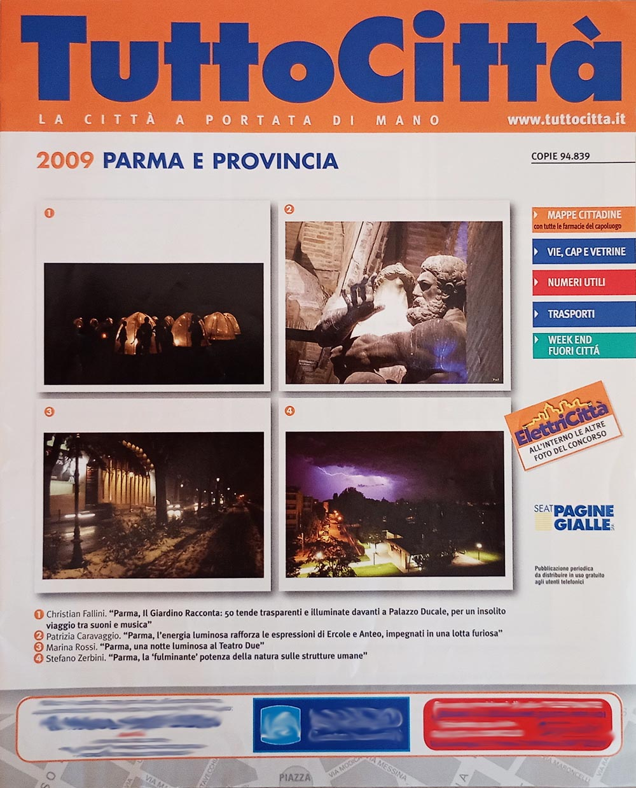</a>
Parma 2009
<ul class="scheda"><li><b>Formato:</b> 226 x 274 mm</li><li><b>Copertina:</b> grossa</li><li><b>Layout:</b> TuttoCittà fine duemila</li><li><b>Pagine:</b> 32</li><li><b>Mese aggiornamento:</b> dicembre 2008</li></ul></td><td class="fasc sospesa">
Piacenza 2009
<ul class="scheda"><li><b>Formato:</b> 226 x 274 mm</li><li><b>Copertina:</b> grossa</li><li><b>Layout:</b> TuttoCittà fine duemila</li><li>non in raccolta</li></ul></td><td class="fasc"><a href="../immagini/RE09.jpg">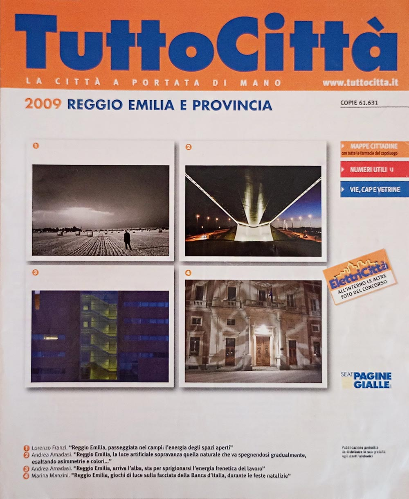</a>
Reggio Emilia 2009
<ul class="scheda"><li><b>Formato:</b> 226 x 274 mm</li><li><b>Copertina:</b> grossa</li><li><b>Layout:</b> TuttoCittà fine duemila</li><li><b>Pagine:</b> 22</li><li><b>Mese aggiornamento:</b> dicembre 2008</li></ul></td></tr>
<tr><td class="ann">  09/10</td><td class="tav"> </td><td class="fasc"><a href="../immagini/BO0910.jpg">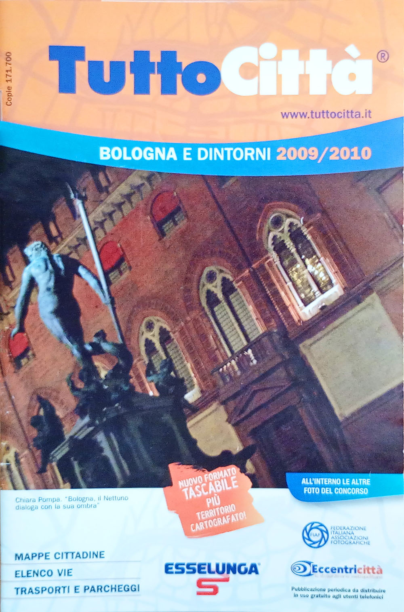</a>
Bologna e dintorni 2009/2010
<ul class="scheda"><li><b>Formato:</b> 140 x 212 mm</li><li><b>Copertina:</b> grossa</li><li><b>Layout:</b> TuttoCittà anni dieci</li><li><b>Pagine:</b> 56</li><li><b>Mese aggiornamento:</b> settembre 2009</li><li><b>Note:</b> riforma cartografica; nuovo formato</li></ul></td><td class="fasc vuota"></td><td class="fasc sospesa">
Ferrara 2009/2010
<ul class="scheda"><li><b>Formato:</b> 226 x 274 mm</li><li><b>Copertina:</b> grossa</li><li><b>Layout:</b> TuttoCittà fine duemila</li><li>non in raccolta</li></ul></td><td class="fasc vuota"></td><td class="fasc vuota"></td><td class="fasc sospesa">
Modena 2010
<ul class="scheda"><li><b>Formato:</b> 140 x 212 mm</li><li><b>Copertina:</b> grossa</li><li><b>Layout:</b> TuttoCittà anni dieci</li><li><b>Note:</b> riforma cartografica; nuovo formato</li><li>non in raccolta</li></ul></td><td class="fasc sospesa">
Parma 2010
<ul class="scheda"><li><b>Formato:</b> 140 x 212 mm</li><li><b>Copertina:</b> grossa</li><li><b>Layout:</b> TuttoCittà anni dieci</li><li><b>Note:</b> riforma cartografica; nuovo formato</li><li>non in raccolta</li></ul></td><td class="fasc sospesa">
Piacenza 2010
<ul class="scheda"><li><b>Formato:</b> 140 x 212 mm</li><li><b>Copertina:</b> grossa</li><li><b>Layout:</b> TuttoCittà anni dieci</li><li><b>Note:</b> riforma cartografica; nuovo formato</li><li>non in raccolta</li></ul></td><td class="fasc"><a href="../immagini/RE10.jpg">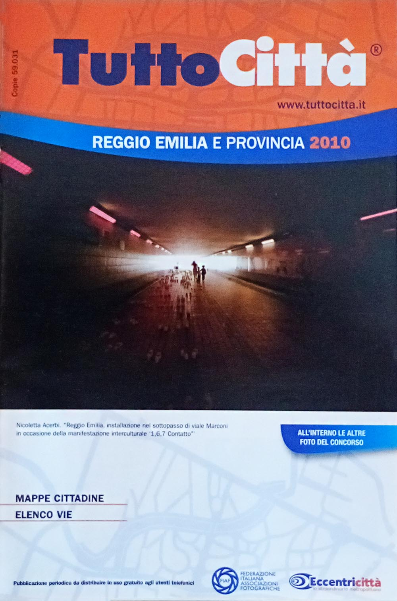</a>
Reggio Emilia 2010
<ul class="scheda"><li><b>Formato:</b> 140 x 212 mm</li><li><b>Copertina:</b> grossa</li><li><b>Layout:</b> TuttoCittà anni dieci</li><li><b>Pagine:</b> 48</li><li><b>Mese aggiornamento:</b> dicembre 2009</li><li><b>Note:</b> riforma cartografica; nuovo formato</li></ul></td></tr>
<tr><td class="ann"> 10/11</td><td class="tav"></td><td class="fasc sospesa">
Bologna e dintorni 2010/2011
<ul class="scheda"><li><b>Formato:</b> 140 x 212 mm</li><li><b>Copertina:</b> grossa</li><li><b>Layout:</b> TuttoCittà anni dieci</li><li>non in raccolta</li></ul></td><td class="fasc vuota"></td><td class="fasc sospesa">
Ferrara 2010/2011
<ul class="scheda"><li><b>Formato:</b> 140 x 212 mm</li><li><b>Copertina:</b> grossa</li><li><b>Layout:</b> TuttoCittà anni dieci</li><li><b>Note:</b> riforma cartografica; nuovo formato</li><li>non in raccolta</li></ul></td><td class="fasc vuota"></td><td class="fasc vuota"></td><td class="fasc sospesa">
Modena ?
<ul class="scheda"><li><b>Formato:</b> 140 x 212 mm</li><li><b>Copertina:</b> grossa</li><li><b>Layout:</b> TuttoCittà anni dieci</li><li>non in raccolta</li></ul></td><td class="fasc sospesa">
Parma ?
<ul class="scheda"><li><b>Formato:</b> 140 x 212 mm</li><li><b>Copertina:</b> grossa</li><li><b>Layout:</b> TuttoCittà anni dieci</li><li>non in raccolta</li></ul></td><td class="fasc sospesa">
Piacenza ?
<ul class="scheda"><li><b>Formato:</b> 140 x 212 mm</li><li><b>Copertina:</b> grossa</li><li><b>Layout:</b> TuttoCittà anni dieci</li><li>non in raccolta</li></ul></td><td class="fasc sospesa">
Reggio Emilia ?
<ul class="scheda"><li><b>Formato:</b> 140 x 212 mm</li><li><b>Copertina:</b> grossa</li><li><b>Layout:</b> TuttoCittà anni dieci</li><li>non in raccolta</li></ul></td></tr>
<tr><td class="ann"> 11/12</td><td class="tav"></td><td class="fasc sospesa">
Bologna 2011/2012
<ul class="scheda"><li><b>Formato:</b> 140 x 212 mm</li><li><b>Copertina:</b> grossa</li><li><b>Layout:</b> TuttoCittà anni dieci</li><li><b>Note:</b> inserto Agenzia del Territorio</li><li>non in raccolta</li></ul></td><td class="fasc vuota"></td><td class="fasc sospesa">
Ferrara 2011/2012
<ul class="scheda"><li><b>Formato:</b> 140 x 212 mm</li><li><b>Copertina:</b> grossa</li><li><b>Layout:</b> TuttoCittà anni dieci</li><li><b>Note:</b> inserto Agenzia del Territorio</li><li>non in raccolta</li></ul></td><td class="fasc vuota"></td><td class="fasc vuota"></td><td class="fasc sospesa">
Modena ?
<ul class="scheda"><li><b>Formato:</b> 140 x 212 mm</li><li><b>Copertina:</b> grossa</li><li><b>Layout:</b> TuttoCittà anni dieci</li><li><b>Note:</b> inserto Agenzia del Territorio</li><li>non in raccolta</li></ul></td><td class="fasc sospesa">
Parma ?
<ul class="scheda"><li><b>Formato:</b> 140 x 212 mm</li><li><b>Copertina:</b> grossa</li><li><b>Layout:</b> TuttoCittà anni dieci</li><li><b>Note:</b> inserto Agenzia del Territorio</li><li>non in raccolta</li></ul></td><td class="fasc sospesa">
Piacenza ?
<ul class="scheda"><li><b>Formato:</b> 140 x 212 mm</li><li><b>Copertina:</b> grossa</li><li><b>Layout:</b> TuttoCittà anni dieci</li><li><b>Note:</b> inserto Agenzia del Territorio</li><li>non in raccolta</li></ul></td><td class="fasc sospesa">
Reggio Emilia ?
<ul class="scheda"><li><b>Formato:</b> 140 x 212 mm</li><li><b>Copertina:</b> grossa</li><li><b>Layout:</b> TuttoCittà anni dieci</li><li><b>Note:</b> inserto Agenzia del Territorio</li><li>non in raccolta</li></ul></td></tr>
<tr><td class="ann"> 12/13</td><td class="tav"></td><td class="fasc"><a href="../immagini/BO1213.jpg">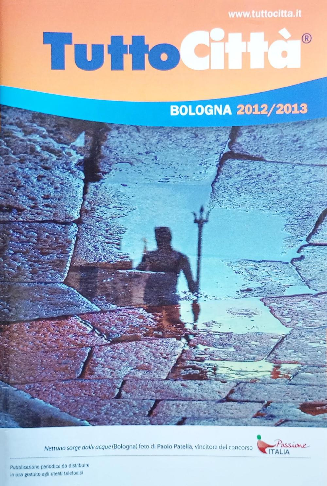</a>
Bologna 2012/2013
<ul class="scheda"><li><b>Formato:</b> 140 x 212 mm</li><li><b>Copertina:</b> grossa</li><li><b>Layout:</b> TuttoCittà anni dieci</li><li><b>Pagine:</b> 48</li><li><b>Mese aggiornamento:</b> luglio 2012</li></ul></td><td class="fasc vuota"></td><td class="fasc"><a href="../immagini/FE1213.jpg">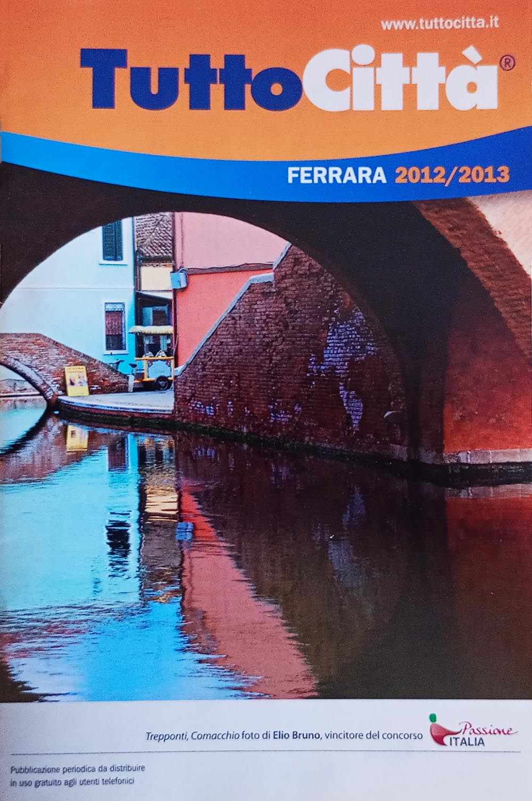</a>
Ferrara 2012/2013
<ul class="scheda"><li><b>Formato:</b> 140 x 212 mm</li><li><b>Copertina:</b> grossa</li><li><b>Layout:</b> TuttoCittà anni dieci</li><li><b>Pagine:</b> 24</li><li><b>Mese aggiornamento:</b> maggio 2012</li></ul></td><td class="fasc vuota"></td><td class="fasc vuota"></td><td class="fasc sospesa">
Modena ?
<ul class="scheda"><li><b>Formato:</b> 140 x 212 mm</li><li><b>Copertina:</b> grossa</li><li><b>Layout:</b> TuttoCittà anni dieci</li><li>non in raccolta</li></ul></td><td class="fasc sospesa">
Parma ?
<ul class="scheda"><li><b>Formato:</b> 140 x 212 mm</li><li><b>Copertina:</b> grossa</li><li><b>Layout:</b> TuttoCittà anni dieci</li><li>non in raccolta</li></ul></td><td class="fasc sospesa">
Piacenza ?
<ul class="scheda"><li><b>Formato:</b> 140 x 212 mm</li><li><b>Copertina:</b> grossa</li><li><b>Layout:</b> TuttoCittà anni dieci</li><li>non in raccolta</li></ul></td><td class="fasc sospesa">
Reggio Emilia ?
<ul class="scheda"><li><b>Formato:</b> 140 x 212 mm</li><li><b>Copertina:</b> grossa</li><li><b>Layout:</b> TuttoCittà anni dieci</li><li>non in raccolta</li></ul></td></tr>
<tr><td class="ann"> 13/14</td><td class="tav"></td><td class="fasc"><a href="../immagini/BO1314.jpg">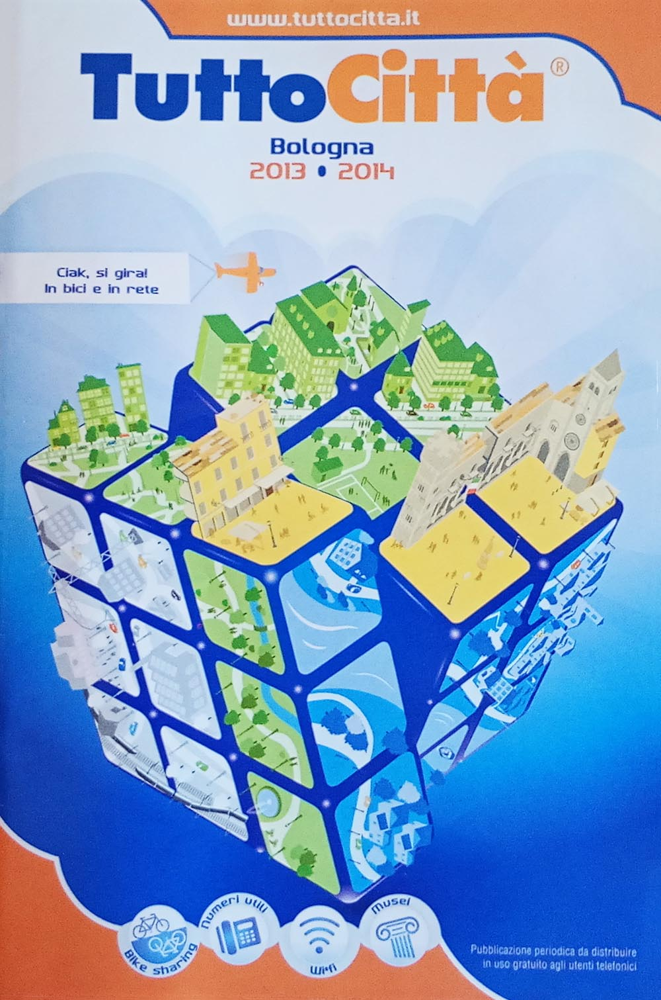</a>
Bologna 2013/2014
<ul class="scheda"><li><b>Formato:</b> 140 x 212 mm</li><li><b>Copertina:</b> grossa</li><li><b>Layout:</b> TuttoCittà anni dieci</li><li><b>Pagine:</b> 48</li><li><b>Mese aggiornamento:</b> luglio 2013</li></ul></td><td class="fasc vuota"></td><td class="fasc"><a href="../immagini/FE1314.jpg">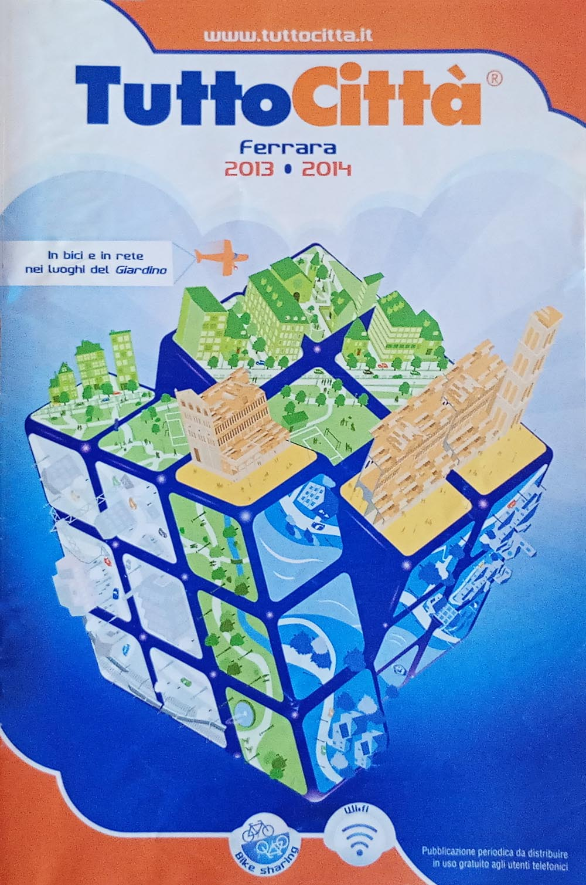</a>
Ferrara 2013/2014
<ul class="scheda"><li><b>Formato:</b> 140 x 212 mm</li><li><b>Copertina:</b> grossa</li><li><b>Layout:</b> TuttoCittà anni dieci</li><li><b>Pagine:</b> 24</li><li><b>Mese aggiornamento:</b> maggio 2013</li></ul></td><td class="fasc vuota"></td><td class="fasc vuota"></td><td class="fasc sospesa">
Modena ?
<ul class="scheda"><li><b>Formato:</b> 140 x 212 mm</li><li><b>Copertina:</b> grossa</li><li><b>Layout:</b> TuttoCittà anni dieci</li><li>non in raccolta</li></ul></td><td class="fasc sospesa">
Parma ?
<ul class="scheda"><li><b>Formato:</b> 140 x 212 mm</li><li><b>Copertina:</b> grossa</li><li><b>Layout:</b> TuttoCittà anni dieci</li><li>non in raccolta</li></ul></td><td class="fasc sospesa">
Piacenza ?
<ul class="scheda"><li><b>Formato:</b> 140 x 212 mm</li><li><b>Copertina:</b> grossa</li><li><b>Layout:</b> TuttoCittà anni dieci</li><li>non in raccolta</li></ul></td><td class="fasc sospesa">
Reggio Emilia ?
<ul class="scheda"><li><b>Formato:</b> 140 x 212 mm</li><li><b>Copertina:</b> grossa</li><li><b>Layout:</b> TuttoCittà anni dieci</li><li>non in raccolta</li></ul></td></tr>
<tr><td class="ann"> 14/15</td><td class="tav"></td><td class="fasc"><a href="../immagini/BO1415.jpg">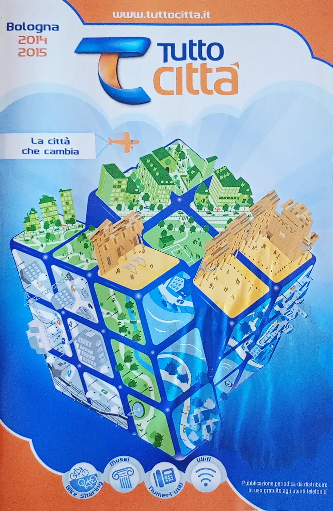</a>
Bologna 2014/2015
<ul class="scheda"><li><b>Formato:</b> 140 x 212 mm</li><li><b>Copertina:</b> grossa</li><li><b>Layout:</b> TuttoCittà anni dieci</li><li><b>Pagine:</b> 48</li><li><b>Mese aggiornamento:</b> luglio 2014</li></ul></td><td class="fasc vuota"></td><td class="fasc sospesa">
Ferrara 2014/2015
<ul class="scheda"><li><b>Formato:</b> 140 x 212 mm</li><li><b>Copertina:</b> grossa</li><li><b>Layout:</b> TuttoCittà anni dieci</li><li>non in raccolta</li></ul></td><td class="fasc vuota"></td><td class="fasc vuota"></td><td class="fasc sospesa">
Modena ?
<ul class="scheda"><li><b>Formato:</b> 140 x 212 mm</li><li><b>Copertina:</b> grossa</li><li><b>Layout:</b> TuttoCittà anni dieci</li><li>non in raccolta</li></ul></td><td class="fasc sospesa">
Parma ?
<ul class="scheda"><li><b>Formato:</b> 140 x 212 mm</li><li><b>Copertina:</b> grossa</li><li><b>Layout:</b> TuttoCittà anni dieci</li><li>non in raccolta</li></ul></td><td class="fasc sospesa">
Piacenza ?
<ul class="scheda"><li><b>Formato:</b> 140 x 212 mm</li><li><b>Copertina:</b> grossa</li><li><b>Layout:</b> TuttoCittà anni dieci</li><li>non in raccolta</li></ul></td><td class="fasc"><a href="../immagini/RE15.jpg">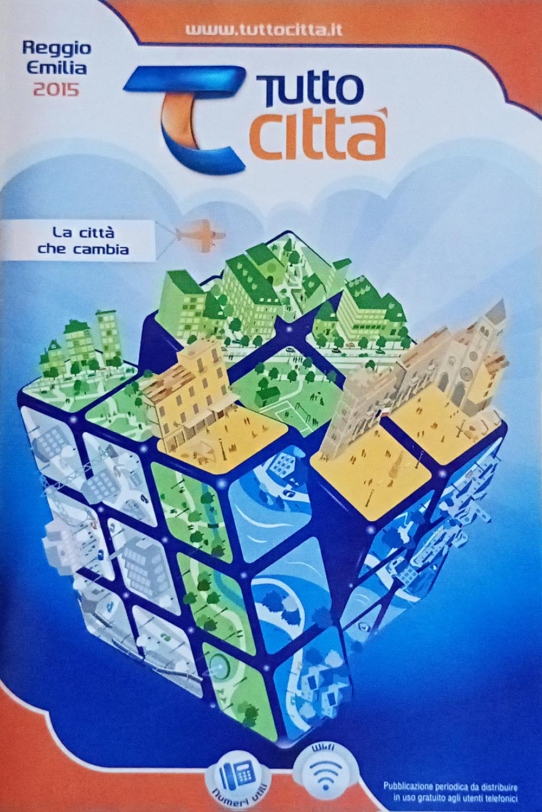</a>
Reggio Emilia 2015
<ul class="scheda"><li><b>Formato:</b> 140 x 212 mm</li><li><b>Copertina:</b> grossa</li><li><b>Layout:</b> TuttoCittà anni dieci</li><li><b>Pagine:</b> 32</li><li><b>Mese aggiornamento:</b> novembre 2014</li></ul></td></tr>
</tbody>
</table>

## Quattordici layout in trentaquattro anni

La seguente tabella censisce i vari layout utilizzati per i fascicoli della regione, secondo il sistema definito durante il censimento osservando l'impaginazione; le loro caratteristiche sono descritte in [questa pagina](tabella-layout.md). Come descritto anche lì, i cambi di layout non rispettano i cambi delle serie di copertina descritte nell'[apposita pagina](copertine.md) di questo sito.

<table class="layout-dettaglio">
<thead><tr><th>Layout</th><th>Annate</th><th>Anni di copertina</th></tr></thead>
<tbody>
<tr><td>Stradario SEAT</td><td class="ann">81/82</td><td class="cop">81<i class="pt"></i>82</td></tr>
<tr><td>Stradario SEAT senza foto</td><td class="ann">82/83 – 84/85</td><td class="cop">82<i class="pt"></i>83<i class="pt"></i>84</td></tr>
<tr><td>TuttoCittà '80 con foto</td><td class="ann">81/82</td><td class="cop">82</td></tr>
<tr><td>TuttoCittà '80 classico</td><td class="ann">82/83 – 89/90</td><td class="cop">82<i class="pt"></i>83<i class="pt"></i>84<i class="pt"></i>85<i class="pt"></i>86<i class="pt"></i>87<i class="pt"></i>88<i class="pt"></i>89<i class="pt"></i>90</td></tr>
<tr><td>TuttoCittà '80 edifici</td><td class="ann">85/86 – 89/90</td><td class="cop">86<i class="pt"></i>87<i class="pt"></i>88<i class="pt"></i>89<i class="pt"></i>90</td></tr>
<tr><td>TuttoCittà '90 classico iniziale</td><td class="ann">90/91 – 91/92</td><td class="cop">91<i class="pt"></i>90/91<i class="pt"></i>92</td></tr>
<tr><td>TuttoCittà '90 classico</td><td class="ann">92/93 – 97/98</td><td class="cop">93<i class="pt"></i>92<i class="pt"></i>94<i class="pt"></i>95<i class="pt"></i>96<i class="pt"></i>97</td></tr>
<tr><td>TuttoCittà '90 riformato</td><td class="ann">97/98 – 98/99</td><td class="cop">98<i class="pt"></i>99</td></tr>
<tr><td>TuttoCittà nuovo millennio</td><td class="ann">99/00</td><td class="cop">99/00</td></tr>
<tr><td>TuttoCittà nuovo millennio bis</td><td class="ann">00/01</td><td class="cop">00/01</td></tr>
<tr><td>TuttoCittà nuovo millennio ter</td><td class="ann">00/01 – 04/05</td><td class="cop">01<i class="pt"></i>00/01<i class="pt"></i>01/02<i class="pt"></i>02<i class="pt"></i>02/03<i class="pt"></i>03<i class="pt"></i>03/04<i class="pt"></i>04<i class="pt"></i>04/05</td></tr>
<tr><td>TuttoCittà metà duemila</td><td class="ann">04/05 – 05/06</td><td class="cop">04<i class="pt"></i>05<i class="pt"></i>06</td></tr>
<tr><td>TuttoCittà fine duemila</td><td class="ann">06/07 – 09/10</td><td class="cop">06<i class="pt"></i>07<i class="pt"></i>08<i class="pt"></i>08/09<i class="pt"></i>09<i class="pt"></i>09/10</td></tr>
<tr><td>TuttoCittà anni dieci</td><td class="ann">09/10 – 14/15</td><td class="cop">09/10<i class="pt"></i>10<i class="pt"></i>10/11<i class="pt"></i>11/12<i class="pt"></i>12/13<i class="pt"></i>13/14<i class="pt"></i>14/15<i class="pt"></i>15</td></tr>
</tbody>
</table>

## Le città cartografate

La seguente tabella censisce tutti i comuni che sono stati cartografati nel corso del tempo e per quante annate. Ad ogni riga corrisponde un comune, in ordine alfabetico e non per provincia: lo scopo è infatti identificare a colpo d'occhio quali comuni entrano ed escono dalla cartografia nel corso degli anni. Gli otto capoluoghi storici — BOLOGNA, FERRARA, FORLÌ, MODENA, PARMA, PIACENZA, RAVENNA, REGGIO EMILIA — sono in maiuscolo, ma restano al loro posto nell'alfabeto.

La croce segna le annate in cui non sappiamo: perché il fascicolo che avrebbe portato quel comune non è in raccolta, perché non è accertato che sia mai esistito, o perché il suo contenuto non è ancora stato spogliato.

Le caselle azzurre indicano invece che il comune era cartografato, ma non compariva nel relativo elenco delle vie, un fenomeno relativamente comune soprattutto nei fascicoli degli anni '80.

Espandi la griglia delle città — 101 città su 34 annate

<table class="griglia">
  <thead><tr><th scope="col">Città</th><th scope="col" class="ann dec">81/82</th><th scope="col" class="ann">82/83</th><th scope="col" class="ann">83/84</th><th scope="col" class="ann">84/85</th><th scope="col" class="ann">85/86</th><th scope="col" class="ann">86/87</th><th scope="col" class="ann">87/88</th><th scope="col" class="ann">88/89</th><th scope="col" class="ann">89/90</th><th scope="col" class="ann dec">90/91</th><th scope="col" class="ann">91/92</th><th scope="col" class="ann">92/93</th><th scope="col" class="ann">93/94</th><th scope="col" class="ann">94/95</th><th scope="col" class="ann">95/96</th><th scope="col" class="ann">96/97</th><th scope="col" class="ann">97/98</th><th scope="col" class="ann">98/99</th><th scope="col" class="ann">99/00</th><th scope="col" class="ann dec">00/01</th><th scope="col" class="ann">01/02</th><th scope="col" class="ann">02/03</th><th scope="col" class="ann">03/04</th><th scope="col" class="ann">04/05</th><th scope="col" class="ann">05/06</th><th scope="col" class="ann">06/07</th><th scope="col" class="ann">07/08</th><th scope="col" class="ann">08/09</th><th scope="col" class="ann">09/10</th><th scope="col" class="ann dec">10/11</th><th scope="col" class="ann">11/12</th><th scope="col" class="ann">12/13</th><th scope="col" class="ann">13/14</th><th scope="col" class="ann">14/15</th></tr></thead>
  <tbody>
  <tr><th scope="row">Argenta</th><td class="ig dec" title="Argenta — 81/82: non accertato, fascicolo mancante">&#215;</td><td class="no" title="Argenta — 82/83"></td><td class="ig" title="Argenta — 83/84: non accertato, fascicolo mancante">&#215;</td><td class="no" title="Argenta — 84/85"></td><td class="no" title="Argenta — 85/86"></td><td class="no" title="Argenta — 86/87"></td><td class="ig" title="Argenta — 87/88: non accertato, fascicolo mancante">&#215;</td><td class="ig" title="Argenta — 88/89: non accertato, fascicolo mancante">&#215;</td><td class="si" title="Argenta — 89/90"></td><td class="si dec" title="Argenta — 90/91"></td><td class="si" title="Argenta — 91/92"></td><td class="si" title="Argenta — 92/93"></td><td class="si" title="Argenta — 93/94"></td><td class="si" title="Argenta — 94/95"></td><td class="si" title="Argenta — 95/96"></td><td class="si" title="Argenta — 96/97"></td><td class="si" title="Argenta — 97/98"></td><td class="si" title="Argenta — 98/99"></td><td class="si" title="Argenta — 99/00"></td><td class="si dec" title="Argenta — 00/01"></td><td class="si" title="Argenta — 01/02"></td><td class="si" title="Argenta — 02/03"></td><td class="si" title="Argenta — 03/04"></td><td class="si" title="Argenta — 04/05"></td><td class="ig" title="Argenta — 05/06: non accertato, fascicolo mancante">&#215;</td><td class="ig" title="Argenta — 06/07: non accertato, fascicolo mancante">&#215;</td><td class="si" title="Argenta — 07/08"></td><td class="si" title="Argenta — 08/09"></td><td class="ig" title="Argenta — 09/10: non accertato, fascicolo mancante">&#215;</td><td class="ig dec" title="Argenta — 10/11: non accertato, fascicolo mancante">&#215;</td><td class="ig" title="Argenta — 11/12: non accertato, fascicolo mancante">&#215;</td><td class="no" title="Argenta — 12/13"></td><td class="si" title="Argenta — 13/14"></td><td class="ig" title="Argenta — 14/15: non accertato, fascicolo mancante">&#215;</td></tr>
  <tr><th scope="row">BOLOGNA</th><td class="si dec" title="Bologna — 81/82"></td><td class="si" title="Bologna — 82/83"></td><td class="si" title="Bologna — 83/84"></td><td class="si" title="Bologna — 84/85"></td><td class="si" title="Bologna — 85/86"></td><td class="si" title="Bologna — 86/87"></td><td class="si" title="Bologna — 87/88"></td><td class="si" title="Bologna — 88/89"></td><td class="si" title="Bologna — 89/90"></td><td class="si dec" title="Bologna — 90/91"></td><td class="si" title="Bologna — 91/92"></td><td class="si" title="Bologna — 92/93"></td><td class="si" title="Bologna — 93/94"></td><td class="si" title="Bologna — 94/95"></td><td class="si" title="Bologna — 95/96"></td><td class="si" title="Bologna — 96/97"></td><td class="si" title="Bologna — 97/98"></td><td class="si" title="Bologna — 98/99"></td><td class="si" title="Bologna — 99/00"></td><td class="si dec" title="Bologna — 00/01"></td><td class="si" title="Bologna — 01/02"></td><td class="si" title="Bologna — 02/03"></td><td class="si" title="Bologna — 03/04"></td><td class="si" title="Bologna — 04/05"></td><td class="si" title="Bologna — 05/06"></td><td class="si" title="Bologna — 06/07"></td><td class="si" title="Bologna — 07/08"></td><td class="si" title="Bologna — 08/09"></td><td class="si" title="Bologna — 09/10"></td><td class="ig dec" title="Bologna — 10/11: non accertato, fascicolo mancante">&#215;</td><td class="ig" title="Bologna — 11/12: non accertato, fascicolo mancante">&#215;</td><td class="si" title="Bologna — 12/13"></td><td class="si" title="Bologna — 13/14"></td><td class="si" title="Bologna — 14/15"></td></tr>
  <tr><th scope="row">Bondeno</th><td class="ig dec" title="Bondeno — 81/82: non accertato, fascicolo mancante">&#215;</td><td class="no" title="Bondeno — 82/83"></td><td class="ig" title="Bondeno — 83/84: non accertato, fascicolo mancante">&#215;</td><td class="no" title="Bondeno — 84/85"></td><td class="no" title="Bondeno — 85/86"></td><td class="no" title="Bondeno — 86/87"></td><td class="ig" title="Bondeno — 87/88: non accertato, fascicolo mancante">&#215;</td><td class="ig" title="Bondeno — 88/89: non accertato, fascicolo mancante">&#215;</td><td class="no" title="Bondeno — 89/90"></td><td class="no dec" title="Bondeno — 90/91"></td><td class="no" title="Bondeno — 91/92"></td><td class="no" title="Bondeno — 92/93"></td><td class="no" title="Bondeno — 93/94"></td><td class="no" title="Bondeno — 94/95"></td><td class="si" title="Bondeno — 95/96"></td><td class="si" title="Bondeno — 96/97"></td><td class="si" title="Bondeno — 97/98"></td><td class="si" title="Bondeno — 98/99"></td><td class="si" title="Bondeno — 99/00"></td><td class="si dec" title="Bondeno — 00/01"></td><td class="si" title="Bondeno — 01/02"></td><td class="si" title="Bondeno — 02/03"></td><td class="si" title="Bondeno — 03/04"></td><td class="si" title="Bondeno — 04/05"></td><td class="ig" title="Bondeno — 05/06: non accertato, fascicolo mancante">&#215;</td><td class="ig" title="Bondeno — 06/07: non accertato, fascicolo mancante">&#215;</td><td class="si" title="Bondeno — 07/08"></td><td class="si" title="Bondeno — 08/09"></td><td class="ig" title="Bondeno — 09/10: non accertato, fascicolo mancante">&#215;</td><td class="ig dec" title="Bondeno — 10/11: non accertato, fascicolo mancante">&#215;</td><td class="ig" title="Bondeno — 11/12: non accertato, fascicolo mancante">&#215;</td><td class="si" title="Bondeno — 12/13"></td><td class="no" title="Bondeno — 13/14"></td><td class="ig" title="Bondeno — 14/15: non accertato, fascicolo mancante">&#215;</td></tr>
  <tr><th scope="row">Borgonovo Val Tidone</th><td class="no dec" title="Borgonovo Val Tidone — 81/82"></td><td class="ig" title="Borgonovo Val Tidone — 82/83: non accertato, fascicolo mancante">&#215;</td><td class="no" title="Borgonovo Val Tidone — 83/84"></td><td class="no" title="Borgonovo Val Tidone — 84/85"></td><td class="ig" title="Borgonovo Val Tidone — 85/86: non accertato, fascicolo mancante">&#215;</td><td class="no" title="Borgonovo Val Tidone — 86/87"></td><td class="no" title="Borgonovo Val Tidone — 87/88"></td><td class="no" title="Borgonovo Val Tidone — 88/89"></td><td class="no" title="Borgonovo Val Tidone — 89/90"></td><td class="no dec" title="Borgonovo Val Tidone — 90/91"></td><td class="ig" title="Borgonovo Val Tidone — 91/92: non accertato, fascicolo mancante">&#215;</td><td class="si" title="Borgonovo Val Tidone — 92/93"></td><td class="ig" title="Borgonovo Val Tidone — 93/94: non accertato, fascicolo mancante">&#215;</td><td class="ig" title="Borgonovo Val Tidone — 94/95: non accertato, fascicolo mancante">&#215;</td><td class="ig" title="Borgonovo Val Tidone — 95/96: non accertato, fascicolo mancante">&#215;</td><td class="ig" title="Borgonovo Val Tidone — 96/97: non accertato, fascicolo mancante">&#215;</td><td class="ig" title="Borgonovo Val Tidone — 97/98: non accertato, fascicolo mancante">&#215;</td><td class="ig" title="Borgonovo Val Tidone — 98/99: non accertato, fascicolo mancante">&#215;</td><td class="si" title="Borgonovo Val Tidone — 99/00"></td><td class="ig dec" title="Borgonovo Val Tidone — 00/01: non accertato, fascicolo mancante">&#215;</td><td class="ig" title="Borgonovo Val Tidone — 01/02: non accertato, fascicolo mancante">&#215;</td><td class="ig" title="Borgonovo Val Tidone — 02/03: non accertato, fascicolo mancante">&#215;</td><td class="ig" title="Borgonovo Val Tidone — 03/04: non accertato, fascicolo mancante">&#215;</td><td class="ig" title="Borgonovo Val Tidone — 04/05: non accertato, fascicolo mancante">&#215;</td><td class="ig" title="Borgonovo Val Tidone — 05/06: non accertato, fascicolo mancante">&#215;</td><td class="ig" title="Borgonovo Val Tidone — 06/07: non accertato, fascicolo mancante">&#215;</td><td class="ig" title="Borgonovo Val Tidone — 07/08: non accertato, fascicolo mancante">&#215;</td><td class="ig" title="Borgonovo Val Tidone — 08/09: non accertato, fascicolo mancante">&#215;</td><td class="ig" title="Borgonovo Val Tidone — 09/10: non accertato, fascicolo mancante">&#215;</td><td class="ig dec" title="Borgonovo Val Tidone — 10/11: non accertato, fascicolo mancante">&#215;</td><td class="ig" title="Borgonovo Val Tidone — 11/12: non accertato, fascicolo mancante">&#215;</td><td class="ig" title="Borgonovo Val Tidone — 12/13: non accertato, fascicolo mancante">&#215;</td><td class="ig" title="Borgonovo Val Tidone — 13/14: non accertato, fascicolo mancante">&#215;</td><td class="ig" title="Borgonovo Val Tidone — 14/15: non accertato, fascicolo mancante">&#215;</td></tr>
  <tr><th scope="row">Budrio</th><td class="no dec" title="Budrio — 81/82"></td><td class="no" title="Budrio — 82/83"></td><td class="no" title="Budrio — 83/84"></td><td class="no" title="Budrio — 84/85"></td><td class="ig" title="Budrio — 85/86: non accertato, fascicolo mancante">&#215;</td><td class="si" title="Budrio — 86/87"></td><td class="si" title="Budrio — 87/88"></td><td class="si" title="Budrio — 88/89"></td><td class="si" title="Budrio — 89/90"></td><td class="si dec" title="Budrio — 90/91"></td><td class="si" title="Budrio — 91/92"></td><td class="si" title="Budrio — 92/93"></td><td class="si" title="Budrio — 93/94"></td><td class="si" title="Budrio — 94/95"></td><td class="si" title="Budrio — 95/96"></td><td class="ig" title="Budrio — 96/97: non accertato, fascicolo mancante">&#215;</td><td class="ig" title="Budrio — 97/98: non accertato, fascicolo mancante">&#215;</td><td class="si" title="Budrio — 98/99"></td><td class="ig" title="Budrio — 99/00: non accertato, fascicolo mancante">&#215;</td><td class="no dec" title="Budrio — 00/01"></td><td class="no" title="Budrio — 01/02"></td><td class="no" title="Budrio — 02/03"></td><td class="no" title="Budrio — 03/04"></td><td class="no" title="Budrio — 04/05"></td><td class="no" title="Budrio — 05/06"></td><td class="no" title="Budrio — 06/07"></td><td class="no" title="Budrio — 07/08"></td><td class="no" title="Budrio — 08/09"></td><td class="no" title="Budrio — 09/10"></td><td class="ig dec" title="Budrio — 10/11: non accertato, fascicolo mancante">&#215;</td><td class="ig" title="Budrio — 11/12: non accertato, fascicolo mancante">&#215;</td><td class="no" title="Budrio — 12/13"></td><td class="no" title="Budrio — 13/14"></td><td class="no" title="Budrio — 14/15"></td></tr>
  <tr><th scope="row">Cadeo</th><td class="no dec" title="Cadeo — 81/82"></td><td class="ig" title="Cadeo — 82/83: non accertato, fascicolo mancante">&#215;</td><td class="no" title="Cadeo — 83/84"></td><td class="no" title="Cadeo — 84/85"></td><td class="ig" title="Cadeo — 85/86: non accertato, fascicolo mancante">&#215;</td><td class="no" title="Cadeo — 86/87"></td><td class="no" title="Cadeo — 87/88"></td><td class="no" title="Cadeo — 88/89"></td><td class="no" title="Cadeo — 89/90"></td><td class="si dec" title="Cadeo — 90/91"></td><td class="ig" title="Cadeo — 91/92: non accertato, fascicolo mancante">&#215;</td><td class="si" title="Cadeo — 92/93"></td><td class="ig" title="Cadeo — 93/94: non accertato, fascicolo mancante">&#215;</td><td class="ig" title="Cadeo — 94/95: non accertato, fascicolo mancante">&#215;</td><td class="ig" title="Cadeo — 95/96: non accertato, fascicolo mancante">&#215;</td><td class="ig" title="Cadeo — 96/97: non accertato, fascicolo mancante">&#215;</td><td class="ig" title="Cadeo — 97/98: non accertato, fascicolo mancante">&#215;</td><td class="ig" title="Cadeo — 98/99: non accertato, fascicolo mancante">&#215;</td><td class="si" title="Cadeo — 99/00"></td><td class="ig dec" title="Cadeo — 00/01: non accertato, fascicolo mancante">&#215;</td><td class="ig" title="Cadeo — 01/02: non accertato, fascicolo mancante">&#215;</td><td class="ig" title="Cadeo — 02/03: non accertato, fascicolo mancante">&#215;</td><td class="ig" title="Cadeo — 03/04: non accertato, fascicolo mancante">&#215;</td><td class="ig" title="Cadeo — 04/05: non accertato, fascicolo mancante">&#215;</td><td class="ig" title="Cadeo — 05/06: non accertato, fascicolo mancante">&#215;</td><td class="ig" title="Cadeo — 06/07: non accertato, fascicolo mancante">&#215;</td><td class="ig" title="Cadeo — 07/08: non accertato, fascicolo mancante">&#215;</td><td class="ig" title="Cadeo — 08/09: non accertato, fascicolo mancante">&#215;</td><td class="ig" title="Cadeo — 09/10: non accertato, fascicolo mancante">&#215;</td><td class="ig dec" title="Cadeo — 10/11: non accertato, fascicolo mancante">&#215;</td><td class="ig" title="Cadeo — 11/12: non accertato, fascicolo mancante">&#215;</td><td class="ig" title="Cadeo — 12/13: non accertato, fascicolo mancante">&#215;</td><td class="ig" title="Cadeo — 13/14: non accertato, fascicolo mancante">&#215;</td><td class="ig" title="Cadeo — 14/15: non accertato, fascicolo mancante">&#215;</td></tr>
  <tr><th scope="row">Calderara di Reno</th><td class="no dec" title="Calderara di Reno — 81/82"></td><td class="no" title="Calderara di Reno — 82/83"></td><td class="no" title="Calderara di Reno — 83/84"></td><td class="no" title="Calderara di Reno — 84/85"></td><td class="ig" title="Calderara di Reno — 85/86: non accertato, fascicolo mancante">&#215;</td><td class="no" title="Calderara di Reno — 86/87"></td><td class="no" title="Calderara di Reno — 87/88"></td><td class="no" title="Calderara di Reno — 88/89"></td><td class="no" title="Calderara di Reno — 89/90"></td><td class="no dec" title="Calderara di Reno — 90/91"></td><td class="no" title="Calderara di Reno — 91/92"></td><td class="si" title="Calderara di Reno — 92/93"></td><td class="si" title="Calderara di Reno — 93/94"></td><td class="si" title="Calderara di Reno — 94/95"></td><td class="si" title="Calderara di Reno — 95/96"></td><td class="si" title="Calderara di Reno — 96/97"></td><td class="si" title="Calderara di Reno — 97/98"></td><td class="si" title="Calderara di Reno — 98/99"></td><td class="si" title="Calderara di Reno — 99/00"></td><td class="si dec" title="Calderara di Reno — 00/01"></td><td class="si" title="Calderara di Reno — 01/02"></td><td class="si" title="Calderara di Reno — 02/03"></td><td class="si" title="Calderara di Reno — 03/04"></td><td class="si" title="Calderara di Reno — 04/05"></td><td class="si" title="Calderara di Reno — 05/06"></td><td class="si" title="Calderara di Reno — 06/07"></td><td class="si" title="Calderara di Reno — 07/08"></td><td class="si" title="Calderara di Reno — 08/09"></td><td class="si" title="Calderara di Reno — 09/10"></td><td class="ig dec" title="Calderara di Reno — 10/11: non accertato, fascicolo mancante">&#215;</td><td class="ig" title="Calderara di Reno — 11/12: non accertato, fascicolo mancante">&#215;</td><td class="si" title="Calderara di Reno — 12/13"></td><td class="no" title="Calderara di Reno — 13/14"></td><td class="no" title="Calderara di Reno — 14/15"></td></tr>
  <tr><th scope="row">Campogalliano</th><td class="no dec" title="Campogalliano — 81/82"></td><td class="no" title="Campogalliano — 82/83"></td><td class="no" title="Campogalliano — 83/84"></td><td class="no" title="Campogalliano — 84/85"></td><td class="no" title="Campogalliano — 85/86"></td><td class="no" title="Campogalliano — 86/87"></td><td class="no" title="Campogalliano — 87/88"></td><td class="no" title="Campogalliano — 88/89"></td><td class="no" title="Campogalliano — 89/90"></td><td class="no dec" title="Campogalliano — 90/91"></td><td class="no" title="Campogalliano — 91/92"></td><td class="no" title="Campogalliano — 92/93"></td><td class="no" title="Campogalliano — 93/94"></td><td class="no" title="Campogalliano — 94/95"></td><td class="no" title="Campogalliano — 95/96"></td><td class="no" title="Campogalliano — 96/97"></td><td class="no" title="Campogalliano — 97/98"></td><td class="no" title="Campogalliano — 98/99"></td><td class="no" title="Campogalliano — 99/00"></td><td class="si dec" title="Campogalliano — 00/01"></td><td class="si" title="Campogalliano — 01/02"></td><td class="si" title="Campogalliano — 02/03"></td><td class="si" title="Campogalliano — 03/04"></td><td class="si" title="Campogalliano — 04/05"></td><td class="si" title="Campogalliano — 05/06"></td><td class="si" title="Campogalliano — 06/07"></td><td class="si" title="Campogalliano — 07/08"></td><td class="ig" title="Campogalliano — 08/09: non accertato, fascicolo mancante">&#215;</td><td class="ig" title="Campogalliano — 09/10: non accertato, fascicolo mancante">&#215;</td><td class="ig dec" title="Campogalliano — 10/11: non accertato, fascicolo mancante">&#215;</td><td class="ig" title="Campogalliano — 11/12: non accertato, fascicolo mancante">&#215;</td><td class="ig" title="Campogalliano — 12/13: non accertato, fascicolo mancante">&#215;</td><td class="ig" title="Campogalliano — 13/14: non accertato, fascicolo mancante">&#215;</td><td class="ig" title="Campogalliano — 14/15: non accertato, fascicolo mancante">&#215;</td></tr>
  <tr><th scope="row">Caorso</th><td class="no dec" title="Caorso — 81/82"></td><td class="ig" title="Caorso — 82/83: non accertato, fascicolo mancante">&#215;</td><td class="no" title="Caorso — 83/84"></td><td class="no" title="Caorso — 84/85"></td><td class="ig" title="Caorso — 85/86: non accertato, fascicolo mancante">&#215;</td><td class="no" title="Caorso — 86/87"></td><td class="no" title="Caorso — 87/88"></td><td class="no" title="Caorso — 88/89"></td><td class="no" title="Caorso — 89/90"></td><td class="no dec" title="Caorso — 90/91"></td><td class="ig" title="Caorso — 91/92: non accertato, fascicolo mancante">&#215;</td><td class="no" title="Caorso — 92/93"></td><td class="ig" title="Caorso — 93/94: non accertato, fascicolo mancante">&#215;</td><td class="ig" title="Caorso — 94/95: non accertato, fascicolo mancante">&#215;</td><td class="ig" title="Caorso — 95/96: non accertato, fascicolo mancante">&#215;</td><td class="ig" title="Caorso — 96/97: non accertato, fascicolo mancante">&#215;</td><td class="ig" title="Caorso — 97/98: non accertato, fascicolo mancante">&#215;</td><td class="ig" title="Caorso — 98/99: non accertato, fascicolo mancante">&#215;</td><td class="si" title="Caorso — 99/00"></td><td class="ig dec" title="Caorso — 00/01: non accertato, fascicolo mancante">&#215;</td><td class="ig" title="Caorso — 01/02: non accertato, fascicolo mancante">&#215;</td><td class="ig" title="Caorso — 02/03: non accertato, fascicolo mancante">&#215;</td><td class="ig" title="Caorso — 03/04: non accertato, fascicolo mancante">&#215;</td><td class="ig" title="Caorso — 04/05: non accertato, fascicolo mancante">&#215;</td><td class="ig" title="Caorso — 05/06: non accertato, fascicolo mancante">&#215;</td><td class="ig" title="Caorso — 06/07: non accertato, fascicolo mancante">&#215;</td><td class="ig" title="Caorso — 07/08: non accertato, fascicolo mancante">&#215;</td><td class="ig" title="Caorso — 08/09: non accertato, fascicolo mancante">&#215;</td><td class="ig" title="Caorso — 09/10: non accertato, fascicolo mancante">&#215;</td><td class="ig dec" title="Caorso — 10/11: non accertato, fascicolo mancante">&#215;</td><td class="ig" title="Caorso — 11/12: non accertato, fascicolo mancante">&#215;</td><td class="ig" title="Caorso — 12/13: non accertato, fascicolo mancante">&#215;</td><td class="ig" title="Caorso — 13/14: non accertato, fascicolo mancante">&#215;</td><td class="ig" title="Caorso — 14/15: non accertato, fascicolo mancante">&#215;</td></tr>
  <tr><th scope="row">Carpaneto Piacentino</th><td class="no dec" title="Carpaneto Piacentino — 81/82"></td><td class="ig" title="Carpaneto Piacentino — 82/83: non accertato, fascicolo mancante">&#215;</td><td class="no" title="Carpaneto Piacentino — 83/84"></td><td class="no" title="Carpaneto Piacentino — 84/85"></td><td class="ig" title="Carpaneto Piacentino — 85/86: non accertato, fascicolo mancante">&#215;</td><td class="no" title="Carpaneto Piacentino — 86/87"></td><td class="no" title="Carpaneto Piacentino — 87/88"></td><td class="no" title="Carpaneto Piacentino — 88/89"></td><td class="no" title="Carpaneto Piacentino — 89/90"></td><td class="no dec" title="Carpaneto Piacentino — 90/91"></td><td class="ig" title="Carpaneto Piacentino — 91/92: non accertato, fascicolo mancante">&#215;</td><td class="si" title="Carpaneto Piacentino — 92/93"></td><td class="ig" title="Carpaneto Piacentino — 93/94: non accertato, fascicolo mancante">&#215;</td><td class="ig" title="Carpaneto Piacentino — 94/95: non accertato, fascicolo mancante">&#215;</td><td class="ig" title="Carpaneto Piacentino — 95/96: non accertato, fascicolo mancante">&#215;</td><td class="ig" title="Carpaneto Piacentino — 96/97: non accertato, fascicolo mancante">&#215;</td><td class="ig" title="Carpaneto Piacentino — 97/98: non accertato, fascicolo mancante">&#215;</td><td class="ig" title="Carpaneto Piacentino — 98/99: non accertato, fascicolo mancante">&#215;</td><td class="si" title="Carpaneto Piacentino — 99/00"></td><td class="ig dec" title="Carpaneto Piacentino — 00/01: non accertato, fascicolo mancante">&#215;</td><td class="ig" title="Carpaneto Piacentino — 01/02: non accertato, fascicolo mancante">&#215;</td><td class="ig" title="Carpaneto Piacentino — 02/03: non accertato, fascicolo mancante">&#215;</td><td class="ig" title="Carpaneto Piacentino — 03/04: non accertato, fascicolo mancante">&#215;</td><td class="ig" title="Carpaneto Piacentino — 04/05: non accertato, fascicolo mancante">&#215;</td><td class="ig" title="Carpaneto Piacentino — 05/06: non accertato, fascicolo mancante">&#215;</td><td class="ig" title="Carpaneto Piacentino — 06/07: non accertato, fascicolo mancante">&#215;</td><td class="ig" title="Carpaneto Piacentino — 07/08: non accertato, fascicolo mancante">&#215;</td><td class="ig" title="Carpaneto Piacentino — 08/09: non accertato, fascicolo mancante">&#215;</td><td class="ig" title="Carpaneto Piacentino — 09/10: non accertato, fascicolo mancante">&#215;</td><td class="ig dec" title="Carpaneto Piacentino — 10/11: non accertato, fascicolo mancante">&#215;</td><td class="ig" title="Carpaneto Piacentino — 11/12: non accertato, fascicolo mancante">&#215;</td><td class="ig" title="Carpaneto Piacentino — 12/13: non accertato, fascicolo mancante">&#215;</td><td class="ig" title="Carpaneto Piacentino — 13/14: non accertato, fascicolo mancante">&#215;</td><td class="ig" title="Carpaneto Piacentino — 14/15: non accertato, fascicolo mancante">&#215;</td></tr>
  <tr><th scope="row">Carpi</th><td class="si dec" title="Carpi — 81/82"></td><td class="si" title="Carpi — 82/83"></td><td class="si" title="Carpi — 83/84"></td><td class="si" title="Carpi — 84/85"></td><td class="si" title="Carpi — 85/86"></td><td class="si" title="Carpi — 86/87"></td><td class="si" title="Carpi — 87/88"></td><td class="si" title="Carpi — 88/89"></td><td class="si" title="Carpi — 89/90"></td><td class="si dec" title="Carpi — 90/91"></td><td class="si" title="Carpi — 91/92"></td><td class="si" title="Carpi — 92/93"></td><td class="si" title="Carpi — 93/94"></td><td class="si" title="Carpi — 94/95"></td><td class="si" title="Carpi — 95/96"></td><td class="si" title="Carpi — 96/97"></td><td class="si" title="Carpi — 97/98"></td><td class="si" title="Carpi — 98/99"></td><td class="si" title="Carpi — 99/00"></td><td class="si dec" title="Carpi — 00/01"></td><td class="si" title="Carpi — 01/02"></td><td class="si" title="Carpi — 02/03"></td><td class="si" title="Carpi — 03/04"></td><td class="si" title="Carpi — 04/05"></td><td class="si" title="Carpi — 05/06"></td><td class="si" title="Carpi — 06/07"></td><td class="si" title="Carpi — 07/08"></td><td class="ig" title="Carpi — 08/09: non accertato, fascicolo mancante">&#215;</td><td class="ig" title="Carpi — 09/10: non accertato, fascicolo mancante">&#215;</td><td class="ig dec" title="Carpi — 10/11: non accertato, fascicolo mancante">&#215;</td><td class="ig" title="Carpi — 11/12: non accertato, fascicolo mancante">&#215;</td><td class="ig" title="Carpi — 12/13: non accertato, fascicolo mancante">&#215;</td><td class="ig" title="Carpi — 13/14: non accertato, fascicolo mancante">&#215;</td><td class="ig" title="Carpi — 14/15: non accertato, fascicolo mancante">&#215;</td></tr>
  <tr><th scope="row">Casalecchio di Reno</th><td class="si dec" title="Casalecchio di Reno — 81/82"></td><td class="si" title="Casalecchio di Reno — 82/83"></td><td class="si" title="Casalecchio di Reno — 83/84"></td><td class="si" title="Casalecchio di Reno — 84/85"></td><td class="si" title="Casalecchio di Reno — 85/86"></td><td class="si" title="Casalecchio di Reno — 86/87"></td><td class="si" title="Casalecchio di Reno — 87/88"></td><td class="si" title="Casalecchio di Reno — 88/89"></td><td class="si" title="Casalecchio di Reno — 89/90"></td><td class="si dec" title="Casalecchio di Reno — 90/91"></td><td class="si" title="Casalecchio di Reno — 91/92"></td><td class="si" title="Casalecchio di Reno — 92/93"></td><td class="si" title="Casalecchio di Reno — 93/94"></td><td class="si" title="Casalecchio di Reno — 94/95"></td><td class="si" title="Casalecchio di Reno — 95/96"></td><td class="si" title="Casalecchio di Reno — 96/97"></td><td class="si" title="Casalecchio di Reno — 97/98"></td><td class="si" title="Casalecchio di Reno — 98/99"></td><td class="si" title="Casalecchio di Reno — 99/00"></td><td class="si dec" title="Casalecchio di Reno — 00/01"></td><td class="si" title="Casalecchio di Reno — 01/02"></td><td class="si" title="Casalecchio di Reno — 02/03"></td><td class="si" title="Casalecchio di Reno — 03/04"></td><td class="si" title="Casalecchio di Reno — 04/05"></td><td class="si" title="Casalecchio di Reno — 05/06"></td><td class="si" title="Casalecchio di Reno — 06/07"></td><td class="si" title="Casalecchio di Reno — 07/08"></td><td class="si" title="Casalecchio di Reno — 08/09"></td><td class="si" title="Casalecchio di Reno — 09/10"></td><td class="ig dec" title="Casalecchio di Reno — 10/11: non accertato, fascicolo mancante">&#215;</td><td class="ig" title="Casalecchio di Reno — 11/12: non accertato, fascicolo mancante">&#215;</td><td class="si" title="Casalecchio di Reno — 12/13"></td><td class="si" title="Casalecchio di Reno — 13/14"></td><td class="si" title="Casalecchio di Reno — 14/15"></td></tr>
  <tr><th scope="row">Casalgrande</th><td class="ig dec" title="Casalgrande — 81/82: non accertato, fascicolo mancante">&#215;</td><td class="ig" title="Casalgrande — 82/83: non accertato, fascicolo mancante">&#215;</td><td class="ig" title="Casalgrande — 83/84: non accertato, fascicolo mancante">&#215;</td><td class="ig" title="Casalgrande — 84/85: non accertato, fascicolo mancante">&#215;</td><td class="ig" title="Casalgrande — 85/86: non accertato, fascicolo mancante">&#215;</td><td class="no" title="Casalgrande — 86/87"></td><td class="no" title="Casalgrande — 87/88"></td><td class="no" title="Casalgrande — 88/89"></td><td class="no" title="Casalgrande — 89/90"></td><td class="no dec" title="Casalgrande — 90/91"></td><td class="no" title="Casalgrande — 91/92"></td><td class="no" title="Casalgrande — 92/93"></td><td class="no" title="Casalgrande — 93/94"></td><td class="ig" title="Casalgrande — 94/95: non accertato, fascicolo mancante">&#215;</td><td class="ig" title="Casalgrande — 95/96: non accertato, fascicolo mancante">&#215;</td><td class="ig" title="Casalgrande — 96/97: non accertato, fascicolo mancante">&#215;</td><td class="si" title="Casalgrande — 97/98"></td><td class="si" title="Casalgrande — 98/99"></td><td class="ig" title="Casalgrande — 99/00: non accertato, fascicolo mancante">&#215;</td><td class="ig dec" title="Casalgrande — 00/01: non accertato, fascicolo mancante">&#215;</td><td class="si" title="Casalgrande — 01/02"></td><td class="ig" title="Casalgrande — 02/03: non accertato, fascicolo mancante">&#215;</td><td class="si" title="Casalgrande — 03/04"></td><td class="si" title="Casalgrande — 04/05"></td><td class="si" title="Casalgrande — 05/06"></td><td class="ig" title="Casalgrande — 06/07: non accertato, fascicolo mancante">&#215;</td><td class="si" title="Casalgrande — 07/08"></td><td class="si" title="Casalgrande — 08/09"></td><td class="si" title="Casalgrande — 09/10"></td><td class="ig dec" title="Casalgrande — 10/11: non accertato, fascicolo mancante">&#215;</td><td class="ig" title="Casalgrande — 11/12: non accertato, fascicolo mancante">&#215;</td><td class="ig" title="Casalgrande — 12/13: non accertato, fascicolo mancante">&#215;</td><td class="ig" title="Casalgrande — 13/14: non accertato, fascicolo mancante">&#215;</td><td class="no" title="Casalgrande — 14/15"></td></tr>
  <tr><th scope="row">Castel Maggiore</th><td class="no dec" title="Castel Maggiore — 81/82"></td><td class="no" title="Castel Maggiore — 82/83"></td><td class="no" title="Castel Maggiore — 83/84"></td><td class="no" title="Castel Maggiore — 84/85"></td><td class="ig" title="Castel Maggiore — 85/86: non accertato, fascicolo mancante">&#215;</td><td class="no" title="Castel Maggiore — 86/87"></td><td class="no" title="Castel Maggiore — 87/88"></td><td class="no" title="Castel Maggiore — 88/89"></td><td class="no" title="Castel Maggiore — 89/90"></td><td class="no dec" title="Castel Maggiore — 90/91"></td><td class="no" title="Castel Maggiore — 91/92"></td><td class="no" title="Castel Maggiore — 92/93"></td><td class="si" title="Castel Maggiore — 93/94"></td><td class="si" title="Castel Maggiore — 94/95"></td><td class="si" title="Castel Maggiore — 95/96"></td><td class="si" title="Castel Maggiore — 96/97"></td><td class="si" title="Castel Maggiore — 97/98"></td><td class="si" title="Castel Maggiore — 98/99"></td><td class="si" title="Castel Maggiore — 99/00"></td><td class="si dec" title="Castel Maggiore — 00/01"></td><td class="si" title="Castel Maggiore — 01/02"></td><td class="si" title="Castel Maggiore — 02/03"></td><td class="si" title="Castel Maggiore — 03/04"></td><td class="si" title="Castel Maggiore — 04/05"></td><td class="si" title="Castel Maggiore — 05/06"></td><td class="si" title="Castel Maggiore — 06/07"></td><td class="si" title="Castel Maggiore — 07/08"></td><td class="si" title="Castel Maggiore — 08/09"></td><td class="si" title="Castel Maggiore — 09/10"></td><td class="ig dec" title="Castel Maggiore — 10/11: non accertato, fascicolo mancante">&#215;</td><td class="ig" title="Castel Maggiore — 11/12: non accertato, fascicolo mancante">&#215;</td><td class="si" title="Castel Maggiore — 12/13"></td><td class="si" title="Castel Maggiore — 13/14"></td><td class="si" title="Castel Maggiore — 14/15"></td></tr>
  <tr><th scope="row">Castel San Giovanni</th><td class="si dec" title="Castel San Giovanni — 81/82"></td><td class="ig" title="Castel San Giovanni — 82/83: non accertato, fascicolo mancante">&#215;</td><td class="si" title="Castel San Giovanni — 83/84"></td><td class="si" title="Castel San Giovanni — 84/85"></td><td class="ig" title="Castel San Giovanni — 85/86: non accertato, fascicolo mancante">&#215;</td><td class="si" title="Castel San Giovanni — 86/87"></td><td class="si" title="Castel San Giovanni — 87/88"></td><td class="si" title="Castel San Giovanni — 88/89"></td><td class="si" title="Castel San Giovanni — 89/90"></td><td class="si dec" title="Castel San Giovanni — 90/91"></td><td class="ig" title="Castel San Giovanni — 91/92: non accertato, fascicolo mancante">&#215;</td><td class="si" title="Castel San Giovanni — 92/93"></td><td class="ig" title="Castel San Giovanni — 93/94: non accertato, fascicolo mancante">&#215;</td><td class="ig" title="Castel San Giovanni — 94/95: non accertato, fascicolo mancante">&#215;</td><td class="ig" title="Castel San Giovanni — 95/96: non accertato, fascicolo mancante">&#215;</td><td class="ig" title="Castel San Giovanni — 96/97: non accertato, fascicolo mancante">&#215;</td><td class="ig" title="Castel San Giovanni — 97/98: non accertato, fascicolo mancante">&#215;</td><td class="ig" title="Castel San Giovanni — 98/99: non accertato, fascicolo mancante">&#215;</td><td class="si" title="Castel San Giovanni — 99/00"></td><td class="ig dec" title="Castel San Giovanni — 00/01: non accertato, fascicolo mancante">&#215;</td><td class="ig" title="Castel San Giovanni — 01/02: non accertato, fascicolo mancante">&#215;</td><td class="ig" title="Castel San Giovanni — 02/03: non accertato, fascicolo mancante">&#215;</td><td class="ig" title="Castel San Giovanni — 03/04: non accertato, fascicolo mancante">&#215;</td><td class="ig" title="Castel San Giovanni — 04/05: non accertato, fascicolo mancante">&#215;</td><td class="ig" title="Castel San Giovanni — 05/06: non accertato, fascicolo mancante">&#215;</td><td class="ig" title="Castel San Giovanni — 06/07: non accertato, fascicolo mancante">&#215;</td><td class="ig" title="Castel San Giovanni — 07/08: non accertato, fascicolo mancante">&#215;</td><td class="ig" title="Castel San Giovanni — 08/09: non accertato, fascicolo mancante">&#215;</td><td class="ig" title="Castel San Giovanni — 09/10: non accertato, fascicolo mancante">&#215;</td><td class="ig dec" title="Castel San Giovanni — 10/11: non accertato, fascicolo mancante">&#215;</td><td class="ig" title="Castel San Giovanni — 11/12: non accertato, fascicolo mancante">&#215;</td><td class="ig" title="Castel San Giovanni — 12/13: non accertato, fascicolo mancante">&#215;</td><td class="ig" title="Castel San Giovanni — 13/14: non accertato, fascicolo mancante">&#215;</td><td class="ig" title="Castel San Giovanni — 14/15: non accertato, fascicolo mancante">&#215;</td></tr>
  <tr><th scope="row">Castel San Pietro Terme</th><td class="no dec" title="Castel San Pietro Terme — 81/82"></td><td class="no" title="Castel San Pietro Terme — 82/83"></td><td class="no" title="Castel San Pietro Terme — 83/84"></td><td class="no" title="Castel San Pietro Terme — 84/85"></td><td class="ig" title="Castel San Pietro Terme — 85/86: non accertato, fascicolo mancante">&#215;</td><td class="si" title="Castel San Pietro Terme — 86/87"></td><td class="si" title="Castel San Pietro Terme — 87/88"></td><td class="si" title="Castel San Pietro Terme — 88/89"></td><td class="si" title="Castel San Pietro Terme — 89/90"></td><td class="si dec" title="Castel San Pietro Terme — 90/91"></td><td class="si" title="Castel San Pietro Terme — 91/92"></td><td class="si" title="Castel San Pietro Terme — 92/93"></td><td class="si" title="Castel San Pietro Terme — 93/94"></td><td class="si" title="Castel San Pietro Terme — 94/95"></td><td class="si" title="Castel San Pietro Terme — 95/96"></td><td class="ig" title="Castel San Pietro Terme — 96/97: non accertato, fascicolo mancante">&#215;</td><td class="ig" title="Castel San Pietro Terme — 97/98: non accertato, fascicolo mancante">&#215;</td><td class="si" title="Castel San Pietro Terme — 98/99"></td><td class="ig" title="Castel San Pietro Terme — 99/00: non accertato, fascicolo mancante">&#215;</td><td class="no dec" title="Castel San Pietro Terme — 00/01"></td><td class="no" title="Castel San Pietro Terme — 01/02"></td><td class="no" title="Castel San Pietro Terme — 02/03"></td><td class="no" title="Castel San Pietro Terme — 03/04"></td><td class="no" title="Castel San Pietro Terme — 04/05"></td><td class="no" title="Castel San Pietro Terme — 05/06"></td><td class="no" title="Castel San Pietro Terme — 06/07"></td><td class="no" title="Castel San Pietro Terme — 07/08"></td><td class="no" title="Castel San Pietro Terme — 08/09"></td><td class="no" title="Castel San Pietro Terme — 09/10"></td><td class="ig dec" title="Castel San Pietro Terme — 10/11: non accertato, fascicolo mancante">&#215;</td><td class="ig" title="Castel San Pietro Terme — 11/12: non accertato, fascicolo mancante">&#215;</td><td class="no" title="Castel San Pietro Terme — 12/13"></td><td class="no" title="Castel San Pietro Terme — 13/14"></td><td class="no" title="Castel San Pietro Terme — 14/15"></td></tr>
  <tr><th scope="row">Castelfranco Emilia</th><td class="no dec" title="Castelfranco Emilia — 81/82"></td><td class="no" title="Castelfranco Emilia — 82/83"></td><td class="no" title="Castelfranco Emilia — 83/84"></td><td class="no" title="Castelfranco Emilia — 84/85"></td><td class="no" title="Castelfranco Emilia — 85/86"></td><td class="no" title="Castelfranco Emilia — 86/87"></td><td class="no" title="Castelfranco Emilia — 87/88"></td><td class="no" title="Castelfranco Emilia — 88/89"></td><td class="no" title="Castelfranco Emilia — 89/90"></td><td class="no dec" title="Castelfranco Emilia — 90/91"></td><td class="no" title="Castelfranco Emilia — 91/92"></td><td class="no" title="Castelfranco Emilia — 92/93"></td><td class="no" title="Castelfranco Emilia — 93/94"></td><td class="no" title="Castelfranco Emilia — 94/95"></td><td class="no" title="Castelfranco Emilia — 95/96"></td><td class="si" title="Castelfranco Emilia — 96/97"></td><td class="si" title="Castelfranco Emilia — 97/98"></td><td class="si" title="Castelfranco Emilia — 98/99"></td><td class="si" title="Castelfranco Emilia — 99/00"></td><td class="si dec" title="Castelfranco Emilia — 00/01"></td><td class="si" title="Castelfranco Emilia — 01/02"></td><td class="si" title="Castelfranco Emilia — 02/03"></td><td class="si" title="Castelfranco Emilia — 03/04"></td><td class="si" title="Castelfranco Emilia — 04/05"></td><td class="si" title="Castelfranco Emilia — 05/06"></td><td class="si" title="Castelfranco Emilia — 06/07"></td><td class="si" title="Castelfranco Emilia — 07/08"></td><td class="ig" title="Castelfranco Emilia — 08/09: non accertato, fascicolo mancante">&#215;</td><td class="ig" title="Castelfranco Emilia — 09/10: non accertato, fascicolo mancante">&#215;</td><td class="ig dec" title="Castelfranco Emilia — 10/11: non accertato, fascicolo mancante">&#215;</td><td class="ig" title="Castelfranco Emilia — 11/12: non accertato, fascicolo mancante">&#215;</td><td class="ig" title="Castelfranco Emilia — 12/13: non accertato, fascicolo mancante">&#215;</td><td class="ig" title="Castelfranco Emilia — 13/14: non accertato, fascicolo mancante">&#215;</td><td class="ig" title="Castelfranco Emilia — 14/15: non accertato, fascicolo mancante">&#215;</td></tr>
  <tr><th scope="row">Castellarano</th><td class="no dec" title="Castellarano — 81/82"></td><td class="no" title="Castellarano — 82/83"></td><td class="no" title="Castellarano — 83/84"></td><td class="no" title="Castellarano — 84/85"></td><td class="no" title="Castellarano — 85/86"></td><td class="ni" title="Castellarano — 86/87: cartografato, ma assente dall'elenco delle vie"></td><td class="si" title="Castellarano — 87/88"></td><td class="si" title="Castellarano — 88/89"></td><td class="si" title="Castellarano — 89/90"></td><td class="no dec" title="Castellarano — 90/91"></td><td class="no" title="Castellarano — 91/92"></td><td class="no" title="Castellarano — 92/93"></td><td class="no" title="Castellarano — 93/94"></td><td class="no" title="Castellarano — 94/95"></td><td class="no" title="Castellarano — 95/96"></td><td class="no" title="Castellarano — 96/97"></td><td class="no" title="Castellarano — 97/98"></td><td class="no" title="Castellarano — 98/99"></td><td class="no" title="Castellarano — 99/00"></td><td class="no dec" title="Castellarano — 00/01"></td><td class="no" title="Castellarano — 01/02"></td><td class="no" title="Castellarano — 02/03"></td><td class="no" title="Castellarano — 03/04"></td><td class="no" title="Castellarano — 04/05"></td><td class="no" title="Castellarano — 05/06"></td><td class="no" title="Castellarano — 06/07"></td><td class="no" title="Castellarano — 07/08"></td><td class="ig" title="Castellarano — 08/09: non accertato, fascicolo mancante">&#215;</td><td class="ig" title="Castellarano — 09/10: non accertato, fascicolo mancante">&#215;</td><td class="ig dec" title="Castellarano — 10/11: non accertato, fascicolo mancante">&#215;</td><td class="ig" title="Castellarano — 11/12: non accertato, fascicolo mancante">&#215;</td><td class="ig" title="Castellarano — 12/13: non accertato, fascicolo mancante">&#215;</td><td class="ig" title="Castellarano — 13/14: non accertato, fascicolo mancante">&#215;</td><td class="ig" title="Castellarano — 14/15: non accertato, fascicolo mancante">&#215;</td></tr>
  <tr><th scope="row">Castell'Arquato</th><td class="no dec" title="Castell'Arquato — 81/82"></td><td class="ig" title="Castell'Arquato — 82/83: non accertato, fascicolo mancante">&#215;</td><td class="no" title="Castell'Arquato — 83/84"></td><td class="no" title="Castell'Arquato — 84/85"></td><td class="ig" title="Castell'Arquato — 85/86: non accertato, fascicolo mancante">&#215;</td><td class="no" title="Castell'Arquato — 86/87"></td><td class="no" title="Castell'Arquato — 87/88"></td><td class="no" title="Castell'Arquato — 88/89"></td><td class="no" title="Castell'Arquato — 89/90"></td><td class="no dec" title="Castell'Arquato — 90/91"></td><td class="ig" title="Castell'Arquato — 91/92: non accertato, fascicolo mancante">&#215;</td><td class="no" title="Castell'Arquato — 92/93"></td><td class="ig" title="Castell'Arquato — 93/94: non accertato, fascicolo mancante">&#215;</td><td class="ig" title="Castell'Arquato — 94/95: non accertato, fascicolo mancante">&#215;</td><td class="ig" title="Castell'Arquato — 95/96: non accertato, fascicolo mancante">&#215;</td><td class="ig" title="Castell'Arquato — 96/97: non accertato, fascicolo mancante">&#215;</td><td class="ig" title="Castell'Arquato — 97/98: non accertato, fascicolo mancante">&#215;</td><td class="ig" title="Castell'Arquato — 98/99: non accertato, fascicolo mancante">&#215;</td><td class="si" title="Castell'Arquato — 99/00"></td><td class="ig dec" title="Castell'Arquato — 00/01: non accertato, fascicolo mancante">&#215;</td><td class="ig" title="Castell'Arquato — 01/02: non accertato, fascicolo mancante">&#215;</td><td class="ig" title="Castell'Arquato — 02/03: non accertato, fascicolo mancante">&#215;</td><td class="ig" title="Castell'Arquato — 03/04: non accertato, fascicolo mancante">&#215;</td><td class="ig" title="Castell'Arquato — 04/05: non accertato, fascicolo mancante">&#215;</td><td class="ig" title="Castell'Arquato — 05/06: non accertato, fascicolo mancante">&#215;</td><td class="ig" title="Castell'Arquato — 06/07: non accertato, fascicolo mancante">&#215;</td><td class="ig" title="Castell'Arquato — 07/08: non accertato, fascicolo mancante">&#215;</td><td class="ig" title="Castell'Arquato — 08/09: non accertato, fascicolo mancante">&#215;</td><td class="ig" title="Castell'Arquato — 09/10: non accertato, fascicolo mancante">&#215;</td><td class="ig dec" title="Castell'Arquato — 10/11: non accertato, fascicolo mancante">&#215;</td><td class="ig" title="Castell'Arquato — 11/12: non accertato, fascicolo mancante">&#215;</td><td class="ig" title="Castell'Arquato — 12/13: non accertato, fascicolo mancante">&#215;</td><td class="ig" title="Castell'Arquato — 13/14: non accertato, fascicolo mancante">&#215;</td><td class="ig" title="Castell'Arquato — 14/15: non accertato, fascicolo mancante">&#215;</td></tr>
  <tr><th scope="row">Castelnovo di Sotto</th><td class="ig dec" title="Castelnovo di Sotto — 81/82: non accertato, fascicolo mancante">&#215;</td><td class="ig" title="Castelnovo di Sotto — 82/83: non accertato, fascicolo mancante">&#215;</td><td class="ig" title="Castelnovo di Sotto — 83/84: non accertato, fascicolo mancante">&#215;</td><td class="ig" title="Castelnovo di Sotto — 84/85: non accertato, fascicolo mancante">&#215;</td><td class="ig" title="Castelnovo di Sotto — 85/86: non accertato, fascicolo mancante">&#215;</td><td class="no" title="Castelnovo di Sotto — 86/87"></td><td class="no" title="Castelnovo di Sotto — 87/88"></td><td class="no" title="Castelnovo di Sotto — 88/89"></td><td class="no" title="Castelnovo di Sotto — 89/90"></td><td class="no dec" title="Castelnovo di Sotto — 90/91"></td><td class="no" title="Castelnovo di Sotto — 91/92"></td><td class="no" title="Castelnovo di Sotto — 92/93"></td><td class="no" title="Castelnovo di Sotto — 93/94"></td><td class="ig" title="Castelnovo di Sotto — 94/95: non accertato, fascicolo mancante">&#215;</td><td class="ig" title="Castelnovo di Sotto — 95/96: non accertato, fascicolo mancante">&#215;</td><td class="ig" title="Castelnovo di Sotto — 96/97: non accertato, fascicolo mancante">&#215;</td><td class="si" title="Castelnovo di Sotto — 97/98"></td><td class="si" title="Castelnovo di Sotto — 98/99"></td><td class="ig" title="Castelnovo di Sotto — 99/00: non accertato, fascicolo mancante">&#215;</td><td class="ig dec" title="Castelnovo di Sotto — 00/01: non accertato, fascicolo mancante">&#215;</td><td class="si" title="Castelnovo di Sotto — 01/02"></td><td class="ig" title="Castelnovo di Sotto — 02/03: non accertato, fascicolo mancante">&#215;</td><td class="si" title="Castelnovo di Sotto — 03/04"></td><td class="si" title="Castelnovo di Sotto — 04/05"></td><td class="si" title="Castelnovo di Sotto — 05/06"></td><td class="ig" title="Castelnovo di Sotto — 06/07: non accertato, fascicolo mancante">&#215;</td><td class="si" title="Castelnovo di Sotto — 07/08"></td><td class="si" title="Castelnovo di Sotto — 08/09"></td><td class="si" title="Castelnovo di Sotto — 09/10"></td><td class="ig dec" title="Castelnovo di Sotto — 10/11: non accertato, fascicolo mancante">&#215;</td><td class="ig" title="Castelnovo di Sotto — 11/12: non accertato, fascicolo mancante">&#215;</td><td class="ig" title="Castelnovo di Sotto — 12/13: non accertato, fascicolo mancante">&#215;</td><td class="ig" title="Castelnovo di Sotto — 13/14: non accertato, fascicolo mancante">&#215;</td><td class="no" title="Castelnovo di Sotto — 14/15"></td></tr>
  <tr><th scope="row">Castelnovo ne' Monti</th><td class="ig dec" title="Castelnovo ne' Monti — 81/82: non accertato, fascicolo mancante">&#215;</td><td class="ig" title="Castelnovo ne' Monti — 82/83: non accertato, fascicolo mancante">&#215;</td><td class="ig" title="Castelnovo ne' Monti — 83/84: non accertato, fascicolo mancante">&#215;</td><td class="ig" title="Castelnovo ne' Monti — 84/85: non accertato, fascicolo mancante">&#215;</td><td class="ig" title="Castelnovo ne' Monti — 85/86: non accertato, fascicolo mancante">&#215;</td><td class="no" title="Castelnovo ne' Monti — 86/87"></td><td class="no" title="Castelnovo ne' Monti — 87/88"></td><td class="no" title="Castelnovo ne' Monti — 88/89"></td><td class="no" title="Castelnovo ne' Monti — 89/90"></td><td class="si dec" title="Castelnovo ne' Monti — 90/91"></td><td class="si" title="Castelnovo ne' Monti — 91/92"></td><td class="si" title="Castelnovo ne' Monti — 92/93"></td><td class="si" title="Castelnovo ne' Monti — 93/94"></td><td class="ig" title="Castelnovo ne' Monti — 94/95: non accertato, fascicolo mancante">&#215;</td><td class="ig" title="Castelnovo ne' Monti — 95/96: non accertato, fascicolo mancante">&#215;</td><td class="ig" title="Castelnovo ne' Monti — 96/97: non accertato, fascicolo mancante">&#215;</td><td class="si" title="Castelnovo ne' Monti — 97/98"></td><td class="si" title="Castelnovo ne' Monti — 98/99"></td><td class="ig" title="Castelnovo ne' Monti — 99/00: non accertato, fascicolo mancante">&#215;</td><td class="ig dec" title="Castelnovo ne' Monti — 00/01: non accertato, fascicolo mancante">&#215;</td><td class="si" title="Castelnovo ne' Monti — 01/02"></td><td class="ig" title="Castelnovo ne' Monti — 02/03: non accertato, fascicolo mancante">&#215;</td><td class="si" title="Castelnovo ne' Monti — 03/04"></td><td class="si" title="Castelnovo ne' Monti — 04/05"></td><td class="si" title="Castelnovo ne' Monti — 05/06"></td><td class="ig" title="Castelnovo ne' Monti — 06/07: non accertato, fascicolo mancante">&#215;</td><td class="si" title="Castelnovo ne' Monti — 07/08"></td><td class="si" title="Castelnovo ne' Monti — 08/09"></td><td class="si" title="Castelnovo ne' Monti — 09/10"></td><td class="ig dec" title="Castelnovo ne' Monti — 10/11: non accertato, fascicolo mancante">&#215;</td><td class="ig" title="Castelnovo ne' Monti — 11/12: non accertato, fascicolo mancante">&#215;</td><td class="ig" title="Castelnovo ne' Monti — 12/13: non accertato, fascicolo mancante">&#215;</td><td class="ig" title="Castelnovo ne' Monti — 13/14: non accertato, fascicolo mancante">&#215;</td><td class="no" title="Castelnovo ne' Monti — 14/15"></td></tr>
  <tr><th scope="row">Castelnuovo Rangone</th><td class="no dec" title="Castelnuovo Rangone — 81/82"></td><td class="no" title="Castelnuovo Rangone — 82/83"></td><td class="no" title="Castelnuovo Rangone — 83/84"></td><td class="no" title="Castelnuovo Rangone — 84/85"></td><td class="ni" title="Castelnuovo Rangone — 85/86: cartografato, ma assente dall'elenco delle vie"></td><td class="si" title="Castelnuovo Rangone — 86/87"></td><td class="si" title="Castelnuovo Rangone — 87/88"></td><td class="si" title="Castelnuovo Rangone — 88/89"></td><td class="si" title="Castelnuovo Rangone — 89/90"></td><td class="si dec" title="Castelnuovo Rangone — 90/91"></td><td class="si" title="Castelnuovo Rangone — 91/92"></td><td class="si" title="Castelnuovo Rangone — 92/93"></td><td class="si" title="Castelnuovo Rangone — 93/94"></td><td class="si" title="Castelnuovo Rangone — 94/95"></td><td class="si" title="Castelnuovo Rangone — 95/96"></td><td class="si" title="Castelnuovo Rangone — 96/97"></td><td class="si" title="Castelnuovo Rangone — 97/98"></td><td class="si" title="Castelnuovo Rangone — 98/99"></td><td class="si" title="Castelnuovo Rangone — 99/00"></td><td class="si dec" title="Castelnuovo Rangone — 00/01"></td><td class="si" title="Castelnuovo Rangone — 01/02"></td><td class="si" title="Castelnuovo Rangone — 02/03"></td><td class="si" title="Castelnuovo Rangone — 03/04"></td><td class="si" title="Castelnuovo Rangone — 04/05"></td><td class="si" title="Castelnuovo Rangone — 05/06"></td><td class="si" title="Castelnuovo Rangone — 06/07"></td><td class="si" title="Castelnuovo Rangone — 07/08"></td><td class="ig" title="Castelnuovo Rangone — 08/09: non accertato, fascicolo mancante">&#215;</td><td class="ig" title="Castelnuovo Rangone — 09/10: non accertato, fascicolo mancante">&#215;</td><td class="ig dec" title="Castelnuovo Rangone — 10/11: non accertato, fascicolo mancante">&#215;</td><td class="ig" title="Castelnuovo Rangone — 11/12: non accertato, fascicolo mancante">&#215;</td><td class="ig" title="Castelnuovo Rangone — 12/13: non accertato, fascicolo mancante">&#215;</td><td class="ig" title="Castelnuovo Rangone — 13/14: non accertato, fascicolo mancante">&#215;</td><td class="ig" title="Castelnuovo Rangone — 14/15: non accertato, fascicolo mancante">&#215;</td></tr>
  <tr><th scope="row">Castenaso</th><td class="no dec" title="Castenaso — 81/82"></td><td class="no" title="Castenaso — 82/83"></td><td class="no" title="Castenaso — 83/84"></td><td class="no" title="Castenaso — 84/85"></td><td class="ig" title="Castenaso — 85/86: non accertato, fascicolo mancante">&#215;</td><td class="no" title="Castenaso — 86/87"></td><td class="no" title="Castenaso — 87/88"></td><td class="no" title="Castenaso — 88/89"></td><td class="no" title="Castenaso — 89/90"></td><td class="no dec" title="Castenaso — 90/91"></td><td class="no" title="Castenaso — 91/92"></td><td class="si" title="Castenaso — 92/93"></td><td class="si" title="Castenaso — 93/94"></td><td class="si" title="Castenaso — 94/95"></td><td class="si" title="Castenaso — 95/96"></td><td class="si" title="Castenaso — 96/97"></td><td class="si" title="Castenaso — 97/98"></td><td class="si" title="Castenaso — 98/99"></td><td class="si" title="Castenaso — 99/00"></td><td class="si dec" title="Castenaso — 00/01"></td><td class="si" title="Castenaso — 01/02"></td><td class="si" title="Castenaso — 02/03"></td><td class="si" title="Castenaso — 03/04"></td><td class="si" title="Castenaso — 04/05"></td><td class="si" title="Castenaso — 05/06"></td><td class="si" title="Castenaso — 06/07"></td><td class="si" title="Castenaso — 07/08"></td><td class="si" title="Castenaso — 08/09"></td><td class="si" title="Castenaso — 09/10"></td><td class="ig dec" title="Castenaso — 10/11: non accertato, fascicolo mancante">&#215;</td><td class="ig" title="Castenaso — 11/12: non accertato, fascicolo mancante">&#215;</td><td class="si" title="Castenaso — 12/13"></td><td class="si" title="Castenaso — 13/14"></td><td class="si" title="Castenaso — 14/15"></td></tr>
  <tr><th scope="row">Cento</th><td class="ig dec" title="Cento — 81/82: non accertato, fascicolo mancante">&#215;</td><td class="si" title="Cento — 82/83"></td><td class="ig" title="Cento — 83/84: non accertato, fascicolo mancante">&#215;</td><td class="si" title="Cento — 84/85"></td><td class="si" title="Cento — 85/86"></td><td class="si" title="Cento — 86/87"></td><td class="ig" title="Cento — 87/88: non accertato, fascicolo mancante">&#215;</td><td class="ig" title="Cento — 88/89: non accertato, fascicolo mancante">&#215;</td><td class="si" title="Cento — 89/90"></td><td class="si dec" title="Cento — 90/91"></td><td class="si" title="Cento — 91/92"></td><td class="si" title="Cento — 92/93"></td><td class="si" title="Cento — 93/94"></td><td class="si" title="Cento — 94/95"></td><td class="si" title="Cento — 95/96"></td><td class="si" title="Cento — 96/97"></td><td class="si" title="Cento — 97/98"></td><td class="si" title="Cento — 98/99"></td><td class="si" title="Cento — 99/00"></td><td class="si dec" title="Cento — 00/01"></td><td class="si" title="Cento — 01/02"></td><td class="si" title="Cento — 02/03"></td><td class="si" title="Cento — 03/04"></td><td class="si" title="Cento — 04/05"></td><td class="ig" title="Cento — 05/06: non accertato, fascicolo mancante">&#215;</td><td class="ig" title="Cento — 06/07: non accertato, fascicolo mancante">&#215;</td><td class="si" title="Cento — 07/08"></td><td class="si" title="Cento — 08/09"></td><td class="ig" title="Cento — 09/10: non accertato, fascicolo mancante">&#215;</td><td class="ig dec" title="Cento — 10/11: non accertato, fascicolo mancante">&#215;</td><td class="ig" title="Cento — 11/12: non accertato, fascicolo mancante">&#215;</td><td class="no" title="Cento — 12/13"></td><td class="no" title="Cento — 13/14"></td><td class="ig" title="Cento — 14/15: non accertato, fascicolo mancante">&#215;</td></tr>
  <tr><th scope="row">Cervia</th><td class="ig dec" title="Cervia — 81/82: non accertato, fascicolo mancante">&#215;</td><td class="ig" title="Cervia — 82/83: non accertato, fascicolo mancante">&#215;</td><td class="si" title="Cervia — 83/84"></td><td class="si" title="Cervia — 84/85"></td><td class="si" title="Cervia — 85/86"></td><td class="si" title="Cervia — 86/87"></td><td class="si" title="Cervia — 87/88"></td><td class="si" title="Cervia — 88/89"></td><td class="si" title="Cervia — 89/90"></td><td class="si dec" title="Cervia — 90/91"></td><td class="si" title="Cervia — 91/92"></td><td class="si" title="Cervia — 92/93"></td><td class="si" title="Cervia — 93/94"></td><td class="si" title="Cervia — 94/95"></td><td class="si" title="Cervia — 95/96"></td><td class="si" title="Cervia — 96/97"></td><td class="si" title="Cervia — 97/98"></td><td class="no" title="Cervia — 98/99"></td><td class="no" title="Cervia — 99/00"></td><td class="no dec" title="Cervia — 00/01"></td><td class="no" title="Cervia — 01/02"></td><td class="no" title="Cervia — 02/03"></td><td class="no" title="Cervia — 03/04"></td><td class="no" title="Cervia — 04/05"></td><td class="no" title="Cervia — 05/06"></td><td class="no" title="Cervia — 06/07"></td><td class="no" title="Cervia — 07/08"></td><td class="no" title="Cervia — 08/09"></td><td class="no" title="Cervia — 09/10"></td><td class="no dec" title="Cervia — 10/11"></td><td class="no" title="Cervia — 11/12"></td><td class="no" title="Cervia — 12/13"></td><td class="no" title="Cervia — 13/14"></td><td class="no" title="Cervia — 14/15"></td></tr>
  <tr><th scope="row">Cesena</th><td class="ig dec" title="Cesena — 81/82: non accertato, fascicolo mancante">&#215;</td><td class="ig" title="Cesena — 82/83: non accertato, fascicolo mancante">&#215;</td><td class="si" title="Cesena — 83/84"></td><td class="si" title="Cesena — 84/85"></td><td class="si" title="Cesena — 85/86"></td><td class="si" title="Cesena — 86/87"></td><td class="si" title="Cesena — 87/88"></td><td class="si" title="Cesena — 88/89"></td><td class="si" title="Cesena — 89/90"></td><td class="si dec" title="Cesena — 90/91"></td><td class="si" title="Cesena — 91/92"></td><td class="si" title="Cesena — 92/93"></td><td class="si" title="Cesena — 93/94"></td><td class="si" title="Cesena — 94/95"></td><td class="si" title="Cesena — 95/96"></td><td class="ig" title="Cesena — 96/97: non accertato, fascicolo mancante">&#215;</td><td class="ig" title="Cesena — 97/98: non accertato, fascicolo mancante">&#215;</td><td class="no" title="Cesena — 98/99"></td><td class="no" title="Cesena — 99/00"></td><td class="no dec" title="Cesena — 00/01"></td><td class="no" title="Cesena — 01/02"></td><td class="no" title="Cesena — 02/03"></td><td class="no" title="Cesena — 03/04"></td><td class="no" title="Cesena — 04/05"></td><td class="no" title="Cesena — 05/06"></td><td class="no" title="Cesena — 06/07"></td><td class="no" title="Cesena — 07/08"></td><td class="no" title="Cesena — 08/09"></td><td class="no" title="Cesena — 09/10"></td><td class="no dec" title="Cesena — 10/11"></td><td class="no" title="Cesena — 11/12"></td><td class="no" title="Cesena — 12/13"></td><td class="no" title="Cesena — 13/14"></td><td class="no" title="Cesena — 14/15"></td></tr>
  <tr><th scope="row">Cesenatico</th><td class="ig dec" title="Cesenatico — 81/82: non accertato, fascicolo mancante">&#215;</td><td class="ig" title="Cesenatico — 82/83: non accertato, fascicolo mancante">&#215;</td><td class="si" title="Cesenatico — 83/84"></td><td class="ni" title="Cesenatico — 84/85: cartografato, ma assente dall'elenco delle vie"></td><td class="ni" title="Cesenatico — 85/86: cartografato, ma assente dall'elenco delle vie"></td><td class="no" title="Cesenatico — 86/87"></td><td class="no" title="Cesenatico — 87/88"></td><td class="no" title="Cesenatico — 88/89"></td><td class="no" title="Cesenatico — 89/90"></td><td class="no dec" title="Cesenatico — 90/91"></td><td class="no" title="Cesenatico — 91/92"></td><td class="no" title="Cesenatico — 92/93"></td><td class="si" title="Cesenatico — 93/94"></td><td class="si" title="Cesenatico — 94/95"></td><td class="si" title="Cesenatico — 95/96"></td><td class="ig" title="Cesenatico — 96/97: non accertato, fascicolo mancante">&#215;</td><td class="ig" title="Cesenatico — 97/98: non accertato, fascicolo mancante">&#215;</td><td class="no" title="Cesenatico — 98/99"></td><td class="no" title="Cesenatico — 99/00"></td><td class="no dec" title="Cesenatico — 00/01"></td><td class="no" title="Cesenatico — 01/02"></td><td class="no" title="Cesenatico — 02/03"></td><td class="no" title="Cesenatico — 03/04"></td><td class="no" title="Cesenatico — 04/05"></td><td class="no" title="Cesenatico — 05/06"></td><td class="no" title="Cesenatico — 06/07"></td><td class="no" title="Cesenatico — 07/08"></td><td class="no" title="Cesenatico — 08/09"></td><td class="no" title="Cesenatico — 09/10"></td><td class="no dec" title="Cesenatico — 10/11"></td><td class="no" title="Cesenatico — 11/12"></td><td class="no" title="Cesenatico — 12/13"></td><td class="no" title="Cesenatico — 13/14"></td><td class="no" title="Cesenatico — 14/15"></td></tr>
  <tr><th scope="row">Codigoro</th><td class="ig dec" title="Codigoro — 81/82: non accertato, fascicolo mancante">&#215;</td><td class="no" title="Codigoro — 82/83"></td><td class="ig" title="Codigoro — 83/84: non accertato, fascicolo mancante">&#215;</td><td class="no" title="Codigoro — 84/85"></td><td class="no" title="Codigoro — 85/86"></td><td class="no" title="Codigoro — 86/87"></td><td class="ig" title="Codigoro — 87/88: non accertato, fascicolo mancante">&#215;</td><td class="ig" title="Codigoro — 88/89: non accertato, fascicolo mancante">&#215;</td><td class="si" title="Codigoro — 89/90"></td><td class="si dec" title="Codigoro — 90/91"></td><td class="si" title="Codigoro — 91/92"></td><td class="si" title="Codigoro — 92/93"></td><td class="si" title="Codigoro — 93/94"></td><td class="si" title="Codigoro — 94/95"></td><td class="si" title="Codigoro — 95/96"></td><td class="si" title="Codigoro — 96/97"></td><td class="si" title="Codigoro — 97/98"></td><td class="si" title="Codigoro — 98/99"></td><td class="si" title="Codigoro — 99/00"></td><td class="si dec" title="Codigoro — 00/01"></td><td class="si" title="Codigoro — 01/02"></td><td class="si" title="Codigoro — 02/03"></td><td class="si" title="Codigoro — 03/04"></td><td class="si" title="Codigoro — 04/05"></td><td class="ig" title="Codigoro — 05/06: non accertato, fascicolo mancante">&#215;</td><td class="ig" title="Codigoro — 06/07: non accertato, fascicolo mancante">&#215;</td><td class="si" title="Codigoro — 07/08"></td><td class="si" title="Codigoro — 08/09"></td><td class="ig" title="Codigoro — 09/10: non accertato, fascicolo mancante">&#215;</td><td class="ig dec" title="Codigoro — 10/11: non accertato, fascicolo mancante">&#215;</td><td class="ig" title="Codigoro — 11/12: non accertato, fascicolo mancante">&#215;</td><td class="si" title="Codigoro — 12/13"></td><td class="no" title="Codigoro — 13/14"></td><td class="ig" title="Codigoro — 14/15: non accertato, fascicolo mancante">&#215;</td></tr>
  <tr><th scope="row">Collecchio</th><td class="ig dec" title="Collecchio — 81/82: non accertato, fascicolo mancante">&#215;</td><td class="ig" title="Collecchio — 82/83: non accertato, fascicolo mancante">&#215;</td><td class="ig" title="Collecchio — 83/84: non accertato, fascicolo mancante">&#215;</td><td class="ig" title="Collecchio — 84/85: non accertato, fascicolo mancante">&#215;</td><td class="si" title="Collecchio — 85/86"></td><td class="ni" title="Collecchio — 86/87: cartografato, ma assente dall'elenco delle vie"></td><td class="ni" title="Collecchio — 87/88: cartografato, ma assente dall'elenco delle vie"></td><td class="ni" title="Collecchio — 88/89: cartografato, ma assente dall'elenco delle vie"></td><td class="ni" title="Collecchio — 89/90: cartografato, ma assente dall'elenco delle vie"></td><td class="si dec" title="Collecchio — 90/91"></td><td class="si" title="Collecchio — 91/92"></td><td class="si" title="Collecchio — 92/93"></td><td class="si" title="Collecchio — 93/94"></td><td class="si" title="Collecchio — 94/95"></td><td class="ig" title="Collecchio — 95/96: non accertato, fascicolo mancante">&#215;</td><td class="ig" title="Collecchio — 96/97: non accertato, fascicolo mancante">&#215;</td><td class="si" title="Collecchio — 97/98"></td><td class="si" title="Collecchio — 98/99"></td><td class="si" title="Collecchio — 99/00"></td><td class="ig dec" title="Collecchio — 00/01: non accertato, fascicolo mancante">&#215;</td><td class="ig" title="Collecchio — 01/02: non accertato, fascicolo mancante">&#215;</td><td class="ig" title="Collecchio — 02/03: non accertato, fascicolo mancante">&#215;</td><td class="ig" title="Collecchio — 03/04: non accertato, fascicolo mancante">&#215;</td><td class="ig" title="Collecchio — 04/05: non accertato, fascicolo mancante">&#215;</td><td class="ig" title="Collecchio — 05/06: non accertato, fascicolo mancante">&#215;</td><td class="ig" title="Collecchio — 06/07: non accertato, fascicolo mancante">&#215;</td><td class="ig" title="Collecchio — 07/08: non accertato, fascicolo mancante">&#215;</td><td class="si" title="Collecchio — 08/09"></td><td class="ig" title="Collecchio — 09/10: non accertato, fascicolo mancante">&#215;</td><td class="ig dec" title="Collecchio — 10/11: non accertato, fascicolo mancante">&#215;</td><td class="ig" title="Collecchio — 11/12: non accertato, fascicolo mancante">&#215;</td><td class="ig" title="Collecchio — 12/13: non accertato, fascicolo mancante">&#215;</td><td class="ig" title="Collecchio — 13/14: non accertato, fascicolo mancante">&#215;</td><td class="ig" title="Collecchio — 14/15: non accertato, fascicolo mancante">&#215;</td></tr>
  <tr><th scope="row">Colorno</th><td class="ig dec" title="Colorno — 81/82: non accertato, fascicolo mancante">&#215;</td><td class="ig" title="Colorno — 82/83: non accertato, fascicolo mancante">&#215;</td><td class="ig" title="Colorno — 83/84: non accertato, fascicolo mancante">&#215;</td><td class="ig" title="Colorno — 84/85: non accertato, fascicolo mancante">&#215;</td><td class="no" title="Colorno — 85/86"></td><td class="no" title="Colorno — 86/87"></td><td class="no" title="Colorno — 87/88"></td><td class="no" title="Colorno — 88/89"></td><td class="no" title="Colorno — 89/90"></td><td class="no dec" title="Colorno — 90/91"></td><td class="no" title="Colorno — 91/92"></td><td class="si" title="Colorno — 92/93"></td><td class="si" title="Colorno — 93/94"></td><td class="si" title="Colorno — 94/95"></td><td class="ig" title="Colorno — 95/96: non accertato, fascicolo mancante">&#215;</td><td class="ig" title="Colorno — 96/97: non accertato, fascicolo mancante">&#215;</td><td class="si" title="Colorno — 97/98"></td><td class="si" title="Colorno — 98/99"></td><td class="si" title="Colorno — 99/00"></td><td class="ig dec" title="Colorno — 00/01: non accertato, fascicolo mancante">&#215;</td><td class="ig" title="Colorno — 01/02: non accertato, fascicolo mancante">&#215;</td><td class="ig" title="Colorno — 02/03: non accertato, fascicolo mancante">&#215;</td><td class="ig" title="Colorno — 03/04: non accertato, fascicolo mancante">&#215;</td><td class="ig" title="Colorno — 04/05: non accertato, fascicolo mancante">&#215;</td><td class="ig" title="Colorno — 05/06: non accertato, fascicolo mancante">&#215;</td><td class="ig" title="Colorno — 06/07: non accertato, fascicolo mancante">&#215;</td><td class="ig" title="Colorno — 07/08: non accertato, fascicolo mancante">&#215;</td><td class="si" title="Colorno — 08/09"></td><td class="ig" title="Colorno — 09/10: non accertato, fascicolo mancante">&#215;</td><td class="ig dec" title="Colorno — 10/11: non accertato, fascicolo mancante">&#215;</td><td class="ig" title="Colorno — 11/12: non accertato, fascicolo mancante">&#215;</td><td class="ig" title="Colorno — 12/13: non accertato, fascicolo mancante">&#215;</td><td class="ig" title="Colorno — 13/14: non accertato, fascicolo mancante">&#215;</td><td class="ig" title="Colorno — 14/15: non accertato, fascicolo mancante">&#215;</td></tr>
  <tr><th scope="row">Comacchio</th><td class="ig dec" title="Comacchio — 81/82: non accertato, fascicolo mancante">&#215;</td><td class="si" title="Comacchio — 82/83"></td><td class="ig" title="Comacchio — 83/84: non accertato, fascicolo mancante">&#215;</td><td class="si" title="Comacchio — 84/85"></td><td class="si" title="Comacchio — 85/86"></td><td class="si" title="Comacchio — 86/87"></td><td class="ig" title="Comacchio — 87/88: non accertato, fascicolo mancante">&#215;</td><td class="ig" title="Comacchio — 88/89: non accertato, fascicolo mancante">&#215;</td><td class="si" title="Comacchio — 89/90"></td><td class="si dec" title="Comacchio — 90/91"></td><td class="si" title="Comacchio — 91/92"></td><td class="si" title="Comacchio — 92/93"></td><td class="si" title="Comacchio — 93/94"></td><td class="si" title="Comacchio — 94/95"></td><td class="si" title="Comacchio — 95/96"></td><td class="si" title="Comacchio — 96/97"></td><td class="si" title="Comacchio — 97/98"></td><td class="si" title="Comacchio — 98/99"></td><td class="si" title="Comacchio — 99/00"></td><td class="si dec" title="Comacchio — 00/01"></td><td class="si" title="Comacchio — 01/02"></td><td class="si" title="Comacchio — 02/03"></td><td class="si" title="Comacchio — 03/04"></td><td class="si" title="Comacchio — 04/05"></td><td class="ig" title="Comacchio — 05/06: non accertato, fascicolo mancante">&#215;</td><td class="ig" title="Comacchio — 06/07: non accertato, fascicolo mancante">&#215;</td><td class="si" title="Comacchio — 07/08"></td><td class="si" title="Comacchio — 08/09"></td><td class="ig" title="Comacchio — 09/10: non accertato, fascicolo mancante">&#215;</td><td class="ig dec" title="Comacchio — 10/11: non accertato, fascicolo mancante">&#215;</td><td class="ig" title="Comacchio — 11/12: non accertato, fascicolo mancante">&#215;</td><td class="si" title="Comacchio — 12/13"></td><td class="si" title="Comacchio — 13/14"></td><td class="ig" title="Comacchio — 14/15: non accertato, fascicolo mancante">&#215;</td></tr>
  <tr><th scope="row">Copparo</th><td class="ig dec" title="Copparo — 81/82: non accertato, fascicolo mancante">&#215;</td><td class="no" title="Copparo — 82/83"></td><td class="ig" title="Copparo — 83/84: non accertato, fascicolo mancante">&#215;</td><td class="no" title="Copparo — 84/85"></td><td class="no" title="Copparo — 85/86"></td><td class="no" title="Copparo — 86/87"></td><td class="ig" title="Copparo — 87/88: non accertato, fascicolo mancante">&#215;</td><td class="ig" title="Copparo — 88/89: non accertato, fascicolo mancante">&#215;</td><td class="no" title="Copparo — 89/90"></td><td class="no dec" title="Copparo — 90/91"></td><td class="no" title="Copparo — 91/92"></td><td class="si" title="Copparo — 92/93"></td><td class="si" title="Copparo — 93/94"></td><td class="si" title="Copparo — 94/95"></td><td class="si" title="Copparo — 95/96"></td><td class="si" title="Copparo — 96/97"></td><td class="si" title="Copparo — 97/98"></td><td class="si" title="Copparo — 98/99"></td><td class="si" title="Copparo — 99/00"></td><td class="si dec" title="Copparo — 00/01"></td><td class="si" title="Copparo — 01/02"></td><td class="si" title="Copparo — 02/03"></td><td class="si" title="Copparo — 03/04"></td><td class="si" title="Copparo — 04/05"></td><td class="ig" title="Copparo — 05/06: non accertato, fascicolo mancante">&#215;</td><td class="ig" title="Copparo — 06/07: non accertato, fascicolo mancante">&#215;</td><td class="si" title="Copparo — 07/08"></td><td class="si" title="Copparo — 08/09"></td><td class="ig" title="Copparo — 09/10: non accertato, fascicolo mancante">&#215;</td><td class="ig dec" title="Copparo — 10/11: non accertato, fascicolo mancante">&#215;</td><td class="ig" title="Copparo — 11/12: non accertato, fascicolo mancante">&#215;</td><td class="si" title="Copparo — 12/13"></td><td class="si" title="Copparo — 13/14"></td><td class="ig" title="Copparo — 14/15: non accertato, fascicolo mancante">&#215;</td></tr>
  <tr><th scope="row">Correggio</th><td class="ig dec" title="Correggio — 81/82: non accertato, fascicolo mancante">&#215;</td><td class="ig" title="Correggio — 82/83: non accertato, fascicolo mancante">&#215;</td><td class="ig" title="Correggio — 83/84: non accertato, fascicolo mancante">&#215;</td><td class="ig" title="Correggio — 84/85: non accertato, fascicolo mancante">&#215;</td><td class="ig" title="Correggio — 85/86: non accertato, fascicolo mancante">&#215;</td><td class="si" title="Correggio — 86/87"></td><td class="si" title="Correggio — 87/88"></td><td class="si" title="Correggio — 88/89"></td><td class="si" title="Correggio — 89/90"></td><td class="si dec" title="Correggio — 90/91"></td><td class="si" title="Correggio — 91/92"></td><td class="si" title="Correggio — 92/93"></td><td class="si" title="Correggio — 93/94"></td><td class="ig" title="Correggio — 94/95: non accertato, fascicolo mancante">&#215;</td><td class="ig" title="Correggio — 95/96: non accertato, fascicolo mancante">&#215;</td><td class="ig" title="Correggio — 96/97: non accertato, fascicolo mancante">&#215;</td><td class="si" title="Correggio — 97/98"></td><td class="si" title="Correggio — 98/99"></td><td class="ig" title="Correggio — 99/00: non accertato, fascicolo mancante">&#215;</td><td class="ig dec" title="Correggio — 00/01: non accertato, fascicolo mancante">&#215;</td><td class="si" title="Correggio — 01/02"></td><td class="ig" title="Correggio — 02/03: non accertato, fascicolo mancante">&#215;</td><td class="si" title="Correggio — 03/04"></td><td class="si" title="Correggio — 04/05"></td><td class="si" title="Correggio — 05/06"></td><td class="ig" title="Correggio — 06/07: non accertato, fascicolo mancante">&#215;</td><td class="si" title="Correggio — 07/08"></td><td class="si" title="Correggio — 08/09"></td><td class="si" title="Correggio — 09/10"></td><td class="ig dec" title="Correggio — 10/11: non accertato, fascicolo mancante">&#215;</td><td class="ig" title="Correggio — 11/12: non accertato, fascicolo mancante">&#215;</td><td class="ig" title="Correggio — 12/13: non accertato, fascicolo mancante">&#215;</td><td class="ig" title="Correggio — 13/14: non accertato, fascicolo mancante">&#215;</td><td class="no" title="Correggio — 14/15"></td></tr>
  <tr><th scope="row">Faenza</th><td class="ig dec" title="Faenza — 81/82: non accertato, fascicolo mancante">&#215;</td><td class="ig" title="Faenza — 82/83: non accertato, fascicolo mancante">&#215;</td><td class="si" title="Faenza — 83/84"></td><td class="si" title="Faenza — 84/85"></td><td class="si" title="Faenza — 85/86"></td><td class="si" title="Faenza — 86/87"></td><td class="si" title="Faenza — 87/88"></td><td class="si" title="Faenza — 88/89"></td><td class="si" title="Faenza — 89/90"></td><td class="si dec" title="Faenza — 90/91"></td><td class="si" title="Faenza — 91/92"></td><td class="si" title="Faenza — 92/93"></td><td class="si" title="Faenza — 93/94"></td><td class="si" title="Faenza — 94/95"></td><td class="si" title="Faenza — 95/96"></td><td class="si" title="Faenza — 96/97"></td><td class="si" title="Faenza — 97/98"></td><td class="no" title="Faenza — 98/99"></td><td class="no" title="Faenza — 99/00"></td><td class="no dec" title="Faenza — 00/01"></td><td class="no" title="Faenza — 01/02"></td><td class="no" title="Faenza — 02/03"></td><td class="no" title="Faenza — 03/04"></td><td class="no" title="Faenza — 04/05"></td><td class="no" title="Faenza — 05/06"></td><td class="no" title="Faenza — 06/07"></td><td class="no" title="Faenza — 07/08"></td><td class="no" title="Faenza — 08/09"></td><td class="no" title="Faenza — 09/10"></td><td class="no dec" title="Faenza — 10/11"></td><td class="no" title="Faenza — 11/12"></td><td class="no" title="Faenza — 12/13"></td><td class="no" title="Faenza — 13/14"></td><td class="no" title="Faenza — 14/15"></td></tr>
  <tr><th scope="row">Felina</th><td class="ig dec" title="Felina — 81/82: non accertato, fascicolo mancante">&#215;</td><td class="ig" title="Felina — 82/83: non accertato, fascicolo mancante">&#215;</td><td class="ig" title="Felina — 83/84: non accertato, fascicolo mancante">&#215;</td><td class="ig" title="Felina — 84/85: non accertato, fascicolo mancante">&#215;</td><td class="ig" title="Felina — 85/86: non accertato, fascicolo mancante">&#215;</td><td class="no" title="Felina — 86/87"></td><td class="no" title="Felina — 87/88"></td><td class="no" title="Felina — 88/89"></td><td class="no" title="Felina — 89/90"></td><td class="si dec" title="Felina — 90/91"></td><td class="si" title="Felina — 91/92"></td><td class="no" title="Felina — 92/93"></td><td class="no" title="Felina — 93/94"></td><td class="ig" title="Felina — 94/95: non accertato, fascicolo mancante">&#215;</td><td class="ig" title="Felina — 95/96: non accertato, fascicolo mancante">&#215;</td><td class="ig" title="Felina — 96/97: non accertato, fascicolo mancante">&#215;</td><td class="no" title="Felina — 97/98"></td><td class="no" title="Felina — 98/99"></td><td class="ig" title="Felina — 99/00: non accertato, fascicolo mancante">&#215;</td><td class="ig dec" title="Felina — 00/01: non accertato, fascicolo mancante">&#215;</td><td class="no" title="Felina — 01/02"></td><td class="ig" title="Felina — 02/03: non accertato, fascicolo mancante">&#215;</td><td class="no" title="Felina — 03/04"></td><td class="no" title="Felina — 04/05"></td><td class="no" title="Felina — 05/06"></td><td class="ig" title="Felina — 06/07: non accertato, fascicolo mancante">&#215;</td><td class="no" title="Felina — 07/08"></td><td class="no" title="Felina — 08/09"></td><td class="no" title="Felina — 09/10"></td><td class="ig dec" title="Felina — 10/11: non accertato, fascicolo mancante">&#215;</td><td class="ig" title="Felina — 11/12: non accertato, fascicolo mancante">&#215;</td><td class="ig" title="Felina — 12/13: non accertato, fascicolo mancante">&#215;</td><td class="ig" title="Felina — 13/14: non accertato, fascicolo mancante">&#215;</td><td class="no" title="Felina — 14/15"></td></tr>
  <tr><th scope="row">Felino</th><td class="ig dec" title="Felino — 81/82: non accertato, fascicolo mancante">&#215;</td><td class="ig" title="Felino — 82/83: non accertato, fascicolo mancante">&#215;</td><td class="ig" title="Felino — 83/84: non accertato, fascicolo mancante">&#215;</td><td class="ig" title="Felino — 84/85: non accertato, fascicolo mancante">&#215;</td><td class="no" title="Felino — 85/86"></td><td class="no" title="Felino — 86/87"></td><td class="ni" title="Felino — 87/88: cartografato, ma assente dall'elenco delle vie"></td><td class="ni" title="Felino — 88/89: cartografato, ma assente dall'elenco delle vie"></td><td class="ni" title="Felino — 89/90: cartografato, ma assente dall'elenco delle vie"></td><td class="si dec" title="Felino — 90/91"></td><td class="si" title="Felino — 91/92"></td><td class="si" title="Felino — 92/93"></td><td class="si" title="Felino — 93/94"></td><td class="si" title="Felino — 94/95"></td><td class="ig" title="Felino — 95/96: non accertato, fascicolo mancante">&#215;</td><td class="ig" title="Felino — 96/97: non accertato, fascicolo mancante">&#215;</td><td class="si" title="Felino — 97/98"></td><td class="si" title="Felino — 98/99"></td><td class="si" title="Felino — 99/00"></td><td class="ig dec" title="Felino — 00/01: non accertato, fascicolo mancante">&#215;</td><td class="ig" title="Felino — 01/02: non accertato, fascicolo mancante">&#215;</td><td class="ig" title="Felino — 02/03: non accertato, fascicolo mancante">&#215;</td><td class="ig" title="Felino — 03/04: non accertato, fascicolo mancante">&#215;</td><td class="ig" title="Felino — 04/05: non accertato, fascicolo mancante">&#215;</td><td class="ig" title="Felino — 05/06: non accertato, fascicolo mancante">&#215;</td><td class="ig" title="Felino — 06/07: non accertato, fascicolo mancante">&#215;</td><td class="ig" title="Felino — 07/08: non accertato, fascicolo mancante">&#215;</td><td class="si" title="Felino — 08/09"></td><td class="ig" title="Felino — 09/10: non accertato, fascicolo mancante">&#215;</td><td class="ig dec" title="Felino — 10/11: non accertato, fascicolo mancante">&#215;</td><td class="ig" title="Felino — 11/12: non accertato, fascicolo mancante">&#215;</td><td class="ig" title="Felino — 12/13: non accertato, fascicolo mancante">&#215;</td><td class="ig" title="Felino — 13/14: non accertato, fascicolo mancante">&#215;</td><td class="ig" title="Felino — 14/15: non accertato, fascicolo mancante">&#215;</td></tr>
  <tr><th scope="row">FERRARA</th><td class="ig dec" title="Ferrara — 81/82: non accertato, fascicolo mancante">&#215;</td><td class="si" title="Ferrara — 82/83"></td><td class="ig" title="Ferrara — 83/84: non accertato, fascicolo mancante">&#215;</td><td class="si" title="Ferrara — 84/85"></td><td class="si" title="Ferrara — 85/86"></td><td class="si" title="Ferrara — 86/87"></td><td class="ig" title="Ferrara — 87/88: non accertato, fascicolo mancante">&#215;</td><td class="ig" title="Ferrara — 88/89: non accertato, fascicolo mancante">&#215;</td><td class="si" title="Ferrara — 89/90"></td><td class="si dec" title="Ferrara — 90/91"></td><td class="si" title="Ferrara — 91/92"></td><td class="si" title="Ferrara — 92/93"></td><td class="si" title="Ferrara — 93/94"></td><td class="si" title="Ferrara — 94/95"></td><td class="si" title="Ferrara — 95/96"></td><td class="si" title="Ferrara — 96/97"></td><td class="si" title="Ferrara — 97/98"></td><td class="si" title="Ferrara — 98/99"></td><td class="si" title="Ferrara — 99/00"></td><td class="si dec" title="Ferrara — 00/01"></td><td class="si" title="Ferrara — 01/02"></td><td class="si" title="Ferrara — 02/03"></td><td class="si" title="Ferrara — 03/04"></td><td class="si" title="Ferrara — 04/05"></td><td class="ig" title="Ferrara — 05/06: non accertato, fascicolo mancante">&#215;</td><td class="ig" title="Ferrara — 06/07: non accertato, fascicolo mancante">&#215;</td><td class="si" title="Ferrara — 07/08"></td><td class="si" title="Ferrara — 08/09"></td><td class="ig" title="Ferrara — 09/10: non accertato, fascicolo mancante">&#215;</td><td class="ig dec" title="Ferrara — 10/11: non accertato, fascicolo mancante">&#215;</td><td class="ig" title="Ferrara — 11/12: non accertato, fascicolo mancante">&#215;</td><td class="si" title="Ferrara — 12/13"></td><td class="si" title="Ferrara — 13/14"></td><td class="ig" title="Ferrara — 14/15: non accertato, fascicolo mancante">&#215;</td></tr>
  <tr><th scope="row">Fidenza</th><td class="ig dec" title="Fidenza — 81/82: non accertato, fascicolo mancante">&#215;</td><td class="ig" title="Fidenza — 82/83: non accertato, fascicolo mancante">&#215;</td><td class="ig" title="Fidenza — 83/84: non accertato, fascicolo mancante">&#215;</td><td class="ig" title="Fidenza — 84/85: non accertato, fascicolo mancante">&#215;</td><td class="si" title="Fidenza — 85/86"></td><td class="si" title="Fidenza — 86/87"></td><td class="si" title="Fidenza — 87/88"></td><td class="si" title="Fidenza — 88/89"></td><td class="si" title="Fidenza — 89/90"></td><td class="si dec" title="Fidenza — 90/91"></td><td class="si" title="Fidenza — 91/92"></td><td class="si" title="Fidenza — 92/93"></td><td class="si" title="Fidenza — 93/94"></td><td class="si" title="Fidenza — 94/95"></td><td class="ig" title="Fidenza — 95/96: non accertato, fascicolo mancante">&#215;</td><td class="ig" title="Fidenza — 96/97: non accertato, fascicolo mancante">&#215;</td><td class="si" title="Fidenza — 97/98"></td><td class="si" title="Fidenza — 98/99"></td><td class="si" title="Fidenza — 99/00"></td><td class="ig dec" title="Fidenza — 00/01: non accertato, fascicolo mancante">&#215;</td><td class="ig" title="Fidenza — 01/02: non accertato, fascicolo mancante">&#215;</td><td class="ig" title="Fidenza — 02/03: non accertato, fascicolo mancante">&#215;</td><td class="ig" title="Fidenza — 03/04: non accertato, fascicolo mancante">&#215;</td><td class="ig" title="Fidenza — 04/05: non accertato, fascicolo mancante">&#215;</td><td class="ig" title="Fidenza — 05/06: non accertato, fascicolo mancante">&#215;</td><td class="ig" title="Fidenza — 06/07: non accertato, fascicolo mancante">&#215;</td><td class="ig" title="Fidenza — 07/08: non accertato, fascicolo mancante">&#215;</td><td class="si" title="Fidenza — 08/09"></td><td class="ig" title="Fidenza — 09/10: non accertato, fascicolo mancante">&#215;</td><td class="ig dec" title="Fidenza — 10/11: non accertato, fascicolo mancante">&#215;</td><td class="ig" title="Fidenza — 11/12: non accertato, fascicolo mancante">&#215;</td><td class="ig" title="Fidenza — 12/13: non accertato, fascicolo mancante">&#215;</td><td class="ig" title="Fidenza — 13/14: non accertato, fascicolo mancante">&#215;</td><td class="ig" title="Fidenza — 14/15: non accertato, fascicolo mancante">&#215;</td></tr>
  <tr><th scope="row">Finale Emilia</th><td class="no dec" title="Finale Emilia — 81/82"></td><td class="no" title="Finale Emilia — 82/83"></td><td class="no" title="Finale Emilia — 83/84"></td><td class="no" title="Finale Emilia — 84/85"></td><td class="no" title="Finale Emilia — 85/86"></td><td class="no" title="Finale Emilia — 86/87"></td><td class="no" title="Finale Emilia — 87/88"></td><td class="no" title="Finale Emilia — 88/89"></td><td class="no" title="Finale Emilia — 89/90"></td><td class="no dec" title="Finale Emilia — 90/91"></td><td class="no" title="Finale Emilia — 91/92"></td><td class="no" title="Finale Emilia — 92/93"></td><td class="no" title="Finale Emilia — 93/94"></td><td class="no" title="Finale Emilia — 94/95"></td><td class="no" title="Finale Emilia — 95/96"></td><td class="no" title="Finale Emilia — 96/97"></td><td class="no" title="Finale Emilia — 97/98"></td><td class="no" title="Finale Emilia — 98/99"></td><td class="si" title="Finale Emilia — 99/00"></td><td class="si dec" title="Finale Emilia — 00/01"></td><td class="si" title="Finale Emilia — 01/02"></td><td class="si" title="Finale Emilia — 02/03"></td><td class="si" title="Finale Emilia — 03/04"></td><td class="si" title="Finale Emilia — 04/05"></td><td class="si" title="Finale Emilia — 05/06"></td><td class="si" title="Finale Emilia — 06/07"></td><td class="si" title="Finale Emilia — 07/08"></td><td class="ig" title="Finale Emilia — 08/09: non accertato, fascicolo mancante">&#215;</td><td class="ig" title="Finale Emilia — 09/10: non accertato, fascicolo mancante">&#215;</td><td class="ig dec" title="Finale Emilia — 10/11: non accertato, fascicolo mancante">&#215;</td><td class="ig" title="Finale Emilia — 11/12: non accertato, fascicolo mancante">&#215;</td><td class="ig" title="Finale Emilia — 12/13: non accertato, fascicolo mancante">&#215;</td><td class="ig" title="Finale Emilia — 13/14: non accertato, fascicolo mancante">&#215;</td><td class="ig" title="Finale Emilia — 14/15: non accertato, fascicolo mancante">&#215;</td></tr>
  <tr><th scope="row">Fiorano Modenese</th><td class="si dec" title="Fiorano Modenese — 81/82"></td><td class="si" title="Fiorano Modenese — 82/83"></td><td class="si" title="Fiorano Modenese — 83/84"></td><td class="si" title="Fiorano Modenese — 84/85"></td><td class="si" title="Fiorano Modenese — 85/86"></td><td class="si" title="Fiorano Modenese — 86/87"></td><td class="si" title="Fiorano Modenese — 87/88"></td><td class="si" title="Fiorano Modenese — 88/89"></td><td class="si" title="Fiorano Modenese — 89/90"></td><td class="si dec" title="Fiorano Modenese — 90/91"></td><td class="si" title="Fiorano Modenese — 91/92"></td><td class="si" title="Fiorano Modenese — 92/93"></td><td class="si" title="Fiorano Modenese — 93/94"></td><td class="si" title="Fiorano Modenese — 94/95"></td><td class="si" title="Fiorano Modenese — 95/96"></td><td class="si" title="Fiorano Modenese — 96/97"></td><td class="si" title="Fiorano Modenese — 97/98"></td><td class="si" title="Fiorano Modenese — 98/99"></td><td class="si" title="Fiorano Modenese — 99/00"></td><td class="si dec" title="Fiorano Modenese — 00/01"></td><td class="si" title="Fiorano Modenese — 01/02"></td><td class="si" title="Fiorano Modenese — 02/03"></td><td class="si" title="Fiorano Modenese — 03/04"></td><td class="si" title="Fiorano Modenese — 04/05"></td><td class="si" title="Fiorano Modenese — 05/06"></td><td class="si" title="Fiorano Modenese — 06/07"></td><td class="si" title="Fiorano Modenese — 07/08"></td><td class="ig" title="Fiorano Modenese — 08/09: non accertato, fascicolo mancante">&#215;</td><td class="ig" title="Fiorano Modenese — 09/10: non accertato, fascicolo mancante">&#215;</td><td class="ig dec" title="Fiorano Modenese — 10/11: non accertato, fascicolo mancante">&#215;</td><td class="ig" title="Fiorano Modenese — 11/12: non accertato, fascicolo mancante">&#215;</td><td class="ig" title="Fiorano Modenese — 12/13: non accertato, fascicolo mancante">&#215;</td><td class="ig" title="Fiorano Modenese — 13/14: non accertato, fascicolo mancante">&#215;</td><td class="ig" title="Fiorano Modenese — 14/15: non accertato, fascicolo mancante">&#215;</td></tr>
  <tr><th scope="row">Fiorenzuola d'Arda</th><td class="si dec" title="Fiorenzuola d'Arda — 81/82"></td><td class="ig" title="Fiorenzuola d'Arda — 82/83: non accertato, fascicolo mancante">&#215;</td><td class="si" title="Fiorenzuola d'Arda — 83/84"></td><td class="si" title="Fiorenzuola d'Arda — 84/85"></td><td class="ig" title="Fiorenzuola d'Arda — 85/86: non accertato, fascicolo mancante">&#215;</td><td class="si" title="Fiorenzuola d'Arda — 86/87"></td><td class="si" title="Fiorenzuola d'Arda — 87/88"></td><td class="si" title="Fiorenzuola d'Arda — 88/89"></td><td class="si" title="Fiorenzuola d'Arda — 89/90"></td><td class="si dec" title="Fiorenzuola d'Arda — 90/91"></td><td class="ig" title="Fiorenzuola d'Arda — 91/92: non accertato, fascicolo mancante">&#215;</td><td class="si" title="Fiorenzuola d'Arda — 92/93"></td><td class="ig" title="Fiorenzuola d'Arda — 93/94: non accertato, fascicolo mancante">&#215;</td><td class="ig" title="Fiorenzuola d'Arda — 94/95: non accertato, fascicolo mancante">&#215;</td><td class="ig" title="Fiorenzuola d'Arda — 95/96: non accertato, fascicolo mancante">&#215;</td><td class="ig" title="Fiorenzuola d'Arda — 96/97: non accertato, fascicolo mancante">&#215;</td><td class="ig" title="Fiorenzuola d'Arda — 97/98: non accertato, fascicolo mancante">&#215;</td><td class="ig" title="Fiorenzuola d'Arda — 98/99: non accertato, fascicolo mancante">&#215;</td><td class="si" title="Fiorenzuola d'Arda — 99/00"></td><td class="ig dec" title="Fiorenzuola d'Arda — 00/01: non accertato, fascicolo mancante">&#215;</td><td class="ig" title="Fiorenzuola d'Arda — 01/02: non accertato, fascicolo mancante">&#215;</td><td class="ig" title="Fiorenzuola d'Arda — 02/03: non accertato, fascicolo mancante">&#215;</td><td class="ig" title="Fiorenzuola d'Arda — 03/04: non accertato, fascicolo mancante">&#215;</td><td class="ig" title="Fiorenzuola d'Arda — 04/05: non accertato, fascicolo mancante">&#215;</td><td class="ig" title="Fiorenzuola d'Arda — 05/06: non accertato, fascicolo mancante">&#215;</td><td class="ig" title="Fiorenzuola d'Arda — 06/07: non accertato, fascicolo mancante">&#215;</td><td class="ig" title="Fiorenzuola d'Arda — 07/08: non accertato, fascicolo mancante">&#215;</td><td class="ig" title="Fiorenzuola d'Arda — 08/09: non accertato, fascicolo mancante">&#215;</td><td class="ig" title="Fiorenzuola d'Arda — 09/10: non accertato, fascicolo mancante">&#215;</td><td class="ig dec" title="Fiorenzuola d'Arda — 10/11: non accertato, fascicolo mancante">&#215;</td><td class="ig" title="Fiorenzuola d'Arda — 11/12: non accertato, fascicolo mancante">&#215;</td><td class="ig" title="Fiorenzuola d'Arda — 12/13: non accertato, fascicolo mancante">&#215;</td><td class="ig" title="Fiorenzuola d'Arda — 13/14: non accertato, fascicolo mancante">&#215;</td><td class="ig" title="Fiorenzuola d'Arda — 14/15: non accertato, fascicolo mancante">&#215;</td></tr>
  <tr><th scope="row">Fontanellato</th><td class="ig dec" title="Fontanellato — 81/82: non accertato, fascicolo mancante">&#215;</td><td class="ig" title="Fontanellato — 82/83: non accertato, fascicolo mancante">&#215;</td><td class="ig" title="Fontanellato — 83/84: non accertato, fascicolo mancante">&#215;</td><td class="ig" title="Fontanellato — 84/85: non accertato, fascicolo mancante">&#215;</td><td class="no" title="Fontanellato — 85/86"></td><td class="no" title="Fontanellato — 86/87"></td><td class="no" title="Fontanellato — 87/88"></td><td class="no" title="Fontanellato — 88/89"></td><td class="no" title="Fontanellato — 89/90"></td><td class="no dec" title="Fontanellato — 90/91"></td><td class="no" title="Fontanellato — 91/92"></td><td class="no" title="Fontanellato — 92/93"></td><td class="no" title="Fontanellato — 93/94"></td><td class="no" title="Fontanellato — 94/95"></td><td class="ig" title="Fontanellato — 95/96: non accertato, fascicolo mancante">&#215;</td><td class="ig" title="Fontanellato — 96/97: non accertato, fascicolo mancante">&#215;</td><td class="si" title="Fontanellato — 97/98"></td><td class="si" title="Fontanellato — 98/99"></td><td class="si" title="Fontanellato — 99/00"></td><td class="ig dec" title="Fontanellato — 00/01: non accertato, fascicolo mancante">&#215;</td><td class="ig" title="Fontanellato — 01/02: non accertato, fascicolo mancante">&#215;</td><td class="ig" title="Fontanellato — 02/03: non accertato, fascicolo mancante">&#215;</td><td class="ig" title="Fontanellato — 03/04: non accertato, fascicolo mancante">&#215;</td><td class="ig" title="Fontanellato — 04/05: non accertato, fascicolo mancante">&#215;</td><td class="ig" title="Fontanellato — 05/06: non accertato, fascicolo mancante">&#215;</td><td class="ig" title="Fontanellato — 06/07: non accertato, fascicolo mancante">&#215;</td><td class="ig" title="Fontanellato — 07/08: non accertato, fascicolo mancante">&#215;</td><td class="si" title="Fontanellato — 08/09"></td><td class="ig" title="Fontanellato — 09/10: non accertato, fascicolo mancante">&#215;</td><td class="ig dec" title="Fontanellato — 10/11: non accertato, fascicolo mancante">&#215;</td><td class="ig" title="Fontanellato — 11/12: non accertato, fascicolo mancante">&#215;</td><td class="ig" title="Fontanellato — 12/13: non accertato, fascicolo mancante">&#215;</td><td class="ig" title="Fontanellato — 13/14: non accertato, fascicolo mancante">&#215;</td><td class="ig" title="Fontanellato — 14/15: non accertato, fascicolo mancante">&#215;</td></tr>
  <tr><th scope="row">FORLÌ</th><td class="ig dec" title="Forlì — 81/82: non accertato, fascicolo mancante">&#215;</td><td class="ig" title="Forlì — 82/83: non accertato, fascicolo mancante">&#215;</td><td class="si" title="Forlì — 83/84"></td><td class="si" title="Forlì — 84/85"></td><td class="si" title="Forlì — 85/86"></td><td class="si" title="Forlì — 86/87"></td><td class="si" title="Forlì — 87/88"></td><td class="si" title="Forlì — 88/89"></td><td class="si" title="Forlì — 89/90"></td><td class="si dec" title="Forlì — 90/91"></td><td class="si" title="Forlì — 91/92"></td><td class="si" title="Forlì — 92/93"></td><td class="si" title="Forlì — 93/94"></td><td class="si" title="Forlì — 94/95"></td><td class="si" title="Forlì — 95/96"></td><td class="ig" title="Forlì — 96/97: non accertato, fascicolo mancante">&#215;</td><td class="ig" title="Forlì — 97/98: non accertato, fascicolo mancante">&#215;</td><td class="no" title="Forlì — 98/99"></td><td class="no" title="Forlì — 99/00"></td><td class="no dec" title="Forlì — 00/01"></td><td class="no" title="Forlì — 01/02"></td><td class="no" title="Forlì — 02/03"></td><td class="no" title="Forlì — 03/04"></td><td class="no" title="Forlì — 04/05"></td><td class="no" title="Forlì — 05/06"></td><td class="no" title="Forlì — 06/07"></td><td class="no" title="Forlì — 07/08"></td><td class="no" title="Forlì — 08/09"></td><td class="no" title="Forlì — 09/10"></td><td class="no dec" title="Forlì — 10/11"></td><td class="no" title="Forlì — 11/12"></td><td class="no" title="Forlì — 12/13"></td><td class="no" title="Forlì — 13/14"></td><td class="no" title="Forlì — 14/15"></td></tr>
  <tr><th scope="row">Formigine</th><td class="no dec" title="Formigine — 81/82"></td><td class="si" title="Formigine — 82/83"></td><td class="si" title="Formigine — 83/84"></td><td class="si" title="Formigine — 84/85"></td><td class="si" title="Formigine — 85/86"></td><td class="si" title="Formigine — 86/87"></td><td class="si" title="Formigine — 87/88"></td><td class="si" title="Formigine — 88/89"></td><td class="si" title="Formigine — 89/90"></td><td class="si dec" title="Formigine — 90/91"></td><td class="si" title="Formigine — 91/92"></td><td class="si" title="Formigine — 92/93"></td><td class="si" title="Formigine — 93/94"></td><td class="si" title="Formigine — 94/95"></td><td class="si" title="Formigine — 95/96"></td><td class="si" title="Formigine — 96/97"></td><td class="si" title="Formigine — 97/98"></td><td class="si" title="Formigine — 98/99"></td><td class="si" title="Formigine — 99/00"></td><td class="si dec" title="Formigine — 00/01"></td><td class="si" title="Formigine — 01/02"></td><td class="si" title="Formigine — 02/03"></td><td class="si" title="Formigine — 03/04"></td><td class="si" title="Formigine — 04/05"></td><td class="si" title="Formigine — 05/06"></td><td class="si" title="Formigine — 06/07"></td><td class="si" title="Formigine — 07/08"></td><td class="ig" title="Formigine — 08/09: non accertato, fascicolo mancante">&#215;</td><td class="ig" title="Formigine — 09/10: non accertato, fascicolo mancante">&#215;</td><td class="ig dec" title="Formigine — 10/11: non accertato, fascicolo mancante">&#215;</td><td class="ig" title="Formigine — 11/12: non accertato, fascicolo mancante">&#215;</td><td class="ig" title="Formigine — 12/13: non accertato, fascicolo mancante">&#215;</td><td class="ig" title="Formigine — 13/14: non accertato, fascicolo mancante">&#215;</td><td class="ig" title="Formigine — 14/15: non accertato, fascicolo mancante">&#215;</td></tr>
  <tr><th scope="row">Fornovo di Taro</th><td class="ig dec" title="Fornovo di Taro — 81/82: non accertato, fascicolo mancante">&#215;</td><td class="ig" title="Fornovo di Taro — 82/83: non accertato, fascicolo mancante">&#215;</td><td class="ig" title="Fornovo di Taro — 83/84: non accertato, fascicolo mancante">&#215;</td><td class="ig" title="Fornovo di Taro — 84/85: non accertato, fascicolo mancante">&#215;</td><td class="no" title="Fornovo di Taro — 85/86"></td><td class="no" title="Fornovo di Taro — 86/87"></td><td class="no" title="Fornovo di Taro — 87/88"></td><td class="no" title="Fornovo di Taro — 88/89"></td><td class="no" title="Fornovo di Taro — 89/90"></td><td class="no dec" title="Fornovo di Taro — 90/91"></td><td class="no" title="Fornovo di Taro — 91/92"></td><td class="no" title="Fornovo di Taro — 92/93"></td><td class="no" title="Fornovo di Taro — 93/94"></td><td class="no" title="Fornovo di Taro — 94/95"></td><td class="ig" title="Fornovo di Taro — 95/96: non accertato, fascicolo mancante">&#215;</td><td class="ig" title="Fornovo di Taro — 96/97: non accertato, fascicolo mancante">&#215;</td><td class="si" title="Fornovo di Taro — 97/98"></td><td class="si" title="Fornovo di Taro — 98/99"></td><td class="si" title="Fornovo di Taro — 99/00"></td><td class="ig dec" title="Fornovo di Taro — 00/01: non accertato, fascicolo mancante">&#215;</td><td class="ig" title="Fornovo di Taro — 01/02: non accertato, fascicolo mancante">&#215;</td><td class="ig" title="Fornovo di Taro — 02/03: non accertato, fascicolo mancante">&#215;</td><td class="ig" title="Fornovo di Taro — 03/04: non accertato, fascicolo mancante">&#215;</td><td class="ig" title="Fornovo di Taro — 04/05: non accertato, fascicolo mancante">&#215;</td><td class="ig" title="Fornovo di Taro — 05/06: non accertato, fascicolo mancante">&#215;</td><td class="ig" title="Fornovo di Taro — 06/07: non accertato, fascicolo mancante">&#215;</td><td class="ig" title="Fornovo di Taro — 07/08: non accertato, fascicolo mancante">&#215;</td><td class="si" title="Fornovo di Taro — 08/09"></td><td class="ig" title="Fornovo di Taro — 09/10: non accertato, fascicolo mancante">&#215;</td><td class="ig dec" title="Fornovo di Taro — 10/11: non accertato, fascicolo mancante">&#215;</td><td class="ig" title="Fornovo di Taro — 11/12: non accertato, fascicolo mancante">&#215;</td><td class="ig" title="Fornovo di Taro — 12/13: non accertato, fascicolo mancante">&#215;</td><td class="ig" title="Fornovo di Taro — 13/14: non accertato, fascicolo mancante">&#215;</td><td class="ig" title="Fornovo di Taro — 14/15: non accertato, fascicolo mancante">&#215;</td></tr>
  <tr><th scope="row">Granarolo dell'Emilia</th><td class="no dec" title="Granarolo dell'Emilia — 81/82"></td><td class="no" title="Granarolo dell'Emilia — 82/83"></td><td class="no" title="Granarolo dell'Emilia — 83/84"></td><td class="no" title="Granarolo dell'Emilia — 84/85"></td><td class="ig" title="Granarolo dell'Emilia — 85/86: non accertato, fascicolo mancante">&#215;</td><td class="no" title="Granarolo dell'Emilia — 86/87"></td><td class="no" title="Granarolo dell'Emilia — 87/88"></td><td class="si" title="Granarolo dell'Emilia — 88/89"></td><td class="si" title="Granarolo dell'Emilia — 89/90"></td><td class="si dec" title="Granarolo dell'Emilia — 90/91"></td><td class="si" title="Granarolo dell'Emilia — 91/92"></td><td class="si" title="Granarolo dell'Emilia — 92/93"></td><td class="si" title="Granarolo dell'Emilia — 93/94"></td><td class="si" title="Granarolo dell'Emilia — 94/95"></td><td class="si" title="Granarolo dell'Emilia — 95/96"></td><td class="si" title="Granarolo dell'Emilia — 96/97"></td><td class="si" title="Granarolo dell'Emilia — 97/98"></td><td class="si" title="Granarolo dell'Emilia — 98/99"></td><td class="si" title="Granarolo dell'Emilia — 99/00"></td><td class="si dec" title="Granarolo dell'Emilia — 00/01"></td><td class="si" title="Granarolo dell'Emilia — 01/02"></td><td class="si" title="Granarolo dell'Emilia — 02/03"></td><td class="si" title="Granarolo dell'Emilia — 03/04"></td><td class="si" title="Granarolo dell'Emilia — 04/05"></td><td class="si" title="Granarolo dell'Emilia — 05/06"></td><td class="si" title="Granarolo dell'Emilia — 06/07"></td><td class="si" title="Granarolo dell'Emilia — 07/08"></td><td class="si" title="Granarolo dell'Emilia — 08/09"></td><td class="si" title="Granarolo dell'Emilia — 09/10"></td><td class="ig dec" title="Granarolo dell'Emilia — 10/11: non accertato, fascicolo mancante">&#215;</td><td class="ig" title="Granarolo dell'Emilia — 11/12: non accertato, fascicolo mancante">&#215;</td><td class="si" title="Granarolo dell'Emilia — 12/13"></td><td class="si" title="Granarolo dell'Emilia — 13/14"></td><td class="si" title="Granarolo dell'Emilia — 14/15"></td></tr>
  <tr><th scope="row">Guastalla</th><td class="ig dec" title="Guastalla — 81/82: non accertato, fascicolo mancante">&#215;</td><td class="ig" title="Guastalla — 82/83: non accertato, fascicolo mancante">&#215;</td><td class="ig" title="Guastalla — 83/84: non accertato, fascicolo mancante">&#215;</td><td class="ig" title="Guastalla — 84/85: non accertato, fascicolo mancante">&#215;</td><td class="ig" title="Guastalla — 85/86: non accertato, fascicolo mancante">&#215;</td><td class="si" title="Guastalla — 86/87"></td><td class="si" title="Guastalla — 87/88"></td><td class="si" title="Guastalla — 88/89"></td><td class="si" title="Guastalla — 89/90"></td><td class="si dec" title="Guastalla — 90/91"></td><td class="si" title="Guastalla — 91/92"></td><td class="si" title="Guastalla — 92/93"></td><td class="si" title="Guastalla — 93/94"></td><td class="ig" title="Guastalla — 94/95: non accertato, fascicolo mancante">&#215;</td><td class="ig" title="Guastalla — 95/96: non accertato, fascicolo mancante">&#215;</td><td class="ig" title="Guastalla — 96/97: non accertato, fascicolo mancante">&#215;</td><td class="si" title="Guastalla — 97/98"></td><td class="si" title="Guastalla — 98/99"></td><td class="ig" title="Guastalla — 99/00: non accertato, fascicolo mancante">&#215;</td><td class="ig dec" title="Guastalla — 00/01: non accertato, fascicolo mancante">&#215;</td><td class="si" title="Guastalla — 01/02"></td><td class="ig" title="Guastalla — 02/03: non accertato, fascicolo mancante">&#215;</td><td class="si" title="Guastalla — 03/04"></td><td class="si" title="Guastalla — 04/05"></td><td class="si" title="Guastalla — 05/06"></td><td class="ig" title="Guastalla — 06/07: non accertato, fascicolo mancante">&#215;</td><td class="si" title="Guastalla — 07/08"></td><td class="si" title="Guastalla — 08/09"></td><td class="si" title="Guastalla — 09/10"></td><td class="ig dec" title="Guastalla — 10/11: non accertato, fascicolo mancante">&#215;</td><td class="ig" title="Guastalla — 11/12: non accertato, fascicolo mancante">&#215;</td><td class="ig" title="Guastalla — 12/13: non accertato, fascicolo mancante">&#215;</td><td class="ig" title="Guastalla — 13/14: non accertato, fascicolo mancante">&#215;</td><td class="no" title="Guastalla — 14/15"></td></tr>
  <tr><th scope="row">Imola</th><td class="si dec" title="Imola — 81/82"></td><td class="si" title="Imola — 82/83"></td><td class="si" title="Imola — 83/84"></td><td class="si" title="Imola — 84/85"></td><td class="ig" title="Imola — 85/86: non accertato, fascicolo mancante">&#215;</td><td class="si" title="Imola — 86/87"></td><td class="si" title="Imola — 87/88"></td><td class="si" title="Imola — 88/89"></td><td class="si" title="Imola — 89/90"></td><td class="si dec" title="Imola — 90/91"></td><td class="si" title="Imola — 91/92"></td><td class="si" title="Imola — 92/93"></td><td class="si" title="Imola — 93/94"></td><td class="si" title="Imola — 94/95"></td><td class="si" title="Imola — 95/96"></td><td class="ig" title="Imola — 96/97: non accertato, fascicolo mancante">&#215;</td><td class="ig" title="Imola — 97/98: non accertato, fascicolo mancante">&#215;</td><td class="si" title="Imola — 98/99"></td><td class="ig" title="Imola — 99/00: non accertato, fascicolo mancante">&#215;</td><td class="no dec" title="Imola — 00/01"></td><td class="no" title="Imola — 01/02"></td><td class="no" title="Imola — 02/03"></td><td class="no" title="Imola — 03/04"></td><td class="no" title="Imola — 04/05"></td><td class="no" title="Imola — 05/06"></td><td class="no" title="Imola — 06/07"></td><td class="no" title="Imola — 07/08"></td><td class="no" title="Imola — 08/09"></td><td class="no" title="Imola — 09/10"></td><td class="ig dec" title="Imola — 10/11: non accertato, fascicolo mancante">&#215;</td><td class="ig" title="Imola — 11/12: non accertato, fascicolo mancante">&#215;</td><td class="no" title="Imola — 12/13"></td><td class="no" title="Imola — 13/14"></td><td class="no" title="Imola — 14/15"></td></tr>
  <tr><th scope="row">Langhirano</th><td class="ig dec" title="Langhirano — 81/82: non accertato, fascicolo mancante">&#215;</td><td class="ig" title="Langhirano — 82/83: non accertato, fascicolo mancante">&#215;</td><td class="ig" title="Langhirano — 83/84: non accertato, fascicolo mancante">&#215;</td><td class="ig" title="Langhirano — 84/85: non accertato, fascicolo mancante">&#215;</td><td class="no" title="Langhirano — 85/86"></td><td class="no" title="Langhirano — 86/87"></td><td class="no" title="Langhirano — 87/88"></td><td class="no" title="Langhirano — 88/89"></td><td class="no" title="Langhirano — 89/90"></td><td class="no dec" title="Langhirano — 90/91"></td><td class="si" title="Langhirano — 91/92"></td><td class="si" title="Langhirano — 92/93"></td><td class="si" title="Langhirano — 93/94"></td><td class="si" title="Langhirano — 94/95"></td><td class="ig" title="Langhirano — 95/96: non accertato, fascicolo mancante">&#215;</td><td class="ig" title="Langhirano — 96/97: non accertato, fascicolo mancante">&#215;</td><td class="si" title="Langhirano — 97/98"></td><td class="si" title="Langhirano — 98/99"></td><td class="si" title="Langhirano — 99/00"></td><td class="ig dec" title="Langhirano — 00/01: non accertato, fascicolo mancante">&#215;</td><td class="ig" title="Langhirano — 01/02: non accertato, fascicolo mancante">&#215;</td><td class="ig" title="Langhirano — 02/03: non accertato, fascicolo mancante">&#215;</td><td class="ig" title="Langhirano — 03/04: non accertato, fascicolo mancante">&#215;</td><td class="ig" title="Langhirano — 04/05: non accertato, fascicolo mancante">&#215;</td><td class="ig" title="Langhirano — 05/06: non accertato, fascicolo mancante">&#215;</td><td class="ig" title="Langhirano — 06/07: non accertato, fascicolo mancante">&#215;</td><td class="ig" title="Langhirano — 07/08: non accertato, fascicolo mancante">&#215;</td><td class="si" title="Langhirano — 08/09"></td><td class="ig" title="Langhirano — 09/10: non accertato, fascicolo mancante">&#215;</td><td class="ig dec" title="Langhirano — 10/11: non accertato, fascicolo mancante">&#215;</td><td class="ig" title="Langhirano — 11/12: non accertato, fascicolo mancante">&#215;</td><td class="ig" title="Langhirano — 12/13: non accertato, fascicolo mancante">&#215;</td><td class="ig" title="Langhirano — 13/14: non accertato, fascicolo mancante">&#215;</td><td class="ig" title="Langhirano — 14/15: non accertato, fascicolo mancante">&#215;</td></tr>
  <tr><th scope="row">Le Valli di Comacchio</th><td class="ig dec" title="Le Valli di Comacchio — 81/82: non accertato, fascicolo mancante">&#215;</td><td class="no" title="Le Valli di Comacchio — 82/83"></td><td class="ig" title="Le Valli di Comacchio — 83/84: non accertato, fascicolo mancante">&#215;</td><td class="ni" title="Le Valli di Comacchio — 84/85: cartografato, ma assente dall'elenco delle vie"></td><td class="ni" title="Le Valli di Comacchio — 85/86: cartografato, ma assente dall'elenco delle vie"></td><td class="ni" title="Le Valli di Comacchio — 86/87: cartografato, ma assente dall'elenco delle vie"></td><td class="ig" title="Le Valli di Comacchio — 87/88: non accertato, fascicolo mancante">&#215;</td><td class="ig" title="Le Valli di Comacchio — 88/89: non accertato, fascicolo mancante">&#215;</td><td class="no" title="Le Valli di Comacchio — 89/90"></td><td class="no dec" title="Le Valli di Comacchio — 90/91"></td><td class="no" title="Le Valli di Comacchio — 91/92"></td><td class="no" title="Le Valli di Comacchio — 92/93"></td><td class="no" title="Le Valli di Comacchio — 93/94"></td><td class="no" title="Le Valli di Comacchio — 94/95"></td><td class="no" title="Le Valli di Comacchio — 95/96"></td><td class="no" title="Le Valli di Comacchio — 96/97"></td><td class="no" title="Le Valli di Comacchio — 97/98"></td><td class="no" title="Le Valli di Comacchio — 98/99"></td><td class="no" title="Le Valli di Comacchio — 99/00"></td><td class="no dec" title="Le Valli di Comacchio — 00/01"></td><td class="no" title="Le Valli di Comacchio — 01/02"></td><td class="no" title="Le Valli di Comacchio — 02/03"></td><td class="no" title="Le Valli di Comacchio — 03/04"></td><td class="no" title="Le Valli di Comacchio — 04/05"></td><td class="ig" title="Le Valli di Comacchio — 05/06: non accertato, fascicolo mancante">&#215;</td><td class="ig" title="Le Valli di Comacchio — 06/07: non accertato, fascicolo mancante">&#215;</td><td class="no" title="Le Valli di Comacchio — 07/08"></td><td class="no" title="Le Valli di Comacchio — 08/09"></td><td class="ig" title="Le Valli di Comacchio — 09/10: non accertato, fascicolo mancante">&#215;</td><td class="ig dec" title="Le Valli di Comacchio — 10/11: non accertato, fascicolo mancante">&#215;</td><td class="ig" title="Le Valli di Comacchio — 11/12: non accertato, fascicolo mancante">&#215;</td><td class="no" title="Le Valli di Comacchio — 12/13"></td><td class="no" title="Le Valli di Comacchio — 13/14"></td><td class="ig" title="Le Valli di Comacchio — 14/15: non accertato, fascicolo mancante">&#215;</td></tr>
  <tr><th scope="row">Lidi Comacchiesi</th><td class="ig dec" title="Lidi Comacchiesi — 81/82: non accertato, fascicolo mancante">&#215;</td><td class="si" title="Lidi Comacchiesi — 82/83"></td><td class="ig" title="Lidi Comacchiesi — 83/84: non accertato, fascicolo mancante">&#215;</td><td class="si" title="Lidi Comacchiesi — 84/85"></td><td class="si" title="Lidi Comacchiesi — 85/86"></td><td class="si" title="Lidi Comacchiesi — 86/87"></td><td class="ig" title="Lidi Comacchiesi — 87/88: non accertato, fascicolo mancante">&#215;</td><td class="ig" title="Lidi Comacchiesi — 88/89: non accertato, fascicolo mancante">&#215;</td><td class="si" title="Lidi Comacchiesi — 89/90"></td><td class="no dec" title="Lidi Comacchiesi — 90/91"></td><td class="no" title="Lidi Comacchiesi — 91/92"></td><td class="no" title="Lidi Comacchiesi — 92/93"></td><td class="no" title="Lidi Comacchiesi — 93/94"></td><td class="no" title="Lidi Comacchiesi — 94/95"></td><td class="no" title="Lidi Comacchiesi — 95/96"></td><td class="no" title="Lidi Comacchiesi — 96/97"></td><td class="no" title="Lidi Comacchiesi — 97/98"></td><td class="no" title="Lidi Comacchiesi — 98/99"></td><td class="no" title="Lidi Comacchiesi — 99/00"></td><td class="no dec" title="Lidi Comacchiesi — 00/01"></td><td class="no" title="Lidi Comacchiesi — 01/02"></td><td class="no" title="Lidi Comacchiesi — 02/03"></td><td class="no" title="Lidi Comacchiesi — 03/04"></td><td class="no" title="Lidi Comacchiesi — 04/05"></td><td class="ig" title="Lidi Comacchiesi — 05/06: non accertato, fascicolo mancante">&#215;</td><td class="ig" title="Lidi Comacchiesi — 06/07: non accertato, fascicolo mancante">&#215;</td><td class="no" title="Lidi Comacchiesi — 07/08"></td><td class="no" title="Lidi Comacchiesi — 08/09"></td><td class="ig" title="Lidi Comacchiesi — 09/10: non accertato, fascicolo mancante">&#215;</td><td class="ig dec" title="Lidi Comacchiesi — 10/11: non accertato, fascicolo mancante">&#215;</td><td class="ig" title="Lidi Comacchiesi — 11/12: non accertato, fascicolo mancante">&#215;</td><td class="no" title="Lidi Comacchiesi — 12/13"></td><td class="no" title="Lidi Comacchiesi — 13/14"></td><td class="ig" title="Lidi Comacchiesi — 14/15: non accertato, fascicolo mancante">&#215;</td></tr>
  <tr><th scope="row">Lido degli Estensi</th><td class="ig dec" title="Lido degli Estensi — 81/82: non accertato, fascicolo mancante">&#215;</td><td class="no" title="Lido degli Estensi — 82/83"></td><td class="ig" title="Lido degli Estensi — 83/84: non accertato, fascicolo mancante">&#215;</td><td class="no" title="Lido degli Estensi — 84/85"></td><td class="no" title="Lido degli Estensi — 85/86"></td><td class="no" title="Lido degli Estensi — 86/87"></td><td class="ig" title="Lido degli Estensi — 87/88: non accertato, fascicolo mancante">&#215;</td><td class="ig" title="Lido degli Estensi — 88/89: non accertato, fascicolo mancante">&#215;</td><td class="no" title="Lido degli Estensi — 89/90"></td><td class="si dec" title="Lido degli Estensi — 90/91"></td><td class="si" title="Lido degli Estensi — 91/92"></td><td class="si" title="Lido degli Estensi — 92/93"></td><td class="si" title="Lido degli Estensi — 93/94"></td><td class="si" title="Lido degli Estensi — 94/95"></td><td class="si" title="Lido degli Estensi — 95/96"></td><td class="si" title="Lido degli Estensi — 96/97"></td><td class="si" title="Lido degli Estensi — 97/98"></td><td class="si" title="Lido degli Estensi — 98/99"></td><td class="si" title="Lido degli Estensi — 99/00"></td><td class="si dec" title="Lido degli Estensi — 00/01"></td><td class="si" title="Lido degli Estensi — 01/02"></td><td class="si" title="Lido degli Estensi — 02/03"></td><td class="si" title="Lido degli Estensi — 03/04"></td><td class="si" title="Lido degli Estensi — 04/05"></td><td class="ig" title="Lido degli Estensi — 05/06: non accertato, fascicolo mancante">&#215;</td><td class="ig" title="Lido degli Estensi — 06/07: non accertato, fascicolo mancante">&#215;</td><td class="si" title="Lido degli Estensi — 07/08"></td><td class="si" title="Lido degli Estensi — 08/09"></td><td class="ig" title="Lido degli Estensi — 09/10: non accertato, fascicolo mancante">&#215;</td><td class="ig dec" title="Lido degli Estensi — 10/11: non accertato, fascicolo mancante">&#215;</td><td class="ig" title="Lido degli Estensi — 11/12: non accertato, fascicolo mancante">&#215;</td><td class="si" title="Lido degli Estensi — 12/13"></td><td class="si" title="Lido degli Estensi — 13/14"></td><td class="ig" title="Lido degli Estensi — 14/15: non accertato, fascicolo mancante">&#215;</td></tr>
  <tr><th scope="row">Lido degli Scacchi</th><td class="ig dec" title="Lido degli Scacchi — 81/82: non accertato, fascicolo mancante">&#215;</td><td class="no" title="Lido degli Scacchi — 82/83"></td><td class="ig" title="Lido degli Scacchi — 83/84: non accertato, fascicolo mancante">&#215;</td><td class="no" title="Lido degli Scacchi — 84/85"></td><td class="no" title="Lido degli Scacchi — 85/86"></td><td class="no" title="Lido degli Scacchi — 86/87"></td><td class="ig" title="Lido degli Scacchi — 87/88: non accertato, fascicolo mancante">&#215;</td><td class="ig" title="Lido degli Scacchi — 88/89: non accertato, fascicolo mancante">&#215;</td><td class="no" title="Lido degli Scacchi — 89/90"></td><td class="si dec" title="Lido degli Scacchi — 90/91"></td><td class="si" title="Lido degli Scacchi — 91/92"></td><td class="si" title="Lido degli Scacchi — 92/93"></td><td class="si" title="Lido degli Scacchi — 93/94"></td><td class="si" title="Lido degli Scacchi — 94/95"></td><td class="si" title="Lido degli Scacchi — 95/96"></td><td class="si" title="Lido degli Scacchi — 96/97"></td><td class="si" title="Lido degli Scacchi — 97/98"></td><td class="si" title="Lido degli Scacchi — 98/99"></td><td class="si" title="Lido degli Scacchi — 99/00"></td><td class="si dec" title="Lido degli Scacchi — 00/01"></td><td class="si" title="Lido degli Scacchi — 01/02"></td><td class="si" title="Lido degli Scacchi — 02/03"></td><td class="si" title="Lido degli Scacchi — 03/04"></td><td class="si" title="Lido degli Scacchi — 04/05"></td><td class="ig" title="Lido degli Scacchi — 05/06: non accertato, fascicolo mancante">&#215;</td><td class="ig" title="Lido degli Scacchi — 06/07: non accertato, fascicolo mancante">&#215;</td><td class="si" title="Lido degli Scacchi — 07/08"></td><td class="si" title="Lido degli Scacchi — 08/09"></td><td class="ig" title="Lido degli Scacchi — 09/10: non accertato, fascicolo mancante">&#215;</td><td class="ig dec" title="Lido degli Scacchi — 10/11: non accertato, fascicolo mancante">&#215;</td><td class="ig" title="Lido degli Scacchi — 11/12: non accertato, fascicolo mancante">&#215;</td><td class="no" title="Lido degli Scacchi — 12/13"></td><td class="no" title="Lido degli Scacchi — 13/14"></td><td class="ig" title="Lido degli Scacchi — 14/15: non accertato, fascicolo mancante">&#215;</td></tr>
  <tr><th scope="row">Lido delle Nazioni</th><td class="ig dec" title="Lido delle Nazioni — 81/82: non accertato, fascicolo mancante">&#215;</td><td class="no" title="Lido delle Nazioni — 82/83"></td><td class="ig" title="Lido delle Nazioni — 83/84: non accertato, fascicolo mancante">&#215;</td><td class="no" title="Lido delle Nazioni — 84/85"></td><td class="no" title="Lido delle Nazioni — 85/86"></td><td class="no" title="Lido delle Nazioni — 86/87"></td><td class="ig" title="Lido delle Nazioni — 87/88: non accertato, fascicolo mancante">&#215;</td><td class="ig" title="Lido delle Nazioni — 88/89: non accertato, fascicolo mancante">&#215;</td><td class="no" title="Lido delle Nazioni — 89/90"></td><td class="si dec" title="Lido delle Nazioni — 90/91"></td><td class="si" title="Lido delle Nazioni — 91/92"></td><td class="si" title="Lido delle Nazioni — 92/93"></td><td class="si" title="Lido delle Nazioni — 93/94"></td><td class="si" title="Lido delle Nazioni — 94/95"></td><td class="si" title="Lido delle Nazioni — 95/96"></td><td class="si" title="Lido delle Nazioni — 96/97"></td><td class="si" title="Lido delle Nazioni — 97/98"></td><td class="si" title="Lido delle Nazioni — 98/99"></td><td class="si" title="Lido delle Nazioni — 99/00"></td><td class="si dec" title="Lido delle Nazioni — 00/01"></td><td class="si" title="Lido delle Nazioni — 01/02"></td><td class="si" title="Lido delle Nazioni — 02/03"></td><td class="si" title="Lido delle Nazioni — 03/04"></td><td class="si" title="Lido delle Nazioni — 04/05"></td><td class="ig" title="Lido delle Nazioni — 05/06: non accertato, fascicolo mancante">&#215;</td><td class="ig" title="Lido delle Nazioni — 06/07: non accertato, fascicolo mancante">&#215;</td><td class="si" title="Lido delle Nazioni — 07/08"></td><td class="si" title="Lido delle Nazioni — 08/09"></td><td class="ig" title="Lido delle Nazioni — 09/10: non accertato, fascicolo mancante">&#215;</td><td class="ig dec" title="Lido delle Nazioni — 10/11: non accertato, fascicolo mancante">&#215;</td><td class="ig" title="Lido delle Nazioni — 11/12: non accertato, fascicolo mancante">&#215;</td><td class="si" title="Lido delle Nazioni — 12/13"></td><td class="si" title="Lido delle Nazioni — 13/14"></td><td class="ig" title="Lido delle Nazioni — 14/15: non accertato, fascicolo mancante">&#215;</td></tr>
  <tr><th scope="row">Lido di Pomposa</th><td class="ig dec" title="Lido di Pomposa — 81/82: non accertato, fascicolo mancante">&#215;</td><td class="no" title="Lido di Pomposa — 82/83"></td><td class="ig" title="Lido di Pomposa — 83/84: non accertato, fascicolo mancante">&#215;</td><td class="no" title="Lido di Pomposa — 84/85"></td><td class="no" title="Lido di Pomposa — 85/86"></td><td class="no" title="Lido di Pomposa — 86/87"></td><td class="ig" title="Lido di Pomposa — 87/88: non accertato, fascicolo mancante">&#215;</td><td class="ig" title="Lido di Pomposa — 88/89: non accertato, fascicolo mancante">&#215;</td><td class="no" title="Lido di Pomposa — 89/90"></td><td class="si dec" title="Lido di Pomposa — 90/91"></td><td class="si" title="Lido di Pomposa — 91/92"></td><td class="si" title="Lido di Pomposa — 92/93"></td><td class="si" title="Lido di Pomposa — 93/94"></td><td class="si" title="Lido di Pomposa — 94/95"></td><td class="si" title="Lido di Pomposa — 95/96"></td><td class="si" title="Lido di Pomposa — 96/97"></td><td class="si" title="Lido di Pomposa — 97/98"></td><td class="si" title="Lido di Pomposa — 98/99"></td><td class="si" title="Lido di Pomposa — 99/00"></td><td class="si dec" title="Lido di Pomposa — 00/01"></td><td class="si" title="Lido di Pomposa — 01/02"></td><td class="si" title="Lido di Pomposa — 02/03"></td><td class="si" title="Lido di Pomposa — 03/04"></td><td class="si" title="Lido di Pomposa — 04/05"></td><td class="ig" title="Lido di Pomposa — 05/06: non accertato, fascicolo mancante">&#215;</td><td class="ig" title="Lido di Pomposa — 06/07: non accertato, fascicolo mancante">&#215;</td><td class="si" title="Lido di Pomposa — 07/08"></td><td class="si" title="Lido di Pomposa — 08/09"></td><td class="ig" title="Lido di Pomposa — 09/10: non accertato, fascicolo mancante">&#215;</td><td class="ig dec" title="Lido di Pomposa — 10/11: non accertato, fascicolo mancante">&#215;</td><td class="ig" title="Lido di Pomposa — 11/12: non accertato, fascicolo mancante">&#215;</td><td class="no" title="Lido di Pomposa — 12/13"></td><td class="no" title="Lido di Pomposa — 13/14"></td><td class="ig" title="Lido di Pomposa — 14/15: non accertato, fascicolo mancante">&#215;</td></tr>
  <tr><th scope="row">Lido di Spina</th><td class="ig dec" title="Lido di Spina — 81/82: non accertato, fascicolo mancante">&#215;</td><td class="no" title="Lido di Spina — 82/83"></td><td class="ig" title="Lido di Spina — 83/84: non accertato, fascicolo mancante">&#215;</td><td class="no" title="Lido di Spina — 84/85"></td><td class="no" title="Lido di Spina — 85/86"></td><td class="no" title="Lido di Spina — 86/87"></td><td class="ig" title="Lido di Spina — 87/88: non accertato, fascicolo mancante">&#215;</td><td class="ig" title="Lido di Spina — 88/89: non accertato, fascicolo mancante">&#215;</td><td class="no" title="Lido di Spina — 89/90"></td><td class="si dec" title="Lido di Spina — 90/91"></td><td class="si" title="Lido di Spina — 91/92"></td><td class="si" title="Lido di Spina — 92/93"></td><td class="si" title="Lido di Spina — 93/94"></td><td class="si" title="Lido di Spina — 94/95"></td><td class="si" title="Lido di Spina — 95/96"></td><td class="si" title="Lido di Spina — 96/97"></td><td class="si" title="Lido di Spina — 97/98"></td><td class="si" title="Lido di Spina — 98/99"></td><td class="si" title="Lido di Spina — 99/00"></td><td class="si dec" title="Lido di Spina — 00/01"></td><td class="si" title="Lido di Spina — 01/02"></td><td class="si" title="Lido di Spina — 02/03"></td><td class="si" title="Lido di Spina — 03/04"></td><td class="si" title="Lido di Spina — 04/05"></td><td class="ig" title="Lido di Spina — 05/06: non accertato, fascicolo mancante">&#215;</td><td class="ig" title="Lido di Spina — 06/07: non accertato, fascicolo mancante">&#215;</td><td class="si" title="Lido di Spina — 07/08"></td><td class="si" title="Lido di Spina — 08/09"></td><td class="ig" title="Lido di Spina — 09/10: non accertato, fascicolo mancante">&#215;</td><td class="ig dec" title="Lido di Spina — 10/11: non accertato, fascicolo mancante">&#215;</td><td class="ig" title="Lido di Spina — 11/12: non accertato, fascicolo mancante">&#215;</td><td class="no" title="Lido di Spina — 12/13"></td><td class="no" title="Lido di Spina — 13/14"></td><td class="ig" title="Lido di Spina — 14/15: non accertato, fascicolo mancante">&#215;</td></tr>
  <tr><th scope="row">Lido di Volano</th><td class="ig dec" title="Lido di Volano — 81/82: non accertato, fascicolo mancante">&#215;</td><td class="no" title="Lido di Volano — 82/83"></td><td class="ig" title="Lido di Volano — 83/84: non accertato, fascicolo mancante">&#215;</td><td class="no" title="Lido di Volano — 84/85"></td><td class="no" title="Lido di Volano — 85/86"></td><td class="no" title="Lido di Volano — 86/87"></td><td class="ig" title="Lido di Volano — 87/88: non accertato, fascicolo mancante">&#215;</td><td class="ig" title="Lido di Volano — 88/89: non accertato, fascicolo mancante">&#215;</td><td class="no" title="Lido di Volano — 89/90"></td><td class="si dec" title="Lido di Volano — 90/91"></td><td class="si" title="Lido di Volano — 91/92"></td><td class="si" title="Lido di Volano — 92/93"></td><td class="si" title="Lido di Volano — 93/94"></td><td class="si" title="Lido di Volano — 94/95"></td><td class="si" title="Lido di Volano — 95/96"></td><td class="si" title="Lido di Volano — 96/97"></td><td class="si" title="Lido di Volano — 97/98"></td><td class="si" title="Lido di Volano — 98/99"></td><td class="si" title="Lido di Volano — 99/00"></td><td class="si dec" title="Lido di Volano — 00/01"></td><td class="si" title="Lido di Volano — 01/02"></td><td class="si" title="Lido di Volano — 02/03"></td><td class="si" title="Lido di Volano — 03/04"></td><td class="si" title="Lido di Volano — 04/05"></td><td class="ig" title="Lido di Volano — 05/06: non accertato, fascicolo mancante">&#215;</td><td class="ig" title="Lido di Volano — 06/07: non accertato, fascicolo mancante">&#215;</td><td class="si" title="Lido di Volano — 07/08"></td><td class="si" title="Lido di Volano — 08/09"></td><td class="ig" title="Lido di Volano — 09/10: non accertato, fascicolo mancante">&#215;</td><td class="ig dec" title="Lido di Volano — 10/11: non accertato, fascicolo mancante">&#215;</td><td class="ig" title="Lido di Volano — 11/12: non accertato, fascicolo mancante">&#215;</td><td class="si" title="Lido di Volano — 12/13"></td><td class="si" title="Lido di Volano — 13/14"></td><td class="ig" title="Lido di Volano — 14/15: non accertato, fascicolo mancante">&#215;</td></tr>
  <tr><th scope="row">Lugo</th><td class="ig dec" title="Lugo — 81/82: non accertato, fascicolo mancante">&#215;</td><td class="ig" title="Lugo — 82/83: non accertato, fascicolo mancante">&#215;</td><td class="no" title="Lugo — 83/84"></td><td class="no" title="Lugo — 84/85"></td><td class="no" title="Lugo — 85/86"></td><td class="ni" title="Lugo — 86/87: cartografato, ma assente dall'elenco delle vie"></td><td class="ni" title="Lugo — 87/88: cartografato, ma assente dall'elenco delle vie"></td><td class="ni" title="Lugo — 88/89: cartografato, ma assente dall'elenco delle vie"></td><td class="ni" title="Lugo — 89/90: cartografato, ma assente dall'elenco delle vie"></td><td class="si dec" title="Lugo — 90/91"></td><td class="si" title="Lugo — 91/92"></td><td class="si" title="Lugo — 92/93"></td><td class="si" title="Lugo — 93/94"></td><td class="si" title="Lugo — 94/95"></td><td class="si" title="Lugo — 95/96"></td><td class="si" title="Lugo — 96/97"></td><td class="si" title="Lugo — 97/98"></td><td class="no" title="Lugo — 98/99"></td><td class="no" title="Lugo — 99/00"></td><td class="no dec" title="Lugo — 00/01"></td><td class="no" title="Lugo — 01/02"></td><td class="no" title="Lugo — 02/03"></td><td class="no" title="Lugo — 03/04"></td><td class="no" title="Lugo — 04/05"></td><td class="no" title="Lugo — 05/06"></td><td class="no" title="Lugo — 06/07"></td><td class="no" title="Lugo — 07/08"></td><td class="no" title="Lugo — 08/09"></td><td class="no" title="Lugo — 09/10"></td><td class="no dec" title="Lugo — 10/11"></td><td class="no" title="Lugo — 11/12"></td><td class="no" title="Lugo — 12/13"></td><td class="no" title="Lugo — 13/14"></td><td class="no" title="Lugo — 14/15"></td></tr>
  <tr><th scope="row">Maranello</th><td class="no dec" title="Maranello — 81/82"></td><td class="no" title="Maranello — 82/83"></td><td class="no" title="Maranello — 83/84"></td><td class="no" title="Maranello — 84/85"></td><td class="ni" title="Maranello — 85/86: cartografato, ma assente dall'elenco delle vie"></td><td class="si" title="Maranello — 86/87"></td><td class="si" title="Maranello — 87/88"></td><td class="si" title="Maranello — 88/89"></td><td class="si" title="Maranello — 89/90"></td><td class="si dec" title="Maranello — 90/91"></td><td class="si" title="Maranello — 91/92"></td><td class="si" title="Maranello — 92/93"></td><td class="si" title="Maranello — 93/94"></td><td class="si" title="Maranello — 94/95"></td><td class="si" title="Maranello — 95/96"></td><td class="si" title="Maranello — 96/97"></td><td class="si" title="Maranello — 97/98"></td><td class="si" title="Maranello — 98/99"></td><td class="si" title="Maranello — 99/00"></td><td class="si dec" title="Maranello — 00/01"></td><td class="si" title="Maranello — 01/02"></td><td class="si" title="Maranello — 02/03"></td><td class="si" title="Maranello — 03/04"></td><td class="si" title="Maranello — 04/05"></td><td class="si" title="Maranello — 05/06"></td><td class="si" title="Maranello — 06/07"></td><td class="si" title="Maranello — 07/08"></td><td class="ig" title="Maranello — 08/09: non accertato, fascicolo mancante">&#215;</td><td class="ig" title="Maranello — 09/10: non accertato, fascicolo mancante">&#215;</td><td class="ig dec" title="Maranello — 10/11: non accertato, fascicolo mancante">&#215;</td><td class="ig" title="Maranello — 11/12: non accertato, fascicolo mancante">&#215;</td><td class="ig" title="Maranello — 12/13: non accertato, fascicolo mancante">&#215;</td><td class="ig" title="Maranello — 13/14: non accertato, fascicolo mancante">&#215;</td><td class="ig" title="Maranello — 14/15: non accertato, fascicolo mancante">&#215;</td></tr>
  <tr><th scope="row">Medicina</th><td class="no dec" title="Medicina — 81/82"></td><td class="no" title="Medicina — 82/83"></td><td class="no" title="Medicina — 83/84"></td><td class="no" title="Medicina — 84/85"></td><td class="ig" title="Medicina — 85/86: non accertato, fascicolo mancante">&#215;</td><td class="no" title="Medicina — 86/87"></td><td class="no" title="Medicina — 87/88"></td><td class="no" title="Medicina — 88/89"></td><td class="no" title="Medicina — 89/90"></td><td class="no dec" title="Medicina — 90/91"></td><td class="no" title="Medicina — 91/92"></td><td class="no" title="Medicina — 92/93"></td><td class="no" title="Medicina — 93/94"></td><td class="si" title="Medicina — 94/95"></td><td class="si" title="Medicina — 95/96"></td><td class="ig" title="Medicina — 96/97: non accertato, fascicolo mancante">&#215;</td><td class="ig" title="Medicina — 97/98: non accertato, fascicolo mancante">&#215;</td><td class="si" title="Medicina — 98/99"></td><td class="ig" title="Medicina — 99/00: non accertato, fascicolo mancante">&#215;</td><td class="no dec" title="Medicina — 00/01"></td><td class="no" title="Medicina — 01/02"></td><td class="no" title="Medicina — 02/03"></td><td class="no" title="Medicina — 03/04"></td><td class="no" title="Medicina — 04/05"></td><td class="no" title="Medicina — 05/06"></td><td class="no" title="Medicina — 06/07"></td><td class="no" title="Medicina — 07/08"></td><td class="no" title="Medicina — 08/09"></td><td class="no" title="Medicina — 09/10"></td><td class="ig dec" title="Medicina — 10/11: non accertato, fascicolo mancante">&#215;</td><td class="ig" title="Medicina — 11/12: non accertato, fascicolo mancante">&#215;</td><td class="no" title="Medicina — 12/13"></td><td class="no" title="Medicina — 13/14"></td><td class="no" title="Medicina — 14/15"></td></tr>
  <tr><th scope="row">Minerbio</th><td class="no dec" title="Minerbio — 81/82"></td><td class="no" title="Minerbio — 82/83"></td><td class="no" title="Minerbio — 83/84"></td><td class="no" title="Minerbio — 84/85"></td><td class="ig" title="Minerbio — 85/86: non accertato, fascicolo mancante">&#215;</td><td class="no" title="Minerbio — 86/87"></td><td class="no" title="Minerbio — 87/88"></td><td class="no" title="Minerbio — 88/89"></td><td class="no" title="Minerbio — 89/90"></td><td class="no dec" title="Minerbio — 90/91"></td><td class="no" title="Minerbio — 91/92"></td><td class="no" title="Minerbio — 92/93"></td><td class="no" title="Minerbio — 93/94"></td><td class="no" title="Minerbio — 94/95"></td><td class="si" title="Minerbio — 95/96"></td><td class="ig" title="Minerbio — 96/97: non accertato, fascicolo mancante">&#215;</td><td class="ig" title="Minerbio — 97/98: non accertato, fascicolo mancante">&#215;</td><td class="si" title="Minerbio — 98/99"></td><td class="ig" title="Minerbio — 99/00: non accertato, fascicolo mancante">&#215;</td><td class="no dec" title="Minerbio — 00/01"></td><td class="no" title="Minerbio — 01/02"></td><td class="no" title="Minerbio — 02/03"></td><td class="no" title="Minerbio — 03/04"></td><td class="no" title="Minerbio — 04/05"></td><td class="no" title="Minerbio — 05/06"></td><td class="no" title="Minerbio — 06/07"></td><td class="no" title="Minerbio — 07/08"></td><td class="no" title="Minerbio — 08/09"></td><td class="no" title="Minerbio — 09/10"></td><td class="ig dec" title="Minerbio — 10/11: non accertato, fascicolo mancante">&#215;</td><td class="ig" title="Minerbio — 11/12: non accertato, fascicolo mancante">&#215;</td><td class="no" title="Minerbio — 12/13"></td><td class="no" title="Minerbio — 13/14"></td><td class="no" title="Minerbio — 14/15"></td></tr>
  <tr><th scope="row">Mirandola</th><td class="ni dec" title="Mirandola — 81/82: cartografato, ma assente dall'elenco delle vie"></td><td class="ni" title="Mirandola — 82/83: cartografato, ma assente dall'elenco delle vie"></td><td class="ni" title="Mirandola — 83/84: cartografato, ma assente dall'elenco delle vie"></td><td class="no" title="Mirandola — 84/85"></td><td class="no" title="Mirandola — 85/86"></td><td class="no" title="Mirandola — 86/87"></td><td class="no" title="Mirandola — 87/88"></td><td class="no" title="Mirandola — 88/89"></td><td class="no" title="Mirandola — 89/90"></td><td class="no dec" title="Mirandola — 90/91"></td><td class="si" title="Mirandola — 91/92"></td><td class="si" title="Mirandola — 92/93"></td><td class="si" title="Mirandola — 93/94"></td><td class="si" title="Mirandola — 94/95"></td><td class="si" title="Mirandola — 95/96"></td><td class="si" title="Mirandola — 96/97"></td><td class="si" title="Mirandola — 97/98"></td><td class="si" title="Mirandola — 98/99"></td><td class="si" title="Mirandola — 99/00"></td><td class="si dec" title="Mirandola — 00/01"></td><td class="si" title="Mirandola — 01/02"></td><td class="si" title="Mirandola — 02/03"></td><td class="si" title="Mirandola — 03/04"></td><td class="si" title="Mirandola — 04/05"></td><td class="si" title="Mirandola — 05/06"></td><td class="si" title="Mirandola — 06/07"></td><td class="si" title="Mirandola — 07/08"></td><td class="ig" title="Mirandola — 08/09: non accertato, fascicolo mancante">&#215;</td><td class="ig" title="Mirandola — 09/10: non accertato, fascicolo mancante">&#215;</td><td class="ig dec" title="Mirandola — 10/11: non accertato, fascicolo mancante">&#215;</td><td class="ig" title="Mirandola — 11/12: non accertato, fascicolo mancante">&#215;</td><td class="ig" title="Mirandola — 12/13: non accertato, fascicolo mancante">&#215;</td><td class="ig" title="Mirandola — 13/14: non accertato, fascicolo mancante">&#215;</td><td class="ig" title="Mirandola — 14/15: non accertato, fascicolo mancante">&#215;</td></tr>
  <tr><th scope="row">MODENA</th><td class="si dec" title="Modena — 81/82"></td><td class="si" title="Modena — 82/83"></td><td class="si" title="Modena — 83/84"></td><td class="si" title="Modena — 84/85"></td><td class="si" title="Modena — 85/86"></td><td class="si" title="Modena — 86/87"></td><td class="si" title="Modena — 87/88"></td><td class="si" title="Modena — 88/89"></td><td class="si" title="Modena — 89/90"></td><td class="si dec" title="Modena — 90/91"></td><td class="si" title="Modena — 91/92"></td><td class="si" title="Modena — 92/93"></td><td class="si" title="Modena — 93/94"></td><td class="si" title="Modena — 94/95"></td><td class="si" title="Modena — 95/96"></td><td class="si" title="Modena — 96/97"></td><td class="si" title="Modena — 97/98"></td><td class="si" title="Modena — 98/99"></td><td class="si" title="Modena — 99/00"></td><td class="si dec" title="Modena — 00/01"></td><td class="si" title="Modena — 01/02"></td><td class="si" title="Modena — 02/03"></td><td class="si" title="Modena — 03/04"></td><td class="si" title="Modena — 04/05"></td><td class="si" title="Modena — 05/06"></td><td class="si" title="Modena — 06/07"></td><td class="si" title="Modena — 07/08"></td><td class="ig" title="Modena — 08/09: non accertato, fascicolo mancante">&#215;</td><td class="ig" title="Modena — 09/10: non accertato, fascicolo mancante">&#215;</td><td class="ig dec" title="Modena — 10/11: non accertato, fascicolo mancante">&#215;</td><td class="ig" title="Modena — 11/12: non accertato, fascicolo mancante">&#215;</td><td class="ig" title="Modena — 12/13: non accertato, fascicolo mancante">&#215;</td><td class="ig" title="Modena — 13/14: non accertato, fascicolo mancante">&#215;</td><td class="ig" title="Modena — 14/15: non accertato, fascicolo mancante">&#215;</td></tr>
  <tr><th scope="row">Molinella</th><td class="no dec" title="Molinella — 81/82"></td><td class="no" title="Molinella — 82/83"></td><td class="no" title="Molinella — 83/84"></td><td class="no" title="Molinella — 84/85"></td><td class="ig" title="Molinella — 85/86: non accertato, fascicolo mancante">&#215;</td><td class="no" title="Molinella — 86/87"></td><td class="no" title="Molinella — 87/88"></td><td class="no" title="Molinella — 88/89"></td><td class="no" title="Molinella — 89/90"></td><td class="no dec" title="Molinella — 90/91"></td><td class="no" title="Molinella — 91/92"></td><td class="si" title="Molinella — 92/93"></td><td class="si" title="Molinella — 93/94"></td><td class="si" title="Molinella — 94/95"></td><td class="si" title="Molinella — 95/96"></td><td class="ig" title="Molinella — 96/97: non accertato, fascicolo mancante">&#215;</td><td class="ig" title="Molinella — 97/98: non accertato, fascicolo mancante">&#215;</td><td class="si" title="Molinella — 98/99"></td><td class="ig" title="Molinella — 99/00: non accertato, fascicolo mancante">&#215;</td><td class="no dec" title="Molinella — 00/01"></td><td class="no" title="Molinella — 01/02"></td><td class="no" title="Molinella — 02/03"></td><td class="no" title="Molinella — 03/04"></td><td class="no" title="Molinella — 04/05"></td><td class="no" title="Molinella — 05/06"></td><td class="no" title="Molinella — 06/07"></td><td class="no" title="Molinella — 07/08"></td><td class="no" title="Molinella — 08/09"></td><td class="no" title="Molinella — 09/10"></td><td class="ig dec" title="Molinella — 10/11: non accertato, fascicolo mancante">&#215;</td><td class="ig" title="Molinella — 11/12: non accertato, fascicolo mancante">&#215;</td><td class="no" title="Molinella — 12/13"></td><td class="no" title="Molinella — 13/14"></td><td class="no" title="Molinella — 14/15"></td></tr>
  <tr><th scope="row">Montecchio Emilia</th><td class="ig dec" title="Montecchio Emilia — 81/82: non accertato, fascicolo mancante">&#215;</td><td class="ig" title="Montecchio Emilia — 82/83: non accertato, fascicolo mancante">&#215;</td><td class="ig" title="Montecchio Emilia — 83/84: non accertato, fascicolo mancante">&#215;</td><td class="ig" title="Montecchio Emilia — 84/85: non accertato, fascicolo mancante">&#215;</td><td class="ig" title="Montecchio Emilia — 85/86: non accertato, fascicolo mancante">&#215;</td><td class="no" title="Montecchio Emilia — 86/87"></td><td class="no" title="Montecchio Emilia — 87/88"></td><td class="no" title="Montecchio Emilia — 88/89"></td><td class="no" title="Montecchio Emilia — 89/90"></td><td class="no dec" title="Montecchio Emilia — 90/91"></td><td class="si" title="Montecchio Emilia — 91/92"></td><td class="si" title="Montecchio Emilia — 92/93"></td><td class="si" title="Montecchio Emilia — 93/94"></td><td class="ig" title="Montecchio Emilia — 94/95: non accertato, fascicolo mancante">&#215;</td><td class="ig" title="Montecchio Emilia — 95/96: non accertato, fascicolo mancante">&#215;</td><td class="ig" title="Montecchio Emilia — 96/97: non accertato, fascicolo mancante">&#215;</td><td class="si" title="Montecchio Emilia — 97/98"></td><td class="si" title="Montecchio Emilia — 98/99"></td><td class="ig" title="Montecchio Emilia — 99/00: non accertato, fascicolo mancante">&#215;</td><td class="ig dec" title="Montecchio Emilia — 00/01: non accertato, fascicolo mancante">&#215;</td><td class="si" title="Montecchio Emilia — 01/02"></td><td class="ig" title="Montecchio Emilia — 02/03: non accertato, fascicolo mancante">&#215;</td><td class="si" title="Montecchio Emilia — 03/04"></td><td class="si" title="Montecchio Emilia — 04/05"></td><td class="si" title="Montecchio Emilia — 05/06"></td><td class="ig" title="Montecchio Emilia — 06/07: non accertato, fascicolo mancante">&#215;</td><td class="si" title="Montecchio Emilia — 07/08"></td><td class="si" title="Montecchio Emilia — 08/09"></td><td class="si" title="Montecchio Emilia — 09/10"></td><td class="ig dec" title="Montecchio Emilia — 10/11: non accertato, fascicolo mancante">&#215;</td><td class="ig" title="Montecchio Emilia — 11/12: non accertato, fascicolo mancante">&#215;</td><td class="ig" title="Montecchio Emilia — 12/13: non accertato, fascicolo mancante">&#215;</td><td class="ig" title="Montecchio Emilia — 13/14: non accertato, fascicolo mancante">&#215;</td><td class="no" title="Montecchio Emilia — 14/15"></td></tr>
  <tr><th scope="row">Monticelli d'Ongina</th><td class="no dec" title="Monticelli d'Ongina — 81/82"></td><td class="ig" title="Monticelli d'Ongina — 82/83: non accertato, fascicolo mancante">&#215;</td><td class="no" title="Monticelli d'Ongina — 83/84"></td><td class="no" title="Monticelli d'Ongina — 84/85"></td><td class="ig" title="Monticelli d'Ongina — 85/86: non accertato, fascicolo mancante">&#215;</td><td class="no" title="Monticelli d'Ongina — 86/87"></td><td class="no" title="Monticelli d'Ongina — 87/88"></td><td class="no" title="Monticelli d'Ongina — 88/89"></td><td class="no" title="Monticelli d'Ongina — 89/90"></td><td class="no dec" title="Monticelli d'Ongina — 90/91"></td><td class="ig" title="Monticelli d'Ongina — 91/92: non accertato, fascicolo mancante">&#215;</td><td class="no" title="Monticelli d'Ongina — 92/93"></td><td class="ig" title="Monticelli d'Ongina — 93/94: non accertato, fascicolo mancante">&#215;</td><td class="ig" title="Monticelli d'Ongina — 94/95: non accertato, fascicolo mancante">&#215;</td><td class="ig" title="Monticelli d'Ongina — 95/96: non accertato, fascicolo mancante">&#215;</td><td class="ig" title="Monticelli d'Ongina — 96/97: non accertato, fascicolo mancante">&#215;</td><td class="ig" title="Monticelli d'Ongina — 97/98: non accertato, fascicolo mancante">&#215;</td><td class="ig" title="Monticelli d'Ongina — 98/99: non accertato, fascicolo mancante">&#215;</td><td class="si" title="Monticelli d'Ongina — 99/00"></td><td class="ig dec" title="Monticelli d'Ongina — 00/01: non accertato, fascicolo mancante">&#215;</td><td class="ig" title="Monticelli d'Ongina — 01/02: non accertato, fascicolo mancante">&#215;</td><td class="ig" title="Monticelli d'Ongina — 02/03: non accertato, fascicolo mancante">&#215;</td><td class="ig" title="Monticelli d'Ongina — 03/04: non accertato, fascicolo mancante">&#215;</td><td class="ig" title="Monticelli d'Ongina — 04/05: non accertato, fascicolo mancante">&#215;</td><td class="ig" title="Monticelli d'Ongina — 05/06: non accertato, fascicolo mancante">&#215;</td><td class="ig" title="Monticelli d'Ongina — 06/07: non accertato, fascicolo mancante">&#215;</td><td class="ig" title="Monticelli d'Ongina — 07/08: non accertato, fascicolo mancante">&#215;</td><td class="ig" title="Monticelli d'Ongina — 08/09: non accertato, fascicolo mancante">&#215;</td><td class="ig" title="Monticelli d'Ongina — 09/10: non accertato, fascicolo mancante">&#215;</td><td class="ig dec" title="Monticelli d'Ongina — 10/11: non accertato, fascicolo mancante">&#215;</td><td class="ig" title="Monticelli d'Ongina — 11/12: non accertato, fascicolo mancante">&#215;</td><td class="ig" title="Monticelli d'Ongina — 12/13: non accertato, fascicolo mancante">&#215;</td><td class="ig" title="Monticelli d'Ongina — 13/14: non accertato, fascicolo mancante">&#215;</td><td class="ig" title="Monticelli d'Ongina — 14/15: non accertato, fascicolo mancante">&#215;</td></tr>
  <tr><th scope="row">Noceto</th><td class="ig dec" title="Noceto — 81/82: non accertato, fascicolo mancante">&#215;</td><td class="ig" title="Noceto — 82/83: non accertato, fascicolo mancante">&#215;</td><td class="ig" title="Noceto — 83/84: non accertato, fascicolo mancante">&#215;</td><td class="ig" title="Noceto — 84/85: non accertato, fascicolo mancante">&#215;</td><td class="no" title="Noceto — 85/86"></td><td class="no" title="Noceto — 86/87"></td><td class="no" title="Noceto — 87/88"></td><td class="no" title="Noceto — 88/89"></td><td class="no" title="Noceto — 89/90"></td><td class="no dec" title="Noceto — 90/91"></td><td class="no" title="Noceto — 91/92"></td><td class="no" title="Noceto — 92/93"></td><td class="no" title="Noceto — 93/94"></td><td class="no" title="Noceto — 94/95"></td><td class="ig" title="Noceto — 95/96: non accertato, fascicolo mancante">&#215;</td><td class="ig" title="Noceto — 96/97: non accertato, fascicolo mancante">&#215;</td><td class="no" title="Noceto — 97/98"></td><td class="si" title="Noceto — 98/99"></td><td class="si" title="Noceto — 99/00"></td><td class="ig dec" title="Noceto — 00/01: non accertato, fascicolo mancante">&#215;</td><td class="ig" title="Noceto — 01/02: non accertato, fascicolo mancante">&#215;</td><td class="ig" title="Noceto — 02/03: non accertato, fascicolo mancante">&#215;</td><td class="ig" title="Noceto — 03/04: non accertato, fascicolo mancante">&#215;</td><td class="ig" title="Noceto — 04/05: non accertato, fascicolo mancante">&#215;</td><td class="ig" title="Noceto — 05/06: non accertato, fascicolo mancante">&#215;</td><td class="ig" title="Noceto — 06/07: non accertato, fascicolo mancante">&#215;</td><td class="ig" title="Noceto — 07/08: non accertato, fascicolo mancante">&#215;</td><td class="si" title="Noceto — 08/09"></td><td class="ig" title="Noceto — 09/10: non accertato, fascicolo mancante">&#215;</td><td class="ig dec" title="Noceto — 10/11: non accertato, fascicolo mancante">&#215;</td><td class="ig" title="Noceto — 11/12: non accertato, fascicolo mancante">&#215;</td><td class="ig" title="Noceto — 12/13: non accertato, fascicolo mancante">&#215;</td><td class="ig" title="Noceto — 13/14: non accertato, fascicolo mancante">&#215;</td><td class="ig" title="Noceto — 14/15: non accertato, fascicolo mancante">&#215;</td></tr>
  <tr><th scope="row">Nonantola</th><td class="no dec" title="Nonantola — 81/82"></td><td class="no" title="Nonantola — 82/83"></td><td class="no" title="Nonantola — 83/84"></td><td class="no" title="Nonantola — 84/85"></td><td class="no" title="Nonantola — 85/86"></td><td class="no" title="Nonantola — 86/87"></td><td class="no" title="Nonantola — 87/88"></td><td class="no" title="Nonantola — 88/89"></td><td class="no" title="Nonantola — 89/90"></td><td class="no dec" title="Nonantola — 90/91"></td><td class="no" title="Nonantola — 91/92"></td><td class="no" title="Nonantola — 92/93"></td><td class="no" title="Nonantola — 93/94"></td><td class="no" title="Nonantola — 94/95"></td><td class="no" title="Nonantola — 95/96"></td><td class="no" title="Nonantola — 96/97"></td><td class="no" title="Nonantola — 97/98"></td><td class="no" title="Nonantola — 98/99"></td><td class="no" title="Nonantola — 99/00"></td><td class="no dec" title="Nonantola — 00/01"></td><td class="no" title="Nonantola — 01/02"></td><td class="si" title="Nonantola — 02/03"></td><td class="si" title="Nonantola — 03/04"></td><td class="si" title="Nonantola — 04/05"></td><td class="si" title="Nonantola — 05/06"></td><td class="si" title="Nonantola — 06/07"></td><td class="si" title="Nonantola — 07/08"></td><td class="ig" title="Nonantola — 08/09: non accertato, fascicolo mancante">&#215;</td><td class="ig" title="Nonantola — 09/10: non accertato, fascicolo mancante">&#215;</td><td class="ig dec" title="Nonantola — 10/11: non accertato, fascicolo mancante">&#215;</td><td class="ig" title="Nonantola — 11/12: non accertato, fascicolo mancante">&#215;</td><td class="ig" title="Nonantola — 12/13: non accertato, fascicolo mancante">&#215;</td><td class="ig" title="Nonantola — 13/14: non accertato, fascicolo mancante">&#215;</td><td class="ig" title="Nonantola — 14/15: non accertato, fascicolo mancante">&#215;</td></tr>
  <tr><th scope="row">Novellara</th><td class="ig dec" title="Novellara — 81/82: non accertato, fascicolo mancante">&#215;</td><td class="ig" title="Novellara — 82/83: non accertato, fascicolo mancante">&#215;</td><td class="ig" title="Novellara — 83/84: non accertato, fascicolo mancante">&#215;</td><td class="ig" title="Novellara — 84/85: non accertato, fascicolo mancante">&#215;</td><td class="ig" title="Novellara — 85/86: non accertato, fascicolo mancante">&#215;</td><td class="no" title="Novellara — 86/87"></td><td class="si" title="Novellara — 87/88"></td><td class="si" title="Novellara — 88/89"></td><td class="si" title="Novellara — 89/90"></td><td class="si dec" title="Novellara — 90/91"></td><td class="si" title="Novellara — 91/92"></td><td class="si" title="Novellara — 92/93"></td><td class="si" title="Novellara — 93/94"></td><td class="ig" title="Novellara — 94/95: non accertato, fascicolo mancante">&#215;</td><td class="ig" title="Novellara — 95/96: non accertato, fascicolo mancante">&#215;</td><td class="ig" title="Novellara — 96/97: non accertato, fascicolo mancante">&#215;</td><td class="si" title="Novellara — 97/98"></td><td class="si" title="Novellara — 98/99"></td><td class="ig" title="Novellara — 99/00: non accertato, fascicolo mancante">&#215;</td><td class="ig dec" title="Novellara — 00/01: non accertato, fascicolo mancante">&#215;</td><td class="si" title="Novellara — 01/02"></td><td class="ig" title="Novellara — 02/03: non accertato, fascicolo mancante">&#215;</td><td class="si" title="Novellara — 03/04"></td><td class="si" title="Novellara — 04/05"></td><td class="si" title="Novellara — 05/06"></td><td class="ig" title="Novellara — 06/07: non accertato, fascicolo mancante">&#215;</td><td class="si" title="Novellara — 07/08"></td><td class="si" title="Novellara — 08/09"></td><td class="si" title="Novellara — 09/10"></td><td class="ig dec" title="Novellara — 10/11: non accertato, fascicolo mancante">&#215;</td><td class="ig" title="Novellara — 11/12: non accertato, fascicolo mancante">&#215;</td><td class="ig" title="Novellara — 12/13: non accertato, fascicolo mancante">&#215;</td><td class="ig" title="Novellara — 13/14: non accertato, fascicolo mancante">&#215;</td><td class="no" title="Novellara — 14/15"></td></tr>
  <tr><th scope="row">Ozzano dell'Emilia</th><td class="no dec" title="Ozzano dell'Emilia — 81/82"></td><td class="no" title="Ozzano dell'Emilia — 82/83"></td><td class="no" title="Ozzano dell'Emilia — 83/84"></td><td class="no" title="Ozzano dell'Emilia — 84/85"></td><td class="ig" title="Ozzano dell'Emilia — 85/86: non accertato, fascicolo mancante">&#215;</td><td class="no" title="Ozzano dell'Emilia — 86/87"></td><td class="no" title="Ozzano dell'Emilia — 87/88"></td><td class="no" title="Ozzano dell'Emilia — 88/89"></td><td class="no" title="Ozzano dell'Emilia — 89/90"></td><td class="no dec" title="Ozzano dell'Emilia — 90/91"></td><td class="no" title="Ozzano dell'Emilia — 91/92"></td><td class="no" title="Ozzano dell'Emilia — 92/93"></td><td class="no" title="Ozzano dell'Emilia — 93/94"></td><td class="no" title="Ozzano dell'Emilia — 94/95"></td><td class="si" title="Ozzano dell'Emilia — 95/96"></td><td class="ig" title="Ozzano dell'Emilia — 96/97: non accertato, fascicolo mancante">&#215;</td><td class="ig" title="Ozzano dell'Emilia — 97/98: non accertato, fascicolo mancante">&#215;</td><td class="si" title="Ozzano dell'Emilia — 98/99"></td><td class="ig" title="Ozzano dell'Emilia — 99/00: non accertato, fascicolo mancante">&#215;</td><td class="no dec" title="Ozzano dell'Emilia — 00/01"></td><td class="no" title="Ozzano dell'Emilia — 01/02"></td><td class="no" title="Ozzano dell'Emilia — 02/03"></td><td class="no" title="Ozzano dell'Emilia — 03/04"></td><td class="no" title="Ozzano dell'Emilia — 04/05"></td><td class="no" title="Ozzano dell'Emilia — 05/06"></td><td class="no" title="Ozzano dell'Emilia — 06/07"></td><td class="no" title="Ozzano dell'Emilia — 07/08"></td><td class="no" title="Ozzano dell'Emilia — 08/09"></td><td class="no" title="Ozzano dell'Emilia — 09/10"></td><td class="ig dec" title="Ozzano dell'Emilia — 10/11: non accertato, fascicolo mancante">&#215;</td><td class="ig" title="Ozzano dell'Emilia — 11/12: non accertato, fascicolo mancante">&#215;</td><td class="no" title="Ozzano dell'Emilia — 12/13"></td><td class="no" title="Ozzano dell'Emilia — 13/14"></td><td class="no" title="Ozzano dell'Emilia — 14/15"></td></tr>
  <tr><th scope="row">PARMA</th><td class="ig dec" title="Parma — 81/82: non accertato, fascicolo mancante">&#215;</td><td class="ig" title="Parma — 82/83: non accertato, fascicolo mancante">&#215;</td><td class="ig" title="Parma — 83/84: non accertato, fascicolo mancante">&#215;</td><td class="ig" title="Parma — 84/85: non accertato, fascicolo mancante">&#215;</td><td class="si" title="Parma — 85/86"></td><td class="si" title="Parma — 86/87"></td><td class="si" title="Parma — 87/88"></td><td class="si" title="Parma — 88/89"></td><td class="si" title="Parma — 89/90"></td><td class="si dec" title="Parma — 90/91"></td><td class="si" title="Parma — 91/92"></td><td class="si" title="Parma — 92/93"></td><td class="si" title="Parma — 93/94"></td><td class="si" title="Parma — 94/95"></td><td class="ig" title="Parma — 95/96: non accertato, fascicolo mancante">&#215;</td><td class="ig" title="Parma — 96/97: non accertato, fascicolo mancante">&#215;</td><td class="si" title="Parma — 97/98"></td><td class="si" title="Parma — 98/99"></td><td class="si" title="Parma — 99/00"></td><td class="ig dec" title="Parma — 00/01: non accertato, fascicolo mancante">&#215;</td><td class="ig" title="Parma — 01/02: non accertato, fascicolo mancante">&#215;</td><td class="ig" title="Parma — 02/03: non accertato, fascicolo mancante">&#215;</td><td class="ig" title="Parma — 03/04: non accertato, fascicolo mancante">&#215;</td><td class="ig" title="Parma — 04/05: non accertato, fascicolo mancante">&#215;</td><td class="ig" title="Parma — 05/06: non accertato, fascicolo mancante">&#215;</td><td class="ig" title="Parma — 06/07: non accertato, fascicolo mancante">&#215;</td><td class="ig" title="Parma — 07/08: non accertato, fascicolo mancante">&#215;</td><td class="si" title="Parma — 08/09"></td><td class="ig" title="Parma — 09/10: non accertato, fascicolo mancante">&#215;</td><td class="ig dec" title="Parma — 10/11: non accertato, fascicolo mancante">&#215;</td><td class="ig" title="Parma — 11/12: non accertato, fascicolo mancante">&#215;</td><td class="ig" title="Parma — 12/13: non accertato, fascicolo mancante">&#215;</td><td class="ig" title="Parma — 13/14: non accertato, fascicolo mancante">&#215;</td><td class="ig" title="Parma — 14/15: non accertato, fascicolo mancante">&#215;</td></tr>
  <tr><th scope="row">Pavullo nel Frignano</th><td class="no dec" title="Pavullo nel Frignano — 81/82"></td><td class="no" title="Pavullo nel Frignano — 82/83"></td><td class="no" title="Pavullo nel Frignano — 83/84"></td><td class="ni" title="Pavullo nel Frignano — 84/85: cartografato, ma assente dall'elenco delle vie"></td><td class="ni" title="Pavullo nel Frignano — 85/86: cartografato, ma assente dall'elenco delle vie"></td><td class="no" title="Pavullo nel Frignano — 86/87"></td><td class="no" title="Pavullo nel Frignano — 87/88"></td><td class="no" title="Pavullo nel Frignano — 88/89"></td><td class="no" title="Pavullo nel Frignano — 89/90"></td><td class="no dec" title="Pavullo nel Frignano — 90/91"></td><td class="no" title="Pavullo nel Frignano — 91/92"></td><td class="no" title="Pavullo nel Frignano — 92/93"></td><td class="si" title="Pavullo nel Frignano — 93/94"></td><td class="si" title="Pavullo nel Frignano — 94/95"></td><td class="si" title="Pavullo nel Frignano — 95/96"></td><td class="si" title="Pavullo nel Frignano — 96/97"></td><td class="si" title="Pavullo nel Frignano — 97/98"></td><td class="si" title="Pavullo nel Frignano — 98/99"></td><td class="si" title="Pavullo nel Frignano — 99/00"></td><td class="si dec" title="Pavullo nel Frignano — 00/01"></td><td class="si" title="Pavullo nel Frignano — 01/02"></td><td class="si" title="Pavullo nel Frignano — 02/03"></td><td class="si" title="Pavullo nel Frignano — 03/04"></td><td class="si" title="Pavullo nel Frignano — 04/05"></td><td class="si" title="Pavullo nel Frignano — 05/06"></td><td class="si" title="Pavullo nel Frignano — 06/07"></td><td class="si" title="Pavullo nel Frignano — 07/08"></td><td class="ig" title="Pavullo nel Frignano — 08/09: non accertato, fascicolo mancante">&#215;</td><td class="ig" title="Pavullo nel Frignano — 09/10: non accertato, fascicolo mancante">&#215;</td><td class="ig dec" title="Pavullo nel Frignano — 10/11: non accertato, fascicolo mancante">&#215;</td><td class="ig" title="Pavullo nel Frignano — 11/12: non accertato, fascicolo mancante">&#215;</td><td class="ig" title="Pavullo nel Frignano — 12/13: non accertato, fascicolo mancante">&#215;</td><td class="ig" title="Pavullo nel Frignano — 13/14: non accertato, fascicolo mancante">&#215;</td><td class="ig" title="Pavullo nel Frignano — 14/15: non accertato, fascicolo mancante">&#215;</td></tr>
  <tr><th scope="row">PIACENZA</th><td class="si dec" title="Piacenza — 81/82"></td><td class="ig" title="Piacenza — 82/83: non accertato, fascicolo mancante">&#215;</td><td class="si" title="Piacenza — 83/84"></td><td class="si" title="Piacenza — 84/85"></td><td class="ig" title="Piacenza — 85/86: non accertato, fascicolo mancante">&#215;</td><td class="si" title="Piacenza — 86/87"></td><td class="si" title="Piacenza — 87/88"></td><td class="si" title="Piacenza — 88/89"></td><td class="si" title="Piacenza — 89/90"></td><td class="si dec" title="Piacenza — 90/91"></td><td class="ig" title="Piacenza — 91/92: non accertato, fascicolo mancante">&#215;</td><td class="si" title="Piacenza — 92/93"></td><td class="ig" title="Piacenza — 93/94: non accertato, fascicolo mancante">&#215;</td><td class="ig" title="Piacenza — 94/95: non accertato, fascicolo mancante">&#215;</td><td class="ig" title="Piacenza — 95/96: non accertato, fascicolo mancante">&#215;</td><td class="ig" title="Piacenza — 96/97: non accertato, fascicolo mancante">&#215;</td><td class="ig" title="Piacenza — 97/98: non accertato, fascicolo mancante">&#215;</td><td class="ig" title="Piacenza — 98/99: non accertato, fascicolo mancante">&#215;</td><td class="si" title="Piacenza — 99/00"></td><td class="ig dec" title="Piacenza — 00/01: non accertato, fascicolo mancante">&#215;</td><td class="ig" title="Piacenza — 01/02: non accertato, fascicolo mancante">&#215;</td><td class="ig" title="Piacenza — 02/03: non accertato, fascicolo mancante">&#215;</td><td class="ig" title="Piacenza — 03/04: non accertato, fascicolo mancante">&#215;</td><td class="ig" title="Piacenza — 04/05: non accertato, fascicolo mancante">&#215;</td><td class="ig" title="Piacenza — 05/06: non accertato, fascicolo mancante">&#215;</td><td class="ig" title="Piacenza — 06/07: non accertato, fascicolo mancante">&#215;</td><td class="ig" title="Piacenza — 07/08: non accertato, fascicolo mancante">&#215;</td><td class="ig" title="Piacenza — 08/09: non accertato, fascicolo mancante">&#215;</td><td class="ig" title="Piacenza — 09/10: non accertato, fascicolo mancante">&#215;</td><td class="ig dec" title="Piacenza — 10/11: non accertato, fascicolo mancante">&#215;</td><td class="ig" title="Piacenza — 11/12: non accertato, fascicolo mancante">&#215;</td><td class="ig" title="Piacenza — 12/13: non accertato, fascicolo mancante">&#215;</td><td class="ig" title="Piacenza — 13/14: non accertato, fascicolo mancante">&#215;</td><td class="ig" title="Piacenza — 14/15: non accertato, fascicolo mancante">&#215;</td></tr>
  <tr><th scope="row">Pianoro</th><td class="no dec" title="Pianoro — 81/82"></td><td class="no" title="Pianoro — 82/83"></td><td class="no" title="Pianoro — 83/84"></td><td class="no" title="Pianoro — 84/85"></td><td class="ig" title="Pianoro — 85/86: non accertato, fascicolo mancante">&#215;</td><td class="no" title="Pianoro — 86/87"></td><td class="no" title="Pianoro — 87/88"></td><td class="no" title="Pianoro — 88/89"></td><td class="no" title="Pianoro — 89/90"></td><td class="si dec" title="Pianoro — 90/91"></td><td class="si" title="Pianoro — 91/92"></td><td class="si" title="Pianoro — 92/93"></td><td class="si" title="Pianoro — 93/94"></td><td class="si" title="Pianoro — 94/95"></td><td class="si" title="Pianoro — 95/96"></td><td class="ig" title="Pianoro — 96/97: non accertato, fascicolo mancante">&#215;</td><td class="ig" title="Pianoro — 97/98: non accertato, fascicolo mancante">&#215;</td><td class="si" title="Pianoro — 98/99"></td><td class="ig" title="Pianoro — 99/00: non accertato, fascicolo mancante">&#215;</td><td class="no dec" title="Pianoro — 00/01"></td><td class="no" title="Pianoro — 01/02"></td><td class="no" title="Pianoro — 02/03"></td><td class="no" title="Pianoro — 03/04"></td><td class="no" title="Pianoro — 04/05"></td><td class="no" title="Pianoro — 05/06"></td><td class="no" title="Pianoro — 06/07"></td><td class="no" title="Pianoro — 07/08"></td><td class="no" title="Pianoro — 08/09"></td><td class="no" title="Pianoro — 09/10"></td><td class="ig dec" title="Pianoro — 10/11: non accertato, fascicolo mancante">&#215;</td><td class="ig" title="Pianoro — 11/12: non accertato, fascicolo mancante">&#215;</td><td class="no" title="Pianoro — 12/13"></td><td class="no" title="Pianoro — 13/14"></td><td class="no" title="Pianoro — 14/15"></td></tr>
  <tr><th scope="row">Podenzano</th><td class="no dec" title="Podenzano — 81/82"></td><td class="ig" title="Podenzano — 82/83: non accertato, fascicolo mancante">&#215;</td><td class="no" title="Podenzano — 83/84"></td><td class="no" title="Podenzano — 84/85"></td><td class="ig" title="Podenzano — 85/86: non accertato, fascicolo mancante">&#215;</td><td class="no" title="Podenzano — 86/87"></td><td class="no" title="Podenzano — 87/88"></td><td class="no" title="Podenzano — 88/89"></td><td class="no" title="Podenzano — 89/90"></td><td class="no dec" title="Podenzano — 90/91"></td><td class="ig" title="Podenzano — 91/92: non accertato, fascicolo mancante">&#215;</td><td class="no" title="Podenzano — 92/93"></td><td class="ig" title="Podenzano — 93/94: non accertato, fascicolo mancante">&#215;</td><td class="ig" title="Podenzano — 94/95: non accertato, fascicolo mancante">&#215;</td><td class="ig" title="Podenzano — 95/96: non accertato, fascicolo mancante">&#215;</td><td class="ig" title="Podenzano — 96/97: non accertato, fascicolo mancante">&#215;</td><td class="ig" title="Podenzano — 97/98: non accertato, fascicolo mancante">&#215;</td><td class="ig" title="Podenzano — 98/99: non accertato, fascicolo mancante">&#215;</td><td class="si" title="Podenzano — 99/00"></td><td class="ig dec" title="Podenzano — 00/01: non accertato, fascicolo mancante">&#215;</td><td class="ig" title="Podenzano — 01/02: non accertato, fascicolo mancante">&#215;</td><td class="ig" title="Podenzano — 02/03: non accertato, fascicolo mancante">&#215;</td><td class="ig" title="Podenzano — 03/04: non accertato, fascicolo mancante">&#215;</td><td class="ig" title="Podenzano — 04/05: non accertato, fascicolo mancante">&#215;</td><td class="ig" title="Podenzano — 05/06: non accertato, fascicolo mancante">&#215;</td><td class="ig" title="Podenzano — 06/07: non accertato, fascicolo mancante">&#215;</td><td class="ig" title="Podenzano — 07/08: non accertato, fascicolo mancante">&#215;</td><td class="ig" title="Podenzano — 08/09: non accertato, fascicolo mancante">&#215;</td><td class="ig" title="Podenzano — 09/10: non accertato, fascicolo mancante">&#215;</td><td class="ig dec" title="Podenzano — 10/11: non accertato, fascicolo mancante">&#215;</td><td class="ig" title="Podenzano — 11/12: non accertato, fascicolo mancante">&#215;</td><td class="ig" title="Podenzano — 12/13: non accertato, fascicolo mancante">&#215;</td><td class="ig" title="Podenzano — 13/14: non accertato, fascicolo mancante">&#215;</td><td class="ig" title="Podenzano — 14/15: non accertato, fascicolo mancante">&#215;</td></tr>
  <tr><th scope="row">Ponte dell'Olio</th><td class="no dec" title="Ponte dell'Olio — 81/82"></td><td class="ig" title="Ponte dell'Olio — 82/83: non accertato, fascicolo mancante">&#215;</td><td class="no" title="Ponte dell'Olio — 83/84"></td><td class="no" title="Ponte dell'Olio — 84/85"></td><td class="ig" title="Ponte dell'Olio — 85/86: non accertato, fascicolo mancante">&#215;</td><td class="no" title="Ponte dell'Olio — 86/87"></td><td class="no" title="Ponte dell'Olio — 87/88"></td><td class="no" title="Ponte dell'Olio — 88/89"></td><td class="no" title="Ponte dell'Olio — 89/90"></td><td class="no dec" title="Ponte dell'Olio — 90/91"></td><td class="ig" title="Ponte dell'Olio — 91/92: non accertato, fascicolo mancante">&#215;</td><td class="no" title="Ponte dell'Olio — 92/93"></td><td class="ig" title="Ponte dell'Olio — 93/94: non accertato, fascicolo mancante">&#215;</td><td class="ig" title="Ponte dell'Olio — 94/95: non accertato, fascicolo mancante">&#215;</td><td class="ig" title="Ponte dell'Olio — 95/96: non accertato, fascicolo mancante">&#215;</td><td class="ig" title="Ponte dell'Olio — 96/97: non accertato, fascicolo mancante">&#215;</td><td class="ig" title="Ponte dell'Olio — 97/98: non accertato, fascicolo mancante">&#215;</td><td class="ig" title="Ponte dell'Olio — 98/99: non accertato, fascicolo mancante">&#215;</td><td class="si" title="Ponte dell'Olio — 99/00"></td><td class="ig dec" title="Ponte dell'Olio — 00/01: non accertato, fascicolo mancante">&#215;</td><td class="ig" title="Ponte dell'Olio — 01/02: non accertato, fascicolo mancante">&#215;</td><td class="ig" title="Ponte dell'Olio — 02/03: non accertato, fascicolo mancante">&#215;</td><td class="ig" title="Ponte dell'Olio — 03/04: non accertato, fascicolo mancante">&#215;</td><td class="ig" title="Ponte dell'Olio — 04/05: non accertato, fascicolo mancante">&#215;</td><td class="ig" title="Ponte dell'Olio — 05/06: non accertato, fascicolo mancante">&#215;</td><td class="ig" title="Ponte dell'Olio — 06/07: non accertato, fascicolo mancante">&#215;</td><td class="ig" title="Ponte dell'Olio — 07/08: non accertato, fascicolo mancante">&#215;</td><td class="ig" title="Ponte dell'Olio — 08/09: non accertato, fascicolo mancante">&#215;</td><td class="ig" title="Ponte dell'Olio — 09/10: non accertato, fascicolo mancante">&#215;</td><td class="ig dec" title="Ponte dell'Olio — 10/11: non accertato, fascicolo mancante">&#215;</td><td class="ig" title="Ponte dell'Olio — 11/12: non accertato, fascicolo mancante">&#215;</td><td class="ig" title="Ponte dell'Olio — 12/13: non accertato, fascicolo mancante">&#215;</td><td class="ig" title="Ponte dell'Olio — 13/14: non accertato, fascicolo mancante">&#215;</td><td class="ig" title="Ponte dell'Olio — 14/15: non accertato, fascicolo mancante">&#215;</td></tr>
  <tr><th scope="row">Porretta Terme</th><td class="no dec" title="Porretta Terme — 81/82"></td><td class="no" title="Porretta Terme — 82/83"></td><td class="no" title="Porretta Terme — 83/84"></td><td class="no" title="Porretta Terme — 84/85"></td><td class="ig" title="Porretta Terme — 85/86: non accertato, fascicolo mancante">&#215;</td><td class="no" title="Porretta Terme — 86/87"></td><td class="no" title="Porretta Terme — 87/88"></td><td class="no" title="Porretta Terme — 88/89"></td><td class="no" title="Porretta Terme — 89/90"></td><td class="no dec" title="Porretta Terme — 90/91"></td><td class="no" title="Porretta Terme — 91/92"></td><td class="no" title="Porretta Terme — 92/93"></td><td class="no" title="Porretta Terme — 93/94"></td><td class="si" title="Porretta Terme — 94/95"></td><td class="si" title="Porretta Terme — 95/96"></td><td class="ig" title="Porretta Terme — 96/97: non accertato, fascicolo mancante">&#215;</td><td class="ig" title="Porretta Terme — 97/98: non accertato, fascicolo mancante">&#215;</td><td class="si" title="Porretta Terme — 98/99"></td><td class="ig" title="Porretta Terme — 99/00: non accertato, fascicolo mancante">&#215;</td><td class="no dec" title="Porretta Terme — 00/01"></td><td class="no" title="Porretta Terme — 01/02"></td><td class="no" title="Porretta Terme — 02/03"></td><td class="no" title="Porretta Terme — 03/04"></td><td class="no" title="Porretta Terme — 04/05"></td><td class="no" title="Porretta Terme — 05/06"></td><td class="no" title="Porretta Terme — 06/07"></td><td class="no" title="Porretta Terme — 07/08"></td><td class="no" title="Porretta Terme — 08/09"></td><td class="no" title="Porretta Terme — 09/10"></td><td class="ig dec" title="Porretta Terme — 10/11: non accertato, fascicolo mancante">&#215;</td><td class="ig" title="Porretta Terme — 11/12: non accertato, fascicolo mancante">&#215;</td><td class="no" title="Porretta Terme — 12/13"></td><td class="no" title="Porretta Terme — 13/14"></td><td class="no" title="Porretta Terme — 14/15"></td></tr>
  <tr><th scope="row">Porto Garibaldi</th><td class="ig dec" title="Porto Garibaldi — 81/82: non accertato, fascicolo mancante">&#215;</td><td class="no" title="Porto Garibaldi — 82/83"></td><td class="ig" title="Porto Garibaldi — 83/84: non accertato, fascicolo mancante">&#215;</td><td class="no" title="Porto Garibaldi — 84/85"></td><td class="no" title="Porto Garibaldi — 85/86"></td><td class="no" title="Porto Garibaldi — 86/87"></td><td class="ig" title="Porto Garibaldi — 87/88: non accertato, fascicolo mancante">&#215;</td><td class="ig" title="Porto Garibaldi — 88/89: non accertato, fascicolo mancante">&#215;</td><td class="no" title="Porto Garibaldi — 89/90"></td><td class="si dec" title="Porto Garibaldi — 90/91"></td><td class="si" title="Porto Garibaldi — 91/92"></td><td class="si" title="Porto Garibaldi — 92/93"></td><td class="si" title="Porto Garibaldi — 93/94"></td><td class="si" title="Porto Garibaldi — 94/95"></td><td class="si" title="Porto Garibaldi — 95/96"></td><td class="si" title="Porto Garibaldi — 96/97"></td><td class="si" title="Porto Garibaldi — 97/98"></td><td class="si" title="Porto Garibaldi — 98/99"></td><td class="si" title="Porto Garibaldi — 99/00"></td><td class="si dec" title="Porto Garibaldi — 00/01"></td><td class="si" title="Porto Garibaldi — 01/02"></td><td class="si" title="Porto Garibaldi — 02/03"></td><td class="si" title="Porto Garibaldi — 03/04"></td><td class="si" title="Porto Garibaldi — 04/05"></td><td class="ig" title="Porto Garibaldi — 05/06: non accertato, fascicolo mancante">&#215;</td><td class="ig" title="Porto Garibaldi — 06/07: non accertato, fascicolo mancante">&#215;</td><td class="si" title="Porto Garibaldi — 07/08"></td><td class="si" title="Porto Garibaldi — 08/09"></td><td class="ig" title="Porto Garibaldi — 09/10: non accertato, fascicolo mancante">&#215;</td><td class="ig dec" title="Porto Garibaldi — 10/11: non accertato, fascicolo mancante">&#215;</td><td class="ig" title="Porto Garibaldi — 11/12: non accertato, fascicolo mancante">&#215;</td><td class="no" title="Porto Garibaldi — 12/13"></td><td class="no" title="Porto Garibaldi — 13/14"></td><td class="ig" title="Porto Garibaldi — 14/15: non accertato, fascicolo mancante">&#215;</td></tr>
  <tr><th scope="row">Portomaggiore</th><td class="ig dec" title="Portomaggiore — 81/82: non accertato, fascicolo mancante">&#215;</td><td class="no" title="Portomaggiore — 82/83"></td><td class="ig" title="Portomaggiore — 83/84: non accertato, fascicolo mancante">&#215;</td><td class="no" title="Portomaggiore — 84/85"></td><td class="no" title="Portomaggiore — 85/86"></td><td class="no" title="Portomaggiore — 86/87"></td><td class="ig" title="Portomaggiore — 87/88: non accertato, fascicolo mancante">&#215;</td><td class="ig" title="Portomaggiore — 88/89: non accertato, fascicolo mancante">&#215;</td><td class="si" title="Portomaggiore — 89/90"></td><td class="si dec" title="Portomaggiore — 90/91"></td><td class="si" title="Portomaggiore — 91/92"></td><td class="si" title="Portomaggiore — 92/93"></td><td class="si" title="Portomaggiore — 93/94"></td><td class="si" title="Portomaggiore — 94/95"></td><td class="si" title="Portomaggiore — 95/96"></td><td class="si" title="Portomaggiore — 96/97"></td><td class="si" title="Portomaggiore — 97/98"></td><td class="si" title="Portomaggiore — 98/99"></td><td class="si" title="Portomaggiore — 99/00"></td><td class="si dec" title="Portomaggiore — 00/01"></td><td class="si" title="Portomaggiore — 01/02"></td><td class="si" title="Portomaggiore — 02/03"></td><td class="si" title="Portomaggiore — 03/04"></td><td class="si" title="Portomaggiore — 04/05"></td><td class="ig" title="Portomaggiore — 05/06: non accertato, fascicolo mancante">&#215;</td><td class="ig" title="Portomaggiore — 06/07: non accertato, fascicolo mancante">&#215;</td><td class="si" title="Portomaggiore — 07/08"></td><td class="si" title="Portomaggiore — 08/09"></td><td class="ig" title="Portomaggiore — 09/10: non accertato, fascicolo mancante">&#215;</td><td class="ig dec" title="Portomaggiore — 10/11: non accertato, fascicolo mancante">&#215;</td><td class="ig" title="Portomaggiore — 11/12: non accertato, fascicolo mancante">&#215;</td><td class="no" title="Portomaggiore — 12/13"></td><td class="no" title="Portomaggiore — 13/14"></td><td class="ig" title="Portomaggiore — 14/15: non accertato, fascicolo mancante">&#215;</td></tr>
  <tr><th scope="row">RAVENNA</th><td class="ig dec" title="Ravenna — 81/82: non accertato, fascicolo mancante">&#215;</td><td class="ig" title="Ravenna — 82/83: non accertato, fascicolo mancante">&#215;</td><td class="si" title="Ravenna — 83/84"></td><td class="si" title="Ravenna — 84/85"></td><td class="si" title="Ravenna — 85/86"></td><td class="si" title="Ravenna — 86/87"></td><td class="si" title="Ravenna — 87/88"></td><td class="si" title="Ravenna — 88/89"></td><td class="si" title="Ravenna — 89/90"></td><td class="si dec" title="Ravenna — 90/91"></td><td class="si" title="Ravenna — 91/92"></td><td class="si" title="Ravenna — 92/93"></td><td class="si" title="Ravenna — 93/94"></td><td class="si" title="Ravenna — 94/95"></td><td class="si" title="Ravenna — 95/96"></td><td class="si" title="Ravenna — 96/97"></td><td class="si" title="Ravenna — 97/98"></td><td class="no" title="Ravenna — 98/99"></td><td class="no" title="Ravenna — 99/00"></td><td class="no dec" title="Ravenna — 00/01"></td><td class="no" title="Ravenna — 01/02"></td><td class="no" title="Ravenna — 02/03"></td><td class="no" title="Ravenna — 03/04"></td><td class="no" title="Ravenna — 04/05"></td><td class="no" title="Ravenna — 05/06"></td><td class="no" title="Ravenna — 06/07"></td><td class="no" title="Ravenna — 07/08"></td><td class="no" title="Ravenna — 08/09"></td><td class="no" title="Ravenna — 09/10"></td><td class="no dec" title="Ravenna — 10/11"></td><td class="no" title="Ravenna — 11/12"></td><td class="no" title="Ravenna — 12/13"></td><td class="no" title="Ravenna — 13/14"></td><td class="no" title="Ravenna — 14/15"></td></tr>
  <tr><th scope="row">REGGIO EMILIA</th><td class="ig dec" title="Reggio Emilia — 81/82: non accertato, fascicolo mancante">&#215;</td><td class="ig" title="Reggio Emilia — 82/83: non accertato, fascicolo mancante">&#215;</td><td class="ig" title="Reggio Emilia — 83/84: non accertato, fascicolo mancante">&#215;</td><td class="ig" title="Reggio Emilia — 84/85: non accertato, fascicolo mancante">&#215;</td><td class="ig" title="Reggio Emilia — 85/86: non accertato, fascicolo mancante">&#215;</td><td class="si" title="Reggio Emilia — 86/87"></td><td class="si" title="Reggio Emilia — 87/88"></td><td class="si" title="Reggio Emilia — 88/89"></td><td class="si" title="Reggio Emilia — 89/90"></td><td class="si dec" title="Reggio Emilia — 90/91"></td><td class="si" title="Reggio Emilia — 91/92"></td><td class="si" title="Reggio Emilia — 92/93"></td><td class="si" title="Reggio Emilia — 93/94"></td><td class="ig" title="Reggio Emilia — 94/95: non accertato, fascicolo mancante">&#215;</td><td class="ig" title="Reggio Emilia — 95/96: non accertato, fascicolo mancante">&#215;</td><td class="ig" title="Reggio Emilia — 96/97: non accertato, fascicolo mancante">&#215;</td><td class="si" title="Reggio Emilia — 97/98"></td><td class="si" title="Reggio Emilia — 98/99"></td><td class="ig" title="Reggio Emilia — 99/00: non accertato, fascicolo mancante">&#215;</td><td class="ig dec" title="Reggio Emilia — 00/01: non accertato, fascicolo mancante">&#215;</td><td class="si" title="Reggio Emilia — 01/02"></td><td class="ig" title="Reggio Emilia — 02/03: non accertato, fascicolo mancante">&#215;</td><td class="si" title="Reggio Emilia — 03/04"></td><td class="si" title="Reggio Emilia — 04/05"></td><td class="si" title="Reggio Emilia — 05/06"></td><td class="ig" title="Reggio Emilia — 06/07: non accertato, fascicolo mancante">&#215;</td><td class="si" title="Reggio Emilia — 07/08"></td><td class="si" title="Reggio Emilia — 08/09"></td><td class="si" title="Reggio Emilia — 09/10"></td><td class="ig dec" title="Reggio Emilia — 10/11: non accertato, fascicolo mancante">&#215;</td><td class="ig" title="Reggio Emilia — 11/12: non accertato, fascicolo mancante">&#215;</td><td class="ig" title="Reggio Emilia — 12/13: non accertato, fascicolo mancante">&#215;</td><td class="ig" title="Reggio Emilia — 13/14: non accertato, fascicolo mancante">&#215;</td><td class="si" title="Reggio Emilia — 14/15"></td></tr>
  <tr><th scope="row">Reggiolo</th><td class="ig dec" title="Reggiolo — 81/82: non accertato, fascicolo mancante">&#215;</td><td class="ig" title="Reggiolo — 82/83: non accertato, fascicolo mancante">&#215;</td><td class="ig" title="Reggiolo — 83/84: non accertato, fascicolo mancante">&#215;</td><td class="ig" title="Reggiolo — 84/85: non accertato, fascicolo mancante">&#215;</td><td class="ig" title="Reggiolo — 85/86: non accertato, fascicolo mancante">&#215;</td><td class="no" title="Reggiolo — 86/87"></td><td class="no" title="Reggiolo — 87/88"></td><td class="no" title="Reggiolo — 88/89"></td><td class="no" title="Reggiolo — 89/90"></td><td class="no dec" title="Reggiolo — 90/91"></td><td class="no" title="Reggiolo — 91/92"></td><td class="si" title="Reggiolo — 92/93"></td><td class="si" title="Reggiolo — 93/94"></td><td class="ig" title="Reggiolo — 94/95: non accertato, fascicolo mancante">&#215;</td><td class="ig" title="Reggiolo — 95/96: non accertato, fascicolo mancante">&#215;</td><td class="ig" title="Reggiolo — 96/97: non accertato, fascicolo mancante">&#215;</td><td class="si" title="Reggiolo — 97/98"></td><td class="si" title="Reggiolo — 98/99"></td><td class="ig" title="Reggiolo — 99/00: non accertato, fascicolo mancante">&#215;</td><td class="ig dec" title="Reggiolo — 00/01: non accertato, fascicolo mancante">&#215;</td><td class="si" title="Reggiolo — 01/02"></td><td class="ig" title="Reggiolo — 02/03: non accertato, fascicolo mancante">&#215;</td><td class="si" title="Reggiolo — 03/04"></td><td class="si" title="Reggiolo — 04/05"></td><td class="si" title="Reggiolo — 05/06"></td><td class="ig" title="Reggiolo — 06/07: non accertato, fascicolo mancante">&#215;</td><td class="si" title="Reggiolo — 07/08"></td><td class="si" title="Reggiolo — 08/09"></td><td class="si" title="Reggiolo — 09/10"></td><td class="ig dec" title="Reggiolo — 10/11: non accertato, fascicolo mancante">&#215;</td><td class="ig" title="Reggiolo — 11/12: non accertato, fascicolo mancante">&#215;</td><td class="ig" title="Reggiolo — 12/13: non accertato, fascicolo mancante">&#215;</td><td class="ig" title="Reggiolo — 13/14: non accertato, fascicolo mancante">&#215;</td><td class="no" title="Reggiolo — 14/15"></td></tr>
  <tr><th scope="row">Repubblica di San Marino</th><td class="ig dec" title="Repubblica di San Marino — 81/82: non accertato, fascicolo mancante">&#215;</td><td class="ig" title="Repubblica di San Marino — 82/83: non accertato, fascicolo mancante">&#215;</td><td class="si" title="Repubblica di San Marino — 83/84"></td><td class="si" title="Repubblica di San Marino — 84/85"></td><td class="si" title="Repubblica di San Marino — 85/86"></td><td class="si" title="Repubblica di San Marino — 86/87"></td><td class="si" title="Repubblica di San Marino — 87/88"></td><td class="si" title="Repubblica di San Marino — 88/89"></td><td class="si" title="Repubblica di San Marino — 89/90"></td><td class="si dec" title="Repubblica di San Marino — 90/91"></td><td class="si" title="Repubblica di San Marino — 91/92"></td><td class="si" title="Repubblica di San Marino — 92/93"></td><td class="si" title="Repubblica di San Marino — 93/94"></td><td class="si" title="Repubblica di San Marino — 94/95"></td><td class="si" title="Repubblica di San Marino — 95/96"></td><td class="ig" title="Repubblica di San Marino — 96/97: non accertato, fascicolo mancante">&#215;</td><td class="ig" title="Repubblica di San Marino — 97/98: non accertato, fascicolo mancante">&#215;</td><td class="no" title="Repubblica di San Marino — 98/99"></td><td class="no" title="Repubblica di San Marino — 99/00"></td><td class="no dec" title="Repubblica di San Marino — 00/01"></td><td class="no" title="Repubblica di San Marino — 01/02"></td><td class="no" title="Repubblica di San Marino — 02/03"></td><td class="no" title="Repubblica di San Marino — 03/04"></td><td class="no" title="Repubblica di San Marino — 04/05"></td><td class="no" title="Repubblica di San Marino — 05/06"></td><td class="no" title="Repubblica di San Marino — 06/07"></td><td class="no" title="Repubblica di San Marino — 07/08"></td><td class="no" title="Repubblica di San Marino — 08/09"></td><td class="no" title="Repubblica di San Marino — 09/10"></td><td class="no dec" title="Repubblica di San Marino — 10/11"></td><td class="no" title="Repubblica di San Marino — 11/12"></td><td class="no" title="Repubblica di San Marino — 12/13"></td><td class="no" title="Repubblica di San Marino — 13/14"></td><td class="no" title="Repubblica di San Marino — 14/15"></td></tr>
  <tr><th scope="row">Riccione</th><td class="ig dec" title="Riccione — 81/82: non accertato, fascicolo mancante">&#215;</td><td class="ig" title="Riccione — 82/83: non accertato, fascicolo mancante">&#215;</td><td class="si" title="Riccione — 83/84"></td><td class="si" title="Riccione — 84/85"></td><td class="si" title="Riccione — 85/86"></td><td class="si" title="Riccione — 86/87"></td><td class="si" title="Riccione — 87/88"></td><td class="si" title="Riccione — 88/89"></td><td class="si" title="Riccione — 89/90"></td><td class="si dec" title="Riccione — 90/91"></td><td class="si" title="Riccione — 91/92"></td><td class="si" title="Riccione — 92/93"></td><td class="si" title="Riccione — 93/94"></td><td class="si" title="Riccione — 94/95"></td><td class="si" title="Riccione — 95/96"></td><td class="ig" title="Riccione — 96/97: non accertato, fascicolo mancante">&#215;</td><td class="ig" title="Riccione — 97/98: non accertato, fascicolo mancante">&#215;</td><td class="no" title="Riccione — 98/99"></td><td class="no" title="Riccione — 99/00"></td><td class="no dec" title="Riccione — 00/01"></td><td class="no" title="Riccione — 01/02"></td><td class="no" title="Riccione — 02/03"></td><td class="no" title="Riccione — 03/04"></td><td class="no" title="Riccione — 04/05"></td><td class="no" title="Riccione — 05/06"></td><td class="no" title="Riccione — 06/07"></td><td class="no" title="Riccione — 07/08"></td><td class="no" title="Riccione — 08/09"></td><td class="no" title="Riccione — 09/10"></td><td class="no dec" title="Riccione — 10/11"></td><td class="no" title="Riccione — 11/12"></td><td class="no" title="Riccione — 12/13"></td><td class="no" title="Riccione — 13/14"></td><td class="no" title="Riccione — 14/15"></td></tr>
  <tr><th scope="row">Rimini</th><td class="ig dec" title="Rimini — 81/82: non accertato, fascicolo mancante">&#215;</td><td class="ig" title="Rimini — 82/83: non accertato, fascicolo mancante">&#215;</td><td class="si" title="Rimini — 83/84"></td><td class="si" title="Rimini — 84/85"></td><td class="si" title="Rimini — 85/86"></td><td class="si" title="Rimini — 86/87"></td><td class="si" title="Rimini — 87/88"></td><td class="si" title="Rimini — 88/89"></td><td class="si" title="Rimini — 89/90"></td><td class="si dec" title="Rimini — 90/91"></td><td class="si" title="Rimini — 91/92"></td><td class="si" title="Rimini — 92/93"></td><td class="si" title="Rimini — 93/94"></td><td class="si" title="Rimini — 94/95"></td><td class="si" title="Rimini — 95/96"></td><td class="ig" title="Rimini — 96/97: non accertato, fascicolo mancante">&#215;</td><td class="ig" title="Rimini — 97/98: non accertato, fascicolo mancante">&#215;</td><td class="no" title="Rimini — 98/99"></td><td class="no" title="Rimini — 99/00"></td><td class="no dec" title="Rimini — 00/01"></td><td class="no" title="Rimini — 01/02"></td><td class="no" title="Rimini — 02/03"></td><td class="no" title="Rimini — 03/04"></td><td class="no" title="Rimini — 04/05"></td><td class="no" title="Rimini — 05/06"></td><td class="no" title="Rimini — 06/07"></td><td class="no" title="Rimini — 07/08"></td><td class="no" title="Rimini — 08/09"></td><td class="no" title="Rimini — 09/10"></td><td class="no dec" title="Rimini — 10/11"></td><td class="no" title="Rimini — 11/12"></td><td class="no" title="Rimini — 12/13"></td><td class="no" title="Rimini — 13/14"></td><td class="no" title="Rimini — 14/15"></td></tr>
  <tr><th scope="row">Rivergaro</th><td class="no dec" title="Rivergaro — 81/82"></td><td class="ig" title="Rivergaro — 82/83: non accertato, fascicolo mancante">&#215;</td><td class="no" title="Rivergaro — 83/84"></td><td class="no" title="Rivergaro — 84/85"></td><td class="ig" title="Rivergaro — 85/86: non accertato, fascicolo mancante">&#215;</td><td class="no" title="Rivergaro — 86/87"></td><td class="no" title="Rivergaro — 87/88"></td><td class="no" title="Rivergaro — 88/89"></td><td class="no" title="Rivergaro — 89/90"></td><td class="no dec" title="Rivergaro — 90/91"></td><td class="ig" title="Rivergaro — 91/92: non accertato, fascicolo mancante">&#215;</td><td class="si" title="Rivergaro — 92/93"></td><td class="ig" title="Rivergaro — 93/94: non accertato, fascicolo mancante">&#215;</td><td class="ig" title="Rivergaro — 94/95: non accertato, fascicolo mancante">&#215;</td><td class="ig" title="Rivergaro — 95/96: non accertato, fascicolo mancante">&#215;</td><td class="ig" title="Rivergaro — 96/97: non accertato, fascicolo mancante">&#215;</td><td class="ig" title="Rivergaro — 97/98: non accertato, fascicolo mancante">&#215;</td><td class="ig" title="Rivergaro — 98/99: non accertato, fascicolo mancante">&#215;</td><td class="si" title="Rivergaro — 99/00"></td><td class="ig dec" title="Rivergaro — 00/01: non accertato, fascicolo mancante">&#215;</td><td class="ig" title="Rivergaro — 01/02: non accertato, fascicolo mancante">&#215;</td><td class="ig" title="Rivergaro — 02/03: non accertato, fascicolo mancante">&#215;</td><td class="ig" title="Rivergaro — 03/04: non accertato, fascicolo mancante">&#215;</td><td class="ig" title="Rivergaro — 04/05: non accertato, fascicolo mancante">&#215;</td><td class="ig" title="Rivergaro — 05/06: non accertato, fascicolo mancante">&#215;</td><td class="ig" title="Rivergaro — 06/07: non accertato, fascicolo mancante">&#215;</td><td class="ig" title="Rivergaro — 07/08: non accertato, fascicolo mancante">&#215;</td><td class="ig" title="Rivergaro — 08/09: non accertato, fascicolo mancante">&#215;</td><td class="ig" title="Rivergaro — 09/10: non accertato, fascicolo mancante">&#215;</td><td class="ig dec" title="Rivergaro — 10/11: non accertato, fascicolo mancante">&#215;</td><td class="ig" title="Rivergaro — 11/12: non accertato, fascicolo mancante">&#215;</td><td class="ig" title="Rivergaro — 12/13: non accertato, fascicolo mancante">&#215;</td><td class="ig" title="Rivergaro — 13/14: non accertato, fascicolo mancante">&#215;</td><td class="ig" title="Rivergaro — 14/15: non accertato, fascicolo mancante">&#215;</td></tr>
  <tr><th scope="row">Rottofreno</th><td class="no dec" title="Rottofreno — 81/82"></td><td class="ig" title="Rottofreno — 82/83: non accertato, fascicolo mancante">&#215;</td><td class="no" title="Rottofreno — 83/84"></td><td class="no" title="Rottofreno — 84/85"></td><td class="ig" title="Rottofreno — 85/86: non accertato, fascicolo mancante">&#215;</td><td class="no" title="Rottofreno — 86/87"></td><td class="no" title="Rottofreno — 87/88"></td><td class="no" title="Rottofreno — 88/89"></td><td class="no" title="Rottofreno — 89/90"></td><td class="si dec" title="Rottofreno — 90/91"></td><td class="ig" title="Rottofreno — 91/92: non accertato, fascicolo mancante">&#215;</td><td class="si" title="Rottofreno — 92/93"></td><td class="ig" title="Rottofreno — 93/94: non accertato, fascicolo mancante">&#215;</td><td class="ig" title="Rottofreno — 94/95: non accertato, fascicolo mancante">&#215;</td><td class="ig" title="Rottofreno — 95/96: non accertato, fascicolo mancante">&#215;</td><td class="ig" title="Rottofreno — 96/97: non accertato, fascicolo mancante">&#215;</td><td class="ig" title="Rottofreno — 97/98: non accertato, fascicolo mancante">&#215;</td><td class="ig" title="Rottofreno — 98/99: non accertato, fascicolo mancante">&#215;</td><td class="si" title="Rottofreno — 99/00"></td><td class="ig dec" title="Rottofreno — 00/01: non accertato, fascicolo mancante">&#215;</td><td class="ig" title="Rottofreno — 01/02: non accertato, fascicolo mancante">&#215;</td><td class="ig" title="Rottofreno — 02/03: non accertato, fascicolo mancante">&#215;</td><td class="ig" title="Rottofreno — 03/04: non accertato, fascicolo mancante">&#215;</td><td class="ig" title="Rottofreno — 04/05: non accertato, fascicolo mancante">&#215;</td><td class="ig" title="Rottofreno — 05/06: non accertato, fascicolo mancante">&#215;</td><td class="ig" title="Rottofreno — 06/07: non accertato, fascicolo mancante">&#215;</td><td class="ig" title="Rottofreno — 07/08: non accertato, fascicolo mancante">&#215;</td><td class="ig" title="Rottofreno — 08/09: non accertato, fascicolo mancante">&#215;</td><td class="ig" title="Rottofreno — 09/10: non accertato, fascicolo mancante">&#215;</td><td class="ig dec" title="Rottofreno — 10/11: non accertato, fascicolo mancante">&#215;</td><td class="ig" title="Rottofreno — 11/12: non accertato, fascicolo mancante">&#215;</td><td class="ig" title="Rottofreno — 12/13: non accertato, fascicolo mancante">&#215;</td><td class="ig" title="Rottofreno — 13/14: non accertato, fascicolo mancante">&#215;</td><td class="ig" title="Rottofreno — 14/15: non accertato, fascicolo mancante">&#215;</td></tr>
  <tr><th scope="row">Sala Baganza</th><td class="ig dec" title="Sala Baganza — 81/82: non accertato, fascicolo mancante">&#215;</td><td class="ig" title="Sala Baganza — 82/83: non accertato, fascicolo mancante">&#215;</td><td class="ig" title="Sala Baganza — 83/84: non accertato, fascicolo mancante">&#215;</td><td class="ig" title="Sala Baganza — 84/85: non accertato, fascicolo mancante">&#215;</td><td class="no" title="Sala Baganza — 85/86"></td><td class="no" title="Sala Baganza — 86/87"></td><td class="no" title="Sala Baganza — 87/88"></td><td class="no" title="Sala Baganza — 88/89"></td><td class="no" title="Sala Baganza — 89/90"></td><td class="no dec" title="Sala Baganza — 90/91"></td><td class="no" title="Sala Baganza — 91/92"></td><td class="si" title="Sala Baganza — 92/93"></td><td class="si" title="Sala Baganza — 93/94"></td><td class="si" title="Sala Baganza — 94/95"></td><td class="ig" title="Sala Baganza — 95/96: non accertato, fascicolo mancante">&#215;</td><td class="ig" title="Sala Baganza — 96/97: non accertato, fascicolo mancante">&#215;</td><td class="si" title="Sala Baganza — 97/98"></td><td class="si" title="Sala Baganza — 98/99"></td><td class="si" title="Sala Baganza — 99/00"></td><td class="ig dec" title="Sala Baganza — 00/01: non accertato, fascicolo mancante">&#215;</td><td class="ig" title="Sala Baganza — 01/02: non accertato, fascicolo mancante">&#215;</td><td class="ig" title="Sala Baganza — 02/03: non accertato, fascicolo mancante">&#215;</td><td class="ig" title="Sala Baganza — 03/04: non accertato, fascicolo mancante">&#215;</td><td class="ig" title="Sala Baganza — 04/05: non accertato, fascicolo mancante">&#215;</td><td class="ig" title="Sala Baganza — 05/06: non accertato, fascicolo mancante">&#215;</td><td class="ig" title="Sala Baganza — 06/07: non accertato, fascicolo mancante">&#215;</td><td class="ig" title="Sala Baganza — 07/08: non accertato, fascicolo mancante">&#215;</td><td class="si" title="Sala Baganza — 08/09"></td><td class="ig" title="Sala Baganza — 09/10: non accertato, fascicolo mancante">&#215;</td><td class="ig dec" title="Sala Baganza — 10/11: non accertato, fascicolo mancante">&#215;</td><td class="ig" title="Sala Baganza — 11/12: non accertato, fascicolo mancante">&#215;</td><td class="ig" title="Sala Baganza — 12/13: non accertato, fascicolo mancante">&#215;</td><td class="ig" title="Sala Baganza — 13/14: non accertato, fascicolo mancante">&#215;</td><td class="ig" title="Sala Baganza — 14/15: non accertato, fascicolo mancante">&#215;</td></tr>
  <tr><th scope="row">Salsomaggiore Terme</th><td class="ig dec" title="Salsomaggiore Terme — 81/82: non accertato, fascicolo mancante">&#215;</td><td class="ig" title="Salsomaggiore Terme — 82/83: non accertato, fascicolo mancante">&#215;</td><td class="ig" title="Salsomaggiore Terme — 83/84: non accertato, fascicolo mancante">&#215;</td><td class="ig" title="Salsomaggiore Terme — 84/85: non accertato, fascicolo mancante">&#215;</td><td class="si" title="Salsomaggiore Terme — 85/86"></td><td class="si" title="Salsomaggiore Terme — 86/87"></td><td class="si" title="Salsomaggiore Terme — 87/88"></td><td class="si" title="Salsomaggiore Terme — 88/89"></td><td class="si" title="Salsomaggiore Terme — 89/90"></td><td class="si dec" title="Salsomaggiore Terme — 90/91"></td><td class="si" title="Salsomaggiore Terme — 91/92"></td><td class="si" title="Salsomaggiore Terme — 92/93"></td><td class="si" title="Salsomaggiore Terme — 93/94"></td><td class="si" title="Salsomaggiore Terme — 94/95"></td><td class="ig" title="Salsomaggiore Terme — 95/96: non accertato, fascicolo mancante">&#215;</td><td class="ig" title="Salsomaggiore Terme — 96/97: non accertato, fascicolo mancante">&#215;</td><td class="si" title="Salsomaggiore Terme — 97/98"></td><td class="si" title="Salsomaggiore Terme — 98/99"></td><td class="si" title="Salsomaggiore Terme — 99/00"></td><td class="ig dec" title="Salsomaggiore Terme — 00/01: non accertato, fascicolo mancante">&#215;</td><td class="ig" title="Salsomaggiore Terme — 01/02: non accertato, fascicolo mancante">&#215;</td><td class="ig" title="Salsomaggiore Terme — 02/03: non accertato, fascicolo mancante">&#215;</td><td class="ig" title="Salsomaggiore Terme — 03/04: non accertato, fascicolo mancante">&#215;</td><td class="ig" title="Salsomaggiore Terme — 04/05: non accertato, fascicolo mancante">&#215;</td><td class="ig" title="Salsomaggiore Terme — 05/06: non accertato, fascicolo mancante">&#215;</td><td class="ig" title="Salsomaggiore Terme — 06/07: non accertato, fascicolo mancante">&#215;</td><td class="ig" title="Salsomaggiore Terme — 07/08: non accertato, fascicolo mancante">&#215;</td><td class="si" title="Salsomaggiore Terme — 08/09"></td><td class="ig" title="Salsomaggiore Terme — 09/10: non accertato, fascicolo mancante">&#215;</td><td class="ig dec" title="Salsomaggiore Terme — 10/11: non accertato, fascicolo mancante">&#215;</td><td class="ig" title="Salsomaggiore Terme — 11/12: non accertato, fascicolo mancante">&#215;</td><td class="ig" title="Salsomaggiore Terme — 12/13: non accertato, fascicolo mancante">&#215;</td><td class="ig" title="Salsomaggiore Terme — 13/14: non accertato, fascicolo mancante">&#215;</td><td class="ig" title="Salsomaggiore Terme — 14/15: non accertato, fascicolo mancante">&#215;</td></tr>
  <tr><th scope="row">San Giovanni in Persiceto</th><td class="si dec" title="San Giovanni in Persiceto — 81/82"></td><td class="si" title="San Giovanni in Persiceto — 82/83"></td><td class="si" title="San Giovanni in Persiceto — 83/84"></td><td class="si" title="San Giovanni in Persiceto — 84/85"></td><td class="ig" title="San Giovanni in Persiceto — 85/86: non accertato, fascicolo mancante">&#215;</td><td class="si" title="San Giovanni in Persiceto — 86/87"></td><td class="si" title="San Giovanni in Persiceto — 87/88"></td><td class="si" title="San Giovanni in Persiceto — 88/89"></td><td class="si" title="San Giovanni in Persiceto — 89/90"></td><td class="si dec" title="San Giovanni in Persiceto — 90/91"></td><td class="si" title="San Giovanni in Persiceto — 91/92"></td><td class="si" title="San Giovanni in Persiceto — 92/93"></td><td class="si" title="San Giovanni in Persiceto — 93/94"></td><td class="si" title="San Giovanni in Persiceto — 94/95"></td><td class="si" title="San Giovanni in Persiceto — 95/96"></td><td class="ig" title="San Giovanni in Persiceto — 96/97: non accertato, fascicolo mancante">&#215;</td><td class="ig" title="San Giovanni in Persiceto — 97/98: non accertato, fascicolo mancante">&#215;</td><td class="si" title="San Giovanni in Persiceto — 98/99"></td><td class="ig" title="San Giovanni in Persiceto — 99/00: non accertato, fascicolo mancante">&#215;</td><td class="no dec" title="San Giovanni in Persiceto — 00/01"></td><td class="no" title="San Giovanni in Persiceto — 01/02"></td><td class="no" title="San Giovanni in Persiceto — 02/03"></td><td class="no" title="San Giovanni in Persiceto — 03/04"></td><td class="no" title="San Giovanni in Persiceto — 04/05"></td><td class="no" title="San Giovanni in Persiceto — 05/06"></td><td class="no" title="San Giovanni in Persiceto — 06/07"></td><td class="no" title="San Giovanni in Persiceto — 07/08"></td><td class="no" title="San Giovanni in Persiceto — 08/09"></td><td class="no" title="San Giovanni in Persiceto — 09/10"></td><td class="ig dec" title="San Giovanni in Persiceto — 10/11: non accertato, fascicolo mancante">&#215;</td><td class="ig" title="San Giovanni in Persiceto — 11/12: non accertato, fascicolo mancante">&#215;</td><td class="no" title="San Giovanni in Persiceto — 12/13"></td><td class="no" title="San Giovanni in Persiceto — 13/14"></td><td class="no" title="San Giovanni in Persiceto — 14/15"></td></tr>
  <tr><th scope="row">San Lazzaro di Savena</th><td class="si dec" title="San Lazzaro di Savena — 81/82"></td><td class="si" title="San Lazzaro di Savena — 82/83"></td><td class="si" title="San Lazzaro di Savena — 83/84"></td><td class="si" title="San Lazzaro di Savena — 84/85"></td><td class="si" title="San Lazzaro di Savena — 85/86"></td><td class="si" title="San Lazzaro di Savena — 86/87"></td><td class="si" title="San Lazzaro di Savena — 87/88"></td><td class="si" title="San Lazzaro di Savena — 88/89"></td><td class="si" title="San Lazzaro di Savena — 89/90"></td><td class="si dec" title="San Lazzaro di Savena — 90/91"></td><td class="si" title="San Lazzaro di Savena — 91/92"></td><td class="si" title="San Lazzaro di Savena — 92/93"></td><td class="si" title="San Lazzaro di Savena — 93/94"></td><td class="si" title="San Lazzaro di Savena — 94/95"></td><td class="si" title="San Lazzaro di Savena — 95/96"></td><td class="si" title="San Lazzaro di Savena — 96/97"></td><td class="si" title="San Lazzaro di Savena — 97/98"></td><td class="si" title="San Lazzaro di Savena — 98/99"></td><td class="si" title="San Lazzaro di Savena — 99/00"></td><td class="si dec" title="San Lazzaro di Savena — 00/01"></td><td class="si" title="San Lazzaro di Savena — 01/02"></td><td class="si" title="San Lazzaro di Savena — 02/03"></td><td class="si" title="San Lazzaro di Savena — 03/04"></td><td class="si" title="San Lazzaro di Savena — 04/05"></td><td class="si" title="San Lazzaro di Savena — 05/06"></td><td class="si" title="San Lazzaro di Savena — 06/07"></td><td class="si" title="San Lazzaro di Savena — 07/08"></td><td class="si" title="San Lazzaro di Savena — 08/09"></td><td class="si" title="San Lazzaro di Savena — 09/10"></td><td class="ig dec" title="San Lazzaro di Savena — 10/11: non accertato, fascicolo mancante">&#215;</td><td class="ig" title="San Lazzaro di Savena — 11/12: non accertato, fascicolo mancante">&#215;</td><td class="si" title="San Lazzaro di Savena — 12/13"></td><td class="si" title="San Lazzaro di Savena — 13/14"></td><td class="si" title="San Lazzaro di Savena — 14/15"></td></tr>
  <tr><th scope="row">Sasso Marconi</th><td class="no dec" title="Sasso Marconi — 81/82"></td><td class="no" title="Sasso Marconi — 82/83"></td><td class="no" title="Sasso Marconi — 83/84"></td><td class="no" title="Sasso Marconi — 84/85"></td><td class="ig" title="Sasso Marconi — 85/86: non accertato, fascicolo mancante">&#215;</td><td class="si" title="Sasso Marconi — 86/87"></td><td class="si" title="Sasso Marconi — 87/88"></td><td class="si" title="Sasso Marconi — 88/89"></td><td class="si" title="Sasso Marconi — 89/90"></td><td class="si dec" title="Sasso Marconi — 90/91"></td><td class="si" title="Sasso Marconi — 91/92"></td><td class="si" title="Sasso Marconi — 92/93"></td><td class="si" title="Sasso Marconi — 93/94"></td><td class="si" title="Sasso Marconi — 94/95"></td><td class="si" title="Sasso Marconi — 95/96"></td><td class="ig" title="Sasso Marconi — 96/97: non accertato, fascicolo mancante">&#215;</td><td class="ig" title="Sasso Marconi — 97/98: non accertato, fascicolo mancante">&#215;</td><td class="si" title="Sasso Marconi — 98/99"></td><td class="ig" title="Sasso Marconi — 99/00: non accertato, fascicolo mancante">&#215;</td><td class="no dec" title="Sasso Marconi — 00/01"></td><td class="no" title="Sasso Marconi — 01/02"></td><td class="no" title="Sasso Marconi — 02/03"></td><td class="no" title="Sasso Marconi — 03/04"></td><td class="no" title="Sasso Marconi — 04/05"></td><td class="no" title="Sasso Marconi — 05/06"></td><td class="no" title="Sasso Marconi — 06/07"></td><td class="no" title="Sasso Marconi — 07/08"></td><td class="no" title="Sasso Marconi — 08/09"></td><td class="no" title="Sasso Marconi — 09/10"></td><td class="ig dec" title="Sasso Marconi — 10/11: non accertato, fascicolo mancante">&#215;</td><td class="ig" title="Sasso Marconi — 11/12: non accertato, fascicolo mancante">&#215;</td><td class="no" title="Sasso Marconi — 12/13"></td><td class="no" title="Sasso Marconi — 13/14"></td><td class="no" title="Sasso Marconi — 14/15"></td></tr>
  <tr><th scope="row">Sassuolo</th><td class="si dec" title="Sassuolo — 81/82"></td><td class="si" title="Sassuolo — 82/83"></td><td class="si" title="Sassuolo — 83/84"></td><td class="si" title="Sassuolo — 84/85"></td><td class="si" title="Sassuolo — 85/86"></td><td class="si" title="Sassuolo — 86/87"></td><td class="si" title="Sassuolo — 87/88"></td><td class="si" title="Sassuolo — 88/89"></td><td class="si" title="Sassuolo — 89/90"></td><td class="si dec" title="Sassuolo — 90/91"></td><td class="si" title="Sassuolo — 91/92"></td><td class="si" title="Sassuolo — 92/93"></td><td class="si" title="Sassuolo — 93/94"></td><td class="si" title="Sassuolo — 94/95"></td><td class="si" title="Sassuolo — 95/96"></td><td class="si" title="Sassuolo — 96/97"></td><td class="si" title="Sassuolo — 97/98"></td><td class="si" title="Sassuolo — 98/99"></td><td class="si" title="Sassuolo — 99/00"></td><td class="si dec" title="Sassuolo — 00/01"></td><td class="si" title="Sassuolo — 01/02"></td><td class="si" title="Sassuolo — 02/03"></td><td class="si" title="Sassuolo — 03/04"></td><td class="si" title="Sassuolo — 04/05"></td><td class="si" title="Sassuolo — 05/06"></td><td class="si" title="Sassuolo — 06/07"></td><td class="si" title="Sassuolo — 07/08"></td><td class="ig" title="Sassuolo — 08/09: non accertato, fascicolo mancante">&#215;</td><td class="ig" title="Sassuolo — 09/10: non accertato, fascicolo mancante">&#215;</td><td class="ig dec" title="Sassuolo — 10/11: non accertato, fascicolo mancante">&#215;</td><td class="ig" title="Sassuolo — 11/12: non accertato, fascicolo mancante">&#215;</td><td class="ig" title="Sassuolo — 12/13: non accertato, fascicolo mancante">&#215;</td><td class="ig" title="Sassuolo — 13/14: non accertato, fascicolo mancante">&#215;</td><td class="ig" title="Sassuolo — 14/15: non accertato, fascicolo mancante">&#215;</td></tr>
  <tr><th scope="row">Scandiano</th><td class="ig dec" title="Scandiano — 81/82: non accertato, fascicolo mancante">&#215;</td><td class="ig" title="Scandiano — 82/83: non accertato, fascicolo mancante">&#215;</td><td class="ig" title="Scandiano — 83/84: non accertato, fascicolo mancante">&#215;</td><td class="ig" title="Scandiano — 84/85: non accertato, fascicolo mancante">&#215;</td><td class="ig" title="Scandiano — 85/86: non accertato, fascicolo mancante">&#215;</td><td class="si" title="Scandiano — 86/87"></td><td class="si" title="Scandiano — 87/88"></td><td class="si" title="Scandiano — 88/89"></td><td class="si" title="Scandiano — 89/90"></td><td class="si dec" title="Scandiano — 90/91"></td><td class="si" title="Scandiano — 91/92"></td><td class="si" title="Scandiano — 92/93"></td><td class="si" title="Scandiano — 93/94"></td><td class="ig" title="Scandiano — 94/95: non accertato, fascicolo mancante">&#215;</td><td class="ig" title="Scandiano — 95/96: non accertato, fascicolo mancante">&#215;</td><td class="ig" title="Scandiano — 96/97: non accertato, fascicolo mancante">&#215;</td><td class="si" title="Scandiano — 97/98"></td><td class="si" title="Scandiano — 98/99"></td><td class="ig" title="Scandiano — 99/00: non accertato, fascicolo mancante">&#215;</td><td class="ig dec" title="Scandiano — 00/01: non accertato, fascicolo mancante">&#215;</td><td class="si" title="Scandiano — 01/02"></td><td class="ig" title="Scandiano — 02/03: non accertato, fascicolo mancante">&#215;</td><td class="si" title="Scandiano — 03/04"></td><td class="si" title="Scandiano — 04/05"></td><td class="si" title="Scandiano — 05/06"></td><td class="ig" title="Scandiano — 06/07: non accertato, fascicolo mancante">&#215;</td><td class="si" title="Scandiano — 07/08"></td><td class="si" title="Scandiano — 08/09"></td><td class="si" title="Scandiano — 09/10"></td><td class="ig dec" title="Scandiano — 10/11: non accertato, fascicolo mancante">&#215;</td><td class="ig" title="Scandiano — 11/12: non accertato, fascicolo mancante">&#215;</td><td class="ig" title="Scandiano — 12/13: non accertato, fascicolo mancante">&#215;</td><td class="ig" title="Scandiano — 13/14: non accertato, fascicolo mancante">&#215;</td><td class="si" title="Scandiano — 14/15"></td></tr>
  <tr><th scope="row">Soliera</th><td class="no dec" title="Soliera — 81/82"></td><td class="no" title="Soliera — 82/83"></td><td class="no" title="Soliera — 83/84"></td><td class="no" title="Soliera — 84/85"></td><td class="ni" title="Soliera — 85/86: cartografato, ma assente dall'elenco delle vie"></td><td class="si" title="Soliera — 86/87"></td><td class="si" title="Soliera — 87/88"></td><td class="si" title="Soliera — 88/89"></td><td class="si" title="Soliera — 89/90"></td><td class="si dec" title="Soliera — 90/91"></td><td class="si" title="Soliera — 91/92"></td><td class="si" title="Soliera — 92/93"></td><td class="si" title="Soliera — 93/94"></td><td class="si" title="Soliera — 94/95"></td><td class="si" title="Soliera — 95/96"></td><td class="si" title="Soliera — 96/97"></td><td class="si" title="Soliera — 97/98"></td><td class="si" title="Soliera — 98/99"></td><td class="si" title="Soliera — 99/00"></td><td class="si dec" title="Soliera — 00/01"></td><td class="si" title="Soliera — 01/02"></td><td class="si" title="Soliera — 02/03"></td><td class="si" title="Soliera — 03/04"></td><td class="si" title="Soliera — 04/05"></td><td class="si" title="Soliera — 05/06"></td><td class="si" title="Soliera — 06/07"></td><td class="si" title="Soliera — 07/08"></td><td class="ig" title="Soliera — 08/09: non accertato, fascicolo mancante">&#215;</td><td class="ig" title="Soliera — 09/10: non accertato, fascicolo mancante">&#215;</td><td class="ig dec" title="Soliera — 10/11: non accertato, fascicolo mancante">&#215;</td><td class="ig" title="Soliera — 11/12: non accertato, fascicolo mancante">&#215;</td><td class="ig" title="Soliera — 12/13: non accertato, fascicolo mancante">&#215;</td><td class="ig" title="Soliera — 13/14: non accertato, fascicolo mancante">&#215;</td><td class="ig" title="Soliera — 14/15: non accertato, fascicolo mancante">&#215;</td></tr>
  <tr><th scope="row">Spilamberto</th><td class="no dec" title="Spilamberto — 81/82"></td><td class="no" title="Spilamberto — 82/83"></td><td class="no" title="Spilamberto — 83/84"></td><td class="no" title="Spilamberto — 84/85"></td><td class="no" title="Spilamberto — 85/86"></td><td class="no" title="Spilamberto — 86/87"></td><td class="no" title="Spilamberto — 87/88"></td><td class="no" title="Spilamberto — 88/89"></td><td class="si" title="Spilamberto — 89/90"></td><td class="si dec" title="Spilamberto — 90/91"></td><td class="si" title="Spilamberto — 91/92"></td><td class="si" title="Spilamberto — 92/93"></td><td class="si" title="Spilamberto — 93/94"></td><td class="si" title="Spilamberto — 94/95"></td><td class="si" title="Spilamberto — 95/96"></td><td class="si" title="Spilamberto — 96/97"></td><td class="si" title="Spilamberto — 97/98"></td><td class="si" title="Spilamberto — 98/99"></td><td class="si" title="Spilamberto — 99/00"></td><td class="si dec" title="Spilamberto — 00/01"></td><td class="si" title="Spilamberto — 01/02"></td><td class="si" title="Spilamberto — 02/03"></td><td class="si" title="Spilamberto — 03/04"></td><td class="si" title="Spilamberto — 04/05"></td><td class="si" title="Spilamberto — 05/06"></td><td class="si" title="Spilamberto — 06/07"></td><td class="si" title="Spilamberto — 07/08"></td><td class="ig" title="Spilamberto — 08/09: non accertato, fascicolo mancante">&#215;</td><td class="ig" title="Spilamberto — 09/10: non accertato, fascicolo mancante">&#215;</td><td class="ig dec" title="Spilamberto — 10/11: non accertato, fascicolo mancante">&#215;</td><td class="ig" title="Spilamberto — 11/12: non accertato, fascicolo mancante">&#215;</td><td class="ig" title="Spilamberto — 12/13: non accertato, fascicolo mancante">&#215;</td><td class="ig" title="Spilamberto — 13/14: non accertato, fascicolo mancante">&#215;</td><td class="ig" title="Spilamberto — 14/15: non accertato, fascicolo mancante">&#215;</td></tr>
  <tr><th scope="row">Traversetolo</th><td class="ig dec" title="Traversetolo — 81/82: non accertato, fascicolo mancante">&#215;</td><td class="ig" title="Traversetolo — 82/83: non accertato, fascicolo mancante">&#215;</td><td class="ig" title="Traversetolo — 83/84: non accertato, fascicolo mancante">&#215;</td><td class="ig" title="Traversetolo — 84/85: non accertato, fascicolo mancante">&#215;</td><td class="ni" title="Traversetolo — 85/86: cartografato, ma assente dall'elenco delle vie"></td><td class="ni" title="Traversetolo — 86/87: cartografato, ma assente dall'elenco delle vie"></td><td class="ni" title="Traversetolo — 87/88: cartografato, ma assente dall'elenco delle vie"></td><td class="ni" title="Traversetolo — 88/89: cartografato, ma assente dall'elenco delle vie"></td><td class="ni" title="Traversetolo — 89/90: cartografato, ma assente dall'elenco delle vie"></td><td class="si dec" title="Traversetolo — 90/91"></td><td class="si" title="Traversetolo — 91/92"></td><td class="si" title="Traversetolo — 92/93"></td><td class="si" title="Traversetolo — 93/94"></td><td class="si" title="Traversetolo — 94/95"></td><td class="ig" title="Traversetolo — 95/96: non accertato, fascicolo mancante">&#215;</td><td class="ig" title="Traversetolo — 96/97: non accertato, fascicolo mancante">&#215;</td><td class="si" title="Traversetolo — 97/98"></td><td class="si" title="Traversetolo — 98/99"></td><td class="si" title="Traversetolo — 99/00"></td><td class="ig dec" title="Traversetolo — 00/01: non accertato, fascicolo mancante">&#215;</td><td class="ig" title="Traversetolo — 01/02: non accertato, fascicolo mancante">&#215;</td><td class="ig" title="Traversetolo — 02/03: non accertato, fascicolo mancante">&#215;</td><td class="ig" title="Traversetolo — 03/04: non accertato, fascicolo mancante">&#215;</td><td class="ig" title="Traversetolo — 04/05: non accertato, fascicolo mancante">&#215;</td><td class="ig" title="Traversetolo — 05/06: non accertato, fascicolo mancante">&#215;</td><td class="ig" title="Traversetolo — 06/07: non accertato, fascicolo mancante">&#215;</td><td class="ig" title="Traversetolo — 07/08: non accertato, fascicolo mancante">&#215;</td><td class="si" title="Traversetolo — 08/09"></td><td class="ig" title="Traversetolo — 09/10: non accertato, fascicolo mancante">&#215;</td><td class="ig dec" title="Traversetolo — 10/11: non accertato, fascicolo mancante">&#215;</td><td class="ig" title="Traversetolo — 11/12: non accertato, fascicolo mancante">&#215;</td><td class="ig" title="Traversetolo — 12/13: non accertato, fascicolo mancante">&#215;</td><td class="ig" title="Traversetolo — 13/14: non accertato, fascicolo mancante">&#215;</td><td class="ig" title="Traversetolo — 14/15: non accertato, fascicolo mancante">&#215;</td></tr>
  <tr><th scope="row">Vignola</th><td class="no dec" title="Vignola — 81/82"></td><td class="no" title="Vignola — 82/83"></td><td class="no" title="Vignola — 83/84"></td><td class="no" title="Vignola — 84/85"></td><td class="no" title="Vignola — 85/86"></td><td class="no" title="Vignola — 86/87"></td><td class="no" title="Vignola — 87/88"></td><td class="si" title="Vignola — 88/89"></td><td class="si" title="Vignola — 89/90"></td><td class="si dec" title="Vignola — 90/91"></td><td class="si" title="Vignola — 91/92"></td><td class="si" title="Vignola — 92/93"></td><td class="si" title="Vignola — 93/94"></td><td class="si" title="Vignola — 94/95"></td><td class="si" title="Vignola — 95/96"></td><td class="si" title="Vignola — 96/97"></td><td class="si" title="Vignola — 97/98"></td><td class="si" title="Vignola — 98/99"></td><td class="si" title="Vignola — 99/00"></td><td class="si dec" title="Vignola — 00/01"></td><td class="si" title="Vignola — 01/02"></td><td class="si" title="Vignola — 02/03"></td><td class="si" title="Vignola — 03/04"></td><td class="si" title="Vignola — 04/05"></td><td class="si" title="Vignola — 05/06"></td><td class="si" title="Vignola — 06/07"></td><td class="si" title="Vignola — 07/08"></td><td class="ig" title="Vignola — 08/09: non accertato, fascicolo mancante">&#215;</td><td class="ig" title="Vignola — 09/10: non accertato, fascicolo mancante">&#215;</td><td class="ig dec" title="Vignola — 10/11: non accertato, fascicolo mancante">&#215;</td><td class="ig" title="Vignola — 11/12: non accertato, fascicolo mancante">&#215;</td><td class="ig" title="Vignola — 12/13: non accertato, fascicolo mancante">&#215;</td><td class="ig" title="Vignola — 13/14: non accertato, fascicolo mancante">&#215;</td><td class="ig" title="Vignola — 14/15: non accertato, fascicolo mancante">&#215;</td></tr>
  <tr><th scope="row">Vigolzone</th><td class="no dec" title="Vigolzone — 81/82"></td><td class="ig" title="Vigolzone — 82/83: non accertato, fascicolo mancante">&#215;</td><td class="no" title="Vigolzone — 83/84"></td><td class="no" title="Vigolzone — 84/85"></td><td class="ig" title="Vigolzone — 85/86: non accertato, fascicolo mancante">&#215;</td><td class="no" title="Vigolzone — 86/87"></td><td class="no" title="Vigolzone — 87/88"></td><td class="no" title="Vigolzone — 88/89"></td><td class="no" title="Vigolzone — 89/90"></td><td class="no dec" title="Vigolzone — 90/91"></td><td class="ig" title="Vigolzone — 91/92: non accertato, fascicolo mancante">&#215;</td><td class="no" title="Vigolzone — 92/93"></td><td class="ig" title="Vigolzone — 93/94: non accertato, fascicolo mancante">&#215;</td><td class="ig" title="Vigolzone — 94/95: non accertato, fascicolo mancante">&#215;</td><td class="ig" title="Vigolzone — 95/96: non accertato, fascicolo mancante">&#215;</td><td class="ig" title="Vigolzone — 96/97: non accertato, fascicolo mancante">&#215;</td><td class="ig" title="Vigolzone — 97/98: non accertato, fascicolo mancante">&#215;</td><td class="ig" title="Vigolzone — 98/99: non accertato, fascicolo mancante">&#215;</td><td class="si" title="Vigolzone — 99/00"></td><td class="ig dec" title="Vigolzone — 00/01: non accertato, fascicolo mancante">&#215;</td><td class="ig" title="Vigolzone — 01/02: non accertato, fascicolo mancante">&#215;</td><td class="ig" title="Vigolzone — 02/03: non accertato, fascicolo mancante">&#215;</td><td class="ig" title="Vigolzone — 03/04: non accertato, fascicolo mancante">&#215;</td><td class="ig" title="Vigolzone — 04/05: non accertato, fascicolo mancante">&#215;</td><td class="ig" title="Vigolzone — 05/06: non accertato, fascicolo mancante">&#215;</td><td class="ig" title="Vigolzone — 06/07: non accertato, fascicolo mancante">&#215;</td><td class="ig" title="Vigolzone — 07/08: non accertato, fascicolo mancante">&#215;</td><td class="ig" title="Vigolzone — 08/09: non accertato, fascicolo mancante">&#215;</td><td class="ig" title="Vigolzone — 09/10: non accertato, fascicolo mancante">&#215;</td><td class="ig dec" title="Vigolzone — 10/11: non accertato, fascicolo mancante">&#215;</td><td class="ig" title="Vigolzone — 11/12: non accertato, fascicolo mancante">&#215;</td><td class="ig" title="Vigolzone — 12/13: non accertato, fascicolo mancante">&#215;</td><td class="ig" title="Vigolzone — 13/14: non accertato, fascicolo mancante">&#215;</td><td class="ig" title="Vigolzone — 14/15: non accertato, fascicolo mancante">&#215;</td></tr>
  <tr><th scope="row">Villanova</th><td class="no dec" title="Villanova — 81/82"></td><td class="no" title="Villanova — 82/83"></td><td class="no" title="Villanova — 83/84"></td><td class="no" title="Villanova — 84/85"></td><td class="ig" title="Villanova — 85/86: non accertato, fascicolo mancante">&#215;</td><td class="no" title="Villanova — 86/87"></td><td class="no" title="Villanova — 87/88"></td><td class="no" title="Villanova — 88/89"></td><td class="no" title="Villanova — 89/90"></td><td class="no dec" title="Villanova — 90/91"></td><td class="no" title="Villanova — 91/92"></td><td class="no" title="Villanova — 92/93"></td><td class="si" title="Villanova — 93/94"></td><td class="si" title="Villanova — 94/95"></td><td class="si" title="Villanova — 95/96"></td><td class="si" title="Villanova — 96/97"></td><td class="si" title="Villanova — 97/98"></td><td class="si" title="Villanova — 98/99"></td><td class="si" title="Villanova — 99/00"></td><td class="si dec" title="Villanova — 00/01"></td><td class="si" title="Villanova — 01/02"></td><td class="si" title="Villanova — 02/03"></td><td class="si" title="Villanova — 03/04"></td><td class="si" title="Villanova — 04/05"></td><td class="si" title="Villanova — 05/06"></td><td class="si" title="Villanova — 06/07"></td><td class="si" title="Villanova — 07/08"></td><td class="si" title="Villanova — 08/09"></td><td class="si" title="Villanova — 09/10"></td><td class="ig dec" title="Villanova — 10/11: non accertato, fascicolo mancante">&#215;</td><td class="ig" title="Villanova — 11/12: non accertato, fascicolo mancante">&#215;</td><td class="si" title="Villanova — 12/13"></td><td class="si" title="Villanova — 13/14"></td><td class="si" title="Villanova — 14/15"></td></tr>
  <tr><th scope="row">Zola Predosa</th><td class="no dec" title="Zola Predosa — 81/82"></td><td class="no" title="Zola Predosa — 82/83"></td><td class="no" title="Zola Predosa — 83/84"></td><td class="no" title="Zola Predosa — 84/85"></td><td class="ig" title="Zola Predosa — 85/86: non accertato, fascicolo mancante">&#215;</td><td class="no" title="Zola Predosa — 86/87"></td><td class="no" title="Zola Predosa — 87/88"></td><td class="si" title="Zola Predosa — 88/89"></td><td class="si" title="Zola Predosa — 89/90"></td><td class="si dec" title="Zola Predosa — 90/91"></td><td class="si" title="Zola Predosa — 91/92"></td><td class="si" title="Zola Predosa — 92/93"></td><td class="si" title="Zola Predosa — 93/94"></td><td class="si" title="Zola Predosa — 94/95"></td><td class="si" title="Zola Predosa — 95/96"></td><td class="si" title="Zola Predosa — 96/97"></td><td class="si" title="Zola Predosa — 97/98"></td><td class="si" title="Zola Predosa — 98/99"></td><td class="si" title="Zola Predosa — 99/00"></td><td class="si dec" title="Zola Predosa — 00/01"></td><td class="si" title="Zola Predosa — 01/02"></td><td class="si" title="Zola Predosa — 02/03"></td><td class="si" title="Zola Predosa — 03/04"></td><td class="si" title="Zola Predosa — 04/05"></td><td class="si" title="Zola Predosa — 05/06"></td><td class="si" title="Zola Predosa — 06/07"></td><td class="si" title="Zola Predosa — 07/08"></td><td class="si" title="Zola Predosa — 08/09"></td><td class="si" title="Zola Predosa — 09/10"></td><td class="ig dec" title="Zola Predosa — 10/11: non accertato, fascicolo mancante">&#215;</td><td class="ig" title="Zola Predosa — 11/12: non accertato, fascicolo mancante">&#215;</td><td class="si" title="Zola Predosa — 12/13"></td><td class="no" title="Zola Predosa — 13/14"></td><td class="no" title="Zola Predosa — 14/15"></td></tr>
  </tbody>
</table>

Le città cartografate almeno una volta sono 101. Il minimo è nell'annata 86/87, con 43 città; il massimo nell'annata 92/93, con 73.

I conteggi valgono sulle 4 annate di cui la raccolta ha tutti i fascicoli: altrove sarebbero un minimo spacciato per un totale.

## L'indice degli articoli, 1990-1997

Dall'annata 1990/91 ciascuna provincia ha una rubrica di articoli su storia, ambiente ed economia locale — in molti fascicoli sottotitolata «Vivere la città» — che perdura fino all'annata 1997/98. Sono 526 titoli in 8 annate, mai indicizzati altrove: un piccolo corpus di giornalismo locale distribuito gratuitamente in centinaia di migliaia di copie e poi scomparso senza lasciare traccia in alcuna risorsa online.

I titoli sono trascritti come compaiono nel fascicolo. Il testo degli articoli non è riprodotto: i diritti appartengono all'editore.

<figure class="figura">

<figcaption>Copertina del fascicolo Bologna 91</figcaption>
</figure>
<figure class="figura">

<figcaption>Copertina del fascicolo Provincia di Bologna 91</figcaption>
</figure>
<figure class="figura">

<figcaption>Copertina del fascicolo Ferrara 90/91</figcaption>
</figure>
<figure class="figura">

<figcaption>Copertina del fascicolo Forlì - San Marino 90/91</figcaption>
</figure>
<figure class="figura">

<figcaption>Copertina del fascicolo Modena 91</figcaption>
</figure>
<figure class="figura">

<figcaption>Copertina del fascicolo Parma 91</figcaption>
</figure>
<figure class="figura">

<figcaption>Copertina del fascicolo Piacenza 91</figcaption>
</figure>
<figure class="figura">

<figcaption>Copertina del fascicolo Ravenna 90/91</figcaption>
</figure>
<figure class="figura">

<figcaption>Copertina del fascicolo Reggio Emilia 91</figcaption>
</figure>

<h3 id="articoli-90-91">Annata 90/91</h3>
<dl class="articoli">
  <dt>Bologna</dt>
  <dd>Anni 90. Produrre economia <b class="perno">&bull;</b> Identikit di una provincia <b class="perno">&bull;</b> Renzo Renzi: le tre anime della città <b class="perno">&bull;</b> Bei nomi e "biasanott" sotto i portici <b class="perno">&bull;</b> Nomi e cognomi. Bolognesi, felsinei o petroniani? <b class="perno">&bull;</b> Date storiche <b class="perno">&bull;</b> Università. Nove secoli di cultura e goliardia <b class="perno">&bull;</b> Il saccente Dottor Balanzone <b class="perno">&bull;</b> Pizzi, Morandi, Dalla, Guccini... saga canora tra case e osterie <b class="perno">&bull;</b> Mostre e cultura al Fiera District <b class="perno">&bull;</b> Il Mulino. Una nuova frontiera <b class="perno">&bull;</b> Dams: fascino d'arte, musica e spettacolo «Lo squadrone che tremare il mondo fa» <b class="perno">&bull;</b> La nobilissima mortadella</dd>
  <dt>Provincia di Bologna</dt>
  <dd>Imola. Sfide di Formula Uno in riva al Santerno <b class="perno">&bull;</b> Identikit di una provincia <b class="perno">&bull;</b> A zonzo lungo il Reno tra arte e buona tavola <b class="perno">&bull;</b> La ricetta della nonna</dd>
  <dt>Ferrara</dt>
  <dd>Anni 90. Camargue adriatica <b class="perno">&bull;</b> Identikit di una provincia <b class="perno">&bull;</b> Le delizie dei duchi. Dal camerino dei Baccanali alla Stanza del Tesoro <b class="perno">&bull;</b> E l'urbanista travolse gli storici <b class="perno">&bull;</b> Nomi e cognomi. Chiamarsi per scherzo <b class="perno">&bull;</b> Date storiche <b class="perno">&bull;</b> Giovanni Boldini, il pennello della Belle Epoque <b class="perno">&bull;</b> Bassani. I ferraresi prigionieri del tempo <b class="perno">&bull;</b> Anno 1900. L'occhio del viaggiatore francese <b class="perno">&bull;</b> Comacchio. Antichi ponti, nuovi lidi <b class="perno">&bull;</b> King Kong sbarca a Codigoro <b class="perno">&bull;</b> Cento. Che risate con Tasi l'ortolano! <b class="perno">&bull;</b> La ricetta della nonna</dd>
  <dt>Forlì - San Marino</dt>
  <dd>Anni 90. Ad ali spiegate <b class="perno">&bull;</b> Identikit di una provincia <b class="perno">&bull;</b> Pagadebit: erbaceo, armonico, zentil <b class="perno">&bull;</b> Un salto al Butegh. Viaggio nei musei contadini <b class="perno">&bull;</b> Rimini. «Il Grand Hotel diventava Bagdad...» <b class="perno">&bull;</b> Cesenatico. La fabbrica delle vacanze <b class="perno">&bull;</b> Le onde di Atlantica <b class="perno">&bull;</b> E Felicissima donò il monte a Marino <b class="perno">&bull;</b> La ricetta della nonna <b class="perno">&bull;</b> Modigliana. Garibaldi e don Verità</dd>
  <dt>Modena</dt>
  <dd>Anni 90. Grandi progetti al servizio degli affari <b class="perno">&bull;</b> Identikit di una provincia <b class="perno">&bull;</b> Nomi e cognomi. Ti chiami Robespierre, Germinal o Menotti? <b class="perno">&bull;</b> Date storiche <b class="perno">&bull;</b> Il mito della Ferrari <b class="perno">&bull;</b> Le nobili origini del cavallino rampante <b class="perno">&bull;</b> Nel «libro di pietra» tutti i sogni dell'uomo <b class="perno">&bull;</b> In cima alla torre la secchia rapita <b class="perno">&bull;</b> Il nocino, elisir di San Giovanni <b class="perno">&bull;</b> I segreti dell'aceto balsamico</dd>
  <dt>Parma</dt>
  <dd>Anni 90. Fra treni e autostrade la città dei container <b class="perno">&bull;</b> Identikit di una provincia <b class="perno">&bull;</b> Nomi e cognomi. Fabbri, Ferrari e Magnani <b class="perno">&bull;</b> Fischi e applausi da palchi e loggione</dd>
  <dt>Piacenza</dt>
  <dd>Anni 90. La cittadella dell'automazione <b class="perno">&bull;</b> Identikit di una provincia <b class="perno">&bull;</b> Date storiche <b class="perno">&bull;</b> Un porto sul Po nel cuore della Padania <b class="perno">&bull;</b> Anno 1900. Un processo all'automobile <b class="perno">&bull;</b> Il Signor Conte esce con il tiro a quattro <b class="perno">&bull;</b> Bobbio. Un'abbazia nel nome della rosa <b class="perno">&bull;</b> Castell'Arquato, gioiello medioevale <b class="perno">&bull;</b> La ricetta della nonna <b class="perno">&bull;</b> Il fantasma di Aloisa a Grazzano Visconti</dd>
  <dt>Ravenna</dt>
  <dd>Anni 90. La sfida del porto <b class="perno">&bull;</b> Identikit di una provincia <b class="perno">&bull;</b> Nomi e cognomi. Pace, Pase, Pasini <b class="perno">&bull;</b> Faenza. Il futuro nella ceramica <b class="perno">&bull;</b> Bagnacavallo. La condotta di Goldoni <b class="perno">&bull;</b> Le regine della pallavolo <b class="perno">&bull;</b> La ricetta della nonna</dd>
  <dt>Reggio Emilia</dt>
  <dd>Anni 90. La città alla ricerca di un ruolo turistico <b class="perno">&bull;</b> Identikit di una provincia <b class="perno">&bull;</b> Qui sventolò il primo tricolore <b class="perno">&bull;</b> Una Venere fra le macerie <b class="perno">&bull;</b> La ricetta della nonna</dd>
</dl>
<h3 id="articoli-91-92">Annata 91/92</h3>
<dl class="articoli">
  <dt>Bologna</dt>
  <dd>Verso il '92. Industria e terziario, Bologna è già in Europa <b class="perno">&bull;</b> Un laboratorio economico e culturale <b class="perno">&bull;</b> Come eravamo. Il gran rifiuto del professor Carducci <b class="perno">&bull;</b> Chiese e palazzi, dal romanico al neoclassico <b class="perno">&bull;</b> Millecinquecento lire per stampare le "Odi barbare" <b class="perno">&bull;</b> La stampa locale. Giornali per l'agricoltore <b class="perno">&bull;</b> Editoria e teatro in coperativa <b class="perno">&bull;</b> Bologna riscopre i suoi antichi canali <b class="perno">&bull;</b> Il passeggio sotto gli archi di San Luca <b class="perno">&bull;</b> Nei musei dell'Università mille anni di scienza <b class="perno">&bull;</b> Il gotico austero di San Petronio <b class="perno">&bull;</b> La fabbrica dei "dottori" <b class="perno">&bull;</b> Lezioni di anatomia, spettacolo per signore <b class="perno">&bull;</b> Il piacere di vivere sotto i portici di Bologna <b class="perno">&bull;</b> Esprit Nouveau, omaggio all'arte di Le Corbusier <b class="perno">&bull;</b> Un tocco di classe al Baglioni, da seminario a grand hotel <b class="perno">&bull;</b> Vini e gastronomia. Dai fornelli bolognesi l'enciclopedia della cucina <b class="perno">&bull;</b> Lambrusco, "straniero" e padrone <b class="perno">&bull;</b> Rossoblù, civiltà del calcio <b class="perno">&bull;</b> Discussioni elettriche tra Volta e Galvani <b class="perno">&bull;</b> Garisenda e Asinelli in cifre</dd>
  <dt>Provincia di Bologna</dt>
  <dd>Verso il '92. Più strade per l'Europa <b class="perno">&bull;</b> Tutte le cifre della provincia <b class="perno">&bull;</b> Nomi e cognomi. Alexis ha spodestato Adalgisa <b class="perno">&bull;</b> Imola, la Pinacoteca in convento <b class="perno">&bull;</b> Borgo Tossignano in festa con quintali di maccheroni <b class="perno">&bull;</b> Il museo della canapa a Funo <b class="perno">&bull;</b> Sulky di Ca' de' Fabbri per i campioni del trotto <b class="perno">&bull;</b> I villaggi dei Celti sulle colline di Monterenzio <b class="perno">&bull;</b> Lamborghini Diablo, gioiello a dodici cilindri <b class="perno">&bull;</b> Il mausoleo Marconi a Pontecchio <b class="perno">&bull;</b> Immagini di vivoltà contadina a Bentivoglio e a Dozza <b class="perno">&bull;</b> 55 campane in concerto <b class="perno">&bull;</b> Terme di Castel San Pietro, i miracoli della Fegatella <b class="perno">&bull;</b> L'abbazia di Montevecchio e l'assedio Lanzichenecco <b class="perno">&bull;</b> Imola tatuata Ferrari <b class="perno">&bull;</b> Itinerari per il week-end. Santuari e murales nella valle del Santerno <b class="perno">&bull;</b> Vini e gastronomia. Il trionfo della pasta <b class="perno">&bull;</b> I dodici contadini <b class="perno">&bull;</b> Scopri la Barbera nella Rocca dei Riardo</dd>
  <dt>Ferrara</dt>
  <dd>Verso il '92. Credito senza frontiere <b class="perno">&bull;</b> La casa in cifre <b class="perno">&bull;</b> La stampa locale. Una città, quattro quotidiani e il primato rimane al "Carlino" <b class="perno">&bull;</b> Energia pulita dall'acqua calda e servizi sociali all'avanguardia <b class="perno">&bull;</b> Il medico e la badessa battibecco in musica <b class="perno">&bull;</b> Come eravamo. I sogni della città ducale <b class="perno">&bull;</b> Capitale europea della frutta <b class="perno">&bull;</b> Quell'orticello così caro all'Ariosto <b class="perno">&bull;</b> Lidi ferraresi, il turismo e l'archeologia <b class="perno">&bull;</b> Giochi di luce nelle tele del Guercino <b class="perno">&bull;</b> L'anguilla intrappolata <b class="perno">&bull;</b> Conconi, lo scienziato degli atleti <b class="perno">&bull;</b> Nelle valli di Comacchio tra abbazie millenarie <b class="perno">&bull;</b> Vini e gastronomia. Le antiche ricette degli Estensi <b class="perno">&bull;</b> Lupini e sugol</dd>
  <dt>Forlì - San Marino</dt>
  <dd>Verso il '92. Un turismo di qualità <b class="perno">&bull;</b> La viaggiatore francese dell'Ottocento «Forlì è gaia, Cesena amenissima» <b class="perno">&bull;</b> La stampa locale. Una provincia dalle molte voci <b class="perno">&bull;</b> Nomi e cognomi. Atos e Ofelia nel regno dei Casadei <b class="perno">&bull;</b> Come eravamo. Saffi, erede di Mazzini "asceta" della nuova Italia <b class="perno">&bull;</b> Lega, il genio e la "macchia" <b class="perno">&bull;</b> Melozzo da Forlì, il pittore del Papa <b class="perno">&bull;</b> I capolavori della Pinacoteca <b class="perno">&bull;</b> La tradizione antica della riviera <b class="perno">&bull;</b> Amarcord tra i vitelloni, dolce vita a Rimini <b class="perno">&bull;</b> Fellini e i suoi film <b class="perno">&bull;</b> Carducci, inno alla libertà sul Monte Titano, Uno Stato in miniatura <b class="perno">&bull;</b> Il mito di Baldini, Romagnolo Volante <b class="perno">&bull;</b> Itinerari per il week-end. Città d'arte e antiche terme intorno a Forlì tra valli e vigneti <b class="perno">&bull;</b> Vini e gastronomia. Le mille piadine che piacevano al Pascoli <b class="perno">&bull;</b> Tre dolci di antica memoria</dd>
  <dt>Modena</dt>
  <dd>Verso l'Europa. Un '93 di successi <b class="perno">&bull;</b> Aumetano i matrimoni <b class="perno">&bull;</b> La leggenda di Antonia e dei suoi 42 figli <b class="perno">&bull;</b> Il boom delle trecce alla fine dell'Ottocento <b class="perno">&bull;</b> Come eravamo. Modena ribelle dagli Asburgo al fascismo <b class="perno">&bull;</b> Delfini, scrittore segreto <b class="perno">&bull;</b> Le statue con gli occhi di piombo <b class="perno">&bull;</b> Un mondo di figurine per ragazzi e collezionisti <b class="perno">&bull;</b> I trionfi della pallavolo modenese <b class="perno">&bull;</b> Il Frignano, tra castelli e "crescentina" <b class="perno">&bull;</b> Vacanze bianche a Sestola, l'antica stazione romana <b class="perno">&bull;</b> Campogalliano, 700 anni di bilance <b class="perno">&bull;</b> Le piastrelle di Sassuolo al primo posto nel mondo <b class="perno">&bull;</b> Una patria per tre Lambruschi <b class="perno">&bull;</b> Carpi, non solo filati <b class="perno">&bull;</b> Itinerari per il week-end. Medioevo e tecnologia tra Appennino e Padania <b class="perno">&bull;</b> Ferrari, gli imbarazzi del Mito <b class="perno">&bull;</b> Vini e gastronomia. In tavola pasta e salumi <b class="perno">&bull;</b> A caccia di dolcezze</dd>
  <dt>Parma</dt>
  <dd>Verso l'Europa. Nuove strade, più pulite <b class="perno">&bull;</b> La stampa locale. 1758: nasce la "Gazzetta" <b class="perno">&bull;</b> Dai Farnese ai Savoia, la cultura che produce benessere <b class="perno">&bull;</b> La città è in festa per i 200 anni di Maria Luigia <b class="perno">&bull;</b> Le canzoni di morose e scioperanti <b class="perno">&bull;</b> Parmigiano Reggiano, industria per buongustai <b class="perno">&bull;</b> I burattini dei Ferrari <b class="perno">&bull;</b> Il giallo di una copia svelato dalla televisione <b class="perno">&bull;</b> Nel battistero il genio di Antèlami <b class="perno">&bull;</b> Adorni, simbolo su due ruote <b class="perno">&bull;</b> Terme e agricoltura nella terra di Verdi <b class="perno">&bull;</b> Vini e gastronomia. Sua Maestà la pasta <b class="perno">&bull;</b> Centellinando Lambrusco</dd>
  <dt>Piacenza</dt>
  <dd>in sospeso il fascicolo Piacenza 92 non è in raccolta</dd>
  <dt>Ravenna</dt>
  <dd>Verso il '92. Turismo tra cultura e ambiente <b class="perno">&bull;</b> Nuovi spazi per giovani e anziani <b class="perno">&bull;</b> La stampa locale. Cresce l'informazione <b class="perno">&bull;</b> Una biblioteca d'inizio secolo per le signore in cerca di cultura <b class="perno">&bull;</b> C'era una volta la Corale Repubblicana <b class="perno">&bull;</b> Come eravamo. Dalle antiche "fratellanze" gli ideali del Risorgimento <b class="perno">&bull;</b> Il voto di Galla Placida e lo splendore dei mosaici <b class="perno">&bull;</b> La spiaggia di Cervia e le antiche saline <b class="perno">&bull;</b> Faenza, i maestri della ceramica <b class="perno">&bull;</b> Quel fenomeno di Loris, campione senza patente <b class="perno">&bull;</b> Itinerari per il week-end. In viaggio tra mare e collina <b class="perno">&bull;</b> Vini e gastronomia. Il trionfo dei garganelli, l'arte delle manfrine <b class="perno">&bull;</b> Dove Bacco è di casa</dd>
  <dt>Reggio Emilia</dt>
  <dd>Verso l'Europa. Una città in crescita che rispetta l'ambiente <b class="perno">&bull;</b> I dati del benessere <b class="perno">&bull;</b> Nomi e cognomi. Prospero sopravvive Caterina sta scomparendo <b class="perno">&bull;</b> In passarella lungo la via Emilia con la speranza di una prima pagina <b class="perno">&bull;</b> Il formaggio di Boccaccio <b class="perno">&bull;</b> Le cooperative d'inizio secolo <b class="perno">&bull;</b> A guastalla, nei secoli comandavano le donne <b class="perno">&bull;</b> Ritratto di città stellare <b class="perno">&bull;</b> Luzzara, i naïf padani <b class="perno">&bull;</b> La capitale del melodramma <b class="perno">&bull;</b> La banda matta del Simposio differente e Tondelli, Bukowski di Correggio <b class="perno">&bull;</b> Cimurri, le mani magiche per i polpacci dei campioni <b class="perno">&bull;</b> Itinerari per il week-end. Le capitali di piccoli stati nella pianura reggiana <b class="perno">&bull;</b> Vini e gastronomia. La pasta sale in cattedra <b class="perno">&bull;</b> Dolci contadini e raffinati</dd>
</dl>
<h3 id="articoli-92-93">Annata 92/93</h3>
<dl class="articoli">
  <dt>Bologna</dt>
  <dd>Il futuro possibile. Bologna al contrattacco per debellare la malavita <b class="perno">&bull;</b> Tanta voglia di leggere e studiare <b class="perno">&bull;</b> L'arte del saper ridere <b class="perno">&bull;</b> Dialetto e nomi. Frabetti il fabbro e Marzari il merciaio <b class="perno">&bull;</b> Nomisma e Prometeia due finestre sul mondo <b class="perno">&bull;</b> Otto secoli di storia per il grande artigianato <b class="perno">&bull;</b> Cinquant'anni d'Italia nelle foto dell'Archivio Villani <b class="perno">&bull;</b> Il basket ama Bologna <b class="perno">&bull;</b> Un milione e mezzo di passeggeri per il nuovo aeroporto <b class="perno">&bull;</b> Vini e gastronomia. Tortellini e tagliatelle fatti a mano, con arte <b class="perno">&bull;</b> Rossini, personaggio in mostra</dd>
  <dt>Provincia di Bologna</dt>
  <dd>Il futuro possibile. Un rifugio per star bene lontano dal traffico <b class="perno">&bull;</b> Condominio addio, si va in campagna <b class="perno">&bull;</b> Innamorati, banditi e altre storie <b class="perno">&bull;</b> Così Bergamini inventò la "terza pagina" <b class="perno">&bull;</b> Da Anzola a Budrio, le buone idee per i cittadini <b class="perno">&bull;</b> Formula 1, tecnica e magià <b class="perno">&bull;</b> San Lazzaro, alla corte di Alberto Tomba <b class="perno">&bull;</b> Vini e gastronomia. I segreti della mortadella nella terra dei salumi <b class="perno">&bull;</b> Porretta Terme, il Soul canta ogni estate</dd>
  <dt>Ferrara</dt>
  <dd>Il futuro possibile. Ferrara, capitale delle arti <b class="perno">&bull;</b> Sulle mura jogging per tutti <b class="perno">&bull;</b> Boldini e i "metafisici" nell'oasi dei pittori <b class="perno">&bull;</b> Il rifugio del "professore" fra gli argini del Po <b class="perno">&bull;</b> "La Tribuna" di Olindo Malagodi voce progressista a fianco di Giolitti <b class="perno">&bull;</b> Dialetto e nomi. Felice futuro, Bonadimàn <b class="perno">&bull;</b> Nel giardino di Bassani cuore della cultura ebraica <b class="perno">&bull;</b> Paolo Mazza, il genio della Spal <b class="perno">&bull;</b> Valli, dune, parchi lo spettacolo dei Lidi <b class="perno">&bull;</b> Itinerari per il week-end. Da Voghera a Tresigallo, la via dei romei <b class="perno">&bull;</b> Vini e gastronomia. L'anguilla e la pasta di casa</dd>
  <dt>Forlì - San Marino</dt>
  <dd>Il futuro possibile. L'agricoltura si trasforma <b class="perno">&bull;</b> Forlì programma il domani <b class="perno">&bull;</b> Rimini finalmente provincia <b class="perno">&bull;</b> Cantavamo "alla bioiga" spingendo l'aratro <b class="perno">&bull;</b> Nei campi la ricchezza di Cesena <b class="perno">&bull;</b> L'estate dei record <b class="perno">&bull;</b> Con il pierre e il light-jockey il ritmo fa miliardi <b class="perno">&bull;</b> 1843, il cardinale inaugura i bagni <b class="perno">&bull;</b> Sul monte Titano un ateneo per l'Europa <b class="perno">&bull;</b> Vini e gastronomia. Tinche e anguille alla ribalta</dd>
  <dt>Modena</dt>
  <dd>Il futuro possibile. Benessere e cultura nella città che sorride <b class="perno">&bull;</b> Il mito di Pavarotti nella culla della lirica <b class="perno">&bull;</b> Dietro il sipario, la storia <b class="perno">&bull;</b> E l'abbazia diventò la "Chartreuse" <b class="perno">&bull;</b> Viaggiatori antichi. Giocando al biribì nel salotto della duchessa <b class="perno">&bull;</b> Una "repubblica letteraria" alla corte degli Este <b class="perno">&bull;</b> Muratori, il parroco studioso <b class="perno">&bull;</b> L'Aedes, rifugio del genio <b class="perno">&bull;</b> Così il ministro Fanti creò la "nazione armata" <b class="perno">&bull;</b> Dialetto e nomi. Il granaio di Soliera <b class="perno">&bull;</b> Salvarola, il piacere di curarsi <b class="perno">&bull;</b> Le piccole capitali e i tesori del Medioevo <b class="perno">&bull;</b> Mille anni di storia fra le torri di Montecuccolo <b class="perno">&bull;</b> Vini e gastronomia. I "turtlèin" di Venere e la spuma del Lambrusco</dd>
  <dt>Parma</dt>
  <dd>Il futuro possibile. La famiglia tollerante il segreto per vivere bene <b class="perno">&bull;</b> I Barilla, un'armonia che produce miliardi <b class="perno">&bull;</b> La storia di Eric e Wanda un amore in tempo di guerra <b class="perno">&bull;</b> Berenini, le lotte per il divorzio dall'estrema sinistra al senato del Regno <b class="perno">&bull;</b> Nel museo dell'epopea africana di Bottego <b class="perno">&bull;</b> Dialetto e nomi. La scorciatoia Traversetolo e Langhirano striscia di terra <b class="perno">&bull;</b> Per Tanzi, calcio alla grande <b class="perno">&bull;</b> Vini e gastronomia. Il brodo della buona salute <b class="perno">&bull;</b> Gli anolini delle feste</dd>
  <dt>Piacenza</dt>
  <dd>Il futuro possibile. Piacenza riscopre i vantaggi di essere sana <b class="perno">&bull;</b> "Vôrumas bein" nella Famiglia Piasinteina <b class="perno">&bull;</b> La rivincita del dialetto, a scuola e nelle osterie <b class="perno">&bull;</b> Larte degli auspici, eredità etrusca <b class="perno">&bull;</b> Giuseppe Manfredi, una vita da patriota <b class="perno">&bull;</b> L'impronta di Tramello nella città rinascimentale <b class="perno">&bull;</b> I Farnese, da papa Borgia alle statue equestri di piazza Cavalli <b class="perno">&bull;</b> Il sogno di Ricci Oddi un dono per Piacenza <b class="perno">&bull;</b> Monticelli d'Ongina, la lezione del Grande Fiume <b class="perno">&bull;</b> Fiorenzuola, i colori ritrovati <b class="perno">&bull;</b> L'alborella, piccolo pesce dalle tante virtù <b class="perno">&bull;</b> Itinerari per il week-end. Dalla valle del Nure all'Arda alla scoperta dei centri medioevali <b class="perno">&bull;</b> Vini e gastronomia. I piaceri del Grana e dei tortelli</dd>
  <dt>Ravenna</dt>
  <dd>Il futuro possibile. Porto e agricoltura, Ravenna mette le ali <b class="perno">&bull;</b> Nasce dalla terra l'impero di Serafino <b class="perno">&bull;</b> Il ministro Farini "cugino del re" <b class="perno">&bull;</b> Dialetto e nomi. Le briciole di Brisighella e il melo di Cotignola <b class="perno">&bull;</b> La morte di Teodorico tra mistero e leggenda <b class="perno">&bull;</b> A Cervia, lo Sposalizio del mare <b class="perno">&bull;</b> A pesca dei "padelloni" <b class="perno">&bull;</b> Fili e mani senza tempo al festival dei burattini <b class="perno">&bull;</b> Il duomo incompiuto <b class="perno">&bull;</b> L'omaggio di Faenza a Torricelli <b class="perno">&bull;</b> Vincenzo Monti poeta cortigiano <b class="perno">&bull;</b> Le evoluzioni di Baracca da Lugo un asso dei cieli <b class="perno">&bull;</b> A Savio strumenti d'altri tempi <b class="perno">&bull;</b> Itinerari per il week-end. O tesori d'arte tra campi e frutteti <b class="perno">&bull;</b> Vini e gastronomia. Un popolo di buongustai dà il voto ai cappelletti</dd>
  <dt>Reggio Emilia</dt>
  <dd>Il futuro possibile. Intorno a Reggio Emilia rinasce la foresta <b class="perno">&bull;</b> Cultura, una sfida vincente <b class="perno">&bull;</b> Antichi valori per una famiglia moderna <b class="perno">&bull;</b> Nicomede Bianchi, storico sabaudo con la passione per la politica <b class="perno">&bull;</b> I grandi eventi in due millenni <b class="perno">&bull;</b> Fellini e Cavazzoni incontro fra sognatori <b class="perno">&bull;</b> La pietra di Bismantova, un totem cantato da Dante <b class="perno">&bull;</b> Ancelotti, il gioco tattico di un guerriero in campo <b class="perno">&bull;</b> Matteo Maria Boiardo governatore poeta <b class="perno">&bull;</b> Guastalla, "città ideale" lambita da Po <b class="perno">&bull;</b> Novellara, l'"acquetta" di Matilde per uccidere l'ultimo dei Gonzaga <b class="perno">&bull;</b> Vini e gastronomia. Prosciutto, formaggio e tanti vini allegri</dd>
</dl>
<h3 id="articoli-93-94">Annata 93/94</h3>
<dl class="articoli">
  <dt>Bologna</dt>
  <dd>Italia domani. Bologna verde, colta e solidale <b class="perno">&bull;</b> Una rete di satelliti per guidare i bus <b class="perno">&bull;</b> Santo Stefano, un mosaico di chiese <b class="perno">&bull;</b> Ottorino Respighi, una giovinezza bolognese <b class="perno">&bull;</b> Il Risorgimento in casa Carducci <b class="perno">&bull;</b> Il dialetto contro il padrone <b class="perno">&bull;</b> Dal rock al rap, nuovi ritmi con ironia <b class="perno">&bull;</b> Tra le stoffe preziose di villa Spada <b class="perno">&bull;</b> La partita tra il calcio e il basket <b class="perno">&bull;</b> Arte in tavola. Lambrusco e vini per il giovin signore</dd>
  <dt>Provincia di Bologna</dt>
  <dd>Italia domani. Orgogliosi di Imola, laboratorio del nuovo <b class="perno">&bull;</b> Castel del Rio, un paradiso fra i castagni <b class="perno">&bull;</b> La saggezza di Bertoldo eroe contadino <b class="perno">&bull;</b> San Giovanni tanto sport per i giovani <b class="perno">&bull;</b> Un giardino di sculture a Pieve di Cento <b class="perno">&bull;</b> Savigno e Camugnano, la passione dei tartufi <b class="perno">&bull;</b> Pop, rock e dintorni: all'avanguardia <b class="perno">&bull;</b> Itinerari per il week-end. Nella valle del Reno lungo la "Porrettana" <b class="perno">&bull;</b> Una gita a Bologna "come fosse la prima volta" <b class="perno">&bull;</b> Arte in tavola. Altari laici per gli dei del cibo</dd>
  <dt>Ferrara</dt>
  <dd>Italia domani. Ferrara, le grandi lezioni di gusto <b class="perno">&bull;</b> Sei secoli per l'Università dove si laureò Copernico <b class="perno">&bull;</b> Bicicletta, che passione <b class="perno">&bull;</b> Canti popolari di questua e di "bioiga" <b class="perno">&bull;</b> Viaggiatori antichi. Nel castello degli amanti <b class="perno">&bull;</b> Le "volte" antiche dei gatti turchini <b class="perno">&bull;</b> Pieve di Cento, la cultura della canapa <b class="perno">&bull;</b> La costa dei sette lidi fra turismo e opere d'arte <b class="perno">&bull;</b> Nel Delta del Po in motonave <b class="perno">&bull;</b> Le tele del Guercino sulle rive del Reno <b class="perno">&bull;</b> Bondeno, la torre pendente di Matilde <b class="perno">&bull;</b> Comacchio, la civiltà delle acque <b class="perno">&bull;</b> Arte in tavola. Così un conte fiammingo inventò i banchetti degli Este</dd>
  <dt>Forlì - San Marino</dt>
  <dd>Italia domani. Forlì, laboratorio di idee <b class="perno">&bull;</b> Italia domani. I progetti di Rimini capitale <b class="perno">&bull;</b> La riviera d'inverno <b class="perno">&bull;</b> Don Giovanni, coraggio e libertà <b class="perno">&bull;</b> Dialetto e nomi. I guadi antichi di Dovadola e le pietre di Predappio <b class="perno">&bull;</b> Giovanni Pascoli e i "provinciali" alla guida d'Italia <b class="perno">&bull;</b> I giardini e le calzature di San Mauro <b class="perno">&bull;</b> Niente smog a San Marino un monte per vivere sereni <b class="perno">&bull;</b> Itinerari per il week-end. Dal mercato romano alle rocche medioevali</dd>
  <dt>Modena</dt>
  <dd>Italia domani. Modena, con l'allegria si conquista il futuro <b class="perno">&bull;</b> Dagli anni ruggenti del beat alle alchimie del pop-rock <b class="perno">&bull;</b> Nasce la città degli economisti</dd>
  <dt>Parma</dt>
  <dd>Italia domani. Parma, un'arcadia elegante e passionale <b class="perno">&bull;</b> Fidenza. Gli animali di pietra <b class="perno">&bull;</b> Arte in tavola. Culatello per la fame del Vate</dd>
  <dt>Piacenza</dt>
  <dd>in sospeso il fascicolo Piacenza 94 non è in raccolta</dd>
  <dt>Ravenna</dt>
  <dd>Italia domani. Ravenna vuole l'Università <b class="perno">&bull;</b> Arte e musica nell'anno di teodorico <b class="perno">&bull;</b> Il rifugio segreto di Muti <b class="perno">&bull;</b> Le farfalle nel museo degli uccelli <b class="perno">&bull;</b> Lugo, la vera patria di Rossini <b class="perno">&bull;</b> Faenza, la grande pittura romagnola <b class="perno">&bull;</b> Arte in tavola. Sui mosaici le ricette dei bizantini <b class="perno">&bull;</b> Dai barbari alla Grande Guerra</dd>
  <dt>Reggio Emilia</dt>
  <dd>Italia domani. Reggio Emilia, benessere e tanta voglia di cultura <b class="perno">&bull;</b> "Il Robivecchi": tutto l'antico e per tutte le borse <b class="perno">&bull;</b> Rock dalla pelle dura, ma con l'anima gentile <b class="perno">&bull;</b> Il ritorno delle mondine canto di fatica e povertà <b class="perno">&bull;</b> Arte in tavola. Fasti patrizi e sapori contadini <b class="perno">&bull;</b> Castelnovo ne' Monti, 523 anni di fiera</dd>
</dl>
<h3 id="articoli-94-95">Annata 94/95</h3>
<dl class="articoli">
  <dt>Bologna</dt>
  <dd>Il nuovo che emerge. Un vigile elettronico chiamato Sirio <b class="perno">&bull;</b> Il monumento da salvare. Il cittadino diventa mecenate <b class="perno">&bull;</b> L'universo di Morandi nel cuore di Bologna <b class="perno">&bull;</b> Mille fiere, un grande successo <b class="perno">&bull;</b> Al Marconi si vola di notte <b class="perno">&bull;</b> Miti, leggende. Una diabolica partita a scopa <b class="perno">&bull;</b> Le pacifiche battaglie dei soldatini di Napoleone <b class="perno">&bull;</b> La provincia verde. All'alba sul monte Paderno <b class="perno">&bull;</b> L'albero della nebbia <b class="perno">&bull;</b> Andrea Mingardi, rock e colpi di scena</dd>
  <dt>Provincia di Bologna</dt>
  <dd>Il nuovo che emerge. Nasce la "casa dei diritti" e il treno diventa metrò <b class="perno">&bull;</b> Il monumento da salvare. Nuovi mecenati cercasi <b class="perno">&bull;</b> I nomi di pietra. Le battaglie contadine di Massarenti <b class="perno">&bull;</b> Imola, i fasti barocchi di palazzo Tozzoni <b class="perno">&bull;</b> Nilla e il palcoscenico una passione senza fine <b class="perno">&bull;</b> La provincia verde. Sul Corno alle Scale canta il caprimulgo <b class="perno">&bull;</b> Mirtilli per vedere al buio</dd>
  <dt>Ferrara</dt>
  <dd>Il nuovo che emerge. Torna il Rinascimento nel futuro di Ferrara <b class="perno">&bull;</b> Il monumento ds salvare. La strada dei gatti turchini <b class="perno">&bull;</b> La provincia verde. Un viaggio nel tempo tra i lecci del "Boscone" <b class="perno">&bull;</b> Le bacche di ginepro contro gli spiriti maligni <b class="perno">&bull;</b> La passione fatale di Ugo e Parisina <b class="perno">&bull;</b> Dalle star dell'Eiar ai rappers <b class="perno">&bull;</b> Lo storione in umido, ghiottoneria degli Estensi</dd>
  <dt>Forlì - San Marino</dt>
  <dd>Il nuovo che emerge. La patria delle cooerative tra scienza e fantasia <b class="perno">&bull;</b> Il nuovo che emerge. Rimini fra imprenditoria e solidarietà <b class="perno">&bull;</b> Fellini, ricordi d'un maestro <b class="perno">&bull;</b> La riviera investe sul mare, 150 anni di successi <b class="perno">&bull;</b> Film, oscar e premi di Federico Fellini <b class="perno">&bull;</b> Montebello, la leggenda di Azzurrina</dd>
  <dt>Modena</dt>
  <dd>Il nuovo che emerge. Maghi dell'automobilismo all'università dei motori <b class="perno">&bull;</b> Il monumento da salvare. Cercasi mecenati per tesori in attesa <b class="perno">&bull;</b> Capolavori d'arte per i ciechi <b class="perno">&bull;</b> Musiche d'avanguardia con l'arpa celtica <b class="perno">&bull;</b> Fabrizi, ministro garibaldino <b class="perno">&bull;</b> I monelli di don Zeno <b class="perno">&bull;</b> La provincia verde. Sulle tracce dell'arvicola <b class="perno">&bull;</b> Piante carnivore, quante leggende! <b class="perno">&bull;</b> La sfida di Pico, genio di Mirandola <b class="perno">&bull;</b> Le storie secolari della gente d'Appennino <b class="perno">&bull;</b> Antiche ricette. Sua maestà la salsiccia "gialla"</dd>
  <dt>Parma</dt>
  <dd>Il nuovo che emerge. A passeggio con l'"Acchiappabambini" <b class="perno">&bull;</b> Il monumento da salvare. I due volti della città ducale <b class="perno">&bull;</b> Virtù e stravaganze di un frate instancabile <b class="perno">&bull;</b> Poesie in musica nei raccolti di Carlo Fava <b class="perno">&bull;</b> Fasti e atmosfere antiche nella reggia di Maria Luigia <b class="perno">&bull;</b> La provincia verde. Il capriolo signore dei boschi <b class="perno">&bull;</b> Dalle paludi verso il cielo <b class="perno">&bull;</b> Antiche ricette. Agrodolce, ghiottoneria di corte</dd>
  <dt>Piacenza</dt>
  <dd>in sospeso il fascicolo Piacenza 95 non è in raccolta</dd>
  <dt>Ravenna</dt>
  <dd>Il nuovo che emerge. Ravenna, grandi successi per artigiani e volontari <b class="perno">&bull;</b> Restauri, tornano i fasti dell'antica capitale bizantina <b class="perno">&bull;</b> Oscar Wilde, gli amori di uno snob <b class="perno">&bull;</b> Capogiro a Mirabilandia <b class="perno">&bull;</b> La provincia verde. La foresta divina del lido di Chiassi <b class="perno">&bull;</b> Ombrelloni verdi sulla costa <b class="perno">&bull;</b> Un bosco musicale di giovani talenti <b class="perno">&bull;</b> Itinerari per il week-end. Centri d'arte da Russi a Faenza</dd>
  <dt>Reggio Emilia</dt>
  <dd>in sospeso il fascicolo Reggio Emilia 95 non è in raccolta</dd>
</dl>
<h3 id="articoli-95-96">Annata 95/96</h3>
<dl class="articoli">
  <dt>Bologna</dt>
  <dd>Progetti giovani. Bologna, il "taxi rosa" e i laureati su Internet <b class="perno">&bull;</b> Petronio e la nuova Gerusalemme <b class="perno">&bull;</b> 1895-1995. Cinema! Benigni maestro d'asilo e i bancari di Puoi Avati <b class="perno">&bull;</b> Shopping nelle corti del Rinascimento <b class="perno">&bull;</b> Nell'Arena del Sole tutto quanto fa spettacolo <b class="perno">&bull;</b> Nel nuovo millennio capitale della cultura <b class="perno">&bull;</b> Magnus, quando il fumetto è arte <b class="perno">&bull;</b> "Stadio", laboratorio in musica <b class="perno">&bull;</b> Bergonzoni e C. risate in agrodolce <b class="perno">&bull;</b> Cento anni di radio, nel nome di Marconi <b class="perno">&bull;</b> La provincia verde. I platani centenari della Montagnola <b class="perno">&bull;</b> Infuso d'anice contro la nausea <b class="perno">&bull;</b> Itinerari per il week-end. Da Granarolo a Bazzano tra ville e abbazie</dd>
  <dt>Provincia di Bologna</dt>
  <dd>Progetti giovani. Un avvenire su misura con radici nel passato <b class="perno">&bull;</b> Morandi, l'avventura di un piccolo ciabattino <b class="perno">&bull;</b> 1895-1995. Cinema! Amori, drammi e follia sull'Appennino di celluloide <b class="perno">&bull;</b> La provincia verde. L'eremita nel parco della Chiusa <b class="perno">&bull;</b> Monsieur Poivre e la spezia più cara al mondo <b class="perno">&bull;</b> Giganti sul ring nella patria di Tomba <b class="perno">&bull;</b> Maccheroni sull'altare del cibo <b class="perno">&bull;</b> Itinerari per il week-end. Negli antichi borghi tra rocce e castelli</dd>
  <dt>Ferrara</dt>
  <dd>Progetti giovani. Sport, impegno e lavoro una vita da protagonisti <b class="perno">&bull;</b> 1895-1995. Cinema! Antonioni, finalmente Oscar <b class="perno">&bull;</b> Nel giardino del Delta, lecci, dune e orchidee <b class="perno">&bull;</b> San Giorgio, il drago e la figlia del re <b class="perno">&bull;</b> Ares, tutto jazz e famiglia <b class="perno">&bull;</b> Voghenza, da porto etrusco a fonderia bizantina</dd>
  <dt>Forlì - cesena</dt>
  <dd>Progetti giovani. Forlì, il futuro si chiama terra <b class="perno">&bull;</b> I nomi di pietra. Renato Serra, eroe-poeta per Cesena <b class="perno">&bull;</b> Nel castello di Longiano l'eredità Balestra <b class="perno">&bull;</b> La chitarra di Riccardo musica con il cuore <b class="perno">&bull;</b> Omaggio a Silvestro Lega, grande "macchiaiolo" di Modigliana</dd>
  <dt>Rimini</dt>
  <dd>Progetti giovani. Rimini rilancia la sfida con i manager del turismo <b class="perno">&bull;</b> 1895-1995. Cinema! Tra luci e belle donne lo spirito di Fellini <b class="perno">&bull;</b> Le canzoni di Samuele storie dure con poesia <b class="perno">&bull;</b> Francobolli e monete d'artista <b class="perno">&bull;</b> Riccione e il teatro, un premio per i nuovi talenti <b class="perno">&bull;</b> Una tivù internazionale sul monte Titano <b class="perno">&bull;</b> I castagni di monte Cerreto <b class="perno">&bull;</b> Il tarassaco, soffio di primavera</dd>
  <dt>Modena</dt>
  <dd>Progetti giovani. In viaggio con Internet informarsi è d'obbligo <b class="perno">&bull;</b> Il biblioteca con Topolino e la Tamaro <b class="perno">&bull;</b> Silver, l'irresistibile ascesa di Lupo Alberto <b class="perno">&bull;</b> Mattioli, tra i colori dell'elegante solitudine <b class="perno">&bull;</b> Da Fiorano a Pavullo, tra santuari, antiche torri e tesori d'arte <b class="perno">&bull;</b> Fossoli, il Muro del Ricordo per le vittime dei lager <b class="perno">&bull;</b> La provincia verde. Ninfee nell'Orto del duca <b class="perno">&bull;</b> La battaglia dei salami e il Lambrusco del diavolo</dd>
  <dt>Parma</dt>
  <dd>in sospeso il fascicolo Parma 96 non è in raccolta</dd>
  <dt>Piacenza</dt>
  <dd>in sospeso il fascicolo Piacenza 96 non è in raccolta</dd>
  <dt>Ravenna</dt>
  <dd>Progetti giovani. Il futuro di Ravenna tra computer e Teodorico <b class="perno">&bull;</b> La "danza delle stagioni" nella villa bizantina <b class="perno">&bull;</b> 1895-1995. Cinema! Monica Vitti, il dramma nel "Deserto" <b class="perno">&bull;</b> Amori in musica dall'oratorio all'Europa <b class="perno">&bull;</b> I nomi di pietra. Stecchetti, le rime maledette <b class="perno">&bull;</b> Casola Valsenio, il paese delle erbe <b class="perno">&bull;</b> Anguille e polenta sinfonia in tavola <b class="perno">&bull;</b> Luglio, il "Ravenna festival"</dd>
  <dt>Reggio Emilia</dt>
  <dd>in sospeso il fascicolo Reggio Emilia 96 non è in raccolta</dd>
</dl>
<h3 id="articoli-96-97">Annata 96/97</h3>
<dl class="articoli">
  <dt>Bologna</dt>
  <dd>Tempo libero. Bologna, prima in divertimento <b class="perno">&bull;</b> Le boutique della buona tavola <b class="perno">&bull;</b> Una piramide nel museo svela i segreti dei faraoni <b class="perno">&bull;</b> Itinerari per il week-end. In val Samoggia tra castelli e ciliegi <b class="perno">&bull;</b> La provincia verde. La sequoia nei giardini della regina <b class="perno">&bull;</b> Le fragoline che curano la gotta <b class="perno">&bull;</b> Cantastorie a Casalecchio, è festa</dd>
  <dt>Provincia di Bologna</dt>
  <dd>in sospeso il fascicolo Provincia di Bologna 97 non è in raccolta</dd>
  <dt>Ferrara</dt>
  <dd>Tempo libero. Ferrara tra cultura e divertimento <b class="perno">&bull;</b> Una borghese del '500, regina a corte <b class="perno">&bull;</b> Everardo Della Noce, calcio e Bot <b class="perno">&bull;</b> Cento, i maestri del '900 <b class="perno">&bull;</b> La provincia verde. Comacchio, un parco per il Po <b class="perno">&bull;</b> Barbabietole contro i virus <b class="perno">&bull;</b> Itinerari per il week-end. Da Copparo ad Argenta a caccia di artigianato</dd>
  <dt>Modena</dt>
  <dd>Tempo libero. Teatro, buone letture e sport all'aria aperta <b class="perno">&bull;</b> Vincenzo Mollica dalla Bassa a Topolino <b class="perno">&bull;</b> Così "Casco d'oro" diventò manager <b class="perno">&bull;</b> Fanano, la festa della pietra <b class="perno">&bull;</b> La provincia verde. Gli spettri sul monte Cimone <b class="perno">&bull;</b> Ninfea gialla, veleno per l'amore</dd>
  <dt>Parma</dt>
  <dd>in sospeso il fascicolo Parma 97 non è in raccolta</dd>
  <dt>Piacenza</dt>
  <dd>in sospeso il fascicolo Piacenza 97 non è in raccolta</dd>
  <dt>Ravenna</dt>
  <dd>Tempo libero. Musica e sport per godersi la vita <b class="perno">&bull;</b> Marianna Bacinetti filosofa del Risorgimento <b class="perno">&bull;</b> Viaggiatori antichi. Gregorovius, il fascino della grande pineta <b class="perno">&bull;</b> Splendori bizantini sotto le stelle <b class="perno">&bull;</b> Al mare o in collina nel paradiso delle terme <b class="perno">&bull;</b> Bagnacavallo, laboratorio delle erbe palustri <b class="perno">&bull;</b> La provincia verde. Punte Alberete, il mondo degli stagni <b class="perno">&bull;</b> Fiori di camomilla e torna l'appetito <b class="perno">&bull;</b> Libri in tavola. Anguilla, brodetto e miracoli</dd>
  <dt>Reggio Emilia</dt>
  <dd>in sospeso il fascicolo Reggio Emilia 97 non è in raccolta</dd>
</dl>
<h3 id="articoli-97-98">Annata 97/98</h3>
<dl class="articoli">
  <dt>Bologna</dt>
  <dd><em>nessuna rubrica di articoli (layout anni '90 riformato)</em></dd>
  <dt>Provincia di Bologna</dt>
  <dd><em>nessuna rubrica di articoli (layout anni '90 riformato)</em></dd>
  <dt>Ferrara</dt>
  <dd>Nel centro di Ferrara, dove il cinema è passione <b class="perno">&bull;</b> Opera, una banca dati per salvare l'ambiente <b class="perno">&bull;</b> Per la scuola, libri in anteprima <b class="perno">&bull;</b> Il regno delle vacanze felici <b class="perno">&bull;</b> Il cuoco che divenne conte</dd>
  <dt>Modena</dt>
  <dd><em>nessuna rubrica di articoli (layout anni '90 riformato)</em></dd>
  <dt>Parma</dt>
  <dd><em>nessuna rubrica di articoli (layout anni '90 riformato)</em></dd>
  <dt>Piacenza</dt>
  <dd><em>nessuna rubrica di articoli (layout anni '90 riformato)</em></dd>
  <dt>Ravenna</dt>
  <dd>Bambini a Ravenna favole al computer <b class="perno">&bull;</b> Un tesprp di libri d'arte, fondi antichi e cd-rom <b class="perno">&bull;</b> Negli States Ravenna è anche un torrente <b class="perno">&bull;</b> Itinerari per il week-end. In bici da Sant'Apollinare ai Lidi <b class="perno">&bull;</b> Artisti e antiquariato <b class="perno">&bull;</b> Vacanze tranquille sulle spiagge e alle terme</dd>
  <dt>Reggio Emilia</dt>
  <dd><em>nessuna rubrica di articoli (layout anni '90 riformato)</em></dd>
</dl>

## I dati

- [`emilia-romagna_fascicoli.csv`](../dati/emilia-romagna_fascicoli.csv) — un fascicolo per riga: foliazione, layout, formato, copertina, presenza in raccolta e certezza dell'esistenza
- [`emilia-romagna_cartografia.csv`](../dati/emilia-romagna_cartografia.csv) — un comune per riga e per annata, con la provincia e se compariva nell'elenco delle vie
- [`emilia-romagna_articoli.csv`](../dati/emilia-romagna_articoli.csv) — un titolo per riga: l'indice delle rubriche provinciali

Chi possiede i fascicoli mancanti e vuole vedere questa pagina completata troverà in [questa pagina](come-contribuire.md) come contribuire. Chi possiede uno dei fascicoli di esistenza dubbia, o ne ricorda la distribuzione, aiuterebbe a chiudere una questione diversa e più difficile: se quei fascicoli siano mai stati pubblicati.
