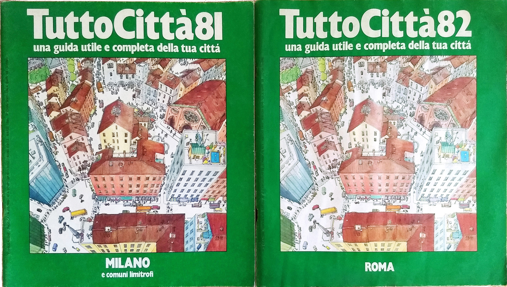

# Introduzione

Questa pagina fornisce le principali chiavi di lettura per comprendere l'organizzazione generale del
prodotto editoriale, attraverso alcune regole di base. I dati derivano da una raccolta privata di
quasi 1.300 esemplari, da dati incrociati con altre raccolte e immagini, nonché dalle regolarità
editoriali osservate nelle pubblicazioni.

- [Come leggere le annate](#come-leggere-le-annate)
- [Come leggere la foliazione](#come-leggere-la-foliazione)
- [Un'anomalia: i fascicoli senza anno in copertina](#unanomalia-i-fascicoli-senza-anno-in-copertina)
- [Stati di ciascuna cella](#stati-di-ciascuna-cella)
- [Dati](#dati)
- [Licenza e citazione](#licenza-e-citazione)

## Come leggere le annate

L'indicizzazione è per **anno di copertina**, non per anno civile. Il ciclo editoriale solitamente si
apriva a febbraio e si chiudeva a gennaio dell'anno successivo; i fascicoli editi nella seconda metà
dell'anno di riferimento quindi riportavano in copertina già l'anno successivo, in quanto andavano in
distribuzione alla fine dell'anno o all'inizio dell'anno dopo. Ad esempio l'annata `81/82` comprendeva
fascicoli che riportavano in copertina sia `81` sia `82`:

- le **serie iniziali** sono quelle il cui fascicolo riporta come titolo *TuttoCittà 81*;
- le **serie tardive** sono quelle il cui fascicolo della stessa annata riporta *TuttoCittà 82*.

<figure class="figura doppia">

<figcaption>Fascicoli di Milano e di Roma appartenenti all'annata 81/82: il primo riporta 81 in
copertina, il secondo riporta 82 in copertina.</figcaption>
</figure>

I fascicoli di Bologna e delle province della Campania e della Basilicata saltano nominalmente il
*TuttoCittà 85*, passando da serie iniziale a serie tardiva, in coincidenza con la riforma grafica
della topografia delle dieci città maggiori.

Il Piemonte chiudeva di norma l'annata, con aggiornamenti attorno al gennaio successivo: i suoi
fascicoli dell'annata 1999/2000 portano in copertina il **2000**.

## Come leggere la foliazione

Il numero di pagine indicato per ciascun fascicolo segue due regole, che dipendono da come il
fascicolo è materialmente fatto.

Il tipo di copertina stabilisce da dove comincia la numerazione: nei fascicoli a **copertina grossa**
la pagina 1 è la prima che si incontra dopo la prima e la seconda di copertina, che restano fuori dal
conto; nei fascicoli a **copertina sottile** è la copertina stessa a fare da pagina 1 e la seconda di
copertina da pagina 2, così che quella che nell'altro caso sarebbe la pagina 1 diventa qui la pagina
3. Questa è effettivamente la numerazione stampata dentro il fascicolo. La copertina sottile compare
fra le annate 1993/94 e 2005/06.

Il conteggio delle pagine esclude la terza e la quarta di copertina, che normalmente sono impegnate da
inserzioni pubblicitarie e che quindi non portano un numero esplicitamente indicato; il numero non in
parentesi si riferisce quindi al numero di pagine escluse terza e quarta di copertina. Quando accanto
ne compare un secondo fra parentesi, vuol dire che la terza o la quarta di copertina sono state usate
per contenuto proprio del fascicolo — una mappa non indicizzata, la parte finale dell'elenco delle vie
— e che quindi eccedono il conteggio regolare. Così `24 (25)` è un fascicolo di ventiquattro pagine
che si prolunga sulla terza di copertina.

Uno scarto di una pagina riguarda dunque la sola terza di copertina. Uno scarto di due pagine segnala
invece che è impegnata anche la quarta di copertina; quest'ultimo fatto accade però soltanto nei
fascicoli con layout *TuttoCittà metà duemila*, in uso nel biennio 2004/05–2005/06: `62 (64)` è un
fascicolo di sessantadue pagine che occupa entrambe le facciate finali con contenuti propri,
tipicamente l'elenco delle vie.

Nei csv i due numeri stanno in colonne separate, `pagine_totali` e `pagine_comprese_copertine`, così
che il conteggio regolare resti confrontabile fra fascicoli.

## Un'anomalia: i fascicoli senza anno in copertina

Nelle annate 1997/98 e 1998/99 una parte dei fascicoli — quelli con copertina grigia — non riporta
alcun anno sul frontespizio: al suo posto compare la sola finestra d'uso, in due forme successive,
prima con inizio e scadenza («nov 1997 - ott 1998») e poi con la sola scadenza («da utilizzare fino
a…»). Il passaggio fra le due avviene all'inizio dell'annata 98/99: i due fascicoli d'apertura, Milano
e Lodi-Provincia di Milano, portano ancora l'intervallo completo. La finestra è **sempre di dodici
mesi**, e il fascicolo restava valido fino all'arrivo del successivo.

<figure class="figura">

<figcaption>Esempio di fascicolo senza anno in copertina; in alto è indicato il periodo della finestra
d'uso.</figcaption>
</figure>

I fascicoli senza anno in copertina accertati sono 77, di cui 35 nell'annata 97/98 e 42 nell'annata
98/99. **Per essi l'anno indicato nelle tabelle non è la trascrizione di un dato stampato né una
derivazione dalla finestra d'uso, ma è un'attribuzione convenzionale secondo la posizione del fascicolo
nel ciclo**, la stessa convenzione applicata ai fascicoli che l'anno lo riportano. Nell'annata 97/98 la
copertina grigia compare solo nella coda del ciclo, quindi i suoi fascicoli sono tutti di serie
tardiva, ma non tutti i fascicoli di serie tardiva portano questo layout, perché i fascicoli campani e
lucani portano copertina beige con il 1998 stampato. L'annata successiva, ossia la 98/99, si chiude con
Torino, che introduce la copertina gialla poi adottata negli anni successivi.

## Stati di ciascuna cella

| Stato | Significato |
|---|---|
| `pubblicato` | fascicolo accertato. L'anno di copertina può mancare quando il dato non è noto |
| `probabile_non_confermato` | pubblicazione ritenuta probabile ma non confermata |
| `non_pubblicato` | fascicolo non pubblicato, per raggruppamento diverso delle province o, dall'annata 98/99, per incorporazione nelle Pagine Gialle |

Lo stato `non_pubblicato` riflette la ricostruzione del compilatore basata sulle regolarità
editoriali: non è sempre un'attestazione documentaria positiva di assenza. È una posizione
falsificabile — il ritrovamento di un esemplare comporta l'aggiornamento del dato.

## Dati

- [`dati/fascicoli_lungo.csv`](../dati/fascicoli_lungo.csv) — una riga per fascicolo e annata: la forma adatta al riuso, con l'ambito coperto — l'intero territorio, i soli dintorni del capoluogo, la sola provincia — e una nota per i pochi fascicoli che hanno una particolarità da segnalare
- [`dati/fascicoli_matrice.csv`](../dati/fascicoli_matrice.csv) — la matrice come nel foglio originale
- [`dati/copertine_per_annata.csv`](../dati/copertine_per_annata.csv) — tipi di copertina, conteggi, colore delle tavole
- [`dati/totali_per_annata.csv`](../dati/totali_per_annata.csv) — totali per annata e note editoriali
- [Questioni aperte](questioni-aperte.md) · [Cerca nei dati](cerca-fascicoli.md) · [Controlli di integrità](../CONTROLLI.md)

## Licenza e citazione

Dati e testi: **CC BY 4.0**. Attribuzione: Roberto Mura.

Mura, Roberto (2026). *TuttoCittà: ricostruzione della storia editoriale (1981-2014)*, versione 1.4.
Zenodo. DOI: [10.5281/zenodo.21820762](https://doi.org/10.5281/zenodo.21820762)

**Le riproduzioni e le trascrizioni fanno eccezione.** Le fotografie di copertine e di cartografia e le
trascrizioni dei testi dell'editore sono pubblicate a fini di identificazione e studio documentario, ma i
diritti sulle opere riprodotte appartengono all'editore, oggi Italiaonline S.p.A.: chi cura questa
risorsa **non ne detiene alcun diritto e non li concede in licenza**. Non sono incluse nel deposito Zenodo e possono essere rimosse su
richiesta, aprendo una segnalazione nel repository.

Per ulteriori informazioni, consultare [questa pagina](licenza.md).
