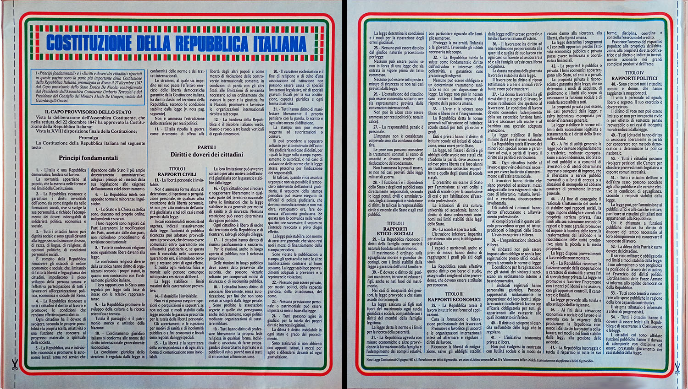

# Inserti speciali

Nel corso della loro storia editoriale, i TuttoCittà hanno incorporato due inserti speciali, entrambi
ideati per poter essere staccati e conservati a parte. Il primo risale al 1984 ed è il foglio dedicato
ai primi 54 articoli della Costituzione della Repubblica Italiana; il secondo è stato incluso fra il
2010 e il 2011 ed è un opuscolo pinzato a parte sull'Agenzia del Territorio.

## Inserto Costituzione

Questo inserto consisteva di due pagine stampate sullo stesso foglio e trovava posto invariabilmente
nelle pagine 3 e 4 di tutti i fascicoli che lo includono; l'inserto è presente in tutti i fascicoli
con copertina verde editi nell'annata 84/85, con la sola eccezione del fascicolo «Milano e comuni
limitrofi», che invece lo include nel fascicolo 85 con copertina rossa (mentre è incluso nel fascicolo
«Provincia di Milano 84» a copertina verde).

L'inserto ha sfondo azzurro, con i primi 54 articoli della Costituzione incorniciati da una sottile
banda che riprende il tricolore italiano, e presenta ai margini una linea tratteggiata con l'icona
delle forbici, chiaro invito a ritagliarlo per conservarlo.

<figure class="figura larga">

<figcaption>Le due pagine dell'inserto sulla Costituzione.</figcaption>
</figure>

## Inserto Agenzia del Territorio

Questo inserto consisteva di 32 pagine ed era allegato al centro del fascicolo; era dotato di graffe
proprie e poteva essere quindi staccato dalle graffe del fascicolo per costituire un volumetto
indipendente. L'inserto è presente in modo irregolare nelle prime edizioni del formato ridotto, per
cui lo si trova a cavallo fra le edizioni 2009/10 e 2011/12; a fine ciclo ogni provincia aveva
comunque il suo inserto dedicato.

L'inserto presentava un sommario iniziale in prima di copertina, mentre a pagina 2, la seconda di
copertina, veniva presentata l'Agenzia del Territorio e quali erano i suoi ruoli e le sue attività; la
pagina specificava inoltre che l'Agenzia venne istituita a seguito della riforma del Ministero
dell'Economia e delle Finanze e che è operativa dal 1° gennaio 2001.

<figure class="figura alta">

<figcaption>L'inserto Agenzia del Territorio così come si presenta allegato al centro del fascicolo.</figcaption>
</figure>
