# Le Marche in dettaglio

<em><strong>NOTA: questa pagina è incompleta.</strong> Alla raccolta mancano 29 dei 74 fascicoli accertati della regione — <strong>Ascoli Piceno - Macerata, annate 83/84 e 85/86; Ancona, annate 84/85, 85/86, 88/89, 94/95, 96/97–99/00, 01/02–03/04, 05/06, 06/07, 10/11 e 12/13–14/15; Pesaro - Urbino, annate 84/85, 87/88, 94/95, 96/97 e 97/98; Ascoli Piceno, annate 90/91, 94/95, 96/97 e 97/98; Macerata, annata 97/98</strong> — e i dati che dipendono dall'esame diretto dell'esemplare sono segnati</em> in sospeso<em>. Le copertine non reperite sono sostituite da un segnaposto; nella griglia dei comuni le annate scoperte portano una croce e non una casella vuota, per non confonderle con la reale assenza del corrispondente comune in cartografia. Per la stessa ragione questa pagina non è annunciata altrove nel sito e per il momento vi si arriva soltanto per indirizzo diretto.</em>

Questa pagina si occupa di definire con estrema precisione l'organizzazione interna dei fascicoli dell'intera regione Marche.

Il censimento registra un totale di 74 fascicoli e 21 comuni cartografati.

<figure class="figura">
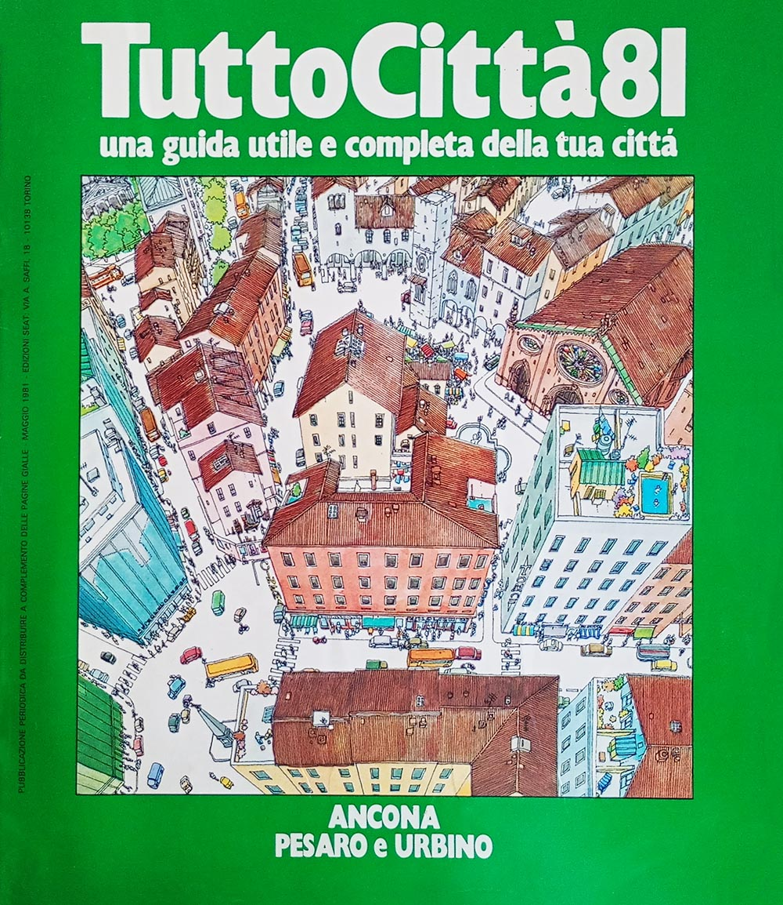
<figcaption>Copertina del fascicolo Ancona - Pesaro - Urbino 81</figcaption>
</figure>

In questa pagina

[TOC]

## Tabella dei fascicoli

I fascicoli delle Marche appartenevano alla serie iniziale: il primo fascicolo, edito a maggio 1981, era infatti intitolato TuttoCittà 81.

Alla fine degli anni '90 la pubblicazione dei fascicoli cessò per tutte le province tranne Ancona, la cui linea proseguì fino al 2014.

La seguente tabella censisce i dati fondamentali dei fascicoli delle Marche, mostrandone le copertine e indicandone il formato, il layout così come definito in [questa pagina](tabella-layout.md), e il numero totale di pagine, anno per anno.

<table class="fascicoli-dettaglio">
<thead><tr><th>Annata</th><th>Colore tavole</th><th colspan="4">Copertine</th></tr></thead>
<tbody>
<tr><td class="ann"> 81/82</td><td class="tav"></td><td class="fasc">
Ancona - Pesaro - Urbino 81
<ul class="scheda"><li><b>Formato:</b> 246 x 280 mm</li><li><b>Copertina:</b> grossa</li><li><b>Layout:</b> Stradario SEAT</li><li><b>Pagine:</b> 40</li><li><b>Mese aggiornamento:</b> maggio 1981</li><li><b>Note:</b> nota dell'editore</li></ul></td><td class="fasc vuota"></td><td class="fasc"><a href="../immagini/APMC81.jpg">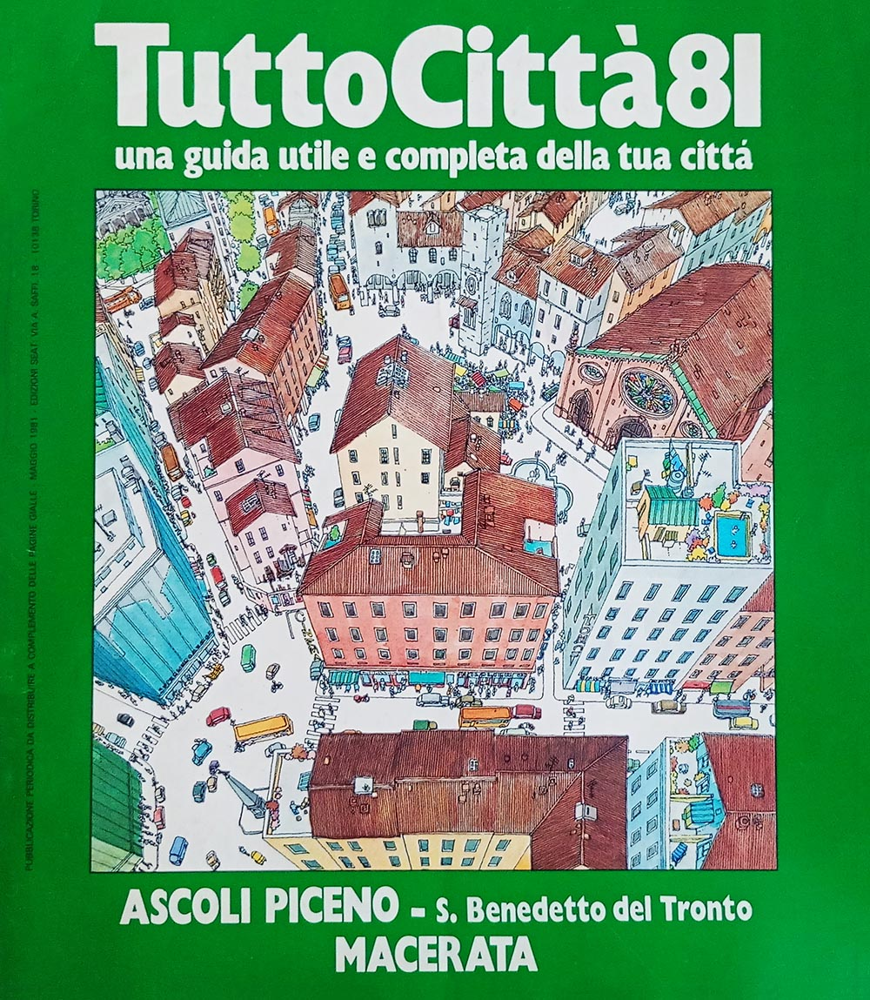</a>
Ascoli Piceno - Macerata 81
<ul class="scheda"><li><b>Formato:</b> 246 x 280 mm</li><li><b>Copertina:</b> grossa</li><li><b>Layout:</b> TuttoCittà '80 con foto</li><li><b>Pagine:</b> 32</li><li><b>Mese aggiornamento:</b> maggio 1981</li><li><b>Note:</b> nota dell'editore</li></ul></td><td class="fasc vuota"></td></tr>
<tr><td class="ann"> 82/83</td><td class="tav"></td><td class="fasc"><a href="../immagini/ANPS82.jpg">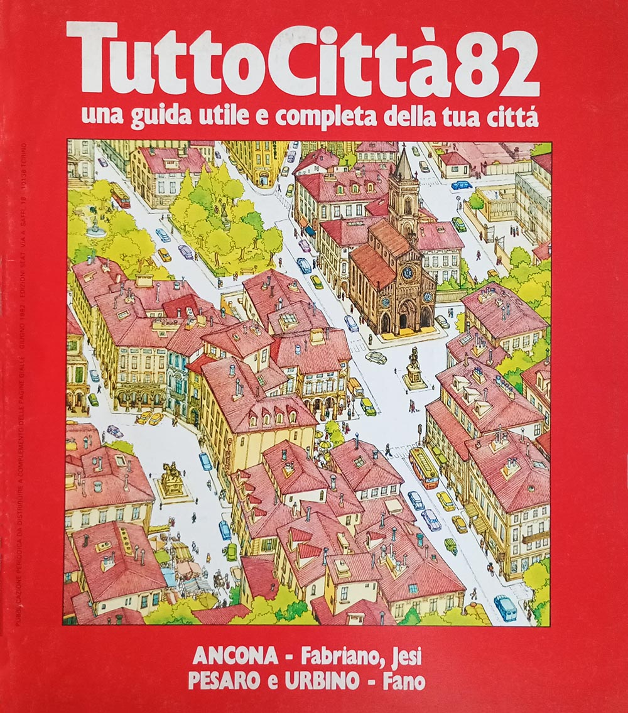</a>
Ancona - Pesaro - Urbino 82
<ul class="scheda"><li><b>Formato:</b> 246 x 280 mm</li><li><b>Copertina:</b> grossa</li><li><b>Layout:</b> TuttoCittà '80 classico</li><li><b>Pagine:</b> 48</li><li><b>Mese aggiornamento:</b> giugno 1982</li></ul></td><td class="fasc vuota"></td><td class="fasc"><a href="../immagini/APMC82.jpg">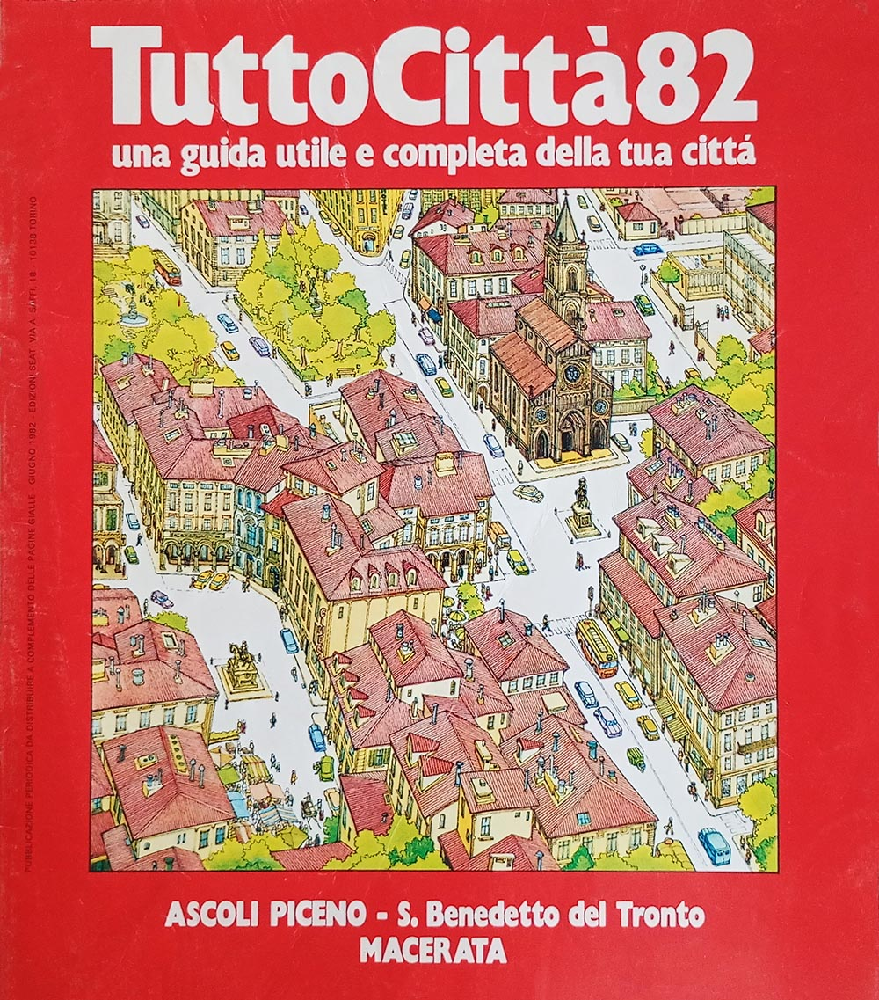</a>
Ascoli Piceno - Macerata 82
<ul class="scheda"><li><b>Formato:</b> 246 x 280 mm</li><li><b>Copertina:</b> grossa</li><li><b>Layout:</b> TuttoCittà '80 classico</li><li><b>Pagine:</b> 32</li><li><b>Mese aggiornamento:</b> giugno 1982</li></ul></td><td class="fasc vuota"></td></tr>
<tr><td class="ann"> 83/84</td><td class="tav"></td><td class="fasc"><a href="../immagini/ANPS83.jpg">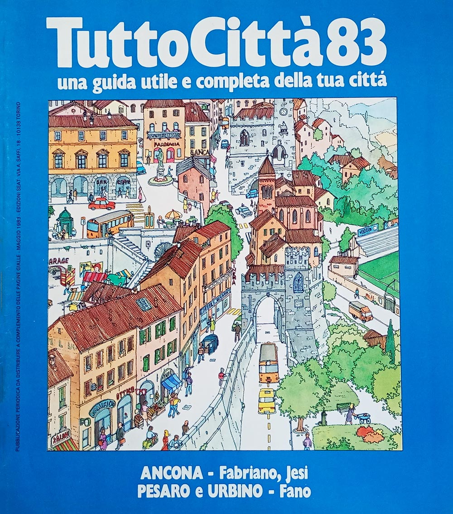</a>
Ancona - Pesaro - Urbino 83
<ul class="scheda"><li><b>Formato:</b> 246 x 280 mm</li><li><b>Copertina:</b> grossa</li><li><b>Layout:</b> TuttoCittà '80 classico</li><li><b>Pagine:</b> 48</li><li><b>Mese aggiornamento:</b> maggio 1983</li></ul></td><td class="fasc vuota"></td><td class="fasc sospesa">
Ascoli Piceno - Macerata 83
<ul class="scheda"><li><b>Formato:</b> 246 x 280 mm</li><li><b>Copertina:</b> grossa</li><li><b>Layout:</b> TuttoCittà '80 classico</li><li>non in raccolta</li></ul></td><td class="fasc vuota"></td></tr>
<tr><td class="ann"> 84/85</td><td class="tav"></td><td class="fasc sospesa">
Ancona 84
<ul class="scheda"><li><b>Formato:</b> 246 x 280 mm</li><li><b>Copertina:</b> grossa</li><li><b>Layout:</b> TuttoCittà '80 classico</li><li><b>Note:</b> Inserto Costituzione</li><li>non in raccolta</li></ul></td><td class="fasc sospesa">
Pesaro - Urbino 84
<ul class="scheda"><li><b>Formato:</b> 246 x 280 mm</li><li><b>Copertina:</b> grossa</li><li><b>Layout:</b> TuttoCittà '80 classico</li><li><b>Note:</b> Inserto Costituzione</li><li>non in raccolta</li></ul></td><td class="fasc"><a href="../immagini/APMC84.jpg">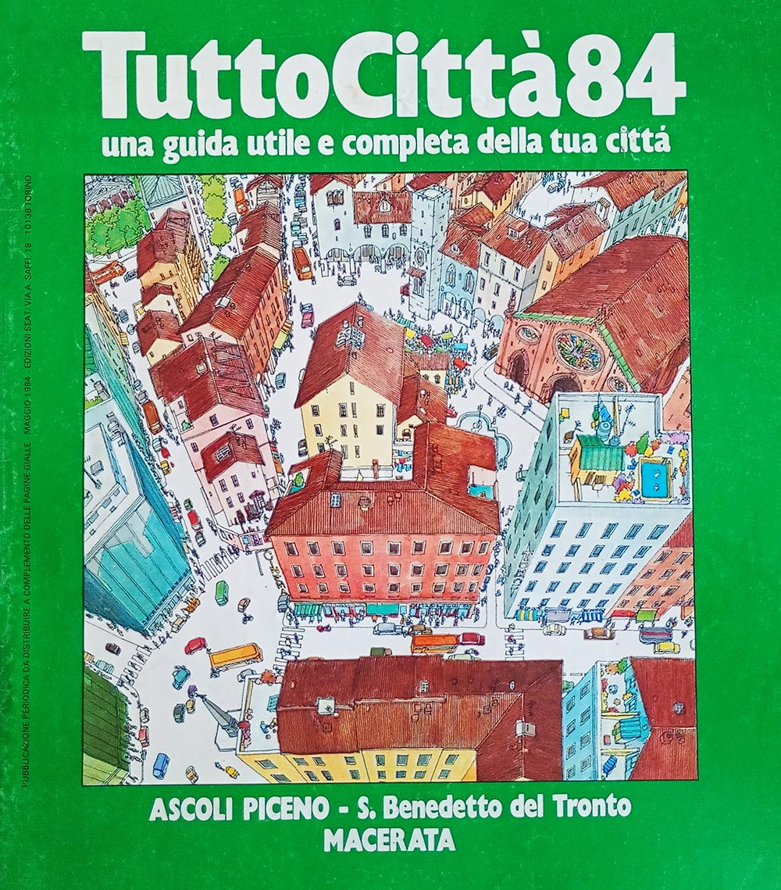</a>
Ascoli Piceno - Macerata 84
<ul class="scheda"><li><b>Formato:</b> 246 x 280 mm</li><li><b>Copertina:</b> grossa</li><li><b>Layout:</b> TuttoCittà '80 classico</li><li><b>Pagine:</b> 32</li><li><b>Mese aggiornamento:</b> maggio 1984</li><li><b>Note:</b> Inserto Costituzione</li></ul></td><td class="fasc vuota"></td></tr>
<tr><td class="ann"> 85/86</td><td class="tav"></td><td class="fasc sospesa">
Ancona 85
<ul class="scheda"><li><b>Formato:</b> 246 x 280 mm</li><li><b>Copertina:</b> grossa</li><li><b>Layout:</b> TuttoCittà '80 classico</li><li>non in raccolta</li></ul></td><td class="fasc"><a href="../immagini/PS85.jpg">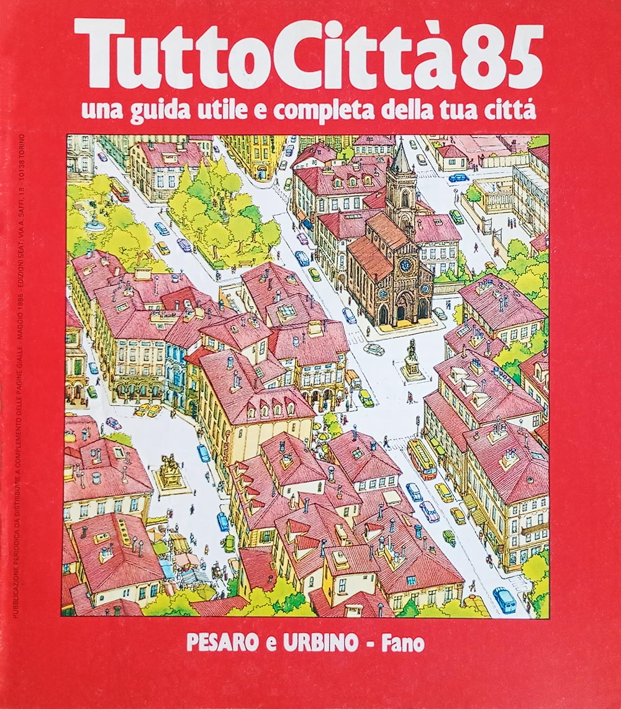</a>
Pesaro - Urbino 85
<ul class="scheda"><li><b>Formato:</b> 246 x 280 mm</li><li><b>Copertina:</b> grossa</li><li><b>Layout:</b> TuttoCittà '80 classico</li><li><b>Pagine:</b> 16</li><li><b>Mese aggiornamento:</b> maggio 1985</li></ul></td><td class="fasc sospesa">
Ascoli Piceno - Macerata 85
<ul class="scheda"><li><b>Formato:</b> 246 x 280 mm</li><li><b>Copertina:</b> grossa</li><li><b>Layout:</b> TuttoCittà '80 classico</li><li>non in raccolta</li></ul></td><td class="fasc vuota"></td></tr>
<tr><td class="ann"> 86/87</td><td class="tav"></td><td class="fasc"><a href="../immagini/AN86.jpg">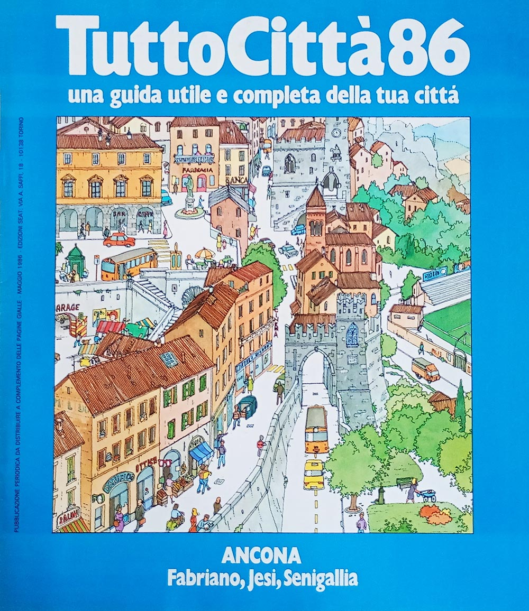</a>
Ancona 86
<ul class="scheda"><li><b>Formato:</b> 246 x 280 mm</li><li><b>Copertina:</b> grossa</li><li><b>Layout:</b> TuttoCittà '80 classico</li><li><b>Pagine:</b> 24</li><li><b>Mese aggiornamento:</b> maggio 1986</li></ul></td><td class="fasc"><a href="../immagini/PS86.jpg">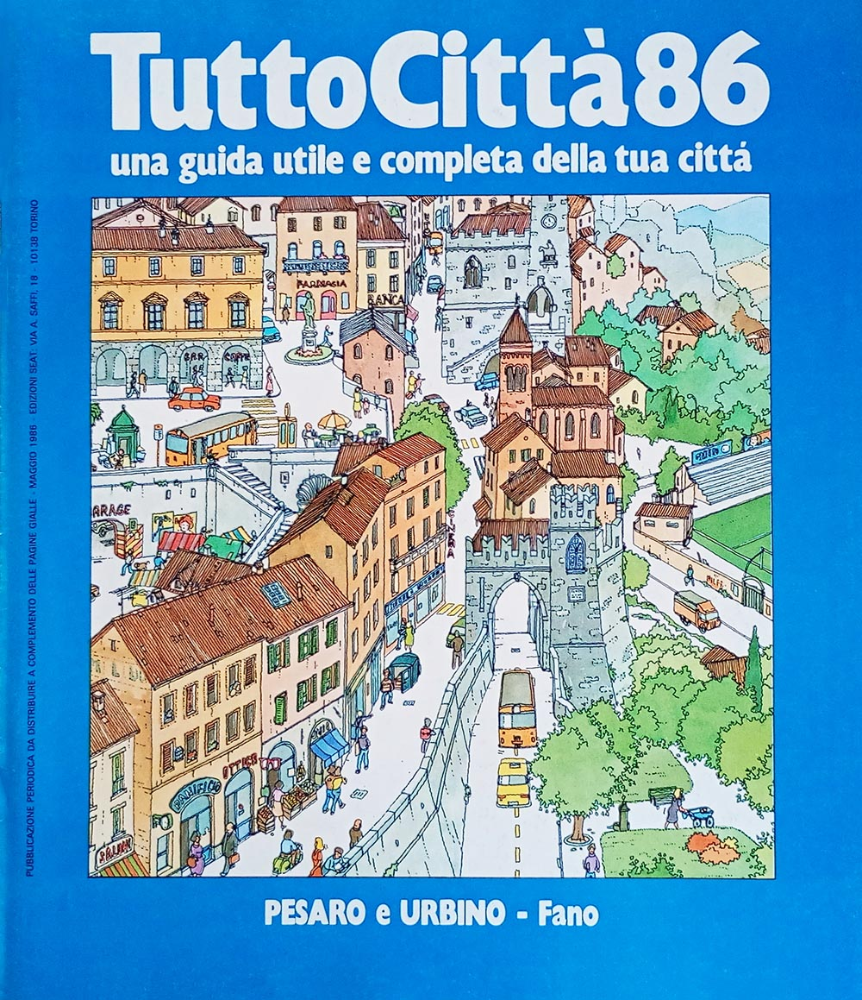</a>
Pesaro - Urbino 86
<ul class="scheda"><li><b>Formato:</b> 246 x 280 mm</li><li><b>Copertina:</b> grossa</li><li><b>Layout:</b> TuttoCittà '80 classico</li><li><b>Pagine:</b> 16</li><li><b>Mese aggiornamento:</b> maggio 1986</li></ul></td><td class="fasc"><a href="../immagini/APMC86.jpg">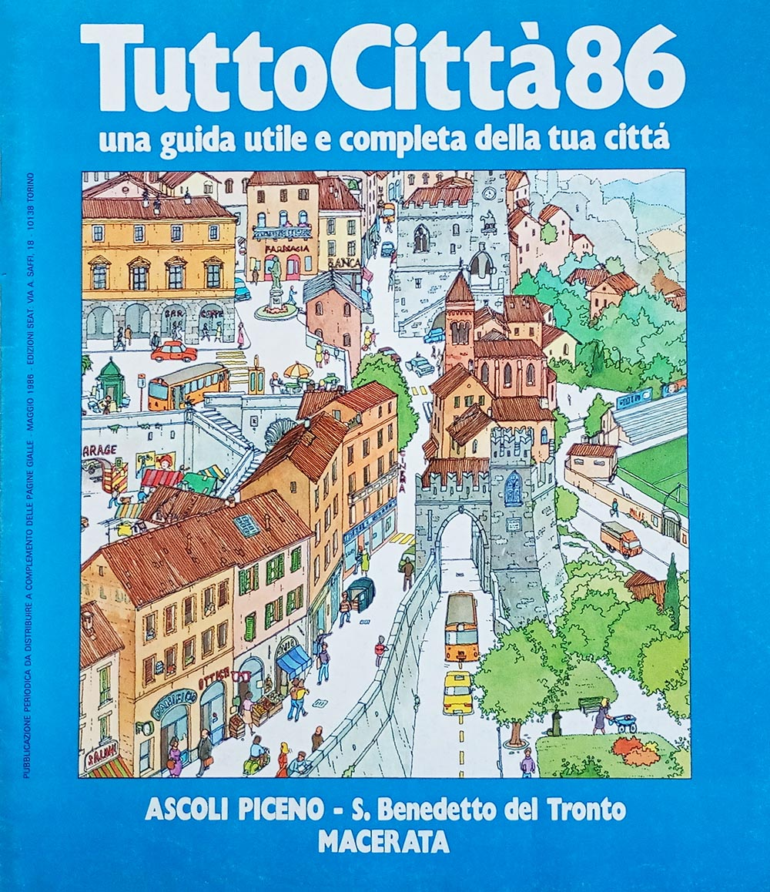</a>
Ascoli Piceno - Macerata 86
<ul class="scheda"><li><b>Formato:</b> 246 x 280 mm</li><li><b>Copertina:</b> grossa</li><li><b>Layout:</b> TuttoCittà '80 classico</li><li><b>Pagine:</b> 32</li><li><b>Mese aggiornamento:</b> maggio 1986</li></ul></td><td class="fasc vuota"></td></tr>
<tr><td class="ann"> 87/88</td><td class="tav"></td><td class="fasc"><a href="../immagini/AN87.jpg">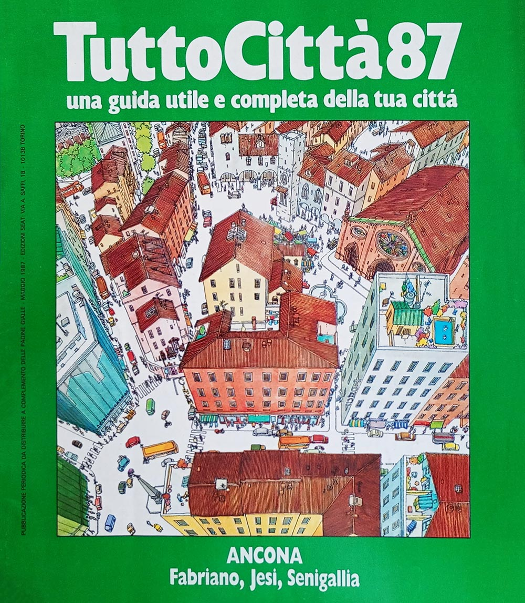</a>
Ancona 87
<ul class="scheda"><li><b>Formato:</b> 246 x 280 mm</li><li><b>Copertina:</b> grossa</li><li><b>Layout:</b> TuttoCittà '80 classico</li><li><b>Pagine:</b> 24</li><li><b>Mese aggiornamento:</b> maggio 1987</li></ul></td><td class="fasc sospesa">
Pesaro - Urbino 87
<ul class="scheda"><li><b>Formato:</b> 246 x 280 mm</li><li><b>Copertina:</b> grossa</li><li><b>Layout:</b> TuttoCittà '80 classico</li><li>non in raccolta</li></ul></td><td class="fasc"><a href="../immagini/APMC87.jpg">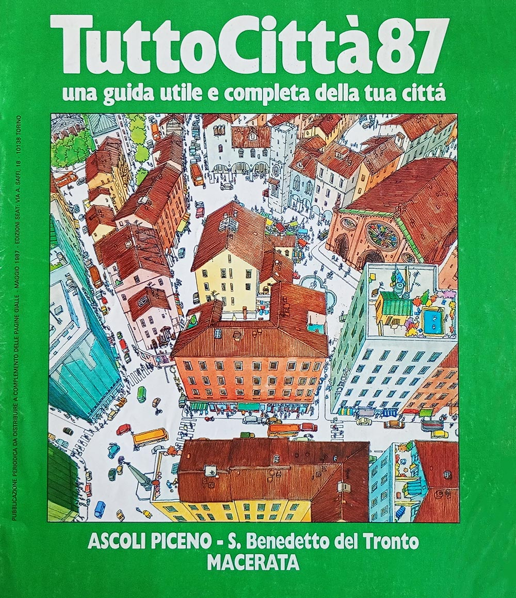</a>
Ascoli Piceno - Macerata 87
<ul class="scheda"><li><b>Formato:</b> 246 x 280 mm</li><li><b>Copertina:</b> grossa</li><li><b>Layout:</b> TuttoCittà '80 classico</li><li><b>Pagine:</b> 32</li><li><b>Mese aggiornamento:</b> maggio 1987</li></ul></td><td class="fasc vuota"></td></tr>
<tr><td class="ann"> 88/89</td><td class="tav"></td><td class="fasc sospesa">
Ancona 88
<ul class="scheda"><li><b>Formato:</b> 246 x 280 mm</li><li><b>Copertina:</b> grossa</li><li><b>Layout:</b> TuttoCittà '80 classico</li><li><b>Mese aggiornamento:</b> maggio 1988</li><li>non in raccolta</li></ul></td><td class="fasc"><a href="../immagini/PS88.jpg">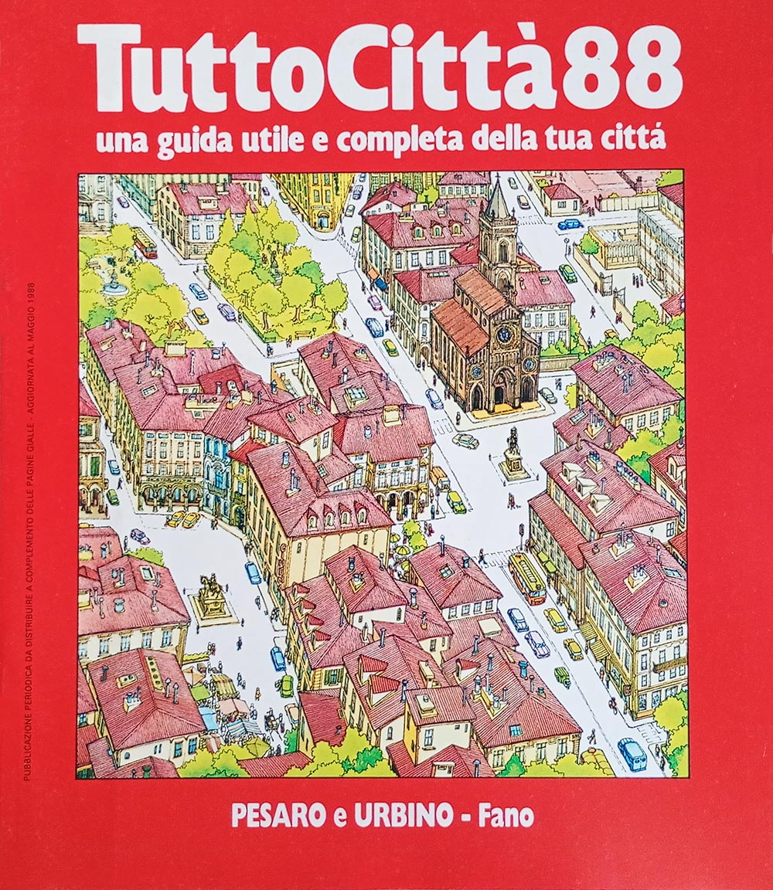</a>
Pesaro - Urbino 88
<ul class="scheda"><li><b>Formato:</b> 246 x 280 mm</li><li><b>Copertina:</b> grossa</li><li><b>Layout:</b> TuttoCittà '80 classico</li><li><b>Pagine:</b> 16</li><li><b>Mese aggiornamento:</b> maggio 1988</li></ul></td><td class="fasc"><a href="../immagini/APMC88.jpg">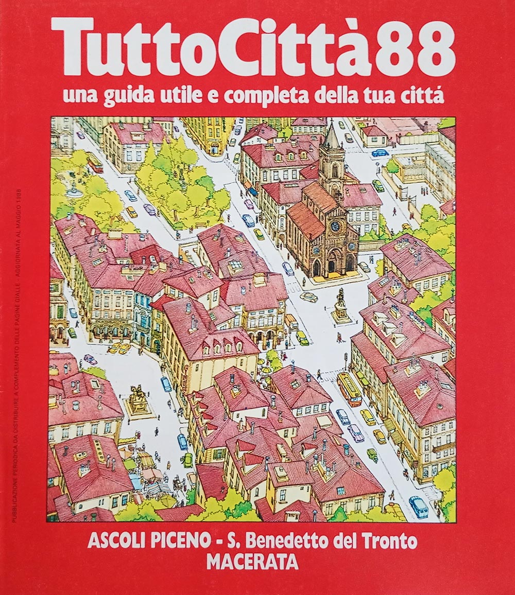</a>
Ascoli Piceno - Macerata 88
<ul class="scheda"><li><b>Formato:</b> 246 x 280 mm</li><li><b>Copertina:</b> grossa</li><li><b>Layout:</b> TuttoCittà '80 classico</li><li><b>Pagine:</b> 32</li><li><b>Mese aggiornamento:</b> maggio 1988</li></ul></td><td class="fasc vuota"></td></tr>
<tr><td class="ann"> 89/90</td><td class="tav"></td><td class="fasc"><a href="../immagini/AN89.jpg">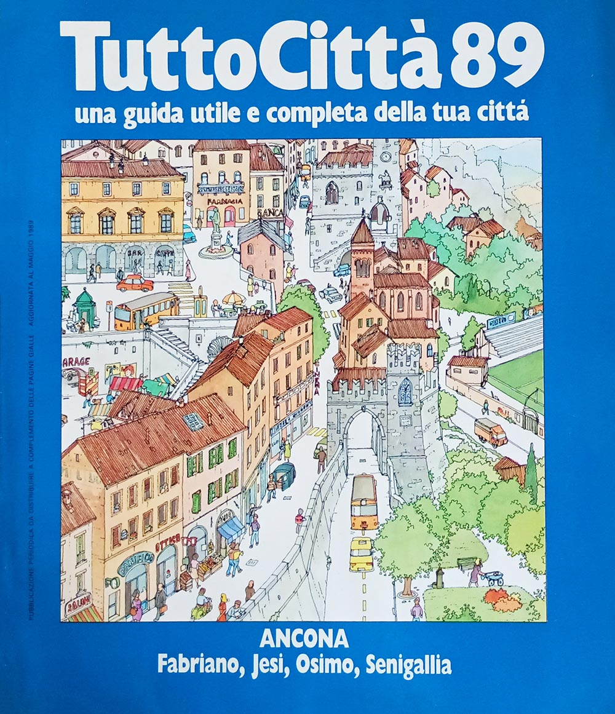</a>
Ancona 89
<ul class="scheda"><li><b>Formato:</b> 246 x 280 mm</li><li><b>Copertina:</b> grossa</li><li><b>Layout:</b> TuttoCittà '80 classico</li><li><b>Pagine:</b> 24</li><li><b>Mese aggiornamento:</b> maggio 1989</li></ul></td><td class="fasc">
Pesaro - Urbino 89
<ul class="scheda"><li><b>Formato:</b> 246 x 280 mm</li><li><b>Copertina:</b> grossa</li><li><b>Layout:</b> TuttoCittà '80 classico</li><li><b>Pagine:</b> 16</li><li><b>Mese aggiornamento:</b> maggio 1989</li></ul></td><td class="fasc"><a href="../immagini/AP89.jpg">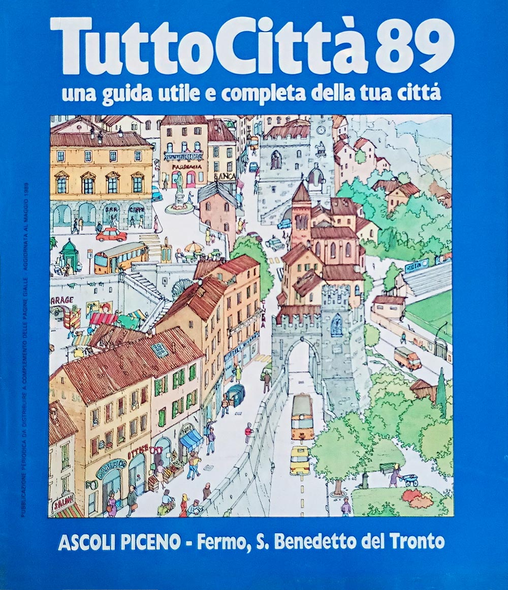</a>
Ascoli Piceno 89
<ul class="scheda"><li><b>Formato:</b> 246 x 280 mm</li><li><b>Copertina:</b> grossa</li><li><b>Layout:</b> TuttoCittà '80 classico</li><li><b>Pagine:</b> 16</li><li><b>Mese aggiornamento:</b> maggio 1989</li></ul></td><td class="fasc"><a href="../immagini/MC89.jpg">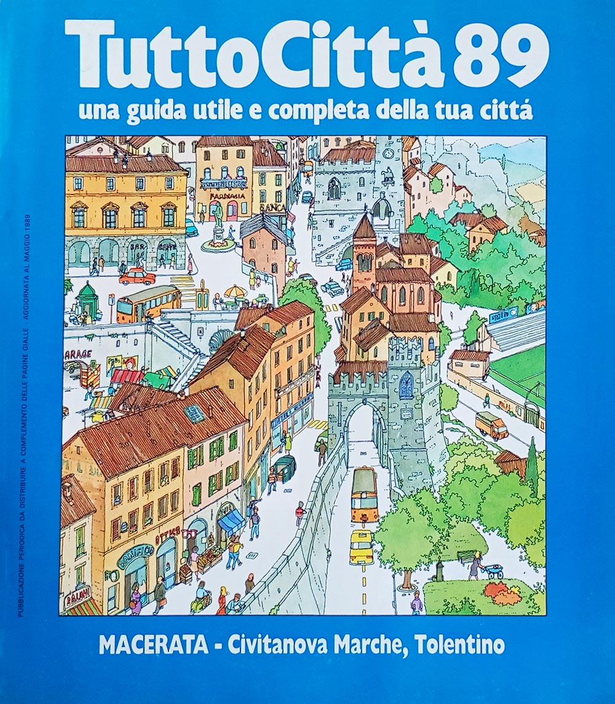</a>
Macerata 89
<ul class="scheda"><li><b>Formato:</b> 246 x 280 mm</li><li><b>Copertina:</b> grossa</li><li><b>Layout:</b> TuttoCittà '80 classico</li><li><b>Pagine:</b> 16</li><li><b>Mese aggiornamento:</b> maggio 1989</li></ul></td></tr>
<tr><td class="ann"> 90/91</td><td class="tav"></td><td class="fasc"><a href="../immagini/AN9091.jpg">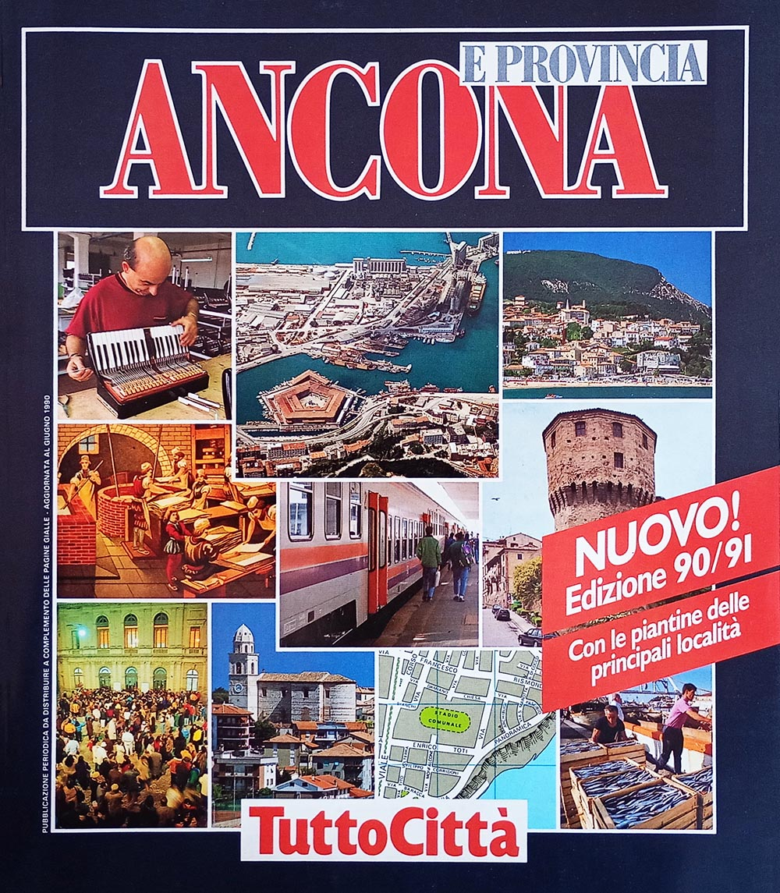</a>
Ancona 90/91
<ul class="scheda"><li><b>Formato:</b> 246 x 280 mm</li><li><b>Copertina:</b> grossa</li><li><b>Layout:</b> TuttoCittà '90 classico iniziale</li><li><b>Pagine:</b> 32</li><li><b>Mese aggiornamento:</b> maggio 1990</li><li><b>Note:</b> nota dell'editore</li></ul></td><td class="fasc"><a href="../immagini/PS9091.jpg">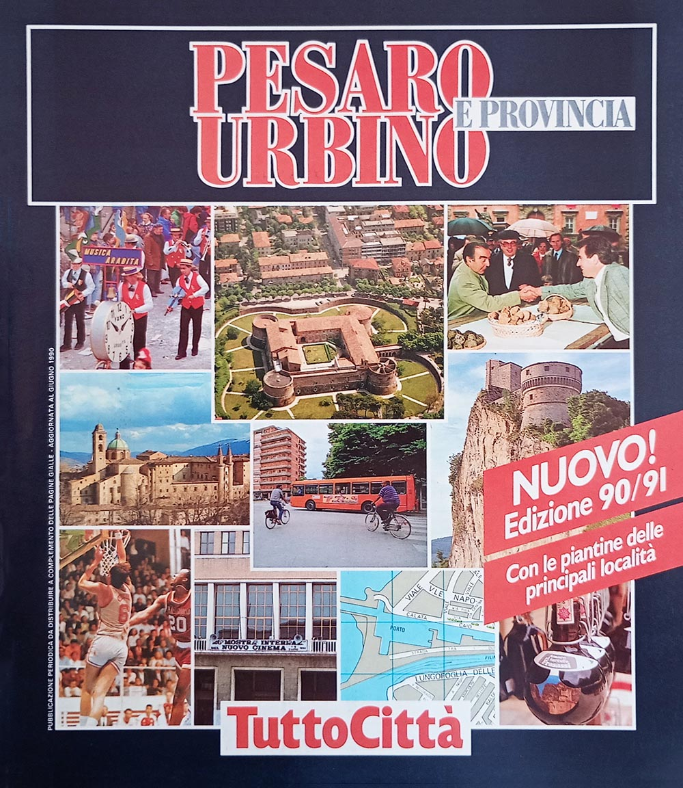</a>
Pesaro - Urbino 90/91
<ul class="scheda"><li><b>Formato:</b> 246 x 280 mm</li><li><b>Copertina:</b> grossa</li><li><b>Layout:</b> TuttoCittà '90 classico iniziale</li><li><b>Pagine:</b> 16</li><li><b>Mese aggiornamento:</b> maggio 1990</li><li><b>Note:</b> nota dell'editore</li></ul></td><td class="fasc sospesa">
Ascoli Piceno 90/91
<ul class="scheda"><li><b>Formato:</b> 246 x 280 mm</li><li><b>Copertina:</b> grossa</li><li><b>Layout:</b> TuttoCittà '90 classico iniziale</li><li><b>Mese aggiornamento:</b> maggio 1990</li><li><b>Note:</b> nota dell'editore</li><li>non in raccolta</li></ul></td><td class="fasc"><a href="../immagini/MC9091.jpg">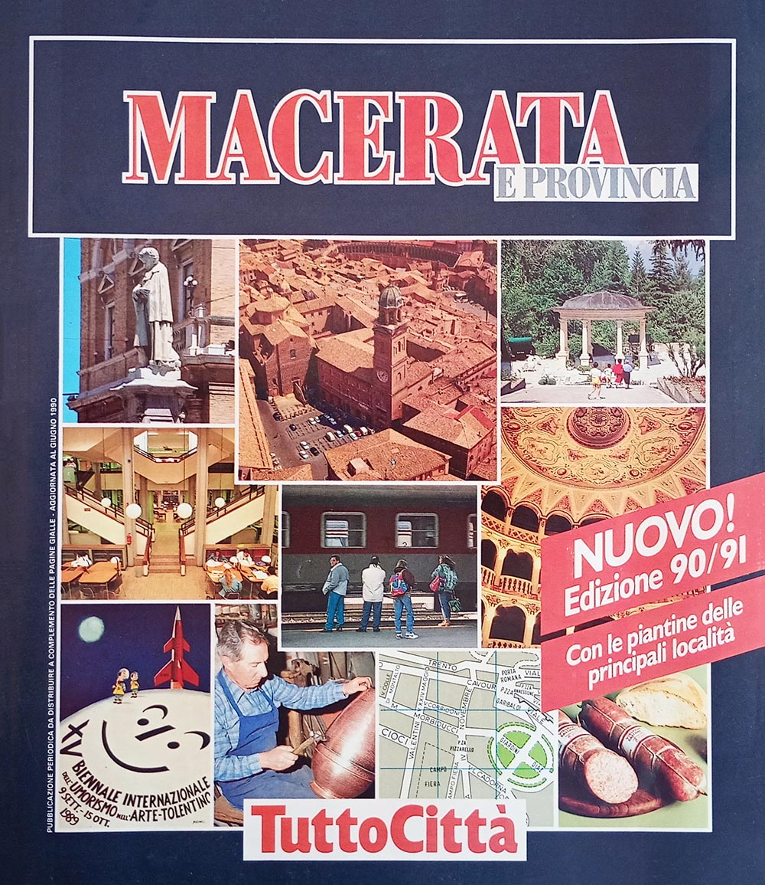</a>
Macerata 90/91
<ul class="scheda"><li><b>Formato:</b> 246 x 280 mm</li><li><b>Copertina:</b> grossa</li><li><b>Layout:</b> TuttoCittà '90 classico iniziale</li><li><b>Pagine:</b> 24</li><li><b>Mese aggiornamento:</b> maggio 1990</li><li><b>Note:</b> nota dell'editore</li></ul></td></tr>
<tr><td class="ann"> 91/92</td><td class="tav"></td><td class="fasc"><a href="../immagini/AN91.jpg">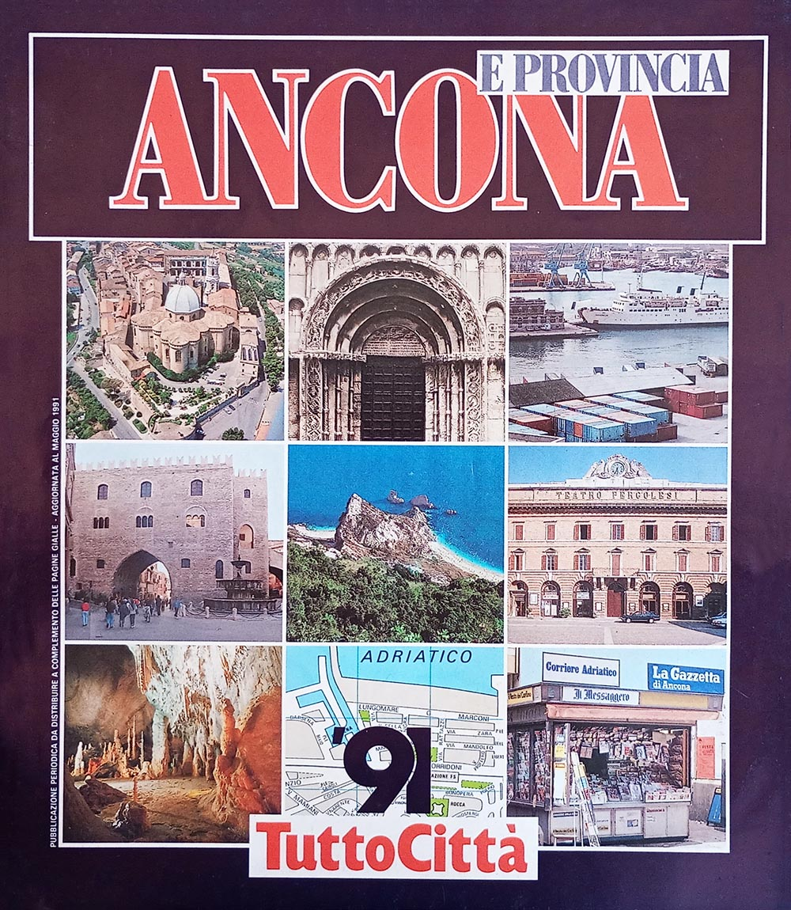</a>
Ancona 91
<ul class="scheda"><li><b>Formato:</b> 246 x 280 mm</li><li><b>Copertina:</b> grossa</li><li><b>Layout:</b> TuttoCittà '90 classico iniziale</li><li><b>Pagine:</b> 32</li><li><b>Mese aggiornamento:</b> maggio 1991</li></ul></td><td class="fasc"><a href="../immagini/PS91.jpg">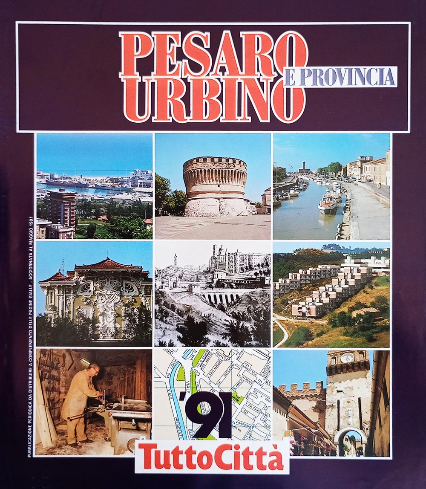</a>
Pesaro - Urbino 91
<ul class="scheda"><li><b>Formato:</b> 246 x 280 mm</li><li><b>Copertina:</b> grossa</li><li><b>Layout:</b> TuttoCittà '90 classico iniziale</li><li><b>Pagine:</b> 24</li><li><b>Mese aggiornamento:</b> maggio 1991</li></ul></td><td class="fasc"><a href="../immagini/AP91.jpg">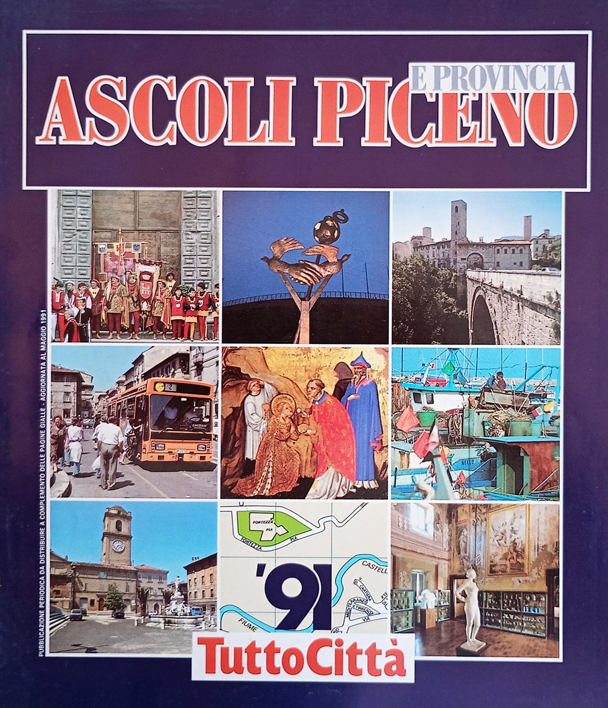</a>
Ascoli Piceno 91
<ul class="scheda"><li><b>Formato:</b> 246 x 280 mm</li><li><b>Copertina:</b> grossa</li><li><b>Layout:</b> TuttoCittà '90 classico iniziale</li><li><b>Pagine:</b> 24</li><li><b>Mese aggiornamento:</b> maggio 1991</li></ul></td><td class="fasc"><a href="../immagini/MC91.jpg">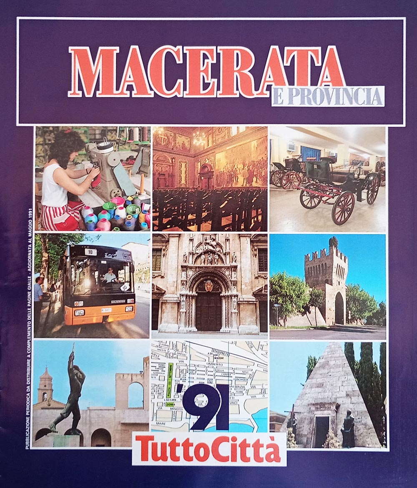</a>
Macerata 91
<ul class="scheda"><li><b>Formato:</b> 246 x 280 mm</li><li><b>Copertina:</b> grossa</li><li><b>Layout:</b> TuttoCittà '90 classico iniziale</li><li><b>Pagine:</b> 24</li><li><b>Mese aggiornamento:</b> maggio 1991</li></ul></td></tr>
<tr><td class="ann"> 92/93</td><td class="tav"></td><td class="fasc"><a href="../immagini/AN92.jpg">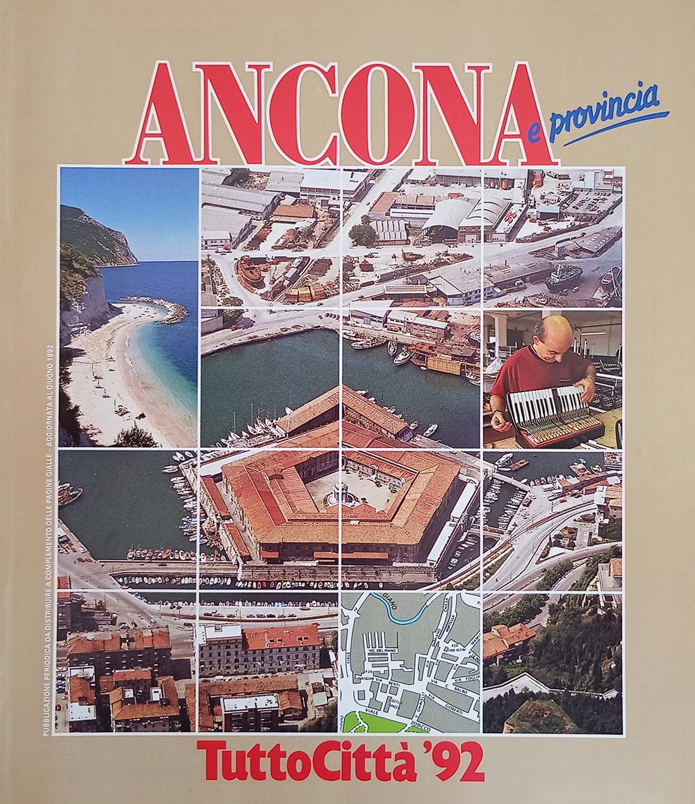</a>
Ancona 92
<ul class="scheda"><li><b>Formato:</b> 246 x 280 mm</li><li><b>Copertina:</b> grossa</li><li><b>Layout:</b> TuttoCittà '90 classico</li><li><b>Pagine:</b> 32</li><li><b>Mese aggiornamento:</b> giugno 1992</li></ul></td><td class="fasc"><a href="../immagini/PS92.jpg">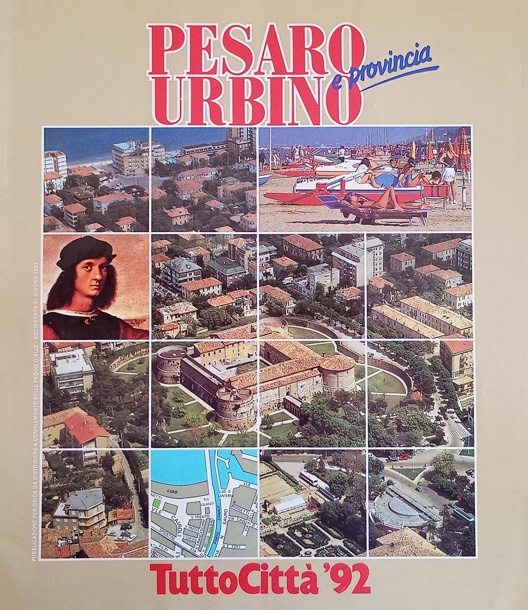</a>
Pesaro - Urbino 92
<ul class="scheda"><li><b>Formato:</b> 246 x 280 mm</li><li><b>Copertina:</b> grossa</li><li><b>Layout:</b> TuttoCittà '90 classico</li><li><b>Pagine:</b> 32</li><li><b>Mese aggiornamento:</b> giugno 1992</li></ul></td><td class="fasc"><a href="../immagini/AP92.jpg">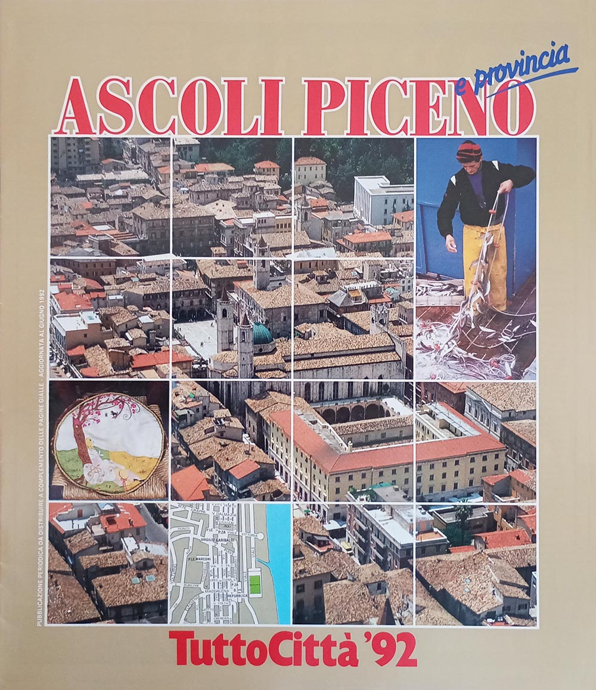</a>
Ascoli Piceno 92
<ul class="scheda"><li><b>Formato:</b> 246 x 280 mm</li><li><b>Copertina:</b> grossa</li><li><b>Layout:</b> TuttoCittà '90 classico</li><li><b>Pagine:</b> 24</li><li><b>Mese aggiornamento:</b> giugno 1992</li></ul></td><td class="fasc"><a href="../immagini/MC92.jpg">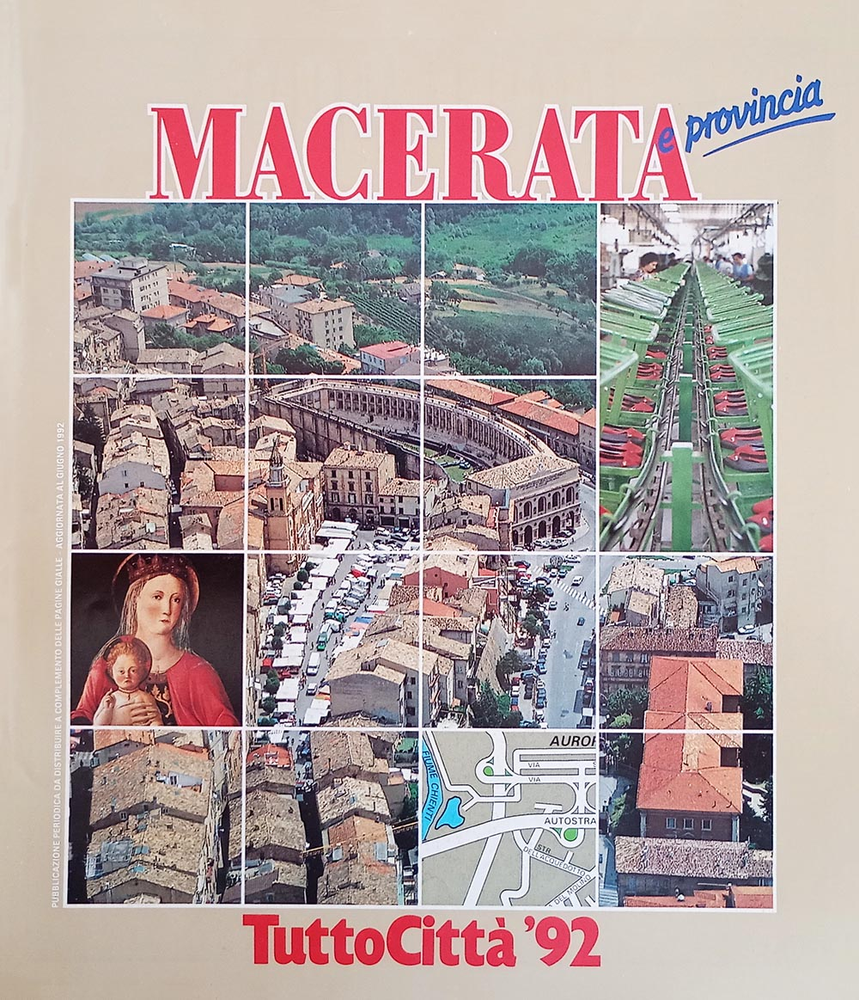</a>
Macerata 92
<ul class="scheda"><li><b>Formato:</b> 246 x 280 mm</li><li><b>Copertina:</b> grossa</li><li><b>Layout:</b> TuttoCittà '90 classico</li><li><b>Pagine:</b> 24</li><li><b>Mese aggiornamento:</b> giugno 1992</li></ul></td></tr>
<tr><td class="ann"> 93/94</td><td class="tav"></td><td class="fasc"><a href="../immagini/AN93.jpg">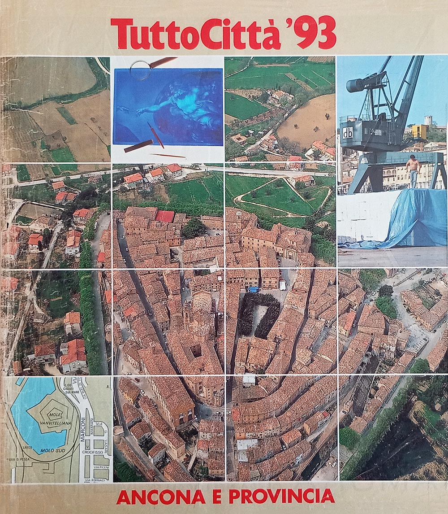</a>
Ancona 93
<ul class="scheda"><li><b>Formato:</b> 246 x 280 mm</li><li><b>Copertina:</b> sottile</li><li><b>Layout:</b> TuttoCittà '90 classico</li><li><b>Pagine:</b> 46</li><li><b>Mese aggiornamento:</b> giugno 1993</li></ul></td><td class="fasc"><a href="../immagini/PS93.jpg">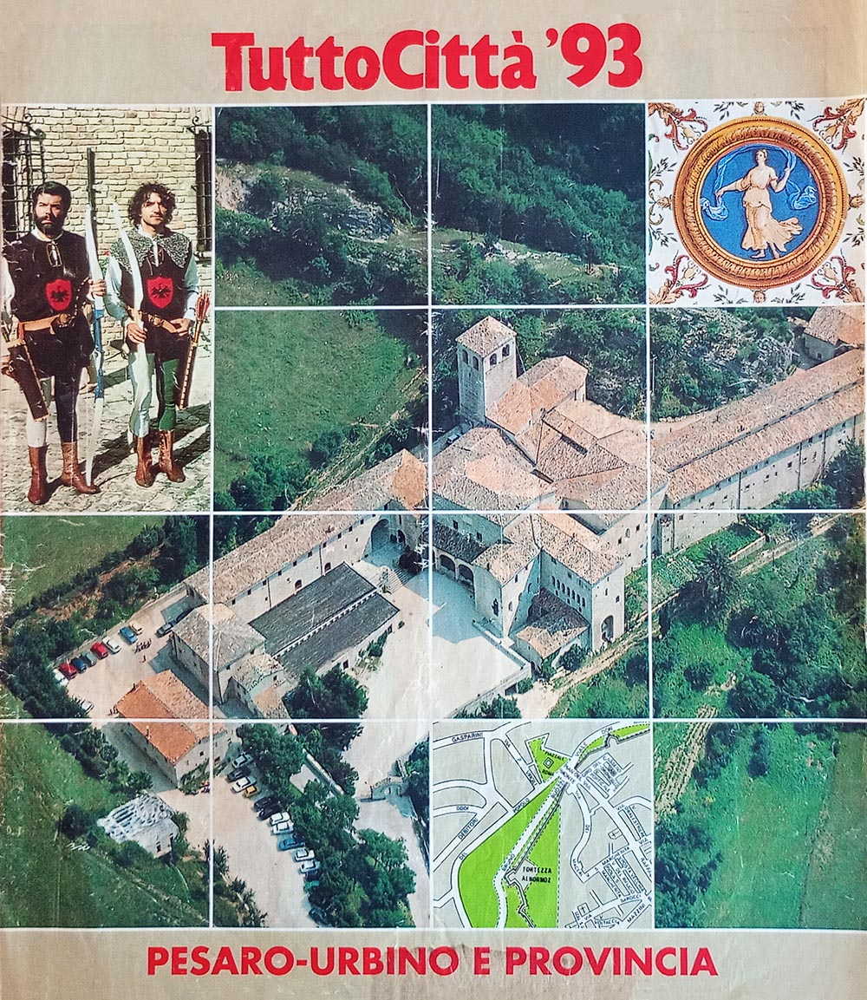</a>
Pesaro - Urbino 93
<ul class="scheda"><li><b>Formato:</b> 246 x 280 mm</li><li><b>Copertina:</b> sottile</li><li><b>Layout:</b> TuttoCittà '90 classico</li><li><b>Pagine:</b> 30</li><li><b>Mese aggiornamento:</b> giugno 1993</li></ul></td><td class="fasc"><a href="../immagini/AP93.jpg">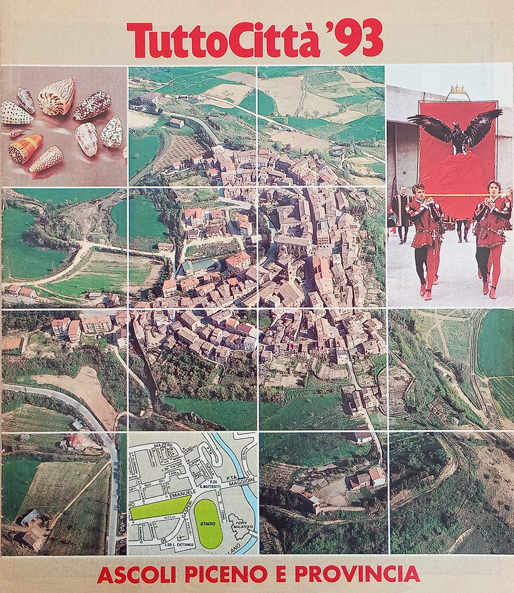</a>
Ascoli Piceno 93
<ul class="scheda"><li><b>Formato:</b> 246 x 280 mm</li><li><b>Copertina:</b> sottile</li><li><b>Layout:</b> TuttoCittà '90 classico</li><li><b>Pagine:</b> 22</li><li><b>Mese aggiornamento:</b> giugno 1993</li></ul></td><td class="fasc"><a href="../immagini/MC93.jpg">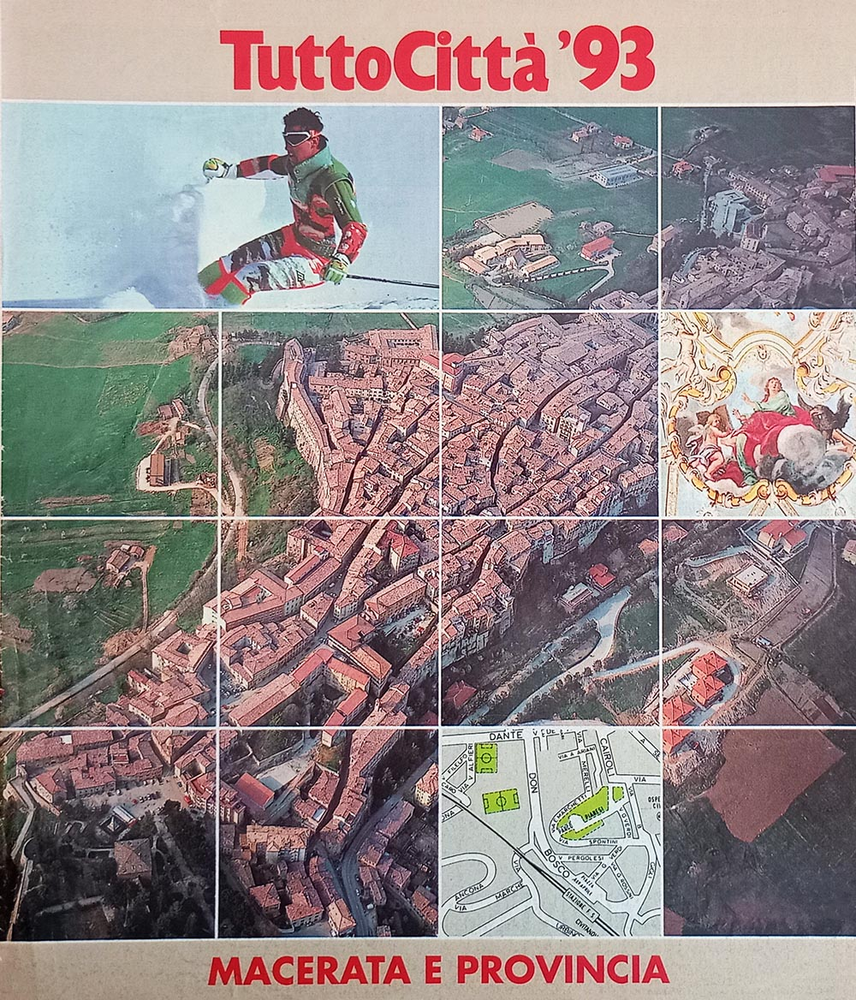</a>
Macerata 93
<ul class="scheda"><li><b>Formato:</b> 246 x 280 mm</li><li><b>Copertina:</b> sottile</li><li><b>Layout:</b> TuttoCittà '90 classico</li><li><b>Pagine:</b> 30</li><li><b>Mese aggiornamento:</b> giugno 1993</li></ul></td></tr>
<tr><td class="ann"> 94/95</td><td class="tav"></td><td class="fasc sospesa">
Ancona 94
<ul class="scheda"><li><b>Formato:</b> 246 x 280 mm</li><li><b>Copertina:</b> sottile</li><li><b>Layout:</b> TuttoCittà '90 classico</li><li>non in raccolta</li></ul></td><td class="fasc sospesa">
Pesaro - Urbino 94
<ul class="scheda"><li><b>Formato:</b> 246 x 280 mm</li><li><b>Copertina:</b> sottile</li><li><b>Layout:</b> TuttoCittà '90 classico</li><li>non in raccolta</li></ul></td><td class="fasc sospesa">
Ascoli Piceno 94
<ul class="scheda"><li><b>Formato:</b> 246 x 280 mm</li><li><b>Copertina:</b> sottile</li><li><b>Layout:</b> TuttoCittà '90 classico</li><li>non in raccolta</li></ul></td><td class="fasc"><a href="../immagini/MC94.jpg">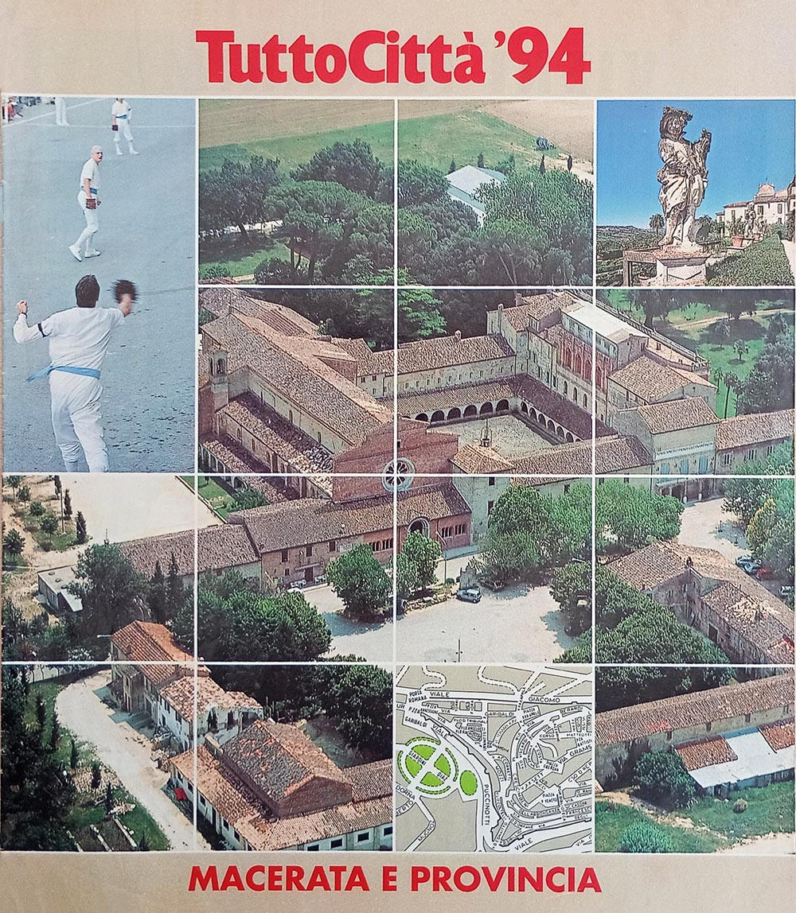</a>
Macerata 94
<ul class="scheda"><li><b>Formato:</b> 246 x 280 mm</li><li><b>Copertina:</b> sottile</li><li><b>Layout:</b> TuttoCittà '90 classico</li><li><b>Pagine:</b> 22</li><li><b>Mese aggiornamento:</b> maggio 1994</li></ul></td></tr>
<tr><td class="ann"> 95/96</td><td class="tav"></td><td class="fasc"><a href="../immagini/AN95.jpg">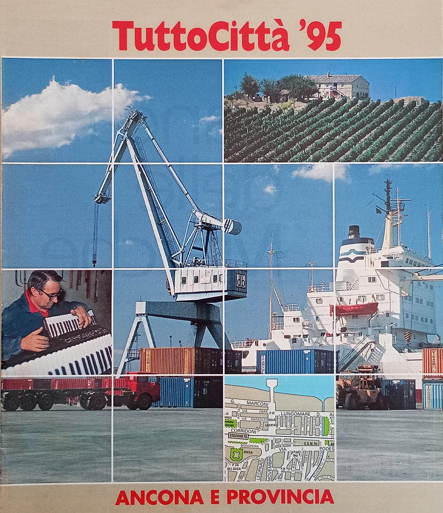</a>
Ancona 95
<ul class="scheda"><li><b>Formato:</b> 246 x 280 mm</li><li><b>Copertina:</b> sottile</li><li><b>Layout:</b> TuttoCittà '90 classico</li><li><b>Pagine:</b> 38</li><li><b>Mese aggiornamento:</b> maggio 1995</li></ul></td><td class="fasc"><a href="../immagini/PS95.jpg">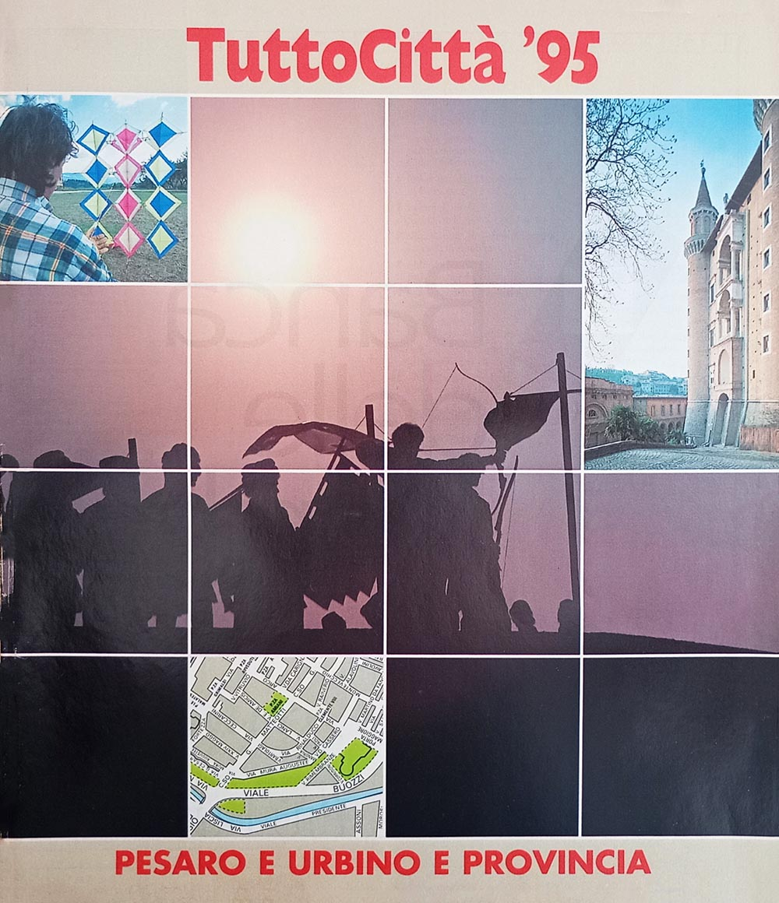</a>
Pesaro - Urbino 95
<ul class="scheda"><li><b>Formato:</b> 246 x 280 mm</li><li><b>Copertina:</b> sottile</li><li><b>Layout:</b> TuttoCittà '90 classico</li><li><b>Pagine:</b> 30</li><li><b>Mese aggiornamento:</b> maggio 1995</li></ul></td><td class="fasc"><a href="../immagini/AP95.jpg">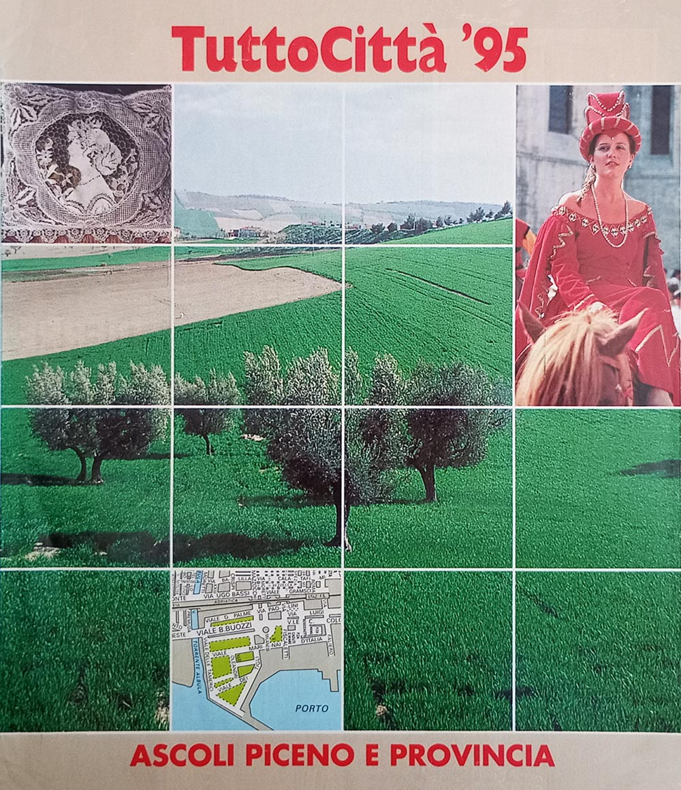</a>
Ascoli Piceno 95
<ul class="scheda"><li><b>Formato:</b> 246 x 280 mm</li><li><b>Copertina:</b> sottile</li><li><b>Layout:</b> TuttoCittà '90 classico</li><li><b>Pagine:</b> 22</li><li><b>Mese aggiornamento:</b> maggio 1995</li></ul></td><td class="fasc"><a href="../immagini/MC95.jpg">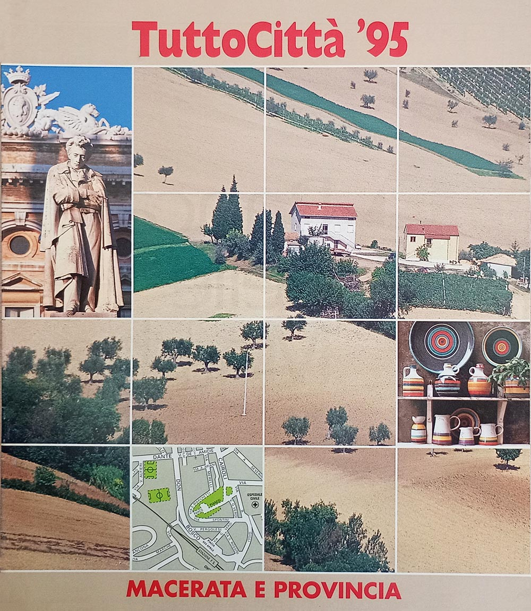</a>
Macerata 95
<ul class="scheda"><li><b>Formato:</b> 246 x 280 mm</li><li><b>Copertina:</b> sottile</li><li><b>Layout:</b> TuttoCittà '90 classico</li><li><b>Pagine:</b> 30</li><li><b>Mese aggiornamento:</b> maggio 1995</li></ul></td></tr>
<tr><td class="ann"> 96/97</td><td class="tav"></td><td class="fasc sospesa">
Ancona 96
<ul class="scheda"><li><b>Formato:</b> 226 x 274 mm</li><li><b>Copertina:</b> sottile</li><li><b>Layout:</b> TuttoCittà '90 classico</li><li><b>Pagine:</b> 70</li><li>non in raccolta</li></ul></td><td class="fasc sospesa">
Pesaro - Urbino 96
<ul class="scheda"><li><b>Formato:</b> 226 x 274 mm</li><li><b>Copertina:</b> sottile</li><li><b>Layout:</b> TuttoCittà '90 classico</li><li>non in raccolta</li></ul></td><td class="fasc sospesa">
Ascoli Piceno 96
<ul class="scheda"><li><b>Formato:</b> 226 x 274 mm</li><li><b>Copertina:</b> sottile</li><li><b>Layout:</b> TuttoCittà '90 classico</li><li>non in raccolta</li></ul></td><td class="fasc"><a href="../immagini/MC96.jpg">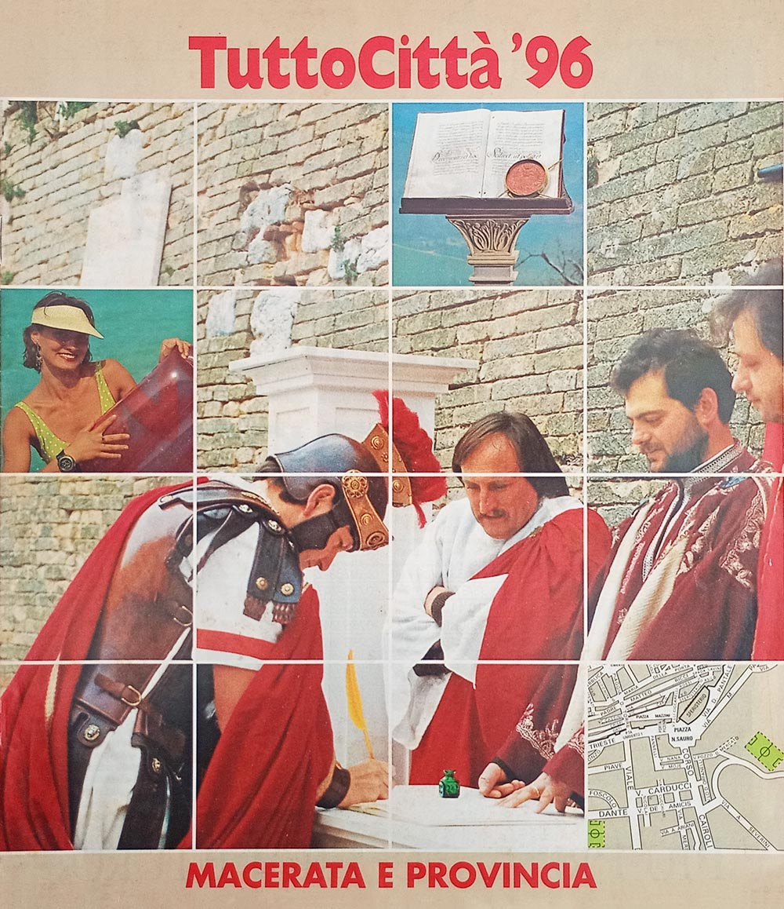</a>
Macerata 96
<ul class="scheda"><li><b>Formato:</b> 226 x 274 mm</li><li><b>Copertina:</b> sottile</li><li><b>Layout:</b> TuttoCittà '90 classico</li><li><b>Pagine:</b> 14</li><li><b>Mese aggiornamento:</b> giugno 1996</li></ul></td></tr>
<tr><td class="ann"> 97/98</td><td class="tav"></td><td class="fasc sospesa">
Ancona 97
<ul class="scheda"><li><b>Formato:</b> 226 x 274 mm</li><li><b>Copertina:</b> sottile</li><li><b>Layout:</b> TuttoCittà '90 classico</li><li><b>Pagine:</b> 70</li><li><b>Mese aggiornamento:</b> novembre 1996</li><li><b>Note:</b> Cambio formato</li><li>non in raccolta</li></ul></td><td class="fasc sospesa">
Pesaro - Urbino 97
<ul class="scheda"><li><b>Formato:</b> 226 x 274 mm</li><li><b>Copertina:</b> sottile</li><li><b>Layout:</b> TuttoCittà '90 classico</li><li><b>Note:</b> Cambio formato</li><li>non in raccolta</li></ul></td><td class="fasc sospesa">
Ascoli Piceno 97
<ul class="scheda"><li><b>Formato:</b> 226 x 274 mm</li><li><b>Copertina:</b> sottile</li><li><b>Layout:</b> TuttoCittà '90 classico</li><li><b>Note:</b> Cambio formato</li><li>non in raccolta</li></ul></td><td class="fasc sospesa">
Macerata 97
<ul class="scheda"><li><b>Formato:</b> 226 x 274 mm</li><li><b>Copertina:</b> sottile</li><li><b>Layout:</b> TuttoCittà '90 classico</li><li><b>Note:</b> Cambio formato</li><li>non in raccolta</li></ul></td></tr>
<tr><td class="ann"> 98/99</td><td class="tav"></td><td class="fasc sospesa">
Ancona (98)
<ul class="scheda"><li><b>Formato:</b> 226 x 274 mm</li><li><b>Copertina:</b> sottile</li><li><b>Layout:</b> TuttoCittà '90 riformato</li><li>non in raccolta</li></ul></td><td class="fasc vuota"></td><td class="fasc vuota"></td><td class="fasc vuota"></td></tr>
<tr><td class="ann"> 99/00</td><td class="tav"></td><td class="fasc sospesa">
Ancona 1999/2000
<ul class="scheda"><li><b>Formato:</b> 226 x 274 mm</li><li><b>Copertina:</b> sottile</li><li><b>Layout:</b> TuttoCittà nuovo millennio</li><li><b>Pagine:</b> 30</li><li>non in raccolta</li></ul></td><td class="fasc vuota"></td><td class="fasc vuota"></td><td class="fasc vuota"></td></tr>
<tr><td class="ann"> 00/01</td><td class="tav"></td><td class="fasc"><a href="../immagini/AN0001.jpg">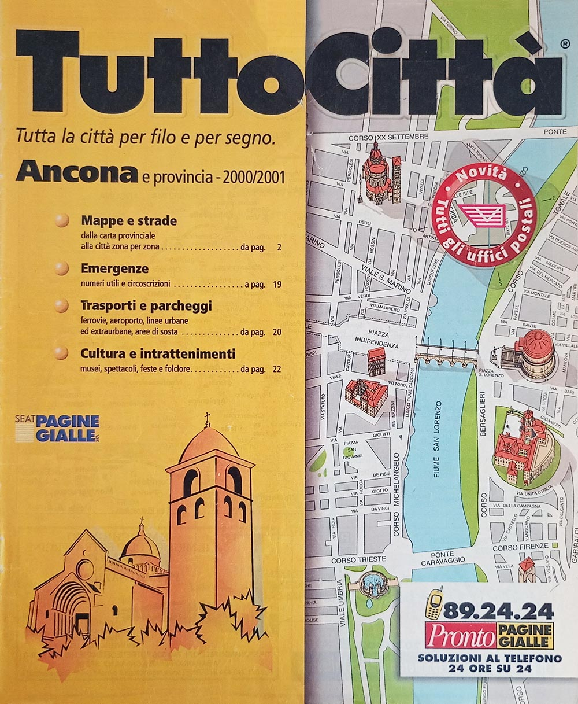</a>
Ancona 2000/2001
<ul class="scheda"><li><b>Formato:</b> 226 x 274 mm</li><li><b>Copertina:</b> sottile</li><li><b>Layout:</b> TuttoCittà nuovo millennio bis</li><li><b>Pagine:</b> 30</li><li><b>Mese aggiornamento:</b> giugno 2000</li></ul></td><td class="fasc vuota"></td><td class="fasc vuota"></td><td class="fasc vuota"></td></tr>
<tr><td class="ann"> 01/02</td><td class="tav"></td><td class="fasc sospesa">
Ancona 2001/2002
<ul class="scheda"><li><b>Formato:</b> 226 x 274 mm</li><li><b>Copertina:</b> sottile</li><li><b>Layout:</b> TuttoCittà nuovo millennio ter</li><li>non in raccolta</li></ul></td><td class="fasc vuota"></td><td class="fasc vuota"></td><td class="fasc vuota"></td></tr>
<tr><td class="ann"> 02/03</td><td class="tav"></td><td class="fasc sospesa">
Ancona ?
<ul class="scheda"><li><b>Formato:</b> 226 x 274 mm</li><li><b>Copertina:</b> sottile</li><li><b>Layout:</b> TuttoCittà nuovo millennio ter</li><li>non in raccolta</li></ul></td><td class="fasc vuota"></td><td class="fasc vuota"></td><td class="fasc vuota"></td></tr>
<tr><td class="ann"> 03/04</td><td class="tav"></td><td class="fasc sospesa">
Ancona ?
<ul class="scheda"><li><b>Formato:</b> 226 x 274 mm</li><li><b>Copertina:</b> sottile</li><li><b>Layout:</b> TuttoCittà nuovo millennio ter</li><li>non in raccolta</li></ul></td><td class="fasc vuota"></td><td class="fasc vuota"></td><td class="fasc vuota"></td></tr>
<tr><td class="ann"> 04/05</td><td class="tav"></td><td class="fasc"><a href="../immagini/AN04.jpg">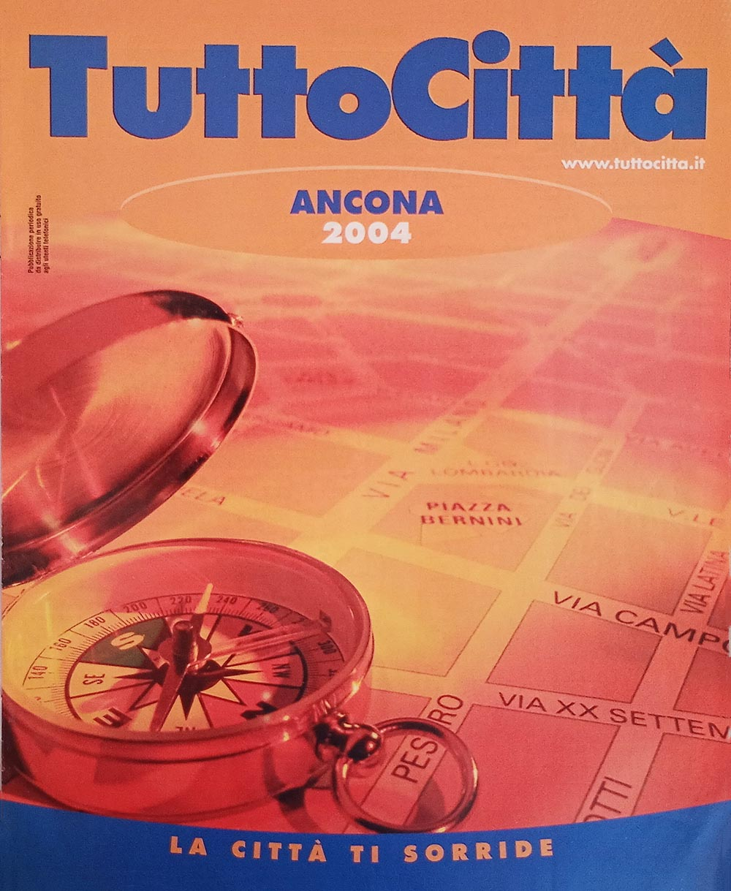</a>
Ancona 2004
<ul class="scheda"><li><b>Formato:</b> 226 x 274 mm</li><li><b>Copertina:</b> sottile</li><li><b>Layout:</b> TuttoCittà metà duemila</li><li><b>Pagine:</b> 30 (31)</li><li><b>Mese aggiornamento:</b> luglio 2004</li></ul></td><td class="fasc vuota"></td><td class="fasc vuota"></td><td class="fasc vuota"></td></tr>
<tr><td class="ann"> 05/06</td><td class="tav"></td><td class="fasc sospesa">
Ancona 2005
<ul class="scheda"><li><b>Formato:</b> 226 x 274 mm</li><li><b>Copertina:</b> sottile</li><li><b>Layout:</b> TuttoCittà metà duemila</li><li>non in raccolta</li></ul></td><td class="fasc vuota"></td><td class="fasc vuota"></td><td class="fasc vuota"></td></tr>
<tr><td class="ann"> 06/07</td><td class="tav"></td><td class="fasc sospesa">
Ancona 2006
<ul class="scheda"><li><b>Formato:</b> 226 x 274 mm</li><li><b>Copertina:</b> grossa</li><li><b>Layout:</b> TuttoCittà fine duemila</li><li><b>Pagine:</b> 56</li><li>non in raccolta</li></ul></td><td class="fasc vuota"></td><td class="fasc vuota"></td><td class="fasc vuota"></td></tr>
<tr><td class="ann"> 07/08</td><td class="tav"></td><td class="fasc"><a href="../immagini/AN07.jpg">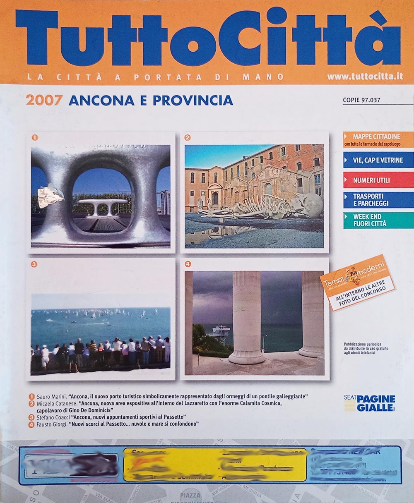</a>
Ancona 2007
<ul class="scheda"><li><b>Formato:</b> 226 x 274 mm</li><li><b>Copertina:</b> grossa</li><li><b>Layout:</b> TuttoCittà fine duemila</li><li><b>Pagine:</b> 32</li><li><b>Mese aggiornamento:</b> agosto 2007</li></ul></td><td class="fasc vuota"></td><td class="fasc vuota"></td><td class="fasc vuota"></td></tr>
<tr><td class="ann"> 08/09</td><td class="tav"></td><td class="fasc"><a href="../immagini/AN0809.jpg">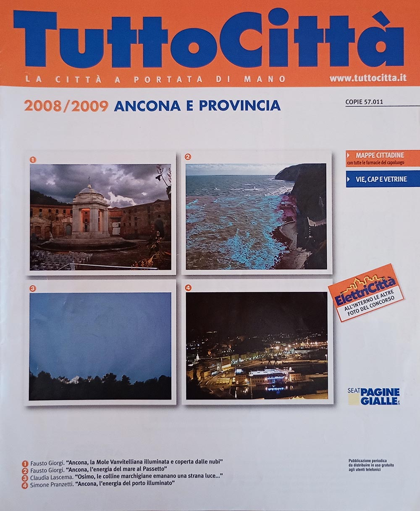</a>
Ancona 2008/2009
<ul class="scheda"><li><b>Formato:</b> 226 x 274 mm</li><li><b>Copertina:</b> grossa</li><li><b>Layout:</b> TuttoCittà fine duemila</li><li><b>Pagine:</b> 24 (25)</li><li><b>Mese aggiornamento:</b> luglio 2008</li></ul></td><td class="fasc vuota"></td><td class="fasc vuota"></td><td class="fasc vuota"></td></tr>
<tr><td class="ann"> 09/10</td><td class="tav"></td><td class="fasc"><a href="../immagini/AN0910.jpg">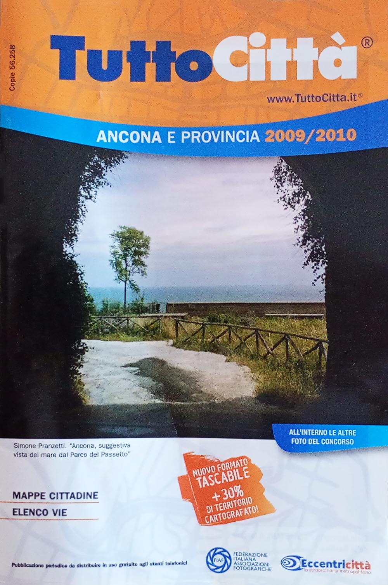</a>
Ancona 2009/2010
<ul class="scheda"><li><b>Formato:</b> 226 x 274 mm</li><li><b>Copertina:</b> grossa</li><li><b>Layout:</b> TuttoCittà anni dieci</li><li><b>Pagine:</b> 32</li><li><b>Mese aggiornamento:</b> agosto 2009</li><li><b>Note:</b> Riforma cartografica; nuovo formato</li></ul></td><td class="fasc vuota"></td><td class="fasc vuota"></td><td class="fasc vuota"></td></tr>
<tr><td class="ann"> 10/11</td><td class="tav"></td><td class="fasc sospesa">
Ancona 2010/2011
<ul class="scheda"><li><b>Formato:</b> 140 x 212 mm</li><li><b>Copertina:</b> grossa</li><li><b>Layout:</b> TuttoCittà anni dieci</li><li>non in raccolta</li></ul></td><td class="fasc vuota"></td><td class="fasc vuota"></td><td class="fasc vuota"></td></tr>
<tr><td class="ann"> 11/12</td><td class="tav"></td><td class="fasc"><a href="../immagini/AN1112.jpg">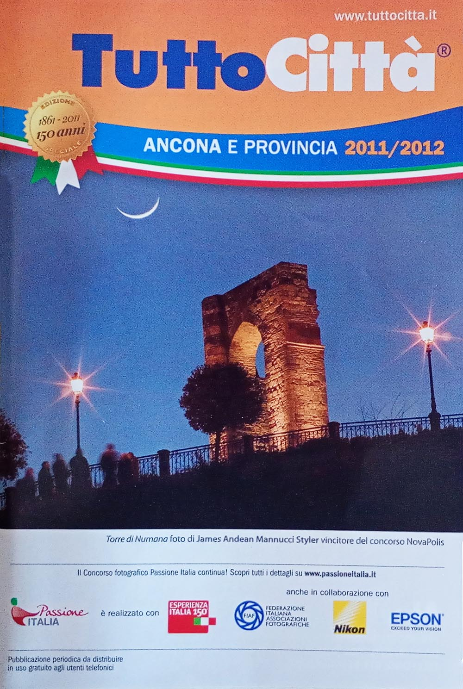</a>
Ancona 2011/2012
<ul class="scheda"><li><b>Formato:</b> 140 x 212 mm</li><li><b>Copertina:</b> grossa</li><li><b>Layout:</b> TuttoCittà anni dieci</li><li><b>Pagine:</b> 32</li><li><b>Mese aggiornamento:</b> agosto 2011</li></ul></td><td class="fasc vuota"></td><td class="fasc vuota"></td><td class="fasc vuota"></td></tr>
<tr><td class="ann"> 12/13</td><td class="tav"></td><td class="fasc sospesa">
Ancona 2012/2013
<ul class="scheda"><li><b>Formato:</b> 140 x 212 mm</li><li><b>Copertina:</b> grossa</li><li><b>Layout:</b> TuttoCittà anni dieci</li><li>non in raccolta</li></ul></td><td class="fasc vuota"></td><td class="fasc vuota"></td><td class="fasc vuota"></td></tr>
<tr><td class="ann"> 13/14</td><td class="tav"></td><td class="fasc sospesa">
Ancona 2013/2014
<ul class="scheda"><li><b>Formato:</b> 140 x 212 mm</li><li><b>Copertina:</b> grossa</li><li><b>Layout:</b> TuttoCittà anni dieci</li><li>non in raccolta</li></ul></td><td class="fasc vuota"></td><td class="fasc vuota"></td><td class="fasc vuota"></td></tr>
<tr><td class="ann"> 14/15</td><td class="tav"></td><td class="fasc sospesa">
Ancona 2014/2015
<ul class="scheda"><li><b>Formato:</b> 140 x 212 mm</li><li><b>Copertina:</b> grossa</li><li><b>Layout:</b> TuttoCittà anni dieci</li><li>non in raccolta</li></ul></td><td class="fasc vuota"></td><td class="fasc vuota"></td><td class="fasc vuota"></td></tr>
</tbody>
</table>

## Dodici layout in trentaquattro anni

La seguente tabella censisce i vari layout utilizzati per i fascicoli della regione, secondo il sistema definito durante il censimento osservando l'impaginazione; le loro caratteristiche sono descritte in [questa pagina](tabella-layout.md). Come descritto anche lì, i cambi di layout non rispettano i cambi delle serie di copertina descritte nell'[apposita pagina](copertine.md) di questo sito.

<table class="layout-dettaglio">
<thead><tr><th>Layout</th><th>Annate</th><th>Anni di copertina</th></tr></thead>
<tbody>
<tr><td>Stradario SEAT</td><td class="ann">81/82</td><td class="cop">81</td></tr>
<tr><td>TuttoCittà '80 con foto</td><td class="ann">81/82</td><td class="cop">81</td></tr>
<tr><td>TuttoCittà '80 classico</td><td class="ann">82/83 – 89/90</td><td class="cop">82<i class="pt"></i>83<i class="pt"></i>84<i class="pt"></i>85<i class="pt"></i>86<i class="pt"></i>87<i class="pt"></i>88<i class="pt"></i>89</td></tr>
<tr><td>TuttoCittà '90 classico iniziale</td><td class="ann">90/91 – 91/92</td><td class="cop">90/91<i class="pt"></i>91</td></tr>
<tr><td>TuttoCittà '90 classico</td><td class="ann">92/93 – 97/98</td><td class="cop">92<i class="pt"></i>93<i class="pt"></i>94<i class="pt"></i>95<i class="pt"></i>96<i class="pt"></i>97</td></tr>
<tr><td>TuttoCittà '90 riformato</td><td class="ann">98/99</td><td class="cop">98</td></tr>
<tr><td>TuttoCittà nuovo millennio</td><td class="ann">99/00</td><td class="cop">99/00</td></tr>
<tr><td>TuttoCittà nuovo millennio bis</td><td class="ann">00/01</td><td class="cop">00/01</td></tr>
<tr><td>TuttoCittà nuovo millennio ter</td><td class="ann">01/02 – 03/04</td><td class="cop">01/02</td></tr>
<tr><td>TuttoCittà metà duemila</td><td class="ann">04/05 – 05/06</td><td class="cop">04<i class="pt"></i>05</td></tr>
<tr><td>TuttoCittà fine duemila</td><td class="ann">06/07 – 08/09</td><td class="cop">06<i class="pt"></i>07<i class="pt"></i>08/09</td></tr>
<tr><td>TuttoCittà anni dieci</td><td class="ann">09/10 – 14/15</td><td class="cop">09/10<i class="pt"></i>10/11<i class="pt"></i>11/12<i class="pt"></i>12/13<i class="pt"></i>13/14<i class="pt"></i>14/15</td></tr>
</tbody>
</table>

## Le città cartografate

La seguente tabella censisce tutti i comuni che sono stati cartografati nel corso del tempo e per quante annate. Ad ogni riga corrisponde un comune, in ordine alfabetico e non per provincia: lo scopo è infatti identificare a colpo d'occhio quali comuni entrano ed escono dalla cartografia nel corso degli anni. I cinque capoluoghi storici — ANCONA, ASCOLI PICENO, MACERATA, PESARO, URBINO — sono in maiuscolo, ma restano al loro posto nell'alfabeto.

La croce segna le annate in cui non sappiamo: perché il fascicolo che avrebbe portato quel comune non è in raccolta, perché non è accertato che sia mai esistito, o perché il suo contenuto non è ancora stato spogliato.

Le caselle azzurre indicano invece che il comune era cartografato, ma non compariva nel relativo elenco delle vie, un fenomeno relativamente comune soprattutto nei fascicoli degli anni '80.

Espandi la griglia delle città — 21 città su 34 annate

<table class="griglia">
  <thead><tr><th scope="col">Città</th><th scope="col" class="ann dec">81/82</th><th scope="col" class="ann">82/83</th><th scope="col" class="ann">83/84</th><th scope="col" class="ann">84/85</th><th scope="col" class="ann">85/86</th><th scope="col" class="ann">86/87</th><th scope="col" class="ann">87/88</th><th scope="col" class="ann">88/89</th><th scope="col" class="ann">89/90</th><th scope="col" class="ann dec">90/91</th><th scope="col" class="ann">91/92</th><th scope="col" class="ann">92/93</th><th scope="col" class="ann">93/94</th><th scope="col" class="ann">94/95</th><th scope="col" class="ann">95/96</th><th scope="col" class="ann">96/97</th><th scope="col" class="ann">97/98</th><th scope="col" class="ann">98/99</th><th scope="col" class="ann">99/00</th><th scope="col" class="ann dec">00/01</th><th scope="col" class="ann">01/02</th><th scope="col" class="ann">02/03</th><th scope="col" class="ann">03/04</th><th scope="col" class="ann">04/05</th><th scope="col" class="ann">05/06</th><th scope="col" class="ann">06/07</th><th scope="col" class="ann">07/08</th><th scope="col" class="ann">08/09</th><th scope="col" class="ann">09/10</th><th scope="col" class="ann dec">10/11</th><th scope="col" class="ann">11/12</th><th scope="col" class="ann">12/13</th><th scope="col" class="ann">13/14</th><th scope="col" class="ann">14/15</th></tr></thead>
  <tbody>
  <tr><th scope="row">ANCONA</th><td class="si dec" title="Ancona — 81/82"></td><td class="si" title="Ancona — 82/83"></td><td class="si" title="Ancona — 83/84"></td><td class="ig" title="Ancona — 84/85: non accertato, fascicolo mancante">&#215;</td><td class="ig" title="Ancona — 85/86: non accertato, fascicolo mancante">&#215;</td><td class="si" title="Ancona — 86/87"></td><td class="si" title="Ancona — 87/88"></td><td class="ig" title="Ancona — 88/89: non accertato, fascicolo mancante">&#215;</td><td class="si" title="Ancona — 89/90"></td><td class="si dec" title="Ancona — 90/91"></td><td class="si" title="Ancona — 91/92"></td><td class="si" title="Ancona — 92/93"></td><td class="si" title="Ancona — 93/94"></td><td class="ig" title="Ancona — 94/95: non accertato, fascicolo mancante">&#215;</td><td class="si" title="Ancona — 95/96"></td><td class="ig" title="Ancona — 96/97: non accertato, fascicolo mancante">&#215;</td><td class="ig" title="Ancona — 97/98: non accertato, fascicolo mancante">&#215;</td><td class="ig" title="Ancona — 98/99: non accertato, fascicolo mancante">&#215;</td><td class="ig" title="Ancona — 99/00: non accertato, fascicolo mancante">&#215;</td><td class="si dec" title="Ancona — 00/01"></td><td class="ig" title="Ancona — 01/02: non accertato, fascicolo mancante">&#215;</td><td class="ig" title="Ancona — 02/03: non accertato, fascicolo mancante">&#215;</td><td class="ig" title="Ancona — 03/04: non accertato, fascicolo mancante">&#215;</td><td class="si" title="Ancona — 04/05"></td><td class="ig" title="Ancona — 05/06: non accertato, fascicolo mancante">&#215;</td><td class="ig" title="Ancona — 06/07: non accertato, fascicolo mancante">&#215;</td><td class="si" title="Ancona — 07/08"></td><td class="si" title="Ancona — 08/09"></td><td class="si" title="Ancona — 09/10"></td><td class="ig dec" title="Ancona — 10/11: non accertato, fascicolo mancante">&#215;</td><td class="si" title="Ancona — 11/12"></td><td class="ig" title="Ancona — 12/13: non accertato, fascicolo mancante">&#215;</td><td class="ig" title="Ancona — 13/14: non accertato, fascicolo mancante">&#215;</td><td class="ig" title="Ancona — 14/15: non accertato, fascicolo mancante">&#215;</td></tr>
  <tr><th scope="row">ASCOLI PICENO</th><td class="si dec" title="Ascoli Piceno — 81/82"></td><td class="si" title="Ascoli Piceno — 82/83"></td><td class="ig" title="Ascoli Piceno — 83/84: non accertato, fascicolo mancante">&#215;</td><td class="si" title="Ascoli Piceno — 84/85"></td><td class="ig" title="Ascoli Piceno — 85/86: non accertato, fascicolo mancante">&#215;</td><td class="si" title="Ascoli Piceno — 86/87"></td><td class="si" title="Ascoli Piceno — 87/88"></td><td class="si" title="Ascoli Piceno — 88/89"></td><td class="si" title="Ascoli Piceno — 89/90"></td><td class="ig dec" title="Ascoli Piceno — 90/91: non accertato, fascicolo mancante">&#215;</td><td class="si" title="Ascoli Piceno — 91/92"></td><td class="si" title="Ascoli Piceno — 92/93"></td><td class="si" title="Ascoli Piceno — 93/94"></td><td class="ig" title="Ascoli Piceno — 94/95: non accertato, fascicolo mancante">&#215;</td><td class="si" title="Ascoli Piceno — 95/96"></td><td class="ig" title="Ascoli Piceno — 96/97: non accertato, fascicolo mancante">&#215;</td><td class="ig" title="Ascoli Piceno — 97/98: non accertato, fascicolo mancante">&#215;</td><td class="no" title="Ascoli Piceno — 98/99"></td><td class="no" title="Ascoli Piceno — 99/00"></td><td class="no dec" title="Ascoli Piceno — 00/01"></td><td class="no" title="Ascoli Piceno — 01/02"></td><td class="no" title="Ascoli Piceno — 02/03"></td><td class="no" title="Ascoli Piceno — 03/04"></td><td class="no" title="Ascoli Piceno — 04/05"></td><td class="no" title="Ascoli Piceno — 05/06"></td><td class="no" title="Ascoli Piceno — 06/07"></td><td class="no" title="Ascoli Piceno — 07/08"></td><td class="no" title="Ascoli Piceno — 08/09"></td><td class="no" title="Ascoli Piceno — 09/10"></td><td class="no dec" title="Ascoli Piceno — 10/11"></td><td class="no" title="Ascoli Piceno — 11/12"></td><td class="no" title="Ascoli Piceno — 12/13"></td><td class="no" title="Ascoli Piceno — 13/14"></td><td class="no" title="Ascoli Piceno — 14/15"></td></tr>
  <tr><th scope="row">Castelfidardo</th><td class="no dec" title="Castelfidardo — 81/82"></td><td class="no" title="Castelfidardo — 82/83"></td><td class="no" title="Castelfidardo — 83/84"></td><td class="ig" title="Castelfidardo — 84/85: non accertato, fascicolo mancante">&#215;</td><td class="ig" title="Castelfidardo — 85/86: non accertato, fascicolo mancante">&#215;</td><td class="no" title="Castelfidardo — 86/87"></td><td class="no" title="Castelfidardo — 87/88"></td><td class="ig" title="Castelfidardo — 88/89: non accertato, fascicolo mancante">&#215;</td><td class="no" title="Castelfidardo — 89/90"></td><td class="no dec" title="Castelfidardo — 90/91"></td><td class="no" title="Castelfidardo — 91/92"></td><td class="no" title="Castelfidardo — 92/93"></td><td class="no" title="Castelfidardo — 93/94"></td><td class="ig" title="Castelfidardo — 94/95: non accertato, fascicolo mancante">&#215;</td><td class="no" title="Castelfidardo — 95/96"></td><td class="ig" title="Castelfidardo — 96/97: non accertato, fascicolo mancante">&#215;</td><td class="ig" title="Castelfidardo — 97/98: non accertato, fascicolo mancante">&#215;</td><td class="ig" title="Castelfidardo — 98/99: non accertato, fascicolo mancante">&#215;</td><td class="ig" title="Castelfidardo — 99/00: non accertato, fascicolo mancante">&#215;</td><td class="no dec" title="Castelfidardo — 00/01"></td><td class="ig" title="Castelfidardo — 01/02: non accertato, fascicolo mancante">&#215;</td><td class="ig" title="Castelfidardo — 02/03: non accertato, fascicolo mancante">&#215;</td><td class="ig" title="Castelfidardo — 03/04: non accertato, fascicolo mancante">&#215;</td><td class="no" title="Castelfidardo — 04/05"></td><td class="ig" title="Castelfidardo — 05/06: non accertato, fascicolo mancante">&#215;</td><td class="ig" title="Castelfidardo — 06/07: non accertato, fascicolo mancante">&#215;</td><td class="si" title="Castelfidardo — 07/08"></td><td class="si" title="Castelfidardo — 08/09"></td><td class="si" title="Castelfidardo — 09/10"></td><td class="ig dec" title="Castelfidardo — 10/11: non accertato, fascicolo mancante">&#215;</td><td class="no" title="Castelfidardo — 11/12"></td><td class="ig" title="Castelfidardo — 12/13: non accertato, fascicolo mancante">&#215;</td><td class="ig" title="Castelfidardo — 13/14: non accertato, fascicolo mancante">&#215;</td><td class="ig" title="Castelfidardo — 14/15: non accertato, fascicolo mancante">&#215;</td></tr>
  <tr><th scope="row">Civitanova Marche</th><td class="no dec" title="Civitanova Marche — 81/82"></td><td class="no" title="Civitanova Marche — 82/83"></td><td class="ig" title="Civitanova Marche — 83/84: non accertato, fascicolo mancante">&#215;</td><td class="no" title="Civitanova Marche — 84/85"></td><td class="ig" title="Civitanova Marche — 85/86: non accertato, fascicolo mancante">&#215;</td><td class="no" title="Civitanova Marche — 86/87"></td><td class="no" title="Civitanova Marche — 87/88"></td><td class="ni" title="Civitanova Marche — 88/89: cartografato, ma assente dall'elenco delle vie"></td><td class="si" title="Civitanova Marche — 89/90"></td><td class="si dec" title="Civitanova Marche — 90/91"></td><td class="si" title="Civitanova Marche — 91/92"></td><td class="si" title="Civitanova Marche — 92/93"></td><td class="si" title="Civitanova Marche — 93/94"></td><td class="si" title="Civitanova Marche — 94/95"></td><td class="si" title="Civitanova Marche — 95/96"></td><td class="si" title="Civitanova Marche — 96/97"></td><td class="ig" title="Civitanova Marche — 97/98: non accertato, fascicolo mancante">&#215;</td><td class="no" title="Civitanova Marche — 98/99"></td><td class="no" title="Civitanova Marche — 99/00"></td><td class="no dec" title="Civitanova Marche — 00/01"></td><td class="no" title="Civitanova Marche — 01/02"></td><td class="no" title="Civitanova Marche — 02/03"></td><td class="no" title="Civitanova Marche — 03/04"></td><td class="no" title="Civitanova Marche — 04/05"></td><td class="no" title="Civitanova Marche — 05/06"></td><td class="no" title="Civitanova Marche — 06/07"></td><td class="no" title="Civitanova Marche — 07/08"></td><td class="no" title="Civitanova Marche — 08/09"></td><td class="no" title="Civitanova Marche — 09/10"></td><td class="no dec" title="Civitanova Marche — 10/11"></td><td class="no" title="Civitanova Marche — 11/12"></td><td class="no" title="Civitanova Marche — 12/13"></td><td class="no" title="Civitanova Marche — 13/14"></td><td class="no" title="Civitanova Marche — 14/15"></td></tr>
  <tr><th scope="row">Fabriano</th><td class="no dec" title="Fabriano — 81/82"></td><td class="si" title="Fabriano — 82/83"></td><td class="si" title="Fabriano — 83/84"></td><td class="ig" title="Fabriano — 84/85: non accertato, fascicolo mancante">&#215;</td><td class="ig" title="Fabriano — 85/86: non accertato, fascicolo mancante">&#215;</td><td class="si" title="Fabriano — 86/87"></td><td class="si" title="Fabriano — 87/88"></td><td class="ig" title="Fabriano — 88/89: non accertato, fascicolo mancante">&#215;</td><td class="si" title="Fabriano — 89/90"></td><td class="si dec" title="Fabriano — 90/91"></td><td class="si" title="Fabriano — 91/92"></td><td class="si" title="Fabriano — 92/93"></td><td class="si" title="Fabriano — 93/94"></td><td class="ig" title="Fabriano — 94/95: non accertato, fascicolo mancante">&#215;</td><td class="si" title="Fabriano — 95/96"></td><td class="ig" title="Fabriano — 96/97: non accertato, fascicolo mancante">&#215;</td><td class="ig" title="Fabriano — 97/98: non accertato, fascicolo mancante">&#215;</td><td class="ig" title="Fabriano — 98/99: non accertato, fascicolo mancante">&#215;</td><td class="ig" title="Fabriano — 99/00: non accertato, fascicolo mancante">&#215;</td><td class="si dec" title="Fabriano — 00/01"></td><td class="ig" title="Fabriano — 01/02: non accertato, fascicolo mancante">&#215;</td><td class="ig" title="Fabriano — 02/03: non accertato, fascicolo mancante">&#215;</td><td class="ig" title="Fabriano — 03/04: non accertato, fascicolo mancante">&#215;</td><td class="si" title="Fabriano — 04/05"></td><td class="ig" title="Fabriano — 05/06: non accertato, fascicolo mancante">&#215;</td><td class="ig" title="Fabriano — 06/07: non accertato, fascicolo mancante">&#215;</td><td class="si" title="Fabriano — 07/08"></td><td class="si" title="Fabriano — 08/09"></td><td class="si" title="Fabriano — 09/10"></td><td class="ig dec" title="Fabriano — 10/11: non accertato, fascicolo mancante">&#215;</td><td class="si" title="Fabriano — 11/12"></td><td class="ig" title="Fabriano — 12/13: non accertato, fascicolo mancante">&#215;</td><td class="ig" title="Fabriano — 13/14: non accertato, fascicolo mancante">&#215;</td><td class="ig" title="Fabriano — 14/15: non accertato, fascicolo mancante">&#215;</td></tr>
  <tr><th scope="row">Falconara Marittima</th><td class="no dec" title="Falconara Marittima — 81/82"></td><td class="no" title="Falconara Marittima — 82/83"></td><td class="no" title="Falconara Marittima — 83/84"></td><td class="ig" title="Falconara Marittima — 84/85: non accertato, fascicolo mancante">&#215;</td><td class="ig" title="Falconara Marittima — 85/86: non accertato, fascicolo mancante">&#215;</td><td class="no" title="Falconara Marittima — 86/87"></td><td class="no" title="Falconara Marittima — 87/88"></td><td class="ig" title="Falconara Marittima — 88/89: non accertato, fascicolo mancante">&#215;</td><td class="no" title="Falconara Marittima — 89/90"></td><td class="no dec" title="Falconara Marittima — 90/91"></td><td class="si" title="Falconara Marittima — 91/92"></td><td class="si" title="Falconara Marittima — 92/93"></td><td class="si" title="Falconara Marittima — 93/94"></td><td class="ig" title="Falconara Marittima — 94/95: non accertato, fascicolo mancante">&#215;</td><td class="si" title="Falconara Marittima — 95/96"></td><td class="ig" title="Falconara Marittima — 96/97: non accertato, fascicolo mancante">&#215;</td><td class="ig" title="Falconara Marittima — 97/98: non accertato, fascicolo mancante">&#215;</td><td class="ig" title="Falconara Marittima — 98/99: non accertato, fascicolo mancante">&#215;</td><td class="ig" title="Falconara Marittima — 99/00: non accertato, fascicolo mancante">&#215;</td><td class="si dec" title="Falconara Marittima — 00/01"></td><td class="ig" title="Falconara Marittima — 01/02: non accertato, fascicolo mancante">&#215;</td><td class="ig" title="Falconara Marittima — 02/03: non accertato, fascicolo mancante">&#215;</td><td class="ig" title="Falconara Marittima — 03/04: non accertato, fascicolo mancante">&#215;</td><td class="si" title="Falconara Marittima — 04/05"></td><td class="ig" title="Falconara Marittima — 05/06: non accertato, fascicolo mancante">&#215;</td><td class="ig" title="Falconara Marittima — 06/07: non accertato, fascicolo mancante">&#215;</td><td class="si" title="Falconara Marittima — 07/08"></td><td class="si" title="Falconara Marittima — 08/09"></td><td class="si" title="Falconara Marittima — 09/10"></td><td class="ig dec" title="Falconara Marittima — 10/11: non accertato, fascicolo mancante">&#215;</td><td class="si" title="Falconara Marittima — 11/12"></td><td class="ig" title="Falconara Marittima — 12/13: non accertato, fascicolo mancante">&#215;</td><td class="ig" title="Falconara Marittima — 13/14: non accertato, fascicolo mancante">&#215;</td><td class="ig" title="Falconara Marittima — 14/15: non accertato, fascicolo mancante">&#215;</td></tr>
  <tr><th scope="row">Fano</th><td class="no dec" title="Fano — 81/82"></td><td class="si" title="Fano — 82/83"></td><td class="si" title="Fano — 83/84"></td><td class="ig" title="Fano — 84/85: non accertato, fascicolo mancante">&#215;</td><td class="si" title="Fano — 85/86"></td><td class="si" title="Fano — 86/87"></td><td class="ig" title="Fano — 87/88: non accertato, fascicolo mancante">&#215;</td><td class="si" title="Fano — 88/89"></td><td class="si" title="Fano — 89/90"></td><td class="si dec" title="Fano — 90/91"></td><td class="si" title="Fano — 91/92"></td><td class="si" title="Fano — 92/93"></td><td class="si" title="Fano — 93/94"></td><td class="ig" title="Fano — 94/95: non accertato, fascicolo mancante">&#215;</td><td class="si" title="Fano — 95/96"></td><td class="ig" title="Fano — 96/97: non accertato, fascicolo mancante">&#215;</td><td class="ig" title="Fano — 97/98: non accertato, fascicolo mancante">&#215;</td><td class="no" title="Fano — 98/99"></td><td class="no" title="Fano — 99/00"></td><td class="no dec" title="Fano — 00/01"></td><td class="no" title="Fano — 01/02"></td><td class="no" title="Fano — 02/03"></td><td class="no" title="Fano — 03/04"></td><td class="no" title="Fano — 04/05"></td><td class="no" title="Fano — 05/06"></td><td class="no" title="Fano — 06/07"></td><td class="no" title="Fano — 07/08"></td><td class="no" title="Fano — 08/09"></td><td class="no" title="Fano — 09/10"></td><td class="no dec" title="Fano — 10/11"></td><td class="no" title="Fano — 11/12"></td><td class="no" title="Fano — 12/13"></td><td class="no" title="Fano — 13/14"></td><td class="no" title="Fano — 14/15"></td></tr>
  <tr><th scope="row">Fermo</th><td class="no dec" title="Fermo — 81/82"></td><td class="no" title="Fermo — 82/83"></td><td class="ig" title="Fermo — 83/84: non accertato, fascicolo mancante">&#215;</td><td class="no" title="Fermo — 84/85"></td><td class="ig" title="Fermo — 85/86: non accertato, fascicolo mancante">&#215;</td><td class="no" title="Fermo — 86/87"></td><td class="no" title="Fermo — 87/88"></td><td class="no" title="Fermo — 88/89"></td><td class="si" title="Fermo — 89/90"></td><td class="ig dec" title="Fermo — 90/91: non accertato, fascicolo mancante">&#215;</td><td class="si" title="Fermo — 91/92"></td><td class="si" title="Fermo — 92/93"></td><td class="si" title="Fermo — 93/94"></td><td class="ig" title="Fermo — 94/95: non accertato, fascicolo mancante">&#215;</td><td class="si" title="Fermo — 95/96"></td><td class="ig" title="Fermo — 96/97: non accertato, fascicolo mancante">&#215;</td><td class="ig" title="Fermo — 97/98: non accertato, fascicolo mancante">&#215;</td><td class="no" title="Fermo — 98/99"></td><td class="no" title="Fermo — 99/00"></td><td class="no dec" title="Fermo — 00/01"></td><td class="no" title="Fermo — 01/02"></td><td class="no" title="Fermo — 02/03"></td><td class="no" title="Fermo — 03/04"></td><td class="no" title="Fermo — 04/05"></td><td class="no" title="Fermo — 05/06"></td><td class="no" title="Fermo — 06/07"></td><td class="no" title="Fermo — 07/08"></td><td class="no" title="Fermo — 08/09"></td><td class="no" title="Fermo — 09/10"></td><td class="no dec" title="Fermo — 10/11"></td><td class="no" title="Fermo — 11/12"></td><td class="no" title="Fermo — 12/13"></td><td class="no" title="Fermo — 13/14"></td><td class="no" title="Fermo — 14/15"></td></tr>
  <tr><th scope="row">Jesi</th><td class="no dec" title="Jesi — 81/82"></td><td class="si" title="Jesi — 82/83"></td><td class="si" title="Jesi — 83/84"></td><td class="ig" title="Jesi — 84/85: non accertato, fascicolo mancante">&#215;</td><td class="ig" title="Jesi — 85/86: non accertato, fascicolo mancante">&#215;</td><td class="si" title="Jesi — 86/87"></td><td class="si" title="Jesi — 87/88"></td><td class="ig" title="Jesi — 88/89: non accertato, fascicolo mancante">&#215;</td><td class="si" title="Jesi — 89/90"></td><td class="si dec" title="Jesi — 90/91"></td><td class="si" title="Jesi — 91/92"></td><td class="si" title="Jesi — 92/93"></td><td class="si" title="Jesi — 93/94"></td><td class="ig" title="Jesi — 94/95: non accertato, fascicolo mancante">&#215;</td><td class="si" title="Jesi — 95/96"></td><td class="ig" title="Jesi — 96/97: non accertato, fascicolo mancante">&#215;</td><td class="ig" title="Jesi — 97/98: non accertato, fascicolo mancante">&#215;</td><td class="ig" title="Jesi — 98/99: non accertato, fascicolo mancante">&#215;</td><td class="ig" title="Jesi — 99/00: non accertato, fascicolo mancante">&#215;</td><td class="si dec" title="Jesi — 00/01"></td><td class="ig" title="Jesi — 01/02: non accertato, fascicolo mancante">&#215;</td><td class="ig" title="Jesi — 02/03: non accertato, fascicolo mancante">&#215;</td><td class="ig" title="Jesi — 03/04: non accertato, fascicolo mancante">&#215;</td><td class="si" title="Jesi — 04/05"></td><td class="ig" title="Jesi — 05/06: non accertato, fascicolo mancante">&#215;</td><td class="ig" title="Jesi — 06/07: non accertato, fascicolo mancante">&#215;</td><td class="si" title="Jesi — 07/08"></td><td class="si" title="Jesi — 08/09"></td><td class="si" title="Jesi — 09/10"></td><td class="ig dec" title="Jesi — 10/11: non accertato, fascicolo mancante">&#215;</td><td class="si" title="Jesi — 11/12"></td><td class="ig" title="Jesi — 12/13: non accertato, fascicolo mancante">&#215;</td><td class="ig" title="Jesi — 13/14: non accertato, fascicolo mancante">&#215;</td><td class="ig" title="Jesi — 14/15: non accertato, fascicolo mancante">&#215;</td></tr>
  <tr><th scope="row">MACERATA</th><td class="si dec" title="Macerata — 81/82"></td><td class="si" title="Macerata — 82/83"></td><td class="ig" title="Macerata — 83/84: non accertato, fascicolo mancante">&#215;</td><td class="si" title="Macerata — 84/85"></td><td class="ig" title="Macerata — 85/86: non accertato, fascicolo mancante">&#215;</td><td class="si" title="Macerata — 86/87"></td><td class="si" title="Macerata — 87/88"></td><td class="si" title="Macerata — 88/89"></td><td class="si" title="Macerata — 89/90"></td><td class="si dec" title="Macerata — 90/91"></td><td class="si" title="Macerata — 91/92"></td><td class="si" title="Macerata — 92/93"></td><td class="si" title="Macerata — 93/94"></td><td class="si" title="Macerata — 94/95"></td><td class="si" title="Macerata — 95/96"></td><td class="si" title="Macerata — 96/97"></td><td class="ig" title="Macerata — 97/98: non accertato, fascicolo mancante">&#215;</td><td class="no" title="Macerata — 98/99"></td><td class="no" title="Macerata — 99/00"></td><td class="no dec" title="Macerata — 00/01"></td><td class="no" title="Macerata — 01/02"></td><td class="no" title="Macerata — 02/03"></td><td class="no" title="Macerata — 03/04"></td><td class="no" title="Macerata — 04/05"></td><td class="no" title="Macerata — 05/06"></td><td class="no" title="Macerata — 06/07"></td><td class="no" title="Macerata — 07/08"></td><td class="no" title="Macerata — 08/09"></td><td class="no" title="Macerata — 09/10"></td><td class="no dec" title="Macerata — 10/11"></td><td class="no" title="Macerata — 11/12"></td><td class="no" title="Macerata — 12/13"></td><td class="no" title="Macerata — 13/14"></td><td class="no" title="Macerata — 14/15"></td></tr>
  <tr><th scope="row">Osimo</th><td class="no dec" title="Osimo — 81/82"></td><td class="no" title="Osimo — 82/83"></td><td class="no" title="Osimo — 83/84"></td><td class="ig" title="Osimo — 84/85: non accertato, fascicolo mancante">&#215;</td><td class="ig" title="Osimo — 85/86: non accertato, fascicolo mancante">&#215;</td><td class="no" title="Osimo — 86/87"></td><td class="no" title="Osimo — 87/88"></td><td class="ig" title="Osimo — 88/89: non accertato, fascicolo mancante">&#215;</td><td class="si" title="Osimo — 89/90"></td><td class="si dec" title="Osimo — 90/91"></td><td class="si" title="Osimo — 91/92"></td><td class="si" title="Osimo — 92/93"></td><td class="si" title="Osimo — 93/94"></td><td class="ig" title="Osimo — 94/95: non accertato, fascicolo mancante">&#215;</td><td class="si" title="Osimo — 95/96"></td><td class="ig" title="Osimo — 96/97: non accertato, fascicolo mancante">&#215;</td><td class="ig" title="Osimo — 97/98: non accertato, fascicolo mancante">&#215;</td><td class="ig" title="Osimo — 98/99: non accertato, fascicolo mancante">&#215;</td><td class="ig" title="Osimo — 99/00: non accertato, fascicolo mancante">&#215;</td><td class="si dec" title="Osimo — 00/01"></td><td class="ig" title="Osimo — 01/02: non accertato, fascicolo mancante">&#215;</td><td class="ig" title="Osimo — 02/03: non accertato, fascicolo mancante">&#215;</td><td class="ig" title="Osimo — 03/04: non accertato, fascicolo mancante">&#215;</td><td class="si" title="Osimo — 04/05"></td><td class="ig" title="Osimo — 05/06: non accertato, fascicolo mancante">&#215;</td><td class="ig" title="Osimo — 06/07: non accertato, fascicolo mancante">&#215;</td><td class="si" title="Osimo — 07/08"></td><td class="si" title="Osimo — 08/09"></td><td class="si" title="Osimo — 09/10"></td><td class="ig dec" title="Osimo — 10/11: non accertato, fascicolo mancante">&#215;</td><td class="si" title="Osimo — 11/12"></td><td class="ig" title="Osimo — 12/13: non accertato, fascicolo mancante">&#215;</td><td class="ig" title="Osimo — 13/14: non accertato, fascicolo mancante">&#215;</td><td class="ig" title="Osimo — 14/15: non accertato, fascicolo mancante">&#215;</td></tr>
  <tr><th scope="row">PESARO</th><td class="si dec" title="Pesaro — 81/82"></td><td class="si" title="Pesaro — 82/83"></td><td class="si" title="Pesaro — 83/84"></td><td class="ig" title="Pesaro — 84/85: non accertato, fascicolo mancante">&#215;</td><td class="si" title="Pesaro — 85/86"></td><td class="si" title="Pesaro — 86/87"></td><td class="ig" title="Pesaro — 87/88: non accertato, fascicolo mancante">&#215;</td><td class="si" title="Pesaro — 88/89"></td><td class="si" title="Pesaro — 89/90"></td><td class="si dec" title="Pesaro — 90/91"></td><td class="si" title="Pesaro — 91/92"></td><td class="si" title="Pesaro — 92/93"></td><td class="si" title="Pesaro — 93/94"></td><td class="ig" title="Pesaro — 94/95: non accertato, fascicolo mancante">&#215;</td><td class="si" title="Pesaro — 95/96"></td><td class="ig" title="Pesaro — 96/97: non accertato, fascicolo mancante">&#215;</td><td class="ig" title="Pesaro — 97/98: non accertato, fascicolo mancante">&#215;</td><td class="no" title="Pesaro — 98/99"></td><td class="no" title="Pesaro — 99/00"></td><td class="no dec" title="Pesaro — 00/01"></td><td class="no" title="Pesaro — 01/02"></td><td class="no" title="Pesaro — 02/03"></td><td class="no" title="Pesaro — 03/04"></td><td class="no" title="Pesaro — 04/05"></td><td class="no" title="Pesaro — 05/06"></td><td class="no" title="Pesaro — 06/07"></td><td class="no" title="Pesaro — 07/08"></td><td class="no" title="Pesaro — 08/09"></td><td class="no" title="Pesaro — 09/10"></td><td class="no dec" title="Pesaro — 10/11"></td><td class="no" title="Pesaro — 11/12"></td><td class="no" title="Pesaro — 12/13"></td><td class="no" title="Pesaro — 13/14"></td><td class="no" title="Pesaro — 14/15"></td></tr>
  <tr><th scope="row">Porto Recanati</th><td class="no dec" title="Porto Recanati — 81/82"></td><td class="no" title="Porto Recanati — 82/83"></td><td class="ig" title="Porto Recanati — 83/84: non accertato, fascicolo mancante">&#215;</td><td class="ig" title="Porto Recanati — 84/85: non accertato, fascicolo mancante">&#215;</td><td class="ig" title="Porto Recanati — 85/86: non accertato, fascicolo mancante">&#215;</td><td class="no" title="Porto Recanati — 86/87"></td><td class="no" title="Porto Recanati — 87/88"></td><td class="ig" title="Porto Recanati — 88/89: non accertato, fascicolo mancante">&#215;</td><td class="no" title="Porto Recanati — 89/90"></td><td class="no dec" title="Porto Recanati — 90/91"></td><td class="no" title="Porto Recanati — 91/92"></td><td class="no" title="Porto Recanati — 92/93"></td><td class="no" title="Porto Recanati — 93/94"></td><td class="ig" title="Porto Recanati — 94/95: non accertato, fascicolo mancante">&#215;</td><td class="no" title="Porto Recanati — 95/96"></td><td class="ig" title="Porto Recanati — 96/97: non accertato, fascicolo mancante">&#215;</td><td class="ig" title="Porto Recanati — 97/98: non accertato, fascicolo mancante">&#215;</td><td class="ig" title="Porto Recanati — 98/99: non accertato, fascicolo mancante">&#215;</td><td class="ig" title="Porto Recanati — 99/00: non accertato, fascicolo mancante">&#215;</td><td class="no dec" title="Porto Recanati — 00/01"></td><td class="ig" title="Porto Recanati — 01/02: non accertato, fascicolo mancante">&#215;</td><td class="ig" title="Porto Recanati — 02/03: non accertato, fascicolo mancante">&#215;</td><td class="ig" title="Porto Recanati — 03/04: non accertato, fascicolo mancante">&#215;</td><td class="no" title="Porto Recanati — 04/05"></td><td class="ig" title="Porto Recanati — 05/06: non accertato, fascicolo mancante">&#215;</td><td class="ig" title="Porto Recanati — 06/07: non accertato, fascicolo mancante">&#215;</td><td class="si" title="Porto Recanati — 07/08"></td><td class="si" title="Porto Recanati — 08/09"></td><td class="si" title="Porto Recanati — 09/10"></td><td class="ig dec" title="Porto Recanati — 10/11: non accertato, fascicolo mancante">&#215;</td><td class="si" title="Porto Recanati — 11/12"></td><td class="ig" title="Porto Recanati — 12/13: non accertato, fascicolo mancante">&#215;</td><td class="ig" title="Porto Recanati — 13/14: non accertato, fascicolo mancante">&#215;</td><td class="ig" title="Porto Recanati — 14/15: non accertato, fascicolo mancante">&#215;</td></tr>
  <tr><th scope="row">Porto San Giorgio</th><td class="no dec" title="Porto San Giorgio — 81/82"></td><td class="no" title="Porto San Giorgio — 82/83"></td><td class="ig" title="Porto San Giorgio — 83/84: non accertato, fascicolo mancante">&#215;</td><td class="no" title="Porto San Giorgio — 84/85"></td><td class="ig" title="Porto San Giorgio — 85/86: non accertato, fascicolo mancante">&#215;</td><td class="no" title="Porto San Giorgio — 86/87"></td><td class="no" title="Porto San Giorgio — 87/88"></td><td class="no" title="Porto San Giorgio — 88/89"></td><td class="no" title="Porto San Giorgio — 89/90"></td><td class="ig dec" title="Porto San Giorgio — 90/91: non accertato, fascicolo mancante">&#215;</td><td class="si" title="Porto San Giorgio — 91/92"></td><td class="si" title="Porto San Giorgio — 92/93"></td><td class="si" title="Porto San Giorgio — 93/94"></td><td class="ig" title="Porto San Giorgio — 94/95: non accertato, fascicolo mancante">&#215;</td><td class="si" title="Porto San Giorgio — 95/96"></td><td class="ig" title="Porto San Giorgio — 96/97: non accertato, fascicolo mancante">&#215;</td><td class="ig" title="Porto San Giorgio — 97/98: non accertato, fascicolo mancante">&#215;</td><td class="no" title="Porto San Giorgio — 98/99"></td><td class="no" title="Porto San Giorgio — 99/00"></td><td class="no dec" title="Porto San Giorgio — 00/01"></td><td class="no" title="Porto San Giorgio — 01/02"></td><td class="no" title="Porto San Giorgio — 02/03"></td><td class="no" title="Porto San Giorgio — 03/04"></td><td class="no" title="Porto San Giorgio — 04/05"></td><td class="no" title="Porto San Giorgio — 05/06"></td><td class="no" title="Porto San Giorgio — 06/07"></td><td class="no" title="Porto San Giorgio — 07/08"></td><td class="no" title="Porto San Giorgio — 08/09"></td><td class="no" title="Porto San Giorgio — 09/10"></td><td class="no dec" title="Porto San Giorgio — 10/11"></td><td class="no" title="Porto San Giorgio — 11/12"></td><td class="no" title="Porto San Giorgio — 12/13"></td><td class="no" title="Porto San Giorgio — 13/14"></td><td class="no" title="Porto San Giorgio — 14/15"></td></tr>
  <tr><th scope="row">Porto Sant'Elpidio</th><td class="no dec" title="Porto Sant'Elpidio — 81/82"></td><td class="no" title="Porto Sant'Elpidio — 82/83"></td><td class="ig" title="Porto Sant'Elpidio — 83/84: non accertato, fascicolo mancante">&#215;</td><td class="no" title="Porto Sant'Elpidio — 84/85"></td><td class="ig" title="Porto Sant'Elpidio — 85/86: non accertato, fascicolo mancante">&#215;</td><td class="no" title="Porto Sant'Elpidio — 86/87"></td><td class="no" title="Porto Sant'Elpidio — 87/88"></td><td class="no" title="Porto Sant'Elpidio — 88/89"></td><td class="no" title="Porto Sant'Elpidio — 89/90"></td><td class="ig dec" title="Porto Sant'Elpidio — 90/91: non accertato, fascicolo mancante">&#215;</td><td class="si" title="Porto Sant'Elpidio — 91/92"></td><td class="si" title="Porto Sant'Elpidio — 92/93"></td><td class="si" title="Porto Sant'Elpidio — 93/94"></td><td class="ig" title="Porto Sant'Elpidio — 94/95: non accertato, fascicolo mancante">&#215;</td><td class="si" title="Porto Sant'Elpidio — 95/96"></td><td class="ig" title="Porto Sant'Elpidio — 96/97: non accertato, fascicolo mancante">&#215;</td><td class="ig" title="Porto Sant'Elpidio — 97/98: non accertato, fascicolo mancante">&#215;</td><td class="no" title="Porto Sant'Elpidio — 98/99"></td><td class="no" title="Porto Sant'Elpidio — 99/00"></td><td class="no dec" title="Porto Sant'Elpidio — 00/01"></td><td class="no" title="Porto Sant'Elpidio — 01/02"></td><td class="no" title="Porto Sant'Elpidio — 02/03"></td><td class="no" title="Porto Sant'Elpidio — 03/04"></td><td class="no" title="Porto Sant'Elpidio — 04/05"></td><td class="no" title="Porto Sant'Elpidio — 05/06"></td><td class="no" title="Porto Sant'Elpidio — 06/07"></td><td class="no" title="Porto Sant'Elpidio — 07/08"></td><td class="no" title="Porto Sant'Elpidio — 08/09"></td><td class="no" title="Porto Sant'Elpidio — 09/10"></td><td class="no dec" title="Porto Sant'Elpidio — 10/11"></td><td class="no" title="Porto Sant'Elpidio — 11/12"></td><td class="no" title="Porto Sant'Elpidio — 12/13"></td><td class="no" title="Porto Sant'Elpidio — 13/14"></td><td class="no" title="Porto Sant'Elpidio — 14/15"></td></tr>
  <tr><th scope="row">Recanati</th><td class="no dec" title="Recanati — 81/82"></td><td class="no" title="Recanati — 82/83"></td><td class="ig" title="Recanati — 83/84: non accertato, fascicolo mancante">&#215;</td><td class="ig" title="Recanati — 84/85: non accertato, fascicolo mancante">&#215;</td><td class="ig" title="Recanati — 85/86: non accertato, fascicolo mancante">&#215;</td><td class="no" title="Recanati — 86/87"></td><td class="no" title="Recanati — 87/88"></td><td class="ig" title="Recanati — 88/89: non accertato, fascicolo mancante">&#215;</td><td class="no" title="Recanati — 89/90"></td><td class="no dec" title="Recanati — 90/91"></td><td class="si" title="Recanati — 91/92"></td><td class="si" title="Recanati — 92/93"></td><td class="si" title="Recanati — 93/94"></td><td class="ig" title="Recanati — 94/95: non accertato, fascicolo mancante">&#215;</td><td class="si" title="Recanati — 95/96"></td><td class="ig" title="Recanati — 96/97: non accertato, fascicolo mancante">&#215;</td><td class="ig" title="Recanati — 97/98: non accertato, fascicolo mancante">&#215;</td><td class="ig" title="Recanati — 98/99: non accertato, fascicolo mancante">&#215;</td><td class="ig" title="Recanati — 99/00: non accertato, fascicolo mancante">&#215;</td><td class="si dec" title="Recanati — 00/01"></td><td class="ig" title="Recanati — 01/02: non accertato, fascicolo mancante">&#215;</td><td class="ig" title="Recanati — 02/03: non accertato, fascicolo mancante">&#215;</td><td class="ig" title="Recanati — 03/04: non accertato, fascicolo mancante">&#215;</td><td class="si" title="Recanati — 04/05"></td><td class="ig" title="Recanati — 05/06: non accertato, fascicolo mancante">&#215;</td><td class="ig" title="Recanati — 06/07: non accertato, fascicolo mancante">&#215;</td><td class="no" title="Recanati — 07/08"></td><td class="no" title="Recanati — 08/09"></td><td class="no" title="Recanati — 09/10"></td><td class="ig dec" title="Recanati — 10/11: non accertato, fascicolo mancante">&#215;</td><td class="no" title="Recanati — 11/12"></td><td class="ig" title="Recanati — 12/13: non accertato, fascicolo mancante">&#215;</td><td class="ig" title="Recanati — 13/14: non accertato, fascicolo mancante">&#215;</td><td class="ig" title="Recanati — 14/15: non accertato, fascicolo mancante">&#215;</td></tr>
  <tr><th scope="row">San Benedetto del Tronto</th><td class="si dec" title="San Benedetto del Tronto — 81/82"></td><td class="si" title="San Benedetto del Tronto — 82/83"></td><td class="ig" title="San Benedetto del Tronto — 83/84: non accertato, fascicolo mancante">&#215;</td><td class="si" title="San Benedetto del Tronto — 84/85"></td><td class="ig" title="San Benedetto del Tronto — 85/86: non accertato, fascicolo mancante">&#215;</td><td class="si" title="San Benedetto del Tronto — 86/87"></td><td class="si" title="San Benedetto del Tronto — 87/88"></td><td class="si" title="San Benedetto del Tronto — 88/89"></td><td class="si" title="San Benedetto del Tronto — 89/90"></td><td class="ig dec" title="San Benedetto del Tronto — 90/91: non accertato, fascicolo mancante">&#215;</td><td class="si" title="San Benedetto del Tronto — 91/92"></td><td class="si" title="San Benedetto del Tronto — 92/93"></td><td class="si" title="San Benedetto del Tronto — 93/94"></td><td class="ig" title="San Benedetto del Tronto — 94/95: non accertato, fascicolo mancante">&#215;</td><td class="si" title="San Benedetto del Tronto — 95/96"></td><td class="ig" title="San Benedetto del Tronto — 96/97: non accertato, fascicolo mancante">&#215;</td><td class="ig" title="San Benedetto del Tronto — 97/98: non accertato, fascicolo mancante">&#215;</td><td class="no" title="San Benedetto del Tronto — 98/99"></td><td class="no" title="San Benedetto del Tronto — 99/00"></td><td class="no dec" title="San Benedetto del Tronto — 00/01"></td><td class="no" title="San Benedetto del Tronto — 01/02"></td><td class="no" title="San Benedetto del Tronto — 02/03"></td><td class="no" title="San Benedetto del Tronto — 03/04"></td><td class="no" title="San Benedetto del Tronto — 04/05"></td><td class="no" title="San Benedetto del Tronto — 05/06"></td><td class="no" title="San Benedetto del Tronto — 06/07"></td><td class="no" title="San Benedetto del Tronto — 07/08"></td><td class="no" title="San Benedetto del Tronto — 08/09"></td><td class="no" title="San Benedetto del Tronto — 09/10"></td><td class="no dec" title="San Benedetto del Tronto — 10/11"></td><td class="no" title="San Benedetto del Tronto — 11/12"></td><td class="no" title="San Benedetto del Tronto — 12/13"></td><td class="no" title="San Benedetto del Tronto — 13/14"></td><td class="no" title="San Benedetto del Tronto — 14/15"></td></tr>
  <tr><th scope="row">Sant'Angelo in Lizzola</th><td class="no dec" title="Sant'Angelo in Lizzola — 81/82"></td><td class="no" title="Sant'Angelo in Lizzola — 82/83"></td><td class="no" title="Sant'Angelo in Lizzola — 83/84"></td><td class="ig" title="Sant'Angelo in Lizzola — 84/85: non accertato, fascicolo mancante">&#215;</td><td class="no" title="Sant'Angelo in Lizzola — 85/86"></td><td class="no" title="Sant'Angelo in Lizzola — 86/87"></td><td class="ig" title="Sant'Angelo in Lizzola — 87/88: non accertato, fascicolo mancante">&#215;</td><td class="no" title="Sant'Angelo in Lizzola — 88/89"></td><td class="no" title="Sant'Angelo in Lizzola — 89/90"></td><td class="no dec" title="Sant'Angelo in Lizzola — 90/91"></td><td class="no" title="Sant'Angelo in Lizzola — 91/92"></td><td class="si" title="Sant'Angelo in Lizzola — 92/93"></td><td class="si" title="Sant'Angelo in Lizzola — 93/94"></td><td class="ig" title="Sant'Angelo in Lizzola — 94/95: non accertato, fascicolo mancante">&#215;</td><td class="si" title="Sant'Angelo in Lizzola — 95/96"></td><td class="ig" title="Sant'Angelo in Lizzola — 96/97: non accertato, fascicolo mancante">&#215;</td><td class="ig" title="Sant'Angelo in Lizzola — 97/98: non accertato, fascicolo mancante">&#215;</td><td class="no" title="Sant'Angelo in Lizzola — 98/99"></td><td class="no" title="Sant'Angelo in Lizzola — 99/00"></td><td class="no dec" title="Sant'Angelo in Lizzola — 00/01"></td><td class="no" title="Sant'Angelo in Lizzola — 01/02"></td><td class="no" title="Sant'Angelo in Lizzola — 02/03"></td><td class="no" title="Sant'Angelo in Lizzola — 03/04"></td><td class="no" title="Sant'Angelo in Lizzola — 04/05"></td><td class="no" title="Sant'Angelo in Lizzola — 05/06"></td><td class="no" title="Sant'Angelo in Lizzola — 06/07"></td><td class="no" title="Sant'Angelo in Lizzola — 07/08"></td><td class="no" title="Sant'Angelo in Lizzola — 08/09"></td><td class="no" title="Sant'Angelo in Lizzola — 09/10"></td><td class="no dec" title="Sant'Angelo in Lizzola — 10/11"></td><td class="no" title="Sant'Angelo in Lizzola — 11/12"></td><td class="no" title="Sant'Angelo in Lizzola — 12/13"></td><td class="no" title="Sant'Angelo in Lizzola — 13/14"></td><td class="no" title="Sant'Angelo in Lizzola — 14/15"></td></tr>
  <tr><th scope="row">Senigallia</th><td class="no dec" title="Senigallia — 81/82"></td><td class="no" title="Senigallia — 82/83"></td><td class="no" title="Senigallia — 83/84"></td><td class="ig" title="Senigallia — 84/85: non accertato, fascicolo mancante">&#215;</td><td class="ig" title="Senigallia — 85/86: non accertato, fascicolo mancante">&#215;</td><td class="si" title="Senigallia — 86/87"></td><td class="si" title="Senigallia — 87/88"></td><td class="ig" title="Senigallia — 88/89: non accertato, fascicolo mancante">&#215;</td><td class="si" title="Senigallia — 89/90"></td><td class="si dec" title="Senigallia — 90/91"></td><td class="si" title="Senigallia — 91/92"></td><td class="si" title="Senigallia — 92/93"></td><td class="si" title="Senigallia — 93/94"></td><td class="ig" title="Senigallia — 94/95: non accertato, fascicolo mancante">&#215;</td><td class="si" title="Senigallia — 95/96"></td><td class="ig" title="Senigallia — 96/97: non accertato, fascicolo mancante">&#215;</td><td class="ig" title="Senigallia — 97/98: non accertato, fascicolo mancante">&#215;</td><td class="ig" title="Senigallia — 98/99: non accertato, fascicolo mancante">&#215;</td><td class="ig" title="Senigallia — 99/00: non accertato, fascicolo mancante">&#215;</td><td class="si dec" title="Senigallia — 00/01"></td><td class="ig" title="Senigallia — 01/02: non accertato, fascicolo mancante">&#215;</td><td class="ig" title="Senigallia — 02/03: non accertato, fascicolo mancante">&#215;</td><td class="ig" title="Senigallia — 03/04: non accertato, fascicolo mancante">&#215;</td><td class="si" title="Senigallia — 04/05"></td><td class="ig" title="Senigallia — 05/06: non accertato, fascicolo mancante">&#215;</td><td class="ig" title="Senigallia — 06/07: non accertato, fascicolo mancante">&#215;</td><td class="si" title="Senigallia — 07/08"></td><td class="si" title="Senigallia — 08/09"></td><td class="si" title="Senigallia — 09/10"></td><td class="ig dec" title="Senigallia — 10/11: non accertato, fascicolo mancante">&#215;</td><td class="si" title="Senigallia — 11/12"></td><td class="ig" title="Senigallia — 12/13: non accertato, fascicolo mancante">&#215;</td><td class="ig" title="Senigallia — 13/14: non accertato, fascicolo mancante">&#215;</td><td class="ig" title="Senigallia — 14/15: non accertato, fascicolo mancante">&#215;</td></tr>
  <tr><th scope="row">Tolentino</th><td class="no dec" title="Tolentino — 81/82"></td><td class="no" title="Tolentino — 82/83"></td><td class="ig" title="Tolentino — 83/84: non accertato, fascicolo mancante">&#215;</td><td class="no" title="Tolentino — 84/85"></td><td class="ig" title="Tolentino — 85/86: non accertato, fascicolo mancante">&#215;</td><td class="no" title="Tolentino — 86/87"></td><td class="no" title="Tolentino — 87/88"></td><td class="no" title="Tolentino — 88/89"></td><td class="si" title="Tolentino — 89/90"></td><td class="si dec" title="Tolentino — 90/91"></td><td class="si" title="Tolentino — 91/92"></td><td class="si" title="Tolentino — 92/93"></td><td class="si" title="Tolentino — 93/94"></td><td class="si" title="Tolentino — 94/95"></td><td class="si" title="Tolentino — 95/96"></td><td class="si" title="Tolentino — 96/97"></td><td class="ig" title="Tolentino — 97/98: non accertato, fascicolo mancante">&#215;</td><td class="no" title="Tolentino — 98/99"></td><td class="no" title="Tolentino — 99/00"></td><td class="no dec" title="Tolentino — 00/01"></td><td class="no" title="Tolentino — 01/02"></td><td class="no" title="Tolentino — 02/03"></td><td class="no" title="Tolentino — 03/04"></td><td class="no" title="Tolentino — 04/05"></td><td class="no" title="Tolentino — 05/06"></td><td class="no" title="Tolentino — 06/07"></td><td class="no" title="Tolentino — 07/08"></td><td class="no" title="Tolentino — 08/09"></td><td class="no" title="Tolentino — 09/10"></td><td class="no dec" title="Tolentino — 10/11"></td><td class="no" title="Tolentino — 11/12"></td><td class="no" title="Tolentino — 12/13"></td><td class="no" title="Tolentino — 13/14"></td><td class="no" title="Tolentino — 14/15"></td></tr>
  <tr><th scope="row">URBINO</th><td class="si dec" title="URBINO — 81/82"></td><td class="si" title="URBINO — 82/83"></td><td class="si" title="URBINO — 83/84"></td><td class="ig" title="URBINO — 84/85: non accertato, fascicolo mancante">&#215;</td><td class="si" title="URBINO — 85/86"></td><td class="si" title="URBINO — 86/87"></td><td class="ig" title="URBINO — 87/88: non accertato, fascicolo mancante">&#215;</td><td class="si" title="URBINO — 88/89"></td><td class="si" title="URBINO — 89/90"></td><td class="si dec" title="URBINO — 90/91"></td><td class="si" title="URBINO — 91/92"></td><td class="si" title="URBINO — 92/93"></td><td class="si" title="URBINO — 93/94"></td><td class="ig" title="URBINO — 94/95: non accertato, fascicolo mancante">&#215;</td><td class="si" title="URBINO — 95/96"></td><td class="ig" title="URBINO — 96/97: non accertato, fascicolo mancante">&#215;</td><td class="ig" title="URBINO — 97/98: non accertato, fascicolo mancante">&#215;</td><td class="no" title="URBINO — 98/99"></td><td class="no" title="URBINO — 99/00"></td><td class="no dec" title="URBINO — 00/01"></td><td class="no" title="URBINO — 01/02"></td><td class="no" title="URBINO — 02/03"></td><td class="no" title="URBINO — 03/04"></td><td class="no" title="URBINO — 04/05"></td><td class="no" title="URBINO — 05/06"></td><td class="no" title="URBINO — 06/07"></td><td class="no" title="URBINO — 07/08"></td><td class="no" title="URBINO — 08/09"></td><td class="no" title="URBINO — 09/10"></td><td class="no dec" title="URBINO — 10/11"></td><td class="no" title="URBINO — 11/12"></td><td class="no" title="URBINO — 12/13"></td><td class="no" title="URBINO — 13/14"></td><td class="no" title="URBINO — 14/15"></td></tr>
  </tbody>
</table>

Le città cartografate almeno una volta sono 21. Il minimo è nell'annata 81/82, con 6 città; il massimo nelle annate 92/93, 93/94 e 95/96, con 19.

I conteggi valgono sulle 14 annate di cui la raccolta ha tutti i fascicoli: altrove sarebbero un minimo spacciato per un totale.

## L'indice degli articoli, 1990-1997

Dall'annata 1990/91 ciascuna provincia ha una rubrica di articoli su storia, ambiente ed economia locale — in molti fascicoli sottotitolata «Vivere la città» — che perdura fino all'annata 1997/98. Sono 162 titoli in 8 annate, mai indicizzati altrove: un piccolo corpus di giornalismo locale distribuito gratuitamente in centinaia di migliaia di copie e poi scomparso senza lasciare traccia in alcuna risorsa online.

Per l'annata 97/98 il fascicolo non è in raccolta e l'indice resta in sospeso.

I titoli sono trascritti come compaiono nel fascicolo. Il testo degli articoli non è riprodotto: i diritti appartengono all'editore.

<figure class="figura">

<figcaption>Copertina del fascicolo Ancona 90/91</figcaption>
</figure>
<figure class="figura">

<figcaption>Il fascicolo Ascoli Piceno 90/91 non è in raccolta: la copertina non è stata reperita</figcaption>
</figure>
<figure class="figura">

<figcaption>Copertina del fascicolo Macerata 90/91</figcaption>
</figure>
<figure class="figura">

<figcaption>Copertina del fascicolo Pesaro - Urbino 90/91</figcaption>
</figure>

<h3 id="articoli-90-91">Annata 90/91</h3>
<dl class="articoli">
  <dt>Ancona</dt>
  <dd>Anni 90. Nuovi record per il porto <b class="perno">&bull;</b> Identikit di una provincia <b class="perno">&bull;</b> Nomi e cognomi. Il gomito dei Galeazzi <b class="perno">&bull;</b> Date storiche <b class="perno">&bull;</b> Setto i lecci del Conero, centomila anni fa… <b class="perno">&bull;</b> Il segreto dei Cavalieri del Tau <b class="perno">&bull;</b> Tra le mura della «città che vola» <b class="perno">&bull;</b> Vieni a scoprire l'antica Auximon <b class="perno">&bull;</b> Cantano le ance di Castelfidardo <b class="perno">&bull;</b> Quei colli «dei bei grappoli» <b class="perno">&bull;</b> La ricetta della nonna <b class="perno">&bull;</b> Un santo postino e il suo museo</dd>
  <dt>Ascoli Piceno</dt>
  <dd>in sospeso il fascicolo Ascoli Piceno 90/91 non è in raccolta</dd>
  <dt>Macerata</dt>
  <dd>Anni 90. Imprese e turismo <b class="perno">&bull;</b> Identikit di una provincia <b class="perno">&bull;</b> L'università dei giuristi <b class="perno">&bull;</b> L'esperimento di Frau <b class="perno">&bull;</b> L'arcadia industriosa di Civitanova</dd>
  <dt>Pesaro - Urbino</dt>
  <dd>Anni 90. Il mobile si rinnova <b class="perno">&bull;</b> Identikit di una provincia <b class="perno">&bull;</b> Dodici cantori per i peccati di Rossini <b class="perno">&bull;</b> Date storiche <b class="perno">&bull;</b> L'avventura del Museo Oliveriano <b class="perno">&bull;</b> Urbino. Giochi d'illusione nel Palazzo della gioia <b class="perno">&bull;</b> Anno 1900. Un diploma per la regina Vittoria <b class="perno">&bull;</b> Le emozioni della rocca di Mondavio <b class="perno">&bull;</b> I tartufi di Tarzan <b class="perno">&bull;</b> San Leo. La fine del mago <b class="perno">&bull;</b> Le vittorie della Scavolini <b class="perno">&bull;</b> La ricetta della nonna</dd>
</dl>
<h3 id="articoli-91-92">Annata 91/92</h3>
<dl class="articoli">
  <dt>Ancona</dt>
  <dd>Verso il '92. Piccole imprese insieme per l'Europa <b class="perno">&bull;</b> L'economia in cifre <b class="perno">&bull;</b> La stampa locale. Le battaglie del "Corriere" <b class="perno">&bull;</b> Un porto per i Paesi dell'Est <b class="perno">&bull;</b> Come eravamo. Gli ideali di Ancona risorgimentale <b class="perno">&bull;</b> Santa Maria della Piazza, cattedrale dei primi cristiani <b class="perno">&bull;</b> «E la voce do Gigli pareva proprio oro» <b class="perno">&bull;</b> Sul Cornero, profumo di macchia <b class="perno">&bull;</b> La carta di Fabriano ha mille anni <b class="perno">&bull;</b> Vini e gastronomia. Olive e pesci ripieni, delizie per i Papi</dd>
  <dt>Ascoli Piceno</dt>
  <dd>Verso il '92. Prodotti di qualità per l'Europa <b class="perno">&bull;</b> Le sette porte di Ascoli <b class="perno">&bull;</b> San Benedetto, la città del pesce <b class="perno">&bull;</b> Tra le mura di Porto San Giorgio <b class="perno">&bull;</b> Vini e gastronomia. Nella patria della porchetta <b class="perno">&bull;</b> Itinerari per il week-end. Le piccole città d'arte volute dai Papi</dd>
  <dt>Macerata</dt>
  <dd>Verso il '92. Qualità e design, binomio vincente <b class="perno">&bull;</b> Le scarpe volano, il turism cresce <b class="perno">&bull;</b> Sportive o da cerimonia, le carrozze nell'ex collegio <b class="perno">&bull;</b> Città pilota per vivere meglio <b class="perno">&bull;</b> Come eravamo. Le voci che ispirarono Leopardi <b class="perno">&bull;</b> L'esame più difficile per Torquato Tasso <b class="perno">&bull;</b> Date storiche <b class="perno">&bull;</b> Nomi e cognomi. Camerino, il capoluogo dei Camerti <b class="perno">&bull;</b> Il "Callido" di Civitanova strumento per virtuosi <b class="perno">&bull;</b> Corridonia, la storia sotto l'olmo <b class="perno">&bull;</b> Cure e relax alle terme di Sarnano <b class="perno">&bull;</b> Tolentino, il museo della caricatura <b class="perno">&bull;</b> Vini e gastronomia. Le lasagne del generale <b class="perno">&bull;</b> Un classico della cucina <b class="perno">&bull;</b> Itinerari per il week-end. Lungo la valle del Chienti tra abbazie e città nobili</dd>
  <dt>Pesaro - Urbino</dt>
  <dd>Verso il '92. Abiti e calzature per la sfida europea <b class="perno">&bull;</b> Mobili all'avanguardia <b class="perno">&bull;</b> Le battaglie della stampa, da Carlo Alberto al fascismo <b class="perno">&bull;</b> Un traforo per Urbino <b class="perno">&bull;</b> Nomi e cognomi. Magi a Pesaro, Ceccarini a Urbino <b class="perno">&bull;</b> Dal Cinquecento l'arte della maiolica <b class="perno">&bull;</b> Come eravamo. San Leo, fortezza-simbolo dell'«antica virtù» italiana <b class="perno">&bull;</b> Vini e gastronomia. La cucina "sinfonica" <b class="perno">&bull;</b> Il castello di Paolo e Francesca</dd>
</dl>
<h3 id="articoli-92-93">Annata 92/93</h3>
<dl class="articoli">
  <dt>Ancona</dt>
  <dd>Il futuro possibile. Una città rinata dal terremoto di venti anni fa <b class="perno">&bull;</b> Teatro delle Muse, Ancona aspetta <b class="perno">&bull;</b> La passione per il teatro nella storia di Jesi <b class="perno">&bull;</b> Itinerari per il week-end. Dal Conero a Loreto e Osimo <b class="perno">&bull;</b> La fiera di Senigallia gran bazar per cinque secoli <b class="perno">&bull;</b> Vini e gastronomia. Il pesce della "regina"</dd>
  <dt>Ascoli Piceno</dt>
  <dd>Il futuro possibile. Il nuovo benessere fra i palazzi gotici <b class="perno">&bull;</b> Ora la provincia va avanti da sola <b class="perno">&bull;</b> La libertà inquieta dell'enigmatico Cecco <b class="perno">&bull;</b> Nomi e cognomi. Ascoli, la fonte picena <b class="perno">&bull;</b> Rozzi e i miracoli dell'Ascoli <b class="perno">&bull;</b> Natale francescano nelle vie di Comunanza <b class="perno">&bull;</b> A Fermo, il dono di Becket <b class="perno">&bull;</b> Gli artigiani di Amandola fra estro e tradizione <b class="perno">&bull;</b> Porto Sant'Elpidio, la città nata dal tempio di Marte <b class="perno">&bull;</b> Itinerari per il week-end. Dalla valle del Tenna alle palme del litorale <b class="perno">&bull;</b> Vini e gastronomia. I sapori contadini della cucina picena</dd>
  <dt>Macerata</dt>
  <dd>Il futuro possibile. Macerata, nella cerchia delle antiche mura una città giovane e colta <b class="perno">&bull;</b> La casa racconta la vita del mezzadro <b class="perno">&bull;</b> Stornelli d'amore e d'allegria <b class="perno">&bull;</b> Un periodico femminista dell'Ottocento <b class="perno">&bull;</b> A Tolentino il cuoio diventa alta moda <b class="perno">&bull;</b> Le battaglie di Badaloni, il medico-deputato <b class="perno">&bull;</b> Le antiche cartiere di Pioraco <b class="perno">&bull;</b> Mogliano, l'arte del giunco <b class="perno">&bull;</b> Per le vie di Recanati fra le parole del poeta <b class="perno">&bull;</b> Itinerari per il week-end. Alla scoperta dei borghi medioevali <b class="perno">&bull;</b> Vini e gastronomia. Il rito del brodetto e la tradizione della pasta</dd>
  <dt>Pesaro - Urbino</dt>
  <dd>Il futuro possibile. Due città ideali a misura d'uomo <b class="perno">&bull;</b> Nuovo cinema a Pesaro dove il film è cultura <b class="perno">&bull;</b> I sogni di Urbino nel "Sipario" di Volponi <b class="perno">&bull;</b> Itinerari per il week-end. La Gola del Furlo tra Fano e cagli <b class="perno">&bull;</b> Vini e gastronomia. Passatelli e pesce azzurro</dd>
</dl>
<h3 id="articoli-93-94">Annata 93/94</h3>
<dl class="articoli">
  <dt>Ancona</dt>
  <dd>Italia domani. Ancona, bella quasi perfetta <b class="perno">&bull;</b> L'Università cerca famiglia <b class="perno">&bull;</b> Bonacci, tuoni e fulmini in Senato <b class="perno">&bull;</b> La filastrocca di Nerita Baffina dé la Pimpirimpina <b class="perno">&bull;</b> Dialetto e nomi. Il piromane Brugiamolini e Ciotti lo sciancato <b class="perno">&bull;</b> Rossini, un fucile per l'oro olimpico <b class="perno">&bull;</b> Itinerari per il week-end. Dall'antica Auximum a Jesi i tesori dell'entroterra <b class="perno">&bull;</b> Arte in tavola. L'insalata simbolo di civiltà</dd>
  <dt>Ascoli Piceno</dt>
  <dd>Italia domani. "Riapriamo teatri e caffè" Ascoli chiede cultura <b class="perno">&bull;</b> Pizzingrilli, i racconti del pensiero <b class="perno">&bull;</b> La Contesa del Secchio <b class="perno">&bull;</b> Itinerari per il week-end. Fra boschi e antiche abbazie <b class="perno">&bull;</b> Arte in tavola. Pellegrini a Santa Maria per la sagra del "chichi" <b class="perno">&bull;</b> Grandi bevute di Rosso e Falerio</dd>
  <dt>Macerata</dt>
  <dd>Italia domani. Arte, parcheggi e Università nel futuro di Macerata <b class="perno">&bull;</b> Civitanova, le grandi mostre della Galleria Moretti</dd>
  <dt>Pesaro - Urbino</dt>
  <dd>Italia domani. Una funicolare per Urbino e più musica a Pesaro <b class="perno">&bull;</b> Viaggiatori antichi. Un inglese tra arte e caffè <b class="perno">&bull;</b> La turba di Cantiano <b class="perno">&bull;</b> Il rigore liberale di Terenzio Mamiani <b class="perno">&bull;</b> Il diavolo e l'amore nei canti contadini <b class="perno">&bull;</b> Arte in tavola. Sangiovese in caraffa per il Battista</dd>
</dl>
<h3 id="articoli-94-95">Annata 94/95</h3>
<dl class="articoli">
  <dt>Ancona</dt>
  <dd>in sospeso il fascicolo Ancona 94 non è in raccolta</dd>
  <dt>Ascoli Piceno</dt>
  <dd>in sospeso il fascicolo Ascoli Piceno 94 non è in raccolta</dd>
  <dt>Macerata</dt>
  <dd>Il nuovo che emerge. Solidarietà non-stop per chi arriva dall'Est <b class="perno">&bull;</b> I miracoli di San Nicola negli affreschi di Tolentino <b class="perno">&bull;</b> La provincia verde. Tra boschi e praterie nei monti Sibillini <b class="perno">&bull;</b> Le noci col cappello</dd>
  <dt>Pesaro - Urbino</dt>
  <dd>in sospeso il fascicolo Pesaro - Urbino 94 non è in raccolta</dd>
</dl>
<h3 id="articoli-95-96">Annata 95/96</h3>
<dl class="articoli">
  <dt>Ancona</dt>
  <dd>Progetti giovani. Una sala sportello per il mercato delle idee <b class="perno">&bull;</b> I versi di Scataglini trovatore moderno <b class="perno">&bull;</b> Ancona, la storia dei cristiani nel Museo Diocesano <b class="perno">&bull;</b> Gang, i cantori del rock <b class="perno">&bull;</b> Una statua, un premio e tante mostre: Jesi festeggia l'imperatore <b class="perno">&bull;</b> Alessandrini e il mistero di Martin <b class="perno">&bull;</b> La provincia verde. Il giardino segreto di Camerano <b class="perno">&bull;</b> Antiche ricette. Quando la luna cresce è tempo di ciarimboli</dd>
  <dt>Ascoli Piceno</dt>
  <dd>Progetti giovani. Dietro lo sportello Ascoli per i ragazzi <b class="perno">&bull;</b> La Quintana, una giostra in onore di sant'Emidio <b class="perno">&bull;</b> La provincia verde. L'Annunziata, parco da salvare <b class="perno">&bull;</b> Il coriandolo contro i virus dell'influenza <b class="perno">&bull;</b> Ventidio Basso, 150 anni di teatro <b class="perno">&bull;</b> Gli eroi metropolitani di Andrea Pazienza <b class="perno">&bull;</b> Itinerari per il week-end. Sui verdi colli fermani tra capolavori di pittura <b class="perno">&bull;</b> Lighea, canzoni ribelli e un desiderio di semplicità <b class="perno">&bull;</b> Tra le mura di Montefiore le incisioni di De Carolis <b class="perno">&bull;</b> Antiche ricette. E dopo la mietitura il coniglio con le cipolle</dd>
  <dt>Macerata</dt>
  <dd>Progetti giovani. Studio, lavoro, vacanze trovi tutto con il Siop <b class="perno">&bull;</b> Trea-Treia nata due volte <b class="perno">&bull;</b> Jimmy Fontana, "il mondo" è musica</dd>
  <dt>Pesaro - Urbino</dt>
  <dd>Progetti giovani. Scuola e tempo libero? Chiedi sul camper <b class="perno">&bull;</b> Marongiu, dalla bossa nova al funky jazz <b class="perno">&bull;</b> I nomi di pietra. Sarina Levi, patriota giramondo <b class="perno">&bull;</b> Villa Caprile, un teatro di verzura <b class="perno">&bull;</b> La viola di Afrodite <b class="perno">&bull;</b> Urbino e De Carlo: progetto per il 2000 <b class="perno">&bull;</b> San Crescentino più forte delle fiamme <b class="perno">&bull;</b> Eros e morte nella Rocca Malatestiana <b class="perno">&bull;</b> Nell'eremo di Montegiove preghiera e cultura <b class="perno">&bull;</b> Itinerari per il week-end. Cattedrali tra Urbania e Gradara</dd>
</dl>
<h3 id="articoli-96-97">Annata 96/97</h3>
<dl class="articoli">
  <dt>Ancona</dt>
  <dd>in sospeso il fascicolo Ancona 96 non è in raccolta</dd>
  <dt>Ascoli Piceno</dt>
  <dd>in sospeso il fascicolo Ascoli Piceno 96 non è in raccolta</dd>
  <dt>Macerata</dt>
  <dd>Tempo libero. Macerata, dal teatro alle gite fuori porta <b class="perno">&bull;</b> La provincia verde. Giochi d'acqua nel giardino Buonaccorsi <b class="perno">&bull;</b> Polpa di zucca per combattere i reumatismi</dd>
  <dt>Pesaro - Urbino</dt>
  <dd>in sospeso il fascicolo Pesaro - Urbino 96 non è in raccolta</dd>
</dl>
<h3 id="articoli-97-98">Annata 97/98</h3>
<dl class="articoli">
  <dt>Ancona</dt>
  <dd>in sospeso il fascicolo Ancona 97 non è in raccolta</dd>
  <dt>Ascoli Piceno</dt>
  <dd>in sospeso il fascicolo Ascoli Piceno 97 non è in raccolta</dd>
  <dt>Macerata</dt>
  <dd>in sospeso il fascicolo Macerata 97 non è in raccolta</dd>
  <dt>Pesaro - Urbino</dt>
  <dd>in sospeso il fascicolo Pesaro - Urbino 97 non è in raccolta</dd>
</dl>

## I dati

- [`marche_fascicoli.csv`](../dati/marche_fascicoli.csv) — un fascicolo per riga: foliazione, layout, formato, copertina, presenza in raccolta e certezza dell'esistenza
- [`marche_cartografia.csv`](../dati/marche_cartografia.csv) — un comune per riga e per annata, con la provincia e se compariva nell'elenco delle vie
- [`marche_articoli.csv`](../dati/marche_articoli.csv) — un titolo per riga: l'indice delle rubriche provinciali

Chi possiede i fascicoli mancanti e vuole vedere questa pagina completata troverà in [questa pagina](come-contribuire.md) come contribuire.
