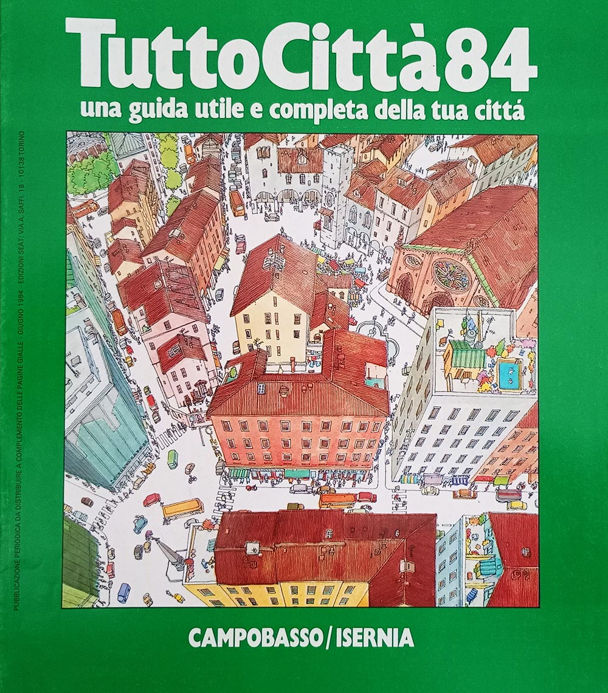
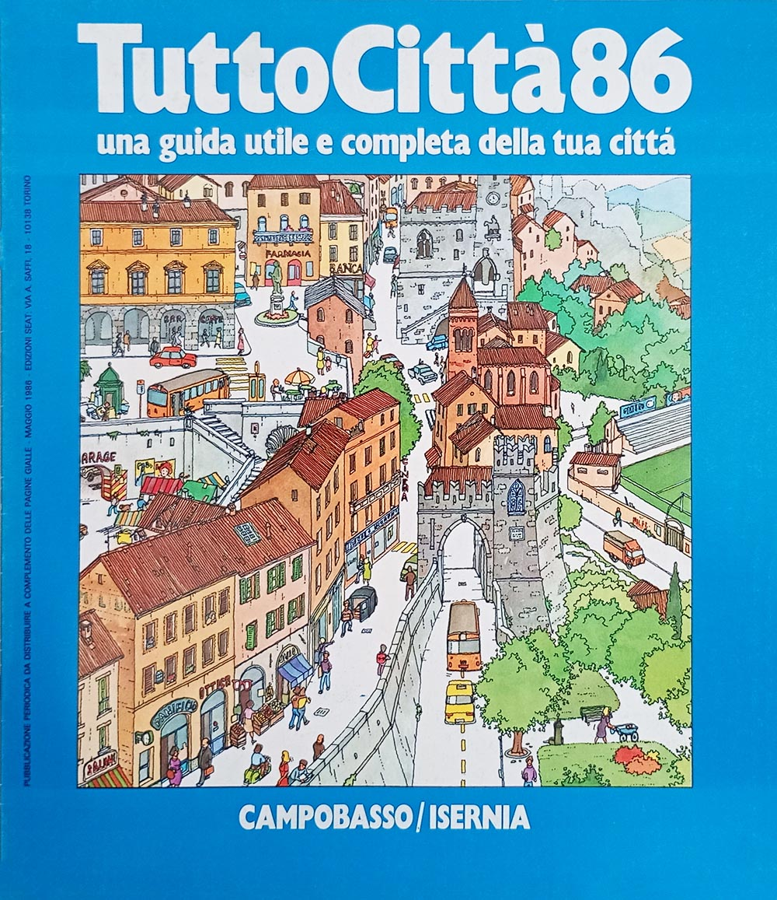
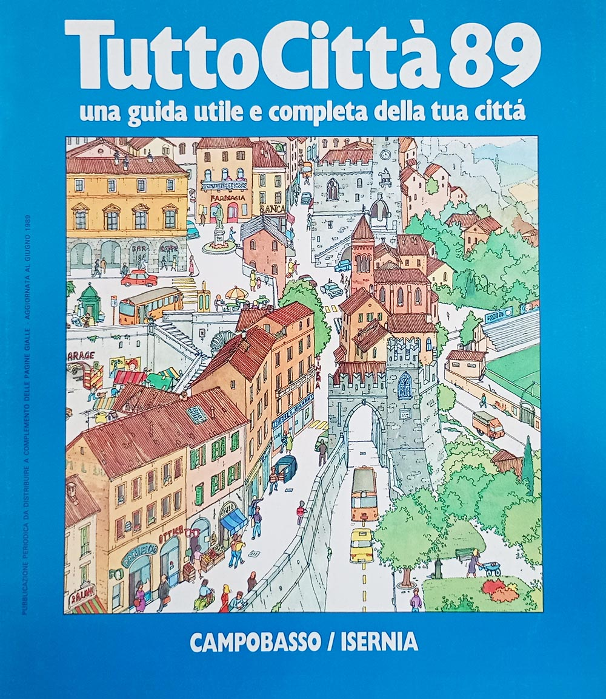
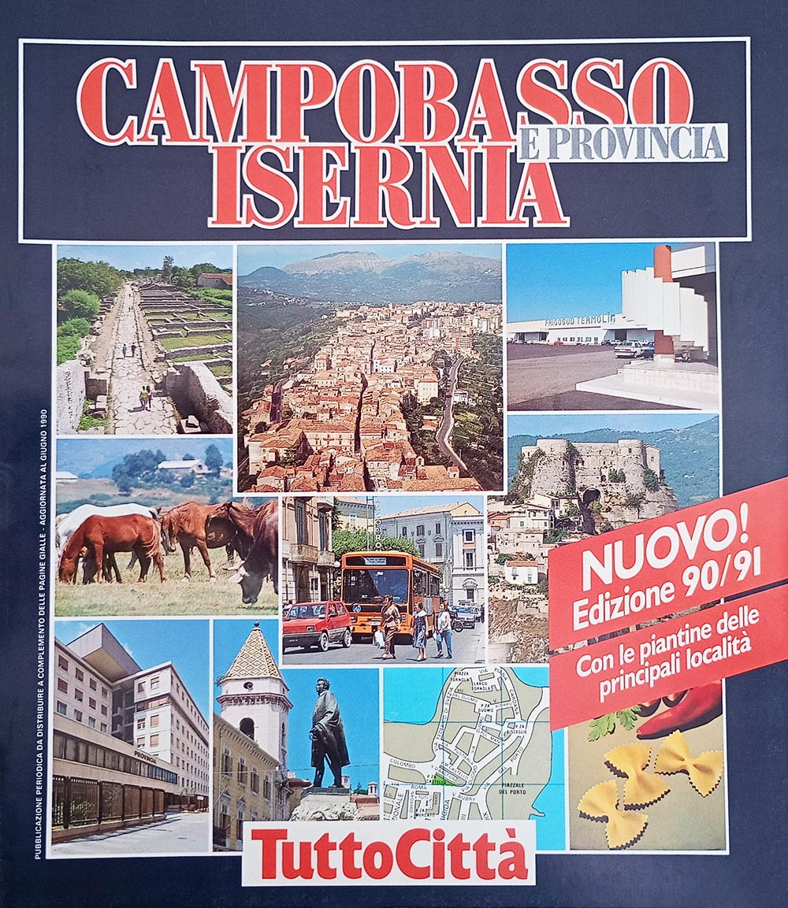
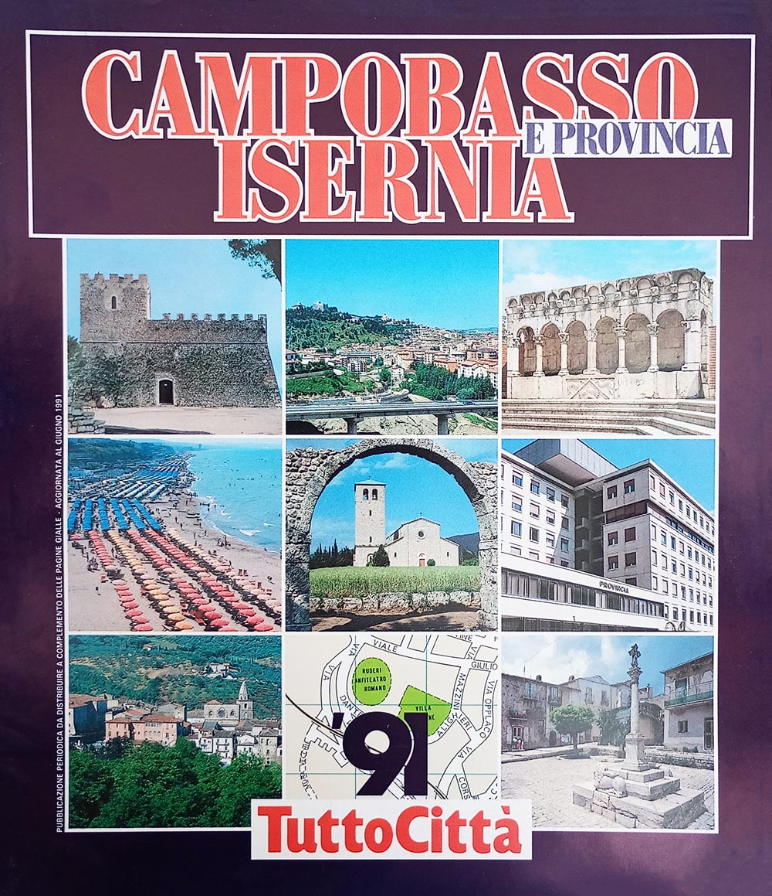
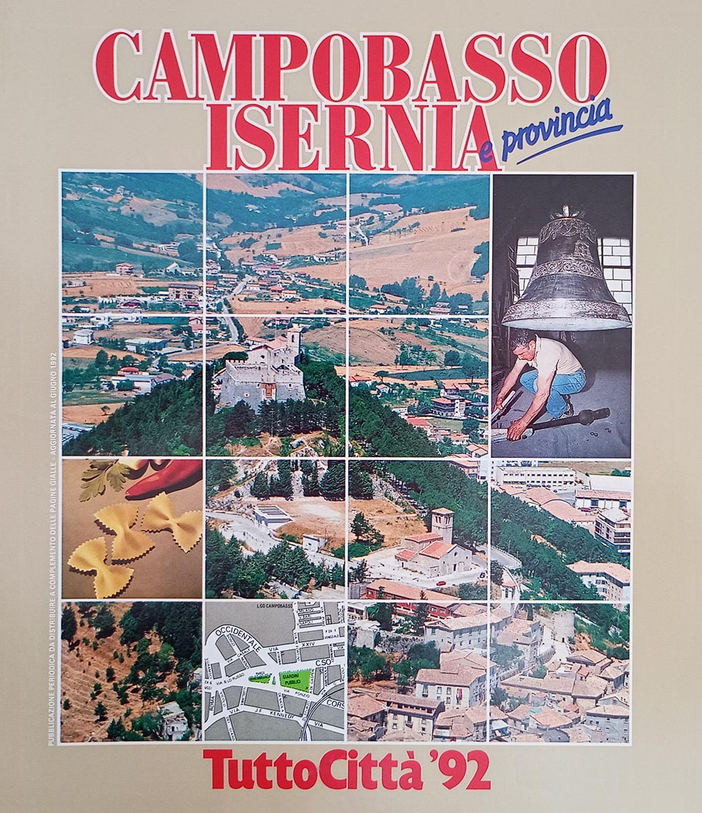
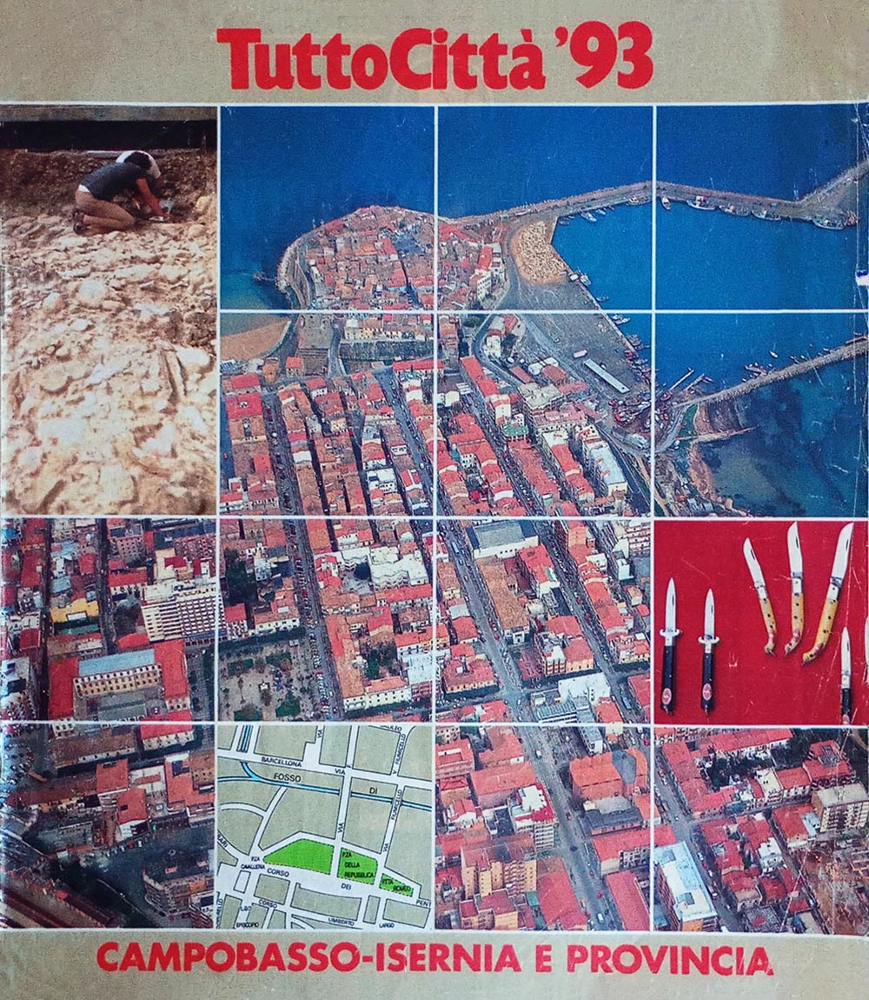
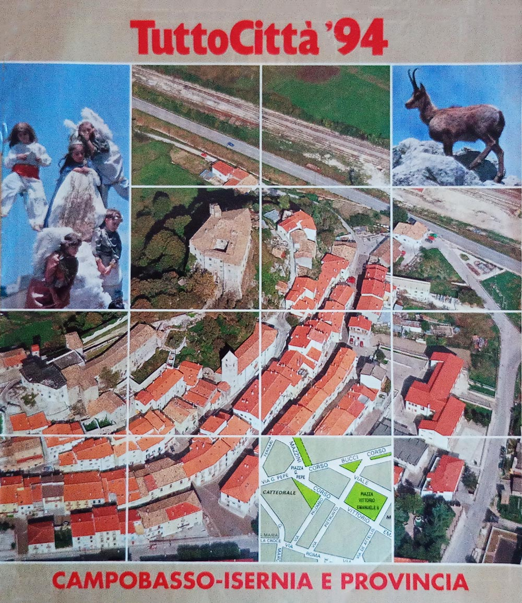
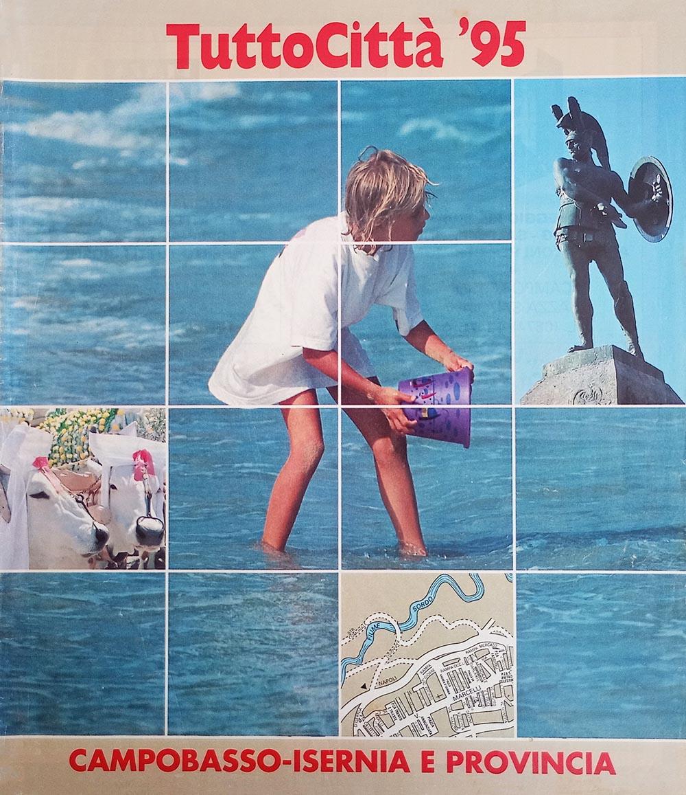

# Il Molise in dettaglio

**Questa pagina è incompleta.** Alla raccolta mancano 8 dei 17 fascicoli
accertati della regione — **Campobasso - Isernia, annate 81/82–83/84, 85/86, 87/88, 88/89, 96/97 e 97/98** — e i dati che dipendono dall'esame diretto dell'esemplare sono
segnati in sospeso. Le copertine non reperite sono sostituite da un
segnaposto; nella griglia dei comuni le annate scoperte portano una croce e non una casella vuota,
perché vuoto significherebbe «non cartografato», che non è ciò che sappiamo. Con otto annate su
diciassette senza fascicolo, qui le croci sono quasi metà della griglia. Per queste ragioni la pagina
non è annunciata altrove nel sito, e vi si arriva soltanto per indirizzo.

Questa pagina si occupa di definire con estrema precisione l'organizzazione interna dei fascicoli
dell'intera regione Molise.

Il censimento registra un totale di 17 fascicoli e 10 comuni cartografati.

<figure class="figura">

<figcaption>Il fascicolo Campobasso - Isernia 81 non è in raccolta: la copertina non è stata reperita</figcaption>
</figure>

[TOC]

## Tabella dei fascicoli

I fascicoli del Molise appartenevano in principio alla serie iniziale: il primo fascicolo, edito a
maggio del 1981, era infatti intitolato *TuttoCittà 81*.

Alla fine degli anni '90 la pubblicazione dei fascicoli cessò per entrambe le province.

La seguente tabella censisce i dati fondamentali dei fascicoli del Molise, mostrandone le copertine e
indicandone il formato, il layout così come definito in [questa pagina](tabella-layout.md), e il
numero totale di pagine, anno per anno.

<table class="fascicoli-dettaglio">
<thead><tr><th>Annata</th><th>Colore tavole</th><th colspan="1">Copertine</th></tr></thead>
<tbody>
<tr><td class="ann"> 81/82</td><td class="tav"></td><td class="fasc sospesa">
Campobasso - Isernia 81
<ul class="scheda"><li><b>Formato:</b> 246 x 280 mm</li><li><b>Copertina:</b> grossa</li><li><b>Note:</b> Nota dell'editore</li><li>non in raccolta</li></ul></td></tr>
<tr><td class="ann"> 82/83</td><td class="tav"></td><td class="fasc sospesa">
Campobasso - Isernia 82
<ul class="scheda"><li><b>Formato:</b> 246 x 280 mm</li><li><b>Copertina:</b> grossa</li><li>non in raccolta</li></ul></td></tr>
<tr><td class="ann"> 83/84</td><td class="tav"></td><td class="fasc sospesa">
Campobasso - Isernia 83
<ul class="scheda"><li><b>Formato:</b> 246 x 280 mm</li><li><b>Copertina:</b> grossa</li><li><b>Layout:</b> TuttoCittà '80 classico</li><li>non in raccolta</li></ul></td></tr>
<tr><td class="ann"> 84/85</td><td class="tav"></td><td class="fasc">
Campobasso - Isernia 84
<ul class="scheda"><li><b>Formato:</b> 246 x 280 mm</li><li><b>Copertina:</b> grossa</li><li><b>Layout:</b> TuttoCittà '80 classico</li><li><b>Pagine:</b> 16</li><li><b>Mese aggiornamento:</b> giugno 1984</li><li><b>Note:</b> Inserto Costituzione</li></ul></td></tr>
<tr><td class="ann"> 85/86</td><td class="tav"></td><td class="fasc sospesa">
Campobasso - Isernia 85
<ul class="scheda"><li><b>Formato:</b> 246 x 280 mm</li><li><b>Copertina:</b> grossa</li><li><b>Layout:</b> TuttoCittà '80 classico</li><li>non in raccolta</li></ul></td></tr>
<tr><td class="ann"> 86/87</td><td class="tav"></td><td class="fasc">
Campobasso - Isernia 86
<ul class="scheda"><li><b>Formato:</b> 246 x 280 mm</li><li><b>Copertina:</b> grossa</li><li><b>Layout:</b> TuttoCittà '80 classico</li><li><b>Pagine:</b> 16</li><li><b>Mese aggiornamento:</b> maggio 1986</li></ul></td></tr>
<tr><td class="ann"> 87/88</td><td class="tav"></td><td class="fasc sospesa">
Campobasso - Isernia 87
<ul class="scheda"><li><b>Formato:</b> 246 x 280 mm</li><li><b>Copertina:</b> grossa</li><li><b>Layout:</b> TuttoCittà '80 classico</li><li>non in raccolta</li></ul></td></tr>
<tr><td class="ann"> 88/89</td><td class="tav"></td><td class="fasc sospesa">
Campobasso - Isernia 88
<ul class="scheda"><li><b>Formato:</b> 246 x 280 mm</li><li><b>Copertina:</b> grossa</li><li><b>Layout:</b> TuttoCittà '80 classico</li><li>non in raccolta</li></ul></td></tr>
<tr><td class="ann"> 89/90</td><td class="tav"></td><td class="fasc">
Campobasso - Isernia 89
<ul class="scheda"><li><b>Formato:</b> 246 x 280 mm</li><li><b>Copertina:</b> grossa</li><li><b>Layout:</b> TuttoCittà '80 classico</li><li><b>Pagine:</b> 16</li><li><b>Mese aggiornamento:</b> giugno 1989</li></ul></td></tr>
<tr><td class="ann"> 90/91</td><td class="tav"></td><td class="fasc">
Campobasso - Isernia 90/91
<ul class="scheda"><li><b>Formato:</b> 246 x 280 mm</li><li><b>Copertina:</b> grossa</li><li><b>Layout:</b> TuttoCittà '90 classico iniziale</li><li><b>Pagine:</b> 24</li><li><b>Mese aggiornamento:</b> giugno 1990</li><li><b>Note:</b> nota dell'editore</li></ul></td></tr>
<tr><td class="ann"> 91/92</td><td class="tav"></td><td class="fasc">
Campobasso - Isernia 91
<ul class="scheda"><li><b>Formato:</b> 246 x 280 mm</li><li><b>Copertina:</b> grossa</li><li><b>Layout:</b> TuttoCittà '90 classico iniziale</li><li><b>Pagine:</b> 24</li><li><b>Mese aggiornamento:</b> giugno 1991</li></ul></td></tr>
<tr><td class="ann"> 92/93</td><td class="tav"></td><td class="fasc">
Campobasso - Isernia 92
<ul class="scheda"><li><b>Formato:</b> 246 x 280 mm</li><li><b>Copertina:</b> grossa</li><li><b>Layout:</b> TuttoCittà '90 classico</li><li><b>Pagine:</b> 24</li><li><b>Mese aggiornamento:</b> giugno 1992</li></ul></td></tr>
<tr><td class="ann"> 93/94</td><td class="tav"></td><td class="fasc">
Campobasso - Isernia 93
<ul class="scheda"><li><b>Formato:</b> 246 x 280 mm</li><li><b>Copertina:</b> sottile</li><li><b>Layout:</b> TuttoCittà '90 classico</li><li><b>Pagine:</b> 30</li><li><b>Mese aggiornamento:</b> giugno 1993</li></ul></td></tr>
<tr><td class="ann"> 94/95</td><td class="tav"></td><td class="fasc">
Campobasso - Isernia 94
<ul class="scheda"><li><b>Formato:</b> 246 x 280 mm</li><li><b>Copertina:</b> sottile</li><li><b>Layout:</b> TuttoCittà '90 classico</li><li><b>Pagine:</b> 30</li><li><b>Mese aggiornamento:</b> giugno 1994</li></ul></td></tr>
<tr><td class="ann"> 95/96</td><td class="tav"></td><td class="fasc">
Campobasso - Isernia 95
<ul class="scheda"><li><b>Formato:</b> 246 x 280 mm</li><li><b>Copertina:</b> sottile</li><li><b>Layout:</b> TuttoCittà '90 classico</li><li><b>Pagine:</b> 22</li><li><b>Mese aggiornamento:</b> giugno 1995</li></ul></td></tr>
<tr><td class="ann"> 96/97</td><td class="tav"></td><td class="fasc sospesa">
Campobasso - Isernia 96
<ul class="scheda"><li><b>Formato:</b> 246 x 280 mm</li><li><b>Copertina:</b> sottile</li><li><b>Layout:</b> TuttoCittà '90 classico</li><li>non in raccolta</li></ul></td></tr>
<tr><td class="ann"> 97/98</td><td class="tav"></td><td class="fasc sospesa">
Campobasso - Isernia 97
<ul class="scheda"><li><b>Formato:</b> 226 x 274 mm</li><li><b>Copertina:</b> sottile</li><li><b>Layout:</b> TuttoCittà '90 classico</li><li><b>Note:</b> Cambio formato</li><li>non in raccolta</li></ul></td></tr>
</tbody>
</table>

## Tre layout in diciassette anni

La seguente tabella censisce i vari layout utilizzati per i fascicoli della regione, secondo il
sistema definito durante il censimento osservando l'impaginazione; le loro caratteristiche sono
descritte in [questa pagina](tabella-layout.md). Come descritto anche lì, i cambi di layout non
rispettano i cambi delle serie di copertina descritte nell'[apposita pagina](copertine.md) di questo
sito.

<table class="layout-dettaglio">
<thead><tr><th>Layout</th><th>Annate</th><th>Anni di copertina</th></tr></thead>
<tbody>
<tr><td>TuttoCittà '80 classico</td><td class="ann">83/84 – 89/90</td><td class="cop">83<i class="pt"></i>84<i class="pt"></i>85<i class="pt"></i>86<i class="pt"></i>87<i class="pt"></i>88<i class="pt"></i>89</td></tr>
<tr><td>TuttoCittà '90 classico iniziale</td><td class="ann">90/91 – 91/92</td><td class="cop">90/91<i class="pt"></i>91</td></tr>
<tr><td>TuttoCittà '90 classico</td><td class="ann">92/93 – 97/98</td><td class="cop">92<i class="pt"></i>93<i class="pt"></i>94<i class="pt"></i>95<i class="pt"></i>96<i class="pt"></i>97</td></tr>
</tbody>
</table>

Non compaiono le annate 81/82 e 82/83: il fascicolo non è in raccolta e il layout non è stato accertato.

## Le città cartografate

La seguente tabella censisce tutti i comuni che sono stati cartografati nel corso del tempo e per
quante annate. Ad ogni riga corrisponde un comune, in ordine alfabetico e non per provincia: lo scopo
è infatti identificare a colpo d'occhio quali comuni entrano ed escono dalla cartografia nel corso
degli anni. I due capoluoghi — CAMPOBASSO, ISERNIA — sono in maiuscolo, ma restano al loro posto
nell'alfabeto. La croce segna le annate in cui il fascicolo non è in raccolta: non sappiamo se il
comune fosse cartografato.

Le caselle azzurre indicano invece che il comune era cartografato, ma non compariva il relativo
elenco delle vie, un fenomeno questo relativamente comune soprattutto nei fascicoli degli anni '80.
Nel Molise è la regola: nelle tre annate anteriori al 90/91 di cui la raccolta ha il fascicolo —
84/85, 86/87 e 89/90 — nessun comune oltre ai due capoluoghi compare nell'elenco delle vie, e solo dal
90/91 cartografia e indice tornano a coincidere. Delle altre sei annate di quel periodo non sappiamo
nulla, perché i fascicoli non sono in raccolta.

Espandi la griglia delle città — 10 città su 17 annate

<table class="griglia">
  <thead><tr><th scope="col">Città</th><th scope="col" class="ann dec">81/82</th><th scope="col" class="ann">82/83</th><th scope="col" class="ann">83/84</th><th scope="col" class="ann">84/85</th><th scope="col" class="ann">85/86</th><th scope="col" class="ann">86/87</th><th scope="col" class="ann">87/88</th><th scope="col" class="ann">88/89</th><th scope="col" class="ann">89/90</th><th scope="col" class="ann dec">90/91</th><th scope="col" class="ann">91/92</th><th scope="col" class="ann">92/93</th><th scope="col" class="ann">93/94</th><th scope="col" class="ann">94/95</th><th scope="col" class="ann">95/96</th><th scope="col" class="ann">96/97</th><th scope="col" class="ann">97/98</th></tr></thead>
  <tbody>
  <tr><th scope="row">Agnone</th><td class="ig dec" title="Agnone — 81/82: non accertato, fascicolo mancante">&#215;</td><td class="ig" title="Agnone — 82/83: non accertato, fascicolo mancante">&#215;</td><td class="ig" title="Agnone — 83/84: non accertato, fascicolo mancante">&#215;</td><td class="no" title="Agnone — 84/85"></td><td class="ig" title="Agnone — 85/86: non accertato, fascicolo mancante">&#215;</td><td class="no" title="Agnone — 86/87"></td><td class="ig" title="Agnone — 87/88: non accertato, fascicolo mancante">&#215;</td><td class="ig" title="Agnone — 88/89: non accertato, fascicolo mancante">&#215;</td><td class="ni" title="Agnone — 89/90: cartografato, ma assente dall'elenco delle vie"></td><td class="no dec" title="Agnone — 90/91"></td><td class="no" title="Agnone — 91/92"></td><td class="no" title="Agnone — 92/93"></td><td class="no" title="Agnone — 93/94"></td><td class="no" title="Agnone — 94/95"></td><td class="no" title="Agnone — 95/96"></td><td class="ig" title="Agnone — 96/97: non accertato, fascicolo mancante">&#215;</td><td class="ig" title="Agnone — 97/98: non accertato, fascicolo mancante">&#215;</td></tr>
  <tr><th scope="row">Bojano</th><td class="ig dec" title="Bojano — 81/82: non accertato, fascicolo mancante">&#215;</td><td class="ig" title="Bojano — 82/83: non accertato, fascicolo mancante">&#215;</td><td class="ig" title="Bojano — 83/84: non accertato, fascicolo mancante">&#215;</td><td class="no" title="Bojano — 84/85"></td><td class="ig" title="Bojano — 85/86: non accertato, fascicolo mancante">&#215;</td><td class="ni" title="Bojano — 86/87: cartografato, ma assente dall'elenco delle vie"></td><td class="ig" title="Bojano — 87/88: non accertato, fascicolo mancante">&#215;</td><td class="ig" title="Bojano — 88/89: non accertato, fascicolo mancante">&#215;</td><td class="ni" title="Bojano — 89/90: cartografato, ma assente dall'elenco delle vie"></td><td class="si dec" title="Bojano — 90/91"></td><td class="si" title="Bojano — 91/92"></td><td class="si" title="Bojano — 92/93"></td><td class="si" title="Bojano — 93/94"></td><td class="si" title="Bojano — 94/95"></td><td class="si" title="Bojano — 95/96"></td><td class="ig" title="Bojano — 96/97: non accertato, fascicolo mancante">&#215;</td><td class="ig" title="Bojano — 97/98: non accertato, fascicolo mancante">&#215;</td></tr>
  <tr><th scope="row">CAMPOBASSO</th><td class="ig dec" title="CAMPOBASSO — 81/82: non accertato, fascicolo mancante">&#215;</td><td class="ig" title="CAMPOBASSO — 82/83: non accertato, fascicolo mancante">&#215;</td><td class="ig" title="CAMPOBASSO — 83/84: non accertato, fascicolo mancante">&#215;</td><td class="si" title="CAMPOBASSO — 84/85"></td><td class="ig" title="CAMPOBASSO — 85/86: non accertato, fascicolo mancante">&#215;</td><td class="si" title="CAMPOBASSO — 86/87"></td><td class="ig" title="CAMPOBASSO — 87/88: non accertato, fascicolo mancante">&#215;</td><td class="ig" title="CAMPOBASSO — 88/89: non accertato, fascicolo mancante">&#215;</td><td class="si" title="CAMPOBASSO — 89/90"></td><td class="si dec" title="CAMPOBASSO — 90/91"></td><td class="si" title="CAMPOBASSO — 91/92"></td><td class="si" title="CAMPOBASSO — 92/93"></td><td class="si" title="CAMPOBASSO — 93/94"></td><td class="si" title="CAMPOBASSO — 94/95"></td><td class="si" title="CAMPOBASSO — 95/96"></td><td class="ig" title="CAMPOBASSO — 96/97: non accertato, fascicolo mancante">&#215;</td><td class="ig" title="CAMPOBASSO — 97/98: non accertato, fascicolo mancante">&#215;</td></tr>
  <tr><th scope="row">Campomarino</th><td class="ig dec" title="Campomarino — 81/82: non accertato, fascicolo mancante">&#215;</td><td class="ig" title="Campomarino — 82/83: non accertato, fascicolo mancante">&#215;</td><td class="ig" title="Campomarino — 83/84: non accertato, fascicolo mancante">&#215;</td><td class="no" title="Campomarino — 84/85"></td><td class="ig" title="Campomarino — 85/86: non accertato, fascicolo mancante">&#215;</td><td class="no" title="Campomarino — 86/87"></td><td class="ig" title="Campomarino — 87/88: non accertato, fascicolo mancante">&#215;</td><td class="ig" title="Campomarino — 88/89: non accertato, fascicolo mancante">&#215;</td><td class="ni" title="Campomarino — 89/90: cartografato, ma assente dall'elenco delle vie"></td><td class="no dec" title="Campomarino — 90/91"></td><td class="si" title="Campomarino — 91/92"></td><td class="si" title="Campomarino — 92/93"></td><td class="si" title="Campomarino — 93/94"></td><td class="si" title="Campomarino — 94/95"></td><td class="si" title="Campomarino — 95/96"></td><td class="ig" title="Campomarino — 96/97: non accertato, fascicolo mancante">&#215;</td><td class="ig" title="Campomarino — 97/98: non accertato, fascicolo mancante">&#215;</td></tr>
  <tr><th scope="row">Campomarino Lido</th><td class="ig dec" title="Campomarino Lido — 81/82: non accertato, fascicolo mancante">&#215;</td><td class="ig" title="Campomarino Lido — 82/83: non accertato, fascicolo mancante">&#215;</td><td class="ig" title="Campomarino Lido — 83/84: non accertato, fascicolo mancante">&#215;</td><td class="no" title="Campomarino Lido — 84/85"></td><td class="ig" title="Campomarino Lido — 85/86: non accertato, fascicolo mancante">&#215;</td><td class="no" title="Campomarino Lido — 86/87"></td><td class="ig" title="Campomarino Lido — 87/88: non accertato, fascicolo mancante">&#215;</td><td class="ig" title="Campomarino Lido — 88/89: non accertato, fascicolo mancante">&#215;</td><td class="no" title="Campomarino Lido — 89/90"></td><td class="si dec" title="Campomarino Lido — 90/91"></td><td class="no" title="Campomarino Lido — 91/92"></td><td class="no" title="Campomarino Lido — 92/93"></td><td class="no" title="Campomarino Lido — 93/94"></td><td class="no" title="Campomarino Lido — 94/95"></td><td class="no" title="Campomarino Lido — 95/96"></td><td class="ig" title="Campomarino Lido — 96/97: non accertato, fascicolo mancante">&#215;</td><td class="ig" title="Campomarino Lido — 97/98: non accertato, fascicolo mancante">&#215;</td></tr>
  <tr><th scope="row">ISERNIA</th><td class="ig dec" title="ISERNIA — 81/82: non accertato, fascicolo mancante">&#215;</td><td class="ig" title="ISERNIA — 82/83: non accertato, fascicolo mancante">&#215;</td><td class="ig" title="ISERNIA — 83/84: non accertato, fascicolo mancante">&#215;</td><td class="si" title="ISERNIA — 84/85"></td><td class="ig" title="ISERNIA — 85/86: non accertato, fascicolo mancante">&#215;</td><td class="si" title="ISERNIA — 86/87"></td><td class="ig" title="ISERNIA — 87/88: non accertato, fascicolo mancante">&#215;</td><td class="ig" title="ISERNIA — 88/89: non accertato, fascicolo mancante">&#215;</td><td class="si" title="ISERNIA — 89/90"></td><td class="si dec" title="ISERNIA — 90/91"></td><td class="si" title="ISERNIA — 91/92"></td><td class="si" title="ISERNIA — 92/93"></td><td class="si" title="ISERNIA — 93/94"></td><td class="si" title="ISERNIA — 94/95"></td><td class="si" title="ISERNIA — 95/96"></td><td class="ig" title="ISERNIA — 96/97: non accertato, fascicolo mancante">&#215;</td><td class="ig" title="ISERNIA — 97/98: non accertato, fascicolo mancante">&#215;</td></tr>
  <tr><th scope="row">Larino</th><td class="ig dec" title="Larino — 81/82: non accertato, fascicolo mancante">&#215;</td><td class="ig" title="Larino — 82/83: non accertato, fascicolo mancante">&#215;</td><td class="ig" title="Larino — 83/84: non accertato, fascicolo mancante">&#215;</td><td class="ni" title="Larino — 84/85: cartografato, ma assente dall'elenco delle vie"></td><td class="ig" title="Larino — 85/86: non accertato, fascicolo mancante">&#215;</td><td class="ni" title="Larino — 86/87: cartografato, ma assente dall'elenco delle vie"></td><td class="ig" title="Larino — 87/88: non accertato, fascicolo mancante">&#215;</td><td class="ig" title="Larino — 88/89: non accertato, fascicolo mancante">&#215;</td><td class="ni" title="Larino — 89/90: cartografato, ma assente dall'elenco delle vie"></td><td class="si dec" title="Larino — 90/91"></td><td class="si" title="Larino — 91/92"></td><td class="si" title="Larino — 92/93"></td><td class="si" title="Larino — 93/94"></td><td class="si" title="Larino — 94/95"></td><td class="si" title="Larino — 95/96"></td><td class="ig" title="Larino — 96/97: non accertato, fascicolo mancante">&#215;</td><td class="ig" title="Larino — 97/98: non accertato, fascicolo mancante">&#215;</td></tr>
  <tr><th scope="row">Montenero di Bisaccia</th><td class="ig dec" title="Montenero di Bisaccia — 81/82: non accertato, fascicolo mancante">&#215;</td><td class="ig" title="Montenero di Bisaccia — 82/83: non accertato, fascicolo mancante">&#215;</td><td class="ig" title="Montenero di Bisaccia — 83/84: non accertato, fascicolo mancante">&#215;</td><td class="no" title="Montenero di Bisaccia — 84/85"></td><td class="ig" title="Montenero di Bisaccia — 85/86: non accertato, fascicolo mancante">&#215;</td><td class="no" title="Montenero di Bisaccia — 86/87"></td><td class="ig" title="Montenero di Bisaccia — 87/88: non accertato, fascicolo mancante">&#215;</td><td class="ig" title="Montenero di Bisaccia — 88/89: non accertato, fascicolo mancante">&#215;</td><td class="no" title="Montenero di Bisaccia — 89/90"></td><td class="no dec" title="Montenero di Bisaccia — 90/91"></td><td class="no" title="Montenero di Bisaccia — 91/92"></td><td class="no" title="Montenero di Bisaccia — 92/93"></td><td class="no" title="Montenero di Bisaccia — 93/94"></td><td class="si" title="Montenero di Bisaccia — 94/95"></td><td class="no" title="Montenero di Bisaccia — 95/96"></td><td class="ig" title="Montenero di Bisaccia — 96/97: non accertato, fascicolo mancante">&#215;</td><td class="ig" title="Montenero di Bisaccia — 97/98: non accertato, fascicolo mancante">&#215;</td></tr>
  <tr><th scope="row">Termoli</th><td class="ig dec" title="Termoli — 81/82: non accertato, fascicolo mancante">&#215;</td><td class="ig" title="Termoli — 82/83: non accertato, fascicolo mancante">&#215;</td><td class="ig" title="Termoli — 83/84: non accertato, fascicolo mancante">&#215;</td><td class="ni" title="Termoli — 84/85: cartografato, ma assente dall'elenco delle vie"></td><td class="ig" title="Termoli — 85/86: non accertato, fascicolo mancante">&#215;</td><td class="ni" title="Termoli — 86/87: cartografato, ma assente dall'elenco delle vie"></td><td class="ig" title="Termoli — 87/88: non accertato, fascicolo mancante">&#215;</td><td class="ig" title="Termoli — 88/89: non accertato, fascicolo mancante">&#215;</td><td class="ni" title="Termoli — 89/90: cartografato, ma assente dall'elenco delle vie"></td><td class="si dec" title="Termoli — 90/91"></td><td class="si" title="Termoli — 91/92"></td><td class="si" title="Termoli — 92/93"></td><td class="si" title="Termoli — 93/94"></td><td class="si" title="Termoli — 94/95"></td><td class="si" title="Termoli — 95/96"></td><td class="ig" title="Termoli — 96/97: non accertato, fascicolo mancante">&#215;</td><td class="ig" title="Termoli — 97/98: non accertato, fascicolo mancante">&#215;</td></tr>
  <tr><th scope="row">Venafro</th><td class="ig dec" title="Venafro — 81/82: non accertato, fascicolo mancante">&#215;</td><td class="ig" title="Venafro — 82/83: non accertato, fascicolo mancante">&#215;</td><td class="ig" title="Venafro — 83/84: non accertato, fascicolo mancante">&#215;</td><td class="ni" title="Venafro — 84/85: cartografato, ma assente dall'elenco delle vie"></td><td class="ig" title="Venafro — 85/86: non accertato, fascicolo mancante">&#215;</td><td class="no" title="Venafro — 86/87"></td><td class="ig" title="Venafro — 87/88: non accertato, fascicolo mancante">&#215;</td><td class="ig" title="Venafro — 88/89: non accertato, fascicolo mancante">&#215;</td><td class="no" title="Venafro — 89/90"></td><td class="no dec" title="Venafro — 90/91"></td><td class="no" title="Venafro — 91/92"></td><td class="no" title="Venafro — 92/93"></td><td class="no" title="Venafro — 93/94"></td><td class="no" title="Venafro — 94/95"></td><td class="no" title="Venafro — 95/96"></td><td class="ig" title="Venafro — 96/97: non accertato, fascicolo mancante">&#215;</td><td class="ig" title="Venafro — 97/98: non accertato, fascicolo mancante">&#215;</td></tr>
  </tbody>
</table>

Le città cartografate almeno una volta sono 10. Sulle 9 annate di cui
la raccolta ha il fascicolo, il minimo è nelle annate 84/85 e 86/87, con 5 città; il massimo
nelle annate 89/90 e 94/95, con 7.

## L'indice degli articoli, 1990-1997

Dall'annata 1990/91 ciascuna provincia ha una rubrica di articoli su storia, ambiente ed economia
locale — in molti fascicoli sottotitolata «Vivere la città» — che perdura fino all'annata 1997/98.
Sono 68 titoli, mai indicizzati altrove: un piccolo corpus di giornalismo locale
distribuito gratuitamente in centinaia di migliaia di copie e poi scomparso senza lasciare traccia in
alcuna risorsa online. Per le annate 96/97 e 97/98 il fascicolo non è in raccolta e l'indice resta in
sospeso.

I titoli sono trascritti come compaiono nel fascicolo. Il testo degli articoli non è riprodotto: i
diritti appartengono all'editore.

<figure class="figura">

<figcaption>Copertina del fascicolo Campobasso - Isernia 90/91</figcaption>
</figure>

<h3 id="articoli-90-91">Annata 90/91</h3>
<dl class="articoli">
  <dt>Campobasso</dt>
  <dd>Anni 90. A scuola di agriturismo <b class="perno">&bull;</b> Identikit di una provincia <b class="perno">&bull;</b> All'ombra del Castello Monforte sfilano santi, angeli e diavolacci <b class="perno">&bull;</b> Spaghetti, zucchero, mozzarella e affari <b class="perno">&bull;</b> Metti un motore a Termoli <b class="perno">&bull;</b> Sepino. Sorprese a ogni scavo <b class="perno">&bull;</b> La ricetta della nonna</dd>
  <dt>Isernia</dt>
  <dd>Anni 90. Le idee diventano impresa <b class="perno">&bull;</b> Identikit di una provincia <b class="perno">&bull;</b> Il pranzo paleolitico del primo molisano <b class="perno">&bull;</b> L'anima delle campane di Agnone <b class="perno">&bull;</b> Scapoli. Gli ultimi zampognari <b class="perno">&bull;</b> La ricetta della nonna</dd>
</dl>
<h3 id="articoli-91-92">Annata 91/92</h3>
<dl class="articoli">
  <dt>Campobasso</dt>
  <dd>Verso il '92. Campobasso, manager per l'Europa <b class="perno">&bull;</b> Lo sviluppo in cifre <b class="perno">&bull;</b> Il castello Monforte e i feudatari ribelli <b class="perno">&bull;</b> La stampa locale. Settimanali d'informazione <b class="perno">&bull;</b> Gambatesa: sfida ai Gonzaga <b class="perno">&bull;</b> Ricette contadine, semplici e gustose <b class="perno">&bull;</b> Da Sant'Elia alle rovine di Saepinum</dd>
  <dt>Isernia</dt>
  <dd>Verso il '92. Nuovi mercati nel futuro di Isernia <b class="perno">&bull;</b> Una provincia di risparmiatori <b class="perno">&bull;</b> Le lapidi romane nella fontana <b class="perno">&bull;</b> La scienza a Pesche <b class="perno">&bull;</b> L'abbazia di San Vincenzo e la cripta di Epifanio <b class="perno">&bull;</b> Da Frosolone l'energia pulita <b class="perno">&bull;</b> Vini e gastronomia. L'antica cucina dei pastori <b class="perno">&bull;</b> Nel paese dei jeans <b class="perno">&bull;</b> I rintocchi delle campane di Agnone</dd>
</dl>
<h3 id="articoli-92-93">Annata 92/93</h3>
<dl class="articoli">
  <dt>Campobasso</dt>
  <dd>Il futuro possibile. La vecchia città giardino ora è una mini-metropoli <b class="perno">&bull;</b> Il Processo di Biscardi, lo spettacolo dello sport <b class="perno">&bull;</b> Vini e gastronomia. Zuppa di lenticchie e frittata di basilico <b class="perno">&bull;</b> Un brindisi con il Biferno</dd>
  <dt>Isernia</dt>
  <dd>Il futuro possibile. Isernia, storia e ambiente la speranza per i giovani <b class="perno">&bull;</b> Dai romani all'Unità d'Italia, le battaglie del fiero Molise <b class="perno">&bull;</b> Nomi e cognomi. Nicandro in omaggio al patrono</dd>
</dl>
<h3 id="articoli-93-94">Annata 93/94</h3>
<dl class="articoli">
  <dt>Campobasso</dt>
  <dd>Italia domani. Il futuro di Campobasso tra estetica e morale <b class="perno">&bull;</b> I duelli di Gabriele Pepe profeta della Nuova Italia <b class="perno">&bull;</b> Roccavivara, l'abbazia tra gli ulivi <b class="perno">&bull;</b> Nomi e cognomi. Sciaretta a Termoli, Pardo a Larino <b class="perno">&bull;</b> Arte in tavola. Il mangiatore di prosciutto e i dubbi di "Emile"</dd>
  <dt>Isernia</dt>
  <dd>Italia domani. L'abbraccio di Isernia leale e un po' ribelle <b class="perno">&bull;</b> Le lame di Frosolone, un'arte antica <b class="perno">&bull;</b> Le grandi tappe della storia <b class="perno">&bull;</b> Le poesie di papa Celestino <b class="perno">&bull;</b> Ninne-nanne di botte e minacce <b class="perno">&bull;</b> Il santuario di Castelpetroso un'oasi di luce rosa <b class="perno">&bull;</b> San Vincenzo, la bonifica dei frati <b class="perno">&bull;</b> I silenzi degli antichi borghi e le campagne di Agnone <b class="perno">&bull;</b> Ortica, aglio e diavolicchio prelibatezze contadine <b class="perno">&bull;</b> Le piccole capitali del vino</dd>
</dl>
<h3 id="articoli-94-95">Annata 94/95</h3>
<dl class="articoli">
  <dt>Campobasso</dt>
  <dd>Il nuovo che emerge. Campobasso, la solidarietà allarga le sue maglie <b class="perno">&bull;</b> Appunti di storia <b class="perno">&bull;</b> Miti, leggende. I miracoli di Leonardo e la fiaba dei sorci <b class="perno">&bull;</b> I Robinson Crusoe della nuova musica <b class="perno">&bull;</b> La provincia verde. Sul Sentiero Italia tra volpi, falchi e mermotte <b class="perno">&bull;</b> Antiche ricette. Il fritto misto e i segreti dei calcioni</dd>
  <dt>Isernia</dt>
  <dd>Il nuovo che emerge. Isernia si mobilita per proteggere l'ambiente <b class="perno">&bull;</b> Musica giovane, il "Tratturo" apre la strada <b class="perno">&bull;</b> Miti, leggende. Il soffio gelido di donna Borea <b class="perno">&bull;</b> Antiche ricette. La zuppa di cardi che ispirò il poeta</dd>
</dl>
<h3 id="articoli-95-96">Annata 95/96</h3>
<dl class="articoli">
  <dt>Campobasso</dt>
  <dd>Progetti giovani. Nasce a Campobasso lo sportello delle idee <b class="perno">&bull;</b> All'ombra delle sequoie nel parco della contessa <b class="perno">&bull;</b> Bongusto, trent'anni di successi <b class="perno">&bull;</b> Jacovitti, l'artigiano dei fumetti</dd>
  <dt>Isernia</dt>
  <dd>Progetti giovani. Isernia, il gioco del business <b class="perno">&bull;</b> L'abate viaggiante che diventò Papa <b class="perno">&bull;</b> L'abbazia sul Volturno distrutta da Saugdan</dd>
</dl>
<h3 id="articoli-96-97">Annata 96/97</h3>
<dl class="articoli">
  <dt>Campobasso</dt>
  <dd>in sospeso il fascicolo Campobasso - Isernia 96 non è in raccolta</dd>
  <dt>Isernia</dt>
  <dd>in sospeso il fascicolo Campobasso - Isernia 96 non è in raccolta</dd>
</dl>
<h3 id="articoli-97-98">Annata 97/98</h3>
<dl class="articoli">
  <dt>Campobasso</dt>
  <dd>in sospeso il fascicolo Campobasso - Isernia 97 non è in raccolta</dd>
  <dt>Isernia</dt>
  <dd>in sospeso il fascicolo Campobasso - Isernia 97 non è in raccolta</dd>
</dl>

## I dati

- [`molise_fascicoli.csv`](../dati/molise_fascicoli.csv) — un fascicolo per riga: foliazione, layout, formato, copertina, presenza in raccolta
- [`molise_cartografia.csv`](../dati/molise_cartografia.csv) — un comune per riga e per annata, con la provincia e se compariva nell'elenco delle vie
- [`molise_articoli.csv`](../dati/molise_articoli.csv) — un titolo per riga: l'indice delle rubriche provinciali

Chi possiede i fascicoli mancanti e vuole vedere questa pagina completata troverà nelle [questioni
aperte](questioni-aperte.md) come contribuire.
