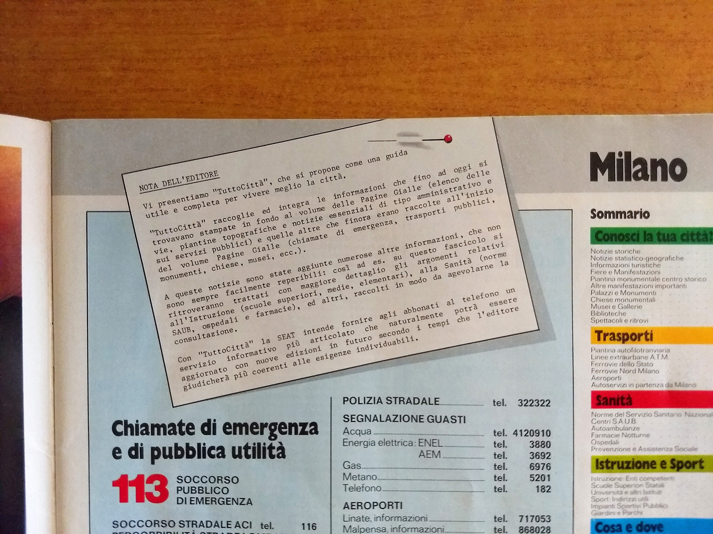
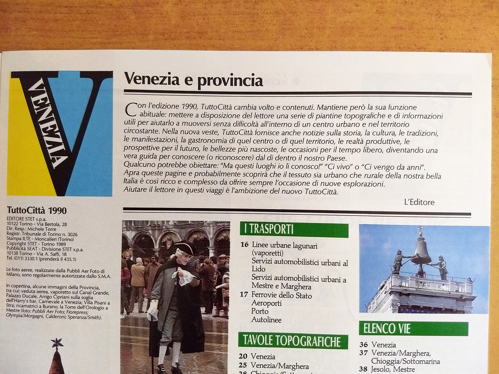

# Le note dell'editore

Le altre pagine di questo sito ricostruiscono TuttoCittà dall'esterno, contando fascicoli e confrontando
copertine. Qui invece parla l'editore. Sono due sole note, ma cadono in due momenti fondamentali: la
nascita del prodotto e la sua prima grande riforma.

## 1981: la presentazione di un prodotto nuovo

La nota compare in **tutti i fascicoli dell'annata 1981/82**, la prima. Spiega che TuttoCittà nasce
raccogliendo in un fascicolo autonomo materiali fino ad allora dispersi nelle Pagine Gialle — l'elenco
delle vie e le piantine in fondo al volume, i numeri di emergenza e le informazioni sui trasporti
all'inizio — e vi aggiunge sezioni nuove su istruzione e sanità.

<figure><figcaption><b>Nota di presentazione</b> annata 1981/82</figcaption></figure>
<blockquote>

Vi presentiamo "TuttoCittà", che si propone come una guida utile e completa per vivere meglio la città.

"TuttoCittà" raccoglie ed integra le informazioni che fino ad oggi si trovavano stampate in fondo al volume delle Pagine Gialle (elenco delle vie, piantine topografiche e notizie essenziali di tipo amministrativo e sui servizi pubblici) e quelle altre che finora erano raccolte all'inizio del volume Pagine Gialle (chiamate di emergenza, trasporti pubblici, monumenti, chiese, musei, ecc.).

A queste notizie sono state aggiunte numerose altre informazioni, che non sono sempre facilmente reperibili: così ad es. su questo fascicolo si ritroveranno trattati con maggiore dettaglio gli argomenti relativi all'Istruzione (scuole superiori, medie, elementari), alla Sanità (norme SAUB, ospedali e farmacie), ed altri, raccolti in modo da agevolarne la consultazione.

Con "TuttoCittà" la SEAT intende offrire agli abbonati al telefono un servizio informativo più articolato che naturalmente potrà essere aggiornato con nuove edizioni in futuro secondo i tempi che l'editore giudicherà più coerenti alle esigenze individuabili.

</blockquote>

## 1990: la prima grande riforma

La seconda nota chiude l'annata **1989/90** e annuncia la riforma che i dati ci avevano già mostrato:
nasce la rubrica di articoli dedicati alle città e alle province descritte dal fascicolo, e lo sfondo
della cartografia passa dall'arancione al grigio. I due cambiamenti furono presentati insieme, come un
unico progetto: la nuova veste cartografica e il contenuto redazionale nascono nello stesso momento, e
trasformano un allegato pratico in qualcosa che assomiglia a una piccola guida locale.

<figure><figcaption><b>Nota sulla riforma editoriale</b> fine annata 1989/90</figcaption></figure>
<blockquote>

Con l'edizione 1990, TuttoCittà cambia volto e contenuti. Mantiene però la sua funzione abituale: mettere a disposizione del lettore una serie di piantine topografiche e di informazioni utili per aiutarlo a muoversi senza difficoltà all'interno di un centro urbano e nel territorio circostante. Nella nuova veste, TuttoCittà fornisce anche notizie sulla storia, la cultura, le tradizioni, le manifestazioni, la gastronomia di quel centro o di quel territorio, le realtà produttive, le prospettive per il futuro, le bellezze più nascoste, le occasioni per il tempo libero, diventando una vera guida per conoscere (o riconoscere) dal di dentro il nostro Paese.

Qualcuno potrebbe obiettare: "Ma questi luoghi io li conosco!" "Ci vivo" o "Ci vengo da anni".

Apra queste pagine e probabilmente scoprirà che il tessuto sia urbano che rurale della nostra bella Italia è così ricco e complesso da offrire sempre l'occasione di nuove esplorazioni.

Aiutare il lettore in questi viaggi è l'ambizione del nuovo TuttoCittà.

</blockquote>

*Le separazioni fra i paragrafi della seconda nota sono state introdotte per la lettura: nell'originale
il testo procede a capo senza stacchi di sezione.*

## La fine della rubrica

La rubrica di notizie annunciata nel 1990 non arriva alla fine della storia del prodotto: **cessa a metà
dell'annata 1997/98**, con la riforma editoriale che introduce la copertina grigia priva di anno
definito — la stessa che sui fascicoli sostituisce la data con la sola finestra d'uso, come descritto
nelle [convenzioni di lettura](index.md).

La rubrica visse dunque sette annate, dal 1989/90 al 1997/98. Il fascicolo che ne era uscito
trasformato, «una vera guida per conoscere dal di dentro il nostro Paese», tornò in quel momento a
essere ciò che era all'origine: uno strumento cartografico.

---

Le riproduzioni fotografiche e le trascrizioni dei testi sono tratte da esemplari della raccolta e
pubblicate a fini di identificazione e studio documentario. **I diritti sui testi e sulle immagini
riprodotte appartengono all'editore, oggi Italiaonline S.p.A.: chi cura questa risorsa non ne detiene
alcun diritto e non li concede in licenza**, e non sono coperti dalla licenza CC BY 4.0 applicata al resto del sito. Sia le
immagini sia le trascrizioni possono essere rimosse su richiesta: è sufficiente aprire una segnalazione
nel repository o scrivere all'indirizzo indicato in fondo alla pagina.
