# Il Piemonte in dettaglio

<em><strong>NOTA: questa pagina è incompleta.</strong> Alla raccolta mancano 34 dei 146 fascicoli accertati della regione — <strong>Alessandria - Asti, annate 81/82 e 83/84; Cuneo, annate 81/82–84/85, 90/91, 91/92, 95/96, 96/97 e 11/12–13/14; Alessandria, annate 84/85, 85/86, 90/91, 91/92, 95/96, 98/99 e 99/00; Provincia di Torino, annata 85/86; Asti, annate 85/86, 91/92, 95/96, 97/98 e 10/11–13/14; Biella - Vercelli, annate 95/96 e 98/99; Torino e dintorni, annate 99/00–01/02</strong> — e i dati che dipendono dall'esame diretto dell'esemplare sono segnati</em> in sospeso<em>. Di altri 6 fascicoli — <strong>Provincia di Torino 1999, Asti (99), Cuneo (99), Provincia di Torino 2000, Asti 2000 e Cuneo 2000</strong> — non è accertata nemmeno l'esistenza, e il loro posto in tabella porta un segnaposto proprio. Le copertine non reperite sono sostituite da un segnaposto; nella griglia dei comuni le annate scoperte portano una croce e non una casella vuota, per non confonderle con la reale assenza del corrispondente comune in cartografia. Per la stessa ragione questa pagina non è annunciata altrove nel sito e per il momento vi si arriva soltanto per indirizzo diretto.</em>

Questa pagina si occupa di definire con estrema precisione l'organizzazione interna dei fascicoli dell'intera regione Piemonte.

Il censimento registra un totale di 146 fascicoli e 79 comuni cartografati.

<figure class="figura">
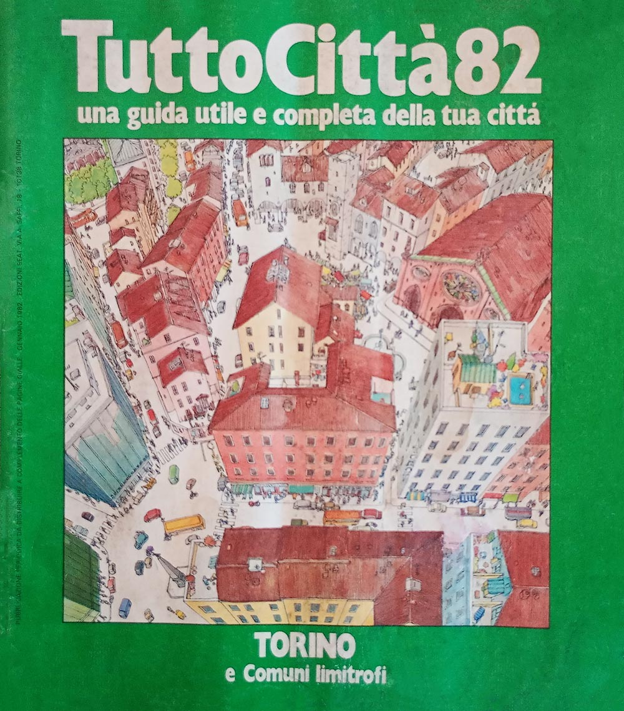
<figcaption>Copertina del fascicolo Torino 82</figcaption>
</figure>

In questa pagina

[TOC]

## Tabella dei fascicoli

I fascicoli del Piemonte appartenevano alla serie tardiva: il primo fascicolo, edito a novembre 1981, era infatti intitolato TuttoCittà 82. Il Piemonte è anche una delle prime regioni a vedere la riforma editoriale a cavallo fra gli anni '80 e '90, nonché una delle sole quattro regioni ad essere interessata da questa riforma già dall'annata 1989/90.

I fascicoli piemontesi dell'annata 1989/90 furono i primi ad essere interessati dalla riforma editoriale; questa tuttavia non si applicò a tutti i fascicoli di quell'annata, in quanto Alessandria e Asti presentavano ancora il vecchio layout anni '80 con tavole topografiche a sfondo arancione.

Un fenomeno analogo capitò per le copertine nell'annata 1991/92: i fascicoli di Torino e Provincia di Torino infatti introdussero la nuova copertina a sfondo beige e immagine tematica, mentre i fascicoli di tutte le altre province ricevettero la copertina a sfondo blu. Un simile scenario occorse infine nell'annata 1998/99, quando il fascicolo di Torino introdusse la nuova copertina a fondo giallo e il layout "nuovo millennio".

Alla fine degli anni '90 la pubblicazione dei fascicoli cessò per tutte le province tranne Torino, la cui linea proseguì fino al 2014. Casi a parte furono Asti e Cuneo, due delle quattro province la cui linea riprese all'inizio degli anni dieci col formato ridotto per quattro annate. A differenza delle linee delle altre province arrivate fino al 2014, le linee del Piemonte assieme a quelle della Puglia videro un totale di 33 fascicoli pubblicati invece che 34.

La seguente tabella censisce i dati fondamentali dei fascicoli del Piemonte, mostrandone le copertine e indicandone il formato, il layout così come definito in [questa pagina](tabella-layout.md), e il numero totale di pagine, anno per anno.

<table class="fascicoli-dettaglio">
<thead><tr><th>Annata</th><th>Colore tavole</th><th colspan="7">Copertine</th></tr></thead>
<tbody>
<tr><td class="ann"> 81/82</td><td class="tav"></td><td class="fasc">
Torino e comuni limitrofi 82
<ul class="scheda"><li><b>Formato:</b> 246 x 280 mm</li><li><b>Copertina:</b> grossa</li><li><b>Layout:</b> TuttoCittà '80 classico</li><li><b>Pagine:</b> 128</li><li><b>Mese aggiornamento:</b> gennaio 1982</li><li><b>Note:</b> nota dell'editore</li></ul></td><td class="fasc"><a href="../immagini/PROVTO82.jpg">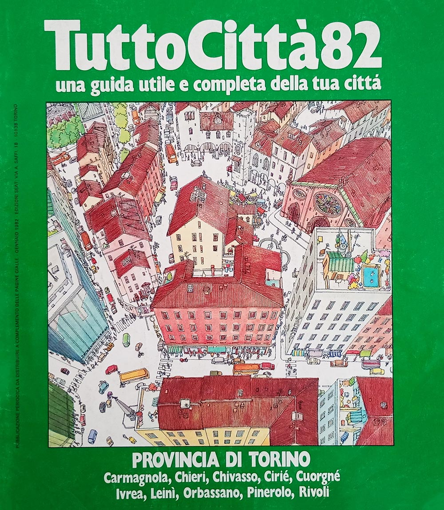</a>
Provincia di Torino 82
<ul class="scheda"><li><b>Formato:</b> 246 x 280 mm</li><li><b>Copertina:</b> grossa</li><li><b>Layout:</b> TuttoCittà '80 classico</li><li><b>Pagine:</b> 32</li><li><b>Mese aggiornamento:</b> gennaio 1982</li><li><b>Note:</b> nota dell'editore</li></ul></td><td class="fasc sospesa">
Alessandria - Asti 82
<ul class="scheda"><li><b>Formato:</b> 246 x 280 mm</li><li><b>Copertina:</b> grossa</li><li><b>Layout:</b> TuttoCittà '80 classico</li><li><b>Note:</b> nota dell'editore</li><li>non in raccolta</li></ul></td><td class="fasc vuota"></td><td class="fasc sospesa">
Cuneo 82
<ul class="scheda"><li><b>Formato:</b> 246 x 280 mm</li><li><b>Copertina:</b> grossa</li><li><b>Layout:</b> TuttoCittà '80 classico</li><li><b>Note:</b> nota dell'editore</li><li>non in raccolta</li></ul></td><td class="fasc"><a href="../immagini/NO82.jpg">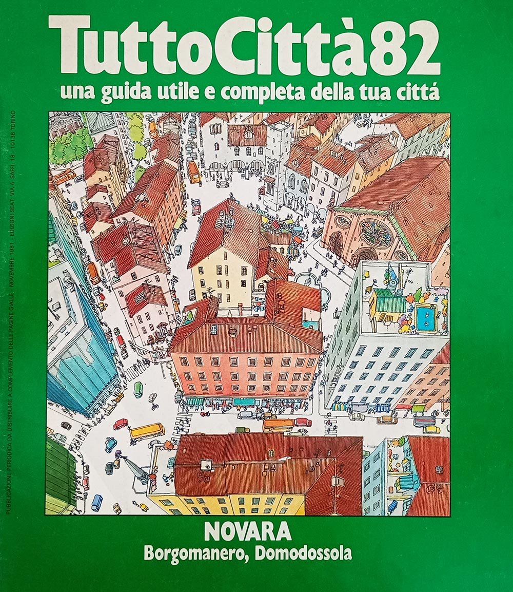</a>
Novara 82
<ul class="scheda"><li><b>Formato:</b> 246 x 280 mm</li><li><b>Copertina:</b> grossa</li><li><b>Layout:</b> TuttoCittà '80 classico</li><li><b>Pagine:</b> 32</li><li><b>Mese aggiornamento:</b> novembre 1981</li><li><b>Note:</b> nota dell'editore</li></ul></td><td class="fasc"><a href="../immagini/VC82.jpg">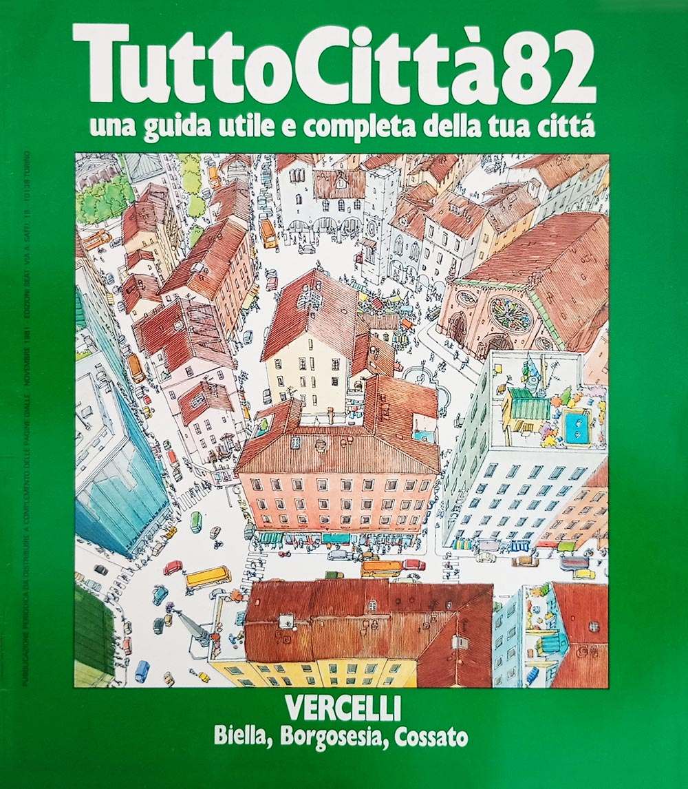</a>
Vercelli 82
<ul class="scheda"><li><b>Formato:</b> 246 x 280 mm</li><li><b>Copertina:</b> grossa</li><li><b>Layout:</b> TuttoCittà '80 classico</li><li><b>Pagine:</b> 32</li><li><b>Mese aggiornamento:</b> novembre 1981</li><li><b>Note:</b> nota dell'editore</li></ul></td></tr>
<tr><td class="ann"> 82/83</td><td class="tav"></td><td class="fasc"><a href="../immagini/TO83.jpg">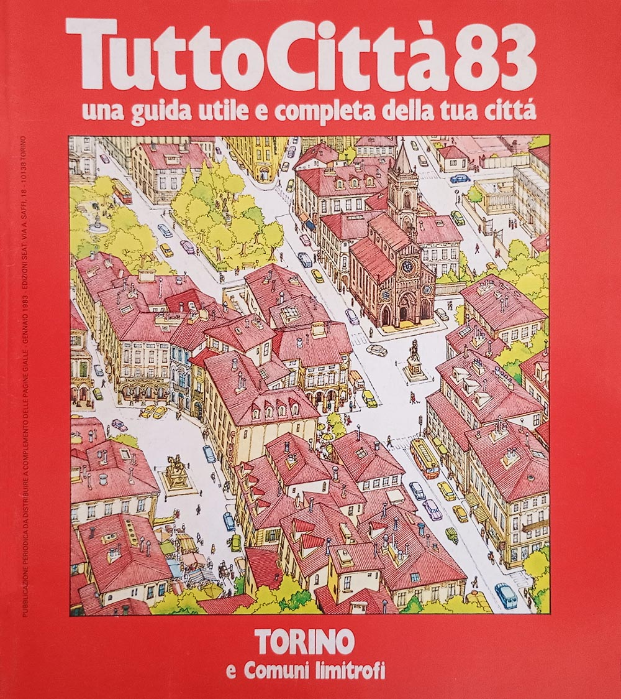</a>
Torino e comuni limitrofi 83
<ul class="scheda"><li><b>Formato:</b> 246 x 280 mm</li><li><b>Copertina:</b> grossa</li><li><b>Layout:</b> TuttoCittà '80 classico</li><li><b>Pagine:</b> 128</li><li><b>Mese aggiornamento:</b> gennaio 1983</li></ul></td><td class="fasc"><a href="../immagini/PROVTO83.jpg">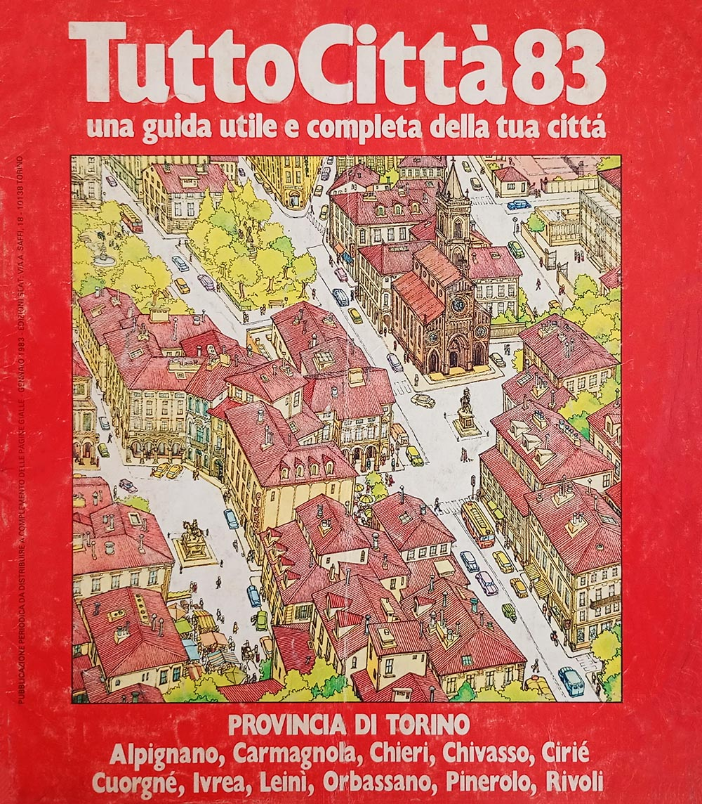</a>
Provincia di Torino 83
<ul class="scheda"><li><b>Formato:</b> 246 x 280 mm</li><li><b>Copertina:</b> grossa</li><li><b>Layout:</b> TuttoCittà '80 classico</li><li><b>Pagine:</b> 40</li><li><b>Mese aggiornamento:</b> gennaio 1983</li></ul></td><td class="fasc"><a href="../immagini/ALAT83.jpg">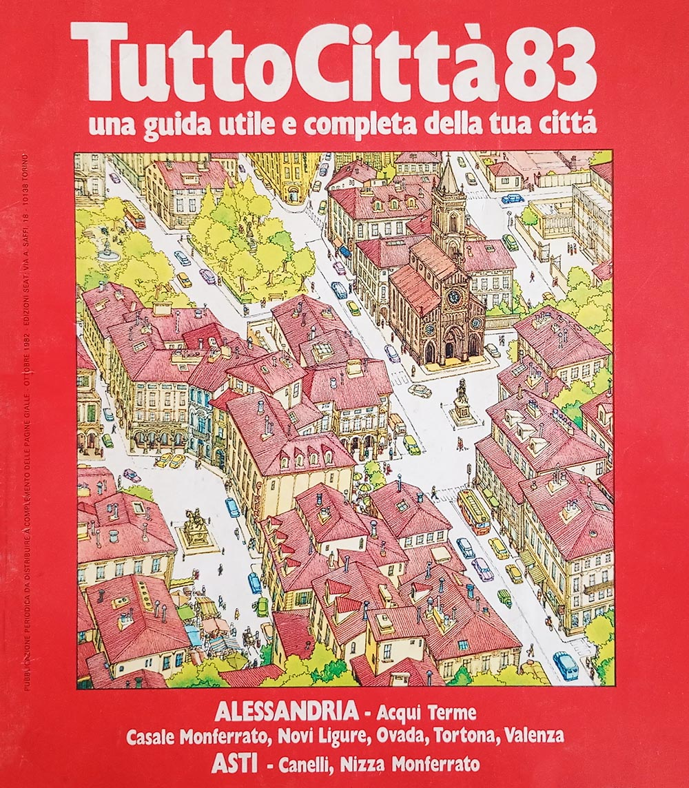</a>
Alessandria - Asti 83
<ul class="scheda"><li><b>Formato:</b> 246 x 280 mm</li><li><b>Copertina:</b> grossa</li><li><b>Layout:</b> TuttoCittà '80 classico</li><li><b>Pagine:</b> 48</li><li><b>Mese aggiornamento:</b> ottobre 1982</li></ul></td><td class="fasc vuota"></td><td class="fasc sospesa">
Cuneo 83
<ul class="scheda"><li><b>Formato:</b> 246 x 280 mm</li><li><b>Copertina:</b> grossa</li><li><b>Layout:</b> TuttoCittà '80 classico</li><li>non in raccolta</li></ul></td><td class="fasc"><a href="../immagini/NO83.jpg">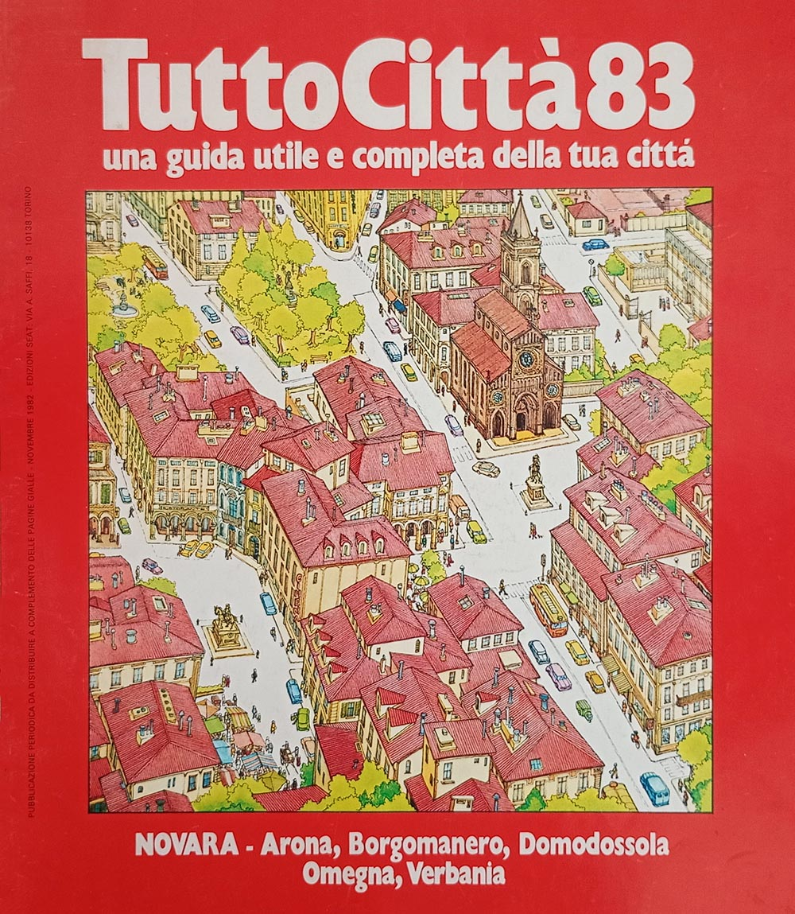</a>
Novara 83
<ul class="scheda"><li><b>Formato:</b> 246 x 280 mm</li><li><b>Copertina:</b> grossa</li><li><b>Layout:</b> TuttoCittà '80 classico</li><li><b>Pagine:</b> 32</li><li><b>Mese aggiornamento:</b> novembre 1982</li></ul></td><td class="fasc"><a href="../immagini/VC83.jpg">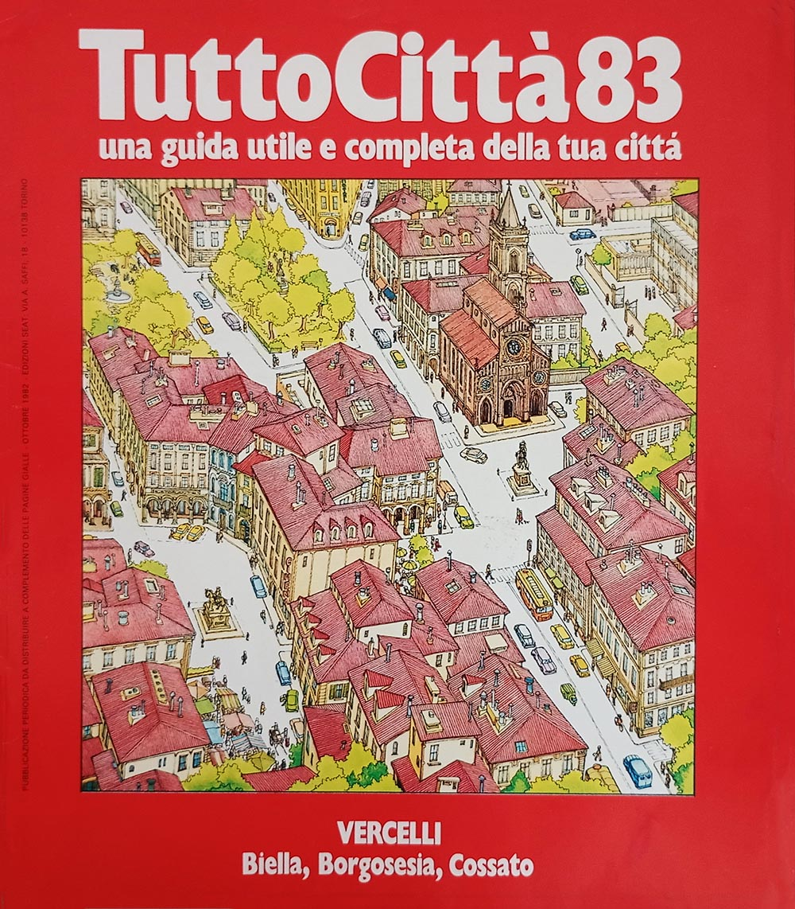</a>
Vercelli 83
<ul class="scheda"><li><b>Formato:</b> 246 x 280 mm</li><li><b>Copertina:</b> grossa</li><li><b>Layout:</b> TuttoCittà '80 classico</li><li><b>Pagine:</b> 32</li><li><b>Mese aggiornamento:</b> ottobre 1982</li></ul></td></tr>
<tr><td class="ann"> 83/84</td><td class="tav"></td><td class="fasc"><a href="../immagini/TO84.jpg">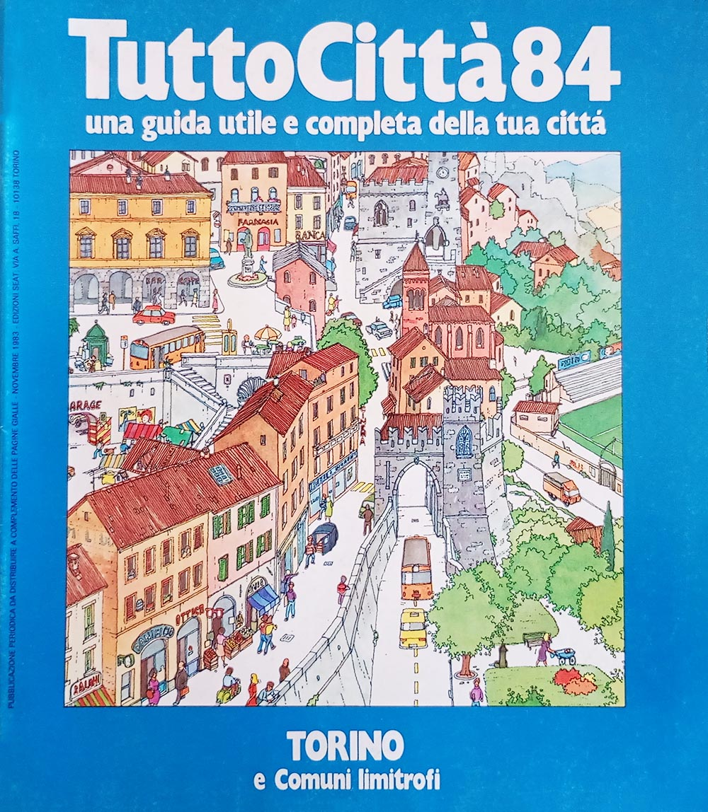</a>
Torino e comuni limitrofi 84
<ul class="scheda"><li><b>Formato:</b> 246 x 280 mm</li><li><b>Copertina:</b> grossa</li><li><b>Layout:</b> TuttoCittà '80 classico</li><li><b>Pagine:</b> 128</li><li><b>Mese aggiornamento:</b> novembre 1983</li></ul></td><td class="fasc"><a href="../immagini/PROVTO84.jpg">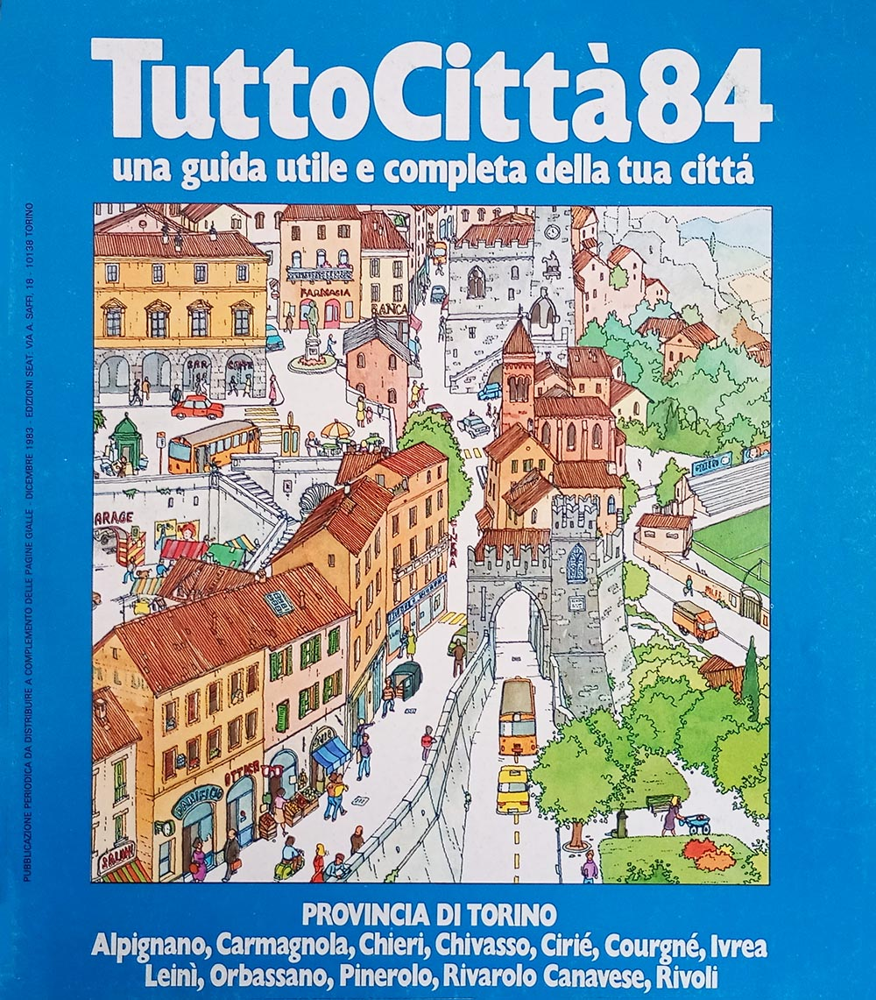</a>
Provincia di Torino 84
<ul class="scheda"><li><b>Formato:</b> 246 x 280 mm</li><li><b>Copertina:</b> grossa</li><li><b>Layout:</b> TuttoCittà '80 classico</li><li><b>Pagine:</b> 40</li><li><b>Mese aggiornamento:</b> dicembre 1983</li></ul></td><td class="fasc sospesa">
Alessandria - Asti 84
<ul class="scheda"><li><b>Formato:</b> 246 x 280 mm</li><li><b>Copertina:</b> grossa</li><li><b>Layout:</b> TuttoCittà '80 classico</li><li>non in raccolta</li></ul></td><td class="fasc vuota"></td><td class="fasc sospesa">
Cuneo 84
<ul class="scheda"><li><b>Formato:</b> 246 x 280 mm</li><li><b>Copertina:</b> grossa</li><li><b>Layout:</b> TuttoCittà '80 classico</li><li>non in raccolta</li></ul></td><td class="fasc"><a href="../immagini/NO84.jpg">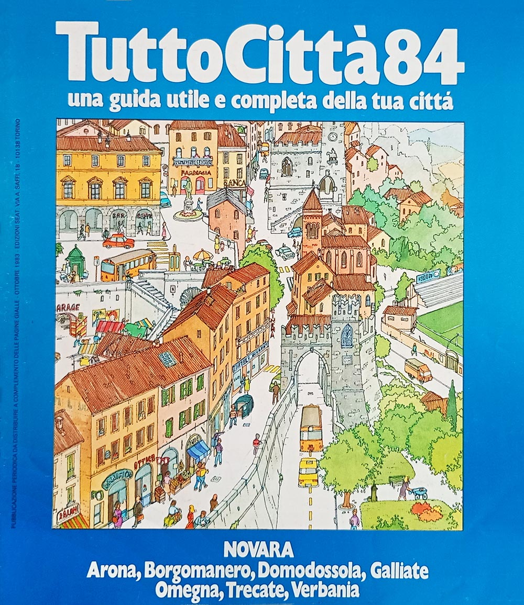</a>
Novara 84
<ul class="scheda"><li><b>Formato:</b> 246 x 280 mm</li><li><b>Copertina:</b> grossa</li><li><b>Layout:</b> TuttoCittà '80 classico</li><li><b>Pagine:</b> 32</li><li><b>Mese aggiornamento:</b> ottobre 1983</li></ul></td><td class="fasc"><a href="../immagini/VC84.jpg">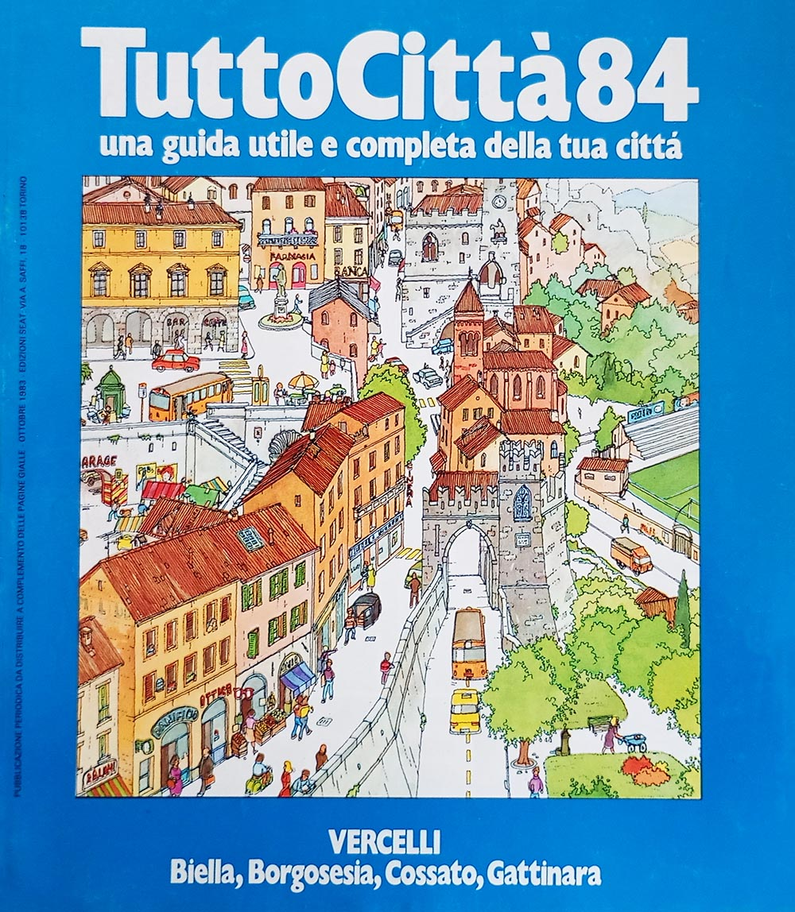</a>
Vercelli 84
<ul class="scheda"><li><b>Formato:</b> 246 x 280 mm</li><li><b>Copertina:</b> grossa</li><li><b>Layout:</b> TuttoCittà '80 classico</li><li><b>Pagine:</b> 32</li><li><b>Mese aggiornamento:</b> ottobre 1983</li></ul></td></tr>
<tr><td class="ann"> 84/85</td><td class="tav"></td><td class="fasc"><a href="../immagini/TO85.jpg">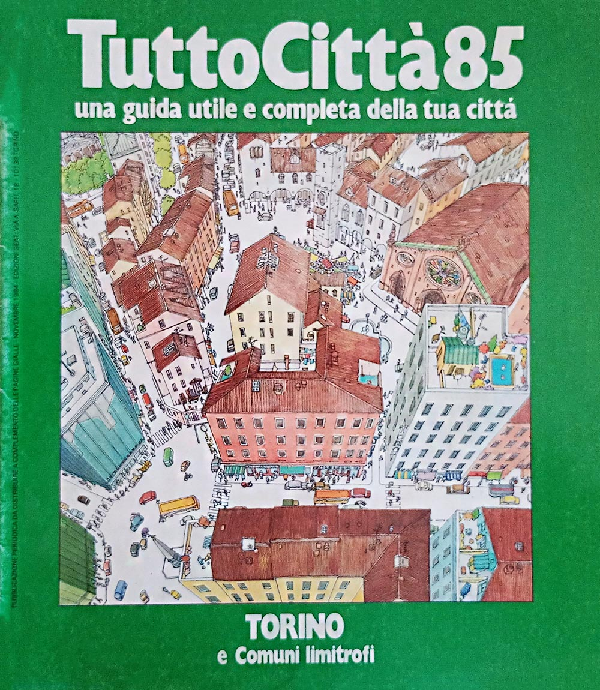</a>
Torino e comuni limitrofi 85
<ul class="scheda"><li><b>Formato:</b> 246 x 280 mm</li><li><b>Copertina:</b> grossa</li><li><b>Layout:</b> TuttoCittà '80 classico</li><li><b>Pagine:</b> 128</li><li><b>Mese aggiornamento:</b> novembre 1984</li><li><b>Note:</b> Inserto Costituzione</li></ul></td><td class="fasc"><a href="../immagini/PROVTO85.jpg">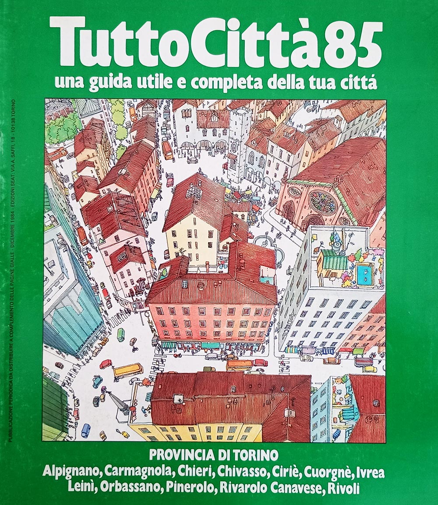</a>
Provincia di Torino 85
<ul class="scheda"><li><b>Formato:</b> 246 x 280 mm</li><li><b>Copertina:</b> grossa</li><li><b>Layout:</b> TuttoCittà '80 classico</li><li><b>Pagine:</b> 40</li><li><b>Mese aggiornamento:</b> dicembre 1984</li><li><b>Note:</b> Inserto Costituzione</li></ul></td><td class="fasc sospesa">
Alessandria 85
<ul class="scheda"><li><b>Formato:</b> 246 x 280 mm</li><li><b>Copertina:</b> grossa</li><li><b>Layout:</b> TuttoCittà '80 classico</li><li><b>Note:</b> Inserto Costituzione</li><li>non in raccolta</li></ul></td><td class="fasc"><a href="../immagini/AT85.jpg">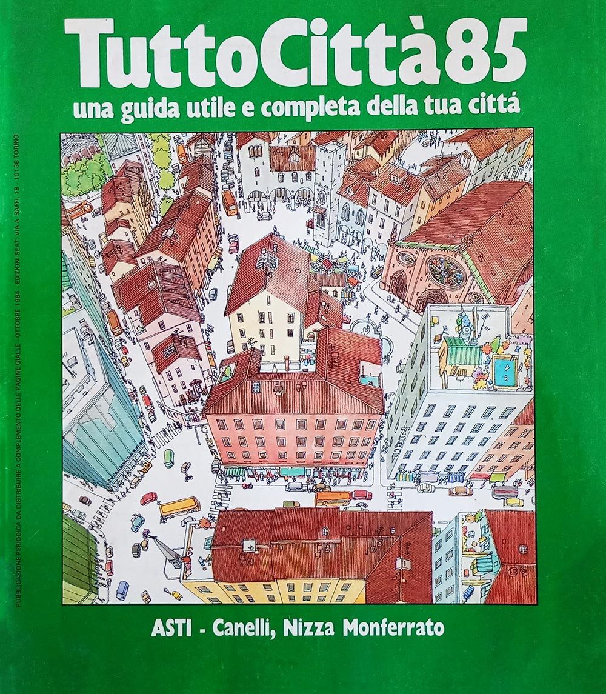</a>
Asti 85
<ul class="scheda"><li><b>Formato:</b> 246 x 280 mm</li><li><b>Copertina:</b> grossa</li><li><b>Layout:</b> TuttoCittà '80 classico</li><li><b>Pagine:</b> 16</li><li><b>Mese aggiornamento:</b> ottobre 1984</li><li><b>Note:</b> Inserto Costituzione</li></ul></td><td class="fasc sospesa">
Cuneo 85
<ul class="scheda"><li><b>Formato:</b> 246 x 280 mm</li><li><b>Copertina:</b> grossa</li><li><b>Layout:</b> TuttoCittà '80 classico</li><li><b>Note:</b> Inserto Costituzione</li><li>non in raccolta</li></ul></td><td class="fasc"><a href="../immagini/NO85.jpg">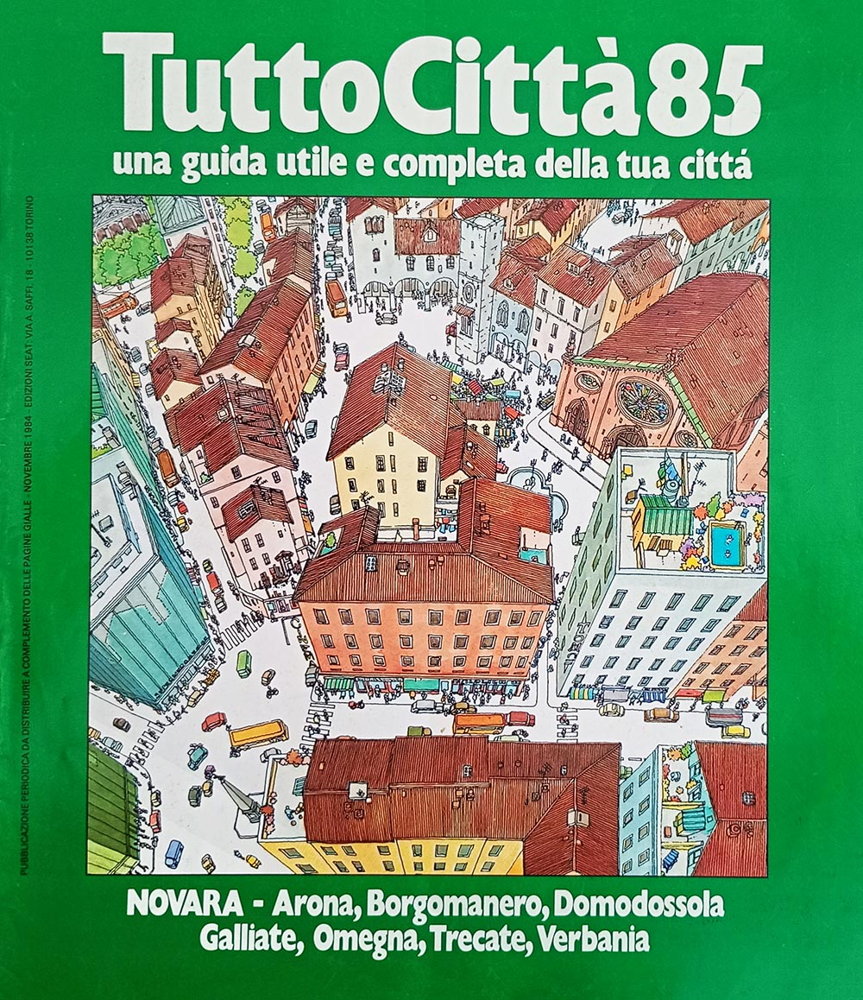</a>
Novara 85
<ul class="scheda"><li><b>Formato:</b> 246 x 280 mm</li><li><b>Copertina:</b> grossa</li><li><b>Layout:</b> TuttoCittà '80 classico</li><li><b>Pagine:</b> 32</li><li><b>Mese aggiornamento:</b> novembre 1984</li><li><b>Note:</b> Inserto Costituzione</li></ul></td><td class="fasc"><a href="../immagini/VC85.jpg">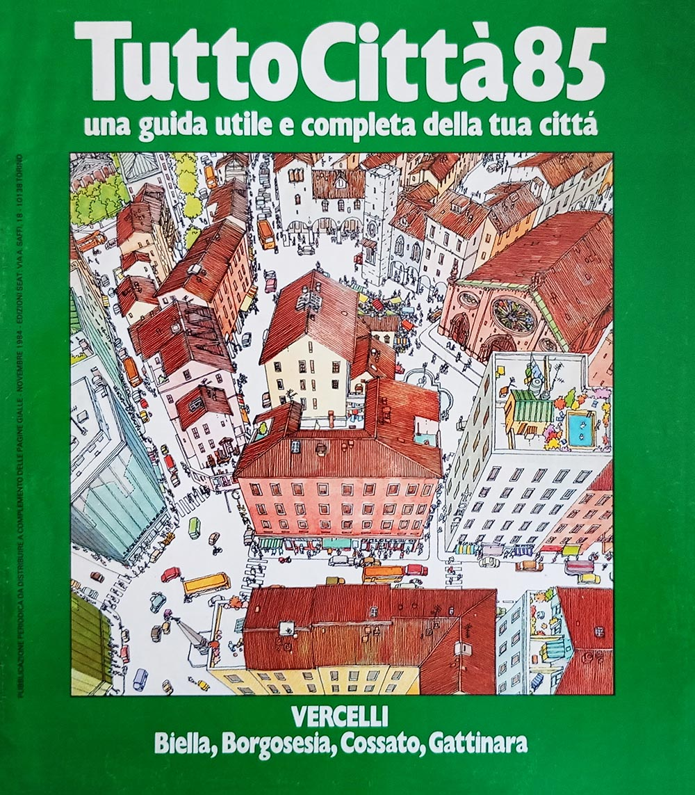</a>
Vercelli 85
<ul class="scheda"><li><b>Formato:</b> 246 x 280 mm</li><li><b>Copertina:</b> grossa</li><li><b>Layout:</b> TuttoCittà '80 classico</li><li><b>Pagine:</b> 24</li><li><b>Mese aggiornamento:</b> novembre 1984</li><li><b>Note:</b> Inserto Costituzione</li></ul></td></tr>
<tr><td class="ann"> 85/86</td><td class="tav"></td><td class="fasc"><a href="../immagini/TO86.jpg">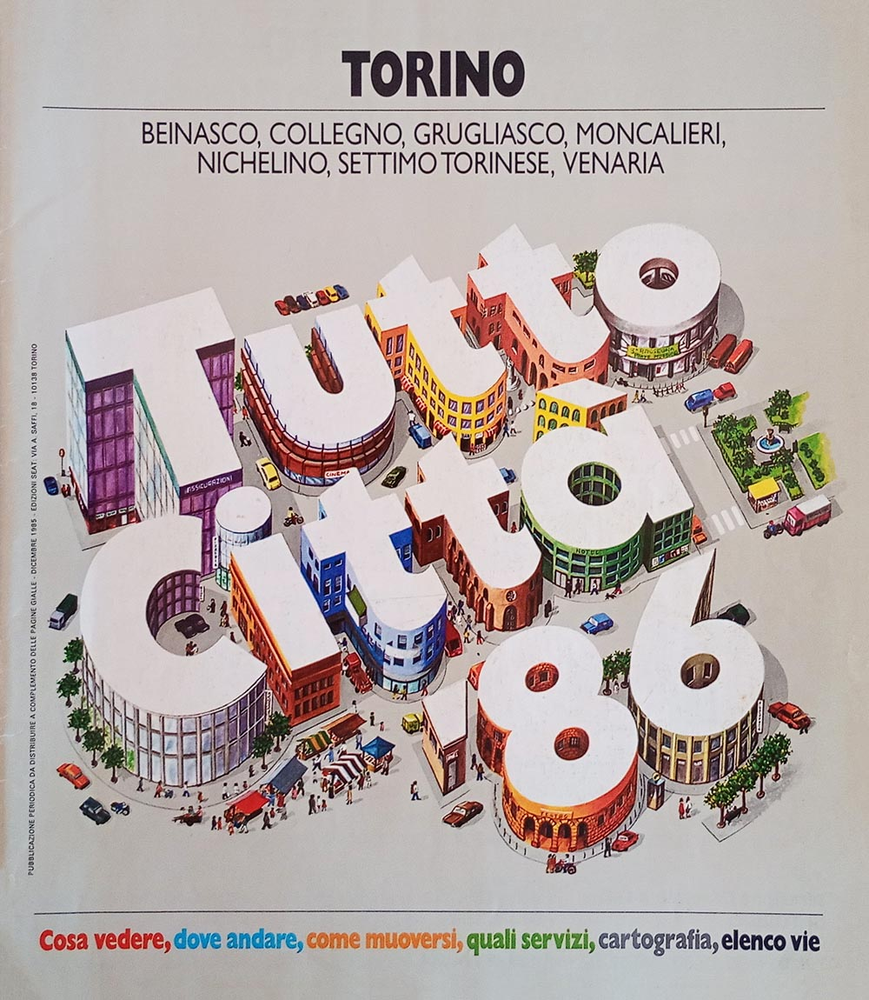</a>
Torino 86
<ul class="scheda"><li><b>Formato:</b> 246 x 280 mm</li><li><b>Copertina:</b> grossa</li><li><b>Layout:</b> TuttoCittà '80 edifici</li><li><b>Pagine:</b> 128</li><li><b>Mese aggiornamento:</b> dicembre 1985</li><li><b>Note:</b> riforma cartografica</li></ul></td><td class="fasc sospesa">
Provincia di Torino 86
<ul class="scheda"><li><b>Formato:</b> 246 x 280 mm</li><li><b>Copertina:</b> grossa</li><li><b>Layout:</b> TuttoCittà '80 classico</li><li>non in raccolta</li></ul></td><td class="fasc sospesa">
Alessandria 86
<ul class="scheda"><li><b>Formato:</b> 246 x 280 mm</li><li><b>Copertina:</b> grossa</li><li><b>Layout:</b> TuttoCittà '80 classico</li><li>non in raccolta</li></ul></td><td class="fasc sospesa">
Asti 86
<ul class="scheda"><li><b>Formato:</b> 246 x 280 mm</li><li><b>Copertina:</b> grossa</li><li><b>Layout:</b> TuttoCittà '80 classico</li><li>non in raccolta</li></ul></td><td class="fasc"><a href="../immagini/CN86.jpg">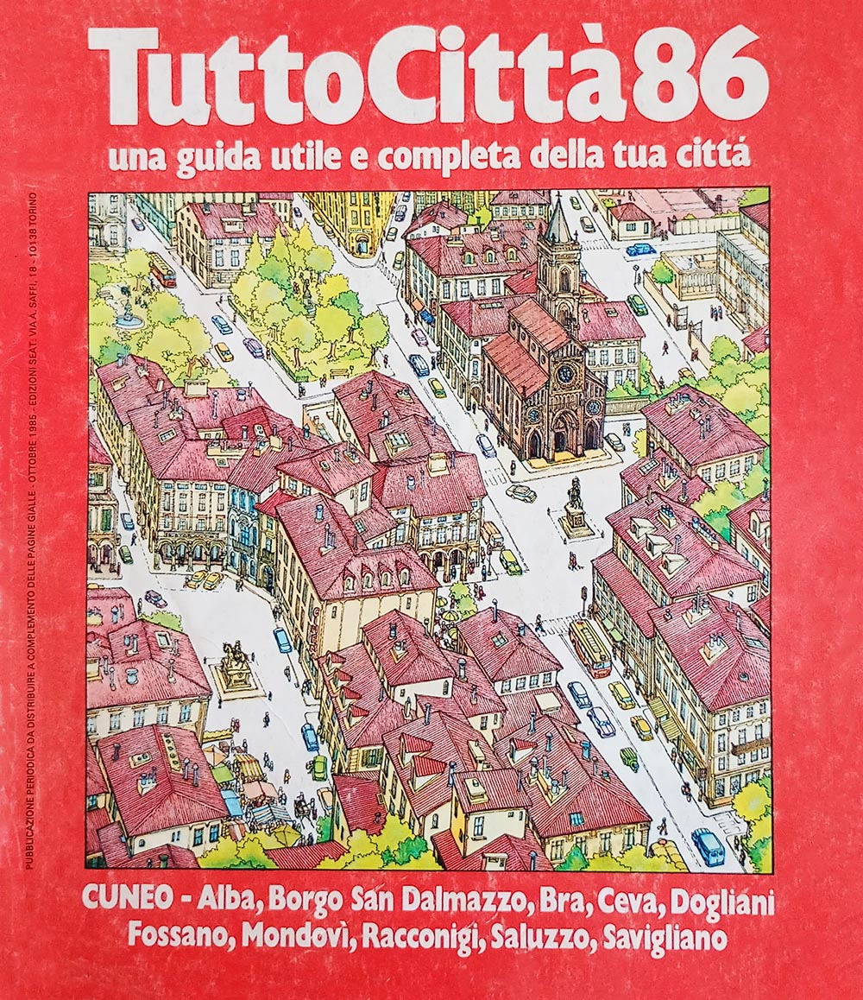</a>
Cuneo 86
<ul class="scheda"><li><b>Formato:</b> 246 x 280 mm</li><li><b>Copertina:</b> grossa</li><li><b>Layout:</b> TuttoCittà '80 classico</li><li><b>Pagine:</b> 32</li><li><b>Mese aggiornamento:</b> ottobre 1985</li></ul></td><td class="fasc"><a href="../immagini/NO86.jpg">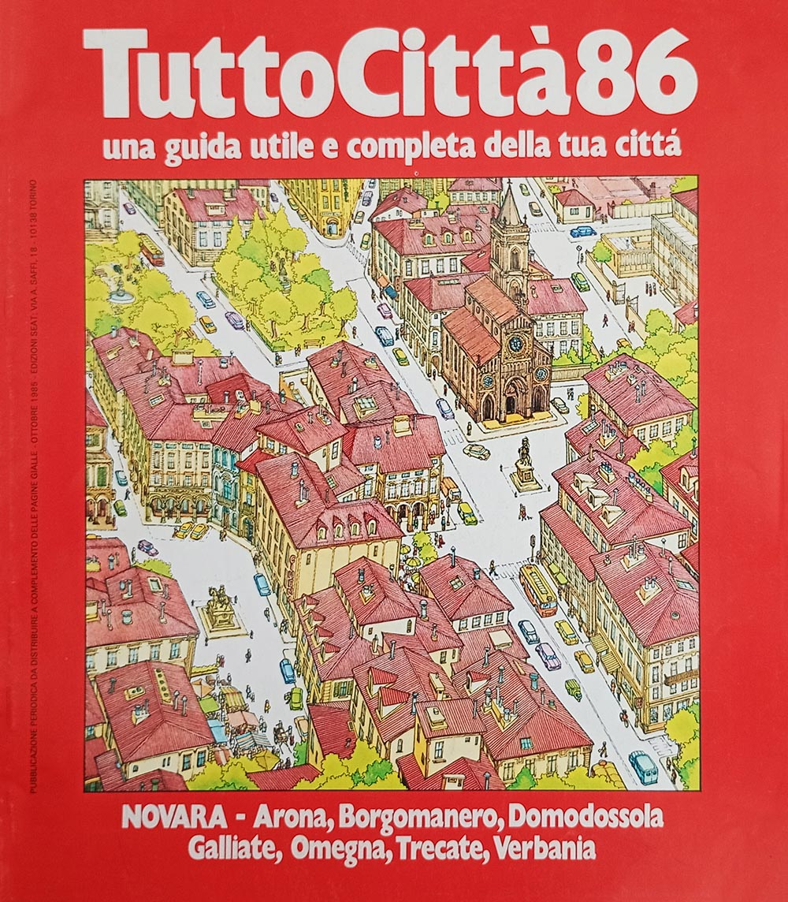</a>
Novara 86
<ul class="scheda"><li><b>Formato:</b> 246 x 280 mm</li><li><b>Copertina:</b> grossa</li><li><b>Layout:</b> TuttoCittà '80 classico</li><li><b>Pagine:</b> 32</li><li><b>Mese aggiornamento:</b> ottobre 1985</li></ul></td><td class="fasc"><a href="../immagini/VC86.jpg">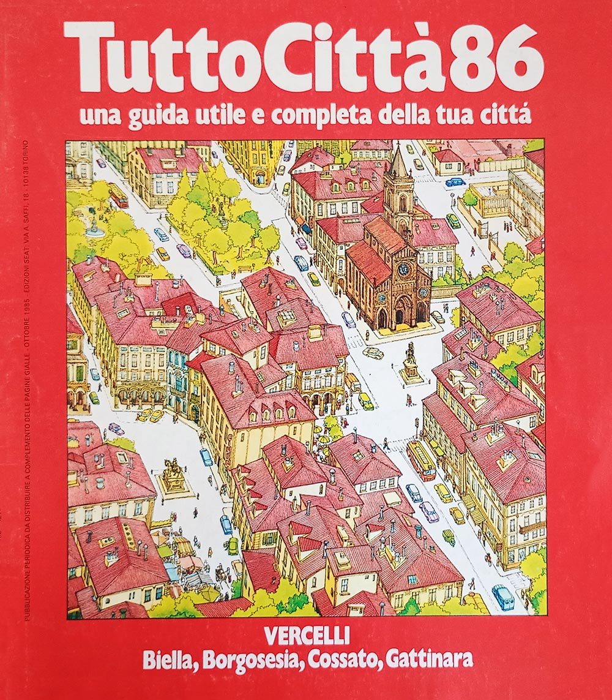</a>
Vercelli 86
<ul class="scheda"><li><b>Formato:</b> 246 x 280 mm</li><li><b>Copertina:</b> grossa</li><li><b>Layout:</b> TuttoCittà '80 classico</li><li><b>Pagine:</b> 24 (25)</li><li><b>Mese aggiornamento:</b> ottobre 1985</li></ul></td></tr>
<tr><td class="ann"> 86/87</td><td class="tav"></td><td class="fasc"><a href="../immagini/TO87.jpg">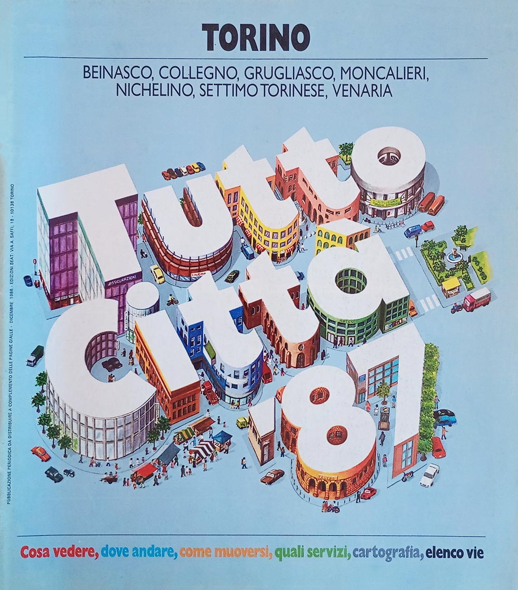</a>
Torino 87
<ul class="scheda"><li><b>Formato:</b> 246 x 280 mm</li><li><b>Copertina:</b> grossa</li><li><b>Layout:</b> TuttoCittà '80 edifici</li><li><b>Pagine:</b> 128</li><li><b>Mese aggiornamento:</b> dicembre 1986</li></ul></td><td class="fasc"><a href="../immagini/PROVTO87.jpg">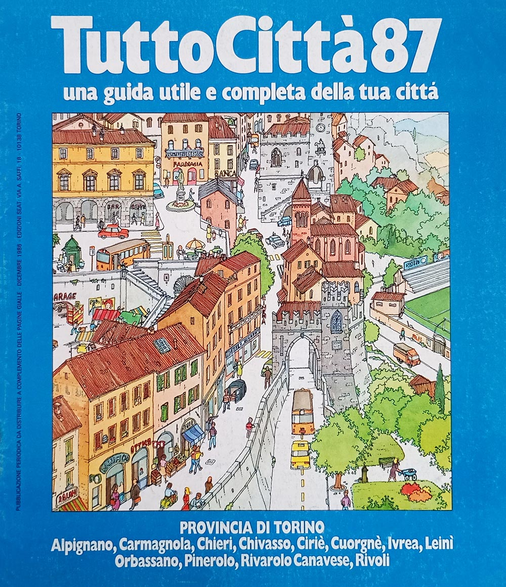</a>
Provincia di Torino 87
<ul class="scheda"><li><b>Formato:</b> 246 x 280 mm</li><li><b>Copertina:</b> grossa</li><li><b>Layout:</b> TuttoCittà '80 classico</li><li><b>Pagine:</b> 40</li><li><b>Mese aggiornamento:</b> dicembre 1986</li></ul></td><td class="fasc"><a href="../immagini/AL87.jpg">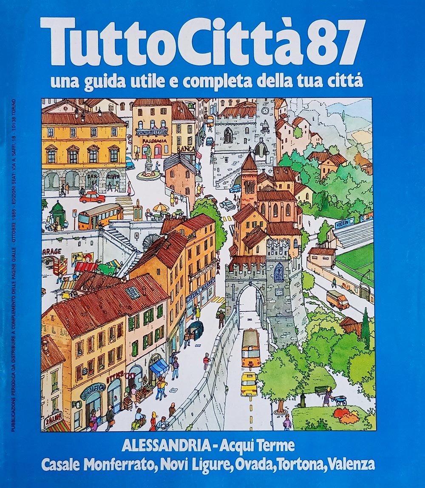</a>
Alessandria 87
<ul class="scheda"><li><b>Formato:</b> 246 x 280 mm</li><li><b>Copertina:</b> grossa</li><li><b>Layout:</b> TuttoCittà '80 classico</li><li><b>Pagine:</b> 24</li><li><b>Mese aggiornamento:</b> ottobre 1986</li></ul></td><td class="fasc"><a href="../immagini/AT87.jpg">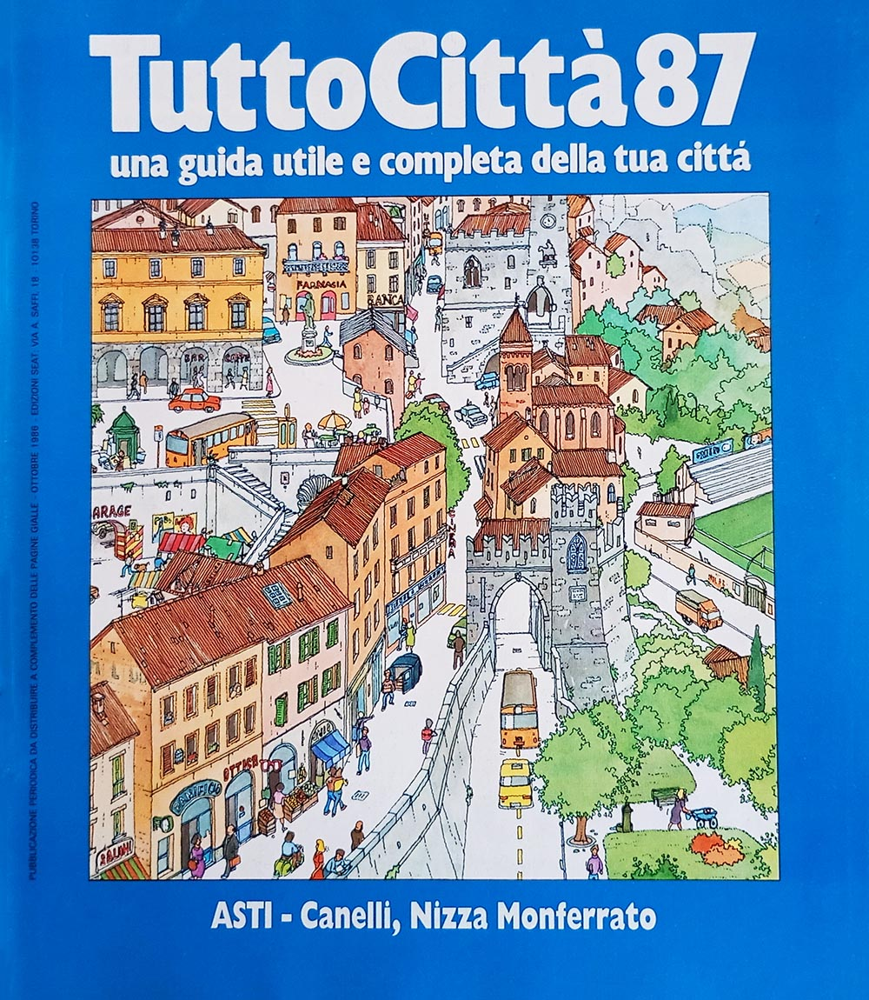</a>
Asti 87
<ul class="scheda"><li><b>Formato:</b> 246 x 280 mm</li><li><b>Copertina:</b> grossa</li><li><b>Layout:</b> TuttoCittà '80 classico</li><li><b>Pagine:</b> 16</li><li><b>Mese aggiornamento:</b> ottobre 1986</li></ul></td><td class="fasc"><a href="../immagini/CN87.jpg">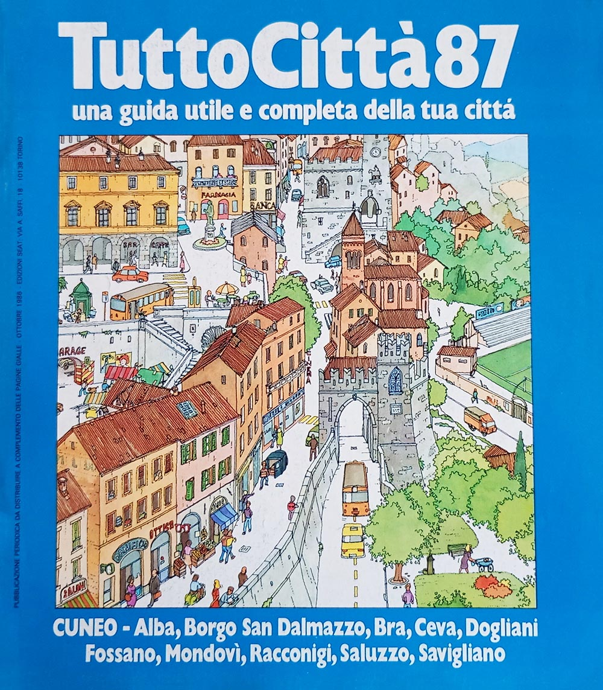</a>
Cuneo 87
<ul class="scheda"><li><b>Formato:</b> 246 x 280 mm</li><li><b>Copertina:</b> grossa</li><li><b>Layout:</b> TuttoCittà '80 classico</li><li><b>Pagine:</b> 32</li><li><b>Mese aggiornamento:</b> ottobre 1986</li></ul></td><td class="fasc"><a href="../immagini/NO87.jpg">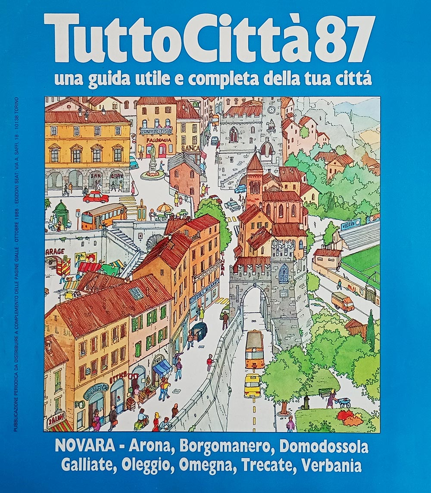</a>
Novara 87
<ul class="scheda"><li><b>Formato:</b> 246 x 280 mm</li><li><b>Copertina:</b> grossa</li><li><b>Layout:</b> TuttoCittà '80 classico</li><li><b>Pagine:</b> 32</li><li><b>Mese aggiornamento:</b> ottobre 1986</li></ul></td><td class="fasc"><a href="../immagini/VC87.jpg">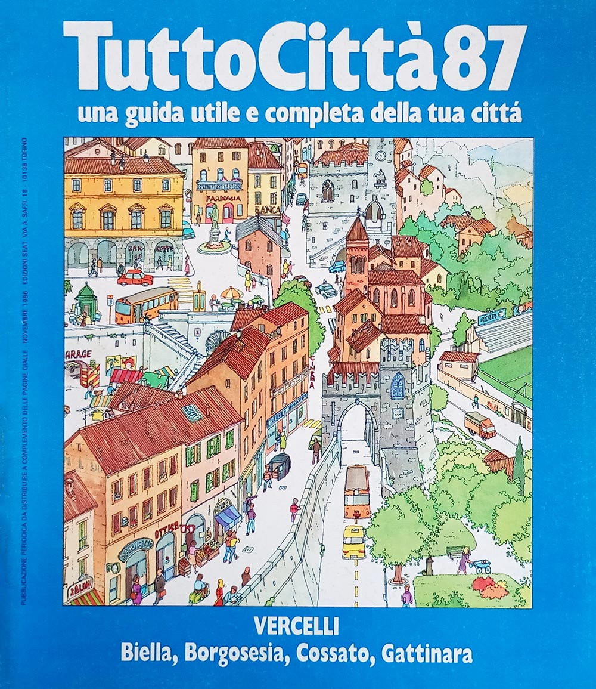</a>
Vercelli 87
<ul class="scheda"><li><b>Formato:</b> 246 x 280 mm</li><li><b>Copertina:</b> grossa</li><li><b>Layout:</b> TuttoCittà '80 classico</li><li><b>Pagine:</b> 24</li><li><b>Mese aggiornamento:</b> novembre 1986</li></ul></td></tr>
<tr><td class="ann"> 87/88</td><td class="tav"></td><td class="fasc"><a href="../immagini/TO88.jpg">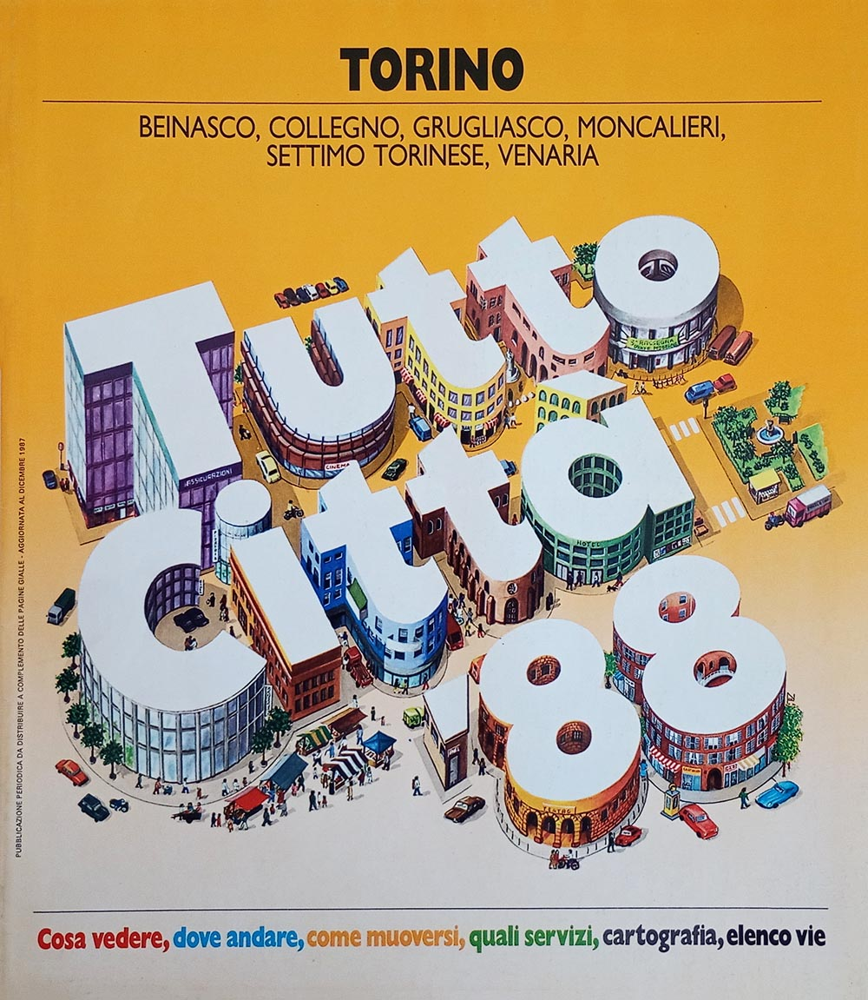</a>
Torino 88
<ul class="scheda"><li><b>Formato:</b> 246 x 280 mm</li><li><b>Copertina:</b> grossa</li><li><b>Layout:</b> TuttoCittà '80 edifici</li><li><b>Pagine:</b> 128</li><li><b>Mese aggiornamento:</b> dicembre 1987</li></ul></td><td class="fasc"><a href="../immagini/PROVTO88.jpg">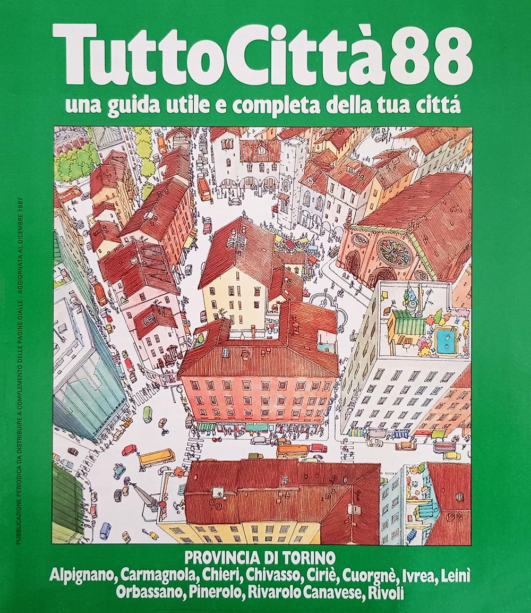</a>
Provincia di Torino 88
<ul class="scheda"><li><b>Formato:</b> 246 x 280 mm</li><li><b>Copertina:</b> grossa</li><li><b>Layout:</b> TuttoCittà '80 classico</li><li><b>Pagine:</b> 40</li><li><b>Mese aggiornamento:</b> dicembre 1987</li></ul></td><td class="fasc"><a href="../immagini/AL88.jpg">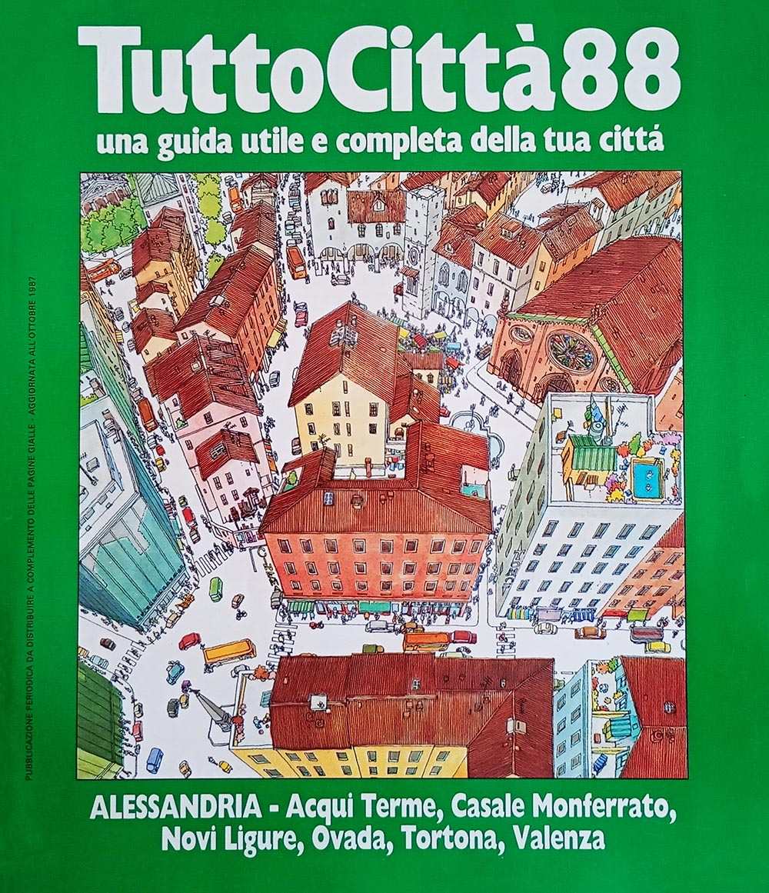</a>
Alessandria 88
<ul class="scheda"><li><b>Formato:</b> 246 x 280 mm</li><li><b>Copertina:</b> grossa</li><li><b>Layout:</b> TuttoCittà '80 classico</li><li><b>Pagine:</b> 24</li><li><b>Mese aggiornamento:</b> ottobre 1987</li></ul></td><td class="fasc"><a href="../immagini/AT88.jpg">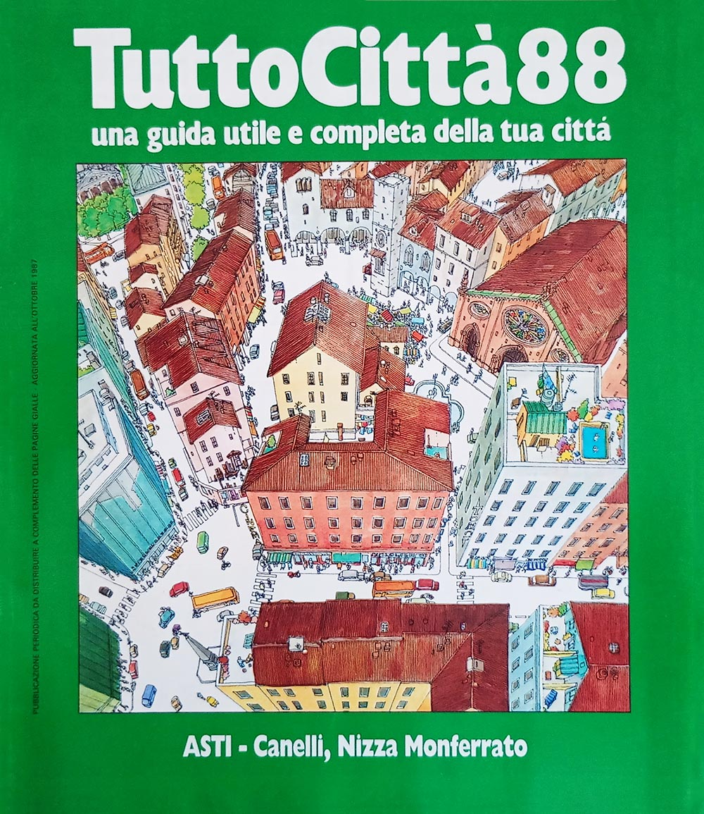</a>
Asti 88
<ul class="scheda"><li><b>Formato:</b> 246 x 280 mm</li><li><b>Copertina:</b> grossa</li><li><b>Layout:</b> TuttoCittà '80 classico</li><li><b>Pagine:</b> 16</li><li><b>Mese aggiornamento:</b> ottobre 1987</li></ul></td><td class="fasc"><a href="../immagini/CN88.jpg">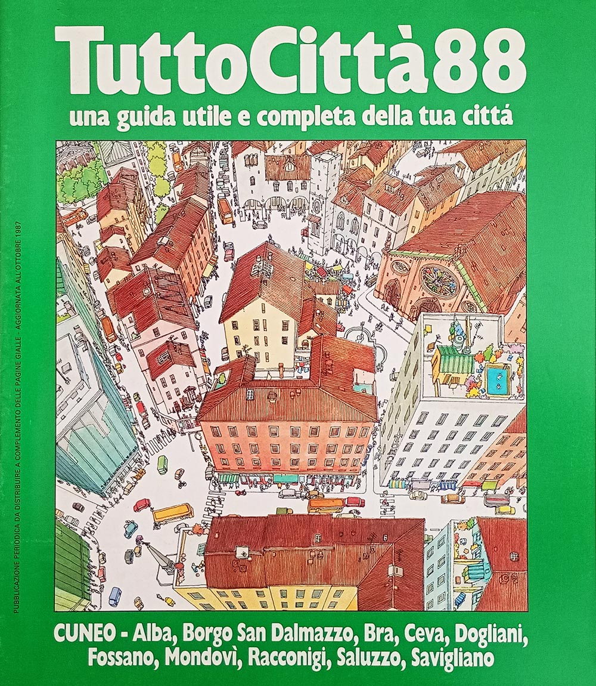</a>
Cuneo 88
<ul class="scheda"><li><b>Formato:</b> 246 x 280 mm</li><li><b>Copertina:</b> grossa</li><li><b>Layout:</b> TuttoCittà '80 classico</li><li><b>Pagine:</b> 32 (33)</li><li><b>Mese aggiornamento:</b> ottobre 1987</li></ul></td><td class="fasc"><a href="../immagini/NO88.jpg">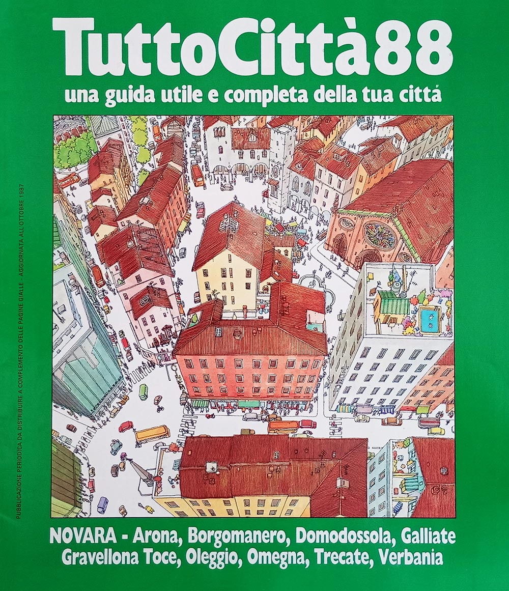</a>
Novara 88
<ul class="scheda"><li><b>Formato:</b> 246 x 280 mm</li><li><b>Copertina:</b> grossa</li><li><b>Layout:</b> TuttoCittà '80 classico</li><li><b>Pagine:</b> 32</li><li><b>Mese aggiornamento:</b> ottobre 1987</li></ul></td><td class="fasc"><a href="../immagini/VC88.jpg">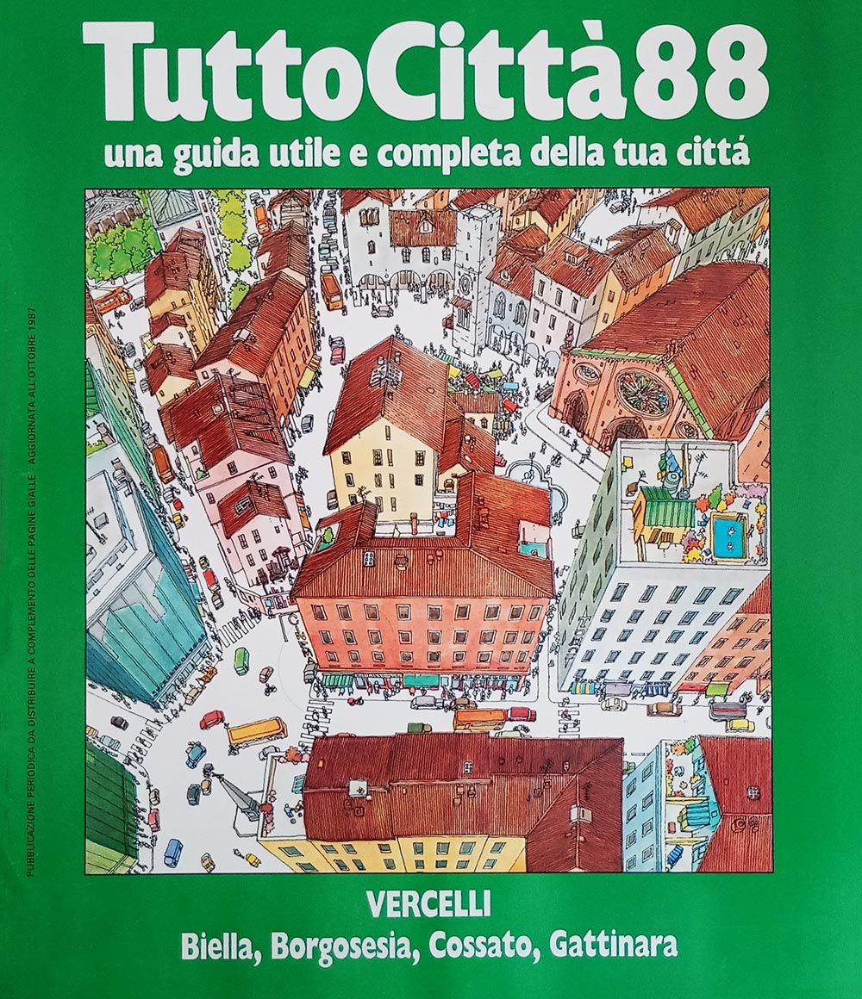</a>
Vercelli 88
<ul class="scheda"><li><b>Formato:</b> 246 x 280 mm</li><li><b>Copertina:</b> grossa</li><li><b>Layout:</b> TuttoCittà '80 classico</li><li><b>Pagine:</b> 24</li><li><b>Mese aggiornamento:</b> ottobre 1987</li></ul></td></tr>
<tr><td class="ann"> 88/89</td><td class="tav"></td><td class="fasc"><a href="../immagini/TO89.jpg">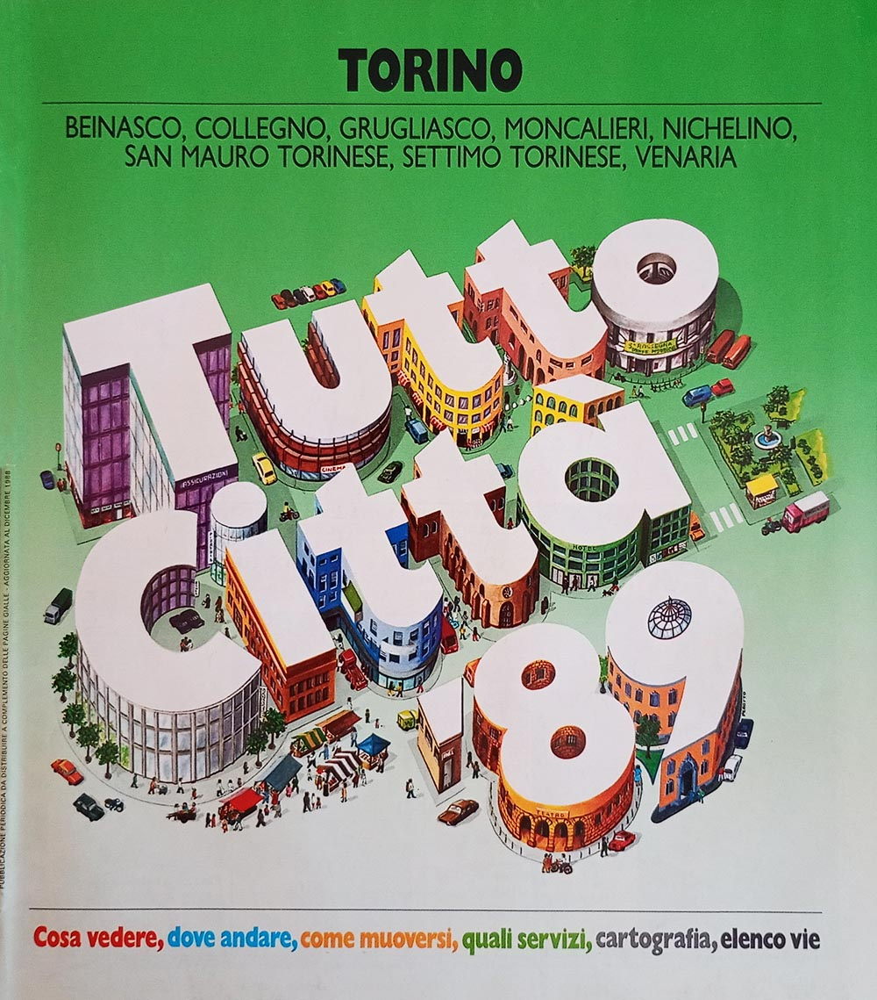</a>
Torino 89
<ul class="scheda"><li><b>Formato:</b> 246 x 280 mm</li><li><b>Copertina:</b> grossa</li><li><b>Layout:</b> TuttoCittà '80 edifici</li><li><b>Pagine:</b> 128</li><li><b>Mese aggiornamento:</b> dicembre 1988</li></ul></td><td class="fasc"><a href="../immagini/PROVTO89.jpg">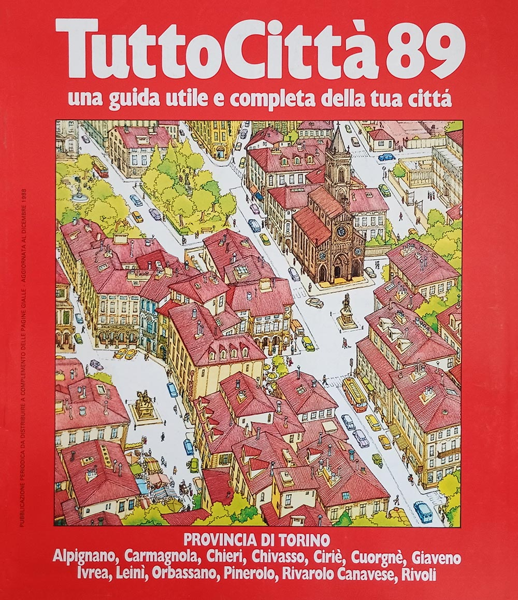</a>
Provincia di Torino 89
<ul class="scheda"><li><b>Formato:</b> 246 x 280 mm</li><li><b>Copertina:</b> grossa</li><li><b>Layout:</b> TuttoCittà '80 classico</li><li><b>Pagine:</b> 40</li><li><b>Mese aggiornamento:</b> dicembre 1988</li></ul></td><td class="fasc"><a href="../immagini/AL89.jpg">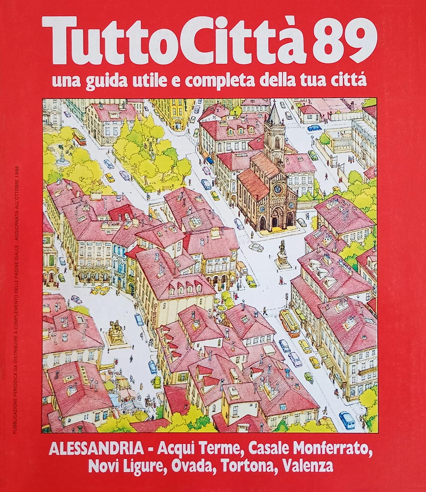</a>
Alessandria 89
<ul class="scheda"><li><b>Formato:</b> 246 x 280 mm</li><li><b>Copertina:</b> grossa</li><li><b>Layout:</b> TuttoCittà '80 classico</li><li><b>Pagine:</b> 24</li><li><b>Mese aggiornamento:</b> ottobre 1988</li></ul></td><td class="fasc"><a href="../immagini/AT89.jpg">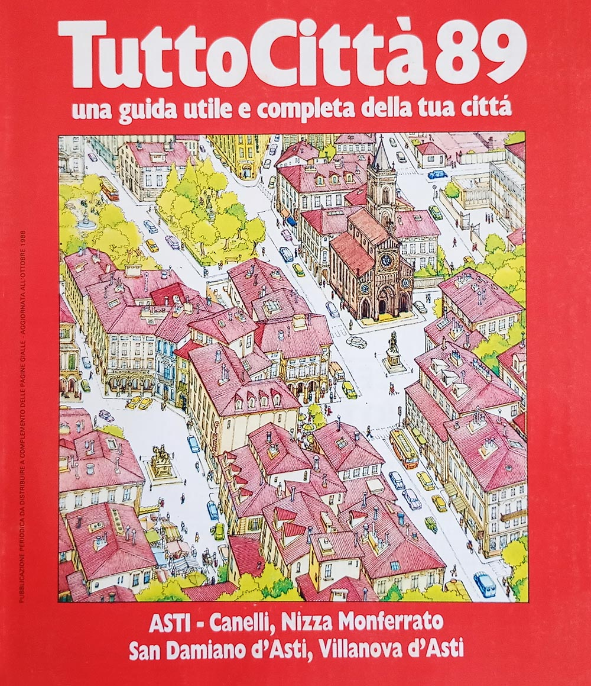</a>
Asti 89
<ul class="scheda"><li><b>Formato:</b> 246 x 280 mm</li><li><b>Copertina:</b> grossa</li><li><b>Layout:</b> TuttoCittà '80 classico</li><li><b>Pagine:</b> 16</li><li><b>Mese aggiornamento:</b> ottobre 1988</li></ul></td><td class="fasc"><a href="../immagini/CN89.jpg">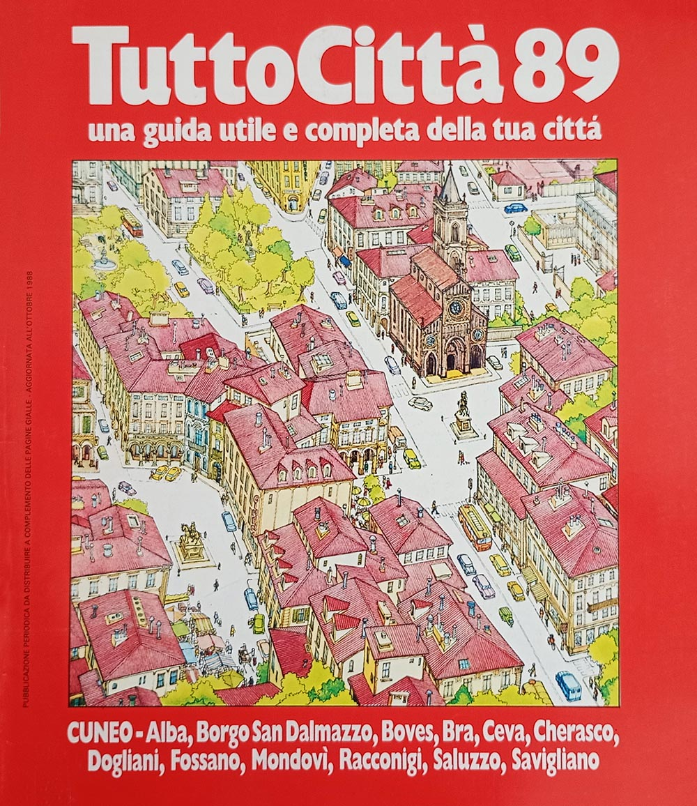</a>
Cuneo 89
<ul class="scheda"><li><b>Formato:</b> 246 x 280 mm</li><li><b>Copertina:</b> grossa</li><li><b>Layout:</b> TuttoCittà '80 classico</li><li><b>Pagine:</b> 32 (33)</li><li><b>Mese aggiornamento:</b> ottobre 1988</li></ul></td><td class="fasc"><a href="../immagini/NO89.jpg">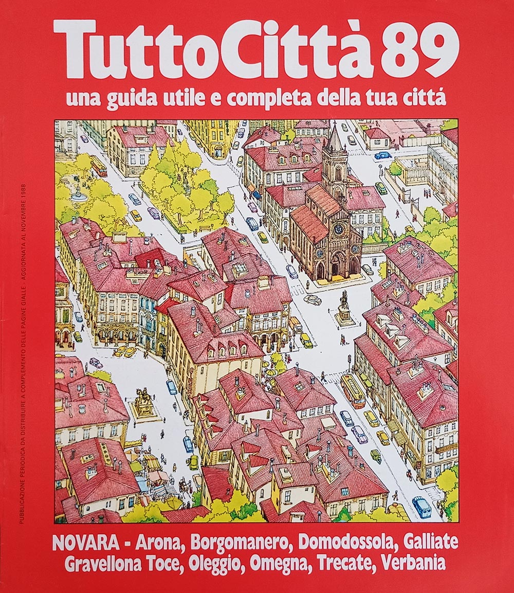</a>
Novara 89
<ul class="scheda"><li><b>Formato:</b> 246 x 280 mm</li><li><b>Copertina:</b> grossa</li><li><b>Layout:</b> TuttoCittà '80 classico</li><li><b>Pagine:</b> 32</li><li><b>Mese aggiornamento:</b> novembre 1988</li></ul></td><td class="fasc"><a href="../immagini/VC89.jpg">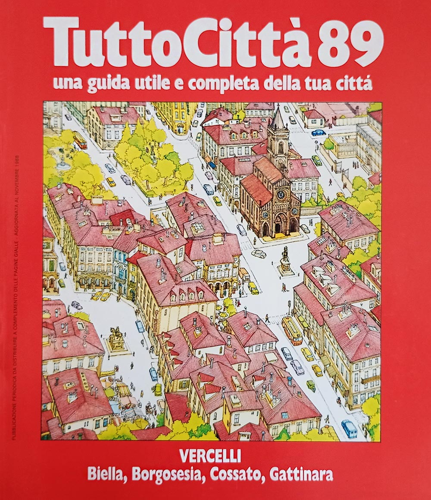</a>
Vercelli 89
<ul class="scheda"><li><b>Formato:</b> 246 x 280 mm</li><li><b>Copertina:</b> grossa</li><li><b>Layout:</b> TuttoCittà '80 classico</li><li><b>Pagine:</b> 24</li><li><b>Mese aggiornamento:</b> novembre 1988</li></ul></td></tr>
<tr><td class="ann">  89/90</td><td class="tav"> </td><td class="fasc"><a href="../immagini/TO90.jpg">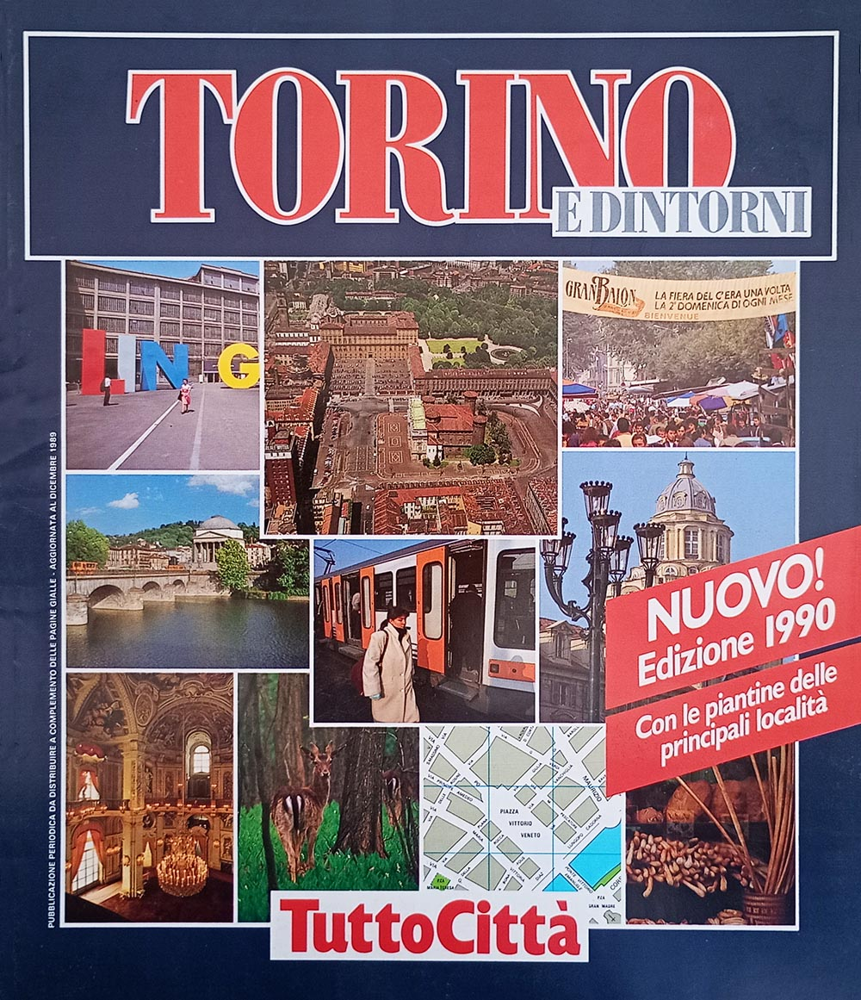</a>
Torino e dintorni 90
<ul class="scheda"><li><b>Formato:</b> 246 x 280 mm</li><li><b>Copertina:</b> grossa</li><li><b>Layout:</b> TuttoCittà '90 classico iniziale</li><li><b>Pagine:</b> 128</li><li><b>Mese aggiornamento:</b> dicembre 1989</li><li><b>Note:</b> nota dell'editore</li></ul></td><td class="fasc"><a href="../immagini/PROVTO90.jpg">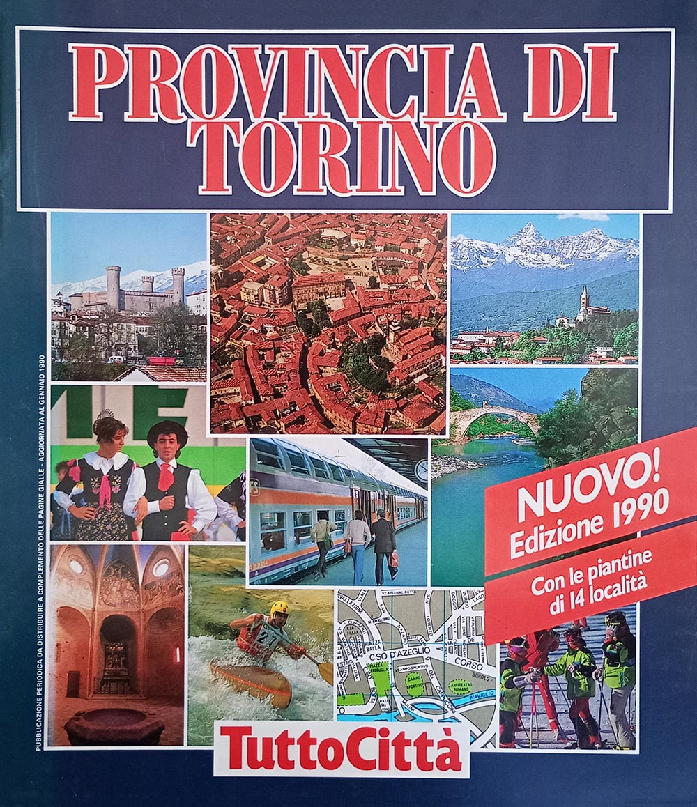</a>
Provincia di Torino 90
<ul class="scheda"><li><b>Formato:</b> 246 x 280 mm</li><li><b>Copertina:</b> grossa</li><li><b>Layout:</b> TuttoCittà '90 classico iniziale</li><li><b>Pagine:</b> 40</li><li><b>Mese aggiornamento:</b> gennaio 1990</li><li><b>Note:</b> nota dell'editore</li></ul></td><td class="fasc"><a href="../immagini/AL90.jpg">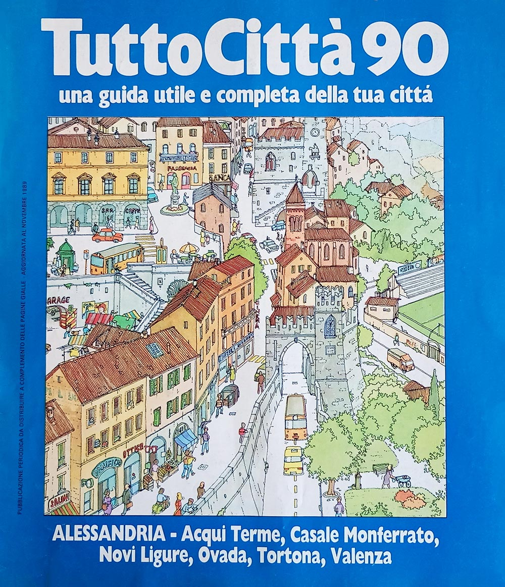</a>
Alessandria 90
<ul class="scheda"><li><b>Formato:</b> 246 x 280 mm</li><li><b>Copertina:</b> grossa</li><li><b>Layout:</b> TuttoCittà '80 classico</li><li><b>Pagine:</b> 24</li><li><b>Mese aggiornamento:</b> novembre 1989</li></ul></td><td class="fasc"><a href="../immagini/AT90.jpg">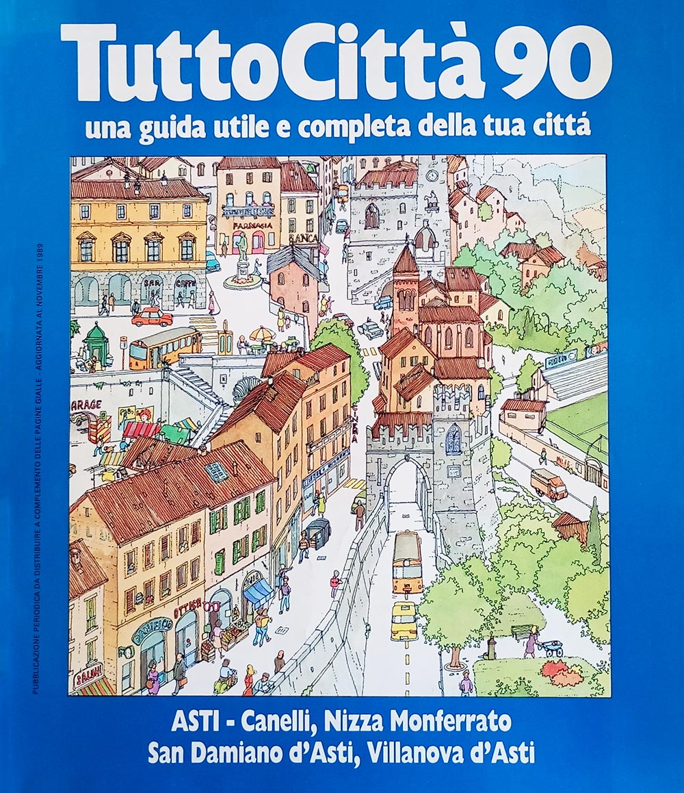</a>
Asti 90
<ul class="scheda"><li><b>Formato:</b> 246 x 280 mm</li><li><b>Copertina:</b> grossa</li><li><b>Layout:</b> TuttoCittà '80 classico</li><li><b>Pagine:</b> 16</li><li><b>Mese aggiornamento:</b> novembre 1989</li></ul></td><td class="fasc"><a href="../immagini/CN90.jpg">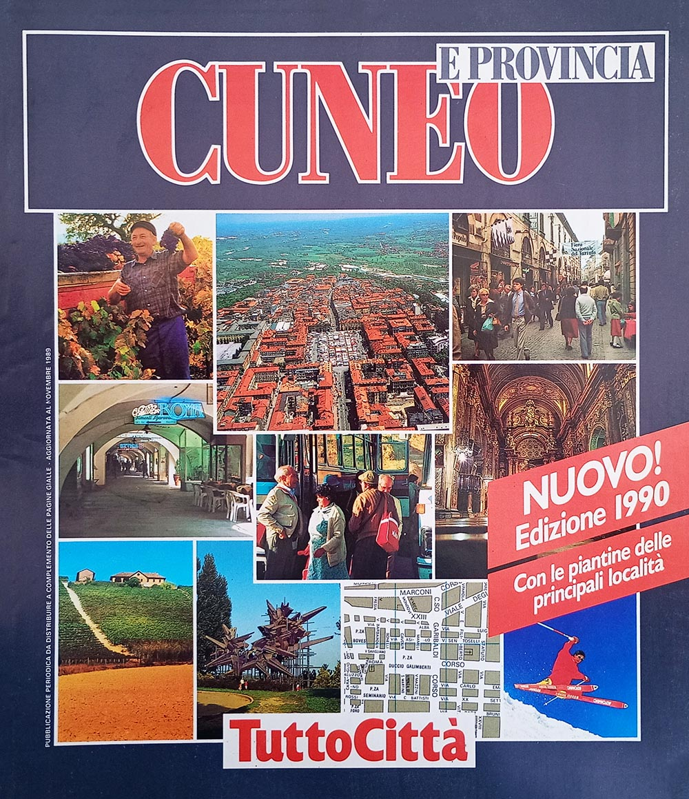</a>
Cuneo 90
<ul class="scheda"><li><b>Formato:</b> 246 x 280 mm</li><li><b>Copertina:</b> grossa</li><li><b>Layout:</b> TuttoCittà '90 classico iniziale</li><li><b>Pagine:</b> 40</li><li><b>Mese aggiornamento:</b> novembre 1989</li><li><b>Note:</b> nota dell'editore</li></ul></td><td class="fasc"><a href="../immagini/NO90.jpg">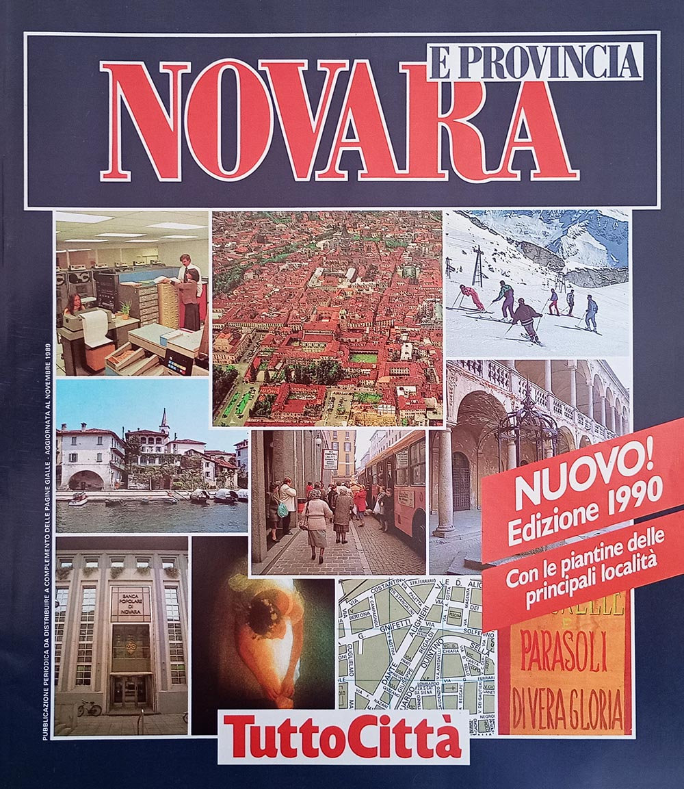</a>
Novara 90
<ul class="scheda"><li><b>Formato:</b> 246 x 280 mm</li><li><b>Copertina:</b> grossa</li><li><b>Layout:</b> TuttoCittà '90 classico iniziale</li><li><b>Pagine:</b> 32</li><li><b>Mese aggiornamento:</b> novembre 1989</li><li><b>Note:</b> nota dell'editore</li></ul></td><td class="fasc"><a href="../immagini/VC90.jpg">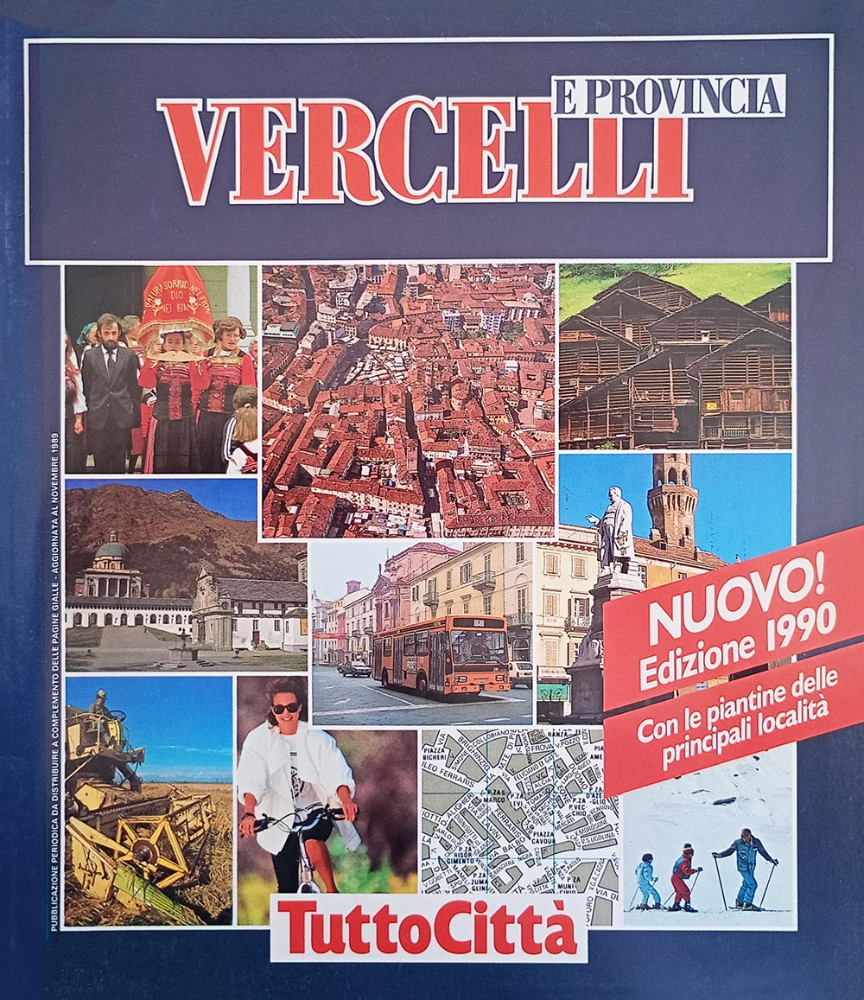</a>
Vercelli 90
<ul class="scheda"><li><b>Formato:</b> 246 x 280 mm</li><li><b>Copertina:</b> grossa</li><li><b>Layout:</b> TuttoCittà '90 classico iniziale</li><li><b>Pagine:</b> 24</li><li><b>Mese aggiornamento:</b> novembre 1989</li><li><b>Note:</b> nota dell'editore</li></ul></td></tr>
<tr><td class="ann">  90/91</td><td class="tav"></td><td class="fasc"><a href="../immagini/TO91.jpg">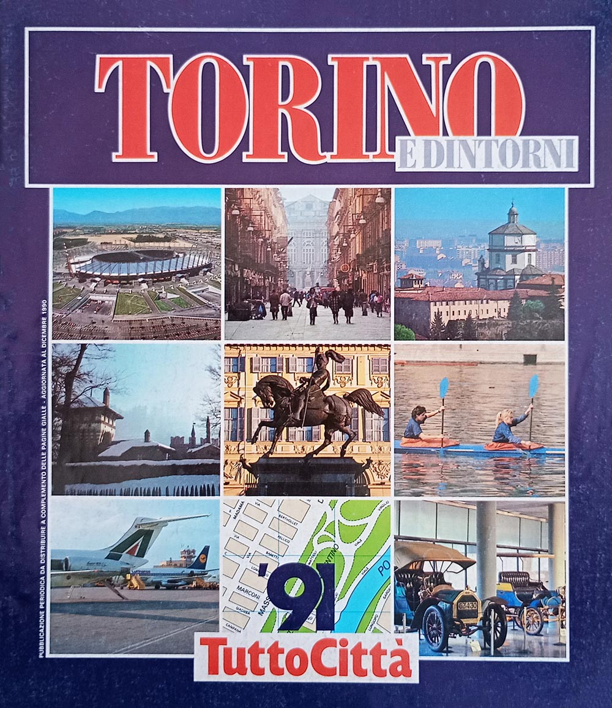</a>
Torino e dintorni 91
<ul class="scheda"><li><b>Formato:</b> 246 x 280 mm</li><li><b>Copertina:</b> grossa</li><li><b>Layout:</b> TuttoCittà '90 classico iniziale</li><li><b>Pagine:</b> 144</li><li><b>Mese aggiornamento:</b> dicembre 1990</li></ul></td><td class="fasc"><a href="../immagini/PROVTO91.jpg">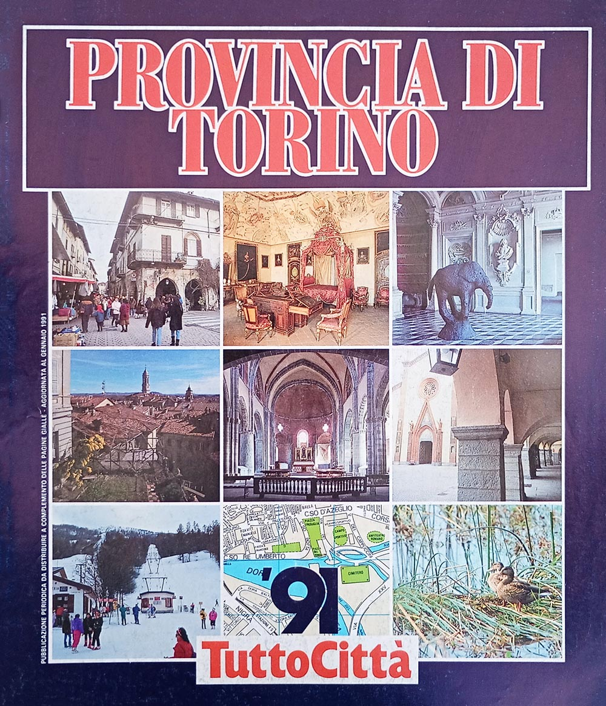</a>
Provincia di Torino 91
<ul class="scheda"><li><b>Formato:</b> 246 x 280 mm</li><li><b>Copertina:</b> grossa</li><li><b>Layout:</b> TuttoCittà '90 classico iniziale</li><li><b>Pagine:</b> 48</li><li><b>Mese aggiornamento:</b> dicembre 1990</li></ul></td><td class="fasc sospesa">
Alessandria 91
<ul class="scheda"><li><b>Formato:</b> 246 x 280 mm</li><li><b>Copertina:</b> grossa</li><li><b>Layout:</b> TuttoCittà '90 classico iniziale</li><li><b>Note:</b> nota dell'editore</li><li>non in raccolta</li></ul></td><td class="fasc"><a href="../immagini/AT91.jpg">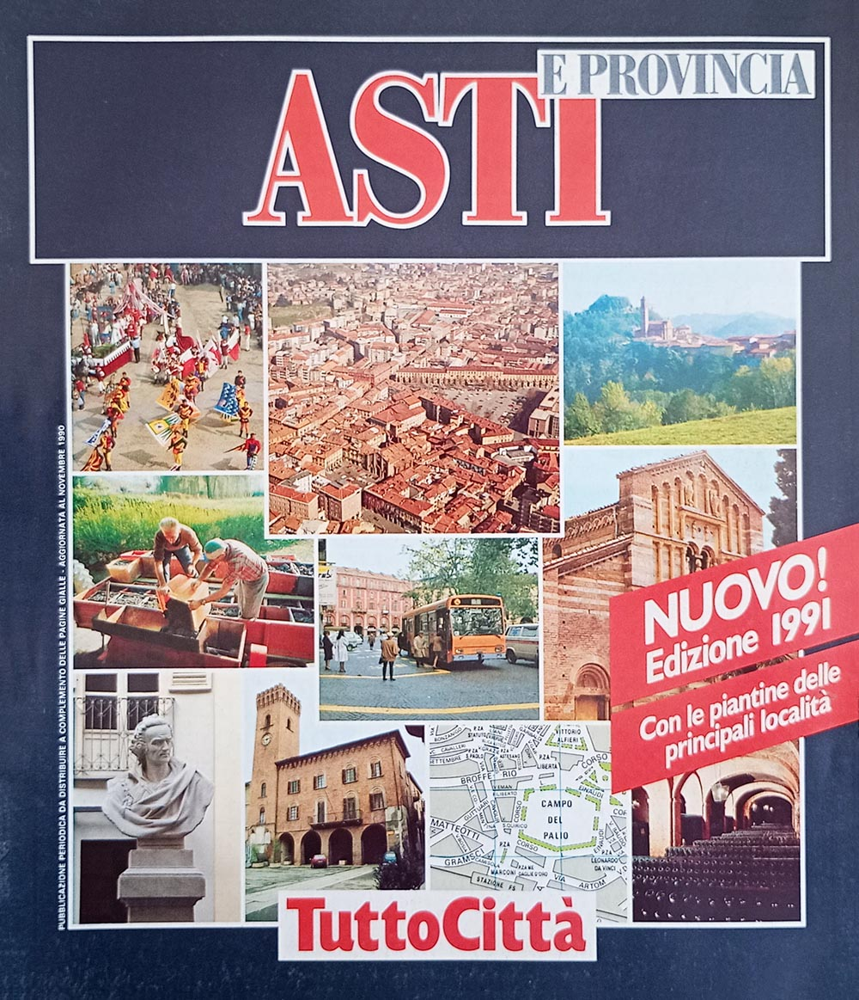</a>
Asti 91
<ul class="scheda"><li><b>Formato:</b> 246 x 280 mm</li><li><b>Copertina:</b> grossa</li><li><b>Layout:</b> TuttoCittà '90 classico iniziale</li><li><b>Pagine:</b> 16</li><li><b>Mese aggiornamento:</b> novembre 1990</li><li><b>Note:</b> nota dell'editore</li></ul></td><td class="fasc sospesa">
Cuneo 91
<ul class="scheda"><li><b>Formato:</b> 246 x 280 mm</li><li><b>Copertina:</b> grossa</li><li><b>Layout:</b> TuttoCittà '90 classico iniziale</li><li>non in raccolta</li></ul></td><td class="fasc"><a href="../immagini/NO91.jpg">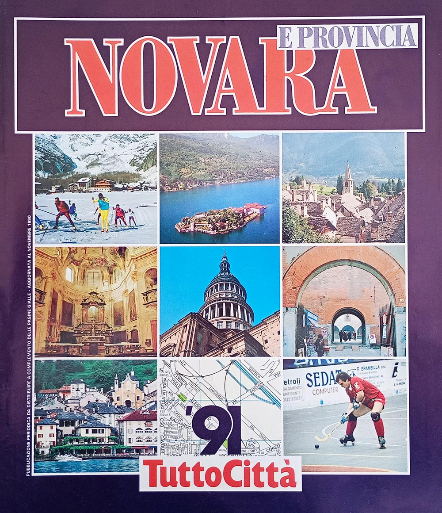</a>
Novara 91
<ul class="scheda"><li><b>Formato:</b> 246 x 280 mm</li><li><b>Copertina:</b> grossa</li><li><b>Layout:</b> TuttoCittà '90 classico iniziale</li><li><b>Pagine:</b> 40</li><li><b>Mese aggiornamento:</b> novembre 1990</li></ul></td><td class="fasc"><a href="../immagini/VC91.jpg">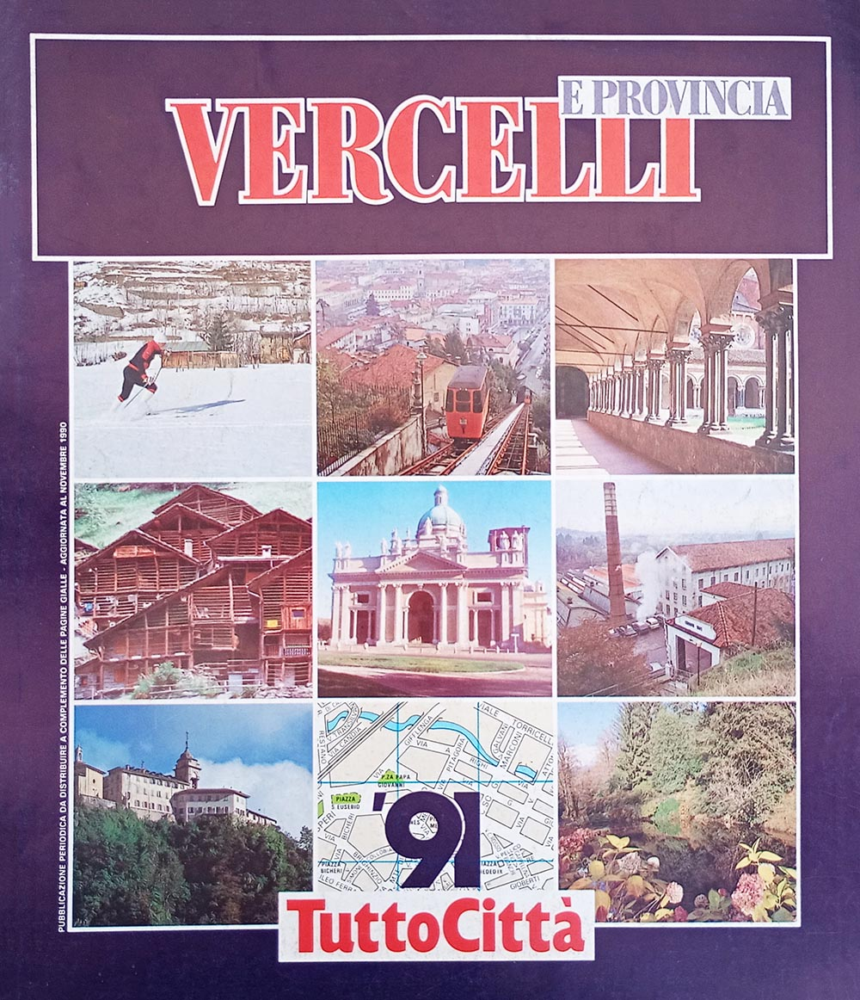</a>
Vercelli 91
<ul class="scheda"><li><b>Formato:</b> 246 x 280 mm</li><li><b>Copertina:</b> grossa</li><li><b>Layout:</b> TuttoCittà '90 classico iniziale</li><li><b>Pagine:</b> 24</li><li><b>Mese aggiornamento:</b> novembre 1990</li></ul></td></tr>
<tr><td class="ann">  91/92</td><td class="tav"></td><td class="fasc"><a href="../immagini/TO92.jpg">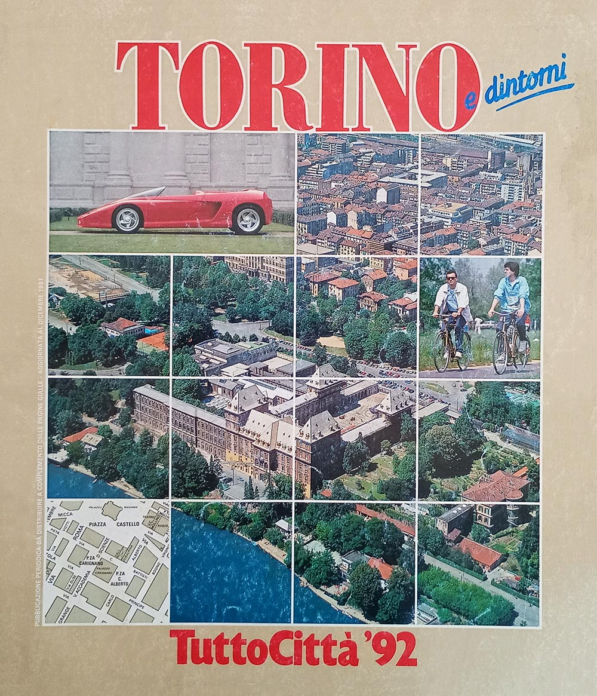</a>
Torino e dintorni 92
<ul class="scheda"><li><b>Formato:</b> 246 x 280 mm</li><li><b>Copertina:</b> grossa</li><li><b>Layout:</b> TuttoCittà '90 classico</li><li><b>Pagine:</b> 144</li><li><b>Mese aggiornamento:</b> dicembre 1991</li></ul></td><td class="fasc"><a href="../immagini/PROVTO92.jpg">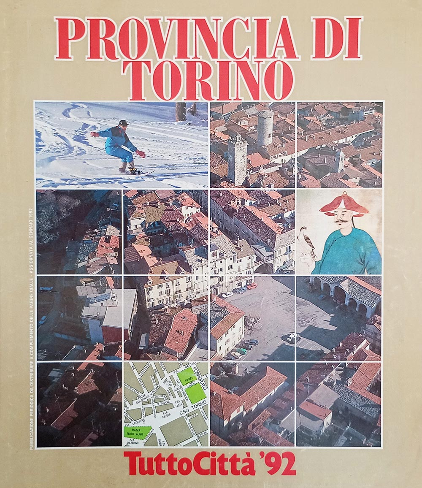</a>
Provincia di Torino 92
<ul class="scheda"><li><b>Formato:</b> 246 x 280 mm</li><li><b>Copertina:</b> grossa</li><li><b>Layout:</b> TuttoCittà '90 classico</li><li><b>Pagine:</b> 56</li><li><b>Mese aggiornamento:</b> gennaio 1992</li></ul></td><td class="fasc sospesa">
Alessandria 92
<ul class="scheda"><li><b>Formato:</b> 246 x 280 mm</li><li><b>Copertina:</b> grossa</li><li><b>Layout:</b> TuttoCittà '90 classico iniziale</li><li>non in raccolta</li></ul></td><td class="fasc sospesa">
Asti 92
<ul class="scheda"><li><b>Formato:</b> 246 x 280 mm</li><li><b>Copertina:</b> grossa</li><li><b>Layout:</b> TuttoCittà '90 classico iniziale</li><li>non in raccolta</li></ul></td><td class="fasc sospesa">
Cuneo 92
<ul class="scheda"><li><b>Formato:</b> 246 x 280 mm</li><li><b>Copertina:</b> grossa</li><li><b>Layout:</b> TuttoCittà '90 classico iniziale</li><li>non in raccolta</li></ul></td><td class="fasc"><a href="../immagini/NO92.jpg">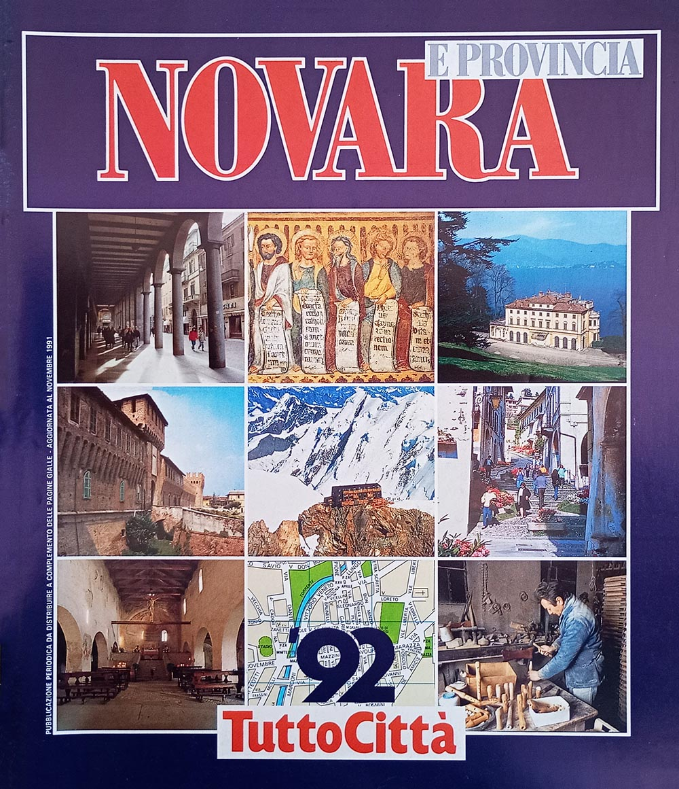</a>
Novara 92
<ul class="scheda"><li><b>Formato:</b> 246 x 280 mm</li><li><b>Copertina:</b> grossa</li><li><b>Layout:</b> TuttoCittà '90 classico iniziale</li><li><b>Pagine:</b> 40</li><li><b>Mese aggiornamento:</b> novembre 1991</li></ul></td><td class="fasc"><a href="../immagini/VC92.jpg">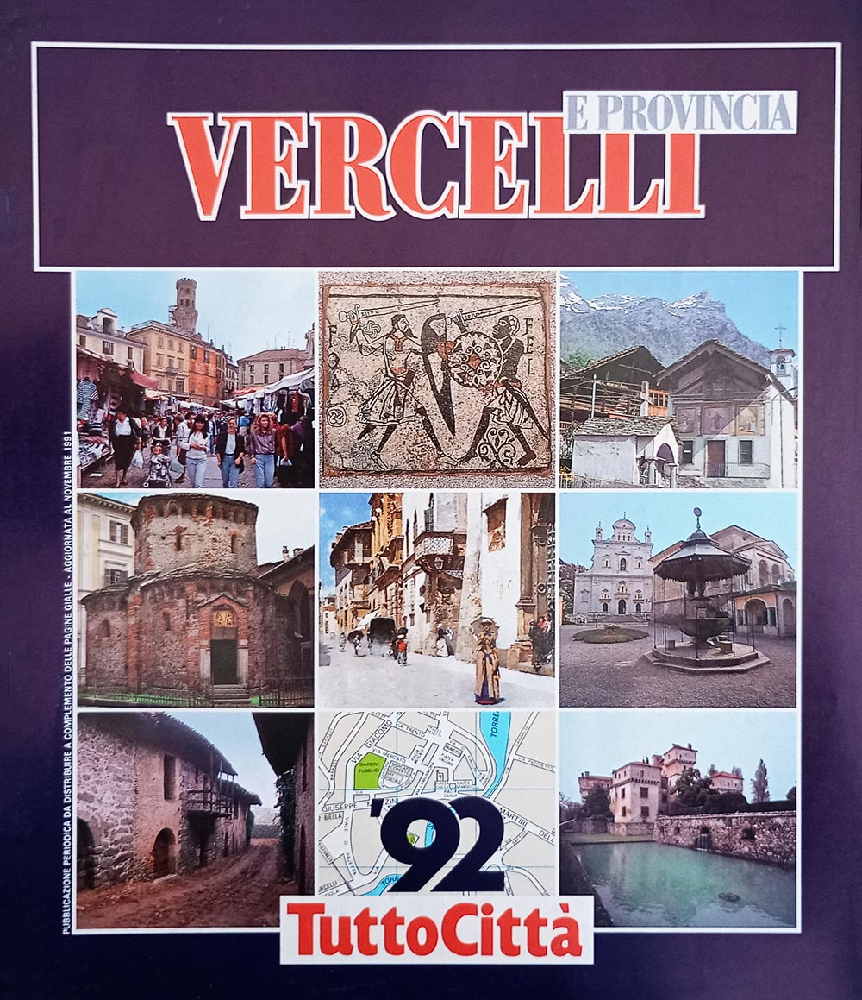</a>
Vercelli 92
<ul class="scheda"><li><b>Formato:</b> 246 x 280 mm</li><li><b>Copertina:</b> grossa</li><li><b>Layout:</b> TuttoCittà '90 classico iniziale</li><li><b>Pagine:</b> 24</li><li><b>Mese aggiornamento:</b> novembre 1991</li></ul></td></tr>
<tr><td class="ann"> 92/93</td><td class="tav"></td><td class="fasc"><a href="../immagini/TO93.jpg">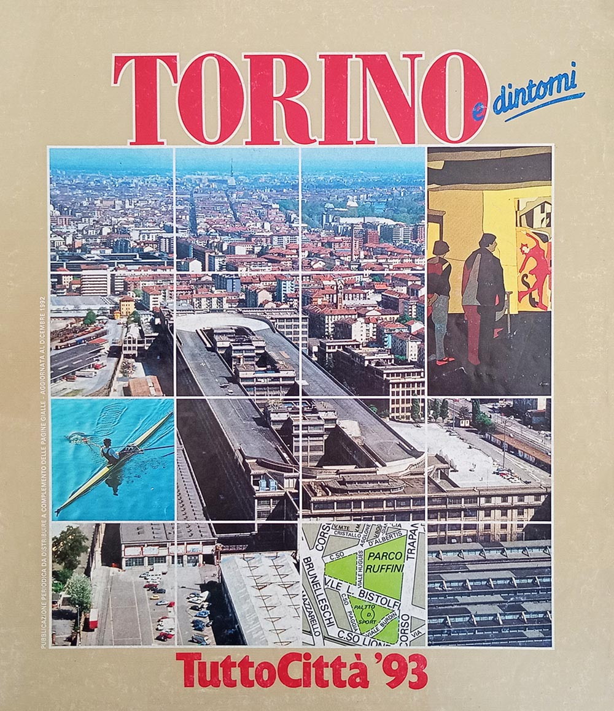</a>
Torino e dintorni 93
<ul class="scheda"><li><b>Formato:</b> 246 x 280 mm</li><li><b>Copertina:</b> grossa</li><li><b>Layout:</b> TuttoCittà '90 classico</li><li><b>Pagine:</b> 136</li><li><b>Mese aggiornamento:</b> dicembre 1992</li></ul></td><td class="fasc"><a href="../immagini/PROVTO93.jpg">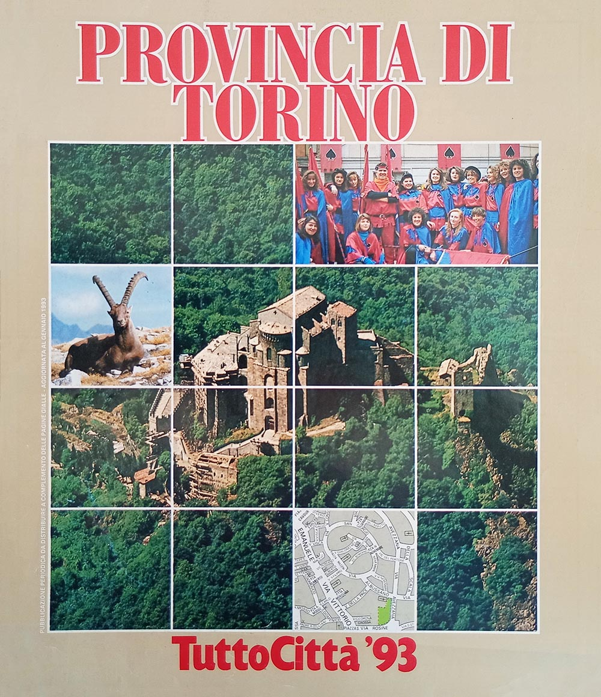</a>
Provincia di Torino 93
<ul class="scheda"><li><b>Formato:</b> 246 x 280 mm</li><li><b>Copertina:</b> grossa</li><li><b>Layout:</b> TuttoCittà '90 classico</li><li><b>Pagine:</b> 56</li><li><b>Mese aggiornamento:</b> gennaio 1993</li></ul></td><td class="fasc"><a href="../immagini/AL93.jpg">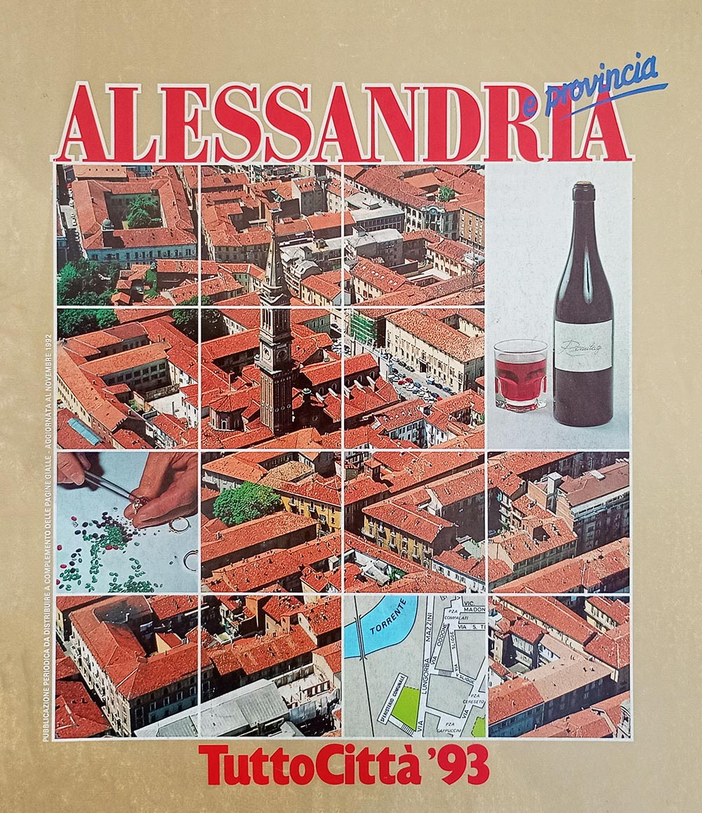</a>
Alessandria 93
<ul class="scheda"><li><b>Formato:</b> 246 x 280 mm</li><li><b>Copertina:</b> grossa</li><li><b>Layout:</b> TuttoCittà '90 classico</li><li><b>Pagine:</b> 32</li><li><b>Mese aggiornamento:</b> novembre 1992</li></ul></td><td class="fasc"><a href="../immagini/AT93.jpg">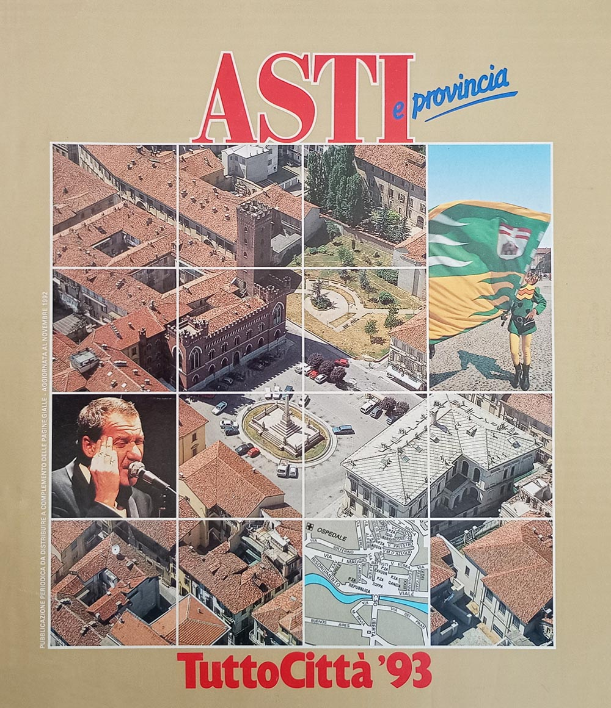</a>
Asti 93
<ul class="scheda"><li><b>Formato:</b> 246 x 280 mm</li><li><b>Copertina:</b> grossa</li><li><b>Layout:</b> TuttoCittà '90 classico</li><li><b>Pagine:</b> 24</li><li><b>Mese aggiornamento:</b> novembre 1992</li></ul></td><td class="fasc"><a href="../immagini/CN93.jpg">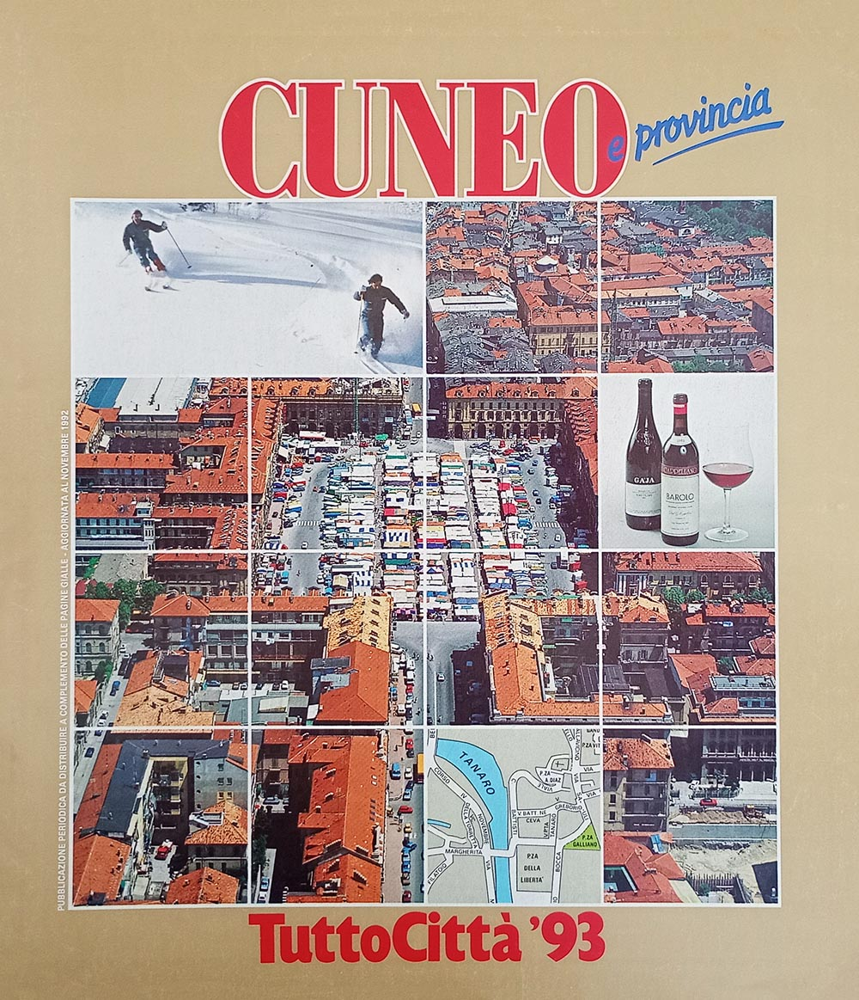</a>
Cuneo 93
<ul class="scheda"><li><b>Formato:</b> 246 x 280 mm</li><li><b>Copertina:</b> grossa</li><li><b>Layout:</b> TuttoCittà '90 classico</li><li><b>Pagine:</b> 40</li><li><b>Mese aggiornamento:</b> novembre 1992</li></ul></td><td class="fasc"><a href="../immagini/NO93.jpg">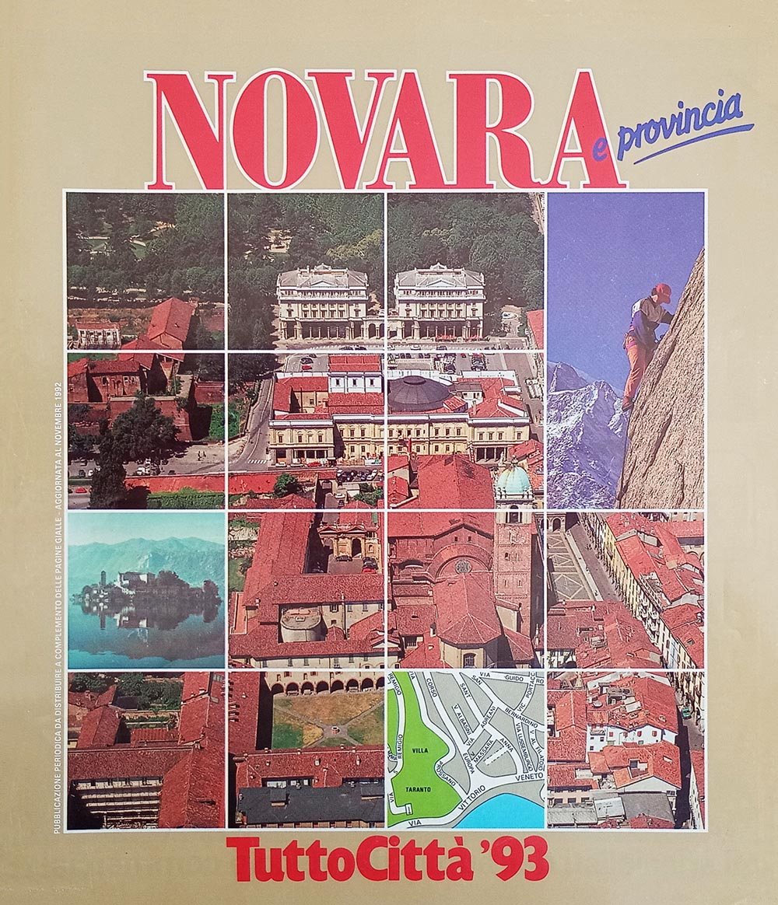</a>
Novara 93
<ul class="scheda"><li><b>Formato:</b> 246 x 280 mm</li><li><b>Copertina:</b> grossa</li><li><b>Layout:</b> TuttoCittà '90 classico</li><li><b>Pagine:</b> 40</li><li><b>Mese aggiornamento:</b> novembre 1992</li></ul></td><td class="fasc"><a href="../immagini/VC93.jpg">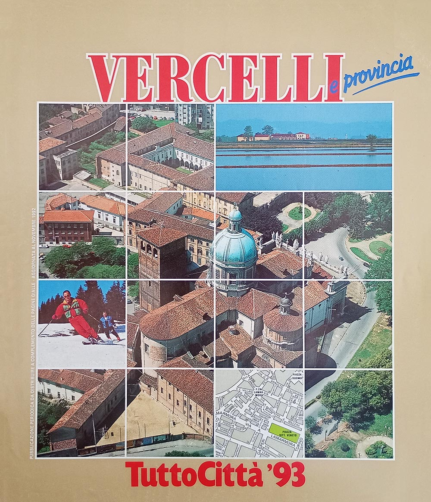</a>
Vercelli 93
<ul class="scheda"><li><b>Formato:</b> 246 x 280 mm</li><li><b>Copertina:</b> grossa</li><li><b>Layout:</b> TuttoCittà '90 classico</li><li><b>Pagine:</b> 24</li><li><b>Mese aggiornamento:</b> novembre 1992</li></ul></td></tr>
<tr><td class="ann"> 93/94</td><td class="tav"></td><td class="fasc"><a href="../immagini/TO94.jpg">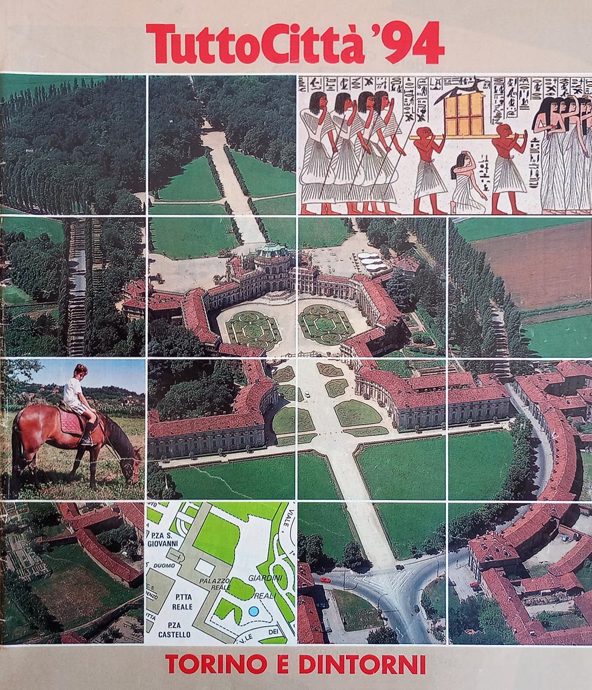</a>
Torino e dintorni 94
<ul class="scheda"><li><b>Formato:</b> 246 x 280 mm</li><li><b>Copertina:</b> sottile</li><li><b>Layout:</b> TuttoCittà '90 classico</li><li><b>Pagine:</b> 126</li><li><b>Mese aggiornamento:</b> gennaio 1994</li></ul></td><td class="fasc"><a href="../immagini/PROVTO94.jpg">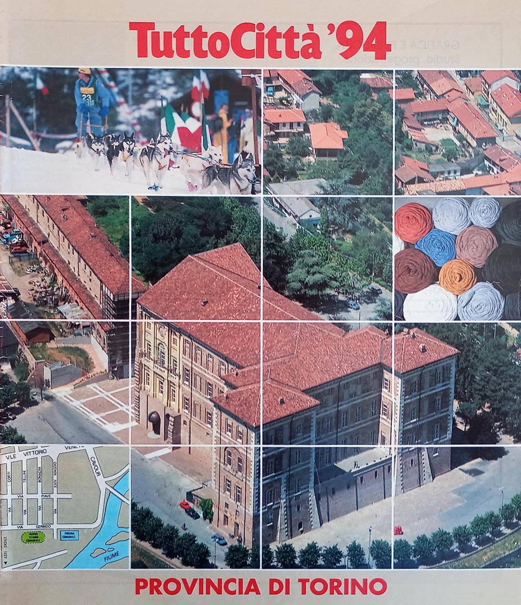</a>
Provincia di Torino 94
<ul class="scheda"><li><b>Formato:</b> 246 x 280 mm</li><li><b>Copertina:</b> sottile</li><li><b>Layout:</b> TuttoCittà '90 classico</li><li><b>Pagine:</b> 54</li><li><b>Mese aggiornamento:</b> dicembre 1993</li></ul></td><td class="fasc"><a href="../immagini/AL94.jpg">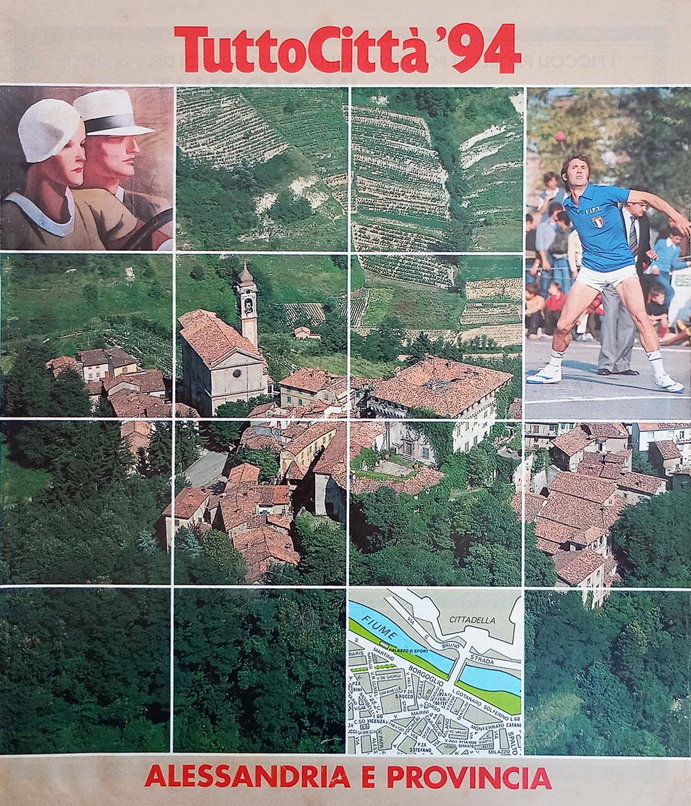</a>
Alessandria 94
<ul class="scheda"><li><b>Formato:</b> 246 x 280 mm</li><li><b>Copertina:</b> sottile</li><li><b>Layout:</b> TuttoCittà '90 classico</li><li><b>Pagine:</b> 38</li><li><b>Mese aggiornamento:</b> novembre 1993</li></ul></td><td class="fasc"><a href="../immagini/AT94.jpg">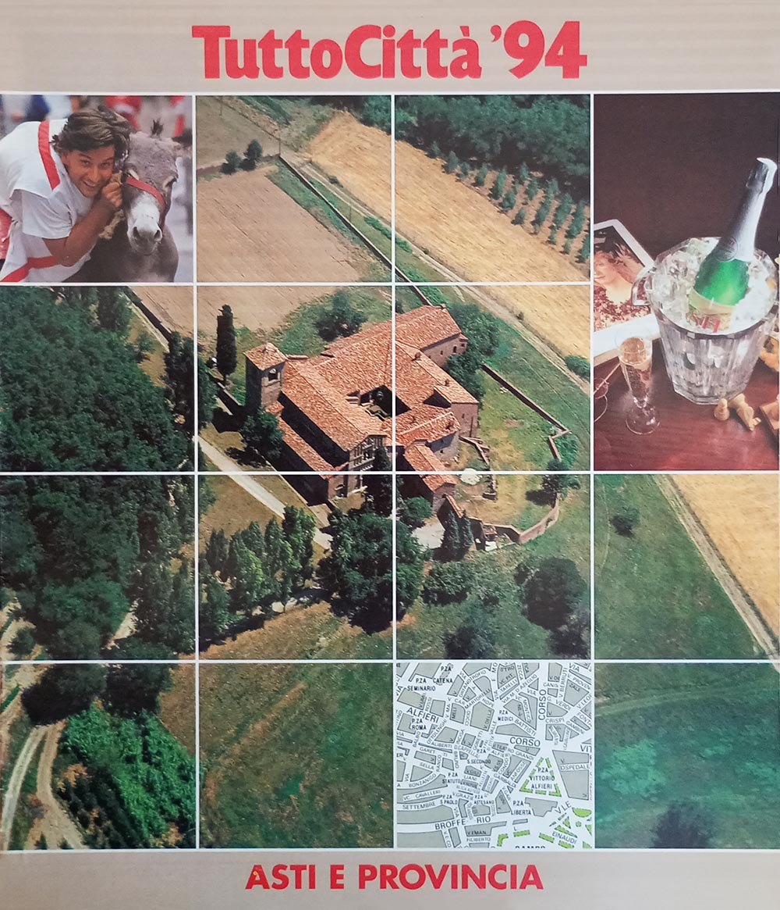</a>
Asti 94
<ul class="scheda"><li><b>Formato:</b> 246 x 280 mm</li><li><b>Copertina:</b> sottile</li><li><b>Layout:</b> TuttoCittà '90 classico</li><li><b>Pagine:</b> 22</li><li><b>Mese aggiornamento:</b> novembre 1993</li></ul></td><td class="fasc"><a href="../immagini/CN94.jpg">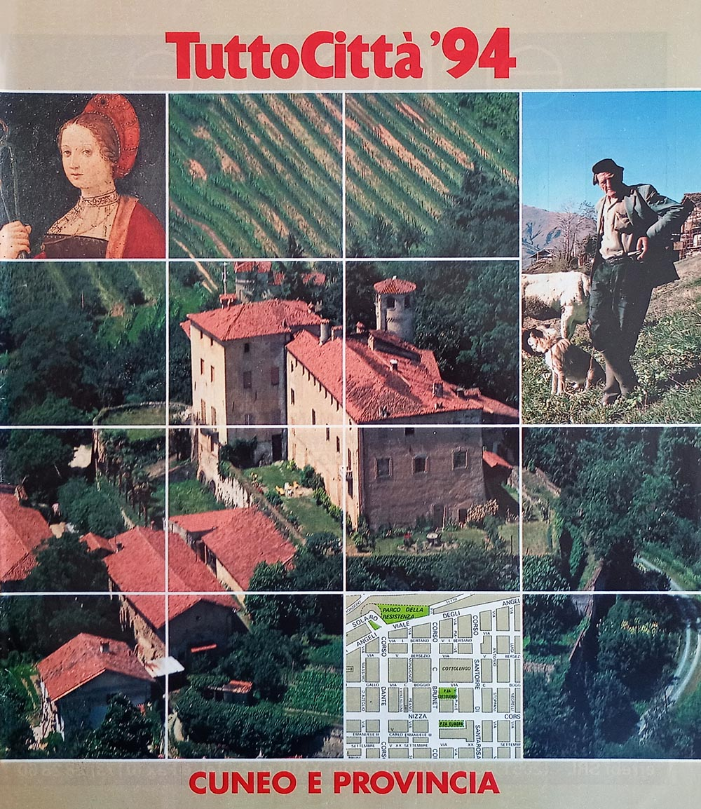</a>
Cuneo 94
<ul class="scheda"><li><b>Formato:</b> 246 x 280 mm</li><li><b>Copertina:</b> sottile</li><li><b>Layout:</b> TuttoCittà '90 classico</li><li><b>Pagine:</b> 46</li><li><b>Mese aggiornamento:</b> novembre 1993</li></ul></td><td class="fasc"><a href="../immagini/NO94.jpg">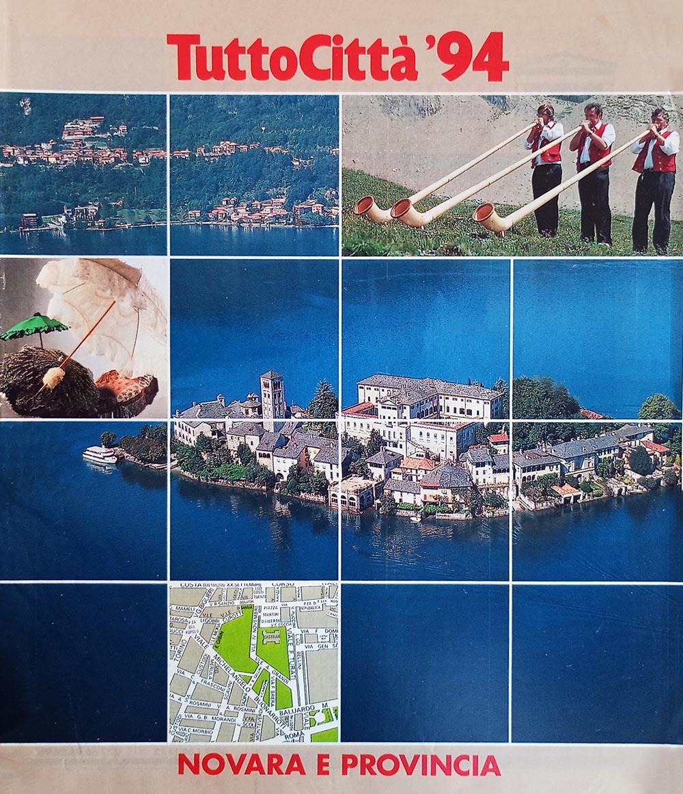</a>
Novara 94
<ul class="scheda"><li><b>Formato:</b> 246 x 280 mm</li><li><b>Copertina:</b> sottile</li><li><b>Layout:</b> TuttoCittà '90 classico</li><li><b>Pagine:</b> 46</li><li><b>Mese aggiornamento:</b> novembre 1993</li></ul></td><td class="fasc"><a href="../immagini/VC94.jpg">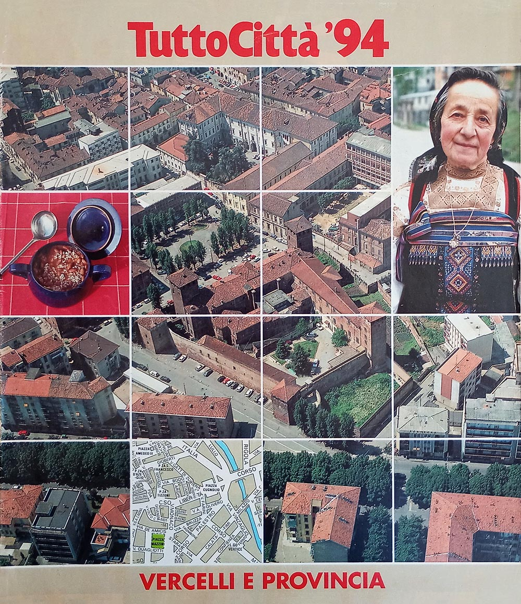</a>
Vercelli 94
<ul class="scheda"><li><b>Formato:</b> 246 x 280 mm</li><li><b>Copertina:</b> sottile</li><li><b>Layout:</b> TuttoCittà '90 classico</li><li><b>Pagine:</b> 30</li><li><b>Mese aggiornamento:</b> novembre 1993</li></ul></td></tr>
<tr><td class="ann"> 94/95</td><td class="tav"></td><td class="fasc"><a href="../immagini/TO95.jpg">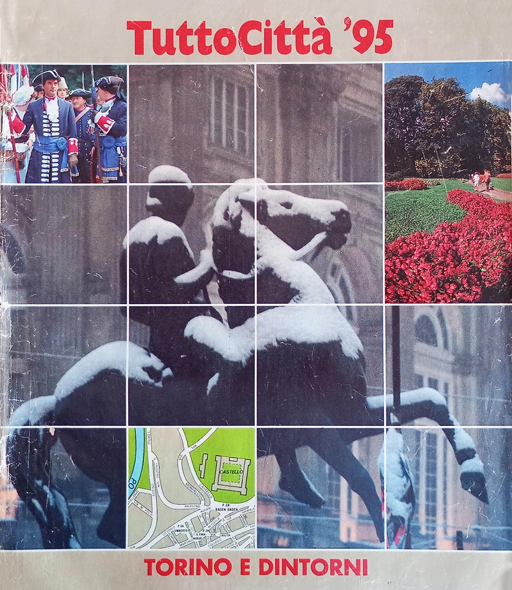</a>
Torino e dintorni 95
<ul class="scheda"><li><b>Formato:</b> 246 x 280 mm</li><li><b>Copertina:</b> sottile</li><li><b>Layout:</b> TuttoCittà '90 classico</li><li><b>Pagine:</b> 142</li><li><b>Mese aggiornamento:</b> gennaio 1995</li></ul></td><td class="fasc"><a href="../immagini/PROVTO95.jpg">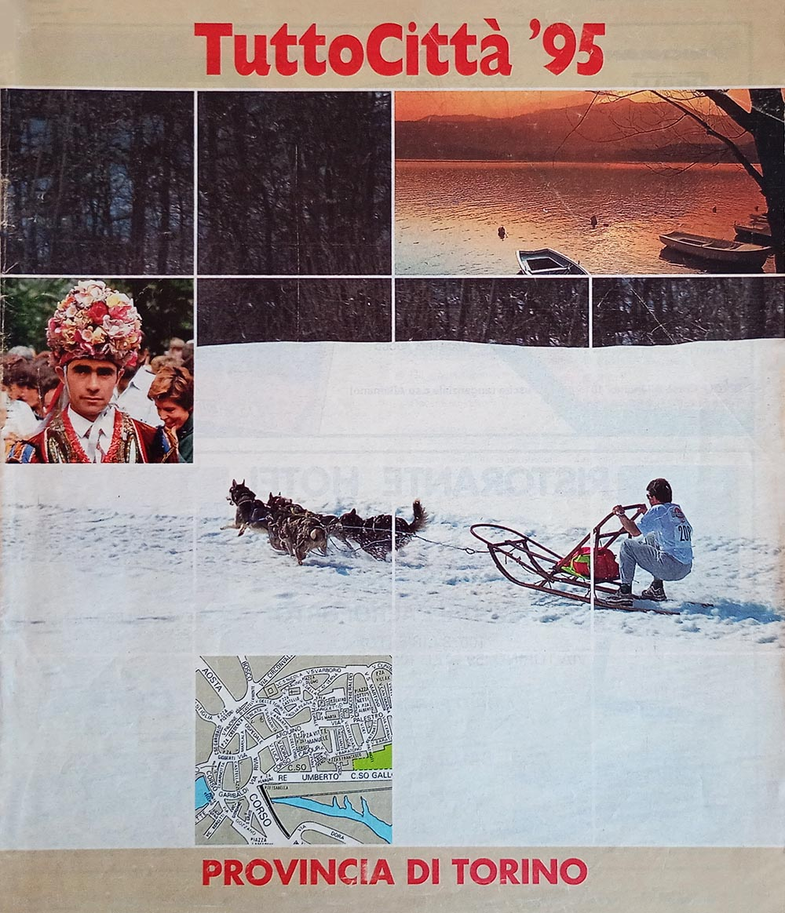</a>
Provincia di Torino 95
<ul class="scheda"><li><b>Formato:</b> 246 x 280 mm</li><li><b>Copertina:</b> sottile</li><li><b>Layout:</b> TuttoCittà '90 classico</li><li><b>Pagine:</b> 54</li><li><b>Mese aggiornamento:</b> gennaio 1995</li></ul></td><td class="fasc"><a href="../immagini/AL95.jpg">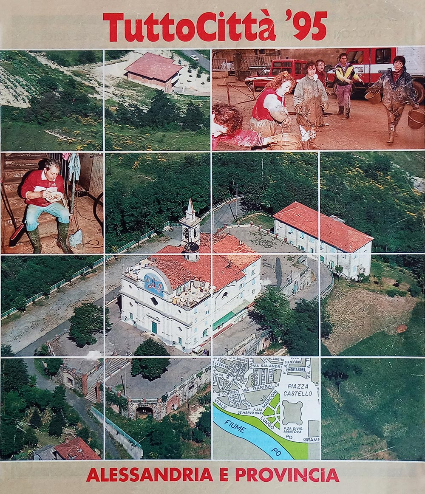</a>
Alessandria 95
<ul class="scheda"><li><b>Formato:</b> 246 x 280 mm</li><li><b>Copertina:</b> sottile</li><li><b>Layout:</b> TuttoCittà '90 classico</li><li><b>Pagine:</b> 38</li><li><b>Mese aggiornamento:</b> novembre 1994</li></ul></td><td class="fasc"><a href="../immagini/AT95.jpg">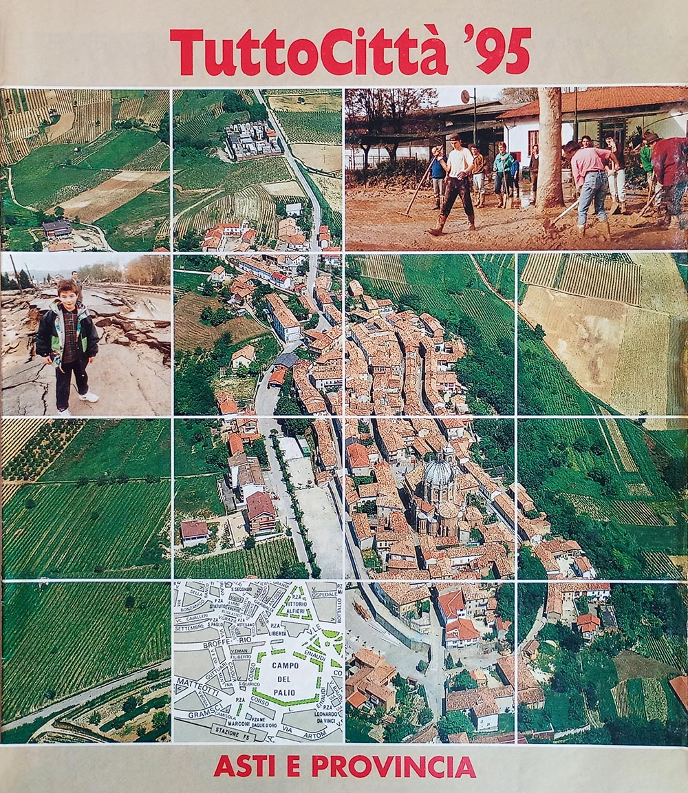</a>
Asti 95
<ul class="scheda"><li><b>Formato:</b> 246 x 280 mm</li><li><b>Copertina:</b> sottile</li><li><b>Layout:</b> TuttoCittà '90 classico</li><li><b>Pagine:</b> 22</li><li><b>Mese aggiornamento:</b> novembre 1994</li></ul></td><td class="fasc"><a href="../immagini/CN95.jpg">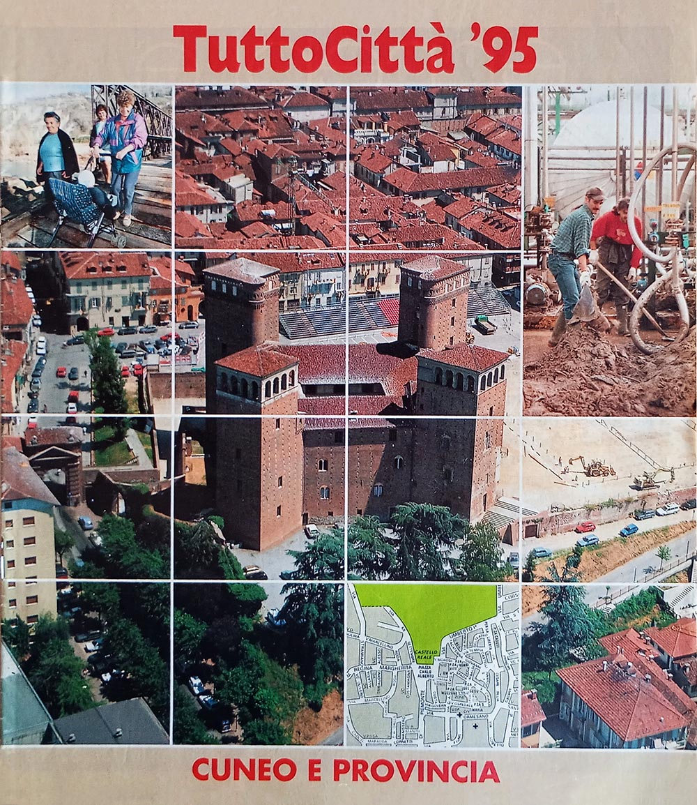</a>
Cuneo 95
<ul class="scheda"><li><b>Formato:</b> 246 x 280 mm</li><li><b>Copertina:</b> sottile</li><li><b>Layout:</b> TuttoCittà '90 classico</li><li><b>Pagine:</b> 46</li><li><b>Mese aggiornamento:</b> novembre 1994</li></ul></td><td class="fasc"><a href="../immagini/NO95.jpg">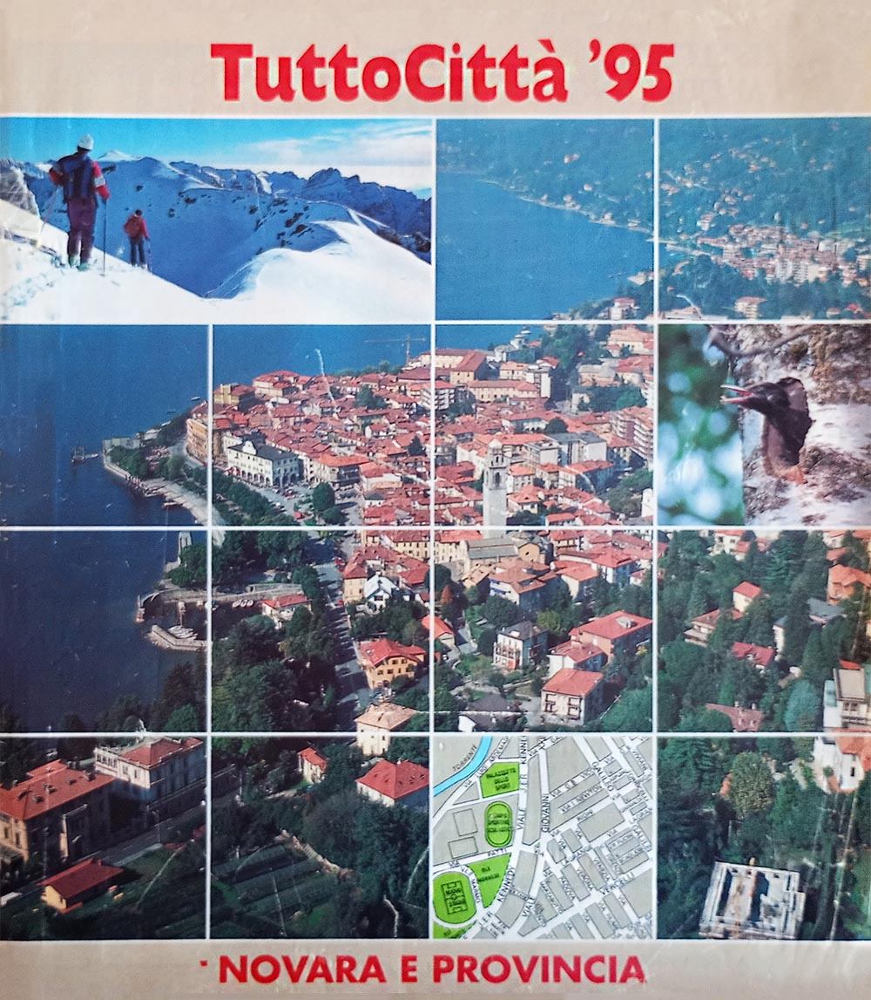</a>
Novara 95
<ul class="scheda"><li><b>Formato:</b> 246 x 280 mm</li><li><b>Copertina:</b> sottile</li><li><b>Layout:</b> TuttoCittà '90 classico</li><li><b>Pagine:</b> 46</li><li><b>Mese aggiornamento:</b> novembre 1994</li></ul></td><td class="fasc"><a href="../immagini/VC95.jpg">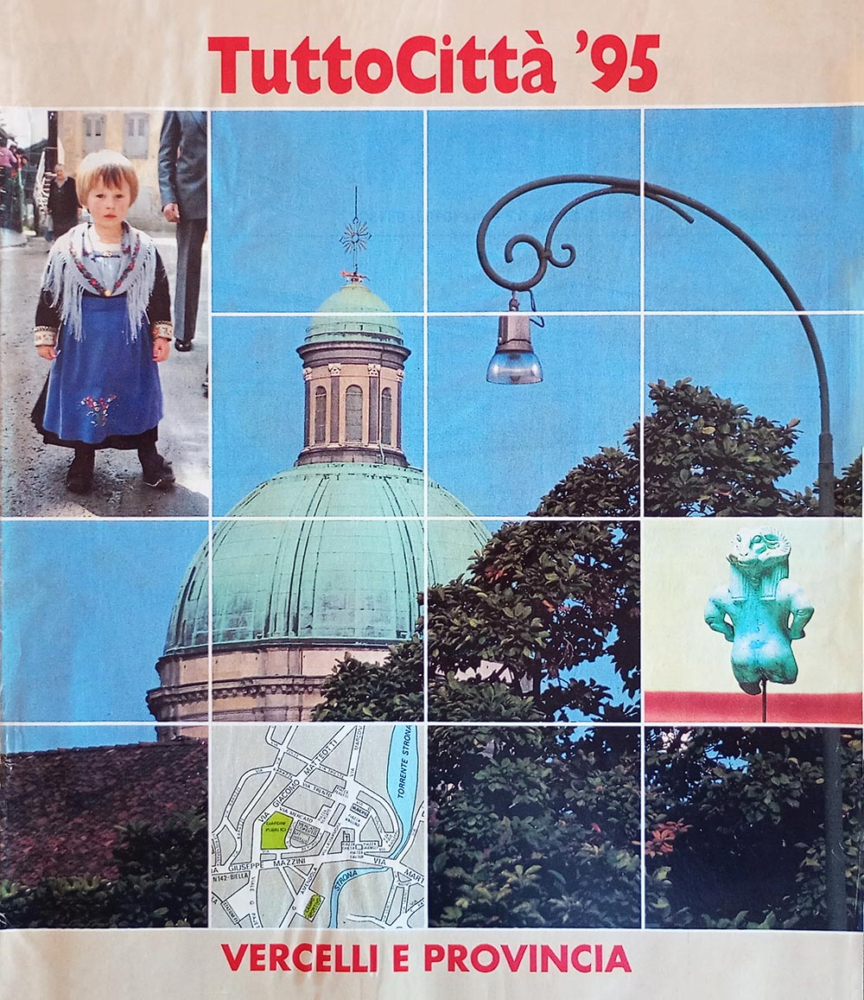</a>
Vercelli 95
<ul class="scheda"><li><b>Formato:</b> 246 x 280 mm</li><li><b>Copertina:</b> sottile</li><li><b>Layout:</b> TuttoCittà '90 classico</li><li><b>Pagine:</b> 30</li><li><b>Mese aggiornamento:</b> novembre 1994</li></ul></td></tr>
<tr><td class="ann"> 95/96</td><td class="tav"></td><td class="fasc"><a href="../immagini/TO96.jpg">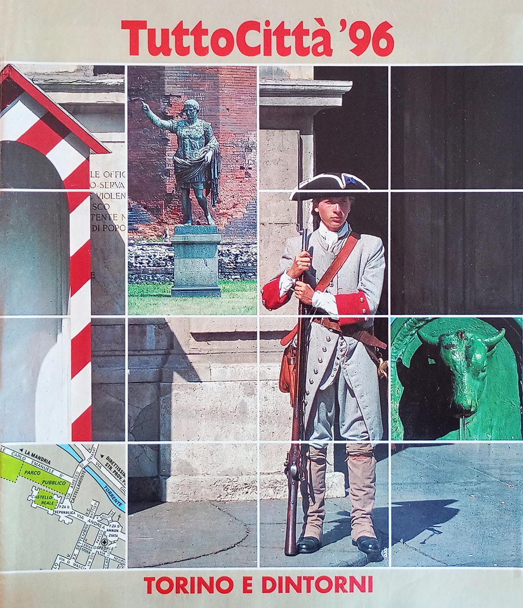</a>
Torino e dintorni 96
<ul class="scheda"><li><b>Formato:</b> 246 x 280 mm</li><li><b>Copertina:</b> sottile</li><li><b>Layout:</b> TuttoCittà '90 classico</li><li><b>Pagine:</b> 134</li><li><b>Mese aggiornamento:</b> gennaio 1996</li></ul></td><td class="fasc"><a href="../immagini/PROVTO96.jpg">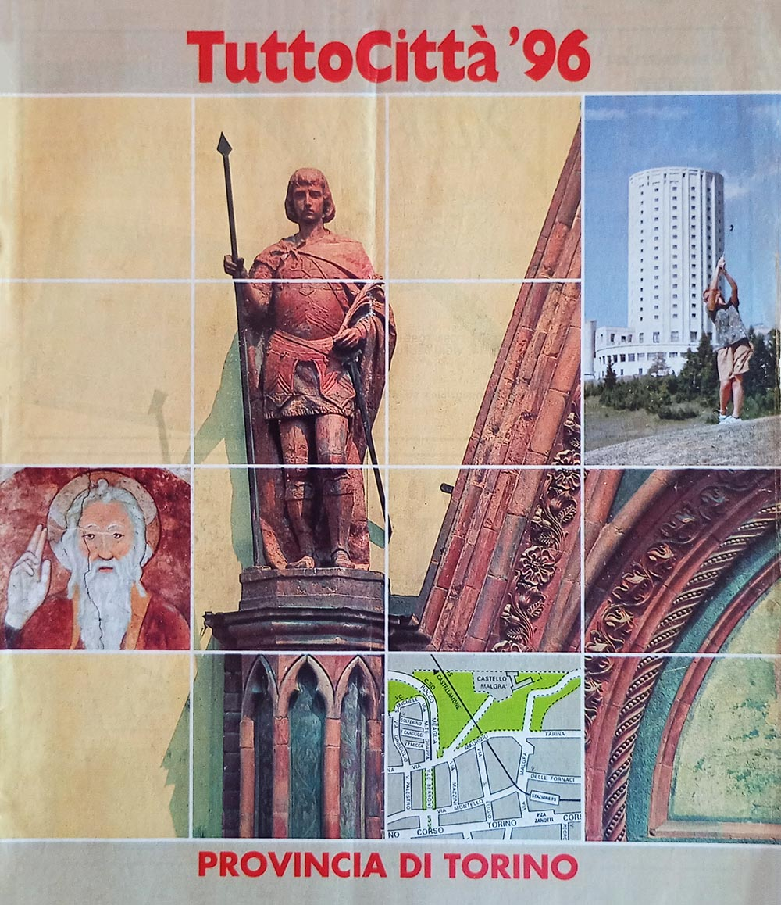</a>
Provincia di Torino 96
<ul class="scheda"><li><b>Formato:</b> 246 x 280 mm</li><li><b>Copertina:</b> sottile</li><li><b>Layout:</b> TuttoCittà '90 classico</li><li><b>Pagine:</b> 62</li><li><b>Mese aggiornamento:</b> gennaio 1996</li></ul></td><td class="fasc sospesa">
Alessandria 96
<ul class="scheda"><li><b>Formato:</b> 246 x 280 mm</li><li><b>Copertina:</b> sottile</li><li><b>Layout:</b> TuttoCittà '90 classico</li><li>non in raccolta</li></ul></td><td class="fasc sospesa">
Asti 96
<ul class="scheda"><li><b>Formato:</b> 246 x 280 mm</li><li><b>Copertina:</b> sottile</li><li><b>Layout:</b> TuttoCittà '90 classico</li><li>non in raccolta</li></ul></td><td class="fasc sospesa">
Cuneo 96
<ul class="scheda"><li><b>Formato:</b> 246 x 280 mm</li><li><b>Copertina:</b> sottile</li><li><b>Layout:</b> TuttoCittà '90 classico</li><li>non in raccolta</li></ul></td><td class="fasc"><a href="../immagini/NO96.jpg">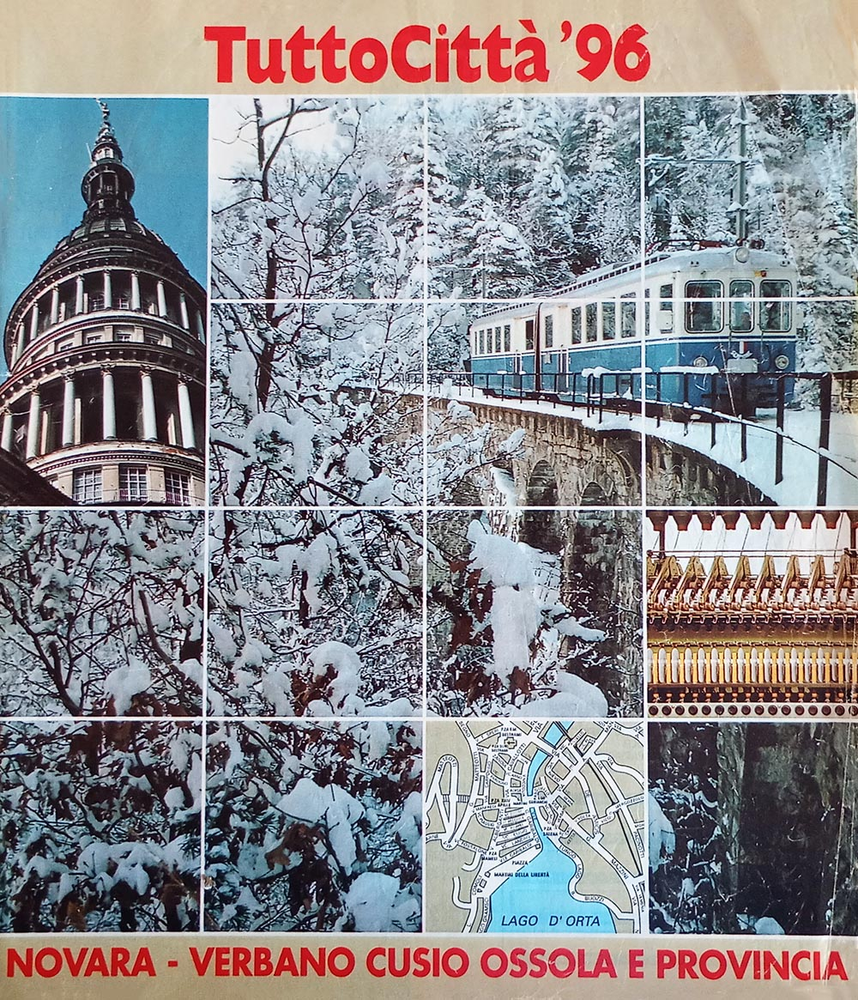</a>
Novara - Verbano Cusio Ossola 96
<ul class="scheda"><li><b>Formato:</b> 246 x 280 mm</li><li><b>Copertina:</b> sottile</li><li><b>Layout:</b> TuttoCittà '90 classico</li><li><b>Pagine:</b> 46</li><li><b>Mese aggiornamento:</b> novembre 1995</li></ul></td><td class="fasc sospesa">
Biella - Vercelli 96
<ul class="scheda"><li><b>Formato:</b> 246 x 280 mm</li><li><b>Copertina:</b> sottile</li><li><b>Layout:</b> TuttoCittà '90 classico</li><li>non in raccolta</li></ul></td></tr>
<tr><td class="ann"> 96/97</td><td class="tav"></td><td class="fasc"><a href="../immagini/TO97.jpg">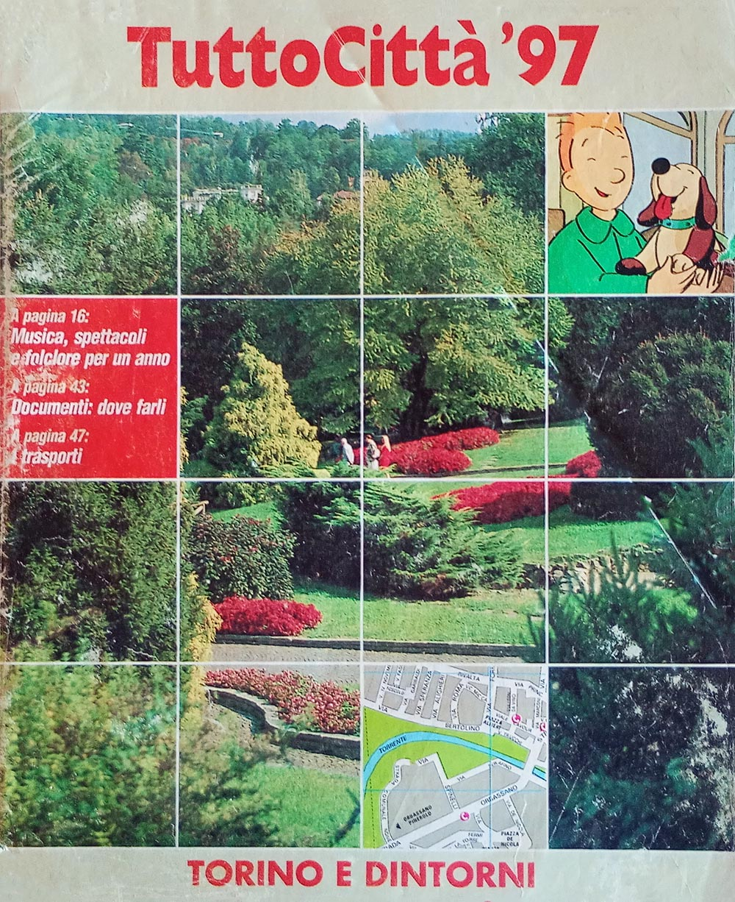</a>
Torino e dintorni 97
<ul class="scheda"><li><b>Formato:</b> 226 x 274 mm</li><li><b>Copertina:</b> sottile</li><li><b>Layout:</b> TuttoCittà '90 classico</li><li><b>Pagine:</b> 126</li><li><b>Mese aggiornamento:</b> gennaio 1997</li><li><b>Note:</b> cambio formato</li></ul></td><td class="fasc"><a href="../immagini/PROVTO97.jpg">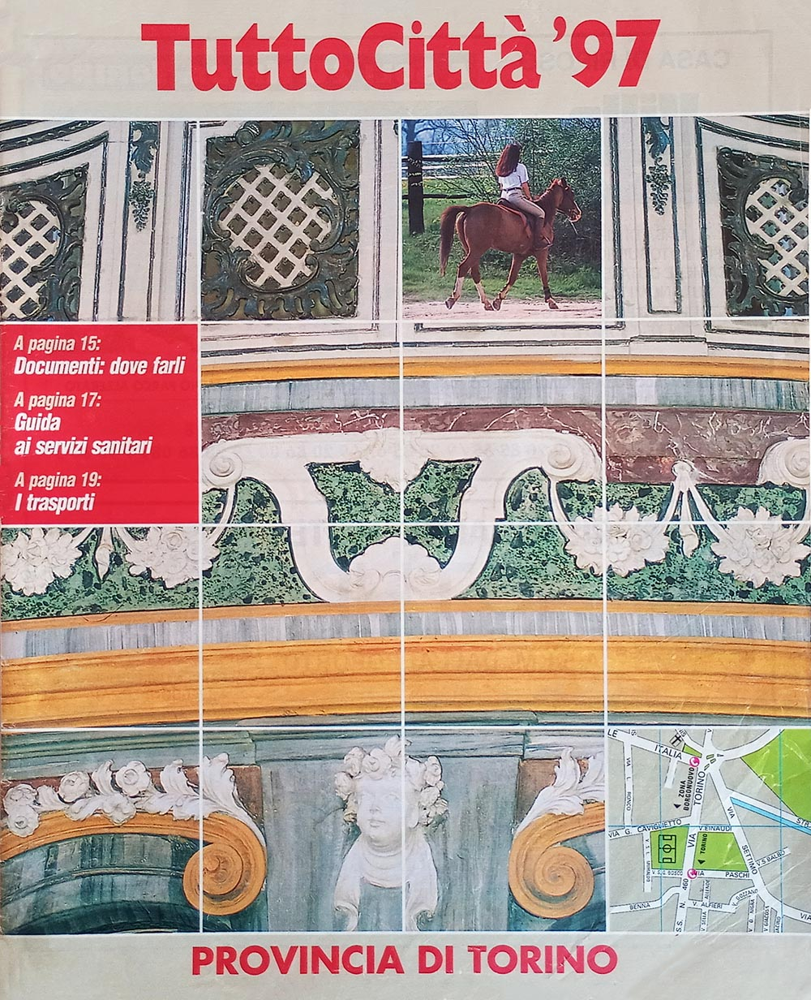</a>
Provincia di Torino 97
<ul class="scheda"><li><b>Formato:</b> 226 x 274 mm</li><li><b>Copertina:</b> sottile</li><li><b>Layout:</b> TuttoCittà '90 classico</li><li><b>Pagine:</b> 54</li><li><b>Mese aggiornamento:</b> gennaio 1997</li><li><b>Note:</b> cambio formato</li></ul></td><td class="fasc"><a href="../immagini/AL97.jpg">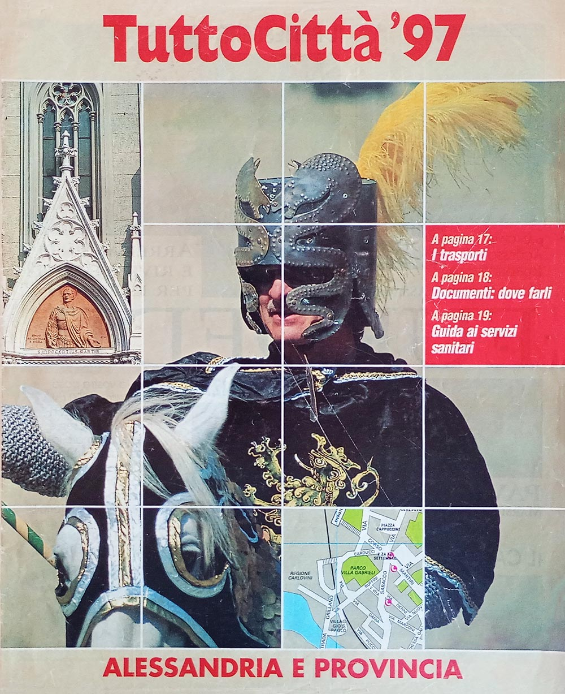</a>
Alessandria 97
<ul class="scheda"><li><b>Formato:</b> 226 x 274 mm</li><li><b>Copertina:</b> sottile</li><li><b>Layout:</b> TuttoCittà '90 classico</li><li><b>Pagine:</b> 38</li><li><b>Mese aggiornamento:</b> novembre 1996</li><li><b>Note:</b> cambio formato</li></ul></td><td class="fasc"><a href="../immagini/AT97.jpg">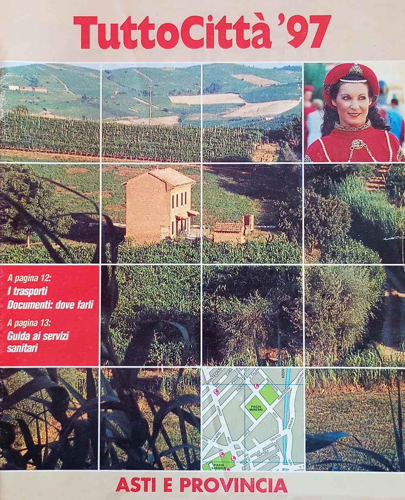</a>
Asti 97
<ul class="scheda"><li><b>Formato:</b> 226 x 274 mm</li><li><b>Copertina:</b> sottile</li><li><b>Layout:</b> TuttoCittà '90 classico</li><li><b>Pagine:</b> 22</li><li><b>Mese aggiornamento:</b> novembre 1996</li><li><b>Note:</b> cambio formato</li></ul></td><td class="fasc sospesa">
Cuneo 97
<ul class="scheda"><li><b>Formato:</b> 226 x 274 mm</li><li><b>Copertina:</b> sottile</li><li><b>Layout:</b> TuttoCittà '90 classico</li><li><b>Note:</b> cambio formato</li><li>non in raccolta</li></ul></td><td class="fasc"><a href="../immagini/NO97.jpg">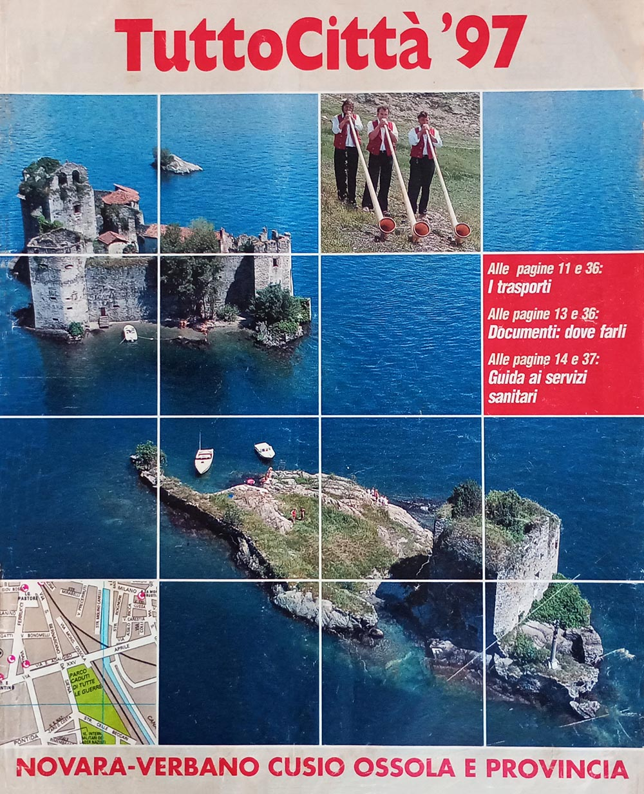</a>
Novara - Verbano Cusio Ossola 97
<ul class="scheda"><li><b>Formato:</b> 226 x 274 mm</li><li><b>Copertina:</b> sottile</li><li><b>Layout:</b> TuttoCittà '90 classico</li><li><b>Pagine:</b> 46</li><li><b>Mese aggiornamento:</b> novembre 1996</li><li><b>Note:</b> cambio formato</li></ul></td><td class="fasc"><a href="../immagini/VC97.jpg">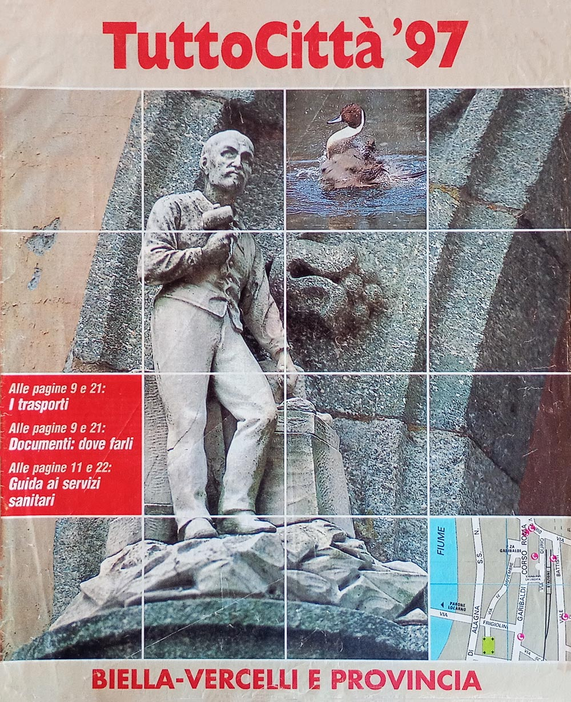</a>
Biella - Vercelli 97
<ul class="scheda"><li><b>Formato:</b> 226 x 274 mm</li><li><b>Copertina:</b> sottile</li><li><b>Layout:</b> TuttoCittà '90 classico</li><li><b>Pagine:</b> 30</li><li><b>Mese aggiornamento:</b> novembre 1996</li><li><b>Note:</b> cambio formato</li></ul></td></tr>
<tr><td class="ann"> 97/98</td><td class="tav"></td><td class="fasc"><a href="../immagini/TO97b.jpg">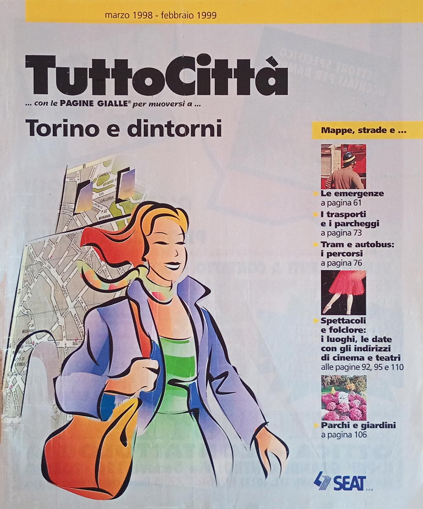</a>
Torino e dintorni (98)
<ul class="scheda"><li><b>Formato:</b> 226 x 274 mm</li><li><b>Copertina:</b> sottile</li><li><b>Layout:</b> TuttoCittà '90 riformato</li><li><b>Pagine:</b> 126</li><li><b>Mese aggiornamento:</b> gennaio 1998</li><li><b>Note:</b> "marzo 1998 - febbraio 1999"</li></ul></td><td class="fasc"><a href="../immagini/PROVTO97b.jpg">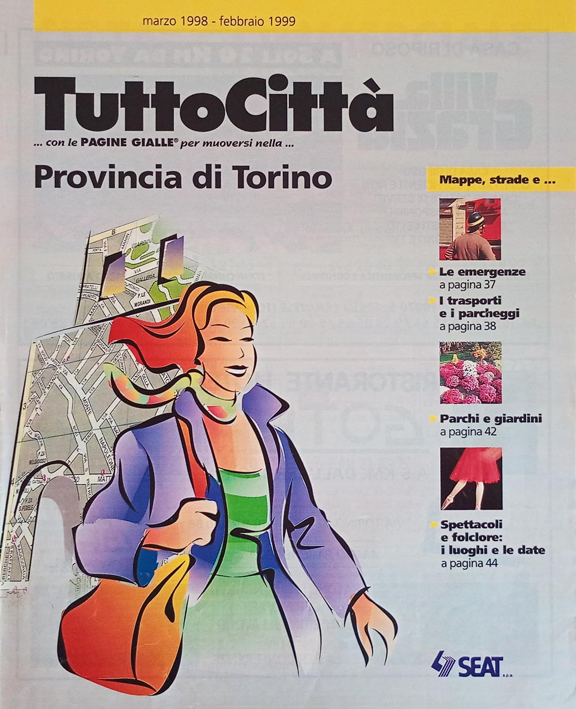</a>
Provincia di Torino (98)
<ul class="scheda"><li><b>Formato:</b> 226 x 274 mm</li><li><b>Copertina:</b> sottile</li><li><b>Layout:</b> TuttoCittà '90 riformato</li><li><b>Pagine:</b> 54</li><li><b>Mese aggiornamento:</b> gennaio 1998</li><li><b>Note:</b> "marzo 1998 - febbraio 1999"</li></ul></td><td class="fasc"><a href="../immagini/AL97b.jpg">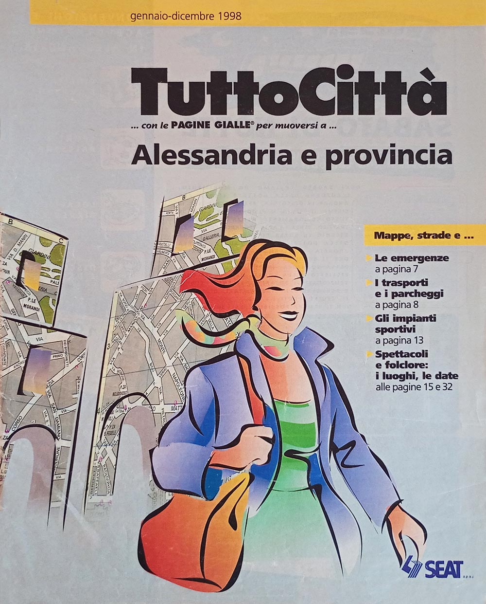</a>
Alessandria (98)
<ul class="scheda"><li><b>Formato:</b> 226 x 274 mm</li><li><b>Copertina:</b> sottile</li><li><b>Layout:</b> TuttoCittà '90 riformato</li><li><b>Pagine:</b> 38</li><li><b>Mese aggiornamento:</b> novembre 1997</li><li><b>Note:</b> "gennaio - dicembre 1998"</li></ul></td><td class="fasc sospesa">
Asti (98)
<ul class="scheda"><li><b>Formato:</b> 226 x 274 mm</li><li><b>Copertina:</b> sottile</li><li><b>Layout:</b> TuttoCittà '90 riformato</li><li>non in raccolta</li></ul></td><td class="fasc"><a href="../immagini/CN97b.jpg">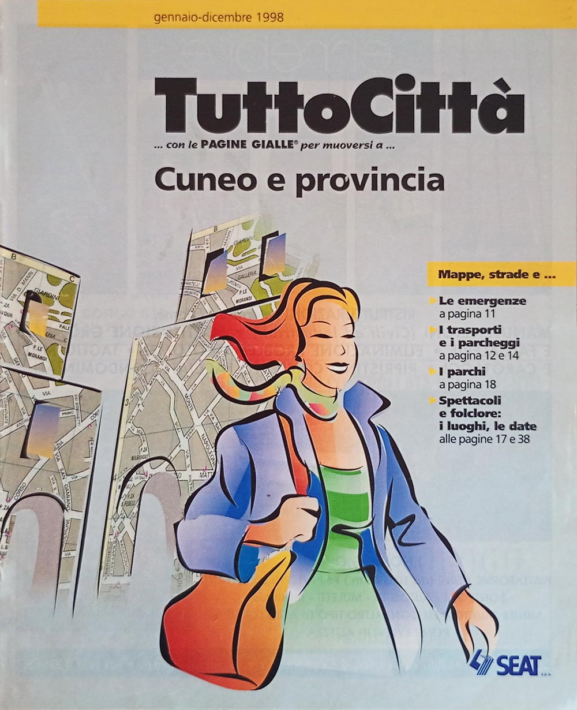</a>
Cuneo (98)
<ul class="scheda"><li><b>Formato:</b> 226 x 274 mm</li><li><b>Copertina:</b> sottile</li><li><b>Layout:</b> TuttoCittà '90 riformato</li><li><b>Pagine:</b> 46</li><li><b>Mese aggiornamento:</b> novembre 1997</li><li><b>Note:</b> "gennaio - dicembre 1998"</li></ul></td><td class="fasc"><a href="../immagini/NO97b.jpg">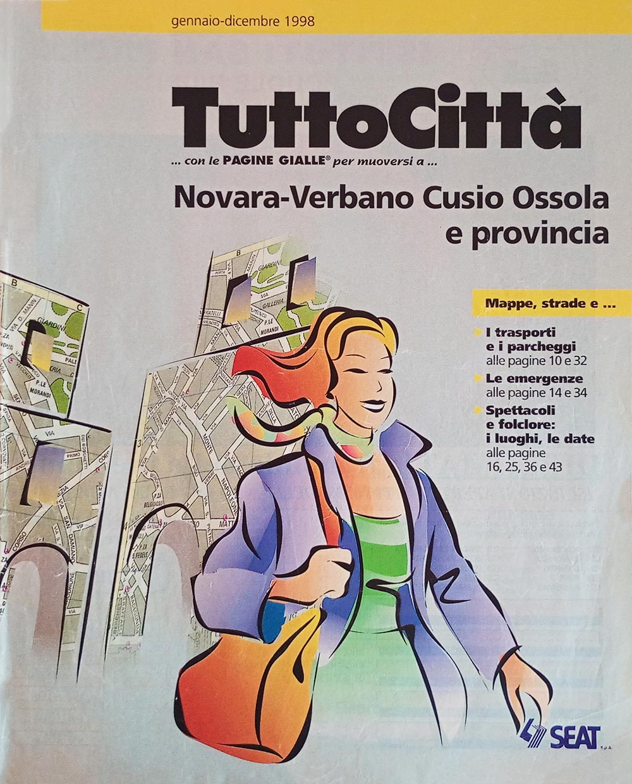</a>
Novara - Verbano Cusio Ossola (98)
<ul class="scheda"><li><b>Formato:</b> 226 x 274 mm</li><li><b>Copertina:</b> sottile</li><li><b>Layout:</b> TuttoCittà '90 riformato</li><li><b>Pagine:</b> 46</li><li><b>Mese aggiornamento:</b> novembre 1997</li><li><b>Note:</b> "gennaio - dicembre 1998"</li></ul></td><td class="fasc"><a href="../immagini/VC97b.jpg">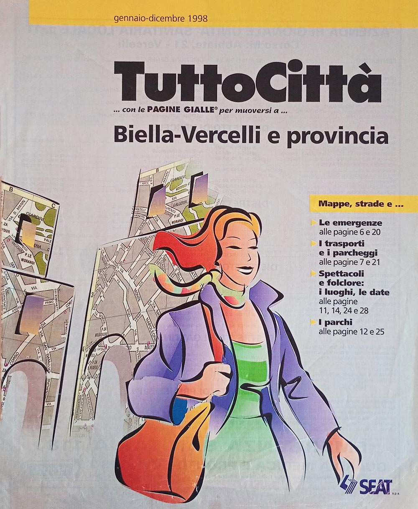</a>
Biella - Vercelli (98)
<ul class="scheda"><li><b>Formato:</b> 226 x 274 mm</li><li><b>Copertina:</b> sottile</li><li><b>Layout:</b> TuttoCittà '90 riformato</li><li><b>Pagine:</b> 30</li><li><b>Mese aggiornamento:</b> novembre 1997</li><li><b>Note:</b> "gennaio - dicembre 1998"</li></ul></td></tr>
<tr><td class="ann">  98/99</td><td class="tav"></td><td class="fasc"><a href="../immagini/TO99.jpg">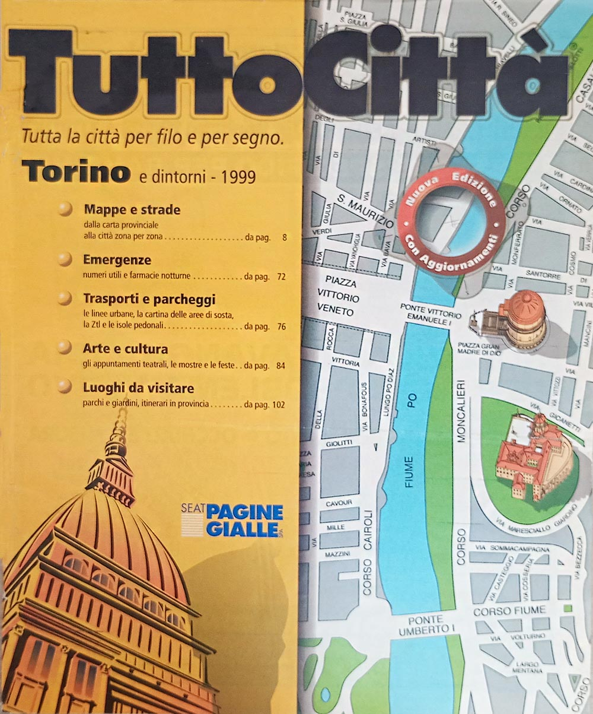</a>
Torino e dintorni 1999
<ul class="scheda"><li><b>Formato:</b> 226 x 274 mm</li><li><b>Copertina:</b> sottile</li><li><b>Layout:</b> TuttoCittà nuovo millennio</li><li><b>Pagine:</b> 126</li><li><b>Mese aggiornamento:</b> gennaio 1999</li></ul></td><td class="fasc dubbia">
Provincia di Torino 1999
<ul class="scheda"><li>esistenza dubbia</li></ul></td><td class="fasc sospesa">
Alessandria (99)
<ul class="scheda"><li><b>Formato:</b> 226 x 274 mm</li><li><b>Copertina:</b> sottile</li><li><b>Layout:</b> TuttoCittà '90 riformato</li><li>non in raccolta</li></ul></td><td class="fasc dubbia">
Asti (99)
<ul class="scheda"><li>esistenza dubbia</li></ul></td><td class="fasc dubbia">
Cuneo (99)
<ul class="scheda"><li>esistenza dubbia</li></ul></td><td class="fasc"><a href="../immagini/NO98.jpg">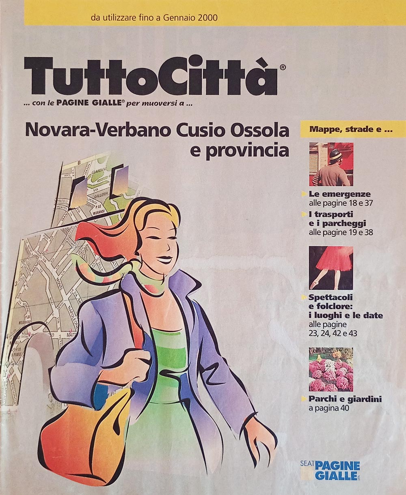</a>
Novara - Verbano Cusio Ossola (99)
<ul class="scheda"><li><b>Formato:</b> 226 x 274 mm</li><li><b>Copertina:</b> sottile</li><li><b>Layout:</b> TuttoCittà '90 riformato</li><li><b>Pagine:</b> 46</li><li><b>Mese aggiornamento:</b> novembre 1998</li><li><b>Note:</b> "da utilizzare fino a Gennaio 2000"</li></ul></td><td class="fasc sospesa">
Biella - Vercelli (99)
<ul class="scheda"><li><b>Formato:</b> 226 x 274 mm</li><li><b>Copertina:</b> sottile</li><li><b>Layout:</b> TuttoCittà '90 riformato</li><li>non in raccolta</li></ul></td></tr>
<tr><td class="ann"> 99/00</td><td class="tav"></td><td class="fasc sospesa">
Torino e dintorni 2000
<ul class="scheda"><li><b>Formato:</b> 226 x 274 mm</li><li><b>Copertina:</b> sottile</li><li><b>Layout:</b> TuttoCittà nuovo millennio</li><li>non in raccolta</li></ul></td><td class="fasc dubbia">
Provincia di Torino 2000
<ul class="scheda"><li>esistenza dubbia</li></ul></td><td class="fasc sospesa">
Alessandria 2000
<ul class="scheda"><li><b>Formato:</b> 226 x 274 mm</li><li><b>Copertina:</b> sottile</li><li><b>Layout:</b> TuttoCittà nuovo millennio</li><li>non in raccolta</li></ul></td><td class="fasc dubbia">
Asti 2000
<ul class="scheda"><li>esistenza dubbia</li></ul></td><td class="fasc dubbia">
Cuneo 2000
<ul class="scheda"><li>esistenza dubbia</li></ul></td><td class="fasc"><a href="../immagini/NO00.jpg">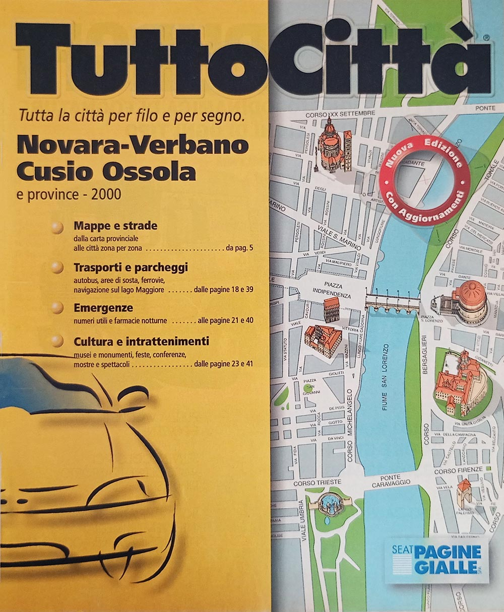</a>
Novara - Verbano Cusio Ossola 2000
<ul class="scheda"><li><b>Formato:</b> 226 x 274 mm</li><li><b>Copertina:</b> sottile</li><li><b>Layout:</b> TuttoCittà nuovo millennio</li><li><b>Pagine:</b> 46</li><li><b>Mese aggiornamento:</b> novembre 1999</li></ul></td><td class="fasc vuota"></td></tr>
<tr><td class="ann"> 00/01</td><td class="tav"></td><td class="fasc sospesa">
Torino ?
<ul class="scheda"><li><b>Formato:</b> 226 x 274 mm</li><li><b>Copertina:</b> sottile</li><li><b>Layout:</b> TuttoCittà nuovo millennio ter</li><li>non in raccolta</li></ul></td><td class="fasc vuota"></td><td class="fasc vuota"></td><td class="fasc vuota"></td><td class="fasc vuota"></td><td class="fasc vuota"></td><td class="fasc vuota"></td></tr>
<tr><td class="ann"> 01/02</td><td class="tav"></td><td class="fasc sospesa">
Torino e dintorni 2002
<ul class="scheda"><li><b>Formato:</b> 226 x 274 mm</li><li><b>Copertina:</b> sottile</li><li><b>Layout:</b> TuttoCittà nuovo millennio ter</li><li>non in raccolta</li></ul></td><td class="fasc vuota"></td><td class="fasc vuota"></td><td class="fasc vuota"></td><td class="fasc vuota"></td><td class="fasc vuota"></td><td class="fasc vuota"></td></tr>
<tr><td class="ann"> 02/03</td><td class="tav"></td><td class="fasc"><a href="../immagini/TO03.jpg">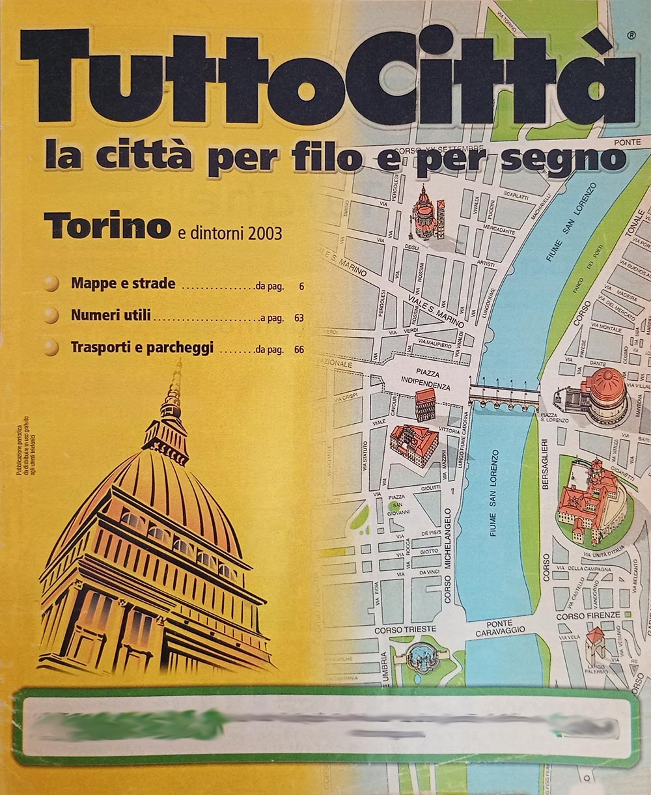</a>
Torino ?
<ul class="scheda"><li><b>Formato:</b> 226 x 274 mm</li><li><b>Copertina:</b> sottile</li><li><b>Layout:</b> TuttoCittà nuovo millennio ter</li><li><b>Pagine:</b> 86</li><li><b>Mese aggiornamento:</b> febbraio 2003</li></ul></td><td class="fasc vuota"></td><td class="fasc vuota"></td><td class="fasc vuota"></td><td class="fasc vuota"></td><td class="fasc vuota"></td><td class="fasc vuota"></td></tr>
<tr><td class="ann"> 03/04</td><td class="tav"></td><td class="fasc"><a href="../immagini/TO04.jpg">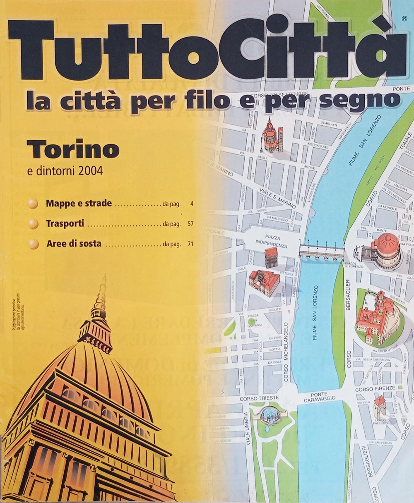</a>
Torino e dintorni 2004
<ul class="scheda"><li><b>Formato:</b> 226 x 274 mm</li><li><b>Copertina:</b> sottile</li><li><b>Layout:</b> TuttoCittà nuovo millennio ter</li><li><b>Pagine:</b> 86 (87)</li><li><b>Mese aggiornamento:</b> febbraio 2004</li></ul></td><td class="fasc vuota"></td><td class="fasc vuota"></td><td class="fasc vuota"></td><td class="fasc vuota"></td><td class="fasc vuota"></td><td class="fasc vuota"></td></tr>
<tr><td class="ann"> 04/05</td><td class="tav"></td><td class="fasc"><a href="../immagini/TO05.jpg">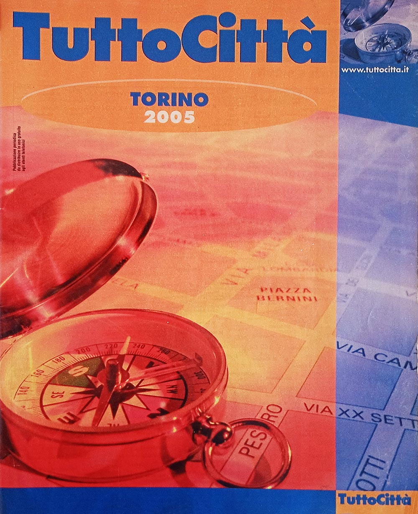</a>
Torino e dintorni 2005
<ul class="scheda"><li><b>Formato:</b> 226 x 274 mm</li><li><b>Copertina:</b> sottile</li><li><b>Layout:</b> TuttoCittà metà duemila</li><li><b>Pagine:</b> 86 (88)</li><li><b>Mese aggiornamento:</b> marzo 2005</li></ul></td><td class="fasc vuota"></td><td class="fasc vuota"></td><td class="fasc vuota"></td><td class="fasc vuota"></td><td class="fasc vuota"></td><td class="fasc vuota"></td></tr>
<tr><td class="ann"> 05/06</td><td class="tav"></td><td class="fasc"><a href="../immagini/TO06.jpg">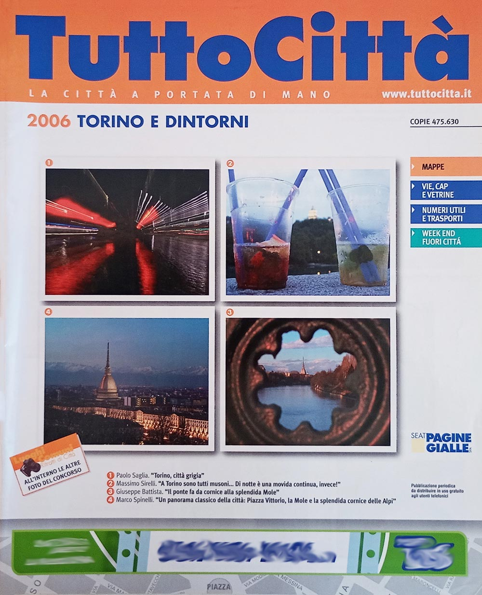</a>
Torino e dintorni 2006
<ul class="scheda"><li><b>Formato:</b> 226 x 274 mm</li><li><b>Copertina:</b> grossa</li><li><b>Layout:</b> TuttoCittà fine duemila</li><li><b>Pagine:</b> 88</li><li><b>Mese aggiornamento:</b> marzo 2006</li></ul></td><td class="fasc vuota"></td><td class="fasc vuota"></td><td class="fasc vuota"></td><td class="fasc vuota"></td><td class="fasc vuota"></td><td class="fasc vuota"></td></tr>
<tr><td class="ann"> 06/07</td><td class="tav"></td><td class="fasc"><a href="../immagini/TO07.jpg">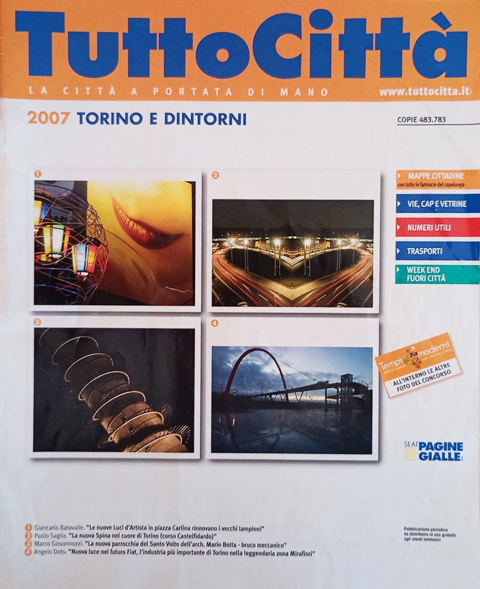</a>
Torino e dintorni 2007
<ul class="scheda"><li><b>Formato:</b> 226 x 274 mm</li><li><b>Copertina:</b> grossa</li><li><b>Layout:</b> TuttoCittà fine duemila</li><li><b>Pagine:</b> 88</li><li><b>Mese aggiornamento:</b> marzo 2007</li></ul></td><td class="fasc vuota"></td><td class="fasc vuota"></td><td class="fasc vuota"></td><td class="fasc vuota"></td><td class="fasc vuota"></td><td class="fasc vuota"></td></tr>
<tr><td class="ann"> 07/08</td><td class="tav"></td><td class="fasc"><a href="../immagini/TO0809.jpg">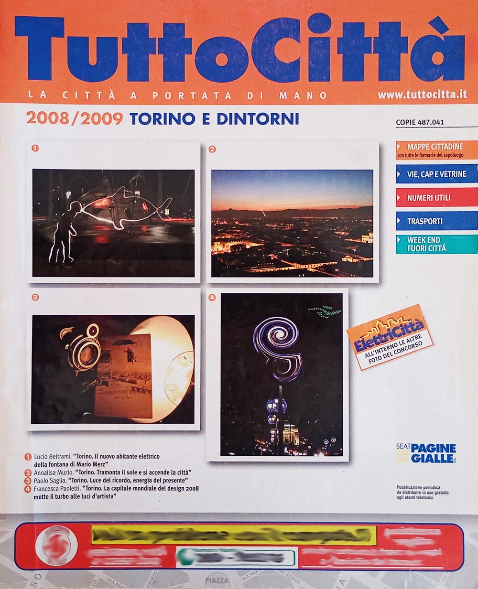</a>
Torino e dintorni 2008/2009
<ul class="scheda"><li><b>Formato:</b> 226 x 274 mm</li><li><b>Copertina:</b> grossa</li><li><b>Layout:</b> TuttoCittà fine duemila</li><li><b>Pagine:</b> 88</li><li><b>Mese aggiornamento:</b> febbraio 2008</li></ul></td><td class="fasc vuota"></td><td class="fasc vuota"></td><td class="fasc vuota"></td><td class="fasc vuota"></td><td class="fasc vuota"></td><td class="fasc vuota"></td></tr>
<tr><td class="ann"> 08/09</td><td class="tav"></td><td class="fasc"><a href="../immagini/TO0910.jpg">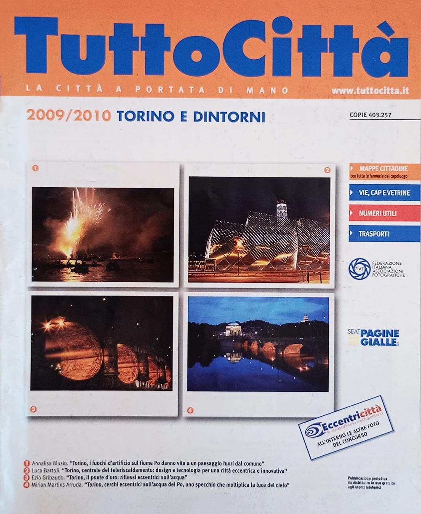</a>
Torino e dintorni 2009/2010
<ul class="scheda"><li><b>Formato:</b> 226 x 274 mm</li><li><b>Copertina:</b> grossa</li><li><b>Layout:</b> TuttoCittà fine duemila</li><li><b>Pagine:</b> 80</li><li><b>Mese aggiornamento:</b> marzo 2009</li></ul></td><td class="fasc vuota"></td><td class="fasc vuota"></td><td class="fasc vuota"></td><td class="fasc vuota"></td><td class="fasc vuota"></td><td class="fasc vuota"></td></tr>
<tr><td class="ann"> 09/10</td><td class="tav"></td><td class="fasc"><a href="../immagini/TO1011.jpg">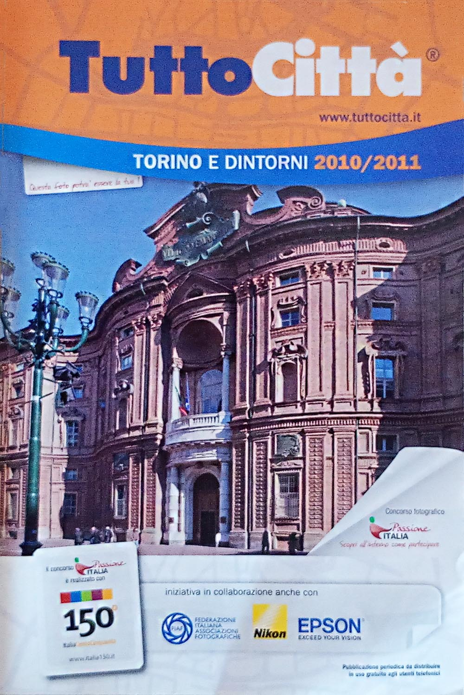</a>
Torino e dintorni 2010/2011
<ul class="scheda"><li><b>Formato:</b> 140 x 212 mm</li><li><b>Copertina:</b> grossa</li><li><b>Layout:</b> TuttoCittà anni dieci</li><li><b>Pagine:</b> 128</li><li><b>Mese aggiornamento:</b> marzo 2010</li><li><b>Note:</b> riforma cartografica; nuovo formato; inserto Agenzia del Territorio; presente un'edizione parallela speciale per l'ostensione della Sindone</li></ul></td><td class="fasc vuota"></td><td class="fasc vuota"></td><td class="fasc vuota"></td><td class="fasc vuota"></td><td class="fasc vuota"></td><td class="fasc vuota"></td></tr>
<tr><td class="ann"> 10/11</td><td class="tav"></td><td class="fasc"><a href="../immagini/TO1112.jpg">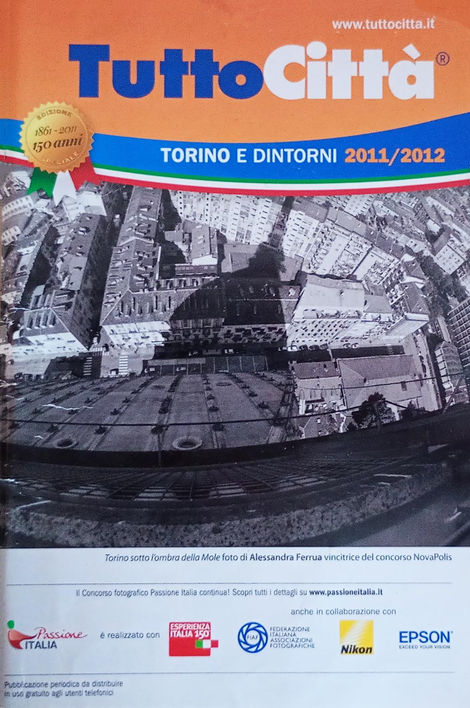</a>
Torino e dintorni 2011/2012
<ul class="scheda"><li><b>Formato:</b> 140 x 212 mm</li><li><b>Copertina:</b> grossa</li><li><b>Layout:</b> TuttoCittà anni dieci</li><li><b>Pagine:</b> 120</li><li><b>Mese aggiornamento:</b> marzo 2011</li></ul></td><td class="fasc vuota"></td><td class="fasc vuota"></td><td class="fasc sospesa"><a href="../immagini/Ricercato2.jpg">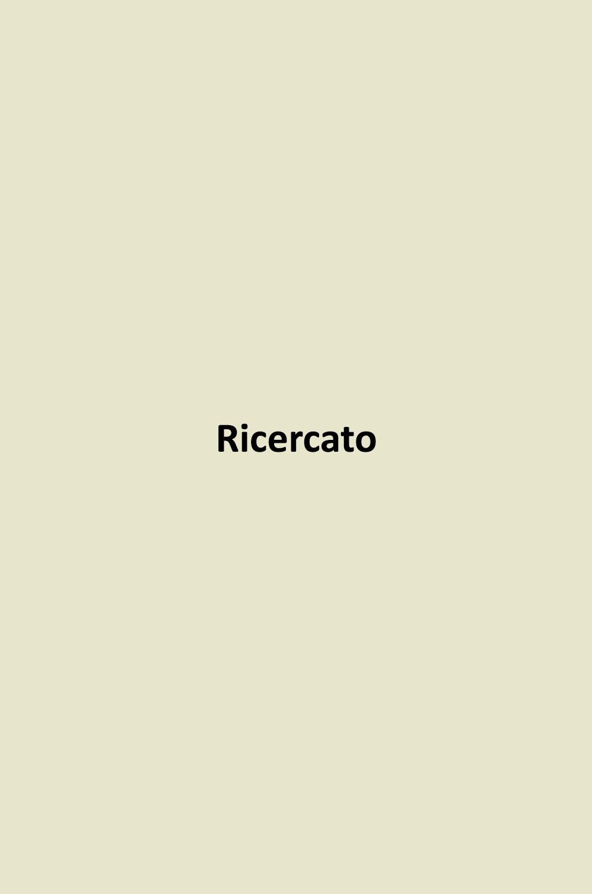</a>
Asti 2011/2012
<ul class="scheda"><li><b>Formato:</b> 140 x 212 mm</li><li><b>Copertina:</b> grossa</li><li><b>Layout:</b> TuttoCittà anni dieci</li><li><b>Note:</b> riforma cartografica; nuovo formato</li><li>non in raccolta</li></ul></td><td class="fasc"><a href="../immagini/CN1112.jpg">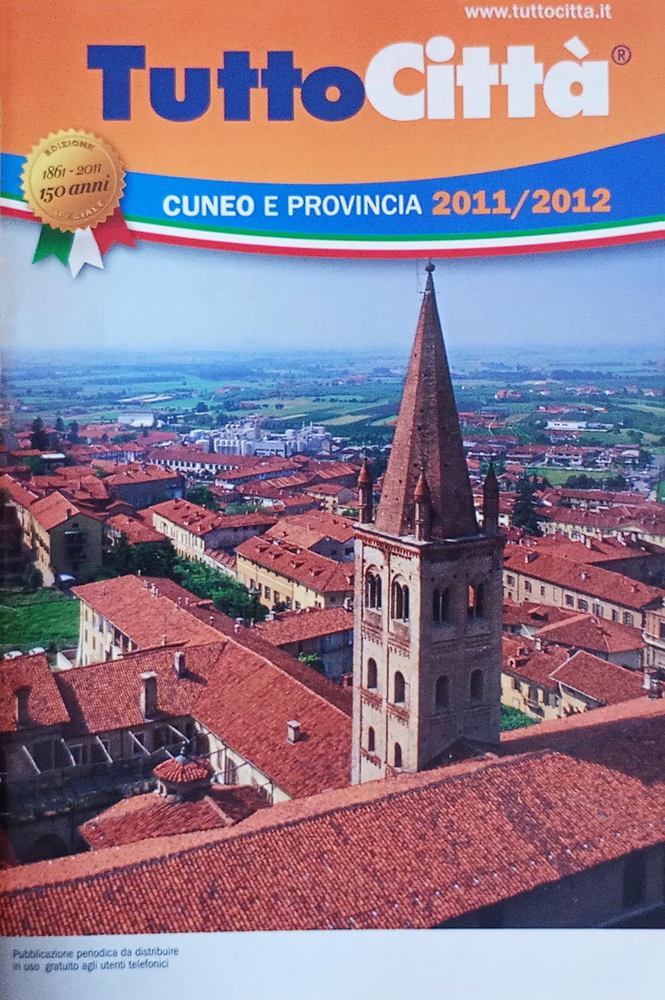</a>
Cuneo 2011/2012
<ul class="scheda"><li><b>Formato:</b> 140 x 212 mm</li><li><b>Copertina:</b> grossa</li><li><b>Layout:</b> TuttoCittà anni dieci</li><li><b>Pagine:</b> 48</li><li><b>Mese aggiornamento:</b> dicembre 2010</li><li><b>Note:</b> riforma cartografica; nuovo formato</li></ul></td><td class="fasc vuota"></td><td class="fasc vuota"></td></tr>
<tr><td class="ann"> 11/12</td><td class="tav"></td><td class="fasc"><a href="../immagini/TO1213.jpg">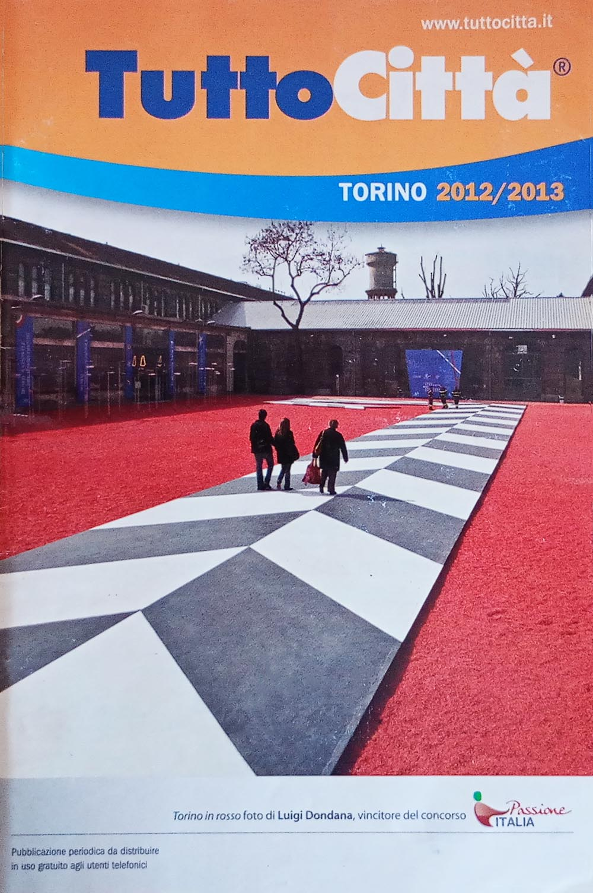</a>
Torino 2012/2013
<ul class="scheda"><li><b>Formato:</b> 140 x 212 mm</li><li><b>Copertina:</b> grossa</li><li><b>Layout:</b> TuttoCittà anni dieci</li><li><b>Pagine:</b> 88</li><li><b>Mese aggiornamento:</b> febbraio 2012</li></ul></td><td class="fasc vuota"></td><td class="fasc vuota"></td><td class="fasc sospesa">
Asti 2012/2013
<ul class="scheda"><li><b>Formato:</b> 140 x 212 mm</li><li><b>Copertina:</b> grossa</li><li><b>Layout:</b> TuttoCittà anni dieci</li><li>non in raccolta</li></ul></td><td class="fasc sospesa">
Cuneo 2012/2013
<ul class="scheda"><li><b>Formato:</b> 140 x 212 mm</li><li><b>Copertina:</b> grossa</li><li><b>Layout:</b> TuttoCittà anni dieci</li><li>non in raccolta</li></ul></td><td class="fasc vuota"></td><td class="fasc vuota"></td></tr>
<tr><td class="ann"> 12/13</td><td class="tav"></td><td class="fasc"><a href="../immagini/TO1314.jpg">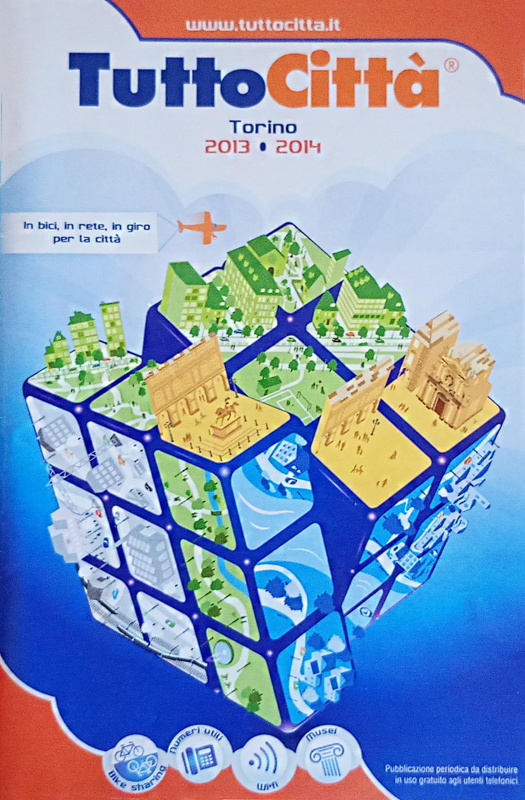</a>
Torino 2013/2014
<ul class="scheda"><li><b>Formato:</b> 140 x 212 mm</li><li><b>Copertina:</b> grossa</li><li><b>Layout:</b> TuttoCittà anni dieci</li><li><b>Pagine:</b> 96</li><li><b>Mese aggiornamento:</b> febbraio 2013</li></ul></td><td class="fasc vuota"></td><td class="fasc vuota"></td><td class="fasc sospesa">
Asti 2013/2014
<ul class="scheda"><li><b>Formato:</b> 140 x 212 mm</li><li><b>Copertina:</b> grossa</li><li><b>Layout:</b> TuttoCittà anni dieci</li><li>non in raccolta</li></ul></td><td class="fasc sospesa">
Cuneo 2013/2014
<ul class="scheda"><li><b>Formato:</b> 140 x 212 mm</li><li><b>Copertina:</b> grossa</li><li><b>Layout:</b> TuttoCittà anni dieci</li><li>non in raccolta</li></ul></td><td class="fasc vuota"></td><td class="fasc vuota"></td></tr>
<tr><td class="ann"> 13/14</td><td class="tav"></td><td class="fasc"><a href="../immagini/TO1415.jpg">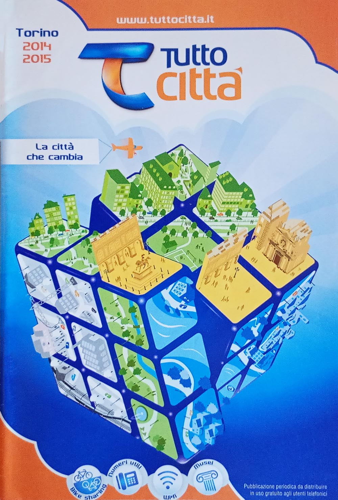</a>
Torino 2014/2015
<ul class="scheda"><li><b>Formato:</b> 140 x 212 mm</li><li><b>Copertina:</b> grossa</li><li><b>Layout:</b> TuttoCittà anni dieci</li><li><b>Pagine:</b> 96</li><li><b>Mese aggiornamento:</b> febbraio 2014</li></ul></td><td class="fasc vuota"></td><td class="fasc vuota"></td><td class="fasc sospesa">
Asti 2014/2015
<ul class="scheda"><li><b>Formato:</b> 140 x 212 mm</li><li><b>Copertina:</b> grossa</li><li><b>Layout:</b> TuttoCittà anni dieci</li><li>non in raccolta</li></ul></td><td class="fasc sospesa">
Cuneo 2014/2015
<ul class="scheda"><li><b>Formato:</b> 140 x 212 mm</li><li><b>Copertina:</b> grossa</li><li><b>Layout:</b> TuttoCittà anni dieci</li><li>non in raccolta</li></ul></td><td class="fasc vuota"></td><td class="fasc vuota"></td></tr>
</tbody>
</table>

## Dieci layout in trentatré anni

La seguente tabella censisce i vari layout utilizzati per i fascicoli della regione, secondo il sistema definito durante il censimento osservando l'impaginazione; le loro caratteristiche sono descritte in [questa pagina](tabella-layout.md). Come descritto anche lì, i cambi di layout non rispettano i cambi delle serie di copertina descritte nell'[apposita pagina](copertine.md) di questo sito.

<table class="layout-dettaglio">
<thead><tr><th>Layout</th><th>Annate</th><th>Anni di copertina</th></tr></thead>
<tbody>
<tr><td>TuttoCittà '80 classico</td><td class="ann">81/82 – 89/90</td><td class="cop">82<i class="pt"></i>83<i class="pt"></i>84<i class="pt"></i>85<i class="pt"></i>86<i class="pt"></i>87<i class="pt"></i>88<i class="pt"></i>89<i class="pt"></i>90</td></tr>
<tr><td>TuttoCittà '80 edifici</td><td class="ann">85/86 – 88/89</td><td class="cop">86<i class="pt"></i>87<i class="pt"></i>88<i class="pt"></i>89</td></tr>
<tr><td>TuttoCittà '90 classico iniziale</td><td class="ann">89/90 – 91/92</td><td class="cop">90<i class="pt"></i>91<i class="pt"></i>92</td></tr>
<tr><td>TuttoCittà '90 classico</td><td class="ann">91/92 – 96/97</td><td class="cop">92<i class="pt"></i>93<i class="pt"></i>94<i class="pt"></i>95<i class="pt"></i>96<i class="pt"></i>97</td></tr>
<tr><td>TuttoCittà '90 riformato</td><td class="ann">97/98 – 98/99</td><td class="cop">98<i class="pt"></i>99</td></tr>
<tr><td>TuttoCittà nuovo millennio</td><td class="ann">98/99 – 99/00</td><td class="cop">99<i class="pt"></i>00</td></tr>
<tr><td>TuttoCittà nuovo millennio ter</td><td class="ann">00/01 – 03/04</td><td class="cop">02<i class="pt"></i>04</td></tr>
<tr><td>TuttoCittà metà duemila</td><td class="ann">04/05</td><td class="cop">05</td></tr>
<tr><td>TuttoCittà fine duemila</td><td class="ann">05/06 – 08/09</td><td class="cop">06<i class="pt"></i>07<i class="pt"></i>08/09<i class="pt"></i>09/10</td></tr>
<tr><td>TuttoCittà anni dieci</td><td class="ann">09/10 – 13/14</td><td class="cop">10/11<i class="pt"></i>10<i class="pt"></i>11/12<i class="pt"></i>12/13<i class="pt"></i>13/14<i class="pt"></i>14/15</td></tr>
</tbody>
</table>

## Le città cartografate

La seguente tabella censisce tutti i comuni che sono stati cartografati nel corso del tempo e per quante annate. Ad ogni riga corrisponde un comune, in ordine alfabetico e non per provincia: lo scopo è infatti identificare a colpo d'occhio quali comuni entrano ed escono dalla cartografia nel corso degli anni. I sei capoluoghi storici — ALESSANDRIA, ASTI, CUNEO, NOVARA, TORINO, VERCELLI — sono in maiuscolo, ma restano al loro posto nell'alfabeto.

La croce segna le annate in cui non sappiamo: perché il fascicolo che avrebbe portato quel comune non è in raccolta, perché non è accertato che sia mai esistito, o perché il suo contenuto non è ancora stato spogliato.

Le caselle azzurre indicano invece che il comune era cartografato, ma non compariva nel relativo elenco delle vie, un fenomeno relativamente comune soprattutto nei fascicoli degli anni '80.

Espandi la griglia delle città — 79 città su 33 annate

<table class="griglia">
  <thead><tr><th scope="col">Città</th><th scope="col" class="ann dec">81/82</th><th scope="col" class="ann">82/83</th><th scope="col" class="ann">83/84</th><th scope="col" class="ann">84/85</th><th scope="col" class="ann">85/86</th><th scope="col" class="ann">86/87</th><th scope="col" class="ann">87/88</th><th scope="col" class="ann">88/89</th><th scope="col" class="ann">89/90</th><th scope="col" class="ann dec">90/91</th><th scope="col" class="ann">91/92</th><th scope="col" class="ann">92/93</th><th scope="col" class="ann">93/94</th><th scope="col" class="ann">94/95</th><th scope="col" class="ann">95/96</th><th scope="col" class="ann">96/97</th><th scope="col" class="ann">97/98</th><th scope="col" class="ann">98/99</th><th scope="col" class="ann">99/00</th><th scope="col" class="ann dec">00/01</th><th scope="col" class="ann">01/02</th><th scope="col" class="ann">02/03</th><th scope="col" class="ann">03/04</th><th scope="col" class="ann">04/05</th><th scope="col" class="ann">05/06</th><th scope="col" class="ann">06/07</th><th scope="col" class="ann">07/08</th><th scope="col" class="ann">08/09</th><th scope="col" class="ann">09/10</th><th scope="col" class="ann dec">10/11</th><th scope="col" class="ann">11/12</th><th scope="col" class="ann">12/13</th><th scope="col" class="ann">13/14</th></tr></thead>
  <tbody>
  <tr><th scope="row">Acqui Terme</th><td class="ig dec" title="Acqui Terme — 81/82: non accertato, fascicolo mancante">&#215;</td><td class="si" title="Acqui Terme — 82/83"></td><td class="ig" title="Acqui Terme — 83/84: non accertato, fascicolo mancante">&#215;</td><td class="ig" title="Acqui Terme — 84/85: non accertato, fascicolo mancante">&#215;</td><td class="ig" title="Acqui Terme — 85/86: non accertato, fascicolo mancante">&#215;</td><td class="si" title="Acqui Terme — 86/87"></td><td class="si" title="Acqui Terme — 87/88"></td><td class="si" title="Acqui Terme — 88/89"></td><td class="si" title="Acqui Terme — 89/90"></td><td class="ig dec" title="Acqui Terme — 90/91: non accertato, fascicolo mancante">&#215;</td><td class="ig" title="Acqui Terme — 91/92: non accertato, fascicolo mancante">&#215;</td><td class="si" title="Acqui Terme — 92/93"></td><td class="si" title="Acqui Terme — 93/94"></td><td class="si" title="Acqui Terme — 94/95"></td><td class="ig" title="Acqui Terme — 95/96: non accertato, fascicolo mancante">&#215;</td><td class="si" title="Acqui Terme — 96/97"></td><td class="si" title="Acqui Terme — 97/98"></td><td class="ig" title="Acqui Terme — 98/99: non accertato, fascicolo mancante">&#215;</td><td class="ig" title="Acqui Terme — 99/00: non accertato, fascicolo mancante">&#215;</td><td class="no dec" title="Acqui Terme — 00/01"></td><td class="no" title="Acqui Terme — 01/02"></td><td class="no" title="Acqui Terme — 02/03"></td><td class="no" title="Acqui Terme — 03/04"></td><td class="no" title="Acqui Terme — 04/05"></td><td class="no" title="Acqui Terme — 05/06"></td><td class="no" title="Acqui Terme — 06/07"></td><td class="no" title="Acqui Terme — 07/08"></td><td class="no" title="Acqui Terme — 08/09"></td><td class="no" title="Acqui Terme — 09/10"></td><td class="no dec" title="Acqui Terme — 10/11"></td><td class="no" title="Acqui Terme — 11/12"></td><td class="no" title="Acqui Terme — 12/13"></td><td class="no" title="Acqui Terme — 13/14"></td></tr>
  <tr><th scope="row">Alba</th><td class="ig dec" title="Alba — 81/82: non accertato, fascicolo mancante">&#215;</td><td class="ig" title="Alba — 82/83: non accertato, fascicolo mancante">&#215;</td><td class="ig" title="Alba — 83/84: non accertato, fascicolo mancante">&#215;</td><td class="ig" title="Alba — 84/85: non accertato, fascicolo mancante">&#215;</td><td class="si" title="Alba — 85/86"></td><td class="si" title="Alba — 86/87"></td><td class="si" title="Alba — 87/88"></td><td class="si" title="Alba — 88/89"></td><td class="si" title="Alba — 89/90"></td><td class="ig dec" title="Alba — 90/91: non accertato, fascicolo mancante">&#215;</td><td class="ig" title="Alba — 91/92: non accertato, fascicolo mancante">&#215;</td><td class="si" title="Alba — 92/93"></td><td class="si" title="Alba — 93/94"></td><td class="si" title="Alba — 94/95"></td><td class="ig" title="Alba — 95/96: non accertato, fascicolo mancante">&#215;</td><td class="ig" title="Alba — 96/97: non accertato, fascicolo mancante">&#215;</td><td class="si" title="Alba — 97/98"></td><td class="ig" title="Alba — 98/99: non accertato, fascicolo mancante">&#215;</td><td class="ig" title="Alba — 99/00: non accertato, fascicolo mancante">&#215;</td><td class="no dec" title="Alba — 00/01"></td><td class="no" title="Alba — 01/02"></td><td class="no" title="Alba — 02/03"></td><td class="no" title="Alba — 03/04"></td><td class="no" title="Alba — 04/05"></td><td class="no" title="Alba — 05/06"></td><td class="no" title="Alba — 06/07"></td><td class="no" title="Alba — 07/08"></td><td class="no" title="Alba — 08/09"></td><td class="no" title="Alba — 09/10"></td><td class="si dec" title="Alba — 10/11"></td><td class="ig" title="Alba — 11/12: non accertato, fascicolo mancante">&#215;</td><td class="ig" title="Alba — 12/13: non accertato, fascicolo mancante">&#215;</td><td class="ig" title="Alba — 13/14: non accertato, fascicolo mancante">&#215;</td></tr>
  <tr><th scope="row">ALESSANDRIA</th><td class="ig dec" title="Alessandria — 81/82: non accertato, fascicolo mancante">&#215;</td><td class="si" title="Alessandria — 82/83"></td><td class="ig" title="Alessandria — 83/84: non accertato, fascicolo mancante">&#215;</td><td class="ig" title="Alessandria — 84/85: non accertato, fascicolo mancante">&#215;</td><td class="ig" title="Alessandria — 85/86: non accertato, fascicolo mancante">&#215;</td><td class="si" title="Alessandria — 86/87"></td><td class="si" title="Alessandria — 87/88"></td><td class="si" title="Alessandria — 88/89"></td><td class="si" title="Alessandria — 89/90"></td><td class="ig dec" title="Alessandria — 90/91: non accertato, fascicolo mancante">&#215;</td><td class="ig" title="Alessandria — 91/92: non accertato, fascicolo mancante">&#215;</td><td class="si" title="Alessandria — 92/93"></td><td class="si" title="Alessandria — 93/94"></td><td class="si" title="Alessandria — 94/95"></td><td class="ig" title="Alessandria — 95/96: non accertato, fascicolo mancante">&#215;</td><td class="si" title="Alessandria — 96/97"></td><td class="si" title="Alessandria — 97/98"></td><td class="ig" title="Alessandria — 98/99: non accertato, fascicolo mancante">&#215;</td><td class="ig" title="Alessandria — 99/00: non accertato, fascicolo mancante">&#215;</td><td class="no dec" title="Alessandria — 00/01"></td><td class="no" title="Alessandria — 01/02"></td><td class="no" title="Alessandria — 02/03"></td><td class="no" title="Alessandria — 03/04"></td><td class="no" title="Alessandria — 04/05"></td><td class="no" title="Alessandria — 05/06"></td><td class="no" title="Alessandria — 06/07"></td><td class="no" title="Alessandria — 07/08"></td><td class="no" title="Alessandria — 08/09"></td><td class="no" title="Alessandria — 09/10"></td><td class="no dec" title="Alessandria — 10/11"></td><td class="no" title="Alessandria — 11/12"></td><td class="no" title="Alessandria — 12/13"></td><td class="no" title="Alessandria — 13/14"></td></tr>
  <tr><th scope="row">Alpignano</th><td class="si dec" title="Alpignano — 81/82"></td><td class="si" title="Alpignano — 82/83"></td><td class="si" title="Alpignano — 83/84"></td><td class="si" title="Alpignano — 84/85"></td><td class="ig" title="Alpignano — 85/86: non accertato, fascicolo mancante">&#215;</td><td class="si" title="Alpignano — 86/87"></td><td class="si" title="Alpignano — 87/88"></td><td class="si" title="Alpignano — 88/89"></td><td class="si" title="Alpignano — 89/90"></td><td class="si dec" title="Alpignano — 90/91"></td><td class="si" title="Alpignano — 91/92"></td><td class="si" title="Alpignano — 92/93"></td><td class="si" title="Alpignano — 93/94"></td><td class="si" title="Alpignano — 94/95"></td><td class="si" title="Alpignano — 95/96"></td><td class="si" title="Alpignano — 96/97"></td><td class="si" title="Alpignano — 97/98"></td><td class="ig" title="Alpignano — 98/99: non accertato, fascicolo mancante">&#215;</td><td class="ig" title="Alpignano — 99/00: non accertato, fascicolo mancante">&#215;</td><td class="ig dec" title="Alpignano — 00/01: non accertato, fascicolo mancante">&#215;</td><td class="ig" title="Alpignano — 01/02: non accertato, fascicolo mancante">&#215;</td><td class="no" title="Alpignano — 02/03"></td><td class="no" title="Alpignano — 03/04"></td><td class="no" title="Alpignano — 04/05"></td><td class="no" title="Alpignano — 05/06"></td><td class="no" title="Alpignano — 06/07"></td><td class="no" title="Alpignano — 07/08"></td><td class="no" title="Alpignano — 08/09"></td><td class="no" title="Alpignano — 09/10"></td><td class="no dec" title="Alpignano — 10/11"></td><td class="no" title="Alpignano — 11/12"></td><td class="no" title="Alpignano — 12/13"></td><td class="no" title="Alpignano — 13/14"></td></tr>
  <tr><th scope="row">Alzano</th><td class="ig dec" title="Alzano — 81/82: non accertato, fascicolo mancante">&#215;</td><td class="no" title="Alzano — 82/83"></td><td class="ig" title="Alzano — 83/84: non accertato, fascicolo mancante">&#215;</td><td class="ig" title="Alzano — 84/85: non accertato, fascicolo mancante">&#215;</td><td class="ig" title="Alzano — 85/86: non accertato, fascicolo mancante">&#215;</td><td class="no" title="Alzano — 86/87"></td><td class="no" title="Alzano — 87/88"></td><td class="no" title="Alzano — 88/89"></td><td class="ni" title="Alzano — 89/90: cartografato, ma assente dall'elenco delle vie"></td><td class="ig dec" title="Alzano — 90/91: non accertato, fascicolo mancante">&#215;</td><td class="ig" title="Alzano — 91/92: non accertato, fascicolo mancante">&#215;</td><td class="no" title="Alzano — 92/93"></td><td class="no" title="Alzano — 93/94"></td><td class="no" title="Alzano — 94/95"></td><td class="ig" title="Alzano — 95/96: non accertato, fascicolo mancante">&#215;</td><td class="no" title="Alzano — 96/97"></td><td class="no" title="Alzano — 97/98"></td><td class="ig" title="Alzano — 98/99: non accertato, fascicolo mancante">&#215;</td><td class="ig" title="Alzano — 99/00: non accertato, fascicolo mancante">&#215;</td><td class="no dec" title="Alzano — 00/01"></td><td class="no" title="Alzano — 01/02"></td><td class="no" title="Alzano — 02/03"></td><td class="no" title="Alzano — 03/04"></td><td class="no" title="Alzano — 04/05"></td><td class="no" title="Alzano — 05/06"></td><td class="no" title="Alzano — 06/07"></td><td class="no" title="Alzano — 07/08"></td><td class="no" title="Alzano — 08/09"></td><td class="no" title="Alzano — 09/10"></td><td class="no dec" title="Alzano — 10/11"></td><td class="no" title="Alzano — 11/12"></td><td class="no" title="Alzano — 12/13"></td><td class="no" title="Alzano — 13/14"></td></tr>
  <tr><th scope="row">Arona</th><td class="no dec" title="Arona — 81/82"></td><td class="si" title="Arona — 82/83"></td><td class="si" title="Arona — 83/84"></td><td class="si" title="Arona — 84/85"></td><td class="si" title="Arona — 85/86"></td><td class="si" title="Arona — 86/87"></td><td class="si" title="Arona — 87/88"></td><td class="si" title="Arona — 88/89"></td><td class="si" title="Arona — 89/90"></td><td class="si dec" title="Arona — 90/91"></td><td class="si" title="Arona — 91/92"></td><td class="si" title="Arona — 92/93"></td><td class="si" title="Arona — 93/94"></td><td class="si" title="Arona — 94/95"></td><td class="si" title="Arona — 95/96"></td><td class="si" title="Arona — 96/97"></td><td class="si" title="Arona — 97/98"></td><td class="si" title="Arona — 98/99"></td><td class="si" title="Arona — 99/00"></td><td class="no dec" title="Arona — 00/01"></td><td class="no" title="Arona — 01/02"></td><td class="no" title="Arona — 02/03"></td><td class="no" title="Arona — 03/04"></td><td class="no" title="Arona — 04/05"></td><td class="no" title="Arona — 05/06"></td><td class="no" title="Arona — 06/07"></td><td class="no" title="Arona — 07/08"></td><td class="no" title="Arona — 08/09"></td><td class="no" title="Arona — 09/10"></td><td class="no dec" title="Arona — 10/11"></td><td class="no" title="Arona — 11/12"></td><td class="no" title="Arona — 12/13"></td><td class="no" title="Arona — 13/14"></td></tr>
  <tr><th scope="row">ASTI</th><td class="ig dec" title="Asti — 81/82: non accertato, fascicolo mancante">&#215;</td><td class="si" title="Asti — 82/83"></td><td class="ig" title="Asti — 83/84: non accertato, fascicolo mancante">&#215;</td><td class="si" title="Asti — 84/85"></td><td class="ig" title="Asti — 85/86: non accertato, fascicolo mancante">&#215;</td><td class="si" title="Asti — 86/87"></td><td class="si" title="Asti — 87/88"></td><td class="si" title="Asti — 88/89"></td><td class="si" title="Asti — 89/90"></td><td class="si dec" title="Asti — 90/91"></td><td class="ig" title="Asti — 91/92: non accertato, fascicolo mancante">&#215;</td><td class="si" title="Asti — 92/93"></td><td class="si" title="Asti — 93/94"></td><td class="si" title="Asti — 94/95"></td><td class="ig" title="Asti — 95/96: non accertato, fascicolo mancante">&#215;</td><td class="si" title="Asti — 96/97"></td><td class="ig" title="Asti — 97/98: non accertato, fascicolo mancante">&#215;</td><td class="ig" title="Asti — 98/99: non accertato, fascicolo mancante">&#215;</td><td class="ig" title="Asti — 99/00: non accertato, fascicolo mancante">&#215;</td><td class="no dec" title="Asti — 00/01"></td><td class="no" title="Asti — 01/02"></td><td class="no" title="Asti — 02/03"></td><td class="no" title="Asti — 03/04"></td><td class="no" title="Asti — 04/05"></td><td class="no" title="Asti — 05/06"></td><td class="no" title="Asti — 06/07"></td><td class="no" title="Asti — 07/08"></td><td class="no" title="Asti — 08/09"></td><td class="no" title="Asti — 09/10"></td><td class="ig dec" title="Asti — 10/11: non accertato, fascicolo mancante">&#215;</td><td class="ig" title="Asti — 11/12: non accertato, fascicolo mancante">&#215;</td><td class="ig" title="Asti — 12/13: non accertato, fascicolo mancante">&#215;</td><td class="ig" title="Asti — 13/14: non accertato, fascicolo mancante">&#215;</td></tr>
  <tr><th scope="row">Beinasco</th><td class="si dec" title="Beinasco — 81/82"></td><td class="si" title="Beinasco — 82/83"></td><td class="si" title="Beinasco — 83/84"></td><td class="si" title="Beinasco — 84/85"></td><td class="si" title="Beinasco — 85/86"></td><td class="si" title="Beinasco — 86/87"></td><td class="si" title="Beinasco — 87/88"></td><td class="si" title="Beinasco — 88/89"></td><td class="si" title="Beinasco — 89/90"></td><td class="si dec" title="Beinasco — 90/91"></td><td class="si" title="Beinasco — 91/92"></td><td class="si" title="Beinasco — 92/93"></td><td class="si" title="Beinasco — 93/94"></td><td class="si" title="Beinasco — 94/95"></td><td class="si" title="Beinasco — 95/96"></td><td class="si" title="Beinasco — 96/97"></td><td class="si" title="Beinasco — 97/98"></td><td class="si" title="Beinasco — 98/99"></td><td class="ig" title="Beinasco — 99/00: non accertato, fascicolo mancante">&#215;</td><td class="ig dec" title="Beinasco — 00/01: non accertato, fascicolo mancante">&#215;</td><td class="ig" title="Beinasco — 01/02: non accertato, fascicolo mancante">&#215;</td><td class="si" title="Beinasco — 02/03"></td><td class="si" title="Beinasco — 03/04"></td><td class="si" title="Beinasco — 04/05"></td><td class="si" title="Beinasco — 05/06"></td><td class="si" title="Beinasco — 06/07"></td><td class="si" title="Beinasco — 07/08"></td><td class="si" title="Beinasco — 08/09"></td><td class="si" title="Beinasco — 09/10"></td><td class="no dec" title="Beinasco — 10/11"></td><td class="no" title="Beinasco — 11/12"></td><td class="si" title="Beinasco — 12/13"></td><td class="si" title="Beinasco — 13/14"></td></tr>
  <tr><th scope="row">Bellinzago</th><td class="no dec" title="Bellinzago — 81/82"></td><td class="no" title="Bellinzago — 82/83"></td><td class="no" title="Bellinzago — 83/84"></td><td class="no" title="Bellinzago — 84/85"></td><td class="no" title="Bellinzago — 85/86"></td><td class="no" title="Bellinzago — 86/87"></td><td class="no" title="Bellinzago — 87/88"></td><td class="no" title="Bellinzago — 88/89"></td><td class="no" title="Bellinzago — 89/90"></td><td class="si dec" title="Bellinzago — 90/91"></td><td class="si" title="Bellinzago — 91/92"></td><td class="si" title="Bellinzago — 92/93"></td><td class="si" title="Bellinzago — 93/94"></td><td class="si" title="Bellinzago — 94/95"></td><td class="si" title="Bellinzago — 95/96"></td><td class="si" title="Bellinzago — 96/97"></td><td class="si" title="Bellinzago — 97/98"></td><td class="si" title="Bellinzago — 98/99"></td><td class="si" title="Bellinzago — 99/00"></td><td class="no dec" title="Bellinzago — 00/01"></td><td class="no" title="Bellinzago — 01/02"></td><td class="no" title="Bellinzago — 02/03"></td><td class="no" title="Bellinzago — 03/04"></td><td class="no" title="Bellinzago — 04/05"></td><td class="no" title="Bellinzago — 05/06"></td><td class="no" title="Bellinzago — 06/07"></td><td class="no" title="Bellinzago — 07/08"></td><td class="no" title="Bellinzago — 08/09"></td><td class="no" title="Bellinzago — 09/10"></td><td class="no dec" title="Bellinzago — 10/11"></td><td class="no" title="Bellinzago — 11/12"></td><td class="no" title="Bellinzago — 12/13"></td><td class="no" title="Bellinzago — 13/14"></td></tr>
  <tr><th scope="row">Biella</th><td class="si dec" title="Biella — 81/82"></td><td class="si" title="Biella — 82/83"></td><td class="si" title="Biella — 83/84"></td><td class="si" title="Biella — 84/85"></td><td class="si" title="Biella — 85/86"></td><td class="si" title="Biella — 86/87"></td><td class="si" title="Biella — 87/88"></td><td class="si" title="Biella — 88/89"></td><td class="si" title="Biella — 89/90"></td><td class="si dec" title="Biella — 90/91"></td><td class="si" title="Biella — 91/92"></td><td class="si" title="Biella — 92/93"></td><td class="si" title="Biella — 93/94"></td><td class="si" title="Biella — 94/95"></td><td class="ig" title="Biella — 95/96: non accertato, fascicolo mancante">&#215;</td><td class="si" title="Biella — 96/97"></td><td class="si" title="Biella — 97/98"></td><td class="ig" title="Biella — 98/99: non accertato, fascicolo mancante">&#215;</td><td class="no" title="Biella — 99/00"></td><td class="no dec" title="Biella — 00/01"></td><td class="no" title="Biella — 01/02"></td><td class="no" title="Biella — 02/03"></td><td class="no" title="Biella — 03/04"></td><td class="no" title="Biella — 04/05"></td><td class="no" title="Biella — 05/06"></td><td class="no" title="Biella — 06/07"></td><td class="no" title="Biella — 07/08"></td><td class="no" title="Biella — 08/09"></td><td class="no" title="Biella — 09/10"></td><td class="no dec" title="Biella — 10/11"></td><td class="no" title="Biella — 11/12"></td><td class="no" title="Biella — 12/13"></td><td class="no" title="Biella — 13/14"></td></tr>
  <tr><th scope="row">Borgo San Dalmazzo</th><td class="ig dec" title="Borgo San Dalmazzo — 81/82: non accertato, fascicolo mancante">&#215;</td><td class="ig" title="Borgo San Dalmazzo — 82/83: non accertato, fascicolo mancante">&#215;</td><td class="ig" title="Borgo San Dalmazzo — 83/84: non accertato, fascicolo mancante">&#215;</td><td class="ig" title="Borgo San Dalmazzo — 84/85: non accertato, fascicolo mancante">&#215;</td><td class="si" title="Borgo San Dalmazzo — 85/86"></td><td class="si" title="Borgo San Dalmazzo — 86/87"></td><td class="si" title="Borgo San Dalmazzo — 87/88"></td><td class="si" title="Borgo San Dalmazzo — 88/89"></td><td class="si" title="Borgo San Dalmazzo — 89/90"></td><td class="ig dec" title="Borgo San Dalmazzo — 90/91: non accertato, fascicolo mancante">&#215;</td><td class="ig" title="Borgo San Dalmazzo — 91/92: non accertato, fascicolo mancante">&#215;</td><td class="si" title="Borgo San Dalmazzo — 92/93"></td><td class="si" title="Borgo San Dalmazzo — 93/94"></td><td class="si" title="Borgo San Dalmazzo — 94/95"></td><td class="ig" title="Borgo San Dalmazzo — 95/96: non accertato, fascicolo mancante">&#215;</td><td class="ig" title="Borgo San Dalmazzo — 96/97: non accertato, fascicolo mancante">&#215;</td><td class="si" title="Borgo San Dalmazzo — 97/98"></td><td class="ig" title="Borgo San Dalmazzo — 98/99: non accertato, fascicolo mancante">&#215;</td><td class="ig" title="Borgo San Dalmazzo — 99/00: non accertato, fascicolo mancante">&#215;</td><td class="no dec" title="Borgo San Dalmazzo — 00/01"></td><td class="no" title="Borgo San Dalmazzo — 01/02"></td><td class="no" title="Borgo San Dalmazzo — 02/03"></td><td class="no" title="Borgo San Dalmazzo — 03/04"></td><td class="no" title="Borgo San Dalmazzo — 04/05"></td><td class="no" title="Borgo San Dalmazzo — 05/06"></td><td class="no" title="Borgo San Dalmazzo — 06/07"></td><td class="no" title="Borgo San Dalmazzo — 07/08"></td><td class="no" title="Borgo San Dalmazzo — 08/09"></td><td class="no" title="Borgo San Dalmazzo — 09/10"></td><td class="si dec" title="Borgo San Dalmazzo — 10/11"></td><td class="ig" title="Borgo San Dalmazzo — 11/12: non accertato, fascicolo mancante">&#215;</td><td class="ig" title="Borgo San Dalmazzo — 12/13: non accertato, fascicolo mancante">&#215;</td><td class="ig" title="Borgo San Dalmazzo — 13/14: non accertato, fascicolo mancante">&#215;</td></tr>
  <tr><th scope="row">Borgomanero</th><td class="si dec" title="Borgomanero — 81/82"></td><td class="si" title="Borgomanero — 82/83"></td><td class="si" title="Borgomanero — 83/84"></td><td class="si" title="Borgomanero — 84/85"></td><td class="si" title="Borgomanero — 85/86"></td><td class="si" title="Borgomanero — 86/87"></td><td class="si" title="Borgomanero — 87/88"></td><td class="si" title="Borgomanero — 88/89"></td><td class="si" title="Borgomanero — 89/90"></td><td class="si dec" title="Borgomanero — 90/91"></td><td class="si" title="Borgomanero — 91/92"></td><td class="si" title="Borgomanero — 92/93"></td><td class="si" title="Borgomanero — 93/94"></td><td class="si" title="Borgomanero — 94/95"></td><td class="si" title="Borgomanero — 95/96"></td><td class="si" title="Borgomanero — 96/97"></td><td class="si" title="Borgomanero — 97/98"></td><td class="si" title="Borgomanero — 98/99"></td><td class="si" title="Borgomanero — 99/00"></td><td class="no dec" title="Borgomanero — 00/01"></td><td class="no" title="Borgomanero — 01/02"></td><td class="no" title="Borgomanero — 02/03"></td><td class="no" title="Borgomanero — 03/04"></td><td class="no" title="Borgomanero — 04/05"></td><td class="no" title="Borgomanero — 05/06"></td><td class="no" title="Borgomanero — 06/07"></td><td class="no" title="Borgomanero — 07/08"></td><td class="no" title="Borgomanero — 08/09"></td><td class="no" title="Borgomanero — 09/10"></td><td class="no dec" title="Borgomanero — 10/11"></td><td class="no" title="Borgomanero — 11/12"></td><td class="no" title="Borgomanero — 12/13"></td><td class="no" title="Borgomanero — 13/14"></td></tr>
  <tr><th scope="row">Borgosesia</th><td class="si dec" title="Borgosesia — 81/82"></td><td class="si" title="Borgosesia — 82/83"></td><td class="si" title="Borgosesia — 83/84"></td><td class="si" title="Borgosesia — 84/85"></td><td class="si" title="Borgosesia — 85/86"></td><td class="si" title="Borgosesia — 86/87"></td><td class="si" title="Borgosesia — 87/88"></td><td class="si" title="Borgosesia — 88/89"></td><td class="si" title="Borgosesia — 89/90"></td><td class="si dec" title="Borgosesia — 90/91"></td><td class="si" title="Borgosesia — 91/92"></td><td class="si" title="Borgosesia — 92/93"></td><td class="si" title="Borgosesia — 93/94"></td><td class="si" title="Borgosesia — 94/95"></td><td class="ig" title="Borgosesia — 95/96: non accertato, fascicolo mancante">&#215;</td><td class="si" title="Borgosesia — 96/97"></td><td class="si" title="Borgosesia — 97/98"></td><td class="ig" title="Borgosesia — 98/99: non accertato, fascicolo mancante">&#215;</td><td class="no" title="Borgosesia — 99/00"></td><td class="no dec" title="Borgosesia — 00/01"></td><td class="no" title="Borgosesia — 01/02"></td><td class="no" title="Borgosesia — 02/03"></td><td class="no" title="Borgosesia — 03/04"></td><td class="no" title="Borgosesia — 04/05"></td><td class="no" title="Borgosesia — 05/06"></td><td class="no" title="Borgosesia — 06/07"></td><td class="no" title="Borgosesia — 07/08"></td><td class="no" title="Borgosesia — 08/09"></td><td class="no" title="Borgosesia — 09/10"></td><td class="no dec" title="Borgosesia — 10/11"></td><td class="no" title="Borgosesia — 11/12"></td><td class="no" title="Borgosesia — 12/13"></td><td class="no" title="Borgosesia — 13/14"></td></tr>
  <tr><th scope="row">Boves</th><td class="ig dec" title="Boves — 81/82: non accertato, fascicolo mancante">&#215;</td><td class="ig" title="Boves — 82/83: non accertato, fascicolo mancante">&#215;</td><td class="ig" title="Boves — 83/84: non accertato, fascicolo mancante">&#215;</td><td class="ig" title="Boves — 84/85: non accertato, fascicolo mancante">&#215;</td><td class="no" title="Boves — 85/86"></td><td class="no" title="Boves — 86/87"></td><td class="no" title="Boves — 87/88"></td><td class="si" title="Boves — 88/89"></td><td class="si" title="Boves — 89/90"></td><td class="ig dec" title="Boves — 90/91: non accertato, fascicolo mancante">&#215;</td><td class="ig" title="Boves — 91/92: non accertato, fascicolo mancante">&#215;</td><td class="si" title="Boves — 92/93"></td><td class="si" title="Boves — 93/94"></td><td class="si" title="Boves — 94/95"></td><td class="ig" title="Boves — 95/96: non accertato, fascicolo mancante">&#215;</td><td class="ig" title="Boves — 96/97: non accertato, fascicolo mancante">&#215;</td><td class="si" title="Boves — 97/98"></td><td class="ig" title="Boves — 98/99: non accertato, fascicolo mancante">&#215;</td><td class="ig" title="Boves — 99/00: non accertato, fascicolo mancante">&#215;</td><td class="no dec" title="Boves — 00/01"></td><td class="no" title="Boves — 01/02"></td><td class="no" title="Boves — 02/03"></td><td class="no" title="Boves — 03/04"></td><td class="no" title="Boves — 04/05"></td><td class="no" title="Boves — 05/06"></td><td class="no" title="Boves — 06/07"></td><td class="no" title="Boves — 07/08"></td><td class="no" title="Boves — 08/09"></td><td class="no" title="Boves — 09/10"></td><td class="si dec" title="Boves — 10/11"></td><td class="ig" title="Boves — 11/12: non accertato, fascicolo mancante">&#215;</td><td class="ig" title="Boves — 12/13: non accertato, fascicolo mancante">&#215;</td><td class="ig" title="Boves — 13/14: non accertato, fascicolo mancante">&#215;</td></tr>
  <tr><th scope="row">Bra</th><td class="ig dec" title="Bra — 81/82: non accertato, fascicolo mancante">&#215;</td><td class="ig" title="Bra — 82/83: non accertato, fascicolo mancante">&#215;</td><td class="ig" title="Bra — 83/84: non accertato, fascicolo mancante">&#215;</td><td class="ig" title="Bra — 84/85: non accertato, fascicolo mancante">&#215;</td><td class="si" title="Bra — 85/86"></td><td class="si" title="Bra — 86/87"></td><td class="si" title="Bra — 87/88"></td><td class="si" title="Bra — 88/89"></td><td class="si" title="Bra — 89/90"></td><td class="ig dec" title="Bra — 90/91: non accertato, fascicolo mancante">&#215;</td><td class="ig" title="Bra — 91/92: non accertato, fascicolo mancante">&#215;</td><td class="si" title="Bra — 92/93"></td><td class="si" title="Bra — 93/94"></td><td class="si" title="Bra — 94/95"></td><td class="ig" title="Bra — 95/96: non accertato, fascicolo mancante">&#215;</td><td class="ig" title="Bra — 96/97: non accertato, fascicolo mancante">&#215;</td><td class="si" title="Bra — 97/98"></td><td class="ig" title="Bra — 98/99: non accertato, fascicolo mancante">&#215;</td><td class="ig" title="Bra — 99/00: non accertato, fascicolo mancante">&#215;</td><td class="no dec" title="Bra — 00/01"></td><td class="no" title="Bra — 01/02"></td><td class="no" title="Bra — 02/03"></td><td class="no" title="Bra — 03/04"></td><td class="no" title="Bra — 04/05"></td><td class="no" title="Bra — 05/06"></td><td class="no" title="Bra — 06/07"></td><td class="no" title="Bra — 07/08"></td><td class="no" title="Bra — 08/09"></td><td class="no" title="Bra — 09/10"></td><td class="si dec" title="Bra — 10/11"></td><td class="ig" title="Bra — 11/12: non accertato, fascicolo mancante">&#215;</td><td class="ig" title="Bra — 12/13: non accertato, fascicolo mancante">&#215;</td><td class="ig" title="Bra — 13/14: non accertato, fascicolo mancante">&#215;</td></tr>
  <tr><th scope="row">Busca</th><td class="ig dec" title="Busca — 81/82: non accertato, fascicolo mancante">&#215;</td><td class="ig" title="Busca — 82/83: non accertato, fascicolo mancante">&#215;</td><td class="ig" title="Busca — 83/84: non accertato, fascicolo mancante">&#215;</td><td class="ig" title="Busca — 84/85: non accertato, fascicolo mancante">&#215;</td><td class="no" title="Busca — 85/86"></td><td class="no" title="Busca — 86/87"></td><td class="no" title="Busca — 87/88"></td><td class="no" title="Busca — 88/89"></td><td class="no" title="Busca — 89/90"></td><td class="ig dec" title="Busca — 90/91: non accertato, fascicolo mancante">&#215;</td><td class="ig" title="Busca — 91/92: non accertato, fascicolo mancante">&#215;</td><td class="si" title="Busca — 92/93"></td><td class="si" title="Busca — 93/94"></td><td class="si" title="Busca — 94/95"></td><td class="ig" title="Busca — 95/96: non accertato, fascicolo mancante">&#215;</td><td class="ig" title="Busca — 96/97: non accertato, fascicolo mancante">&#215;</td><td class="si" title="Busca — 97/98"></td><td class="ig" title="Busca — 98/99: non accertato, fascicolo mancante">&#215;</td><td class="ig" title="Busca — 99/00: non accertato, fascicolo mancante">&#215;</td><td class="no dec" title="Busca — 00/01"></td><td class="no" title="Busca — 01/02"></td><td class="no" title="Busca — 02/03"></td><td class="no" title="Busca — 03/04"></td><td class="no" title="Busca — 04/05"></td><td class="no" title="Busca — 05/06"></td><td class="no" title="Busca — 06/07"></td><td class="no" title="Busca — 07/08"></td><td class="no" title="Busca — 08/09"></td><td class="no" title="Busca — 09/10"></td><td class="si dec" title="Busca — 10/11"></td><td class="ig" title="Busca — 11/12: non accertato, fascicolo mancante">&#215;</td><td class="ig" title="Busca — 12/13: non accertato, fascicolo mancante">&#215;</td><td class="ig" title="Busca — 13/14: non accertato, fascicolo mancante">&#215;</td></tr>
  <tr><th scope="row">Cameri</th><td class="no dec" title="Cameri — 81/82"></td><td class="no" title="Cameri — 82/83"></td><td class="no" title="Cameri — 83/84"></td><td class="no" title="Cameri — 84/85"></td><td class="no" title="Cameri — 85/86"></td><td class="no" title="Cameri — 86/87"></td><td class="no" title="Cameri — 87/88"></td><td class="no" title="Cameri — 88/89"></td><td class="no" title="Cameri — 89/90"></td><td class="si dec" title="Cameri — 90/91"></td><td class="si" title="Cameri — 91/92"></td><td class="si" title="Cameri — 92/93"></td><td class="si" title="Cameri — 93/94"></td><td class="si" title="Cameri — 94/95"></td><td class="si" title="Cameri — 95/96"></td><td class="si" title="Cameri — 96/97"></td><td class="si" title="Cameri — 97/98"></td><td class="si" title="Cameri — 98/99"></td><td class="si" title="Cameri — 99/00"></td><td class="no dec" title="Cameri — 00/01"></td><td class="no" title="Cameri — 01/02"></td><td class="no" title="Cameri — 02/03"></td><td class="no" title="Cameri — 03/04"></td><td class="no" title="Cameri — 04/05"></td><td class="no" title="Cameri — 05/06"></td><td class="no" title="Cameri — 06/07"></td><td class="no" title="Cameri — 07/08"></td><td class="no" title="Cameri — 08/09"></td><td class="no" title="Cameri — 09/10"></td><td class="no dec" title="Cameri — 10/11"></td><td class="no" title="Cameri — 11/12"></td><td class="no" title="Cameri — 12/13"></td><td class="no" title="Cameri — 13/14"></td></tr>
  <tr><th scope="row">Canelli</th><td class="ig dec" title="Canelli — 81/82: non accertato, fascicolo mancante">&#215;</td><td class="si" title="Canelli — 82/83"></td><td class="ig" title="Canelli — 83/84: non accertato, fascicolo mancante">&#215;</td><td class="si" title="Canelli — 84/85"></td><td class="ig" title="Canelli — 85/86: non accertato, fascicolo mancante">&#215;</td><td class="si" title="Canelli — 86/87"></td><td class="si" title="Canelli — 87/88"></td><td class="si" title="Canelli — 88/89"></td><td class="si" title="Canelli — 89/90"></td><td class="si dec" title="Canelli — 90/91"></td><td class="ig" title="Canelli — 91/92: non accertato, fascicolo mancante">&#215;</td><td class="si" title="Canelli — 92/93"></td><td class="si" title="Canelli — 93/94"></td><td class="si" title="Canelli — 94/95"></td><td class="ig" title="Canelli — 95/96: non accertato, fascicolo mancante">&#215;</td><td class="si" title="Canelli — 96/97"></td><td class="ig" title="Canelli — 97/98: non accertato, fascicolo mancante">&#215;</td><td class="ig" title="Canelli — 98/99: non accertato, fascicolo mancante">&#215;</td><td class="ig" title="Canelli — 99/00: non accertato, fascicolo mancante">&#215;</td><td class="no dec" title="Canelli — 00/01"></td><td class="no" title="Canelli — 01/02"></td><td class="no" title="Canelli — 02/03"></td><td class="no" title="Canelli — 03/04"></td><td class="no" title="Canelli — 04/05"></td><td class="no" title="Canelli — 05/06"></td><td class="no" title="Canelli — 06/07"></td><td class="no" title="Canelli — 07/08"></td><td class="no" title="Canelli — 08/09"></td><td class="no" title="Canelli — 09/10"></td><td class="ig dec" title="Canelli — 10/11: non accertato, fascicolo mancante">&#215;</td><td class="ig" title="Canelli — 11/12: non accertato, fascicolo mancante">&#215;</td><td class="ig" title="Canelli — 12/13: non accertato, fascicolo mancante">&#215;</td><td class="ig" title="Canelli — 13/14: non accertato, fascicolo mancante">&#215;</td></tr>
  <tr><th scope="row">Carignano</th><td class="no dec" title="Carignano — 81/82"></td><td class="no" title="Carignano — 82/83"></td><td class="no" title="Carignano — 83/84"></td><td class="no" title="Carignano — 84/85"></td><td class="ig" title="Carignano — 85/86: non accertato, fascicolo mancante">&#215;</td><td class="no" title="Carignano — 86/87"></td><td class="no" title="Carignano — 87/88"></td><td class="no" title="Carignano — 88/89"></td><td class="no" title="Carignano — 89/90"></td><td class="no dec" title="Carignano — 90/91"></td><td class="si" title="Carignano — 91/92"></td><td class="si" title="Carignano — 92/93"></td><td class="si" title="Carignano — 93/94"></td><td class="si" title="Carignano — 94/95"></td><td class="si" title="Carignano — 95/96"></td><td class="si" title="Carignano — 96/97"></td><td class="si" title="Carignano — 97/98"></td><td class="ig" title="Carignano — 98/99: non accertato, fascicolo mancante">&#215;</td><td class="ig" title="Carignano — 99/00: non accertato, fascicolo mancante">&#215;</td><td class="ig dec" title="Carignano — 00/01: non accertato, fascicolo mancante">&#215;</td><td class="ig" title="Carignano — 01/02: non accertato, fascicolo mancante">&#215;</td><td class="no" title="Carignano — 02/03"></td><td class="no" title="Carignano — 03/04"></td><td class="no" title="Carignano — 04/05"></td><td class="no" title="Carignano — 05/06"></td><td class="no" title="Carignano — 06/07"></td><td class="no" title="Carignano — 07/08"></td><td class="no" title="Carignano — 08/09"></td><td class="no" title="Carignano — 09/10"></td><td class="no dec" title="Carignano — 10/11"></td><td class="no" title="Carignano — 11/12"></td><td class="no" title="Carignano — 12/13"></td><td class="no" title="Carignano — 13/14"></td></tr>
  <tr><th scope="row">Carmagnola</th><td class="si dec" title="Carmagnola — 81/82"></td><td class="si" title="Carmagnola — 82/83"></td><td class="si" title="Carmagnola — 83/84"></td><td class="si" title="Carmagnola — 84/85"></td><td class="ig" title="Carmagnola — 85/86: non accertato, fascicolo mancante">&#215;</td><td class="si" title="Carmagnola — 86/87"></td><td class="si" title="Carmagnola — 87/88"></td><td class="si" title="Carmagnola — 88/89"></td><td class="si" title="Carmagnola — 89/90"></td><td class="si dec" title="Carmagnola — 90/91"></td><td class="si" title="Carmagnola — 91/92"></td><td class="si" title="Carmagnola — 92/93"></td><td class="si" title="Carmagnola — 93/94"></td><td class="si" title="Carmagnola — 94/95"></td><td class="si" title="Carmagnola — 95/96"></td><td class="si" title="Carmagnola — 96/97"></td><td class="si" title="Carmagnola — 97/98"></td><td class="ig" title="Carmagnola — 98/99: non accertato, fascicolo mancante">&#215;</td><td class="ig" title="Carmagnola — 99/00: non accertato, fascicolo mancante">&#215;</td><td class="ig dec" title="Carmagnola — 00/01: non accertato, fascicolo mancante">&#215;</td><td class="ig" title="Carmagnola — 01/02: non accertato, fascicolo mancante">&#215;</td><td class="no" title="Carmagnola — 02/03"></td><td class="no" title="Carmagnola — 03/04"></td><td class="no" title="Carmagnola — 04/05"></td><td class="no" title="Carmagnola — 05/06"></td><td class="no" title="Carmagnola — 06/07"></td><td class="no" title="Carmagnola — 07/08"></td><td class="no" title="Carmagnola — 08/09"></td><td class="no" title="Carmagnola — 09/10"></td><td class="no dec" title="Carmagnola — 10/11"></td><td class="no" title="Carmagnola — 11/12"></td><td class="no" title="Carmagnola — 12/13"></td><td class="no" title="Carmagnola — 13/14"></td></tr>
  <tr><th scope="row">Carrù</th><td class="ig dec" title="Carrù — 81/82: non accertato, fascicolo mancante">&#215;</td><td class="ig" title="Carrù — 82/83: non accertato, fascicolo mancante">&#215;</td><td class="ig" title="Carrù — 83/84: non accertato, fascicolo mancante">&#215;</td><td class="ig" title="Carrù — 84/85: non accertato, fascicolo mancante">&#215;</td><td class="no" title="Carrù — 85/86"></td><td class="no" title="Carrù — 86/87"></td><td class="no" title="Carrù — 87/88"></td><td class="no" title="Carrù — 88/89"></td><td class="no" title="Carrù — 89/90"></td><td class="ig dec" title="Carrù — 90/91: non accertato, fascicolo mancante">&#215;</td><td class="ig" title="Carrù — 91/92: non accertato, fascicolo mancante">&#215;</td><td class="no" title="Carrù — 92/93"></td><td class="no" title="Carrù — 93/94"></td><td class="no" title="Carrù — 94/95"></td><td class="ig" title="Carrù — 95/96: non accertato, fascicolo mancante">&#215;</td><td class="ig" title="Carrù — 96/97: non accertato, fascicolo mancante">&#215;</td><td class="no" title="Carrù — 97/98"></td><td class="ig" title="Carrù — 98/99: non accertato, fascicolo mancante">&#215;</td><td class="ig" title="Carrù — 99/00: non accertato, fascicolo mancante">&#215;</td><td class="no dec" title="Carrù — 00/01"></td><td class="no" title="Carrù — 01/02"></td><td class="no" title="Carrù — 02/03"></td><td class="no" title="Carrù — 03/04"></td><td class="no" title="Carrù — 04/05"></td><td class="no" title="Carrù — 05/06"></td><td class="no" title="Carrù — 06/07"></td><td class="no" title="Carrù — 07/08"></td><td class="no" title="Carrù — 08/09"></td><td class="no" title="Carrù — 09/10"></td><td class="si dec" title="Carrù — 10/11"></td><td class="ig" title="Carrù — 11/12: non accertato, fascicolo mancante">&#215;</td><td class="ig" title="Carrù — 12/13: non accertato, fascicolo mancante">&#215;</td><td class="ig" title="Carrù — 13/14: non accertato, fascicolo mancante">&#215;</td></tr>
  <tr><th scope="row">Casale Monferrato</th><td class="ig dec" title="Casale Monferrato — 81/82: non accertato, fascicolo mancante">&#215;</td><td class="si" title="Casale Monferrato — 82/83"></td><td class="ig" title="Casale Monferrato — 83/84: non accertato, fascicolo mancante">&#215;</td><td class="ig" title="Casale Monferrato — 84/85: non accertato, fascicolo mancante">&#215;</td><td class="ig" title="Casale Monferrato — 85/86: non accertato, fascicolo mancante">&#215;</td><td class="si" title="Casale Monferrato — 86/87"></td><td class="si" title="Casale Monferrato — 87/88"></td><td class="si" title="Casale Monferrato — 88/89"></td><td class="si" title="Casale Monferrato — 89/90"></td><td class="ig dec" title="Casale Monferrato — 90/91: non accertato, fascicolo mancante">&#215;</td><td class="ig" title="Casale Monferrato — 91/92: non accertato, fascicolo mancante">&#215;</td><td class="si" title="Casale Monferrato — 92/93"></td><td class="si" title="Casale Monferrato — 93/94"></td><td class="si" title="Casale Monferrato — 94/95"></td><td class="ig" title="Casale Monferrato — 95/96: non accertato, fascicolo mancante">&#215;</td><td class="si" title="Casale Monferrato — 96/97"></td><td class="si" title="Casale Monferrato — 97/98"></td><td class="ig" title="Casale Monferrato — 98/99: non accertato, fascicolo mancante">&#215;</td><td class="ig" title="Casale Monferrato — 99/00: non accertato, fascicolo mancante">&#215;</td><td class="no dec" title="Casale Monferrato — 00/01"></td><td class="no" title="Casale Monferrato — 01/02"></td><td class="no" title="Casale Monferrato — 02/03"></td><td class="no" title="Casale Monferrato — 03/04"></td><td class="no" title="Casale Monferrato — 04/05"></td><td class="no" title="Casale Monferrato — 05/06"></td><td class="no" title="Casale Monferrato — 06/07"></td><td class="no" title="Casale Monferrato — 07/08"></td><td class="no" title="Casale Monferrato — 08/09"></td><td class="no" title="Casale Monferrato — 09/10"></td><td class="no dec" title="Casale Monferrato — 10/11"></td><td class="no" title="Casale Monferrato — 11/12"></td><td class="no" title="Casale Monferrato — 12/13"></td><td class="no" title="Casale Monferrato — 13/14"></td></tr>
  <tr><th scope="row">Castellamonte</th><td class="no dec" title="Castellamonte — 81/82"></td><td class="no" title="Castellamonte — 82/83"></td><td class="no" title="Castellamonte — 83/84"></td><td class="no" title="Castellamonte — 84/85"></td><td class="ig" title="Castellamonte — 85/86: non accertato, fascicolo mancante">&#215;</td><td class="no" title="Castellamonte — 86/87"></td><td class="no" title="Castellamonte — 87/88"></td><td class="no" title="Castellamonte — 88/89"></td><td class="no" title="Castellamonte — 89/90"></td><td class="si dec" title="Castellamonte — 90/91"></td><td class="si" title="Castellamonte — 91/92"></td><td class="si" title="Castellamonte — 92/93"></td><td class="si" title="Castellamonte — 93/94"></td><td class="si" title="Castellamonte — 94/95"></td><td class="si" title="Castellamonte — 95/96"></td><td class="si" title="Castellamonte — 96/97"></td><td class="si" title="Castellamonte — 97/98"></td><td class="ig" title="Castellamonte — 98/99: non accertato, fascicolo mancante">&#215;</td><td class="ig" title="Castellamonte — 99/00: non accertato, fascicolo mancante">&#215;</td><td class="ig dec" title="Castellamonte — 00/01: non accertato, fascicolo mancante">&#215;</td><td class="ig" title="Castellamonte — 01/02: non accertato, fascicolo mancante">&#215;</td><td class="no" title="Castellamonte — 02/03"></td><td class="no" title="Castellamonte — 03/04"></td><td class="no" title="Castellamonte — 04/05"></td><td class="no" title="Castellamonte — 05/06"></td><td class="no" title="Castellamonte — 06/07"></td><td class="no" title="Castellamonte — 07/08"></td><td class="no" title="Castellamonte — 08/09"></td><td class="no" title="Castellamonte — 09/10"></td><td class="no dec" title="Castellamonte — 10/11"></td><td class="no" title="Castellamonte — 11/12"></td><td class="no" title="Castellamonte — 12/13"></td><td class="no" title="Castellamonte — 13/14"></td></tr>
  <tr><th scope="row">Castelnuovo</th><td class="ig dec" title="Castelnuovo — 81/82: non accertato, fascicolo mancante">&#215;</td><td class="no" title="Castelnuovo — 82/83"></td><td class="ig" title="Castelnuovo — 83/84: non accertato, fascicolo mancante">&#215;</td><td class="ig" title="Castelnuovo — 84/85: non accertato, fascicolo mancante">&#215;</td><td class="ig" title="Castelnuovo — 85/86: non accertato, fascicolo mancante">&#215;</td><td class="no" title="Castelnuovo — 86/87"></td><td class="no" title="Castelnuovo — 87/88"></td><td class="no" title="Castelnuovo — 88/89"></td><td class="ni" title="Castelnuovo — 89/90: cartografato, ma assente dall'elenco delle vie"></td><td class="ig dec" title="Castelnuovo — 90/91: non accertato, fascicolo mancante">&#215;</td><td class="ig" title="Castelnuovo — 91/92: non accertato, fascicolo mancante">&#215;</td><td class="no" title="Castelnuovo — 92/93"></td><td class="no" title="Castelnuovo — 93/94"></td><td class="no" title="Castelnuovo — 94/95"></td><td class="ig" title="Castelnuovo — 95/96: non accertato, fascicolo mancante">&#215;</td><td class="no" title="Castelnuovo — 96/97"></td><td class="no" title="Castelnuovo — 97/98"></td><td class="ig" title="Castelnuovo — 98/99: non accertato, fascicolo mancante">&#215;</td><td class="ig" title="Castelnuovo — 99/00: non accertato, fascicolo mancante">&#215;</td><td class="no dec" title="Castelnuovo — 00/01"></td><td class="no" title="Castelnuovo — 01/02"></td><td class="no" title="Castelnuovo — 02/03"></td><td class="no" title="Castelnuovo — 03/04"></td><td class="no" title="Castelnuovo — 04/05"></td><td class="no" title="Castelnuovo — 05/06"></td><td class="no" title="Castelnuovo — 06/07"></td><td class="no" title="Castelnuovo — 07/08"></td><td class="no" title="Castelnuovo — 08/09"></td><td class="no" title="Castelnuovo — 09/10"></td><td class="no dec" title="Castelnuovo — 10/11"></td><td class="no" title="Castelnuovo — 11/12"></td><td class="no" title="Castelnuovo — 12/13"></td><td class="no" title="Castelnuovo — 13/14"></td></tr>
  <tr><th scope="row">Cavallermaggiore</th><td class="ig dec" title="Cavallermaggiore — 81/82: non accertato, fascicolo mancante">&#215;</td><td class="ig" title="Cavallermaggiore — 82/83: non accertato, fascicolo mancante">&#215;</td><td class="ig" title="Cavallermaggiore — 83/84: non accertato, fascicolo mancante">&#215;</td><td class="ig" title="Cavallermaggiore — 84/85: non accertato, fascicolo mancante">&#215;</td><td class="no" title="Cavallermaggiore — 85/86"></td><td class="no" title="Cavallermaggiore — 86/87"></td><td class="no" title="Cavallermaggiore — 87/88"></td><td class="no" title="Cavallermaggiore — 88/89"></td><td class="no" title="Cavallermaggiore — 89/90"></td><td class="ig dec" title="Cavallermaggiore — 90/91: non accertato, fascicolo mancante">&#215;</td><td class="ig" title="Cavallermaggiore — 91/92: non accertato, fascicolo mancante">&#215;</td><td class="no" title="Cavallermaggiore — 92/93"></td><td class="no" title="Cavallermaggiore — 93/94"></td><td class="si" title="Cavallermaggiore — 94/95"></td><td class="ig" title="Cavallermaggiore — 95/96: non accertato, fascicolo mancante">&#215;</td><td class="ig" title="Cavallermaggiore — 96/97: non accertato, fascicolo mancante">&#215;</td><td class="si" title="Cavallermaggiore — 97/98"></td><td class="ig" title="Cavallermaggiore — 98/99: non accertato, fascicolo mancante">&#215;</td><td class="ig" title="Cavallermaggiore — 99/00: non accertato, fascicolo mancante">&#215;</td><td class="no dec" title="Cavallermaggiore — 00/01"></td><td class="no" title="Cavallermaggiore — 01/02"></td><td class="no" title="Cavallermaggiore — 02/03"></td><td class="no" title="Cavallermaggiore — 03/04"></td><td class="no" title="Cavallermaggiore — 04/05"></td><td class="no" title="Cavallermaggiore — 05/06"></td><td class="no" title="Cavallermaggiore — 06/07"></td><td class="no" title="Cavallermaggiore — 07/08"></td><td class="no" title="Cavallermaggiore — 08/09"></td><td class="no" title="Cavallermaggiore — 09/10"></td><td class="no dec" title="Cavallermaggiore — 10/11"></td><td class="ig" title="Cavallermaggiore — 11/12: non accertato, fascicolo mancante">&#215;</td><td class="ig" title="Cavallermaggiore — 12/13: non accertato, fascicolo mancante">&#215;</td><td class="ig" title="Cavallermaggiore — 13/14: non accertato, fascicolo mancante">&#215;</td></tr>
  <tr><th scope="row">Ceva</th><td class="ig dec" title="Ceva — 81/82: non accertato, fascicolo mancante">&#215;</td><td class="ig" title="Ceva — 82/83: non accertato, fascicolo mancante">&#215;</td><td class="ig" title="Ceva — 83/84: non accertato, fascicolo mancante">&#215;</td><td class="ig" title="Ceva — 84/85: non accertato, fascicolo mancante">&#215;</td><td class="si" title="Ceva — 85/86"></td><td class="si" title="Ceva — 86/87"></td><td class="si" title="Ceva — 87/88"></td><td class="si" title="Ceva — 88/89"></td><td class="si" title="Ceva — 89/90"></td><td class="ig dec" title="Ceva — 90/91: non accertato, fascicolo mancante">&#215;</td><td class="ig" title="Ceva — 91/92: non accertato, fascicolo mancante">&#215;</td><td class="si" title="Ceva — 92/93"></td><td class="si" title="Ceva — 93/94"></td><td class="si" title="Ceva — 94/95"></td><td class="ig" title="Ceva — 95/96: non accertato, fascicolo mancante">&#215;</td><td class="ig" title="Ceva — 96/97: non accertato, fascicolo mancante">&#215;</td><td class="si" title="Ceva — 97/98"></td><td class="ig" title="Ceva — 98/99: non accertato, fascicolo mancante">&#215;</td><td class="ig" title="Ceva — 99/00: non accertato, fascicolo mancante">&#215;</td><td class="no dec" title="Ceva — 00/01"></td><td class="no" title="Ceva — 01/02"></td><td class="no" title="Ceva — 02/03"></td><td class="no" title="Ceva — 03/04"></td><td class="no" title="Ceva — 04/05"></td><td class="no" title="Ceva — 05/06"></td><td class="no" title="Ceva — 06/07"></td><td class="no" title="Ceva — 07/08"></td><td class="no" title="Ceva — 08/09"></td><td class="no" title="Ceva — 09/10"></td><td class="si dec" title="Ceva — 10/11"></td><td class="ig" title="Ceva — 11/12: non accertato, fascicolo mancante">&#215;</td><td class="ig" title="Ceva — 12/13: non accertato, fascicolo mancante">&#215;</td><td class="ig" title="Ceva — 13/14: non accertato, fascicolo mancante">&#215;</td></tr>
  <tr><th scope="row">Cherasco</th><td class="ig dec" title="Cherasco — 81/82: non accertato, fascicolo mancante">&#215;</td><td class="ig" title="Cherasco — 82/83: non accertato, fascicolo mancante">&#215;</td><td class="ig" title="Cherasco — 83/84: non accertato, fascicolo mancante">&#215;</td><td class="ig" title="Cherasco — 84/85: non accertato, fascicolo mancante">&#215;</td><td class="no" title="Cherasco — 85/86"></td><td class="no" title="Cherasco — 86/87"></td><td class="no" title="Cherasco — 87/88"></td><td class="si" title="Cherasco — 88/89"></td><td class="si" title="Cherasco — 89/90"></td><td class="ig dec" title="Cherasco — 90/91: non accertato, fascicolo mancante">&#215;</td><td class="ig" title="Cherasco — 91/92: non accertato, fascicolo mancante">&#215;</td><td class="si" title="Cherasco — 92/93"></td><td class="si" title="Cherasco — 93/94"></td><td class="si" title="Cherasco — 94/95"></td><td class="ig" title="Cherasco — 95/96: non accertato, fascicolo mancante">&#215;</td><td class="ig" title="Cherasco — 96/97: non accertato, fascicolo mancante">&#215;</td><td class="si" title="Cherasco — 97/98"></td><td class="ig" title="Cherasco — 98/99: non accertato, fascicolo mancante">&#215;</td><td class="ig" title="Cherasco — 99/00: non accertato, fascicolo mancante">&#215;</td><td class="no dec" title="Cherasco — 00/01"></td><td class="no" title="Cherasco — 01/02"></td><td class="no" title="Cherasco — 02/03"></td><td class="no" title="Cherasco — 03/04"></td><td class="no" title="Cherasco — 04/05"></td><td class="no" title="Cherasco — 05/06"></td><td class="no" title="Cherasco — 06/07"></td><td class="no" title="Cherasco — 07/08"></td><td class="no" title="Cherasco — 08/09"></td><td class="no" title="Cherasco — 09/10"></td><td class="si dec" title="Cherasco — 10/11"></td><td class="ig" title="Cherasco — 11/12: non accertato, fascicolo mancante">&#215;</td><td class="ig" title="Cherasco — 12/13: non accertato, fascicolo mancante">&#215;</td><td class="ig" title="Cherasco — 13/14: non accertato, fascicolo mancante">&#215;</td></tr>
  <tr><th scope="row">Chieri</th><td class="si dec" title="Chieri — 81/82"></td><td class="si" title="Chieri — 82/83"></td><td class="si" title="Chieri — 83/84"></td><td class="si" title="Chieri — 84/85"></td><td class="ig" title="Chieri — 85/86: non accertato, fascicolo mancante">&#215;</td><td class="si" title="Chieri — 86/87"></td><td class="si" title="Chieri — 87/88"></td><td class="si" title="Chieri — 88/89"></td><td class="si" title="Chieri — 89/90"></td><td class="si dec" title="Chieri — 90/91"></td><td class="si" title="Chieri — 91/92"></td><td class="si" title="Chieri — 92/93"></td><td class="si" title="Chieri — 93/94"></td><td class="si" title="Chieri — 94/95"></td><td class="si" title="Chieri — 95/96"></td><td class="si" title="Chieri — 96/97"></td><td class="si" title="Chieri — 97/98"></td><td class="ig" title="Chieri — 98/99: non accertato, fascicolo mancante">&#215;</td><td class="ig" title="Chieri — 99/00: non accertato, fascicolo mancante">&#215;</td><td class="ig dec" title="Chieri — 00/01: non accertato, fascicolo mancante">&#215;</td><td class="ig" title="Chieri — 01/02: non accertato, fascicolo mancante">&#215;</td><td class="no" title="Chieri — 02/03"></td><td class="no" title="Chieri — 03/04"></td><td class="no" title="Chieri — 04/05"></td><td class="no" title="Chieri — 05/06"></td><td class="no" title="Chieri — 06/07"></td><td class="no" title="Chieri — 07/08"></td><td class="no" title="Chieri — 08/09"></td><td class="no" title="Chieri — 09/10"></td><td class="no dec" title="Chieri — 10/11"></td><td class="no" title="Chieri — 11/12"></td><td class="no" title="Chieri — 12/13"></td><td class="no" title="Chieri — 13/14"></td></tr>
  <tr><th scope="row">Chivasso</th><td class="si dec" title="Chivasso — 81/82"></td><td class="si" title="Chivasso — 82/83"></td><td class="si" title="Chivasso — 83/84"></td><td class="si" title="Chivasso — 84/85"></td><td class="ig" title="Chivasso — 85/86: non accertato, fascicolo mancante">&#215;</td><td class="si" title="Chivasso — 86/87"></td><td class="si" title="Chivasso — 87/88"></td><td class="si" title="Chivasso — 88/89"></td><td class="si" title="Chivasso — 89/90"></td><td class="si dec" title="Chivasso — 90/91"></td><td class="si" title="Chivasso — 91/92"></td><td class="si" title="Chivasso — 92/93"></td><td class="si" title="Chivasso — 93/94"></td><td class="si" title="Chivasso — 94/95"></td><td class="si" title="Chivasso — 95/96"></td><td class="si" title="Chivasso — 96/97"></td><td class="si" title="Chivasso — 97/98"></td><td class="ig" title="Chivasso — 98/99: non accertato, fascicolo mancante">&#215;</td><td class="ig" title="Chivasso — 99/00: non accertato, fascicolo mancante">&#215;</td><td class="ig dec" title="Chivasso — 00/01: non accertato, fascicolo mancante">&#215;</td><td class="ig" title="Chivasso — 01/02: non accertato, fascicolo mancante">&#215;</td><td class="no" title="Chivasso — 02/03"></td><td class="no" title="Chivasso — 03/04"></td><td class="no" title="Chivasso — 04/05"></td><td class="no" title="Chivasso — 05/06"></td><td class="no" title="Chivasso — 06/07"></td><td class="no" title="Chivasso — 07/08"></td><td class="no" title="Chivasso — 08/09"></td><td class="no" title="Chivasso — 09/10"></td><td class="no dec" title="Chivasso — 10/11"></td><td class="no" title="Chivasso — 11/12"></td><td class="no" title="Chivasso — 12/13"></td><td class="no" title="Chivasso — 13/14"></td></tr>
  <tr><th scope="row">Ciriè</th><td class="si dec" title="Ciriè — 81/82"></td><td class="si" title="Ciriè — 82/83"></td><td class="si" title="Ciriè — 83/84"></td><td class="si" title="Ciriè — 84/85"></td><td class="ig" title="Ciriè — 85/86: non accertato, fascicolo mancante">&#215;</td><td class="si" title="Ciriè — 86/87"></td><td class="si" title="Ciriè — 87/88"></td><td class="si" title="Ciriè — 88/89"></td><td class="si" title="Ciriè — 89/90"></td><td class="si dec" title="Ciriè — 90/91"></td><td class="si" title="Ciriè — 91/92"></td><td class="si" title="Ciriè — 92/93"></td><td class="si" title="Ciriè — 93/94"></td><td class="si" title="Ciriè — 94/95"></td><td class="si" title="Ciriè — 95/96"></td><td class="si" title="Ciriè — 96/97"></td><td class="si" title="Ciriè — 97/98"></td><td class="ig" title="Ciriè — 98/99: non accertato, fascicolo mancante">&#215;</td><td class="ig" title="Ciriè — 99/00: non accertato, fascicolo mancante">&#215;</td><td class="ig dec" title="Ciriè — 00/01: non accertato, fascicolo mancante">&#215;</td><td class="ig" title="Ciriè — 01/02: non accertato, fascicolo mancante">&#215;</td><td class="no" title="Ciriè — 02/03"></td><td class="no" title="Ciriè — 03/04"></td><td class="no" title="Ciriè — 04/05"></td><td class="no" title="Ciriè — 05/06"></td><td class="no" title="Ciriè — 06/07"></td><td class="no" title="Ciriè — 07/08"></td><td class="no" title="Ciriè — 08/09"></td><td class="no" title="Ciriè — 09/10"></td><td class="no dec" title="Ciriè — 10/11"></td><td class="no" title="Ciriè — 11/12"></td><td class="no" title="Ciriè — 12/13"></td><td class="no" title="Ciriè — 13/14"></td></tr>
  <tr><th scope="row">Collegno</th><td class="si dec" title="Collegno — 81/82"></td><td class="si" title="Collegno — 82/83"></td><td class="si" title="Collegno — 83/84"></td><td class="si" title="Collegno — 84/85"></td><td class="si" title="Collegno — 85/86"></td><td class="si" title="Collegno — 86/87"></td><td class="si" title="Collegno — 87/88"></td><td class="si" title="Collegno — 88/89"></td><td class="si" title="Collegno — 89/90"></td><td class="si dec" title="Collegno — 90/91"></td><td class="si" title="Collegno — 91/92"></td><td class="si" title="Collegno — 92/93"></td><td class="si" title="Collegno — 93/94"></td><td class="si" title="Collegno — 94/95"></td><td class="si" title="Collegno — 95/96"></td><td class="si" title="Collegno — 96/97"></td><td class="si" title="Collegno — 97/98"></td><td class="si" title="Collegno — 98/99"></td><td class="ig" title="Collegno — 99/00: non accertato, fascicolo mancante">&#215;</td><td class="ig dec" title="Collegno — 00/01: non accertato, fascicolo mancante">&#215;</td><td class="ig" title="Collegno — 01/02: non accertato, fascicolo mancante">&#215;</td><td class="si" title="Collegno — 02/03"></td><td class="si" title="Collegno — 03/04"></td><td class="si" title="Collegno — 04/05"></td><td class="si" title="Collegno — 05/06"></td><td class="si" title="Collegno — 06/07"></td><td class="si" title="Collegno — 07/08"></td><td class="si" title="Collegno — 08/09"></td><td class="si" title="Collegno — 09/10"></td><td class="no dec" title="Collegno — 10/11"></td><td class="si" title="Collegno — 11/12"></td><td class="si" title="Collegno — 12/13"></td><td class="si" title="Collegno — 13/14"></td></tr>
  <tr><th scope="row">Cossato</th><td class="si dec" title="Cossato — 81/82"></td><td class="si" title="Cossato — 82/83"></td><td class="si" title="Cossato — 83/84"></td><td class="si" title="Cossato — 84/85"></td><td class="si" title="Cossato — 85/86"></td><td class="si" title="Cossato — 86/87"></td><td class="si" title="Cossato — 87/88"></td><td class="si" title="Cossato — 88/89"></td><td class="si" title="Cossato — 89/90"></td><td class="si dec" title="Cossato — 90/91"></td><td class="si" title="Cossato — 91/92"></td><td class="si" title="Cossato — 92/93"></td><td class="si" title="Cossato — 93/94"></td><td class="si" title="Cossato — 94/95"></td><td class="ig" title="Cossato — 95/96: non accertato, fascicolo mancante">&#215;</td><td class="si" title="Cossato — 96/97"></td><td class="si" title="Cossato — 97/98"></td><td class="ig" title="Cossato — 98/99: non accertato, fascicolo mancante">&#215;</td><td class="no" title="Cossato — 99/00"></td><td class="no dec" title="Cossato — 00/01"></td><td class="no" title="Cossato — 01/02"></td><td class="no" title="Cossato — 02/03"></td><td class="no" title="Cossato — 03/04"></td><td class="no" title="Cossato — 04/05"></td><td class="no" title="Cossato — 05/06"></td><td class="no" title="Cossato — 06/07"></td><td class="no" title="Cossato — 07/08"></td><td class="no" title="Cossato — 08/09"></td><td class="no" title="Cossato — 09/10"></td><td class="no dec" title="Cossato — 10/11"></td><td class="no" title="Cossato — 11/12"></td><td class="no" title="Cossato — 12/13"></td><td class="no" title="Cossato — 13/14"></td></tr>
  <tr><th scope="row">CUNEO</th><td class="ig dec" title="Cuneo — 81/82: non accertato, fascicolo mancante">&#215;</td><td class="ig" title="Cuneo — 82/83: non accertato, fascicolo mancante">&#215;</td><td class="ig" title="Cuneo — 83/84: non accertato, fascicolo mancante">&#215;</td><td class="ig" title="Cuneo — 84/85: non accertato, fascicolo mancante">&#215;</td><td class="si" title="Cuneo — 85/86"></td><td class="si" title="Cuneo — 86/87"></td><td class="si" title="Cuneo — 87/88"></td><td class="si" title="Cuneo — 88/89"></td><td class="si" title="Cuneo — 89/90"></td><td class="ig dec" title="Cuneo — 90/91: non accertato, fascicolo mancante">&#215;</td><td class="ig" title="Cuneo — 91/92: non accertato, fascicolo mancante">&#215;</td><td class="si" title="Cuneo — 92/93"></td><td class="si" title="Cuneo — 93/94"></td><td class="si" title="Cuneo — 94/95"></td><td class="ig" title="Cuneo — 95/96: non accertato, fascicolo mancante">&#215;</td><td class="ig" title="Cuneo — 96/97: non accertato, fascicolo mancante">&#215;</td><td class="si" title="Cuneo — 97/98"></td><td class="ig" title="Cuneo — 98/99: non accertato, fascicolo mancante">&#215;</td><td class="ig" title="Cuneo — 99/00: non accertato, fascicolo mancante">&#215;</td><td class="no dec" title="Cuneo — 00/01"></td><td class="no" title="Cuneo — 01/02"></td><td class="no" title="Cuneo — 02/03"></td><td class="no" title="Cuneo — 03/04"></td><td class="no" title="Cuneo — 04/05"></td><td class="no" title="Cuneo — 05/06"></td><td class="no" title="Cuneo — 06/07"></td><td class="no" title="Cuneo — 07/08"></td><td class="no" title="Cuneo — 08/09"></td><td class="no" title="Cuneo — 09/10"></td><td class="si dec" title="Cuneo — 10/11"></td><td class="ig" title="Cuneo — 11/12: non accertato, fascicolo mancante">&#215;</td><td class="ig" title="Cuneo — 12/13: non accertato, fascicolo mancante">&#215;</td><td class="ig" title="Cuneo — 13/14: non accertato, fascicolo mancante">&#215;</td></tr>
  <tr><th scope="row">Cuorgnè</th><td class="si dec" title="Cuorgnè — 81/82"></td><td class="si" title="Cuorgnè — 82/83"></td><td class="si" title="Cuorgnè — 83/84"></td><td class="si" title="Cuorgnè — 84/85"></td><td class="ig" title="Cuorgnè — 85/86: non accertato, fascicolo mancante">&#215;</td><td class="si" title="Cuorgnè — 86/87"></td><td class="si" title="Cuorgnè — 87/88"></td><td class="si" title="Cuorgnè — 88/89"></td><td class="si" title="Cuorgnè — 89/90"></td><td class="si dec" title="Cuorgnè — 90/91"></td><td class="si" title="Cuorgnè — 91/92"></td><td class="si" title="Cuorgnè — 92/93"></td><td class="si" title="Cuorgnè — 93/94"></td><td class="si" title="Cuorgnè — 94/95"></td><td class="si" title="Cuorgnè — 95/96"></td><td class="si" title="Cuorgnè — 96/97"></td><td class="si" title="Cuorgnè — 97/98"></td><td class="ig" title="Cuorgnè — 98/99: non accertato, fascicolo mancante">&#215;</td><td class="ig" title="Cuorgnè — 99/00: non accertato, fascicolo mancante">&#215;</td><td class="ig dec" title="Cuorgnè — 00/01: non accertato, fascicolo mancante">&#215;</td><td class="ig" title="Cuorgnè — 01/02: non accertato, fascicolo mancante">&#215;</td><td class="no" title="Cuorgnè — 02/03"></td><td class="no" title="Cuorgnè — 03/04"></td><td class="no" title="Cuorgnè — 04/05"></td><td class="no" title="Cuorgnè — 05/06"></td><td class="no" title="Cuorgnè — 06/07"></td><td class="no" title="Cuorgnè — 07/08"></td><td class="no" title="Cuorgnè — 08/09"></td><td class="no" title="Cuorgnè — 09/10"></td><td class="no dec" title="Cuorgnè — 10/11"></td><td class="no" title="Cuorgnè — 11/12"></td><td class="no" title="Cuorgnè — 12/13"></td><td class="no" title="Cuorgnè — 13/14"></td></tr>
  <tr><th scope="row">Dogliani</th><td class="ig dec" title="Dogliani — 81/82: non accertato, fascicolo mancante">&#215;</td><td class="ig" title="Dogliani — 82/83: non accertato, fascicolo mancante">&#215;</td><td class="ig" title="Dogliani — 83/84: non accertato, fascicolo mancante">&#215;</td><td class="ig" title="Dogliani — 84/85: non accertato, fascicolo mancante">&#215;</td><td class="si" title="Dogliani — 85/86"></td><td class="si" title="Dogliani — 86/87"></td><td class="si" title="Dogliani — 87/88"></td><td class="si" title="Dogliani — 88/89"></td><td class="si" title="Dogliani — 89/90"></td><td class="ig dec" title="Dogliani — 90/91: non accertato, fascicolo mancante">&#215;</td><td class="ig" title="Dogliani — 91/92: non accertato, fascicolo mancante">&#215;</td><td class="si" title="Dogliani — 92/93"></td><td class="si" title="Dogliani — 93/94"></td><td class="si" title="Dogliani — 94/95"></td><td class="ig" title="Dogliani — 95/96: non accertato, fascicolo mancante">&#215;</td><td class="ig" title="Dogliani — 96/97: non accertato, fascicolo mancante">&#215;</td><td class="si" title="Dogliani — 97/98"></td><td class="ig" title="Dogliani — 98/99: non accertato, fascicolo mancante">&#215;</td><td class="ig" title="Dogliani — 99/00: non accertato, fascicolo mancante">&#215;</td><td class="no dec" title="Dogliani — 00/01"></td><td class="no" title="Dogliani — 01/02"></td><td class="no" title="Dogliani — 02/03"></td><td class="no" title="Dogliani — 03/04"></td><td class="no" title="Dogliani — 04/05"></td><td class="no" title="Dogliani — 05/06"></td><td class="no" title="Dogliani — 06/07"></td><td class="no" title="Dogliani — 07/08"></td><td class="no" title="Dogliani — 08/09"></td><td class="no" title="Dogliani — 09/10"></td><td class="si dec" title="Dogliani — 10/11"></td><td class="ig" title="Dogliani — 11/12: non accertato, fascicolo mancante">&#215;</td><td class="ig" title="Dogliani — 12/13: non accertato, fascicolo mancante">&#215;</td><td class="ig" title="Dogliani — 13/14: non accertato, fascicolo mancante">&#215;</td></tr>
  <tr><th scope="row">Domodossola</th><td class="si dec" title="Domodossola — 81/82"></td><td class="si" title="Domodossola — 82/83"></td><td class="si" title="Domodossola — 83/84"></td><td class="si" title="Domodossola — 84/85"></td><td class="si" title="Domodossola — 85/86"></td><td class="si" title="Domodossola — 86/87"></td><td class="si" title="Domodossola — 87/88"></td><td class="si" title="Domodossola — 88/89"></td><td class="si" title="Domodossola — 89/90"></td><td class="si dec" title="Domodossola — 90/91"></td><td class="si" title="Domodossola — 91/92"></td><td class="si" title="Domodossola — 92/93"></td><td class="si" title="Domodossola — 93/94"></td><td class="si" title="Domodossola — 94/95"></td><td class="si" title="Domodossola — 95/96"></td><td class="si" title="Domodossola — 96/97"></td><td class="si" title="Domodossola — 97/98"></td><td class="si" title="Domodossola — 98/99"></td><td class="si" title="Domodossola — 99/00"></td><td class="no dec" title="Domodossola — 00/01"></td><td class="no" title="Domodossola — 01/02"></td><td class="no" title="Domodossola — 02/03"></td><td class="no" title="Domodossola — 03/04"></td><td class="no" title="Domodossola — 04/05"></td><td class="no" title="Domodossola — 05/06"></td><td class="no" title="Domodossola — 06/07"></td><td class="no" title="Domodossola — 07/08"></td><td class="no" title="Domodossola — 08/09"></td><td class="no" title="Domodossola — 09/10"></td><td class="no dec" title="Domodossola — 10/11"></td><td class="no" title="Domodossola — 11/12"></td><td class="no" title="Domodossola — 12/13"></td><td class="no" title="Domodossola — 13/14"></td></tr>
  <tr><th scope="row">Dronero</th><td class="ig dec" title="Dronero — 81/82: non accertato, fascicolo mancante">&#215;</td><td class="ig" title="Dronero — 82/83: non accertato, fascicolo mancante">&#215;</td><td class="ig" title="Dronero — 83/84: non accertato, fascicolo mancante">&#215;</td><td class="ig" title="Dronero — 84/85: non accertato, fascicolo mancante">&#215;</td><td class="no" title="Dronero — 85/86"></td><td class="no" title="Dronero — 86/87"></td><td class="no" title="Dronero — 87/88"></td><td class="no" title="Dronero — 88/89"></td><td class="no" title="Dronero — 89/90"></td><td class="ig dec" title="Dronero — 90/91: non accertato, fascicolo mancante">&#215;</td><td class="ig" title="Dronero — 91/92: non accertato, fascicolo mancante">&#215;</td><td class="no" title="Dronero — 92/93"></td><td class="no" title="Dronero — 93/94"></td><td class="no" title="Dronero — 94/95"></td><td class="ig" title="Dronero — 95/96: non accertato, fascicolo mancante">&#215;</td><td class="ig" title="Dronero — 96/97: non accertato, fascicolo mancante">&#215;</td><td class="si" title="Dronero — 97/98"></td><td class="ig" title="Dronero — 98/99: non accertato, fascicolo mancante">&#215;</td><td class="ig" title="Dronero — 99/00: non accertato, fascicolo mancante">&#215;</td><td class="no dec" title="Dronero — 00/01"></td><td class="no" title="Dronero — 01/02"></td><td class="no" title="Dronero — 02/03"></td><td class="no" title="Dronero — 03/04"></td><td class="no" title="Dronero — 04/05"></td><td class="no" title="Dronero — 05/06"></td><td class="no" title="Dronero — 06/07"></td><td class="no" title="Dronero — 07/08"></td><td class="no" title="Dronero — 08/09"></td><td class="no" title="Dronero — 09/10"></td><td class="si dec" title="Dronero — 10/11"></td><td class="ig" title="Dronero — 11/12: non accertato, fascicolo mancante">&#215;</td><td class="ig" title="Dronero — 12/13: non accertato, fascicolo mancante">&#215;</td><td class="ig" title="Dronero — 13/14: non accertato, fascicolo mancante">&#215;</td></tr>
  <tr><th scope="row">Fossano</th><td class="ig dec" title="Fossano — 81/82: non accertato, fascicolo mancante">&#215;</td><td class="ig" title="Fossano — 82/83: non accertato, fascicolo mancante">&#215;</td><td class="ig" title="Fossano — 83/84: non accertato, fascicolo mancante">&#215;</td><td class="ig" title="Fossano — 84/85: non accertato, fascicolo mancante">&#215;</td><td class="si" title="Fossano — 85/86"></td><td class="si" title="Fossano — 86/87"></td><td class="si" title="Fossano — 87/88"></td><td class="si" title="Fossano — 88/89"></td><td class="si" title="Fossano — 89/90"></td><td class="ig dec" title="Fossano — 90/91: non accertato, fascicolo mancante">&#215;</td><td class="ig" title="Fossano — 91/92: non accertato, fascicolo mancante">&#215;</td><td class="si" title="Fossano — 92/93"></td><td class="si" title="Fossano — 93/94"></td><td class="si" title="Fossano — 94/95"></td><td class="ig" title="Fossano — 95/96: non accertato, fascicolo mancante">&#215;</td><td class="ig" title="Fossano — 96/97: non accertato, fascicolo mancante">&#215;</td><td class="si" title="Fossano — 97/98"></td><td class="ig" title="Fossano — 98/99: non accertato, fascicolo mancante">&#215;</td><td class="ig" title="Fossano — 99/00: non accertato, fascicolo mancante">&#215;</td><td class="no dec" title="Fossano — 00/01"></td><td class="no" title="Fossano — 01/02"></td><td class="no" title="Fossano — 02/03"></td><td class="no" title="Fossano — 03/04"></td><td class="no" title="Fossano — 04/05"></td><td class="no" title="Fossano — 05/06"></td><td class="no" title="Fossano — 06/07"></td><td class="no" title="Fossano — 07/08"></td><td class="no" title="Fossano — 08/09"></td><td class="no" title="Fossano — 09/10"></td><td class="si dec" title="Fossano — 10/11"></td><td class="ig" title="Fossano — 11/12: non accertato, fascicolo mancante">&#215;</td><td class="ig" title="Fossano — 12/13: non accertato, fascicolo mancante">&#215;</td><td class="ig" title="Fossano — 13/14: non accertato, fascicolo mancante">&#215;</td></tr>
  <tr><th scope="row">Galliate</th><td class="no dec" title="Galliate — 81/82"></td><td class="no" title="Galliate — 82/83"></td><td class="si" title="Galliate — 83/84"></td><td class="si" title="Galliate — 84/85"></td><td class="si" title="Galliate — 85/86"></td><td class="si" title="Galliate — 86/87"></td><td class="si" title="Galliate — 87/88"></td><td class="si" title="Galliate — 88/89"></td><td class="si" title="Galliate — 89/90"></td><td class="si dec" title="Galliate — 90/91"></td><td class="si" title="Galliate — 91/92"></td><td class="si" title="Galliate — 92/93"></td><td class="si" title="Galliate — 93/94"></td><td class="si" title="Galliate — 94/95"></td><td class="si" title="Galliate — 95/96"></td><td class="si" title="Galliate — 96/97"></td><td class="si" title="Galliate — 97/98"></td><td class="si" title="Galliate — 98/99"></td><td class="si" title="Galliate — 99/00"></td><td class="no dec" title="Galliate — 00/01"></td><td class="no" title="Galliate — 01/02"></td><td class="no" title="Galliate — 02/03"></td><td class="no" title="Galliate — 03/04"></td><td class="no" title="Galliate — 04/05"></td><td class="no" title="Galliate — 05/06"></td><td class="no" title="Galliate — 06/07"></td><td class="no" title="Galliate — 07/08"></td><td class="no" title="Galliate — 08/09"></td><td class="no" title="Galliate — 09/10"></td><td class="no dec" title="Galliate — 10/11"></td><td class="no" title="Galliate — 11/12"></td><td class="no" title="Galliate — 12/13"></td><td class="no" title="Galliate — 13/14"></td></tr>
  <tr><th scope="row">Gattinara</th><td class="no dec" title="Gattinara — 81/82"></td><td class="no" title="Gattinara — 82/83"></td><td class="si" title="Gattinara — 83/84"></td><td class="si" title="Gattinara — 84/85"></td><td class="si" title="Gattinara — 85/86"></td><td class="si" title="Gattinara — 86/87"></td><td class="si" title="Gattinara — 87/88"></td><td class="si" title="Gattinara — 88/89"></td><td class="si" title="Gattinara — 89/90"></td><td class="si dec" title="Gattinara — 90/91"></td><td class="si" title="Gattinara — 91/92"></td><td class="si" title="Gattinara — 92/93"></td><td class="si" title="Gattinara — 93/94"></td><td class="si" title="Gattinara — 94/95"></td><td class="ig" title="Gattinara — 95/96: non accertato, fascicolo mancante">&#215;</td><td class="si" title="Gattinara — 96/97"></td><td class="si" title="Gattinara — 97/98"></td><td class="ig" title="Gattinara — 98/99: non accertato, fascicolo mancante">&#215;</td><td class="no" title="Gattinara — 99/00"></td><td class="no dec" title="Gattinara — 00/01"></td><td class="no" title="Gattinara — 01/02"></td><td class="no" title="Gattinara — 02/03"></td><td class="no" title="Gattinara — 03/04"></td><td class="no" title="Gattinara — 04/05"></td><td class="no" title="Gattinara — 05/06"></td><td class="no" title="Gattinara — 06/07"></td><td class="no" title="Gattinara — 07/08"></td><td class="no" title="Gattinara — 08/09"></td><td class="no" title="Gattinara — 09/10"></td><td class="no dec" title="Gattinara — 10/11"></td><td class="no" title="Gattinara — 11/12"></td><td class="no" title="Gattinara — 12/13"></td><td class="no" title="Gattinara — 13/14"></td></tr>
  <tr><th scope="row">Giaveno</th><td class="no dec" title="Giaveno — 81/82"></td><td class="no" title="Giaveno — 82/83"></td><td class="no" title="Giaveno — 83/84"></td><td class="no" title="Giaveno — 84/85"></td><td class="ig" title="Giaveno — 85/86: non accertato, fascicolo mancante">&#215;</td><td class="no" title="Giaveno — 86/87"></td><td class="no" title="Giaveno — 87/88"></td><td class="si" title="Giaveno — 88/89"></td><td class="si" title="Giaveno — 89/90"></td><td class="si dec" title="Giaveno — 90/91"></td><td class="si" title="Giaveno — 91/92"></td><td class="si" title="Giaveno — 92/93"></td><td class="si" title="Giaveno — 93/94"></td><td class="si" title="Giaveno — 94/95"></td><td class="si" title="Giaveno — 95/96"></td><td class="si" title="Giaveno — 96/97"></td><td class="si" title="Giaveno — 97/98"></td><td class="ig" title="Giaveno — 98/99: non accertato, fascicolo mancante">&#215;</td><td class="ig" title="Giaveno — 99/00: non accertato, fascicolo mancante">&#215;</td><td class="ig dec" title="Giaveno — 00/01: non accertato, fascicolo mancante">&#215;</td><td class="ig" title="Giaveno — 01/02: non accertato, fascicolo mancante">&#215;</td><td class="no" title="Giaveno — 02/03"></td><td class="no" title="Giaveno — 03/04"></td><td class="no" title="Giaveno — 04/05"></td><td class="no" title="Giaveno — 05/06"></td><td class="no" title="Giaveno — 06/07"></td><td class="no" title="Giaveno — 07/08"></td><td class="no" title="Giaveno — 08/09"></td><td class="no" title="Giaveno — 09/10"></td><td class="no dec" title="Giaveno — 10/11"></td><td class="no" title="Giaveno — 11/12"></td><td class="no" title="Giaveno — 12/13"></td><td class="no" title="Giaveno — 13/14"></td></tr>
  <tr><th scope="row">Gravellona Toce</th><td class="no dec" title="Gravellona Toce — 81/82"></td><td class="no" title="Gravellona Toce — 82/83"></td><td class="no" title="Gravellona Toce — 83/84"></td><td class="no" title="Gravellona Toce — 84/85"></td><td class="no" title="Gravellona Toce — 85/86"></td><td class="no" title="Gravellona Toce — 86/87"></td><td class="si" title="Gravellona Toce — 87/88"></td><td class="si" title="Gravellona Toce — 88/89"></td><td class="si" title="Gravellona Toce — 89/90"></td><td class="si dec" title="Gravellona Toce — 90/91"></td><td class="si" title="Gravellona Toce — 91/92"></td><td class="si" title="Gravellona Toce — 92/93"></td><td class="si" title="Gravellona Toce — 93/94"></td><td class="si" title="Gravellona Toce — 94/95"></td><td class="si" title="Gravellona Toce — 95/96"></td><td class="si" title="Gravellona Toce — 96/97"></td><td class="si" title="Gravellona Toce — 97/98"></td><td class="si" title="Gravellona Toce — 98/99"></td><td class="si" title="Gravellona Toce — 99/00"></td><td class="no dec" title="Gravellona Toce — 00/01"></td><td class="no" title="Gravellona Toce — 01/02"></td><td class="no" title="Gravellona Toce — 02/03"></td><td class="no" title="Gravellona Toce — 03/04"></td><td class="no" title="Gravellona Toce — 04/05"></td><td class="no" title="Gravellona Toce — 05/06"></td><td class="no" title="Gravellona Toce — 06/07"></td><td class="no" title="Gravellona Toce — 07/08"></td><td class="no" title="Gravellona Toce — 08/09"></td><td class="no" title="Gravellona Toce — 09/10"></td><td class="no dec" title="Gravellona Toce — 10/11"></td><td class="no" title="Gravellona Toce — 11/12"></td><td class="no" title="Gravellona Toce — 12/13"></td><td class="no" title="Gravellona Toce — 13/14"></td></tr>
  <tr><th scope="row">Grugliasco</th><td class="si dec" title="Grugliasco — 81/82"></td><td class="si" title="Grugliasco — 82/83"></td><td class="si" title="Grugliasco — 83/84"></td><td class="si" title="Grugliasco — 84/85"></td><td class="si" title="Grugliasco — 85/86"></td><td class="si" title="Grugliasco — 86/87"></td><td class="si" title="Grugliasco — 87/88"></td><td class="si" title="Grugliasco — 88/89"></td><td class="si" title="Grugliasco — 89/90"></td><td class="si dec" title="Grugliasco — 90/91"></td><td class="si" title="Grugliasco — 91/92"></td><td class="si" title="Grugliasco — 92/93"></td><td class="si" title="Grugliasco — 93/94"></td><td class="si" title="Grugliasco — 94/95"></td><td class="si" title="Grugliasco — 95/96"></td><td class="si" title="Grugliasco — 96/97"></td><td class="si" title="Grugliasco — 97/98"></td><td class="si" title="Grugliasco — 98/99"></td><td class="ig" title="Grugliasco — 99/00: non accertato, fascicolo mancante">&#215;</td><td class="ig dec" title="Grugliasco — 00/01: non accertato, fascicolo mancante">&#215;</td><td class="ig" title="Grugliasco — 01/02: non accertato, fascicolo mancante">&#215;</td><td class="si" title="Grugliasco — 02/03"></td><td class="si" title="Grugliasco — 03/04"></td><td class="si" title="Grugliasco — 04/05"></td><td class="si" title="Grugliasco — 05/06"></td><td class="si" title="Grugliasco — 06/07"></td><td class="si" title="Grugliasco — 07/08"></td><td class="si" title="Grugliasco — 08/09"></td><td class="si" title="Grugliasco — 09/10"></td><td class="no dec" title="Grugliasco — 10/11"></td><td class="si" title="Grugliasco — 11/12"></td><td class="si" title="Grugliasco — 12/13"></td><td class="si" title="Grugliasco — 13/14"></td></tr>
  <tr><th scope="row">Intra</th><td class="ni dec" title="Intra — 81/82: cartografato, ma assente dall'elenco delle vie"></td><td class="no" title="Intra — 82/83"></td><td class="no" title="Intra — 83/84"></td><td class="no" title="Intra — 84/85"></td><td class="no" title="Intra — 85/86"></td><td class="no" title="Intra — 86/87"></td><td class="no" title="Intra — 87/88"></td><td class="no" title="Intra — 88/89"></td><td class="no" title="Intra — 89/90"></td><td class="no dec" title="Intra — 90/91"></td><td class="no" title="Intra — 91/92"></td><td class="no" title="Intra — 92/93"></td><td class="no" title="Intra — 93/94"></td><td class="no" title="Intra — 94/95"></td><td class="no" title="Intra — 95/96"></td><td class="no" title="Intra — 96/97"></td><td class="no" title="Intra — 97/98"></td><td class="no" title="Intra — 98/99"></td><td class="no" title="Intra — 99/00"></td><td class="no dec" title="Intra — 00/01"></td><td class="no" title="Intra — 01/02"></td><td class="no" title="Intra — 02/03"></td><td class="no" title="Intra — 03/04"></td><td class="no" title="Intra — 04/05"></td><td class="no" title="Intra — 05/06"></td><td class="no" title="Intra — 06/07"></td><td class="no" title="Intra — 07/08"></td><td class="no" title="Intra — 08/09"></td><td class="no" title="Intra — 09/10"></td><td class="no dec" title="Intra — 10/11"></td><td class="no" title="Intra — 11/12"></td><td class="no" title="Intra — 12/13"></td><td class="no" title="Intra — 13/14"></td></tr>
  <tr><th scope="row">Ivrea</th><td class="si dec" title="Ivrea — 81/82"></td><td class="si" title="Ivrea — 82/83"></td><td class="si" title="Ivrea — 83/84"></td><td class="si" title="Ivrea — 84/85"></td><td class="ig" title="Ivrea — 85/86: non accertato, fascicolo mancante">&#215;</td><td class="si" title="Ivrea — 86/87"></td><td class="si" title="Ivrea — 87/88"></td><td class="si" title="Ivrea — 88/89"></td><td class="si" title="Ivrea — 89/90"></td><td class="si dec" title="Ivrea — 90/91"></td><td class="si" title="Ivrea — 91/92"></td><td class="si" title="Ivrea — 92/93"></td><td class="si" title="Ivrea — 93/94"></td><td class="si" title="Ivrea — 94/95"></td><td class="si" title="Ivrea — 95/96"></td><td class="si" title="Ivrea — 96/97"></td><td class="si" title="Ivrea — 97/98"></td><td class="ig" title="Ivrea — 98/99: non accertato, fascicolo mancante">&#215;</td><td class="ig" title="Ivrea — 99/00: non accertato, fascicolo mancante">&#215;</td><td class="ig dec" title="Ivrea — 00/01: non accertato, fascicolo mancante">&#215;</td><td class="ig" title="Ivrea — 01/02: non accertato, fascicolo mancante">&#215;</td><td class="no" title="Ivrea — 02/03"></td><td class="no" title="Ivrea — 03/04"></td><td class="no" title="Ivrea — 04/05"></td><td class="no" title="Ivrea — 05/06"></td><td class="no" title="Ivrea — 06/07"></td><td class="no" title="Ivrea — 07/08"></td><td class="no" title="Ivrea — 08/09"></td><td class="no" title="Ivrea — 09/10"></td><td class="no dec" title="Ivrea — 10/11"></td><td class="no" title="Ivrea — 11/12"></td><td class="no" title="Ivrea — 12/13"></td><td class="no" title="Ivrea — 13/14"></td></tr>
  <tr><th scope="row">Leinì</th><td class="si dec" title="Leinì — 81/82"></td><td class="si" title="Leinì — 82/83"></td><td class="si" title="Leinì — 83/84"></td><td class="si" title="Leinì — 84/85"></td><td class="ig" title="Leinì — 85/86: non accertato, fascicolo mancante">&#215;</td><td class="si" title="Leinì — 86/87"></td><td class="si" title="Leinì — 87/88"></td><td class="si" title="Leinì — 88/89"></td><td class="si" title="Leinì — 89/90"></td><td class="si dec" title="Leinì — 90/91"></td><td class="si" title="Leinì — 91/92"></td><td class="si" title="Leinì — 92/93"></td><td class="si" title="Leinì — 93/94"></td><td class="si" title="Leinì — 94/95"></td><td class="si" title="Leinì — 95/96"></td><td class="si" title="Leinì — 96/97"></td><td class="si" title="Leinì — 97/98"></td><td class="ig" title="Leinì — 98/99: non accertato, fascicolo mancante">&#215;</td><td class="ig" title="Leinì — 99/00: non accertato, fascicolo mancante">&#215;</td><td class="ig dec" title="Leinì — 00/01: non accertato, fascicolo mancante">&#215;</td><td class="ig" title="Leinì — 01/02: non accertato, fascicolo mancante">&#215;</td><td class="no" title="Leinì — 02/03"></td><td class="no" title="Leinì — 03/04"></td><td class="no" title="Leinì — 04/05"></td><td class="no" title="Leinì — 05/06"></td><td class="no" title="Leinì — 06/07"></td><td class="no" title="Leinì — 07/08"></td><td class="no" title="Leinì — 08/09"></td><td class="no" title="Leinì — 09/10"></td><td class="no dec" title="Leinì — 10/11"></td><td class="no" title="Leinì — 11/12"></td><td class="no" title="Leinì — 12/13"></td><td class="no" title="Leinì — 13/14"></td></tr>
  <tr><th scope="row">Moncalieri</th><td class="si dec" title="Moncalieri — 81/82"></td><td class="si" title="Moncalieri — 82/83"></td><td class="si" title="Moncalieri — 83/84"></td><td class="si" title="Moncalieri — 84/85"></td><td class="si" title="Moncalieri — 85/86"></td><td class="si" title="Moncalieri — 86/87"></td><td class="si" title="Moncalieri — 87/88"></td><td class="si" title="Moncalieri — 88/89"></td><td class="si" title="Moncalieri — 89/90"></td><td class="si dec" title="Moncalieri — 90/91"></td><td class="si" title="Moncalieri — 91/92"></td><td class="si" title="Moncalieri — 92/93"></td><td class="si" title="Moncalieri — 93/94"></td><td class="si" title="Moncalieri — 94/95"></td><td class="si" title="Moncalieri — 95/96"></td><td class="si" title="Moncalieri — 96/97"></td><td class="si" title="Moncalieri — 97/98"></td><td class="si" title="Moncalieri — 98/99"></td><td class="ig" title="Moncalieri — 99/00: non accertato, fascicolo mancante">&#215;</td><td class="ig dec" title="Moncalieri — 00/01: non accertato, fascicolo mancante">&#215;</td><td class="ig" title="Moncalieri — 01/02: non accertato, fascicolo mancante">&#215;</td><td class="si" title="Moncalieri — 02/03"></td><td class="si" title="Moncalieri — 03/04"></td><td class="si" title="Moncalieri — 04/05"></td><td class="si" title="Moncalieri — 05/06"></td><td class="si" title="Moncalieri — 06/07"></td><td class="si" title="Moncalieri — 07/08"></td><td class="si" title="Moncalieri — 08/09"></td><td class="si" title="Moncalieri — 09/10"></td><td class="no dec" title="Moncalieri — 10/11"></td><td class="si" title="Moncalieri — 11/12"></td><td class="si" title="Moncalieri — 12/13"></td><td class="si" title="Moncalieri — 13/14"></td></tr>
  <tr><th scope="row">Moncalvo</th><td class="ig dec" title="Moncalvo — 81/82: non accertato, fascicolo mancante">&#215;</td><td class="no" title="Moncalvo — 82/83"></td><td class="ig" title="Moncalvo — 83/84: non accertato, fascicolo mancante">&#215;</td><td class="no" title="Moncalvo — 84/85"></td><td class="ig" title="Moncalvo — 85/86: non accertato, fascicolo mancante">&#215;</td><td class="no" title="Moncalvo — 86/87"></td><td class="no" title="Moncalvo — 87/88"></td><td class="no" title="Moncalvo — 88/89"></td><td class="no" title="Moncalvo — 89/90"></td><td class="si dec" title="Moncalvo — 90/91"></td><td class="ig" title="Moncalvo — 91/92: non accertato, fascicolo mancante">&#215;</td><td class="no" title="Moncalvo — 92/93"></td><td class="no" title="Moncalvo — 93/94"></td><td class="no" title="Moncalvo — 94/95"></td><td class="ig" title="Moncalvo — 95/96: non accertato, fascicolo mancante">&#215;</td><td class="no" title="Moncalvo — 96/97"></td><td class="ig" title="Moncalvo — 97/98: non accertato, fascicolo mancante">&#215;</td><td class="ig" title="Moncalvo — 98/99: non accertato, fascicolo mancante">&#215;</td><td class="ig" title="Moncalvo — 99/00: non accertato, fascicolo mancante">&#215;</td><td class="no dec" title="Moncalvo — 00/01"></td><td class="no" title="Moncalvo — 01/02"></td><td class="no" title="Moncalvo — 02/03"></td><td class="no" title="Moncalvo — 03/04"></td><td class="no" title="Moncalvo — 04/05"></td><td class="no" title="Moncalvo — 05/06"></td><td class="no" title="Moncalvo — 06/07"></td><td class="no" title="Moncalvo — 07/08"></td><td class="no" title="Moncalvo — 08/09"></td><td class="no" title="Moncalvo — 09/10"></td><td class="ig dec" title="Moncalvo — 10/11: non accertato, fascicolo mancante">&#215;</td><td class="ig" title="Moncalvo — 11/12: non accertato, fascicolo mancante">&#215;</td><td class="ig" title="Moncalvo — 12/13: non accertato, fascicolo mancante">&#215;</td><td class="ig" title="Moncalvo — 13/14: non accertato, fascicolo mancante">&#215;</td></tr>
  <tr><th scope="row">Mondovì</th><td class="ig dec" title="Mondovì — 81/82: non accertato, fascicolo mancante">&#215;</td><td class="ig" title="Mondovì — 82/83: non accertato, fascicolo mancante">&#215;</td><td class="ig" title="Mondovì — 83/84: non accertato, fascicolo mancante">&#215;</td><td class="ig" title="Mondovì — 84/85: non accertato, fascicolo mancante">&#215;</td><td class="si" title="Mondovì — 85/86"></td><td class="si" title="Mondovì — 86/87"></td><td class="si" title="Mondovì — 87/88"></td><td class="si" title="Mondovì — 88/89"></td><td class="si" title="Mondovì — 89/90"></td><td class="ig dec" title="Mondovì — 90/91: non accertato, fascicolo mancante">&#215;</td><td class="ig" title="Mondovì — 91/92: non accertato, fascicolo mancante">&#215;</td><td class="si" title="Mondovì — 92/93"></td><td class="si" title="Mondovì — 93/94"></td><td class="si" title="Mondovì — 94/95"></td><td class="ig" title="Mondovì — 95/96: non accertato, fascicolo mancante">&#215;</td><td class="ig" title="Mondovì — 96/97: non accertato, fascicolo mancante">&#215;</td><td class="si" title="Mondovì — 97/98"></td><td class="ig" title="Mondovì — 98/99: non accertato, fascicolo mancante">&#215;</td><td class="ig" title="Mondovì — 99/00: non accertato, fascicolo mancante">&#215;</td><td class="no dec" title="Mondovì — 00/01"></td><td class="no" title="Mondovì — 01/02"></td><td class="no" title="Mondovì — 02/03"></td><td class="no" title="Mondovì — 03/04"></td><td class="no" title="Mondovì — 04/05"></td><td class="no" title="Mondovì — 05/06"></td><td class="no" title="Mondovì — 06/07"></td><td class="no" title="Mondovì — 07/08"></td><td class="no" title="Mondovì — 08/09"></td><td class="no" title="Mondovì — 09/10"></td><td class="si dec" title="Mondovì — 10/11"></td><td class="ig" title="Mondovì — 11/12: non accertato, fascicolo mancante">&#215;</td><td class="ig" title="Mondovì — 12/13: non accertato, fascicolo mancante">&#215;</td><td class="ig" title="Mondovì — 13/14: non accertato, fascicolo mancante">&#215;</td></tr>
  <tr><th scope="row">Nichelino</th><td class="si dec" title="Nichelino — 81/82"></td><td class="si" title="Nichelino — 82/83"></td><td class="si" title="Nichelino — 83/84"></td><td class="si" title="Nichelino — 84/85"></td><td class="si" title="Nichelino — 85/86"></td><td class="si" title="Nichelino — 86/87"></td><td class="si" title="Nichelino — 87/88"></td><td class="si" title="Nichelino — 88/89"></td><td class="si" title="Nichelino — 89/90"></td><td class="si dec" title="Nichelino — 90/91"></td><td class="si" title="Nichelino — 91/92"></td><td class="si" title="Nichelino — 92/93"></td><td class="si" title="Nichelino — 93/94"></td><td class="si" title="Nichelino — 94/95"></td><td class="si" title="Nichelino — 95/96"></td><td class="si" title="Nichelino — 96/97"></td><td class="si" title="Nichelino — 97/98"></td><td class="si" title="Nichelino — 98/99"></td><td class="ig" title="Nichelino — 99/00: non accertato, fascicolo mancante">&#215;</td><td class="ig dec" title="Nichelino — 00/01: non accertato, fascicolo mancante">&#215;</td><td class="ig" title="Nichelino — 01/02: non accertato, fascicolo mancante">&#215;</td><td class="si" title="Nichelino — 02/03"></td><td class="si" title="Nichelino — 03/04"></td><td class="si" title="Nichelino — 04/05"></td><td class="si" title="Nichelino — 05/06"></td><td class="si" title="Nichelino — 06/07"></td><td class="si" title="Nichelino — 07/08"></td><td class="si" title="Nichelino — 08/09"></td><td class="si" title="Nichelino — 09/10"></td><td class="no dec" title="Nichelino — 10/11"></td><td class="no" title="Nichelino — 11/12"></td><td class="si" title="Nichelino — 12/13"></td><td class="no" title="Nichelino — 13/14"></td></tr>
  <tr><th scope="row">Nizza Monferrato</th><td class="ig dec" title="Nizza Monferrato — 81/82: non accertato, fascicolo mancante">&#215;</td><td class="si" title="Nizza Monferrato — 82/83"></td><td class="ig" title="Nizza Monferrato — 83/84: non accertato, fascicolo mancante">&#215;</td><td class="si" title="Nizza Monferrato — 84/85"></td><td class="ig" title="Nizza Monferrato — 85/86: non accertato, fascicolo mancante">&#215;</td><td class="si" title="Nizza Monferrato — 86/87"></td><td class="si" title="Nizza Monferrato — 87/88"></td><td class="si" title="Nizza Monferrato — 88/89"></td><td class="si" title="Nizza Monferrato — 89/90"></td><td class="si dec" title="Nizza Monferrato — 90/91"></td><td class="ig" title="Nizza Monferrato — 91/92: non accertato, fascicolo mancante">&#215;</td><td class="si" title="Nizza Monferrato — 92/93"></td><td class="si" title="Nizza Monferrato — 93/94"></td><td class="si" title="Nizza Monferrato — 94/95"></td><td class="ig" title="Nizza Monferrato — 95/96: non accertato, fascicolo mancante">&#215;</td><td class="si" title="Nizza Monferrato — 96/97"></td><td class="ig" title="Nizza Monferrato — 97/98: non accertato, fascicolo mancante">&#215;</td><td class="ig" title="Nizza Monferrato — 98/99: non accertato, fascicolo mancante">&#215;</td><td class="ig" title="Nizza Monferrato — 99/00: non accertato, fascicolo mancante">&#215;</td><td class="no dec" title="Nizza Monferrato — 00/01"></td><td class="no" title="Nizza Monferrato — 01/02"></td><td class="no" title="Nizza Monferrato — 02/03"></td><td class="no" title="Nizza Monferrato — 03/04"></td><td class="no" title="Nizza Monferrato — 04/05"></td><td class="no" title="Nizza Monferrato — 05/06"></td><td class="no" title="Nizza Monferrato — 06/07"></td><td class="no" title="Nizza Monferrato — 07/08"></td><td class="no" title="Nizza Monferrato — 08/09"></td><td class="no" title="Nizza Monferrato — 09/10"></td><td class="ig dec" title="Nizza Monferrato — 10/11: non accertato, fascicolo mancante">&#215;</td><td class="ig" title="Nizza Monferrato — 11/12: non accertato, fascicolo mancante">&#215;</td><td class="ig" title="Nizza Monferrato — 12/13: non accertato, fascicolo mancante">&#215;</td><td class="ig" title="Nizza Monferrato — 13/14: non accertato, fascicolo mancante">&#215;</td></tr>
  <tr><th scope="row">NOVARA</th><td class="si dec" title="Novara — 81/82"></td><td class="si" title="Novara — 82/83"></td><td class="si" title="Novara — 83/84"></td><td class="si" title="Novara — 84/85"></td><td class="si" title="Novara — 85/86"></td><td class="si" title="Novara — 86/87"></td><td class="si" title="Novara — 87/88"></td><td class="si" title="Novara — 88/89"></td><td class="si" title="Novara — 89/90"></td><td class="si dec" title="Novara — 90/91"></td><td class="si" title="Novara — 91/92"></td><td class="si" title="Novara — 92/93"></td><td class="si" title="Novara — 93/94"></td><td class="si" title="Novara — 94/95"></td><td class="si" title="Novara — 95/96"></td><td class="si" title="Novara — 96/97"></td><td class="si" title="Novara — 97/98"></td><td class="si" title="Novara — 98/99"></td><td class="si" title="Novara — 99/00"></td><td class="no dec" title="Novara — 00/01"></td><td class="no" title="Novara — 01/02"></td><td class="no" title="Novara — 02/03"></td><td class="no" title="Novara — 03/04"></td><td class="no" title="Novara — 04/05"></td><td class="no" title="Novara — 05/06"></td><td class="no" title="Novara — 06/07"></td><td class="no" title="Novara — 07/08"></td><td class="no" title="Novara — 08/09"></td><td class="no" title="Novara — 09/10"></td><td class="no dec" title="Novara — 10/11"></td><td class="no" title="Novara — 11/12"></td><td class="no" title="Novara — 12/13"></td><td class="no" title="Novara — 13/14"></td></tr>
  <tr><th scope="row">Novi Ligure</th><td class="ig dec" title="Novi Ligure — 81/82: non accertato, fascicolo mancante">&#215;</td><td class="si" title="Novi Ligure — 82/83"></td><td class="ig" title="Novi Ligure — 83/84: non accertato, fascicolo mancante">&#215;</td><td class="ig" title="Novi Ligure — 84/85: non accertato, fascicolo mancante">&#215;</td><td class="ig" title="Novi Ligure — 85/86: non accertato, fascicolo mancante">&#215;</td><td class="si" title="Novi Ligure — 86/87"></td><td class="si" title="Novi Ligure — 87/88"></td><td class="si" title="Novi Ligure — 88/89"></td><td class="si" title="Novi Ligure — 89/90"></td><td class="ig dec" title="Novi Ligure — 90/91: non accertato, fascicolo mancante">&#215;</td><td class="ig" title="Novi Ligure — 91/92: non accertato, fascicolo mancante">&#215;</td><td class="si" title="Novi Ligure — 92/93"></td><td class="si" title="Novi Ligure — 93/94"></td><td class="si" title="Novi Ligure — 94/95"></td><td class="ig" title="Novi Ligure — 95/96: non accertato, fascicolo mancante">&#215;</td><td class="si" title="Novi Ligure — 96/97"></td><td class="si" title="Novi Ligure — 97/98"></td><td class="ig" title="Novi Ligure — 98/99: non accertato, fascicolo mancante">&#215;</td><td class="ig" title="Novi Ligure — 99/00: non accertato, fascicolo mancante">&#215;</td><td class="no dec" title="Novi Ligure — 00/01"></td><td class="no" title="Novi Ligure — 01/02"></td><td class="no" title="Novi Ligure — 02/03"></td><td class="no" title="Novi Ligure — 03/04"></td><td class="no" title="Novi Ligure — 04/05"></td><td class="no" title="Novi Ligure — 05/06"></td><td class="no" title="Novi Ligure — 06/07"></td><td class="no" title="Novi Ligure — 07/08"></td><td class="no" title="Novi Ligure — 08/09"></td><td class="no" title="Novi Ligure — 09/10"></td><td class="no dec" title="Novi Ligure — 10/11"></td><td class="no" title="Novi Ligure — 11/12"></td><td class="no" title="Novi Ligure — 12/13"></td><td class="no" title="Novi Ligure — 13/14"></td></tr>
  <tr><th scope="row">Oleggio</th><td class="no dec" title="Oleggio — 81/82"></td><td class="no" title="Oleggio — 82/83"></td><td class="no" title="Oleggio — 83/84"></td><td class="no" title="Oleggio — 84/85"></td><td class="no" title="Oleggio — 85/86"></td><td class="si" title="Oleggio — 86/87"></td><td class="si" title="Oleggio — 87/88"></td><td class="si" title="Oleggio — 88/89"></td><td class="si" title="Oleggio — 89/90"></td><td class="si dec" title="Oleggio — 90/91"></td><td class="si" title="Oleggio — 91/92"></td><td class="si" title="Oleggio — 92/93"></td><td class="si" title="Oleggio — 93/94"></td><td class="si" title="Oleggio — 94/95"></td><td class="si" title="Oleggio — 95/96"></td><td class="si" title="Oleggio — 96/97"></td><td class="si" title="Oleggio — 97/98"></td><td class="si" title="Oleggio — 98/99"></td><td class="si" title="Oleggio — 99/00"></td><td class="no dec" title="Oleggio — 00/01"></td><td class="no" title="Oleggio — 01/02"></td><td class="no" title="Oleggio — 02/03"></td><td class="no" title="Oleggio — 03/04"></td><td class="no" title="Oleggio — 04/05"></td><td class="no" title="Oleggio — 05/06"></td><td class="no" title="Oleggio — 06/07"></td><td class="no" title="Oleggio — 07/08"></td><td class="no" title="Oleggio — 08/09"></td><td class="no" title="Oleggio — 09/10"></td><td class="no dec" title="Oleggio — 10/11"></td><td class="no" title="Oleggio — 11/12"></td><td class="no" title="Oleggio — 12/13"></td><td class="no" title="Oleggio — 13/14"></td></tr>
  <tr><th scope="row">Omegna</th><td class="no dec" title="Omegna — 81/82"></td><td class="si" title="Omegna — 82/83"></td><td class="si" title="Omegna — 83/84"></td><td class="si" title="Omegna — 84/85"></td><td class="si" title="Omegna — 85/86"></td><td class="si" title="Omegna — 86/87"></td><td class="si" title="Omegna — 87/88"></td><td class="si" title="Omegna — 88/89"></td><td class="si" title="Omegna — 89/90"></td><td class="si dec" title="Omegna — 90/91"></td><td class="si" title="Omegna — 91/92"></td><td class="si" title="Omegna — 92/93"></td><td class="si" title="Omegna — 93/94"></td><td class="si" title="Omegna — 94/95"></td><td class="si" title="Omegna — 95/96"></td><td class="si" title="Omegna — 96/97"></td><td class="si" title="Omegna — 97/98"></td><td class="si" title="Omegna — 98/99"></td><td class="si" title="Omegna — 99/00"></td><td class="no dec" title="Omegna — 00/01"></td><td class="no" title="Omegna — 01/02"></td><td class="no" title="Omegna — 02/03"></td><td class="no" title="Omegna — 03/04"></td><td class="no" title="Omegna — 04/05"></td><td class="no" title="Omegna — 05/06"></td><td class="no" title="Omegna — 06/07"></td><td class="no" title="Omegna — 07/08"></td><td class="no" title="Omegna — 08/09"></td><td class="no" title="Omegna — 09/10"></td><td class="no dec" title="Omegna — 10/11"></td><td class="no" title="Omegna — 11/12"></td><td class="no" title="Omegna — 12/13"></td><td class="no" title="Omegna — 13/14"></td></tr>
  <tr><th scope="row">Orbassano</th><td class="si dec" title="Orbassano — 81/82"></td><td class="si" title="Orbassano — 82/83"></td><td class="si" title="Orbassano — 83/84"></td><td class="si" title="Orbassano — 84/85"></td><td class="ig" title="Orbassano — 85/86: non accertato, fascicolo mancante">&#215;</td><td class="si" title="Orbassano — 86/87"></td><td class="si" title="Orbassano — 87/88"></td><td class="si" title="Orbassano — 88/89"></td><td class="si" title="Orbassano — 89/90"></td><td class="si dec" title="Orbassano — 90/91"></td><td class="si" title="Orbassano — 91/92"></td><td class="si" title="Orbassano — 92/93"></td><td class="si" title="Orbassano — 93/94"></td><td class="si" title="Orbassano — 94/95"></td><td class="si" title="Orbassano — 95/96"></td><td class="si" title="Orbassano — 96/97"></td><td class="si" title="Orbassano — 97/98"></td><td class="ig" title="Orbassano — 98/99: non accertato, fascicolo mancante">&#215;</td><td class="ig" title="Orbassano — 99/00: non accertato, fascicolo mancante">&#215;</td><td class="ig dec" title="Orbassano — 00/01: non accertato, fascicolo mancante">&#215;</td><td class="ig" title="Orbassano — 01/02: non accertato, fascicolo mancante">&#215;</td><td class="no" title="Orbassano — 02/03"></td><td class="no" title="Orbassano — 03/04"></td><td class="no" title="Orbassano — 04/05"></td><td class="no" title="Orbassano — 05/06"></td><td class="no" title="Orbassano — 06/07"></td><td class="no" title="Orbassano — 07/08"></td><td class="no" title="Orbassano — 08/09"></td><td class="no" title="Orbassano — 09/10"></td><td class="no dec" title="Orbassano — 10/11"></td><td class="no" title="Orbassano — 11/12"></td><td class="no" title="Orbassano — 12/13"></td><td class="no" title="Orbassano — 13/14"></td></tr>
  <tr><th scope="row">Ovada</th><td class="ig dec" title="Ovada — 81/82: non accertato, fascicolo mancante">&#215;</td><td class="si" title="Ovada — 82/83"></td><td class="ig" title="Ovada — 83/84: non accertato, fascicolo mancante">&#215;</td><td class="ig" title="Ovada — 84/85: non accertato, fascicolo mancante">&#215;</td><td class="ig" title="Ovada — 85/86: non accertato, fascicolo mancante">&#215;</td><td class="si" title="Ovada — 86/87"></td><td class="si" title="Ovada — 87/88"></td><td class="si" title="Ovada — 88/89"></td><td class="si" title="Ovada — 89/90"></td><td class="ig dec" title="Ovada — 90/91: non accertato, fascicolo mancante">&#215;</td><td class="ig" title="Ovada — 91/92: non accertato, fascicolo mancante">&#215;</td><td class="si" title="Ovada — 92/93"></td><td class="si" title="Ovada — 93/94"></td><td class="si" title="Ovada — 94/95"></td><td class="ig" title="Ovada — 95/96: non accertato, fascicolo mancante">&#215;</td><td class="si" title="Ovada — 96/97"></td><td class="si" title="Ovada — 97/98"></td><td class="ig" title="Ovada — 98/99: non accertato, fascicolo mancante">&#215;</td><td class="ig" title="Ovada — 99/00: non accertato, fascicolo mancante">&#215;</td><td class="no dec" title="Ovada — 00/01"></td><td class="no" title="Ovada — 01/02"></td><td class="no" title="Ovada — 02/03"></td><td class="no" title="Ovada — 03/04"></td><td class="no" title="Ovada — 04/05"></td><td class="no" title="Ovada — 05/06"></td><td class="no" title="Ovada — 06/07"></td><td class="no" title="Ovada — 07/08"></td><td class="no" title="Ovada — 08/09"></td><td class="no" title="Ovada — 09/10"></td><td class="no dec" title="Ovada — 10/11"></td><td class="no" title="Ovada — 11/12"></td><td class="no" title="Ovada — 12/13"></td><td class="no" title="Ovada — 13/14"></td></tr>
  <tr><th scope="row">Pinerolo</th><td class="si dec" title="Pinerolo — 81/82"></td><td class="si" title="Pinerolo — 82/83"></td><td class="si" title="Pinerolo — 83/84"></td><td class="si" title="Pinerolo — 84/85"></td><td class="ig" title="Pinerolo — 85/86: non accertato, fascicolo mancante">&#215;</td><td class="si" title="Pinerolo — 86/87"></td><td class="si" title="Pinerolo — 87/88"></td><td class="si" title="Pinerolo — 88/89"></td><td class="si" title="Pinerolo — 89/90"></td><td class="si dec" title="Pinerolo — 90/91"></td><td class="si" title="Pinerolo — 91/92"></td><td class="si" title="Pinerolo — 92/93"></td><td class="si" title="Pinerolo — 93/94"></td><td class="si" title="Pinerolo — 94/95"></td><td class="si" title="Pinerolo — 95/96"></td><td class="si" title="Pinerolo — 96/97"></td><td class="si" title="Pinerolo — 97/98"></td><td class="ig" title="Pinerolo — 98/99: non accertato, fascicolo mancante">&#215;</td><td class="ig" title="Pinerolo — 99/00: non accertato, fascicolo mancante">&#215;</td><td class="ig dec" title="Pinerolo — 00/01: non accertato, fascicolo mancante">&#215;</td><td class="ig" title="Pinerolo — 01/02: non accertato, fascicolo mancante">&#215;</td><td class="no" title="Pinerolo — 02/03"></td><td class="no" title="Pinerolo — 03/04"></td><td class="no" title="Pinerolo — 04/05"></td><td class="no" title="Pinerolo — 05/06"></td><td class="no" title="Pinerolo — 06/07"></td><td class="no" title="Pinerolo — 07/08"></td><td class="no" title="Pinerolo — 08/09"></td><td class="no" title="Pinerolo — 09/10"></td><td class="no dec" title="Pinerolo — 10/11"></td><td class="no" title="Pinerolo — 11/12"></td><td class="no" title="Pinerolo — 12/13"></td><td class="no" title="Pinerolo — 13/14"></td></tr>
  <tr><th scope="row">Racconigi</th><td class="ig dec" title="Racconigi — 81/82: non accertato, fascicolo mancante">&#215;</td><td class="ig" title="Racconigi — 82/83: non accertato, fascicolo mancante">&#215;</td><td class="ig" title="Racconigi — 83/84: non accertato, fascicolo mancante">&#215;</td><td class="ig" title="Racconigi — 84/85: non accertato, fascicolo mancante">&#215;</td><td class="si" title="Racconigi — 85/86"></td><td class="si" title="Racconigi — 86/87"></td><td class="si" title="Racconigi — 87/88"></td><td class="si" title="Racconigi — 88/89"></td><td class="si" title="Racconigi — 89/90"></td><td class="ig dec" title="Racconigi — 90/91: non accertato, fascicolo mancante">&#215;</td><td class="ig" title="Racconigi — 91/92: non accertato, fascicolo mancante">&#215;</td><td class="si" title="Racconigi — 92/93"></td><td class="si" title="Racconigi — 93/94"></td><td class="si" title="Racconigi — 94/95"></td><td class="ig" title="Racconigi — 95/96: non accertato, fascicolo mancante">&#215;</td><td class="ig" title="Racconigi — 96/97: non accertato, fascicolo mancante">&#215;</td><td class="si" title="Racconigi — 97/98"></td><td class="ig" title="Racconigi — 98/99: non accertato, fascicolo mancante">&#215;</td><td class="ig" title="Racconigi — 99/00: non accertato, fascicolo mancante">&#215;</td><td class="no dec" title="Racconigi — 00/01"></td><td class="no" title="Racconigi — 01/02"></td><td class="no" title="Racconigi — 02/03"></td><td class="no" title="Racconigi — 03/04"></td><td class="no" title="Racconigi — 04/05"></td><td class="no" title="Racconigi — 05/06"></td><td class="no" title="Racconigi — 06/07"></td><td class="no" title="Racconigi — 07/08"></td><td class="no" title="Racconigi — 08/09"></td><td class="no" title="Racconigi — 09/10"></td><td class="si dec" title="Racconigi — 10/11"></td><td class="ig" title="Racconigi — 11/12: non accertato, fascicolo mancante">&#215;</td><td class="ig" title="Racconigi — 12/13: non accertato, fascicolo mancante">&#215;</td><td class="ig" title="Racconigi — 13/14: non accertato, fascicolo mancante">&#215;</td></tr>
  <tr><th scope="row">Rivarolo Canavese</th><td class="no dec" title="Rivarolo Canavese — 81/82"></td><td class="no" title="Rivarolo Canavese — 82/83"></td><td class="si" title="Rivarolo Canavese — 83/84"></td><td class="si" title="Rivarolo Canavese — 84/85"></td><td class="ig" title="Rivarolo Canavese — 85/86: non accertato, fascicolo mancante">&#215;</td><td class="si" title="Rivarolo Canavese — 86/87"></td><td class="si" title="Rivarolo Canavese — 87/88"></td><td class="si" title="Rivarolo Canavese — 88/89"></td><td class="si" title="Rivarolo Canavese — 89/90"></td><td class="si dec" title="Rivarolo Canavese — 90/91"></td><td class="si" title="Rivarolo Canavese — 91/92"></td><td class="si" title="Rivarolo Canavese — 92/93"></td><td class="si" title="Rivarolo Canavese — 93/94"></td><td class="si" title="Rivarolo Canavese — 94/95"></td><td class="si" title="Rivarolo Canavese — 95/96"></td><td class="si" title="Rivarolo Canavese — 96/97"></td><td class="si" title="Rivarolo Canavese — 97/98"></td><td class="ig" title="Rivarolo Canavese — 98/99: non accertato, fascicolo mancante">&#215;</td><td class="ig" title="Rivarolo Canavese — 99/00: non accertato, fascicolo mancante">&#215;</td><td class="ig dec" title="Rivarolo Canavese — 00/01: non accertato, fascicolo mancante">&#215;</td><td class="ig" title="Rivarolo Canavese — 01/02: non accertato, fascicolo mancante">&#215;</td><td class="no" title="Rivarolo Canavese — 02/03"></td><td class="no" title="Rivarolo Canavese — 03/04"></td><td class="no" title="Rivarolo Canavese — 04/05"></td><td class="no" title="Rivarolo Canavese — 05/06"></td><td class="no" title="Rivarolo Canavese — 06/07"></td><td class="no" title="Rivarolo Canavese — 07/08"></td><td class="no" title="Rivarolo Canavese — 08/09"></td><td class="no" title="Rivarolo Canavese — 09/10"></td><td class="no dec" title="Rivarolo Canavese — 10/11"></td><td class="no" title="Rivarolo Canavese — 11/12"></td><td class="no" title="Rivarolo Canavese — 12/13"></td><td class="no" title="Rivarolo Canavese — 13/14"></td></tr>
  <tr><th scope="row">Rivoli</th><td class="si dec" title="Rivoli — 81/82"></td><td class="si" title="Rivoli — 82/83"></td><td class="si" title="Rivoli — 83/84"></td><td class="si" title="Rivoli — 84/85"></td><td class="ig" title="Rivoli — 85/86: non accertato, fascicolo mancante">&#215;</td><td class="si" title="Rivoli — 86/87"></td><td class="si" title="Rivoli — 87/88"></td><td class="si" title="Rivoli — 88/89"></td><td class="si" title="Rivoli — 89/90"></td><td class="si dec" title="Rivoli — 90/91"></td><td class="si" title="Rivoli — 91/92"></td><td class="si" title="Rivoli — 92/93"></td><td class="si" title="Rivoli — 93/94"></td><td class="si" title="Rivoli — 94/95"></td><td class="si" title="Rivoli — 95/96"></td><td class="si" title="Rivoli — 96/97"></td><td class="si" title="Rivoli — 97/98"></td><td class="ig" title="Rivoli — 98/99: non accertato, fascicolo mancante">&#215;</td><td class="ig" title="Rivoli — 99/00: non accertato, fascicolo mancante">&#215;</td><td class="ig dec" title="Rivoli — 00/01: non accertato, fascicolo mancante">&#215;</td><td class="ig" title="Rivoli — 01/02: non accertato, fascicolo mancante">&#215;</td><td class="no" title="Rivoli — 02/03"></td><td class="no" title="Rivoli — 03/04"></td><td class="no" title="Rivoli — 04/05"></td><td class="no" title="Rivoli — 05/06"></td><td class="no" title="Rivoli — 06/07"></td><td class="no" title="Rivoli — 07/08"></td><td class="no" title="Rivoli — 08/09"></td><td class="no" title="Rivoli — 09/10"></td><td class="no dec" title="Rivoli — 10/11"></td><td class="no" title="Rivoli — 11/12"></td><td class="no" title="Rivoli — 12/13"></td><td class="no" title="Rivoli — 13/14"></td></tr>
  <tr><th scope="row">Saluzzo</th><td class="ig dec" title="Saluzzo — 81/82: non accertato, fascicolo mancante">&#215;</td><td class="ig" title="Saluzzo — 82/83: non accertato, fascicolo mancante">&#215;</td><td class="ig" title="Saluzzo — 83/84: non accertato, fascicolo mancante">&#215;</td><td class="ig" title="Saluzzo — 84/85: non accertato, fascicolo mancante">&#215;</td><td class="si" title="Saluzzo — 85/86"></td><td class="si" title="Saluzzo — 86/87"></td><td class="si" title="Saluzzo — 87/88"></td><td class="si" title="Saluzzo — 88/89"></td><td class="si" title="Saluzzo — 89/90"></td><td class="ig dec" title="Saluzzo — 90/91: non accertato, fascicolo mancante">&#215;</td><td class="ig" title="Saluzzo — 91/92: non accertato, fascicolo mancante">&#215;</td><td class="si" title="Saluzzo — 92/93"></td><td class="si" title="Saluzzo — 93/94"></td><td class="si" title="Saluzzo — 94/95"></td><td class="ig" title="Saluzzo — 95/96: non accertato, fascicolo mancante">&#215;</td><td class="ig" title="Saluzzo — 96/97: non accertato, fascicolo mancante">&#215;</td><td class="si" title="Saluzzo — 97/98"></td><td class="ig" title="Saluzzo — 98/99: non accertato, fascicolo mancante">&#215;</td><td class="ig" title="Saluzzo — 99/00: non accertato, fascicolo mancante">&#215;</td><td class="no dec" title="Saluzzo — 00/01"></td><td class="no" title="Saluzzo — 01/02"></td><td class="no" title="Saluzzo — 02/03"></td><td class="no" title="Saluzzo — 03/04"></td><td class="no" title="Saluzzo — 04/05"></td><td class="no" title="Saluzzo — 05/06"></td><td class="no" title="Saluzzo — 06/07"></td><td class="no" title="Saluzzo — 07/08"></td><td class="no" title="Saluzzo — 08/09"></td><td class="no" title="Saluzzo — 09/10"></td><td class="si dec" title="Saluzzo — 10/11"></td><td class="ig" title="Saluzzo — 11/12: non accertato, fascicolo mancante">&#215;</td><td class="ig" title="Saluzzo — 12/13: non accertato, fascicolo mancante">&#215;</td><td class="ig" title="Saluzzo — 13/14: non accertato, fascicolo mancante">&#215;</td></tr>
  <tr><th scope="row">San Damiano d'Asti</th><td class="ig dec" title="San Damiano d'Asti — 81/82: non accertato, fascicolo mancante">&#215;</td><td class="no" title="San Damiano d'Asti — 82/83"></td><td class="ig" title="San Damiano d'Asti — 83/84: non accertato, fascicolo mancante">&#215;</td><td class="no" title="San Damiano d'Asti — 84/85"></td><td class="ig" title="San Damiano d'Asti — 85/86: non accertato, fascicolo mancante">&#215;</td><td class="no" title="San Damiano d'Asti — 86/87"></td><td class="ni" title="San Damiano d'Asti — 87/88: cartografato, ma assente dall'elenco delle vie"></td><td class="si" title="San Damiano d'Asti — 88/89"></td><td class="si" title="San Damiano d'Asti — 89/90"></td><td class="si dec" title="San Damiano d'Asti — 90/91"></td><td class="ig" title="San Damiano d'Asti — 91/92: non accertato, fascicolo mancante">&#215;</td><td class="si" title="San Damiano d'Asti — 92/93"></td><td class="si" title="San Damiano d'Asti — 93/94"></td><td class="si" title="San Damiano d'Asti — 94/95"></td><td class="ig" title="San Damiano d'Asti — 95/96: non accertato, fascicolo mancante">&#215;</td><td class="si" title="San Damiano d'Asti — 96/97"></td><td class="ig" title="San Damiano d'Asti — 97/98: non accertato, fascicolo mancante">&#215;</td><td class="ig" title="San Damiano d'Asti — 98/99: non accertato, fascicolo mancante">&#215;</td><td class="ig" title="San Damiano d'Asti — 99/00: non accertato, fascicolo mancante">&#215;</td><td class="no dec" title="San Damiano d'Asti — 00/01"></td><td class="no" title="San Damiano d'Asti — 01/02"></td><td class="no" title="San Damiano d'Asti — 02/03"></td><td class="no" title="San Damiano d'Asti — 03/04"></td><td class="no" title="San Damiano d'Asti — 04/05"></td><td class="no" title="San Damiano d'Asti — 05/06"></td><td class="no" title="San Damiano d'Asti — 06/07"></td><td class="no" title="San Damiano d'Asti — 07/08"></td><td class="no" title="San Damiano d'Asti — 08/09"></td><td class="no" title="San Damiano d'Asti — 09/10"></td><td class="ig dec" title="San Damiano d'Asti — 10/11: non accertato, fascicolo mancante">&#215;</td><td class="ig" title="San Damiano d'Asti — 11/12: non accertato, fascicolo mancante">&#215;</td><td class="ig" title="San Damiano d'Asti — 12/13: non accertato, fascicolo mancante">&#215;</td><td class="ig" title="San Damiano d'Asti — 13/14: non accertato, fascicolo mancante">&#215;</td></tr>
  <tr><th scope="row">San Mauro Torinese</th><td class="no dec" title="San Mauro Torinese — 81/82"></td><td class="no" title="San Mauro Torinese — 82/83"></td><td class="no" title="San Mauro Torinese — 83/84"></td><td class="no" title="San Mauro Torinese — 84/85"></td><td class="ig" title="San Mauro Torinese — 85/86: non accertato, fascicolo mancante">&#215;</td><td class="no" title="San Mauro Torinese — 86/87"></td><td class="no" title="San Mauro Torinese — 87/88"></td><td class="si" title="San Mauro Torinese — 88/89"></td><td class="si" title="San Mauro Torinese — 89/90"></td><td class="si dec" title="San Mauro Torinese — 90/91"></td><td class="si" title="San Mauro Torinese — 91/92"></td><td class="si" title="San Mauro Torinese — 92/93"></td><td class="si" title="San Mauro Torinese — 93/94"></td><td class="si" title="San Mauro Torinese — 94/95"></td><td class="si" title="San Mauro Torinese — 95/96"></td><td class="si" title="San Mauro Torinese — 96/97"></td><td class="si" title="San Mauro Torinese — 97/98"></td><td class="si" title="San Mauro Torinese — 98/99"></td><td class="ig" title="San Mauro Torinese — 99/00: non accertato, fascicolo mancante">&#215;</td><td class="ig dec" title="San Mauro Torinese — 00/01: non accertato, fascicolo mancante">&#215;</td><td class="ig" title="San Mauro Torinese — 01/02: non accertato, fascicolo mancante">&#215;</td><td class="si" title="San Mauro Torinese — 02/03"></td><td class="si" title="San Mauro Torinese — 03/04"></td><td class="si" title="San Mauro Torinese — 04/05"></td><td class="si" title="San Mauro Torinese — 05/06"></td><td class="si" title="San Mauro Torinese — 06/07"></td><td class="si" title="San Mauro Torinese — 07/08"></td><td class="si" title="San Mauro Torinese — 08/09"></td><td class="si" title="San Mauro Torinese — 09/10"></td><td class="no dec" title="San Mauro Torinese — 10/11"></td><td class="no" title="San Mauro Torinese — 11/12"></td><td class="si" title="San Mauro Torinese — 12/13"></td><td class="no" title="San Mauro Torinese — 13/14"></td></tr>
  <tr><th scope="row">Savigliano</th><td class="ig dec" title="Savigliano — 81/82: non accertato, fascicolo mancante">&#215;</td><td class="ig" title="Savigliano — 82/83: non accertato, fascicolo mancante">&#215;</td><td class="ig" title="Savigliano — 83/84: non accertato, fascicolo mancante">&#215;</td><td class="ig" title="Savigliano — 84/85: non accertato, fascicolo mancante">&#215;</td><td class="si" title="Savigliano — 85/86"></td><td class="si" title="Savigliano — 86/87"></td><td class="si" title="Savigliano — 87/88"></td><td class="si" title="Savigliano — 88/89"></td><td class="si" title="Savigliano — 89/90"></td><td class="ig dec" title="Savigliano — 90/91: non accertato, fascicolo mancante">&#215;</td><td class="ig" title="Savigliano — 91/92: non accertato, fascicolo mancante">&#215;</td><td class="si" title="Savigliano — 92/93"></td><td class="si" title="Savigliano — 93/94"></td><td class="si" title="Savigliano — 94/95"></td><td class="ig" title="Savigliano — 95/96: non accertato, fascicolo mancante">&#215;</td><td class="ig" title="Savigliano — 96/97: non accertato, fascicolo mancante">&#215;</td><td class="si" title="Savigliano — 97/98"></td><td class="ig" title="Savigliano — 98/99: non accertato, fascicolo mancante">&#215;</td><td class="ig" title="Savigliano — 99/00: non accertato, fascicolo mancante">&#215;</td><td class="no dec" title="Savigliano — 00/01"></td><td class="no" title="Savigliano — 01/02"></td><td class="no" title="Savigliano — 02/03"></td><td class="no" title="Savigliano — 03/04"></td><td class="no" title="Savigliano — 04/05"></td><td class="no" title="Savigliano — 05/06"></td><td class="no" title="Savigliano — 06/07"></td><td class="no" title="Savigliano — 07/08"></td><td class="no" title="Savigliano — 08/09"></td><td class="no" title="Savigliano — 09/10"></td><td class="si dec" title="Savigliano — 10/11"></td><td class="ig" title="Savigliano — 11/12: non accertato, fascicolo mancante">&#215;</td><td class="ig" title="Savigliano — 12/13: non accertato, fascicolo mancante">&#215;</td><td class="ig" title="Savigliano — 13/14: non accertato, fascicolo mancante">&#215;</td></tr>
  <tr><th scope="row">Settimo Torinese</th><td class="no dec" title="Settimo Torinese — 81/82"></td><td class="si" title="Settimo Torinese — 82/83"></td><td class="si" title="Settimo Torinese — 83/84"></td><td class="si" title="Settimo Torinese — 84/85"></td><td class="si" title="Settimo Torinese — 85/86"></td><td class="si" title="Settimo Torinese — 86/87"></td><td class="si" title="Settimo Torinese — 87/88"></td><td class="si" title="Settimo Torinese — 88/89"></td><td class="si" title="Settimo Torinese — 89/90"></td><td class="si dec" title="Settimo Torinese — 90/91"></td><td class="si" title="Settimo Torinese — 91/92"></td><td class="si" title="Settimo Torinese — 92/93"></td><td class="si" title="Settimo Torinese — 93/94"></td><td class="si" title="Settimo Torinese — 94/95"></td><td class="si" title="Settimo Torinese — 95/96"></td><td class="si" title="Settimo Torinese — 96/97"></td><td class="si" title="Settimo Torinese — 97/98"></td><td class="si" title="Settimo Torinese — 98/99"></td><td class="ig" title="Settimo Torinese — 99/00: non accertato, fascicolo mancante">&#215;</td><td class="ig dec" title="Settimo Torinese — 00/01: non accertato, fascicolo mancante">&#215;</td><td class="ig" title="Settimo Torinese — 01/02: non accertato, fascicolo mancante">&#215;</td><td class="si" title="Settimo Torinese — 02/03"></td><td class="si" title="Settimo Torinese — 03/04"></td><td class="si" title="Settimo Torinese — 04/05"></td><td class="si" title="Settimo Torinese — 05/06"></td><td class="si" title="Settimo Torinese — 06/07"></td><td class="si" title="Settimo Torinese — 07/08"></td><td class="si" title="Settimo Torinese — 08/09"></td><td class="si" title="Settimo Torinese — 09/10"></td><td class="no dec" title="Settimo Torinese — 10/11"></td><td class="no" title="Settimo Torinese — 11/12"></td><td class="si" title="Settimo Torinese — 12/13"></td><td class="si" title="Settimo Torinese — 13/14"></td></tr>
  <tr><th scope="row">Sommariva del Bosco</th><td class="ig dec" title="Sommariva del Bosco — 81/82: non accertato, fascicolo mancante">&#215;</td><td class="ig" title="Sommariva del Bosco — 82/83: non accertato, fascicolo mancante">&#215;</td><td class="ig" title="Sommariva del Bosco — 83/84: non accertato, fascicolo mancante">&#215;</td><td class="ig" title="Sommariva del Bosco — 84/85: non accertato, fascicolo mancante">&#215;</td><td class="no" title="Sommariva del Bosco — 85/86"></td><td class="no" title="Sommariva del Bosco — 86/87"></td><td class="no" title="Sommariva del Bosco — 87/88"></td><td class="no" title="Sommariva del Bosco — 88/89"></td><td class="no" title="Sommariva del Bosco — 89/90"></td><td class="ig dec" title="Sommariva del Bosco — 90/91: non accertato, fascicolo mancante">&#215;</td><td class="ig" title="Sommariva del Bosco — 91/92: non accertato, fascicolo mancante">&#215;</td><td class="si" title="Sommariva del Bosco — 92/93"></td><td class="si" title="Sommariva del Bosco — 93/94"></td><td class="si" title="Sommariva del Bosco — 94/95"></td><td class="ig" title="Sommariva del Bosco — 95/96: non accertato, fascicolo mancante">&#215;</td><td class="ig" title="Sommariva del Bosco — 96/97: non accertato, fascicolo mancante">&#215;</td><td class="si" title="Sommariva del Bosco — 97/98"></td><td class="ig" title="Sommariva del Bosco — 98/99: non accertato, fascicolo mancante">&#215;</td><td class="ig" title="Sommariva del Bosco — 99/00: non accertato, fascicolo mancante">&#215;</td><td class="no dec" title="Sommariva del Bosco — 00/01"></td><td class="no" title="Sommariva del Bosco — 01/02"></td><td class="no" title="Sommariva del Bosco — 02/03"></td><td class="no" title="Sommariva del Bosco — 03/04"></td><td class="no" title="Sommariva del Bosco — 04/05"></td><td class="no" title="Sommariva del Bosco — 05/06"></td><td class="no" title="Sommariva del Bosco — 06/07"></td><td class="no" title="Sommariva del Bosco — 07/08"></td><td class="no" title="Sommariva del Bosco — 08/09"></td><td class="no" title="Sommariva del Bosco — 09/10"></td><td class="no dec" title="Sommariva del Bosco — 10/11"></td><td class="ig" title="Sommariva del Bosco — 11/12: non accertato, fascicolo mancante">&#215;</td><td class="ig" title="Sommariva del Bosco — 12/13: non accertato, fascicolo mancante">&#215;</td><td class="ig" title="Sommariva del Bosco — 13/14: non accertato, fascicolo mancante">&#215;</td></tr>
  <tr><th scope="row">Susa</th><td class="no dec" title="Susa — 81/82"></td><td class="no" title="Susa — 82/83"></td><td class="no" title="Susa — 83/84"></td><td class="no" title="Susa — 84/85"></td><td class="ig" title="Susa — 85/86: non accertato, fascicolo mancante">&#215;</td><td class="no" title="Susa — 86/87"></td><td class="no" title="Susa — 87/88"></td><td class="no" title="Susa — 88/89"></td><td class="no" title="Susa — 89/90"></td><td class="no dec" title="Susa — 90/91"></td><td class="no" title="Susa — 91/92"></td><td class="no" title="Susa — 92/93"></td><td class="no" title="Susa — 93/94"></td><td class="no" title="Susa — 94/95"></td><td class="si" title="Susa — 95/96"></td><td class="si" title="Susa — 96/97"></td><td class="si" title="Susa — 97/98"></td><td class="ig" title="Susa — 98/99: non accertato, fascicolo mancante">&#215;</td><td class="ig" title="Susa — 99/00: non accertato, fascicolo mancante">&#215;</td><td class="ig dec" title="Susa — 00/01: non accertato, fascicolo mancante">&#215;</td><td class="ig" title="Susa — 01/02: non accertato, fascicolo mancante">&#215;</td><td class="no" title="Susa — 02/03"></td><td class="no" title="Susa — 03/04"></td><td class="no" title="Susa — 04/05"></td><td class="no" title="Susa — 05/06"></td><td class="no" title="Susa — 06/07"></td><td class="no" title="Susa — 07/08"></td><td class="no" title="Susa — 08/09"></td><td class="no" title="Susa — 09/10"></td><td class="no dec" title="Susa — 10/11"></td><td class="no" title="Susa — 11/12"></td><td class="no" title="Susa — 12/13"></td><td class="no" title="Susa — 13/14"></td></tr>
  <tr><th scope="row">TORINO</th><td class="si dec" title="Torino — 81/82"></td><td class="si" title="Torino — 82/83"></td><td class="si" title="Torino — 83/84"></td><td class="si" title="Torino — 84/85"></td><td class="si" title="Torino — 85/86"></td><td class="si" title="Torino — 86/87"></td><td class="si" title="Torino — 87/88"></td><td class="si" title="Torino — 88/89"></td><td class="si" title="Torino — 89/90"></td><td class="si dec" title="Torino — 90/91"></td><td class="si" title="Torino — 91/92"></td><td class="si" title="Torino — 92/93"></td><td class="si" title="Torino — 93/94"></td><td class="si" title="Torino — 94/95"></td><td class="si" title="Torino — 95/96"></td><td class="si" title="Torino — 96/97"></td><td class="si" title="Torino — 97/98"></td><td class="si" title="Torino — 98/99"></td><td class="ig" title="Torino — 99/00: non accertato, fascicolo mancante">&#215;</td><td class="ig dec" title="Torino — 00/01: non accertato, fascicolo mancante">&#215;</td><td class="ig" title="Torino — 01/02: non accertato, fascicolo mancante">&#215;</td><td class="si" title="Torino — 02/03"></td><td class="si" title="Torino — 03/04"></td><td class="si" title="Torino — 04/05"></td><td class="si" title="Torino — 05/06"></td><td class="si" title="Torino — 06/07"></td><td class="si" title="Torino — 07/08"></td><td class="si" title="Torino — 08/09"></td><td class="si" title="Torino — 09/10"></td><td class="si dec" title="Torino — 10/11"></td><td class="si" title="Torino — 11/12"></td><td class="si" title="Torino — 12/13"></td><td class="si" title="Torino — 13/14"></td></tr>
  <tr><th scope="row">Tortona</th><td class="ig dec" title="Tortona — 81/82: non accertato, fascicolo mancante">&#215;</td><td class="si" title="Tortona — 82/83"></td><td class="ig" title="Tortona — 83/84: non accertato, fascicolo mancante">&#215;</td><td class="ig" title="Tortona — 84/85: non accertato, fascicolo mancante">&#215;</td><td class="ig" title="Tortona — 85/86: non accertato, fascicolo mancante">&#215;</td><td class="si" title="Tortona — 86/87"></td><td class="si" title="Tortona — 87/88"></td><td class="si" title="Tortona — 88/89"></td><td class="si" title="Tortona — 89/90"></td><td class="ig dec" title="Tortona — 90/91: non accertato, fascicolo mancante">&#215;</td><td class="ig" title="Tortona — 91/92: non accertato, fascicolo mancante">&#215;</td><td class="si" title="Tortona — 92/93"></td><td class="si" title="Tortona — 93/94"></td><td class="si" title="Tortona — 94/95"></td><td class="ig" title="Tortona — 95/96: non accertato, fascicolo mancante">&#215;</td><td class="si" title="Tortona — 96/97"></td><td class="si" title="Tortona — 97/98"></td><td class="ig" title="Tortona — 98/99: non accertato, fascicolo mancante">&#215;</td><td class="ig" title="Tortona — 99/00: non accertato, fascicolo mancante">&#215;</td><td class="no dec" title="Tortona — 00/01"></td><td class="no" title="Tortona — 01/02"></td><td class="no" title="Tortona — 02/03"></td><td class="no" title="Tortona — 03/04"></td><td class="no" title="Tortona — 04/05"></td><td class="no" title="Tortona — 05/06"></td><td class="no" title="Tortona — 06/07"></td><td class="no" title="Tortona — 07/08"></td><td class="no" title="Tortona — 08/09"></td><td class="no" title="Tortona — 09/10"></td><td class="no dec" title="Tortona — 10/11"></td><td class="no" title="Tortona — 11/12"></td><td class="no" title="Tortona — 12/13"></td><td class="no" title="Tortona — 13/14"></td></tr>
  <tr><th scope="row">Trecate</th><td class="no dec" title="Trecate — 81/82"></td><td class="no" title="Trecate — 82/83"></td><td class="si" title="Trecate — 83/84"></td><td class="si" title="Trecate — 84/85"></td><td class="si" title="Trecate — 85/86"></td><td class="si" title="Trecate — 86/87"></td><td class="si" title="Trecate — 87/88"></td><td class="si" title="Trecate — 88/89"></td><td class="si" title="Trecate — 89/90"></td><td class="si dec" title="Trecate — 90/91"></td><td class="si" title="Trecate — 91/92"></td><td class="si" title="Trecate — 92/93"></td><td class="si" title="Trecate — 93/94"></td><td class="si" title="Trecate — 94/95"></td><td class="si" title="Trecate — 95/96"></td><td class="si" title="Trecate — 96/97"></td><td class="si" title="Trecate — 97/98"></td><td class="si" title="Trecate — 98/99"></td><td class="si" title="Trecate — 99/00"></td><td class="no dec" title="Trecate — 00/01"></td><td class="no" title="Trecate — 01/02"></td><td class="no" title="Trecate — 02/03"></td><td class="no" title="Trecate — 03/04"></td><td class="no" title="Trecate — 04/05"></td><td class="no" title="Trecate — 05/06"></td><td class="no" title="Trecate — 06/07"></td><td class="no" title="Trecate — 07/08"></td><td class="no" title="Trecate — 08/09"></td><td class="no" title="Trecate — 09/10"></td><td class="no dec" title="Trecate — 10/11"></td><td class="no" title="Trecate — 11/12"></td><td class="no" title="Trecate — 12/13"></td><td class="no" title="Trecate — 13/14"></td></tr>
  <tr><th scope="row">Val di Susa</th><td class="no dec" title="Val di Susa — 81/82"></td><td class="ni" title="Val di Susa — 82/83: cartografato, ma assente dall'elenco delle vie"></td><td class="ni" title="Val di Susa — 83/84: cartografato, ma assente dall'elenco delle vie"></td><td class="ni" title="Val di Susa — 84/85: cartografato, ma assente dall'elenco delle vie"></td><td class="ig" title="Val di Susa — 85/86: non accertato, fascicolo mancante">&#215;</td><td class="ni" title="Val di Susa — 86/87: cartografato, ma assente dall'elenco delle vie"></td><td class="ni" title="Val di Susa — 87/88: cartografato, ma assente dall'elenco delle vie"></td><td class="ni" title="Val di Susa — 88/89: cartografato, ma assente dall'elenco delle vie"></td><td class="no" title="Val di Susa — 89/90"></td><td class="no dec" title="Val di Susa — 90/91"></td><td class="no" title="Val di Susa — 91/92"></td><td class="no" title="Val di Susa — 92/93"></td><td class="no" title="Val di Susa — 93/94"></td><td class="no" title="Val di Susa — 94/95"></td><td class="no" title="Val di Susa — 95/96"></td><td class="no" title="Val di Susa — 96/97"></td><td class="no" title="Val di Susa — 97/98"></td><td class="ig" title="Val di Susa — 98/99: non accertato, fascicolo mancante">&#215;</td><td class="ig" title="Val di Susa — 99/00: non accertato, fascicolo mancante">&#215;</td><td class="ig dec" title="Val di Susa — 00/01: non accertato, fascicolo mancante">&#215;</td><td class="ig" title="Val di Susa — 01/02: non accertato, fascicolo mancante">&#215;</td><td class="no" title="Val di Susa — 02/03"></td><td class="no" title="Val di Susa — 03/04"></td><td class="no" title="Val di Susa — 04/05"></td><td class="no" title="Val di Susa — 05/06"></td><td class="no" title="Val di Susa — 06/07"></td><td class="no" title="Val di Susa — 07/08"></td><td class="no" title="Val di Susa — 08/09"></td><td class="no" title="Val di Susa — 09/10"></td><td class="no dec" title="Val di Susa — 10/11"></td><td class="no" title="Val di Susa — 11/12"></td><td class="no" title="Val di Susa — 12/13"></td><td class="no" title="Val di Susa — 13/14"></td></tr>
  <tr><th scope="row">Valenza</th><td class="ig dec" title="Valenza — 81/82: non accertato, fascicolo mancante">&#215;</td><td class="si" title="Valenza — 82/83"></td><td class="ig" title="Valenza — 83/84: non accertato, fascicolo mancante">&#215;</td><td class="ig" title="Valenza — 84/85: non accertato, fascicolo mancante">&#215;</td><td class="ig" title="Valenza — 85/86: non accertato, fascicolo mancante">&#215;</td><td class="si" title="Valenza — 86/87"></td><td class="si" title="Valenza — 87/88"></td><td class="si" title="Valenza — 88/89"></td><td class="si" title="Valenza — 89/90"></td><td class="ig dec" title="Valenza — 90/91: non accertato, fascicolo mancante">&#215;</td><td class="ig" title="Valenza — 91/92: non accertato, fascicolo mancante">&#215;</td><td class="si" title="Valenza — 92/93"></td><td class="si" title="Valenza — 93/94"></td><td class="si" title="Valenza — 94/95"></td><td class="ig" title="Valenza — 95/96: non accertato, fascicolo mancante">&#215;</td><td class="si" title="Valenza — 96/97"></td><td class="si" title="Valenza — 97/98"></td><td class="ig" title="Valenza — 98/99: non accertato, fascicolo mancante">&#215;</td><td class="ig" title="Valenza — 99/00: non accertato, fascicolo mancante">&#215;</td><td class="no dec" title="Valenza — 00/01"></td><td class="no" title="Valenza — 01/02"></td><td class="no" title="Valenza — 02/03"></td><td class="no" title="Valenza — 03/04"></td><td class="no" title="Valenza — 04/05"></td><td class="no" title="Valenza — 05/06"></td><td class="no" title="Valenza — 06/07"></td><td class="no" title="Valenza — 07/08"></td><td class="no" title="Valenza — 08/09"></td><td class="no" title="Valenza — 09/10"></td><td class="no dec" title="Valenza — 10/11"></td><td class="no" title="Valenza — 11/12"></td><td class="no" title="Valenza — 12/13"></td><td class="no" title="Valenza — 13/14"></td></tr>
  <tr><th scope="row">Varallo</th><td class="no dec" title="Varallo — 81/82"></td><td class="no" title="Varallo — 82/83"></td><td class="no" title="Varallo — 83/84"></td><td class="no" title="Varallo — 84/85"></td><td class="no" title="Varallo — 85/86"></td><td class="no" title="Varallo — 86/87"></td><td class="no" title="Varallo — 87/88"></td><td class="no" title="Varallo — 88/89"></td><td class="si" title="Varallo — 89/90"></td><td class="si dec" title="Varallo — 90/91"></td><td class="si" title="Varallo — 91/92"></td><td class="si" title="Varallo — 92/93"></td><td class="si" title="Varallo — 93/94"></td><td class="si" title="Varallo — 94/95"></td><td class="ig" title="Varallo — 95/96: non accertato, fascicolo mancante">&#215;</td><td class="si" title="Varallo — 96/97"></td><td class="si" title="Varallo — 97/98"></td><td class="ig" title="Varallo — 98/99: non accertato, fascicolo mancante">&#215;</td><td class="no" title="Varallo — 99/00"></td><td class="no dec" title="Varallo — 00/01"></td><td class="no" title="Varallo — 01/02"></td><td class="no" title="Varallo — 02/03"></td><td class="no" title="Varallo — 03/04"></td><td class="no" title="Varallo — 04/05"></td><td class="no" title="Varallo — 05/06"></td><td class="no" title="Varallo — 06/07"></td><td class="no" title="Varallo — 07/08"></td><td class="no" title="Varallo — 08/09"></td><td class="no" title="Varallo — 09/10"></td><td class="no dec" title="Varallo — 10/11"></td><td class="no" title="Varallo — 11/12"></td><td class="no" title="Varallo — 12/13"></td><td class="no" title="Varallo — 13/14"></td></tr>
  <tr><th scope="row">Venaria Reale</th><td class="si dec" title="Venaria Reale — 81/82"></td><td class="si" title="Venaria Reale — 82/83"></td><td class="si" title="Venaria Reale — 83/84"></td><td class="si" title="Venaria Reale — 84/85"></td><td class="si" title="Venaria Reale — 85/86"></td><td class="si" title="Venaria Reale — 86/87"></td><td class="si" title="Venaria Reale — 87/88"></td><td class="si" title="Venaria Reale — 88/89"></td><td class="si" title="Venaria Reale — 89/90"></td><td class="si dec" title="Venaria Reale — 90/91"></td><td class="si" title="Venaria Reale — 91/92"></td><td class="si" title="Venaria Reale — 92/93"></td><td class="si" title="Venaria Reale — 93/94"></td><td class="si" title="Venaria Reale — 94/95"></td><td class="si" title="Venaria Reale — 95/96"></td><td class="si" title="Venaria Reale — 96/97"></td><td class="si" title="Venaria Reale — 97/98"></td><td class="si" title="Venaria Reale — 98/99"></td><td class="ig" title="Venaria Reale — 99/00: non accertato, fascicolo mancante">&#215;</td><td class="ig dec" title="Venaria Reale — 00/01: non accertato, fascicolo mancante">&#215;</td><td class="ig" title="Venaria Reale — 01/02: non accertato, fascicolo mancante">&#215;</td><td class="si" title="Venaria Reale — 02/03"></td><td class="si" title="Venaria Reale — 03/04"></td><td class="si" title="Venaria Reale — 04/05"></td><td class="si" title="Venaria Reale — 05/06"></td><td class="si" title="Venaria Reale — 06/07"></td><td class="si" title="Venaria Reale — 07/08"></td><td class="si" title="Venaria Reale — 08/09"></td><td class="si" title="Venaria Reale — 09/10"></td><td class="si dec" title="Venaria Reale — 10/11"></td><td class="si" title="Venaria Reale — 11/12"></td><td class="no" title="Venaria Reale — 12/13"></td><td class="si" title="Venaria Reale — 13/14"></td></tr>
  <tr><th scope="row">Verbania</th><td class="no dec" title="Verbania — 81/82"></td><td class="si" title="Verbania — 82/83"></td><td class="si" title="Verbania — 83/84"></td><td class="si" title="Verbania — 84/85"></td><td class="si" title="Verbania — 85/86"></td><td class="si" title="Verbania — 86/87"></td><td class="si" title="Verbania — 87/88"></td><td class="si" title="Verbania — 88/89"></td><td class="si" title="Verbania — 89/90"></td><td class="si dec" title="Verbania — 90/91"></td><td class="si" title="Verbania — 91/92"></td><td class="si" title="Verbania — 92/93"></td><td class="si" title="Verbania — 93/94"></td><td class="si" title="Verbania — 94/95"></td><td class="si" title="Verbania — 95/96"></td><td class="si" title="Verbania — 96/97"></td><td class="si" title="Verbania — 97/98"></td><td class="si" title="Verbania — 98/99"></td><td class="si" title="Verbania — 99/00"></td><td class="no dec" title="Verbania — 00/01"></td><td class="no" title="Verbania — 01/02"></td><td class="no" title="Verbania — 02/03"></td><td class="no" title="Verbania — 03/04"></td><td class="no" title="Verbania — 04/05"></td><td class="no" title="Verbania — 05/06"></td><td class="no" title="Verbania — 06/07"></td><td class="no" title="Verbania — 07/08"></td><td class="no" title="Verbania — 08/09"></td><td class="no" title="Verbania — 09/10"></td><td class="no dec" title="Verbania — 10/11"></td><td class="no" title="Verbania — 11/12"></td><td class="no" title="Verbania — 12/13"></td><td class="no" title="Verbania — 13/14"></td></tr>
  <tr><th scope="row">VERCELLI</th><td class="si dec" title="Vercelli — 81/82"></td><td class="si" title="Vercelli — 82/83"></td><td class="si" title="Vercelli — 83/84"></td><td class="si" title="Vercelli — 84/85"></td><td class="si" title="Vercelli — 85/86"></td><td class="si" title="Vercelli — 86/87"></td><td class="si" title="Vercelli — 87/88"></td><td class="si" title="Vercelli — 88/89"></td><td class="si" title="Vercelli — 89/90"></td><td class="si dec" title="Vercelli — 90/91"></td><td class="si" title="Vercelli — 91/92"></td><td class="si" title="Vercelli — 92/93"></td><td class="si" title="Vercelli — 93/94"></td><td class="si" title="Vercelli — 94/95"></td><td class="ig" title="Vercelli — 95/96: non accertato, fascicolo mancante">&#215;</td><td class="si" title="Vercelli — 96/97"></td><td class="si" title="Vercelli — 97/98"></td><td class="ig" title="Vercelli — 98/99: non accertato, fascicolo mancante">&#215;</td><td class="no" title="Vercelli — 99/00"></td><td class="no dec" title="Vercelli — 00/01"></td><td class="no" title="Vercelli — 01/02"></td><td class="no" title="Vercelli — 02/03"></td><td class="no" title="Vercelli — 03/04"></td><td class="no" title="Vercelli — 04/05"></td><td class="no" title="Vercelli — 05/06"></td><td class="no" title="Vercelli — 06/07"></td><td class="no" title="Vercelli — 07/08"></td><td class="no" title="Vercelli — 08/09"></td><td class="no" title="Vercelli — 09/10"></td><td class="no dec" title="Vercelli — 10/11"></td><td class="no" title="Vercelli — 11/12"></td><td class="no" title="Vercelli — 12/13"></td><td class="no" title="Vercelli — 13/14"></td></tr>
  <tr><th scope="row">Villanova d'Asti</th><td class="ig dec" title="Villanova d'Asti — 81/82: non accertato, fascicolo mancante">&#215;</td><td class="no" title="Villanova d'Asti — 82/83"></td><td class="ig" title="Villanova d'Asti — 83/84: non accertato, fascicolo mancante">&#215;</td><td class="no" title="Villanova d'Asti — 84/85"></td><td class="ig" title="Villanova d'Asti — 85/86: non accertato, fascicolo mancante">&#215;</td><td class="no" title="Villanova d'Asti — 86/87"></td><td class="no" title="Villanova d'Asti — 87/88"></td><td class="si" title="Villanova d'Asti — 88/89"></td><td class="si" title="Villanova d'Asti — 89/90"></td><td class="si dec" title="Villanova d'Asti — 90/91"></td><td class="ig" title="Villanova d'Asti — 91/92: non accertato, fascicolo mancante">&#215;</td><td class="si" title="Villanova d'Asti — 92/93"></td><td class="si" title="Villanova d'Asti — 93/94"></td><td class="si" title="Villanova d'Asti — 94/95"></td><td class="ig" title="Villanova d'Asti — 95/96: non accertato, fascicolo mancante">&#215;</td><td class="si" title="Villanova d'Asti — 96/97"></td><td class="ig" title="Villanova d'Asti — 97/98: non accertato, fascicolo mancante">&#215;</td><td class="ig" title="Villanova d'Asti — 98/99: non accertato, fascicolo mancante">&#215;</td><td class="ig" title="Villanova d'Asti — 99/00: non accertato, fascicolo mancante">&#215;</td><td class="no dec" title="Villanova d'Asti — 00/01"></td><td class="no" title="Villanova d'Asti — 01/02"></td><td class="no" title="Villanova d'Asti — 02/03"></td><td class="no" title="Villanova d'Asti — 03/04"></td><td class="no" title="Villanova d'Asti — 04/05"></td><td class="no" title="Villanova d'Asti — 05/06"></td><td class="no" title="Villanova d'Asti — 06/07"></td><td class="no" title="Villanova d'Asti — 07/08"></td><td class="no" title="Villanova d'Asti — 08/09"></td><td class="no" title="Villanova d'Asti — 09/10"></td><td class="ig dec" title="Villanova d'Asti — 10/11: non accertato, fascicolo mancante">&#215;</td><td class="ig" title="Villanova d'Asti — 11/12: non accertato, fascicolo mancante">&#215;</td><td class="ig" title="Villanova d'Asti — 12/13: non accertato, fascicolo mancante">&#215;</td><td class="ig" title="Villanova d'Asti — 13/14: non accertato, fascicolo mancante">&#215;</td></tr>
  <tr><th scope="row">Zona Laghi</th><td class="ni dec" title="Zona Laghi — 81/82: cartografato, ma assente dall'elenco delle vie"></td><td class="ni" title="Zona Laghi — 82/83: cartografato, ma assente dall'elenco delle vie"></td><td class="ni" title="Zona Laghi — 83/84: cartografato, ma assente dall'elenco delle vie"></td><td class="ni" title="Zona Laghi — 84/85: cartografato, ma assente dall'elenco delle vie"></td><td class="ni" title="Zona Laghi — 85/86: cartografato, ma assente dall'elenco delle vie"></td><td class="ni" title="Zona Laghi — 86/87: cartografato, ma assente dall'elenco delle vie"></td><td class="ni" title="Zona Laghi — 87/88: cartografato, ma assente dall'elenco delle vie"></td><td class="ni" title="Zona Laghi — 88/89: cartografato, ma assente dall'elenco delle vie"></td><td class="si" title="Zona Laghi — 89/90"></td><td class="si dec" title="Zona Laghi — 90/91"></td><td class="si" title="Zona Laghi — 91/92"></td><td class="no" title="Zona Laghi — 92/93"></td><td class="no" title="Zona Laghi — 93/94"></td><td class="no" title="Zona Laghi — 94/95"></td><td class="no" title="Zona Laghi — 95/96"></td><td class="no" title="Zona Laghi — 96/97"></td><td class="no" title="Zona Laghi — 97/98"></td><td class="no" title="Zona Laghi — 98/99"></td><td class="no" title="Zona Laghi — 99/00"></td><td class="no dec" title="Zona Laghi — 00/01"></td><td class="no" title="Zona Laghi — 01/02"></td><td class="no" title="Zona Laghi — 02/03"></td><td class="no" title="Zona Laghi — 03/04"></td><td class="no" title="Zona Laghi — 04/05"></td><td class="no" title="Zona Laghi — 05/06"></td><td class="no" title="Zona Laghi — 06/07"></td><td class="no" title="Zona Laghi — 07/08"></td><td class="no" title="Zona Laghi — 08/09"></td><td class="no" title="Zona Laghi — 09/10"></td><td class="no dec" title="Zona Laghi — 10/11"></td><td class="no" title="Zona Laghi — 11/12"></td><td class="no" title="Zona Laghi — 12/13"></td><td class="no" title="Zona Laghi — 13/14"></td></tr>
  </tbody>
</table>

Le città cartografate almeno una volta sono 79. Il minimo è nelle annate 02/03–09/10, con 9 città; il massimo nell'annata 94/95, con 70.

I conteggi valgono sulle 15 annate di cui la raccolta ha tutti i fascicoli: altrove sarebbero un minimo spacciato per un totale.

## L'indice degli articoli, 1990-1997

Dall'annata 1989/90 (1990/91 per Alessandria e Asti) ciascuna provincia ha una rubrica di articoli su storia, ambiente ed economia locale — in molti fascicoli sottotitolata «Vivere la città» — che perdura fino all'annata 1996/97. Sono 520 titoli in 8 annate, mai indicizzati altrove: un piccolo corpus di giornalismo locale distribuito gratuitamente in centinaia di migliaia di copie e poi scomparso senza lasciare traccia in alcuna risorsa online.

I titoli sono trascritti come compaiono nel fascicolo. Il testo degli articoli non è riprodotto: i diritti appartengono all'editore.

<figure class="figura">

<figcaption>Copertina del fascicolo Torino 90</figcaption>
</figure>
<figure class="figura">

<figcaption>Copertina del fascicolo Provincia di Torino 90</figcaption>
</figure>
<figure class="figura">

<figcaption>Il fascicolo Alessandria 91 non è in raccolta: la copertina non è stata reperita</figcaption>
</figure>
<figure class="figura">

<figcaption>Copertina del fascicolo Asti 91</figcaption>
</figure>
<figure class="figura">

<figcaption>Copertina del fascicolo Cuneo 90</figcaption>
</figure>
<figure class="figura">

<figcaption>Copertina del fascicolo Novara 90</figcaption>
</figure>
<figure class="figura">

<figcaption>Copertina del fascicolo Vercelli 90</figcaption>
</figure>

<h3 id="articoli-89-90">Annata 89/90</h3>
<dl class="articoli">
  <dt>Alessandria</dt>
  <dd><em>nessuna rubrica di articoli (layout anni '80 classico)</em></dd>
  <dt>Asti</dt>
  <dd><em>nessuna rubrica di articoli (layout anni '80 classico)</em></dd>
  <dt>Cuneo</dt>
  <dd>Anni 90. Le strade raddoppiano <b class="perno">&bull;</b> Identikit di una provincia <b class="perno">&bull;</b> La ferrovia verso il mare <b class="perno">&bull;</b> Fatal destino di due caffè <b class="perno">&bull;</b> Nomi e cognomi. Tanti Giraudo, pochi Michele <b class="perno">&bull;</b> Date storiche <b class="perno">&bull;</b> Le bambole delle valli <b class="perno">&bull;</b> Abbazie e portici raccontano la storia <b class="perno">&bull;</b> Racconigi. Una dimora sabauda <b class="perno">&bull;</b> Saluzzo. Il carattere di Bodoni <b class="perno">&bull;</b> Alba. Un vino da professori <b class="perno">&bull;</b> Mondovì. La città dei collegi <b class="perno">&bull;</b> La ricetta della nonna <b class="perno">&bull;</b> Manta. Ritorno al castello</dd>
  <dt>Novara</dt>
  <dd>Anni 90. Verso la Tecnocity <b class="perno">&bull;</b> Identikit di una provincia <b class="perno">&bull;</b> Un secolo di Popolare <b class="perno">&bull;</b> Nomi e cognomi. Le radici lombarde <b class="perno">&bull;</b> Date storiche <b class="perno">&bull;</b> Dietro le quinte del Teatro Coccia <b class="perno">&bull;</b> Isole Borromee. Il palazzo, i giardini, i pescatori <b class="perno">&bull;</b> I Walser di Macugnaga <b class="perno">&bull;</b> La ricetta della nonna <b class="perno">&bull;</b> Gignese. Gli ombrelli del "lusciatt"</dd>
  <dt>Torino</dt>
  <dd>Anni 90. La grande trasformazione <b class="perno">&bull;</b> Nomi e cognomi. Andrea e Federica, i rivoluzionari <b class="perno">&bull;</b> I torinesi venuti da lontano <b class="perno">&bull;</b> La città di Davico Bonino: bella, scettica, indolente <b class="perno">&bull;</b> La città di Arpino. Un buco nel cuore <b class="perno">&bull;</b> La meridiana di Torino <b class="perno">&bull;</b> Automobile, storia di una capitale <b class="perno">&bull;</b> Prudenza, con le carrozze senza cavalli! <b class="perno">&bull;</b> Il Lingotto diventerà un castello <b class="perno">&bull;</b> La fabbrica Esprit Nouveau <b class="perno">&bull;</b> Quando Nuvolari correva al Valentino <b class="perno">&bull;</b> Gironi detto Gianduja <b class="perno">&bull;</b> Borgo Medioevale. La realtà e la fiaba <b class="perno">&bull;</b> E Napoleone disse: «Qui voglio un ponte trionfale» <b class="perno">&bull;</b> Con le marionette al Ballo Excelsior <b class="perno">&bull;</b> Consolata. Le storie minime degli ex voto <b class="perno">&bull;</b> Antonelli, la sinagoga e la Mole <b class="perno">&bull;</b> Il "bicerin" dei machiavelli <b class="perno">&bull;</b> Grissini, gianduiotti e varianti <b class="perno">&bull;</b> Moncalieri. La fortezza e la Santa <b class="perno">&bull;</b> Stupinigi. Un cervo sulla villa di delizie <b class="perno">&bull;</b> Venaria. Sui sentieri della Mandria</dd>
  <dt>Provincia di Torino</dt>
  <dd>Chieri anni 90. I telai abbandonano il centro <b class="perno">&bull;</b> Identikit statistico <b class="perno">&bull;</b> Chieri. I misteri della ghimberga <b class="perno">&bull;</b> Ivrea anni 90. Rivoluzione del traffico <b class="perno">&bull;</b> Identikit statistico <b class="perno">&bull;</b> Pinerolo anni 90. Scegliere una strada <b class="perno">&bull;</b> Identikit statistico <b class="perno">&bull;</b> Museo Martini di Pessione: un vino vecchio di secoli <b class="perno">&bull;</b> Pinerolo. Cromwell e il capitano <b class="perno">&bull;</b> Ivrea. Gli eroi del Carnevale</dd>
  <dt>Vercelli</dt>
  <dd>Vercelli anni 90. Il via all'Università <b class="perno">&bull;</b> Identikit di una provincia <b class="perno">&bull;</b> Biella anni 90. La superstrada dell'industria <b class="perno">&bull;</b> Anno 1900. Un migliore avvenire <b class="perno">&bull;</b> Nomi e cognomi. Siamo doppi o indipendenti? <b class="perno">&bull;</b> Date storiche <b class="perno">&bull;</b> I segreti della Borsa dei risi <b class="perno">&bull;</b> Da Arborio a Candelo tra i ciottoli dei ricetti <b class="perno">&bull;</b> I Sella. L'industriale, il politico, l'esploratore <b class="perno">&bull;</b> I biellesi nel mondo. Da muratori a imprenditori <b class="perno">&bull;</b> Il parco della Burcina <b class="perno">&bull;</b> Terre di Walser all'ombra del Rosa <b class="perno">&bull;</b> La ricetta della nonna</dd>
</dl>
<h3 id="articoli-90-91">Annata 90/91</h3>
<dl class="articoli">
  <dt>Alessandria</dt>
  <dd>in sospeso il fascicolo Alessandria 91 non è in raccolta</dd>
  <dt>Asti</dt>
  <dd>Anni 90. Una città a misura d'uomo <b class="perno">&bull;</b> Identikit di una provincia <b class="perno">&bull;</b> Paolo Conte. Lo swing all'italiana <b class="perno">&bull;</b> L'industria dello spumante <b class="perno">&bull;</b> La ricetta della nonna</dd>
  <dt>Cuneo</dt>
  <dd>in sospeso il fascicolo Cuneo 91 non è in raccolta</dd>
  <dt>Novara</dt>
  <dd>Verso il '92. Novara parla europeo <b class="perno">&bull;</b> Le cifre dei servizi <b class="perno">&bull;</b> La stampa locale. Il più antico è il "Corriere" <b class="perno">&bull;</b> Come eravamo. «Vivi e lascia vivere» <b class="perno">&bull;</b> L'eterna primavera sui laghi <b class="perno">&bull;</b> Il genio Fauser e il manager Donegani <b class="perno">&bull;</b> Il mantello di San Giulio <b class="perno">&bull;</b> Arona e il suo San Carlo <b class="perno">&bull;</b> L'anima del colosso <b class="perno">&bull;</b> Sempione, orgoglio italiano <b class="perno">&bull;</b> Anno 1900. L'incontro dei cantieri <b class="perno">&bull;</b> Vini e gastronomia. Riso, rane e tapulon <b class="perno">&bull;</b> Itinerari per il week-end. Lungo le sponde del Lago Maggiore <b class="perno">&bull;</b> La capitale dell'hockey a rotelle <b class="perno">&bull;</b> Le note sublimi di Stresa</dd>
  <dt>Torino</dt>
  <dd>Verso il '92. Cultura e tecnologia per la città europea <b class="perno">&bull;</b> Bilancio familiare: 24 milioni <b class="perno">&bull;</b> Contro la burocrazia il difensore civico <b class="perno">&bull;</b> Date storiche <b class="perno">&bull;</b> Memorie di un'Esposizione <b class="perno">&bull;</b> Una città allo specchio <b class="perno">&bull;</b> Arte e stili <b class="perno">&bull;</b> "La Stampa" di Frassati e lo Stato liberale <b class="perno">&bull;</b> La cupola del Guarini, fiaba barocca <b class="perno">&bull;</b> Il volto della Sindone. Tutte le immagini d'un sacro mistero <b class="perno">&bull;</b> Soldati lo scrittore coraggioso <b class="perno">&bull;</b> I magnifici Sei da Parigi a Torino <b class="perno">&bull;</b> Quella passione nata da un penny <b class="perno">&bull;</b> Più quotidiani per la Regione che cresce <b class="perno">&bull;</b> I cento anni della Camera del Lavoro <b class="perno">&bull;</b> Ca dë Studi, l'importanza della tradizione <b class="perno">&bull;</b> Lombroso, i segreti del crimine <b class="perno">&bull;</b> Il tempio di Gualino industriale mecenate <b class="perno">&bull;</b> Experimenta, il regno della fantasia <b class="perno">&bull;</b> Dalla vedetta alpina al Museo della Montagna <b class="perno">&bull;</b> Grugliasco e i suoi carrozzieri <b class="perno">&bull;</b> Moncalieri: Pietro Canonica scultore della nuova Italia <b class="perno">&bull;</b> Venaria, la rinascita di una delizia sabauda <b class="perno">&bull;</b> San Mauro, la vita sul fiume <b class="perno">&bull;</b> Nel tempio del pedale <b class="perno">&bull;</b> Il canottaggio è nato sul Po <b class="perno">&bull;</b> Basket e pallavolo, quale futuro a Torino? <b class="perno">&bull;</b> Juventus, una storia di record <b class="perno">&bull;</b> Il Torino, tutto cuore e campioni <b class="perno">&bull;</b> Vini e gastronomia. I ripieni di nobili origini <b class="perno">&bull;</b> Sulla "tàula bela" panettone in salsa <b class="perno">&bull;</b> L'aristocrazia delle auto d'epoca <b class="perno">&bull;</b> "La più perfetta orchestra italiana" <b class="perno">&bull;</b> Pedalando in riva al Po</dd>
  <dt>Provincia di Torino</dt>
  <dd>Verso il '92. Piccole città in crescita <b class="perno">&bull;</b> Nomi e cognomi. Torre Pelice, Eynard è il primo <b class="perno">&bull;</b> Ivrea e l'Olivetti, la storia continua <b class="perno">&bull;</b> Castellamonte, le calde stufe <b class="perno">&bull;</b> Cuorgné: mercanti e nobiltà <b class="perno">&bull;</b> Pinerolo: i cinquant'anni del "Murialdo" <b class="perno">&bull;</b> L'eco delle valli <b class="perno">&bull;</b> Il San Luigi di Orbassano un ospedale all'avanguardia <b class="perno">&bull;</b> E nacque il grissino, pane stravagante <b class="perno">&bull;</b> Vini e gastronomia. Minestre e zuppe in tavola <b class="perno">&bull;</b> Le "grive" della nonna <b class="perno">&bull;</b> I nocciolini della dolce Chivasso</dd>
  <dt>Vercelli</dt>
  <dd>Verso il '92. La rapida marcia del reddito <b class="perno">&bull;</b> Le industrie si rinnovano <b class="perno">&bull;</b> Verso il '92. Un marchio di qualità per l'Europa <b class="perno">&bull;</b> La stampa locale. La Sesia e il Biellese <b class="perno">&bull;</b> Come eravamo. La rocca dei Celti <b class="perno">&bull;</b> Il ballo delle mondine <b class="perno">&bull;</b> Oropa e la Vergine nera <b class="perno">&bull;</b> Vini e gastronomia. Se il riso è an cagnon <b class="perno">&bull;</b> Panissa, rito di gente povera <b class="perno">&bull;</b> Quel gol con la luna nel cielo</dd>
</dl>
<h3 id="articoli-91-92">Annata 91/92</h3>
<dl class="articoli">
  <dt>Alessandria</dt>
  <dd>in sospeso il fascicolo Alessandria 92 non è in raccolta</dd>
  <dt>Asti</dt>
  <dd>in sospeso il fascicolo Asti 92 non è in raccolta</dd>
  <dt>Cuneo</dt>
  <dd>in sospeso il fascicolo Cuneo 92 non è in raccolta</dd>
  <dt>Novara</dt>
  <dd>Per vivere meglio. L'orgoglio di Novara "bogianen e milanese" <b class="perno">&bull;</b> L'eresia di Fra' Dolcino e i biscottini delle monache <b class="perno">&bull;</b> Cadorna, una famiglia di soldati dal Risorgimento alla guerra di Liberazione <b class="perno">&bull;</b> Antonelli, i piccoli capolavori segreti <b class="perno">&bull;</b> Sul lago Maggiore in autostrada <b class="perno">&bull;</b> È rinato il lago d'Orta <b class="perno">&bull;</b> Il tessile di Borgomanero sui mercati dell'Est <b class="perno">&bull;</b> I santini del museo di Pallanza <b class="perno">&bull;</b> Le ragazze di Oleggio, capitale del twirling <b class="perno">&bull;</b> Vini e gastronomia. Un "bicirott" di Spanna per le ricette novaresi <b class="perno">&bull;</b> Niente formaggio sulla paniscia</dd>
  <dt>Torino</dt>
  <dd>Per vivere meglio. Città a misura d'uomo con metrò e parcheggi <b class="perno">&bull;</b> Dialetto e nomi. La capra e il ramarro nei registri dell'anagrafe <b class="perno">&bull;</b> Tutti all'ipermercato ma solo per la spesa grande <b class="perno">&bull;</b> Una Fondazione in lotta contro i tumori <b class="perno">&bull;</b> Il Salone del libro si rivolge all'Europa <b class="perno">&bull;</b> Il mestiere del genio <b class="perno">&bull;</b> Cosa leggono i torinesi? <b class="perno">&bull;</b> Il restauro con lo sponsor <b class="perno">&bull;</b> Il bogianen disincantato ha voglia di "movida" <b class="perno">&bull;</b> La Cittadella giudiziaria, segno di Torino che cambia <b class="perno">&bull;</b> Un esercito di volontari sulla scia del Cottolengo <b class="perno">&bull;</b> In quei cori la poesia dei monti <b class="perno">&bull;</b> Oltre Cavour, il Centro Pannunzio <b class="perno">&bull;</b> I libri di Primo Levi, per non dimenticare <b class="perno">&bull;</b> Hollywood al Valentino con il ragionier Pastrone <b class="perno">&bull;</b> Nella città sotterranea il gesto eroico di Micca <b class="perno">&bull;</b> Un'antica abbadia in città <b class="perno">&bull;</b> Boschi e prati urbani contro il dominio dell'asfalto <b class="perno">&bull;</b> Su due ruote alla Mandria <b class="perno">&bull;</b> Un treno speciale per chi ama la bicicletta <b class="perno">&bull;</b> Voglia di novità e cultura nel futuro di Nichelino <b class="perno">&bull;</b> Venaria, la Versailles torinese <b class="perno">&bull;</b> Moncalieri, l'oasi urbana, San Mauro, il polmone verde <b class="perno">&bull;</b> Laboratorio Teatro Settimo, il successo dell'avanguardia <b class="perno">&bull;</b> Dalle fornaci all'industria, Beinasco diventa città <b class="perno">&bull;</b> Tuttosport, palestra dei giornalisti <b class="perno">&bull;</b> Boom di abbonati allo stadio Delle Alpi <b class="perno">&bull;</b> Il golf a Torino, uno sport in marcia <b class="perno">&bull;</b> Viaggiatori antichi. L'ultima lettera di De Brosses sulla «più bella città d'Italia» <b class="perno">&bull;</b> Itinerari per il week-end. Tra dimore sabaude e feste paesane <b class="perno">&bull;</b> A Maglione capolavori sui muri <b class="perno">&bull;</b> Vini e gastronomia. Ghiottonerie rustiche e nobili dessert</dd>
  <dt>Provincia di Torino</dt>
  <dd>Per vivere meglio. Le "piccole patrie" alle radici di Torino <b class="perno">&bull;</b> Nel folclore la voce della cultura locale <b class="perno">&bull;</b> La rinascita dell'agricoltura con il canale Cavour <b class="perno">&bull;</b> Cineserie nel castello di Masino <b class="perno">&bull;</b> Da Parigi ad Alpignano, un sogno firmato Tallone <b class="perno">&bull;</b> La Sacra, «un privilegio divino» <b class="perno">&bull;</b> Teatro in piazza a Carignano <b class="perno">&bull;</b> Come eravamo. 1764, Carmagnola lotta contro il Po <b class="perno">&bull;</b> Bardonecchia, il regno dello sci <b class="perno">&bull;</b> Arte in strada a Maglione <b class="perno">&bull;</b> Piero Gros di "Giovansò", scultore dello slalom <b class="perno">&bull;</b> Itinerari per il week-end. Nel verde Canavese, rifugio degli artisti <b class="perno">&bull;</b> Vini e gastronomia. Dalle ricette contadine trionfo di carni e verdure</dd>
  <dt>Vercelli</dt>
  <dd>Per vivere meglio. Risaie elettroniche per Vercelli Duemila <b class="perno">&bull;</b> Per vivere meglio. Biella, il grande futuro della nuova provincia <b class="perno">&bull;</b> Le campane di Oropa suonano la "Girometa" <b class="perno">&bull;</b> I libretti di risparmio postale inventati da Quintino Sella <b class="perno">&bull;</b> Museo Leone, la memoria di Vercelli <b class="perno">&bull;</b> L'energia pulita di Saluggia <b class="perno">&bull;</b> Anni Trenta, in vacanza con Benedetto Croce <b class="perno">&bull;</b> Itinerari per il week-end. Dai palazzi di Biella ai rustici di Candelo <b class="perno">&bull;</b> Vini e gastronomia. Sulle tavole vercellesi trionfano riso e rane</dd>
</dl>
<h3 id="articoli-92-93">Annata 92/93</h3>
<dl class="articoli">
  <dt>Alessandria</dt>
  <dd>Il futuro possibile. Così Alessandria vuole battere la crisi <b class="perno">&bull;</b> Saracco, il ministro delle riforme <b class="perno">&bull;</b> Jacu Trus e le belle "Borsaline" <b class="perno">&bull;</b> La grande epopea degli ebrei di Casale <b class="perno">&bull;</b> Itinerari per il week-end. Da Vignale a Spinetta tra gioielli e vigneti <b class="perno">&bull;</b> Facelli e lord Burghley un'amicizia a ostacoli <b class="perno">&bull;</b> Vini e gastronomia. Lo "stocco" delle feste</dd>
  <dt>Asti</dt>
  <dd>Il futuro possibile. L'astigiano a due velocità lotta con lo spopolamento <b class="perno">&bull;</b> Artom e il primato morale piemontese <b class="perno">&bull;</b> La triste ballata del crudele Raimondo <b class="perno">&bull;</b> Viaggiatori antichi. L'incantesimo dei colli in un quadro ottocentesco <b class="perno">&bull;</b> Santi e battaglie in due millenni di storia <b class="perno">&bull;</b> Una stella da Asti alla Scala <b class="perno">&bull;</b> Destra e Sinistra, lungo duello in tipografia <b class="perno">&bull;</b> Valmanera, il battito lieve dei telai di Ugo Scassa <b class="perno">&bull;</b> San Secondo di Cortazzone tempio romanico nel verde <b class="perno">&bull;</b> Aramengo. I maestri del restauro <b class="perno">&bull;</b> Vini e gastronomia. Insalata con fagioli preziosi</dd>
  <dt>Cuneo</dt>
  <dd>Il futuro possibile. Un cuore nuovo per Cuneo e via libera all'autostrada <b class="perno">&bull;</b> Dalla "Granda" alla Francia un abbraccio più stretto <b class="perno">&bull;</b> Novello, la Langa dei silenzi tra vigneti e cascinali <b class="perno">&bull;</b> Il segreto di Giolitti: "Goerné bin" <b class="perno">&bull;</b> Racconigi capitale dei Savoia <b class="perno">&bull;</b> Dogliani, la biblioteca ideale sulle sponde del Tanaro <b class="perno">&bull;</b> Api migratorie per un miele d'eccezione <b class="perno">&bull;</b> Arte in tavola. I pranzi di Pavese e Fenoglio <b class="perno">&bull;</b> Coumboscuro, il '93 del popolo occitano</dd>
  <dt>Novara</dt>
  <dd>Il futuro possibile. Super-treno in arrivo sul binario di Novara <b class="perno">&bull;</b> Il futuro possibile. È nata a Verbania la "Provincia Azzurra" <b class="perno">&bull;</b> Aldo Rossini, statista da riscoprire <b class="perno">&bull;</b> Dialetto e nomi. Brovello, la "costa" del monte <b class="perno">&bull;</b> Troubetzkoy, uno scultore da Pietroburgo al Verbano <b class="perno">&bull;</b> Arona e Gravellona, con l'autostrada arriva l'ossigeno <b class="perno">&bull;</b> Itinerari per il week-end. La strada del lago <b class="perno">&bull;</b> Macugnaga, l'irresistibile fascino del Rosa <b class="perno">&bull;</b> Vini e gastronomia. Specialità dei cascinali con un pizzico di Lombardia</dd>
  <dt>Torino</dt>
  <dd>Italia domani. Nuova cultura per la metropoli del Duemila <b class="perno">&bull;</b> La "veste cotidiana" dell'accademico Bonfantini <b class="perno">&bull;</b> Pietro Gobetti, l'eredità del futuro <b class="perno">&bull;</b> Le lacrime di Torino per il "barun Litrun" <b class="perno">&bull;</b> Lingotto, fra dieci anni un "concentrato" di città <b class="perno">&bull;</b> I nuovi torinesi del pianeta Terzomondo <b class="perno">&bull;</b> Ottavio Fasano e Fredo Olivero, missionari tra le fabbriche <b class="perno">&bull;</b> Pietracqua, il cantore di Porta Palazzo <b class="perno">&bull;</b> Il Premio Grinzane scommessa sui giovani <b class="perno">&bull;</b> Il romanzo degli anni 30 nelle foto di Gabinio <b class="perno">&bull;</b> La straordinaria passione di un genio incompreso <b class="perno">&bull;</b> Il teatro per ragazzi alla conquista del mondo <b class="perno">&bull;</b> L'invenzione dell'Aurora, una penna da museo <b class="perno">&bull;</b> Juvarra, l'abate architetto che inventò la capitale <b class="perno">&bull;</b> Rai, scommessa su Torino <b class="perno">&bull;</b> La televisione dei pionieri nelle stanze di via Stampatori <b class="perno">&bull;</b> Auto, il salone si rinnova <b class="perno">&bull;</b> Sulle scene del Regio, due secoli di gloria <b class="perno">&bull;</b> E il sogno di Mollino ricostruì il teatro <b class="perno">&bull;</b> Alla conquista del tempo libero <b class="perno">&bull;</b> Metrò, prima tappa a Collegno <b class="perno">&bull;</b> Moncalieri, orgoglio del Santa Croce <b class="perno">&bull;</b> Le origini di San Mauro nell'antica abbazia <b class="perno">&bull;</b> I grandi vent'anni della Torino europea tutti gli artisti in mostra a Rivoli <b class="perno">&bull;</b> Nel regno delle bocce <b class="perno">&bull;</b> Arte in tavola. Alle "golose" di Gozzano non dispiace la Barbera <b class="perno">&bull;</b> Itinerari per il week-end. Ferro battuto e arte fra il verde</dd>
  <dt>Provincia di Torino</dt>
  <dd>Italia domani. Non più satelliti nella grande metropoli <b class="perno">&bull;</b> Parola d'ordine, volontariato <b class="perno">&bull;</b> Dialetto e nomi. Cirié, il podere di Cirio <b class="perno">&bull;</b> Viaggiatori antichi. Un parigino al carnevale delle arance <b class="perno">&bull;</b> L'acropoli di Ivrea, prima capitale italiana <b class="perno">&bull;</b> A Pinerolo torna la cavalleria <b class="perno">&bull;</b> Trionfa a Chieri la satira piemontese con gli scherzi e gli strambotti della "Vijà" <b class="perno">&bull;</b> Le donne fatali di Grosso <b class="perno">&bull;</b> Gli anni dell'avanguardia tornano in mostra a Rivoli <b class="perno">&bull;</b> Cuorgné, buone prospettive per l'artigianato <b class="perno">&bull;</b> Ti lancio una pietra per dirti "ti amo" <b class="perno">&bull;</b> Si danza in val Sangone sui ritmi provenzali <b class="perno">&bull;</b> Itinerari per il week-end. Tra chiese e castelli nella verde val di Susa <b class="perno">&bull;</b> Arte in tavola. Gli agnolòt di carne magra e i ricordi di Carlo Levi</dd>
  <dt>Vercelli</dt>
  <dd>Il futuro possibile. Vercelli e Biella, la separazione equilibrata <b class="perno">&bull;</b> Vittorio Sella, un pioniere della fotografia alpina <b class="perno">&bull;</b> A Colma son tutti Belli <b class="perno">&bull;</b> Quel coniglio-vapore che mosse il mondo <b class="perno">&bull;</b> Don Gnifetti, un parroco alpinista sulle nevi perenni del Rosa <b class="perno">&bull;</b> Arte in tavola. Capolavori dal gusto discreto <b class="perno">&bull;</b> Bicciolano saluta e il carnevale incomincia <b class="perno">&bull;</b> Il sogno di Corgnati sui muri di Maglione</dd>
</dl>
<h3 id="articoli-93-94">Annata 93/94</h3>
<dl class="articoli">
  <dt>Alessandria</dt>
  <dd>Italia domani. Alessandria, le ricette anti crisi nuove idee per battere il "grigiore" <b class="perno">&bull;</b> Il successo del "Piccolo" e le voci della provincia <b class="perno">&bull;</b> Strambotti e le ballate d'amore <b class="perno">&bull;</b> Le sorprendenti avventure del profeta Mansur <b class="perno">&bull;</b> Valenza, centocinquant'anni scintillanti <b class="perno">&bull;</b> Ritmo nuovi per tutti i gusti <b class="perno">&bull;</b> Arte in tavola. Botti di vino per pagare gli affreschi</dd>
  <dt>Asti</dt>
  <dd>Italia domani. Asti punta sulla cultura per un futuro intelligente <b class="perno">&bull;</b> Un tesoro di affreschi nel castello di Montiglio <b class="perno">&bull;</b> I vini doc sposano la tecnologia <b class="perno">&bull;</b> Lo humor anglosassone dell'astigiano Gambarotta <b class="perno">&bull;</b> Nizza Monferrato, il museo delle "contadinerie" <b class="perno">&bull;</b> Arte in tavola. Bagna cauda e pievi romaniche <b class="perno">&bull;</b> Dalla preistoria all'industria, l'arte del sellaio a Tigliole <b class="perno">&bull;</b> Jazz, pop oppure classica e gli "avvocati" Conte <b class="perno">&bull;</b> Guglielmo Caccia, un artista a Moncalvo</dd>
  <dt>Cuneo</dt>
  <dd>Italia domani. Cuneo, più impegno civile <b class="perno">&bull;</b> Il ritorno di Johnny sui sentieri delle Langhe <b class="perno">&bull;</b> Crissolo, piccolo paradiso per sciatori e speleologi <b class="perno">&bull;</b> Le montagne di Michele Pellegrino, escursioni in bianco e nero <b class="perno">&bull;</b> La forza di Stefania, fatina dello sci <b class="perno">&bull;</b> Una fucina di cantanti e musicisti <b class="perno">&bull;</b> Cantar Maggio a Bergolo, tra fiori e noccioleti <b class="perno">&bull;</b> Arte in tavola. Le frittate dei trovatori e l'affresco dei vizi puniti</dd>
  <dt>Novara</dt>
  <dd>Italia domani. Novara ad alta tecnologia <b class="perno">&bull;</b> Italia domani. La ricchezza del verbano fra turismo e cultura <b class="perno">&bull;</b> Si rialza il sipario sul teatro Coccia <b class="perno">&bull;</b> Nei giardini del capitano piante da tutto il mondo <b class="perno">&bull;</b> Il museo di Quarna, paese dei sassofoni <b class="perno">&bull;</b> Giovani musicisti innamorati del rock <b class="perno">&bull;</b> Sergio Tacchini, lo stilista della racchetta <b class="perno">&bull;</b> Andrea Alessi, l'acrobata dello sci d'acqua <b class="perno">&bull;</b> Arte in tavola. Un agnello per Gesù e il riso dei centi <b class="perno">&bull;</b> Dalla mortadella agli amaretti, le ghiottonerie dei pellegrini</dd>
  <dt>Torino</dt>
  <dd>Il nuovo che emerge. La solidarietà organizzata dei nuovi "santi sociali" <b class="perno">&bull;</b> Miti, leggende. La bella principessa e il canarino <b class="perno">&bull;</b> Contro il cancro, in campo per la vita <b class="perno">&bull;</b> Talento e fantasia nella giungla dei suoni <b class="perno">&bull;</b> Venti sale per le notti folli del liscio <b class="perno">&bull;</b> Le immagini di "Torino fotografia" <b class="perno">&bull;</b> La grande avventura di un pasticcere in India <b class="perno">&bull;</b> La provincia verde. Due grandi parchi sulla collina <b class="perno">&bull;</b> La foresta magica di Merlino <b class="perno">&bull;</b> Antiche ricette. Tacchino e oca all'uso ebraico <b class="perno">&bull;</b> Artisti tra le automobili <b class="perno">&bull;</b> Un museo per il cinema</dd>
  <dt>Provincia di Torino</dt>
  <dd>Il nuovo che emerge. Dall'industria al volontariato e imprenditori verso la Cina <b class="perno">&bull;</b> Pinerolo, il futuro a cavallo <b class="perno">&bull;</b> Mille talenti rock <b class="perno">&bull;</b> Ivrea, la passione per i libri <b class="perno">&bull;</b> Avigliana, il palio dei borghi, un omaggio a Valentina Visconti <b class="perno">&bull;</b> Miti, leggende. Monteu e il mistero di Re Crin <b class="perno">&bull;</b> Chieri, sei secoli di industria tessile</dd>
  <dt>Vercelli</dt>
  <dd>Il monumento da salvare. Mosaici a Santo Stefano tesoro segreto di Vercelli <b class="perno">&bull;</b> Il monumento da salvare. San Nicola in pericolo allarme a Biella <b class="perno">&bull;</b> Lame del Sesia, son tornate le "sgarse" <b class="perno">&bull;</b> Una bottiglia di brandy in fiore <b class="perno">&bull;</b> Azalee e piante esotiche nel giardino della Burcina <b class="perno">&bull;</b> Rododendri, che spettacolo! <b class="perno">&bull;</b> Fabia Trabaldo, una vita di corsa <b class="perno">&bull;</b> Tutti in pista al Rally della Lana <b class="perno">&bull;</b> Antiche ricette. Panissa, in tavola un grande revival <b class="perno">&bull;</b> Contadini e montanari "in cagnone" <b class="perno">&bull;</b> Un "rap" all'italiana con aperture melodiche</dd>
</dl>
<h3 id="articoli-94-95">Annata 94/95</h3>
<dl class="articoli">
  <dt>Alessandria</dt>
  <dd>Dopo l'alluvione. Ricostruire: una sfida in pace con il Tanaro <b class="perno">&bull;</b> I nomi di pietra. Rattazzi e la via del "progresso possibile" <b class="perno">&bull;</b> Un sentiero sul Tobbio <b class="perno">&bull;</b> Le campane di Castelferro per i re del Tamburello <b class="perno">&bull;</b> Miti, leggende. Casale, le favole in musica <b class="perno">&bull;</b> Antiche ricette. Ricordate il gusto dei baci?</dd>
  <dt>Asti</dt>
  <dd>Dopo l'alluvione. Solidarietà e lavoro <b class="perno">&bull;</b> Asti esce dal fango <b class="perno">&bull;</b> Le tragedie dell'amore nella canzoni monferrine <b class="perno">&bull;</b> La preziosa trifola nata dal fulmine <b class="perno">&bull;</b> Amerio, il musicista che sa essere manager <b class="perno">&bull;</b> Antiche ricette. Minestrina, nostalgie e rancori</dd>
  <dt>Cuneo</dt>
  <dd>Dopo l'alluvione. Coraggio e lavoro per vincere il fango <b class="perno">&bull;</b> I nomi di pietra. Carlo Chiapello il progresso dalla seta <b class="perno">&bull;</b> Musica senza frontiere per i fratelli Buffa <b class="perno">&bull;</b> Miti. Leggende. Masino e la barba del conte</dd>
  <dt>Novara</dt>
  <dd>Il nuovo che emerge. Una "seconda casa" per gli anziani di Novara <b class="perno">&bull;</b> Il nuovo che emerge. Ricerca e tecnologia, la sfida di Verbania <b class="perno">&bull;</b> L'arte del "picasass" all'Accademia di Domodossola <b class="perno">&bull;</b> I nomi di pietra. Carlo Negroni, il deputato che inventò la "Popolare" <b class="perno">&bull;</b> La provincia verde. Un parco disegnato dall'acqua <b class="perno">&bull;</b> La castagna galleggiante <b class="perno">&bull;</b> Torna la cicogna sul monte delle grotte <b class="perno">&bull;</b> Il monumento da salvare. S.o.s. per il nobile covo dei pirati <b class="perno">&bull;</b> Diventa doc il vino amato da Cavour <b class="perno">&bull;</b> Antiche ricette. Gorgonzola, un fortunato "errore" <b class="perno">&bull;</b> Il lardo, capolavoro dalla riga rossa</dd>
  <dt>Torino</dt>
  <dd>Progetti giovani. Nuove lauree e porte aperte all'amicizia <b class="perno">&bull;</b> Gli ebrei torinesi Memorie dell'Olocausto <b class="perno">&bull;</b> Valdo Fusi, ritratto di un eroe "scomodo" <b class="perno">&bull;</b> 1895-1995. Cinema! Tutti in sala, è la festa del centenario <b class="perno">&bull;</b> "Quelli delle films" sul primo set d'Italia <b class="perno">&bull;</b> Sotto la Mole, i mostri di Dylan Dog <b class="perno">&bull;</b> San Massimo contro i pagani e l'immagine della Consolata <b class="perno">&bull;</b> I titani sulle pietre del Fréjus <b class="perno">&bull;</b> Piccoli editori, i sogni nel cassetto <b class="perno">&bull;</b> Il rock dei Mau Mau dalle cantine all'Europa <b class="perno">&bull;</b> Villa Gualino, nuovi manager per l'Est <b class="perno">&bull;</b> Una scherma da campioni del mondo <b class="perno">&bull;</b> Venaria Reale, la "delizia" ritrovata <b class="perno">&bull;</b> Salsicce e patate, a pranzo con gli arpitani <b class="perno">&bull;</b> I grandi fotografi si misurano col cibo <b class="perno">&bull;</b> La doppia vita degli anfibi e i segreti dei licheni</dd>
  <dt>Provincia di Torino</dt>
  <dd>Progetti giovani. Da Carignano a Ivrea musica, cultura e politica <b class="perno">&bull;</b> La storia della stampa a Rivoli <b class="perno">&bull;</b> Il reggae degli Africa Unite da Pinerolo all'Europa <b class="perno">&bull;</b> A Leinì, fisarmoniche da museo <b class="perno">&bull;</b> Ivrea sotto il segno del jazz <b class="perno">&bull;</b> Fra libri della montagna e antichi codici miniati <b class="perno">&bull;</b> Teatro a Montalto Dora un record di abbonamenti <b class="perno">&bull;</b> Chieri, un rogo del '300 per il cataro Ristolassio</dd>
  <dt>Vercelli</dt>
  <dd>1895-1995. Cinema! Le mondine dal "Riso amaro" <b class="perno">&bull;</b> Mille obbiettivi per scoprire il mondo <b class="perno">&bull;</b> 1895-1995. Cinema! Carlo Verdone, carabiniere a Biella <b class="perno">&bull;</b> Alessio Bertallot, rap dal cuore italiano <b class="perno">&bull;</b> "Anni Verdi" e la musica dei pellirossa <b class="perno">&bull;</b> Sul monte Fenera, il nido della cicogna <b class="perno">&bull;</b> Con le radici verso il cielo <b class="perno">&bull;</b> Itinerari per il week-end. Da Gattinara ad Alagna fra i boschi della Valsesia <b class="perno">&bull;</b> La provincia verde. A piedi o in bicicletta nell'oasi Zegna <b class="perno">&bull;</b> Gli antichi sapori con l'accento straniero <b class="perno">&bull;</b> Il diamante che viene dall'Est</dd>
</dl>
<h3 id="articoli-95-96">Annata 95/96</h3>
<dl class="articoli">
  <dt>Alessandria</dt>
  <dd>in sospeso il fascicolo Alessandria 96 non è in raccolta</dd>
  <dt>Asti</dt>
  <dd>in sospeso il fascicolo Asti 96 non è in raccolta</dd>
  <dt>Cuneo</dt>
  <dd>in sospeso il fascicolo Cuneo 96 non è in raccolta</dd>
  <dt>Novara</dt>
  <dd>Progetti giovani. Sulle ali di Mercurius per uno stage in azienda <b class="perno">&bull;</b> 1895-1995. Cinema! Operai in paradiso sul set <b class="perno">&bull;</b> La provincia verde. Ai Lagoni di Mercurago nel regno del picchio <b class="perno">&bull;</b> Ubezio e Gentina, i "Disney novaresi" <b class="perno">&bull;</b> Una fisarmonica bizzarra e suadente</dd>
  <dt>Verbano Cusio Ossola</dt>
  <dd>Progetti giovani. Un concorso di idee per nuovi imprenditori <b class="perno">&bull;</b> 1895-1995. Cinema! Un amore sui monti della guerra <b class="perno">&bull;</b> Alberto Fortis, canzoni funky con radici ossolane <b class="perno">&bull;</b> La nuova provincia, le capitali in concorrenza</dd>
  <dt>Torino</dt>
  <dd>Tempo libero. Dai caffè storici alle notti in riva al Po <b class="perno">&bull;</b> Le sorprese della Sindone di nuovo in primo piano <b class="perno">&bull;</b> Torino capitale del jazz <b class="perno">&bull;</b> Fra castelli e palazzi storici, tanti piccoli Beaubourg <b class="perno">&bull;</b> Tutto il cinema alla Mole <b class="perno">&bull;</b> Un "Indice" per far cultura <b class="perno">&bull;</b> Alba Parietti contro gli invidiosi <b class="perno">&bull;</b> La sfida del Bit: insegnare pace e sviluppo <b class="perno">&bull;</b> L'Università del design una porta sull'Europa <b class="perno">&bull;</b> Un parco per l'ambiente e la nuova impresa <b class="perno">&bull;</b> Piero Gobetti nei ricordi di Soldati <b class="perno">&bull;</b> Le più belle locomotive nel museo dei ferrovieri <b class="perno">&bull;</b> Editori della montagna una scalata in libreria <b class="perno">&bull;</b> La provincia verde. Il Valentino, l'oasi dei grandi amore <b class="perno">&bull;</b> Dal pennino al sécretaire i rabadan di Moncalieri <b class="perno">&bull;</b> Bonsai, origami e ikebana, segreti orientali <b class="perno">&bull;</b> Il sindaco incontra i cittadini <b class="perno">&bull;</b> Immagini fantastiche nelle rocce al museo di Scienze Naturali <b class="perno">&bull;</b> Nella città del cinema, fra club e rassegne <b class="perno">&bull;</b> Tricorni e antichi mestieri per la festa del Cit Turin</dd>
  <dt>Provincia di Torino</dt>
  <dd>Tempo libero. Al cineclub, in birreria o in uno storico caffè <b class="perno">&bull;</b> 1895-1995. Cinema! Horror e grandi passioni nel verde Canavese <b class="perno">&bull;</b> L'Istituto Salotto e Fiorito: un secolo di scuola e di storia a Rivoli <b class="perno">&bull;</b> L'eremita Giovanni sul monte Pirchiriano <b class="perno">&bull;</b> Simona, da Chivasso alla tv <b class="perno">&bull;</b> Un gentiluomo di Pinerolo indaga nella Prussia dell'Ottocento <b class="perno">&bull;</b> La cultura della ceramica in mostra a Castellamonte <b class="perno">&bull;</b> La zucca che illumina e cammina <b class="perno">&bull;</b> Tutti a Susa per il palio di Adelaide <b class="perno">&bull;</b> Dal teatro amatoriale ai burattini: spettacoli per ragazzi <b class="perno">&bull;</b> Sestriere, la grande corsa verso i mondiali di sci</dd>
  <dt>Vercelli</dt>
  <dd>in sospeso il fascicolo Biella - Vercelli 96 non è in raccolta</dd>
</dl>
<h3 id="articoli-96-97">Annata 96/97</h3>
<dl class="articoli">
  <dt>Alessandria</dt>
  <dd>Tempo libero. Al caffè con Internet mentre trionfa il golf <b class="perno">&bull;</b> La forza dei "capricci" per un'attrice dell'800 <b class="perno">&bull;</b> Costante Girardengo due ruote da leggenda <b class="perno">&bull;</b> Il riscatto dell'Orso grigio e il glorioso "Mocca" <b class="perno">&bull;</b> Rivera, Alessandria nel cuore <b class="perno">&bull;</b> Massobrio, talent scout per gli artisti del gusto <b class="perno">&bull;</b> "Papillon", la buona tavola benedetta da un "faccino" <b class="perno">&bull;</b> La provincia verde. Sulle rive dell'Orba dove fa il nido l'airone <b class="perno">&bull;</b> Tulipano, l'amore perfetto <b class="perno">&bull;</b> Sui colli doc, tra filari e cantine <b class="perno">&bull;</b> Farina e altruismo: così nacquero gli gnocchi</dd>
  <dt>Asti</dt>
  <dd>Tempo libero. Le serate giovani nella capitale del vino <b class="perno">&bull;</b> Le monarche pittrici nel convento di Moncalvo <b class="perno">&bull;</b> Cirio, industriale ragazzo <b class="perno">&bull;</b> I "quaderni" del trekking per riscoprire le colline astigiane <b class="perno">&bull;</b> Da Strehler ad Alione, le metamorfosi di Arato <b class="perno">&bull;</b> La provincia verde. Rocchetta Tanaro leggende tra le querce <b class="perno">&bull;</b> La rovere per vini nobili <b class="perno">&bull;</b> Libri in tavola. Le pesche maliziose del Berni <b class="perno">&bull;</b> Tra i viottoli di Canelli, la lunga notte dell'Assedio</dd>
  <dt>Cuneo</dt>
  <dd>in sospeso il fascicolo Cuneo 97 non è in raccolta</dd>
  <dt>Novara</dt>
  <dd>Tempo libero. Novara si mette i pattini <b class="perno">&bull;</b> Casorati, un maestro del '900 <b class="perno">&bull;</b> Una minestra di fagioli per ricordare san Giulio <b class="perno">&bull;</b> La "Marchesa Colombi" voce delle donne <b class="perno">&bull;</b> Libri in tavola. Gli hobbit e lo stufato di coniglio</dd>
  <dt>Verbano Cusio Ossola</dt>
  <dd>Tempo libero. Verbania, giochi e film sul lago <b class="perno">&bull;</b> La provincia verde. Meraviglie e seduzione nelle isole Borromee <b class="perno">&bull;</b> Il sedano dalle mille virtù <b class="perno">&bull;</b> Itinerari per il week-end. Sui laghi tra ville e giardini</dd>
  <dt>Torino</dt>
  <dd>Progetti e mille svaghi tutto per i bambini <b class="perno">&bull;</b> Dagli enti pubblici alle associazioni, Torino on line <b class="perno">&bull;</b> La "banca-ore" <b class="perno">&bull;</b> E sul Po arrivano i turisti <b class="perno">&bull;</b> In collina nasce il parco della Scienza <b class="perno">&bull;</b> Immigrati, sul fronte del dialogo <b class="perno">&bull;</b> Nel regno dei lettori, tra romanzi e incunaboli <b class="perno">&bull;</b> Moncalieri, in biblioteca con il computer <b class="perno">&bull;</b> Libri in tavola. A Lanzo, dolci poveri e pan perdù <b class="perno">&bull;</b> I segreti dei primati al Museo di Scienze Naturali <b class="perno">&bull;</b> Un cartone animato da Torino con successo <b class="perno">&bull;</b> Dalla lirica al jazz, un mondo di note per tutti i gusti <b class="perno">&bull;</b> Giovani artisti dal mondo per la grande Biennale <b class="perno">&bull;</b> Fra tome, stoffe e "rabadan", il piacere di andar per bancarelle</dd>
  <dt>Provincia di Torino</dt>
  <dd>Fenestrelle, passeggiata nel forte <b class="perno">&bull;</b> Nel parco Martinat tra pappagalli e tigri <b class="perno">&bull;</b> Libri in tavola. Orlse, luvertìn e urtìes le erbe di primavera <b class="perno">&bull;</b> Diabolik, da Reano a Clerville <b class="perno">&bull;</b> Itinerari per il week-end. Le torri del Canavese tra Rivarolo e Pont <b class="perno">&bull;</b> I paradisi dei libri <b class="perno">&bull;</b> Internet, i servizi comunali sul tuo computer <b class="perno">&bull;</b> Tutti a ballare con Li Valsoanin</dd>
  <dt>Biella</dt>
  <dd>Tempo libero. Un Beaubourg biellese nell'antico chiostro <b class="perno">&bull;</b> E sant'Eusebio portò in salvo la Madonna Nera <b class="perno">&bull;</b> I nonsense del ragionier Greggio <b class="perno">&bull;</b> La fabbrica della Tuota tra tecnica e storia <b class="perno">&bull;</b> Baragge, Burcina e Bessa, dove regna la natura</dd>
  <dt>Vercelli</dt>
  <dd>Tempo libero. Con "Arturo" a spasso per Vercelli <b class="perno">&bull;</b> Le virtù diplomatiche della beata Bicchieri <b class="perno">&bull;</b> Le quaglie di Babette e le capre dei signori Golovlëv</dd>
</dl>

## Un esemplare speciale: Torino edizione speciale per l'ostensione della Sindone 2010

All'inizio del 2010, assieme all'edizione regolare, venne pubblicato un fascicolo speciale dedicato all'ostensione della sindone; questo fascicolo mantiene il formato ridotto appena introdotto e presenta una copertina diversa, con un tema bianco e azzurro. L'organizzazione interna è simile a quella dell'edizione regolare, coi medesimi comuni cartografati, ma contiene alcune pagine in meno (104 invece di 128) e non è presente l'inserto Agenzia del Territorio, mentre include alcune informazioni sull'ostensione della Sindone.

<table class="fascicoli-dettaglio">
<thead><tr><th>Annata</th><th>Colore tavole</th><th colspan="2">Copertine</th></tr></thead>
<tbody>
<tr><td class="ann">  09/10</td><td class="tav"></td><td class="fasc">
Torino e dintorni 2010/2011
<ul class="scheda"><li><b>Formato:</b> 140 x 212 mm</li><li><b>Copertina:</b> grossa</li><li><b>Layout:</b> TuttoCittà anni dieci</li><li><b>Pagine:</b> 128</li><li><b>Mese aggiornamento:</b> marzo 2010</li><li><b>Note:</b> inserto Agenzia del Territorio</li></ul></td><td class="fasc"><a href="../immagini/TO10S.jpg">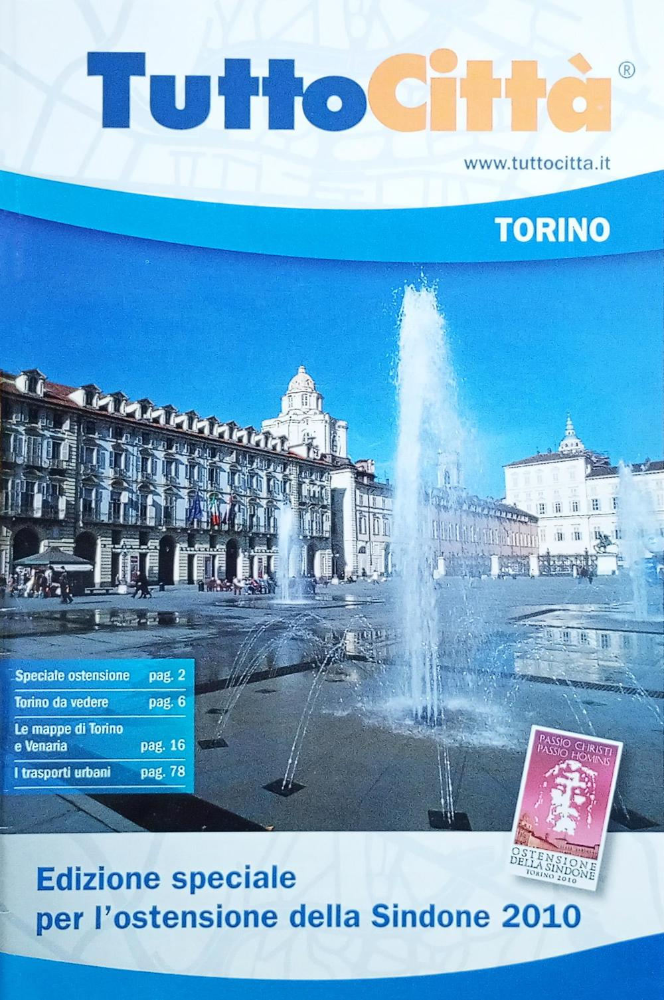</a>
Torino 2010
<ul class="scheda"><li><b>Formato:</b> 140 x 212 mm</li><li><b>Copertina:</b> grossa</li><li><b>Layout:</b> TuttoCittà anni dieci</li><li><b>Pagine:</b> 104</li><li><b>Mese aggiornamento:</b> marzo 2010</li><li><b>Note:</b> edizione speciale ostensione della Sindone</li></ul></td></tr>
</tbody>
</table>

## I dati

- [`piemonte_fascicoli.csv`](../dati/piemonte_fascicoli.csv) — un fascicolo per riga: foliazione, layout, formato, copertina, presenza in raccolta e certezza dell'esistenza
- [`piemonte_cartografia.csv`](../dati/piemonte_cartografia.csv) — un comune per riga e per annata, con la provincia e se compariva nell'elenco delle vie
- [`piemonte_articoli.csv`](../dati/piemonte_articoli.csv) — un titolo per riga: l'indice delle rubriche provinciali

Chi possiede i fascicoli mancanti e vuole vedere questa pagina completata troverà in [questa pagina](come-contribuire.md) come contribuire. Chi possiede uno dei fascicoli di esistenza dubbia, o ne ricorda la distribuzione, aiuterebbe a chiudere una questione diversa e più difficile: se quei fascicoli siano mai stati pubblicati.
