# La Puglia in dettaglio

<em><strong>NOTA: questa pagina è incompleta.</strong> Alla raccolta mancano 51 dei 112 fascicoli accertati della regione — <strong>Brindisi - Lecce, annate 81/82–85/86; Foggia, annate 81/82, 82/83, 84/85, 85/86, 90/91, 95/96 e 96/97; Taranto, annate 81/82, 84/85, 85/86, 94/95 e 95/96; Lecce, annate 92/93, 94/95–96/97 e 98/99–14/15; Bari, annate 95/96, 98/99, 00/01–05/06 e 07/08; Brindisi, annate 95/96 e 96/97; Bari - Barletta Andria Trani, annate 13/14 e 14/15</strong> — e i dati che dipendono dall'esame diretto dell'esemplare sono segnati</em> in sospeso<em>. Le copertine non reperite sono sostituite da un segnaposto; nella griglia dei comuni le annate scoperte portano una croce e non una casella vuota, per non confonderle con la reale assenza del corrispondente comune in cartografia. Per la stessa ragione questa pagina non è annunciata altrove nel sito e per il momento vi si arriva soltanto per indirizzo diretto.</em>

Questa pagina si occupa di definire con estrema precisione l'organizzazione interna dei fascicoli dell'intera regione Puglia.

Il censimento registra un totale di 112 fascicoli e 52 comuni cartografati.

<figure class="figura">
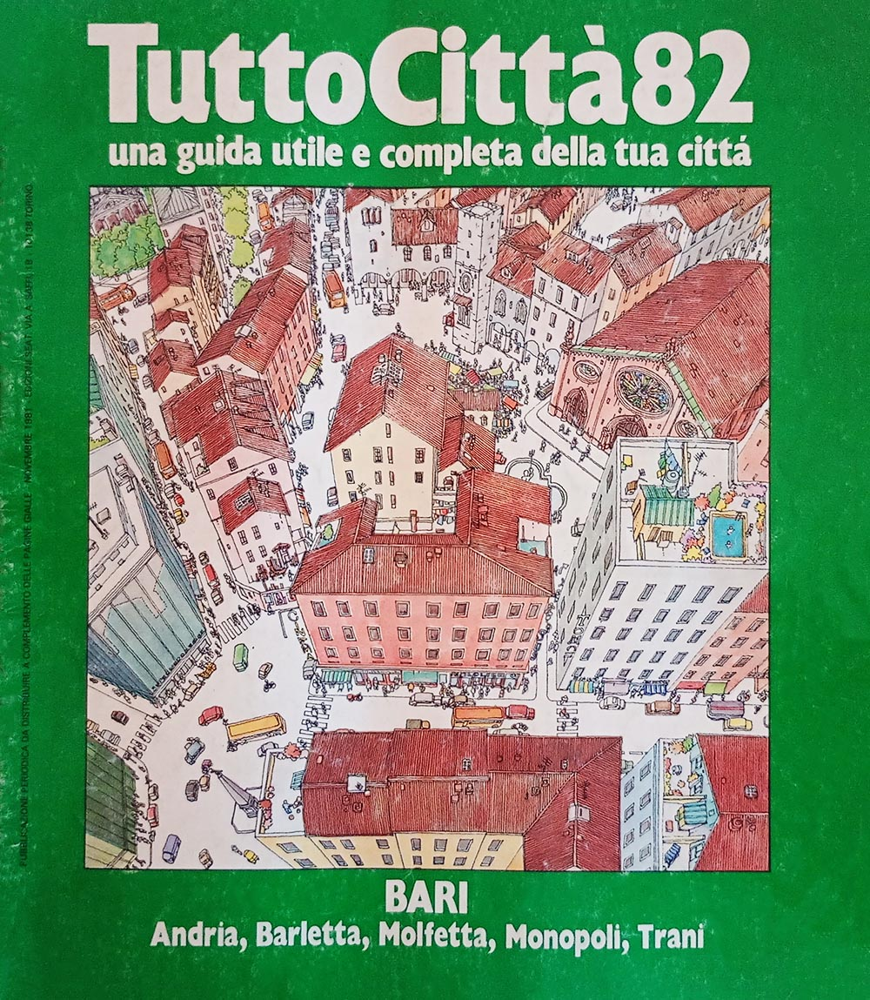
<figcaption>Copertina del fascicolo Bari 82</figcaption>
</figure>

In questa pagina

[TOC]

## Tabella dei fascicoli

I fascicoli della Puglia appartenevano alla serie tardiva: il primo fascicolo, edito a novembre 1981, era infatti intitolato TuttoCittà 82. La Puglia è anche una delle prime regioni a vedere la riforma editoriale a cavallo fra gli anni '80 e '90, nonché una delle sole quattro regioni ad essere interessata da questa riforma già dall'annata 1989/90.

Alla fine degli anni '90 la pubblicazione dei fascicoli cessò per le province di Brindisi, Foggia e Taranto, mentre per Bari e Lecce la linea proseguì fino al 2014.

La seguente tabella censisce i dati fondamentali dei fascicoli della Puglia, mostrandone le copertine e indicandone il formato, il layout così come definito in [questa pagina](tabella-layout.md), e il numero totale di pagine, anno per anno.

<table class="fascicoli-dettaglio">
<thead><tr><th>Annata</th><th>Colore tavole</th><th colspan="5">Copertine</th></tr></thead>
<tbody>
<tr><td class="ann"> 81/82</td><td class="tav"></td><td class="fasc">
Bari 82
<ul class="scheda"><li><b>Formato:</b> 246 x 280 mm</li><li><b>Copertina:</b> grossa</li><li><b>Layout:</b> TuttoCittà '80 classico</li><li><b>Pagine:</b> 64</li><li><b>Mese aggiornamento:</b> novembre 1981</li><li><b>Note:</b> Nota dell'editore</li></ul></td><td class="fasc sospesa">
Brindisi - Lecce 82
<ul class="scheda"><li><b>Formato:</b> 246 x 280 mm</li><li><b>Copertina:</b> grossa</li><li><b>Layout:</b> TuttoCittà '80 classico</li><li><b>Note:</b> Nota dell'editore</li><li>non in raccolta</li></ul></td><td class="fasc vuota"></td><td class="fasc sospesa">
Foggia 82
<ul class="scheda"><li><b>Formato:</b> 246 x 280 mm</li><li><b>Copertina:</b> grossa</li><li><b>Layout:</b> TuttoCittà '80 classico</li><li><b>Note:</b> Nota dell'editore</li><li>non in raccolta</li></ul></td><td class="fasc sospesa">
Taranto 82
<ul class="scheda"><li><b>Formato:</b> 246 x 280 mm</li><li><b>Copertina:</b> grossa</li><li><b>Layout:</b> TuttoCittà '80 classico</li><li><b>Note:</b> Nota dell'editore</li><li>non in raccolta</li></ul></td></tr>
<tr><td class="ann"> 82/83</td><td class="tav"></td><td class="fasc"><a href="../immagini/BA83.jpg">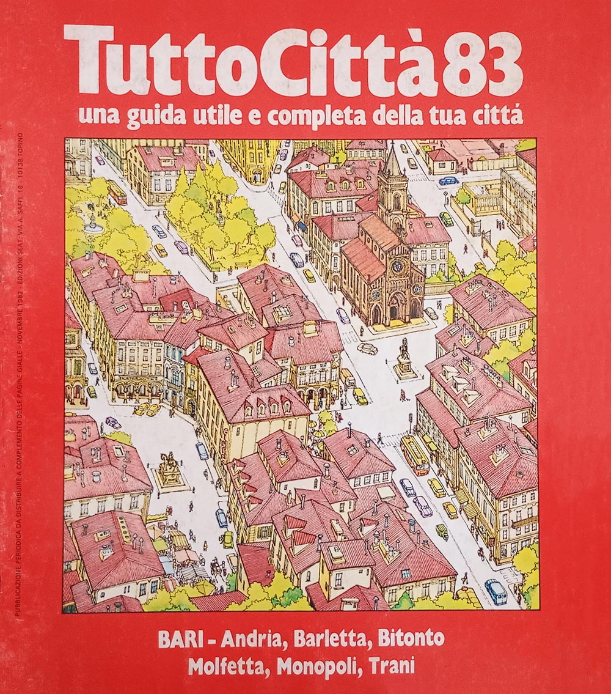</a>
Bari 83
<ul class="scheda"><li><b>Formato:</b> 246 x 280 mm</li><li><b>Copertina:</b> grossa</li><li><b>Layout:</b> TuttoCittà '80 classico</li><li><b>Pagine:</b> 64</li><li><b>Mese aggiornamento:</b> novembre 1982</li></ul></td><td class="fasc sospesa">
Brindisi - Lecce 83
<ul class="scheda"><li><b>Formato:</b> 246 x 280 mm</li><li><b>Copertina:</b> grossa</li><li><b>Layout:</b> TuttoCittà '80 classico</li><li>non in raccolta</li></ul></td><td class="fasc vuota"></td><td class="fasc sospesa">
Foggia 83
<ul class="scheda"><li><b>Formato:</b> 246 x 280 mm</li><li><b>Copertina:</b> grossa</li><li><b>Layout:</b> TuttoCittà '80 classico</li><li>non in raccolta</li></ul></td><td class="fasc"><a href="../immagini/TA83.jpg">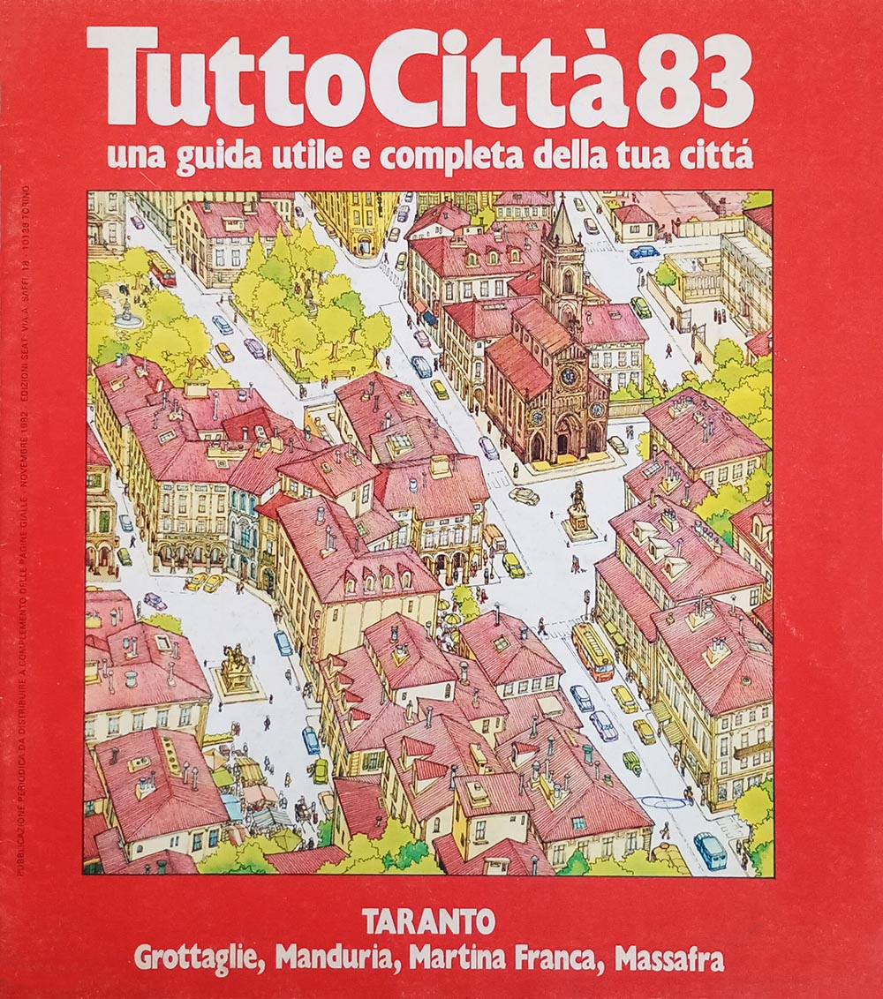</a>
Taranto 83
<ul class="scheda"><li><b>Formato:</b> 246 x 280 mm</li><li><b>Copertina:</b> grossa</li><li><b>Layout:</b> TuttoCittà '80 classico</li><li><b>Pagine:</b> 24</li><li><b>Mese aggiornamento:</b> novembre 1982</li></ul></td></tr>
<tr><td class="ann"> 83/84</td><td class="tav"></td><td class="fasc"><a href="../immagini/BA84.jpg">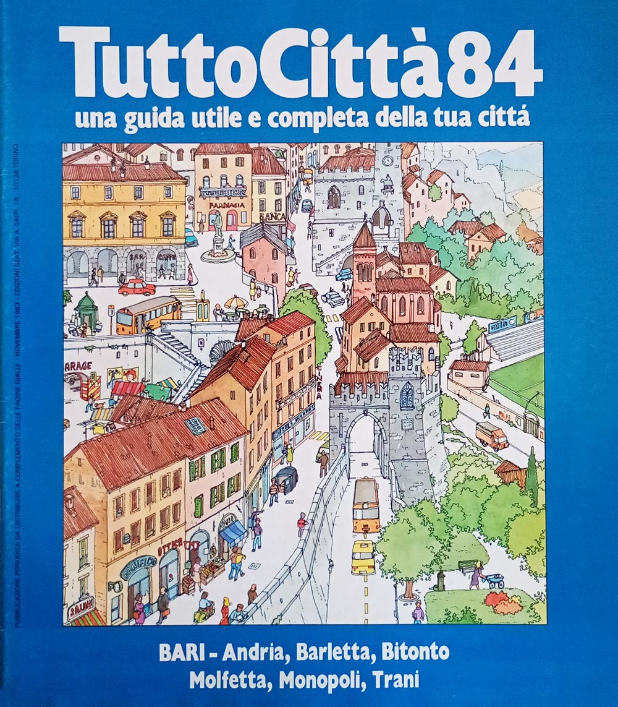</a>
Bari 84
<ul class="scheda"><li><b>Formato:</b> 246 x 280 mm</li><li><b>Copertina:</b> grossa</li><li><b>Layout:</b> TuttoCittà '80 classico</li><li><b>Pagine:</b> 64</li><li><b>Mese aggiornamento:</b> novembre 1983</li></ul></td><td class="fasc sospesa">
Brindisi - Lecce 84
<ul class="scheda"><li><b>Formato:</b> 246 x 280 mm</li><li><b>Copertina:</b> grossa</li><li><b>Layout:</b> TuttoCittà '80 classico</li><li>non in raccolta</li></ul></td><td class="fasc vuota"></td><td class="fasc"><a href="../immagini/FG84.jpg">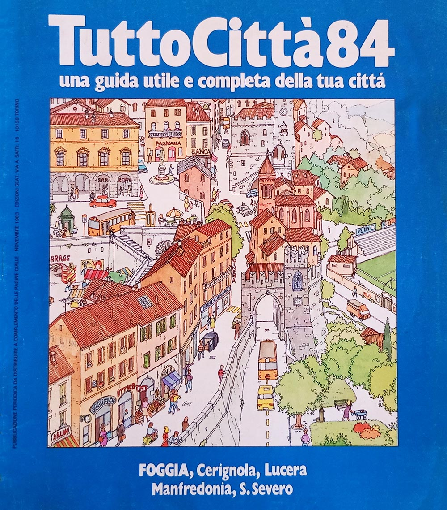</a>
Foggia 84
<ul class="scheda"><li><b>Formato:</b> 246 x 280 mm</li><li><b>Copertina:</b> grossa</li><li><b>Layout:</b> TuttoCittà '80 classico</li><li><b>Pagine:</b> 24</li><li><b>Mese aggiornamento:</b> novembre 1983</li></ul></td><td class="fasc"><a href="../immagini/TA84.jpg">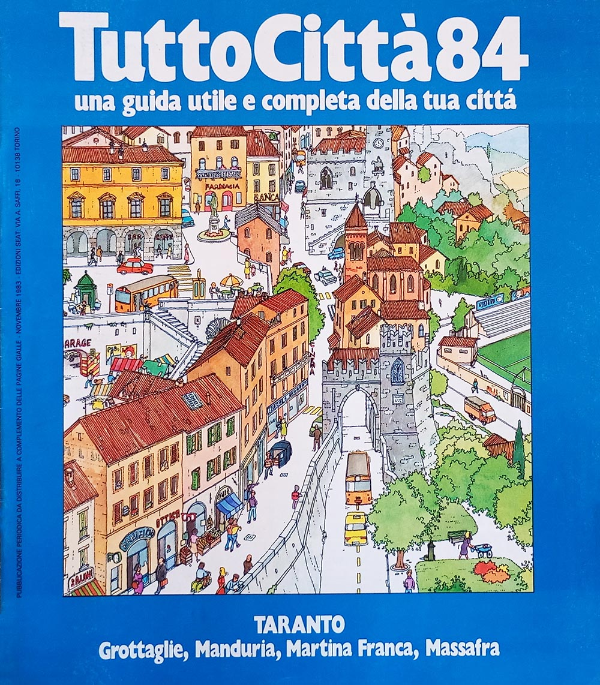</a>
Taranto 84
<ul class="scheda"><li><b>Formato:</b> 246 x 280 mm</li><li><b>Copertina:</b> grossa</li><li><b>Layout:</b> TuttoCittà '80 classico</li><li><b>Pagine:</b> 24</li><li><b>Mese aggiornamento:</b> novembre 1983</li></ul></td></tr>
<tr><td class="ann"> 84/85</td><td class="tav"></td><td class="fasc"><a href="../immagini/BA85.jpg">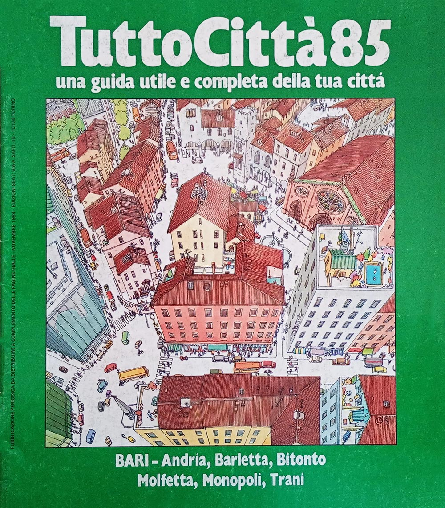</a>
Bari 85
<ul class="scheda"><li><b>Formato:</b> 246 x 280 mm</li><li><b>Copertina:</b> grossa</li><li><b>Layout:</b> TuttoCittà '80 classico</li><li><b>Pagine:</b> 64</li><li><b>Mese aggiornamento:</b> novembre 1984</li><li><b>Note:</b> Inserto Costituzione</li></ul></td><td class="fasc sospesa">
Brindisi - Lecce 85
<ul class="scheda"><li><b>Formato:</b> 246 x 280 mm</li><li><b>Copertina:</b> grossa</li><li><b>Layout:</b> TuttoCittà '80 classico</li><li><b>Note:</b> Inserto Costituzione</li><li>non in raccolta</li></ul></td><td class="fasc vuota"></td><td class="fasc sospesa">
Foggia 85
<ul class="scheda"><li><b>Formato:</b> 246 x 280 mm</li><li><b>Copertina:</b> grossa</li><li><b>Layout:</b> TuttoCittà '80 classico</li><li><b>Note:</b> Inserto Costituzione</li><li>non in raccolta</li></ul></td><td class="fasc sospesa">
Taranto 85
<ul class="scheda"><li><b>Formato:</b> 246 x 280 mm</li><li><b>Copertina:</b> grossa</li><li><b>Layout:</b> TuttoCittà '80 classico</li><li><b>Note:</b> Inserto Costituzione</li><li>non in raccolta</li></ul></td></tr>
<tr><td class="ann"> 85/86</td><td class="tav"></td><td class="fasc"><a href="../immagini/BA86.jpg">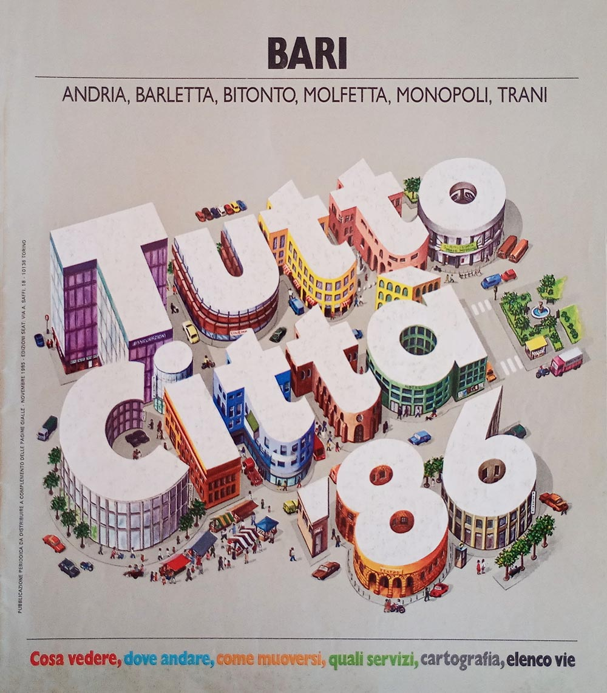</a>
Bari 86
<ul class="scheda"><li><b>Formato:</b> 246 x 280 mm</li><li><b>Copertina:</b> grossa</li><li><b>Layout:</b> TuttoCittà '80 edifici</li><li><b>Pagine:</b> 64</li><li><b>Mese aggiornamento:</b> novembre 1985</li></ul></td><td class="fasc sospesa">
Brindisi - Lecce 86
<ul class="scheda"><li><b>Formato:</b> 246 x 280 mm</li><li><b>Copertina:</b> grossa</li><li><b>Layout:</b> TuttoCittà '80 edifici</li><li>non in raccolta</li></ul></td><td class="fasc vuota"></td><td class="fasc sospesa">
Foggia 86
<ul class="scheda"><li><b>Formato:</b> 246 x 280 mm</li><li><b>Copertina:</b> grossa</li><li><b>Layout:</b> TuttoCittà '80 edifici</li><li>non in raccolta</li></ul></td><td class="fasc sospesa">
Taranto 86
<ul class="scheda"><li><b>Formato:</b> 246 x 280 mm</li><li><b>Copertina:</b> grossa</li><li><b>Layout:</b> TuttoCittà '80 edifici</li><li>non in raccolta</li></ul></td></tr>
<tr><td class="ann"> 86/87</td><td class="tav"></td><td class="fasc"><a href="../immagini/BA87.jpg">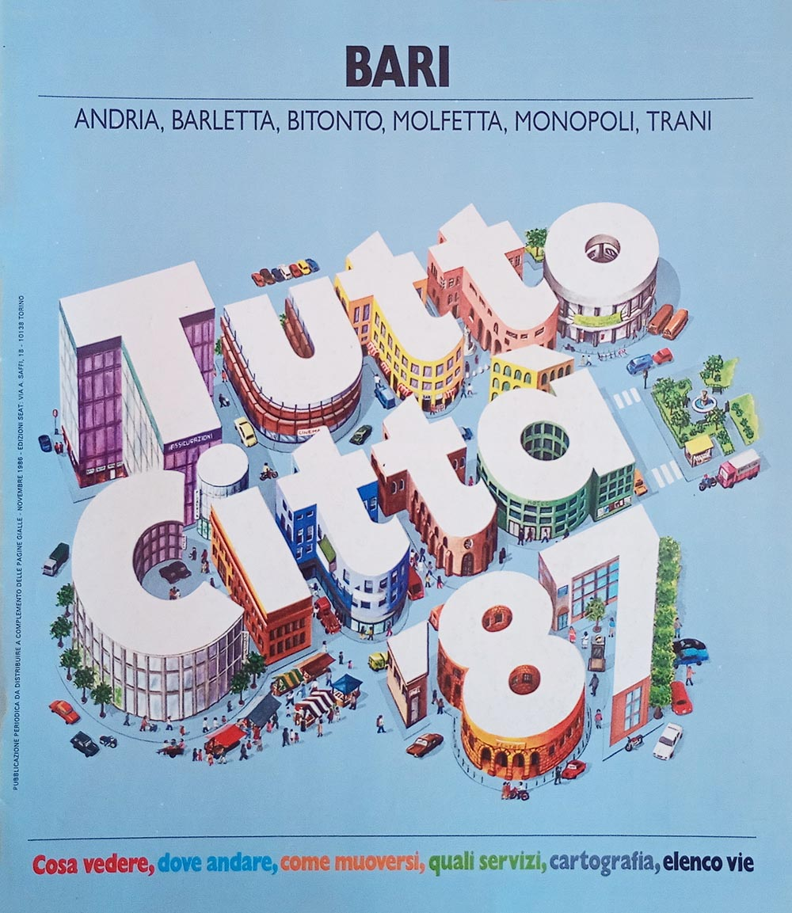</a>
Bari 87
<ul class="scheda"><li><b>Formato:</b> 246 x 280 mm</li><li><b>Copertina:</b> grossa</li><li><b>Layout:</b> TuttoCittà '80 edifici</li><li><b>Pagine:</b> 64</li><li><b>Mese aggiornamento:</b> novembre 1986</li></ul></td><td class="fasc"><a href="../immagini/BRLE87.jpg">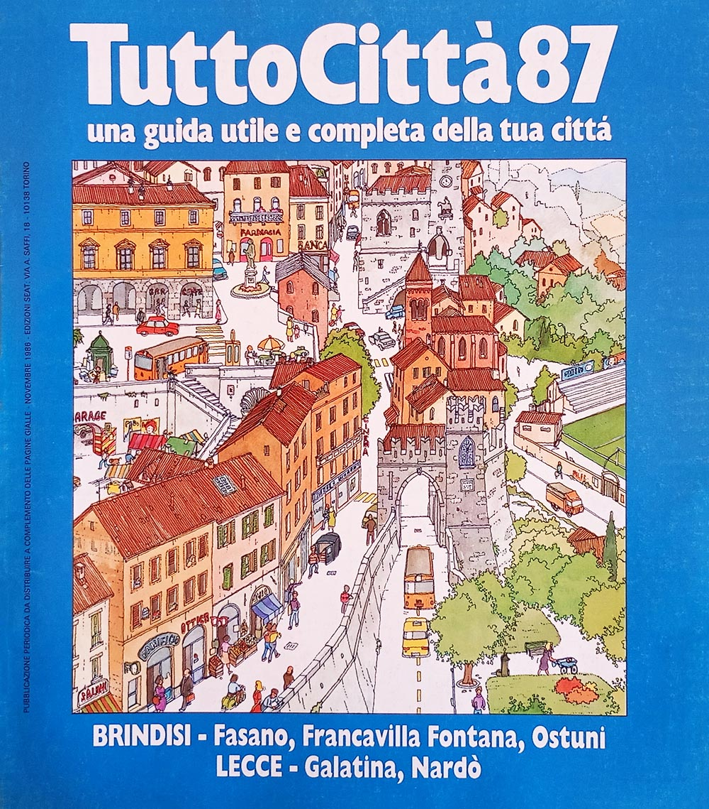</a>
Brindisi - Lecce 87
<ul class="scheda"><li><b>Formato:</b> 246 x 280 mm</li><li><b>Copertina:</b> grossa</li><li><b>Layout:</b> TuttoCittà '80 edifici</li><li><b>Pagine:</b> 40</li><li><b>Mese aggiornamento:</b> novembre 1986</li></ul></td><td class="fasc vuota"></td><td class="fasc"><a href="../immagini/FG87.jpg">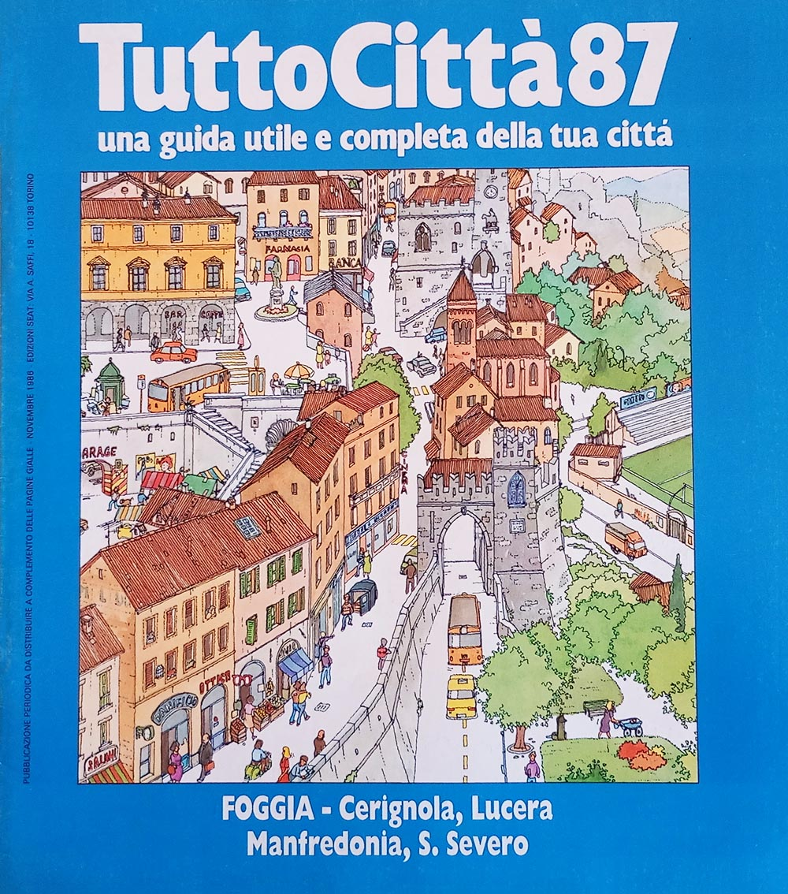</a>
Foggia 87
<ul class="scheda"><li><b>Formato:</b> 246 x 280 mm</li><li><b>Copertina:</b> grossa</li><li><b>Layout:</b> TuttoCittà '80 edifici</li><li><b>Pagine:</b> 24</li><li><b>Mese aggiornamento:</b> novembre 1986</li></ul></td><td class="fasc"><a href="../immagini/TA87.jpg">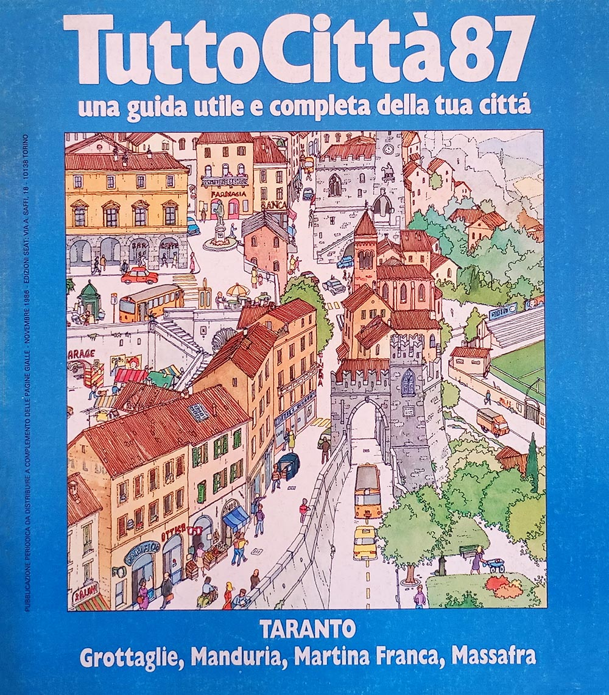</a>
Taranto 87
<ul class="scheda"><li><b>Formato:</b> 246 x 280 mm</li><li><b>Copertina:</b> grossa</li><li><b>Layout:</b> TuttoCittà '80 edifici</li><li><b>Pagine:</b> 24</li><li><b>Mese aggiornamento:</b> novembre 1986</li></ul></td></tr>
<tr><td class="ann"> 87/88</td><td class="tav"></td><td class="fasc"><a href="../immagini/BA88.jpg">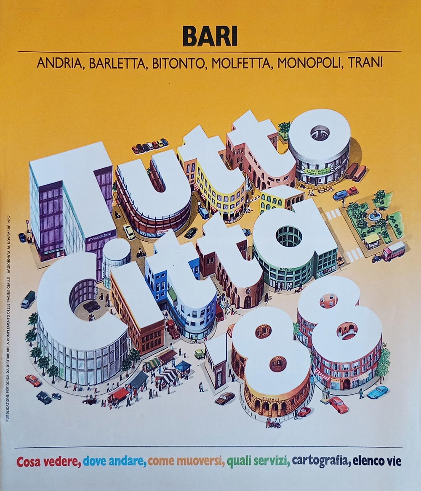</a>
Bari 88
<ul class="scheda"><li><b>Formato:</b> 246 x 280 mm</li><li><b>Copertina:</b> grossa</li><li><b>Layout:</b> TuttoCittà '80 edifici</li><li><b>Pagine:</b> 64</li><li><b>Mese aggiornamento:</b> novembre 1987</li></ul></td><td class="fasc"><a href="../immagini/BRLE88.jpg">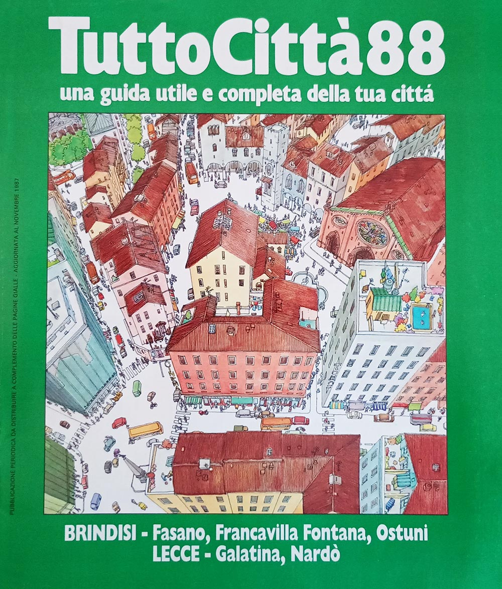</a>
Brindisi - Lecce 88
<ul class="scheda"><li><b>Formato:</b> 246 x 280 mm</li><li><b>Copertina:</b> grossa</li><li><b>Layout:</b> TuttoCittà '80 classico</li><li><b>Pagine:</b> 40</li><li><b>Mese aggiornamento:</b> novembre 1987</li></ul></td><td class="fasc vuota"></td><td class="fasc"><a href="../immagini/FG88.jpg">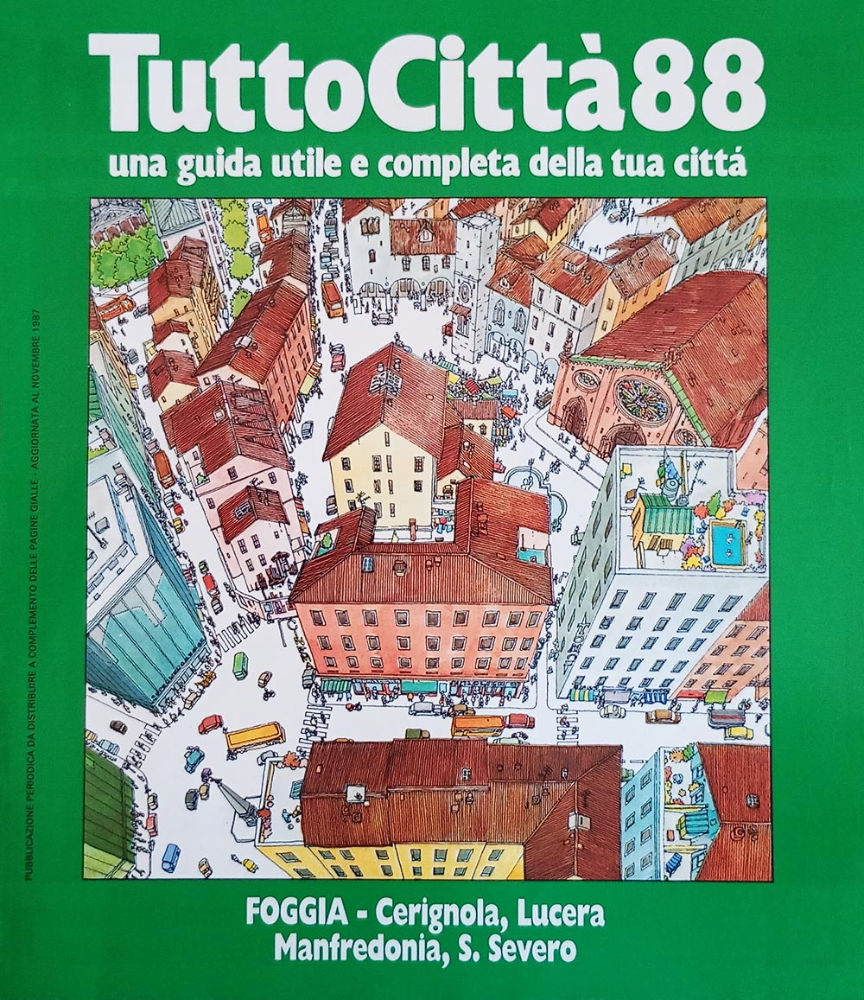</a>
Foggia 88
<ul class="scheda"><li><b>Formato:</b> 246 x 280 mm</li><li><b>Copertina:</b> grossa</li><li><b>Layout:</b> TuttoCittà '80 classico</li><li><b>Pagine:</b> 16</li><li><b>Mese aggiornamento:</b> novembre 1987</li></ul></td><td class="fasc"><a href="../immagini/TA88.jpg">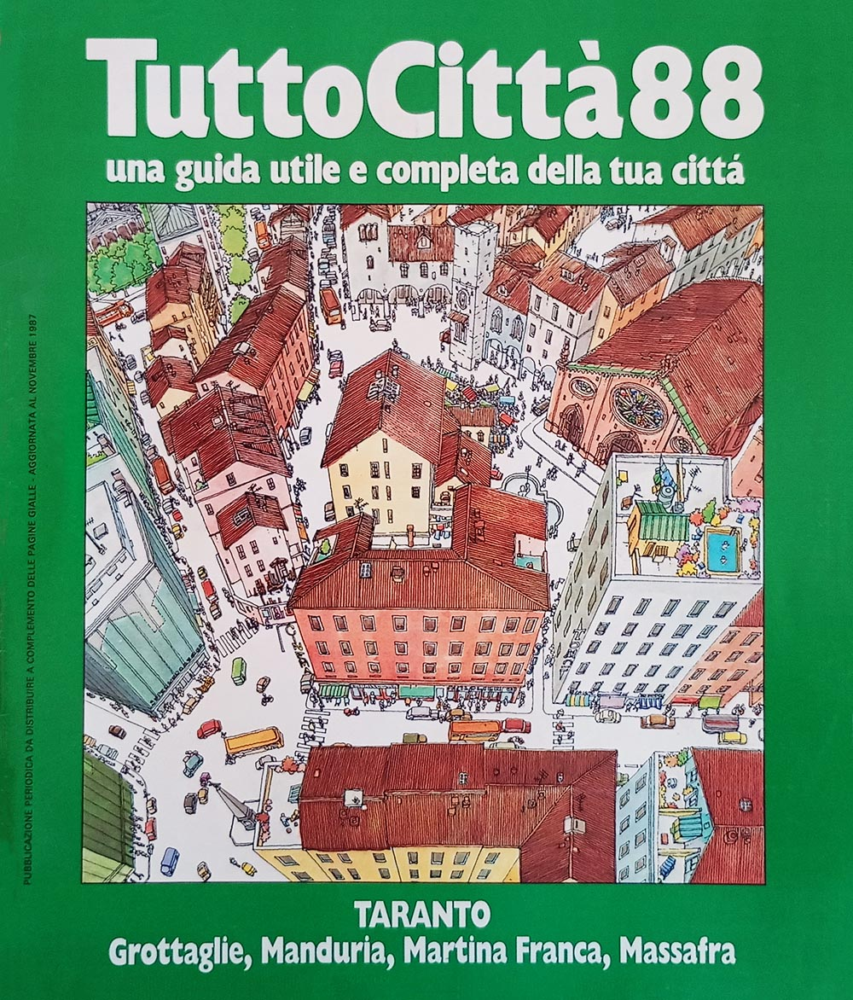</a>
Taranto 88
<ul class="scheda"><li><b>Formato:</b> 246 x 280 mm</li><li><b>Copertina:</b> grossa</li><li><b>Layout:</b> TuttoCittà '80 classico</li><li><b>Pagine:</b> 24</li><li><b>Mese aggiornamento:</b> novembre 1987</li></ul></td></tr>
<tr><td class="ann"> 88/89</td><td class="tav"></td><td class="fasc"><a href="../immagini/BA89.jpg">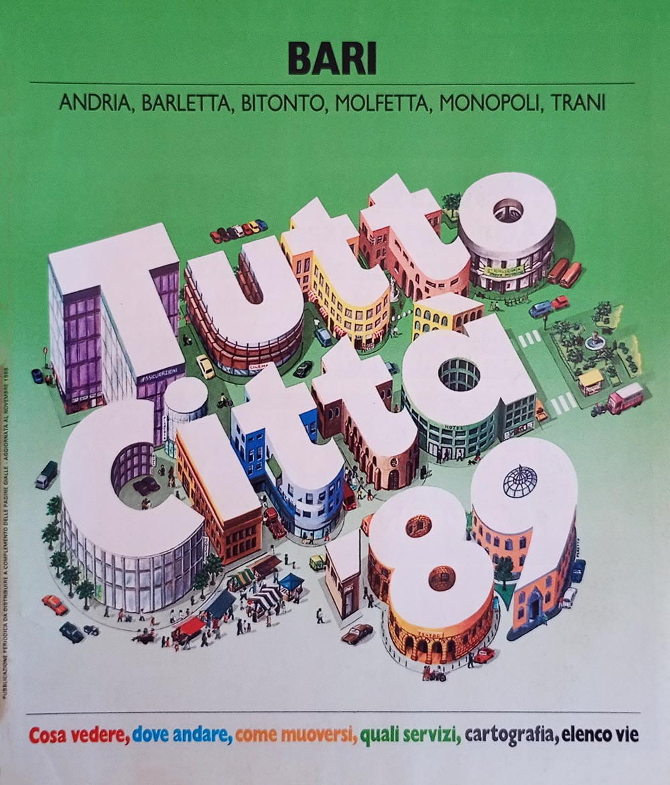</a>
Bari 89
<ul class="scheda"><li><b>Formato:</b> 246 x 280 mm</li><li><b>Copertina:</b> grossa</li><li><b>Layout:</b> TuttoCittà '80 edifici</li><li><b>Pagine:</b> 64</li><li><b>Mese aggiornamento:</b> novembre 1988</li></ul></td><td class="fasc"><a href="../immagini/BR89.jpg">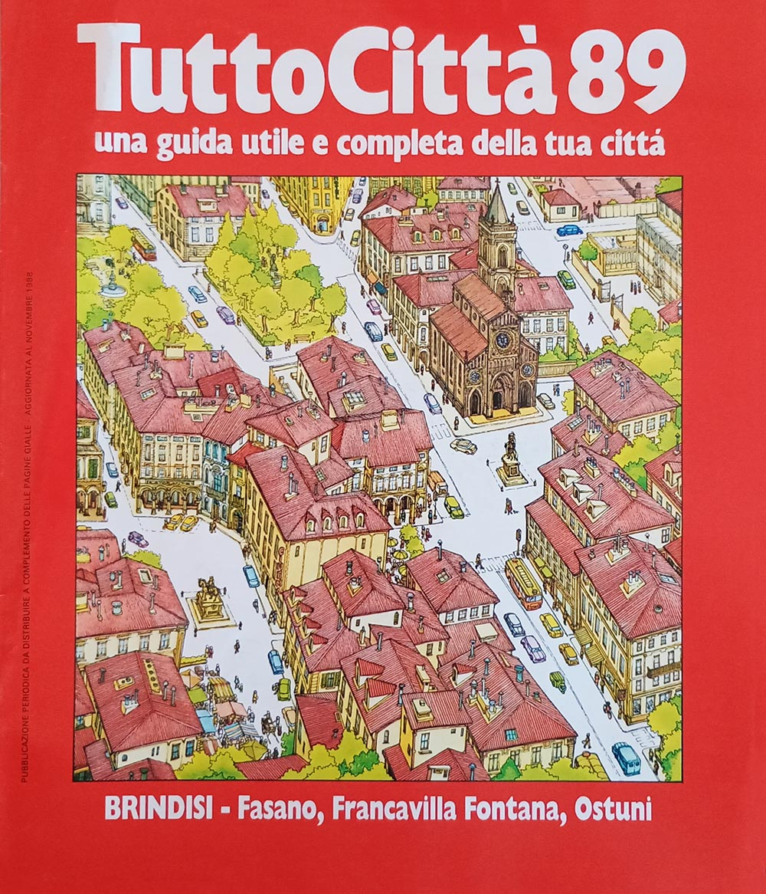</a>
Brindisi 89
<ul class="scheda"><li><b>Formato:</b> 246 x 280 mm</li><li><b>Copertina:</b> grossa</li><li><b>Layout:</b> TuttoCittà '80 classico</li><li><b>Pagine:</b> 24</li><li><b>Mese aggiornamento:</b> novembre 1988</li></ul></td><td class="fasc"><a href="../immagini/LE89.jpg">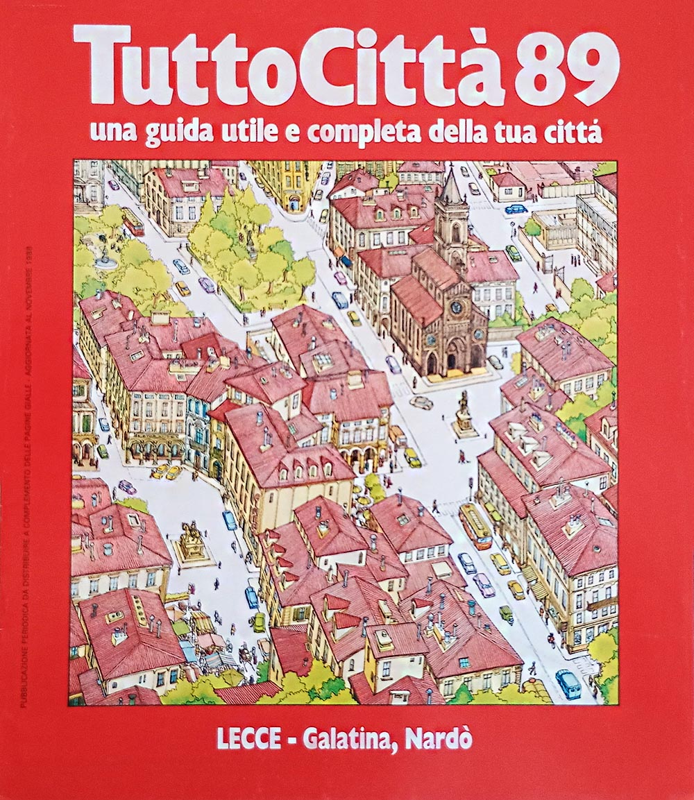</a>
Lecce 89
<ul class="scheda"><li><b>Formato:</b> 246 x 280 mm</li><li><b>Copertina:</b> grossa</li><li><b>Layout:</b> TuttoCittà '80 classico</li><li><b>Pagine:</b> 24</li><li><b>Mese aggiornamento:</b> novembre 1988</li></ul></td><td class="fasc"><a href="../immagini/FG89.jpg">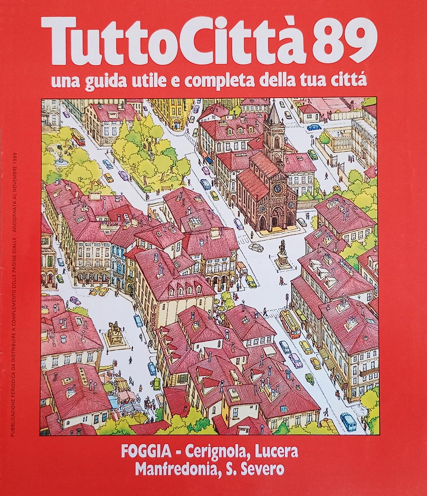</a>
Foggia 89
<ul class="scheda"><li><b>Formato:</b> 246 x 280 mm</li><li><b>Copertina:</b> grossa</li><li><b>Layout:</b> TuttoCittà '80 classico</li><li><b>Pagine:</b> 16</li><li><b>Mese aggiornamento:</b> novembre 1988</li></ul></td><td class="fasc"><a href="../immagini/TA89.jpg">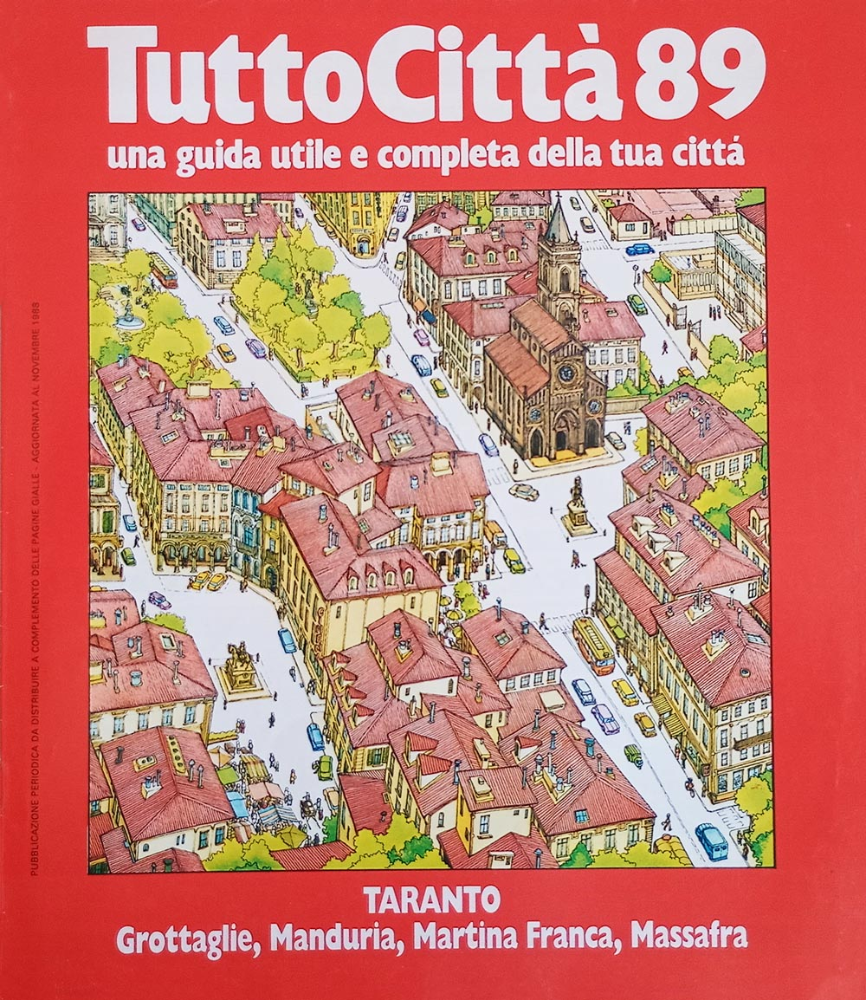</a>
Taranto 89
<ul class="scheda"><li><b>Formato:</b> 246 x 280 mm</li><li><b>Copertina:</b> grossa</li><li><b>Layout:</b> TuttoCittà '80 classico</li><li><b>Pagine:</b> 24</li><li><b>Mese aggiornamento:</b> novembre 1988</li></ul></td></tr>
<tr><td class="ann"> 89/90</td><td class="tav"></td><td class="fasc"><a href="../immagini/BA90.jpg">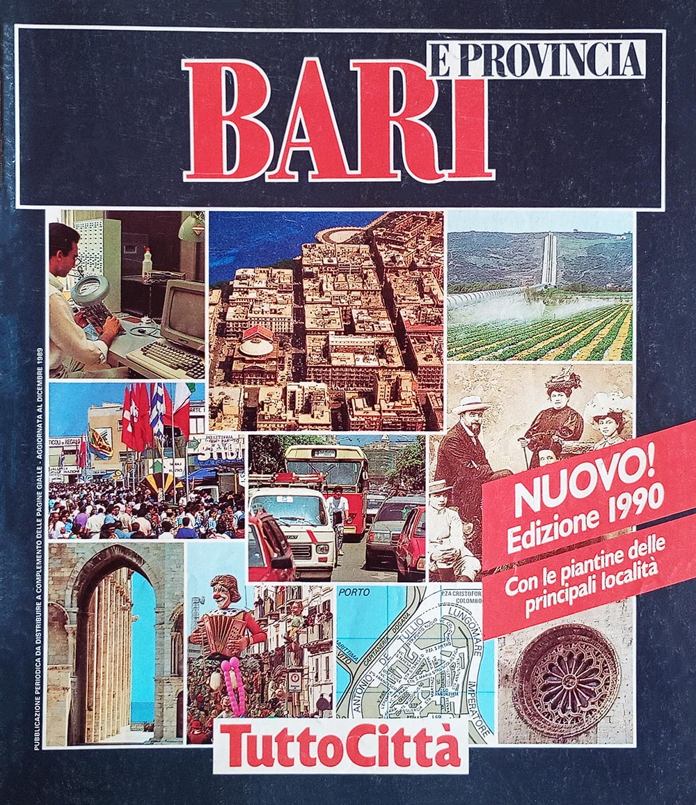</a>
Bari 90
<ul class="scheda"><li><b>Formato:</b> 246 x 280 mm</li><li><b>Copertina:</b> grossa</li><li><b>Layout:</b> TuttoCittà '90 classico iniziale</li><li><b>Pagine:</b> 64</li><li><b>Mese aggiornamento:</b> dicembre 1989</li><li><b>Note:</b> nota dell'editore</li></ul></td><td class="fasc"><a href="../immagini/BR90.jpg">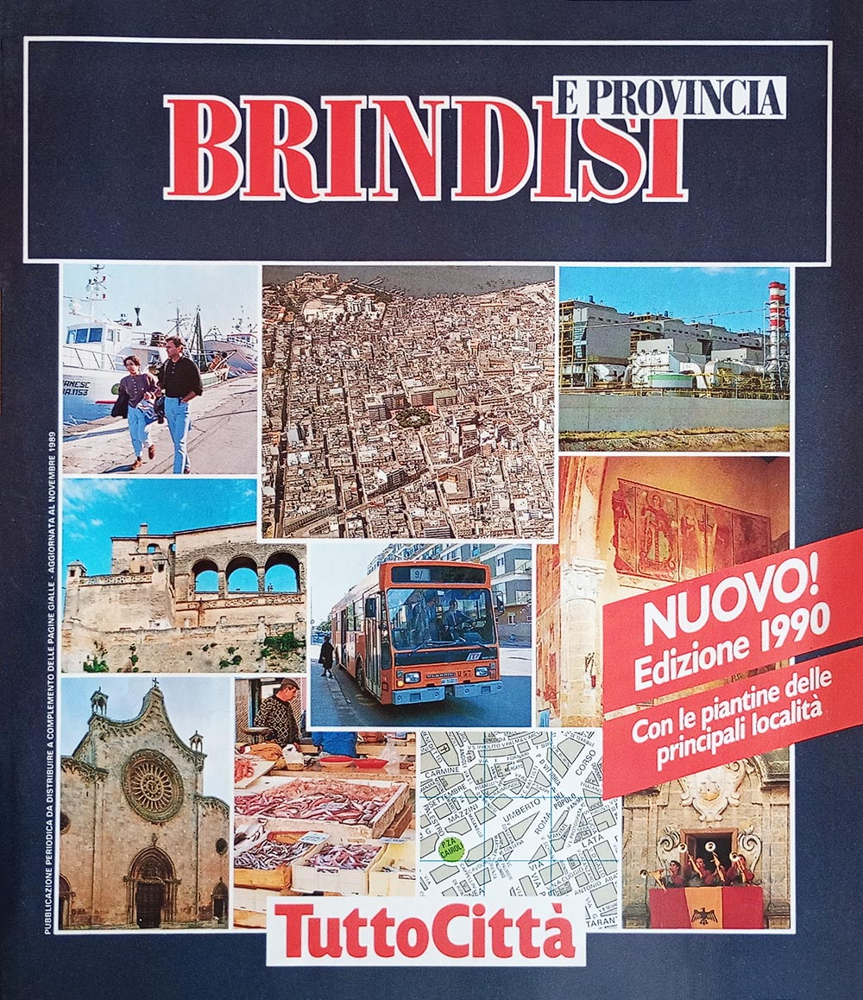</a>
Brindisi 90
<ul class="scheda"><li><b>Formato:</b> 246 x 280 mm</li><li><b>Copertina:</b> grossa</li><li><b>Layout:</b> TuttoCittà '90 classico iniziale</li><li><b>Pagine:</b> 24</li><li><b>Mese aggiornamento:</b> novembre 1989</li><li><b>Note:</b> nota dell'editore</li></ul></td><td class="fasc">
Lecce 90
<ul class="scheda"><li><b>Formato:</b> 246 x 280 mm</li><li><b>Copertina:</b> grossa</li><li><b>Layout:</b> TuttoCittà '90 classico iniziale</li><li><b>Pagine:</b> 32</li><li><b>Mese aggiornamento:</b> novembre 1989</li><li><b>Note:</b> nota dell'editore</li></ul></td><td class="fasc"><a href="../immagini/FG90.jpg">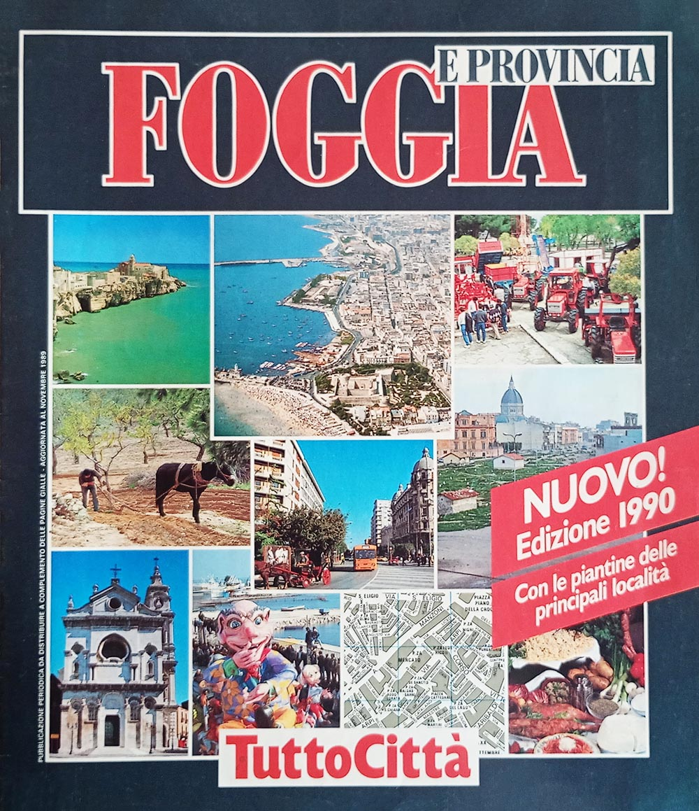</a>
Foggia 90
<ul class="scheda"><li><b>Formato:</b> 246 x 280 mm</li><li><b>Copertina:</b> grossa</li><li><b>Layout:</b> TuttoCittà '90 classico iniziale</li><li><b>Pagine:</b> 24</li><li><b>Mese aggiornamento:</b> novembre 1989</li><li><b>Note:</b> nota dell'editore</li></ul></td><td class="fasc"><a href="../immagini/TA90.jpg">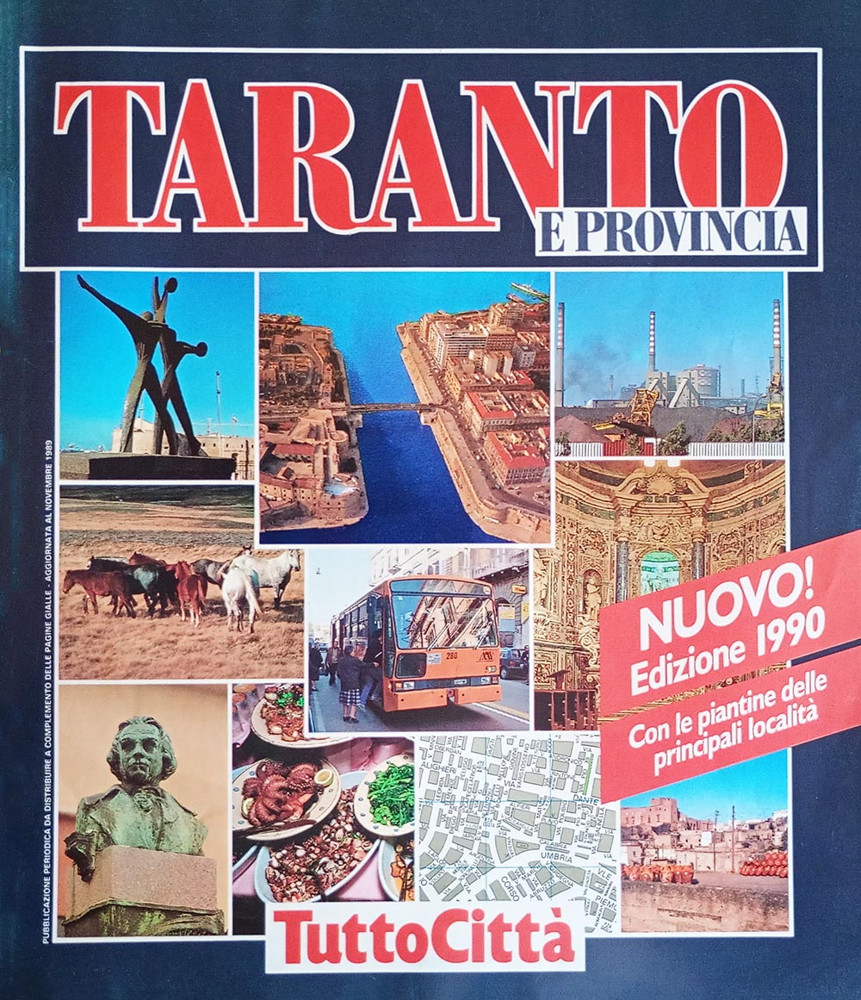</a>
Taranto 90
<ul class="scheda"><li><b>Formato:</b> 246 x 280 mm</li><li><b>Copertina:</b> grossa</li><li><b>Layout:</b> TuttoCittà '90 classico iniziale</li><li><b>Pagine:</b> 24</li><li><b>Mese aggiornamento:</b> novembre 1989</li><li><b>Note:</b> nota dell'editore</li></ul></td></tr>
<tr><td class="ann"> 90/91</td><td class="tav"></td><td class="fasc"><a href="../immagini/BA91.jpg">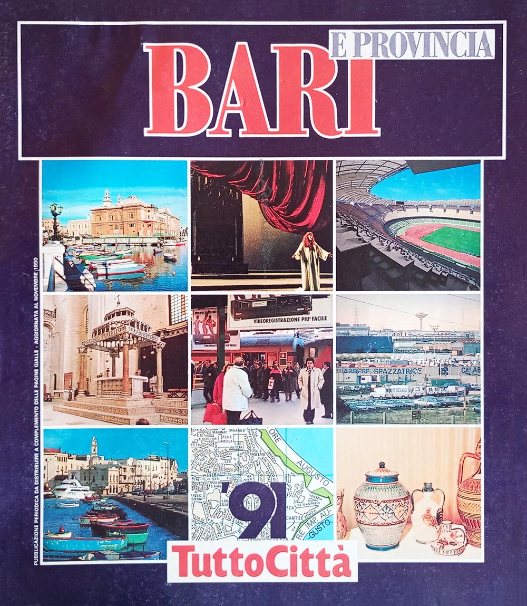</a>
Bari 91
<ul class="scheda"><li><b>Formato:</b> 246 x 280 mm</li><li><b>Copertina:</b> grossa</li><li><b>Layout:</b> TuttoCittà '90 classico iniziale</li><li><b>Pagine:</b> 72</li><li><b>Mese aggiornamento:</b> dicembre 1990</li></ul></td><td class="fasc"><a href="../immagini/BR91.jpg">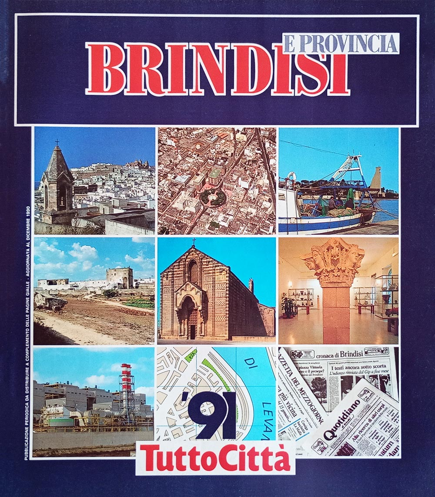</a>
Brindisi 91
<ul class="scheda"><li><b>Formato:</b> 246 x 280 mm</li><li><b>Copertina:</b> grossa</li><li><b>Layout:</b> TuttoCittà '90 classico iniziale</li><li><b>Pagine:</b> 24</li><li><b>Mese aggiornamento:</b> novembre 1990</li></ul></td><td class="fasc"><a href="../immagini/LE91.jpg">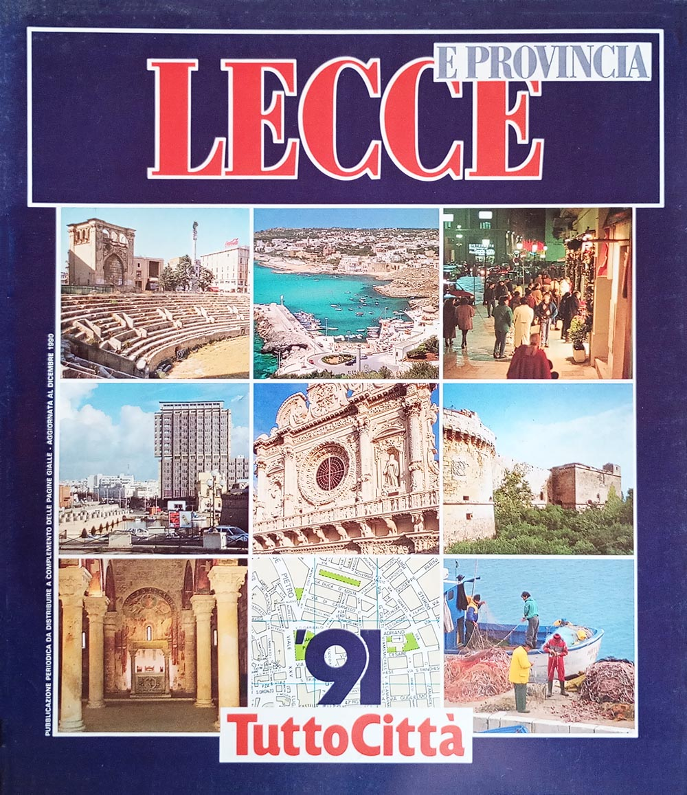</a>
Lecce 91
<ul class="scheda"><li><b>Formato:</b> 246 x 280 mm</li><li><b>Copertina:</b> grossa</li><li><b>Layout:</b> TuttoCittà '90 classico iniziale</li><li><b>Pagine:</b> 40</li><li><b>Mese aggiornamento:</b> novembre 1990</li></ul></td><td class="fasc sospesa">
Foggia 91
<ul class="scheda"><li><b>Formato:</b> 246 x 280 mm</li><li><b>Copertina:</b> grossa</li><li><b>Layout:</b> TuttoCittà '90 classico iniziale</li><li>non in raccolta</li></ul></td><td class="fasc"><a href="../immagini/TA91.jpg">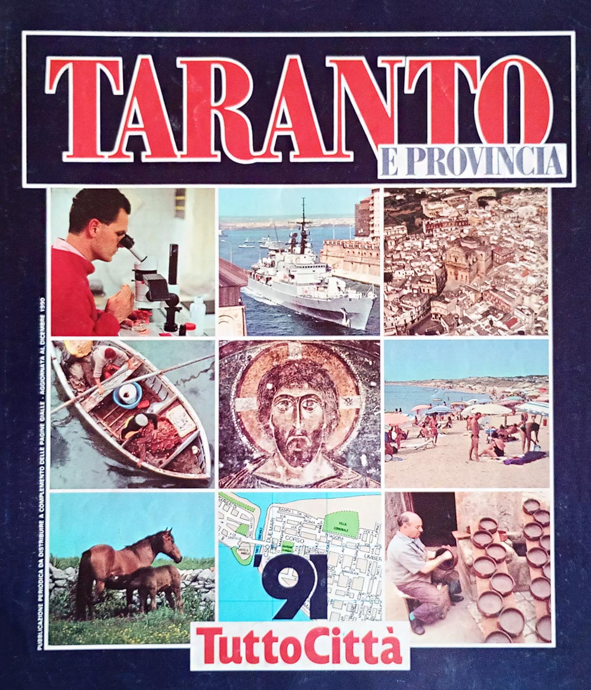</a>
Taranto 91
<ul class="scheda"><li><b>Formato:</b> 246 x 280 mm</li><li><b>Copertina:</b> grossa</li><li><b>Layout:</b> TuttoCittà '90 classico iniziale</li><li><b>Pagine:</b> 32</li><li><b>Mese aggiornamento:</b> dicembre 1990</li></ul></td></tr>
<tr><td class="ann"> 91/92</td><td class="tav"></td><td class="fasc"><a href="../immagini/BA92.jpg">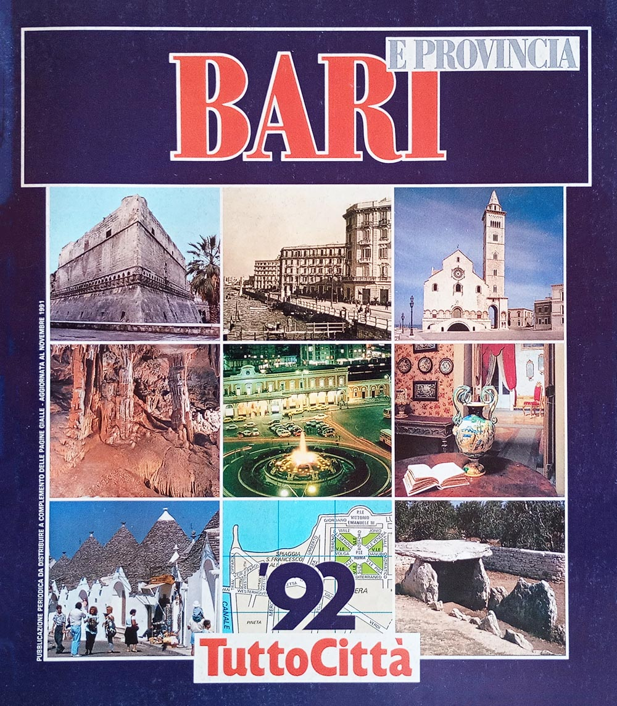</a>
Bari 92
<ul class="scheda"><li><b>Formato:</b> 246 x 280 mm</li><li><b>Copertina:</b> grossa</li><li><b>Layout:</b> TuttoCittà '90 classico iniziale</li><li><b>Pagine:</b> 72</li><li><b>Mese aggiornamento:</b> novembre 1991</li></ul></td><td class="fasc"><a href="../immagini/BR92.jpg">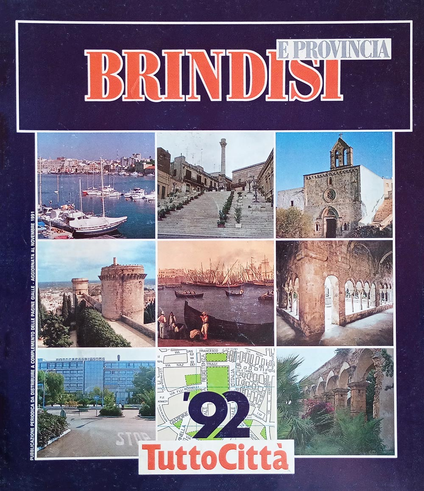</a>
Brindisi 92
<ul class="scheda"><li><b>Formato:</b> 246 x 280 mm</li><li><b>Copertina:</b> grossa</li><li><b>Layout:</b> TuttoCittà '90 classico iniziale</li><li><b>Pagine:</b> 24</li><li><b>Mese aggiornamento:</b> novembre 1991</li></ul></td><td class="fasc"><a href="../immagini/LE92.jpg">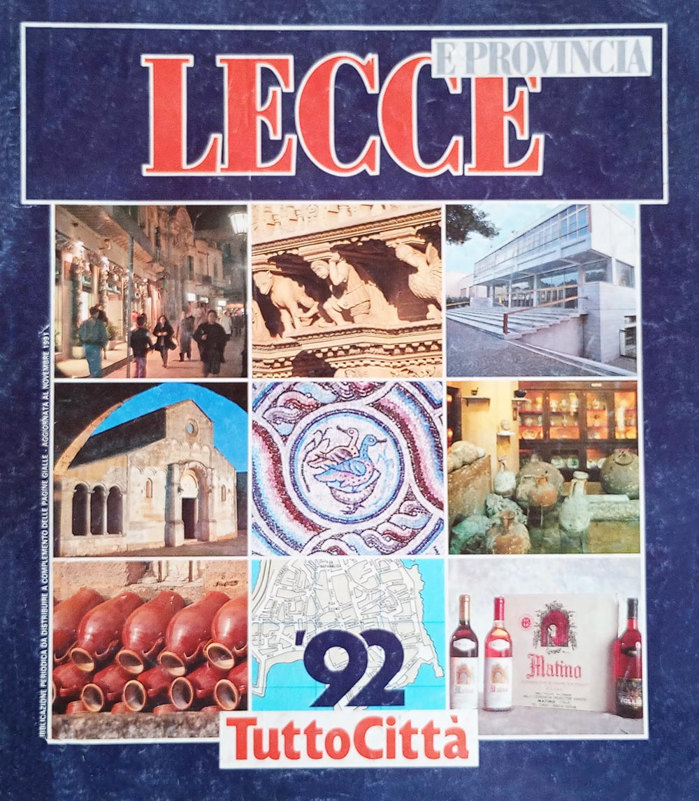</a>
Lecce 92
<ul class="scheda"><li><b>Formato:</b> 246 x 280 mm</li><li><b>Copertina:</b> grossa</li><li><b>Layout:</b> TuttoCittà '90 classico iniziale</li><li><b>Pagine:</b> 40</li><li><b>Mese aggiornamento:</b> novembre 1991</li></ul></td><td class="fasc"><a href="../immagini/FG92.jpg">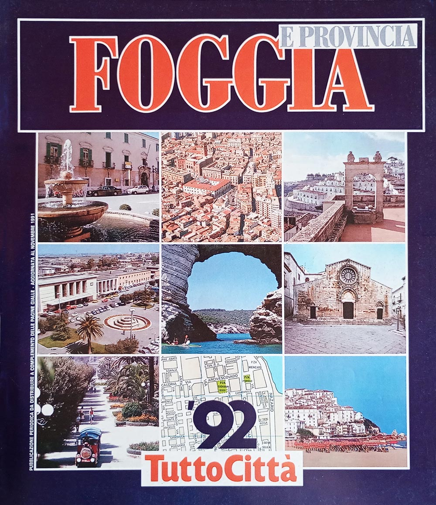</a>
Foggia 92
<ul class="scheda"><li><b>Formato:</b> 246 x 280 mm</li><li><b>Copertina:</b> grossa</li><li><b>Layout:</b> TuttoCittà '90 classico iniziale</li><li><b>Pagine:</b> 32</li><li><b>Mese aggiornamento:</b> novembre 1991</li></ul></td><td class="fasc"><a href="../immagini/TA92.jpg">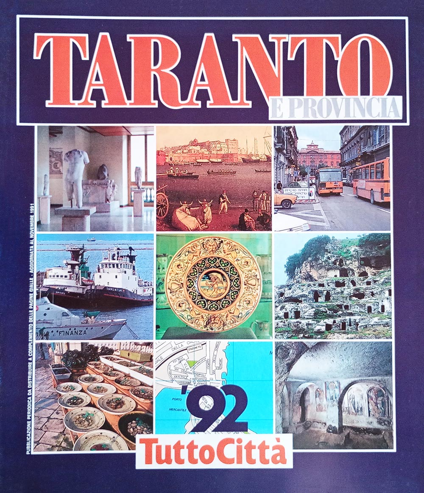</a>
Taranto 92
<ul class="scheda"><li><b>Formato:</b> 246 x 280 mm</li><li><b>Copertina:</b> grossa</li><li><b>Layout:</b> TuttoCittà '90 classico iniziale</li><li><b>Pagine:</b> 32</li><li><b>Mese aggiornamento:</b> novembre 1991</li></ul></td></tr>
<tr><td class="ann"> 92/93</td><td class="tav"></td><td class="fasc"><a href="../immagini/BA93.jpg">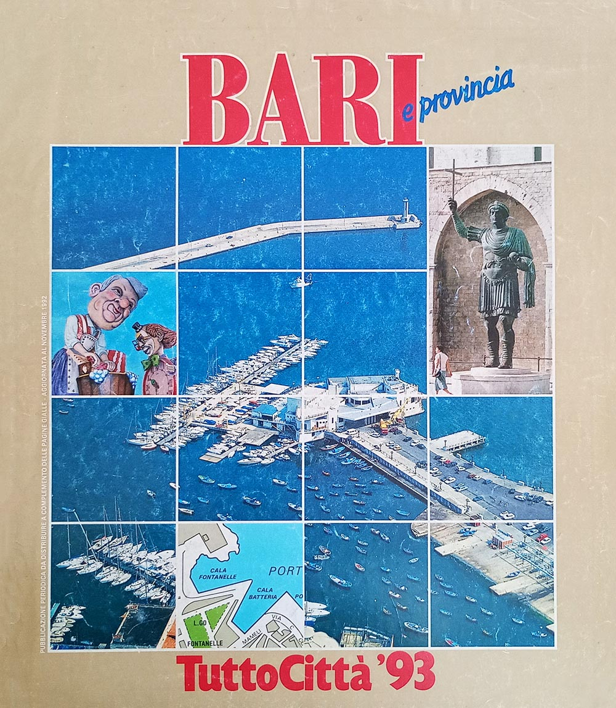</a>
Bari 93
<ul class="scheda"><li><b>Formato:</b> 246 x 280 mm</li><li><b>Copertina:</b> grossa</li><li><b>Layout:</b> TuttoCittà '90 classico</li><li><b>Pagine:</b> 72</li><li><b>Mese aggiornamento:</b> novembre 1992</li></ul></td><td class="fasc"><a href="../immagini/BR93.jpg">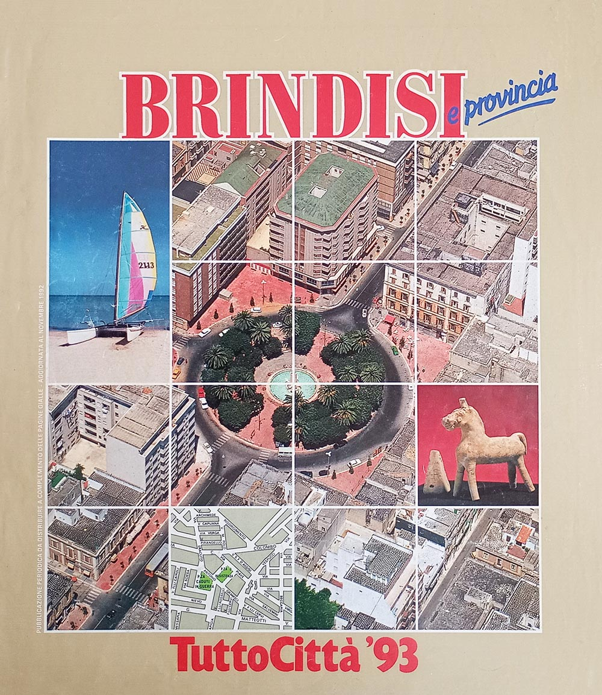</a>
Brindisi 93
<ul class="scheda"><li><b>Formato:</b> 246 x 280 mm</li><li><b>Copertina:</b> grossa</li><li><b>Layout:</b> TuttoCittà '90 classico</li><li><b>Pagine:</b> 24</li><li><b>Mese aggiornamento:</b> novembre 1992</li></ul></td><td class="fasc sospesa">
Lecce 93
<ul class="scheda"><li><b>Formato:</b> 246 x 280 mm</li><li><b>Copertina:</b> grossa</li><li><b>Layout:</b> TuttoCittà '90 classico</li><li>non in raccolta</li></ul></td><td class="fasc"><a href="../immagini/FG93.jpg">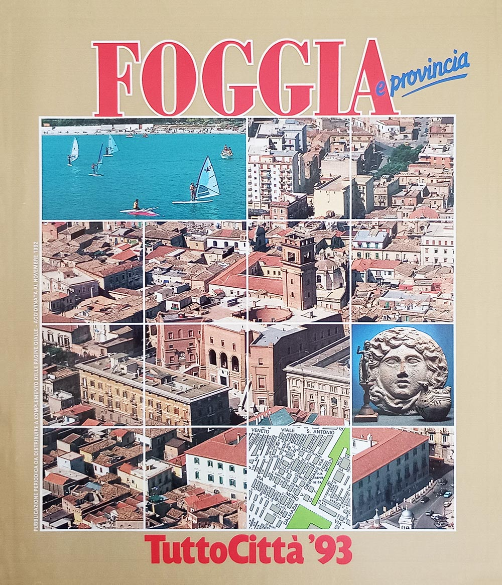</a>
Foggia 93
<ul class="scheda"><li><b>Formato:</b> 246 x 280 mm</li><li><b>Copertina:</b> grossa</li><li><b>Layout:</b> TuttoCittà '90 classico</li><li><b>Pagine:</b> 24</li><li><b>Mese aggiornamento:</b> novembre 1992</li></ul></td><td class="fasc"><a href="../immagini/TA93.jpg">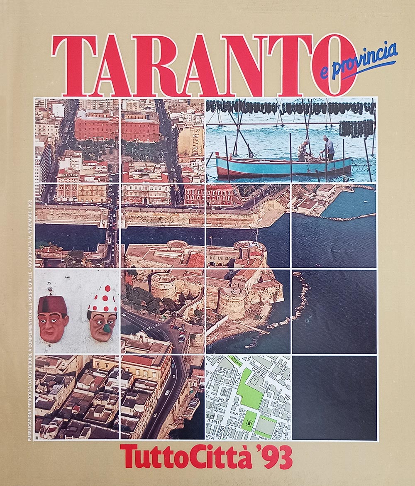</a>
Taranto 93
<ul class="scheda"><li><b>Formato:</b> 246 x 280 mm</li><li><b>Copertina:</b> grossa</li><li><b>Layout:</b> TuttoCittà '90 classico</li><li><b>Pagine:</b> 32</li><li><b>Mese aggiornamento:</b> novembre 1992</li></ul></td></tr>
<tr><td class="ann"> 93/94</td><td class="tav"></td><td class="fasc"><a href="../immagini/BA94.jpg">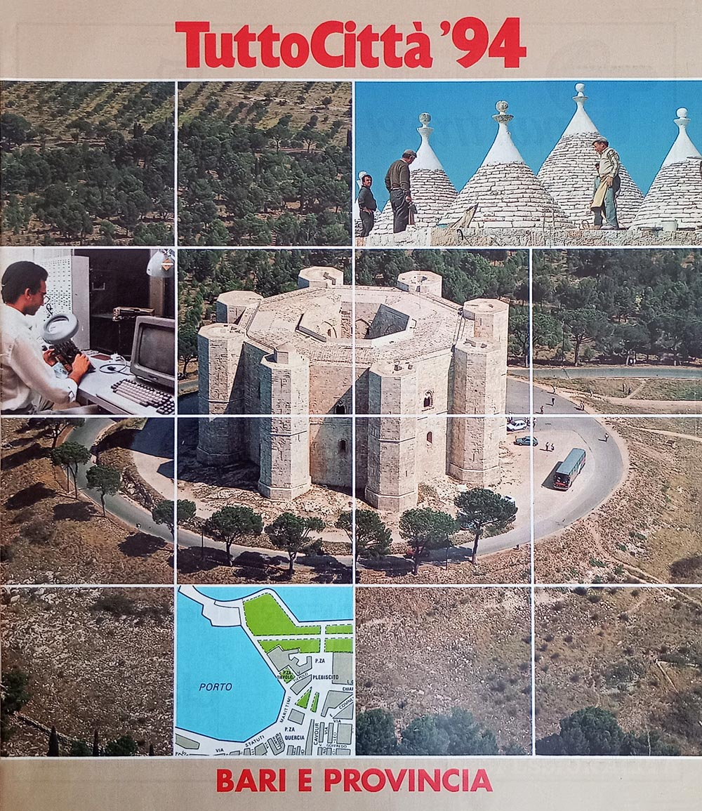</a>
Bari 94
<ul class="scheda"><li><b>Formato:</b> 246 x 280 mm</li><li><b>Copertina:</b> sottile</li><li><b>Layout:</b> TuttoCittà '90 classico</li><li><b>Pagine:</b> 78</li><li><b>Mese aggiornamento:</b> novembre 1993</li></ul></td><td class="fasc"><a href="../immagini/BR94.jpg">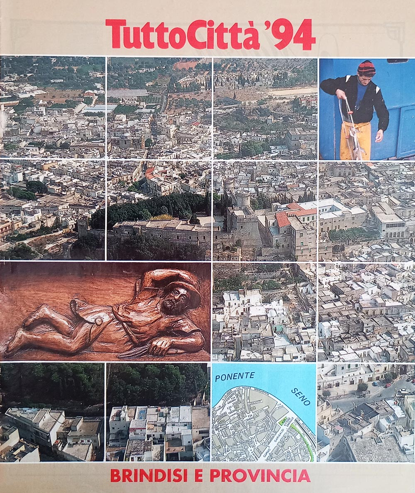</a>
Brindisi 94
<ul class="scheda"><li><b>Formato:</b> 246 x 280 mm</li><li><b>Copertina:</b> sottile</li><li><b>Layout:</b> TuttoCittà '90 classico</li><li><b>Pagine:</b> 30</li><li><b>Mese aggiornamento:</b> dicembre 1993</li></ul></td><td class="fasc"><a href="../immagini/LE94.jpg">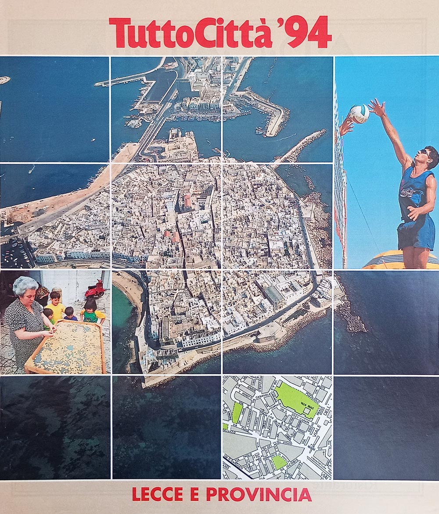</a>
Lecce 94
<ul class="scheda"><li><b>Formato:</b> 246 x 280 mm</li><li><b>Copertina:</b> sottile</li><li><b>Layout:</b> TuttoCittà '90 classico</li><li><b>Pagine:</b> 38</li><li><b>Mese aggiornamento:</b> dicembre 1993</li></ul></td><td class="fasc"><a href="../immagini/FG94.jpg">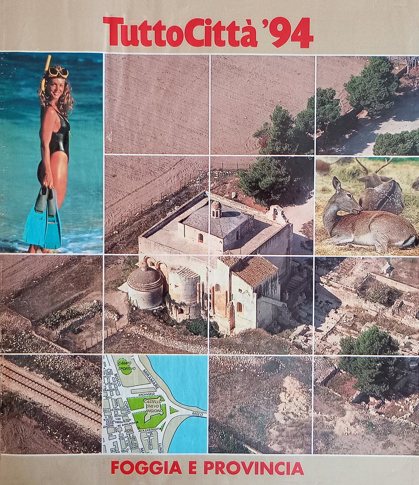</a>
Foggia 94
<ul class="scheda"><li><b>Formato:</b> 246 x 280 mm</li><li><b>Copertina:</b> sottile</li><li><b>Layout:</b> TuttoCittà '90 classico</li><li><b>Pagine:</b> 30</li><li><b>Mese aggiornamento:</b> dicembre 1993</li></ul></td><td class="fasc"><a href="../immagini/TA94.jpg">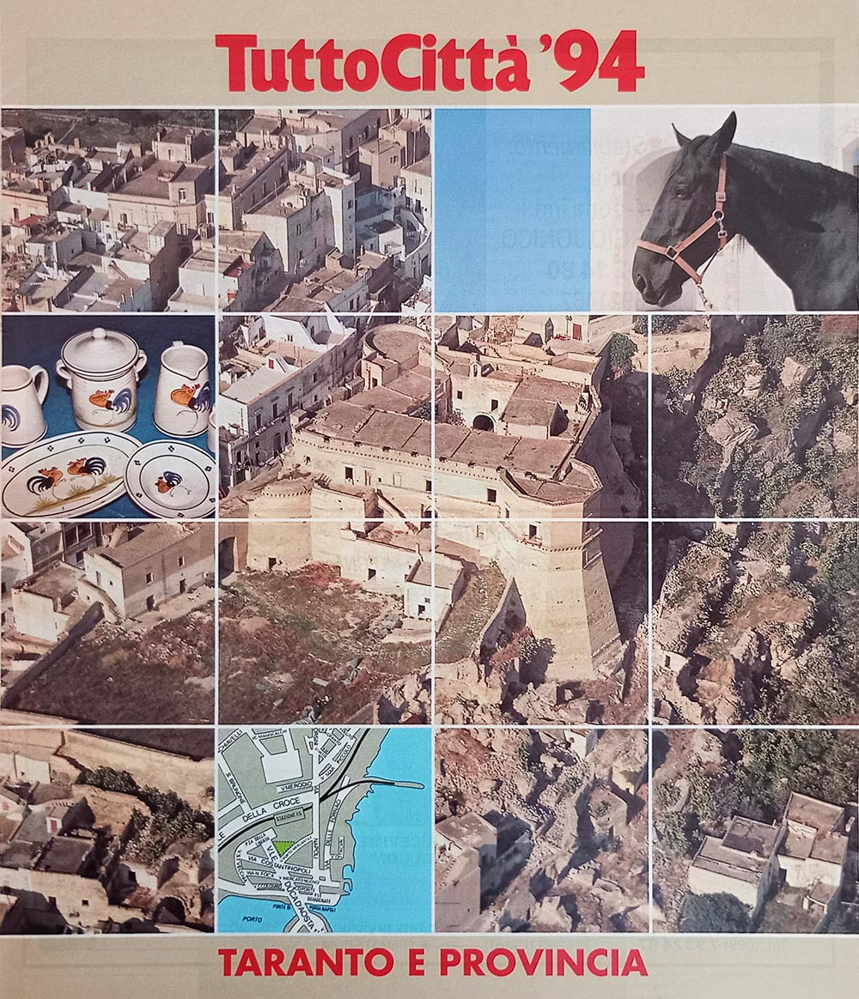</a>
Taranto 94
<ul class="scheda"><li><b>Formato:</b> 246 x 280 mm</li><li><b>Copertina:</b> sottile</li><li><b>Layout:</b> TuttoCittà '90 classico</li><li><b>Pagine:</b> 38</li><li><b>Mese aggiornamento:</b> dicembre 1993</li></ul></td></tr>
<tr><td class="ann"> 94/95</td><td class="tav"></td><td class="fasc"><a href="../immagini/BA95.jpg">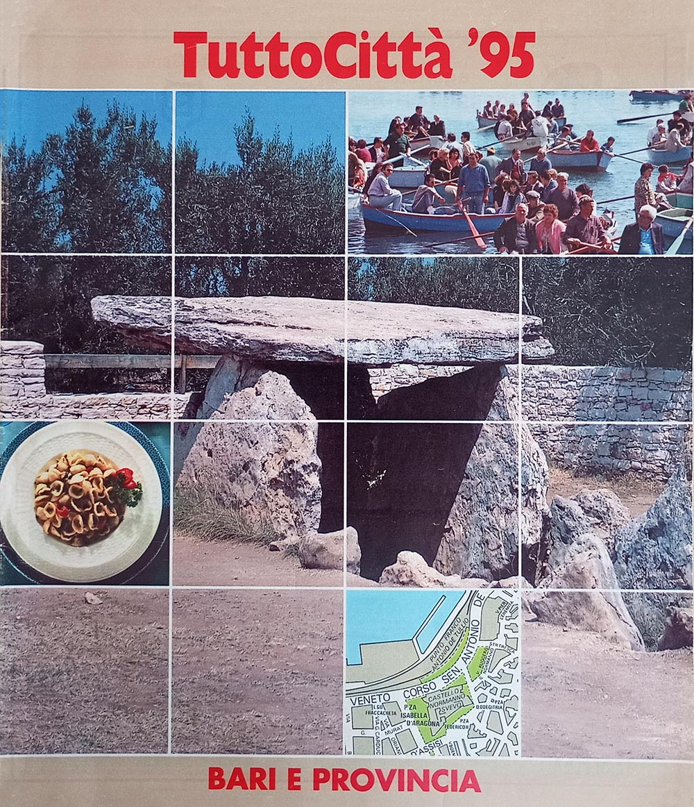</a>
Bari 95
<ul class="scheda"><li><b>Formato:</b> 246 x 280 mm</li><li><b>Copertina:</b> sottile</li><li><b>Layout:</b> TuttoCittà '90 classico</li><li><b>Pagine:</b> 78</li><li><b>Mese aggiornamento:</b> novembre 1994</li></ul></td><td class="fasc"><a href="../immagini/BR95.jpg">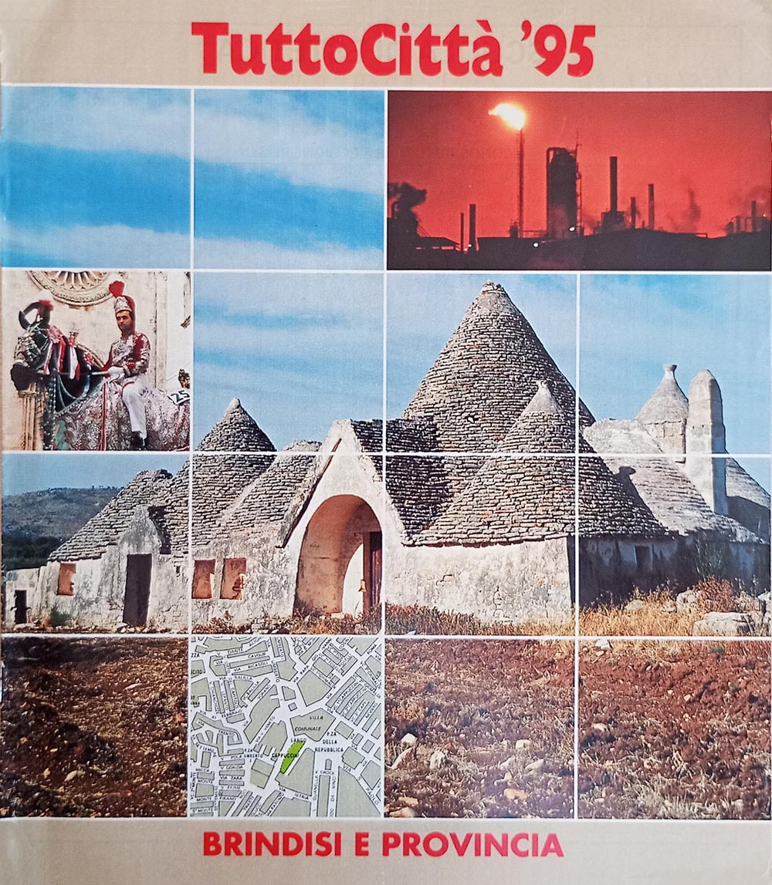</a>
Brindisi 95
<ul class="scheda"><li><b>Formato:</b> 246 x 280 mm</li><li><b>Copertina:</b> sottile</li><li><b>Layout:</b> TuttoCittà '90 classico</li><li><b>Pagine:</b> 22</li><li><b>Mese aggiornamento:</b> dicembre 1994</li></ul></td><td class="fasc sospesa">
Lecce 95
<ul class="scheda"><li><b>Formato:</b> 246 x 280 mm</li><li><b>Copertina:</b> sottile</li><li><b>Layout:</b> TuttoCittà '90 classico</li><li>non in raccolta</li></ul></td><td class="fasc"><a href="../immagini/FG95.jpg">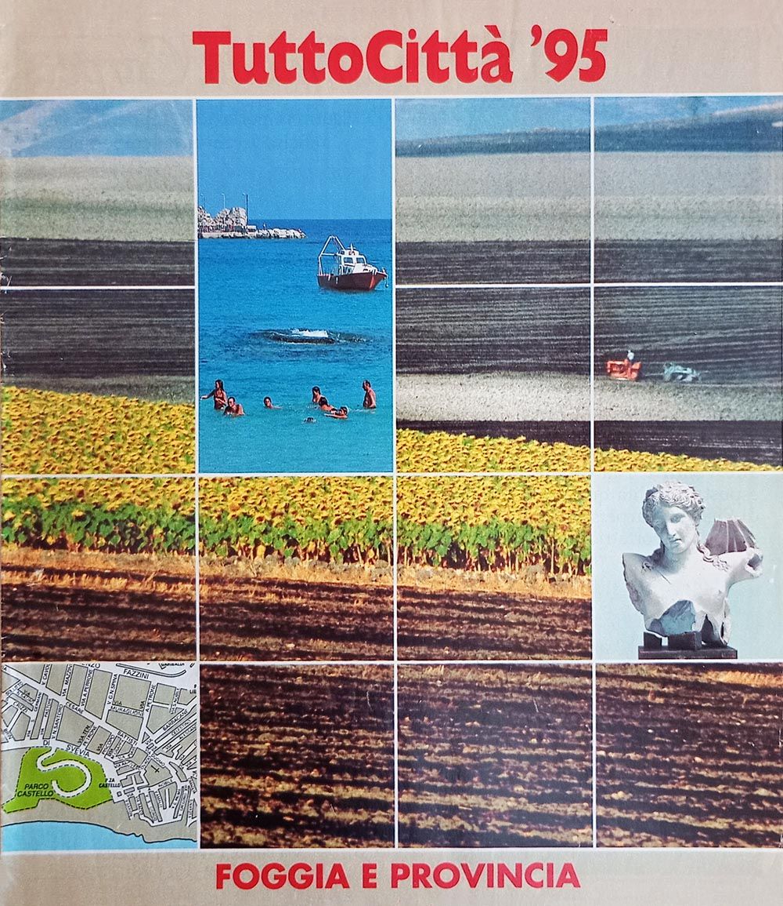</a>
Foggia 95
<ul class="scheda"><li><b>Formato:</b> 246 x 280 mm</li><li><b>Copertina:</b> sottile</li><li><b>Layout:</b> TuttoCittà '90 classico</li><li><b>Pagine:</b> 30</li><li><b>Mese aggiornamento:</b> dicembre 1994</li></ul></td><td class="fasc sospesa">
Taranto 95
<ul class="scheda"><li><b>Formato:</b> 246 x 280 mm</li><li><b>Copertina:</b> sottile</li><li><b>Layout:</b> TuttoCittà '90 classico</li><li>non in raccolta</li></ul></td></tr>
<tr><td class="ann"> 95/96</td><td class="tav"></td><td class="fasc sospesa">
Bari 96
<ul class="scheda"><li><b>Formato:</b> 246 x 280 mm</li><li><b>Copertina:</b> sottile</li><li><b>Layout:</b> TuttoCittà '90 classico</li><li>non in raccolta</li></ul></td><td class="fasc sospesa">
Brindisi 96
<ul class="scheda"><li><b>Formato:</b> 246 x 280 mm</li><li><b>Copertina:</b> sottile</li><li><b>Layout:</b> TuttoCittà '90 classico</li><li>non in raccolta</li></ul></td><td class="fasc sospesa">
Lecce 96
<ul class="scheda"><li><b>Formato:</b> 246 x 280 mm</li><li><b>Copertina:</b> sottile</li><li><b>Layout:</b> TuttoCittà '90 classico</li><li>non in raccolta</li></ul></td><td class="fasc sospesa">
Foggia 96
<ul class="scheda"><li><b>Formato:</b> 246 x 280 mm</li><li><b>Copertina:</b> sottile</li><li><b>Layout:</b> TuttoCittà '90 classico</li><li>non in raccolta</li></ul></td><td class="fasc sospesa">
Taranto 96
<ul class="scheda"><li><b>Formato:</b> 246 x 280 mm</li><li><b>Copertina:</b> sottile</li><li><b>Layout:</b> TuttoCittà '90 classico</li><li>non in raccolta</li></ul></td></tr>
<tr><td class="ann"> 96/97</td><td class="tav"></td><td class="fasc"><a href="../immagini/BA97.jpg">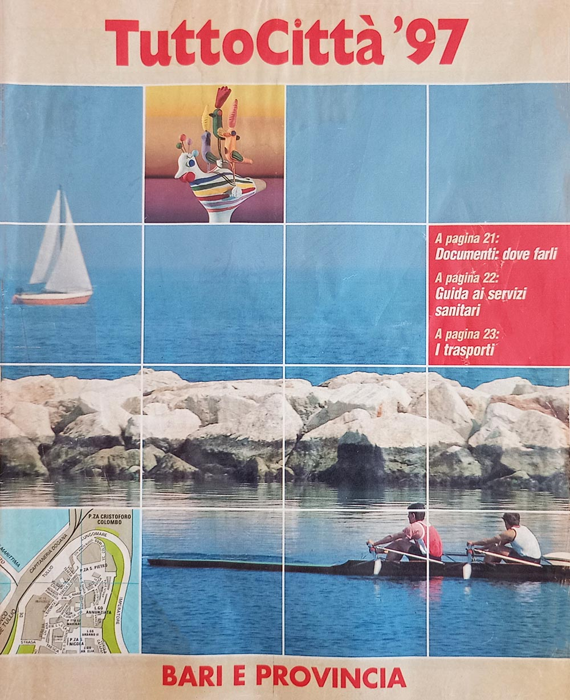</a>
Bari 97
<ul class="scheda"><li><b>Formato:</b> 226 x 274 mm</li><li><b>Copertina:</b> sottile</li><li><b>Layout:</b> TuttoCittà '90 classico</li><li><b>Pagine:</b> 70</li><li><b>Mese aggiornamento:</b> novembre 1996</li><li><b>Note:</b> Cambio formato</li></ul></td><td class="fasc sospesa">
Brindisi 97
<ul class="scheda"><li><b>Formato:</b> 226 x 274 mm</li><li><b>Copertina:</b> sottile</li><li><b>Layout:</b> TuttoCittà '90 classico</li><li><b>Note:</b> Cambio formato</li><li>non in raccolta</li></ul></td><td class="fasc sospesa">
Lecce 97
<ul class="scheda"><li><b>Formato:</b> 226 x 274 mm</li><li><b>Copertina:</b> sottile</li><li><b>Layout:</b> TuttoCittà '90 classico</li><li><b>Note:</b> Cambio formato</li><li>non in raccolta</li></ul></td><td class="fasc sospesa">
Foggia 97
<ul class="scheda"><li><b>Formato:</b> 226 x 274 mm</li><li><b>Copertina:</b> sottile</li><li><b>Layout:</b> TuttoCittà '90 classico</li><li><b>Note:</b> Cambio formato</li><li>non in raccolta</li></ul></td><td class="fasc"><a href="../immagini/TA97.jpg">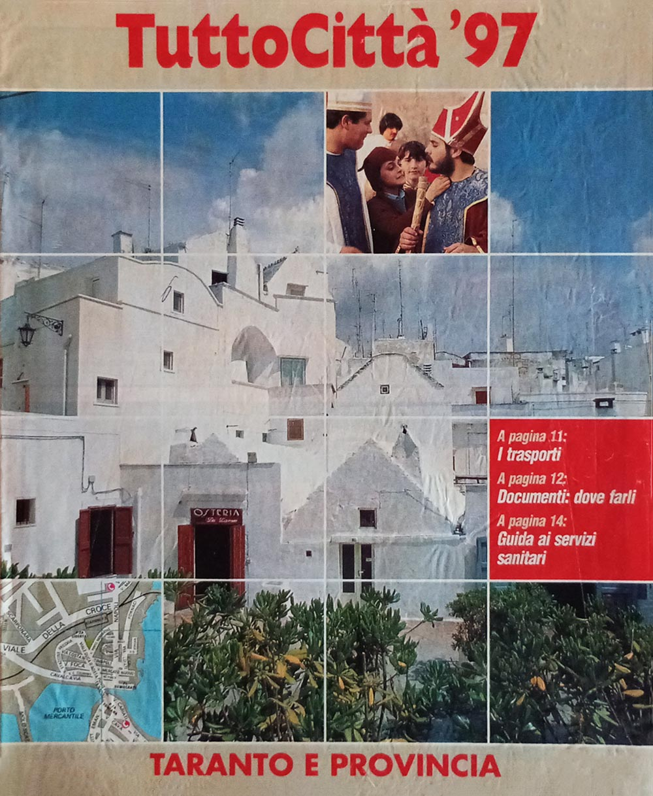</a>
Taranto 97
<ul class="scheda"><li><b>Formato:</b> 226 x 274 mm</li><li><b>Copertina:</b> sottile</li><li><b>Layout:</b> TuttoCittà '90 classico</li><li><b>Pagine:</b> 30</li><li><b>Mese aggiornamento:</b> dicembre 1996</li><li><b>Note:</b> Cambio formato</li></ul></td></tr>
<tr><td class="ann"> 97/98</td><td class="tav"></td><td class="fasc">
Bari (98)
<ul class="scheda"><li><b>Formato:</b> 226 x 274 mm</li><li><b>Copertina:</b> sottile</li><li><b>Layout:</b> TuttoCittà '90 riformato</li><li><b>Pagine:</b> 62</li><li><b>Mese aggiornamento:</b> novembre 1997</li><li><b>Note:</b> "febbraio 1998 - gennaio 1999"</li></ul></td><td class="fasc">
Brindisi (98)
<ul class="scheda"><li><b>Formato:</b> 226 x 274 mm</li><li><b>Copertina:</b> sottile</li><li><b>Layout:</b> TuttoCittà '90 riformato</li><li><b>Pagine:</b> 30</li><li><b>Mese aggiornamento:</b> dicembre 1997</li><li><b>Note:</b> "febbraio 1998 - gennaio 1999"</li></ul></td><td class="fasc">
Lecce (98)
<ul class="scheda"><li><b>Formato:</b> 226 x 274 mm</li><li><b>Copertina:</b> sottile</li><li><b>Layout:</b> TuttoCittà '90 riformato</li><li><b>Pagine:</b> 38</li><li><b>Mese aggiornamento:</b> dicembre 1997</li><li><b>Note:</b> "febbraio 1998 - gennaio 1999"</li></ul></td><td class="fasc"><a href="../immagini/FG97b.jpg">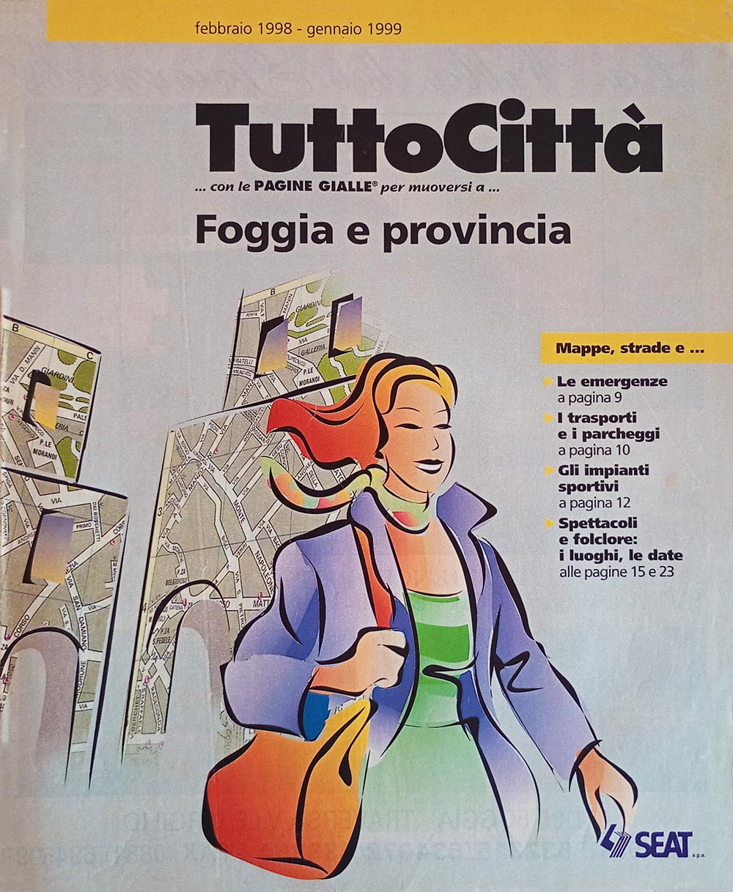</a>
Foggia (98)
<ul class="scheda"><li><b>Formato:</b> 226 x 274 mm</li><li><b>Copertina:</b> sottile</li><li><b>Layout:</b> TuttoCittà '90 riformato</li><li><b>Pagine:</b> 30</li><li><b>Mese aggiornamento:</b> dicembre 1997</li><li><b>Note:</b> "febbraio 1998 - gennaio 1999"</li></ul></td><td class="fasc"><a href="../immagini/TA97b.jpg">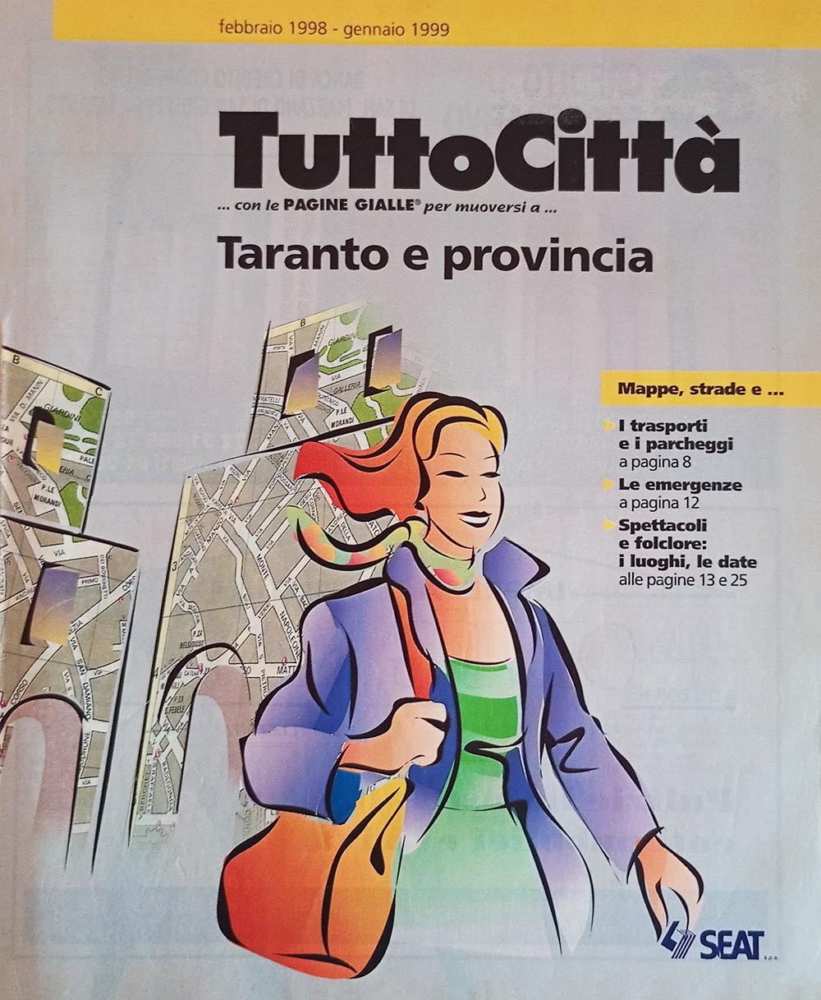</a>
Taranto (98)
<ul class="scheda"><li><b>Formato:</b> 226 x 274 mm</li><li><b>Copertina:</b> sottile</li><li><b>Layout:</b> TuttoCittà '90 riformato</li><li><b>Pagine:</b> 30</li><li><b>Mese aggiornamento:</b> dicembre 1997</li><li><b>Note:</b> "febbraio 1998 - gennaio 1999"</li></ul></td></tr>
<tr><td class="ann"> 98/99</td><td class="tav"></td><td class="fasc sospesa">
Bari (99)
<ul class="scheda"><li><b>Formato:</b> 226 x 274 mm</li><li><b>Copertina:</b> sottile</li><li><b>Layout:</b> TuttoCittà '90 riformato</li><li>non in raccolta</li></ul></td><td class="fasc vuota"></td><td class="fasc sospesa">
Lecce (99)
<ul class="scheda"><li><b>Formato:</b> 226 x 274 mm</li><li><b>Copertina:</b> sottile</li><li><b>Layout:</b> TuttoCittà '90 riformato</li><li><b>Note:</b> "da utilizzare fino a Luglio 1999"</li><li>non in raccolta</li></ul></td><td class="fasc vuota"></td><td class="fasc vuota"></td></tr>
<tr><td class="ann"> 99/00</td><td class="tav"></td><td class="fasc"><a href="../immagini/BA00.jpg">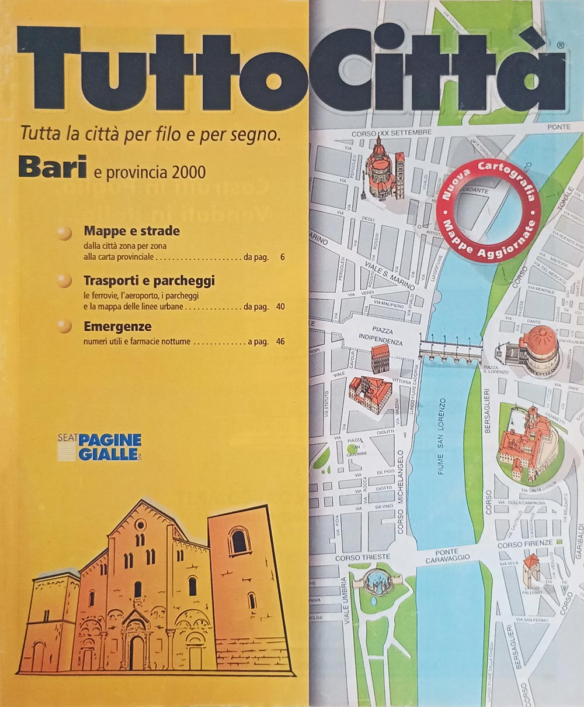</a>
Bari 2000
<ul class="scheda"><li><b>Formato:</b> 226 x 274 mm</li><li><b>Copertina:</b> sottile</li><li><b>Layout:</b> TuttoCittà nuovo millennio</li><li><b>Pagine:</b> 62</li><li><b>Mese aggiornamento:</b> novembre 1999</li></ul></td><td class="fasc vuota"></td><td class="fasc sospesa">
Lecce 2000
<ul class="scheda"><li><b>Formato:</b> 226 x 274 mm</li><li><b>Copertina:</b> sottile</li><li><b>Layout:</b> TuttoCittà nuovo millennio</li><li>non in raccolta</li></ul></td><td class="fasc vuota"></td><td class="fasc vuota"></td></tr>
<tr><td class="ann"> 00/01</td><td class="tav"></td><td class="fasc sospesa">
Bari ?
<ul class="scheda"><li><b>Formato:</b> 226 x 274 mm</li><li><b>Copertina:</b> sottile</li><li><b>Layout:</b> TuttoCittà nuovo millennio ter</li><li><b>Pagine:</b> 46</li><li>non in raccolta</li></ul></td><td class="fasc vuota"></td><td class="fasc sospesa">
Lecce ?
<ul class="scheda"><li><b>Formato:</b> 226 x 274 mm</li><li><b>Copertina:</b> sottile</li><li><b>Layout:</b> TuttoCittà nuovo millennio ter</li><li>non in raccolta</li></ul></td><td class="fasc vuota"></td><td class="fasc vuota"></td></tr>
<tr><td class="ann"> 01/02</td><td class="tav"></td><td class="fasc sospesa">
Bari 2002
<ul class="scheda"><li><b>Formato:</b> 226 x 274 mm</li><li><b>Copertina:</b> sottile</li><li><b>Layout:</b> TuttoCittà nuovo millennio ter</li><li>non in raccolta</li></ul></td><td class="fasc vuota"></td><td class="fasc sospesa">
Lecce 2002
<ul class="scheda"><li><b>Formato:</b> 226 x 274 mm</li><li><b>Copertina:</b> sottile</li><li><b>Layout:</b> TuttoCittà nuovo millennio ter</li><li>non in raccolta</li></ul></td><td class="fasc vuota"></td><td class="fasc vuota"></td></tr>
<tr><td class="ann"> 02/03</td><td class="tav"></td><td class="fasc sospesa">
Bari ?
<ul class="scheda"><li><b>Formato:</b> 226 x 274 mm</li><li><b>Copertina:</b> sottile</li><li><b>Layout:</b> TuttoCittà nuovo millennio ter</li><li>non in raccolta</li></ul></td><td class="fasc vuota"></td><td class="fasc sospesa">
Lecce ?
<ul class="scheda"><li><b>Formato:</b> 226 x 274 mm</li><li><b>Copertina:</b> sottile</li><li><b>Layout:</b> TuttoCittà nuovo millennio ter</li><li>non in raccolta</li></ul></td><td class="fasc vuota"></td><td class="fasc vuota"></td></tr>
<tr><td class="ann"> 03/04</td><td class="tav"></td><td class="fasc sospesa">
Bari 2004
<ul class="scheda"><li><b>Formato:</b> 226 x 274 mm</li><li><b>Copertina:</b> sottile</li><li><b>Layout:</b> TuttoCittà nuovo millennio ter</li><li>non in raccolta</li></ul></td><td class="fasc vuota"></td><td class="fasc sospesa">
Lecce 2004
<ul class="scheda"><li><b>Formato:</b> 226 x 274 mm</li><li><b>Copertina:</b> sottile</li><li><b>Layout:</b> TuttoCittà nuovo millennio ter</li><li>non in raccolta</li></ul></td><td class="fasc vuota"></td><td class="fasc vuota"></td></tr>
<tr><td class="ann"> 04/05</td><td class="tav"></td><td class="fasc sospesa">
Bari 2005
<ul class="scheda"><li><b>Formato:</b> 226 x 274 mm</li><li><b>Copertina:</b> sottile</li><li><b>Layout:</b> TuttoCittà metà duemila</li><li>non in raccolta</li></ul></td><td class="fasc vuota"></td><td class="fasc sospesa">
Lecce 2005
<ul class="scheda"><li><b>Formato:</b> 226 x 274 mm</li><li><b>Copertina:</b> sottile</li><li><b>Layout:</b> TuttoCittà metà duemila</li><li>non in raccolta</li></ul></td><td class="fasc vuota"></td><td class="fasc vuota"></td></tr>
<tr><td class="ann"> 05/06</td><td class="tav"></td><td class="fasc sospesa">
Bari 2006
<ul class="scheda"><li><b>Formato:</b> 226 x 274 mm</li><li><b>Copertina:</b> grossa</li><li><b>Layout:</b> TuttoCittà fine duemila</li><li>non in raccolta</li></ul></td><td class="fasc vuota"></td><td class="fasc sospesa">
Lecce 2006
<ul class="scheda"><li><b>Formato:</b> 226 x 274 mm</li><li><b>Copertina:</b> grossa</li><li><b>Layout:</b> TuttoCittà fine duemila</li><li>non in raccolta</li></ul></td><td class="fasc vuota"></td><td class="fasc vuota"></td></tr>
<tr><td class="ann"> 06/07</td><td class="tav"></td><td class="fasc"><a href="../immagini/BA07.jpg">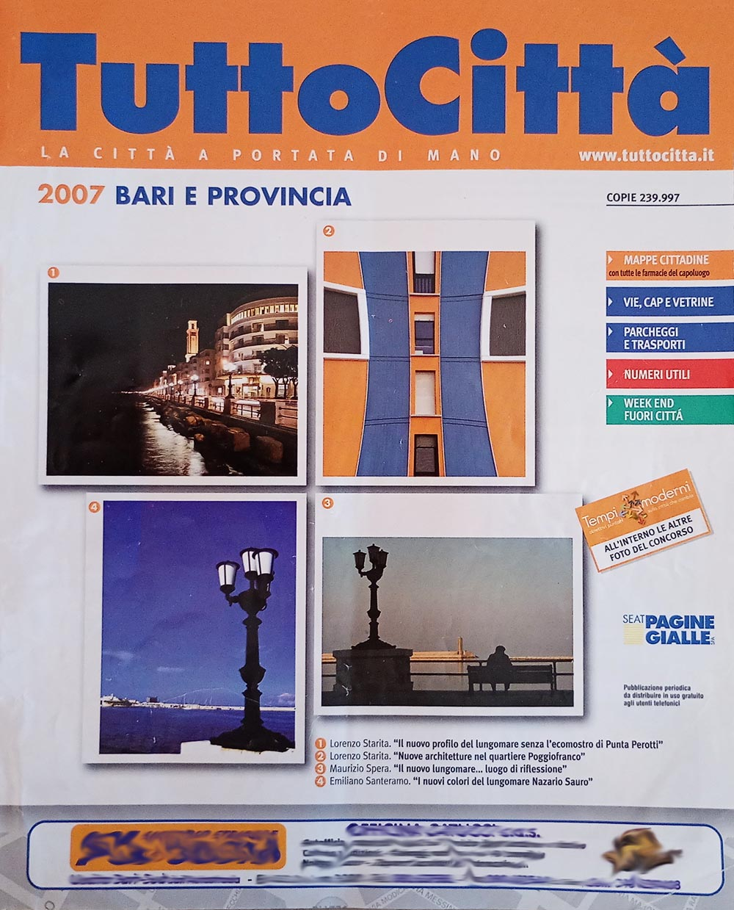</a>
Bari 2007
<ul class="scheda"><li><b>Formato:</b> 226 x 274 mm</li><li><b>Copertina:</b> grossa</li><li><b>Layout:</b> TuttoCittà fine duemila</li><li><b>Pagine:</b> 56</li><li><b>Mese aggiornamento:</b> gennaio 2007</li></ul></td><td class="fasc vuota"></td><td class="fasc sospesa">
Lecce 2007
<ul class="scheda"><li><b>Formato:</b> 226 x 274 mm</li><li><b>Copertina:</b> grossa</li><li><b>Layout:</b> TuttoCittà fine duemila</li><li>non in raccolta</li></ul></td><td class="fasc vuota"></td><td class="fasc vuota"></td></tr>
<tr><td class="ann"> 07/08</td><td class="tav"></td><td class="fasc sospesa">
Bari 2008/2009
<ul class="scheda"><li><b>Formato:</b> 226 x 274 mm</li><li><b>Copertina:</b> grossa</li><li><b>Layout:</b> TuttoCittà fine duemila</li><li>non in raccolta</li></ul></td><td class="fasc vuota"></td><td class="fasc sospesa">
Lecce 2008/2009
<ul class="scheda"><li><b>Formato:</b> 226 x 274 mm</li><li><b>Copertina:</b> grossa</li><li><b>Layout:</b> TuttoCittà fine duemila</li><li>non in raccolta</li></ul></td><td class="fasc vuota"></td><td class="fasc vuota"></td></tr>
<tr><td class="ann"> 08/09</td><td class="tav"></td><td class="fasc"><a href="../immagini/BA0910.jpg">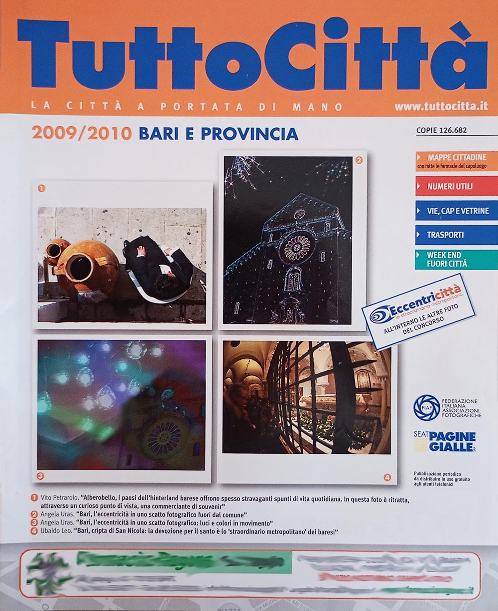</a>
Bari 2009/2010
<ul class="scheda"><li><b>Formato:</b> 226 x 274 mm</li><li><b>Copertina:</b> grossa</li><li><b>Layout:</b> TuttoCittà fine duemila</li><li><b>Pagine:</b> 48</li><li><b>Mese aggiornamento:</b> febbraio 2009</li></ul></td><td class="fasc vuota"></td><td class="fasc sospesa">
Lecce 2009/2010
<ul class="scheda"><li><b>Formato:</b> 226 x 274 mm</li><li><b>Copertina:</b> grossa</li><li><b>Layout:</b> TuttoCittà fine duemila</li><li>non in raccolta</li></ul></td><td class="fasc vuota"></td><td class="fasc vuota"></td></tr>
<tr><td class="ann"> 09/10</td><td class="tav"></td><td class="fasc"><a href="../immagini/BA1011.jpg">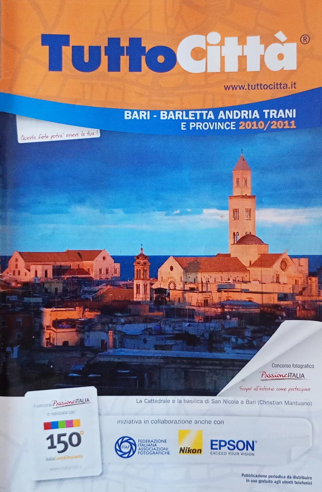</a>
Bari - Barletta Andria Trani 2010/2011
<ul class="scheda"><li><b>Formato:</b> 226 x 274 mm</li><li><b>Copertina:</b> grossa</li><li><b>Layout:</b> TuttoCittà anni dieci</li><li><b>Pagine:</b> 80</li><li><b>Mese aggiornamento:</b> febbraio 2010</li><li><b>Note:</b> Riforma cartografica; nuovo formato</li></ul></td><td class="fasc vuota"></td><td class="fasc sospesa"><a href="../immagini/Ricercato2.jpg">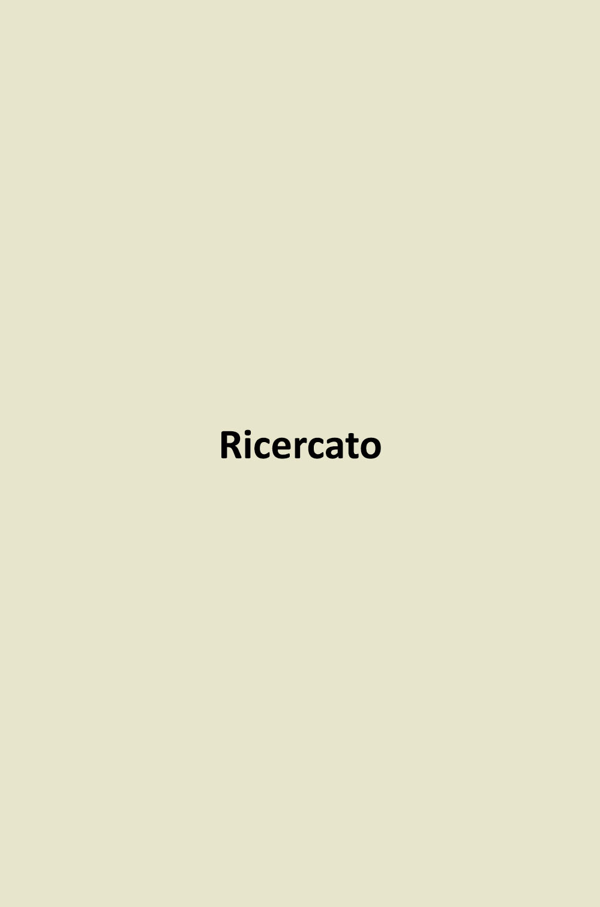</a>
Lecce 2010/2011
<ul class="scheda"><li><b>Formato:</b> 226 x 274 mm</li><li><b>Copertina:</b> grossa</li><li><b>Layout:</b> TuttoCittà anni dieci</li><li><b>Note:</b> Riforma cartografica; nuovo formato</li><li>non in raccolta</li></ul></td><td class="fasc vuota"></td><td class="fasc vuota"></td></tr>
<tr><td class="ann"> 10/11</td><td class="tav"></td><td class="fasc"><a href="../immagini/BA1112.jpg">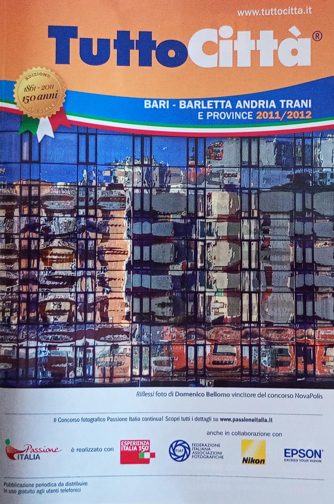</a>
Bari - Barletta Andria Trani 2011/2012
<ul class="scheda"><li><b>Formato:</b> 140 x 212 mm</li><li><b>Copertina:</b> grossa</li><li><b>Layout:</b> TuttoCittà anni dieci</li><li><b>Pagine:</b> 80</li><li><b>Mese aggiornamento:</b> gennaio 2011</li></ul></td><td class="fasc vuota"></td><td class="fasc sospesa">
Lecce 2011/2012
<ul class="scheda"><li><b>Formato:</b> 140 x 212 mm</li><li><b>Copertina:</b> grossa</li><li><b>Layout:</b> TuttoCittà anni dieci</li><li>non in raccolta</li></ul></td><td class="fasc vuota"></td><td class="fasc vuota"></td></tr>
<tr><td class="ann"> 11/12</td><td class="tav"></td><td class="fasc"><a href="../immagini/BA1213.jpg">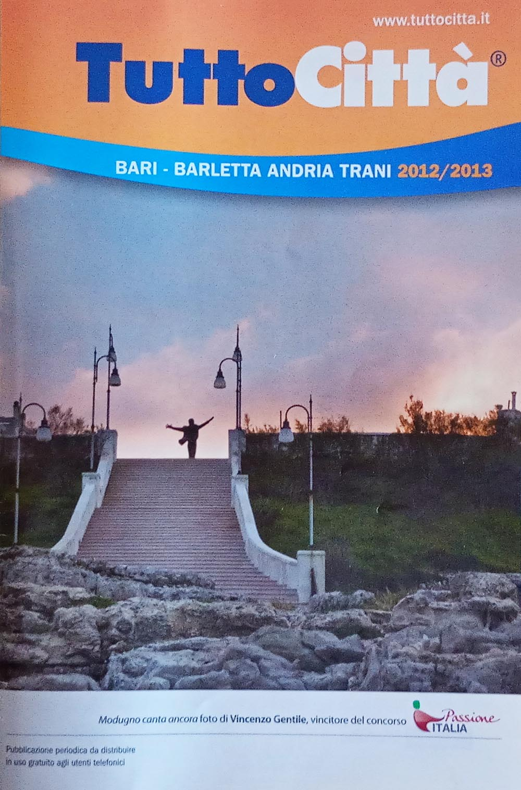</a>
Bari - Barletta Andria Trani 2012/2013
<ul class="scheda"><li><b>Formato:</b> 140 x 212 mm</li><li><b>Copertina:</b> grossa</li><li><b>Layout:</b> TuttoCittà anni dieci</li><li><b>Pagine:</b> 72</li><li><b>Mese aggiornamento:</b> gennaio 2012</li></ul></td><td class="fasc vuota"></td><td class="fasc sospesa">
Lecce 2012/2013
<ul class="scheda"><li><b>Formato:</b> 140 x 212 mm</li><li><b>Copertina:</b> grossa</li><li><b>Layout:</b> TuttoCittà anni dieci</li><li>non in raccolta</li></ul></td><td class="fasc vuota"></td><td class="fasc vuota"></td></tr>
<tr><td class="ann"> 12/13</td><td class="tav"></td><td class="fasc"><a href="../immagini/BA1314.jpg">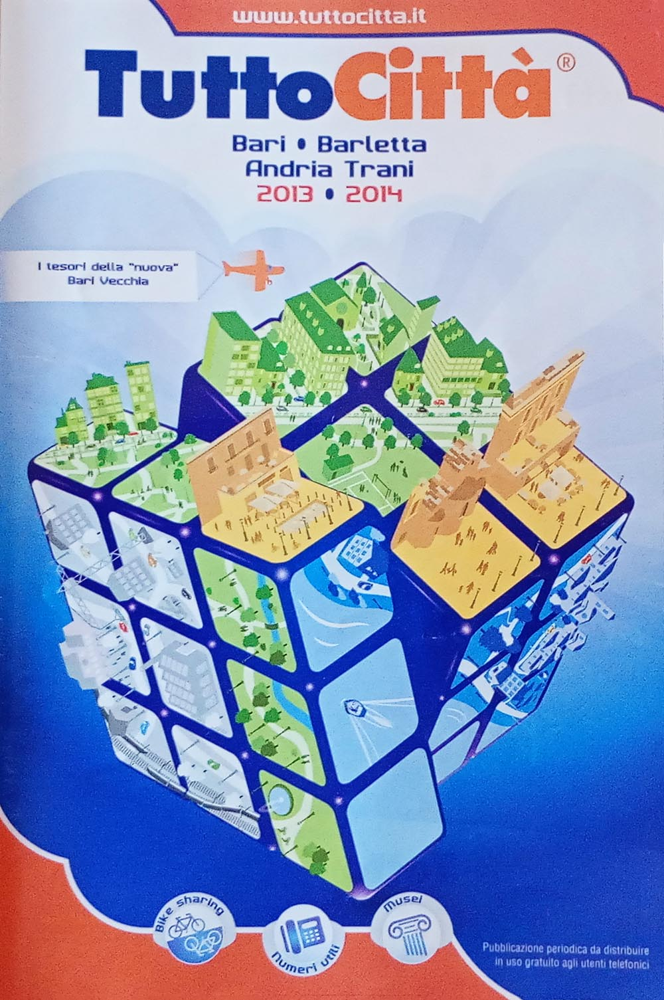</a>
Bari - Barletta Andria Trani 2013/2014
<ul class="scheda"><li><b>Formato:</b> 140 x 212 mm</li><li><b>Copertina:</b> grossa</li><li><b>Layout:</b> TuttoCittà anni dieci</li><li><b>Pagine:</b> 64</li><li><b>Mese aggiornamento:</b> gennaio 2013</li></ul></td><td class="fasc vuota"></td><td class="fasc sospesa">
Lecce 2013/2014
<ul class="scheda"><li><b>Formato:</b> 140 x 212 mm</li><li><b>Copertina:</b> grossa</li><li><b>Layout:</b> TuttoCittà anni dieci</li><li>non in raccolta</li></ul></td><td class="fasc vuota"></td><td class="fasc vuota"></td></tr>
<tr><td class="ann"> 13/14</td><td class="tav"></td><td class="fasc sospesa">
Bari - Barletta Andria Trani 2014/2015
<ul class="scheda"><li><b>Formato:</b> 140 x 212 mm</li><li><b>Copertina:</b> grossa</li><li><b>Layout:</b> TuttoCittà anni dieci</li><li>non in raccolta</li></ul></td><td class="fasc vuota"></td><td class="fasc sospesa">
Lecce 2014/2015
<ul class="scheda"><li><b>Formato:</b> 140 x 212 mm</li><li><b>Copertina:</b> grossa</li><li><b>Layout:</b> TuttoCittà anni dieci</li><li>non in raccolta</li></ul></td><td class="fasc vuota"></td><td class="fasc vuota"></td></tr>
<tr><td class="ann"> 14/15</td><td class="tav"></td><td class="fasc sospesa">
Bari - Barletta Andria Trani ?
<ul class="scheda"><li><b>Formato:</b> 140 x 212 mm</li><li><b>Copertina:</b> grossa</li><li><b>Layout:</b> TuttoCittà anni dieci</li><li>non in raccolta</li></ul></td><td class="fasc vuota"></td><td class="fasc sospesa">
Lecce ?
<ul class="scheda"><li><b>Formato:</b> 140 x 212 mm</li><li><b>Copertina:</b> grossa</li><li><b>Layout:</b> TuttoCittà anni dieci</li><li>non in raccolta</li></ul></td><td class="fasc vuota"></td><td class="fasc vuota"></td></tr>
</tbody>
</table>

## Dieci layout in trentaquattro anni

La seguente tabella censisce i vari layout utilizzati per i fascicoli della regione, secondo il sistema definito durante il censimento osservando l'impaginazione; le loro caratteristiche sono descritte in [questa pagina](tabella-layout.md). Come descritto anche lì, i cambi di layout non rispettano i cambi delle serie di copertina descritte nell'[apposita pagina](copertine.md) di questo sito.

<table class="layout-dettaglio">
<thead><tr><th>Layout</th><th>Annate</th><th>Anni di copertina</th></tr></thead>
<tbody>
<tr><td>TuttoCittà '80 classico</td><td class="ann">81/82 – 88/89</td><td class="cop">82<i class="pt"></i>83<i class="pt"></i>84<i class="pt"></i>85<i class="pt"></i>88<i class="pt"></i>89</td></tr>
<tr><td>TuttoCittà '80 edifici</td><td class="ann">85/86 – 88/89</td><td class="cop">86<i class="pt"></i>87<i class="pt"></i>88<i class="pt"></i>89</td></tr>
<tr><td>TuttoCittà '90 classico iniziale</td><td class="ann">89/90 – 91/92</td><td class="cop">90<i class="pt"></i>91<i class="pt"></i>92</td></tr>
<tr><td>TuttoCittà '90 classico</td><td class="ann">92/93 – 96/97</td><td class="cop">93<i class="pt"></i>94<i class="pt"></i>95<i class="pt"></i>96<i class="pt"></i>97</td></tr>
<tr><td>TuttoCittà '90 riformato</td><td class="ann">97/98 – 98/99</td><td class="cop">98<i class="pt"></i>99</td></tr>
<tr><td>TuttoCittà nuovo millennio</td><td class="ann">99/00</td><td class="cop">00</td></tr>
<tr><td>TuttoCittà nuovo millennio ter</td><td class="ann">00/01 – 03/04</td><td class="cop">02<i class="pt"></i>04</td></tr>
<tr><td>TuttoCittà metà duemila</td><td class="ann">04/05</td><td class="cop">05</td></tr>
<tr><td>TuttoCittà fine duemila</td><td class="ann">05/06 – 08/09</td><td class="cop">06<i class="pt"></i>07<i class="pt"></i>08/09<i class="pt"></i>09/10</td></tr>
<tr><td>TuttoCittà anni dieci</td><td class="ann">09/10 – 14/15</td><td class="cop">10/11<i class="pt"></i>11/12<i class="pt"></i>12/13<i class="pt"></i>13/14<i class="pt"></i>14/15</td></tr>
</tbody>
</table>

## Le città cartografate

La seguente tabella censisce tutti i comuni che sono stati cartografati nel corso del tempo e per quante annate. Ad ogni riga corrisponde un comune, in ordine alfabetico e non per provincia: lo scopo è infatti identificare a colpo d'occhio quali comuni entrano ed escono dalla cartografia nel corso degli anni. I cinque capoluoghi storici — BARI, BRINDISI, FOGGIA, LECCE, TARANTO — sono in maiuscolo, ma restano al loro posto nell'alfabeto.

La croce segna le annate in cui non sappiamo: perché il fascicolo che avrebbe portato quel comune non è in raccolta, perché non è accertato che sia mai esistito, o perché il suo contenuto non è ancora stato spogliato.

Le caselle azzurre indicano invece che il comune era cartografato, ma non compariva nel relativo elenco delle vie, un fenomeno relativamente comune soprattutto nei fascicoli degli anni '80.

Espandi la griglia delle città — 52 città su 34 annate

<table class="griglia">
  <thead><tr><th scope="col">Città</th><th scope="col" class="ann dec">81/82</th><th scope="col" class="ann">82/83</th><th scope="col" class="ann">83/84</th><th scope="col" class="ann">84/85</th><th scope="col" class="ann">85/86</th><th scope="col" class="ann">86/87</th><th scope="col" class="ann">87/88</th><th scope="col" class="ann">88/89</th><th scope="col" class="ann">89/90</th><th scope="col" class="ann dec">90/91</th><th scope="col" class="ann">91/92</th><th scope="col" class="ann">92/93</th><th scope="col" class="ann">93/94</th><th scope="col" class="ann">94/95</th><th scope="col" class="ann">95/96</th><th scope="col" class="ann">96/97</th><th scope="col" class="ann">97/98</th><th scope="col" class="ann">98/99</th><th scope="col" class="ann">99/00</th><th scope="col" class="ann dec">00/01</th><th scope="col" class="ann">01/02</th><th scope="col" class="ann">02/03</th><th scope="col" class="ann">03/04</th><th scope="col" class="ann">04/05</th><th scope="col" class="ann">05/06</th><th scope="col" class="ann">06/07</th><th scope="col" class="ann">07/08</th><th scope="col" class="ann">08/09</th><th scope="col" class="ann">09/10</th><th scope="col" class="ann dec">10/11</th><th scope="col" class="ann">11/12</th><th scope="col" class="ann">12/13</th><th scope="col" class="ann">13/14</th><th scope="col" class="ann">14/15</th></tr></thead>
  <tbody>
  <tr><th scope="row">Altamura</th><td class="no dec" title="Altamura — 81/82"></td><td class="no" title="Altamura — 82/83"></td><td class="no" title="Altamura — 83/84"></td><td class="no" title="Altamura — 84/85"></td><td class="no" title="Altamura — 85/86"></td><td class="no" title="Altamura — 86/87"></td><td class="no" title="Altamura — 87/88"></td><td class="no" title="Altamura — 88/89"></td><td class="no" title="Altamura — 89/90"></td><td class="si dec" title="Altamura — 90/91"></td><td class="si" title="Altamura — 91/92"></td><td class="si" title="Altamura — 92/93"></td><td class="si" title="Altamura — 93/94"></td><td class="si" title="Altamura — 94/95"></td><td class="ig" title="Altamura — 95/96: non accertato, fascicolo mancante">&#215;</td><td class="si" title="Altamura — 96/97"></td><td class="si" title="Altamura — 97/98"></td><td class="ig" title="Altamura — 98/99: non accertato, fascicolo mancante">&#215;</td><td class="si" title="Altamura — 99/00"></td><td class="ig dec" title="Altamura — 00/01: non accertato, fascicolo mancante">&#215;</td><td class="ig" title="Altamura — 01/02: non accertato, fascicolo mancante">&#215;</td><td class="ig" title="Altamura — 02/03: non accertato, fascicolo mancante">&#215;</td><td class="ig" title="Altamura — 03/04: non accertato, fascicolo mancante">&#215;</td><td class="ig" title="Altamura — 04/05: non accertato, fascicolo mancante">&#215;</td><td class="ig" title="Altamura — 05/06: non accertato, fascicolo mancante">&#215;</td><td class="si" title="Altamura — 06/07"></td><td class="ig" title="Altamura — 07/08: non accertato, fascicolo mancante">&#215;</td><td class="si" title="Altamura — 08/09"></td><td class="si" title="Altamura — 09/10"></td><td class="si dec" title="Altamura — 10/11"></td><td class="si" title="Altamura — 11/12"></td><td class="no" title="Altamura — 12/13"></td><td class="ig" title="Altamura — 13/14: non accertato, fascicolo mancante">&#215;</td><td class="ig" title="Altamura — 14/15: non accertato, fascicolo mancante">&#215;</td></tr>
  <tr><th scope="row">Andria</th><td class="si dec" title="Andria — 81/82"></td><td class="si" title="Andria — 82/83"></td><td class="si" title="Andria — 83/84"></td><td class="si" title="Andria — 84/85"></td><td class="si" title="Andria — 85/86"></td><td class="si" title="Andria — 86/87"></td><td class="si" title="Andria — 87/88"></td><td class="si" title="Andria — 88/89"></td><td class="si" title="Andria — 89/90"></td><td class="si dec" title="Andria — 90/91"></td><td class="si" title="Andria — 91/92"></td><td class="si" title="Andria — 92/93"></td><td class="si" title="Andria — 93/94"></td><td class="si" title="Andria — 94/95"></td><td class="ig" title="Andria — 95/96: non accertato, fascicolo mancante">&#215;</td><td class="si" title="Andria — 96/97"></td><td class="si" title="Andria — 97/98"></td><td class="ig" title="Andria — 98/99: non accertato, fascicolo mancante">&#215;</td><td class="si" title="Andria — 99/00"></td><td class="ig dec" title="Andria — 00/01: non accertato, fascicolo mancante">&#215;</td><td class="ig" title="Andria — 01/02: non accertato, fascicolo mancante">&#215;</td><td class="ig" title="Andria — 02/03: non accertato, fascicolo mancante">&#215;</td><td class="ig" title="Andria — 03/04: non accertato, fascicolo mancante">&#215;</td><td class="ig" title="Andria — 04/05: non accertato, fascicolo mancante">&#215;</td><td class="ig" title="Andria — 05/06: non accertato, fascicolo mancante">&#215;</td><td class="si" title="Andria — 06/07"></td><td class="ig" title="Andria — 07/08: non accertato, fascicolo mancante">&#215;</td><td class="si" title="Andria — 08/09"></td><td class="si" title="Andria — 09/10"></td><td class="si dec" title="Andria — 10/11"></td><td class="si" title="Andria — 11/12"></td><td class="si" title="Andria — 12/13"></td><td class="ig" title="Andria — 13/14: non accertato, fascicolo mancante">&#215;</td><td class="ig" title="Andria — 14/15: non accertato, fascicolo mancante">&#215;</td></tr>
  <tr><th scope="row">Avetrana</th><td class="ig dec" title="Avetrana — 81/82: non accertato, fascicolo mancante">&#215;</td><td class="no" title="Avetrana — 82/83"></td><td class="no" title="Avetrana — 83/84"></td><td class="ig" title="Avetrana — 84/85: non accertato, fascicolo mancante">&#215;</td><td class="ig" title="Avetrana — 85/86: non accertato, fascicolo mancante">&#215;</td><td class="no" title="Avetrana — 86/87"></td><td class="no" title="Avetrana — 87/88"></td><td class="no" title="Avetrana — 88/89"></td><td class="no" title="Avetrana — 89/90"></td><td class="no dec" title="Avetrana — 90/91"></td><td class="no" title="Avetrana — 91/92"></td><td class="no" title="Avetrana — 92/93"></td><td class="no" title="Avetrana — 93/94"></td><td class="ig" title="Avetrana — 94/95: non accertato, fascicolo mancante">&#215;</td><td class="ig" title="Avetrana — 95/96: non accertato, fascicolo mancante">&#215;</td><td class="si" title="Avetrana — 96/97"></td><td class="si" title="Avetrana — 97/98"></td><td class="no" title="Avetrana — 98/99"></td><td class="no" title="Avetrana — 99/00"></td><td class="no dec" title="Avetrana — 00/01"></td><td class="no" title="Avetrana — 01/02"></td><td class="no" title="Avetrana — 02/03"></td><td class="no" title="Avetrana — 03/04"></td><td class="no" title="Avetrana — 04/05"></td><td class="no" title="Avetrana — 05/06"></td><td class="no" title="Avetrana — 06/07"></td><td class="no" title="Avetrana — 07/08"></td><td class="no" title="Avetrana — 08/09"></td><td class="no" title="Avetrana — 09/10"></td><td class="no dec" title="Avetrana — 10/11"></td><td class="no" title="Avetrana — 11/12"></td><td class="no" title="Avetrana — 12/13"></td><td class="no" title="Avetrana — 13/14"></td><td class="no" title="Avetrana — 14/15"></td></tr>
  <tr><th scope="row">BARI</th><td class="si dec" title="Bari — 81/82"></td><td class="si" title="Bari — 82/83"></td><td class="si" title="Bari — 83/84"></td><td class="si" title="Bari — 84/85"></td><td class="si" title="Bari — 85/86"></td><td class="si" title="Bari — 86/87"></td><td class="si" title="Bari — 87/88"></td><td class="si" title="Bari — 88/89"></td><td class="si" title="Bari — 89/90"></td><td class="si dec" title="Bari — 90/91"></td><td class="si" title="Bari — 91/92"></td><td class="si" title="Bari — 92/93"></td><td class="si" title="Bari — 93/94"></td><td class="si" title="Bari — 94/95"></td><td class="ig" title="Bari — 95/96: non accertato, fascicolo mancante">&#215;</td><td class="si" title="Bari — 96/97"></td><td class="si" title="Bari — 97/98"></td><td class="ig" title="Bari — 98/99: non accertato, fascicolo mancante">&#215;</td><td class="si" title="Bari — 99/00"></td><td class="ig dec" title="Bari — 00/01: non accertato, fascicolo mancante">&#215;</td><td class="ig" title="Bari — 01/02: non accertato, fascicolo mancante">&#215;</td><td class="ig" title="Bari — 02/03: non accertato, fascicolo mancante">&#215;</td><td class="ig" title="Bari — 03/04: non accertato, fascicolo mancante">&#215;</td><td class="ig" title="Bari — 04/05: non accertato, fascicolo mancante">&#215;</td><td class="ig" title="Bari — 05/06: non accertato, fascicolo mancante">&#215;</td><td class="si" title="Bari — 06/07"></td><td class="ig" title="Bari — 07/08: non accertato, fascicolo mancante">&#215;</td><td class="si" title="Bari — 08/09"></td><td class="si" title="Bari — 09/10"></td><td class="si dec" title="Bari — 10/11"></td><td class="si" title="Bari — 11/12"></td><td class="si" title="Bari — 12/13"></td><td class="ig" title="Bari — 13/14: non accertato, fascicolo mancante">&#215;</td><td class="ig" title="Bari — 14/15: non accertato, fascicolo mancante">&#215;</td></tr>
  <tr><th scope="row">Barletta</th><td class="si dec" title="Barletta — 81/82"></td><td class="si" title="Barletta — 82/83"></td><td class="si" title="Barletta — 83/84"></td><td class="si" title="Barletta — 84/85"></td><td class="si" title="Barletta — 85/86"></td><td class="si" title="Barletta — 86/87"></td><td class="si" title="Barletta — 87/88"></td><td class="si" title="Barletta — 88/89"></td><td class="si" title="Barletta — 89/90"></td><td class="si dec" title="Barletta — 90/91"></td><td class="si" title="Barletta — 91/92"></td><td class="si" title="Barletta — 92/93"></td><td class="si" title="Barletta — 93/94"></td><td class="si" title="Barletta — 94/95"></td><td class="ig" title="Barletta — 95/96: non accertato, fascicolo mancante">&#215;</td><td class="si" title="Barletta — 96/97"></td><td class="si" title="Barletta — 97/98"></td><td class="ig" title="Barletta — 98/99: non accertato, fascicolo mancante">&#215;</td><td class="si" title="Barletta — 99/00"></td><td class="ig dec" title="Barletta — 00/01: non accertato, fascicolo mancante">&#215;</td><td class="ig" title="Barletta — 01/02: non accertato, fascicolo mancante">&#215;</td><td class="ig" title="Barletta — 02/03: non accertato, fascicolo mancante">&#215;</td><td class="ig" title="Barletta — 03/04: non accertato, fascicolo mancante">&#215;</td><td class="ig" title="Barletta — 04/05: non accertato, fascicolo mancante">&#215;</td><td class="ig" title="Barletta — 05/06: non accertato, fascicolo mancante">&#215;</td><td class="si" title="Barletta — 06/07"></td><td class="ig" title="Barletta — 07/08: non accertato, fascicolo mancante">&#215;</td><td class="si" title="Barletta — 08/09"></td><td class="si" title="Barletta — 09/10"></td><td class="si dec" title="Barletta — 10/11"></td><td class="si" title="Barletta — 11/12"></td><td class="si" title="Barletta — 12/13"></td><td class="ig" title="Barletta — 13/14: non accertato, fascicolo mancante">&#215;</td><td class="ig" title="Barletta — 14/15: non accertato, fascicolo mancante">&#215;</td></tr>
  <tr><th scope="row">Bisceglie</th><td class="no dec" title="Bisceglie — 81/82"></td><td class="no" title="Bisceglie — 82/83"></td><td class="no" title="Bisceglie — 83/84"></td><td class="no" title="Bisceglie — 84/85"></td><td class="no" title="Bisceglie — 85/86"></td><td class="no" title="Bisceglie — 86/87"></td><td class="no" title="Bisceglie — 87/88"></td><td class="no" title="Bisceglie — 88/89"></td><td class="si" title="Bisceglie — 89/90"></td><td class="si dec" title="Bisceglie — 90/91"></td><td class="si" title="Bisceglie — 91/92"></td><td class="si" title="Bisceglie — 92/93"></td><td class="si" title="Bisceglie — 93/94"></td><td class="si" title="Bisceglie — 94/95"></td><td class="ig" title="Bisceglie — 95/96: non accertato, fascicolo mancante">&#215;</td><td class="si" title="Bisceglie — 96/97"></td><td class="si" title="Bisceglie — 97/98"></td><td class="ig" title="Bisceglie — 98/99: non accertato, fascicolo mancante">&#215;</td><td class="si" title="Bisceglie — 99/00"></td><td class="ig dec" title="Bisceglie — 00/01: non accertato, fascicolo mancante">&#215;</td><td class="ig" title="Bisceglie — 01/02: non accertato, fascicolo mancante">&#215;</td><td class="ig" title="Bisceglie — 02/03: non accertato, fascicolo mancante">&#215;</td><td class="ig" title="Bisceglie — 03/04: non accertato, fascicolo mancante">&#215;</td><td class="ig" title="Bisceglie — 04/05: non accertato, fascicolo mancante">&#215;</td><td class="ig" title="Bisceglie — 05/06: non accertato, fascicolo mancante">&#215;</td><td class="si" title="Bisceglie — 06/07"></td><td class="ig" title="Bisceglie — 07/08: non accertato, fascicolo mancante">&#215;</td><td class="si" title="Bisceglie — 08/09"></td><td class="si" title="Bisceglie — 09/10"></td><td class="si dec" title="Bisceglie — 10/11"></td><td class="no" title="Bisceglie — 11/12"></td><td class="no" title="Bisceglie — 12/13"></td><td class="ig" title="Bisceglie — 13/14: non accertato, fascicolo mancante">&#215;</td><td class="ig" title="Bisceglie — 14/15: non accertato, fascicolo mancante">&#215;</td></tr>
  <tr><th scope="row">Bitonto</th><td class="no dec" title="Bitonto — 81/82"></td><td class="si" title="Bitonto — 82/83"></td><td class="si" title="Bitonto — 83/84"></td><td class="si" title="Bitonto — 84/85"></td><td class="si" title="Bitonto — 85/86"></td><td class="si" title="Bitonto — 86/87"></td><td class="si" title="Bitonto — 87/88"></td><td class="si" title="Bitonto — 88/89"></td><td class="si" title="Bitonto — 89/90"></td><td class="si dec" title="Bitonto — 90/91"></td><td class="si" title="Bitonto — 91/92"></td><td class="si" title="Bitonto — 92/93"></td><td class="si" title="Bitonto — 93/94"></td><td class="si" title="Bitonto — 94/95"></td><td class="ig" title="Bitonto — 95/96: non accertato, fascicolo mancante">&#215;</td><td class="si" title="Bitonto — 96/97"></td><td class="si" title="Bitonto — 97/98"></td><td class="ig" title="Bitonto — 98/99: non accertato, fascicolo mancante">&#215;</td><td class="si" title="Bitonto — 99/00"></td><td class="ig dec" title="Bitonto — 00/01: non accertato, fascicolo mancante">&#215;</td><td class="ig" title="Bitonto — 01/02: non accertato, fascicolo mancante">&#215;</td><td class="ig" title="Bitonto — 02/03: non accertato, fascicolo mancante">&#215;</td><td class="ig" title="Bitonto — 03/04: non accertato, fascicolo mancante">&#215;</td><td class="ig" title="Bitonto — 04/05: non accertato, fascicolo mancante">&#215;</td><td class="ig" title="Bitonto — 05/06: non accertato, fascicolo mancante">&#215;</td><td class="si" title="Bitonto — 06/07"></td><td class="ig" title="Bitonto — 07/08: non accertato, fascicolo mancante">&#215;</td><td class="si" title="Bitonto — 08/09"></td><td class="si" title="Bitonto — 09/10"></td><td class="si dec" title="Bitonto — 10/11"></td><td class="si" title="Bitonto — 11/12"></td><td class="si" title="Bitonto — 12/13"></td><td class="ig" title="Bitonto — 13/14: non accertato, fascicolo mancante">&#215;</td><td class="ig" title="Bitonto — 14/15: non accertato, fascicolo mancante">&#215;</td></tr>
  <tr><th scope="row">BRINDISI</th><td class="ig dec" title="Brindisi — 81/82: non accertato, fascicolo mancante">&#215;</td><td class="ig" title="Brindisi — 82/83: non accertato, fascicolo mancante">&#215;</td><td class="ig" title="Brindisi — 83/84: non accertato, fascicolo mancante">&#215;</td><td class="ig" title="Brindisi — 84/85: non accertato, fascicolo mancante">&#215;</td><td class="ig" title="Brindisi — 85/86: non accertato, fascicolo mancante">&#215;</td><td class="si" title="Brindisi — 86/87"></td><td class="si" title="Brindisi — 87/88"></td><td class="si" title="Brindisi — 88/89"></td><td class="si" title="Brindisi — 89/90"></td><td class="si dec" title="Brindisi — 90/91"></td><td class="si" title="Brindisi — 91/92"></td><td class="si" title="Brindisi — 92/93"></td><td class="si" title="Brindisi — 93/94"></td><td class="si" title="Brindisi — 94/95"></td><td class="ig" title="Brindisi — 95/96: non accertato, fascicolo mancante">&#215;</td><td class="ig" title="Brindisi — 96/97: non accertato, fascicolo mancante">&#215;</td><td class="si" title="Brindisi — 97/98"></td><td class="no" title="Brindisi — 98/99"></td><td class="no" title="Brindisi — 99/00"></td><td class="no dec" title="Brindisi — 00/01"></td><td class="no" title="Brindisi — 01/02"></td><td class="no" title="Brindisi — 02/03"></td><td class="no" title="Brindisi — 03/04"></td><td class="no" title="Brindisi — 04/05"></td><td class="no" title="Brindisi — 05/06"></td><td class="no" title="Brindisi — 06/07"></td><td class="no" title="Brindisi — 07/08"></td><td class="no" title="Brindisi — 08/09"></td><td class="no" title="Brindisi — 09/10"></td><td class="no dec" title="Brindisi — 10/11"></td><td class="no" title="Brindisi — 11/12"></td><td class="no" title="Brindisi — 12/13"></td><td class="no" title="Brindisi — 13/14"></td><td class="no" title="Brindisi — 14/15"></td></tr>
  <tr><th scope="row">Campi Salentina</th><td class="ig dec" title="Campi Salentina — 81/82: non accertato, fascicolo mancante">&#215;</td><td class="ig" title="Campi Salentina — 82/83: non accertato, fascicolo mancante">&#215;</td><td class="ig" title="Campi Salentina — 83/84: non accertato, fascicolo mancante">&#215;</td><td class="ig" title="Campi Salentina — 84/85: non accertato, fascicolo mancante">&#215;</td><td class="ig" title="Campi Salentina — 85/86: non accertato, fascicolo mancante">&#215;</td><td class="no" title="Campi Salentina — 86/87"></td><td class="no" title="Campi Salentina — 87/88"></td><td class="no" title="Campi Salentina — 88/89"></td><td class="no" title="Campi Salentina — 89/90"></td><td class="si dec" title="Campi Salentina — 90/91"></td><td class="si" title="Campi Salentina — 91/92"></td><td class="ig" title="Campi Salentina — 92/93: non accertato, fascicolo mancante">&#215;</td><td class="si" title="Campi Salentina — 93/94"></td><td class="ig" title="Campi Salentina — 94/95: non accertato, fascicolo mancante">&#215;</td><td class="ig" title="Campi Salentina — 95/96: non accertato, fascicolo mancante">&#215;</td><td class="ig" title="Campi Salentina — 96/97: non accertato, fascicolo mancante">&#215;</td><td class="si" title="Campi Salentina — 97/98"></td><td class="ig" title="Campi Salentina — 98/99: non accertato, fascicolo mancante">&#215;</td><td class="ig" title="Campi Salentina — 99/00: non accertato, fascicolo mancante">&#215;</td><td class="ig dec" title="Campi Salentina — 00/01: non accertato, fascicolo mancante">&#215;</td><td class="ig" title="Campi Salentina — 01/02: non accertato, fascicolo mancante">&#215;</td><td class="ig" title="Campi Salentina — 02/03: non accertato, fascicolo mancante">&#215;</td><td class="ig" title="Campi Salentina — 03/04: non accertato, fascicolo mancante">&#215;</td><td class="ig" title="Campi Salentina — 04/05: non accertato, fascicolo mancante">&#215;</td><td class="ig" title="Campi Salentina — 05/06: non accertato, fascicolo mancante">&#215;</td><td class="ig" title="Campi Salentina — 06/07: non accertato, fascicolo mancante">&#215;</td><td class="ig" title="Campi Salentina — 07/08: non accertato, fascicolo mancante">&#215;</td><td class="ig" title="Campi Salentina — 08/09: non accertato, fascicolo mancante">&#215;</td><td class="ig" title="Campi Salentina — 09/10: non accertato, fascicolo mancante">&#215;</td><td class="ig dec" title="Campi Salentina — 10/11: non accertato, fascicolo mancante">&#215;</td><td class="ig" title="Campi Salentina — 11/12: non accertato, fascicolo mancante">&#215;</td><td class="ig" title="Campi Salentina — 12/13: non accertato, fascicolo mancante">&#215;</td><td class="ig" title="Campi Salentina — 13/14: non accertato, fascicolo mancante">&#215;</td><td class="ig" title="Campi Salentina — 14/15: non accertato, fascicolo mancante">&#215;</td></tr>
  <tr><th scope="row">Canosa di Puglia</th><td class="no dec" title="Canosa di Puglia — 81/82"></td><td class="no" title="Canosa di Puglia — 82/83"></td><td class="no" title="Canosa di Puglia — 83/84"></td><td class="no" title="Canosa di Puglia — 84/85"></td><td class="no" title="Canosa di Puglia — 85/86"></td><td class="no" title="Canosa di Puglia — 86/87"></td><td class="no" title="Canosa di Puglia — 87/88"></td><td class="no" title="Canosa di Puglia — 88/89"></td><td class="no" title="Canosa di Puglia — 89/90"></td><td class="no dec" title="Canosa di Puglia — 90/91"></td><td class="no" title="Canosa di Puglia — 91/92"></td><td class="no" title="Canosa di Puglia — 92/93"></td><td class="no" title="Canosa di Puglia — 93/94"></td><td class="no" title="Canosa di Puglia — 94/95"></td><td class="ig" title="Canosa di Puglia — 95/96: non accertato, fascicolo mancante">&#215;</td><td class="no" title="Canosa di Puglia — 96/97"></td><td class="no" title="Canosa di Puglia — 97/98"></td><td class="ig" title="Canosa di Puglia — 98/99: non accertato, fascicolo mancante">&#215;</td><td class="si" title="Canosa di Puglia — 99/00"></td><td class="ig dec" title="Canosa di Puglia — 00/01: non accertato, fascicolo mancante">&#215;</td><td class="ig" title="Canosa di Puglia — 01/02: non accertato, fascicolo mancante">&#215;</td><td class="ig" title="Canosa di Puglia — 02/03: non accertato, fascicolo mancante">&#215;</td><td class="ig" title="Canosa di Puglia — 03/04: non accertato, fascicolo mancante">&#215;</td><td class="ig" title="Canosa di Puglia — 04/05: non accertato, fascicolo mancante">&#215;</td><td class="ig" title="Canosa di Puglia — 05/06: non accertato, fascicolo mancante">&#215;</td><td class="si" title="Canosa di Puglia — 06/07"></td><td class="ig" title="Canosa di Puglia — 07/08: non accertato, fascicolo mancante">&#215;</td><td class="si" title="Canosa di Puglia — 08/09"></td><td class="si" title="Canosa di Puglia — 09/10"></td><td class="si dec" title="Canosa di Puglia — 10/11"></td><td class="si" title="Canosa di Puglia — 11/12"></td><td class="no" title="Canosa di Puglia — 12/13"></td><td class="ig" title="Canosa di Puglia — 13/14: non accertato, fascicolo mancante">&#215;</td><td class="ig" title="Canosa di Puglia — 14/15: non accertato, fascicolo mancante">&#215;</td></tr>
  <tr><th scope="row">Carbonara</th><td class="no dec" title="Carbonara — 81/82"></td><td class="no" title="Carbonara — 82/83"></td><td class="no" title="Carbonara — 83/84"></td><td class="no" title="Carbonara — 84/85"></td><td class="no" title="Carbonara — 85/86"></td><td class="no" title="Carbonara — 86/87"></td><td class="no" title="Carbonara — 87/88"></td><td class="no" title="Carbonara — 88/89"></td><td class="no" title="Carbonara — 89/90"></td><td class="no dec" title="Carbonara — 90/91"></td><td class="no" title="Carbonara — 91/92"></td><td class="no" title="Carbonara — 92/93"></td><td class="no" title="Carbonara — 93/94"></td><td class="no" title="Carbonara — 94/95"></td><td class="ig" title="Carbonara — 95/96: non accertato, fascicolo mancante">&#215;</td><td class="no" title="Carbonara — 96/97"></td><td class="no" title="Carbonara — 97/98"></td><td class="ig" title="Carbonara — 98/99: non accertato, fascicolo mancante">&#215;</td><td class="no" title="Carbonara — 99/00"></td><td class="ig dec" title="Carbonara — 00/01: non accertato, fascicolo mancante">&#215;</td><td class="ig" title="Carbonara — 01/02: non accertato, fascicolo mancante">&#215;</td><td class="ig" title="Carbonara — 02/03: non accertato, fascicolo mancante">&#215;</td><td class="ig" title="Carbonara — 03/04: non accertato, fascicolo mancante">&#215;</td><td class="ig" title="Carbonara — 04/05: non accertato, fascicolo mancante">&#215;</td><td class="ig" title="Carbonara — 05/06: non accertato, fascicolo mancante">&#215;</td><td class="no" title="Carbonara — 06/07"></td><td class="ig" title="Carbonara — 07/08: non accertato, fascicolo mancante">&#215;</td><td class="no" title="Carbonara — 08/09"></td><td class="no" title="Carbonara — 09/10"></td><td class="no dec" title="Carbonara — 10/11"></td><td class="no" title="Carbonara — 11/12"></td><td class="si" title="Carbonara — 12/13"></td><td class="ig" title="Carbonara — 13/14: non accertato, fascicolo mancante">&#215;</td><td class="ig" title="Carbonara — 14/15: non accertato, fascicolo mancante">&#215;</td></tr>
  <tr><th scope="row">Casarano</th><td class="ig dec" title="Casarano — 81/82: non accertato, fascicolo mancante">&#215;</td><td class="ig" title="Casarano — 82/83: non accertato, fascicolo mancante">&#215;</td><td class="ig" title="Casarano — 83/84: non accertato, fascicolo mancante">&#215;</td><td class="ig" title="Casarano — 84/85: non accertato, fascicolo mancante">&#215;</td><td class="ig" title="Casarano — 85/86: non accertato, fascicolo mancante">&#215;</td><td class="ni" title="Casarano — 86/87: cartografato, ma assente dall'elenco delle vie"></td><td class="ni" title="Casarano — 87/88: cartografato, ma assente dall'elenco delle vie"></td><td class="ni" title="Casarano — 88/89: cartografato, ma assente dall'elenco delle vie"></td><td class="si" title="Casarano — 89/90"></td><td class="si dec" title="Casarano — 90/91"></td><td class="si" title="Casarano — 91/92"></td><td class="ig" title="Casarano — 92/93: non accertato, fascicolo mancante">&#215;</td><td class="si" title="Casarano — 93/94"></td><td class="ig" title="Casarano — 94/95: non accertato, fascicolo mancante">&#215;</td><td class="ig" title="Casarano — 95/96: non accertato, fascicolo mancante">&#215;</td><td class="ig" title="Casarano — 96/97: non accertato, fascicolo mancante">&#215;</td><td class="si" title="Casarano — 97/98"></td><td class="ig" title="Casarano — 98/99: non accertato, fascicolo mancante">&#215;</td><td class="ig" title="Casarano — 99/00: non accertato, fascicolo mancante">&#215;</td><td class="ig dec" title="Casarano — 00/01: non accertato, fascicolo mancante">&#215;</td><td class="ig" title="Casarano — 01/02: non accertato, fascicolo mancante">&#215;</td><td class="ig" title="Casarano — 02/03: non accertato, fascicolo mancante">&#215;</td><td class="ig" title="Casarano — 03/04: non accertato, fascicolo mancante">&#215;</td><td class="ig" title="Casarano — 04/05: non accertato, fascicolo mancante">&#215;</td><td class="ig" title="Casarano — 05/06: non accertato, fascicolo mancante">&#215;</td><td class="ig" title="Casarano — 06/07: non accertato, fascicolo mancante">&#215;</td><td class="ig" title="Casarano — 07/08: non accertato, fascicolo mancante">&#215;</td><td class="ig" title="Casarano — 08/09: non accertato, fascicolo mancante">&#215;</td><td class="ig" title="Casarano — 09/10: non accertato, fascicolo mancante">&#215;</td><td class="ig dec" title="Casarano — 10/11: non accertato, fascicolo mancante">&#215;</td><td class="ig" title="Casarano — 11/12: non accertato, fascicolo mancante">&#215;</td><td class="ig" title="Casarano — 12/13: non accertato, fascicolo mancante">&#215;</td><td class="ig" title="Casarano — 13/14: non accertato, fascicolo mancante">&#215;</td><td class="ig" title="Casarano — 14/15: non accertato, fascicolo mancante">&#215;</td></tr>
  <tr><th scope="row">Castellana Grotte</th><td class="no dec" title="Castellana Grotte — 81/82"></td><td class="no" title="Castellana Grotte — 82/83"></td><td class="ni" title="Castellana Grotte — 83/84: cartografato, ma assente dall'elenco delle vie"></td><td class="ni" title="Castellana Grotte — 84/85: cartografato, ma assente dall'elenco delle vie"></td><td class="ni" title="Castellana Grotte — 85/86: cartografato, ma assente dall'elenco delle vie"></td><td class="ni" title="Castellana Grotte — 86/87: cartografato, ma assente dall'elenco delle vie"></td><td class="ni" title="Castellana Grotte — 87/88: cartografato, ma assente dall'elenco delle vie"></td><td class="ni" title="Castellana Grotte — 88/89: cartografato, ma assente dall'elenco delle vie"></td><td class="si" title="Castellana Grotte — 89/90"></td><td class="si dec" title="Castellana Grotte — 90/91"></td><td class="si" title="Castellana Grotte — 91/92"></td><td class="si" title="Castellana Grotte — 92/93"></td><td class="si" title="Castellana Grotte — 93/94"></td><td class="si" title="Castellana Grotte — 94/95"></td><td class="ig" title="Castellana Grotte — 95/96: non accertato, fascicolo mancante">&#215;</td><td class="si" title="Castellana Grotte — 96/97"></td><td class="si" title="Castellana Grotte — 97/98"></td><td class="ig" title="Castellana Grotte — 98/99: non accertato, fascicolo mancante">&#215;</td><td class="si" title="Castellana Grotte — 99/00"></td><td class="ig dec" title="Castellana Grotte — 00/01: non accertato, fascicolo mancante">&#215;</td><td class="ig" title="Castellana Grotte — 01/02: non accertato, fascicolo mancante">&#215;</td><td class="ig" title="Castellana Grotte — 02/03: non accertato, fascicolo mancante">&#215;</td><td class="ig" title="Castellana Grotte — 03/04: non accertato, fascicolo mancante">&#215;</td><td class="ig" title="Castellana Grotte — 04/05: non accertato, fascicolo mancante">&#215;</td><td class="ig" title="Castellana Grotte — 05/06: non accertato, fascicolo mancante">&#215;</td><td class="si" title="Castellana Grotte — 06/07"></td><td class="ig" title="Castellana Grotte — 07/08: non accertato, fascicolo mancante">&#215;</td><td class="si" title="Castellana Grotte — 08/09"></td><td class="si" title="Castellana Grotte — 09/10"></td><td class="si dec" title="Castellana Grotte — 10/11"></td><td class="si" title="Castellana Grotte — 11/12"></td><td class="si" title="Castellana Grotte — 12/13"></td><td class="ig" title="Castellana Grotte — 13/14: non accertato, fascicolo mancante">&#215;</td><td class="ig" title="Castellana Grotte — 14/15: non accertato, fascicolo mancante">&#215;</td></tr>
  <tr><th scope="row">Castellaneta</th><td class="ig dec" title="Castellaneta — 81/82: non accertato, fascicolo mancante">&#215;</td><td class="no" title="Castellaneta — 82/83"></td><td class="no" title="Castellaneta — 83/84"></td><td class="ig" title="Castellaneta — 84/85: non accertato, fascicolo mancante">&#215;</td><td class="ig" title="Castellaneta — 85/86: non accertato, fascicolo mancante">&#215;</td><td class="no" title="Castellaneta — 86/87"></td><td class="no" title="Castellaneta — 87/88"></td><td class="no" title="Castellaneta — 88/89"></td><td class="no" title="Castellaneta — 89/90"></td><td class="no dec" title="Castellaneta — 90/91"></td><td class="no" title="Castellaneta — 91/92"></td><td class="no" title="Castellaneta — 92/93"></td><td class="si" title="Castellaneta — 93/94"></td><td class="ig" title="Castellaneta — 94/95: non accertato, fascicolo mancante">&#215;</td><td class="ig" title="Castellaneta — 95/96: non accertato, fascicolo mancante">&#215;</td><td class="si" title="Castellaneta — 96/97"></td><td class="si" title="Castellaneta — 97/98"></td><td class="no" title="Castellaneta — 98/99"></td><td class="no" title="Castellaneta — 99/00"></td><td class="no dec" title="Castellaneta — 00/01"></td><td class="no" title="Castellaneta — 01/02"></td><td class="no" title="Castellaneta — 02/03"></td><td class="no" title="Castellaneta — 03/04"></td><td class="no" title="Castellaneta — 04/05"></td><td class="no" title="Castellaneta — 05/06"></td><td class="no" title="Castellaneta — 06/07"></td><td class="no" title="Castellaneta — 07/08"></td><td class="no" title="Castellaneta — 08/09"></td><td class="no" title="Castellaneta — 09/10"></td><td class="no dec" title="Castellaneta — 10/11"></td><td class="no" title="Castellaneta — 11/12"></td><td class="no" title="Castellaneta — 12/13"></td><td class="no" title="Castellaneta — 13/14"></td><td class="no" title="Castellaneta — 14/15"></td></tr>
  <tr><th scope="row">Ceglie Messapica</th><td class="ig dec" title="Ceglie Messapica — 81/82: non accertato, fascicolo mancante">&#215;</td><td class="ig" title="Ceglie Messapica — 82/83: non accertato, fascicolo mancante">&#215;</td><td class="ig" title="Ceglie Messapica — 83/84: non accertato, fascicolo mancante">&#215;</td><td class="ig" title="Ceglie Messapica — 84/85: non accertato, fascicolo mancante">&#215;</td><td class="ig" title="Ceglie Messapica — 85/86: non accertato, fascicolo mancante">&#215;</td><td class="no" title="Ceglie Messapica — 86/87"></td><td class="no" title="Ceglie Messapica — 87/88"></td><td class="ni" title="Ceglie Messapica — 88/89: cartografato, ma assente dall'elenco delle vie"></td><td class="si" title="Ceglie Messapica — 89/90"></td><td class="si dec" title="Ceglie Messapica — 90/91"></td><td class="si" title="Ceglie Messapica — 91/92"></td><td class="si" title="Ceglie Messapica — 92/93"></td><td class="si" title="Ceglie Messapica — 93/94"></td><td class="si" title="Ceglie Messapica — 94/95"></td><td class="ig" title="Ceglie Messapica — 95/96: non accertato, fascicolo mancante">&#215;</td><td class="ig" title="Ceglie Messapica — 96/97: non accertato, fascicolo mancante">&#215;</td><td class="si" title="Ceglie Messapica — 97/98"></td><td class="no" title="Ceglie Messapica — 98/99"></td><td class="no" title="Ceglie Messapica — 99/00"></td><td class="no dec" title="Ceglie Messapica — 00/01"></td><td class="no" title="Ceglie Messapica — 01/02"></td><td class="no" title="Ceglie Messapica — 02/03"></td><td class="no" title="Ceglie Messapica — 03/04"></td><td class="no" title="Ceglie Messapica — 04/05"></td><td class="no" title="Ceglie Messapica — 05/06"></td><td class="no" title="Ceglie Messapica — 06/07"></td><td class="no" title="Ceglie Messapica — 07/08"></td><td class="no" title="Ceglie Messapica — 08/09"></td><td class="no" title="Ceglie Messapica — 09/10"></td><td class="no dec" title="Ceglie Messapica — 10/11"></td><td class="no" title="Ceglie Messapica — 11/12"></td><td class="no" title="Ceglie Messapica — 12/13"></td><td class="no" title="Ceglie Messapica — 13/14"></td><td class="no" title="Ceglie Messapica — 14/15"></td></tr>
  <tr><th scope="row">Cerignola</th><td class="ig dec" title="Cerignola — 81/82: non accertato, fascicolo mancante">&#215;</td><td class="ig" title="Cerignola — 82/83: non accertato, fascicolo mancante">&#215;</td><td class="si" title="Cerignola — 83/84"></td><td class="ig" title="Cerignola — 84/85: non accertato, fascicolo mancante">&#215;</td><td class="ig" title="Cerignola — 85/86: non accertato, fascicolo mancante">&#215;</td><td class="si" title="Cerignola — 86/87"></td><td class="si" title="Cerignola — 87/88"></td><td class="si" title="Cerignola — 88/89"></td><td class="si" title="Cerignola — 89/90"></td><td class="ig dec" title="Cerignola — 90/91: non accertato, fascicolo mancante">&#215;</td><td class="si" title="Cerignola — 91/92"></td><td class="si" title="Cerignola — 92/93"></td><td class="si" title="Cerignola — 93/94"></td><td class="si" title="Cerignola — 94/95"></td><td class="ig" title="Cerignola — 95/96: non accertato, fascicolo mancante">&#215;</td><td class="ig" title="Cerignola — 96/97: non accertato, fascicolo mancante">&#215;</td><td class="si" title="Cerignola — 97/98"></td><td class="no" title="Cerignola — 98/99"></td><td class="no" title="Cerignola — 99/00"></td><td class="no dec" title="Cerignola — 00/01"></td><td class="no" title="Cerignola — 01/02"></td><td class="no" title="Cerignola — 02/03"></td><td class="no" title="Cerignola — 03/04"></td><td class="no" title="Cerignola — 04/05"></td><td class="no" title="Cerignola — 05/06"></td><td class="no" title="Cerignola — 06/07"></td><td class="no" title="Cerignola — 07/08"></td><td class="no" title="Cerignola — 08/09"></td><td class="no" title="Cerignola — 09/10"></td><td class="no dec" title="Cerignola — 10/11"></td><td class="no" title="Cerignola — 11/12"></td><td class="no" title="Cerignola — 12/13"></td><td class="no" title="Cerignola — 13/14"></td><td class="no" title="Cerignola — 14/15"></td></tr>
  <tr><th scope="row">Conversano</th><td class="no dec" title="Conversano — 81/82"></td><td class="no" title="Conversano — 82/83"></td><td class="no" title="Conversano — 83/84"></td><td class="no" title="Conversano — 84/85"></td><td class="no" title="Conversano — 85/86"></td><td class="no" title="Conversano — 86/87"></td><td class="no" title="Conversano — 87/88"></td><td class="no" title="Conversano — 88/89"></td><td class="no" title="Conversano — 89/90"></td><td class="no dec" title="Conversano — 90/91"></td><td class="no" title="Conversano — 91/92"></td><td class="no" title="Conversano — 92/93"></td><td class="no" title="Conversano — 93/94"></td><td class="no" title="Conversano — 94/95"></td><td class="ig" title="Conversano — 95/96: non accertato, fascicolo mancante">&#215;</td><td class="si" title="Conversano — 96/97"></td><td class="si" title="Conversano — 97/98"></td><td class="ig" title="Conversano — 98/99: non accertato, fascicolo mancante">&#215;</td><td class="si" title="Conversano — 99/00"></td><td class="ig dec" title="Conversano — 00/01: non accertato, fascicolo mancante">&#215;</td><td class="ig" title="Conversano — 01/02: non accertato, fascicolo mancante">&#215;</td><td class="ig" title="Conversano — 02/03: non accertato, fascicolo mancante">&#215;</td><td class="ig" title="Conversano — 03/04: non accertato, fascicolo mancante">&#215;</td><td class="ig" title="Conversano — 04/05: non accertato, fascicolo mancante">&#215;</td><td class="ig" title="Conversano — 05/06: non accertato, fascicolo mancante">&#215;</td><td class="si" title="Conversano — 06/07"></td><td class="ig" title="Conversano — 07/08: non accertato, fascicolo mancante">&#215;</td><td class="si" title="Conversano — 08/09"></td><td class="si" title="Conversano — 09/10"></td><td class="si dec" title="Conversano — 10/11"></td><td class="si" title="Conversano — 11/12"></td><td class="si" title="Conversano — 12/13"></td><td class="ig" title="Conversano — 13/14: non accertato, fascicolo mancante">&#215;</td><td class="ig" title="Conversano — 14/15: non accertato, fascicolo mancante">&#215;</td></tr>
  <tr><th scope="row">Copertino</th><td class="ig dec" title="Copertino — 81/82: non accertato, fascicolo mancante">&#215;</td><td class="ig" title="Copertino — 82/83: non accertato, fascicolo mancante">&#215;</td><td class="ig" title="Copertino — 83/84: non accertato, fascicolo mancante">&#215;</td><td class="ig" title="Copertino — 84/85: non accertato, fascicolo mancante">&#215;</td><td class="ig" title="Copertino — 85/86: non accertato, fascicolo mancante">&#215;</td><td class="no" title="Copertino — 86/87"></td><td class="no" title="Copertino — 87/88"></td><td class="no" title="Copertino — 88/89"></td><td class="no" title="Copertino — 89/90"></td><td class="si dec" title="Copertino — 90/91"></td><td class="si" title="Copertino — 91/92"></td><td class="ig" title="Copertino — 92/93: non accertato, fascicolo mancante">&#215;</td><td class="si" title="Copertino — 93/94"></td><td class="ig" title="Copertino — 94/95: non accertato, fascicolo mancante">&#215;</td><td class="ig" title="Copertino — 95/96: non accertato, fascicolo mancante">&#215;</td><td class="ig" title="Copertino — 96/97: non accertato, fascicolo mancante">&#215;</td><td class="si" title="Copertino — 97/98"></td><td class="ig" title="Copertino — 98/99: non accertato, fascicolo mancante">&#215;</td><td class="ig" title="Copertino — 99/00: non accertato, fascicolo mancante">&#215;</td><td class="ig dec" title="Copertino — 00/01: non accertato, fascicolo mancante">&#215;</td><td class="ig" title="Copertino — 01/02: non accertato, fascicolo mancante">&#215;</td><td class="ig" title="Copertino — 02/03: non accertato, fascicolo mancante">&#215;</td><td class="ig" title="Copertino — 03/04: non accertato, fascicolo mancante">&#215;</td><td class="ig" title="Copertino — 04/05: non accertato, fascicolo mancante">&#215;</td><td class="ig" title="Copertino — 05/06: non accertato, fascicolo mancante">&#215;</td><td class="ig" title="Copertino — 06/07: non accertato, fascicolo mancante">&#215;</td><td class="ig" title="Copertino — 07/08: non accertato, fascicolo mancante">&#215;</td><td class="ig" title="Copertino — 08/09: non accertato, fascicolo mancante">&#215;</td><td class="ig" title="Copertino — 09/10: non accertato, fascicolo mancante">&#215;</td><td class="ig dec" title="Copertino — 10/11: non accertato, fascicolo mancante">&#215;</td><td class="ig" title="Copertino — 11/12: non accertato, fascicolo mancante">&#215;</td><td class="ig" title="Copertino — 12/13: non accertato, fascicolo mancante">&#215;</td><td class="ig" title="Copertino — 13/14: non accertato, fascicolo mancante">&#215;</td><td class="ig" title="Copertino — 14/15: non accertato, fascicolo mancante">&#215;</td></tr>
  <tr><th scope="row">Crispiano</th><td class="ig dec" title="Crispiano — 81/82: non accertato, fascicolo mancante">&#215;</td><td class="no" title="Crispiano — 82/83"></td><td class="no" title="Crispiano — 83/84"></td><td class="ig" title="Crispiano — 84/85: non accertato, fascicolo mancante">&#215;</td><td class="ig" title="Crispiano — 85/86: non accertato, fascicolo mancante">&#215;</td><td class="no" title="Crispiano — 86/87"></td><td class="no" title="Crispiano — 87/88"></td><td class="no" title="Crispiano — 88/89"></td><td class="no" title="Crispiano — 89/90"></td><td class="no dec" title="Crispiano — 90/91"></td><td class="no" title="Crispiano — 91/92"></td><td class="no" title="Crispiano — 92/93"></td><td class="no" title="Crispiano — 93/94"></td><td class="ig" title="Crispiano — 94/95: non accertato, fascicolo mancante">&#215;</td><td class="ig" title="Crispiano — 95/96: non accertato, fascicolo mancante">&#215;</td><td class="si" title="Crispiano — 96/97"></td><td class="si" title="Crispiano — 97/98"></td><td class="no" title="Crispiano — 98/99"></td><td class="no" title="Crispiano — 99/00"></td><td class="no dec" title="Crispiano — 00/01"></td><td class="no" title="Crispiano — 01/02"></td><td class="no" title="Crispiano — 02/03"></td><td class="no" title="Crispiano — 03/04"></td><td class="no" title="Crispiano — 04/05"></td><td class="no" title="Crispiano — 05/06"></td><td class="no" title="Crispiano — 06/07"></td><td class="no" title="Crispiano — 07/08"></td><td class="no" title="Crispiano — 08/09"></td><td class="no" title="Crispiano — 09/10"></td><td class="no dec" title="Crispiano — 10/11"></td><td class="no" title="Crispiano — 11/12"></td><td class="no" title="Crispiano — 12/13"></td><td class="no" title="Crispiano — 13/14"></td><td class="no" title="Crispiano — 14/15"></td></tr>
  <tr><th scope="row">Fasano</th><td class="ig dec" title="Fasano — 81/82: non accertato, fascicolo mancante">&#215;</td><td class="ig" title="Fasano — 82/83: non accertato, fascicolo mancante">&#215;</td><td class="ig" title="Fasano — 83/84: non accertato, fascicolo mancante">&#215;</td><td class="ig" title="Fasano — 84/85: non accertato, fascicolo mancante">&#215;</td><td class="ig" title="Fasano — 85/86: non accertato, fascicolo mancante">&#215;</td><td class="si" title="Fasano — 86/87"></td><td class="si" title="Fasano — 87/88"></td><td class="si" title="Fasano — 88/89"></td><td class="si" title="Fasano — 89/90"></td><td class="si dec" title="Fasano — 90/91"></td><td class="si" title="Fasano — 91/92"></td><td class="si" title="Fasano — 92/93"></td><td class="si" title="Fasano — 93/94"></td><td class="si" title="Fasano — 94/95"></td><td class="ig" title="Fasano — 95/96: non accertato, fascicolo mancante">&#215;</td><td class="ig" title="Fasano — 96/97: non accertato, fascicolo mancante">&#215;</td><td class="si" title="Fasano — 97/98"></td><td class="no" title="Fasano — 98/99"></td><td class="no" title="Fasano — 99/00"></td><td class="no dec" title="Fasano — 00/01"></td><td class="no" title="Fasano — 01/02"></td><td class="no" title="Fasano — 02/03"></td><td class="no" title="Fasano — 03/04"></td><td class="no" title="Fasano — 04/05"></td><td class="no" title="Fasano — 05/06"></td><td class="no" title="Fasano — 06/07"></td><td class="no" title="Fasano — 07/08"></td><td class="no" title="Fasano — 08/09"></td><td class="no" title="Fasano — 09/10"></td><td class="no dec" title="Fasano — 10/11"></td><td class="no" title="Fasano — 11/12"></td><td class="no" title="Fasano — 12/13"></td><td class="no" title="Fasano — 13/14"></td><td class="no" title="Fasano — 14/15"></td></tr>
  <tr><th scope="row">FOGGIA</th><td class="ig dec" title="Foggia — 81/82: non accertato, fascicolo mancante">&#215;</td><td class="ig" title="Foggia — 82/83: non accertato, fascicolo mancante">&#215;</td><td class="si" title="Foggia — 83/84"></td><td class="ig" title="Foggia — 84/85: non accertato, fascicolo mancante">&#215;</td><td class="ig" title="Foggia — 85/86: non accertato, fascicolo mancante">&#215;</td><td class="si" title="Foggia — 86/87"></td><td class="si" title="Foggia — 87/88"></td><td class="si" title="Foggia — 88/89"></td><td class="si" title="Foggia — 89/90"></td><td class="ig dec" title="Foggia — 90/91: non accertato, fascicolo mancante">&#215;</td><td class="si" title="Foggia — 91/92"></td><td class="si" title="Foggia — 92/93"></td><td class="si" title="Foggia — 93/94"></td><td class="si" title="Foggia — 94/95"></td><td class="ig" title="Foggia — 95/96: non accertato, fascicolo mancante">&#215;</td><td class="ig" title="Foggia — 96/97: non accertato, fascicolo mancante">&#215;</td><td class="si" title="Foggia — 97/98"></td><td class="no" title="Foggia — 98/99"></td><td class="no" title="Foggia — 99/00"></td><td class="no dec" title="Foggia — 00/01"></td><td class="no" title="Foggia — 01/02"></td><td class="no" title="Foggia — 02/03"></td><td class="no" title="Foggia — 03/04"></td><td class="no" title="Foggia — 04/05"></td><td class="no" title="Foggia — 05/06"></td><td class="no" title="Foggia — 06/07"></td><td class="no" title="Foggia — 07/08"></td><td class="no" title="Foggia — 08/09"></td><td class="no" title="Foggia — 09/10"></td><td class="no dec" title="Foggia — 10/11"></td><td class="no" title="Foggia — 11/12"></td><td class="no" title="Foggia — 12/13"></td><td class="no" title="Foggia — 13/14"></td><td class="no" title="Foggia — 14/15"></td></tr>
  <tr><th scope="row">Francavilla Fontana</th><td class="ig dec" title="Francavilla Fontana — 81/82: non accertato, fascicolo mancante">&#215;</td><td class="ig" title="Francavilla Fontana — 82/83: non accertato, fascicolo mancante">&#215;</td><td class="ig" title="Francavilla Fontana — 83/84: non accertato, fascicolo mancante">&#215;</td><td class="ig" title="Francavilla Fontana — 84/85: non accertato, fascicolo mancante">&#215;</td><td class="ig" title="Francavilla Fontana — 85/86: non accertato, fascicolo mancante">&#215;</td><td class="si" title="Francavilla Fontana — 86/87"></td><td class="si" title="Francavilla Fontana — 87/88"></td><td class="si" title="Francavilla Fontana — 88/89"></td><td class="si" title="Francavilla Fontana — 89/90"></td><td class="si dec" title="Francavilla Fontana — 90/91"></td><td class="si" title="Francavilla Fontana — 91/92"></td><td class="si" title="Francavilla Fontana — 92/93"></td><td class="si" title="Francavilla Fontana — 93/94"></td><td class="si" title="Francavilla Fontana — 94/95"></td><td class="ig" title="Francavilla Fontana — 95/96: non accertato, fascicolo mancante">&#215;</td><td class="ig" title="Francavilla Fontana — 96/97: non accertato, fascicolo mancante">&#215;</td><td class="si" title="Francavilla Fontana — 97/98"></td><td class="no" title="Francavilla Fontana — 98/99"></td><td class="no" title="Francavilla Fontana — 99/00"></td><td class="no dec" title="Francavilla Fontana — 00/01"></td><td class="no" title="Francavilla Fontana — 01/02"></td><td class="no" title="Francavilla Fontana — 02/03"></td><td class="no" title="Francavilla Fontana — 03/04"></td><td class="no" title="Francavilla Fontana — 04/05"></td><td class="no" title="Francavilla Fontana — 05/06"></td><td class="no" title="Francavilla Fontana — 06/07"></td><td class="no" title="Francavilla Fontana — 07/08"></td><td class="no" title="Francavilla Fontana — 08/09"></td><td class="no" title="Francavilla Fontana — 09/10"></td><td class="no dec" title="Francavilla Fontana — 10/11"></td><td class="no" title="Francavilla Fontana — 11/12"></td><td class="no" title="Francavilla Fontana — 12/13"></td><td class="no" title="Francavilla Fontana — 13/14"></td><td class="no" title="Francavilla Fontana — 14/15"></td></tr>
  <tr><th scope="row">Galatina</th><td class="ig dec" title="Galatina — 81/82: non accertato, fascicolo mancante">&#215;</td><td class="ig" title="Galatina — 82/83: non accertato, fascicolo mancante">&#215;</td><td class="ig" title="Galatina — 83/84: non accertato, fascicolo mancante">&#215;</td><td class="ig" title="Galatina — 84/85: non accertato, fascicolo mancante">&#215;</td><td class="ig" title="Galatina — 85/86: non accertato, fascicolo mancante">&#215;</td><td class="si" title="Galatina — 86/87"></td><td class="si" title="Galatina — 87/88"></td><td class="si" title="Galatina — 88/89"></td><td class="si" title="Galatina — 89/90"></td><td class="si dec" title="Galatina — 90/91"></td><td class="si" title="Galatina — 91/92"></td><td class="ig" title="Galatina — 92/93: non accertato, fascicolo mancante">&#215;</td><td class="si" title="Galatina — 93/94"></td><td class="ig" title="Galatina — 94/95: non accertato, fascicolo mancante">&#215;</td><td class="ig" title="Galatina — 95/96: non accertato, fascicolo mancante">&#215;</td><td class="ig" title="Galatina — 96/97: non accertato, fascicolo mancante">&#215;</td><td class="si" title="Galatina — 97/98"></td><td class="ig" title="Galatina — 98/99: non accertato, fascicolo mancante">&#215;</td><td class="ig" title="Galatina — 99/00: non accertato, fascicolo mancante">&#215;</td><td class="ig dec" title="Galatina — 00/01: non accertato, fascicolo mancante">&#215;</td><td class="ig" title="Galatina — 01/02: non accertato, fascicolo mancante">&#215;</td><td class="ig" title="Galatina — 02/03: non accertato, fascicolo mancante">&#215;</td><td class="ig" title="Galatina — 03/04: non accertato, fascicolo mancante">&#215;</td><td class="ig" title="Galatina — 04/05: non accertato, fascicolo mancante">&#215;</td><td class="ig" title="Galatina — 05/06: non accertato, fascicolo mancante">&#215;</td><td class="ig" title="Galatina — 06/07: non accertato, fascicolo mancante">&#215;</td><td class="ig" title="Galatina — 07/08: non accertato, fascicolo mancante">&#215;</td><td class="ig" title="Galatina — 08/09: non accertato, fascicolo mancante">&#215;</td><td class="ig" title="Galatina — 09/10: non accertato, fascicolo mancante">&#215;</td><td class="ig dec" title="Galatina — 10/11: non accertato, fascicolo mancante">&#215;</td><td class="ig" title="Galatina — 11/12: non accertato, fascicolo mancante">&#215;</td><td class="ig" title="Galatina — 12/13: non accertato, fascicolo mancante">&#215;</td><td class="ig" title="Galatina — 13/14: non accertato, fascicolo mancante">&#215;</td><td class="ig" title="Galatina — 14/15: non accertato, fascicolo mancante">&#215;</td></tr>
  <tr><th scope="row">Galatone</th><td class="ig dec" title="Galatone — 81/82: non accertato, fascicolo mancante">&#215;</td><td class="ig" title="Galatone — 82/83: non accertato, fascicolo mancante">&#215;</td><td class="ig" title="Galatone — 83/84: non accertato, fascicolo mancante">&#215;</td><td class="ig" title="Galatone — 84/85: non accertato, fascicolo mancante">&#215;</td><td class="ig" title="Galatone — 85/86: non accertato, fascicolo mancante">&#215;</td><td class="no" title="Galatone — 86/87"></td><td class="no" title="Galatone — 87/88"></td><td class="no" title="Galatone — 88/89"></td><td class="si" title="Galatone — 89/90"></td><td class="si dec" title="Galatone — 90/91"></td><td class="si" title="Galatone — 91/92"></td><td class="ig" title="Galatone — 92/93: non accertato, fascicolo mancante">&#215;</td><td class="si" title="Galatone — 93/94"></td><td class="ig" title="Galatone — 94/95: non accertato, fascicolo mancante">&#215;</td><td class="ig" title="Galatone — 95/96: non accertato, fascicolo mancante">&#215;</td><td class="ig" title="Galatone — 96/97: non accertato, fascicolo mancante">&#215;</td><td class="si" title="Galatone — 97/98"></td><td class="ig" title="Galatone — 98/99: non accertato, fascicolo mancante">&#215;</td><td class="ig" title="Galatone — 99/00: non accertato, fascicolo mancante">&#215;</td><td class="ig dec" title="Galatone — 00/01: non accertato, fascicolo mancante">&#215;</td><td class="ig" title="Galatone — 01/02: non accertato, fascicolo mancante">&#215;</td><td class="ig" title="Galatone — 02/03: non accertato, fascicolo mancante">&#215;</td><td class="ig" title="Galatone — 03/04: non accertato, fascicolo mancante">&#215;</td><td class="ig" title="Galatone — 04/05: non accertato, fascicolo mancante">&#215;</td><td class="ig" title="Galatone — 05/06: non accertato, fascicolo mancante">&#215;</td><td class="ig" title="Galatone — 06/07: non accertato, fascicolo mancante">&#215;</td><td class="ig" title="Galatone — 07/08: non accertato, fascicolo mancante">&#215;</td><td class="ig" title="Galatone — 08/09: non accertato, fascicolo mancante">&#215;</td><td class="ig" title="Galatone — 09/10: non accertato, fascicolo mancante">&#215;</td><td class="ig dec" title="Galatone — 10/11: non accertato, fascicolo mancante">&#215;</td><td class="ig" title="Galatone — 11/12: non accertato, fascicolo mancante">&#215;</td><td class="ig" title="Galatone — 12/13: non accertato, fascicolo mancante">&#215;</td><td class="ig" title="Galatone — 13/14: non accertato, fascicolo mancante">&#215;</td><td class="ig" title="Galatone — 14/15: non accertato, fascicolo mancante">&#215;</td></tr>
  <tr><th scope="row">Gallipoli</th><td class="ig dec" title="Gallipoli — 81/82: non accertato, fascicolo mancante">&#215;</td><td class="ig" title="Gallipoli — 82/83: non accertato, fascicolo mancante">&#215;</td><td class="ig" title="Gallipoli — 83/84: non accertato, fascicolo mancante">&#215;</td><td class="ig" title="Gallipoli — 84/85: non accertato, fascicolo mancante">&#215;</td><td class="ig" title="Gallipoli — 85/86: non accertato, fascicolo mancante">&#215;</td><td class="no" title="Gallipoli — 86/87"></td><td class="no" title="Gallipoli — 87/88"></td><td class="ni" title="Gallipoli — 88/89: cartografato, ma assente dall'elenco delle vie"></td><td class="si" title="Gallipoli — 89/90"></td><td class="si dec" title="Gallipoli — 90/91"></td><td class="si" title="Gallipoli — 91/92"></td><td class="ig" title="Gallipoli — 92/93: non accertato, fascicolo mancante">&#215;</td><td class="si" title="Gallipoli — 93/94"></td><td class="ig" title="Gallipoli — 94/95: non accertato, fascicolo mancante">&#215;</td><td class="ig" title="Gallipoli — 95/96: non accertato, fascicolo mancante">&#215;</td><td class="ig" title="Gallipoli — 96/97: non accertato, fascicolo mancante">&#215;</td><td class="si" title="Gallipoli — 97/98"></td><td class="ig" title="Gallipoli — 98/99: non accertato, fascicolo mancante">&#215;</td><td class="ig" title="Gallipoli — 99/00: non accertato, fascicolo mancante">&#215;</td><td class="ig dec" title="Gallipoli — 00/01: non accertato, fascicolo mancante">&#215;</td><td class="ig" title="Gallipoli — 01/02: non accertato, fascicolo mancante">&#215;</td><td class="ig" title="Gallipoli — 02/03: non accertato, fascicolo mancante">&#215;</td><td class="ig" title="Gallipoli — 03/04: non accertato, fascicolo mancante">&#215;</td><td class="ig" title="Gallipoli — 04/05: non accertato, fascicolo mancante">&#215;</td><td class="ig" title="Gallipoli — 05/06: non accertato, fascicolo mancante">&#215;</td><td class="ig" title="Gallipoli — 06/07: non accertato, fascicolo mancante">&#215;</td><td class="ig" title="Gallipoli — 07/08: non accertato, fascicolo mancante">&#215;</td><td class="ig" title="Gallipoli — 08/09: non accertato, fascicolo mancante">&#215;</td><td class="ig" title="Gallipoli — 09/10: non accertato, fascicolo mancante">&#215;</td><td class="ig dec" title="Gallipoli — 10/11: non accertato, fascicolo mancante">&#215;</td><td class="ig" title="Gallipoli — 11/12: non accertato, fascicolo mancante">&#215;</td><td class="ig" title="Gallipoli — 12/13: non accertato, fascicolo mancante">&#215;</td><td class="ig" title="Gallipoli — 13/14: non accertato, fascicolo mancante">&#215;</td><td class="ig" title="Gallipoli — 14/15: non accertato, fascicolo mancante">&#215;</td></tr>
  <tr><th scope="row">Grottaglie</th><td class="ig dec" title="Grottaglie — 81/82: non accertato, fascicolo mancante">&#215;</td><td class="si" title="Grottaglie — 82/83"></td><td class="si" title="Grottaglie — 83/84"></td><td class="ig" title="Grottaglie — 84/85: non accertato, fascicolo mancante">&#215;</td><td class="ig" title="Grottaglie — 85/86: non accertato, fascicolo mancante">&#215;</td><td class="si" title="Grottaglie — 86/87"></td><td class="si" title="Grottaglie — 87/88"></td><td class="si" title="Grottaglie — 88/89"></td><td class="si" title="Grottaglie — 89/90"></td><td class="si dec" title="Grottaglie — 90/91"></td><td class="si" title="Grottaglie — 91/92"></td><td class="si" title="Grottaglie — 92/93"></td><td class="si" title="Grottaglie — 93/94"></td><td class="ig" title="Grottaglie — 94/95: non accertato, fascicolo mancante">&#215;</td><td class="ig" title="Grottaglie — 95/96: non accertato, fascicolo mancante">&#215;</td><td class="si" title="Grottaglie — 96/97"></td><td class="si" title="Grottaglie — 97/98"></td><td class="no" title="Grottaglie — 98/99"></td><td class="no" title="Grottaglie — 99/00"></td><td class="no dec" title="Grottaglie — 00/01"></td><td class="no" title="Grottaglie — 01/02"></td><td class="no" title="Grottaglie — 02/03"></td><td class="no" title="Grottaglie — 03/04"></td><td class="no" title="Grottaglie — 04/05"></td><td class="no" title="Grottaglie — 05/06"></td><td class="no" title="Grottaglie — 06/07"></td><td class="no" title="Grottaglie — 07/08"></td><td class="no" title="Grottaglie — 08/09"></td><td class="no" title="Grottaglie — 09/10"></td><td class="no dec" title="Grottaglie — 10/11"></td><td class="no" title="Grottaglie — 11/12"></td><td class="no" title="Grottaglie — 12/13"></td><td class="no" title="Grottaglie — 13/14"></td><td class="no" title="Grottaglie — 14/15"></td></tr>
  <tr><th scope="row">LECCE</th><td class="ig dec" title="Lecce — 81/82: non accertato, fascicolo mancante">&#215;</td><td class="ig" title="Lecce — 82/83: non accertato, fascicolo mancante">&#215;</td><td class="ig" title="Lecce — 83/84: non accertato, fascicolo mancante">&#215;</td><td class="ig" title="Lecce — 84/85: non accertato, fascicolo mancante">&#215;</td><td class="ig" title="Lecce — 85/86: non accertato, fascicolo mancante">&#215;</td><td class="si" title="Lecce — 86/87"></td><td class="si" title="Lecce — 87/88"></td><td class="si" title="Lecce — 88/89"></td><td class="si" title="Lecce — 89/90"></td><td class="si dec" title="Lecce — 90/91"></td><td class="si" title="Lecce — 91/92"></td><td class="ig" title="Lecce — 92/93: non accertato, fascicolo mancante">&#215;</td><td class="si" title="Lecce — 93/94"></td><td class="ig" title="Lecce — 94/95: non accertato, fascicolo mancante">&#215;</td><td class="ig" title="Lecce — 95/96: non accertato, fascicolo mancante">&#215;</td><td class="ig" title="Lecce — 96/97: non accertato, fascicolo mancante">&#215;</td><td class="si" title="Lecce — 97/98"></td><td class="ig" title="Lecce — 98/99: non accertato, fascicolo mancante">&#215;</td><td class="ig" title="Lecce — 99/00: non accertato, fascicolo mancante">&#215;</td><td class="ig dec" title="Lecce — 00/01: non accertato, fascicolo mancante">&#215;</td><td class="ig" title="Lecce — 01/02: non accertato, fascicolo mancante">&#215;</td><td class="ig" title="Lecce — 02/03: non accertato, fascicolo mancante">&#215;</td><td class="ig" title="Lecce — 03/04: non accertato, fascicolo mancante">&#215;</td><td class="ig" title="Lecce — 04/05: non accertato, fascicolo mancante">&#215;</td><td class="ig" title="Lecce — 05/06: non accertato, fascicolo mancante">&#215;</td><td class="ig" title="Lecce — 06/07: non accertato, fascicolo mancante">&#215;</td><td class="ig" title="Lecce — 07/08: non accertato, fascicolo mancante">&#215;</td><td class="ig" title="Lecce — 08/09: non accertato, fascicolo mancante">&#215;</td><td class="ig" title="Lecce — 09/10: non accertato, fascicolo mancante">&#215;</td><td class="ig dec" title="Lecce — 10/11: non accertato, fascicolo mancante">&#215;</td><td class="ig" title="Lecce — 11/12: non accertato, fascicolo mancante">&#215;</td><td class="ig" title="Lecce — 12/13: non accertato, fascicolo mancante">&#215;</td><td class="ig" title="Lecce — 13/14: non accertato, fascicolo mancante">&#215;</td><td class="ig" title="Lecce — 14/15: non accertato, fascicolo mancante">&#215;</td></tr>
  <tr><th scope="row">Lucera</th><td class="ig dec" title="Lucera — 81/82: non accertato, fascicolo mancante">&#215;</td><td class="ig" title="Lucera — 82/83: non accertato, fascicolo mancante">&#215;</td><td class="si" title="Lucera — 83/84"></td><td class="ig" title="Lucera — 84/85: non accertato, fascicolo mancante">&#215;</td><td class="ig" title="Lucera — 85/86: non accertato, fascicolo mancante">&#215;</td><td class="si" title="Lucera — 86/87"></td><td class="si" title="Lucera — 87/88"></td><td class="si" title="Lucera — 88/89"></td><td class="si" title="Lucera — 89/90"></td><td class="ig dec" title="Lucera — 90/91: non accertato, fascicolo mancante">&#215;</td><td class="si" title="Lucera — 91/92"></td><td class="si" title="Lucera — 92/93"></td><td class="si" title="Lucera — 93/94"></td><td class="si" title="Lucera — 94/95"></td><td class="ig" title="Lucera — 95/96: non accertato, fascicolo mancante">&#215;</td><td class="ig" title="Lucera — 96/97: non accertato, fascicolo mancante">&#215;</td><td class="si" title="Lucera — 97/98"></td><td class="no" title="Lucera — 98/99"></td><td class="no" title="Lucera — 99/00"></td><td class="no dec" title="Lucera — 00/01"></td><td class="no" title="Lucera — 01/02"></td><td class="no" title="Lucera — 02/03"></td><td class="no" title="Lucera — 03/04"></td><td class="no" title="Lucera — 04/05"></td><td class="no" title="Lucera — 05/06"></td><td class="no" title="Lucera — 06/07"></td><td class="no" title="Lucera — 07/08"></td><td class="no" title="Lucera — 08/09"></td><td class="no" title="Lucera — 09/10"></td><td class="no dec" title="Lucera — 10/11"></td><td class="no" title="Lucera — 11/12"></td><td class="no" title="Lucera — 12/13"></td><td class="no" title="Lucera — 13/14"></td><td class="no" title="Lucera — 14/15"></td></tr>
  <tr><th scope="row">Maglie</th><td class="ig dec" title="Maglie — 81/82: non accertato, fascicolo mancante">&#215;</td><td class="ig" title="Maglie — 82/83: non accertato, fascicolo mancante">&#215;</td><td class="ig" title="Maglie — 83/84: non accertato, fascicolo mancante">&#215;</td><td class="ig" title="Maglie — 84/85: non accertato, fascicolo mancante">&#215;</td><td class="ig" title="Maglie — 85/86: non accertato, fascicolo mancante">&#215;</td><td class="no" title="Maglie — 86/87"></td><td class="no" title="Maglie — 87/88"></td><td class="ni" title="Maglie — 88/89: cartografato, ma assente dall'elenco delle vie"></td><td class="si" title="Maglie — 89/90"></td><td class="si dec" title="Maglie — 90/91"></td><td class="si" title="Maglie — 91/92"></td><td class="ig" title="Maglie — 92/93: non accertato, fascicolo mancante">&#215;</td><td class="si" title="Maglie — 93/94"></td><td class="ig" title="Maglie — 94/95: non accertato, fascicolo mancante">&#215;</td><td class="ig" title="Maglie — 95/96: non accertato, fascicolo mancante">&#215;</td><td class="ig" title="Maglie — 96/97: non accertato, fascicolo mancante">&#215;</td><td class="si" title="Maglie — 97/98"></td><td class="ig" title="Maglie — 98/99: non accertato, fascicolo mancante">&#215;</td><td class="ig" title="Maglie — 99/00: non accertato, fascicolo mancante">&#215;</td><td class="ig dec" title="Maglie — 00/01: non accertato, fascicolo mancante">&#215;</td><td class="ig" title="Maglie — 01/02: non accertato, fascicolo mancante">&#215;</td><td class="ig" title="Maglie — 02/03: non accertato, fascicolo mancante">&#215;</td><td class="ig" title="Maglie — 03/04: non accertato, fascicolo mancante">&#215;</td><td class="ig" title="Maglie — 04/05: non accertato, fascicolo mancante">&#215;</td><td class="ig" title="Maglie — 05/06: non accertato, fascicolo mancante">&#215;</td><td class="ig" title="Maglie — 06/07: non accertato, fascicolo mancante">&#215;</td><td class="ig" title="Maglie — 07/08: non accertato, fascicolo mancante">&#215;</td><td class="ig" title="Maglie — 08/09: non accertato, fascicolo mancante">&#215;</td><td class="ig" title="Maglie — 09/10: non accertato, fascicolo mancante">&#215;</td><td class="ig dec" title="Maglie — 10/11: non accertato, fascicolo mancante">&#215;</td><td class="ig" title="Maglie — 11/12: non accertato, fascicolo mancante">&#215;</td><td class="ig" title="Maglie — 12/13: non accertato, fascicolo mancante">&#215;</td><td class="ig" title="Maglie — 13/14: non accertato, fascicolo mancante">&#215;</td><td class="ig" title="Maglie — 14/15: non accertato, fascicolo mancante">&#215;</td></tr>
  <tr><th scope="row">Manduria</th><td class="ig dec" title="Manduria — 81/82: non accertato, fascicolo mancante">&#215;</td><td class="si" title="Manduria — 82/83"></td><td class="si" title="Manduria — 83/84"></td><td class="ig" title="Manduria — 84/85: non accertato, fascicolo mancante">&#215;</td><td class="ig" title="Manduria — 85/86: non accertato, fascicolo mancante">&#215;</td><td class="si" title="Manduria — 86/87"></td><td class="si" title="Manduria — 87/88"></td><td class="si" title="Manduria — 88/89"></td><td class="si" title="Manduria — 89/90"></td><td class="si dec" title="Manduria — 90/91"></td><td class="si" title="Manduria — 91/92"></td><td class="si" title="Manduria — 92/93"></td><td class="si" title="Manduria — 93/94"></td><td class="ig" title="Manduria — 94/95: non accertato, fascicolo mancante">&#215;</td><td class="ig" title="Manduria — 95/96: non accertato, fascicolo mancante">&#215;</td><td class="si" title="Manduria — 96/97"></td><td class="si" title="Manduria — 97/98"></td><td class="no" title="Manduria — 98/99"></td><td class="no" title="Manduria — 99/00"></td><td class="no dec" title="Manduria — 00/01"></td><td class="no" title="Manduria — 01/02"></td><td class="no" title="Manduria — 02/03"></td><td class="no" title="Manduria — 03/04"></td><td class="no" title="Manduria — 04/05"></td><td class="no" title="Manduria — 05/06"></td><td class="no" title="Manduria — 06/07"></td><td class="no" title="Manduria — 07/08"></td><td class="no" title="Manduria — 08/09"></td><td class="no" title="Manduria — 09/10"></td><td class="no dec" title="Manduria — 10/11"></td><td class="no" title="Manduria — 11/12"></td><td class="no" title="Manduria — 12/13"></td><td class="no" title="Manduria — 13/14"></td><td class="no" title="Manduria — 14/15"></td></tr>
  <tr><th scope="row">Manfredonia</th><td class="ig dec" title="Manfredonia — 81/82: non accertato, fascicolo mancante">&#215;</td><td class="ig" title="Manfredonia — 82/83: non accertato, fascicolo mancante">&#215;</td><td class="si" title="Manfredonia — 83/84"></td><td class="ig" title="Manfredonia — 84/85: non accertato, fascicolo mancante">&#215;</td><td class="ig" title="Manfredonia — 85/86: non accertato, fascicolo mancante">&#215;</td><td class="si" title="Manfredonia — 86/87"></td><td class="si" title="Manfredonia — 87/88"></td><td class="si" title="Manfredonia — 88/89"></td><td class="si" title="Manfredonia — 89/90"></td><td class="ig dec" title="Manfredonia — 90/91: non accertato, fascicolo mancante">&#215;</td><td class="si" title="Manfredonia — 91/92"></td><td class="si" title="Manfredonia — 92/93"></td><td class="si" title="Manfredonia — 93/94"></td><td class="si" title="Manfredonia — 94/95"></td><td class="ig" title="Manfredonia — 95/96: non accertato, fascicolo mancante">&#215;</td><td class="ig" title="Manfredonia — 96/97: non accertato, fascicolo mancante">&#215;</td><td class="si" title="Manfredonia — 97/98"></td><td class="no" title="Manfredonia — 98/99"></td><td class="no" title="Manfredonia — 99/00"></td><td class="no dec" title="Manfredonia — 00/01"></td><td class="no" title="Manfredonia — 01/02"></td><td class="no" title="Manfredonia — 02/03"></td><td class="no" title="Manfredonia — 03/04"></td><td class="no" title="Manfredonia — 04/05"></td><td class="no" title="Manfredonia — 05/06"></td><td class="no" title="Manfredonia — 06/07"></td><td class="no" title="Manfredonia — 07/08"></td><td class="no" title="Manfredonia — 08/09"></td><td class="no" title="Manfredonia — 09/10"></td><td class="no dec" title="Manfredonia — 10/11"></td><td class="no" title="Manfredonia — 11/12"></td><td class="no" title="Manfredonia — 12/13"></td><td class="no" title="Manfredonia — 13/14"></td><td class="no" title="Manfredonia — 14/15"></td></tr>
  <tr><th scope="row">Martina Franca</th><td class="ig dec" title="Martina Franca — 81/82: non accertato, fascicolo mancante">&#215;</td><td class="si" title="Martina Franca — 82/83"></td><td class="si" title="Martina Franca — 83/84"></td><td class="ig" title="Martina Franca — 84/85: non accertato, fascicolo mancante">&#215;</td><td class="ig" title="Martina Franca — 85/86: non accertato, fascicolo mancante">&#215;</td><td class="si" title="Martina Franca — 86/87"></td><td class="si" title="Martina Franca — 87/88"></td><td class="si" title="Martina Franca — 88/89"></td><td class="si" title="Martina Franca — 89/90"></td><td class="si dec" title="Martina Franca — 90/91"></td><td class="si" title="Martina Franca — 91/92"></td><td class="si" title="Martina Franca — 92/93"></td><td class="si" title="Martina Franca — 93/94"></td><td class="ig" title="Martina Franca — 94/95: non accertato, fascicolo mancante">&#215;</td><td class="ig" title="Martina Franca — 95/96: non accertato, fascicolo mancante">&#215;</td><td class="si" title="Martina Franca — 96/97"></td><td class="si" title="Martina Franca — 97/98"></td><td class="no" title="Martina Franca — 98/99"></td><td class="no" title="Martina Franca — 99/00"></td><td class="no dec" title="Martina Franca — 00/01"></td><td class="no" title="Martina Franca — 01/02"></td><td class="no" title="Martina Franca — 02/03"></td><td class="no" title="Martina Franca — 03/04"></td><td class="no" title="Martina Franca — 04/05"></td><td class="no" title="Martina Franca — 05/06"></td><td class="no" title="Martina Franca — 06/07"></td><td class="no" title="Martina Franca — 07/08"></td><td class="no" title="Martina Franca — 08/09"></td><td class="no" title="Martina Franca — 09/10"></td><td class="no dec" title="Martina Franca — 10/11"></td><td class="no" title="Martina Franca — 11/12"></td><td class="no" title="Martina Franca — 12/13"></td><td class="no" title="Martina Franca — 13/14"></td><td class="no" title="Martina Franca — 14/15"></td></tr>
  <tr><th scope="row">Massafra</th><td class="ig dec" title="Massafra — 81/82: non accertato, fascicolo mancante">&#215;</td><td class="si" title="Massafra — 82/83"></td><td class="si" title="Massafra — 83/84"></td><td class="ig" title="Massafra — 84/85: non accertato, fascicolo mancante">&#215;</td><td class="ig" title="Massafra — 85/86: non accertato, fascicolo mancante">&#215;</td><td class="si" title="Massafra — 86/87"></td><td class="si" title="Massafra — 87/88"></td><td class="si" title="Massafra — 88/89"></td><td class="si" title="Massafra — 89/90"></td><td class="si dec" title="Massafra — 90/91"></td><td class="si" title="Massafra — 91/92"></td><td class="si" title="Massafra — 92/93"></td><td class="si" title="Massafra — 93/94"></td><td class="ig" title="Massafra — 94/95: non accertato, fascicolo mancante">&#215;</td><td class="ig" title="Massafra — 95/96: non accertato, fascicolo mancante">&#215;</td><td class="si" title="Massafra — 96/97"></td><td class="si" title="Massafra — 97/98"></td><td class="no" title="Massafra — 98/99"></td><td class="no" title="Massafra — 99/00"></td><td class="no dec" title="Massafra — 00/01"></td><td class="no" title="Massafra — 01/02"></td><td class="no" title="Massafra — 02/03"></td><td class="no" title="Massafra — 03/04"></td><td class="no" title="Massafra — 04/05"></td><td class="no" title="Massafra — 05/06"></td><td class="no" title="Massafra — 06/07"></td><td class="no" title="Massafra — 07/08"></td><td class="no" title="Massafra — 08/09"></td><td class="no" title="Massafra — 09/10"></td><td class="no dec" title="Massafra — 10/11"></td><td class="no" title="Massafra — 11/12"></td><td class="no" title="Massafra — 12/13"></td><td class="no" title="Massafra — 13/14"></td><td class="no" title="Massafra — 14/15"></td></tr>
  <tr><th scope="row">Mesagne</th><td class="ig dec" title="Mesagne — 81/82: non accertato, fascicolo mancante">&#215;</td><td class="ig" title="Mesagne — 82/83: non accertato, fascicolo mancante">&#215;</td><td class="ig" title="Mesagne — 83/84: non accertato, fascicolo mancante">&#215;</td><td class="ig" title="Mesagne — 84/85: non accertato, fascicolo mancante">&#215;</td><td class="ig" title="Mesagne — 85/86: non accertato, fascicolo mancante">&#215;</td><td class="no" title="Mesagne — 86/87"></td><td class="no" title="Mesagne — 87/88"></td><td class="ni" title="Mesagne — 88/89: cartografato, ma assente dall'elenco delle vie"></td><td class="si" title="Mesagne — 89/90"></td><td class="si dec" title="Mesagne — 90/91"></td><td class="si" title="Mesagne — 91/92"></td><td class="si" title="Mesagne — 92/93"></td><td class="si" title="Mesagne — 93/94"></td><td class="si" title="Mesagne — 94/95"></td><td class="ig" title="Mesagne — 95/96: non accertato, fascicolo mancante">&#215;</td><td class="ig" title="Mesagne — 96/97: non accertato, fascicolo mancante">&#215;</td><td class="si" title="Mesagne — 97/98"></td><td class="no" title="Mesagne — 98/99"></td><td class="no" title="Mesagne — 99/00"></td><td class="no dec" title="Mesagne — 00/01"></td><td class="no" title="Mesagne — 01/02"></td><td class="no" title="Mesagne — 02/03"></td><td class="no" title="Mesagne — 03/04"></td><td class="no" title="Mesagne — 04/05"></td><td class="no" title="Mesagne — 05/06"></td><td class="no" title="Mesagne — 06/07"></td><td class="no" title="Mesagne — 07/08"></td><td class="no" title="Mesagne — 08/09"></td><td class="no" title="Mesagne — 09/10"></td><td class="no dec" title="Mesagne — 10/11"></td><td class="no" title="Mesagne — 11/12"></td><td class="no" title="Mesagne — 12/13"></td><td class="no" title="Mesagne — 13/14"></td><td class="no" title="Mesagne — 14/15"></td></tr>
  <tr><th scope="row">Modugno</th><td class="no dec" title="Modugno — 81/82"></td><td class="no" title="Modugno — 82/83"></td><td class="no" title="Modugno — 83/84"></td><td class="no" title="Modugno — 84/85"></td><td class="no" title="Modugno — 85/86"></td><td class="no" title="Modugno — 86/87"></td><td class="no" title="Modugno — 87/88"></td><td class="no" title="Modugno — 88/89"></td><td class="si" title="Modugno — 89/90"></td><td class="si dec" title="Modugno — 90/91"></td><td class="si" title="Modugno — 91/92"></td><td class="si" title="Modugno — 92/93"></td><td class="si" title="Modugno — 93/94"></td><td class="si" title="Modugno — 94/95"></td><td class="ig" title="Modugno — 95/96: non accertato, fascicolo mancante">&#215;</td><td class="si" title="Modugno — 96/97"></td><td class="si" title="Modugno — 97/98"></td><td class="ig" title="Modugno — 98/99: non accertato, fascicolo mancante">&#215;</td><td class="si" title="Modugno — 99/00"></td><td class="ig dec" title="Modugno — 00/01: non accertato, fascicolo mancante">&#215;</td><td class="ig" title="Modugno — 01/02: non accertato, fascicolo mancante">&#215;</td><td class="ig" title="Modugno — 02/03: non accertato, fascicolo mancante">&#215;</td><td class="ig" title="Modugno — 03/04: non accertato, fascicolo mancante">&#215;</td><td class="ig" title="Modugno — 04/05: non accertato, fascicolo mancante">&#215;</td><td class="ig" title="Modugno — 05/06: non accertato, fascicolo mancante">&#215;</td><td class="si" title="Modugno — 06/07"></td><td class="ig" title="Modugno — 07/08: non accertato, fascicolo mancante">&#215;</td><td class="si" title="Modugno — 08/09"></td><td class="si" title="Modugno — 09/10"></td><td class="si dec" title="Modugno — 10/11"></td><td class="si" title="Modugno — 11/12"></td><td class="si" title="Modugno — 12/13"></td><td class="ig" title="Modugno — 13/14: non accertato, fascicolo mancante">&#215;</td><td class="ig" title="Modugno — 14/15: non accertato, fascicolo mancante">&#215;</td></tr>
  <tr><th scope="row">Molfetta</th><td class="si dec" title="Molfetta — 81/82"></td><td class="si" title="Molfetta — 82/83"></td><td class="si" title="Molfetta — 83/84"></td><td class="si" title="Molfetta — 84/85"></td><td class="si" title="Molfetta — 85/86"></td><td class="si" title="Molfetta — 86/87"></td><td class="si" title="Molfetta — 87/88"></td><td class="si" title="Molfetta — 88/89"></td><td class="si" title="Molfetta — 89/90"></td><td class="si dec" title="Molfetta — 90/91"></td><td class="si" title="Molfetta — 91/92"></td><td class="si" title="Molfetta — 92/93"></td><td class="si" title="Molfetta — 93/94"></td><td class="si" title="Molfetta — 94/95"></td><td class="ig" title="Molfetta — 95/96: non accertato, fascicolo mancante">&#215;</td><td class="si" title="Molfetta — 96/97"></td><td class="si" title="Molfetta — 97/98"></td><td class="ig" title="Molfetta — 98/99: non accertato, fascicolo mancante">&#215;</td><td class="si" title="Molfetta — 99/00"></td><td class="ig dec" title="Molfetta — 00/01: non accertato, fascicolo mancante">&#215;</td><td class="ig" title="Molfetta — 01/02: non accertato, fascicolo mancante">&#215;</td><td class="ig" title="Molfetta — 02/03: non accertato, fascicolo mancante">&#215;</td><td class="ig" title="Molfetta — 03/04: non accertato, fascicolo mancante">&#215;</td><td class="ig" title="Molfetta — 04/05: non accertato, fascicolo mancante">&#215;</td><td class="ig" title="Molfetta — 05/06: non accertato, fascicolo mancante">&#215;</td><td class="si" title="Molfetta — 06/07"></td><td class="ig" title="Molfetta — 07/08: non accertato, fascicolo mancante">&#215;</td><td class="si" title="Molfetta — 08/09"></td><td class="si" title="Molfetta — 09/10"></td><td class="si dec" title="Molfetta — 10/11"></td><td class="si" title="Molfetta — 11/12"></td><td class="si" title="Molfetta — 12/13"></td><td class="ig" title="Molfetta — 13/14: non accertato, fascicolo mancante">&#215;</td><td class="ig" title="Molfetta — 14/15: non accertato, fascicolo mancante">&#215;</td></tr>
  <tr><th scope="row">Monopoli</th><td class="si dec" title="Monopoli — 81/82"></td><td class="si" title="Monopoli — 82/83"></td><td class="si" title="Monopoli — 83/84"></td><td class="si" title="Monopoli — 84/85"></td><td class="si" title="Monopoli — 85/86"></td><td class="si" title="Monopoli — 86/87"></td><td class="si" title="Monopoli — 87/88"></td><td class="si" title="Monopoli — 88/89"></td><td class="si" title="Monopoli — 89/90"></td><td class="si dec" title="Monopoli — 90/91"></td><td class="si" title="Monopoli — 91/92"></td><td class="si" title="Monopoli — 92/93"></td><td class="si" title="Monopoli — 93/94"></td><td class="si" title="Monopoli — 94/95"></td><td class="ig" title="Monopoli — 95/96: non accertato, fascicolo mancante">&#215;</td><td class="si" title="Monopoli — 96/97"></td><td class="si" title="Monopoli — 97/98"></td><td class="ig" title="Monopoli — 98/99: non accertato, fascicolo mancante">&#215;</td><td class="si" title="Monopoli — 99/00"></td><td class="ig dec" title="Monopoli — 00/01: non accertato, fascicolo mancante">&#215;</td><td class="ig" title="Monopoli — 01/02: non accertato, fascicolo mancante">&#215;</td><td class="ig" title="Monopoli — 02/03: non accertato, fascicolo mancante">&#215;</td><td class="ig" title="Monopoli — 03/04: non accertato, fascicolo mancante">&#215;</td><td class="ig" title="Monopoli — 04/05: non accertato, fascicolo mancante">&#215;</td><td class="ig" title="Monopoli — 05/06: non accertato, fascicolo mancante">&#215;</td><td class="si" title="Monopoli — 06/07"></td><td class="ig" title="Monopoli — 07/08: non accertato, fascicolo mancante">&#215;</td><td class="si" title="Monopoli — 08/09"></td><td class="si" title="Monopoli — 09/10"></td><td class="si dec" title="Monopoli — 10/11"></td><td class="si" title="Monopoli — 11/12"></td><td class="si" title="Monopoli — 12/13"></td><td class="ig" title="Monopoli — 13/14: non accertato, fascicolo mancante">&#215;</td><td class="ig" title="Monopoli — 14/15: non accertato, fascicolo mancante">&#215;</td></tr>
  <tr><th scope="row">Nardò</th><td class="ig dec" title="Nardò — 81/82: non accertato, fascicolo mancante">&#215;</td><td class="ig" title="Nardò — 82/83: non accertato, fascicolo mancante">&#215;</td><td class="ig" title="Nardò — 83/84: non accertato, fascicolo mancante">&#215;</td><td class="ig" title="Nardò — 84/85: non accertato, fascicolo mancante">&#215;</td><td class="ig" title="Nardò — 85/86: non accertato, fascicolo mancante">&#215;</td><td class="si" title="Nardò — 86/87"></td><td class="si" title="Nardò — 87/88"></td><td class="si" title="Nardò — 88/89"></td><td class="si" title="Nardò — 89/90"></td><td class="si dec" title="Nardò — 90/91"></td><td class="si" title="Nardò — 91/92"></td><td class="ig" title="Nardò — 92/93: non accertato, fascicolo mancante">&#215;</td><td class="si" title="Nardò — 93/94"></td><td class="ig" title="Nardò — 94/95: non accertato, fascicolo mancante">&#215;</td><td class="ig" title="Nardò — 95/96: non accertato, fascicolo mancante">&#215;</td><td class="ig" title="Nardò — 96/97: non accertato, fascicolo mancante">&#215;</td><td class="si" title="Nardò — 97/98"></td><td class="ig" title="Nardò — 98/99: non accertato, fascicolo mancante">&#215;</td><td class="ig" title="Nardò — 99/00: non accertato, fascicolo mancante">&#215;</td><td class="ig dec" title="Nardò — 00/01: non accertato, fascicolo mancante">&#215;</td><td class="ig" title="Nardò — 01/02: non accertato, fascicolo mancante">&#215;</td><td class="ig" title="Nardò — 02/03: non accertato, fascicolo mancante">&#215;</td><td class="ig" title="Nardò — 03/04: non accertato, fascicolo mancante">&#215;</td><td class="ig" title="Nardò — 04/05: non accertato, fascicolo mancante">&#215;</td><td class="ig" title="Nardò — 05/06: non accertato, fascicolo mancante">&#215;</td><td class="ig" title="Nardò — 06/07: non accertato, fascicolo mancante">&#215;</td><td class="ig" title="Nardò — 07/08: non accertato, fascicolo mancante">&#215;</td><td class="ig" title="Nardò — 08/09: non accertato, fascicolo mancante">&#215;</td><td class="ig" title="Nardò — 09/10: non accertato, fascicolo mancante">&#215;</td><td class="ig dec" title="Nardò — 10/11: non accertato, fascicolo mancante">&#215;</td><td class="ig" title="Nardò — 11/12: non accertato, fascicolo mancante">&#215;</td><td class="ig" title="Nardò — 12/13: non accertato, fascicolo mancante">&#215;</td><td class="ig" title="Nardò — 13/14: non accertato, fascicolo mancante">&#215;</td><td class="ig" title="Nardò — 14/15: non accertato, fascicolo mancante">&#215;</td></tr>
  <tr><th scope="row">Oria</th><td class="ig dec" title="Oria — 81/82: non accertato, fascicolo mancante">&#215;</td><td class="ig" title="Oria — 82/83: non accertato, fascicolo mancante">&#215;</td><td class="ig" title="Oria — 83/84: non accertato, fascicolo mancante">&#215;</td><td class="ig" title="Oria — 84/85: non accertato, fascicolo mancante">&#215;</td><td class="ig" title="Oria — 85/86: non accertato, fascicolo mancante">&#215;</td><td class="no" title="Oria — 86/87"></td><td class="no" title="Oria — 87/88"></td><td class="ni" title="Oria — 88/89: cartografato, ma assente dall'elenco delle vie"></td><td class="si" title="Oria — 89/90"></td><td class="si dec" title="Oria — 90/91"></td><td class="si" title="Oria — 91/92"></td><td class="si" title="Oria — 92/93"></td><td class="si" title="Oria — 93/94"></td><td class="si" title="Oria — 94/95"></td><td class="ig" title="Oria — 95/96: non accertato, fascicolo mancante">&#215;</td><td class="ig" title="Oria — 96/97: non accertato, fascicolo mancante">&#215;</td><td class="si" title="Oria — 97/98"></td><td class="no" title="Oria — 98/99"></td><td class="no" title="Oria — 99/00"></td><td class="no dec" title="Oria — 00/01"></td><td class="no" title="Oria — 01/02"></td><td class="no" title="Oria — 02/03"></td><td class="no" title="Oria — 03/04"></td><td class="no" title="Oria — 04/05"></td><td class="no" title="Oria — 05/06"></td><td class="no" title="Oria — 06/07"></td><td class="no" title="Oria — 07/08"></td><td class="no" title="Oria — 08/09"></td><td class="no" title="Oria — 09/10"></td><td class="no dec" title="Oria — 10/11"></td><td class="no" title="Oria — 11/12"></td><td class="no" title="Oria — 12/13"></td><td class="no" title="Oria — 13/14"></td><td class="no" title="Oria — 14/15"></td></tr>
  <tr><th scope="row">Ostuni</th><td class="ig dec" title="Ostuni — 81/82: non accertato, fascicolo mancante">&#215;</td><td class="ig" title="Ostuni — 82/83: non accertato, fascicolo mancante">&#215;</td><td class="ig" title="Ostuni — 83/84: non accertato, fascicolo mancante">&#215;</td><td class="ig" title="Ostuni — 84/85: non accertato, fascicolo mancante">&#215;</td><td class="ig" title="Ostuni — 85/86: non accertato, fascicolo mancante">&#215;</td><td class="si" title="Ostuni — 86/87"></td><td class="si" title="Ostuni — 87/88"></td><td class="si" title="Ostuni — 88/89"></td><td class="si" title="Ostuni — 89/90"></td><td class="si dec" title="Ostuni — 90/91"></td><td class="si" title="Ostuni — 91/92"></td><td class="si" title="Ostuni — 92/93"></td><td class="si" title="Ostuni — 93/94"></td><td class="si" title="Ostuni — 94/95"></td><td class="ig" title="Ostuni — 95/96: non accertato, fascicolo mancante">&#215;</td><td class="ig" title="Ostuni — 96/97: non accertato, fascicolo mancante">&#215;</td><td class="si" title="Ostuni — 97/98"></td><td class="no" title="Ostuni — 98/99"></td><td class="no" title="Ostuni — 99/00"></td><td class="no dec" title="Ostuni — 00/01"></td><td class="no" title="Ostuni — 01/02"></td><td class="no" title="Ostuni — 02/03"></td><td class="no" title="Ostuni — 03/04"></td><td class="no" title="Ostuni — 04/05"></td><td class="no" title="Ostuni — 05/06"></td><td class="no" title="Ostuni — 06/07"></td><td class="no" title="Ostuni — 07/08"></td><td class="no" title="Ostuni — 08/09"></td><td class="no" title="Ostuni — 09/10"></td><td class="no dec" title="Ostuni — 10/11"></td><td class="no" title="Ostuni — 11/12"></td><td class="no" title="Ostuni — 12/13"></td><td class="no" title="Ostuni — 13/14"></td><td class="no" title="Ostuni — 14/15"></td></tr>
  <tr><th scope="row">Palese</th><td class="no dec" title="Palese — 81/82"></td><td class="no" title="Palese — 82/83"></td><td class="no" title="Palese — 83/84"></td><td class="no" title="Palese — 84/85"></td><td class="no" title="Palese — 85/86"></td><td class="no" title="Palese — 86/87"></td><td class="no" title="Palese — 87/88"></td><td class="no" title="Palese — 88/89"></td><td class="no" title="Palese — 89/90"></td><td class="no dec" title="Palese — 90/91"></td><td class="no" title="Palese — 91/92"></td><td class="no" title="Palese — 92/93"></td><td class="no" title="Palese — 93/94"></td><td class="no" title="Palese — 94/95"></td><td class="ig" title="Palese — 95/96: non accertato, fascicolo mancante">&#215;</td><td class="no" title="Palese — 96/97"></td><td class="no" title="Palese — 97/98"></td><td class="ig" title="Palese — 98/99: non accertato, fascicolo mancante">&#215;</td><td class="no" title="Palese — 99/00"></td><td class="ig dec" title="Palese — 00/01: non accertato, fascicolo mancante">&#215;</td><td class="ig" title="Palese — 01/02: non accertato, fascicolo mancante">&#215;</td><td class="ig" title="Palese — 02/03: non accertato, fascicolo mancante">&#215;</td><td class="ig" title="Palese — 03/04: non accertato, fascicolo mancante">&#215;</td><td class="ig" title="Palese — 04/05: non accertato, fascicolo mancante">&#215;</td><td class="ig" title="Palese — 05/06: non accertato, fascicolo mancante">&#215;</td><td class="no" title="Palese — 06/07"></td><td class="ig" title="Palese — 07/08: non accertato, fascicolo mancante">&#215;</td><td class="no" title="Palese — 08/09"></td><td class="no" title="Palese — 09/10"></td><td class="no dec" title="Palese — 10/11"></td><td class="no" title="Palese — 11/12"></td><td class="si" title="Palese — 12/13"></td><td class="ig" title="Palese — 13/14: non accertato, fascicolo mancante">&#215;</td><td class="ig" title="Palese — 14/15: non accertato, fascicolo mancante">&#215;</td></tr>
  <tr><th scope="row">San Giorgio Jonico</th><td class="ig dec" title="San Giorgio Jonico — 81/82: non accertato, fascicolo mancante">&#215;</td><td class="no" title="San Giorgio Jonico — 82/83"></td><td class="no" title="San Giorgio Jonico — 83/84"></td><td class="ig" title="San Giorgio Jonico — 84/85: non accertato, fascicolo mancante">&#215;</td><td class="ig" title="San Giorgio Jonico — 85/86: non accertato, fascicolo mancante">&#215;</td><td class="no" title="San Giorgio Jonico — 86/87"></td><td class="no" title="San Giorgio Jonico — 87/88"></td><td class="no" title="San Giorgio Jonico — 88/89"></td><td class="no" title="San Giorgio Jonico — 89/90"></td><td class="no dec" title="San Giorgio Jonico — 90/91"></td><td class="no" title="San Giorgio Jonico — 91/92"></td><td class="no" title="San Giorgio Jonico — 92/93"></td><td class="no" title="San Giorgio Jonico — 93/94"></td><td class="ig" title="San Giorgio Jonico — 94/95: non accertato, fascicolo mancante">&#215;</td><td class="ig" title="San Giorgio Jonico — 95/96: non accertato, fascicolo mancante">&#215;</td><td class="si" title="San Giorgio Jonico — 96/97"></td><td class="si" title="San Giorgio Jonico — 97/98"></td><td class="no" title="San Giorgio Jonico — 98/99"></td><td class="no" title="San Giorgio Jonico — 99/00"></td><td class="no dec" title="San Giorgio Jonico — 00/01"></td><td class="no" title="San Giorgio Jonico — 01/02"></td><td class="no" title="San Giorgio Jonico — 02/03"></td><td class="no" title="San Giorgio Jonico — 03/04"></td><td class="no" title="San Giorgio Jonico — 04/05"></td><td class="no" title="San Giorgio Jonico — 05/06"></td><td class="no" title="San Giorgio Jonico — 06/07"></td><td class="no" title="San Giorgio Jonico — 07/08"></td><td class="no" title="San Giorgio Jonico — 08/09"></td><td class="no" title="San Giorgio Jonico — 09/10"></td><td class="no dec" title="San Giorgio Jonico — 10/11"></td><td class="no" title="San Giorgio Jonico — 11/12"></td><td class="no" title="San Giorgio Jonico — 12/13"></td><td class="no" title="San Giorgio Jonico — 13/14"></td><td class="no" title="San Giorgio Jonico — 14/15"></td></tr>
  <tr><th scope="row">San Severo</th><td class="ig dec" title="San Severo — 81/82: non accertato, fascicolo mancante">&#215;</td><td class="ig" title="San Severo — 82/83: non accertato, fascicolo mancante">&#215;</td><td class="si" title="San Severo — 83/84"></td><td class="ig" title="San Severo — 84/85: non accertato, fascicolo mancante">&#215;</td><td class="ig" title="San Severo — 85/86: non accertato, fascicolo mancante">&#215;</td><td class="si" title="San Severo — 86/87"></td><td class="si" title="San Severo — 87/88"></td><td class="si" title="San Severo — 88/89"></td><td class="si" title="San Severo — 89/90"></td><td class="ig dec" title="San Severo — 90/91: non accertato, fascicolo mancante">&#215;</td><td class="si" title="San Severo — 91/92"></td><td class="si" title="San Severo — 92/93"></td><td class="si" title="San Severo — 93/94"></td><td class="si" title="San Severo — 94/95"></td><td class="ig" title="San Severo — 95/96: non accertato, fascicolo mancante">&#215;</td><td class="ig" title="San Severo — 96/97: non accertato, fascicolo mancante">&#215;</td><td class="si" title="San Severo — 97/98"></td><td class="no" title="San Severo — 98/99"></td><td class="no" title="San Severo — 99/00"></td><td class="no dec" title="San Severo — 00/01"></td><td class="no" title="San Severo — 01/02"></td><td class="no" title="San Severo — 02/03"></td><td class="no" title="San Severo — 03/04"></td><td class="no" title="San Severo — 04/05"></td><td class="no" title="San Severo — 05/06"></td><td class="no" title="San Severo — 06/07"></td><td class="no" title="San Severo — 07/08"></td><td class="no" title="San Severo — 08/09"></td><td class="no" title="San Severo — 09/10"></td><td class="no dec" title="San Severo — 10/11"></td><td class="no" title="San Severo — 11/12"></td><td class="no" title="San Severo — 12/13"></td><td class="no" title="San Severo — 13/14"></td><td class="no" title="San Severo — 14/15"></td></tr>
  <tr><th scope="row">San Vito dei Normanni</th><td class="ig dec" title="San Vito dei Normanni — 81/82: non accertato, fascicolo mancante">&#215;</td><td class="ig" title="San Vito dei Normanni — 82/83: non accertato, fascicolo mancante">&#215;</td><td class="ig" title="San Vito dei Normanni — 83/84: non accertato, fascicolo mancante">&#215;</td><td class="ig" title="San Vito dei Normanni — 84/85: non accertato, fascicolo mancante">&#215;</td><td class="ig" title="San Vito dei Normanni — 85/86: non accertato, fascicolo mancante">&#215;</td><td class="no" title="San Vito dei Normanni — 86/87"></td><td class="no" title="San Vito dei Normanni — 87/88"></td><td class="no" title="San Vito dei Normanni — 88/89"></td><td class="no" title="San Vito dei Normanni — 89/90"></td><td class="no dec" title="San Vito dei Normanni — 90/91"></td><td class="no" title="San Vito dei Normanni — 91/92"></td><td class="no" title="San Vito dei Normanni — 92/93"></td><td class="no" title="San Vito dei Normanni — 93/94"></td><td class="no" title="San Vito dei Normanni — 94/95"></td><td class="ig" title="San Vito dei Normanni — 95/96: non accertato, fascicolo mancante">&#215;</td><td class="ig" title="San Vito dei Normanni — 96/97: non accertato, fascicolo mancante">&#215;</td><td class="si" title="San Vito dei Normanni — 97/98"></td><td class="no" title="San Vito dei Normanni — 98/99"></td><td class="no" title="San Vito dei Normanni — 99/00"></td><td class="no dec" title="San Vito dei Normanni — 00/01"></td><td class="no" title="San Vito dei Normanni — 01/02"></td><td class="no" title="San Vito dei Normanni — 02/03"></td><td class="no" title="San Vito dei Normanni — 03/04"></td><td class="no" title="San Vito dei Normanni — 04/05"></td><td class="no" title="San Vito dei Normanni — 05/06"></td><td class="no" title="San Vito dei Normanni — 06/07"></td><td class="no" title="San Vito dei Normanni — 07/08"></td><td class="no" title="San Vito dei Normanni — 08/09"></td><td class="no" title="San Vito dei Normanni — 09/10"></td><td class="no dec" title="San Vito dei Normanni — 10/11"></td><td class="no" title="San Vito dei Normanni — 11/12"></td><td class="no" title="San Vito dei Normanni — 12/13"></td><td class="no" title="San Vito dei Normanni — 13/14"></td><td class="no" title="San Vito dei Normanni — 14/15"></td></tr>
  <tr><th scope="row">Santo Spirito</th><td class="no dec" title="Santo Spirito — 81/82"></td><td class="no" title="Santo Spirito — 82/83"></td><td class="no" title="Santo Spirito — 83/84"></td><td class="no" title="Santo Spirito — 84/85"></td><td class="no" title="Santo Spirito — 85/86"></td><td class="no" title="Santo Spirito — 86/87"></td><td class="no" title="Santo Spirito — 87/88"></td><td class="no" title="Santo Spirito — 88/89"></td><td class="no" title="Santo Spirito — 89/90"></td><td class="no dec" title="Santo Spirito — 90/91"></td><td class="no" title="Santo Spirito — 91/92"></td><td class="no" title="Santo Spirito — 92/93"></td><td class="no" title="Santo Spirito — 93/94"></td><td class="no" title="Santo Spirito — 94/95"></td><td class="ig" title="Santo Spirito — 95/96: non accertato, fascicolo mancante">&#215;</td><td class="no" title="Santo Spirito — 96/97"></td><td class="no" title="Santo Spirito — 97/98"></td><td class="ig" title="Santo Spirito — 98/99: non accertato, fascicolo mancante">&#215;</td><td class="no" title="Santo Spirito — 99/00"></td><td class="ig dec" title="Santo Spirito — 00/01: non accertato, fascicolo mancante">&#215;</td><td class="ig" title="Santo Spirito — 01/02: non accertato, fascicolo mancante">&#215;</td><td class="ig" title="Santo Spirito — 02/03: non accertato, fascicolo mancante">&#215;</td><td class="ig" title="Santo Spirito — 03/04: non accertato, fascicolo mancante">&#215;</td><td class="ig" title="Santo Spirito — 04/05: non accertato, fascicolo mancante">&#215;</td><td class="ig" title="Santo Spirito — 05/06: non accertato, fascicolo mancante">&#215;</td><td class="no" title="Santo Spirito — 06/07"></td><td class="ig" title="Santo Spirito — 07/08: non accertato, fascicolo mancante">&#215;</td><td class="no" title="Santo Spirito — 08/09"></td><td class="no" title="Santo Spirito — 09/10"></td><td class="no dec" title="Santo Spirito — 10/11"></td><td class="no" title="Santo Spirito — 11/12"></td><td class="si" title="Santo Spirito — 12/13"></td><td class="ig" title="Santo Spirito — 13/14: non accertato, fascicolo mancante">&#215;</td><td class="ig" title="Santo Spirito — 14/15: non accertato, fascicolo mancante">&#215;</td></tr>
  <tr><th scope="row">Squinzano</th><td class="ig dec" title="Squinzano — 81/82: non accertato, fascicolo mancante">&#215;</td><td class="ig" title="Squinzano — 82/83: non accertato, fascicolo mancante">&#215;</td><td class="ig" title="Squinzano — 83/84: non accertato, fascicolo mancante">&#215;</td><td class="ig" title="Squinzano — 84/85: non accertato, fascicolo mancante">&#215;</td><td class="ig" title="Squinzano — 85/86: non accertato, fascicolo mancante">&#215;</td><td class="no" title="Squinzano — 86/87"></td><td class="no" title="Squinzano — 87/88"></td><td class="no" title="Squinzano — 88/89"></td><td class="no" title="Squinzano — 89/90"></td><td class="si dec" title="Squinzano — 90/91"></td><td class="si" title="Squinzano — 91/92"></td><td class="ig" title="Squinzano — 92/93: non accertato, fascicolo mancante">&#215;</td><td class="si" title="Squinzano — 93/94"></td><td class="ig" title="Squinzano — 94/95: non accertato, fascicolo mancante">&#215;</td><td class="ig" title="Squinzano — 95/96: non accertato, fascicolo mancante">&#215;</td><td class="ig" title="Squinzano — 96/97: non accertato, fascicolo mancante">&#215;</td><td class="si" title="Squinzano — 97/98"></td><td class="ig" title="Squinzano — 98/99: non accertato, fascicolo mancante">&#215;</td><td class="ig" title="Squinzano — 99/00: non accertato, fascicolo mancante">&#215;</td><td class="ig dec" title="Squinzano — 00/01: non accertato, fascicolo mancante">&#215;</td><td class="ig" title="Squinzano — 01/02: non accertato, fascicolo mancante">&#215;</td><td class="ig" title="Squinzano — 02/03: non accertato, fascicolo mancante">&#215;</td><td class="ig" title="Squinzano — 03/04: non accertato, fascicolo mancante">&#215;</td><td class="ig" title="Squinzano — 04/05: non accertato, fascicolo mancante">&#215;</td><td class="ig" title="Squinzano — 05/06: non accertato, fascicolo mancante">&#215;</td><td class="ig" title="Squinzano — 06/07: non accertato, fascicolo mancante">&#215;</td><td class="ig" title="Squinzano — 07/08: non accertato, fascicolo mancante">&#215;</td><td class="ig" title="Squinzano — 08/09: non accertato, fascicolo mancante">&#215;</td><td class="ig" title="Squinzano — 09/10: non accertato, fascicolo mancante">&#215;</td><td class="ig dec" title="Squinzano — 10/11: non accertato, fascicolo mancante">&#215;</td><td class="ig" title="Squinzano — 11/12: non accertato, fascicolo mancante">&#215;</td><td class="ig" title="Squinzano — 12/13: non accertato, fascicolo mancante">&#215;</td><td class="ig" title="Squinzano — 13/14: non accertato, fascicolo mancante">&#215;</td><td class="ig" title="Squinzano — 14/15: non accertato, fascicolo mancante">&#215;</td></tr>
  <tr><th scope="row">TARANTO</th><td class="ig dec" title="Taranto — 81/82: non accertato, fascicolo mancante">&#215;</td><td class="si" title="Taranto — 82/83"></td><td class="si" title="Taranto — 83/84"></td><td class="ig" title="Taranto — 84/85: non accertato, fascicolo mancante">&#215;</td><td class="ig" title="Taranto — 85/86: non accertato, fascicolo mancante">&#215;</td><td class="si" title="Taranto — 86/87"></td><td class="si" title="Taranto — 87/88"></td><td class="si" title="Taranto — 88/89"></td><td class="si" title="Taranto — 89/90"></td><td class="si dec" title="Taranto — 90/91"></td><td class="si" title="Taranto — 91/92"></td><td class="si" title="Taranto — 92/93"></td><td class="si" title="Taranto — 93/94"></td><td class="ig" title="Taranto — 94/95: non accertato, fascicolo mancante">&#215;</td><td class="ig" title="Taranto — 95/96: non accertato, fascicolo mancante">&#215;</td><td class="si" title="Taranto — 96/97"></td><td class="si" title="Taranto — 97/98"></td><td class="no" title="Taranto — 98/99"></td><td class="no" title="Taranto — 99/00"></td><td class="no dec" title="Taranto — 00/01"></td><td class="no" title="Taranto — 01/02"></td><td class="no" title="Taranto — 02/03"></td><td class="no" title="Taranto — 03/04"></td><td class="no" title="Taranto — 04/05"></td><td class="no" title="Taranto — 05/06"></td><td class="no" title="Taranto — 06/07"></td><td class="no" title="Taranto — 07/08"></td><td class="no" title="Taranto — 08/09"></td><td class="no" title="Taranto — 09/10"></td><td class="no dec" title="Taranto — 10/11"></td><td class="no" title="Taranto — 11/12"></td><td class="no" title="Taranto — 12/13"></td><td class="no" title="Taranto — 13/14"></td><td class="no" title="Taranto — 14/15"></td></tr>
  <tr><th scope="row">Trani</th><td class="si dec" title="Trani — 81/82"></td><td class="si" title="Trani — 82/83"></td><td class="si" title="Trani — 83/84"></td><td class="si" title="Trani — 84/85"></td><td class="si" title="Trani — 85/86"></td><td class="si" title="Trani — 86/87"></td><td class="si" title="Trani — 87/88"></td><td class="si" title="Trani — 88/89"></td><td class="si" title="Trani — 89/90"></td><td class="si dec" title="Trani — 90/91"></td><td class="si" title="Trani — 91/92"></td><td class="si" title="Trani — 92/93"></td><td class="si" title="Trani — 93/94"></td><td class="si" title="Trani — 94/95"></td><td class="ig" title="Trani — 95/96: non accertato, fascicolo mancante">&#215;</td><td class="si" title="Trani — 96/97"></td><td class="si" title="Trani — 97/98"></td><td class="ig" title="Trani — 98/99: non accertato, fascicolo mancante">&#215;</td><td class="si" title="Trani — 99/00"></td><td class="ig dec" title="Trani — 00/01: non accertato, fascicolo mancante">&#215;</td><td class="ig" title="Trani — 01/02: non accertato, fascicolo mancante">&#215;</td><td class="ig" title="Trani — 02/03: non accertato, fascicolo mancante">&#215;</td><td class="ig" title="Trani — 03/04: non accertato, fascicolo mancante">&#215;</td><td class="ig" title="Trani — 04/05: non accertato, fascicolo mancante">&#215;</td><td class="ig" title="Trani — 05/06: non accertato, fascicolo mancante">&#215;</td><td class="si" title="Trani — 06/07"></td><td class="ig" title="Trani — 07/08: non accertato, fascicolo mancante">&#215;</td><td class="si" title="Trani — 08/09"></td><td class="si" title="Trani — 09/10"></td><td class="si dec" title="Trani — 10/11"></td><td class="si" title="Trani — 11/12"></td><td class="si" title="Trani — 12/13"></td><td class="ig" title="Trani — 13/14: non accertato, fascicolo mancante">&#215;</td><td class="ig" title="Trani — 14/15: non accertato, fascicolo mancante">&#215;</td></tr>
  <tr><th scope="row">Tricase</th><td class="ig dec" title="Tricase — 81/82: non accertato, fascicolo mancante">&#215;</td><td class="ig" title="Tricase — 82/83: non accertato, fascicolo mancante">&#215;</td><td class="ig" title="Tricase — 83/84: non accertato, fascicolo mancante">&#215;</td><td class="ig" title="Tricase — 84/85: non accertato, fascicolo mancante">&#215;</td><td class="ig" title="Tricase — 85/86: non accertato, fascicolo mancante">&#215;</td><td class="no" title="Tricase — 86/87"></td><td class="no" title="Tricase — 87/88"></td><td class="no" title="Tricase — 88/89"></td><td class="no" title="Tricase — 89/90"></td><td class="si dec" title="Tricase — 90/91"></td><td class="si" title="Tricase — 91/92"></td><td class="ig" title="Tricase — 92/93: non accertato, fascicolo mancante">&#215;</td><td class="si" title="Tricase — 93/94"></td><td class="ig" title="Tricase — 94/95: non accertato, fascicolo mancante">&#215;</td><td class="ig" title="Tricase — 95/96: non accertato, fascicolo mancante">&#215;</td><td class="ig" title="Tricase — 96/97: non accertato, fascicolo mancante">&#215;</td><td class="si" title="Tricase — 97/98"></td><td class="ig" title="Tricase — 98/99: non accertato, fascicolo mancante">&#215;</td><td class="ig" title="Tricase — 99/00: non accertato, fascicolo mancante">&#215;</td><td class="ig dec" title="Tricase — 00/01: non accertato, fascicolo mancante">&#215;</td><td class="ig" title="Tricase — 01/02: non accertato, fascicolo mancante">&#215;</td><td class="ig" title="Tricase — 02/03: non accertato, fascicolo mancante">&#215;</td><td class="ig" title="Tricase — 03/04: non accertato, fascicolo mancante">&#215;</td><td class="ig" title="Tricase — 04/05: non accertato, fascicolo mancante">&#215;</td><td class="ig" title="Tricase — 05/06: non accertato, fascicolo mancante">&#215;</td><td class="ig" title="Tricase — 06/07: non accertato, fascicolo mancante">&#215;</td><td class="ig" title="Tricase — 07/08: non accertato, fascicolo mancante">&#215;</td><td class="ig" title="Tricase — 08/09: non accertato, fascicolo mancante">&#215;</td><td class="ig" title="Tricase — 09/10: non accertato, fascicolo mancante">&#215;</td><td class="ig dec" title="Tricase — 10/11: non accertato, fascicolo mancante">&#215;</td><td class="ig" title="Tricase — 11/12: non accertato, fascicolo mancante">&#215;</td><td class="ig" title="Tricase — 12/13: non accertato, fascicolo mancante">&#215;</td><td class="ig" title="Tricase — 13/14: non accertato, fascicolo mancante">&#215;</td><td class="ig" title="Tricase — 14/15: non accertato, fascicolo mancante">&#215;</td></tr>
  <tr><th scope="row">Tuglie</th><td class="ig dec" title="Tuglie — 81/82: non accertato, fascicolo mancante">&#215;</td><td class="ig" title="Tuglie — 82/83: non accertato, fascicolo mancante">&#215;</td><td class="ig" title="Tuglie — 83/84: non accertato, fascicolo mancante">&#215;</td><td class="ig" title="Tuglie — 84/85: non accertato, fascicolo mancante">&#215;</td><td class="ig" title="Tuglie — 85/86: non accertato, fascicolo mancante">&#215;</td><td class="no" title="Tuglie — 86/87"></td><td class="no" title="Tuglie — 87/88"></td><td class="no" title="Tuglie — 88/89"></td><td class="no" title="Tuglie — 89/90"></td><td class="si dec" title="Tuglie — 90/91"></td><td class="si" title="Tuglie — 91/92"></td><td class="ig" title="Tuglie — 92/93: non accertato, fascicolo mancante">&#215;</td><td class="si" title="Tuglie — 93/94"></td><td class="ig" title="Tuglie — 94/95: non accertato, fascicolo mancante">&#215;</td><td class="ig" title="Tuglie — 95/96: non accertato, fascicolo mancante">&#215;</td><td class="ig" title="Tuglie — 96/97: non accertato, fascicolo mancante">&#215;</td><td class="si" title="Tuglie — 97/98"></td><td class="ig" title="Tuglie — 98/99: non accertato, fascicolo mancante">&#215;</td><td class="ig" title="Tuglie — 99/00: non accertato, fascicolo mancante">&#215;</td><td class="ig dec" title="Tuglie — 00/01: non accertato, fascicolo mancante">&#215;</td><td class="ig" title="Tuglie — 01/02: non accertato, fascicolo mancante">&#215;</td><td class="ig" title="Tuglie — 02/03: non accertato, fascicolo mancante">&#215;</td><td class="ig" title="Tuglie — 03/04: non accertato, fascicolo mancante">&#215;</td><td class="ig" title="Tuglie — 04/05: non accertato, fascicolo mancante">&#215;</td><td class="ig" title="Tuglie — 05/06: non accertato, fascicolo mancante">&#215;</td><td class="ig" title="Tuglie — 06/07: non accertato, fascicolo mancante">&#215;</td><td class="ig" title="Tuglie — 07/08: non accertato, fascicolo mancante">&#215;</td><td class="ig" title="Tuglie — 08/09: non accertato, fascicolo mancante">&#215;</td><td class="ig" title="Tuglie — 09/10: non accertato, fascicolo mancante">&#215;</td><td class="ig dec" title="Tuglie — 10/11: non accertato, fascicolo mancante">&#215;</td><td class="ig" title="Tuglie — 11/12: non accertato, fascicolo mancante">&#215;</td><td class="ig" title="Tuglie — 12/13: non accertato, fascicolo mancante">&#215;</td><td class="ig" title="Tuglie — 13/14: non accertato, fascicolo mancante">&#215;</td><td class="ig" title="Tuglie — 14/15: non accertato, fascicolo mancante">&#215;</td></tr>
  <tr><th scope="row">Veglie</th><td class="ig dec" title="Veglie — 81/82: non accertato, fascicolo mancante">&#215;</td><td class="ig" title="Veglie — 82/83: non accertato, fascicolo mancante">&#215;</td><td class="ig" title="Veglie — 83/84: non accertato, fascicolo mancante">&#215;</td><td class="ig" title="Veglie — 84/85: non accertato, fascicolo mancante">&#215;</td><td class="ig" title="Veglie — 85/86: non accertato, fascicolo mancante">&#215;</td><td class="no" title="Veglie — 86/87"></td><td class="no" title="Veglie — 87/88"></td><td class="no" title="Veglie — 88/89"></td><td class="no" title="Veglie — 89/90"></td><td class="no dec" title="Veglie — 90/91"></td><td class="no" title="Veglie — 91/92"></td><td class="ig" title="Veglie — 92/93: non accertato, fascicolo mancante">&#215;</td><td class="no" title="Veglie — 93/94"></td><td class="ig" title="Veglie — 94/95: non accertato, fascicolo mancante">&#215;</td><td class="ig" title="Veglie — 95/96: non accertato, fascicolo mancante">&#215;</td><td class="ig" title="Veglie — 96/97: non accertato, fascicolo mancante">&#215;</td><td class="si" title="Veglie — 97/98"></td><td class="ig" title="Veglie — 98/99: non accertato, fascicolo mancante">&#215;</td><td class="ig" title="Veglie — 99/00: non accertato, fascicolo mancante">&#215;</td><td class="ig dec" title="Veglie — 00/01: non accertato, fascicolo mancante">&#215;</td><td class="ig" title="Veglie — 01/02: non accertato, fascicolo mancante">&#215;</td><td class="ig" title="Veglie — 02/03: non accertato, fascicolo mancante">&#215;</td><td class="ig" title="Veglie — 03/04: non accertato, fascicolo mancante">&#215;</td><td class="ig" title="Veglie — 04/05: non accertato, fascicolo mancante">&#215;</td><td class="ig" title="Veglie — 05/06: non accertato, fascicolo mancante">&#215;</td><td class="ig" title="Veglie — 06/07: non accertato, fascicolo mancante">&#215;</td><td class="ig" title="Veglie — 07/08: non accertato, fascicolo mancante">&#215;</td><td class="ig" title="Veglie — 08/09: non accertato, fascicolo mancante">&#215;</td><td class="ig" title="Veglie — 09/10: non accertato, fascicolo mancante">&#215;</td><td class="ig dec" title="Veglie — 10/11: non accertato, fascicolo mancante">&#215;</td><td class="ig" title="Veglie — 11/12: non accertato, fascicolo mancante">&#215;</td><td class="ig" title="Veglie — 12/13: non accertato, fascicolo mancante">&#215;</td><td class="ig" title="Veglie — 13/14: non accertato, fascicolo mancante">&#215;</td><td class="ig" title="Veglie — 14/15: non accertato, fascicolo mancante">&#215;</td></tr>
  <tr><th scope="row">Vieste</th><td class="ig dec" title="Vieste — 81/82: non accertato, fascicolo mancante">&#215;</td><td class="ig" title="Vieste — 82/83: non accertato, fascicolo mancante">&#215;</td><td class="no" title="Vieste — 83/84"></td><td class="ig" title="Vieste — 84/85: non accertato, fascicolo mancante">&#215;</td><td class="ig" title="Vieste — 85/86: non accertato, fascicolo mancante">&#215;</td><td class="no" title="Vieste — 86/87"></td><td class="no" title="Vieste — 87/88"></td><td class="no" title="Vieste — 88/89"></td><td class="no" title="Vieste — 89/90"></td><td class="ig dec" title="Vieste — 90/91: non accertato, fascicolo mancante">&#215;</td><td class="si" title="Vieste — 91/92"></td><td class="si" title="Vieste — 92/93"></td><td class="si" title="Vieste — 93/94"></td><td class="si" title="Vieste — 94/95"></td><td class="ig" title="Vieste — 95/96: non accertato, fascicolo mancante">&#215;</td><td class="ig" title="Vieste — 96/97: non accertato, fascicolo mancante">&#215;</td><td class="si" title="Vieste — 97/98"></td><td class="no" title="Vieste — 98/99"></td><td class="no" title="Vieste — 99/00"></td><td class="no dec" title="Vieste — 00/01"></td><td class="no" title="Vieste — 01/02"></td><td class="no" title="Vieste — 02/03"></td><td class="no" title="Vieste — 03/04"></td><td class="no" title="Vieste — 04/05"></td><td class="no" title="Vieste — 05/06"></td><td class="no" title="Vieste — 06/07"></td><td class="no" title="Vieste — 07/08"></td><td class="no" title="Vieste — 08/09"></td><td class="no" title="Vieste — 09/10"></td><td class="no dec" title="Vieste — 10/11"></td><td class="no" title="Vieste — 11/12"></td><td class="no" title="Vieste — 12/13"></td><td class="no" title="Vieste — 13/14"></td><td class="no" title="Vieste — 14/15"></td></tr>
  </tbody>
</table>

Le città cartografate almeno una volta sono 52. Il minimo è nelle annate 86/87 e 87/88, con 26 città; il massimo nell'annata 97/98, con 48.

I conteggi valgono sulle 7 annate di cui la raccolta ha tutti i fascicoli: altrove sarebbero un minimo spacciato per un totale.

## Anomalie di produzione

Nel fascicolo *Bari 97*, dell'annata 1996/97, la cartografia di Molfetta occupa due tavole alle pagine 54 e 55. A pagina 55, però, è stampata di nuovo la tavola 1 al posto della tavola 2, mentre le inserzioni pubblicitarie a margine sono quelle corrette per quella posizione: a mancare è soltanto il contenuto cartografico.

L'errore fu individuato prima che i fascicoli uscissero. Al centro del fascicolo è pinzato un foglio aggiuntivo, estraneo alla numerazione delle pagine e stampato su un solo lato, che riporta la pagina 55 corretta con la tavola 2 e le medesime inserzioni. Il foglio porta stampata l'istruzione al lettore: «Si prega cortesemente di ritagliare l'allegata pagina lungo la linea tratteggiata e di inserirla a pagina 55».

Questo è l'unico rimedio praticabile su un fascicolo già rilegato: ogni facciata ha infatti la propria coniugata in un'altra parte del fascicolo, pertanto sostituire una pagina sola è fisicamente impossibile; per questo il foglio è stampato su un lato solo e va sovrapposto, non scambiato. Ne segue che anche nelle copie «corrette» la pagina sbagliata resta dentro il fascicolo, sotto l'allegato, e che una copia che abbia perso il foglio è indistinguibile da una mai corretta.

Una seconda copia dello stesso fascicolo, conservata da un'altra persona e consultata su richiesta, presenta la medesima situazione: tavola duplicata e allegato al centro. La correzione fu dunque applicata in legatura all'intera tiratura, e non inviata a chi ne facesse richiesta.

<figure class="figura larga">
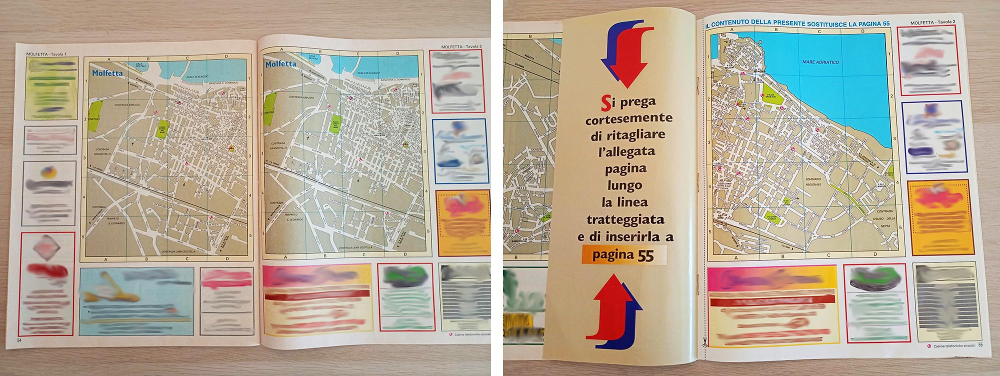
<figcaption>A sinistra, la cartografia di Molfetta con la tavola 1 duplicata; a destra, l'allegato con la pagina corretta</figcaption>
</figure>

## L'indice degli articoli, 1990-1997

Dall'annata 1989/90 ciascuna provincia ha una rubrica di articoli su storia, ambiente ed economia locale — in molti fascicoli sottotitolata «Vivere la città» — che perdura fino all'annata 1996/97. Sono 292 titoli in 8 annate, mai indicizzati altrove: un piccolo corpus di giornalismo locale distribuito gratuitamente in centinaia di migliaia di copie e poi scomparso senza lasciare traccia in alcuna risorsa online.

Per l'annata 95/96 il fascicolo non è in raccolta e l'indice resta in sospeso.

I titoli sono trascritti come compaiono nel fascicolo. Il testo degli articoli non è riprodotto: i diritti appartengono all'editore.

<figure class="figura">

<figcaption>Copertina del fascicolo Bari 90</figcaption>
</figure>
<figure class="figura">

<figcaption>Copertina del fascicolo Brindisi 90</figcaption>
</figure>
<figure class="figura">

<figcaption>Copertina del fascicolo Foggia 90</figcaption>
</figure>
<figure class="figura">

<figcaption>Copertina del fascicolo Lecce 90</figcaption>
</figure>
<figure class="figura">

<figcaption>Copertina del fascicolo Taranto 90</figcaption>
</figure>

<h3 id="articoli-89-90">Annata 89/90</h3>
<dl class="articoli">
  <dt>Bari</dt>
  <dd>Anni 90. I robot all'avanguardia <b class="perno">&bull;</b> Identikit di una provincia <b class="perno">&bull;</b> Una Fiera per l'Europa <b class="perno">&bull;</b> Tecnopolis, dove si alleva il futuro <b class="perno">&bull;</b> I puntigli di Laterza e i "visti" di Croce <b class="perno">&bull;</b> I nomi delle vie raccontano la storia <b class="perno">&bull;</b> La Belle Epoque degli Antonelli <b class="perno">&bull;</b> La chiesa costruita con i rubli <b class="perno">&bull;</b> Fra torri e castelli, un viaggio nel tempo <b class="perno">&bull;</b> De Nittis, un barlettano a Parigi <b class="perno">&bull;</b> Putignano, città delle spose <b class="perno">&bull;</b> Il dialetto a tavola</dd>
  <dt>Brindisi</dt>
  <dd>Anni 90. Energia per il futuro <b class="perno">&bull;</b> Identikit di una provincia <b class="perno">&bull;</b> Un porto verso l'Oriente <b class="perno">&bull;</b> La Valigia delle Indie e Phileas Fogg <b class="perno">&bull;</b> Nomi e cognomi. Il signor Sconosciuto abita solo qui <b class="perno">&bull;</b> Date storiche <b class="perno">&bull;</b> Sfila il Cavallo parato <b class="perno">&bull;</b> I nemici dei Templari <b class="perno">&bull;</b> Le bianche case di Ostuni raccontano <b class="perno">&bull;</b> La ricetta della nonna <b class="perno">&bull;</b> Il monumento al Marinaio</dd>
  <dt>Foggia</dt>
  <dd>Anni 90. La terza università della Puglia <b class="perno">&bull;</b> Identikit di una provincia <b class="perno">&bull;</b> Nomi e cognomi. Amleto e Ofelia abitano qui <b class="perno">&bull;</b> Date storiche <b class="perno">&bull;</b> Il barocco in Capitanata <b class="perno">&bull;</b> Fra i tesori di Zingarelli <b class="perno">&bull;</b> Anno 1900. La visita del ministro <b class="perno">&bull;</b> L'industria del Gargano <b class="perno">&bull;</b> Con la zampogna a Monte Sant'Angelo <b class="perno">&bull;</b> Margherita di Savoia, il paesaggio del sale <b class="perno">&bull;</b> Le fosse del grano di Cerignola <b class="perno">&bull;</b> La ricetta della nonna</dd>
  <dt>Lecce</dt>
  <dd>Anni 90. Protagonista l'università <b class="perno">&bull;</b> Identikit di una provincia <b class="perno">&bull;</b> Nomi e cognomi. Il mistero di Otranto <b class="perno">&bull;</b> Date storiche <b class="perno">&bull;</b> Dietro l'oro del barocco <b class="perno">&bull;</b> Il bel canto di Tito Schipa <b class="perno">&bull;</b> Anno 1900. Lecce degli spiriti <b class="perno">&bull;</b> Incolla l'arte. La fortuna dei cartapestai <b class="perno">&bull;</b> Leverano. L'orgoglio dei gladioli <b class="perno">&bull;</b> Le botti del Negro amaro <b class="perno">&bull;</b> La ricetta della nonna</dd>
  <dt>Taranto</dt>
  <dd>Anni 90. Il rilancio sul mare <b class="perno">&bull;</b> Le tre anime di una città <b class="perno">&bull;</b> Un secolo sul ponte girevole <b class="perno">&bull;</b> Le ariette di Paisiello e la disputa nuziale <b class="perno">&bull;</b> Lo sceicco di Castellaneta <b class="perno">&bull;</b> Grottaglie. L'arte del "cucco" <b class="perno">&bull;</b> La ricetta della nonna</dd>
</dl>
<h3 id="articoli-90-91">Annata 90/91</h3>
<dl class="articoli">
  <dt>Bari</dt>
  <dd>Verso il '92. Un'economia sana per la città di domani <b class="perno">&bull;</b> Tornano gli emigrati <b class="perno">&bull;</b> Attendendo il Difensore civico <b class="perno">&bull;</b> Come eravamo. Il despota Ferdinando <b class="perno">&bull;</b> Nomi e cognomi. Amleto fra Vito e Michael <b class="perno">&bull;</b> San Nicola.Il pellegrino dietro il paravento <b class="perno">&bull;</b> Via Sparano, salotto della città <b class="perno">&bull;</b> Tommaso Fiore e il popolo di formiche <b class="perno">&bull;</b> La "Gazzetta" centenaria <b class="perno">&bull;</b> Trani, la cattedrale sul mare <b class="perno">&bull;</b> La freccia Mennea <b class="perno">&bull;</b> Vini e gastronomia. Sapori di terra e di mare <b class="perno">&bull;</b> La ricetta della nonna</dd>
  <dt>Brindisi</dt>
  <dd>Verso il '92. Agricoltura europea <b class="perno">&bull;</b> Il porto… trainante <b class="perno">&bull;</b> Come eravamo. Capitale per sei mesi <b class="perno">&bull;</b> Antiche chiese rurali <b class="perno">&bull;</b> I "tre cuori" della cultura salentina <b class="perno">&bull;</b> Vini e gastronomia. Mare e Grecia, i padrini</dd>
  <dt>Foggia</dt>
  <dd>in sospeso il fascicolo Foggia 91 non è in raccolta</dd>
  <dt>Lecce</dt>
  <dd>Verso il '92. Un centro di ricerca nel futuro della città <b class="perno">&bull;</b> Qualità della vita e diritto alla storia <b class="perno">&bull;</b> La stampa locale. "Quotidiano" d'assalto per l'informazione leccese <b class="perno">&bull;</b> Santi naïf sulla Serra di Sant'Eleuterio <b class="perno">&bull;</b> Come eravamo. La balbuzie di Libertini <b class="perno">&bull;</b> Una strage sotto la spada dell'Islam <b class="perno">&bull;</b> Giulietta e Romeo in terra di Puglia <b class="perno">&bull;</b> Accademie, che pasione! <b class="perno">&bull;</b> Le masserie di Nardò contro pirati e invasori <b class="perno">&bull;</b> Religiosità marinara a Gallipoli <b class="perno">&bull;</b> Vini e gastronomia. Il cappello del gendarme <b class="perno">&bull;</b> Fette di puccia per il digiuno <b class="perno">&bull;</b> La danza di Franco <b class="perno">&bull;</b> Coste leccesi: novità per il turismo intelligente <b class="perno">&bull;</b> Squinzano. Il Museo del Salento <b class="perno">&bull;</b> Dall'agnello ai dolci la tradizione della cucina pasquale</dd>
  <dt>Taranto</dt>
  <dd>Verso il '92. Il futuro è il terziario <b class="perno">&bull;</b> Diminuiscono i disoccupati <b class="perno">&bull;</b> Come eravamo. Le corazzate di Riboty <b class="perno">&bull;</b> Nomi e cognomi. San Cataldo patrono coraggioso <b class="perno">&bull;</b> Taranto, ricca ed elegante figlia di Sparta <b class="perno">&bull;</b> La stampa locale. Nella città dei tre quotidiani <b class="perno">&bull;</b> Martina Franca. L'albo dei morelli <b class="perno">&bull;</b> L'epopea de quarto centro siderurgico <b class="perno">&bull;</b> Un canonico appassionato di storia patria <b class="perno">&bull;</b> Incunaboli, Cinquecentine e manoscritti a Manduria <b class="perno">&bull;</b> Vini e gastronomia. I grandi piatti del mar Piccolo <b class="perno">&bull;</b> Quelle paricelle bionde e gentili <b class="perno">&bull;</b> Taranto calcio, profumo d'avventura</dd>
</dl>
<h3 id="articoli-91-92">Annata 91/92</h3>
<dl class="articoli">
  <dt>Bari</dt>
  <dd>Per vivere meglio. Voglia di rinnovamento nella città-regione <b class="perno">&bull;</b> Nella "città prussiana" la passione per i libri <b class="perno">&bull;</b> San Nicola va per mare <b class="perno">&bull;</b> Da via Sparano all'antica città marinara <b class="perno">&bull;</b> Salvemini e la questione meridionale <b class="perno">&bull;</b> Branzini e gamberetti la ricchezza di Molfetta <b class="perno">&bull;</b> Monopoli, gli affreschi sulla roccia <b class="perno">&bull;</b> Altamura e il genio musicale di Mercadante <b class="perno">&bull;</b> Il "grand-tour" dell'abate Saint-Non tra i pugliesi curiosi e divertiti <b class="perno">&bull;</b> Galletti battono aquilotti nel referendum tra tifosi <b class="perno">&bull;</b> Vini e gastronomia. Il fasciolo delle orecchiette "strascinate" sulla tavola</dd>
  <dt>Brindisi</dt>
  <dd>Per vivere meglio. La chimica rilancia e si punta sul turismo <b class="perno">&bull;</b> Due voci per la città <b class="perno">&bull;</b> Mimmo continua a volare nel blu <b class="perno">&bull;</b> Un viaggio faticoso di Orazio e Virgilio <b class="perno">&bull;</b> La grotta dei bizantini <b class="perno">&bull;</b> 1900: la paura della peste <b class="perno">&bull;</b> Itinerari per il week-end. Nelle Murge da Ostuni a Fasano <b class="perno">&bull;</b> In tavola sapori d'Oriente</dd>
  <dt>Foggia</dt>
  <dd>Per vivere meglio. Foggia, un futuro per i giovani <b class="perno">&bull;</b> Due quotidiani a confronto <b class="perno">&bull;</b> Quelli del bar Càvour. Le radici di Arbore <b class="perno">&bull;</b> Un monumento alla musica <b class="perno">&bull;</b> Strusci, ninnenanne, laudi: canta la Capitanata <b class="perno">&bull;</b> San Leonardo, la meraviglia del solstizio <b class="perno">&bull;</b> Quando Lucera era "Saracenorum" <b class="perno">&bull;</b> Nal Museo di Monte Sant'Angelo le immagini della cultura popolare <b class="perno">&bull;</b> Manfredonia, l'impegno per lo sviluppo <b class="perno">&bull;</b> I guerrieri valdesi nel borgo di Faìtë <b class="perno">&bull;</b> Foggia e il "suo" Zeman <b class="perno">&bull;</b> Viaggiatori antichi. In carrozza nella terra fiorita del principe Manfredi <b class="perno">&bull;</b> Itinerari per il week-end. Alla scoperta del Gargano tra oliveti, grotte e baie <b class="perno">&bull;</b> Vini e gastronomia. Il trionfo delle verdure <b class="perno">&bull;</b> Una cucina "peristorica</dd>
  <dt>Lecce</dt>
  <dd>Per vivere meglio. Lecce investe sulla sua cultura <b class="perno">&bull;</b> Ora la provincia vuole l'industria <b class="perno">&bull;</b> Pisanelli, un ministro da Trecase <b class="perno">&bull;</b> Quando Gallipoli divenne un'isola <b class="perno">&bull;</b> Dialetti e nomi. Calimera, un buon augurio <b class="perno">&bull;</b> L'arte fantastica con la pietra di Lecce <b class="perno">&bull;</b> I mosaici bizantini di Casaranello <b class="perno">&bull;</b> Gioacchino Torna il grande pittore intimista <b class="perno">&bull;</b> Dolmen e menhir a Maglie <b class="perno">&bull;</b> Viaggiatori antichi. Una scrittrice inglese sulle tracce di Manfredi <b class="perno">&bull;</b> Vini e gastronomia. Una pasta "archeologica"</dd>
  <dt>Taranto</dt>
  <dd>Per vivere meglio. Giovani e anziani per il futuro della città <b class="perno">&bull;</b> Taranto, la Gibiterra di Napoleone <b class="perno">&bull;</b> Tarantella fra due mari <b class="perno">&bull;</b> Pirro e la carica dei "buoi di Lucania" <b class="perno">&bull;</b> Una città di grotte nelle gravine di Massafra <b class="perno">&bull;</b> A Grottaglie nel quartiere delle fornaci <b class="perno">&bull;</b> Viaggiatori antichi. Una scrittrice fra i pescatori <b class="perno">&bull;</b> Vini e gastronomia. Ostriche e cozze con l'aglio, le due signore del mare</dd>
</dl>
<h3 id="articoli-92-93">Annata 92/93</h3>
<dl class="articoli">
  <dt>Bari</dt>
  <dd>Italia domani. Bari leader nel Meridione <b class="perno">&bull;</b> La Caravella riparte verso nuovi mondi <b class="perno">&bull;</b> Anno 1900: il principe inaugura le Mostre <b class="perno">&bull;</b> Dialetto e nomi. Il misterioso Cuzzocrea e la coppia Zito e Zita <b class="perno">&bull;</b> Bisceglie orfana della duchessa <b class="perno">&bull;</b> Un pittore devoto per la sindone di Bitonto <b class="perno">&bull;</b> Stefano da Putignano scultore del fantastico <b class="perno">&bull;</b> Il carnevale più lungo d'Italia <b class="perno">&bull;</b> Arte in tavola. Le fave, segreto di Ercole <b class="perno">&bull;</b> Bari, voglia di teatro dalla prosa ai concerti</dd>
  <dt>Brindisi</dt>
  <dd>Italia domani. Turismo e agricoltura di nuovo protagonisti <b class="perno">&bull;</b> Viaggiatori antichi. Un francese davanti al porto insabbiato nella Brindisi di metà Settecento <b class="perno">&bull;</b> La fontana del principe Tancredi <b class="perno">&bull;</b> Gli antichi romani a Villa Castelli <b class="perno">&bull;</b> Dialetto e nomi. Guadalupi e Sances arrivano dalla Spagna <b class="perno">&bull;</b> Gli archi di Ostuni e le dune di Torre Guaceto <b class="perno">&bull;</b> Da Mesagne a Francavilla tra castelli e santuari <b class="perno">&bull;</b> I piatti brindisini anche per l'Ultima Cena <b class="perno">&bull;</b> Alle terme di Torre Canne</dd>
  <dt>Foggia</dt>
  <dd>Italia domani. Foggia punta sulla sviluppo che rispetta il territorio <b class="perno">&bull;</b> Con gli impianti della Fiat riparte l'occupazione <b class="perno">&bull;</b> Manfredonia, sfide a passo di danza <b class="perno">&bull;</b> Così parlò l'arcangelo Michele <b class="perno">&bull;</b> Nel parco del Gargano un tesoro sotto i "colossi"</dd>
  <dt>Lecce</dt>
  <dd>in sospeso il fascicolo Lecce 93 non è in raccolta</dd>
  <dt>Taranto</dt>
  <dd>Italia domani. Una nuova coscienza civile per la città dei due mari <b class="perno">&bull;</b> Taranto e gli anziani le prime risposte <b class="perno">&bull;</b> Stella Maris, patrona dei pescatori <b class="perno">&bull;</b> Nei giardini incantati dei mitili e delle ostriche <b class="perno">&bull;</b> Il mare in laboratorio <b class="perno">&bull;</b> Le date della città, da Sparta al regno d'Italia <b class="perno">&bull;</b> Un baluardo sul porto contro la minaccia turca <b class="perno">&bull;</b> Dialetto e nomi. Il podere del ragazzo Carosino <b class="perno">&bull;</b> Al suono della troccola incedono "le perdùne" <b class="perno">&bull;</b> Nasce a Manduria il parco archeologico <b class="perno">&bull;</b> Martina Franca, l'arte dei ferri battuti <b class="perno">&bull;</b> Il fasto barocco del palazzo Ducale <b class="perno">&bull;</b> Vini e gastronomia. Zuppa di pesci e molluschi con un calice di Martina</dd>
</dl>
<h3 id="articoli-93-94">Annata 93/94</h3>
<dl class="articoli">
  <dt>Bari</dt>
  <dd>Il nuovo che emerge. Il mondo della solidarietà apre le porte all'Europa <b class="perno">&bull;</b> Nasce a Putignano la scuola per economisti <b class="perno">&bull;</b> Il monumento da salvare. San Nicola, quartiere-scrigno può tornare a risplendere <b class="perno">&bull;</b> Dal romanico al neoclassico, gli stili di Bari <b class="perno">&bull;</b> Le donne di Piccinni maestro dell'opera comica <b class="perno">&bull;</b> I nomi di pietra. L'"apostolato" di Bovio a fianco degli oppressi <b class="perno">&bull;</b> Appunti di storia <b class="perno">&bull;</b> Miti, leggende. L'oro di san Nicola e il pianto del colosso <b class="perno">&bull;</b> Dal rock al blues la musica emergente <b class="perno">&bull;</b> Barletta, la pinacoteca in convento <b class="perno">&bull;</b> Per la cattedrale di Canosa il restauro non può fermarsi <b class="perno">&bull;</b> Andria ricorda Federico il primo re moderno <b class="perno">&bull;</b> Il miracolo di Attolico, portiere per caso <b class="perno">&bull;</b> La provincia verde. Fiorisce l'asfodelo dell'Orto del re <b class="perno">&bull;</b> Le virtù della "palma a ventaglio" <b class="perno">&bull;</b> Antiche ricette. Il pane, croccante piacere da riscoprire</dd>
  <dt>Brindisi</dt>
  <dd>Il nuovo che emerge. Brindisi, le botteghe delle idee <b class="perno">&bull;</b> Il monumento da salvare. Sotto il Portico, il mistero dei Templari <b class="perno">&bull;</b> I nomi di pietra. Imperatori e poeti latini nel cuore della città <b class="perno">&bull;</b> Fisica e informatica sui banchi del liceo <b class="perno">&bull;</b> Miti e leggende. L'orco buono e la bella Margherita <b class="perno">&bull;</b> Gli estremisti del rock escono dal "sottosuolo" <b class="perno">&bull;</b> L'ultimo match del grande Zurlo <b class="perno">&bull;</b> Antiche ricette. Il rituale dei polpi sott'aceto <b class="perno">&bull;</b> La provincia verde. Le dune di Torre Guaceto <b class="perno">&bull;</b> Dal pino d'Aleppo la resina migliore</dd>
  <dt>Foggia</dt>
  <dd>Il nuovo che emerge. La fattoria dei ragazzi dove nasce la speranza <b class="perno">&bull;</b> Gli studenti in fabbrica per una scuola diversa <b class="perno">&bull;</b> Il monumento da salvare. L'epitaffio dei pastori alla fine del tratturo <b class="perno">&bull;</b> Miti e leggende. Sulle tracce di uomini e draghi <b class="perno">&bull;</b> Napoli e gli States nella musica tra Arbore e Raf <b class="perno">&bull;</b> La provincia verde. Nell'Amazzonia pugliese fra orchidee e ornielli <b class="perno">&bull;</b> La quercia dalle ghiande amare <b class="perno">&bull;</b> Successo a filo di spada <b class="perno">&bull;</b> Arte in tavola. Cultura e gastronomia capolavori dimenticati</dd>
  <dt>Lecce</dt>
  <dd>Il nuovo che emerge. Un rifugio per chi non ha casa <b class="perno">&bull;</b> Informatica e linguistica nei corsi sperimentali <b class="perno">&bull;</b> Il monumento da salvare. L'anfiteatro voluto da Adriano <b class="perno">&bull;</b> Buona musica in fermento al ritmo delle posse <b class="perno">&bull;</b> La provincia verde. Gli aironi del Pantano di Cesine <b class="perno">&bull;</b> La quercia coperta di spine <b class="perno">&bull;</b> Fefé, il piccolo gigante della pallavolo <b class="perno">&bull;</b> Antiche ricette. Pasta e carne a braccetto <b class="perno">&bull;</b> Galatina, oro e argento nella chiesa restaurata</dd>
  <dt>Taranto</dt>
  <dd>Il nuovo che emerge. Un'isola della fantasia nel cuore del centro storico <b class="perno">&bull;</b> Informatica al liceo per imparare le lingue <b class="perno">&bull;</b> Il monumento da salvare. Città Vecchia, capolavoro in pericolo <b class="perno">&bull;</b> I nomi di pietra. Le strade dei ministri e dei poeti <b class="perno">&bull;</b> Dalle cripte bizantine di Massafra al rococò di Martina Franca <b class="perno">&bull;</b> Il mare nel parco tecnologico <b class="perno">&bull;</b> Miti, leggende. La sirena triste salvata dalle fate <b class="perno">&bull;</b> Rock dai colori mediterranei <b class="perno">&bull;</b> La provincia verde. Nelle gravine, fra boschi e canyon <b class="perno">&bull;</b> Il fragno che giunse dall'antica Troia <b class="perno">&bull;</b> Taranto, crisi del calcio e boom del calcetto <b class="perno">&bull;</b> Antiche ricette. Martina Franca e le ostriche di Campanile</dd>
</dl>
<h3 id="articoli-94-95">Annata 94/95</h3>
<dl class="articoli">
  <dt>Bari</dt>
  <dd>Progetti giovani. Il futuro si chiama impresa <b class="perno">&bull;</b> Un Politecnico europeo per l'arte e l'ambiente <b class="perno">&bull;</b> 1895-1995. Cinema! Polvere di stelle. Il sogno del Petruzzelli <b class="perno">&bull;</b> Piccoli editori, la sfida continua <b class="perno">&bull;</b> Marco Armani, l'ottimismo della buona musica <b class="perno">&bull;</b> Barletta, la Madonna dei crociati <b class="perno">&bull;</b> Rialza il sipario lo storico "Margherita" <b class="perno">&bull;</b> Un giardino didattico nella scuola di Rutiglianp <b class="perno">&bull;</b> Calmati, mangia una mela! <b class="perno">&bull;</b> Ciccillo, l'antenato di Altamura <b class="perno">&bull;</b> Ruvo, le meraviglie dei vasi <b class="perno">&bull;</b> Itinerari per il week-end. Da Giovinazzo a Trani fra doline e castelli <b class="perno">&bull;</b> Un pranzo principesco con le "strascinate" <b class="perno">&bull;</b> Barletta, santa Lucia annuncia il Natale <b class="perno">&bull;</b> In vacanza nelle antiche masserie, tra mandorli e ulivi</dd>
  <dt>Brindisi</dt>
  <dd>Progetti giovani. A scuola di turismo per vacanze di qualità <b class="perno">&bull;</b> "Desiderio", passione a Torre Canne <b class="perno">&bull;</b> San Leucio e il miracolo della pioggia <b class="perno">&bull;</b> Una madre preistorica nella grotta di Ostuni <b class="perno">&bull;</b> Benarrivo, la "locomotiva" da Brindisi al Parma</dd>
  <dt>Foggia</dt>
  <dd>Progetti giovani. A scuola per diventare tecnici dell'ambiente <b class="perno">&bull;</b> La leggenda dei santi pellegrini <b class="perno">&bull;</b> Quel piccolo bosco nel giardino neoclassico <b class="perno">&bull;</b> 1895-1995. Cinema! Totò e le gambe d'oro del Cerignola <b class="perno">&bull;</b> Foggia e le feste dell'imperatore <b class="perno">&bull;</b> Mario Carli, il futurista di San Severo <b class="perno">&bull;</b> Alla scoperta del Tavoliere sui "sentieri della natura" <b class="perno">&bull;</b> Il "primm'ammore" di Tony è Sant'Agata di Puglia <b class="perno">&bull;</b> Santa Maria, gioiello romanico a Siponto <b class="perno">&bull;</b> Le salsicce provenzali di Celle e Faeto</dd>
  <dt>Lecce</dt>
  <dd>in sospeso il fascicolo Lecce 95 non è in raccolta</dd>
  <dt>Taranto</dt>
  <dd>in sospeso il fascicolo Taranto 95 non è in raccolta</dd>
</dl>
<h3 id="articoli-95-96">Annata 95/96</h3>
<dl class="articoli">
  <dt>Bari</dt>
  <dd>in sospeso il fascicolo Bari 96 non è in raccolta</dd>
  <dt>Brindisi</dt>
  <dd>in sospeso il fascicolo Brindisi 96 non è in raccolta</dd>
  <dt>Foggia</dt>
  <dd>in sospeso il fascicolo Foggia 96 non è in raccolta</dd>
  <dt>Lecce</dt>
  <dd>in sospeso il fascicolo Lecce 96 non è in raccolta</dd>
  <dt>Taranto</dt>
  <dd>in sospeso il fascicolo Taranto 96 non è in raccolta</dd>
</dl>
<h3 id="articoli-96-97">Annata 96/97</h3>
<dl class="articoli">
  <dt>Bari</dt>
  <dd>Bari on line informa i cittadini <b class="perno">&bull;</b> In biblioteca: dove, quando e perché <b class="perno">&bull;</b> Le donne pugliesi otto secoli di orgoglio <b class="perno">&bull;</b> A Terlizzi il computer fa fiorire le orchidee <b class="perno">&bull;</b> La provincia verde. La Murgia, dove vive la natura <b class="perno">&bull;</b> Il geranio, gioia del giardiniere dilettante <b class="perno">&bull;</b> Itinerari per il week-end. Da Giovinazzo a Trani, torri sul mare <b class="perno">&bull;</b> Gli aromi della cucina rustica nelle capitali del buon vino <b class="perno">&bull;</b> Le spiagge del mare pulito</dd>
  <dt>Brindisi</dt>
  <dd>in sospeso il fascicolo Brindisi 97 non è in raccolta</dd>
  <dt>Foggia</dt>
  <dd>in sospeso il fascicolo Foggia 97 non è in raccolta</dd>
  <dt>Lecce</dt>
  <dd>in sospeso il fascicolo Lecce 97 non è in raccolta</dd>
  <dt>Taranto</dt>
  <dd>Il valoroso San Cataldo che giunse dall'Irlanda <b class="perno">&bull;</b> Itinerari per il week-end. Gravine e tesori d'arte da Grottaglie a Manduria <b class="perno">&bull;</b> La provincia verde. In bici nelle Murge fra boschi e masserie <b class="perno">&bull;</b> Il magico biancospino per gli spiriti e le fate <b class="perno">&bull;</b> San Pasquale, un tesoro nato tra le polemiche <b class="perno">&bull;</b> Tra i libri</dd>
</dl>

## Un esemplare fuori serie: Bari 1996 con layout '90 riformato

Alla raccolta appartiene un fascicolo barese che non corrisponde a nessuna edizione distribuita. Ha la veste grafica del layout *TuttoCittà '90 riformato* e la finestra d'uso febbraio 1998 - gennaio 1999, la stessa del fascicolo regolare dell'annata 1997/98, ma il colophon lo intitola *TuttoCittà 1997* e ne data l'aggiornamento a dicembre 1996. In copertina, dove le edizioni regolari non riportano nulla, compare un sommario in forma molto ridotta.

Il fascicolo conta 28 pagine numerate contro le 60 del fascicolo regolare della stessa annata. La differenza non è distribuita uniformemente: la cartografia passa da 30 pagine a 7 e l'elenco delle vie da 10 a una sola, troncata a metà della lettera C, mentre le rubriche redazionali passano da 14 a 18. L'esemplare fuori serie ha cioè **più** pagine di rubriche del fascicolo regolare, e i titoli delle rubriche non ne sono un sottoinsieme: sono un insieme diverso, che comprende sezioni su musei, teatro, impianti sportivi, parchi e itinerari assenti dall'edizione uscita.

Della cartografia di Bari, undici tavole nell'edizione regolare, ne compaiono tre; della mappa delle linee urbane, quattro tavole, ne compaiono due; dei dodici comuni della provincia compare la sola prima tavola di Monopoli. Il quadro d'unione, il sommario e tutte le sezioni previste ci sono e si susseguono nell'ordine consueto; la numerazione delle pagine è continua e senza salti, e il sommario rimanda alla paginazione effettiva del fascicolo. L'elenco delle vie, invece, rinvia a tutte e undici le tavole di Bari, comprese quelle che il fascicolo non contiene.

I contenuti redazionali sono più antichi del fascicolo. La rubrica degli spettacoli riporta appuntamenti del 1995, e solo fino al mese di maggio; quella degli appuntamenti in provincia riporta anch'essa date del 1995, riorganizzate però per città, mentre nel fascicolo del 1995 comparivano in un unico elenco diviso per mesi. Le inserzioni pubblicitarie sono di esercizi di Bari e provincia realmente esistiti, ma non compaiono in nessuno dei fascicoli baresi del 1995, del 1997 e del 1998.

Quanto segue qui sotto è solo un'interpretazione e come tale va presa.

L'insieme di questi caratteri è difficile da spiegare come il guasto di un'edizione, perché il fascicolo non è un prodotto rotto ma un prodotto finito: struttura completa, numerazione coerente, sommario esatto. Si spiega meglio come un esemplare dimostrativo della riforma editoriale, allestito nel dicembre 1996 per mostrare come sarebbe stato il TuttoCittà del 1998. In questa lettura i contenuti del 1995 sono un riempitivo, riorganizzato per illustrare la struttura nuova; le poche tavole servono a mostrare la resa della cartografia senza riprodurre l'intera provincia; l'elenco delle vie riempie lo spazio rimasto e si interrompe dove la pagina finisce; le inserzioni mostrano agli inserzionisti e alla rete di vendita gli spazi del prodotto riformato. La data del colophon sarebbe quella in cui l'esemplare fu preparato, non quella di un'edizione.

Depone nella stessa direzione il fatto che quelle inserzioni non si ritrovino in alcuna edizione distribuita: uno spazio pubblicitario venduto per un'annata compare in quell'annata, e un insieme che non compare in nessuna non può essere stato una consegna commerciale.

Questo è il solo esemplare del genere finora noto, ma la sua rarità apparente non è un dato: è l'assenza di osservazioni. La riforma del layout non raggiunse tutte le regioni nello stesso anno, e Bari appartiene alla prima ondata, quella dell'annata 1997/98; esemplari analoghi potrebbero quindi esistere per le altre aree interessate dalla riforma in quell'anno, e nessuno finora è stato segnalato. Si riconoscerebbero dal sommario ridotto in copertina e dallo spessore molto inferiore a quello atteso.

<figure class="figura larga">
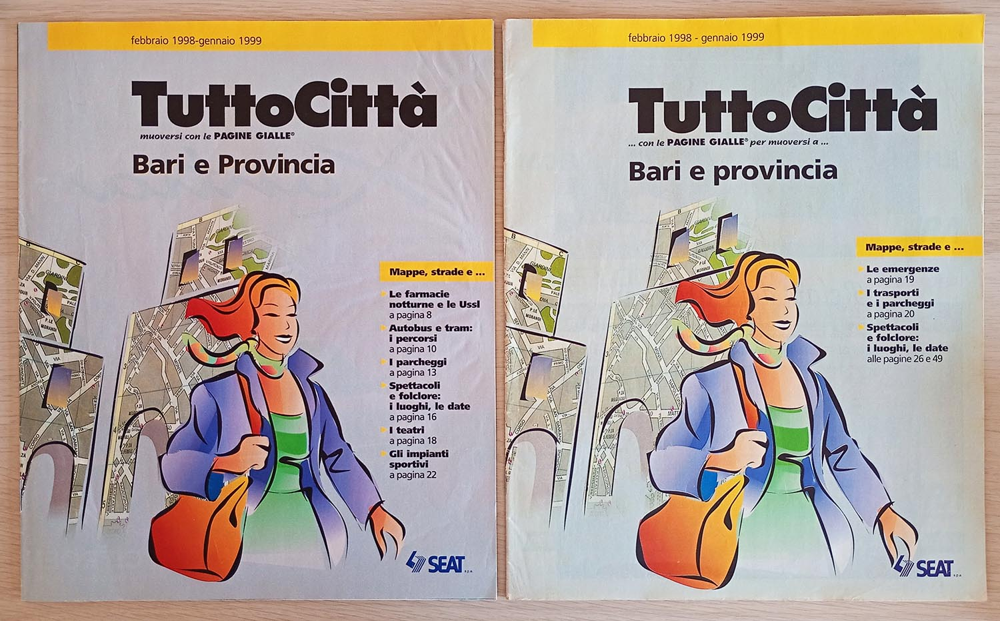
<figcaption>I due fascicoli affiancati: a sinistra quello fuori serie, a destra quello regolare</figcaption>
</figure>

<figure class="figura larga">
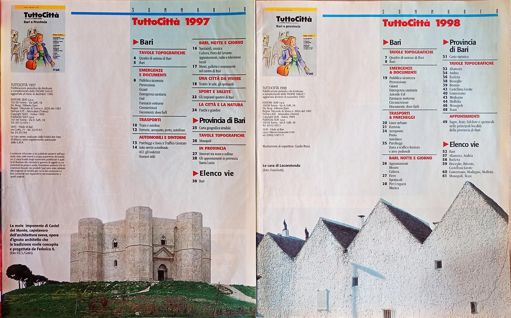
<figcaption>I sommari dei due fascicoli: a sinistra quello fuori serie, a destra quello regolare</figcaption>
</figure>

## I dati

- [`puglia_fascicoli.csv`](../dati/puglia_fascicoli.csv) — un fascicolo per riga: foliazione, layout, formato, copertina, presenza in raccolta e certezza dell'esistenza
- [`puglia_cartografia.csv`](../dati/puglia_cartografia.csv) — un comune per riga e per annata, con la provincia e se compariva nell'elenco delle vie
- [`puglia_articoli.csv`](../dati/puglia_articoli.csv) — un titolo per riga: l'indice delle rubriche provinciali

Chi possiede i fascicoli mancanti e vuole vedere questa pagina completata troverà nelle [questioni aperte](questioni-aperte.md) come contribuire.
