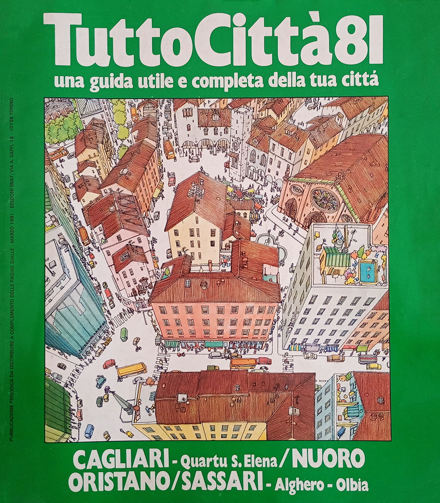
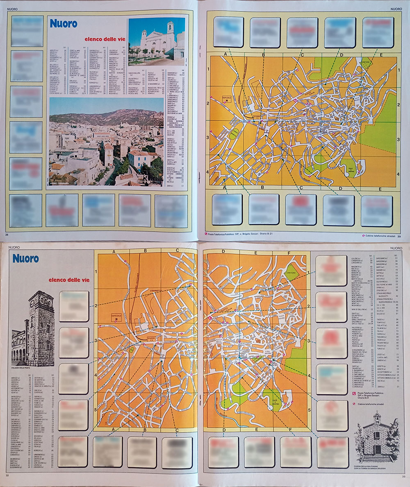
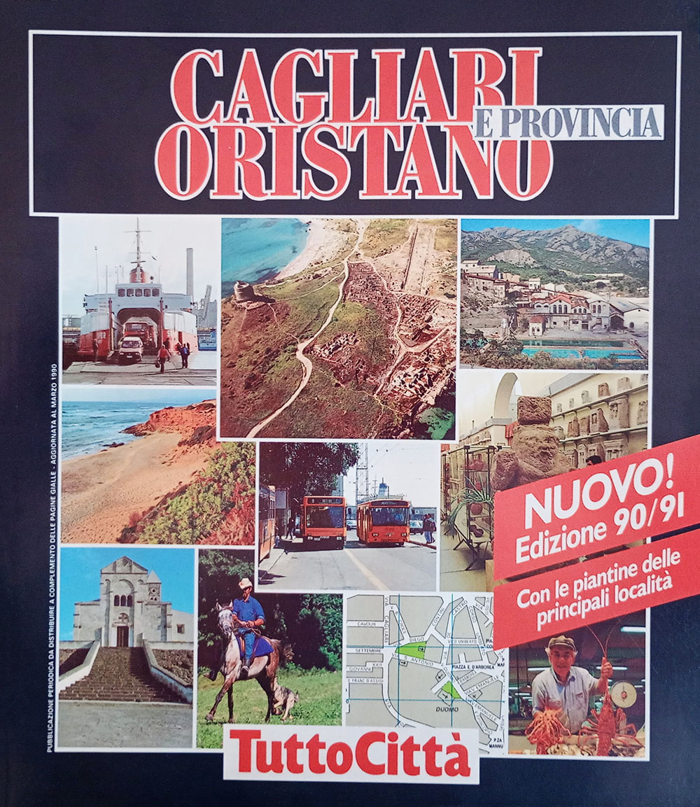
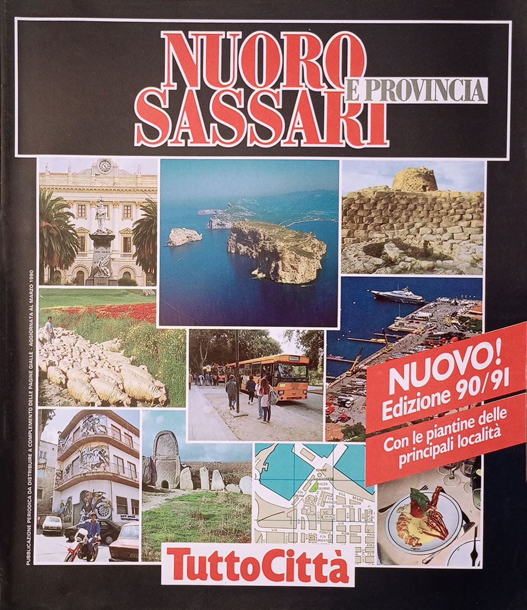

# La Sardegna in dettaglio

Questa pagina sperimentale si occupa di definire con estrema precisione l'organizzazione interna dei
fascicoli di un'intera regione, la Sardegna, l'unica di cui la raccolta su cui si basa questo studio
includa tutti i fascicoli accertati. Serve anche per dimostrare come una serie completa consenta una
verifica estremamente puntuale e particolareggiata che una serie con dei buchi non consente, perché
quasi tutto quello che si legge qui sotto emerge dal confronto fra un'annata e la successiva.

Il censimento registra 872 occorrenze di sezione riconducibili a 63 rubriche distinte,
1839 titoli di contenuto (357 diversi) e 463 righe di cartografia,
una per ogni città cartografata in ogni fascicolo.

<figure class="figura">

<figcaption>Copertina del fascicolo Cagliari - Nuoro - Oristano - Sassari 81</figcaption>
</figure>

## Le rubriche, annata per annata

Ogni riga e una rubrica, ogni colonna una delle 34 annate, dal 1981/82 al 2014/15. La regione
ha due serie parallele: i fascicoli dal 1981/82 al 1983/84 coprono tutte e quattro le province, poi la
serie si divide in Cagliari e Nuoro-Sassari, e quest'ultima cessa con il 1997/98. La griglia le tiene
distinte, perché una rubrica può sopravvivere in una serie e sparire dall'altra.

I titoli sono quelli normalizzati. L'editore rinominava spesso le rubriche senza cambiarne il
contenuto, e prendere per buoni i titoli di copertina farebbe morire e rinascere sezioni che invece
duravano vent'anni: «Elenco delle vie» che diventa «Elenco vie», «Trasporti» che diventa «I trasporti»
e poi «Trasporti e parcheggi». Il criterio per distinguere una rinomina da una rubrica nuova non e la
somiglianza del titolo ma la compresenza: due sezioni che non compaiono mai nello stesso fascicolo e i
cui intervalli si susseguono sono quasi sempre la stessa cosa; due che convivono sono cose diverse per
definizione.

Espandi la griglia delle rubriche — 63 rubriche su 34 annate

<table class="griglia">
  <thead><tr><th scope="col">Rubrica</th><th scope="col">81/82</th><th scope="col">82/83</th><th scope="col">83/84</th><th scope="col">84/85</th><th scope="col">85/86</th><th scope="col">86/87</th><th scope="col">87/88</th><th scope="col">88/89</th><th scope="col">89/90</th><th scope="col">90/91</th><th scope="col">91/92</th><th scope="col">92/93</th><th scope="col">93/94</th><th scope="col">94/95</th><th scope="col">95/96</th><th scope="col">96/97</th><th scope="col">97/98</th><th scope="col">98/99</th><th scope="col">99/00</th><th scope="col">00/01</th><th scope="col">01/02</th><th scope="col">02/03</th><th scope="col">03/04</th><th scope="col">04/05</th><th scope="col">05/06</th><th scope="col">06/07</th><th scope="col">07/08</th><th scope="col">08/09</th><th scope="col">09/10</th><th scope="col">10/11</th><th scope="col">11/12</th><th scope="col">12/13</th><th scope="col">13/14</th><th scope="col">14/15</th></tr></thead>
  <tbody>
  <tr><th scope="row">Tavole topografiche</th><td class="si" title="Tavole topografiche — 81/82: Cagliari, Nuoro - Sassari"></td><td class="si" title="Tavole topografiche — 82/83: Cagliari, Nuoro - Sassari"></td><td class="si" title="Tavole topografiche — 83/84: Cagliari, Nuoro - Sassari"></td><td class="si" title="Tavole topografiche — 84/85: Cagliari, Nuoro - Sassari"></td><td class="si" title="Tavole topografiche — 85/86: Cagliari, Nuoro - Sassari"></td><td class="si" title="Tavole topografiche — 86/87: Cagliari, Nuoro - Sassari"></td><td class="si" title="Tavole topografiche — 87/88: Cagliari, Nuoro - Sassari"></td><td class="si" title="Tavole topografiche — 88/89: Cagliari, Nuoro - Sassari"></td><td class="si" title="Tavole topografiche — 89/90: Cagliari, Nuoro - Sassari"></td><td class="si" title="Tavole topografiche — 90/91: Cagliari, Nuoro - Sassari"></td><td class="si" title="Tavole topografiche — 91/92: Cagliari, Nuoro - Sassari"></td><td class="si" title="Tavole topografiche — 92/93: Cagliari, Nuoro - Sassari"></td><td class="si" title="Tavole topografiche — 93/94: Cagliari, Nuoro - Sassari"></td><td class="si" title="Tavole topografiche — 94/95: Cagliari, Nuoro - Sassari"></td><td class="si" title="Tavole topografiche — 95/96: Cagliari, Nuoro - Sassari"></td><td class="si" title="Tavole topografiche — 96/97: Cagliari, Nuoro - Sassari"></td><td class="si" title="Tavole topografiche — 97/98: Cagliari, Nuoro - Sassari"></td><td class="si" title="Tavole topografiche — 98/99: Cagliari"></td><td class="si" title="Tavole topografiche — 99/00: Cagliari"></td><td class="si" title="Tavole topografiche — 00/01: Cagliari"></td><td class="si" title="Tavole topografiche — 01/02: Cagliari"></td><td class="si" title="Tavole topografiche — 02/03: Cagliari"></td><td class="si" title="Tavole topografiche — 03/04: Cagliari"></td><td class="si" title="Tavole topografiche — 04/05: Cagliari"></td><td class="si" title="Tavole topografiche — 05/06: Cagliari"></td><td class="si" title="Tavole topografiche — 06/07: Cagliari"></td><td class="si" title="Tavole topografiche — 07/08: Cagliari"></td><td class="si" title="Tavole topografiche — 08/09: Cagliari"></td><td class="si" title="Tavole topografiche — 09/10: Cagliari"></td><td class="si" title="Tavole topografiche — 10/11: Cagliari"></td><td class="si" title="Tavole topografiche — 11/12: Cagliari"></td><td class="si" title="Tavole topografiche — 12/13: Cagliari"></td><td class="si" title="Tavole topografiche — 13/14: Cagliari"></td><td class="si" title="Tavole topografiche — 14/15: Cagliari"></td></tr>
  <tr><th scope="row">Elenco vie</th><td class="si" title="Elenco vie — 81/82: Cagliari, Nuoro - Sassari"></td><td class="si" title="Elenco vie — 82/83: Cagliari, Nuoro - Sassari"></td><td class="si" title="Elenco vie — 83/84: Cagliari, Nuoro - Sassari"></td><td class="si" title="Elenco vie — 84/85: Cagliari, Nuoro - Sassari"></td><td class="si" title="Elenco vie — 85/86: Cagliari, Nuoro - Sassari"></td><td class="si" title="Elenco vie — 86/87: Cagliari, Nuoro - Sassari"></td><td class="si" title="Elenco vie — 87/88: Cagliari, Nuoro - Sassari"></td><td class="si" title="Elenco vie — 88/89: Cagliari, Nuoro - Sassari"></td><td class="si" title="Elenco vie — 89/90: Cagliari, Nuoro - Sassari"></td><td class="si" title="Elenco vie — 90/91: Cagliari, Nuoro - Sassari"></td><td class="si" title="Elenco vie — 91/92: Cagliari, Nuoro - Sassari"></td><td class="si" title="Elenco vie — 92/93: Cagliari, Nuoro - Sassari"></td><td class="si" title="Elenco vie — 93/94: Cagliari, Nuoro - Sassari"></td><td class="si" title="Elenco vie — 94/95: Cagliari, Nuoro - Sassari"></td><td class="si" title="Elenco vie — 95/96: Cagliari, Nuoro - Sassari"></td><td class="si" title="Elenco vie — 96/97: Cagliari, Nuoro - Sassari"></td><td class="si" title="Elenco vie — 97/98: Cagliari, Nuoro - Sassari"></td><td class="si" title="Elenco vie — 98/99: Cagliari"></td><td class="si" title="Elenco vie — 99/00: Cagliari"></td><td class="si" title="Elenco vie — 00/01: Cagliari"></td><td class="si" title="Elenco vie — 01/02: Cagliari"></td><td class="si" title="Elenco vie — 02/03: Cagliari"></td><td class="si" title="Elenco vie — 03/04: Cagliari"></td><td class="si" title="Elenco vie — 04/05: Cagliari"></td><td class="si" title="Elenco vie — 05/06: Cagliari"></td><td class="si" title="Elenco vie — 06/07: Cagliari"></td><td class="si" title="Elenco vie — 07/08: Cagliari"></td><td class="si" title="Elenco vie — 08/09: Cagliari"></td><td class="si" title="Elenco vie — 09/10: Cagliari"></td><td class="si" title="Elenco vie — 10/11: Cagliari"></td><td class="si" title="Elenco vie — 11/12: Cagliari"></td><td class="si" title="Elenco vie — 12/13: Cagliari"></td><td class="si" title="Elenco vie — 13/14: Cagliari"></td><td class="si" title="Elenco vie — 14/15: Cagliari"></td></tr>
  <tr><th scope="row">Cagliari - Sommario</th><td class="si" title="Cagliari - Sommario — 81/82: Cagliari, Nuoro - Sassari"></td><td class="si" title="Cagliari - Sommario — 82/83: Cagliari, Nuoro - Sassari"></td><td class="si" title="Cagliari - Sommario — 83/84: Cagliari, Nuoro - Sassari"></td><td class="si" title="Cagliari - Sommario — 84/85: Cagliari"></td><td class="si" title="Cagliari - Sommario — 85/86: Cagliari"></td><td class="si" title="Cagliari - Sommario — 86/87: Cagliari"></td><td class="si" title="Cagliari - Sommario — 87/88: Cagliari"></td><td class="si" title="Cagliari - Sommario — 88/89: Cagliari"></td><td class="si" title="Cagliari - Sommario — 89/90: Cagliari"></td><td class="si" title="Cagliari - Sommario — 90/91: Cagliari"></td><td class="no" title="Cagliari - Sommario — 91/92: assente"></td><td class="no" title="Cagliari - Sommario — 92/93: assente"></td><td class="no" title="Cagliari - Sommario — 93/94: assente"></td><td class="no" title="Cagliari - Sommario — 94/95: assente"></td><td class="no" title="Cagliari - Sommario — 95/96: assente"></td><td class="no" title="Cagliari - Sommario — 96/97: assente"></td><td class="no" title="Cagliari - Sommario — 97/98: assente"></td><td class="no" title="Cagliari - Sommario — 98/99: assente"></td><td class="no" title="Cagliari - Sommario — 99/00: assente"></td><td class="no" title="Cagliari - Sommario — 00/01: assente"></td><td class="no" title="Cagliari - Sommario — 01/02: assente"></td><td class="no" title="Cagliari - Sommario — 02/03: assente"></td><td class="no" title="Cagliari - Sommario — 03/04: assente"></td><td class="no" title="Cagliari - Sommario — 04/05: assente"></td><td class="no" title="Cagliari - Sommario — 05/06: assente"></td><td class="no" title="Cagliari - Sommario — 06/07: assente"></td><td class="no" title="Cagliari - Sommario — 07/08: assente"></td><td class="no" title="Cagliari - Sommario — 08/09: assente"></td><td class="no" title="Cagliari - Sommario — 09/10: assente"></td><td class="no" title="Cagliari - Sommario — 10/11: assente"></td><td class="no" title="Cagliari - Sommario — 11/12: assente"></td><td class="no" title="Cagliari - Sommario — 12/13: assente"></td><td class="no" title="Cagliari - Sommario — 13/14: assente"></td><td class="no" title="Cagliari - Sommario — 14/15: assente"></td></tr>
  <tr><th scope="row">Nuoro - Sommario</th><td class="si" title="Nuoro - Sommario — 81/82: Cagliari, Nuoro - Sassari"></td><td class="si" title="Nuoro - Sommario — 82/83: Cagliari, Nuoro - Sassari"></td><td class="si" title="Nuoro - Sommario — 83/84: Cagliari, Nuoro - Sassari"></td><td class="si" title="Nuoro - Sommario — 84/85: Nuoro - Sassari"></td><td class="si" title="Nuoro - Sommario — 85/86: Nuoro - Sassari"></td><td class="si" title="Nuoro - Sommario — 86/87: Nuoro - Sassari"></td><td class="si" title="Nuoro - Sommario — 87/88: Nuoro - Sassari"></td><td class="si" title="Nuoro - Sommario — 88/89: Nuoro - Sassari"></td><td class="si" title="Nuoro - Sommario — 89/90: Nuoro - Sassari"></td><td class="si" title="Nuoro - Sommario — 90/91: Nuoro - Sassari"></td><td class="no" title="Nuoro - Sommario — 91/92: assente"></td><td class="no" title="Nuoro - Sommario — 92/93: assente"></td><td class="no" title="Nuoro - Sommario — 93/94: assente"></td><td class="no" title="Nuoro - Sommario — 94/95: assente"></td><td class="no" title="Nuoro - Sommario — 95/96: assente"></td><td class="no" title="Nuoro - Sommario — 96/97: assente"></td><td class="no" title="Nuoro - Sommario — 97/98: assente"></td><td class="no" title="Nuoro - Sommario — 98/99: assente"></td><td class="no" title="Nuoro - Sommario — 99/00: assente"></td><td class="no" title="Nuoro - Sommario — 00/01: assente"></td><td class="no" title="Nuoro - Sommario — 01/02: assente"></td><td class="no" title="Nuoro - Sommario — 02/03: assente"></td><td class="no" title="Nuoro - Sommario — 03/04: assente"></td><td class="no" title="Nuoro - Sommario — 04/05: assente"></td><td class="no" title="Nuoro - Sommario — 05/06: assente"></td><td class="no" title="Nuoro - Sommario — 06/07: assente"></td><td class="no" title="Nuoro - Sommario — 07/08: assente"></td><td class="no" title="Nuoro - Sommario — 08/09: assente"></td><td class="no" title="Nuoro - Sommario — 09/10: assente"></td><td class="no" title="Nuoro - Sommario — 10/11: assente"></td><td class="no" title="Nuoro - Sommario — 11/12: assente"></td><td class="no" title="Nuoro - Sommario — 12/13: assente"></td><td class="no" title="Nuoro - Sommario — 13/14: assente"></td><td class="no" title="Nuoro - Sommario — 14/15: assente"></td></tr>
  <tr><th scope="row">Oristano - Sommario</th><td class="si" title="Oristano - Sommario — 81/82: Cagliari, Nuoro - Sassari"></td><td class="si" title="Oristano - Sommario — 82/83: Cagliari, Nuoro - Sassari"></td><td class="si" title="Oristano - Sommario — 83/84: Cagliari, Nuoro - Sassari"></td><td class="si" title="Oristano - Sommario — 84/85: Cagliari"></td><td class="si" title="Oristano - Sommario — 85/86: Cagliari"></td><td class="si" title="Oristano - Sommario — 86/87: Cagliari"></td><td class="si" title="Oristano - Sommario — 87/88: Cagliari"></td><td class="si" title="Oristano - Sommario — 88/89: Cagliari"></td><td class="si" title="Oristano - Sommario — 89/90: Cagliari"></td><td class="si" title="Oristano - Sommario — 90/91: Cagliari"></td><td class="no" title="Oristano - Sommario — 91/92: assente"></td><td class="no" title="Oristano - Sommario — 92/93: assente"></td><td class="no" title="Oristano - Sommario — 93/94: assente"></td><td class="no" title="Oristano - Sommario — 94/95: assente"></td><td class="no" title="Oristano - Sommario — 95/96: assente"></td><td class="no" title="Oristano - Sommario — 96/97: assente"></td><td class="no" title="Oristano - Sommario — 97/98: assente"></td><td class="no" title="Oristano - Sommario — 98/99: assente"></td><td class="no" title="Oristano - Sommario — 99/00: assente"></td><td class="no" title="Oristano - Sommario — 00/01: assente"></td><td class="no" title="Oristano - Sommario — 01/02: assente"></td><td class="no" title="Oristano - Sommario — 02/03: assente"></td><td class="no" title="Oristano - Sommario — 03/04: assente"></td><td class="no" title="Oristano - Sommario — 04/05: assente"></td><td class="no" title="Oristano - Sommario — 05/06: assente"></td><td class="no" title="Oristano - Sommario — 06/07: assente"></td><td class="no" title="Oristano - Sommario — 07/08: assente"></td><td class="no" title="Oristano - Sommario — 08/09: assente"></td><td class="no" title="Oristano - Sommario — 09/10: assente"></td><td class="no" title="Oristano - Sommario — 10/11: assente"></td><td class="no" title="Oristano - Sommario — 11/12: assente"></td><td class="no" title="Oristano - Sommario — 12/13: assente"></td><td class="no" title="Oristano - Sommario — 13/14: assente"></td><td class="no" title="Oristano - Sommario — 14/15: assente"></td></tr>
  <tr><th scope="row">Sassari - Sommario</th><td class="si" title="Sassari - Sommario — 81/82: Cagliari, Nuoro - Sassari"></td><td class="si" title="Sassari - Sommario — 82/83: Cagliari, Nuoro - Sassari"></td><td class="si" title="Sassari - Sommario — 83/84: Cagliari, Nuoro - Sassari"></td><td class="si" title="Sassari - Sommario — 84/85: Nuoro - Sassari"></td><td class="si" title="Sassari - Sommario — 85/86: Nuoro - Sassari"></td><td class="si" title="Sassari - Sommario — 86/87: Nuoro - Sassari"></td><td class="si" title="Sassari - Sommario — 87/88: Nuoro - Sassari"></td><td class="si" title="Sassari - Sommario — 88/89: Nuoro - Sassari"></td><td class="si" title="Sassari - Sommario — 89/90: Nuoro - Sassari"></td><td class="si" title="Sassari - Sommario — 90/91: Nuoro - Sassari"></td><td class="no" title="Sassari - Sommario — 91/92: assente"></td><td class="no" title="Sassari - Sommario — 92/93: assente"></td><td class="no" title="Sassari - Sommario — 93/94: assente"></td><td class="no" title="Sassari - Sommario — 94/95: assente"></td><td class="no" title="Sassari - Sommario — 95/96: assente"></td><td class="no" title="Sassari - Sommario — 96/97: assente"></td><td class="no" title="Sassari - Sommario — 97/98: assente"></td><td class="no" title="Sassari - Sommario — 98/99: assente"></td><td class="no" title="Sassari - Sommario — 99/00: assente"></td><td class="no" title="Sassari - Sommario — 00/01: assente"></td><td class="no" title="Sassari - Sommario — 01/02: assente"></td><td class="no" title="Sassari - Sommario — 02/03: assente"></td><td class="no" title="Sassari - Sommario — 03/04: assente"></td><td class="no" title="Sassari - Sommario — 04/05: assente"></td><td class="no" title="Sassari - Sommario — 05/06: assente"></td><td class="no" title="Sassari - Sommario — 06/07: assente"></td><td class="no" title="Sassari - Sommario — 07/08: assente"></td><td class="no" title="Sassari - Sommario — 08/09: assente"></td><td class="no" title="Sassari - Sommario — 09/10: assente"></td><td class="no" title="Sassari - Sommario — 10/11: assente"></td><td class="no" title="Sassari - Sommario — 11/12: assente"></td><td class="no" title="Sassari - Sommario — 12/13: assente"></td><td class="no" title="Sassari - Sommario — 13/14: assente"></td><td class="no" title="Sassari - Sommario — 14/15: assente"></td></tr>
  <tr><th scope="row">Sommario</th><td class="no" title="Sommario — 81/82: assente"></td><td class="no" title="Sommario — 82/83: assente"></td><td class="no" title="Sommario — 83/84: assente"></td><td class="no" title="Sommario — 84/85: assente"></td><td class="no" title="Sommario — 85/86: assente"></td><td class="no" title="Sommario — 86/87: assente"></td><td class="no" title="Sommario — 87/88: assente"></td><td class="no" title="Sommario — 88/89: assente"></td><td class="no" title="Sommario — 89/90: assente"></td><td class="no" title="Sommario — 90/91: assente"></td><td class="si" title="Sommario — 91/92: Cagliari, Nuoro - Sassari"></td><td class="si" title="Sommario — 92/93: Cagliari, Nuoro - Sassari"></td><td class="si" title="Sommario — 93/94: Cagliari, Nuoro - Sassari"></td><td class="si" title="Sommario — 94/95: Cagliari, Nuoro - Sassari"></td><td class="si" title="Sommario — 95/96: Cagliari, Nuoro - Sassari"></td><td class="si" title="Sommario — 96/97: Cagliari, Nuoro - Sassari"></td><td class="si" title="Sommario — 97/98: Cagliari, Nuoro - Sassari"></td><td class="si" title="Sommario — 98/99: Cagliari"></td><td class="si" title="Sommario — 99/00: Cagliari"></td><td class="si" title="Sommario — 00/01: Cagliari"></td><td class="si" title="Sommario — 01/02: Cagliari"></td><td class="si" title="Sommario — 02/03: Cagliari"></td><td class="si" title="Sommario — 03/04: Cagliari"></td><td class="si" title="Sommario — 04/05: Cagliari"></td><td class="si" title="Sommario — 05/06: Cagliari"></td><td class="si" title="Sommario — 06/07: Cagliari"></td><td class="si" title="Sommario — 07/08: Cagliari"></td><td class="si" title="Sommario — 08/09: Cagliari"></td><td class="si" title="Sommario — 09/10: Cagliari"></td><td class="si" title="Sommario — 10/11: Cagliari"></td><td class="si" title="Sommario — 11/12: Cagliari"></td><td class="si" title="Sommario — 12/13: Cagliari"></td><td class="si" title="Sommario — 13/14: Cagliari"></td><td class="si" title="Sommario — 14/15: Cagliari"></td></tr>
  <tr><th scope="row">La Provincia di Cagliari</th><td class="si" title="La Provincia di Cagliari — 81/82: Cagliari, Nuoro - Sassari"></td><td class="si" title="La Provincia di Cagliari — 82/83: Cagliari, Nuoro - Sassari"></td><td class="si" title="La Provincia di Cagliari — 83/84: Cagliari, Nuoro - Sassari"></td><td class="si" title="La Provincia di Cagliari — 84/85: Cagliari"></td><td class="si" title="La Provincia di Cagliari — 85/86: Cagliari"></td><td class="si" title="La Provincia di Cagliari — 86/87: Cagliari"></td><td class="si" title="La Provincia di Cagliari — 87/88: Cagliari"></td><td class="si" title="La Provincia di Cagliari — 88/89: Cagliari"></td><td class="si" title="La Provincia di Cagliari — 89/90: Cagliari"></td><td class="si" title="La Provincia di Cagliari — 90/91: Cagliari"></td><td class="si" title="La Provincia di Cagliari — 91/92: Cagliari"></td><td class="si" title="La Provincia di Cagliari — 92/93: Cagliari"></td><td class="si" title="La Provincia di Cagliari — 93/94: Cagliari"></td><td class="si" title="La Provincia di Cagliari — 94/95: Cagliari"></td><td class="si" title="La Provincia di Cagliari — 95/96: Cagliari"></td><td class="si" title="La Provincia di Cagliari — 96/97: Cagliari"></td><td class="si" title="La Provincia di Cagliari — 97/98: Cagliari"></td><td class="si" title="La Provincia di Cagliari — 98/99: Cagliari"></td><td class="si" title="La Provincia di Cagliari — 99/00: Cagliari"></td><td class="si" title="La Provincia di Cagliari — 00/01: Cagliari"></td><td class="si" title="La Provincia di Cagliari — 01/02: Cagliari"></td><td class="si" title="La Provincia di Cagliari — 02/03: Cagliari"></td><td class="si" title="La Provincia di Cagliari — 03/04: Cagliari"></td><td class="si" title="La Provincia di Cagliari — 04/05: Cagliari"></td><td class="si" title="La Provincia di Cagliari — 05/06: Cagliari"></td><td class="si" title="La Provincia di Cagliari — 06/07: Cagliari"></td><td class="si" title="La Provincia di Cagliari — 07/08: Cagliari"></td><td class="si" title="La Provincia di Cagliari — 08/09: Cagliari"></td><td class="no" title="La Provincia di Cagliari — 09/10: assente"></td><td class="no" title="La Provincia di Cagliari — 10/11: assente"></td><td class="no" title="La Provincia di Cagliari — 11/12: assente"></td><td class="no" title="La Provincia di Cagliari — 12/13: assente"></td><td class="no" title="La Provincia di Cagliari — 13/14: assente"></td><td class="no" title="La Provincia di Cagliari — 14/15: assente"></td></tr>
  <tr><th scope="row">Trasporti</th><td class="si" title="Trasporti — 81/82: Cagliari, Nuoro - Sassari"></td><td class="si" title="Trasporti — 82/83: Cagliari, Nuoro - Sassari"></td><td class="si" title="Trasporti — 83/84: Cagliari, Nuoro - Sassari"></td><td class="si" title="Trasporti — 84/85: Cagliari, Nuoro - Sassari"></td><td class="si" title="Trasporti — 85/86: Cagliari, Nuoro - Sassari"></td><td class="si" title="Trasporti — 86/87: Cagliari, Nuoro - Sassari"></td><td class="si" title="Trasporti — 87/88: Cagliari, Nuoro - Sassari"></td><td class="si" title="Trasporti — 88/89: Cagliari, Nuoro - Sassari"></td><td class="si" title="Trasporti — 89/90: Cagliari, Nuoro - Sassari"></td><td class="no" title="Trasporti — 90/91: assente"></td><td class="no" title="Trasporti — 91/92: assente"></td><td class="no" title="Trasporti — 92/93: assente"></td><td class="no" title="Trasporti — 93/94: assente"></td><td class="no" title="Trasporti — 94/95: assente"></td><td class="no" title="Trasporti — 95/96: assente"></td><td class="no" title="Trasporti — 96/97: assente"></td><td class="no" title="Trasporti — 97/98: assente"></td><td class="no" title="Trasporti — 98/99: assente"></td><td class="no" title="Trasporti — 99/00: assente"></td><td class="no" title="Trasporti — 00/01: assente"></td><td class="no" title="Trasporti — 01/02: assente"></td><td class="si" title="Trasporti — 02/03: Cagliari"></td><td class="si" title="Trasporti — 03/04: Cagliari"></td><td class="si" title="Trasporti — 04/05: Cagliari"></td><td class="si" title="Trasporti — 05/06: Cagliari"></td><td class="si" title="Trasporti — 06/07: Cagliari"></td><td class="si" title="Trasporti — 07/08: Cagliari"></td><td class="no" title="Trasporti — 08/09: assente"></td><td class="no" title="Trasporti — 09/10: assente"></td><td class="si" title="Trasporti — 10/11: Cagliari"></td><td class="no" title="Trasporti — 11/12: assente"></td><td class="no" title="Trasporti — 12/13: assente"></td><td class="no" title="Trasporti — 13/14: assente"></td><td class="no" title="Trasporti — 14/15: assente"></td></tr>
  <tr><th scope="row">La Provincia di Nuoro</th><td class="si" title="La Provincia di Nuoro — 81/82: Cagliari, Nuoro - Sassari"></td><td class="si" title="La Provincia di Nuoro — 82/83: Cagliari, Nuoro - Sassari"></td><td class="si" title="La Provincia di Nuoro — 83/84: Cagliari, Nuoro - Sassari"></td><td class="si" title="La Provincia di Nuoro — 84/85: Nuoro - Sassari"></td><td class="si" title="La Provincia di Nuoro — 85/86: Nuoro - Sassari"></td><td class="si" title="La Provincia di Nuoro — 86/87: Nuoro - Sassari"></td><td class="si" title="La Provincia di Nuoro — 87/88: Nuoro - Sassari"></td><td class="si" title="La Provincia di Nuoro — 88/89: Nuoro - Sassari"></td><td class="si" title="La Provincia di Nuoro — 89/90: Nuoro - Sassari"></td><td class="si" title="La Provincia di Nuoro — 90/91: Nuoro - Sassari"></td><td class="si" title="La Provincia di Nuoro — 91/92: Nuoro - Sassari"></td><td class="si" title="La Provincia di Nuoro — 92/93: Nuoro - Sassari"></td><td class="si" title="La Provincia di Nuoro — 93/94: Nuoro - Sassari"></td><td class="si" title="La Provincia di Nuoro — 94/95: Nuoro - Sassari"></td><td class="si" title="La Provincia di Nuoro — 95/96: Nuoro - Sassari"></td><td class="si" title="La Provincia di Nuoro — 96/97: Nuoro - Sassari"></td><td class="si" title="La Provincia di Nuoro — 97/98: Nuoro - Sassari"></td><td class="no" title="La Provincia di Nuoro — 98/99: assente"></td><td class="no" title="La Provincia di Nuoro — 99/00: assente"></td><td class="no" title="La Provincia di Nuoro — 00/01: assente"></td><td class="no" title="La Provincia di Nuoro — 01/02: assente"></td><td class="no" title="La Provincia di Nuoro — 02/03: assente"></td><td class="no" title="La Provincia di Nuoro — 03/04: assente"></td><td class="no" title="La Provincia di Nuoro — 04/05: assente"></td><td class="no" title="La Provincia di Nuoro — 05/06: assente"></td><td class="no" title="La Provincia di Nuoro — 06/07: assente"></td><td class="no" title="La Provincia di Nuoro — 07/08: assente"></td><td class="no" title="La Provincia di Nuoro — 08/09: assente"></td><td class="no" title="La Provincia di Nuoro — 09/10: assente"></td><td class="no" title="La Provincia di Nuoro — 10/11: assente"></td><td class="no" title="La Provincia di Nuoro — 11/12: assente"></td><td class="no" title="La Provincia di Nuoro — 12/13: assente"></td><td class="no" title="La Provincia di Nuoro — 13/14: assente"></td><td class="no" title="La Provincia di Nuoro — 14/15: assente"></td></tr>
  <tr><th scope="row">La Provincia di Oristano</th><td class="si" title="La Provincia di Oristano — 81/82: Cagliari, Nuoro - Sassari"></td><td class="si" title="La Provincia di Oristano — 82/83: Cagliari, Nuoro - Sassari"></td><td class="si" title="La Provincia di Oristano — 83/84: Cagliari, Nuoro - Sassari"></td><td class="si" title="La Provincia di Oristano — 84/85: Cagliari"></td><td class="si" title="La Provincia di Oristano — 85/86: Cagliari"></td><td class="si" title="La Provincia di Oristano — 86/87: Cagliari"></td><td class="si" title="La Provincia di Oristano — 87/88: Cagliari"></td><td class="si" title="La Provincia di Oristano — 88/89: Cagliari"></td><td class="si" title="La Provincia di Oristano — 89/90: Cagliari"></td><td class="si" title="La Provincia di Oristano — 90/91: Cagliari"></td><td class="si" title="La Provincia di Oristano — 91/92: Cagliari"></td><td class="si" title="La Provincia di Oristano — 92/93: Cagliari"></td><td class="si" title="La Provincia di Oristano — 93/94: Cagliari"></td><td class="si" title="La Provincia di Oristano — 94/95: Cagliari"></td><td class="si" title="La Provincia di Oristano — 95/96: Cagliari"></td><td class="si" title="La Provincia di Oristano — 96/97: Cagliari"></td><td class="si" title="La Provincia di Oristano — 97/98: Cagliari"></td><td class="no" title="La Provincia di Oristano — 98/99: assente"></td><td class="no" title="La Provincia di Oristano — 99/00: assente"></td><td class="no" title="La Provincia di Oristano — 00/01: assente"></td><td class="no" title="La Provincia di Oristano — 01/02: assente"></td><td class="no" title="La Provincia di Oristano — 02/03: assente"></td><td class="no" title="La Provincia di Oristano — 03/04: assente"></td><td class="no" title="La Provincia di Oristano — 04/05: assente"></td><td class="no" title="La Provincia di Oristano — 05/06: assente"></td><td class="no" title="La Provincia di Oristano — 06/07: assente"></td><td class="no" title="La Provincia di Oristano — 07/08: assente"></td><td class="no" title="La Provincia di Oristano — 08/09: assente"></td><td class="no" title="La Provincia di Oristano — 09/10: assente"></td><td class="no" title="La Provincia di Oristano — 10/11: assente"></td><td class="no" title="La Provincia di Oristano — 11/12: assente"></td><td class="no" title="La Provincia di Oristano — 12/13: assente"></td><td class="no" title="La Provincia di Oristano — 13/14: assente"></td><td class="no" title="La Provincia di Oristano — 14/15: assente"></td></tr>
  <tr><th scope="row">La Provincia di Sassari</th><td class="si" title="La Provincia di Sassari — 81/82: Cagliari, Nuoro - Sassari"></td><td class="si" title="La Provincia di Sassari — 82/83: Cagliari, Nuoro - Sassari"></td><td class="si" title="La Provincia di Sassari — 83/84: Cagliari, Nuoro - Sassari"></td><td class="si" title="La Provincia di Sassari — 84/85: Nuoro - Sassari"></td><td class="si" title="La Provincia di Sassari — 85/86: Nuoro - Sassari"></td><td class="si" title="La Provincia di Sassari — 86/87: Nuoro - Sassari"></td><td class="si" title="La Provincia di Sassari — 87/88: Nuoro - Sassari"></td><td class="si" title="La Provincia di Sassari — 88/89: Nuoro - Sassari"></td><td class="si" title="La Provincia di Sassari — 89/90: Nuoro - Sassari"></td><td class="si" title="La Provincia di Sassari — 90/91: Nuoro - Sassari"></td><td class="si" title="La Provincia di Sassari — 91/92: Nuoro - Sassari"></td><td class="si" title="La Provincia di Sassari — 92/93: Nuoro - Sassari"></td><td class="si" title="La Provincia di Sassari — 93/94: Nuoro - Sassari"></td><td class="si" title="La Provincia di Sassari — 94/95: Nuoro - Sassari"></td><td class="si" title="La Provincia di Sassari — 95/96: Nuoro - Sassari"></td><td class="si" title="La Provincia di Sassari — 96/97: Nuoro - Sassari"></td><td class="si" title="La Provincia di Sassari — 97/98: Nuoro - Sassari"></td><td class="no" title="La Provincia di Sassari — 98/99: assente"></td><td class="no" title="La Provincia di Sassari — 99/00: assente"></td><td class="no" title="La Provincia di Sassari — 00/01: assente"></td><td class="no" title="La Provincia di Sassari — 01/02: assente"></td><td class="no" title="La Provincia di Sassari — 02/03: assente"></td><td class="no" title="La Provincia di Sassari — 03/04: assente"></td><td class="no" title="La Provincia di Sassari — 04/05: assente"></td><td class="no" title="La Provincia di Sassari — 05/06: assente"></td><td class="no" title="La Provincia di Sassari — 06/07: assente"></td><td class="no" title="La Provincia di Sassari — 07/08: assente"></td><td class="no" title="La Provincia di Sassari — 08/09: assente"></td><td class="no" title="La Provincia di Sassari — 09/10: assente"></td><td class="no" title="La Provincia di Sassari — 10/11: assente"></td><td class="no" title="La Provincia di Sassari — 11/12: assente"></td><td class="no" title="La Provincia di Sassari — 12/13: assente"></td><td class="no" title="La Provincia di Sassari — 13/14: assente"></td><td class="no" title="La Provincia di Sassari — 14/15: assente"></td></tr>
  <tr><th scope="row">Conosci la tua città?</th><td class="si" title="Conosci la tua città? — 81/82: Cagliari, Nuoro - Sassari"></td><td class="si" title="Conosci la tua città? — 82/83: Cagliari, Nuoro - Sassari"></td><td class="si" title="Conosci la tua città? — 83/84: Cagliari, Nuoro - Sassari"></td><td class="si" title="Conosci la tua città? — 84/85: Cagliari, Nuoro - Sassari"></td><td class="si" title="Conosci la tua città? — 85/86: Cagliari, Nuoro - Sassari"></td><td class="si" title="Conosci la tua città? — 86/87: Cagliari, Nuoro - Sassari"></td><td class="si" title="Conosci la tua città? — 87/88: Cagliari, Nuoro - Sassari"></td><td class="si" title="Conosci la tua città? — 88/89: Cagliari, Nuoro - Sassari"></td><td class="si" title="Conosci la tua città? — 89/90: Cagliari, Nuoro - Sassari"></td><td class="no" title="Conosci la tua città? — 90/91: assente"></td><td class="no" title="Conosci la tua città? — 91/92: assente"></td><td class="no" title="Conosci la tua città? — 92/93: assente"></td><td class="no" title="Conosci la tua città? — 93/94: assente"></td><td class="no" title="Conosci la tua città? — 94/95: assente"></td><td class="no" title="Conosci la tua città? — 95/96: assente"></td><td class="no" title="Conosci la tua città? — 96/97: assente"></td><td class="no" title="Conosci la tua città? — 97/98: assente"></td><td class="no" title="Conosci la tua città? — 98/99: assente"></td><td class="no" title="Conosci la tua città? — 99/00: assente"></td><td class="no" title="Conosci la tua città? — 00/01: assente"></td><td class="no" title="Conosci la tua città? — 01/02: assente"></td><td class="no" title="Conosci la tua città? — 02/03: assente"></td><td class="no" title="Conosci la tua città? — 03/04: assente"></td><td class="no" title="Conosci la tua città? — 04/05: assente"></td><td class="no" title="Conosci la tua città? — 05/06: assente"></td><td class="no" title="Conosci la tua città? — 06/07: assente"></td><td class="no" title="Conosci la tua città? — 07/08: assente"></td><td class="no" title="Conosci la tua città? — 08/09: assente"></td><td class="no" title="Conosci la tua città? — 09/10: assente"></td><td class="no" title="Conosci la tua città? — 10/11: assente"></td><td class="no" title="Conosci la tua città? — 11/12: assente"></td><td class="no" title="Conosci la tua città? — 12/13: assente"></td><td class="no" title="Conosci la tua città? — 13/14: assente"></td><td class="no" title="Conosci la tua città? — 14/15: assente"></td></tr>
  <tr><th scope="row">Cosa e dove</th><td class="si" title="Cosa e dove — 81/82: Cagliari, Nuoro - Sassari"></td><td class="si" title="Cosa e dove — 82/83: Cagliari, Nuoro - Sassari"></td><td class="si" title="Cosa e dove — 83/84: Cagliari, Nuoro - Sassari"></td><td class="si" title="Cosa e dove — 84/85: Cagliari, Nuoro - Sassari"></td><td class="si" title="Cosa e dove — 85/86: Cagliari, Nuoro - Sassari"></td><td class="si" title="Cosa e dove — 86/87: Cagliari, Nuoro - Sassari"></td><td class="si" title="Cosa e dove — 87/88: Cagliari, Nuoro - Sassari"></td><td class="si" title="Cosa e dove — 88/89: Cagliari, Nuoro - Sassari"></td><td class="si" title="Cosa e dove — 89/90: Cagliari, Nuoro - Sassari"></td><td class="no" title="Cosa e dove — 90/91: assente"></td><td class="no" title="Cosa e dove — 91/92: assente"></td><td class="no" title="Cosa e dove — 92/93: assente"></td><td class="no" title="Cosa e dove — 93/94: assente"></td><td class="no" title="Cosa e dove — 94/95: assente"></td><td class="no" title="Cosa e dove — 95/96: assente"></td><td class="no" title="Cosa e dove — 96/97: assente"></td><td class="no" title="Cosa e dove — 97/98: assente"></td><td class="no" title="Cosa e dove — 98/99: assente"></td><td class="no" title="Cosa e dove — 99/00: assente"></td><td class="no" title="Cosa e dove — 00/01: assente"></td><td class="no" title="Cosa e dove — 01/02: assente"></td><td class="no" title="Cosa e dove — 02/03: assente"></td><td class="no" title="Cosa e dove — 03/04: assente"></td><td class="no" title="Cosa e dove — 04/05: assente"></td><td class="no" title="Cosa e dove — 05/06: assente"></td><td class="no" title="Cosa e dove — 06/07: assente"></td><td class="no" title="Cosa e dove — 07/08: assente"></td><td class="no" title="Cosa e dove — 08/09: assente"></td><td class="no" title="Cosa e dove — 09/10: assente"></td><td class="no" title="Cosa e dove — 10/11: assente"></td><td class="no" title="Cosa e dove — 11/12: assente"></td><td class="no" title="Cosa e dove — 12/13: assente"></td><td class="no" title="Cosa e dove — 13/14: assente"></td><td class="no" title="Cosa e dove — 14/15: assente"></td></tr>
  <tr><th scope="row">Istruzione e Sport</th><td class="si" title="Istruzione e Sport — 81/82: Cagliari, Nuoro - Sassari"></td><td class="si" title="Istruzione e Sport — 82/83: Cagliari, Nuoro - Sassari"></td><td class="si" title="Istruzione e Sport — 83/84: Cagliari, Nuoro - Sassari"></td><td class="si" title="Istruzione e Sport — 84/85: Cagliari, Nuoro - Sassari"></td><td class="si" title="Istruzione e Sport — 85/86: Cagliari, Nuoro - Sassari"></td><td class="si" title="Istruzione e Sport — 86/87: Cagliari, Nuoro - Sassari"></td><td class="si" title="Istruzione e Sport — 87/88: Cagliari, Nuoro - Sassari"></td><td class="si" title="Istruzione e Sport — 88/89: Cagliari, Nuoro - Sassari"></td><td class="si" title="Istruzione e Sport — 89/90: Cagliari, Nuoro - Sassari"></td><td class="no" title="Istruzione e Sport — 90/91: assente"></td><td class="no" title="Istruzione e Sport — 91/92: assente"></td><td class="no" title="Istruzione e Sport — 92/93: assente"></td><td class="no" title="Istruzione e Sport — 93/94: assente"></td><td class="no" title="Istruzione e Sport — 94/95: assente"></td><td class="no" title="Istruzione e Sport — 95/96: assente"></td><td class="no" title="Istruzione e Sport — 96/97: assente"></td><td class="no" title="Istruzione e Sport — 97/98: assente"></td><td class="no" title="Istruzione e Sport — 98/99: assente"></td><td class="no" title="Istruzione e Sport — 99/00: assente"></td><td class="no" title="Istruzione e Sport — 00/01: assente"></td><td class="no" title="Istruzione e Sport — 01/02: assente"></td><td class="no" title="Istruzione e Sport — 02/03: assente"></td><td class="no" title="Istruzione e Sport — 03/04: assente"></td><td class="no" title="Istruzione e Sport — 04/05: assente"></td><td class="no" title="Istruzione e Sport — 05/06: assente"></td><td class="no" title="Istruzione e Sport — 06/07: assente"></td><td class="no" title="Istruzione e Sport — 07/08: assente"></td><td class="no" title="Istruzione e Sport — 08/09: assente"></td><td class="no" title="Istruzione e Sport — 09/10: assente"></td><td class="no" title="Istruzione e Sport — 10/11: assente"></td><td class="no" title="Istruzione e Sport — 11/12: assente"></td><td class="no" title="Istruzione e Sport — 12/13: assente"></td><td class="no" title="Istruzione e Sport — 13/14: assente"></td><td class="no" title="Istruzione e Sport — 14/15: assente"></td></tr>
  <tr><th scope="row">Sanità</th><td class="si" title="Sanità — 81/82: Cagliari, Nuoro - Sassari"></td><td class="si" title="Sanità — 82/83: Cagliari, Nuoro - Sassari"></td><td class="si" title="Sanità — 83/84: Cagliari, Nuoro - Sassari"></td><td class="si" title="Sanità — 84/85: Cagliari, Nuoro - Sassari"></td><td class="si" title="Sanità — 85/86: Cagliari, Nuoro - Sassari"></td><td class="si" title="Sanità — 86/87: Cagliari, Nuoro - Sassari"></td><td class="si" title="Sanità — 87/88: Cagliari, Nuoro - Sassari"></td><td class="si" title="Sanità — 88/89: Cagliari, Nuoro - Sassari"></td><td class="si" title="Sanità — 89/90: Cagliari, Nuoro - Sassari"></td><td class="no" title="Sanità — 90/91: assente"></td><td class="no" title="Sanità — 91/92: assente"></td><td class="no" title="Sanità — 92/93: assente"></td><td class="no" title="Sanità — 93/94: assente"></td><td class="no" title="Sanità — 94/95: assente"></td><td class="no" title="Sanità — 95/96: assente"></td><td class="no" title="Sanità — 96/97: assente"></td><td class="no" title="Sanità — 97/98: assente"></td><td class="no" title="Sanità — 98/99: assente"></td><td class="no" title="Sanità — 99/00: assente"></td><td class="no" title="Sanità — 00/01: assente"></td><td class="no" title="Sanità — 01/02: assente"></td><td class="no" title="Sanità — 02/03: assente"></td><td class="no" title="Sanità — 03/04: assente"></td><td class="no" title="Sanità — 04/05: assente"></td><td class="no" title="Sanità — 05/06: assente"></td><td class="no" title="Sanità — 06/07: assente"></td><td class="no" title="Sanità — 07/08: assente"></td><td class="no" title="Sanità — 08/09: assente"></td><td class="no" title="Sanità — 09/10: assente"></td><td class="no" title="Sanità — 10/11: assente"></td><td class="no" title="Sanità — 11/12: assente"></td><td class="no" title="Sanità — 12/13: assente"></td><td class="no" title="Sanità — 13/14: assente"></td><td class="no" title="Sanità — 14/15: assente"></td></tr>
  <tr><th scope="row">Le vie di accesso a Cagliari</th><td class="si" title="Le vie di accesso a Cagliari — 81/82: Cagliari, Nuoro - Sassari"></td><td class="si" title="Le vie di accesso a Cagliari — 82/83: Cagliari, Nuoro - Sassari"></td><td class="si" title="Le vie di accesso a Cagliari — 83/84: Cagliari, Nuoro - Sassari"></td><td class="si" title="Le vie di accesso a Cagliari — 84/85: Cagliari"></td><td class="si" title="Le vie di accesso a Cagliari — 85/86: Cagliari"></td><td class="si" title="Le vie di accesso a Cagliari — 86/87: Cagliari"></td><td class="si" title="Le vie di accesso a Cagliari — 87/88: Cagliari"></td><td class="si" title="Le vie di accesso a Cagliari — 88/89: Cagliari"></td><td class="si" title="Le vie di accesso a Cagliari — 89/90: Cagliari"></td><td class="si" title="Le vie di accesso a Cagliari — 90/91: Cagliari"></td><td class="si" title="Le vie di accesso a Cagliari — 91/92: Cagliari"></td><td class="si" title="Le vie di accesso a Cagliari — 92/93: Cagliari"></td><td class="si" title="Le vie di accesso a Cagliari — 93/94: Cagliari"></td><td class="si" title="Le vie di accesso a Cagliari — 94/95: Cagliari"></td><td class="no" title="Le vie di accesso a Cagliari — 95/96: assente"></td><td class="no" title="Le vie di accesso a Cagliari — 96/97: assente"></td><td class="no" title="Le vie di accesso a Cagliari — 97/98: assente"></td><td class="no" title="Le vie di accesso a Cagliari — 98/99: assente"></td><td class="no" title="Le vie di accesso a Cagliari — 99/00: assente"></td><td class="no" title="Le vie di accesso a Cagliari — 00/01: assente"></td><td class="no" title="Le vie di accesso a Cagliari — 01/02: assente"></td><td class="no" title="Le vie di accesso a Cagliari — 02/03: assente"></td><td class="no" title="Le vie di accesso a Cagliari — 03/04: assente"></td><td class="no" title="Le vie di accesso a Cagliari — 04/05: assente"></td><td class="no" title="Le vie di accesso a Cagliari — 05/06: assente"></td><td class="no" title="Le vie di accesso a Cagliari — 06/07: assente"></td><td class="no" title="Le vie di accesso a Cagliari — 07/08: assente"></td><td class="no" title="Le vie di accesso a Cagliari — 08/09: assente"></td><td class="no" title="Le vie di accesso a Cagliari — 09/10: assente"></td><td class="no" title="Le vie di accesso a Cagliari — 10/11: assente"></td><td class="no" title="Le vie di accesso a Cagliari — 11/12: assente"></td><td class="no" title="Le vie di accesso a Cagliari — 12/13: assente"></td><td class="no" title="Le vie di accesso a Cagliari — 13/14: assente"></td><td class="no" title="Le vie di accesso a Cagliari — 14/15: assente"></td></tr>
  <tr><th scope="row">Comuni della Provincia di Cagliari</th><td class="si" title="Comuni della Provincia di Cagliari — 81/82: Cagliari, Nuoro - Sassari"></td><td class="si" title="Comuni della Provincia di Cagliari — 82/83: Cagliari, Nuoro - Sassari"></td><td class="si" title="Comuni della Provincia di Cagliari — 83/84: Cagliari, Nuoro - Sassari"></td><td class="si" title="Comuni della Provincia di Cagliari — 84/85: Cagliari"></td><td class="si" title="Comuni della Provincia di Cagliari — 85/86: Cagliari"></td><td class="si" title="Comuni della Provincia di Cagliari — 86/87: Cagliari"></td><td class="si" title="Comuni della Provincia di Cagliari — 87/88: Cagliari"></td><td class="si" title="Comuni della Provincia di Cagliari — 88/89: Cagliari"></td><td class="si" title="Comuni della Provincia di Cagliari — 89/90: Cagliari"></td><td class="no" title="Comuni della Provincia di Cagliari — 90/91: assente"></td><td class="no" title="Comuni della Provincia di Cagliari — 91/92: assente"></td><td class="no" title="Comuni della Provincia di Cagliari — 92/93: assente"></td><td class="no" title="Comuni della Provincia di Cagliari — 93/94: assente"></td><td class="no" title="Comuni della Provincia di Cagliari — 94/95: assente"></td><td class="no" title="Comuni della Provincia di Cagliari — 95/96: assente"></td><td class="no" title="Comuni della Provincia di Cagliari — 96/97: assente"></td><td class="no" title="Comuni della Provincia di Cagliari — 97/98: assente"></td><td class="no" title="Comuni della Provincia di Cagliari — 98/99: assente"></td><td class="no" title="Comuni della Provincia di Cagliari — 99/00: assente"></td><td class="no" title="Comuni della Provincia di Cagliari — 00/01: assente"></td><td class="no" title="Comuni della Provincia di Cagliari — 01/02: assente"></td><td class="no" title="Comuni della Provincia di Cagliari — 02/03: assente"></td><td class="no" title="Comuni della Provincia di Cagliari — 03/04: assente"></td><td class="no" title="Comuni della Provincia di Cagliari — 04/05: assente"></td><td class="no" title="Comuni della Provincia di Cagliari — 05/06: assente"></td><td class="no" title="Comuni della Provincia di Cagliari — 06/07: assente"></td><td class="no" title="Comuni della Provincia di Cagliari — 07/08: assente"></td><td class="no" title="Comuni della Provincia di Cagliari — 08/09: assente"></td><td class="no" title="Comuni della Provincia di Cagliari — 09/10: assente"></td><td class="no" title="Comuni della Provincia di Cagliari — 10/11: assente"></td><td class="no" title="Comuni della Provincia di Cagliari — 11/12: assente"></td><td class="no" title="Comuni della Provincia di Cagliari — 12/13: assente"></td><td class="no" title="Comuni della Provincia di Cagliari — 13/14: assente"></td><td class="no" title="Comuni della Provincia di Cagliari — 14/15: assente"></td></tr>
  <tr><th scope="row">Comuni della Provincia di Sassari</th><td class="si" title="Comuni della Provincia di Sassari — 81/82: Cagliari, Nuoro - Sassari"></td><td class="si" title="Comuni della Provincia di Sassari — 82/83: Cagliari, Nuoro - Sassari"></td><td class="si" title="Comuni della Provincia di Sassari — 83/84: Cagliari, Nuoro - Sassari"></td><td class="si" title="Comuni della Provincia di Sassari — 84/85: Nuoro - Sassari"></td><td class="si" title="Comuni della Provincia di Sassari — 85/86: Nuoro - Sassari"></td><td class="si" title="Comuni della Provincia di Sassari — 86/87: Nuoro - Sassari"></td><td class="si" title="Comuni della Provincia di Sassari — 87/88: Nuoro - Sassari"></td><td class="si" title="Comuni della Provincia di Sassari — 88/89: Nuoro - Sassari"></td><td class="si" title="Comuni della Provincia di Sassari — 89/90: Nuoro - Sassari"></td><td class="no" title="Comuni della Provincia di Sassari — 90/91: assente"></td><td class="no" title="Comuni della Provincia di Sassari — 91/92: assente"></td><td class="no" title="Comuni della Provincia di Sassari — 92/93: assente"></td><td class="no" title="Comuni della Provincia di Sassari — 93/94: assente"></td><td class="no" title="Comuni della Provincia di Sassari — 94/95: assente"></td><td class="no" title="Comuni della Provincia di Sassari — 95/96: assente"></td><td class="no" title="Comuni della Provincia di Sassari — 96/97: assente"></td><td class="no" title="Comuni della Provincia di Sassari — 97/98: assente"></td><td class="no" title="Comuni della Provincia di Sassari — 98/99: assente"></td><td class="no" title="Comuni della Provincia di Sassari — 99/00: assente"></td><td class="no" title="Comuni della Provincia di Sassari — 00/01: assente"></td><td class="no" title="Comuni della Provincia di Sassari — 01/02: assente"></td><td class="no" title="Comuni della Provincia di Sassari — 02/03: assente"></td><td class="no" title="Comuni della Provincia di Sassari — 03/04: assente"></td><td class="no" title="Comuni della Provincia di Sassari — 04/05: assente"></td><td class="no" title="Comuni della Provincia di Sassari — 05/06: assente"></td><td class="no" title="Comuni della Provincia di Sassari — 06/07: assente"></td><td class="no" title="Comuni della Provincia di Sassari — 07/08: assente"></td><td class="no" title="Comuni della Provincia di Sassari — 08/09: assente"></td><td class="no" title="Comuni della Provincia di Sassari — 09/10: assente"></td><td class="no" title="Comuni della Provincia di Sassari — 10/11: assente"></td><td class="no" title="Comuni della Provincia di Sassari — 11/12: assente"></td><td class="no" title="Comuni della Provincia di Sassari — 12/13: assente"></td><td class="no" title="Comuni della Provincia di Sassari — 13/14: assente"></td><td class="no" title="Comuni della Provincia di Sassari — 14/15: assente"></td></tr>
  <tr><th scope="row">Le vie di accesso a Sassari</th><td class="si" title="Le vie di accesso a Sassari — 81/82: Cagliari, Nuoro - Sassari"></td><td class="si" title="Le vie di accesso a Sassari — 82/83: Cagliari, Nuoro - Sassari"></td><td class="si" title="Le vie di accesso a Sassari — 83/84: Cagliari, Nuoro - Sassari"></td><td class="si" title="Le vie di accesso a Sassari — 84/85: Nuoro - Sassari"></td><td class="si" title="Le vie di accesso a Sassari — 85/86: Nuoro - Sassari"></td><td class="si" title="Le vie di accesso a Sassari — 86/87: Nuoro - Sassari"></td><td class="si" title="Le vie di accesso a Sassari — 87/88: Nuoro - Sassari"></td><td class="si" title="Le vie di accesso a Sassari — 88/89: Nuoro - Sassari"></td><td class="si" title="Le vie di accesso a Sassari — 89/90: Nuoro - Sassari"></td><td class="no" title="Le vie di accesso a Sassari — 90/91: assente"></td><td class="no" title="Le vie di accesso a Sassari — 91/92: assente"></td><td class="no" title="Le vie di accesso a Sassari — 92/93: assente"></td><td class="no" title="Le vie di accesso a Sassari — 93/94: assente"></td><td class="no" title="Le vie di accesso a Sassari — 94/95: assente"></td><td class="no" title="Le vie di accesso a Sassari — 95/96: assente"></td><td class="no" title="Le vie di accesso a Sassari — 96/97: assente"></td><td class="no" title="Le vie di accesso a Sassari — 97/98: assente"></td><td class="no" title="Le vie di accesso a Sassari — 98/99: assente"></td><td class="no" title="Le vie di accesso a Sassari — 99/00: assente"></td><td class="no" title="Le vie di accesso a Sassari — 00/01: assente"></td><td class="no" title="Le vie di accesso a Sassari — 01/02: assente"></td><td class="no" title="Le vie di accesso a Sassari — 02/03: assente"></td><td class="no" title="Le vie di accesso a Sassari — 03/04: assente"></td><td class="no" title="Le vie di accesso a Sassari — 04/05: assente"></td><td class="no" title="Le vie di accesso a Sassari — 05/06: assente"></td><td class="no" title="Le vie di accesso a Sassari — 06/07: assente"></td><td class="no" title="Le vie di accesso a Sassari — 07/08: assente"></td><td class="no" title="Le vie di accesso a Sassari — 08/09: assente"></td><td class="no" title="Le vie di accesso a Sassari — 09/10: assente"></td><td class="no" title="Le vie di accesso a Sassari — 10/11: assente"></td><td class="no" title="Le vie di accesso a Sassari — 11/12: assente"></td><td class="no" title="Le vie di accesso a Sassari — 12/13: assente"></td><td class="no" title="Le vie di accesso a Sassari — 13/14: assente"></td><td class="no" title="Le vie di accesso a Sassari — 14/15: assente"></td></tr>
  <tr><th scope="row">Le vie di accesso a Nuoro</th><td class="si" title="Le vie di accesso a Nuoro — 81/82: Cagliari, Nuoro - Sassari"></td><td class="no" title="Le vie di accesso a Nuoro — 82/83: assente"></td><td class="no" title="Le vie di accesso a Nuoro — 83/84: assente"></td><td class="no" title="Le vie di accesso a Nuoro — 84/85: assente"></td><td class="no" title="Le vie di accesso a Nuoro — 85/86: assente"></td><td class="no" title="Le vie di accesso a Nuoro — 86/87: assente"></td><td class="no" title="Le vie di accesso a Nuoro — 87/88: assente"></td><td class="no" title="Le vie di accesso a Nuoro — 88/89: assente"></td><td class="no" title="Le vie di accesso a Nuoro — 89/90: assente"></td><td class="no" title="Le vie di accesso a Nuoro — 90/91: assente"></td><td class="no" title="Le vie di accesso a Nuoro — 91/92: assente"></td><td class="no" title="Le vie di accesso a Nuoro — 92/93: assente"></td><td class="no" title="Le vie di accesso a Nuoro — 93/94: assente"></td><td class="no" title="Le vie di accesso a Nuoro — 94/95: assente"></td><td class="no" title="Le vie di accesso a Nuoro — 95/96: assente"></td><td class="no" title="Le vie di accesso a Nuoro — 96/97: assente"></td><td class="no" title="Le vie di accesso a Nuoro — 97/98: assente"></td><td class="no" title="Le vie di accesso a Nuoro — 98/99: assente"></td><td class="no" title="Le vie di accesso a Nuoro — 99/00: assente"></td><td class="no" title="Le vie di accesso a Nuoro — 00/01: assente"></td><td class="no" title="Le vie di accesso a Nuoro — 01/02: assente"></td><td class="no" title="Le vie di accesso a Nuoro — 02/03: assente"></td><td class="no" title="Le vie di accesso a Nuoro — 03/04: assente"></td><td class="no" title="Le vie di accesso a Nuoro — 04/05: assente"></td><td class="no" title="Le vie di accesso a Nuoro — 05/06: assente"></td><td class="no" title="Le vie di accesso a Nuoro — 06/07: assente"></td><td class="no" title="Le vie di accesso a Nuoro — 07/08: assente"></td><td class="no" title="Le vie di accesso a Nuoro — 08/09: assente"></td><td class="no" title="Le vie di accesso a Nuoro — 09/10: assente"></td><td class="no" title="Le vie di accesso a Nuoro — 10/11: assente"></td><td class="no" title="Le vie di accesso a Nuoro — 11/12: assente"></td><td class="no" title="Le vie di accesso a Nuoro — 12/13: assente"></td><td class="no" title="Le vie di accesso a Nuoro — 13/14: assente"></td><td class="no" title="Le vie di accesso a Nuoro — 14/15: assente"></td></tr>
  <tr><th scope="row">Le vie di accesso a Oristano</th><td class="si" title="Le vie di accesso a Oristano — 81/82: Cagliari, Nuoro - Sassari"></td><td class="no" title="Le vie di accesso a Oristano — 82/83: assente"></td><td class="no" title="Le vie di accesso a Oristano — 83/84: assente"></td><td class="no" title="Le vie di accesso a Oristano — 84/85: assente"></td><td class="no" title="Le vie di accesso a Oristano — 85/86: assente"></td><td class="no" title="Le vie di accesso a Oristano — 86/87: assente"></td><td class="no" title="Le vie di accesso a Oristano — 87/88: assente"></td><td class="no" title="Le vie di accesso a Oristano — 88/89: assente"></td><td class="no" title="Le vie di accesso a Oristano — 89/90: assente"></td><td class="no" title="Le vie di accesso a Oristano — 90/91: assente"></td><td class="no" title="Le vie di accesso a Oristano — 91/92: assente"></td><td class="no" title="Le vie di accesso a Oristano — 92/93: assente"></td><td class="no" title="Le vie di accesso a Oristano — 93/94: assente"></td><td class="no" title="Le vie di accesso a Oristano — 94/95: assente"></td><td class="no" title="Le vie di accesso a Oristano — 95/96: assente"></td><td class="no" title="Le vie di accesso a Oristano — 96/97: assente"></td><td class="no" title="Le vie di accesso a Oristano — 97/98: assente"></td><td class="no" title="Le vie di accesso a Oristano — 98/99: assente"></td><td class="no" title="Le vie di accesso a Oristano — 99/00: assente"></td><td class="no" title="Le vie di accesso a Oristano — 00/01: assente"></td><td class="no" title="Le vie di accesso a Oristano — 01/02: assente"></td><td class="no" title="Le vie di accesso a Oristano — 02/03: assente"></td><td class="no" title="Le vie di accesso a Oristano — 03/04: assente"></td><td class="no" title="Le vie di accesso a Oristano — 04/05: assente"></td><td class="no" title="Le vie di accesso a Oristano — 05/06: assente"></td><td class="no" title="Le vie di accesso a Oristano — 06/07: assente"></td><td class="no" title="Le vie di accesso a Oristano — 07/08: assente"></td><td class="no" title="Le vie di accesso a Oristano — 08/09: assente"></td><td class="no" title="Le vie di accesso a Oristano — 09/10: assente"></td><td class="no" title="Le vie di accesso a Oristano — 10/11: assente"></td><td class="no" title="Le vie di accesso a Oristano — 11/12: assente"></td><td class="no" title="Le vie di accesso a Oristano — 12/13: assente"></td><td class="no" title="Le vie di accesso a Oristano — 13/14: assente"></td><td class="no" title="Le vie di accesso a Oristano — 14/15: assente"></td></tr>
  <tr><th scope="row">L'Oristanese</th><td class="no" title="L'Oristanese — 81/82: assente"></td><td class="si" title="L'Oristanese — 82/83: Cagliari, Nuoro - Sassari"></td><td class="si" title="L'Oristanese — 83/84: Cagliari, Nuoro - Sassari"></td><td class="si" title="L'Oristanese — 84/85: Cagliari"></td><td class="si" title="L'Oristanese — 85/86: Cagliari"></td><td class="si" title="L'Oristanese — 86/87: Cagliari"></td><td class="si" title="L'Oristanese — 87/88: Cagliari"></td><td class="no" title="L'Oristanese — 88/89: assente"></td><td class="no" title="L'Oristanese — 89/90: assente"></td><td class="no" title="L'Oristanese — 90/91: assente"></td><td class="no" title="L'Oristanese — 91/92: assente"></td><td class="no" title="L'Oristanese — 92/93: assente"></td><td class="no" title="L'Oristanese — 93/94: assente"></td><td class="no" title="L'Oristanese — 94/95: assente"></td><td class="no" title="L'Oristanese — 95/96: assente"></td><td class="no" title="L'Oristanese — 96/97: assente"></td><td class="no" title="L'Oristanese — 97/98: assente"></td><td class="no" title="L'Oristanese — 98/99: assente"></td><td class="no" title="L'Oristanese — 99/00: assente"></td><td class="no" title="L'Oristanese — 00/01: assente"></td><td class="no" title="L'Oristanese — 01/02: assente"></td><td class="no" title="L'Oristanese — 02/03: assente"></td><td class="no" title="L'Oristanese — 03/04: assente"></td><td class="no" title="L'Oristanese — 04/05: assente"></td><td class="no" title="L'Oristanese — 05/06: assente"></td><td class="no" title="L'Oristanese — 06/07: assente"></td><td class="no" title="L'Oristanese — 07/08: assente"></td><td class="no" title="L'Oristanese — 08/09: assente"></td><td class="no" title="L'Oristanese — 09/10: assente"></td><td class="no" title="L'Oristanese — 10/11: assente"></td><td class="no" title="L'Oristanese — 11/12: assente"></td><td class="no" title="L'Oristanese — 12/13: assente"></td><td class="no" title="L'Oristanese — 13/14: assente"></td><td class="no" title="L'Oristanese — 14/15: assente"></td></tr>
  <tr><th scope="row">Il Nuorese</th><td class="no" title="Il Nuorese — 81/82: assente"></td><td class="si" title="Il Nuorese — 82/83: Cagliari, Nuoro - Sassari"></td><td class="si" title="Il Nuorese — 83/84: Cagliari, Nuoro - Sassari"></td><td class="si" title="Il Nuorese — 84/85: Nuoro - Sassari"></td><td class="si" title="Il Nuorese — 85/86: Nuoro - Sassari"></td><td class="si" title="Il Nuorese — 86/87: Nuoro - Sassari"></td><td class="no" title="Il Nuorese — 87/88: assente"></td><td class="no" title="Il Nuorese — 88/89: assente"></td><td class="no" title="Il Nuorese — 89/90: assente"></td><td class="no" title="Il Nuorese — 90/91: assente"></td><td class="no" title="Il Nuorese — 91/92: assente"></td><td class="no" title="Il Nuorese — 92/93: assente"></td><td class="no" title="Il Nuorese — 93/94: assente"></td><td class="no" title="Il Nuorese — 94/95: assente"></td><td class="no" title="Il Nuorese — 95/96: assente"></td><td class="no" title="Il Nuorese — 96/97: assente"></td><td class="no" title="Il Nuorese — 97/98: assente"></td><td class="no" title="Il Nuorese — 98/99: assente"></td><td class="no" title="Il Nuorese — 99/00: assente"></td><td class="no" title="Il Nuorese — 00/01: assente"></td><td class="no" title="Il Nuorese — 01/02: assente"></td><td class="no" title="Il Nuorese — 02/03: assente"></td><td class="no" title="Il Nuorese — 03/04: assente"></td><td class="no" title="Il Nuorese — 04/05: assente"></td><td class="no" title="Il Nuorese — 05/06: assente"></td><td class="no" title="Il Nuorese — 06/07: assente"></td><td class="no" title="Il Nuorese — 07/08: assente"></td><td class="no" title="Il Nuorese — 08/09: assente"></td><td class="no" title="Il Nuorese — 09/10: assente"></td><td class="no" title="Il Nuorese — 10/11: assente"></td><td class="no" title="Il Nuorese — 11/12: assente"></td><td class="no" title="Il Nuorese — 12/13: assente"></td><td class="no" title="Il Nuorese — 13/14: assente"></td><td class="no" title="Il Nuorese — 14/15: assente"></td></tr>
  <tr><th scope="row">Costituzione della Repubblica Italiana</th><td class="no" title="Costituzione della Repubblica Italiana — 81/82: assente"></td><td class="no" title="Costituzione della Repubblica Italiana — 82/83: assente"></td><td class="no" title="Costituzione della Repubblica Italiana — 83/84: assente"></td><td class="si" title="Costituzione della Repubblica Italiana — 84/85: Cagliari, Nuoro - Sassari"></td><td class="no" title="Costituzione della Repubblica Italiana — 85/86: assente"></td><td class="no" title="Costituzione della Repubblica Italiana — 86/87: assente"></td><td class="no" title="Costituzione della Repubblica Italiana — 87/88: assente"></td><td class="no" title="Costituzione della Repubblica Italiana — 88/89: assente"></td><td class="no" title="Costituzione della Repubblica Italiana — 89/90: assente"></td><td class="no" title="Costituzione della Repubblica Italiana — 90/91: assente"></td><td class="no" title="Costituzione della Repubblica Italiana — 91/92: assente"></td><td class="no" title="Costituzione della Repubblica Italiana — 92/93: assente"></td><td class="no" title="Costituzione della Repubblica Italiana — 93/94: assente"></td><td class="no" title="Costituzione della Repubblica Italiana — 94/95: assente"></td><td class="no" title="Costituzione della Repubblica Italiana — 95/96: assente"></td><td class="no" title="Costituzione della Repubblica Italiana — 96/97: assente"></td><td class="no" title="Costituzione della Repubblica Italiana — 97/98: assente"></td><td class="no" title="Costituzione della Repubblica Italiana — 98/99: assente"></td><td class="no" title="Costituzione della Repubblica Italiana — 99/00: assente"></td><td class="no" title="Costituzione della Repubblica Italiana — 00/01: assente"></td><td class="no" title="Costituzione della Repubblica Italiana — 01/02: assente"></td><td class="no" title="Costituzione della Repubblica Italiana — 02/03: assente"></td><td class="no" title="Costituzione della Repubblica Italiana — 03/04: assente"></td><td class="no" title="Costituzione della Repubblica Italiana — 04/05: assente"></td><td class="no" title="Costituzione della Repubblica Italiana — 05/06: assente"></td><td class="no" title="Costituzione della Repubblica Italiana — 06/07: assente"></td><td class="no" title="Costituzione della Repubblica Italiana — 07/08: assente"></td><td class="no" title="Costituzione della Repubblica Italiana — 08/09: assente"></td><td class="no" title="Costituzione della Repubblica Italiana — 09/10: assente"></td><td class="no" title="Costituzione della Repubblica Italiana — 10/11: assente"></td><td class="no" title="Costituzione della Repubblica Italiana — 11/12: assente"></td><td class="no" title="Costituzione della Repubblica Italiana — 12/13: assente"></td><td class="no" title="Costituzione della Repubblica Italiana — 13/14: assente"></td><td class="no" title="Costituzione della Repubblica Italiana — 14/15: assente"></td></tr>
  <tr><th scope="row">Documenti: dove farli</th><td class="no" title="Documenti: dove farli — 81/82: assente"></td><td class="no" title="Documenti: dove farli — 82/83: assente"></td><td class="no" title="Documenti: dove farli — 83/84: assente"></td><td class="no" title="Documenti: dove farli — 84/85: assente"></td><td class="no" title="Documenti: dove farli — 85/86: assente"></td><td class="no" title="Documenti: dove farli — 86/87: assente"></td><td class="no" title="Documenti: dove farli — 87/88: assente"></td><td class="no" title="Documenti: dove farli — 88/89: assente"></td><td class="no" title="Documenti: dove farli — 89/90: assente"></td><td class="si" title="Documenti: dove farli — 90/91: Cagliari, Nuoro - Sassari"></td><td class="si" title="Documenti: dove farli — 91/92: Cagliari, Nuoro - Sassari"></td><td class="si" title="Documenti: dove farli — 92/93: Cagliari, Nuoro - Sassari"></td><td class="si" title="Documenti: dove farli — 93/94: Cagliari, Nuoro - Sassari"></td><td class="si" title="Documenti: dove farli — 94/95: Cagliari, Nuoro - Sassari"></td><td class="si" title="Documenti: dove farli — 95/96: Cagliari, Nuoro - Sassari"></td><td class="si" title="Documenti: dove farli — 96/97: Cagliari, Nuoro - Sassari"></td><td class="si" title="Documenti: dove farli — 97/98: Cagliari, Nuoro - Sassari"></td><td class="si" title="Documenti: dove farli — 98/99: Cagliari"></td><td class="no" title="Documenti: dove farli — 99/00: assente"></td><td class="no" title="Documenti: dove farli — 00/01: assente"></td><td class="no" title="Documenti: dove farli — 01/02: assente"></td><td class="no" title="Documenti: dove farli — 02/03: assente"></td><td class="no" title="Documenti: dove farli — 03/04: assente"></td><td class="no" title="Documenti: dove farli — 04/05: assente"></td><td class="no" title="Documenti: dove farli — 05/06: assente"></td><td class="no" title="Documenti: dove farli — 06/07: assente"></td><td class="no" title="Documenti: dove farli — 07/08: assente"></td><td class="no" title="Documenti: dove farli — 08/09: assente"></td><td class="no" title="Documenti: dove farli — 09/10: assente"></td><td class="no" title="Documenti: dove farli — 10/11: assente"></td><td class="no" title="Documenti: dove farli — 11/12: assente"></td><td class="no" title="Documenti: dove farli — 12/13: assente"></td><td class="no" title="Documenti: dove farli — 13/14: assente"></td><td class="no" title="Documenti: dove farli — 14/15: assente"></td></tr>
  <tr><th scope="row">Gli appuntamenti di un anno</th><td class="no" title="Gli appuntamenti di un anno — 81/82: assente"></td><td class="no" title="Gli appuntamenti di un anno — 82/83: assente"></td><td class="no" title="Gli appuntamenti di un anno — 83/84: assente"></td><td class="no" title="Gli appuntamenti di un anno — 84/85: assente"></td><td class="no" title="Gli appuntamenti di un anno — 85/86: assente"></td><td class="no" title="Gli appuntamenti di un anno — 86/87: assente"></td><td class="no" title="Gli appuntamenti di un anno — 87/88: assente"></td><td class="no" title="Gli appuntamenti di un anno — 88/89: assente"></td><td class="no" title="Gli appuntamenti di un anno — 89/90: assente"></td><td class="si" title="Gli appuntamenti di un anno — 90/91: Cagliari, Nuoro - Sassari"></td><td class="si" title="Gli appuntamenti di un anno — 91/92: Cagliari, Nuoro - Sassari"></td><td class="si" title="Gli appuntamenti di un anno — 92/93: Cagliari, Nuoro - Sassari"></td><td class="si" title="Gli appuntamenti di un anno — 93/94: Cagliari, Nuoro - Sassari"></td><td class="si" title="Gli appuntamenti di un anno — 94/95: Cagliari, Nuoro - Sassari"></td><td class="si" title="Gli appuntamenti di un anno — 95/96: Cagliari, Nuoro - Sassari"></td><td class="si" title="Gli appuntamenti di un anno — 96/97: Cagliari, Nuoro - Sassari"></td><td class="si" title="Gli appuntamenti di un anno — 97/98: Cagliari, Nuoro - Sassari"></td><td class="no" title="Gli appuntamenti di un anno — 98/99: assente"></td><td class="no" title="Gli appuntamenti di un anno — 99/00: assente"></td><td class="no" title="Gli appuntamenti di un anno — 00/01: assente"></td><td class="no" title="Gli appuntamenti di un anno — 01/02: assente"></td><td class="no" title="Gli appuntamenti di un anno — 02/03: assente"></td><td class="no" title="Gli appuntamenti di un anno — 03/04: assente"></td><td class="no" title="Gli appuntamenti di un anno — 04/05: assente"></td><td class="no" title="Gli appuntamenti di un anno — 05/06: assente"></td><td class="no" title="Gli appuntamenti di un anno — 06/07: assente"></td><td class="no" title="Gli appuntamenti di un anno — 07/08: assente"></td><td class="no" title="Gli appuntamenti di un anno — 08/09: assente"></td><td class="no" title="Gli appuntamenti di un anno — 09/10: assente"></td><td class="no" title="Gli appuntamenti di un anno — 10/11: assente"></td><td class="no" title="Gli appuntamenti di un anno — 11/12: assente"></td><td class="no" title="Gli appuntamenti di un anno — 12/13: assente"></td><td class="no" title="Gli appuntamenti di un anno — 13/14: assente"></td><td class="no" title="Gli appuntamenti di un anno — 14/15: assente"></td></tr>
  <tr><th scope="row">I trasporti</th><td class="no" title="I trasporti — 81/82: assente"></td><td class="no" title="I trasporti — 82/83: assente"></td><td class="no" title="I trasporti — 83/84: assente"></td><td class="no" title="I trasporti — 84/85: assente"></td><td class="no" title="I trasporti — 85/86: assente"></td><td class="no" title="I trasporti — 86/87: assente"></td><td class="no" title="I trasporti — 87/88: assente"></td><td class="no" title="I trasporti — 88/89: assente"></td><td class="no" title="I trasporti — 89/90: assente"></td><td class="si" title="I trasporti — 90/91: Cagliari, Nuoro - Sassari"></td><td class="si" title="I trasporti — 91/92: Cagliari, Nuoro - Sassari"></td><td class="si" title="I trasporti — 92/93: Cagliari, Nuoro - Sassari"></td><td class="si" title="I trasporti — 93/94: Cagliari, Nuoro - Sassari"></td><td class="si" title="I trasporti — 94/95: Cagliari, Nuoro - Sassari"></td><td class="si" title="I trasporti — 95/96: Cagliari, Nuoro - Sassari"></td><td class="si" title="I trasporti — 96/97: Cagliari, Nuoro - Sassari"></td><td class="si" title="I trasporti — 97/98: Cagliari, Nuoro - Sassari"></td><td class="no" title="I trasporti — 98/99: assente"></td><td class="no" title="I trasporti — 99/00: assente"></td><td class="no" title="I trasporti — 00/01: assente"></td><td class="no" title="I trasporti — 01/02: assente"></td><td class="no" title="I trasporti — 02/03: assente"></td><td class="no" title="I trasporti — 03/04: assente"></td><td class="no" title="I trasporti — 04/05: assente"></td><td class="no" title="I trasporti — 05/06: assente"></td><td class="no" title="I trasporti — 06/07: assente"></td><td class="no" title="I trasporti — 07/08: assente"></td><td class="no" title="I trasporti — 08/09: assente"></td><td class="no" title="I trasporti — 09/10: assente"></td><td class="no" title="I trasporti — 10/11: assente"></td><td class="no" title="I trasporti — 11/12: assente"></td><td class="no" title="I trasporti — 12/13: assente"></td><td class="no" title="I trasporti — 13/14: assente"></td><td class="no" title="I trasporti — 14/15: assente"></td></tr>
  <tr><th scope="row">Cagliari e provincia</th><td class="no" title="Cagliari e provincia — 81/82: assente"></td><td class="no" title="Cagliari e provincia — 82/83: assente"></td><td class="no" title="Cagliari e provincia — 83/84: assente"></td><td class="no" title="Cagliari e provincia — 84/85: assente"></td><td class="no" title="Cagliari e provincia — 85/86: assente"></td><td class="no" title="Cagliari e provincia — 86/87: assente"></td><td class="no" title="Cagliari e provincia — 87/88: assente"></td><td class="no" title="Cagliari e provincia — 88/89: assente"></td><td class="no" title="Cagliari e provincia — 89/90: assente"></td><td class="si" title="Cagliari e provincia — 90/91: Cagliari"></td><td class="si" title="Cagliari e provincia — 91/92: Cagliari"></td><td class="si" title="Cagliari e provincia — 92/93: Cagliari"></td><td class="si" title="Cagliari e provincia — 93/94: Cagliari"></td><td class="si" title="Cagliari e provincia — 94/95: Cagliari"></td><td class="si" title="Cagliari e provincia — 95/96: Cagliari"></td><td class="si" title="Cagliari e provincia — 96/97: Cagliari"></td><td class="si" title="Cagliari e provincia — 97/98: Cagliari"></td><td class="no" title="Cagliari e provincia — 98/99: assente"></td><td class="no" title="Cagliari e provincia — 99/00: assente"></td><td class="no" title="Cagliari e provincia — 00/01: assente"></td><td class="no" title="Cagliari e provincia — 01/02: assente"></td><td class="no" title="Cagliari e provincia — 02/03: assente"></td><td class="no" title="Cagliari e provincia — 03/04: assente"></td><td class="no" title="Cagliari e provincia — 04/05: assente"></td><td class="no" title="Cagliari e provincia — 05/06: assente"></td><td class="no" title="Cagliari e provincia — 06/07: assente"></td><td class="no" title="Cagliari e provincia — 07/08: assente"></td><td class="no" title="Cagliari e provincia — 08/09: assente"></td><td class="no" title="Cagliari e provincia — 09/10: assente"></td><td class="no" title="Cagliari e provincia — 10/11: assente"></td><td class="no" title="Cagliari e provincia — 11/12: assente"></td><td class="no" title="Cagliari e provincia — 12/13: assente"></td><td class="no" title="Cagliari e provincia — 13/14: assente"></td><td class="no" title="Cagliari e provincia — 14/15: assente"></td></tr>
  <tr><th scope="row">Centro storico: monumenti di Cagliari</th><td class="no" title="Centro storico: monumenti di Cagliari — 81/82: assente"></td><td class="no" title="Centro storico: monumenti di Cagliari — 82/83: assente"></td><td class="no" title="Centro storico: monumenti di Cagliari — 83/84: assente"></td><td class="no" title="Centro storico: monumenti di Cagliari — 84/85: assente"></td><td class="no" title="Centro storico: monumenti di Cagliari — 85/86: assente"></td><td class="no" title="Centro storico: monumenti di Cagliari — 86/87: assente"></td><td class="no" title="Centro storico: monumenti di Cagliari — 87/88: assente"></td><td class="no" title="Centro storico: monumenti di Cagliari — 88/89: assente"></td><td class="no" title="Centro storico: monumenti di Cagliari — 89/90: assente"></td><td class="si" title="Centro storico: monumenti di Cagliari — 90/91: Cagliari"></td><td class="si" title="Centro storico: monumenti di Cagliari — 91/92: Cagliari"></td><td class="si" title="Centro storico: monumenti di Cagliari — 92/93: Cagliari"></td><td class="si" title="Centro storico: monumenti di Cagliari — 93/94: Cagliari"></td><td class="si" title="Centro storico: monumenti di Cagliari — 94/95: Cagliari"></td><td class="si" title="Centro storico: monumenti di Cagliari — 95/96: Cagliari"></td><td class="si" title="Centro storico: monumenti di Cagliari — 96/97: Cagliari"></td><td class="si" title="Centro storico: monumenti di Cagliari — 97/98: Cagliari"></td><td class="no" title="Centro storico: monumenti di Cagliari — 98/99: assente"></td><td class="no" title="Centro storico: monumenti di Cagliari — 99/00: assente"></td><td class="no" title="Centro storico: monumenti di Cagliari — 00/01: assente"></td><td class="no" title="Centro storico: monumenti di Cagliari — 01/02: assente"></td><td class="no" title="Centro storico: monumenti di Cagliari — 02/03: assente"></td><td class="no" title="Centro storico: monumenti di Cagliari — 03/04: assente"></td><td class="no" title="Centro storico: monumenti di Cagliari — 04/05: assente"></td><td class="no" title="Centro storico: monumenti di Cagliari — 05/06: assente"></td><td class="no" title="Centro storico: monumenti di Cagliari — 06/07: assente"></td><td class="no" title="Centro storico: monumenti di Cagliari — 07/08: assente"></td><td class="no" title="Centro storico: monumenti di Cagliari — 08/09: assente"></td><td class="no" title="Centro storico: monumenti di Cagliari — 09/10: assente"></td><td class="no" title="Centro storico: monumenti di Cagliari — 10/11: assente"></td><td class="no" title="Centro storico: monumenti di Cagliari — 11/12: assente"></td><td class="no" title="Centro storico: monumenti di Cagliari — 12/13: assente"></td><td class="no" title="Centro storico: monumenti di Cagliari — 13/14: assente"></td><td class="no" title="Centro storico: monumenti di Cagliari — 14/15: assente"></td></tr>
  <tr><th scope="row">Nuoro e provincia</th><td class="no" title="Nuoro e provincia — 81/82: assente"></td><td class="no" title="Nuoro e provincia — 82/83: assente"></td><td class="no" title="Nuoro e provincia — 83/84: assente"></td><td class="no" title="Nuoro e provincia — 84/85: assente"></td><td class="no" title="Nuoro e provincia — 85/86: assente"></td><td class="no" title="Nuoro e provincia — 86/87: assente"></td><td class="no" title="Nuoro e provincia — 87/88: assente"></td><td class="no" title="Nuoro e provincia — 88/89: assente"></td><td class="no" title="Nuoro e provincia — 89/90: assente"></td><td class="si" title="Nuoro e provincia — 90/91: Nuoro - Sassari"></td><td class="si" title="Nuoro e provincia — 91/92: Nuoro - Sassari"></td><td class="si" title="Nuoro e provincia — 92/93: Nuoro - Sassari"></td><td class="si" title="Nuoro e provincia — 93/94: Nuoro - Sassari"></td><td class="si" title="Nuoro e provincia — 94/95: Nuoro - Sassari"></td><td class="si" title="Nuoro e provincia — 95/96: Nuoro - Sassari"></td><td class="si" title="Nuoro e provincia — 96/97: Nuoro - Sassari"></td><td class="si" title="Nuoro e provincia — 97/98: Nuoro - Sassari"></td><td class="no" title="Nuoro e provincia — 98/99: assente"></td><td class="no" title="Nuoro e provincia — 99/00: assente"></td><td class="no" title="Nuoro e provincia — 00/01: assente"></td><td class="no" title="Nuoro e provincia — 01/02: assente"></td><td class="no" title="Nuoro e provincia — 02/03: assente"></td><td class="no" title="Nuoro e provincia — 03/04: assente"></td><td class="no" title="Nuoro e provincia — 04/05: assente"></td><td class="no" title="Nuoro e provincia — 05/06: assente"></td><td class="no" title="Nuoro e provincia — 06/07: assente"></td><td class="no" title="Nuoro e provincia — 07/08: assente"></td><td class="no" title="Nuoro e provincia — 08/09: assente"></td><td class="no" title="Nuoro e provincia — 09/10: assente"></td><td class="no" title="Nuoro e provincia — 10/11: assente"></td><td class="no" title="Nuoro e provincia — 11/12: assente"></td><td class="no" title="Nuoro e provincia — 12/13: assente"></td><td class="no" title="Nuoro e provincia — 13/14: assente"></td><td class="no" title="Nuoro e provincia — 14/15: assente"></td></tr>
  <tr><th scope="row">Oristano e provincia</th><td class="no" title="Oristano e provincia — 81/82: assente"></td><td class="no" title="Oristano e provincia — 82/83: assente"></td><td class="no" title="Oristano e provincia — 83/84: assente"></td><td class="no" title="Oristano e provincia — 84/85: assente"></td><td class="no" title="Oristano e provincia — 85/86: assente"></td><td class="no" title="Oristano e provincia — 86/87: assente"></td><td class="no" title="Oristano e provincia — 87/88: assente"></td><td class="no" title="Oristano e provincia — 88/89: assente"></td><td class="no" title="Oristano e provincia — 89/90: assente"></td><td class="si" title="Oristano e provincia — 90/91: Cagliari"></td><td class="si" title="Oristano e provincia — 91/92: Cagliari"></td><td class="si" title="Oristano e provincia — 92/93: Cagliari"></td><td class="si" title="Oristano e provincia — 93/94: Cagliari"></td><td class="si" title="Oristano e provincia — 94/95: Cagliari"></td><td class="si" title="Oristano e provincia — 95/96: Cagliari"></td><td class="si" title="Oristano e provincia — 96/97: Cagliari"></td><td class="si" title="Oristano e provincia — 97/98: Cagliari"></td><td class="no" title="Oristano e provincia — 98/99: assente"></td><td class="no" title="Oristano e provincia — 99/00: assente"></td><td class="no" title="Oristano e provincia — 00/01: assente"></td><td class="no" title="Oristano e provincia — 01/02: assente"></td><td class="no" title="Oristano e provincia — 02/03: assente"></td><td class="no" title="Oristano e provincia — 03/04: assente"></td><td class="no" title="Oristano e provincia — 04/05: assente"></td><td class="no" title="Oristano e provincia — 05/06: assente"></td><td class="no" title="Oristano e provincia — 06/07: assente"></td><td class="no" title="Oristano e provincia — 07/08: assente"></td><td class="no" title="Oristano e provincia — 08/09: assente"></td><td class="no" title="Oristano e provincia — 09/10: assente"></td><td class="no" title="Oristano e provincia — 10/11: assente"></td><td class="no" title="Oristano e provincia — 11/12: assente"></td><td class="no" title="Oristano e provincia — 12/13: assente"></td><td class="no" title="Oristano e provincia — 13/14: assente"></td><td class="no" title="Oristano e provincia — 14/15: assente"></td></tr>
  <tr><th scope="row">Sassari e provincia</th><td class="no" title="Sassari e provincia — 81/82: assente"></td><td class="no" title="Sassari e provincia — 82/83: assente"></td><td class="no" title="Sassari e provincia — 83/84: assente"></td><td class="no" title="Sassari e provincia — 84/85: assente"></td><td class="no" title="Sassari e provincia — 85/86: assente"></td><td class="no" title="Sassari e provincia — 86/87: assente"></td><td class="no" title="Sassari e provincia — 87/88: assente"></td><td class="no" title="Sassari e provincia — 88/89: assente"></td><td class="no" title="Sassari e provincia — 89/90: assente"></td><td class="si" title="Sassari e provincia — 90/91: Nuoro - Sassari"></td><td class="si" title="Sassari e provincia — 91/92: Nuoro - Sassari"></td><td class="si" title="Sassari e provincia — 92/93: Nuoro - Sassari"></td><td class="si" title="Sassari e provincia — 93/94: Nuoro - Sassari"></td><td class="si" title="Sassari e provincia — 94/95: Nuoro - Sassari"></td><td class="si" title="Sassari e provincia — 95/96: Nuoro - Sassari"></td><td class="si" title="Sassari e provincia — 96/97: Nuoro - Sassari"></td><td class="si" title="Sassari e provincia — 97/98: Nuoro - Sassari"></td><td class="no" title="Sassari e provincia — 98/99: assente"></td><td class="no" title="Sassari e provincia — 99/00: assente"></td><td class="no" title="Sassari e provincia — 00/01: assente"></td><td class="no" title="Sassari e provincia — 01/02: assente"></td><td class="no" title="Sassari e provincia — 02/03: assente"></td><td class="no" title="Sassari e provincia — 03/04: assente"></td><td class="no" title="Sassari e provincia — 04/05: assente"></td><td class="no" title="Sassari e provincia — 05/06: assente"></td><td class="no" title="Sassari e provincia — 06/07: assente"></td><td class="no" title="Sassari e provincia — 07/08: assente"></td><td class="no" title="Sassari e provincia — 08/09: assente"></td><td class="no" title="Sassari e provincia — 09/10: assente"></td><td class="no" title="Sassari e provincia — 10/11: assente"></td><td class="no" title="Sassari e provincia — 11/12: assente"></td><td class="no" title="Sassari e provincia — 12/13: assente"></td><td class="no" title="Sassari e provincia — 13/14: assente"></td><td class="no" title="Sassari e provincia — 14/15: assente"></td></tr>
  <tr><th scope="row">Sagre e feste nella regione</th><td class="no" title="Sagre e feste nella regione — 81/82: assente"></td><td class="no" title="Sagre e feste nella regione — 82/83: assente"></td><td class="no" title="Sagre e feste nella regione — 83/84: assente"></td><td class="no" title="Sagre e feste nella regione — 84/85: assente"></td><td class="no" title="Sagre e feste nella regione — 85/86: assente"></td><td class="no" title="Sagre e feste nella regione — 86/87: assente"></td><td class="no" title="Sagre e feste nella regione — 87/88: assente"></td><td class="no" title="Sagre e feste nella regione — 88/89: assente"></td><td class="no" title="Sagre e feste nella regione — 89/90: assente"></td><td class="no" title="Sagre e feste nella regione — 90/91: assente"></td><td class="no" title="Sagre e feste nella regione — 91/92: assente"></td><td class="si" title="Sagre e feste nella regione — 92/93: Cagliari, Nuoro - Sassari"></td><td class="no" title="Sagre e feste nella regione — 93/94: assente"></td><td class="no" title="Sagre e feste nella regione — 94/95: assente"></td><td class="no" title="Sagre e feste nella regione — 95/96: assente"></td><td class="no" title="Sagre e feste nella regione — 96/97: assente"></td><td class="no" title="Sagre e feste nella regione — 97/98: assente"></td><td class="no" title="Sagre e feste nella regione — 98/99: assente"></td><td class="no" title="Sagre e feste nella regione — 99/00: assente"></td><td class="no" title="Sagre e feste nella regione — 00/01: assente"></td><td class="no" title="Sagre e feste nella regione — 01/02: assente"></td><td class="no" title="Sagre e feste nella regione — 02/03: assente"></td><td class="no" title="Sagre e feste nella regione — 03/04: assente"></td><td class="no" title="Sagre e feste nella regione — 04/05: assente"></td><td class="no" title="Sagre e feste nella regione — 05/06: assente"></td><td class="no" title="Sagre e feste nella regione — 06/07: assente"></td><td class="no" title="Sagre e feste nella regione — 07/08: assente"></td><td class="no" title="Sagre e feste nella regione — 08/09: assente"></td><td class="no" title="Sagre e feste nella regione — 09/10: assente"></td><td class="no" title="Sagre e feste nella regione — 10/11: assente"></td><td class="no" title="Sagre e feste nella regione — 11/12: assente"></td><td class="no" title="Sagre e feste nella regione — 12/13: assente"></td><td class="no" title="Sagre e feste nella regione — 13/14: assente"></td><td class="no" title="Sagre e feste nella regione — 14/15: assente"></td></tr>
  <tr><th scope="row">I rodei della Barbagia</th><td class="no" title="I rodei della Barbagia — 81/82: assente"></td><td class="no" title="I rodei della Barbagia — 82/83: assente"></td><td class="no" title="I rodei della Barbagia — 83/84: assente"></td><td class="no" title="I rodei della Barbagia — 84/85: assente"></td><td class="no" title="I rodei della Barbagia — 85/86: assente"></td><td class="no" title="I rodei della Barbagia — 86/87: assente"></td><td class="no" title="I rodei della Barbagia — 87/88: assente"></td><td class="no" title="I rodei della Barbagia — 88/89: assente"></td><td class="no" title="I rodei della Barbagia — 89/90: assente"></td><td class="no" title="I rodei della Barbagia — 90/91: assente"></td><td class="no" title="I rodei della Barbagia — 91/92: assente"></td><td class="no" title="I rodei della Barbagia — 92/93: assente"></td><td class="si" title="I rodei della Barbagia — 93/94: Nuoro - Sassari"></td><td class="no" title="I rodei della Barbagia — 94/95: assente"></td><td class="no" title="I rodei della Barbagia — 95/96: assente"></td><td class="no" title="I rodei della Barbagia — 96/97: assente"></td><td class="no" title="I rodei della Barbagia — 97/98: assente"></td><td class="no" title="I rodei della Barbagia — 98/99: assente"></td><td class="no" title="I rodei della Barbagia — 99/00: assente"></td><td class="no" title="I rodei della Barbagia — 00/01: assente"></td><td class="no" title="I rodei della Barbagia — 01/02: assente"></td><td class="no" title="I rodei della Barbagia — 02/03: assente"></td><td class="no" title="I rodei della Barbagia — 03/04: assente"></td><td class="no" title="I rodei della Barbagia — 04/05: assente"></td><td class="no" title="I rodei della Barbagia — 05/06: assente"></td><td class="no" title="I rodei della Barbagia — 06/07: assente"></td><td class="no" title="I rodei della Barbagia — 07/08: assente"></td><td class="no" title="I rodei della Barbagia — 08/09: assente"></td><td class="no" title="I rodei della Barbagia — 09/10: assente"></td><td class="no" title="I rodei della Barbagia — 10/11: assente"></td><td class="no" title="I rodei della Barbagia — 11/12: assente"></td><td class="no" title="I rodei della Barbagia — 12/13: assente"></td><td class="no" title="I rodei della Barbagia — 13/14: assente"></td><td class="no" title="I rodei della Barbagia — 14/15: assente"></td></tr>
  <tr><th scope="row">Codici di Avviamento Postale dei Comuni della Provincia di Cagliari</th><td class="no" title="Codici di Avviamento Postale dei Comuni della Provincia di Cagliari — 81/82: assente"></td><td class="no" title="Codici di Avviamento Postale dei Comuni della Provincia di Cagliari — 82/83: assente"></td><td class="no" title="Codici di Avviamento Postale dei Comuni della Provincia di Cagliari — 83/84: assente"></td><td class="no" title="Codici di Avviamento Postale dei Comuni della Provincia di Cagliari — 84/85: assente"></td><td class="no" title="Codici di Avviamento Postale dei Comuni della Provincia di Cagliari — 85/86: assente"></td><td class="no" title="Codici di Avviamento Postale dei Comuni della Provincia di Cagliari — 86/87: assente"></td><td class="no" title="Codici di Avviamento Postale dei Comuni della Provincia di Cagliari — 87/88: assente"></td><td class="no" title="Codici di Avviamento Postale dei Comuni della Provincia di Cagliari — 88/89: assente"></td><td class="no" title="Codici di Avviamento Postale dei Comuni della Provincia di Cagliari — 89/90: assente"></td><td class="no" title="Codici di Avviamento Postale dei Comuni della Provincia di Cagliari — 90/91: assente"></td><td class="no" title="Codici di Avviamento Postale dei Comuni della Provincia di Cagliari — 91/92: assente"></td><td class="no" title="Codici di Avviamento Postale dei Comuni della Provincia di Cagliari — 92/93: assente"></td><td class="no" title="Codici di Avviamento Postale dei Comuni della Provincia di Cagliari — 93/94: assente"></td><td class="si" title="Codici di Avviamento Postale dei Comuni della Provincia di Cagliari — 94/95: Cagliari"></td><td class="si" title="Codici di Avviamento Postale dei Comuni della Provincia di Cagliari — 95/96: Cagliari"></td><td class="si" title="Codici di Avviamento Postale dei Comuni della Provincia di Cagliari — 96/97: Cagliari"></td><td class="si" title="Codici di Avviamento Postale dei Comuni della Provincia di Cagliari — 97/98: Cagliari"></td><td class="si" title="Codici di Avviamento Postale dei Comuni della Provincia di Cagliari — 98/99: Cagliari"></td><td class="si" title="Codici di Avviamento Postale dei Comuni della Provincia di Cagliari — 99/00: Cagliari"></td><td class="si" title="Codici di Avviamento Postale dei Comuni della Provincia di Cagliari — 00/01: Cagliari"></td><td class="si" title="Codici di Avviamento Postale dei Comuni della Provincia di Cagliari — 01/02: Cagliari"></td><td class="si" title="Codici di Avviamento Postale dei Comuni della Provincia di Cagliari — 02/03: Cagliari"></td><td class="si" title="Codici di Avviamento Postale dei Comuni della Provincia di Cagliari — 03/04: Cagliari"></td><td class="si" title="Codici di Avviamento Postale dei Comuni della Provincia di Cagliari — 04/05: Cagliari"></td><td class="si" title="Codici di Avviamento Postale dei Comuni della Provincia di Cagliari — 05/06: Cagliari"></td><td class="si" title="Codici di Avviamento Postale dei Comuni della Provincia di Cagliari — 06/07: Cagliari"></td><td class="si" title="Codici di Avviamento Postale dei Comuni della Provincia di Cagliari — 07/08: Cagliari"></td><td class="si" title="Codici di Avviamento Postale dei Comuni della Provincia di Cagliari — 08/09: Cagliari"></td><td class="no" title="Codici di Avviamento Postale dei Comuni della Provincia di Cagliari — 09/10: assente"></td><td class="no" title="Codici di Avviamento Postale dei Comuni della Provincia di Cagliari — 10/11: assente"></td><td class="no" title="Codici di Avviamento Postale dei Comuni della Provincia di Cagliari — 11/12: assente"></td><td class="no" title="Codici di Avviamento Postale dei Comuni della Provincia di Cagliari — 12/13: assente"></td><td class="no" title="Codici di Avviamento Postale dei Comuni della Provincia di Cagliari — 13/14: assente"></td><td class="no" title="Codici di Avviamento Postale dei Comuni della Provincia di Cagliari — 14/15: assente"></td></tr>
  <tr><th scope="row">Codici di Avviamento Postale dei Comuni della Provincia di Nuoro</th><td class="no" title="Codici di Avviamento Postale dei Comuni della Provincia di Nuoro — 81/82: assente"></td><td class="no" title="Codici di Avviamento Postale dei Comuni della Provincia di Nuoro — 82/83: assente"></td><td class="no" title="Codici di Avviamento Postale dei Comuni della Provincia di Nuoro — 83/84: assente"></td><td class="no" title="Codici di Avviamento Postale dei Comuni della Provincia di Nuoro — 84/85: assente"></td><td class="no" title="Codici di Avviamento Postale dei Comuni della Provincia di Nuoro — 85/86: assente"></td><td class="no" title="Codici di Avviamento Postale dei Comuni della Provincia di Nuoro — 86/87: assente"></td><td class="no" title="Codici di Avviamento Postale dei Comuni della Provincia di Nuoro — 87/88: assente"></td><td class="no" title="Codici di Avviamento Postale dei Comuni della Provincia di Nuoro — 88/89: assente"></td><td class="no" title="Codici di Avviamento Postale dei Comuni della Provincia di Nuoro — 89/90: assente"></td><td class="no" title="Codici di Avviamento Postale dei Comuni della Provincia di Nuoro — 90/91: assente"></td><td class="no" title="Codici di Avviamento Postale dei Comuni della Provincia di Nuoro — 91/92: assente"></td><td class="no" title="Codici di Avviamento Postale dei Comuni della Provincia di Nuoro — 92/93: assente"></td><td class="no" title="Codici di Avviamento Postale dei Comuni della Provincia di Nuoro — 93/94: assente"></td><td class="si" title="Codici di Avviamento Postale dei Comuni della Provincia di Nuoro — 94/95: Nuoro - Sassari"></td><td class="si" title="Codici di Avviamento Postale dei Comuni della Provincia di Nuoro — 95/96: Nuoro - Sassari"></td><td class="si" title="Codici di Avviamento Postale dei Comuni della Provincia di Nuoro — 96/97: Nuoro - Sassari"></td><td class="si" title="Codici di Avviamento Postale dei Comuni della Provincia di Nuoro — 97/98: Nuoro - Sassari"></td><td class="no" title="Codici di Avviamento Postale dei Comuni della Provincia di Nuoro — 98/99: assente"></td><td class="no" title="Codici di Avviamento Postale dei Comuni della Provincia di Nuoro — 99/00: assente"></td><td class="no" title="Codici di Avviamento Postale dei Comuni della Provincia di Nuoro — 00/01: assente"></td><td class="no" title="Codici di Avviamento Postale dei Comuni della Provincia di Nuoro — 01/02: assente"></td><td class="no" title="Codici di Avviamento Postale dei Comuni della Provincia di Nuoro — 02/03: assente"></td><td class="no" title="Codici di Avviamento Postale dei Comuni della Provincia di Nuoro — 03/04: assente"></td><td class="no" title="Codici di Avviamento Postale dei Comuni della Provincia di Nuoro — 04/05: assente"></td><td class="no" title="Codici di Avviamento Postale dei Comuni della Provincia di Nuoro — 05/06: assente"></td><td class="no" title="Codici di Avviamento Postale dei Comuni della Provincia di Nuoro — 06/07: assente"></td><td class="no" title="Codici di Avviamento Postale dei Comuni della Provincia di Nuoro — 07/08: assente"></td><td class="no" title="Codici di Avviamento Postale dei Comuni della Provincia di Nuoro — 08/09: assente"></td><td class="no" title="Codici di Avviamento Postale dei Comuni della Provincia di Nuoro — 09/10: assente"></td><td class="no" title="Codici di Avviamento Postale dei Comuni della Provincia di Nuoro — 10/11: assente"></td><td class="no" title="Codici di Avviamento Postale dei Comuni della Provincia di Nuoro — 11/12: assente"></td><td class="no" title="Codici di Avviamento Postale dei Comuni della Provincia di Nuoro — 12/13: assente"></td><td class="no" title="Codici di Avviamento Postale dei Comuni della Provincia di Nuoro — 13/14: assente"></td><td class="no" title="Codici di Avviamento Postale dei Comuni della Provincia di Nuoro — 14/15: assente"></td></tr>
  <tr><th scope="row">Codici di Avviamento Postale dei Comuni della Provincia di Oristano</th><td class="no" title="Codici di Avviamento Postale dei Comuni della Provincia di Oristano — 81/82: assente"></td><td class="no" title="Codici di Avviamento Postale dei Comuni della Provincia di Oristano — 82/83: assente"></td><td class="no" title="Codici di Avviamento Postale dei Comuni della Provincia di Oristano — 83/84: assente"></td><td class="no" title="Codici di Avviamento Postale dei Comuni della Provincia di Oristano — 84/85: assente"></td><td class="no" title="Codici di Avviamento Postale dei Comuni della Provincia di Oristano — 85/86: assente"></td><td class="no" title="Codici di Avviamento Postale dei Comuni della Provincia di Oristano — 86/87: assente"></td><td class="no" title="Codici di Avviamento Postale dei Comuni della Provincia di Oristano — 87/88: assente"></td><td class="no" title="Codici di Avviamento Postale dei Comuni della Provincia di Oristano — 88/89: assente"></td><td class="no" title="Codici di Avviamento Postale dei Comuni della Provincia di Oristano — 89/90: assente"></td><td class="no" title="Codici di Avviamento Postale dei Comuni della Provincia di Oristano — 90/91: assente"></td><td class="no" title="Codici di Avviamento Postale dei Comuni della Provincia di Oristano — 91/92: assente"></td><td class="no" title="Codici di Avviamento Postale dei Comuni della Provincia di Oristano — 92/93: assente"></td><td class="no" title="Codici di Avviamento Postale dei Comuni della Provincia di Oristano — 93/94: assente"></td><td class="si" title="Codici di Avviamento Postale dei Comuni della Provincia di Oristano — 94/95: Cagliari"></td><td class="si" title="Codici di Avviamento Postale dei Comuni della Provincia di Oristano — 95/96: Cagliari"></td><td class="si" title="Codici di Avviamento Postale dei Comuni della Provincia di Oristano — 96/97: Cagliari"></td><td class="si" title="Codici di Avviamento Postale dei Comuni della Provincia di Oristano — 97/98: Cagliari"></td><td class="no" title="Codici di Avviamento Postale dei Comuni della Provincia di Oristano — 98/99: assente"></td><td class="no" title="Codici di Avviamento Postale dei Comuni della Provincia di Oristano — 99/00: assente"></td><td class="no" title="Codici di Avviamento Postale dei Comuni della Provincia di Oristano — 00/01: assente"></td><td class="no" title="Codici di Avviamento Postale dei Comuni della Provincia di Oristano — 01/02: assente"></td><td class="no" title="Codici di Avviamento Postale dei Comuni della Provincia di Oristano — 02/03: assente"></td><td class="no" title="Codici di Avviamento Postale dei Comuni della Provincia di Oristano — 03/04: assente"></td><td class="no" title="Codici di Avviamento Postale dei Comuni della Provincia di Oristano — 04/05: assente"></td><td class="no" title="Codici di Avviamento Postale dei Comuni della Provincia di Oristano — 05/06: assente"></td><td class="no" title="Codici di Avviamento Postale dei Comuni della Provincia di Oristano — 06/07: assente"></td><td class="no" title="Codici di Avviamento Postale dei Comuni della Provincia di Oristano — 07/08: assente"></td><td class="no" title="Codici di Avviamento Postale dei Comuni della Provincia di Oristano — 08/09: assente"></td><td class="no" title="Codici di Avviamento Postale dei Comuni della Provincia di Oristano — 09/10: assente"></td><td class="no" title="Codici di Avviamento Postale dei Comuni della Provincia di Oristano — 10/11: assente"></td><td class="no" title="Codici di Avviamento Postale dei Comuni della Provincia di Oristano — 11/12: assente"></td><td class="no" title="Codici di Avviamento Postale dei Comuni della Provincia di Oristano — 12/13: assente"></td><td class="no" title="Codici di Avviamento Postale dei Comuni della Provincia di Oristano — 13/14: assente"></td><td class="no" title="Codici di Avviamento Postale dei Comuni della Provincia di Oristano — 14/15: assente"></td></tr>
  <tr><th scope="row">Codici di Avviamento Postale dei Comuni della Provincia di Sassari</th><td class="no" title="Codici di Avviamento Postale dei Comuni della Provincia di Sassari — 81/82: assente"></td><td class="no" title="Codici di Avviamento Postale dei Comuni della Provincia di Sassari — 82/83: assente"></td><td class="no" title="Codici di Avviamento Postale dei Comuni della Provincia di Sassari — 83/84: assente"></td><td class="no" title="Codici di Avviamento Postale dei Comuni della Provincia di Sassari — 84/85: assente"></td><td class="no" title="Codici di Avviamento Postale dei Comuni della Provincia di Sassari — 85/86: assente"></td><td class="no" title="Codici di Avviamento Postale dei Comuni della Provincia di Sassari — 86/87: assente"></td><td class="no" title="Codici di Avviamento Postale dei Comuni della Provincia di Sassari — 87/88: assente"></td><td class="no" title="Codici di Avviamento Postale dei Comuni della Provincia di Sassari — 88/89: assente"></td><td class="no" title="Codici di Avviamento Postale dei Comuni della Provincia di Sassari — 89/90: assente"></td><td class="no" title="Codici di Avviamento Postale dei Comuni della Provincia di Sassari — 90/91: assente"></td><td class="no" title="Codici di Avviamento Postale dei Comuni della Provincia di Sassari — 91/92: assente"></td><td class="no" title="Codici di Avviamento Postale dei Comuni della Provincia di Sassari — 92/93: assente"></td><td class="no" title="Codici di Avviamento Postale dei Comuni della Provincia di Sassari — 93/94: assente"></td><td class="si" title="Codici di Avviamento Postale dei Comuni della Provincia di Sassari — 94/95: Nuoro - Sassari"></td><td class="si" title="Codici di Avviamento Postale dei Comuni della Provincia di Sassari — 95/96: Nuoro - Sassari"></td><td class="si" title="Codici di Avviamento Postale dei Comuni della Provincia di Sassari — 96/97: Nuoro - Sassari"></td><td class="si" title="Codici di Avviamento Postale dei Comuni della Provincia di Sassari — 97/98: Nuoro - Sassari"></td><td class="no" title="Codici di Avviamento Postale dei Comuni della Provincia di Sassari — 98/99: assente"></td><td class="no" title="Codici di Avviamento Postale dei Comuni della Provincia di Sassari — 99/00: assente"></td><td class="no" title="Codici di Avviamento Postale dei Comuni della Provincia di Sassari — 00/01: assente"></td><td class="no" title="Codici di Avviamento Postale dei Comuni della Provincia di Sassari — 01/02: assente"></td><td class="no" title="Codici di Avviamento Postale dei Comuni della Provincia di Sassari — 02/03: assente"></td><td class="no" title="Codici di Avviamento Postale dei Comuni della Provincia di Sassari — 03/04: assente"></td><td class="no" title="Codici di Avviamento Postale dei Comuni della Provincia di Sassari — 04/05: assente"></td><td class="no" title="Codici di Avviamento Postale dei Comuni della Provincia di Sassari — 05/06: assente"></td><td class="no" title="Codici di Avviamento Postale dei Comuni della Provincia di Sassari — 06/07: assente"></td><td class="no" title="Codici di Avviamento Postale dei Comuni della Provincia di Sassari — 07/08: assente"></td><td class="no" title="Codici di Avviamento Postale dei Comuni della Provincia di Sassari — 08/09: assente"></td><td class="no" title="Codici di Avviamento Postale dei Comuni della Provincia di Sassari — 09/10: assente"></td><td class="no" title="Codici di Avviamento Postale dei Comuni della Provincia di Sassari — 10/11: assente"></td><td class="no" title="Codici di Avviamento Postale dei Comuni della Provincia di Sassari — 11/12: assente"></td><td class="no" title="Codici di Avviamento Postale dei Comuni della Provincia di Sassari — 12/13: assente"></td><td class="no" title="Codici di Avviamento Postale dei Comuni della Provincia di Sassari — 13/14: assente"></td><td class="no" title="Codici di Avviamento Postale dei Comuni della Provincia di Sassari — 14/15: assente"></td></tr>
  <tr><th scope="row">Rocche e antichi paesi sulle colline dell'Anglona</th><td class="no" title="Rocche e antichi paesi sulle colline dell'Anglona — 81/82: assente"></td><td class="no" title="Rocche e antichi paesi sulle colline dell'Anglona — 82/83: assente"></td><td class="no" title="Rocche e antichi paesi sulle colline dell'Anglona — 83/84: assente"></td><td class="no" title="Rocche e antichi paesi sulle colline dell'Anglona — 84/85: assente"></td><td class="no" title="Rocche e antichi paesi sulle colline dell'Anglona — 85/86: assente"></td><td class="no" title="Rocche e antichi paesi sulle colline dell'Anglona — 86/87: assente"></td><td class="no" title="Rocche e antichi paesi sulle colline dell'Anglona — 87/88: assente"></td><td class="no" title="Rocche e antichi paesi sulle colline dell'Anglona — 88/89: assente"></td><td class="no" title="Rocche e antichi paesi sulle colline dell'Anglona — 89/90: assente"></td><td class="no" title="Rocche e antichi paesi sulle colline dell'Anglona — 90/91: assente"></td><td class="no" title="Rocche e antichi paesi sulle colline dell'Anglona — 91/92: assente"></td><td class="no" title="Rocche e antichi paesi sulle colline dell'Anglona — 92/93: assente"></td><td class="no" title="Rocche e antichi paesi sulle colline dell'Anglona — 93/94: assente"></td><td class="no" title="Rocche e antichi paesi sulle colline dell'Anglona — 94/95: assente"></td><td class="si" title="Rocche e antichi paesi sulle colline dell'Anglona — 95/96: Nuoro - Sassari"></td><td class="no" title="Rocche e antichi paesi sulle colline dell'Anglona — 96/97: assente"></td><td class="no" title="Rocche e antichi paesi sulle colline dell'Anglona — 97/98: assente"></td><td class="no" title="Rocche e antichi paesi sulle colline dell'Anglona — 98/99: assente"></td><td class="no" title="Rocche e antichi paesi sulle colline dell'Anglona — 99/00: assente"></td><td class="no" title="Rocche e antichi paesi sulle colline dell'Anglona — 00/01: assente"></td><td class="no" title="Rocche e antichi paesi sulle colline dell'Anglona — 01/02: assente"></td><td class="no" title="Rocche e antichi paesi sulle colline dell'Anglona — 02/03: assente"></td><td class="no" title="Rocche e antichi paesi sulle colline dell'Anglona — 03/04: assente"></td><td class="no" title="Rocche e antichi paesi sulle colline dell'Anglona — 04/05: assente"></td><td class="no" title="Rocche e antichi paesi sulle colline dell'Anglona — 05/06: assente"></td><td class="no" title="Rocche e antichi paesi sulle colline dell'Anglona — 06/07: assente"></td><td class="no" title="Rocche e antichi paesi sulle colline dell'Anglona — 07/08: assente"></td><td class="no" title="Rocche e antichi paesi sulle colline dell'Anglona — 08/09: assente"></td><td class="no" title="Rocche e antichi paesi sulle colline dell'Anglona — 09/10: assente"></td><td class="no" title="Rocche e antichi paesi sulle colline dell'Anglona — 10/11: assente"></td><td class="no" title="Rocche e antichi paesi sulle colline dell'Anglona — 11/12: assente"></td><td class="no" title="Rocche e antichi paesi sulle colline dell'Anglona — 12/13: assente"></td><td class="no" title="Rocche e antichi paesi sulle colline dell'Anglona — 13/14: assente"></td><td class="no" title="Rocche e antichi paesi sulle colline dell'Anglona — 14/15: assente"></td></tr>
  <tr><th scope="row">Azienda U.S.L. n.1 Sassari</th><td class="no" title="Azienda U.S.L. n.1 Sassari — 81/82: assente"></td><td class="no" title="Azienda U.S.L. n.1 Sassari — 82/83: assente"></td><td class="no" title="Azienda U.S.L. n.1 Sassari — 83/84: assente"></td><td class="no" title="Azienda U.S.L. n.1 Sassari — 84/85: assente"></td><td class="no" title="Azienda U.S.L. n.1 Sassari — 85/86: assente"></td><td class="no" title="Azienda U.S.L. n.1 Sassari — 86/87: assente"></td><td class="no" title="Azienda U.S.L. n.1 Sassari — 87/88: assente"></td><td class="no" title="Azienda U.S.L. n.1 Sassari — 88/89: assente"></td><td class="no" title="Azienda U.S.L. n.1 Sassari — 89/90: assente"></td><td class="no" title="Azienda U.S.L. n.1 Sassari — 90/91: assente"></td><td class="no" title="Azienda U.S.L. n.1 Sassari — 91/92: assente"></td><td class="no" title="Azienda U.S.L. n.1 Sassari — 92/93: assente"></td><td class="no" title="Azienda U.S.L. n.1 Sassari — 93/94: assente"></td><td class="no" title="Azienda U.S.L. n.1 Sassari — 94/95: assente"></td><td class="no" title="Azienda U.S.L. n.1 Sassari — 95/96: assente"></td><td class="si" title="Azienda U.S.L. n.1 Sassari — 96/97: Nuoro - Sassari"></td><td class="si" title="Azienda U.S.L. n.1 Sassari — 97/98: Nuoro - Sassari"></td><td class="no" title="Azienda U.S.L. n.1 Sassari — 98/99: assente"></td><td class="no" title="Azienda U.S.L. n.1 Sassari — 99/00: assente"></td><td class="no" title="Azienda U.S.L. n.1 Sassari — 00/01: assente"></td><td class="no" title="Azienda U.S.L. n.1 Sassari — 01/02: assente"></td><td class="no" title="Azienda U.S.L. n.1 Sassari — 02/03: assente"></td><td class="no" title="Azienda U.S.L. n.1 Sassari — 03/04: assente"></td><td class="no" title="Azienda U.S.L. n.1 Sassari — 04/05: assente"></td><td class="no" title="Azienda U.S.L. n.1 Sassari — 05/06: assente"></td><td class="no" title="Azienda U.S.L. n.1 Sassari — 06/07: assente"></td><td class="no" title="Azienda U.S.L. n.1 Sassari — 07/08: assente"></td><td class="no" title="Azienda U.S.L. n.1 Sassari — 08/09: assente"></td><td class="no" title="Azienda U.S.L. n.1 Sassari — 09/10: assente"></td><td class="no" title="Azienda U.S.L. n.1 Sassari — 10/11: assente"></td><td class="no" title="Azienda U.S.L. n.1 Sassari — 11/12: assente"></td><td class="no" title="Azienda U.S.L. n.1 Sassari — 12/13: assente"></td><td class="no" title="Azienda U.S.L. n.1 Sassari — 13/14: assente"></td><td class="no" title="Azienda U.S.L. n.1 Sassari — 14/15: assente"></td></tr>
  <tr><th scope="row">Guida ai servizi sanitari</th><td class="no" title="Guida ai servizi sanitari — 81/82: assente"></td><td class="no" title="Guida ai servizi sanitari — 82/83: assente"></td><td class="no" title="Guida ai servizi sanitari — 83/84: assente"></td><td class="no" title="Guida ai servizi sanitari — 84/85: assente"></td><td class="no" title="Guida ai servizi sanitari — 85/86: assente"></td><td class="no" title="Guida ai servizi sanitari — 86/87: assente"></td><td class="no" title="Guida ai servizi sanitari — 87/88: assente"></td><td class="no" title="Guida ai servizi sanitari — 88/89: assente"></td><td class="no" title="Guida ai servizi sanitari — 89/90: assente"></td><td class="no" title="Guida ai servizi sanitari — 90/91: assente"></td><td class="no" title="Guida ai servizi sanitari — 91/92: assente"></td><td class="no" title="Guida ai servizi sanitari — 92/93: assente"></td><td class="no" title="Guida ai servizi sanitari — 93/94: assente"></td><td class="no" title="Guida ai servizi sanitari — 94/95: assente"></td><td class="no" title="Guida ai servizi sanitari — 95/96: assente"></td><td class="no" title="Guida ai servizi sanitari — 96/97: assente"></td><td class="si" title="Guida ai servizi sanitari — 97/98: Cagliari"></td><td class="no" title="Guida ai servizi sanitari — 98/99: assente"></td><td class="no" title="Guida ai servizi sanitari — 99/00: assente"></td><td class="no" title="Guida ai servizi sanitari — 00/01: assente"></td><td class="no" title="Guida ai servizi sanitari — 01/02: assente"></td><td class="no" title="Guida ai servizi sanitari — 02/03: assente"></td><td class="no" title="Guida ai servizi sanitari — 03/04: assente"></td><td class="no" title="Guida ai servizi sanitari — 04/05: assente"></td><td class="no" title="Guida ai servizi sanitari — 05/06: assente"></td><td class="no" title="Guida ai servizi sanitari — 06/07: assente"></td><td class="no" title="Guida ai servizi sanitari — 07/08: assente"></td><td class="no" title="Guida ai servizi sanitari — 08/09: assente"></td><td class="no" title="Guida ai servizi sanitari — 09/10: assente"></td><td class="no" title="Guida ai servizi sanitari — 10/11: assente"></td><td class="no" title="Guida ai servizi sanitari — 11/12: assente"></td><td class="no" title="Guida ai servizi sanitari — 12/13: assente"></td><td class="no" title="Guida ai servizi sanitari — 13/14: assente"></td><td class="no" title="Guida ai servizi sanitari — 14/15: assente"></td></tr>
  <tr><th scope="row">Trasporti e parcheggi</th><td class="no" title="Trasporti e parcheggi — 81/82: assente"></td><td class="no" title="Trasporti e parcheggi — 82/83: assente"></td><td class="no" title="Trasporti e parcheggi — 83/84: assente"></td><td class="no" title="Trasporti e parcheggi — 84/85: assente"></td><td class="no" title="Trasporti e parcheggi — 85/86: assente"></td><td class="no" title="Trasporti e parcheggi — 86/87: assente"></td><td class="no" title="Trasporti e parcheggi — 87/88: assente"></td><td class="no" title="Trasporti e parcheggi — 88/89: assente"></td><td class="no" title="Trasporti e parcheggi — 89/90: assente"></td><td class="no" title="Trasporti e parcheggi — 90/91: assente"></td><td class="no" title="Trasporti e parcheggi — 91/92: assente"></td><td class="no" title="Trasporti e parcheggi — 92/93: assente"></td><td class="no" title="Trasporti e parcheggi — 93/94: assente"></td><td class="no" title="Trasporti e parcheggi — 94/95: assente"></td><td class="no" title="Trasporti e parcheggi — 95/96: assente"></td><td class="no" title="Trasporti e parcheggi — 96/97: assente"></td><td class="no" title="Trasporti e parcheggi — 97/98: assente"></td><td class="si" title="Trasporti e parcheggi — 98/99: Cagliari"></td><td class="si" title="Trasporti e parcheggi — 99/00: Cagliari"></td><td class="si" title="Trasporti e parcheggi — 00/01: Cagliari"></td><td class="si" title="Trasporti e parcheggi — 01/02: Cagliari"></td><td class="no" title="Trasporti e parcheggi — 02/03: assente"></td><td class="no" title="Trasporti e parcheggi — 03/04: assente"></td><td class="no" title="Trasporti e parcheggi — 04/05: assente"></td><td class="no" title="Trasporti e parcheggi — 05/06: assente"></td><td class="no" title="Trasporti e parcheggi — 06/07: assente"></td><td class="no" title="Trasporti e parcheggi — 07/08: assente"></td><td class="no" title="Trasporti e parcheggi — 08/09: assente"></td><td class="no" title="Trasporti e parcheggi — 09/10: assente"></td><td class="no" title="Trasporti e parcheggi — 10/11: assente"></td><td class="no" title="Trasporti e parcheggi — 11/12: assente"></td><td class="no" title="Trasporti e parcheggi — 12/13: assente"></td><td class="no" title="Trasporti e parcheggi — 13/14: assente"></td><td class="no" title="Trasporti e parcheggi — 14/15: assente"></td></tr>
  <tr><th scope="row">Emergenze</th><td class="no" title="Emergenze — 81/82: assente"></td><td class="no" title="Emergenze — 82/83: assente"></td><td class="no" title="Emergenze — 83/84: assente"></td><td class="no" title="Emergenze — 84/85: assente"></td><td class="no" title="Emergenze — 85/86: assente"></td><td class="no" title="Emergenze — 86/87: assente"></td><td class="no" title="Emergenze — 87/88: assente"></td><td class="no" title="Emergenze — 88/89: assente"></td><td class="no" title="Emergenze — 89/90: assente"></td><td class="no" title="Emergenze — 90/91: assente"></td><td class="no" title="Emergenze — 91/92: assente"></td><td class="no" title="Emergenze — 92/93: assente"></td><td class="no" title="Emergenze — 93/94: assente"></td><td class="no" title="Emergenze — 94/95: assente"></td><td class="no" title="Emergenze — 95/96: assente"></td><td class="no" title="Emergenze — 96/97: assente"></td><td class="no" title="Emergenze — 97/98: assente"></td><td class="si" title="Emergenze — 98/99: Cagliari"></td><td class="si" title="Emergenze — 99/00: Cagliari"></td><td class="si" title="Emergenze — 00/01: Cagliari"></td><td class="no" title="Emergenze — 01/02: assente"></td><td class="no" title="Emergenze — 02/03: assente"></td><td class="no" title="Emergenze — 03/04: assente"></td><td class="no" title="Emergenze — 04/05: assente"></td><td class="no" title="Emergenze — 05/06: assente"></td><td class="no" title="Emergenze — 06/07: assente"></td><td class="no" title="Emergenze — 07/08: assente"></td><td class="no" title="Emergenze — 08/09: assente"></td><td class="no" title="Emergenze — 09/10: assente"></td><td class="no" title="Emergenze — 10/11: assente"></td><td class="no" title="Emergenze — 11/12: assente"></td><td class="no" title="Emergenze — 12/13: assente"></td><td class="no" title="Emergenze — 13/14: assente"></td><td class="no" title="Emergenze — 14/15: assente"></td></tr>
  <tr><th scope="row">Cagliari, notte e giorno</th><td class="no" title="Cagliari, notte e giorno — 81/82: assente"></td><td class="no" title="Cagliari, notte e giorno — 82/83: assente"></td><td class="no" title="Cagliari, notte e giorno — 83/84: assente"></td><td class="no" title="Cagliari, notte e giorno — 84/85: assente"></td><td class="no" title="Cagliari, notte e giorno — 85/86: assente"></td><td class="no" title="Cagliari, notte e giorno — 86/87: assente"></td><td class="no" title="Cagliari, notte e giorno — 87/88: assente"></td><td class="no" title="Cagliari, notte e giorno — 88/89: assente"></td><td class="no" title="Cagliari, notte e giorno — 89/90: assente"></td><td class="no" title="Cagliari, notte e giorno — 90/91: assente"></td><td class="no" title="Cagliari, notte e giorno — 91/92: assente"></td><td class="no" title="Cagliari, notte e giorno — 92/93: assente"></td><td class="no" title="Cagliari, notte e giorno — 93/94: assente"></td><td class="no" title="Cagliari, notte e giorno — 94/95: assente"></td><td class="no" title="Cagliari, notte e giorno — 95/96: assente"></td><td class="no" title="Cagliari, notte e giorno — 96/97: assente"></td><td class="no" title="Cagliari, notte e giorno — 97/98: assente"></td><td class="si" title="Cagliari, notte e giorno — 98/99: Cagliari"></td><td class="no" title="Cagliari, notte e giorno — 99/00: assente"></td><td class="no" title="Cagliari, notte e giorno — 00/01: assente"></td><td class="no" title="Cagliari, notte e giorno — 01/02: assente"></td><td class="no" title="Cagliari, notte e giorno — 02/03: assente"></td><td class="no" title="Cagliari, notte e giorno — 03/04: assente"></td><td class="no" title="Cagliari, notte e giorno — 04/05: assente"></td><td class="no" title="Cagliari, notte e giorno — 05/06: assente"></td><td class="no" title="Cagliari, notte e giorno — 06/07: assente"></td><td class="no" title="Cagliari, notte e giorno — 07/08: assente"></td><td class="no" title="Cagliari, notte e giorno — 08/09: assente"></td><td class="no" title="Cagliari, notte e giorno — 09/10: assente"></td><td class="no" title="Cagliari, notte e giorno — 10/11: assente"></td><td class="no" title="Cagliari, notte e giorno — 11/12: assente"></td><td class="no" title="Cagliari, notte e giorno — 12/13: assente"></td><td class="no" title="Cagliari, notte e giorno — 13/14: assente"></td><td class="no" title="Cagliari, notte e giorno — 14/15: assente"></td></tr>
  <tr><th scope="row">In provincia</th><td class="no" title="In provincia — 81/82: assente"></td><td class="no" title="In provincia — 82/83: assente"></td><td class="no" title="In provincia — 83/84: assente"></td><td class="no" title="In provincia — 84/85: assente"></td><td class="no" title="In provincia — 85/86: assente"></td><td class="no" title="In provincia — 86/87: assente"></td><td class="no" title="In provincia — 87/88: assente"></td><td class="no" title="In provincia — 88/89: assente"></td><td class="no" title="In provincia — 89/90: assente"></td><td class="no" title="In provincia — 90/91: assente"></td><td class="no" title="In provincia — 91/92: assente"></td><td class="no" title="In provincia — 92/93: assente"></td><td class="no" title="In provincia — 93/94: assente"></td><td class="no" title="In provincia — 94/95: assente"></td><td class="no" title="In provincia — 95/96: assente"></td><td class="no" title="In provincia — 96/97: assente"></td><td class="no" title="In provincia — 97/98: assente"></td><td class="si" title="In provincia — 98/99: Cagliari"></td><td class="no" title="In provincia — 99/00: assente"></td><td class="no" title="In provincia — 00/01: assente"></td><td class="no" title="In provincia — 01/02: assente"></td><td class="no" title="In provincia — 02/03: assente"></td><td class="no" title="In provincia — 03/04: assente"></td><td class="no" title="In provincia — 04/05: assente"></td><td class="no" title="In provincia — 05/06: assente"></td><td class="no" title="In provincia — 06/07: assente"></td><td class="no" title="In provincia — 07/08: assente"></td><td class="no" title="In provincia — 08/09: assente"></td><td class="no" title="In provincia — 09/10: assente"></td><td class="no" title="In provincia — 10/11: assente"></td><td class="no" title="In provincia — 11/12: assente"></td><td class="no" title="In provincia — 12/13: assente"></td><td class="no" title="In provincia — 13/14: assente"></td><td class="no" title="In provincia — 14/15: assente"></td></tr>
  <tr><th scope="row">Quadro di unione delle tavole topografiche della città di Cagliari</th><td class="no" title="Quadro di unione delle tavole topografiche della città di Cagliari — 81/82: assente"></td><td class="no" title="Quadro di unione delle tavole topografiche della città di Cagliari — 82/83: assente"></td><td class="no" title="Quadro di unione delle tavole topografiche della città di Cagliari — 83/84: assente"></td><td class="no" title="Quadro di unione delle tavole topografiche della città di Cagliari — 84/85: assente"></td><td class="no" title="Quadro di unione delle tavole topografiche della città di Cagliari — 85/86: assente"></td><td class="no" title="Quadro di unione delle tavole topografiche della città di Cagliari — 86/87: assente"></td><td class="no" title="Quadro di unione delle tavole topografiche della città di Cagliari — 87/88: assente"></td><td class="no" title="Quadro di unione delle tavole topografiche della città di Cagliari — 88/89: assente"></td><td class="no" title="Quadro di unione delle tavole topografiche della città di Cagliari — 89/90: assente"></td><td class="no" title="Quadro di unione delle tavole topografiche della città di Cagliari — 90/91: assente"></td><td class="no" title="Quadro di unione delle tavole topografiche della città di Cagliari — 91/92: assente"></td><td class="no" title="Quadro di unione delle tavole topografiche della città di Cagliari — 92/93: assente"></td><td class="no" title="Quadro di unione delle tavole topografiche della città di Cagliari — 93/94: assente"></td><td class="no" title="Quadro di unione delle tavole topografiche della città di Cagliari — 94/95: assente"></td><td class="no" title="Quadro di unione delle tavole topografiche della città di Cagliari — 95/96: assente"></td><td class="no" title="Quadro di unione delle tavole topografiche della città di Cagliari — 96/97: assente"></td><td class="no" title="Quadro di unione delle tavole topografiche della città di Cagliari — 97/98: assente"></td><td class="no" title="Quadro di unione delle tavole topografiche della città di Cagliari — 98/99: assente"></td><td class="si" title="Quadro di unione delle tavole topografiche della città di Cagliari — 99/00: Cagliari"></td><td class="si" title="Quadro di unione delle tavole topografiche della città di Cagliari — 00/01: Cagliari"></td><td class="si" title="Quadro di unione delle tavole topografiche della città di Cagliari — 01/02: Cagliari"></td><td class="si" title="Quadro di unione delle tavole topografiche della città di Cagliari — 02/03: Cagliari"></td><td class="si" title="Quadro di unione delle tavole topografiche della città di Cagliari — 03/04: Cagliari"></td><td class="si" title="Quadro di unione delle tavole topografiche della città di Cagliari — 04/05: Cagliari"></td><td class="si" title="Quadro di unione delle tavole topografiche della città di Cagliari — 05/06: Cagliari"></td><td class="si" title="Quadro di unione delle tavole topografiche della città di Cagliari — 06/07: Cagliari"></td><td class="si" title="Quadro di unione delle tavole topografiche della città di Cagliari — 07/08: Cagliari"></td><td class="si" title="Quadro di unione delle tavole topografiche della città di Cagliari — 08/09: Cagliari"></td><td class="si" title="Quadro di unione delle tavole topografiche della città di Cagliari — 09/10: Cagliari"></td><td class="si" title="Quadro di unione delle tavole topografiche della città di Cagliari — 10/11: Cagliari"></td><td class="si" title="Quadro di unione delle tavole topografiche della città di Cagliari — 11/12: Cagliari"></td><td class="si" title="Quadro di unione delle tavole topografiche della città di Cagliari — 12/13: Cagliari"></td><td class="si" title="Quadro di unione delle tavole topografiche della città di Cagliari — 13/14: Cagliari"></td><td class="si" title="Quadro di unione delle tavole topografiche della città di Cagliari — 14/15: Cagliari"></td></tr>
  <tr><th scope="row">CTM Linee urbane</th><td class="no" title="CTM Linee urbane — 81/82: assente"></td><td class="no" title="CTM Linee urbane — 82/83: assente"></td><td class="no" title="CTM Linee urbane — 83/84: assente"></td><td class="no" title="CTM Linee urbane — 84/85: assente"></td><td class="no" title="CTM Linee urbane — 85/86: assente"></td><td class="no" title="CTM Linee urbane — 86/87: assente"></td><td class="no" title="CTM Linee urbane — 87/88: assente"></td><td class="no" title="CTM Linee urbane — 88/89: assente"></td><td class="no" title="CTM Linee urbane — 89/90: assente"></td><td class="no" title="CTM Linee urbane — 90/91: assente"></td><td class="no" title="CTM Linee urbane — 91/92: assente"></td><td class="no" title="CTM Linee urbane — 92/93: assente"></td><td class="no" title="CTM Linee urbane — 93/94: assente"></td><td class="no" title="CTM Linee urbane — 94/95: assente"></td><td class="no" title="CTM Linee urbane — 95/96: assente"></td><td class="no" title="CTM Linee urbane — 96/97: assente"></td><td class="no" title="CTM Linee urbane — 97/98: assente"></td><td class="no" title="CTM Linee urbane — 98/99: assente"></td><td class="si" title="CTM Linee urbane — 99/00: Cagliari"></td><td class="si" title="CTM Linee urbane — 00/01: Cagliari"></td><td class="si" title="CTM Linee urbane — 01/02: Cagliari"></td><td class="si" title="CTM Linee urbane — 02/03: Cagliari"></td><td class="si" title="CTM Linee urbane — 03/04: Cagliari"></td><td class="si" title="CTM Linee urbane — 04/05: Cagliari"></td><td class="si" title="CTM Linee urbane — 05/06: Cagliari"></td><td class="si" title="CTM Linee urbane — 06/07: Cagliari"></td><td class="si" title="CTM Linee urbane — 07/08: Cagliari"></td><td class="no" title="CTM Linee urbane — 08/09: assente"></td><td class="no" title="CTM Linee urbane — 09/10: assente"></td><td class="no" title="CTM Linee urbane — 10/11: assente"></td><td class="no" title="CTM Linee urbane — 11/12: assente"></td><td class="no" title="CTM Linee urbane — 12/13: assente"></td><td class="no" title="CTM Linee urbane — 13/14: assente"></td><td class="no" title="CTM Linee urbane — 14/15: assente"></td></tr>
  <tr><th scope="row">Notte e giorno</th><td class="no" title="Notte e giorno — 81/82: assente"></td><td class="no" title="Notte e giorno — 82/83: assente"></td><td class="no" title="Notte e giorno — 83/84: assente"></td><td class="no" title="Notte e giorno — 84/85: assente"></td><td class="no" title="Notte e giorno — 85/86: assente"></td><td class="no" title="Notte e giorno — 86/87: assente"></td><td class="no" title="Notte e giorno — 87/88: assente"></td><td class="no" title="Notte e giorno — 88/89: assente"></td><td class="no" title="Notte e giorno — 89/90: assente"></td><td class="no" title="Notte e giorno — 90/91: assente"></td><td class="no" title="Notte e giorno — 91/92: assente"></td><td class="no" title="Notte e giorno — 92/93: assente"></td><td class="no" title="Notte e giorno — 93/94: assente"></td><td class="no" title="Notte e giorno — 94/95: assente"></td><td class="no" title="Notte e giorno — 95/96: assente"></td><td class="no" title="Notte e giorno — 96/97: assente"></td><td class="no" title="Notte e giorno — 97/98: assente"></td><td class="no" title="Notte e giorno — 98/99: assente"></td><td class="si" title="Notte e giorno — 99/00: Cagliari"></td><td class="si" title="Notte e giorno — 00/01: Cagliari"></td><td class="no" title="Notte e giorno — 01/02: assente"></td><td class="si" title="Notte e giorno — 02/03: Cagliari"></td><td class="no" title="Notte e giorno — 03/04: assente"></td><td class="no" title="Notte e giorno — 04/05: assente"></td><td class="no" title="Notte e giorno — 05/06: assente"></td><td class="no" title="Notte e giorno — 06/07: assente"></td><td class="no" title="Notte e giorno — 07/08: assente"></td><td class="no" title="Notte e giorno — 08/09: assente"></td><td class="no" title="Notte e giorno — 09/10: assente"></td><td class="no" title="Notte e giorno — 10/11: assente"></td><td class="no" title="Notte e giorno — 11/12: assente"></td><td class="no" title="Notte e giorno — 12/13: assente"></td><td class="no" title="Notte e giorno — 13/14: assente"></td><td class="no" title="Notte e giorno — 14/15: assente"></td></tr>
  <tr><th scope="row">Musei e monumenti</th><td class="no" title="Musei e monumenti — 81/82: assente"></td><td class="no" title="Musei e monumenti — 82/83: assente"></td><td class="no" title="Musei e monumenti — 83/84: assente"></td><td class="no" title="Musei e monumenti — 84/85: assente"></td><td class="no" title="Musei e monumenti — 85/86: assente"></td><td class="no" title="Musei e monumenti — 86/87: assente"></td><td class="no" title="Musei e monumenti — 87/88: assente"></td><td class="no" title="Musei e monumenti — 88/89: assente"></td><td class="no" title="Musei e monumenti — 89/90: assente"></td><td class="no" title="Musei e monumenti — 90/91: assente"></td><td class="no" title="Musei e monumenti — 91/92: assente"></td><td class="no" title="Musei e monumenti — 92/93: assente"></td><td class="no" title="Musei e monumenti — 93/94: assente"></td><td class="no" title="Musei e monumenti — 94/95: assente"></td><td class="no" title="Musei e monumenti — 95/96: assente"></td><td class="no" title="Musei e monumenti — 96/97: assente"></td><td class="no" title="Musei e monumenti — 97/98: assente"></td><td class="no" title="Musei e monumenti — 98/99: assente"></td><td class="no" title="Musei e monumenti — 99/00: assente"></td><td class="si" title="Musei e monumenti — 00/01: Cagliari"></td><td class="no" title="Musei e monumenti — 01/02: assente"></td><td class="no" title="Musei e monumenti — 02/03: assente"></td><td class="no" title="Musei e monumenti — 03/04: assente"></td><td class="no" title="Musei e monumenti — 04/05: assente"></td><td class="no" title="Musei e monumenti — 05/06: assente"></td><td class="no" title="Musei e monumenti — 06/07: assente"></td><td class="no" title="Musei e monumenti — 07/08: assente"></td><td class="no" title="Musei e monumenti — 08/09: assente"></td><td class="no" title="Musei e monumenti — 09/10: assente"></td><td class="no" title="Musei e monumenti — 10/11: assente"></td><td class="no" title="Musei e monumenti — 11/12: assente"></td><td class="no" title="Musei e monumenti — 12/13: assente"></td><td class="no" title="Musei e monumenti — 13/14: assente"></td><td class="no" title="Musei e monumenti — 14/15: assente"></td></tr>
  <tr><th scope="row">Parchi e giardini</th><td class="no" title="Parchi e giardini — 81/82: assente"></td><td class="no" title="Parchi e giardini — 82/83: assente"></td><td class="no" title="Parchi e giardini — 83/84: assente"></td><td class="no" title="Parchi e giardini — 84/85: assente"></td><td class="no" title="Parchi e giardini — 85/86: assente"></td><td class="no" title="Parchi e giardini — 86/87: assente"></td><td class="no" title="Parchi e giardini — 87/88: assente"></td><td class="no" title="Parchi e giardini — 88/89: assente"></td><td class="no" title="Parchi e giardini — 89/90: assente"></td><td class="no" title="Parchi e giardini — 90/91: assente"></td><td class="no" title="Parchi e giardini — 91/92: assente"></td><td class="no" title="Parchi e giardini — 92/93: assente"></td><td class="no" title="Parchi e giardini — 93/94: assente"></td><td class="no" title="Parchi e giardini — 94/95: assente"></td><td class="no" title="Parchi e giardini — 95/96: assente"></td><td class="no" title="Parchi e giardini — 96/97: assente"></td><td class="no" title="Parchi e giardini — 97/98: assente"></td><td class="no" title="Parchi e giardini — 98/99: assente"></td><td class="no" title="Parchi e giardini — 99/00: assente"></td><td class="si" title="Parchi e giardini — 00/01: Cagliari"></td><td class="no" title="Parchi e giardini — 01/02: assente"></td><td class="no" title="Parchi e giardini — 02/03: assente"></td><td class="no" title="Parchi e giardini — 03/04: assente"></td><td class="no" title="Parchi e giardini — 04/05: assente"></td><td class="no" title="Parchi e giardini — 05/06: assente"></td><td class="no" title="Parchi e giardini — 06/07: assente"></td><td class="no" title="Parchi e giardini — 07/08: assente"></td><td class="no" title="Parchi e giardini — 08/09: assente"></td><td class="no" title="Parchi e giardini — 09/10: assente"></td><td class="no" title="Parchi e giardini — 10/11: assente"></td><td class="no" title="Parchi e giardini — 11/12: assente"></td><td class="no" title="Parchi e giardini — 12/13: assente"></td><td class="no" title="Parchi e giardini — 13/14: assente"></td><td class="no" title="Parchi e giardini — 14/15: assente"></td></tr>
  <tr><th scope="row">Numeri utili</th><td class="no" title="Numeri utili — 81/82: assente"></td><td class="no" title="Numeri utili — 82/83: assente"></td><td class="no" title="Numeri utili — 83/84: assente"></td><td class="no" title="Numeri utili — 84/85: assente"></td><td class="no" title="Numeri utili — 85/86: assente"></td><td class="no" title="Numeri utili — 86/87: assente"></td><td class="no" title="Numeri utili — 87/88: assente"></td><td class="no" title="Numeri utili — 88/89: assente"></td><td class="no" title="Numeri utili — 89/90: assente"></td><td class="no" title="Numeri utili — 90/91: assente"></td><td class="no" title="Numeri utili — 91/92: assente"></td><td class="no" title="Numeri utili — 92/93: assente"></td><td class="no" title="Numeri utili — 93/94: assente"></td><td class="no" title="Numeri utili — 94/95: assente"></td><td class="no" title="Numeri utili — 95/96: assente"></td><td class="no" title="Numeri utili — 96/97: assente"></td><td class="no" title="Numeri utili — 97/98: assente"></td><td class="no" title="Numeri utili — 98/99: assente"></td><td class="no" title="Numeri utili — 99/00: assente"></td><td class="no" title="Numeri utili — 00/01: assente"></td><td class="si" title="Numeri utili — 01/02: Cagliari"></td><td class="si" title="Numeri utili — 02/03: Cagliari"></td><td class="si" title="Numeri utili — 03/04: Cagliari"></td><td class="si" title="Numeri utili — 04/05: Cagliari"></td><td class="si" title="Numeri utili — 05/06: Cagliari"></td><td class="si" title="Numeri utili — 06/07: Cagliari"></td><td class="si" title="Numeri utili — 07/08: Cagliari"></td><td class="si" title="Numeri utili — 08/09: Cagliari"></td><td class="no" title="Numeri utili — 09/10: assente"></td><td class="si" title="Numeri utili — 10/11: Cagliari"></td><td class="no" title="Numeri utili — 11/12: assente"></td><td class="no" title="Numeri utili — 12/13: assente"></td><td class="no" title="Numeri utili — 13/14: assente"></td><td class="no" title="Numeri utili — 14/15: assente"></td></tr>
  <tr><th scope="row">Parcheggi</th><td class="no" title="Parcheggi — 81/82: assente"></td><td class="no" title="Parcheggi — 82/83: assente"></td><td class="no" title="Parcheggi — 83/84: assente"></td><td class="no" title="Parcheggi — 84/85: assente"></td><td class="no" title="Parcheggi — 85/86: assente"></td><td class="no" title="Parcheggi — 86/87: assente"></td><td class="no" title="Parcheggi — 87/88: assente"></td><td class="no" title="Parcheggi — 88/89: assente"></td><td class="no" title="Parcheggi — 89/90: assente"></td><td class="no" title="Parcheggi — 90/91: assente"></td><td class="no" title="Parcheggi — 91/92: assente"></td><td class="no" title="Parcheggi — 92/93: assente"></td><td class="no" title="Parcheggi — 93/94: assente"></td><td class="no" title="Parcheggi — 94/95: assente"></td><td class="no" title="Parcheggi — 95/96: assente"></td><td class="no" title="Parcheggi — 96/97: assente"></td><td class="no" title="Parcheggi — 97/98: assente"></td><td class="no" title="Parcheggi — 98/99: assente"></td><td class="no" title="Parcheggi — 99/00: assente"></td><td class="no" title="Parcheggi — 00/01: assente"></td><td class="no" title="Parcheggi — 01/02: assente"></td><td class="si" title="Parcheggi — 02/03: Cagliari"></td><td class="si" title="Parcheggi — 03/04: Cagliari"></td><td class="si" title="Parcheggi — 04/05: Cagliari"></td><td class="si" title="Parcheggi — 05/06: Cagliari"></td><td class="si" title="Parcheggi — 06/07: Cagliari"></td><td class="si" title="Parcheggi — 07/08: Cagliari"></td><td class="no" title="Parcheggi — 08/09: assente"></td><td class="no" title="Parcheggi — 09/10: assente"></td><td class="no" title="Parcheggi — 10/11: assente"></td><td class="no" title="Parcheggi — 11/12: assente"></td><td class="no" title="Parcheggi — 12/13: assente"></td><td class="no" title="Parcheggi — 13/14: assente"></td><td class="no" title="Parcheggi — 14/15: assente"></td></tr>
  <tr><th scope="row">Manifestazioni</th><td class="no" title="Manifestazioni — 81/82: assente"></td><td class="no" title="Manifestazioni — 82/83: assente"></td><td class="no" title="Manifestazioni — 83/84: assente"></td><td class="no" title="Manifestazioni — 84/85: assente"></td><td class="no" title="Manifestazioni — 85/86: assente"></td><td class="no" title="Manifestazioni — 86/87: assente"></td><td class="no" title="Manifestazioni — 87/88: assente"></td><td class="no" title="Manifestazioni — 88/89: assente"></td><td class="no" title="Manifestazioni — 89/90: assente"></td><td class="no" title="Manifestazioni — 90/91: assente"></td><td class="no" title="Manifestazioni — 91/92: assente"></td><td class="no" title="Manifestazioni — 92/93: assente"></td><td class="no" title="Manifestazioni — 93/94: assente"></td><td class="no" title="Manifestazioni — 94/95: assente"></td><td class="no" title="Manifestazioni — 95/96: assente"></td><td class="no" title="Manifestazioni — 96/97: assente"></td><td class="no" title="Manifestazioni — 97/98: assente"></td><td class="no" title="Manifestazioni — 98/99: assente"></td><td class="no" title="Manifestazioni — 99/00: assente"></td><td class="no" title="Manifestazioni — 00/01: assente"></td><td class="no" title="Manifestazioni — 01/02: assente"></td><td class="no" title="Manifestazioni — 02/03: assente"></td><td class="si" title="Manifestazioni — 03/04: Cagliari"></td><td class="si" title="Manifestazioni — 04/05: Cagliari"></td><td class="no" title="Manifestazioni — 05/06: assente"></td><td class="no" title="Manifestazioni — 06/07: assente"></td><td class="no" title="Manifestazioni — 07/08: assente"></td><td class="no" title="Manifestazioni — 08/09: assente"></td><td class="no" title="Manifestazioni — 09/10: assente"></td><td class="no" title="Manifestazioni — 10/11: assente"></td><td class="no" title="Manifestazioni — 11/12: assente"></td><td class="no" title="Manifestazioni — 12/13: assente"></td><td class="no" title="Manifestazioni — 13/14: assente"></td><td class="no" title="Manifestazioni — 14/15: assente"></td></tr>
  <tr><th scope="row">Weekend fuori città</th><td class="no" title="Weekend fuori città — 81/82: assente"></td><td class="no" title="Weekend fuori città — 82/83: assente"></td><td class="no" title="Weekend fuori città — 83/84: assente"></td><td class="no" title="Weekend fuori città — 84/85: assente"></td><td class="no" title="Weekend fuori città — 85/86: assente"></td><td class="no" title="Weekend fuori città — 86/87: assente"></td><td class="no" title="Weekend fuori città — 87/88: assente"></td><td class="no" title="Weekend fuori città — 88/89: assente"></td><td class="no" title="Weekend fuori città — 89/90: assente"></td><td class="no" title="Weekend fuori città — 90/91: assente"></td><td class="no" title="Weekend fuori città — 91/92: assente"></td><td class="no" title="Weekend fuori città — 92/93: assente"></td><td class="no" title="Weekend fuori città — 93/94: assente"></td><td class="no" title="Weekend fuori città — 94/95: assente"></td><td class="no" title="Weekend fuori città — 95/96: assente"></td><td class="no" title="Weekend fuori città — 96/97: assente"></td><td class="no" title="Weekend fuori città — 97/98: assente"></td><td class="no" title="Weekend fuori città — 98/99: assente"></td><td class="no" title="Weekend fuori città — 99/00: assente"></td><td class="no" title="Weekend fuori città — 00/01: assente"></td><td class="no" title="Weekend fuori città — 01/02: assente"></td><td class="no" title="Weekend fuori città — 02/03: assente"></td><td class="no" title="Weekend fuori città — 03/04: assente"></td><td class="no" title="Weekend fuori città — 04/05: assente"></td><td class="no" title="Weekend fuori città — 05/06: assente"></td><td class="no" title="Weekend fuori città — 06/07: assente"></td><td class="no" title="Weekend fuori città — 07/08: assente"></td><td class="no" title="Weekend fuori città — 08/09: assente"></td><td class="si" title="Weekend fuori città — 09/10: Cagliari"></td><td class="no" title="Weekend fuori città — 10/11: assente"></td><td class="no" title="Weekend fuori città — 11/12: assente"></td><td class="no" title="Weekend fuori città — 12/13: assente"></td><td class="no" title="Weekend fuori città — 13/14: assente"></td><td class="no" title="Weekend fuori città — 14/15: assente"></td></tr>
  <tr><th scope="row">Carta stradale</th><td class="no" title="Carta stradale — 81/82: assente"></td><td class="no" title="Carta stradale — 82/83: assente"></td><td class="no" title="Carta stradale — 83/84: assente"></td><td class="no" title="Carta stradale — 84/85: assente"></td><td class="no" title="Carta stradale — 85/86: assente"></td><td class="no" title="Carta stradale — 86/87: assente"></td><td class="no" title="Carta stradale — 87/88: assente"></td><td class="no" title="Carta stradale — 88/89: assente"></td><td class="no" title="Carta stradale — 89/90: assente"></td><td class="no" title="Carta stradale — 90/91: assente"></td><td class="no" title="Carta stradale — 91/92: assente"></td><td class="no" title="Carta stradale — 92/93: assente"></td><td class="no" title="Carta stradale — 93/94: assente"></td><td class="no" title="Carta stradale — 94/95: assente"></td><td class="no" title="Carta stradale — 95/96: assente"></td><td class="no" title="Carta stradale — 96/97: assente"></td><td class="no" title="Carta stradale — 97/98: assente"></td><td class="no" title="Carta stradale — 98/99: assente"></td><td class="no" title="Carta stradale — 99/00: assente"></td><td class="no" title="Carta stradale — 00/01: assente"></td><td class="no" title="Carta stradale — 01/02: assente"></td><td class="no" title="Carta stradale — 02/03: assente"></td><td class="no" title="Carta stradale — 03/04: assente"></td><td class="no" title="Carta stradale — 04/05: assente"></td><td class="no" title="Carta stradale — 05/06: assente"></td><td class="no" title="Carta stradale — 06/07: assente"></td><td class="no" title="Carta stradale — 07/08: assente"></td><td class="no" title="Carta stradale — 08/09: assente"></td><td class="no" title="Carta stradale — 09/10: assente"></td><td class="si" title="Carta stradale — 10/11: Cagliari"></td><td class="si" title="Carta stradale — 11/12: Cagliari"></td><td class="no" title="Carta stradale — 12/13: assente"></td><td class="no" title="Carta stradale — 13/14: assente"></td><td class="no" title="Carta stradale — 14/15: assente"></td></tr>
  <tr><th scope="row">Itinerario natura</th><td class="no" title="Itinerario natura — 81/82: assente"></td><td class="no" title="Itinerario natura — 82/83: assente"></td><td class="no" title="Itinerario natura — 83/84: assente"></td><td class="no" title="Itinerario natura — 84/85: assente"></td><td class="no" title="Itinerario natura — 85/86: assente"></td><td class="no" title="Itinerario natura — 86/87: assente"></td><td class="no" title="Itinerario natura — 87/88: assente"></td><td class="no" title="Itinerario natura — 88/89: assente"></td><td class="no" title="Itinerario natura — 89/90: assente"></td><td class="no" title="Itinerario natura — 90/91: assente"></td><td class="no" title="Itinerario natura — 91/92: assente"></td><td class="no" title="Itinerario natura — 92/93: assente"></td><td class="no" title="Itinerario natura — 93/94: assente"></td><td class="no" title="Itinerario natura — 94/95: assente"></td><td class="no" title="Itinerario natura — 95/96: assente"></td><td class="no" title="Itinerario natura — 96/97: assente"></td><td class="no" title="Itinerario natura — 97/98: assente"></td><td class="no" title="Itinerario natura — 98/99: assente"></td><td class="no" title="Itinerario natura — 99/00: assente"></td><td class="no" title="Itinerario natura — 00/01: assente"></td><td class="no" title="Itinerario natura — 01/02: assente"></td><td class="no" title="Itinerario natura — 02/03: assente"></td><td class="no" title="Itinerario natura — 03/04: assente"></td><td class="no" title="Itinerario natura — 04/05: assente"></td><td class="no" title="Itinerario natura — 05/06: assente"></td><td class="no" title="Itinerario natura — 06/07: assente"></td><td class="no" title="Itinerario natura — 07/08: assente"></td><td class="no" title="Itinerario natura — 08/09: assente"></td><td class="no" title="Itinerario natura — 09/10: assente"></td><td class="no" title="Itinerario natura — 10/11: assente"></td><td class="no" title="Itinerario natura — 11/12: assente"></td><td class="si" title="Itinerario natura — 12/13: Cagliari"></td><td class="no" title="Itinerario natura — 13/14: assente"></td><td class="no" title="Itinerario natura — 14/15: assente"></td></tr>
  <tr><th scope="row">Itinerario urbano</th><td class="no" title="Itinerario urbano — 81/82: assente"></td><td class="no" title="Itinerario urbano — 82/83: assente"></td><td class="no" title="Itinerario urbano — 83/84: assente"></td><td class="no" title="Itinerario urbano — 84/85: assente"></td><td class="no" title="Itinerario urbano — 85/86: assente"></td><td class="no" title="Itinerario urbano — 86/87: assente"></td><td class="no" title="Itinerario urbano — 87/88: assente"></td><td class="no" title="Itinerario urbano — 88/89: assente"></td><td class="no" title="Itinerario urbano — 89/90: assente"></td><td class="no" title="Itinerario urbano — 90/91: assente"></td><td class="no" title="Itinerario urbano — 91/92: assente"></td><td class="no" title="Itinerario urbano — 92/93: assente"></td><td class="no" title="Itinerario urbano — 93/94: assente"></td><td class="no" title="Itinerario urbano — 94/95: assente"></td><td class="no" title="Itinerario urbano — 95/96: assente"></td><td class="no" title="Itinerario urbano — 96/97: assente"></td><td class="no" title="Itinerario urbano — 97/98: assente"></td><td class="no" title="Itinerario urbano — 98/99: assente"></td><td class="no" title="Itinerario urbano — 99/00: assente"></td><td class="no" title="Itinerario urbano — 00/01: assente"></td><td class="no" title="Itinerario urbano — 01/02: assente"></td><td class="no" title="Itinerario urbano — 02/03: assente"></td><td class="no" title="Itinerario urbano — 03/04: assente"></td><td class="no" title="Itinerario urbano — 04/05: assente"></td><td class="no" title="Itinerario urbano — 05/06: assente"></td><td class="no" title="Itinerario urbano — 06/07: assente"></td><td class="no" title="Itinerario urbano — 07/08: assente"></td><td class="no" title="Itinerario urbano — 08/09: assente"></td><td class="no" title="Itinerario urbano — 09/10: assente"></td><td class="no" title="Itinerario urbano — 10/11: assente"></td><td class="no" title="Itinerario urbano — 11/12: assente"></td><td class="no" title="Itinerario urbano — 12/13: assente"></td><td class="si" title="Itinerario urbano — 13/14: Cagliari"></td><td class="no" title="Itinerario urbano — 14/15: assente"></td></tr>
  <tr><th scope="row">La mappa della memoria</th><td class="no" title="La mappa della memoria — 81/82: assente"></td><td class="no" title="La mappa della memoria — 82/83: assente"></td><td class="no" title="La mappa della memoria — 83/84: assente"></td><td class="no" title="La mappa della memoria — 84/85: assente"></td><td class="no" title="La mappa della memoria — 85/86: assente"></td><td class="no" title="La mappa della memoria — 86/87: assente"></td><td class="no" title="La mappa della memoria — 87/88: assente"></td><td class="no" title="La mappa della memoria — 88/89: assente"></td><td class="no" title="La mappa della memoria — 89/90: assente"></td><td class="no" title="La mappa della memoria — 90/91: assente"></td><td class="no" title="La mappa della memoria — 91/92: assente"></td><td class="no" title="La mappa della memoria — 92/93: assente"></td><td class="no" title="La mappa della memoria — 93/94: assente"></td><td class="no" title="La mappa della memoria — 94/95: assente"></td><td class="no" title="La mappa della memoria — 95/96: assente"></td><td class="no" title="La mappa della memoria — 96/97: assente"></td><td class="no" title="La mappa della memoria — 97/98: assente"></td><td class="no" title="La mappa della memoria — 98/99: assente"></td><td class="no" title="La mappa della memoria — 99/00: assente"></td><td class="no" title="La mappa della memoria — 00/01: assente"></td><td class="no" title="La mappa della memoria — 01/02: assente"></td><td class="no" title="La mappa della memoria — 02/03: assente"></td><td class="no" title="La mappa della memoria — 03/04: assente"></td><td class="no" title="La mappa della memoria — 04/05: assente"></td><td class="no" title="La mappa della memoria — 05/06: assente"></td><td class="no" title="La mappa della memoria — 06/07: assente"></td><td class="no" title="La mappa della memoria — 07/08: assente"></td><td class="no" title="La mappa della memoria — 08/09: assente"></td><td class="no" title="La mappa della memoria — 09/10: assente"></td><td class="no" title="La mappa della memoria — 10/11: assente"></td><td class="no" title="La mappa della memoria — 11/12: assente"></td><td class="no" title="La mappa della memoria — 12/13: assente"></td><td class="si" title="La mappa della memoria — 13/14: Cagliari"></td><td class="no" title="La mappa della memoria — 14/15: assente"></td></tr>
  <tr><th scope="row">Numeri utili del Medio Campidano</th><td class="no" title="Numeri utili del Medio Campidano — 81/82: assente"></td><td class="no" title="Numeri utili del Medio Campidano — 82/83: assente"></td><td class="no" title="Numeri utili del Medio Campidano — 83/84: assente"></td><td class="no" title="Numeri utili del Medio Campidano — 84/85: assente"></td><td class="no" title="Numeri utili del Medio Campidano — 85/86: assente"></td><td class="no" title="Numeri utili del Medio Campidano — 86/87: assente"></td><td class="no" title="Numeri utili del Medio Campidano — 87/88: assente"></td><td class="no" title="Numeri utili del Medio Campidano — 88/89: assente"></td><td class="no" title="Numeri utili del Medio Campidano — 89/90: assente"></td><td class="no" title="Numeri utili del Medio Campidano — 90/91: assente"></td><td class="no" title="Numeri utili del Medio Campidano — 91/92: assente"></td><td class="no" title="Numeri utili del Medio Campidano — 92/93: assente"></td><td class="no" title="Numeri utili del Medio Campidano — 93/94: assente"></td><td class="no" title="Numeri utili del Medio Campidano — 94/95: assente"></td><td class="no" title="Numeri utili del Medio Campidano — 95/96: assente"></td><td class="no" title="Numeri utili del Medio Campidano — 96/97: assente"></td><td class="no" title="Numeri utili del Medio Campidano — 97/98: assente"></td><td class="no" title="Numeri utili del Medio Campidano — 98/99: assente"></td><td class="no" title="Numeri utili del Medio Campidano — 99/00: assente"></td><td class="no" title="Numeri utili del Medio Campidano — 00/01: assente"></td><td class="no" title="Numeri utili del Medio Campidano — 01/02: assente"></td><td class="no" title="Numeri utili del Medio Campidano — 02/03: assente"></td><td class="no" title="Numeri utili del Medio Campidano — 03/04: assente"></td><td class="no" title="Numeri utili del Medio Campidano — 04/05: assente"></td><td class="no" title="Numeri utili del Medio Campidano — 05/06: assente"></td><td class="no" title="Numeri utili del Medio Campidano — 06/07: assente"></td><td class="no" title="Numeri utili del Medio Campidano — 07/08: assente"></td><td class="no" title="Numeri utili del Medio Campidano — 08/09: assente"></td><td class="no" title="Numeri utili del Medio Campidano — 09/10: assente"></td><td class="no" title="Numeri utili del Medio Campidano — 10/11: assente"></td><td class="no" title="Numeri utili del Medio Campidano — 11/12: assente"></td><td class="no" title="Numeri utili del Medio Campidano — 12/13: assente"></td><td class="si" title="Numeri utili del Medio Campidano — 13/14: Cagliari"></td><td class="no" title="Numeri utili del Medio Campidano — 14/15: assente"></td></tr>
  <tr><th scope="row">Numeri utili di Cagliari</th><td class="no" title="Numeri utili di Cagliari — 81/82: assente"></td><td class="no" title="Numeri utili di Cagliari — 82/83: assente"></td><td class="no" title="Numeri utili di Cagliari — 83/84: assente"></td><td class="no" title="Numeri utili di Cagliari — 84/85: assente"></td><td class="no" title="Numeri utili di Cagliari — 85/86: assente"></td><td class="no" title="Numeri utili di Cagliari — 86/87: assente"></td><td class="no" title="Numeri utili di Cagliari — 87/88: assente"></td><td class="no" title="Numeri utili di Cagliari — 88/89: assente"></td><td class="no" title="Numeri utili di Cagliari — 89/90: assente"></td><td class="no" title="Numeri utili di Cagliari — 90/91: assente"></td><td class="no" title="Numeri utili di Cagliari — 91/92: assente"></td><td class="no" title="Numeri utili di Cagliari — 92/93: assente"></td><td class="no" title="Numeri utili di Cagliari — 93/94: assente"></td><td class="no" title="Numeri utili di Cagliari — 94/95: assente"></td><td class="no" title="Numeri utili di Cagliari — 95/96: assente"></td><td class="no" title="Numeri utili di Cagliari — 96/97: assente"></td><td class="no" title="Numeri utili di Cagliari — 97/98: assente"></td><td class="no" title="Numeri utili di Cagliari — 98/99: assente"></td><td class="no" title="Numeri utili di Cagliari — 99/00: assente"></td><td class="no" title="Numeri utili di Cagliari — 00/01: assente"></td><td class="no" title="Numeri utili di Cagliari — 01/02: assente"></td><td class="no" title="Numeri utili di Cagliari — 02/03: assente"></td><td class="no" title="Numeri utili di Cagliari — 03/04: assente"></td><td class="no" title="Numeri utili di Cagliari — 04/05: assente"></td><td class="no" title="Numeri utili di Cagliari — 05/06: assente"></td><td class="no" title="Numeri utili di Cagliari — 06/07: assente"></td><td class="no" title="Numeri utili di Cagliari — 07/08: assente"></td><td class="no" title="Numeri utili di Cagliari — 08/09: assente"></td><td class="no" title="Numeri utili di Cagliari — 09/10: assente"></td><td class="no" title="Numeri utili di Cagliari — 10/11: assente"></td><td class="no" title="Numeri utili di Cagliari — 11/12: assente"></td><td class="no" title="Numeri utili di Cagliari — 12/13: assente"></td><td class="si" title="Numeri utili di Cagliari — 13/14: Cagliari"></td><td class="no" title="Numeri utili di Cagliari — 14/15: assente"></td></tr>
  <tr><th scope="row">Numeri utili di Carbonia Iglesias</th><td class="no" title="Numeri utili di Carbonia Iglesias — 81/82: assente"></td><td class="no" title="Numeri utili di Carbonia Iglesias — 82/83: assente"></td><td class="no" title="Numeri utili di Carbonia Iglesias — 83/84: assente"></td><td class="no" title="Numeri utili di Carbonia Iglesias — 84/85: assente"></td><td class="no" title="Numeri utili di Carbonia Iglesias — 85/86: assente"></td><td class="no" title="Numeri utili di Carbonia Iglesias — 86/87: assente"></td><td class="no" title="Numeri utili di Carbonia Iglesias — 87/88: assente"></td><td class="no" title="Numeri utili di Carbonia Iglesias — 88/89: assente"></td><td class="no" title="Numeri utili di Carbonia Iglesias — 89/90: assente"></td><td class="no" title="Numeri utili di Carbonia Iglesias — 90/91: assente"></td><td class="no" title="Numeri utili di Carbonia Iglesias — 91/92: assente"></td><td class="no" title="Numeri utili di Carbonia Iglesias — 92/93: assente"></td><td class="no" title="Numeri utili di Carbonia Iglesias — 93/94: assente"></td><td class="no" title="Numeri utili di Carbonia Iglesias — 94/95: assente"></td><td class="no" title="Numeri utili di Carbonia Iglesias — 95/96: assente"></td><td class="no" title="Numeri utili di Carbonia Iglesias — 96/97: assente"></td><td class="no" title="Numeri utili di Carbonia Iglesias — 97/98: assente"></td><td class="no" title="Numeri utili di Carbonia Iglesias — 98/99: assente"></td><td class="no" title="Numeri utili di Carbonia Iglesias — 99/00: assente"></td><td class="no" title="Numeri utili di Carbonia Iglesias — 00/01: assente"></td><td class="no" title="Numeri utili di Carbonia Iglesias — 01/02: assente"></td><td class="no" title="Numeri utili di Carbonia Iglesias — 02/03: assente"></td><td class="no" title="Numeri utili di Carbonia Iglesias — 03/04: assente"></td><td class="no" title="Numeri utili di Carbonia Iglesias — 04/05: assente"></td><td class="no" title="Numeri utili di Carbonia Iglesias — 05/06: assente"></td><td class="no" title="Numeri utili di Carbonia Iglesias — 06/07: assente"></td><td class="no" title="Numeri utili di Carbonia Iglesias — 07/08: assente"></td><td class="no" title="Numeri utili di Carbonia Iglesias — 08/09: assente"></td><td class="no" title="Numeri utili di Carbonia Iglesias — 09/10: assente"></td><td class="no" title="Numeri utili di Carbonia Iglesias — 10/11: assente"></td><td class="no" title="Numeri utili di Carbonia Iglesias — 11/12: assente"></td><td class="no" title="Numeri utili di Carbonia Iglesias — 12/13: assente"></td><td class="si" title="Numeri utili di Carbonia Iglesias — 13/14: Cagliari"></td><td class="no" title="Numeri utili di Carbonia Iglesias — 14/15: assente"></td></tr>
  <tr><th scope="row">La città che cambia</th><td class="no" title="La città che cambia — 81/82: assente"></td><td class="no" title="La città che cambia — 82/83: assente"></td><td class="no" title="La città che cambia — 83/84: assente"></td><td class="no" title="La città che cambia — 84/85: assente"></td><td class="no" title="La città che cambia — 85/86: assente"></td><td class="no" title="La città che cambia — 86/87: assente"></td><td class="no" title="La città che cambia — 87/88: assente"></td><td class="no" title="La città che cambia — 88/89: assente"></td><td class="no" title="La città che cambia — 89/90: assente"></td><td class="no" title="La città che cambia — 90/91: assente"></td><td class="no" title="La città che cambia — 91/92: assente"></td><td class="no" title="La città che cambia — 92/93: assente"></td><td class="no" title="La città che cambia — 93/94: assente"></td><td class="no" title="La città che cambia — 94/95: assente"></td><td class="no" title="La città che cambia — 95/96: assente"></td><td class="no" title="La città che cambia — 96/97: assente"></td><td class="no" title="La città che cambia — 97/98: assente"></td><td class="no" title="La città che cambia — 98/99: assente"></td><td class="no" title="La città che cambia — 99/00: assente"></td><td class="no" title="La città che cambia — 00/01: assente"></td><td class="no" title="La città che cambia — 01/02: assente"></td><td class="no" title="La città che cambia — 02/03: assente"></td><td class="no" title="La città che cambia — 03/04: assente"></td><td class="no" title="La città che cambia — 04/05: assente"></td><td class="no" title="La città che cambia — 05/06: assente"></td><td class="no" title="La città che cambia — 06/07: assente"></td><td class="no" title="La città che cambia — 07/08: assente"></td><td class="no" title="La città che cambia — 08/09: assente"></td><td class="no" title="La città che cambia — 09/10: assente"></td><td class="no" title="La città che cambia — 10/11: assente"></td><td class="no" title="La città che cambia — 11/12: assente"></td><td class="no" title="La città che cambia — 12/13: assente"></td><td class="no" title="La città che cambia — 13/14: assente"></td><td class="si" title="La città che cambia — 14/15: Cagliari"></td></tr>
  </tbody>
</table>

La cella è piena quando la rubrica compare in almeno uno dei fascicoli di quell'annata. Dal 1984/85 al 1997/98 i fascicoli sono due, uno per la serie di Cagliari e uno per quella di Nuoro-Sassari: passando sulla cella si legge in quale delle due la rubrica compare.

Le uniche due rubriche che attraversano tutte e trentaquattro le annate sono le **tavole topografiche**
e l'**elenco delle vie**: queste due rubriche rappresentano il prodotto ridotto all'osso, ossia ciò che
restava quando tutto il resto era stato tolto. Il resto della griglia mostra due cesure nette, una nel
1989/90, con la prima riforma editoriale, e una nel 1997/98, in cui una dozzina di rubriche sparisce
insieme e altrettante ne nascono; infine il grafico mostra una coda destra punteggiata, dove le sezioni
compaiono per una o due sole annate.

## Le città cartografate

Una riga per città, in ordine alfabetico e non per provincia: il raggruppamento provinciale è quello
dell'editore, e ordinarle per provincia nasconderebbe proprio quello che qui interessa vedere, cioè
quali centri entrano ed escono dalla cartografia nel corso di trentaquattro anni. I quattro capoluoghi
storici — CAGLIARI, NUORO, ORISTANO, SASSARI — sono in maiuscolo, ma restano al loro posto
nell'alfabeto.

Espandi la griglia delle città — 29 città su 34 annate

<table class="griglia">
  <thead><tr><th scope="col">Città</th><th scope="col">81/82</th><th scope="col">82/83</th><th scope="col">83/84</th><th scope="col">84/85</th><th scope="col">85/86</th><th scope="col">86/87</th><th scope="col">87/88</th><th scope="col">88/89</th><th scope="col">89/90</th><th scope="col">90/91</th><th scope="col">91/92</th><th scope="col">92/93</th><th scope="col">93/94</th><th scope="col">94/95</th><th scope="col">95/96</th><th scope="col">96/97</th><th scope="col">97/98</th><th scope="col">98/99</th><th scope="col">99/00</th><th scope="col">00/01</th><th scope="col">01/02</th><th scope="col">02/03</th><th scope="col">03/04</th><th scope="col">04/05</th><th scope="col">05/06</th><th scope="col">06/07</th><th scope="col">07/08</th><th scope="col">08/09</th><th scope="col">09/10</th><th scope="col">10/11</th><th scope="col">11/12</th><th scope="col">12/13</th><th scope="col">13/14</th><th scope="col">14/15</th></tr></thead>
  <tbody>
  <tr><th scope="row">Alghero</th><td class="si" title="Alghero — 81/82"></td><td class="si" title="Alghero — 82/83"></td><td class="si" title="Alghero — 83/84"></td><td class="si" title="Alghero — 84/85"></td><td class="si" title="Alghero — 85/86"></td><td class="si" title="Alghero — 86/87"></td><td class="si" title="Alghero — 87/88"></td><td class="si" title="Alghero — 88/89"></td><td class="si" title="Alghero — 89/90"></td><td class="si" title="Alghero — 90/91"></td><td class="si" title="Alghero — 91/92"></td><td class="si" title="Alghero — 92/93"></td><td class="si" title="Alghero — 93/94"></td><td class="si" title="Alghero — 94/95"></td><td class="si" title="Alghero — 95/96"></td><td class="si" title="Alghero — 96/97"></td><td class="si" title="Alghero — 97/98"></td><td class="no" title="Alghero — 98/99"></td><td class="no" title="Alghero — 99/00"></td><td class="no" title="Alghero — 00/01"></td><td class="no" title="Alghero — 01/02"></td><td class="no" title="Alghero — 02/03"></td><td class="no" title="Alghero — 03/04"></td><td class="no" title="Alghero — 04/05"></td><td class="no" title="Alghero — 05/06"></td><td class="no" title="Alghero — 06/07"></td><td class="no" title="Alghero — 07/08"></td><td class="no" title="Alghero — 08/09"></td><td class="no" title="Alghero — 09/10"></td><td class="no" title="Alghero — 10/11"></td><td class="no" title="Alghero — 11/12"></td><td class="no" title="Alghero — 12/13"></td><td class="no" title="Alghero — 13/14"></td><td class="no" title="Alghero — 14/15"></td></tr>
  <tr><th scope="row">Assemini</th><td class="no" title="Assemini — 81/82"></td><td class="no" title="Assemini — 82/83"></td><td class="no" title="Assemini — 83/84"></td><td class="no" title="Assemini — 84/85"></td><td class="no" title="Assemini — 85/86"></td><td class="no" title="Assemini — 86/87"></td><td class="no" title="Assemini — 87/88"></td><td class="no" title="Assemini — 88/89"></td><td class="no" title="Assemini — 89/90"></td><td class="no" title="Assemini — 90/91"></td><td class="si" title="Assemini — 91/92"></td><td class="si" title="Assemini — 92/93"></td><td class="si" title="Assemini — 93/94"></td><td class="si" title="Assemini — 94/95"></td><td class="si" title="Assemini — 95/96"></td><td class="si" title="Assemini — 96/97"></td><td class="si" title="Assemini — 97/98"></td><td class="si" title="Assemini — 98/99"></td><td class="si" title="Assemini — 99/00"></td><td class="si" title="Assemini — 00/01"></td><td class="si" title="Assemini — 01/02"></td><td class="si" title="Assemini — 02/03"></td><td class="si" title="Assemini — 03/04"></td><td class="si" title="Assemini — 04/05"></td><td class="si" title="Assemini — 05/06"></td><td class="si" title="Assemini — 06/07"></td><td class="si" title="Assemini — 07/08"></td><td class="si" title="Assemini — 08/09"></td><td class="si" title="Assemini — 09/10"></td><td class="no" title="Assemini — 10/11"></td><td class="no" title="Assemini — 11/12"></td><td class="no" title="Assemini — 12/13"></td><td class="no" title="Assemini — 13/14"></td><td class="no" title="Assemini — 14/15"></td></tr>
  <tr><th scope="row">CAGLIARI</th><td class="si" title="Cagliari — 81/82"></td><td class="si" title="Cagliari — 82/83"></td><td class="si" title="Cagliari — 83/84"></td><td class="si" title="Cagliari — 84/85"></td><td class="si" title="Cagliari — 85/86"></td><td class="si" title="Cagliari — 86/87"></td><td class="si" title="Cagliari — 87/88"></td><td class="si" title="Cagliari — 88/89"></td><td class="si" title="Cagliari — 89/90"></td><td class="si" title="Cagliari — 90/91"></td><td class="si" title="Cagliari — 91/92"></td><td class="si" title="Cagliari — 92/93"></td><td class="si" title="Cagliari — 93/94"></td><td class="si" title="Cagliari — 94/95"></td><td class="si" title="Cagliari — 95/96"></td><td class="si" title="Cagliari — 96/97"></td><td class="si" title="Cagliari — 97/98"></td><td class="si" title="Cagliari — 98/99"></td><td class="si" title="Cagliari — 99/00"></td><td class="si" title="Cagliari — 00/01"></td><td class="si" title="Cagliari — 01/02"></td><td class="si" title="Cagliari — 02/03"></td><td class="si" title="Cagliari — 03/04"></td><td class="si" title="Cagliari — 04/05"></td><td class="si" title="Cagliari — 05/06"></td><td class="si" title="Cagliari — 06/07"></td><td class="si" title="Cagliari — 07/08"></td><td class="si" title="Cagliari — 08/09"></td><td class="si" title="Cagliari — 09/10"></td><td class="si" title="Cagliari — 10/11"></td><td class="si" title="Cagliari — 11/12"></td><td class="si" title="Cagliari — 12/13"></td><td class="si" title="Cagliari — 13/14"></td><td class="si" title="Cagliari — 14/15"></td></tr>
  <tr><th scope="row">Capoterra</th><td class="no" title="Capoterra — 81/82"></td><td class="no" title="Capoterra — 82/83"></td><td class="no" title="Capoterra — 83/84"></td><td class="no" title="Capoterra — 84/85"></td><td class="no" title="Capoterra — 85/86"></td><td class="no" title="Capoterra — 86/87"></td><td class="no" title="Capoterra — 87/88"></td><td class="no" title="Capoterra — 88/89"></td><td class="no" title="Capoterra — 89/90"></td><td class="no" title="Capoterra — 90/91"></td><td class="no" title="Capoterra — 91/92"></td><td class="no" title="Capoterra — 92/93"></td><td class="no" title="Capoterra — 93/94"></td><td class="no" title="Capoterra — 94/95"></td><td class="no" title="Capoterra — 95/96"></td><td class="no" title="Capoterra — 96/97"></td><td class="no" title="Capoterra — 97/98"></td><td class="no" title="Capoterra — 98/99"></td><td class="si" title="Capoterra — 99/00"></td><td class="si" title="Capoterra — 00/01"></td><td class="si" title="Capoterra — 01/02"></td><td class="si" title="Capoterra — 02/03"></td><td class="si" title="Capoterra — 03/04"></td><td class="si" title="Capoterra — 04/05"></td><td class="si" title="Capoterra — 05/06"></td><td class="si" title="Capoterra — 06/07"></td><td class="si" title="Capoterra — 07/08"></td><td class="si" title="Capoterra — 08/09"></td><td class="si" title="Capoterra — 09/10"></td><td class="no" title="Capoterra — 10/11"></td><td class="no" title="Capoterra — 11/12"></td><td class="no" title="Capoterra — 12/13"></td><td class="no" title="Capoterra — 13/14"></td><td class="no" title="Capoterra — 14/15"></td></tr>
  <tr><th scope="row">Carbonia</th><td class="no" title="Carbonia — 81/82"></td><td class="si" title="Carbonia — 82/83"></td><td class="si" title="Carbonia — 83/84"></td><td class="si" title="Carbonia — 84/85"></td><td class="si" title="Carbonia — 85/86"></td><td class="si" title="Carbonia — 86/87"></td><td class="si" title="Carbonia — 87/88"></td><td class="si" title="Carbonia — 88/89"></td><td class="si" title="Carbonia — 89/90"></td><td class="si" title="Carbonia — 90/91"></td><td class="si" title="Carbonia — 91/92"></td><td class="si" title="Carbonia — 92/93"></td><td class="si" title="Carbonia — 93/94"></td><td class="si" title="Carbonia — 94/95"></td><td class="si" title="Carbonia — 95/96"></td><td class="si" title="Carbonia — 96/97"></td><td class="si" title="Carbonia — 97/98"></td><td class="si" title="Carbonia — 98/99"></td><td class="si" title="Carbonia — 99/00"></td><td class="si" title="Carbonia — 00/01"></td><td class="si" title="Carbonia — 01/02"></td><td class="si" title="Carbonia — 02/03"></td><td class="si" title="Carbonia — 03/04"></td><td class="si" title="Carbonia — 04/05"></td><td class="si" title="Carbonia — 05/06"></td><td class="si" title="Carbonia — 06/07"></td><td class="si" title="Carbonia — 07/08"></td><td class="si" title="Carbonia — 08/09"></td><td class="si" title="Carbonia — 09/10"></td><td class="si" title="Carbonia — 10/11"></td><td class="si" title="Carbonia — 11/12"></td><td class="si" title="Carbonia — 12/13"></td><td class="si" title="Carbonia — 13/14"></td><td class="si" title="Carbonia — 14/15"></td></tr>
  <tr><th scope="row">Elmas</th><td class="no" title="Elmas — 81/82"></td><td class="no" title="Elmas — 82/83"></td><td class="no" title="Elmas — 83/84"></td><td class="no" title="Elmas — 84/85"></td><td class="no" title="Elmas — 85/86"></td><td class="no" title="Elmas — 86/87"></td><td class="no" title="Elmas — 87/88"></td><td class="no" title="Elmas — 88/89"></td><td class="no" title="Elmas — 89/90"></td><td class="no" title="Elmas — 90/91"></td><td class="si" title="Elmas — 91/92"></td><td class="si" title="Elmas — 92/93"></td><td class="si" title="Elmas — 93/94"></td><td class="si" title="Elmas — 94/95"></td><td class="si" title="Elmas — 95/96"></td><td class="si" title="Elmas — 96/97"></td><td class="si" title="Elmas — 97/98"></td><td class="si" title="Elmas — 98/99"></td><td class="si" title="Elmas — 99/00"></td><td class="si" title="Elmas — 00/01"></td><td class="si" title="Elmas — 01/02"></td><td class="si" title="Elmas — 02/03"></td><td class="si" title="Elmas — 03/04"></td><td class="si" title="Elmas — 04/05"></td><td class="si" title="Elmas — 05/06"></td><td class="si" title="Elmas — 06/07"></td><td class="si" title="Elmas — 07/08"></td><td class="si" title="Elmas — 08/09"></td><td class="si" title="Elmas — 09/10"></td><td class="no" title="Elmas — 10/11"></td><td class="si" title="Elmas — 11/12"></td><td class="si" title="Elmas — 12/13"></td><td class="si" title="Elmas — 13/14"></td><td class="si" title="Elmas — 14/15"></td></tr>
  <tr><th scope="row">Guspini</th><td class="no" title="Guspini — 81/82"></td><td class="no" title="Guspini — 82/83"></td><td class="no" title="Guspini — 83/84"></td><td class="no" title="Guspini — 84/85"></td><td class="no" title="Guspini — 85/86"></td><td class="no" title="Guspini — 86/87"></td><td class="no" title="Guspini — 87/88"></td><td class="no" title="Guspini — 88/89"></td><td class="no" title="Guspini — 89/90"></td><td class="si" title="Guspini — 90/91"></td><td class="si" title="Guspini — 91/92"></td><td class="si" title="Guspini — 92/93"></td><td class="si" title="Guspini — 93/94"></td><td class="si" title="Guspini — 94/95"></td><td class="si" title="Guspini — 95/96"></td><td class="si" title="Guspini — 96/97"></td><td class="si" title="Guspini — 97/98"></td><td class="si" title="Guspini — 98/99"></td><td class="no" title="Guspini — 99/00"></td><td class="no" title="Guspini — 00/01"></td><td class="no" title="Guspini — 01/02"></td><td class="no" title="Guspini — 02/03"></td><td class="no" title="Guspini — 03/04"></td><td class="no" title="Guspini — 04/05"></td><td class="no" title="Guspini — 05/06"></td><td class="no" title="Guspini — 06/07"></td><td class="no" title="Guspini — 07/08"></td><td class="no" title="Guspini — 08/09"></td><td class="no" title="Guspini — 09/10"></td><td class="no" title="Guspini — 10/11"></td><td class="no" title="Guspini — 11/12"></td><td class="no" title="Guspini — 12/13"></td><td class="no" title="Guspini — 13/14"></td><td class="no" title="Guspini — 14/15"></td></tr>
  <tr><th scope="row">Iglesias</th><td class="no" title="Iglesias — 81/82"></td><td class="no" title="Iglesias — 82/83"></td><td class="no" title="Iglesias — 83/84"></td><td class="si" title="Iglesias — 84/85"></td><td class="si" title="Iglesias — 85/86"></td><td class="si" title="Iglesias — 86/87"></td><td class="si" title="Iglesias — 87/88"></td><td class="si" title="Iglesias — 88/89"></td><td class="si" title="Iglesias — 89/90"></td><td class="si" title="Iglesias — 90/91"></td><td class="si" title="Iglesias — 91/92"></td><td class="si" title="Iglesias — 92/93"></td><td class="si" title="Iglesias — 93/94"></td><td class="si" title="Iglesias — 94/95"></td><td class="si" title="Iglesias — 95/96"></td><td class="si" title="Iglesias — 96/97"></td><td class="si" title="Iglesias — 97/98"></td><td class="si" title="Iglesias — 98/99"></td><td class="si" title="Iglesias — 99/00"></td><td class="si" title="Iglesias — 00/01"></td><td class="si" title="Iglesias — 01/02"></td><td class="si" title="Iglesias — 02/03"></td><td class="si" title="Iglesias — 03/04"></td><td class="si" title="Iglesias — 04/05"></td><td class="si" title="Iglesias — 05/06"></td><td class="si" title="Iglesias — 06/07"></td><td class="si" title="Iglesias — 07/08"></td><td class="si" title="Iglesias — 08/09"></td><td class="si" title="Iglesias — 09/10"></td><td class="si" title="Iglesias — 10/11"></td><td class="si" title="Iglesias — 11/12"></td><td class="si" title="Iglesias — 12/13"></td><td class="si" title="Iglesias — 13/14"></td><td class="si" title="Iglesias — 14/15"></td></tr>
  <tr><th scope="row">La Maddalena</th><td class="no" title="La Maddalena — 81/82"></td><td class="no" title="La Maddalena — 82/83"></td><td class="no" title="La Maddalena — 83/84"></td><td class="no" title="La Maddalena — 84/85"></td><td class="no" title="La Maddalena — 85/86"></td><td class="no" title="La Maddalena — 86/87"></td><td class="no" title="La Maddalena — 87/88"></td><td class="no" title="La Maddalena — 88/89"></td><td class="no" title="La Maddalena — 89/90"></td><td class="no" title="La Maddalena — 90/91"></td><td class="no" title="La Maddalena — 91/92"></td><td class="no" title="La Maddalena — 92/93"></td><td class="no" title="La Maddalena — 93/94"></td><td class="no" title="La Maddalena — 94/95"></td><td class="si" title="La Maddalena — 95/96"></td><td class="si" title="La Maddalena — 96/97"></td><td class="si" title="La Maddalena — 97/98"></td><td class="no" title="La Maddalena — 98/99"></td><td class="no" title="La Maddalena — 99/00"></td><td class="no" title="La Maddalena — 00/01"></td><td class="no" title="La Maddalena — 01/02"></td><td class="no" title="La Maddalena — 02/03"></td><td class="no" title="La Maddalena — 03/04"></td><td class="no" title="La Maddalena — 04/05"></td><td class="no" title="La Maddalena — 05/06"></td><td class="no" title="La Maddalena — 06/07"></td><td class="no" title="La Maddalena — 07/08"></td><td class="no" title="La Maddalena — 08/09"></td><td class="no" title="La Maddalena — 09/10"></td><td class="no" title="La Maddalena — 10/11"></td><td class="no" title="La Maddalena — 11/12"></td><td class="no" title="La Maddalena — 12/13"></td><td class="no" title="La Maddalena — 13/14"></td><td class="no" title="La Maddalena — 14/15"></td></tr>
  <tr><th scope="row">Macomer</th><td class="no" title="Macomer — 81/82"></td><td class="no" title="Macomer — 82/83"></td><td class="no" title="Macomer — 83/84"></td><td class="no" title="Macomer — 84/85"></td><td class="no" title="Macomer — 85/86"></td><td class="no" title="Macomer — 86/87"></td><td class="no" title="Macomer — 87/88"></td><td class="no" title="Macomer — 88/89"></td><td class="no" title="Macomer — 89/90"></td><td class="no" title="Macomer — 90/91"></td><td class="no" title="Macomer — 91/92"></td><td class="si" title="Macomer — 92/93"></td><td class="si" title="Macomer — 93/94"></td><td class="si" title="Macomer — 94/95"></td><td class="si" title="Macomer — 95/96"></td><td class="si" title="Macomer — 96/97"></td><td class="si" title="Macomer — 97/98"></td><td class="no" title="Macomer — 98/99"></td><td class="no" title="Macomer — 99/00"></td><td class="no" title="Macomer — 00/01"></td><td class="no" title="Macomer — 01/02"></td><td class="no" title="Macomer — 02/03"></td><td class="no" title="Macomer — 03/04"></td><td class="no" title="Macomer — 04/05"></td><td class="no" title="Macomer — 05/06"></td><td class="no" title="Macomer — 06/07"></td><td class="no" title="Macomer — 07/08"></td><td class="no" title="Macomer — 08/09"></td><td class="no" title="Macomer — 09/10"></td><td class="no" title="Macomer — 10/11"></td><td class="no" title="Macomer — 11/12"></td><td class="no" title="Macomer — 12/13"></td><td class="no" title="Macomer — 13/14"></td><td class="no" title="Macomer — 14/15"></td></tr>
  <tr><th scope="row">Monserrato</th><td class="no" title="Monserrato — 81/82"></td><td class="no" title="Monserrato — 82/83"></td><td class="no" title="Monserrato — 83/84"></td><td class="no" title="Monserrato — 84/85"></td><td class="no" title="Monserrato — 85/86"></td><td class="no" title="Monserrato — 86/87"></td><td class="no" title="Monserrato — 87/88"></td><td class="no" title="Monserrato — 88/89"></td><td class="no" title="Monserrato — 89/90"></td><td class="no" title="Monserrato — 90/91"></td><td class="no" title="Monserrato — 91/92"></td><td class="no" title="Monserrato — 92/93"></td><td class="no" title="Monserrato — 93/94"></td><td class="no" title="Monserrato — 94/95"></td><td class="si" title="Monserrato — 95/96"></td><td class="si" title="Monserrato — 96/97"></td><td class="si" title="Monserrato — 97/98"></td><td class="si" title="Monserrato — 98/99"></td><td class="si" title="Monserrato — 99/00"></td><td class="si" title="Monserrato — 00/01"></td><td class="si" title="Monserrato — 01/02"></td><td class="si" title="Monserrato — 02/03"></td><td class="si" title="Monserrato — 03/04"></td><td class="si" title="Monserrato — 04/05"></td><td class="si" title="Monserrato — 05/06"></td><td class="si" title="Monserrato — 06/07"></td><td class="si" title="Monserrato — 07/08"></td><td class="si" title="Monserrato — 08/09"></td><td class="si" title="Monserrato — 09/10"></td><td class="no" title="Monserrato — 10/11"></td><td class="no" title="Monserrato — 11/12"></td><td class="no" title="Monserrato — 12/13"></td><td class="si" title="Monserrato — 13/14"></td><td class="si" title="Monserrato — 14/15"></td></tr>
  <tr><th scope="row">Muravera</th><td class="no" title="Muravera — 81/82"></td><td class="no" title="Muravera — 82/83"></td><td class="no" title="Muravera — 83/84"></td><td class="no" title="Muravera — 84/85"></td><td class="no" title="Muravera — 85/86"></td><td class="no" title="Muravera — 86/87"></td><td class="no" title="Muravera — 87/88"></td><td class="no" title="Muravera — 88/89"></td><td class="no" title="Muravera — 89/90"></td><td class="no" title="Muravera — 90/91"></td><td class="no" title="Muravera — 91/92"></td><td class="no" title="Muravera — 92/93"></td><td class="no" title="Muravera — 93/94"></td><td class="no" title="Muravera — 94/95"></td><td class="no" title="Muravera — 95/96"></td><td class="no" title="Muravera — 96/97"></td><td class="no" title="Muravera — 97/98"></td><td class="no" title="Muravera — 98/99"></td><td class="no" title="Muravera — 99/00"></td><td class="si" title="Muravera — 00/01"></td><td class="si" title="Muravera — 01/02"></td><td class="si" title="Muravera — 02/03"></td><td class="si" title="Muravera — 03/04"></td><td class="si" title="Muravera — 04/05"></td><td class="si" title="Muravera — 05/06"></td><td class="si" title="Muravera — 06/07"></td><td class="si" title="Muravera — 07/08"></td><td class="si" title="Muravera — 08/09"></td><td class="si" title="Muravera — 09/10"></td><td class="no" title="Muravera — 10/11"></td><td class="no" title="Muravera — 11/12"></td><td class="si" title="Muravera — 12/13"></td><td class="si" title="Muravera — 13/14"></td><td class="si" title="Muravera — 14/15"></td></tr>
  <tr><th scope="row">NUORO</th><td class="si" title="Nuoro — 81/82"></td><td class="si" title="Nuoro — 82/83"></td><td class="si" title="Nuoro — 83/84"></td><td class="si" title="Nuoro — 84/85"></td><td class="si" title="Nuoro — 85/86"></td><td class="si" title="Nuoro — 86/87"></td><td class="si" title="Nuoro — 87/88"></td><td class="si" title="Nuoro — 88/89"></td><td class="si" title="Nuoro — 89/90"></td><td class="si" title="Nuoro — 90/91"></td><td class="si" title="Nuoro — 91/92"></td><td class="si" title="Nuoro — 92/93"></td><td class="si" title="Nuoro — 93/94"></td><td class="si" title="Nuoro — 94/95"></td><td class="si" title="Nuoro — 95/96"></td><td class="si" title="Nuoro — 96/97"></td><td class="si" title="Nuoro — 97/98"></td><td class="no" title="Nuoro — 98/99"></td><td class="no" title="Nuoro — 99/00"></td><td class="no" title="Nuoro — 00/01"></td><td class="no" title="Nuoro — 01/02"></td><td class="no" title="Nuoro — 02/03"></td><td class="no" title="Nuoro — 03/04"></td><td class="no" title="Nuoro — 04/05"></td><td class="no" title="Nuoro — 05/06"></td><td class="no" title="Nuoro — 06/07"></td><td class="no" title="Nuoro — 07/08"></td><td class="no" title="Nuoro — 08/09"></td><td class="no" title="Nuoro — 09/10"></td><td class="no" title="Nuoro — 10/11"></td><td class="no" title="Nuoro — 11/12"></td><td class="no" title="Nuoro — 12/13"></td><td class="no" title="Nuoro — 13/14"></td><td class="no" title="Nuoro — 14/15"></td></tr>
  <tr><th scope="row">Olbia</th><td class="si" title="Olbia — 81/82"></td><td class="si" title="Olbia — 82/83"></td><td class="si" title="Olbia — 83/84"></td><td class="si" title="Olbia — 84/85"></td><td class="si" title="Olbia — 85/86"></td><td class="si" title="Olbia — 86/87"></td><td class="si" title="Olbia — 87/88"></td><td class="si" title="Olbia — 88/89"></td><td class="si" title="Olbia — 89/90"></td><td class="si" title="Olbia — 90/91"></td><td class="si" title="Olbia — 91/92"></td><td class="si" title="Olbia — 92/93"></td><td class="si" title="Olbia — 93/94"></td><td class="si" title="Olbia — 94/95"></td><td class="si" title="Olbia — 95/96"></td><td class="si" title="Olbia — 96/97"></td><td class="si" title="Olbia — 97/98"></td><td class="no" title="Olbia — 98/99"></td><td class="no" title="Olbia — 99/00"></td><td class="no" title="Olbia — 00/01"></td><td class="no" title="Olbia — 01/02"></td><td class="no" title="Olbia — 02/03"></td><td class="no" title="Olbia — 03/04"></td><td class="no" title="Olbia — 04/05"></td><td class="no" title="Olbia — 05/06"></td><td class="no" title="Olbia — 06/07"></td><td class="no" title="Olbia — 07/08"></td><td class="no" title="Olbia — 08/09"></td><td class="no" title="Olbia — 09/10"></td><td class="no" title="Olbia — 10/11"></td><td class="no" title="Olbia — 11/12"></td><td class="no" title="Olbia — 12/13"></td><td class="no" title="Olbia — 13/14"></td><td class="no" title="Olbia — 14/15"></td></tr>
  <tr><th scope="row">ORISTANO</th><td class="si" title="Oristano — 81/82"></td><td class="si" title="Oristano — 82/83"></td><td class="si" title="Oristano — 83/84"></td><td class="si" title="Oristano — 84/85"></td><td class="si" title="Oristano — 85/86"></td><td class="si" title="Oristano — 86/87"></td><td class="si" title="Oristano — 87/88"></td><td class="si" title="Oristano — 88/89"></td><td class="si" title="Oristano — 89/90"></td><td class="si" title="Oristano — 90/91"></td><td class="si" title="Oristano — 91/92"></td><td class="si" title="Oristano — 92/93"></td><td class="si" title="Oristano — 93/94"></td><td class="si" title="Oristano — 94/95"></td><td class="si" title="Oristano — 95/96"></td><td class="si" title="Oristano — 96/97"></td><td class="si" title="Oristano — 97/98"></td><td class="no" title="Oristano — 98/99"></td><td class="no" title="Oristano — 99/00"></td><td class="no" title="Oristano — 00/01"></td><td class="no" title="Oristano — 01/02"></td><td class="no" title="Oristano — 02/03"></td><td class="no" title="Oristano — 03/04"></td><td class="no" title="Oristano — 04/05"></td><td class="no" title="Oristano — 05/06"></td><td class="no" title="Oristano — 06/07"></td><td class="no" title="Oristano — 07/08"></td><td class="no" title="Oristano — 08/09"></td><td class="no" title="Oristano — 09/10"></td><td class="no" title="Oristano — 10/11"></td><td class="no" title="Oristano — 11/12"></td><td class="no" title="Oristano — 12/13"></td><td class="no" title="Oristano — 13/14"></td><td class="no" title="Oristano — 14/15"></td></tr>
  <tr><th scope="row">Porto Torres</th><td class="no" title="Porto Torres — 81/82"></td><td class="si" title="Porto Torres — 82/83"></td><td class="si" title="Porto Torres — 83/84"></td><td class="si" title="Porto Torres — 84/85"></td><td class="si" title="Porto Torres — 85/86"></td><td class="si" title="Porto Torres — 86/87"></td><td class="si" title="Porto Torres — 87/88"></td><td class="si" title="Porto Torres — 88/89"></td><td class="si" title="Porto Torres — 89/90"></td><td class="si" title="Porto Torres — 90/91"></td><td class="si" title="Porto Torres — 91/92"></td><td class="si" title="Porto Torres — 92/93"></td><td class="si" title="Porto Torres — 93/94"></td><td class="si" title="Porto Torres — 94/95"></td><td class="si" title="Porto Torres — 95/96"></td><td class="si" title="Porto Torres — 96/97"></td><td class="si" title="Porto Torres — 97/98"></td><td class="no" title="Porto Torres — 98/99"></td><td class="no" title="Porto Torres — 99/00"></td><td class="no" title="Porto Torres — 00/01"></td><td class="no" title="Porto Torres — 01/02"></td><td class="no" title="Porto Torres — 02/03"></td><td class="no" title="Porto Torres — 03/04"></td><td class="no" title="Porto Torres — 04/05"></td><td class="no" title="Porto Torres — 05/06"></td><td class="no" title="Porto Torres — 06/07"></td><td class="no" title="Porto Torres — 07/08"></td><td class="no" title="Porto Torres — 08/09"></td><td class="no" title="Porto Torres — 09/10"></td><td class="no" title="Porto Torres — 10/11"></td><td class="no" title="Porto Torres — 11/12"></td><td class="no" title="Porto Torres — 12/13"></td><td class="no" title="Porto Torres — 13/14"></td><td class="no" title="Porto Torres — 14/15"></td></tr>
  <tr><th scope="row">Pula</th><td class="no" title="Pula — 81/82"></td><td class="no" title="Pula — 82/83"></td><td class="no" title="Pula — 83/84"></td><td class="no" title="Pula — 84/85"></td><td class="no" title="Pula — 85/86"></td><td class="no" title="Pula — 86/87"></td><td class="no" title="Pula — 87/88"></td><td class="no" title="Pula — 88/89"></td><td class="no" title="Pula — 89/90"></td><td class="no" title="Pula — 90/91"></td><td class="no" title="Pula — 91/92"></td><td class="si" title="Pula — 92/93"></td><td class="si" title="Pula — 93/94"></td><td class="si" title="Pula — 94/95"></td><td class="si" title="Pula — 95/96"></td><td class="si" title="Pula — 96/97"></td><td class="si" title="Pula — 97/98"></td><td class="si" title="Pula — 98/99"></td><td class="si" title="Pula — 99/00"></td><td class="si" title="Pula — 00/01"></td><td class="si" title="Pula — 01/02"></td><td class="si" title="Pula — 02/03"></td><td class="si" title="Pula — 03/04"></td><td class="si" title="Pula — 04/05"></td><td class="si" title="Pula — 05/06"></td><td class="si" title="Pula — 06/07"></td><td class="si" title="Pula — 07/08"></td><td class="si" title="Pula — 08/09"></td><td class="si" title="Pula — 09/10"></td><td class="no" title="Pula — 10/11"></td><td class="no" title="Pula — 11/12"></td><td class="si" title="Pula — 12/13"></td><td class="si" title="Pula — 13/14"></td><td class="si" title="Pula — 14/15"></td></tr>
  <tr><th scope="row">Quartu Sant'Elena</th><td class="si" title="Quartu Sant'Elena — 81/82"></td><td class="si" title="Quartu Sant'Elena — 82/83"></td><td class="si" title="Quartu Sant'Elena — 83/84"></td><td class="si" title="Quartu Sant'Elena — 84/85"></td><td class="si" title="Quartu Sant'Elena — 85/86"></td><td class="si" title="Quartu Sant'Elena — 86/87"></td><td class="si" title="Quartu Sant'Elena — 87/88"></td><td class="si" title="Quartu Sant'Elena — 88/89"></td><td class="si" title="Quartu Sant'Elena — 89/90"></td><td class="si" title="Quartu Sant'Elena — 90/91"></td><td class="si" title="Quartu Sant'Elena — 91/92"></td><td class="si" title="Quartu Sant'Elena — 92/93"></td><td class="si" title="Quartu Sant'Elena — 93/94"></td><td class="si" title="Quartu Sant'Elena — 94/95"></td><td class="si" title="Quartu Sant'Elena — 95/96"></td><td class="si" title="Quartu Sant'Elena — 96/97"></td><td class="si" title="Quartu Sant'Elena — 97/98"></td><td class="si" title="Quartu Sant'Elena — 98/99"></td><td class="si" title="Quartu Sant'Elena — 99/00"></td><td class="si" title="Quartu Sant'Elena — 00/01"></td><td class="si" title="Quartu Sant'Elena — 01/02"></td><td class="si" title="Quartu Sant'Elena — 02/03"></td><td class="si" title="Quartu Sant'Elena — 03/04"></td><td class="si" title="Quartu Sant'Elena — 04/05"></td><td class="si" title="Quartu Sant'Elena — 05/06"></td><td class="si" title="Quartu Sant'Elena — 06/07"></td><td class="si" title="Quartu Sant'Elena — 07/08"></td><td class="si" title="Quartu Sant'Elena — 08/09"></td><td class="si" title="Quartu Sant'Elena — 09/10"></td><td class="no" title="Quartu Sant'Elena — 10/11"></td><td class="si" title="Quartu Sant'Elena — 11/12"></td><td class="si" title="Quartu Sant'Elena — 12/13"></td><td class="si" title="Quartu Sant'Elena — 13/14"></td><td class="si" title="Quartu Sant'Elena — 14/15"></td></tr>
  <tr><th scope="row">San Sperate</th><td class="no" title="San Sperate — 81/82"></td><td class="no" title="San Sperate — 82/83"></td><td class="no" title="San Sperate — 83/84"></td><td class="no" title="San Sperate — 84/85"></td><td class="no" title="San Sperate — 85/86"></td><td class="no" title="San Sperate — 86/87"></td><td class="no" title="San Sperate — 87/88"></td><td class="no" title="San Sperate — 88/89"></td><td class="no" title="San Sperate — 89/90"></td><td class="no" title="San Sperate — 90/91"></td><td class="no" title="San Sperate — 91/92"></td><td class="no" title="San Sperate — 92/93"></td><td class="no" title="San Sperate — 93/94"></td><td class="no" title="San Sperate — 94/95"></td><td class="no" title="San Sperate — 95/96"></td><td class="no" title="San Sperate — 96/97"></td><td class="no" title="San Sperate — 97/98"></td><td class="no" title="San Sperate — 98/99"></td><td class="no" title="San Sperate — 99/00"></td><td class="si" title="San Sperate — 00/01"></td><td class="si" title="San Sperate — 01/02"></td><td class="si" title="San Sperate — 02/03"></td><td class="si" title="San Sperate — 03/04"></td><td class="si" title="San Sperate — 04/05"></td><td class="si" title="San Sperate — 05/06"></td><td class="si" title="San Sperate — 06/07"></td><td class="si" title="San Sperate — 07/08"></td><td class="si" title="San Sperate — 08/09"></td><td class="si" title="San Sperate — 09/10"></td><td class="no" title="San Sperate — 10/11"></td><td class="no" title="San Sperate — 11/12"></td><td class="no" title="San Sperate — 12/13"></td><td class="no" title="San Sperate — 13/14"></td><td class="no" title="San Sperate — 14/15"></td></tr>
  <tr><th scope="row">Sanluri</th><td class="no" title="Sanluri — 81/82"></td><td class="no" title="Sanluri — 82/83"></td><td class="no" title="Sanluri — 83/84"></td><td class="no" title="Sanluri — 84/85"></td><td class="no" title="Sanluri — 85/86"></td><td class="no" title="Sanluri — 86/87"></td><td class="no" title="Sanluri — 87/88"></td><td class="no" title="Sanluri — 88/89"></td><td class="no" title="Sanluri — 89/90"></td><td class="no" title="Sanluri — 90/91"></td><td class="no" title="Sanluri — 91/92"></td><td class="no" title="Sanluri — 92/93"></td><td class="no" title="Sanluri — 93/94"></td><td class="no" title="Sanluri — 94/95"></td><td class="no" title="Sanluri — 95/96"></td><td class="no" title="Sanluri — 96/97"></td><td class="no" title="Sanluri — 97/98"></td><td class="no" title="Sanluri — 98/99"></td><td class="si" title="Sanluri — 99/00"></td><td class="si" title="Sanluri — 00/01"></td><td class="si" title="Sanluri — 01/02"></td><td class="si" title="Sanluri — 02/03"></td><td class="si" title="Sanluri — 03/04"></td><td class="si" title="Sanluri — 04/05"></td><td class="si" title="Sanluri — 05/06"></td><td class="si" title="Sanluri — 06/07"></td><td class="si" title="Sanluri — 07/08"></td><td class="si" title="Sanluri — 08/09"></td><td class="si" title="Sanluri — 09/10"></td><td class="si" title="Sanluri — 10/11"></td><td class="si" title="Sanluri — 11/12"></td><td class="si" title="Sanluri — 12/13"></td><td class="si" title="Sanluri — 13/14"></td><td class="si" title="Sanluri — 14/15"></td></tr>
  <tr><th scope="row">Sant'Antioco</th><td class="no" title="Sant'Antioco — 81/82"></td><td class="no" title="Sant'Antioco — 82/83"></td><td class="no" title="Sant'Antioco — 83/84"></td><td class="no" title="Sant'Antioco — 84/85"></td><td class="no" title="Sant'Antioco — 85/86"></td><td class="no" title="Sant'Antioco — 86/87"></td><td class="no" title="Sant'Antioco — 87/88"></td><td class="no" title="Sant'Antioco — 88/89"></td><td class="no" title="Sant'Antioco — 89/90"></td><td class="no" title="Sant'Antioco — 90/91"></td><td class="no" title="Sant'Antioco — 91/92"></td><td class="no" title="Sant'Antioco — 92/93"></td><td class="no" title="Sant'Antioco — 93/94"></td><td class="no" title="Sant'Antioco — 94/95"></td><td class="no" title="Sant'Antioco — 95/96"></td><td class="no" title="Sant'Antioco — 96/97"></td><td class="no" title="Sant'Antioco — 97/98"></td><td class="no" title="Sant'Antioco — 98/99"></td><td class="no" title="Sant'Antioco — 99/00"></td><td class="no" title="Sant'Antioco — 00/01"></td><td class="no" title="Sant'Antioco — 01/02"></td><td class="no" title="Sant'Antioco — 02/03"></td><td class="no" title="Sant'Antioco — 03/04"></td><td class="no" title="Sant'Antioco — 04/05"></td><td class="no" title="Sant'Antioco — 05/06"></td><td class="si" title="Sant'Antioco — 06/07"></td><td class="si" title="Sant'Antioco — 07/08"></td><td class="si" title="Sant'Antioco — 08/09"></td><td class="si" title="Sant'Antioco — 09/10"></td><td class="no" title="Sant'Antioco — 10/11"></td><td class="no" title="Sant'Antioco — 11/12"></td><td class="no" title="Sant'Antioco — 12/13"></td><td class="no" title="Sant'Antioco — 13/14"></td><td class="no" title="Sant'Antioco — 14/15"></td></tr>
  <tr><th scope="row">Sarroch</th><td class="no" title="Sarroch — 81/82"></td><td class="no" title="Sarroch — 82/83"></td><td class="no" title="Sarroch — 83/84"></td><td class="no" title="Sarroch — 84/85"></td><td class="no" title="Sarroch — 85/86"></td><td class="no" title="Sarroch — 86/87"></td><td class="no" title="Sarroch — 87/88"></td><td class="no" title="Sarroch — 88/89"></td><td class="no" title="Sarroch — 89/90"></td><td class="no" title="Sarroch — 90/91"></td><td class="no" title="Sarroch — 91/92"></td><td class="no" title="Sarroch — 92/93"></td><td class="no" title="Sarroch — 93/94"></td><td class="no" title="Sarroch — 94/95"></td><td class="no" title="Sarroch — 95/96"></td><td class="no" title="Sarroch — 96/97"></td><td class="no" title="Sarroch — 97/98"></td><td class="no" title="Sarroch — 98/99"></td><td class="no" title="Sarroch — 99/00"></td><td class="si" title="Sarroch — 00/01"></td><td class="si" title="Sarroch — 01/02"></td><td class="si" title="Sarroch — 02/03"></td><td class="si" title="Sarroch — 03/04"></td><td class="si" title="Sarroch — 04/05"></td><td class="si" title="Sarroch — 05/06"></td><td class="si" title="Sarroch — 06/07"></td><td class="si" title="Sarroch — 07/08"></td><td class="si" title="Sarroch — 08/09"></td><td class="si" title="Sarroch — 09/10"></td><td class="no" title="Sarroch — 10/11"></td><td class="no" title="Sarroch — 11/12"></td><td class="no" title="Sarroch — 12/13"></td><td class="no" title="Sarroch — 13/14"></td><td class="no" title="Sarroch — 14/15"></td></tr>
  <tr><th scope="row">SASSARI</th><td class="si" title="Sassari — 81/82"></td><td class="si" title="Sassari — 82/83"></td><td class="si" title="Sassari — 83/84"></td><td class="si" title="Sassari — 84/85"></td><td class="si" title="Sassari — 85/86"></td><td class="si" title="Sassari — 86/87"></td><td class="si" title="Sassari — 87/88"></td><td class="si" title="Sassari — 88/89"></td><td class="si" title="Sassari — 89/90"></td><td class="si" title="Sassari — 90/91"></td><td class="si" title="Sassari — 91/92"></td><td class="si" title="Sassari — 92/93"></td><td class="si" title="Sassari — 93/94"></td><td class="si" title="Sassari — 94/95"></td><td class="si" title="Sassari — 95/96"></td><td class="si" title="Sassari — 96/97"></td><td class="si" title="Sassari — 97/98"></td><td class="no" title="Sassari — 98/99"></td><td class="no" title="Sassari — 99/00"></td><td class="no" title="Sassari — 00/01"></td><td class="no" title="Sassari — 01/02"></td><td class="no" title="Sassari — 02/03"></td><td class="no" title="Sassari — 03/04"></td><td class="no" title="Sassari — 04/05"></td><td class="no" title="Sassari — 05/06"></td><td class="no" title="Sassari — 06/07"></td><td class="no" title="Sassari — 07/08"></td><td class="no" title="Sassari — 08/09"></td><td class="no" title="Sassari — 09/10"></td><td class="no" title="Sassari — 10/11"></td><td class="no" title="Sassari — 11/12"></td><td class="no" title="Sassari — 12/13"></td><td class="no" title="Sassari — 13/14"></td><td class="no" title="Sassari — 14/15"></td></tr>
  <tr><th scope="row">Selargius</th><td class="no" title="Selargius — 81/82"></td><td class="no" title="Selargius — 82/83"></td><td class="no" title="Selargius — 83/84"></td><td class="no" title="Selargius — 84/85"></td><td class="no" title="Selargius — 85/86"></td><td class="no" title="Selargius — 86/87"></td><td class="no" title="Selargius — 87/88"></td><td class="no" title="Selargius — 88/89"></td><td class="no" title="Selargius — 89/90"></td><td class="no" title="Selargius — 90/91"></td><td class="no" title="Selargius — 91/92"></td><td class="no" title="Selargius — 92/93"></td><td class="no" title="Selargius — 93/94"></td><td class="no" title="Selargius — 94/95"></td><td class="no" title="Selargius — 95/96"></td><td class="no" title="Selargius — 96/97"></td><td class="no" title="Selargius — 97/98"></td><td class="no" title="Selargius — 98/99"></td><td class="si" title="Selargius — 99/00"></td><td class="si" title="Selargius — 00/01"></td><td class="si" title="Selargius — 01/02"></td><td class="si" title="Selargius — 02/03"></td><td class="si" title="Selargius — 03/04"></td><td class="si" title="Selargius — 04/05"></td><td class="si" title="Selargius — 05/06"></td><td class="si" title="Selargius — 06/07"></td><td class="si" title="Selargius — 07/08"></td><td class="si" title="Selargius — 08/09"></td><td class="si" title="Selargius — 09/10"></td><td class="si" title="Selargius — 10/11"></td><td class="si" title="Selargius — 11/12"></td><td class="no" title="Selargius — 12/13"></td><td class="si" title="Selargius — 13/14"></td><td class="si" title="Selargius — 14/15"></td></tr>
  <tr><th scope="row">Senorbì</th><td class="no" title="Senorbì — 81/82"></td><td class="no" title="Senorbì — 82/83"></td><td class="no" title="Senorbì — 83/84"></td><td class="no" title="Senorbì — 84/85"></td><td class="no" title="Senorbì — 85/86"></td><td class="no" title="Senorbì — 86/87"></td><td class="no" title="Senorbì — 87/88"></td><td class="no" title="Senorbì — 88/89"></td><td class="no" title="Senorbì — 89/90"></td><td class="no" title="Senorbì — 90/91"></td><td class="no" title="Senorbì — 91/92"></td><td class="no" title="Senorbì — 92/93"></td><td class="no" title="Senorbì — 93/94"></td><td class="no" title="Senorbì — 94/95"></td><td class="no" title="Senorbì — 95/96"></td><td class="no" title="Senorbì — 96/97"></td><td class="no" title="Senorbì — 97/98"></td><td class="no" title="Senorbì — 98/99"></td><td class="no" title="Senorbì — 99/00"></td><td class="si" title="Senorbì — 00/01"></td><td class="si" title="Senorbì — 01/02"></td><td class="si" title="Senorbì — 02/03"></td><td class="si" title="Senorbì — 03/04"></td><td class="si" title="Senorbì — 04/05"></td><td class="si" title="Senorbì — 05/06"></td><td class="si" title="Senorbì — 06/07"></td><td class="si" title="Senorbì — 07/08"></td><td class="si" title="Senorbì — 08/09"></td><td class="si" title="Senorbì — 09/10"></td><td class="no" title="Senorbì — 10/11"></td><td class="no" title="Senorbì — 11/12"></td><td class="no" title="Senorbì — 12/13"></td><td class="no" title="Senorbì — 13/14"></td><td class="no" title="Senorbì — 14/15"></td></tr>
  <tr><th scope="row">Sestu</th><td class="no" title="Sestu — 81/82"></td><td class="no" title="Sestu — 82/83"></td><td class="no" title="Sestu — 83/84"></td><td class="no" title="Sestu — 84/85"></td><td class="no" title="Sestu — 85/86"></td><td class="no" title="Sestu — 86/87"></td><td class="no" title="Sestu — 87/88"></td><td class="no" title="Sestu — 88/89"></td><td class="no" title="Sestu — 89/90"></td><td class="no" title="Sestu — 90/91"></td><td class="no" title="Sestu — 91/92"></td><td class="no" title="Sestu — 92/93"></td><td class="no" title="Sestu — 93/94"></td><td class="no" title="Sestu — 94/95"></td><td class="no" title="Sestu — 95/96"></td><td class="no" title="Sestu — 96/97"></td><td class="no" title="Sestu — 97/98"></td><td class="no" title="Sestu — 98/99"></td><td class="si" title="Sestu — 99/00"></td><td class="si" title="Sestu — 00/01"></td><td class="si" title="Sestu — 01/02"></td><td class="si" title="Sestu — 02/03"></td><td class="si" title="Sestu — 03/04"></td><td class="si" title="Sestu — 04/05"></td><td class="si" title="Sestu — 05/06"></td><td class="si" title="Sestu — 06/07"></td><td class="si" title="Sestu — 07/08"></td><td class="si" title="Sestu — 08/09"></td><td class="si" title="Sestu — 09/10"></td><td class="no" title="Sestu — 10/11"></td><td class="no" title="Sestu — 11/12"></td><td class="si" title="Sestu — 12/13"></td><td class="si" title="Sestu — 13/14"></td><td class="si" title="Sestu — 14/15"></td></tr>
  <tr><th scope="row">Tempio Pausania</th><td class="no" title="Tempio Pausania — 81/82"></td><td class="no" title="Tempio Pausania — 82/83"></td><td class="no" title="Tempio Pausania — 83/84"></td><td class="no" title="Tempio Pausania — 84/85"></td><td class="no" title="Tempio Pausania — 85/86"></td><td class="no" title="Tempio Pausania — 86/87"></td><td class="no" title="Tempio Pausania — 87/88"></td><td class="no" title="Tempio Pausania — 88/89"></td><td class="no" title="Tempio Pausania — 89/90"></td><td class="si" title="Tempio Pausania — 90/91"></td><td class="si" title="Tempio Pausania — 91/92"></td><td class="si" title="Tempio Pausania — 92/93"></td><td class="si" title="Tempio Pausania — 93/94"></td><td class="si" title="Tempio Pausania — 94/95"></td><td class="si" title="Tempio Pausania — 95/96"></td><td class="si" title="Tempio Pausania — 96/97"></td><td class="si" title="Tempio Pausania — 97/98"></td><td class="no" title="Tempio Pausania — 98/99"></td><td class="no" title="Tempio Pausania — 99/00"></td><td class="no" title="Tempio Pausania — 00/01"></td><td class="no" title="Tempio Pausania — 01/02"></td><td class="no" title="Tempio Pausania — 02/03"></td><td class="no" title="Tempio Pausania — 03/04"></td><td class="no" title="Tempio Pausania — 04/05"></td><td class="no" title="Tempio Pausania — 05/06"></td><td class="no" title="Tempio Pausania — 06/07"></td><td class="no" title="Tempio Pausania — 07/08"></td><td class="no" title="Tempio Pausania — 08/09"></td><td class="no" title="Tempio Pausania — 09/10"></td><td class="no" title="Tempio Pausania — 10/11"></td><td class="no" title="Tempio Pausania — 11/12"></td><td class="no" title="Tempio Pausania — 12/13"></td><td class="no" title="Tempio Pausania — 13/14"></td><td class="no" title="Tempio Pausania — 14/15"></td></tr>
  <tr><th scope="row">Villacidro</th><td class="no" title="Villacidro — 81/82"></td><td class="no" title="Villacidro — 82/83"></td><td class="no" title="Villacidro — 83/84"></td><td class="no" title="Villacidro — 84/85"></td><td class="no" title="Villacidro — 85/86"></td><td class="no" title="Villacidro — 86/87"></td><td class="no" title="Villacidro — 87/88"></td><td class="no" title="Villacidro — 88/89"></td><td class="no" title="Villacidro — 89/90"></td><td class="no" title="Villacidro — 90/91"></td><td class="no" title="Villacidro — 91/92"></td><td class="no" title="Villacidro — 92/93"></td><td class="no" title="Villacidro — 93/94"></td><td class="no" title="Villacidro — 94/95"></td><td class="no" title="Villacidro — 95/96"></td><td class="no" title="Villacidro — 96/97"></td><td class="no" title="Villacidro — 97/98"></td><td class="no" title="Villacidro — 98/99"></td><td class="no" title="Villacidro — 99/00"></td><td class="no" title="Villacidro — 00/01"></td><td class="si" title="Villacidro — 01/02"></td><td class="si" title="Villacidro — 02/03"></td><td class="si" title="Villacidro — 03/04"></td><td class="si" title="Villacidro — 04/05"></td><td class="si" title="Villacidro — 05/06"></td><td class="si" title="Villacidro — 06/07"></td><td class="si" title="Villacidro — 07/08"></td><td class="si" title="Villacidro — 08/09"></td><td class="si" title="Villacidro — 09/10"></td><td class="si" title="Villacidro — 10/11"></td><td class="si" title="Villacidro — 11/12"></td><td class="si" title="Villacidro — 12/13"></td><td class="si" title="Villacidro — 13/14"></td><td class="si" title="Villacidro — 14/15"></td></tr>
  <tr><th scope="row">Zona industriale Predda Niedda</th><td class="no" title="Zona industriale Predda Niedda — 81/82"></td><td class="no" title="Zona industriale Predda Niedda — 82/83"></td><td class="no" title="Zona industriale Predda Niedda — 83/84"></td><td class="no" title="Zona industriale Predda Niedda — 84/85"></td><td class="no" title="Zona industriale Predda Niedda — 85/86"></td><td class="no" title="Zona industriale Predda Niedda — 86/87"></td><td class="no" title="Zona industriale Predda Niedda — 87/88"></td><td class="no" title="Zona industriale Predda Niedda — 88/89"></td><td class="no" title="Zona industriale Predda Niedda — 89/90"></td><td class="si" title="Zona industriale Predda Niedda — 90/91"></td><td class="si" title="Zona industriale Predda Niedda — 91/92"></td><td class="si" title="Zona industriale Predda Niedda — 92/93"></td><td class="si" title="Zona industriale Predda Niedda — 93/94"></td><td class="si" title="Zona industriale Predda Niedda — 94/95"></td><td class="si" title="Zona industriale Predda Niedda — 95/96"></td><td class="si" title="Zona industriale Predda Niedda — 96/97"></td><td class="si" title="Zona industriale Predda Niedda — 97/98"></td><td class="no" title="Zona industriale Predda Niedda — 98/99"></td><td class="no" title="Zona industriale Predda Niedda — 99/00"></td><td class="no" title="Zona industriale Predda Niedda — 00/01"></td><td class="no" title="Zona industriale Predda Niedda — 01/02"></td><td class="no" title="Zona industriale Predda Niedda — 02/03"></td><td class="no" title="Zona industriale Predda Niedda — 03/04"></td><td class="no" title="Zona industriale Predda Niedda — 04/05"></td><td class="no" title="Zona industriale Predda Niedda — 05/06"></td><td class="no" title="Zona industriale Predda Niedda — 06/07"></td><td class="no" title="Zona industriale Predda Niedda — 07/08"></td><td class="no" title="Zona industriale Predda Niedda — 08/09"></td><td class="no" title="Zona industriale Predda Niedda — 09/10"></td><td class="no" title="Zona industriale Predda Niedda — 10/11"></td><td class="no" title="Zona industriale Predda Niedda — 11/12"></td><td class="no" title="Zona industriale Predda Niedda — 12/13"></td><td class="no" title="Zona industriale Predda Niedda — 13/14"></td><td class="no" title="Zona industriale Predda Niedda — 14/15"></td></tr>
  </tbody>
</table>

Le città cartografate almeno una volta sono 29. Il minimo è nel 10/11, con
6 città; il massimo nel 97/98, con 19. Le uscite non sono mai
definitive quanto sembrano: alcuni centri rientrano dopo anni di assenza, e chi manca del tutto dalla
seconda metà della griglia lo fa perché la sua provincia esce dal perimetro, non perché la città abbia
smesso di interessare all'editore.

## I cambiamenti della cartografia

La cartografia subiva delle modifiche nel tempo, con comuni che entravano per la prima volta, aree che
si allargavano, tavole ridisegnate da capo. Il presente censimento annota con attenzione questi
passaggi fascicolo per fascicolo. Le annotazioni ricorrenti sono cinque e coprono quasi tutti i casi:

| annotazione | ricorrenze |
|---|---|
| Nuovo comune cartografato | 20 |
| Aumento della superficie cartografata | 19 |
| Leggera revisione e uniformità grafica | 18 |
| Nuova cartografia rinnovata | 10 |
| Aggiornamenti nella cartografia | 6 |

Queste annotazioni ricorrenti indicano modifiche standardizzate.

- «Nuovo comune cartografato» segna l'ingresso di un centro che prima non c'era.
- «Aumento della superficie cartografata» riguarda una città già presente la cui tavola si estende.
- «Leggera revisione e uniformità grafica» è invece il ritocco di allineamento che accompagna i
  passaggi di serie.
- «Nuova cartografia rinnovata» è il ridisegno da capo, l'intervento più profondo.
- «Aggiornamenti nella cartografia» si riferisce invece all'aggiunta o alla modifica di alcune strade e
  ad altri cambiamenti più o meno importanti nel medesimo impianto cartografico.

Le restanti annotazioni sono casi singoli e circostanziati, che spesso registrano vicende
amministrative: ad esempio Monserrato che diventa comune autonomo, una tavola scorporata da Cagliari e
incorporata in Selargius e poi presentata in entrambe le città qualche annata dopo.

Espandi l'elenco completo — 77 cambiamenti annotati

<table class="cambiamenti">
  <thead><tr><th>anno</th><th>comune</th><th>che cosa cambia</th></tr></thead>
  <tbody>
  <tr><td> 82</td><td>Carbonia</td><td>Nuovo comune cartografato</td></tr>
  <tr><td> 82</td><td>Quartu Sant'Elena</td><td>Aumento della superficie cartografata</td></tr>
  <tr><td> 82</td><td>Nuoro</td><td>Aumento della superficie cartografata</td></tr>
  <tr><td> 82</td><td>Oristano</td><td>Aumento della superficie cartografata</td></tr>
  <tr><td> 82</td><td>Alghero</td><td>Aumento della superficie cartografata</td></tr>
  <tr><td> 82</td><td>Olbia</td><td>Aumento della superficie cartografata</td></tr>
  <tr><td> 82</td><td>Porto Torres</td><td>Nuovo comune cartografato</td></tr>
  <tr class="stacco"><td> 84</td><td>Cagliari</td><td>Aumento della superficie cartografata; Aggiornamenti nella cartografia (Monserrato)</td></tr>
  <tr><td> 84</td><td>Iglesias</td><td>Nuovo comune cartografato</td></tr>
  <tr class="stacco"><td> 86</td><td>Nuoro</td><td>Aggiornamenti nella cartografia</td></tr>
  <tr class="stacco"><td> 87</td><td>Quartu Sant'Elena</td><td>Nuova cartografia rinnovata</td></tr>
  <tr><td> 87</td><td>Oristano</td><td>Aggiornamenti nella cartografia</td></tr>
  <tr class="stacco"><td> 87</td><td>Nuoro</td><td>Nuova cartografia rinnovata</td></tr>
  <tr class="stacco"><td> 88</td><td>Nuoro</td><td>Aggiornamenti nella cartografia</td></tr>
  <tr class="stacco"><td> 90/91</td><td>Cagliari</td><td>Aumento della superficie cartografata; nuovo assortimento delle tavole</td></tr>
  <tr><td> 90/91</td><td>Guspini</td><td>Nuovo comune cartografato</td></tr>
  <tr><td> 90/91</td><td>Carbonia</td><td>Riduzione della superficie cartografata</td></tr>
  <tr><td> 90/91</td><td>Iglesias</td><td>Aumento della superficie cartografata</td></tr>
  <tr><td> 90/91</td><td>Quartu Sant'Elena</td><td>Aumento della superficie cartografata</td></tr>
  <tr><td> 90/91</td><td>Oristano</td><td>Aumento della superficie cartografata; Aggiornamenti nella cartografia</td></tr>
  <tr class="stacco"><td> 90/91</td><td>Nuoro</td><td>Aumento della superficie cartografata</td></tr>
  <tr><td> 90/91</td><td>Sassari</td><td>Aumento della superficie cartografata</td></tr>
  <tr><td> 90/91</td><td>Zona industriale Predda Niedda</td><td>Nuova area cartografata</td></tr>
  <tr><td> 90/91</td><td>Alghero</td><td>Aumento della superficie cartografata</td></tr>
  <tr><td> 90/91</td><td>Olbia</td><td>Aumento della superficie cartografata</td></tr>
  <tr><td> 90/91</td><td>Porto Torres</td><td>Aumento della superficie cartografata</td></tr>
  <tr><td> 90/91</td><td>Tempio Pausania</td><td>Nuovo comune cartografato</td></tr>
  <tr class="stacco"><td> 91</td><td>Cagliari</td><td>Aumento della superficie cartografata</td></tr>
  <tr><td> 91</td><td>Assemini</td><td>Nuovo comune cartografato</td></tr>
  <tr><td> 91</td><td>Elmas</td><td>Nuovo comune cartografato</td></tr>
  <tr><td> 91</td><td>Quartu Sant'Elena</td><td>Aumento della superficie cartografata</td></tr>
  <tr class="stacco"><td> 92</td><td>Guspini</td><td>Aumento della superficie cartografata</td></tr>
  <tr><td> 92</td><td>Pula</td><td>Nuovo comune cartografato</td></tr>
  <tr class="stacco"><td> 92</td><td>Macomer</td><td>Nuovo comune cartografato</td></tr>
  <tr class="stacco"><td> 93</td><td>Olbia</td><td>Nuova cartografia rinnovata</td></tr>
  <tr class="stacco"><td> 94</td><td>Alghero</td><td>Aumento della superficie cartografata</td></tr>
  <tr class="stacco"><td> 95</td><td>Cagliari</td><td>Monserrato diventa comune autonomo</td></tr>
  <tr><td> 95</td><td>Monserrato</td><td>Precedentemente incluso in Cagliari</td></tr>
  <tr class="stacco"><td> 95</td><td>Zona industriale Predda Niedda</td><td>Nuova cartografia rinnovata</td></tr>
  <tr><td> 95</td><td>La Maddalena</td><td>Nuovo comune cartografato</td></tr>
  <tr class="stacco"><td> 96</td><td>Zona industriale Predda Niedda</td><td>Aggiornamenti nella cartografia</td></tr>
  <tr class="stacco"><td> 97</td><td>Cagliari</td><td>Leggera revisione e uniformità grafica</td></tr>
  <tr><td> 97</td><td>Assemini</td><td>Leggera revisione e uniformità grafica</td></tr>
  <tr><td> 97</td><td>Carbonia</td><td>Leggera revisione e uniformità grafica</td></tr>
  <tr><td> 97</td><td>Elmas</td><td>Leggera revisione e uniformità grafica</td></tr>
  <tr><td> 97</td><td>Iglesias</td><td>Leggera revisione e uniformità grafica</td></tr>
  <tr><td> 97</td><td>Guspini</td><td>Leggera revisione e uniformità grafica</td></tr>
  <tr><td> 97</td><td>Monserrato</td><td>Leggera revisione e uniformità grafica</td></tr>
  <tr><td> 97</td><td>Pula</td><td>Leggera revisione e uniformità grafica</td></tr>
  <tr><td> 97</td><td>Quartu Sant'Elena</td><td>Leggera revisione e uniformità grafica</td></tr>
  <tr><td> 97</td><td>Oristano</td><td>Leggera revisione e uniformità grafica</td></tr>
  <tr class="stacco"><td> 97</td><td>Nuoro</td><td>Leggera revisione e uniformità grafica</td></tr>
  <tr><td> 97</td><td>Macomer</td><td>Leggera revisione e uniformità grafica</td></tr>
  <tr><td> 97</td><td>Sassari</td><td>Leggera revisione e uniformità grafica</td></tr>
  <tr><td> 97</td><td>La Maddalena</td><td>Leggera revisione e uniformità grafica</td></tr>
  <tr><td> 97</td><td>Alghero</td><td>Leggera revisione e uniformità grafica</td></tr>
  <tr><td> 97</td><td>Olbia</td><td>Leggera revisione e uniformità grafica</td></tr>
  <tr><td> 97</td><td>Porto Torres</td><td>Leggera revisione e uniformità grafica</td></tr>
  <tr><td> 97</td><td>Tempio Pausania</td><td>Leggera revisione e uniformità grafica</td></tr>
  <tr class="stacco"><td> 99</td><td>Cagliari</td><td>Scorporo di una tavola e incorporazione in Selargius</td></tr>
  <tr><td> 99</td><td>Capoterra</td><td>Nuovo comune cartografato</td></tr>
  <tr><td> 99</td><td>Selargius</td><td>Nuovo comune cartografato</td></tr>
  <tr><td> 99</td><td>Sanluri</td><td>Nuovo comune cartografato</td></tr>
  <tr><td> 99</td><td>Sestu</td><td>Nuovo comune cartografato</td></tr>
  <tr class="stacco"><td> 00/01</td><td>Muravera</td><td>Nuovo comune cartografato</td></tr>
  <tr><td> 00/01</td><td>Sarroch</td><td>Nuovo comune cartografato</td></tr>
  <tr><td> 00/01</td><td>San Sperate</td><td>Nuovo comune cartografato</td></tr>
  <tr><td> 00/01</td><td>Senorbì</td><td>Nuovo comune cartografato</td></tr>
  <tr class="stacco"><td> 01/02</td><td>Villacidro</td><td>Nuovo comune cartografato</td></tr>
  <tr class="stacco"><td> 05</td><td>Cagliari</td><td>Reincorporo tavola sottratta da Selargius, ora presente anche in Cagliari</td></tr>
  <tr class="stacco"><td> 06</td><td>Sant'Antioco</td><td>Nuovo comune cartografato</td></tr>
  <tr class="stacco"><td> 10/11</td><td>Cagliari</td><td>Nuova cartografia rinnovata</td></tr>
  <tr><td> 10/11</td><td>Carbonia</td><td>Nuova cartografia rinnovata</td></tr>
  <tr><td> 10/11</td><td>Iglesias</td><td>Nuova cartografia rinnovata</td></tr>
  <tr><td> 10/11</td><td>Sanluri</td><td>Nuova cartografia rinnovata</td></tr>
  <tr><td> 10/11</td><td>Villacidro</td><td>Nuova cartografia rinnovata</td></tr>
  <tr><td> 10/11</td><td>Selargius</td><td>Nuova cartografia rinnovata</td></tr>
  </tbody>
</table>

## Una regola dell'impaginazione degli anni ottanta

Nelle annate dal 1982/83 al 1989/90 l'elenco delle vie non ha sempre una sezione propria. Il censimento
registra per ciascuna città quante tavole occupa e su quante pagine, facendo così emergere una regola
chiara: **la città la cui tavola unica occupa due pagine affrontate non ha un elenco delle vie in
pagina propria**, perché l'elenco sta nei margini esterni della tavola stessa. Cagliari, con sei o
sette tavole, e Sassari, con tre o quattro, non possono farlo e mantengono la sezione separata.

Nel 1981/82 la regola non vale ancora: la tavola unica occupa una pagina sola e l'elenco sta sulla
pagina pari a fronte, secondo il layout più antico. Dal 1990/91 non vale più: l'elenco si sposta a
fine provincia e raccoglie le vie di tutti i comuni cartografati, e dai margini sparisce.

Nel CSV delle sezioni queste 65 righe portano `origine` uguale a `dedotta dalla nota della tavola`:
esistono nel fascicolo ma non come sezione a se, e sono ricavate dalla descrizione della cartografia.
Il campo permette di escluderle a chi voglia i soli dati rilevati direttamente.

<figure class="figura doppia">

<figcaption>Confronto della tavola topografica e relativo elenco delle vie della città di Nuoro fra il
fascicolo 81 (in alto) e 82 (in basso). Nel primo l'elenco delle vie è in una pagina a parte, nel
secondo si trova ai margini sinistro e destro della tavola topografica.</figcaption>
</figure>

## L'indice degli articoli, 1990-1997

Dall'annata 1990/91 ciascuna provincia ha una rubrica di articoli su storia, ambiente ed economia
locale — in molti fascicoli sottotitolata «Vivere la città» — che perdura fino all'annata 1997/98. Sono
230 titoli in otto annate, mai indicizzati altrove: un piccolo corpus di giornalismo locale
distribuito gratuitamente in centinaia di migliaia di copie e poi scomparso senza lasciare traccia in
alcuna risorsa online.

I titoli sono trascritti come compaiono nel fascicolo. Il testo degli articoli non è riprodotto: i
diritti appartengono all'editore.

<figure class="figura">

<figcaption>Copertina del fascicolo Cagliari - Oristano 90/91</figcaption>
</figure>
<figure class="figura">

<figcaption>Copertina del fascicolo Nuoro – Sassari 90/91</figcaption>
</figure>

<h3 id="articoli-90-91">Annata 90/91</h3>
<dl class="articoli">
  <dt>Cagliari</dt>
  <dd>Un grande porto <b class="perno">&bull;</b> Identikit di una provincia <b class="perno">&bull;</b> Primo Sanna, secondo Melis <b class="perno">&bull;</b> I segreti del sottosuolo <b class="perno">&bull;</b> Lapidi e iscrizioni. La storia sui muri <b class="perno">&bull;</b> Carbonia. Le miniere fantasma <b class="perno">&bull;</b> Vent'anni fa, rombo di tuono <b class="perno">&bull;</b> La ricetta della nonna</dd>
  <dt>Oristano</dt>
  <dd>Turismo verde <b class="perno">&bull;</b> Identikit di una provincia <b class="perno">&bull;</b> Date storiche <b class="perno">&bull;</b> Il mistero delle origini <b class="perno">&bull;</b> Le "launeddas" di Tadasuni <b class="perno">&bull;</b> Anno 1900 - Un'istantanea della città <b class="perno">&bull;</b> Il "palatu" di Gramsci <b class="perno">&bull;</b> Quando la spada insegue una stella</dd>
  <dt>Nuoro</dt>
  <dd>Sfida ambiente <b class="perno">&bull;</b> Identikit di una provincia <b class="perno">&bull;</b> Barbagia. L'industria dei pastori <b class="perno">&bull;</b> Date storiche <b class="perno">&bull;</b> Nel mondo di Grazia Deledda <b class="perno">&bull;</b> Anno 1900 - Un matrimonio campestre <b class="perno">&bull;</b> La ricetta della nonna</dd>
  <dt>Sassari</dt>
  <dd>La Gallura nel futuro <b class="perno">&bull;</b> Identikit di una provincia <b class="perno">&bull;</b> Il liceo dei Presidenti <b class="perno">&bull;</b> L'avventura del Museo Sanna <b class="perno">&bull;</b> Porto Torres. La storia nella basilica <b class="perno">&bull;</b> Alghero. I bastioni sul golfo</dd>
</dl>
<h3 id="articoli-91-92">Annata 91/92</h3>
<dl class="articoli">
  <dt>Cagliari</dt>
  <dd>La grande Cagliari <b class="perno">&bull;</b> Il Sulcis emergente chiede di diventare Provincia <b class="perno">&bull;</b> Santa Gilla e Molentargius due stagni da salvare <b class="perno">&bull;</b> Ai tempi dei Savoia tra riforme e congiure <b class="perno">&bull;</b> Brindisi e danze al suono di launeddas <b class="perno">&bull;</b> "L'Unione Sarda" specchio dell'isola <b class="perno">&bull;</b> Il campus universitario sulle colline di Monserrato <b class="perno">&bull;</b> Il Novecento dei maestri sardi <b class="perno">&bull;</b> Il Caffè di Quasimodo <b class="perno">&bull;</b> Il decollo di Elmas <b class="perno">&bull;</b> Gli antichi portali di Quartucciu <b class="perno">&bull;</b> Iglesias, le mura raccontano un secolo di assedi <b class="perno">&bull;</b> Nei progetti di Villasimius un'oasi in fondo al mare <b class="perno">&bull;</b> Antica cucina pastorale <b class="perno">&bull;</b> Trionfi di zucchero e mandorle</dd>
  <dt>Oristano</dt>
  <dd>Una città da rilanciare <b class="perno">&bull;</b> La provincia cresce <b class="perno">&bull;</b> Oristano il podere di Aristio <b class="perno">&bull;</b> Eleonora d'Arborea la regina coraggiosa <b class="perno">&bull;</b> I vessilli degli invasori sconfitti <b class="perno">&bull;</b> Le terme romane in riva al Tirso <b class="perno">&bull;</b> Nella chiesa di Santa Giusta le pietre della città perduta <b class="perno">&bull;</b> Burrida e cassòla e il pesce è servito <b class="perno">&bull;</b> Il nome della Vernaccia</dd>
  <dt>Nuoro</dt>
  <dd>Turismo a cavallo <b class="perno">&bull;</b> Il Nuorese in cifre <b class="perno">&bull;</b> Il parco del Gennargentu una carta per lo sviluppo <b class="perno">&bull;</b> Sanna è il primo, Corda è nuorese <b class="perno">&bull;</b> Le battaglie dell'Ortobene <b class="perno">&bull;</b> I versi ribelli di Sebastiano Satta <b class="perno">&bull;</b> Sotto i costumi, la storia… <b class="perno">&bull;</b> Una cucina ancestrale <b class="perno">&bull;</b> Piccolo mondo zuccherino</dd>
  <dt>Sassari</dt>
  <dd>Sassari e la Gallura <b class="perno">&bull;</b> Il grande sogno di Angioj maestro di democrazia <b class="perno">&bull;</b> L'eredità dei genovesi <b class="perno">&bull;</b> "La Nuova Sardegna" compie cent'anni <b class="perno">&bull;</b> La cultura isolana nei volumi del Banco <b class="perno">&bull;</b> Fertilia, la porta di Alghero <b class="perno">&bull;</b> L'antica Olbia fra cartaginesi e romani <b class="perno">&bull;</b> In tavola trionfa la carne <b class="perno">&bull;</b> Dolcezze casalinghe</dd>
</dl>
<h3 id="articoli-92-93">Annata 92/93</h3>
<dl class="articoli">
  <dt>Cagliari</dt>
  <dd>Dal centro storico ai parchi naturali <b class="perno">&bull;</b> Una nuova città per i giovani <b class="perno">&bull;</b> Tornare a scuola a sessant'anni <b class="perno">&bull;</b> La Sardegna tradita dal conte Ugolino <b class="perno">&bull;</b> Pintor l'imbianchino e Amsicora il ribelle <b class="perno">&bull;</b> A teatro nell'antica Nora <b class="perno">&bull;</b> L'amore fatale di re Martino per la "bella di Sanluri" <b class="perno">&bull;</b> Un sardo nato in Lombardia <b class="perno">&bull;</b> Lawrence a Cagliari Gerusalemme in miniatura <b class="perno">&bull;</b> Le spiagge all'ombra del Sarrabus <b class="perno">&bull;</b> Con pane e pesci miracoli in cucina</dd>
  <dt>Oristano</dt>
  <dd>Le sfide di Oristano casa, verde e trasporti <b class="perno">&bull;</b> I "Quaderni", specchio della provincia <b class="perno">&bull;</b> Lo stagno, il diavolo e la bella Aristana <b class="perno">&bull;</b> Don Margotti e i brogli di Cavour <b class="perno">&bull;</b> Da Arborea alla valle del Tirso <b class="perno">&bull;</b> Le antiche ricette amate da Eleonora</dd>
  <dt>Nuoro</dt>
  <dd>Più scuole e giardini <b class="perno">&bull;</b> Il canto del vento nei versi dei "mutu" <b class="perno">&bull;</b> Le lotte di Orgosolo dipinte sui muri <b class="perno">&bull;</b> Sollevatori di pesi la grande tradizioni nel nome di Mannironi <b class="perno">&bull;</b> Le ricette dei pastori</dd>
  <dt>Sassari</dt>
  <dd>Sassari, arriva il metrò <b class="perno">&bull;</b> Piazza d'Italia, il salotto cittadino <b class="perno">&bull;</b> Cinque secoli di teatro dalle piazze al Politeama <b class="perno">&bull;</b> San Pietro il convento del miracolo <b class="perno">&bull;</b> Ninne-nanne e lamenti funebri. La vicenda umana in musica <b class="perno">&bull;</b> Il barone di Alghero storico della Sardegna <b class="perno">&bull;</b> Zuppe contadine e spezzatino di mare</dd>
</dl>
<h3 id="articoli-93-94">Annata 93/94</h3>
<dl class="articoli">
  <dt>Cagliari</dt>
  <dd>Cagliari, la lotta per il nuovo <b class="perno">&bull;</b> Il giallo dei busti scomparsi promossi oppure trasferiti <b class="perno">&bull;</b> Il miracolo della ricostruzione <b class="perno">&bull;</b> I primi cagliaritani, pescatori e guerrieri <b class="perno">&bull;</b> Franco Medau, il menestrello del Campidanese <b class="perno">&bull;</b> L'unità civile della Sardegn <b class="perno">&bull;</b> Dalle strade rotabili alla ferrovia <b class="perno">&bull;</b> Marghinotti pittore alla corte dei Savoia <b class="perno">&bull;</b> La prima spiaggia di Cagliari <b class="perno">&bull;</b> Da Uta a Tratalias, fra storia e natura <b class="perno">&bull;</b> Il pane antico dei murales, con pesci e vino</dd>
  <dt>Oristano</dt>
  <dd>Oristano capitale del risparmio <b class="perno">&bull;</b> Arborea i vigneti del Polesine <b class="perno">&bull;</b> La gita in treno che divertì il barone di Maltzan <b class="perno">&bull;</b> Atletica, un modello per tutti <b class="perno">&bull;</b> Il culto delle acque e il vino migliore</dd>
  <dt>Nuoro</dt>
  <dd>Il parco del Gennargentu nel futuro di Nuoro <b class="perno">&bull;</b> Deledda, quel giorno a Stoccolma <b class="perno">&bull;</b> La sagra del Redentore, specchio della Sardegna <b class="perno">&bull;</b> La rivoluzione di Asproni, l'abate rosso <b class="perno">&bull;</b> Su Connottu, un sogno represso nel sangue <b class="perno">&bull;</b> L'economista e i colori delle donne <b class="perno">&bull;</b> Nel nuraghe merende e "abbardente"</dd>
  <dt>Sassari</dt>
  <dd>A Sassari un'università per gli stranieri <b class="perno">&bull;</b> San Nicola, dal romanico al barocco <b class="perno">&bull;</b> Un rifugio contro i Saraceni <b class="perno">&bull;</b> Le dame e i cavalieri in processione per la Pasqua <b class="perno">&bull;</b> Un po' di Sudamerica nel rifugio di Garibaldi <b class="perno">&bull;</b> Il villaggio fantasma dell'argento <b class="perno">&bull;</b> Le acque di Rinaggiu, tesoro di Tempio <b class="perno">&bull;</b> Olbia la tradizione del grande calcio <b class="perno">&bull;</b> Pane e lumache anche in poesia</dd>
</dl>
<h3 id="articoli-94-95">Annata 94/95</h3>
<dl class="articoli">
  <dt>Cagliari</dt>
  <dd>Volontari e specialisti nella "città della salute" <b class="perno">&bull;</b> Iglesias, i ceramisti e l'"università dell'argento" <b class="perno">&bull;</b> San Saturnino, antica e dimenticata <b class="perno">&bull;</b> Il prete bisbetico e il furbo pastorello <b class="perno">&bull;</b> Cagliari in musica tra folk e pop-rock <b class="perno">&bull;</b> Grotte e cascate ai confini di Iglesias <b class="perno">&bull;</b> Il lichene, alga e fungo <b class="perno">&bull;</b> I "malloreddus" capolavoro senza tempo</dd>
  <dt>Oristano</dt>
  <dd>Oristano, la cultura dell'ottimismo <b class="perno">&bull;</b> Gli antichi conventi e l'ospedale <b class="perno">&bull;</b> Gonarioe la città sugli stagni <b class="perno">&bull;</b> Sonorità etniche per rapper e folk-singer <b class="perno">&bull;</b> Turri e' Seu, un'oasi tra dune e scogliere <b class="perno">&bull;</b> I mille usi del Lentisco</dd>
  <dt>Nuoro</dt>
  <dd>Le donne di Nuoro tra impresa e cultura <b class="perno">&bull;</b> Università all'avanguardia nell'"Atene dei sardi" <b class="perno">&bull;</b> La balentìa del bandito Stocchino <b class="perno">&bull;</b> Nuoro tra jazz ed etno-music</dd>
  <dt>Sassari</dt>
  <dd>Giovani a Sassari di corsa verso il Duemila <b class="perno">&bull;</b> L'acqua dei "carraioli" alla fontana delle Conce <b class="perno">&bull;</b> Come Pietrin Pietré beffò Babborco <b class="perno">&bull;</b> La città antica di Calvia <b class="perno">&bull;</b> Sulle rocce di cala Viola <b class="perno">&bull;</b> Rock e folk vanno in scena</dd>
</dl>
<h3 id="articoli-95-96">Annata 95/96</h3>
<dl class="articoli">
  <dt>Cagliari</dt>
  <dd>Un mondo d'amore per gli adolescenti <b class="perno">&bull;</b> Amedeo Nazzari, il coraggio di un divo <b class="perno">&bull;</b> Efisio soldato e il miracolo della croce <b class="perno">&bull;</b> Marras, dopo la politica il ritorno alle canzoni <b class="perno">&bull;</b> Fra i carrubi dell'orto botanico <b class="perno">&bull;</b> Il cetriolo fra salute e bellezza <b class="perno">&bull;</b> I libri di Fausta Cialente fra sogno e impegno civile <b class="perno">&bull;</b> Turismo e sport in miniera <b class="perno">&bull;</b> Cervi in pericolo cercano un parco <b class="perno">&bull;</b> Nora, un mistero sepolto <b class="perno">&bull;</b> Il pane, test per le spose <b class="perno">&bull;</b> Da Sanluri a Mandas, la cultura dell'entroterra</dd>
  <dt>Oristano</dt>
  <dd>Oristano, la tranquillità non basta <b class="perno">&bull;</b> Un solo grande "giardino" <b class="perno">&bull;</b> Carciofo, ortaggio dalle mille virtù <b class="perno">&bull;</b> Canto a tenores, una tradizione al passo con i tempi <b class="perno">&bull;</b> Arabi e crociati nel "deserto" di celluloide</dd>
  <dt>Nuoro</dt>
  <dd>Nuoro, il sogno del teatro <b class="perno">&bull;</b> La Madonna della Neve e la visione di papa Liberio <b class="perno">&bull;</b> Satta il poeta avvocato <b class="perno">&bull;</b> La Barbagia bella e dannata <b class="perno">&bull;</b> Sa Oche, la grotta che parla nel cuore del Supramonte</dd>
  <dt>Sassari</dt>
  <dd>Sassari, sport per tutti anche per extracomunitari <b class="perno">&bull;</b> Monicelli l'isola proibita <b class="perno">&bull;</b> I Tazenda voci di frontiera <b class="perno">&bull;</b> Nathan Never, superpoliziotto del futuro nato ad Alghero</dd>
</dl>
<h3 id="articoli-96-97">Annata 96/97</h3>
<dl class="articoli">
  <dt>Cagliari</dt>
  <dd>Cagliari, l'ex mattatoio è diventato un Beaubourg <b class="perno">&bull;</b> Le "meri" del '500, mogli e manager <b class="perno">&bull;</b> Cocco Ortu, alla Camera per quasi mezzo secolo <b class="perno">&bull;</b> Nuovi imprenditori ecco il vademecum <b class="perno">&bull;</b> Da Bosa a Nule, capitali dell'artigianato <b class="perno">&bull;</b> Un cantore beffato da Orazio <b class="perno">&bull;</b> Sul Linas dove vola l'aquila <b class="perno">&bull;</b> Il dolce, ruvido corbezzolo <b class="perno">&bull;</b> Le miniere di Montevecchio, un tesoro da riscoprire <b class="perno">&bull;</b> Cotteddusu e arresoyas in mostra <b class="perno">&bull;</b> Le triglie di capitan Nemo</dd>
  <dt>Oristano</dt>
  <dd>Oristano, il piccolo Rinascimento <b class="perno">&bull;</b> Il museo dell'"anima" lussurgese <b class="perno">&bull;</b> Da Cabras a Samugheo, stagni e nuraghi <b class="perno">&bull;</b> La "merka" di muggine che piaceva ai fenici <b class="perno">&bull;</b> I cormorani e i fenicotteri nel parco del Sinis-Montiferru</dd>
  <dt>Nuoro</dt>
  <dd>A Nuoro, aspettando il teatro <b class="perno">&bull;</b> Deffenu, battaglie per operai e pastori <b class="perno">&bull;</b> Kenze Neke, rock duro ma "senza colpa" <b class="perno">&bull;</b> Nel parco dove vola l'astore <b class="perno">&bull;</b> Il "filindeu" dei banchetti che piaceva alla Deledda</dd>
  <dt>Sassari</dt>
  <dd>Sassari, birra al pub dopo il Politeama <b class="perno">&bull;</b> I prodigi di Proto e Gianuario, maestri di san Gavino <b class="perno">&bull;</b> I tre martiri della giudicessa Adelasia <b class="perno">&bull;</b> Pamela Prati, con orgoglio da Ozieri al palcoscenico <b class="perno">&bull;</b> A spasso tra i viali nei giardini del Principe <b class="perno">&bull;</b> La ginestra dei carbonai contro il morso della vipera <b class="perno">&bull;</b> Mortorio, colori e leggende di un'isola <b class="perno">&bull;</b> Maria Carta, dolce voce del Logudoro</dd>
</dl>
<h3 id="articoli-97-98">Annata 97/98</h3>
<dl class="articoli">
  <dt>Cagliari</dt>
  <dd>Musica e tanti giochi ore piccole a Cagliari <b class="perno">&bull;</b> Internet per i cittadini <b class="perno">&bull;</b> Da Marini a Ciusa, l'arte del '900 <b class="perno">&bull;</b> Sugli scaffali un patrimonio di libri rari e antichi <b class="perno">&bull;</b> San Saturno, il lungo restauro e i tesori nascosti <b class="perno">&bull;</b> In viaggio tra le antiche fortezze <b class="perno">&bull;</b> A tavola profumo di mirto</dd>
  <dt>Oristano</dt>
  <dd>Sul monte Arci ossidiane e orchidee <b class="perno">&bull;</b> Corsi e giochi per i bambini di Oristano <b class="perno">&bull;</b> Da Tramatza a Zeddiani archeologia e natura <b class="perno">&bull;</b> I profumi degli orti nelle ricette dei pastori</dd>
  <dt>Nuoro</dt>
  <dd>Teatro e giochi per i bambini di Nuoro <b class="perno">&bull;</b> Tutta l'isola tra i libri <b class="perno">&bull;</b> Su Tempiesu, rinasce il nuraghe delle acque <b class="perno">&bull;</b> Nel Gennargentu, tra lecci e granito <b class="perno">&bull;</b> La cucina dei pastori da gustare sotto le stelle</dd>
  <dt>Sassari</dt>
  <dd>Sassari, la "fabbrica" di scienziati e presidenti <b class="perno">&bull;</b> La casa delle streghe e le porte dell'Aldilà <b class="perno">&bull;</b> Da Villanova a Pozzomaggiore, nuraghi e pascoli</dd>
</dl>

## Il fascicolo si assottiglia, la città si ingrandisce

Le barre scure sono le pagine del fascicolo, quelle chiare le tavole dedicate alla sola Cagliari.

  

  

  

  

  

  

  

  

  

  

  

  

  

  

  

  

  

  

  

  

  

  

  

  

  

  

  

  

  

  

  

  

  

  

81/8285/8689/9093/9497/9801/0205/0609/1013/14

Si passa da 56 pagine nel 81/82 a 56 nel 14/15,
con un massimo di 88. Nello stesso periodo le tavole del capoluogo salgono da
6 a 14. Le due curve vanno in direzioni
opposte e raccontano una cosa sola: il fascicolo smette di essere una guida alla provincia e diventa
una pianta della città.

## Dodici layout in trentaquattro anni

I vari layout sono stati definiti durante il censimento osservando l'impaginazione. Le loro cesure
sono perciò indipendenti da quelle delle serie di copertina descritte nell'[apposita
pagina](copertine.md) di questo sito.

| layout | annate |
|---|---|
| Stradario SEAT | 81/82 – 81/82 |
| TuttoCittà '80 con foto | 82/83 – 82/83 |
| TuttoCittà '80 classico | 83/84 – 89/90 |
| TuttoCittà '90 classico iniziale | 90/91 – 91/92 |
| TuttoCittà '90 classico | 92/93 – 97/98 |
| TuttoCittà '90 riformato | 98/99 – 98/99 |
| TuttoCittà nuovo millennio | 99/00 – 99/00 |
| TuttoCittà nuovo millennio bis | 00/01 – 00/01 |
| TuttoCittà nuovo millennio ter | 01/02 – 04/05 |
| TuttoCittà metà duemila | 05/06 – 05/06 |
| TuttoCittà fine duemila | 06/07 – 09/10 |
| TuttoCittà anni dieci | 10/11 – 14/15 |

## I dati

- [`sardegna_fascicoli.csv`](../dati/sardegna_fascicoli.csv) — un fascicolo per riga: foliazione, layout, formato, copertina, sfondo della cartografia
- [`sardegna_sezioni.csv`](../dati/sardegna_sezioni.csv) — una sezione per riga, con il titolo rilevato e quello normalizzato
- [`sardegna_contenuti.csv`](../dati/sardegna_contenuti.csv) — un titolo per riga: il censimento degli articoli e delle voci
- [`sardegna_cartografia.csv`](../dati/sardegna_cartografia.csv) — una città per riga: tavole, pagine, collocazione dell'elenco delle vie

Sono depositati con lo stesso dataset e la stessa licenza del censimento. Chi possiede fascicoli di
altre regioni e vuole vederli trattati così troverà nelle [questioni aperte](questioni-aperte.md) come
contribuire.
