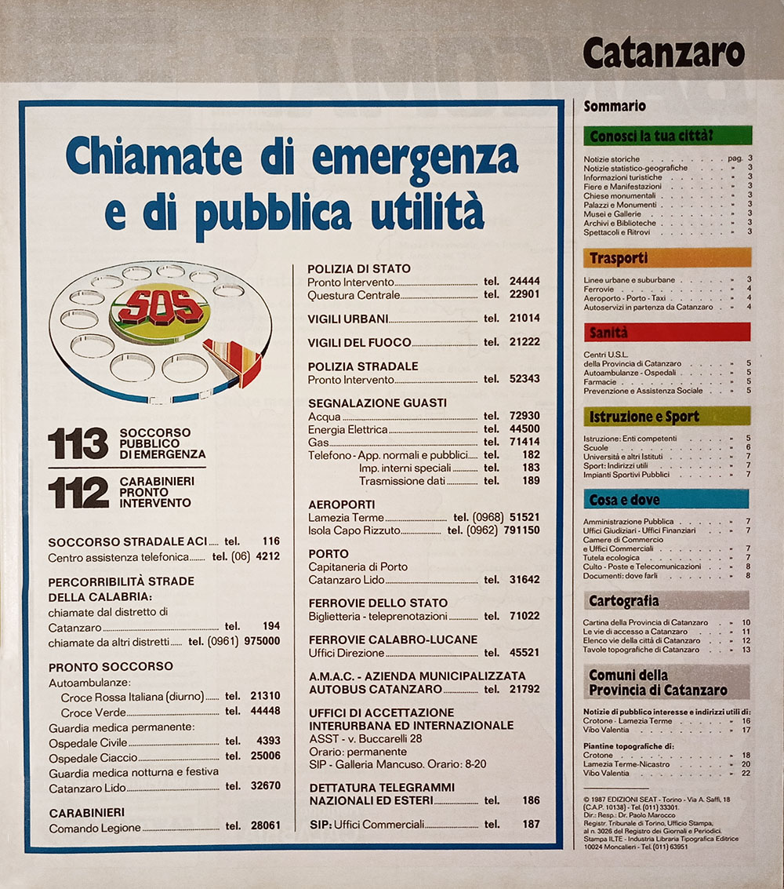
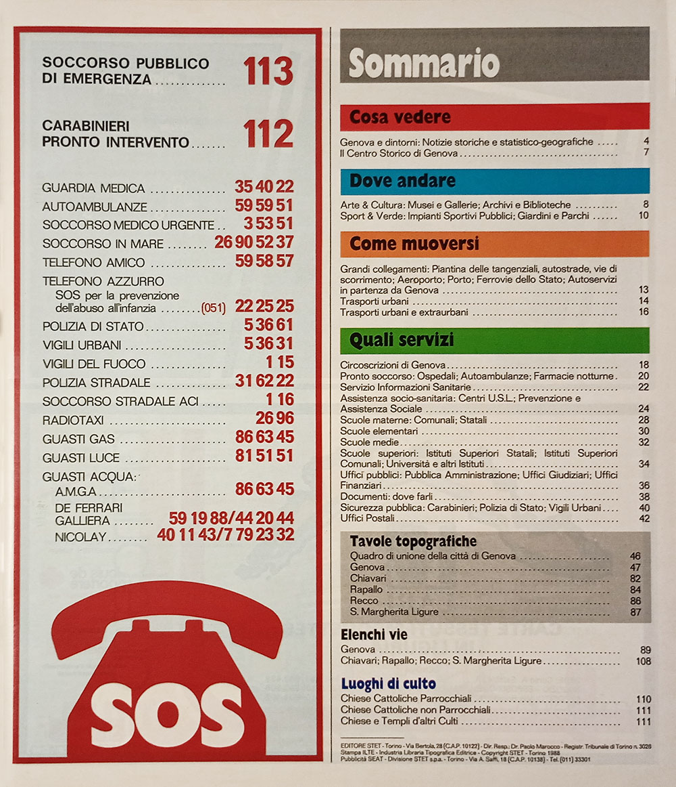
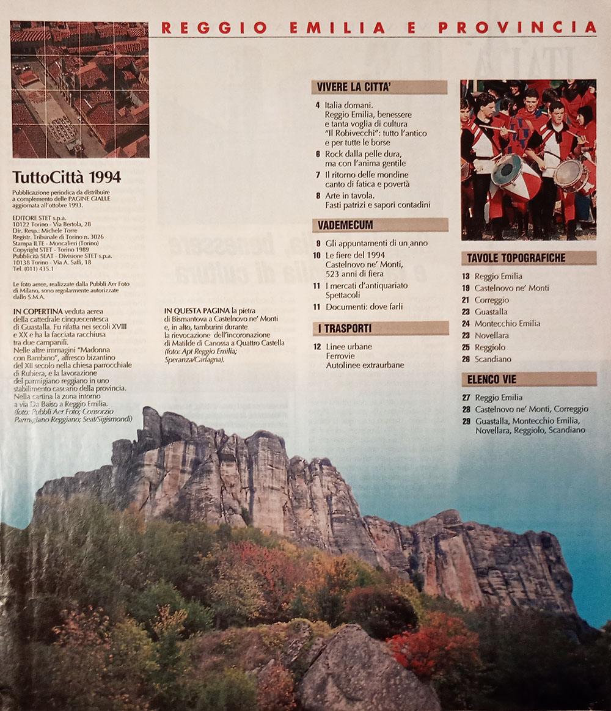

# Le sezioni dei fascicoli

## Contenuti standard

Nei fascicoli degli anni ottanta e per la maggior parte degli anni novanta, i fascicoli seguivano una
scaletta standard, secondo un modello riscontrabile per tutte le province e le annate.

## Serie classica degli anni ottanta

<figure class="figura">

<figcaption>Sommario di un'edizione degli anni ottanta</figcaption>
</figure>

I fascicoli appartenenti alla serie classica degli anni ottanta, dunque precedenti alla riforma
editoriale introdotta alla fine del 1989, comprendevano le seguenti sezioni.

- **Sommario** — ogni provincia aveva il suo sommario dedicato; ciò significa che nei fascicoli che
  includevano più province, ogni sezione dedicata a una specifica provincia aveva il suo sommario. In
  ogni sommario erano anche elencati i numeri di emergenza.
- **Conosci la tua città?** — questa sezione, contraddistinta dai titoli di colore verde, forniva
  informazioni di carattere geografico, storico e culturale sul capoluogo della provincia.
- **Trasporti** — la sezione, contraddistinta dai titoli di colore arancione, era dedicata ai servizi
  di trasporto pubblico urbano, extraurbano, alle ferrovie, ai porti e agli aeroporti, fino ai taxi e
  alle autolinee di collegamento fra i centri della provincia.
- **Sanità** — qui erano riportate le norme del servizio sanitario nazionale declinate per la specifica
  provincia, i centri delle unità sanitarie locali, gli ospedali, le farmacie e le autoambulanze; i
  titoli avevano il colore rosso.
- **Istruzione e sport** — questa sezione, i cui titoli erano di colore verde chiaro, comprendeva la
  lista di tutti gli istituti scolastici e universitari presenti nel capoluogo, nonché gli impianti
  sportivi pubblici.
- **Cosa e dove** — questa sezione, dai titoli di colore azzurro, raccoglieva numerose informazioni
  pratiche e indirizzi utili per il disbrigo delle faccende burocratiche e amministrative: vi erano
  elencati gli uffici dell'amministrazione pubblica, gli uffici giudiziari, gli uffici finanziari, le
  camere di commercio, nonché gli edifici di culto, gli uffici postali e quelli per la tutela
  ecologica. Una piccola sezione a parte, intitolata «Documenti: dove farli», era dedicata agli uffici
  preposti al rilascio di documenti.
- **Mappa della provincia** — una carta stradale con la provincia in evidenza. Poteva essere
  accompagnata da una mappa indicante le vie di accesso principali al capoluogo di provincia.
- **Tavole topografiche ed elenco delle vie** — questa era la parte fondamentale del fascicolo, che
  includeva la cartografia del capoluogo e dei centri principali della provincia, assieme agli elenchi
  delle vie. Spesso le mappe delle città della provincia erano precedute da una sezione in cui per i
  centri più importanti si riportavano indirizzi e contatti di uffici, scuole, ospedali e pubblica
  amministrazione.

## Serie edifici

<figure class="figura">

<figcaption>Sommario di un’edizione con copertina della serie edifici</figcaption>
</figure>

I fascicoli appartenenti alla serie edifici, quindi per le dieci città maggiori d'Italia, seguivano un
modello leggermente modificato, i cui contenuti erano assortiti in modo differente. Per ogni sezione
erano inoltre presenti delle mappe semplificate della città su cui erano riportati i riferimenti dei
punti d'interesse specifici della relativa sezione.

- **Sommario** — un sommario iniziale dell'intero fascicolo. Nella medesima pagina erano anche elencati
  i numeri di emergenza.
- **Cosa vedere** — una sezione con contenuti analoghi alla prima parte della sezione intitolata
  «Conosci la tua città?» della serie classica. I titoli sono di colore rosso.
- **Dove andare** — contraddistinta da titoli di colore azzurro, questa sezione raccoglie le
  informazioni sulla cultura, sui musei, le biblioteche, lo sport e i parchi urbani.
- **Come muoversi** — qua erano raccolte tutte le informazioni sui trasporti locali, dai bus urbani ed
  extraurbani ai porti, agli aeroporti e alle ferrovie. I titoli erano di colore arancione ed era
  spesso presente una mappa della rete dei trasporti pubblici urbani.
- **Quali servizi** — sezione molto corposa che raccoglieva informazioni su uffici pubblici, uffici
  giudiziari, uffici preposti al rilascio di documenti, ospedali, farmacie, scuole e università. Il
  colore dei titoli era il verde.
- **Tavole topografiche** — la parte fondamentale del fascicolo, raccoglieva le tavole topografiche del
  capoluogo di provincia, precedute da un quadro d'unione, cui seguivano le tavole dei centri
  principali della provincia o dell'immediato circondario.
- **Elenco delle vie** — gli elenchi delle vie del capoluogo e dei centri della provincia erano
  riportati sempre dopo la sezione sulle tavole topografiche.
- **Edifici di culto** — questa piccola sezione chiudeva sempre il fascicolo e riportava la lista delle
  chiese e degli edifici di altri culti, assieme ai loro numeri di telefono.

## Serie classica degli anni novanta

<figure class="figura">

<figcaption>Sommario di un'edizione degli anni novanta</figcaption>
</figure>

I fascicoli appartenenti alla serie classica degli anni novanta vennero pubblicati fra la fine del 1989
e la metà circa dell'annata 1997/98; questi fascicoli comprendevano le seguenti sezioni.

- **Sommario** — il fascicolo si apriva col sommario dei contenuti di entrambe le province; fa
  eccezione solo la prima annata, quando i sommari erano ancora divisi per provincia.
- **Città e provincia** — comprendeva una serie di articoli su storia, eventi, cultura e curiosità
  sulla città e sulla sua provincia. La sezione aveva come sottotitolo «Vivere la città».
- **Gli appuntamenti di un anno** — questa sezione, organizzata per mesi e sottotitolata «Vademecum»,
  elencava tutti gli eventi previsti in città nell'arco dell'anno.
- **Documenti: dove farli** — una sezione presente anche negli anni ottanta, dedicata agli uffici
  preposti al rilascio di documenti.
- **Mappa della provincia** — una carta stradale con la provincia in evidenza. Poteva essere
  accompagnata da una mappa indicante le vie di accesso principali al capoluogo di provincia.
- **I trasporti** — spesso inclusa nella stessa pagina della mappa della provincia, questa sezione era
  dedicata ai servizi di trasporto pubblico urbano, extraurbano, alle ferrovie, ai porti e agli
  aeroporti, fino ai taxi e alle autolinee di collegamento fra i centri della provincia.
- **Tavole topografiche** — questa era la parte fondamentale del fascicolo, che includeva la cartografia
  del capoluogo e dei centri principali della provincia.
- **Elenco delle vie** — sezione dedicata alle vie dei comuni cartografati, dove si fornivano le
  coordinate per rintracciare una via sulle tavole topografiche.
