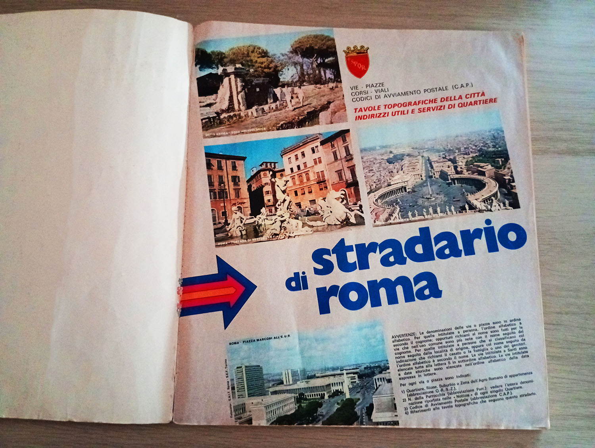
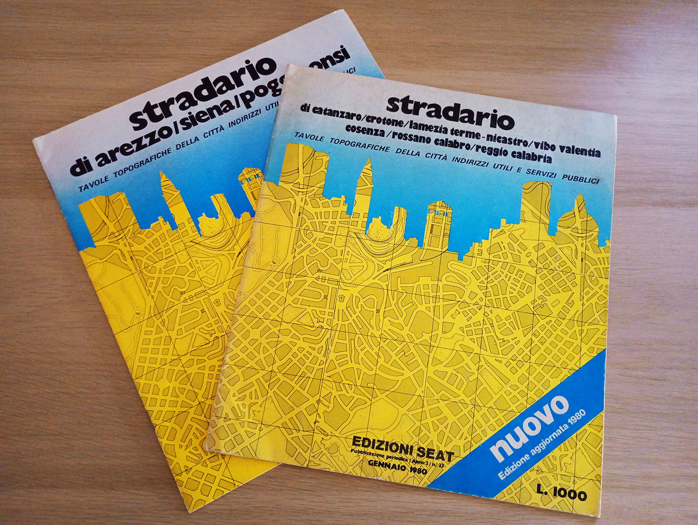

# Il precursore del TuttoCittà: lo Stradario SEAT

Prima del 1981 le tavole topografiche incluse nei TuttoCittà facevano parte dello Stradario SEAT;
questo era una rubrica posta alla fine delle Pagine Gialle e presente nella forma definita per ogni
provincia fin dal 1979. In precedenza, le tavole topografiche erano presenti solo per le dieci città
maggiori d'Italia ed erano stampate in bianco e nero.

Dal 1979 lo Stradario SEAT aveva un layout sostanzialmente identico ai primissimi TuttoCittà — nello
specifico, appunto, quelli appartenenti al layout «Stradario SEAT» — per quanto riguarda la sezione
cartografica, ma non raccoglieva tutte le informazioni sulla città che sarebbero state invece incluse
nei fascicoli. Inizialmente questi stradari presentavano solo le mappe dei capoluoghi di provincia, ma
nell'edizione del 1980/81 già avevano le mappe di quasi tutte le città incluse l'anno successivo nei
primi TuttoCittà.

<figure class="figura larga">

<figcaption>Lo stradario SEAT di Roma così come appariva incluso nelle Pagine Gialle.</figcaption>
</figure>

Lo Stradario SEAT non esisteva solo come rubrica delle Pagine Gialle, ma era anche acquistabile presso
le edicole come volumetto indipendente, dello stesso formato (246 x 280 mm) dei TuttoCittà; il prezzo
degli stradari SEAT variava in base alla città e quindi in base al numero di pagine: a titolo
d'esempio, nel 1980 il volumetto sulle province di Arezzo e Siena costava 800 lire, quello sulle
province della Calabria costava 1000 lire, quello sulla città di Roma costava 2000 lire.

<figure class="figura larga">

<figcaption>Volumetti dello Stradario SEAT acquistabili in edicola.</figcaption>
</figure>
