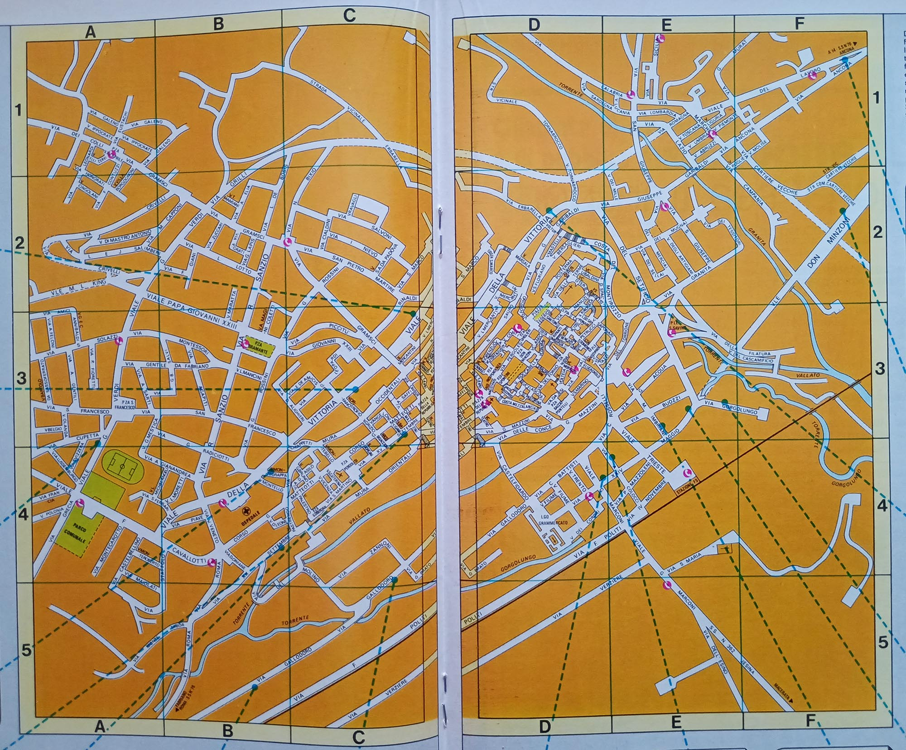
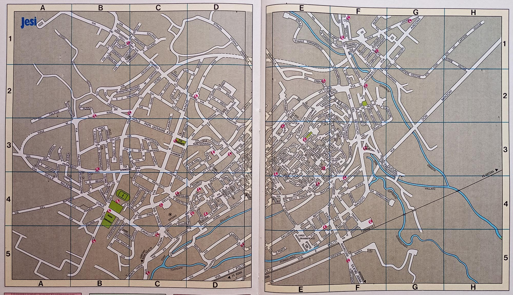
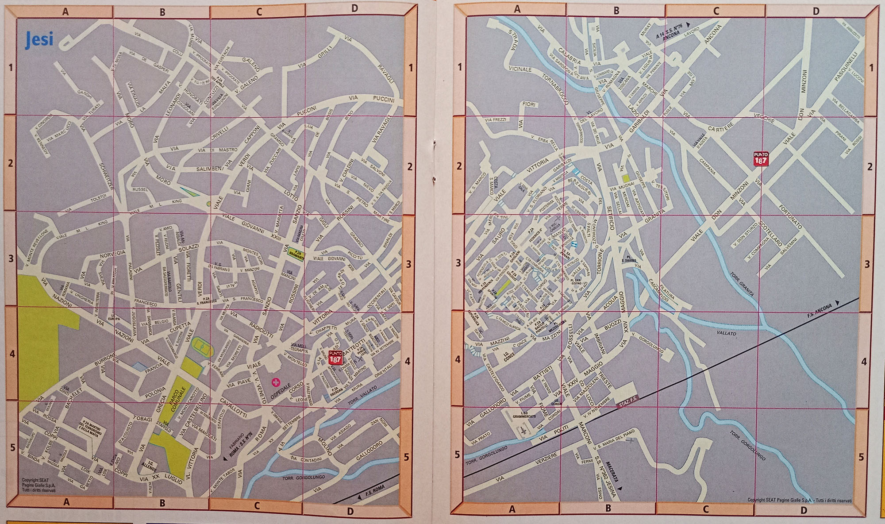
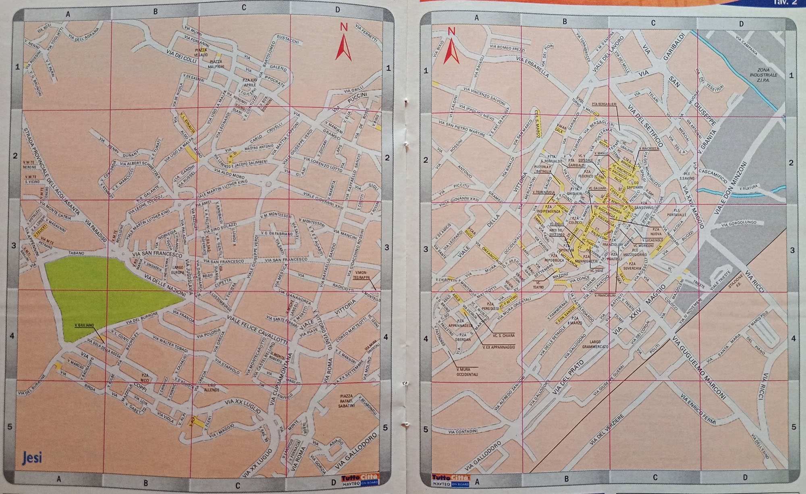

# L'evoluzione delle tavole cartografiche

La cartografia di TuttoCittà cambiò colore di stampa quattro volte in trent'anni. Il modo più diretto per
vederlo è seguire **la stessa città attraverso le quattro fasi**: qui è Jesi, in provincia di Ancona,
presente nei fascicoli fin dalle prime annate.

Le immagini sono ritagliate sulla sola area cartografica. I bordi delle tavole ospitavano le inserzioni
pubblicitarie degli esercizi locali, che non hanno rilievo per il confronto e che avrebbero introdotto
nomi, indirizzi e recapiti di attività d'epoca senza alcuna necessità documentaria.

  <figure><figcaption><b>Arancione</b> Tavola topografica di Jesi tratta dal fascicolo Ancona - Pesaro - Urbino 82 annata 1982/83</figcaption></figure>
  <figure><figcaption><b>Grigio</b> Tavola topografica di Jesi tratta dal fascicolo Ancona 90/91 annata 1990/91</figcaption></figure>
  <figure><figcaption><b>Grigio cromatico</b> Tavola topografica di Jesi tratta dal fascicolo Ancona 2004 annata 2004/05</figcaption></figure>
  <figure><figcaption><b>Rosa</b> Tavola topografica di Jesi tratta dal fascicolo Ancona 2009/2010 annata 2009/10</figcaption></figure>

| fase | colore delle tavole | dalle annate |
|---|---|---|
|  | Arancione | 1981/82 → 1989/90 |
|  | Grigio | 1990/91 → 1999/00 |
|  | Grigio cromatico | 2000/01 → 2008/09 |
|  | Rosa | 2009/10 → 2014/15 |

Le date indicano la fase prevalente: il passaggio non fu simultaneo per tutte le edizioni, e nell'annata
2000/01 le due tinte grigie convivono, così come nell'annata 2009/10 convivono grigio cromatico e rosa.
Il dettaglio per singola copertina è in [`copertine_per_annata.csv`](../dati/copertine_per_annata.csv).

---

Le riproduzioni sono fotografie di esemplari della raccolta, pubblicate a bassa risoluzione a fini di
identificazione e studio documentario. **I diritti sulle opere riprodotte appartengono all'editore** e non
sono coperti dalla licenza CC BY 4.0 applicata al resto della risorsa. Per richieste di rimozione, aprire
una segnalazione nel repository.
