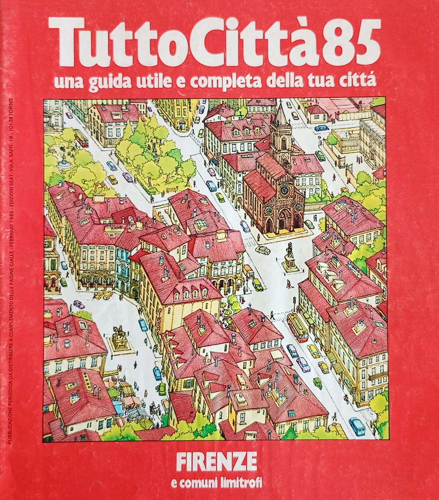
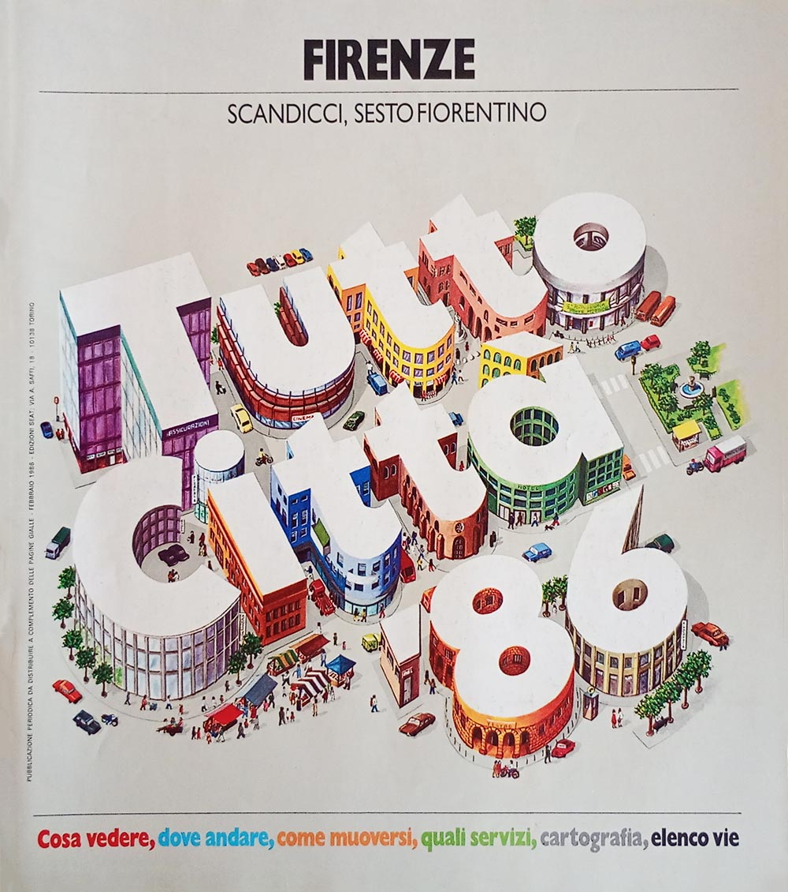
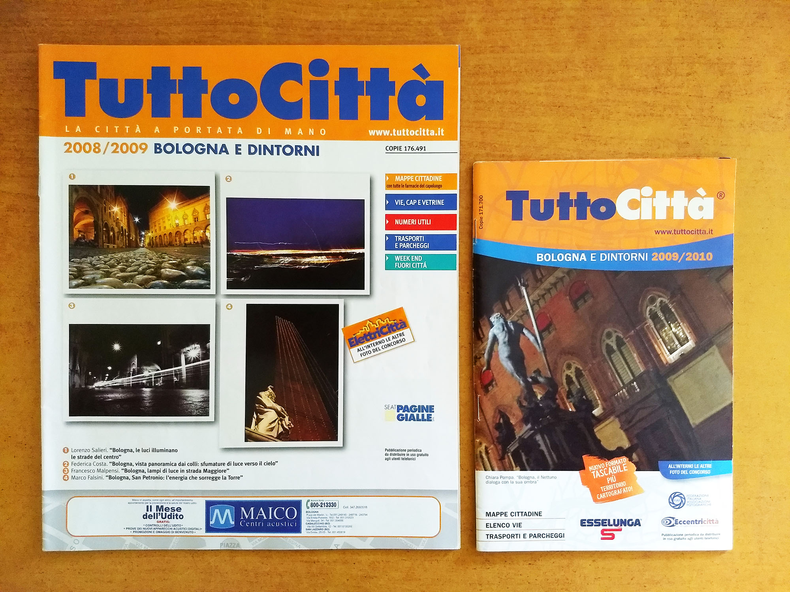
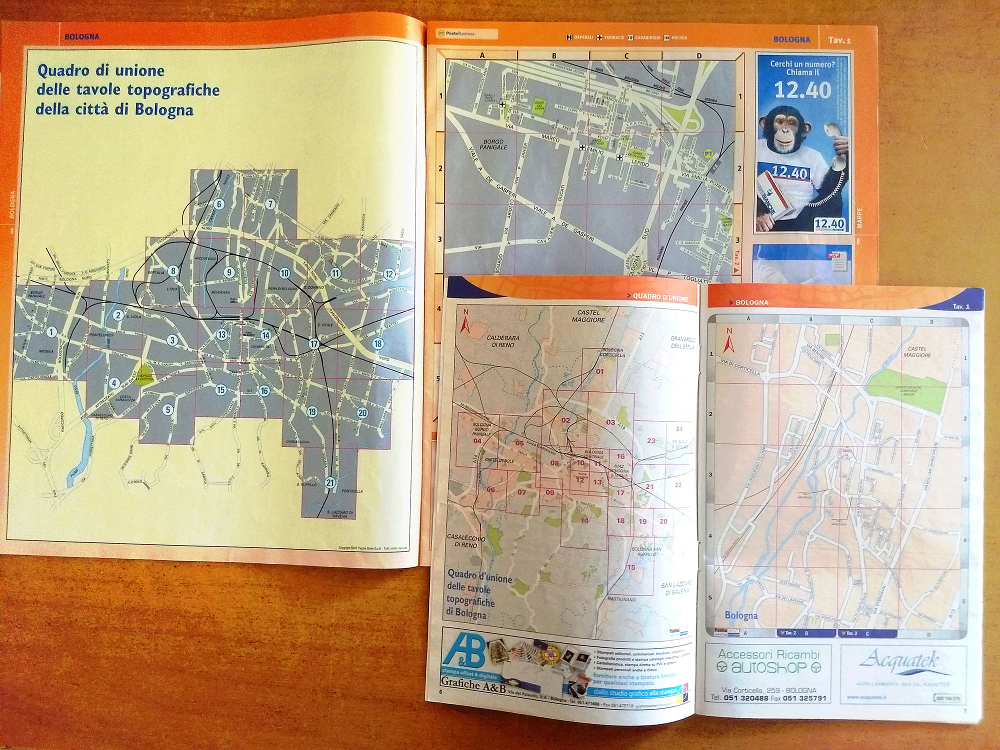

# Evoluzione della cartografia

## Le quattro fasi cromatiche

La cartografia di TuttoCittà cambiò colore di stampa quattro volte in trent'anni. Il modo più diretto per
vederlo è seguire **la stessa città attraverso le quattro fasi**: qui è Jesi, in provincia di Ancona,
presente nei fascicoli fin dalle prime annate.

Le immagini sono ritagliate sulla sola area cartografica.

  <figure><figcaption><b>Arancione</b> Tavola topografica di Jesi tratta dal fascicolo Ancona - Pesaro - Urbino 82 annata 1982/83</figcaption></figure>
  <figure><figcaption><b>Grigio</b> Tavola topografica di Jesi tratta dal fascicolo Ancona 90/91 annata 1990/91</figcaption></figure>

  <figure><figcaption><b>Grigio cromatico</b> Tavola topografica di Jesi tratta dal fascicolo Ancona 2004 annata 2004/05</figcaption></figure>
  <figure><figcaption><b>Rosa</b> Tavola topografica di Jesi tratta dal fascicolo Ancona 2009/2010 annata 2009/10</figcaption></figure>

| fase | colore delle tavole | dalle annate |
|---|---|---|
|  | Arancione | 1981/82 → 1989/90 |
|  | Grigio | 1990/91 → 1999/00 |
|  | Grigio cromatico | 2000/01 → 2008/09 |
|  | Rosa | 2009/10 → 2014/15 |

Le date indicano la fase prevalente: il passaggio non fu simultaneo per tutte le edizioni, e nell'annata
2000/01 le due tinte grigie convivono, così come nell'annata 2009/10 convivono grigio cromatico e rosa.
Il dettaglio per singola copertina è in [`copertine_per_annata.csv`](../dati/copertine_per_annata.csv).

## La riforma cartografica delle dieci città maggiori

A metà dell'annata 1985/86 le tavole delle **dieci città maggiori d'Italia** secondo il censimento del
1981 (Roma, Milano, Napoli, Torino, Genova, Palermo, Bologna, Firenze, Catania, Bari) furono
ridisegnate da capo.

Fino ad allora quelle tavole derivavano dai vecchi **stradari SEAT Pagine Gialle** sviluppati all'inizio degli anni
settanta e inclusi nelle Pagine Gialle. La loro organizzazione procedeva dalle zone centrali verso le
aree periferiche in modo disomogeneo, e porzioni diverse della stessa città erano spesso rappresentate a
scale differenti: confrontare due tavole contigue non era immediato.

Dalla seconda metà dell'annata 1985/86 l'impianto fu riorganizzato su basi razionali. La successione
delle tavole segue l'andamento **da nordovest a sudest**, e le scale si riducono a poche misure fisse,
di norma da due a quattro per l'intera città. Il quadro d'unione, cioè lo schema che mostra come le
tavole si dispongono sul territorio, rende la differenza evidente a colpo d'occhio.

  <figure><figcaption><b>Prima della riforma</b> Quadro d'unione di Firenze tratto dal fascicolo Firenze 85 annata 1985/86</figcaption></figure>
  <figure><figcaption><b>Dopo la riforma</b> Quadro d'unione di Firenze tratto dal fascicolo Firenze 86 annata 1986/87</figcaption></figure>

La riforma riguardò le sole dieci città maggiori, che per quattro o cinque annate (a seconda dell'appartenenza rispettivamente alla serie *iniziale* o alla serie *tardiva*) ebbero anche una copertina distinta
dalle altre — la cosiddetta *serie edifici* — visibile nella
[galleria delle copertine](copertine.md).

## Il formato tascabile e la seconda riforma cartografica

Il secondo grande cambiamento avviene nel corso dell'annata **2009/2010**, e riguarda tutte le edizioni.
Il fascicolo cambia radicalmente dimensioni — da 226 × 274 mm a 140 × 212 mm — assumendo il formato di uno
stradario tascabile. Contestualmente, **anche la cartografia viene rifatta da capo**,
insieme al passaggio dello sfondo dal grigio cromatico al rosa.

Con questa nuova riforma cartografica, **l'area cartografata si estende**, soprattutto nei
capoluoghi, arrivando a coprire porzioni di territorio che le tavole precedenti lasciavano fuori; compaiono 
inoltre **numerose vie e piazze delle zone periferiche**, sorte negli anni immediatamente precedenti e
mai entrate nella cartografia in uso fino ad allora.

  <figure><figcaption><b>Il cambio di formato</b> I due fascicoli affiancati Bologna 2008/2009 e Bologna 2009/2010 da 226 × 274 mm a 140 × 212 mm</figcaption></figure>
  <figure><figcaption><b>Il nuovo impianto delle tavole</b> I due quadri d'unione a confronto Bologna 2008/2009, tavole grigio cromatico Bologna 2009/2010, tavole rosa</figcaption></figure>

È l'ultima riforma della storia del prodotto: la veste adottata nel 2009/2010 resta invariata fino
all'ultima annata autonoma, la 2014/15.

---

Le riproduzioni sono fotografie di esemplari della raccolta, pubblicate a bassa risoluzione a fini di
identificazione e studio documentario. **I diritti sulle opere riprodotte appartengono all'editore** e non
sono coperti dalla licenza CC BY 4.0 applicata al resto della risorsa. Per richieste di rimozione, aprire
una segnalazione nel repository.
