# La Valle d'Aosta in dettaglio

<em><strong>NOTA: questa pagina è incompleta.</strong> Alla raccolta mancano 5 dei 17 fascicoli accertati della regione — <strong>Aosta, annate 81/82–83/84; Valle d'Aosta, annate 91/92 e 94/95</strong> — e i dati che dipendono dall'esame diretto dell'esemplare sono segnati</em> in sospeso<em>. Le copertine non reperite sono sostituite da un segnaposto; nella griglia dei comuni le annate scoperte portano una croce e non una casella vuota, per non confonderle con la reale assenza del corrispondente comune in cartografia. Per la stessa ragione questa pagina non è annunciata altrove nel sito e per il momento vi si arriva soltanto per indirizzo diretto.</em>

Questa pagina si occupa di definire con estrema precisione l'organizzazione interna dei fascicoli dell'intera regione Valle d'Aosta.

Il censimento registra un totale di 17 fascicoli e 5 comuni cartografati.

<figure class="figura">

<figcaption>Il fascicolo Aosta 81 non è in raccolta: la copertina non è stata reperita</figcaption>
</figure>

In questa pagina

[TOC]

## Tabella dei fascicoli

I fascicoli della Valle d'Aosta appartenevano alla serie iniziale: il primo fascicolo, edito a [dato mancante], era infatti intitolato TuttoCittà 81.

Una particolarità è che tutti i fascicoli della serie sono bilingui: poiché le lingue ufficiali della Valle d'Aosta sono l'italiano e il francese, i fascicoli presentano tutte le sezioni raddoppiate, una per ogni lingua: due sommari, due rubriche dei numeri utili, due rubriche di articoli, con tutti gli articoli presentati nelle due lingue, due elenchi delle vie. I fascicoli 81, 82 e 83 presentano inoltre anche due titoli: "TuttoCittà" in intestazione e "ToutVille" a pie' di pagina; anche la didascalia era tradotta: "una guida utile e completa della tua città" in intestazione e "un guide utile et complet de votre ville" a pie' di pagina, senza accenti.

Un'altra particolarità è che dall'edizione 1990/91 il fascicolo si intitola non più Aosta ma Valle d'Aosta. È inoltre presente il titolo anche in francese (senza accenti) Vallee d'Aoste.

Alla fine degli anni '90 la pubblicazione dei fascicoli cessò per tutte le province.

La seguente tabella censisce i dati fondamentali dei fascicoli della Valle d'Aosta, mostrandone le copertine e indicandone il formato, il layout così come definito in [questa pagina](tabella-layout.md), e il numero totale di pagine, anno per anno.

<table class="fascicoli-dettaglio">
<thead><tr><th>Annata</th><th>Colore tavole</th><th colspan="1">Copertine</th></tr></thead>
<tbody>
<tr><td class="ann"> 81/82</td><td class="tav"></td><td class="fasc sospesa">
Aosta 81
<ul class="scheda"><li><b>Formato:</b> 246 x 280 mm</li><li><b>Copertina:</b> grossa</li><li><b>Note:</b> Nota dell'editore</li><li>non in raccolta</li></ul></td></tr>
<tr><td class="ann"> 82/83</td><td class="tav"></td><td class="fasc sospesa">
Aosta 82
<ul class="scheda"><li><b>Formato:</b> 246 x 280 mm</li><li><b>Copertina:</b> grossa</li><li>non in raccolta</li></ul></td></tr>
<tr><td class="ann"> 83/84</td><td class="tav"></td><td class="fasc sospesa">
Aosta 83
<ul class="scheda"><li><b>Formato:</b> 246 x 280 mm</li><li><b>Copertina:</b> grossa</li><li>non in raccolta</li></ul></td></tr>
<tr><td class="ann"> 84/85</td><td class="tav"></td><td class="fasc"><a href="../immagini/AO84.jpg">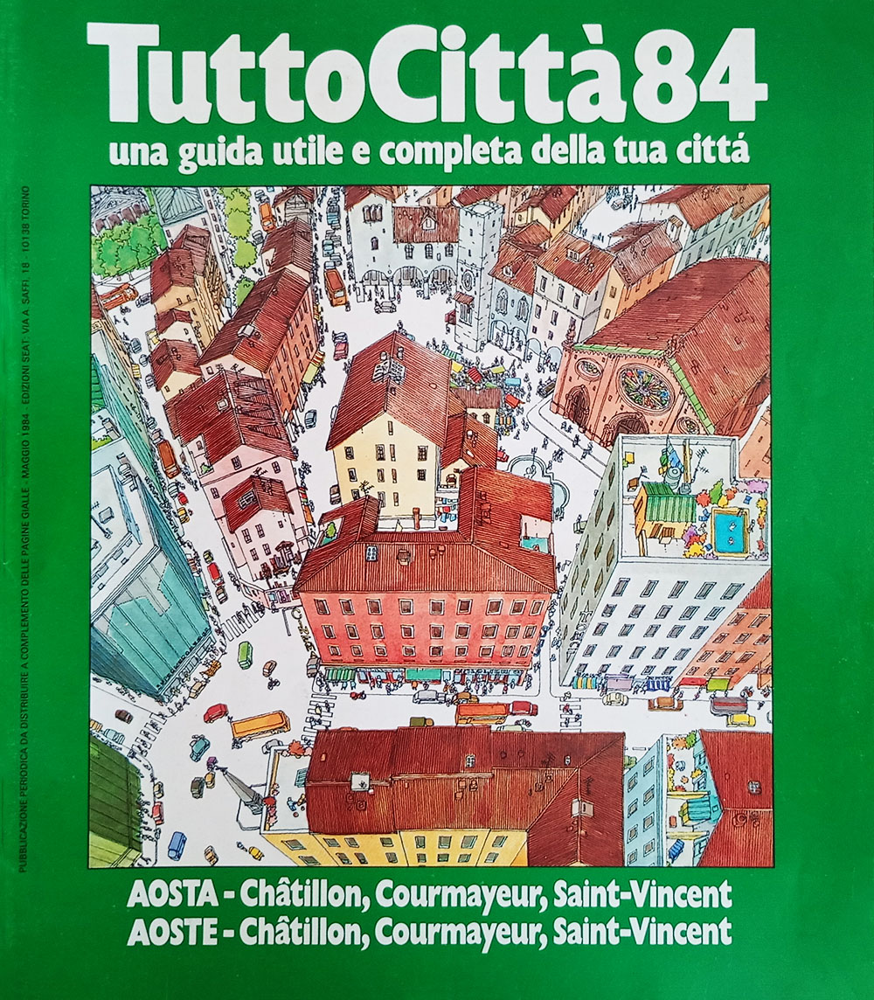</a>
Aosta 84
<ul class="scheda"><li><b>Formato:</b> 246 x 280 mm</li><li><b>Copertina:</b> grossa</li><li><b>Layout:</b> TuttoCittà '80 classico</li><li><b>Pagine:</b> 24</li><li><b>Mese aggiornamento:</b> maggio 1984</li><li><b>Note:</b> Inserto Costituzione</li></ul></td></tr>
<tr><td class="ann"> 85/86</td><td class="tav"></td><td class="fasc"><a href="../immagini/AO85.jpg">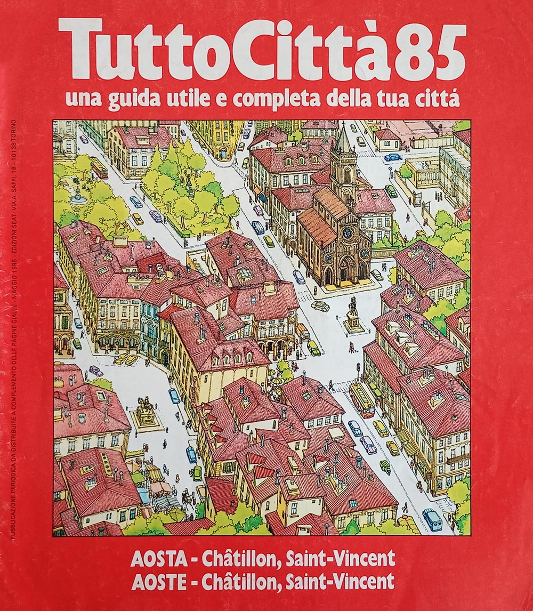</a>
Aosta 85
<ul class="scheda"><li><b>Formato:</b> 246 x 280 mm</li><li><b>Copertina:</b> grossa</li><li><b>Layout:</b> TuttoCittà '80 classico</li><li><b>Pagine:</b> 16</li><li><b>Mese aggiornamento:</b> maggio 1985</li></ul></td></tr>
<tr><td class="ann"> 86/87</td><td class="tav"></td><td class="fasc"><a href="../immagini/AO86.jpg">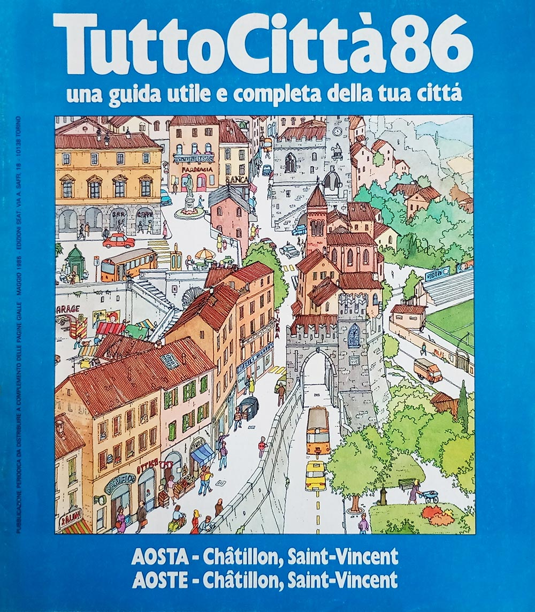</a>
Aosta 86
<ul class="scheda"><li><b>Formato:</b> 246 x 280 mm</li><li><b>Copertina:</b> grossa</li><li><b>Layout:</b> TuttoCittà '80 classico</li><li><b>Pagine:</b> 16</li><li><b>Mese aggiornamento:</b> maggio 1986</li></ul></td></tr>
<tr><td class="ann"> 87/88</td><td class="tav"></td><td class="fasc"><a href="../immagini/AO87.jpg">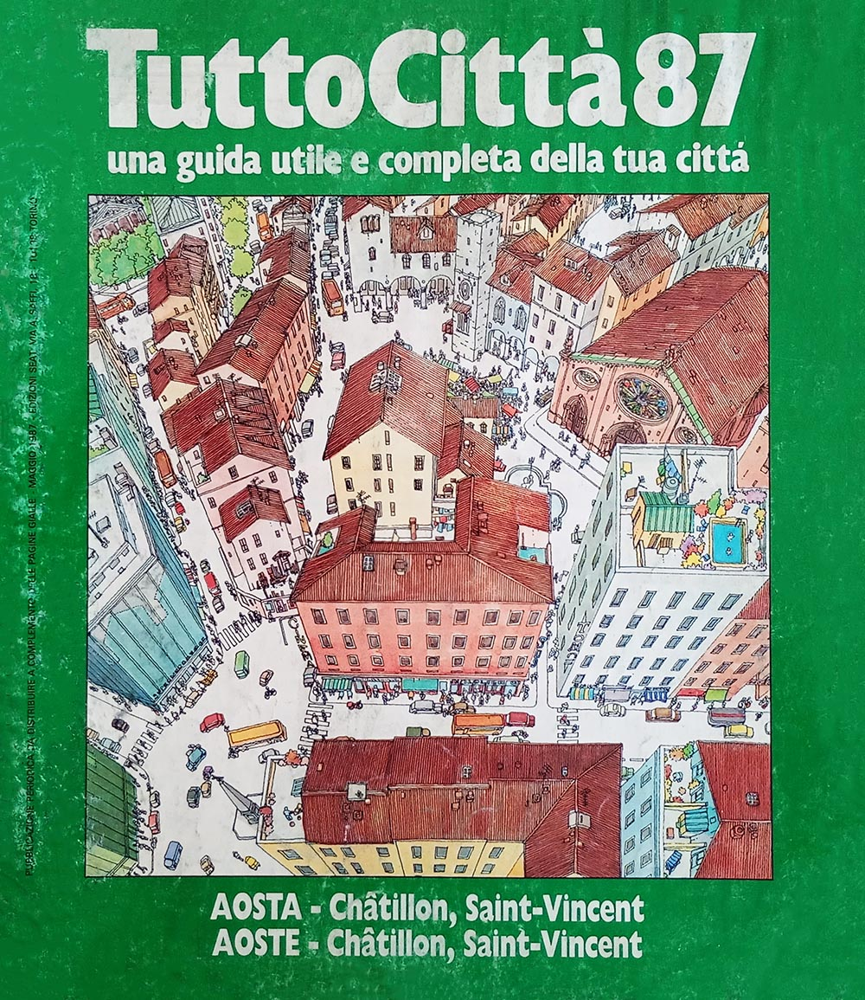</a>
Aosta 87
<ul class="scheda"><li><b>Formato:</b> 246 x 280 mm</li><li><b>Copertina:</b> grossa</li><li><b>Layout:</b> TuttoCittà '80 classico</li><li><b>Pagine:</b> 16</li><li><b>Mese aggiornamento:</b> maggio 1987</li></ul></td></tr>
<tr><td class="ann"> 88/89</td><td class="tav"></td><td class="fasc"><a href="../immagini/AO88.jpg">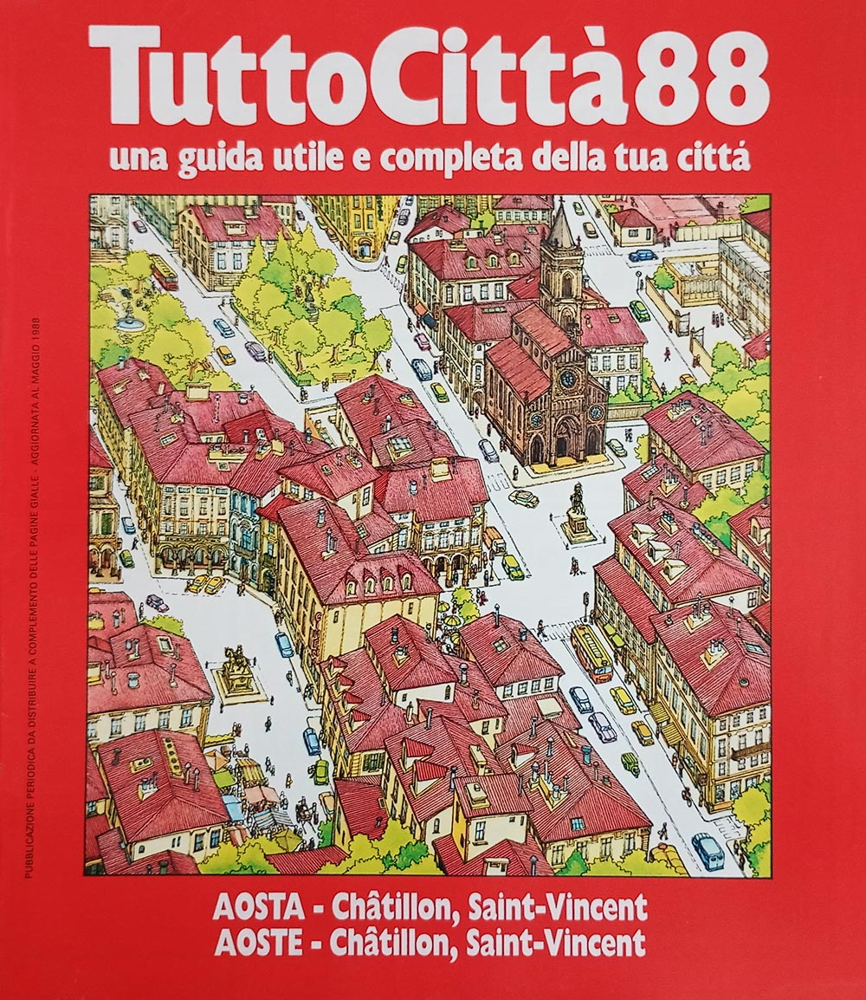</a>
Aosta 88
<ul class="scheda"><li><b>Formato:</b> 246 x 280 mm</li><li><b>Copertina:</b> grossa</li><li><b>Layout:</b> TuttoCittà '80 classico</li><li><b>Pagine:</b> 16</li><li><b>Mese aggiornamento:</b> maggio 1988</li></ul></td></tr>
<tr><td class="ann"> 89/90</td><td class="tav"></td><td class="fasc"><a href="../immagini/AO89.jpg">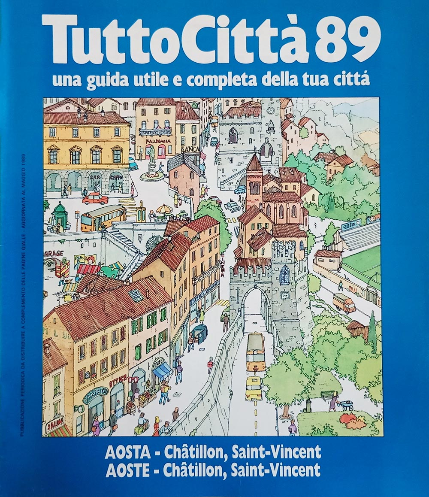</a>
Aosta 89
<ul class="scheda"><li><b>Formato:</b> 246 x 280 mm</li><li><b>Copertina:</b> grossa</li><li><b>Layout:</b> TuttoCittà '80 classico</li><li><b>Pagine:</b> 16</li><li><b>Mese aggiornamento:</b> maggio 1989</li></ul></td></tr>
<tr><td class="ann"> 90/91</td><td class="tav"></td><td class="fasc"><a href="../immagini/AO9091.jpg">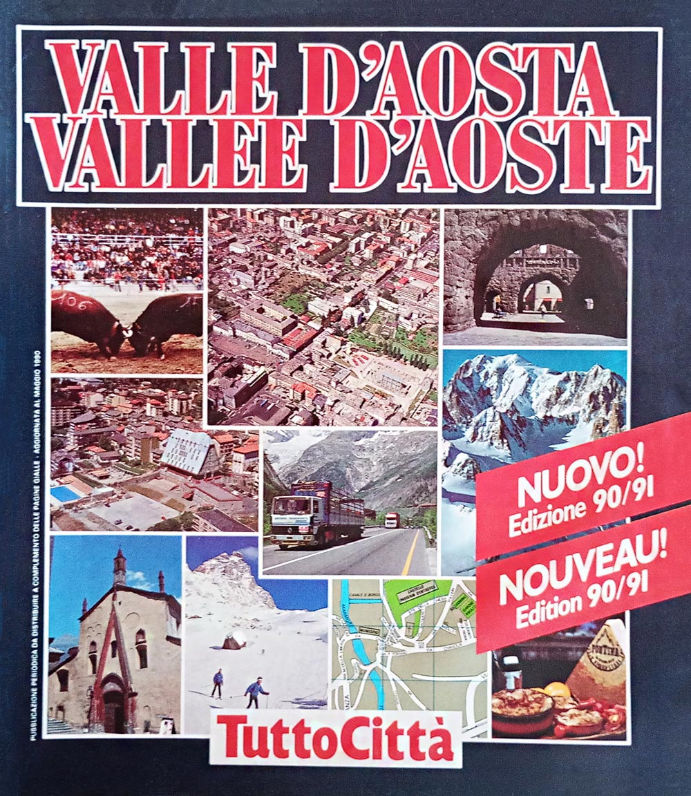</a>
Valle d'Aosta 90/91
<ul class="scheda"><li><b>Formato:</b> 246 x 280 mm</li><li><b>Copertina:</b> grossa</li><li><b>Layout:</b> TuttoCittà '90 classico iniziale</li><li><b>Pagine:</b> 32</li><li><b>Mese aggiornamento:</b> maggio 1990</li><li><b>Note:</b> nota dell'editore</li></ul></td></tr>
<tr><td class="ann"> 91/92</td><td class="tav"></td><td class="fasc sospesa">
Valle d'Aosta 91
<ul class="scheda"><li><b>Formato:</b> 246 x 280 mm</li><li><b>Copertina:</b> grossa</li><li><b>Layout:</b> TuttoCittà '90 classico iniziale</li><li>non in raccolta</li></ul></td></tr>
<tr><td class="ann"> 92/93</td><td class="tav"></td><td class="fasc"><a href="../immagini/AO92.jpg">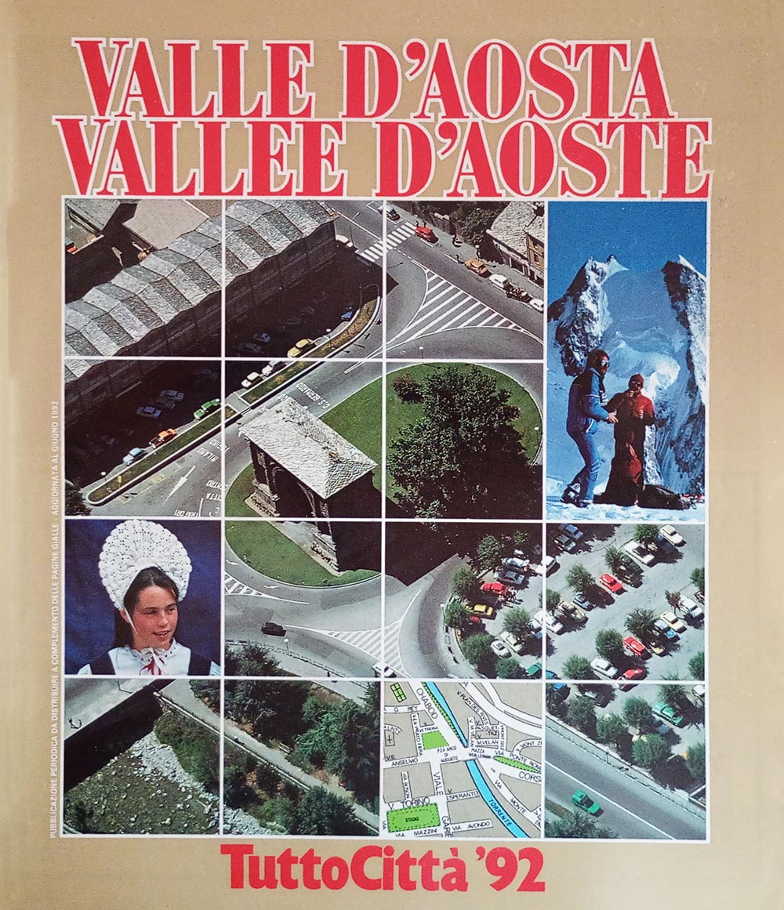</a>
Valle d'Aosta 92
<ul class="scheda"><li><b>Formato:</b> 246 x 280 mm</li><li><b>Copertina:</b> grossa</li><li><b>Layout:</b> TuttoCittà '90 classico</li><li><b>Pagine:</b> 24</li><li><b>Mese aggiornamento:</b> giugno 1992</li></ul></td></tr>
<tr><td class="ann"> 93/94</td><td class="tav"></td><td class="fasc"><a href="../immagini/AO93.jpg">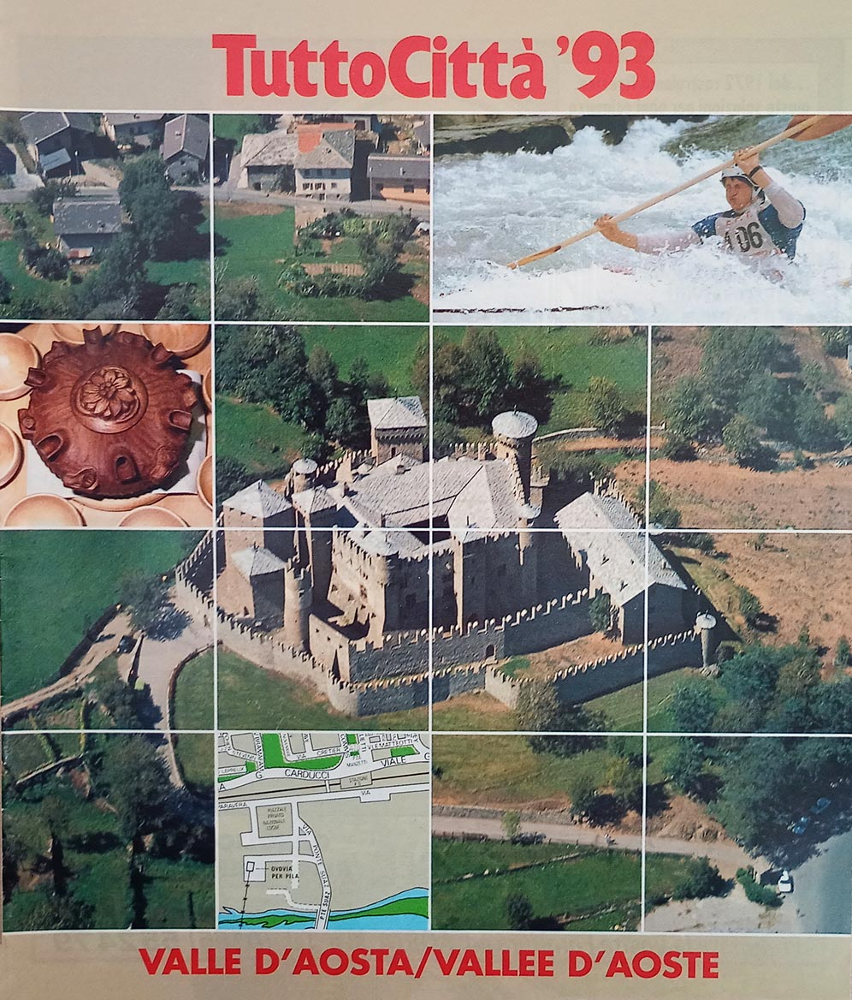</a>
Valle d'Aosta 93
<ul class="scheda"><li><b>Formato:</b> 246 x 280 mm</li><li><b>Copertina:</b> sottile</li><li><b>Layout:</b> TuttoCittà '90 classico</li><li><b>Pagine:</b> 22</li><li><b>Mese aggiornamento:</b> giugno 1993</li></ul></td></tr>
<tr><td class="ann"> 94/95</td><td class="tav"></td><td class="fasc sospesa">
Valle d'Aosta 94
<ul class="scheda"><li><b>Formato:</b> 246 x 280 mm</li><li><b>Copertina:</b> sottile</li><li><b>Layout:</b> TuttoCittà '90 classico</li><li>non in raccolta</li></ul></td></tr>
<tr><td class="ann"> 95/96</td><td class="tav"></td><td class="fasc"><a href="../immagini/AO95.jpg">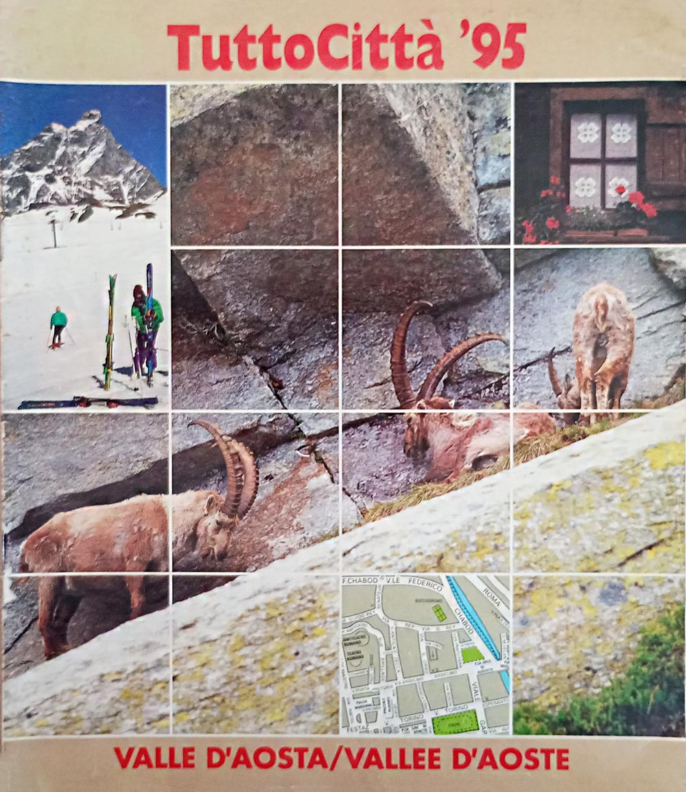</a>
Valle d'Aosta 95
<ul class="scheda"><li><b>Formato:</b> 246 x 280 mm</li><li><b>Copertina:</b> sottile</li><li><b>Layout:</b> TuttoCittà '90 classico</li><li><b>Pagine:</b> 22</li><li><b>Mese aggiornamento:</b> maggio 1995</li></ul></td></tr>
<tr><td class="ann"> 96/97</td><td class="tav"></td><td class="fasc"><a href="../immagini/AO96.jpg">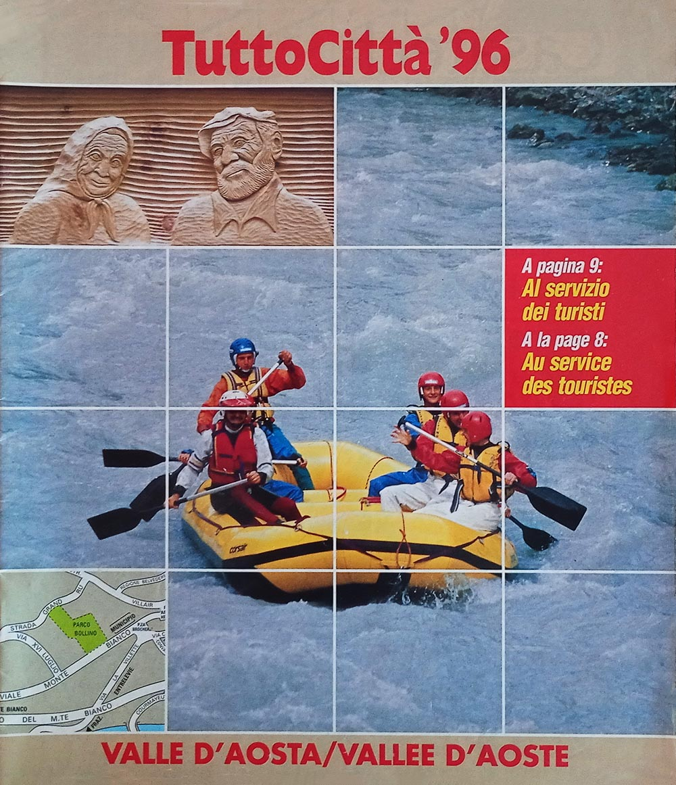</a>
Valle d'Aosta 96
<ul class="scheda"><li><b>Formato:</b> 226 x 274 mm</li><li><b>Copertina:</b> sottile</li><li><b>Layout:</b> TuttoCittà '90 classico</li><li><b>Pagine:</b> 22</li><li><b>Mese aggiornamento:</b> maggio 1996</li></ul></td></tr>
<tr><td class="ann"> 97/98</td><td class="tav"></td><td class="fasc"><a href="../immagini/AO97.jpg">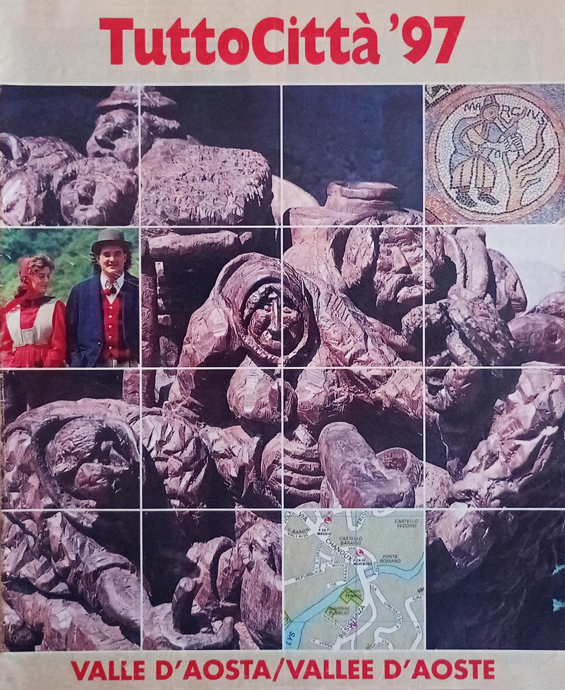</a>
Valle d'Aosta 97
<ul class="scheda"><li><b>Formato:</b> 226 x 274 mm</li><li><b>Copertina:</b> sottile</li><li><b>Layout:</b> TuttoCittà '90 classico</li><li><b>Pagine:</b> 22</li><li><b>Mese aggiornamento:</b> maggio 1997</li><li><b>Note:</b> Cambio formato</li></ul></td></tr>
</tbody>
</table>

## Tre layout in diciassette anni

La seguente tabella censisce i vari layout utilizzati per i fascicoli della regione, secondo il sistema definito durante il censimento osservando l'impaginazione; le loro caratteristiche sono descritte in [questa pagina](tabella-layout.md). Come descritto anche lì, i cambi di layout non rispettano i cambi delle serie di copertina descritte nell'[apposita pagina](copertine.md) di questo sito.

<table class="layout-dettaglio">
<thead><tr><th>Layout</th><th>Annate</th><th>Anni di copertina</th></tr></thead>
<tbody>
<tr><td>TuttoCittà '80 classico</td><td class="ann">84/85 – 89/90</td><td class="cop">84<i class="pt"></i>85<i class="pt"></i>86<i class="pt"></i>87<i class="pt"></i>88<i class="pt"></i>89</td></tr>
<tr><td>TuttoCittà '90 classico iniziale</td><td class="ann">90/91 – 91/92</td><td class="cop">90/91<i class="pt"></i>91</td></tr>
<tr><td>TuttoCittà '90 classico</td><td class="ann">92/93 – 97/98</td><td class="cop">92<i class="pt"></i>93<i class="pt"></i>94<i class="pt"></i>95<i class="pt"></i>96<i class="pt"></i>97</td></tr>
</tbody>
</table>

Non compaiono le annate 81/82–83/84: il fascicolo non è in raccolta e il layout non è stato accertato.

## Le città cartografate

La seguente tabella censisce tutti i comuni che sono stati cartografati nel corso del tempo e per quante annate. Ad ogni riga corrisponde un comune, in ordine alfabetico e non per provincia: lo scopo è infatti identificare a colpo d'occhio quali comuni entrano ed escono dalla cartografia nel corso degli anni. L'unico capoluogo — AOSTA — è in maiuscolo, ma resta al suo posto nell'alfabeto.

La croce segna le annate in cui non sappiamo: perché il fascicolo che avrebbe portato quel comune non è in raccolta, perché non è accertato che sia mai esistito, o perché il suo contenuto non è ancora stato spogliato.

Espandi la griglia delle città — 5 città su 17 annate

<table class="griglia">
  <thead><tr><th scope="col">Città</th><th scope="col" class="ann dec">81/82</th><th scope="col" class="ann">82/83</th><th scope="col" class="ann">83/84</th><th scope="col" class="ann">84/85</th><th scope="col" class="ann">85/86</th><th scope="col" class="ann">86/87</th><th scope="col" class="ann">87/88</th><th scope="col" class="ann">88/89</th><th scope="col" class="ann">89/90</th><th scope="col" class="ann dec">90/91</th><th scope="col" class="ann">91/92</th><th scope="col" class="ann">92/93</th><th scope="col" class="ann">93/94</th><th scope="col" class="ann">94/95</th><th scope="col" class="ann">95/96</th><th scope="col" class="ann">96/97</th><th scope="col" class="ann">97/98</th></tr></thead>
  <tbody>
  <tr><th scope="row">AOSTA</th><td class="ig dec" title="Aosta — 81/82: non accertato, fascicolo mancante">&#215;</td><td class="ig" title="Aosta — 82/83: non accertato, fascicolo mancante">&#215;</td><td class="ig" title="Aosta — 83/84: non accertato, fascicolo mancante">&#215;</td><td class="si" title="Aosta — 84/85"></td><td class="si" title="Aosta — 85/86"></td><td class="si" title="Aosta — 86/87"></td><td class="si" title="Aosta — 87/88"></td><td class="si" title="Aosta — 88/89"></td><td class="si" title="Aosta — 89/90"></td><td class="si dec" title="Aosta — 90/91"></td><td class="ig" title="Aosta — 91/92: non accertato, fascicolo mancante">&#215;</td><td class="si" title="Aosta — 92/93"></td><td class="si" title="Aosta — 93/94"></td><td class="ig" title="Aosta — 94/95: non accertato, fascicolo mancante">&#215;</td><td class="si" title="Aosta — 95/96"></td><td class="si" title="Aosta — 96/97"></td><td class="si" title="Aosta — 97/98"></td></tr>
  <tr><th scope="row">Châtillon</th><td class="ig dec" title="Châtillon — 81/82: non accertato, fascicolo mancante">&#215;</td><td class="ig" title="Châtillon — 82/83: non accertato, fascicolo mancante">&#215;</td><td class="ig" title="Châtillon — 83/84: non accertato, fascicolo mancante">&#215;</td><td class="si" title="Châtillon — 84/85"></td><td class="si" title="Châtillon — 85/86"></td><td class="si" title="Châtillon — 86/87"></td><td class="si" title="Châtillon — 87/88"></td><td class="si" title="Châtillon — 88/89"></td><td class="si" title="Châtillon — 89/90"></td><td class="si dec" title="Châtillon — 90/91"></td><td class="ig" title="Châtillon — 91/92: non accertato, fascicolo mancante">&#215;</td><td class="si" title="Châtillon — 92/93"></td><td class="si" title="Châtillon — 93/94"></td><td class="ig" title="Châtillon — 94/95: non accertato, fascicolo mancante">&#215;</td><td class="si" title="Châtillon — 95/96"></td><td class="si" title="Châtillon — 96/97"></td><td class="si" title="Châtillon — 97/98"></td></tr>
  <tr><th scope="row">Courmayeur</th><td class="ig dec" title="Courmayeur — 81/82: non accertato, fascicolo mancante">&#215;</td><td class="ig" title="Courmayeur — 82/83: non accertato, fascicolo mancante">&#215;</td><td class="ig" title="Courmayeur — 83/84: non accertato, fascicolo mancante">&#215;</td><td class="si" title="Courmayeur — 84/85"></td><td class="no" title="Courmayeur — 85/86"></td><td class="no" title="Courmayeur — 86/87"></td><td class="no" title="Courmayeur — 87/88"></td><td class="no" title="Courmayeur — 88/89"></td><td class="no" title="Courmayeur — 89/90"></td><td class="si dec" title="Courmayeur — 90/91"></td><td class="ig" title="Courmayeur — 91/92: non accertato, fascicolo mancante">&#215;</td><td class="si" title="Courmayeur — 92/93"></td><td class="si" title="Courmayeur — 93/94"></td><td class="ig" title="Courmayeur — 94/95: non accertato, fascicolo mancante">&#215;</td><td class="si" title="Courmayeur — 95/96"></td><td class="si" title="Courmayeur — 96/97"></td><td class="si" title="Courmayeur — 97/98"></td></tr>
  <tr><th scope="row">Pont-Saint-Martin</th><td class="ig dec" title="Pont-Saint-Martin — 81/82: non accertato, fascicolo mancante">&#215;</td><td class="ig" title="Pont-Saint-Martin — 82/83: non accertato, fascicolo mancante">&#215;</td><td class="ig" title="Pont-Saint-Martin — 83/84: non accertato, fascicolo mancante">&#215;</td><td class="no" title="Pont-Saint-Martin — 84/85"></td><td class="no" title="Pont-Saint-Martin — 85/86"></td><td class="no" title="Pont-Saint-Martin — 86/87"></td><td class="no" title="Pont-Saint-Martin — 87/88"></td><td class="no" title="Pont-Saint-Martin — 88/89"></td><td class="no" title="Pont-Saint-Martin — 89/90"></td><td class="no dec" title="Pont-Saint-Martin — 90/91"></td><td class="ig" title="Pont-Saint-Martin — 91/92: non accertato, fascicolo mancante">&#215;</td><td class="si" title="Pont-Saint-Martin — 92/93"></td><td class="si" title="Pont-Saint-Martin — 93/94"></td><td class="ig" title="Pont-Saint-Martin — 94/95: non accertato, fascicolo mancante">&#215;</td><td class="si" title="Pont-Saint-Martin — 95/96"></td><td class="si" title="Pont-Saint-Martin — 96/97"></td><td class="si" title="Pont-Saint-Martin — 97/98"></td></tr>
  <tr><th scope="row">Saint-Vincent</th><td class="ig dec" title="Saint-Vincent — 81/82: non accertato, fascicolo mancante">&#215;</td><td class="ig" title="Saint-Vincent — 82/83: non accertato, fascicolo mancante">&#215;</td><td class="ig" title="Saint-Vincent — 83/84: non accertato, fascicolo mancante">&#215;</td><td class="si" title="Saint-Vincent — 84/85"></td><td class="si" title="Saint-Vincent — 85/86"></td><td class="si" title="Saint-Vincent — 86/87"></td><td class="si" title="Saint-Vincent — 87/88"></td><td class="si" title="Saint-Vincent — 88/89"></td><td class="si" title="Saint-Vincent — 89/90"></td><td class="si dec" title="Saint-Vincent — 90/91"></td><td class="ig" title="Saint-Vincent — 91/92: non accertato, fascicolo mancante">&#215;</td><td class="si" title="Saint-Vincent — 92/93"></td><td class="si" title="Saint-Vincent — 93/94"></td><td class="ig" title="Saint-Vincent — 94/95: non accertato, fascicolo mancante">&#215;</td><td class="si" title="Saint-Vincent — 95/96"></td><td class="si" title="Saint-Vincent — 96/97"></td><td class="si" title="Saint-Vincent — 97/98"></td></tr>
  </tbody>
</table>

Le città cartografate almeno una volta sono 5. Il minimo è nelle annate 85/86–89/90, con 3 città; il massimo nelle annate 92/93, 93/94 e 95/96–97/98, con 5.

I conteggi valgono sulle 12 annate di cui la raccolta ha tutti i fascicoli: altrove sarebbero un minimo spacciato per un totale.

## L'indice degli articoli, 1990-1997

Dall'annata 1990/91 ciascuna provincia ha una rubrica di articoli su storia, ambiente ed economia locale — in molti fascicoli sottotitolata «Vivere la città» — che perdura fino all'annata 1997/98. Sono 29 titoli in 8 annate, mai indicizzati altrove: un piccolo corpus di giornalismo locale distribuito gratuitamente in centinaia di migliaia di copie e poi scomparso senza lasciare traccia in alcuna risorsa online.

Per le annate 91/92 e 94/95 i fascicoli non sono in raccolta e l'indice resta in sospeso.

I titoli sono trascritti come compaiono nel fascicolo. Il testo degli articoli non è riprodotto: i diritti appartengono all'editore.

<figure class="figura">

<figcaption>Copertina del fascicolo Valle d'Aosta 90/91</figcaption>
</figure>

<h3 id="articoli-90-91">Annata 90/91</h3>
<dl class="articoli">
  <dt>Aosta — italiano</dt>
  <dd>Anni 90. Un sogno: le Olimpiadi <b class="perno">&bull;</b> Identikit della regione <b class="perno">&bull;</b> Gli eredi dei Salassi <b class="perno">&bull;</b> Cogne. Settant'anni di acciaio <b class="perno">&bull;</b> Federico Chabod. La storia e la libertà <b class="perno">&bull;</b> Date storiche <b class="perno">&bull;</b> La leggenda di una fiera <b class="perno">&bull;</b> Le meridiane, il tempo, l'amore <b class="perno">&bull;</b> I tempi di Patience <b class="perno">&bull;</b> Il mito di Carrel <b class="perno">&bull;</b> Quanti segreti nella fontina! <b class="perno">&bull;</b> Un trofeo per la regina <b class="perno">&bull;</b> La ricetta della nonna</dd>
  <dt>Aosta — francese</dt>
  <dd>Le années 1900. Un rêve: les Olympiades <b class="perno">&bull;</b> Portrait-robot de la Région <b class="perno">&bull;</b> L'héritage des Salasses <b class="perno">&bull;</b> Cogne. Soixante-dix ans d'acier <b class="perno">&bull;</b> Federico Chabod. Histoire et Liberté <b class="perno">&bull;</b> Dates historiques <b class="perno">&bull;</b> La légende d'une foire <b class="perno">&bull;</b> Les cadrans solaires, le temps, l'amour <b class="perno">&bull;</b> Les temps de Patience <b class="perno">&bull;</b> Le mythe de Carrel <b class="perno">&bull;</b> Combien de secrets autour de la fontine! <b class="perno">&bull;</b> Un trophée pour la reine <b class="perno">&bull;</b> La recette de Bonne-Maman</dd>
</dl>
<h3 id="articoli-91-92">Annata 91/92</h3>
<dl class="articoli">
  <dt>Aosta</dt>
  <dd>in sospeso il fascicolo Valle d'Aosta 91 non è in raccolta</dd>
</dl>
<h3 id="articoli-92-93">Annata 92/93</h3>
<dl class="articoli">
  <dt>Aosta — italiano</dt>
  <dd>Il futuro possibile. L'arte di saper vivere nell'isola felice <b class="perno">&bull;</b> Voci della cronaca <b class="perno">&bull;</b> Traffico da domare per la città del Duemila <b class="perno">&bull;</b> Quei castelli difesero l'Italia <b class="perno">&bull;</b> L'amore si canta in patois</dd>
  <dt>Aosta — francese</dt>
  <dd>Le futur possible. L'art de savoir vivredans l'île heureuse <b class="perno">&bull;</b> Les faits divers à la tv et dans les journaux <b class="perno">&bull;</b> Circulation à daupter pour l'an 2000 <b class="perno">&bull;</b> Ces chateâux défendirent l'Italie <b class="perno">&bull;</b> L'amour se chante en patois</dd>
</dl>
<h3 id="articoli-93-94">Annata 93/94</h3>
<dl class="articoli">
  <dt>Aosta — italiano</dt>
  <dd>Italia domani. Aosta, voglia di altruismo <b class="perno">&bull;</b> Arte in tavola. Scrittoti, poeti e carbonada</dd>
  <dt>Aosta — francese</dt>
  <dd>Italie du futur. Aoste, une envie d'altruisme <b class="perno">&bull;</b> L'art à table. Les écrivains, les poètes et la carbonada</dd>
</dl>
<h3 id="articoli-94-95">Annata 94/95</h3>
<dl class="articoli">
  <dt>Aosta</dt>
  <dd>in sospeso il fascicolo Valle d'Aosta 94 non è in raccolta</dd>
</dl>
<h3 id="articoli-95-96">Annata 95/96</h3>
<dl class="articoli">
  <dt>Aosta — italiano</dt>
  <dd>Progetti giovani. Gli sportelli per chi ha buona idee <b class="perno">&bull;</b> Le radici della Vallée lungo l'antica "consolare" <b class="perno">&bull;</b> Con i Santinumi, dietro le quinte del rock</dd>
  <dt>Aosta — francese</dt>
  <dd>Projets jeunes. Voilà les guichets aux bonnes idées <b class="perno">&bull;</b> Les racines de la Vallée le long de la "consulaire" <b class="perno">&bull;</b> Avec les Santinumi, derrière les coulisses du rock</dd>
</dl>
<h3 id="articoli-96-97">Annata 96/97</h3>
<dl class="articoli">
  <dt>Aosta — italiano</dt>
  <dd>Tempo libero. Musica e teatro dopo lo sci <b class="perno">&bull;</b> Al servizio dei turisti <b class="perno">&bull;</b> Camoscio e tomini, un pranzo da re</dd>
  <dt>Aosta — francese</dt>
  <dd>Loisirs. Musique et téâtre après le ski <b class="perno">&bull;</b> Au service des touristes <b class="perno">&bull;</b> Chamois et tommes fraîches: un dîner de roi</dd>
</dl>
<h3 id="articoli-97-98">Annata 97/98</h3>
<dl class="articoli">
  <dt>Aosta — italiano</dt>
  <dd>I mille giochi di Mastro Ciliegia <b class="perno">&bull;</b> San Grato contro gli insetti e il mistero di Sant'Orso <b class="perno">&bull;</b> Riaperta l'antica strada delle Gallie</dd>
  <dt>Aosta — francese</dt>
  <dd>Les mille jeux de Maître Chose <b class="perno">&bull;</b> Saint Grat contre les insectes et le mystère de Saint Ours <b class="perno">&bull;</b> Rouverture de l'ancienne voie des Gaules</dd>
</dl>

## I dati

- [`valle-daosta_fascicoli.csv`](../dati/valle-daosta_fascicoli.csv) — un fascicolo per riga: foliazione, layout, formato, copertina, presenza in raccolta e certezza dell'esistenza
- [`valle-daosta_cartografia.csv`](../dati/valle-daosta_cartografia.csv) — un comune per riga e per annata, con la provincia e se compariva nell'elenco delle vie
- [`valle-daosta_articoli.csv`](../dati/valle-daosta_articoli.csv) — un titolo per riga: l'indice delle rubriche provinciali

Chi possiede i fascicoli mancanti e vuole vedere questa pagina completata troverà nelle [questioni aperte](questioni-aperte.md) come contribuire.
